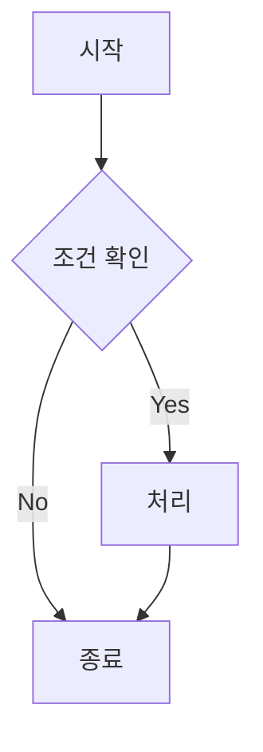
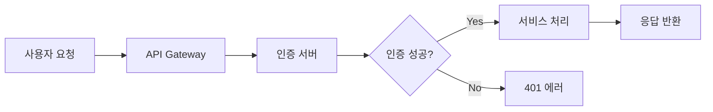
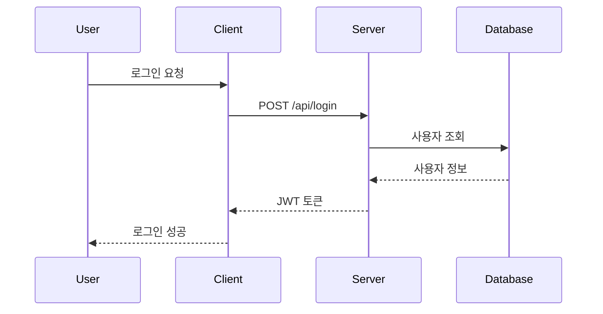
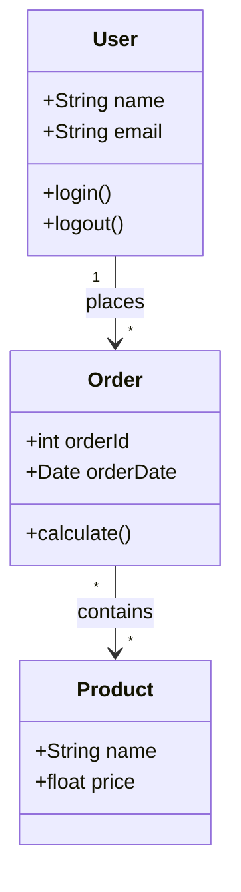
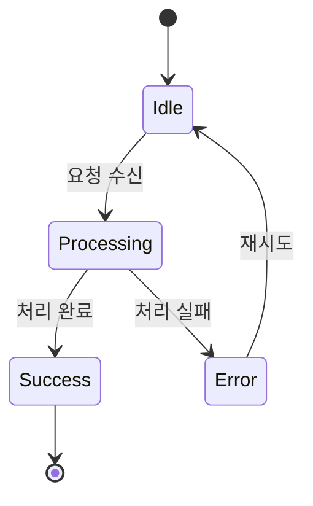
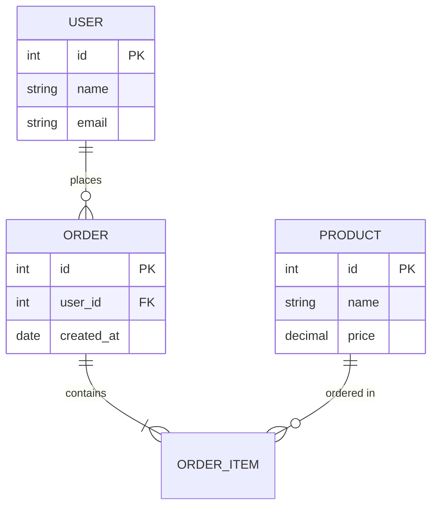
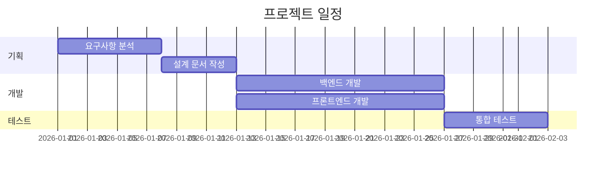
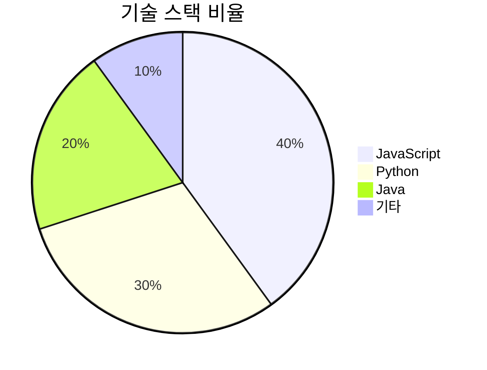

기술 블로그를 운영하다 보면 아키텍처, 플로우차트, 시퀀스 다이어그램 등을 그려야 할 때가 많습니다. 이미지 파일을 별도로 만들어 첨부하는 방식은 번거롭고 수정도 어렵습니다. Mermaid.js를 사용하면 마크다운 코드 블록 안에서 텍스트로 다이어그램을 정의하고, 이를 자동으로 렌더링할 수 있습니다.

## Mermaid란?

[Mermaid](https://mermaid.js.org/)는 텍스트 기반 다이어그램 생성 도구입니다. 마크다운과 유사한 문법으로 다양한 다이어그램을 만들 수 있습니다.

**지원하는 다이어그램 종류:**
- Flowchart (플로우차트)
- Sequence Diagram (시퀀스 다이어그램)
- Class Diagram (클래스 다이어그램)
- State Diagram (상태 다이어그램)
- Entity Relationship Diagram (ERD)
- Gantt Chart (간트 차트)
- Pie Chart (파이 차트)
- 그 외 다수

---

## Jekyll에 Mermaid 설정하기

### 1. head.html에 스크립트 추가

`_includes/head.html` 파일에 다음 코드를 추가합니다:

```html
<!-- Mermaid Diagram Support -->
<script type="module">
  import mermaid from 'https://cdn.jsdelivr.net/npm/mermaid@10/dist/mermaid.esm.min.mjs';
  mermaid.initialize({ startOnLoad: false });

  // Convert Jekyll code blocks to mermaid diagrams
  document.addEventListener('DOMContentLoaded', function() {
    document.querySelectorAll('pre code.language-mermaid, div.language-mermaid pre code').forEach(function(codeBlock) {
      const container = codeBlock.closest('div.language-mermaid') || codeBlock.parentElement;
      const pre = document.createElement('pre');
      pre.className = 'mermaid';
      pre.textContent = codeBlock.textContent;
      container.replaceWith(pre);
    });
    mermaid.run();
  });
</script>
```

이 스크립트는:
1. Mermaid 라이브러리를 CDN에서 로드합니다
2. Jekyll이 생성하는 코드 블록(`language-mermaid`)을 찾아 Mermaid가 인식할 수 있는 형태로 변환합니다
3. 페이지 로드 완료 후 다이어그램을 렌더링합니다

---

## 사용 방법

마크다운 파일에서 `mermaid` 코드 블록을 사용하면 됩니다:

````markdown

````

**결과:**


---

## 다이어그램 예제

### Flowchart (플로우차트)

방향 옵션: `TB` (위→아래), `BT` (아래→위), `LR` (왼쪽→오른쪽), `RL` (오른쪽→왼쪽)



**노드 모양:**
- `[텍스트]` - 사각형
- `(텍스트)` - 둥근 모서리
- `{텍스트}` - 마름모 (조건)
- `((텍스트))` - 원
- `[[텍스트]]` - 서브루틴

---

### Sequence Diagram (시퀀스 다이어그램)



**화살표 종류:**
- `->` : 실선
- `-->` : 점선
- `->>` : 실선 + 화살표
- `-->>` : 점선 + 화살표

---

### Class Diagram (클래스 다이어그램)



---

### State Diagram (상태 다이어그램)



---

### ERD (Entity Relationship Diagram)



---

### Gantt Chart (간트 차트)



---

### Pie Chart (파이 차트)



---

## 테마 설정

Mermaid는 다양한 테마를 지원합니다. `mermaid.initialize()`에서 설정할 수 있습니다:

```javascript
mermaid.initialize({
  startOnLoad: false,
  theme: 'dark'  // default, dark, forest, neutral
});
```

---

## 마무리

Mermaid를 사용하면 복잡한 다이어그램도 텍스트로 쉽게 작성할 수 있습니다. Git으로 버전 관리가 되고, 수정도 간편합니다. 기술 문서나 블로그 포스트에 적극 활용해보세요.

**참고 자료:**
- [Mermaid 공식 문서](https://mermaid.js.org/intro/)
- [Mermaid Live Editor](https://mermaid.live/) - 실시간 미리보기
