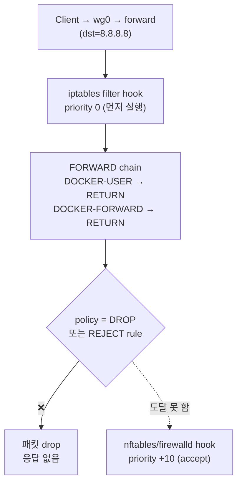
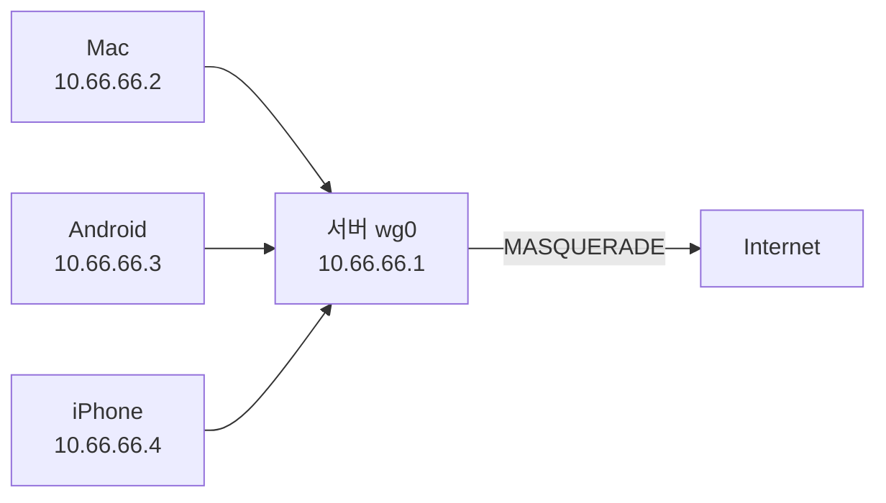

# 배경
해외에 있다보면, 국내에서만 접근 가능한 사이트들이 있는데,
VPN서비스들을 이용하자니, 개인 정보가 유출될 염려도 있어서,
가장 간단한 방법으로 VPN 구현

WireGuard 가 보안, 속도, 설치 난이도가 다른 VPN이나 proxy보다 쉬워서, 이걸로 진행

## WireGuard를 선택한 이유

| 비교 항목 | WireGuard | OpenVPN | IPSec |
|-----------|-----------|---------|-------|
| 코드 라인 수 | ~4,000줄 | ~100,000줄 | 복잡 |
| 속도 | 매우 빠름 | 보통 | 보통 |
| 설정 난이도 | 쉬움 | 보통 | 어려움 |
| 암호화 | 최신 (ChaCha20) | 선택 가능 | 선택 가능 |

WireGuard는 코드가 간결하여 보안 감사가 쉽고, 커널 레벨에서 동작하여 속도가 빠릅니다. 특히 모바일 환경에서 네트워크 전환(WiFi ↔ LTE) 시에도 연결이 끊기지 않는 점이 큰 장점입니다.

## 사전 준비

- AWS EC2 인스턴스 (한국 리전: ap-northeast-2)
- EC2 인스턴스에 SSH 접속 가능한 상태
- 인스턴스의 보안 그룹에서 UDP 포트를 열 수 있는 권한

EC2 인스턴스는 t2.micro (프리 티어)로도 충분합니다. VPN 트래픽은 CPU를 거의 사용하지 않습니다.

# WireGuard 설치 스크립트

```bash
curl -O https://raw.githubusercontent.com/angristan/wireguard-install/master/wireguard-install.sh

sudo bash ./wireguard-install.sh

```

위에 실행 했을 때, amazon linux2에서 안되면,
`wireguard-install.sh` 에서
`OS="${ID}"`를 `OS="centos"`로 변경
Amazon linux2가 `ID_LIKE="centos rhel fedora"` 로 centos 명령어도 작동하는 것으로 보임

### 설치 중 입력 항목

IPv4 or IPv6 public address: 입력할 때, 서버의 public ip를 입력할 것. 기본값으로 내부 ip가 설정됨

Server WireGuard port [1-65535]: 에서 입력한 포트를 security guard inbound에 UDP로 설정해줘야 함

Client name 은 형식 맞춰서 아무거나 입력해주면 됨

### AWS 보안 그룹 설정

설치 스크립트에서 입력한 포트를 EC2 보안 그룹의 인바운드 규칙에 추가해야 합니다:

- **유형**: 사용자 지정 UDP
- **포트 범위**: 설치 시 입력한 포트 번호
- **소스**: 0.0.0.0/0 (모든 IP에서 접속 허용)

이 설정을 빠뜨리면 클라이언트에서 VPN 서버에 연결할 수 없습니다.

## 클라이언트 추가

이미 설치된 서버에 클라이언트를 추가하려면 스크립트를 다시 실행합니다:

```bash
sudo bash ./wireguard-install.sh
```

메뉴에서 "Add a new client"를 선택하면 새로운 클라이언트 설정 파일이 생성됩니다. 디바이스마다 별도의 클라이언트를 만들어 사용하는 것이 보안상 좋습니다.

# 클라이언트용 설정 파일 예시 (Android용)

Android 디바이스에 WireGuard를 설치하고, `파일 또는 압축파일로 불러오기`로 추가해서, .conf파일을 추가한다.

.conf파일은 서버 환경 구축이 끝나면, 로그에
`Your client config file is in xxx.conf` 라고 찍히는데, 해당 파일을 다운 받아서, 추가해주면 됨.

대략 아래와 같은 형태
```
[Interface]
PrivateKey = (클라이언트의 개인키, client_private.key에서 복사)
Address = 10.0.0.2/32
DNS = 1.1.1.1

[Peer]
PublicKey = (서버의 공개키, server_public.key에서 복사)
Endpoint = (서버공인IP):(서버 설정시 port값)
AllowedIPs = 0.0.0.0/0
PersistentKeepalive = 25
```

### 설정 항목 설명

- **PrivateKey**: 클라이언트의 비밀키. 절대 외부에 공유하면 안 됩니다.
- **Address**: VPN 네트워크 내에서 이 클라이언트에 할당된 IP 주소
- **DNS**: VPN을 통해 사용할 DNS 서버 (1.1.1.1은 Cloudflare DNS)
- **AllowedIPs**: `0.0.0.0/0`은 모든 트래픽을 VPN으로 라우팅한다는 의미입니다. 특정 IP만 VPN으로 보내려면 해당 IP 대역을 지정합니다.
- **PersistentKeepalive**: NAT 뒤에 있는 클라이언트가 연결을 유지하기 위해 주기적으로 패킷을 보내는 간격(초)

## 다른 플랫폼에서 사용하기

WireGuard 클라이언트는 거의 모든 플랫폼에서 사용할 수 있습니다:

- **Android**: Google Play에서 WireGuard 앱 설치
- **iOS**: App Store에서 WireGuard 앱 설치
- **macOS**: App Store 또는 `brew install wireguard-tools`
- **Windows**: 공식 사이트에서 다운로드

모든 플랫폼에서 동일한 .conf 파일을 사용하거나 QR 코드로 설정을 가져올 수 있습니다.

## 트러블슈팅

### VPN 연결은 되지만 인터넷이 안될 때

서버에서 IP 포워딩이 활성화되어 있는지 확인합니다:

```bash
sudo sysctl net.ipv4.ip_forward
# 결과가 0이면 활성화 필요
sudo sysctl -w net.ipv4.ip_forward=1
```

### 속도가 느릴 때

EC2 인스턴스의 네트워크 대역폭이 인스턴스 유형에 따라 제한됩니다. t2.micro는 기본 대역폭이 낮으므로, 더 높은 속도가 필요하면 인스턴스 유형을 업그레이드하세요.

### 연결 상태 확인

```bash
sudo wg show
```

이 명령어로 연결된 클라이언트, 마지막 핸드셰이크 시간, 전송된 데이터량 등을 확인할 수 있습니다.

---

# Oracle Cloud (OCI) Free Tier에서 추가 설정

OCI Free Tier 인스턴스에서도 동일한 angristan 스크립트로 설치 가능하지만, EC2와 달리 **두 가지 OCI 특화 이슈**가 있어 추가 작업이 필요합니다. (Oracle Linux 9.7 기준)

## 1. Oracle Linux 9 — OS 감지 패치

angristan 스크립트는 `OS=oracle` 분기에서 EL8 전용 패키지(`oraclelinux-developer-release-el8`)를 설치하려고 하므로, **Oracle Linux 9에서는 패키지 설치 실패**로 중단됩니다.

EL9에서는 `wireguard-tools`가 main repo에 포함되어 있으므로, OS 감지를 centos로 강제하면 깔끔하게 설치됩니다.

`wireguard-install.sh`에서 해당 라인을 변경:

```bash
elif [[ -e /etc/oracle-release ]]; then
    source /etc/os-release
    OS=oracle    # ← 이 부분을 OS=centos 로 변경
```

또는 한 줄로:

```bash
sed -i 's/^\t\tOS=oracle$/\t\tOS=centos/' wireguard-install.sh
```

## 2. iptables FORWARD policy DROP 우회 (핵심)

OCI 환경에서 가장 흔히 막히는 부분입니다.

### 증상
- `sudo wg show`에서 핸드셰이크는 성공 (`latest handshake: N seconds ago`)
- 서버의 `received` 카운터는 증가하지만 `sent`는 거의 0 (예: `83 KiB received, 252 B sent`)
- 클라이언트에서 인터넷 접근 불가
- `ping <서버 VPN IP>` (예: 10.66.66.1)는 정상 (서버 자체 통신은 OK)
- `curl ifconfig.me`가 VPN을 거치지 않은 원래 ISP IP를 반환

### 원인

OCI 인스턴스의 **iptables FORWARD chain은 policy=DROP** 이고 (또는 Ubuntu 기반 인스턴스는 prebuilt `REJECT all -- anywhere anywhere reject-with icmp-host-prohibited` 규칙), Oracle Linux의 경우 docker가 깔아둔 FORWARD chain 끝의 DROP에 VPN forward 패킷이 걸려 사라집니다.

angristan이 EL 계열에서 생성한 `wg0.conf`의 PostUp은 `firewall-cmd` (nftables backend) 만 사용해서, iptables-legacy 차원의 DROP을 우회하지 못합니다.



`iptables -L FORWARD -n -v` 로 확인하면 policy DROP 카운터에 드롭된 패킷이 누적되어 있습니다:

```
Chain FORWARD (policy DROP 740 packets, 56306 bytes)   ← 누적된 drop 패킷
```

### 해결

`/etc/wireguard/wg0.conf`의 PostUp/PostDown 맨 앞에 **iptables -I FORWARD** (insert) 명령을 추가합니다. `-A` (append)가 아닌 **`-I` (insert)** 가 핵심 — FORWARD chain 맨 위에 ACCEPT 규칙이 들어가 docker/prebuilt rule보다 먼저 매칭됩니다.

```ini
PostUp = iptables -I FORWARD -i wg0 -j ACCEPT; iptables -I FORWARD -o wg0 -j ACCEPT; firewall-cmd --zone=public --add-interface=wg0 && firewall-cmd --add-port 51820/udp && firewall-cmd --add-rich-rule='rule family=ipv4 source address=10.66.66.0/24 masquerade' && firewall-cmd --add-rich-rule='rule family=ipv6 source address=fd42:42:42::0/24 masquerade'
PostDown = iptables -D FORWARD -i wg0 -j ACCEPT; iptables -D FORWARD -o wg0 -j ACCEPT; firewall-cmd --zone=public --add-interface=wg0 && firewall-cmd --remove-port 51820/udp && firewall-cmd --remove-rich-rule='rule family=ipv4 source address=10.66.66.0/24 masquerade' && firewall-cmd --remove-rich-rule='rule family=ipv6 source address=fd42:42:42::0/24 masquerade'
```

적용:

```bash
sudo wg-quick down wg0 && sudo wg-quick up wg0
```

확인 — `iptables -L FORWARD --line-numbers`에서 ACCEPT가 **맨 위 (#1, #2)** 에 있어야 합니다:

```
Chain FORWARD (policy DROP)
num   target  prot  in   out  source     destination
1     ACCEPT  all   *    wg0  0.0.0.0/0  0.0.0.0/0    ← 새로 insert됨
2     ACCEPT  all   wg0  *    0.0.0.0/0  0.0.0.0/0    ← 새로 insert됨
3     DOCKER-USER ...
4     DOCKER-FORWARD ...
```

## 3. OCI VCN Security List Ingress

EC2의 보안 그룹과 동일하게, OCI VCN의 **Security List**에 ingress 규칙을 추가합니다 (Console → Networking → VCN → Security List → Add Ingress Rules):

| 필드 | 값 |
|---|---|
| Source CIDR | 0.0.0.0/0 |
| IP Protocol | UDP |
| Destination Port Range | 51820 (또는 설치 시 입력한 포트) |

VCN egress는 기본 0.0.0.0/0 stateful로 모두 허용되므로 추가 작업 불필요.

## 검증

클라이언트에서 VPN 활성화 후:

```bash
curl -4 ifconfig.me
# → 서버 public IP가 출력되면 full tunnel 정상
```

서버에서 `wg show` 의 `received`/`sent` 가 **양쪽 모두 증가**하면 forward가 정상 작동합니다.

## 클라이언트 추가 (스마트폰 등)

여러 기기를 같이 사용하려면 **기기마다 별도 peer**를 등록해야 합니다. 같은 conf 파일을 여러 기기에 그대로 복사하면 같은 키/IP를 공유하게 되어 handshake가 서로 덮어쓰고 한 기기만 연결됩니다.

### 1) 스크립트로 새 클라이언트 추가

설치 시 사용한 `wireguard-install.sh` 를 다시 실행하면 메뉴가 뜹니다.

```bash
sudo ./wireguard-install.sh
# 1) Add a new user
# 2) List all users
# 3) Revoke existing user
# ...
```

`1` 선택 → 클라이언트 이름 입력 (예: `android`) → IPv4/IPv6 마지막 옥텟은 **기본값(다음 빈 번호)을 그대로 엔터**.

> **주의:** 이 단계는 **반드시 인터랙티브로** 실행해야 합니다. 스크립트가 `read -rp ... -e -i "default"` 로 기본값을 미리 채우는데, 이 readline 기능은 **파이프 입력(`printf ... | sudo ./script`)에서 작동하지 않습니다**. 파이프로 자동화하면 `DOT_IP` 가 빈 문자열이 되어 `AllowedIPs = 10.66.66./32` 같은 깨진 주소가 생성됩니다.

완료되면 클라이언트 conf 파일이 `/home/<user>/wg0-client-<name>.conf` 에 생성되고, `qrencode` 가 설치돼 있으면 터미널에 QR 코드도 자동 출력됩니다.

### 2) QR 코드로 스마트폰에 임포트

대부분의 Oracle Linux 9 환경에서는 `qrencode` 가 기본 EPEL에 있습니다.

```bash
sudo dnf --enablerepo=ol9_developer_EPEL install -y qrencode

# 터미널에 직접 QR 표시
qrencode -t ansiutf8 -l L < /home/opc/wg0-client-android.conf

# PNG 파일로 저장 (다른 화면에 띄워서 스캔할 때)
qrencode -t png -l L -s 10 -o ~/wg-android-qr.png < /home/opc/wg0-client-android.conf
```

스마트폰에서:

1. WireGuard 앱 설치 ([Android](https://play.google.com/store/apps/details?id=com.wireguard.android) / [iOS](https://apps.apple.com/app/wireguard/id1441195209))
2. **+** 버튼 → **"Scan from QR code"** 선택
3. 터미널의 QR 또는 PNG 이미지를 스캔
4. 터널 이름 저장 → 토글 ON

### 3) 다중 클라이언트 구성



`sudo wg show wg0 allowed-ips` 로 등록된 peer 목록과 할당 IP를 확인할 수 있습니다.

## 참고

- [angristan/wireguard-install Discussion #241 - Cannot make it work in Oracle Cloud VM](https://github.com/angristan/wireguard-install/discussions/241)

끝~!