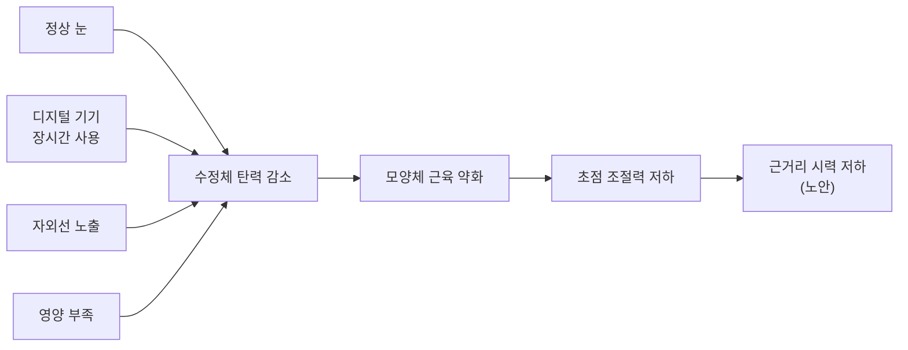
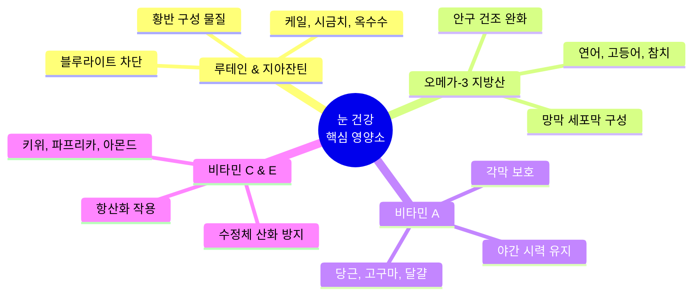
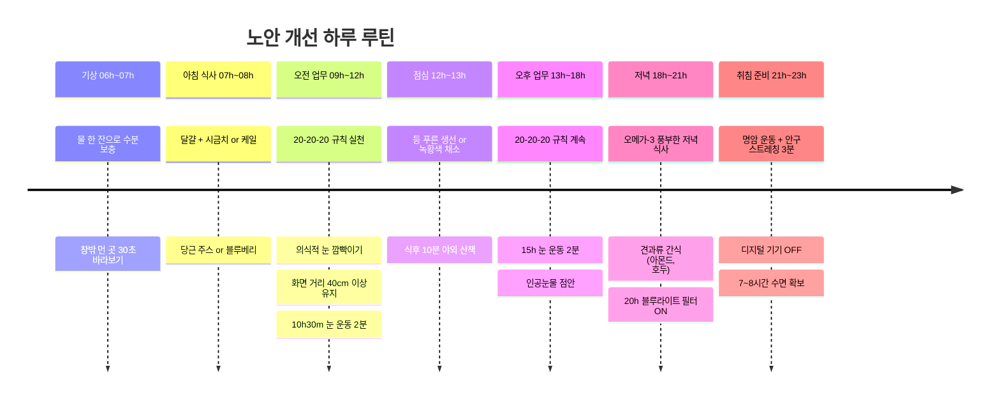

40대부터 찾아오던 노안이 디지털 기기 사용 증가로 30대에도 나타나고 있습니다. 노안은 수정체가 딱딱해지면서 탄력을 잃어 초점 조절 능력이 떨어지는 현상입니다. 완전한 예방은 불가능하지만, **진행을 늦추고 눈 건강을 유지하는 방법**은 분명히 존재합니다.

---

## 노안이란?

노안(presbyopia)은 나이가 들면서 눈 안의 **수정체가 경화**되고, 수정체를 조절하는 **모양체 근육(ciliary muscle)의 탄력이 감소**하면서 가까운 곳의 초점이 잘 맞지 않게 되는 현상입니다.

**가속 요인**으로는 장시간 디지털 기기 사용, 자외선 노출, 영양 불균형, 흡연, 스트레스 등이 있습니다.

---

## 1. 눈 운동법

눈 운동만으로 노안을 치료할 수는 없지만, **눈 근육의 유연성 유지**와 **안구 피로 해소**에 도움이 됩니다. 하루 3~5분이면 충분합니다.

### 근거리-원거리 교대 운동 (가장 효과적)

모양체 근육의 조절력을 유지하는 핵심 운동입니다.

1. 엄지손가락이나 펜을 **눈앞 30cm**에 놓고 **10초간 응시**
2. 시선을 **5m 이상 먼 곳**으로 옮겨 **10초간 응시**
3. 이를 **1분간 반복** (총 3세트)

**원리**: 가까운 곳을 볼 때 수정체가 두꺼워지고, 먼 곳을 볼 때 얇아지는 과정을 반복하면서 모양체 근육을 스트레칭하는 효과가 있습니다.

### 의식적 눈 깜빡이기

디지털 기기를 볼 때 눈 깜빡임 횟수가 평소의 **1/3로 감소**합니다. 이로 인해 안구 건조가 심해지고, 건조한 눈은 노안 증상을 악화시킵니다.

1. **4초에 1번씩** 눈을 꼭 감았다 뜬다
2. 총 **15회 이상** 반복
3. 눈물샘을 자극하여 눈물 공급을 원활하게 한다

### 명암 운동

1. 밝은 곳에서 눈을 뜬 채로 **양손으로 눈을 가리고 10초** 유지
2. 손을 떼고 **정면을 10초** 응시
3. **1분간 반복**

홍채 근육을 이완시키고 눈의 피로를 풀어주는 효과가 있습니다.

### 안구 스트레칭

1. 눈을 **위-아래-좌-우** 순서로 천천히 움직인다 (각 3초)
2. **시계 방향**으로 크게 원을 그린다 (3회)
3. **반시계 방향**으로 크게 원을 그린다 (3회)

---

## 2. 눈 건강에 좋은 영양소와 음식

올바른 식습관은 눈 노화를 **최대 25%까지 늦출 수 있다**는 연구 결과가 있습니다.

### 핵심 영양소 4가지

#### 루테인 & 지아잔틴

눈의 **황반을 구성하는 핵심 색소**입니다. 블루라이트와 자외선으로부터 망막을 보호합니다. 체내에서 합성되지 않으므로 **반드시 음식이나 보충제로 섭취**해야 합니다.

| 식품 | 루테인 함량 (100g당) |
|------|---------------------|
| 케일 | 39.5mg |
| 시금치 | 12.2mg |
| 브로콜리 | 1.4mg |
| 옥수수 | 1.8mg |
| 달걀 노른자 | 1.1mg |

**권장 섭취량**: 하루 10~20mg

#### 오메가-3 지방산

망막 세포막의 주요 구성 성분이며, **안구 건조증 완화**에 효과적입니다. 노안의 속도를 늦추는 데 도움을 줍니다.

**추천 식품**: 연어, 고등어, 참치, 정어리, 아마씨, 호두

#### 비타민 A (베타카로틴)

빛을 감지하는 **로돕신(rhodopsin)** 생성에 필수적입니다. 부족하면 야맹증이 발생합니다.

**추천 식품**: 당근, 고구마, 호박, 달걀, 간

#### 비타민 C & E + 아연

강력한 **항산화 작용**으로 수정체의 산화적 손상을 방지합니다. 아연은 비타민 A를 간에서 망막으로 운반하는 역할을 합니다.

**추천 식품**: 키위, 파프리카, 딸기 (비타민 C) / 아몬드, 해바라기씨 (비타민 E) / 굴, 소고기 (아연)

#### 안토시아닌

눈의 **활성산소를 제거**하여 노안을 늦추고 시력 저하를 방지합니다.

**추천 식품**: 블루베리, 빌베리, 아사이베리, 검은콩

### 눈에 해로운 식습관

- **과도한 설탕 섭취**: 혈당 급등이 수정체 손상을 가속화
- **과음**: 비타민 B 흡수를 방해하여 시신경 손상 유발
- **가공식품 위주 식단**: 항산화 영양소 부족

---

## 3. 생활습관 개선

### 20-20-20 규칙

디지털 기기를 사용할 때 가장 실천하기 쉬운 규칙입니다.

> **20분**마다 **20피트(약 6m)** 떨어진 곳을 **20초간** 바라본다.

이 간단한 습관만으로 안구 피로를 크게 줄일 수 있습니다.

### 자외선 차단

자외선(UV)은 수정체의 단백질 변성을 촉진하여 **노안을 가속화**합니다.

- 외출 시 **UV 차단 선글라스** 착용 (UV400 이상)
- 흐린 날에도 자외선은 존재하므로 선글라스 습관화
- 모자 착용으로 추가 차단

### 수분 섭취

안구 건조는 노안 증상을 **악화**시킵니다. 충분한 수분 섭취로 눈물막을 건강하게 유지하세요.

- 하루 **1.5~2L** 물 섭취
- 건조한 환경에서는 **인공눈물** 사용

### 금연

흡연은 수정체와 망막의 혈액 공급을 감소시키고 산화 스트레스를 증가시켜 노안을 포함한 **모든 눈 질환의 위험을 높입니다**.

### 충분한 수면

수면 중 눈의 근육이 완전히 이완되고 세포 재생이 일어납니다. **7~8시간** 수면을 권장합니다.

### 디지털 기기 사용 습관

- 화면과 눈 사이 거리 **40~70cm** 유지
- 화면 밝기를 주변 환경과 비슷하게 조절
- **블루라이트 필터** 활용 (야간 모드)
- 1시간 사용 후 **5~10분 휴식**

---

## 4. 정기 검진

노안은 서서히 진행되기 때문에 본인이 자각하지 못하는 경우가 많습니다.

- **40세 이상**: 1~2년마다 안과 정기 검진
- 교정 렌즈(안경, 콘택트렌즈) 도수를 최신 상태로 유지
- 녹내장, 백내장 등 동반 질환 조기 발견

---

## 노안 개선 데일리 패턴

하루 전체를 시간대별로 구성한 눈 건강 루틴입니다. 한꺼번에 다 하려 하지 말고, **하나씩 습관으로 만드는 것**이 핵심입니다.

### 기상 (06h~07h)

| 실천 항목 | 소요 시간 | 효과 |
|-----------|-----------|------|
| 물 한 잔 (200ml) | 즉시 | 안구 건조 예방, 눈물막 유지 |
| 창밖 먼 곳 바라보기 | 30초 | 수면 중 수축된 모양체 근육 이완 |

### 아침 식사 (07h~08h)

루테인과 비타민 A를 아침에 섭취하면 **지용성 영양소의 흡수율이 높아집니다**.

- **추천 조합 A**: 달걀 프라이 + 시금치 샐러드 + 당근 주스
- **추천 조합 B**: 오트밀 + 블루베리 + 호두
- **추천 조합 C**: 토스트 + 아보카도 + 달걀

### 오전 업무 (09h~12h)

디지털 기기 사용이 집중되는 시간입니다.

- **20-20-20 규칙**: 20분마다 6m 먼 곳을 20초간 응시
- **10h30m 눈 운동**: 근거리-원거리 교대 운동 2분
- 모니터 상단이 **눈높이와 같거나 약간 아래**에 위치하도록 조절
- 의식적으로 **4초에 1번** 눈 깜빡이기

### 점심 (12h~13h)

- **등 푸른 생선** (고등어, 연어, 참치) 또는 **녹황색 채소** 위주 식사
- 식후 **야외 산책 10분** — 먼 곳을 바라보며 눈 근육 이완 + 자연광 노출

### 오후 업무 (13h~18h)

오후는 눈 피로가 누적되는 시간대입니다.

- **15h 눈 운동**: 안구 스트레칭 + 근거리-원거리 교대 운동 2분
- **인공눈물 점안**: 건조함을 느끼기 전에 선제적으로 사용
- 오후에 졸리거나 눈이 뻑뻑하면 **명암 운동** 1분 (양손으로 눈 가리기 → 뜨기 반복)

### 저녁 (18h~21h)

- **오메가-3 식품** 섭취 (연어, 고등어, 아마씨)
- 간식으로 **아몬드, 호두** (비타민 E + 오메가-3)
- **20h부터 블루라이트 필터** 켜기 — 취침 3시간 전부터 청색광 차단

### 취침 준비 (21h~23h)

- **눈 운동 마무리** (3분): 명암 운동 → 안구 스트레칭 → 눈 감고 이완
- 취침 **1시간 전 디지털 기기 OFF**
- **7~8시간 수면** 확보 — 수면 중 눈 근육이 완전히 이완되고 세포 재생

### 외출 시 (상시)

- **UV400 선글라스** 착용 (흐린 날에도)
- **챙 넓은 모자** 착용으로 추가 자외선 차단

---

## 정리

노안은 노화의 자연스러운 과정이지만, **데일리 패턴을 통해 진행을 의미 있게 늦출 수 있습니다**.

- **눈 운동**: 오전 10h30m, 오후 15h, 취침 전 — 하루 3회, 총 7분
- **영양**: 아침에 루테인/비타민 A, 점심에 오메가-3, 저녁에 항산화 영양소
- **20-20-20 규칙**: 업무 중 상시 실천
- **블루라이트 차단**: 20h 이후 필터 ON, 취침 1시간 전 기기 OFF
- **정기 검진**: 40세 이상은 1~2년마다 안과 방문

완벽하게 지키려 하지 말고, **가장 쉬운 것 하나부터** 시작하세요.
