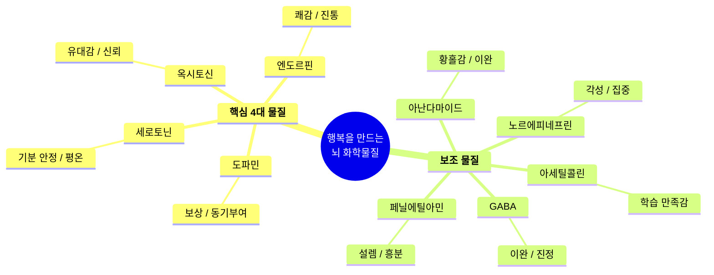
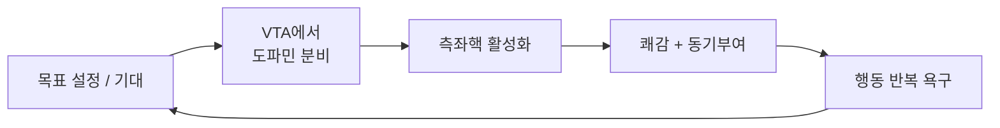
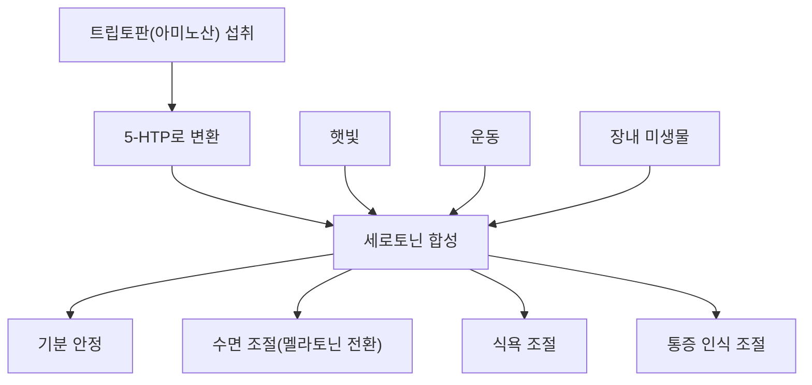
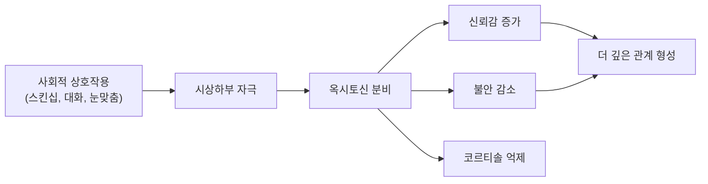
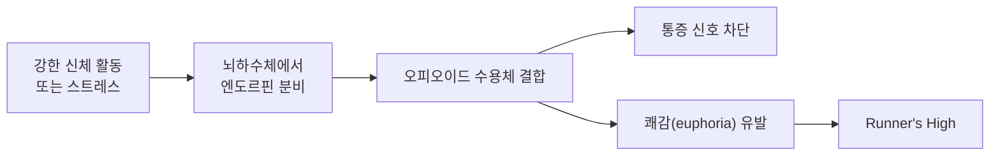
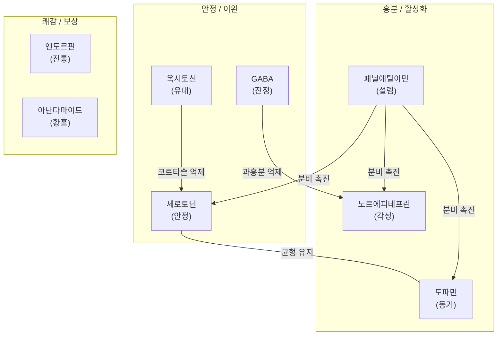
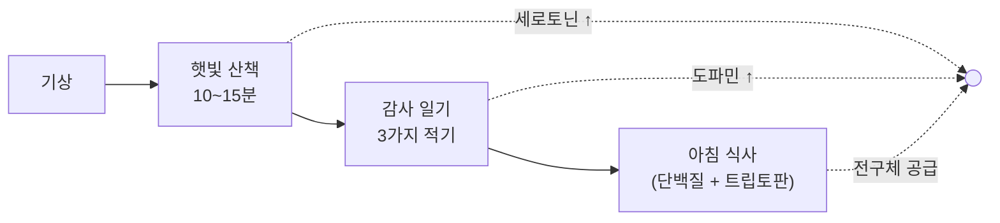
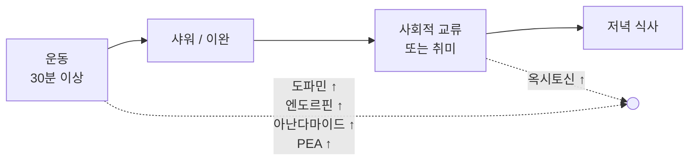
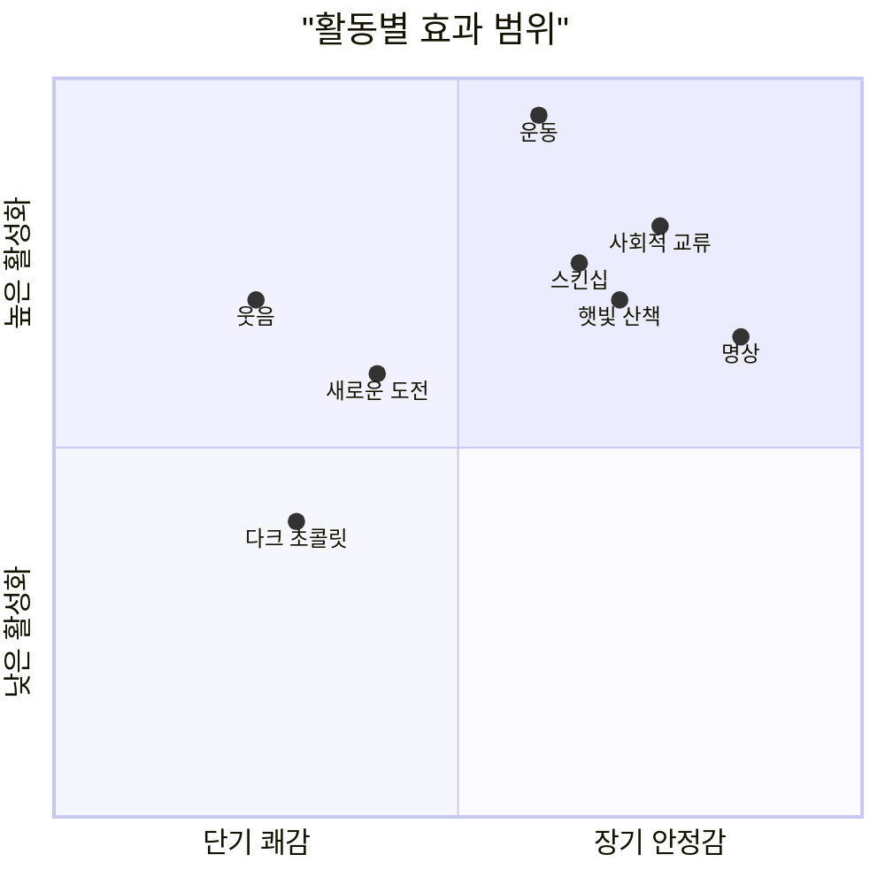

우리가 느끼는 행복감은 막연한 감정이 아니라, 뇌에서 분비되는 **신경전달물질과 호르몬**이 만들어내는 화학적 반응입니다. 이 물질들이 어떻게 작동하는지 이해하면, 의도적으로 행복감을 높이는 생활 습관을 설계할 수 있습니다.

---

## 행복 물질 전체 구조

---

## 핵심 4대 행복 물질

### 1. 도파민 (Dopamine) — 보상과 동기부여의 엔진

#### 기전

도파민은 뇌의 **보상 회로(reward circuit)**에서 핵심적인 역할을 합니다. 중뇌의 복측피개영역(VTA)에서 생성되어 측좌핵(nucleus accumbens)과 전전두엽 피질로 전달됩니다.

핵심은 도파민이 **결과보다 기대**에 더 강하게 반응한다는 점입니다. 목표를 향해 나아가는 과정 자체가 도파민을 분비시키며, 달성 순간의 쾌감은 오히려 짧습니다.

#### 늘리는 방법

| 방법 | 원리 | 실천 예시 |
|------|------|-----------|
| **작은 목표 달성** | 목표 완수 시 보상 회로 활성화 | 할 일 목록 작성 후 하나씩 체크 |
| **새로운 경험** | 신선한 자극이 도파민 분비 촉진 | 새로운 요리, 다른 출근 경로 |
| **운동** | 혈류 증가로 도파민 생성 촉진 | 유산소 운동 30분 |
| **음악 감상** | 기대-보상 패턴이 도파민 자극 | 좋아하는 음악 듣기 |
| **단백질 섭취** | 티로신(도파민 전구체) 공급 | 계란, 생선, 콩류 |

---

### 2. 세로토닌 (Serotonin) — 마음의 안정제

#### 기전

세로토닌의 약 **90%는 장에서** 생성되고, 나머지가 뇌의 봉선핵(raphe nuclei)에서 만들어집니다. 뇌 전반에 걸쳐 작용하며, **기분 조절, 수면, 식욕, 체온** 등을 안정화합니다.

세로토닌이 부족하면 우울감, 불안, 불면증이 나타나며, 대부분의 항우울제(SSRI)가 세로토닌 재흡수를 차단하여 농도를 높이는 원리로 작동합니다.

#### 늘리는 방법

| 방법 | 원리 | 실천 예시 |
|------|------|-----------|
| **아침 햇빛** | 망막을 통한 빛 자극이 세로토닌 합성 촉진 | 기상 후 10~15분 야외 산책 |
| **규칙적 운동** | 트립토판의 뇌 유입 증가 | 주 5회 30분 유산소 |
| **트립토판 식품** | 세로토닌 전구체 직접 공급 | 바나나, 견과류, 칠면조, 우유 |
| **장 건강 관리** | 장내 세로토닌 생성 환경 개선 | 발효식품, 프로바이오틱스 |
| **명상** | 스트레스 호르몬 감소 → 세로토닌 안정화 | 하루 10분 호흡 명상 |

---

### 3. 옥시토신 (Oxytocin) — 사랑과 유대의 호르몬

#### 기전

시상하부에서 생성되어 뇌하수체 후엽을 통해 분비됩니다. **사회적 유대, 신뢰, 공감**을 촉진하며, 스트레스 호르몬인 코르티솔을 억제하는 효과도 있습니다.

옥시토신의 특징은 **양방향 피드백**입니다. 유대감을 느끼면 옥시토신이 분비되고, 옥시토신이 분비되면 더 유대감을 느끼게 되는 선순환 구조입니다.

#### 늘리는 방법

| 방법 | 원리 | 실천 예시 |
|------|------|-----------|
| **스킨십** | 피부 감각 수용체가 옥시토신 분비 촉진 | 포옹, 손잡기, 마사지 |
| **눈맞춤 대화** | 사회적 신호가 시상하부 자극 | 소중한 사람과 깊은 대화 |
| **반려동물** | 동물과의 상호작용도 옥시토신 증가 | 반려동물 쓰다듬기 |
| **선행** | 이타적 행동이 옥시토신 분비 촉진 | 작은 친절, 봉사활동 |
| **함께 식사** | 공동 활동이 사회적 유대 강화 | 가족/친구와 함께 밥 먹기 |

---

### 4. 엔도르핀 (Endorphin) — 천연 진통제이자 쾌감의 원천

#### 기전

이름 자체가 **"endo(체내) + morphine(모르핀)"**의 합성어입니다. 뇌하수체와 시상하부에서 분비되며, 오피오이드 수용체에 결합하여 **통증 신호를 차단**하고 쾌감을 유발합니다.

**러너스 하이(Runner's High)**가 대표적인 엔도르핀 효과입니다. 도파민이나 세로토닌과 달리, 엔도르핀은 **짧고 강렬한** 쾌감을 제공합니다.

#### 늘리는 방법

| 방법 | 원리 | 실천 예시 |
|------|------|-----------|
| **고강도 운동** | 신체적 스트레스가 엔도르핀 방출 트리거 | HIIT, 달리기, 수영 |
| **웃음** | 횡격막 운동이 엔도르핀 분비 자극 | 코미디 시청, 유머 공유 |
| **매운 음식** | 캡사이신 통증 → 엔도르핀 방어 반응 | 적당히 매운 음식 |
| **다크 초콜릿** | 카카오 성분이 엔도르핀 분비 촉진 | 카카오 70% 이상 초콜릿 |
| **아로마테라피** | 후각 자극이 뇌 보상 영역 활성화 | 라벤더, 바닐라 향 |

---

## 보조 행복 물질 5가지

### 5. GABA — 뇌의 브레이크

**억제성** 신경전달물질로, 과도하게 흥분한 신경세포를 진정시킵니다. 불안, 스트레스, 공포를 줄이는 데 핵심적인 역할을 합니다.

- **늘리는 방법**: 요가, 명상, 발효식품(김치, 된장), 마그네슘 섭취

### 6. 노르에피네프린 — 각성과 집중의 스위치

적절한 수준일 때 **활력, 집중력, 에너지**를 제공합니다. 과하면 불안, 부족하면 무기력으로 이어집니다.

- **늘리는 방법**: 적절한 스트레스(도전적 과제), 충분한 수면, 유산소 운동

### 7. 아난다마이드 (Anandamide) — 지복의 분자

산스크리트어 "아난다(ananda, 지복)"에서 유래한 이름처럼, 내인성 카나비노이드 수용체에 결합하여 **황홀감과 이완**을 유발합니다.

- **늘리는 방법**: 유산소 운동(러너스 하이에 기여), 다크 초콜릿, 트러플 오일

### 8. 페닐에틸아민 (PEA) — 설렘의 물질

도파민, 세로토닌, 노르에피네프린의 분비를 동시에 촉진하여 **연애 초기의 설렘과 흥분감**을 만들어냅니다. 러너스 하이의 기분 고양 효과에도 관여합니다.

- **늘리는 방법**: 고강도 운동, 다크 초콜릿, 새로운 경험

### 9. 아세틸콜린 — 학습의 쾌감

학습과 기억의 핵심 신경전달물질로, 무언가를 **이해하거나 깨달을 때 느끼는 만족감**에 기여합니다.

- **늘리는 방법**: 새로운 것 배우기, 독서, 퍼즐/두뇌 게임, 콜린 함유 식품(계란)

---

## 물질 간 상호작용

행복 물질들은 독립적으로 작동하지 않고, 서로 **촉진하거나 균형을 잡는** 네트워크를 형성합니다.

**핵심 포인트**: 운동 한 가지만으로도 도파민, 세로토닌, 엔도르핀, 아난다마이드, 페닐에틸아민까지 동시에 활성화됩니다. 가장 효율적인 행복 물질 부스터입니다.

---

## 매일 행복감을 느끼는 루틴

아래 루틴은 **9가지 행복 물질을 골고루 활성화**하도록 설계했습니다. 모든 항목을 완벽하게 할 필요는 없고, 자신에게 맞는 것부터 하나씩 시작하면 됩니다.

### 아침 루틴 (기상 후 1~2시간)

| 시간 | 활동 | 활성화 물질 | 설명 |
|------|------|-------------|------|
| 기상 직후 | **아침 햇빛 산책 10~15분** | 세로토닌 | 망막에 빛이 들어오면 봉선핵이 세로토닌 합성 시작. 체내 시계도 리셋 |
| 산책 중 | **감사한 것 3가지 떠올리기** | 도파민, 세로토닌 | 긍정적 사고가 보상 회로를 부드럽게 활성화 |
| 아침 식사 | **계란 + 바나나 + 견과류** | 전구체 공급 | 티로신#40;도파민#41;, 트립토판#40;세로토닌#41;, 콜린#40;아세틸콜린#41; 원료 |

### 오전 루틴 (집중 시간)

| 시간 | 활동 | 활성화 물질 | 설명 |
|------|------|-------------|------|
| 오전 업무 | **도전적 과제 1개 설정 후 집중** | 도파민, 노르에피네프린 | 달성 가능한 도전이 보상 회로와 각성 시스템을 동시 자극 |
| 중간 휴식 | **5분 스트레칭 + 깊은 호흡** | GABA, 세로토닌 | 교감신경 진정, 부교감신경 활성화 |

### 점심 루틴

| 시간 | 활동 | 활성화 물질 | 설명 |
|------|------|-------------|------|
| 점심 | **동료/친구와 함께 식사** | 옥시토신 | 사회적 교류 + 함께 먹는 행위가 유대감 호르몬 촉진 |
| 식후 | **10분 가벼운 산책** | 세로토닌, 도파민 | 소화 촉진 + 오후 졸림 방지 + 햇빛 추가 노출 |

### 오후 ~ 저녁 루틴

| 시간 | 활동 | 활성화 물질 | 설명 |
|------|------|-------------|------|
| 오후 | **유산소 운동 30분 이상** | 엔도르핀, 도파민, 세로토닌, 아난다마이드, PEA | 가장 강력한 행복 부스터. 중~고강도가 효과적 |
| 운동 후 | **따뜻한 샤워** | 엔도르핀, 옥시토신 | 근육 이완 + 자기 돌봄 효과 |
| 저녁 전 | **소중한 사람과 대화 또는 취미 활동** | 옥시토신, 도파민 | 유대감 + 새로운 즐거움 |
| 저녁 식사 | **발효식품 포함 균형 잡힌 식사** | 세로토닌#40;장건강#41;, GABA | 김치, 된장 등이 장내 미생물 환경 개선 |

### 밤 루틴 (취침 1~2시간 전)

| 시간 | 활동 | 활성화 물질 | 설명 |
|------|------|-------------|------|
| 취침 2시간 전 | **다크 초콜릿 1~2조각** | 엔도르핀, 아난다마이드, PEA | 카카오 70% 이상. 소량으로 충분 |
| 취침 1시간 전 | **독서 또는 새로운 것 배우기** | 아세틸콜린, 도파민 | "아하!" 순간이 학습 쾌감을 제공 |
| 취침 30분 전 | **10분 명상 또는 호흡법** | GABA, 세로토닌 | 하루의 스트레스 해소, 수면 질 향상 |
| 취침 전 | **가족에게 포옹/스킨십** | 옥시토신 | 하루를 따뜻하게 마무리 |

---

## 주간 보너스 활동

매일 하기 어렵지만 **주 1~2회** 추가하면 효과가 큰 활동들입니다.

| 활동 | 활성화 물질 | 빈도 |
|------|-------------|------|
| **봉사활동 / 선행** | 옥시토신, 세로토닌 | 주 1회 |
| **새로운 레시피 도전** | 도파민, 아세틸콜린 | 주 1~2회 |
| **코미디 영화 / 개그 콘텐츠** | 엔도르핀 | 주 2~3회 |
| **자연 속 하이킹** | 전체 물질 활성화 | 주 1회 |
| **마사지 받기** | 옥시토신, 엔도르핀, GABA | 격주 1회 |

---

## 활동별 행복 물질 활성화 요약

---

## 핵심 정리

행복은 운에 맡기는 것이 아니라, **뇌의 화학적 시스템을 이해하고 의도적으로 활성화**하는 것입니다.

1. **운동**이 가장 강력한 행복 부스터입니다 — 5가지 이상의 행복 물질을 동시에 활성화합니다
2. **아침 햇빛**은 하루의 세로토닌 기반을 만들어줍니다
3. **사회적 연결**은 옥시토신을 통해 지속적인 안정감을 제공합니다
4. **균형 잡힌 식단**이 행복 물질의 원료를 공급합니다
5. 완벽한 루틴보다 **꾸준한 작은 실천**이 중요합니다

오늘부터 아침 산책 10분, 하루 한 번 웃기, 소중한 사람 안아주기 — 이 세 가지만 시작해보세요.
