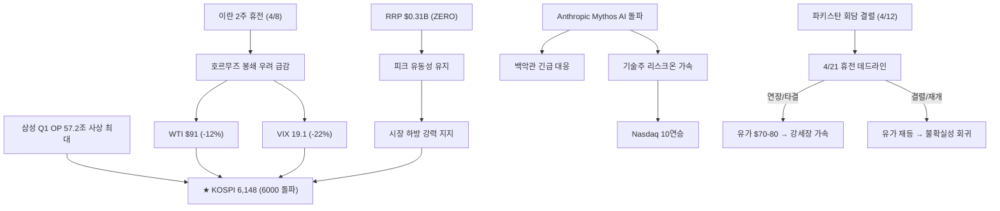
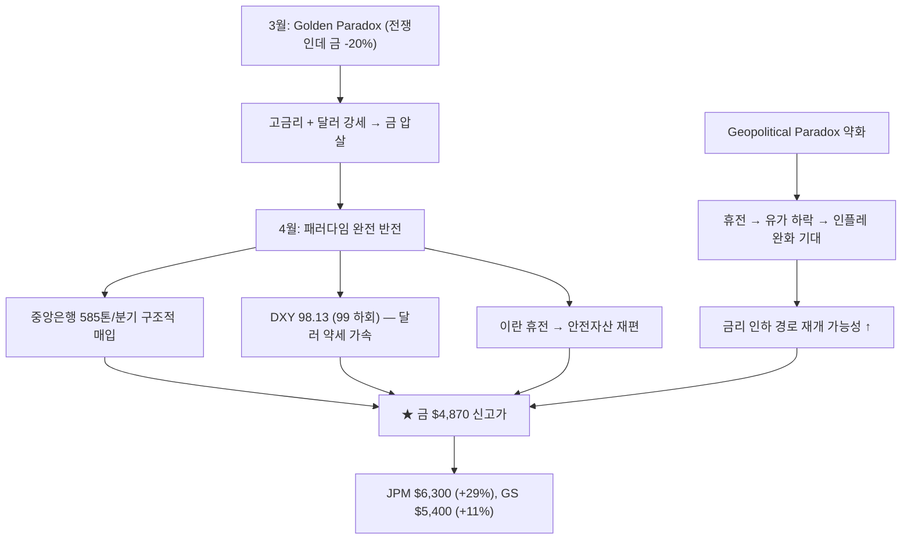
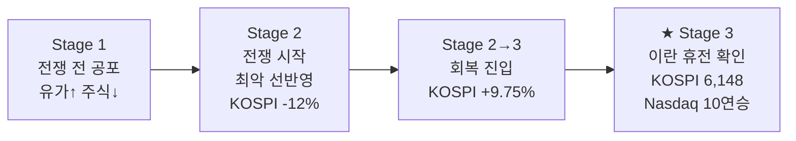
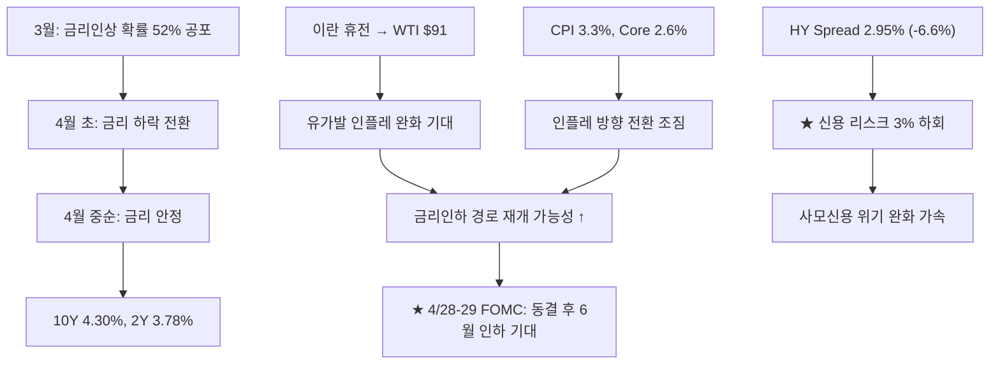
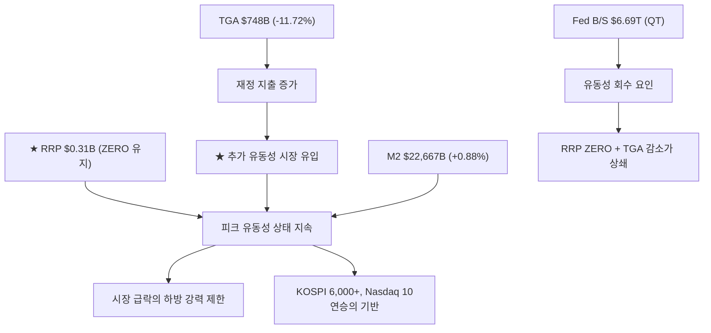
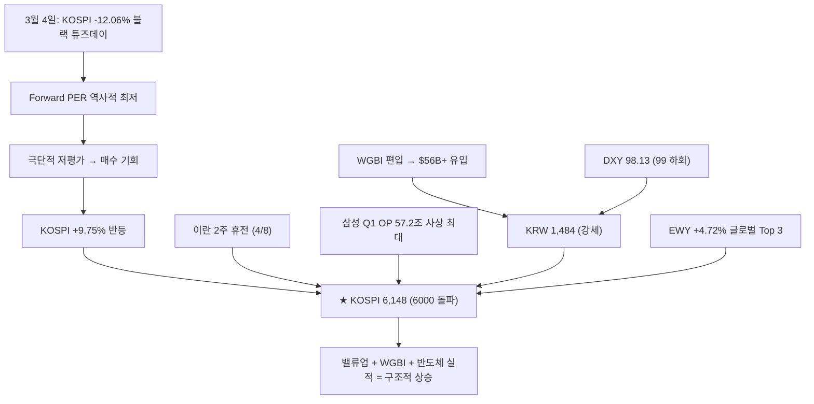
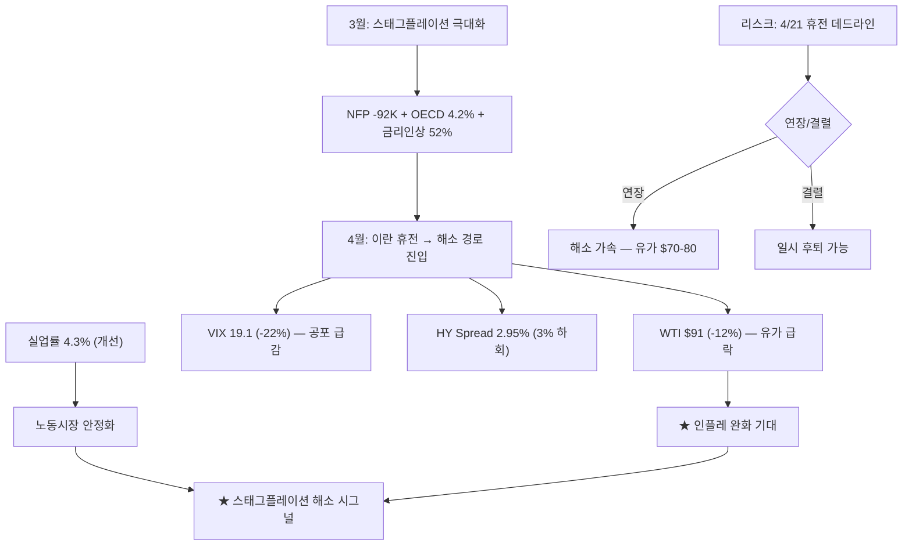
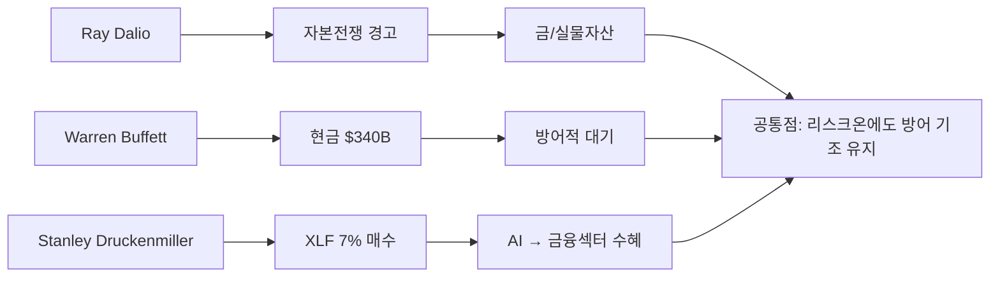
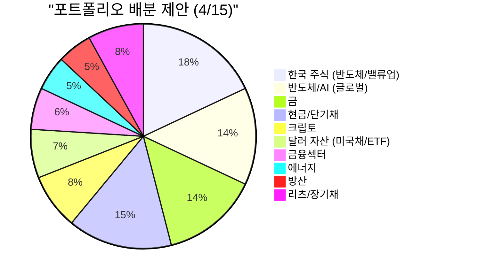

> **관련 글**: [2026년 투자 섹터 전망 (전체)](/knowledge/invest/2026/01/20/investment-sectors-outlook-2026.html)

2026년 4월 15일(화) 기준 업데이트입니다. **핵심 테마는 이란 2주 휴전(4/8) → 유가 급락 → 글로벌 리스크온 폭발 + KOSPI 사상 첫 6,000 돌파 + Anthropic Mythos AI 돌파**입니다. **4월 21일 휴전 데드라인(연장 여부)**이 다음 분기점입니다.

이란이 4/8 미국 중재 하에 2주 휴전에 합의하면서 호르무즈 해협 봉쇄 우려가 급격히 완화되었습니다. WTI **$91.28(-12%)**로 급락, VIX **19.12**(24.5→19.1), DXY **98.13**(100→98, 99 하회). KOSPI **6,148.71**로 사상 첫 6,000 돌파(반도체 주도). 삼성 Q1 OP **57.2조**(4/8 사상 최대). Nasdaq **10일 연속 상승**. 그러나 파키스탄 회담 결렬(4/12), **4/21 휴전 데드라인** 전 중재자들이 재개 시도 중.

Anthropic **Mythos** AI가 모든 벤치마크를 압도하며 백악관 긴급 대응을 촉발. 금 **$4,870.50** 신고가. **RRP $0.31B**로 여전히 ZERO 수준 — **피크 유동성** 지속. HY스프레드 **2.95%**로 개선 가속.

<strong>이전 요약 (4월 3일 기준)</strong>

2026년 4월 3일(목) 기준 업데이트입니다. 핵심 테마는 트럼프 에스컬레이션("석기시대") + TurboQuant 반도체 충격 + Good Friday 휴장 → 주말 불확실성 확대. 4월 6일 호르무즈 데드라인이 바이너리 리스크로 남아 있었습니다.

트럼프가 전국민 연설에서 "이란을 석기시대로 보낼 것" 선언. 유가 Brent $105.58(-6.2%), WTI $103.36(-1.3%). TurboQuant 충격으로 삼성 -5.91%, SK하이닉스 -6.83% 급락. RRP $0.33B, VIX 24.54, HY스프레드 3.16%.

## 시장 현황 (2026년 4월 15일 기준)

### 핵심 매크로 지표

| 항목 | 현황 | 변동/방향 |
|------|------|-----------|
| **★ Fed 금리** | **3.50-3.75% 동결 (3.64%)** | **4/28-29 FOMC 동결 전망. 인하 기대 약화** |
| **★ 10Y 국채** | **4.30%** | **-0.07% — 소폭 하락 (4.33→4.30)** |
| **★ 2Y 국채** | **3.78%** | **-0.08% — 소폭 하락 (3.81→3.78)** |
| **★ 10Y-2Y 스프레드** | **0.50%** | **정상적 스티프닝 유지 (0.52→0.50)** |
| **★ VIX** | **19.12** | **-22.1% — 공포 급감 (24.54→19.12)** |
| **★ HY Spread** | **2.95%** | **-6.6% — 신용 리스크 완화 가속 (3.16→2.95)** |
| **CPI (3월)** | **330.293 (3.3% YoY)** | **인플레 소폭 상승** |
| **Core CPI (3월)** | **334.165 (2.6% YoY)** | **핵심 물가 안정화 조짐** |
| **5Y Breakeven** | **2.59%** | **+0.78% — 유가발 인플레 기대 소폭 상승** |
| **실업률** | **4.3%** | **-2.3% — 노동시장 개선 (4.4→4.3)** |
| **Nonfarm Payrolls** | **158,637K (+178K)** | **고용 견조** |
| **Initial Claims** | **219K** | **+17K — 소폭 악화 (202→219)** |

### 자산가격

| 항목 | 현황 | 변동 |
|------|------|------|
| **★ S&P 500** | **6,967.38** | **+1.18% — Nasdaq 10연승** |
| **★ 금(Gold)** | **$4,870.50/oz** | **+2.70%, 1W +2.52% — 신고가** |
| **★ KOSPI** | **6,148.71** | **★ 사상 첫 6,000 돌파 (5,529→6,148)** |
| **★ DXY** | **98.13** | **1W -1.01% — 99 하회, 달러 약세 가속 (100→98)** |
| **★ WTI** | **$91.28** | **-12% — 휴전 기대로 급락 (103→91)** |
| **★ 비트코인** | **$74,660** | **+12.1% — 강세 반등 (66,606→74,660)** |
| **★ USD/KRW** | **1,483.9** | **KRW 강세 (1,510→1,484), WGBI 효과** |

### ★ 글로벌 자금 흐름: EM·아시아 주도 리스크온

| 지역/자산 | 1W 수익률 | 방향 |
|----------|-----------|------|
| **★ Brazil (EWZ)** | **+5.49%** | **글로벌 최고** |
| **★ Taiwan (EWT)** | **+5.04%** | 반도체 강세 |
| **★ Korea (EWY)** | **+4.72%** | **KOSPI 6,000 돌파, 반도체 주도** |
| **EM (EEM)** | **+2.98%** | EM 강세 |
| **US (SPY)** | **+2.73%** | Nasdaq 10연승 |
| **Europe (VGK)** | **+1.88%** | 유럽 안정 |
| **China (FXI)** | **+1.49%** | 소폭 반등 |
| **India (INDA)** | **+0.87%** | 완만한 상승 |
| **Japan (EWJ)** | **0%** | 보합 |
| **★ Gold** | **+2.52%** | **$4,870 신고가** |
| **TLT** | **+0.33%** | 채권 소폭 강세 |
| **DXY** | **-1.01%** | **약세 가속 (1M -1.58%)** |

> **투자 시사점**: 이란 2주 휴전(4/8)으로 **리스크온 폭발**. KOSPI 사상 첫 6,000 돌파, Nasdaq 10연승, VIX 19.1, DXY 98.1(99 하회). 브라질·대만·한국이 글로벌 자금 유입 Top 3. 다만 파키스탄 회담 결렬(4/12)로 **4/21 휴전 연장 데드라인**이 다음 분기점. 리스크온 기조 유지하되 **데드라인 전 포지션 관리 필수**.

---

## ★ 금(Gold) $4,870: 신고가 경신, 달러 약세 + 중앙은행 매입 가속

### 금 시장 핵심 데이터

| 항목 | 내용 |
|------|------|
| **현재 가격** | **$4,870.50/oz (+2.70%, 1W +2.52%)** |
| **JPM 목표가** | **$6,300 (연말)** |
| **GS 목표가** | **$5,400** |
| **중앙은행 매입** | **585톤/분기** |
| **1월 고점** | **$5,589** |
| **고점 대비** | **-12.9% (4/3 $4,703 → 4/14 $4,870 회복 지속)** |

> **투자 시사점**: 금 $4,870 **신고가** 경신. DXY 98.13(99 하회)으로 달러 약세 가속 + 중앙은행 585톤/분기 구조적 매입이 핵심 동력. 이란 휴전으로 "Geopolitical Paradox"(전쟁→인플레→고금리→금 역풍) 구조가 **약화** 중. 유가 하락→인플레 완화→금리 인하 경로가 열리면 **금의 업사이드 가속 가능**. JPM $6,300(+29%), GS $5,400(+11%) 목표까지 여전히 상당한 업사이드.

---

## ★ Ken Fisher 3단계 전쟁 패턴: Stage 3 본격 회복 진입

| 단계 | 내용 | 시장 반응 | 현재 위치 |
|------|------|-----------|-----------|
| **Stage 1** | 전쟁 전: 유가 상승, 주식 하락 | 공포 선반영 | 완료 |
| **Stage 2** | 전쟁 시작: 최악 선반영 | 바닥 형성 | 완료 |
| **Stage 3** | 제한적 경제 영향 인식, 회복 | 반등 | **★ 현재 — 이란 휴전으로 확인** |

> **투자 시사점**: Ken Fisher의 역사적 패턴이 **이란 2주 휴전(4/8)으로 확인**. KOSPI 사상 첫 6,000 돌파, Nasdaq 10연승은 **Stage 3 본격 회복**의 전형적 시그널. 전쟁의 경제적 영향이 제한적임을 시장이 인식. 다만 **4/21 휴전 데드라인** 결렬 시 Stage 2 회귀 가능성 잔존.

---

## ★ FOMC 상세: 4/28-29 동결 전망, 유가 하락이 인하 경로 열 가능성

### FOMC 결정 요약

| 항목 | 내용 |
|------|------|
| **금리** | **3.50-3.75% 동결 (3.64%)** |
| **다음 FOMC** | **4/28-29 — 동결 전망** |
| **스탠스** | **유가 하락으로 인플레 불확실성 완화 조짐** |
| **5Y Breakeven** | **2.59% (+0.78%) — 소폭 상승이나 유가 하락 반영 미완** |
| **CPI 3월** | **3.3% YoY, Core 2.6% YoY** |
| **금리인상** | **가능성 대폭 후퇴** |

### 채권 시장 시그널: 안정적 리스크온 지속

| 항목 | 수치 | 변동 | 의미 |
|------|------|------|------|
| **10Y** | **4.30%** | **-0.07% (4.33→4.30)** | 안정적 |
| **2Y** | **3.78%** | **-0.08% (3.81→3.78)** | 안정적 |
| **10Y-2Y** | **0.50%** | **0.52→0.50** | 정상적 스티프닝 유지 |
| **HY Spread** | **2.95%** | **-6.6% (3.16→2.95)** | ★ 신용 리스크 완화 가속 |

> **투자 시사점**: 금리 안정(10Y 4.30%, 2Y 3.78%) + HY Spread 2.95%로 **3% 하회**하며 신용 시장 완화 가속. 이란 휴전→유가 $91 급락으로 **인플레 완화 경로**가 열리고 있음. CPI 3.3%(YoY), Core 2.6%로 방향 전환 조짐. **4/28-29 FOMC는 동결 확실시**하나, 유가 안정 지속 시 **6월 인하 기대 부활 가능**.

---

## ★ 유동성 환경: RRP $0.31B = ZERO 유지, 피크 유동성 지속

| 항목 | 수치 | 변동 | 의미 |
|------|------|------|------|
| **★ RRP** | **$0.306B** | **ZERO 유지** | **★ 피크 유동성 주입 완료 상태 지속** |
| **M2** | **$22,667.3B** | **+0.88%** | 통화량 증가 유지 |
| **Fed B/S** | **$6,693,871M** | **QT 지속** | 연준 대차대조표 축소 |
| **TGA** | **$748,376M** | **-11.72%** | **재정 지출 증가 → 유동성 주입** |

> **투자 시사점**: RRP $0.31B로 **ZERO 유지**. 여기에 TGA $748B(-11.72%)로 **재정 지출 증가**가 추가 유동성 주입으로 작용. Fed QT에도 불구하고 **피크 유동성 상태가 지속**되며 KOSPI 6,000 돌파, Nasdaq 10연승의 유동성 기반 제공. **시장의 하방 지지가 극도로 강한 상태**.

---

## ★ KOSPI 6,148: 사상 첫 6,000 돌파, 삼성 Q1 사상 최대

### 핵심 데이터

| 항목 | 내용 |
|------|------|
| **★ KOSPI** | **6,148.71 — 사상 첫 6,000 돌파** |
| **Samsung Q1 OP** | **57.2조 사상 최대 (4/8 발표)** |
| **EWY (1W)** | **+4.72% — 글로벌 Top 3** |
| **주도 섹터** | **반도체 — 이란 휴전 + AI 수요 + 삼성 실적** |
| **Forward PER** | **여전히 매력적 수준** |

### 원/달러 환율 & WGBI

| 항목 | 내용 |
|------|------|
| **★ 현재 환율** | **1,483.9원 (1,510→1,484 KRW 강세)** |
| **WGBI 편입** | **4월 시작 — $56B+ 패시브 자본 유입 진행 중** |
| **방향** | **KRW 강세 지속 (WGBI + 달러 약세)** |

> **투자 시사점**: KOSPI **사상 첫 6,000 돌파**는 역사적 이정표. 이란 휴전(4/8) + 삼성 Q1 OP 57.2조 사상 최대 + WGBI 편입 + DXY 99 하회가 복합 동력. 환율 1,484원으로 KRW 강세 전환이 확인되며, WGBI $56B+ 패시브 유입이 본격화. EWY +4.72%로 글로벌 Top 3 자금 유입. **구조적 상승 기반이 강화**되고 있으나, 4/21 휴전 데드라인이 단기 변수.

---

## ★ 스태그플레이션: 이란 휴전으로 해소 경로 진입

### 스태그플레이션 데이터 (4/15 업데이트)

| 항목 | 수치 | 방향 |
|------|------|------|
| **CPI (3월)** | **3.3% YoY** | 소폭 상승이나 유가 하락 미반영 |
| **Core CPI (3월)** | **2.6% YoY** | ★ 핵심 물가 안정화 조짐 |
| **5Y Breakeven** | **2.59%** | +0.78% — 소폭 상승 |
| **실업률** | **4.3%** | -2.3% — ★ 노동시장 개선 (4.4→4.3) |
| **Nonfarm Payrolls** | **+178K** | 고용 견조 |
| **Initial Claims** | **219K** | +17K — 소폭 악화 |
| **VIX** | **19.12** | ★ -22.1% — 공포 급감 (24.5→19.1) |
| **HY Spread** | **2.95%** | ★ -6.6% — 3% 하회 |
| **WTI** | **$91.28** | ★ -12% — 휴전으로 급락 |

> **투자 시사점**: 이란 2주 휴전(4/8)으로 **스태그플레이션 해소 경로에 진입**. WTI $91(-12%) 급락 + 실업률 4.3%(개선) + Core CPI 2.6%(안정화 조짐) + VIX 19.1 + HY Spread 2.95%(3% 하회)로 **3월 극심했던 공포가 대폭 완화**. 4/21 휴전 연장 시 유가 $70-80으로 추가 하락하면 **인플레 완화→금리 인하 경로**가 본격 열릴 전망.

---

## ★ 비트코인: $74,660 — 리스크온 수혜 강세 반등

| 항목 | 내용 |
|------|------|
| **현재 가격** | **$74,660 (+12.1%)** |
| **환경** | 이란 휴전 + 금리 안정 + DXY 98.1 = 강한 우호적 환경 |
| **달러 약세** | DXY 98.13 (99 하회) → 크립토 강세 동력 |

> **투자 시사점**: $66,606→$74,660으로 **+12.1% 강세 반등**. 이란 휴전→리스크온 + DXY 98.13(99 하회)→달러 약세 가속이 크립토에 강한 순풍. VIX 19.1로 공포 급감. 4/21 휴전 연장 시 **$80K 돌파 시도** 가능.

---

## ★ 이란 상황: 2주 휴전(4/8) → 유가 급락 → 4/21 데드라인

이란 2주 휴전(4/8)으로 호르무즈 해협 봉쇄 우려가 급격히 완화되었습니다. 그러나 **파키스탄 회담 결렬(4/12)** 이후 중재자들이 4/21 데드라인 전 재개를 시도 중입니다.

### 사건 전개 (4/15 업데이트)

| 시점 | 사건 |
|------|------|
| **3/1** | 미국 "Operation Epic Fury" + 이스라엘 합동 공습, 하메네이 사망 |
| **3/1~2** | **호르무즈 해협 봉쇄** — 글로벌 원유 공급 20% 차단 |
| **3/4** | **KOSPI -12.06% 블랙 튜즈데이** |
| **3/5** | KOSPI +9.63% 반등 — 이란 CIA 협상 신호 |
| **3/9~10** | 유가 $100+ 돌파, G7 SPR 방출 |
| **~3/28** | OECD 인플레 4.2% 전망, 금리인상 확률 52% |
| **~4/2** | 휴전 기대 확산, Ken Fisher Stage 2→3 전환 |
| **★ 4/8** | **★ 이란 2주 휴전 합의 — 미국 중재** |
| **4/8** | **삼성 Q1 OP 57.2조 사상 최대 발표** |
| **4/12** | **파키스탄 회담 결렬** |
| **4/14** | **WTI $91.28 (-8% 단일일, 총 -12%) — 평화 기대로 급락** |
| **★ 4/21** | **★ 휴전 데드라인 — 연장/결렬 분기점** |

### 시나리오별 영향 (4/15 업데이트)

| 시나리오 | 확률 | 유가 | 금 | KOSPI | BTC |
|---------|------|------|-----|-------|-----|
| **★ 휴전 연장/항구적 평화** | **중-높음** | **$70-80** | **$5,500+** | **6,500+** | **$85K+** |
| **현상 유지 (임시 휴전 반복)** | **중** | **$85-95** | **$4,800-5,200** | **5,800-6,200** | **$70-80K** |
| **휴전 결렬/재개전** | **낮음** | **$120+** | **$5,000+ (안전자산)** | **5,000 이하** | **$55K 이하** |

> **투자 시사점**: 이란 2주 휴전(4/8)으로 WTI $91(-12%) 급락. 시장은 **평화 경로를 강하게 선반영** 중(KOSPI 6,148, Nasdaq 10연승). 파키스탄 회담 결렬(4/12)은 우려 요인이나, 중재자들이 4/21 전 재개 시도 중. **4/21 휴전 연장 시 유가 $70-80→인플레 완화→금리 인하 경로** 가속. 결렬 시 단기 조정 불가피하나 3월 수준 회귀 가능성은 낮음.

---

## 트럼프 vs 파월 갈등: 장기 금리 리스크

| 항목 | 트럼프 | 파월 |
|------|--------|------|
| **목표** | **성장 촉진 + 달러 약세** | **물가 안정** |
| **금리 선호** | **즉시 인하** | **인플레 불확실성 → 동결 유지** |
| **리스크** | Fed 독립성 훼손 → 장기 금리 급등 | 경기침체 유발 가능 |

> **투자 시사점**: 트럼프의 Fed 압박이 **장기 금리의 구조적 상승 요인**으로 잔존. 10Y 4.30%으로 안정적. **4/28-29 FOMC**(동결 전망) 이후 **5월 Powell 퇴임, 신임 의장 취임**이 다음 분기점.

---

## ★ 투자 대가 포지션

### Ray Dalio — "자본 전쟁(Capital War)" 경고

| 항목 | 내용 |
|------|------|
| **핵심 주장** | **미국 "자본 전쟁" 진입** — 막대한 차입 vs 미국채 수요 감소 |
| **4/2 맥락** | 금리 하락 전환으로 일시 완화이나 구조적 문제 지속 |

### Warren Buffett — 현금 $340B+ 방어적 포지션

| 항목 | 내용 |
|------|------|
| **현금 보유** | **$340B 이상** — 역대 최고 수준 |
| **해석** | 리스크온 전환에도 대가는 여전히 방어적 |

### Stanley Druckenmiller — 금융섹터 ETF(XLF) 대규모 매수

| 항목 | 내용 |
|------|------|
| **매수 종목** | **State Street Financial Sector SPDR ETF (XLF)** |
| **투자 근거** | 대형은행·보험사가 **AI 자동화 수혜를 가장 먼저** 받을 것 |

---

## ★ 이란 전쟁: 2주 휴전(4/8) + 4/21 데드라인

### 사건 전개 (전체)

| 시점 | 사건 |
|------|------|
| **3/1** | 미국 "Operation Epic Fury" + 이스라엘 "Operation Roaring Lion" — 이란 합동 공습 |
| **3/1** | **하메네이 사망 확인** (IRGC 참모총장, 아마디네자드 전 대통령 동시 사망) |
| **3/1~2** | **호르무즈 해협 봉쇄** — 글로벌 원유 공급 20% 차단 |
| **3/3** | KOSPI -7% 폭락 |
| **3/4** | **KOSPI -12.06% "블랙 튜즈데이"** — 서킷브레이커, 사상 최대 폭락 |
| **3/5** | **KOSPI +9.63% 반등** — 이란 CIA 협상 신호 |
| **3/9~10** | **유가 $100+ 돌파**, G7 SPR 방출 |
| **~3/28** | OECD 인플레 4.2%, 금리인상 확률 52% |
| **~4/2** | 휴전 기대 확산, 리스크온 전환 |
| **★ 4/8** | **★ 이란 2주 휴전 합의 (미국 중재)** |
| **4/8** | **삼성 Q1 OP 57.2조 사상 최대** |
| **~4/10** | **Nasdaq 10일 연속 상승** |
| **4/11** | **Anthropic Mythos AI 돌파 → 백악관 긴급 대응** |
| **4/12** | **파키스탄 회담 결렬** |
| **4/14** | **WTI $91.28 (-8% 단일일) — 평화 기대 급락** |
| **4/15** | **KOSPI 6,148.71 — 사상 첫 6,000 돌파** |
| **★ 4/21** | **★ 2주 휴전 데드라인 — 연장/결렬 분기점** |
| **4/28-29** | **FOMC — 동결 전망** |

---

## 한국 자산시장 대전환 (중장기 테마)

KOSPI 사상 첫 6,000 돌파 + 환율 1,484원(KRW 강세) + 삼성 Q1 57.2조 사상 최대로 **구조적 전환이 본격 확인**되고 있습니다.

### 정책 대전환

| 항목 | 내용 |
|------|------|
| **상법 개정** | 배당소득 분리과세, 자사주 의무소각, 이사 책임 강화 |
| **MSCI 선진지수 추진** | 외환시장 개방 → 선진지수 편입 요건 충족 |
| **국민성장펀드** | **150조 원** (민간 75조 + 정부 75조) |
| **★ WGBI 편입** | **4월 시작** — $56B+ 패시브 자본 유입 → KRW 강세 진행 중 |

> **투자 시사점**: WGBI 4월 편입으로 **$56B+ 패시브 자본 유입**이 본격 진행 중. 환율 1,484원(KRW 강세 전환 확인) + KOSPI 6,148(사상 첫 6,000 돌파) + 삼성 Q1 57.2조(사상 최대)로 **한국 자산시장 대전환이 현실화**. DXY 98.13(99 하회)으로 달러 약세 가속이 KRW 강세를 추가 지지.

---

## 관세: IEEPA 위헌 + Section 122 15% 유지

| 구분 | 현황 |
|------|------|
| **IEEPA 관세** | 대법원 위헌 판결 (6:3), $1,660억 환불 진행 |
| **Section 122** | **15%** (2/24 발효, ~7/23 만료) |
| **미-중 관세** | **평균 34%**, 10% 세율 2026년 11월까지 연장 |

---

## 투자 전략

### 현 국면 진단: "이란 휴전 + 피크 유동성 + KOSPI 6,000 돌파 = 강세장, 4/21 데드라인 주시"

**핵심 변화(4/3→4/15):**
- **★ 이란 2주 휴전(4/8)** — 호르무즈 봉쇄 우려 급감, 리스크온 폭발
- **★ KOSPI 6,148** — 사상 첫 6,000 돌파 (5,529→6,148)
- **★ VIX 19.12(-22.1%)** — 24.5→19.1 공포 급감
- **★ DXY 98.13** — 99 하회, 달러 약세 가속 (100→98)
- **★ WTI $91.28(-12%)** — 유가 급락 (103→91)
- **★ 금 $4,870.50 신고가** — +2.70%
- **★ HY Spread 2.95%** — 3% 하회, 신용 완화 가속
- **★ 삼성 Q1 OP 57.2조** — 사상 최대 (4/8 발표)
- **★ Nasdaq 10일 연속 상승** — S&P 500 6,967
- **★ Anthropic Mythos AI 돌파** — 백악관 긴급 대응
- **★ BTC $74,660(+12.1%)** — 강세 반등
- **★ USD/KRW 1,484** — KRW 강세 (1,510→1,484)
- **★ 실업률 4.3%(개선)** — 4.4→4.3
- **★ Ken Fisher Stage 3 확인** — 이란 휴전으로 패턴 확인
- **파키스탄 회담 결렬(4/12)** — 4/21 데드라인 주시
- **FOMC 4/28-29** — 동결 전망

### 단기 전략 (4월 후반): "강세장 유지 + 4/21 데드라인 모니터링"

| 우선순위 | 전략 | 근거 |
|---------|------|------|
| 1 | **★ 한국 주식 비중 유지/확대** | KOSPI 6,000+, 삼성 Q1 57.2조, WGBI 유입, EWY Top 3 |
| 2 | **★ 금 포지션 유지** | $4,870 신고가, JPM $6,300(+29%), 중앙은행 585톤/분기 |
| 3 | **반도체/AI 비중 확대** | Nasdaq 10연승, Mythos AI 돌파, 삼성 실적 |
| 4 | **에너지 포지션 축소** | WTI $91(-12%), 휴전 연장 시 추가 하락 |
| 5 | **현금/단기채 비중 축소** | 리스크온 확인, 4/21 전 일부 유지 |
| 6 | **BTC 비중 확대** | $74,660(+12.1%), DXY 98.1 = 강한 순풍 |
| 7 | **4/21 전 헤지 일부 유지** | 휴전 결렬 리스크 대비 |

### 중기 전략 (4~6월)

| 우선순위 | 전략 | 근거 |
|---------|------|------|
| 1 | **WGBI 편입 수혜 극대화** | $56B+ 유입 진행 중 — KRW 1,484 강세 확인 |
| 2 | **유가 하락→인플레 완화→금리 인하 경로 추적** | WTI $91, 휴전 연장 시 $70-80 |
| 3 | **AI/반도체 구조적 상승 편승** | Mythos AI 돌파, 삼성 57.2조, Nasdaq 10연승 |
| 4 | **5월 신임 Fed 의장 리스크 대비** | Powell 퇴임 → 트럼프 영향력 확대 |
| 5 | **금 $5,400~$6,300 목표 추적** | $4,870 신고가, JPM/GS 목표가까지 +11~29% |

### 포트폴리오 배분 제안 (이란 휴전 + 강세장 확인 + 4/21 데드라인)

| 카테고리 | 비중 | 변동 | 근거 |
|---------|------|------|------|
| **한국 주식** | **18%** | **↑ (14→18)** | KOSPI 6,148(6000 돌파), 삼성 57.2조, WGBI, EWY Top 3 |
| **반도체/AI** | **14%** | **↑ (10→14)** | Nasdaq 10연승, Mythos AI, 삼성 실적 |
| **금** | **14%** | **유지** | $4,870 신고가, JPM $6,300, 중앙은행 585톤 |
| **현금/단기채** | **15%** | **↓ (25→15)** | 강세장 확인, 4/21 대비 일부 유지 |
| **크립토** | **8%** | **↑ (5→8)** | $74,660(+12.1%), DXY 98.1 순풍 |
| **리츠/장기채** | **8%** | **↑ (5→8)** | 유가 하락→인플레 완화→금리 인하 기대 |
| **달러 자산** | **7%** | **↓ (8→7)** | DXY 98.1 약세 가속, KRW 강세 |
| **금융섹터** | **6%** | **↑ (5→6)** | 고금리 NIM + AI 자동화 수혜 |
| **에너지** | **5%** | **↓ (8→5)** | WTI $91(-12%), 휴전 연장 시 추가 하락 |
| **방산** | **5%** | **↓ (6→5)** | 휴전으로 모멘텀 약화 |

## 월별 체크포인트

| 월 | 이벤트 | 투자 시사점 |
|----|--------|------------|
| **3/1** | 이란 전쟁 본격화, 하메네이 사망 | 유가 급등, 방산주 폭등 |
| **3/4** | KOSPI 블랙 튜즈데이 -12.06% | 사상 최대 폭락, 서킷브레이커 |
| **3/17~18** | FOMC 3.50-3.75% 동결 | PCE 2.7% 상향 |
| **3/27** | 금리인상 확률 52% — 사상 첫 50% 돌파 | 패러다임 전환 시그널 |
| **~4/2** | 리스크온 전환: KOSPI +9.75%, 금 +10.05% | Ken Fisher Stage 2→3 |
| **★ 4/8** | **★ 이란 2주 휴전 합의 + 삼성 Q1 OP 57.2조** | **리스크온 폭발** |
| **4/11** | **Anthropic Mythos AI 돌파** | **백악관 긴급 대응, 기술주 강세** |
| **4/12** | **파키스탄 회담 결렬** | **4/21 데드라인 주시** |
| **4/14** | **WTI $91.28 (-8% 단일일)** | **유가 급락, 인플레 완화 기대** |
| **4/15** | **★ KOSPI 6,148 — 사상 첫 6,000 돌파** | **역사적 이정표** |
| **★ 4/21** | **★ 2주 휴전 데드라인 — 연장/결렬 분기점** | **포지션 관리 핵심** |
| **4/28-29** | **FOMC — 동결 전망** | **인플레 완화 경로 확인** |
| **4월** | **WGBI 인덱스 편입 시작** | $56B+ 유입 + KRW 강세 진행 중 |
| **5월** | **Powell 퇴임, 신임 의장 취임** | 트럼프 영향력 확대 우려 |
| **~7/23** | Section 122 150일 만료 | 관세 재편 분기점 |
| **~11월** | 2026 중간선거 | 크립토 시장구조법안 데드라인 |

## 리스크 요인 정리

| 리스크 | 심각도 | 확률 | 대응 |
|--------|--------|------|------|
| **★ 4/21 휴전 데드라인 결렬** | **높음** | **중** | 결렬 시 유가 반등 + 단기 조정. 헤지 일부 유지 |
| **★ 강세장 과열 리스크** | **중** | **중** | Nasdaq 10연승, KOSPI 6000 돌파 — 단기 차익실현 가능 |
| **5월 신임 Fed 의장** | **높음** | **높음** | Fed 독립성 훼손 시 장기 금리 급등 |
| **인플레 재가속** | **중** | **낮음** | 유가 하락으로 완화 추세이나 Core CPI 2.6% 모니터링 |
| **AI 규제 리스크** | **중** | **중** | Mythos AI→백악관 긴급. 규제 불확실성 |
| **Initial Claims 219K 악화 추세** | **중** | **중** | 202→219K. 추가 악화 시 경기 둔화 우려 |
| **사모신용 위기 잔존** | **낮음** | **낮음** | HY Spread 2.95%(3% 하회)로 대폭 완화 |

## 정리

| 항목 | 내용 |
|------|------|
| **★ 국면** | **강세장 — 이란 휴전 + 피크 유동성 + KOSPI 사상 첫 6,000 돌파** |
| **★ 이란** | **2주 휴전(4/8), 파키스탄 회담 결렬(4/12), 4/21 데드라인** |
| **★ KOSPI** | **6,148.71 — 사상 첫 6,000 돌파, 삼성 Q1 OP 57.2조 사상 최대** |
| **★ 금** | **$4,870.50 신고가, JPM $6,300(+29%), GS $5,400(+11%), 중앙은행 585톤/분기** |
| **★ 유동성** | **RRP $0.31B = ZERO 유지, TGA -11.72%로 추가 유동성 주입** |
| **★ 금리** | **Fed 3.50-3.75% 동결, 10Y 4.30%, 2Y 3.78%, FOMC 4/28-29 동결 전망** |
| **★ 자금 흐름** | **Brazil +5.49%, Taiwan +5.04%, Korea +4.72% — EM·아시아 주도** |
| **★ Ken Fisher** | **Stage 3 본격 회복 — 이란 휴전으로 패턴 확인** |
| **VIX** | **19.12 (-22.1%) — 공포 급감 (24.5→19.1)** |
| **HY Spread** | **2.95% (-6.6%) — 3% 하회, 신용 리스크 완화 가속** |
| **WTI** | **$91.28 (-12%) — 휴전으로 급락** |
| **BTC** | **$74,660 (+12.1%) — 강세 반등** |
| **USD/KRW** | **1,483.9 — KRW 강세 (1,510→1,484), WGBI 효과** |
| **DXY** | **98.13 — 99 하회, 달러 약세 가속 (1W -1.01%, 1M -1.58%)** |
| **S&P 500** | **6,967.38 (+1.18%), Nasdaq 10연승** |
| **고용** | **실업률 4.3%(개선), NFP +178K, Initial Claims 219K(소폭 악화)** |
| **인플레** | **CPI 3.3% YoY, Core CPI 2.6% YoY — 안정화 조짐** |
| **AI** | **Anthropic Mythos 돌파 → 백악관 긴급 대응** |

**핵심 투자 원칙:**
1. **강세장 확인, 4/21 데드라인 주시** -- 이란 휴전 + 피크 유동성 + KOSPI 6,000 = 구조적 상승, 4/21 결렬 리스크만 관리
2. **금 $4,870 신고가 = 구조적 강세** -- DXY 98.1 약세 가속 + 중앙은행 585톤/분기 + 인플레 완화 기대 = 금리 인하 경로에서 추가 상승
3. **한국 = 구조적 전환 확인** -- KOSPI 6,148(6000 돌파) + 삼성 57.2조 + WGBI $56B+ + KRW 1,484 강세
4. **반도체/AI = 핵심 성장 동력** -- Mythos AI 돌파 + Nasdaq 10연승 + 삼성 사상 최대 실적
5. **피크 유동성 + TGA 감소 = 하방 지지 강화** -- RRP ZERO + TGA -11.72% → 유동성 풍부
6. **유가 하락 = 인플레 완화 경로** -- WTI $91(-12%), 휴전 연장 시 $70-80 → 금리 인하 재개 가능
7. **달러 약세 가속** -- DXY 98.13(99 하회) → 원화/EM/금/크립토 모두 우호적
8. **BTC $74,660 강세 반등** -- +12.1%, DXY 약세 + 리스크온 = $80K 시도 가능
9. **실업률 4.3% 개선** -- 노동시장 안정화, 스태그플레이션 해소 시그널
10. **과열 경계** -- Nasdaq 10연승, KOSPI 6000+ — 단기 차익실현 가능성 존재

---

## 하위 섹터 상세 분석

- [원자재/희토류](/knowledge/invest/2026/03/07/commodities-rare-earth-outlook-2026.html) - 원자재·희토류 심층 분석

**투자 결정은 본인의 리스크 허용 범위와 투자 기간을 고려하여 신중하게 내리시기 바랍니다.**
