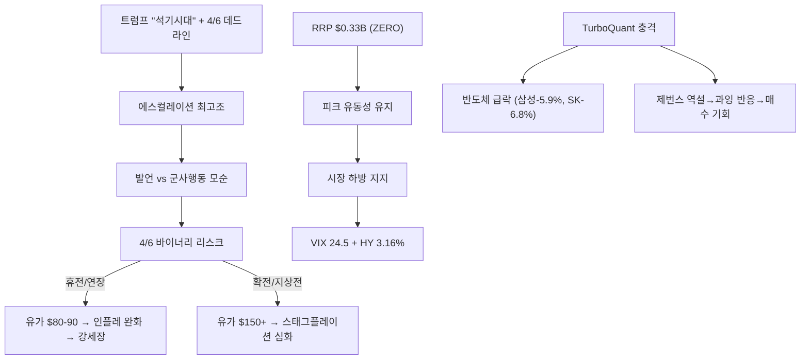
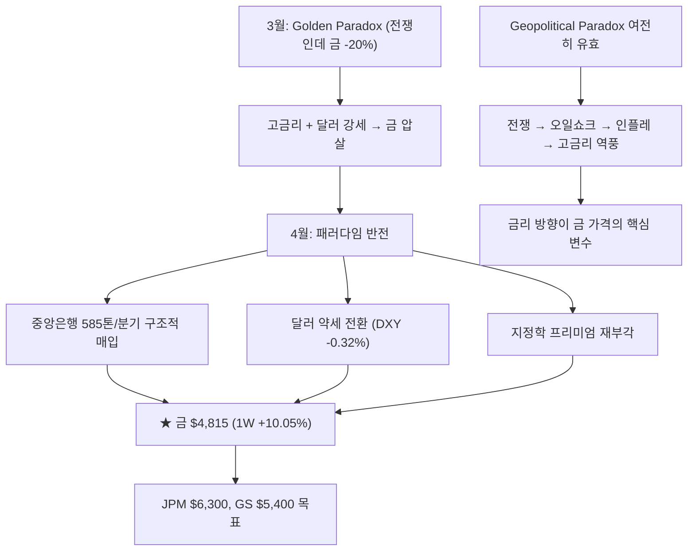
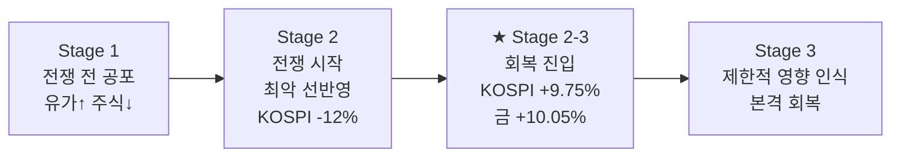
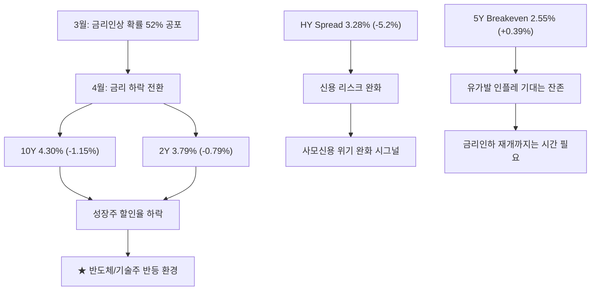
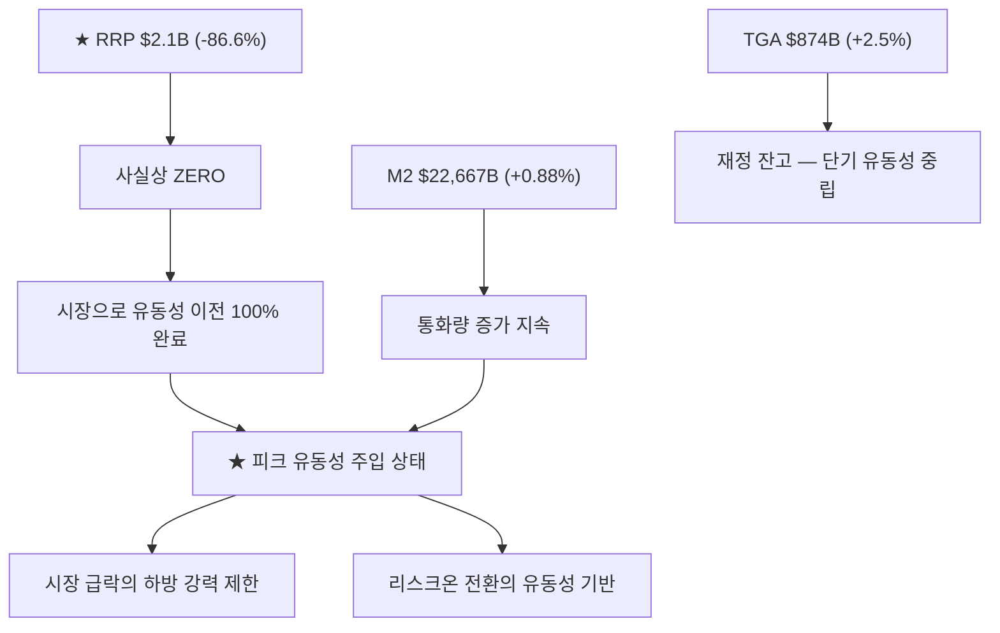
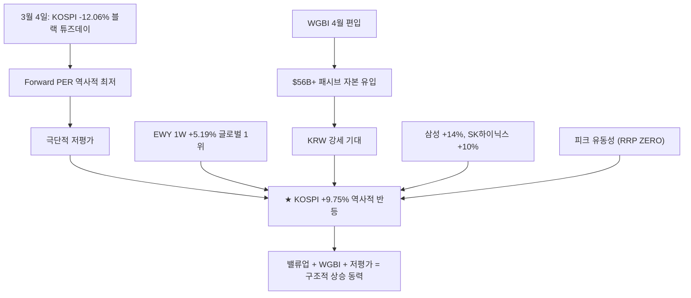
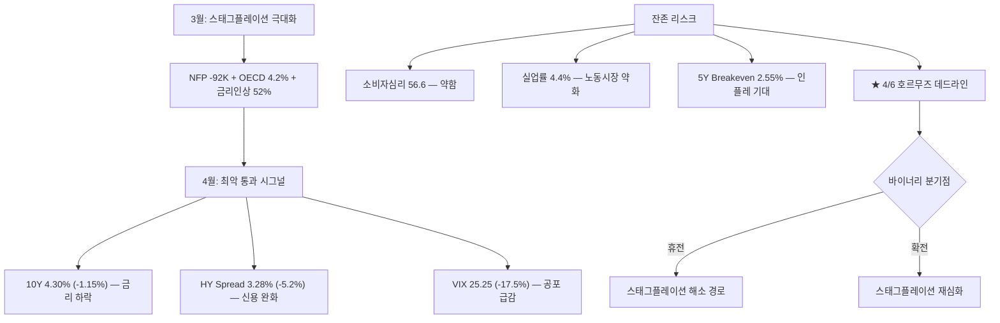
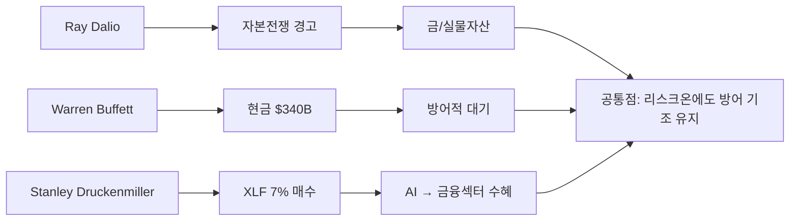
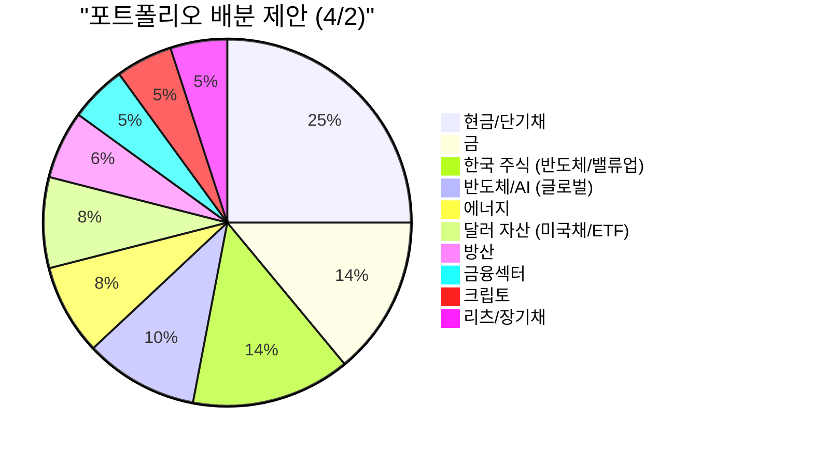

> **관련 글**: [2026년 투자 섹터 전망 (전체)](/knowledge/invest/2026/01/20/investment-sectors-outlook-2026.html)

2026년 4월 3일(목) 기준 업데이트입니다. **핵심 테마는 트럼프 에스컬레이션("석기시대") + TurboQuant 반도체 충격 + Good Friday 휴장 → 주말 불확실성 확대**입니다. **4월 6일 호르무즈 데드라인이 바이너리 리스크**로 남아 있습니다.

트럼프가 전국민 연설에서 "이란을 석기시대로 보낼 것", "2-3주 내 극도로 강력한 타격"을 선언하며 에스컬레이션이 최고조에 달했습니다. 그러나 동시에 "전쟁 수주 내 종료 가능" 발언이 나오며 **발언과 군사행동의 모순**이 지속됩니다. 유가는 Brent **$105.58(-6.2%)**, WTI **$103.36(-1.3%)**로 조정. 구글 TurboQuant(메모리 6배 압축)로 삼성 **-5.91%**, SK하이닉스 **-6.83%** 급락이나 제번스 역설로 과잉 반응 판단.

**RRP $0.33B**로 사실상 ZERO — **피크 유동성** 상태. VIX **24.54(-2.81%)**, HY스프레드 **3.16%(-3.66%)**로 공포 완화 지속. 미국 시장은 **Good Friday 휴장**(4/3). **4월 6일 호르무즈 데드라인** + 주말 이란 상황 변화 리스크에 유의.

## 시장 현황 (2026년 4월 3일 기준)

### 핵심 매크로 지표

| 항목 | 현황 | 변동/방향 |
|------|------|-----------|
| **★ Fed 금리** | **3.50-3.75% 동결** | **95% 동결 확률(4월 FOMC). 인하 기대 약화** |
| **★ 10Y 국채** | **4.33%** | **+0.70% — 소폭 상승** |
| **★ 2Y 국채** | **3.81%** | **+0.53% — 소폭 상승** |
| **★ 10Y-2Y 스프레드** | **0.52%** | **정상적 스티프닝 유지** |
| **★ VIX** | **24.54** | **-2.81% — 공포 완화 지속** |
| **★ HY Spread** | **3.16%** | **-3.66% — 신용 리스크 완화 가속** |
| **CPI (2월)** | **327.46** | **인플레 지속** |
| **Core CPI (2월)** | **333.51** | **핵심 물가 고착** |
| **5Y Breakeven** | **2.57%** | **+0.78% — 유가발 인플레 기대 소폭 상승** |
| **실업률** | **4.4%** | **+2.3% — 노동시장 약화** |
| **Initial Claims** | **202K** | **-9K — 개선** |
| **소비자심리 (UMich)** | **56.6** | **여전히 약함** |

### 자산가격

| 항목 | 현황 | 변동 |
|------|------|------|
| **★ 금(Gold)** | **$4,703/oz** | **-1.7%, 1W +4.69% — 단기 조정** |
| **★ KOSPI** | **~5,529** | **+0.92% — 반도체↓ 방산↑ 로테이션** |
| **★ DXY** | **100.04** | **1W -0.11% 약세 유지** |
| **★ 비트코인** | **$66,606** | **-2.2% — 하락** |
| **★ USD/KRW** | **~1,510** | **WGBI 편입 → KRW 강세 기대** |

### ★ 글로벌 자금 흐름: 유럽·일본 반등 리더

| 지역/자산 | 1W 수익률 | 방향 |
|----------|-----------|------|
| **★ Europe (VGK)** | **+4.75%** | **글로벌 최고** |
| **Japan (EWJ)** | **+4.74%** | 아시아 강세 |
| **Brazil (EWZ)** | **+4.70%** | EM 강세 |
| **US (SPY)** | **+3.43%** | 반등 |
| **Korea (EWY)** | **+1.56%** | TurboQuant 충격으로 상대 약세 |
| **★ Gold** | **+4.69%** | **강세 유지** |
| **DXY** | **-0.11%** | 약세 유지 |

> **투자 시사점**: 3월 말 극도 공포에서 **급격한 리스크온 전환** 진행 중. 한국이 글로벌 자금 유입 1위(EWY 1W +5.19%), 금 +10.05%로 최강 자산. 그러나 **4/6 호르무즈 데드라인**이 휴전/확전의 바이너리 분기점. 리스크온에 편승하되 **데드라인 전후 포지션 관리 필수**.

---

## ★ 금(Gold) $4,815: Golden Paradox 탈출, JPM $6,300 목표

### 금 시장 핵심 데이터

| 항목 | 내용 |
|------|------|
| **현재 가격** | **$4,815/oz (+3.6%, 1W +10.05%)** |
| **JPM 목표가** | **$6,300 (연말)** |
| **GS 목표가** | **$5,400** |
| **중앙은행 매입** | **585톤/분기** |
| **1월 고점** | **$5,589** |
| **고점 대비** | **-13.8% (이전 -20%+ 에서 회복 중)** |

> **투자 시사점**: Golden Paradox에서 **탈출 중**. 1주일 +10.05% 급등은 중앙은행 585톤/분기 매입 + 달러 약세 전환이 동력. JPM $6,300, GS $5,400 목표가는 상당한 업사이드 시사. 다만 "Geopolitical Paradox"(전쟁→인플레→고금리→금 역풍) 구조는 유효하며, **금리 방향이 금 가격의 최종 결정 변수**.

---

## ★ Ken Fisher 3단계 전쟁 패턴: Stage 2→3 회복 국면

| 단계 | 내용 | 시장 반응 | 현재 위치 |
|------|------|-----------|-----------|
| **Stage 1** | 전쟁 전: 유가 상승, 주식 하락 | 공포 선반영 | 완료 |
| **Stage 2** | 전쟁 시작: 최악 선반영 | 바닥 형성 | ★ 현재 (후반) |
| **Stage 3** | 제한적 경제 영향 인식, 회복 | 반등 | ★ 진입 중 |

> **투자 시사점**: Ken Fisher의 역사적 패턴(580조 굴리는 투자자)에 따르면 **전쟁의 경제적 영향은 시장이 두려워하는 것보다 항상 제한적**. KOSPI +9.75%, 금 +10.05%의 급반등은 **Stage 2→3 전환 시그널**. 단, 4/6 호르무즈 데드라인이 이 패턴을 무효화할 수 있는 와일드카드.

---

## ★ FOMC 상세: 동결 유지, 인플레 불확실성 지속

### FOMC 결정 요약

| 항목 | 내용 |
|------|------|
| **금리** | **3.50-3.75% 동결** |
| **스탠스** | **인플레 불확실성 지속, 유가 변수** |
| **5Y Breakeven** | **2.55% (+0.39%) — 유가발 인플레 기대** |
| **금리인상** | **임박하지 않음 (3월 대비 완화)** |

### 채권 시장 시그널: 금리 하락 = 리스크온

| 항목 | 수치 | 변동 | 의미 |
|------|------|------|------|
| **10Y** | **4.30%** | **-1.15%** | ★ 금리 하락 — 리스크온 |
| **2Y** | **3.79%** | **-0.79%** | 단기 금리도 하락 |
| **10Y-2Y** | **0.52%** | | 정상적 스티프닝 |
| **HY Spread** | **3.28%** | **-5.2%** | ★ 신용 리스크 완화 |

> **투자 시사점**: 3월 금리인상 확률 52% 공포에서 **금리 하락 전환**. 10Y 4.30%(-1.15%), HY Spread 3.28%(-5.2%)로 채권·신용 시장 모두 리스크온 시그널. 다만 5Y Breakeven 2.55%(+0.39%)는 유가발 인플레 기대가 잔존함을 시사. **금리인하 재개까지는 유가 안정이 전제 조건**.

---

## ★ 유동성 환경: RRP $2.1B = 사실상 ZERO, 피크 유동성

| 항목 | 수치 | 변동 | 의미 |
|------|------|------|------|
| **★ RRP** | **$2.1B** | **-86.6%** | **★ 사실상 ZERO — 피크 유동성 주입 완료** |
| **M2** | **$22,667B** | **+0.88%** | 통화량 증가 |
| **TGA** | **$874B** | **+2.5%** | 재정 잔고 |

> **투자 시사점**: RRP $2.1B로 **사실상 ZERO 도달**은 역사적 사건. 연준 역레포에 묶여 있던 자금이 **100% 시장으로 이전 완료**되어 **피크 유동성 주입** 상태. M2 $22,667B(+0.88%) 증가와 합산하면 **시장의 유동성 하방 지지가 극도로 강함**. 이는 KOSPI +9.75%, 금 +10.05% 반등의 핵심 기반.

---

## ★ KOSPI 5,545: 역사적 반등, Forward PER 최저

### 핵심 데이터

| 항목 | 내용 |
|------|------|
| **★ KOSPI** | **5,545 (+9.75%)** |
| **Samsung** | **+14%** |
| **SK Hynix** | **+10%** |
| **Forward PER** | **역사적 최저 수준** |
| **EWY (1W)** | **+5.19% — 글로벌 자금 유입 1위** |

### 원/달러 환율 & WGBI

| 항목 | 내용 |
|------|------|
| **★ 현재 환율** | **1,509.86원** |
| **WGBI 편입** | **4월 시작 — $56B+ 패시브 자본 유입** |
| **방향** | **KRW 강세 예상 (WGBI 유입)** |

> **투자 시사점**: KOSPI 5,545(+9.75%)는 **블랙 튜즈데이(-12.06%) 이후 역사적 반등**. Forward PER 최저 + EWY 글로벌 자금 유입 1위 + WGBI 4월 편입($56B+)이 3중 동력. 삼성 +14%, SK하이닉스 +10%로 **반도체 대형주 주도 반등**. 환율 1,510원은 여전히 높으나 WGBI 패시브 유입이 KRW 강세 압력으로 작용할 전망.

---

## ★ 스태그플레이션: 리스크 잔존하나 최악 통과 중

### 스태그플레이션 데이터 (4/2 업데이트)

| 항목 | 수치 | 방향 |
|------|------|------|
| **5Y Breakeven** | **2.55%** | +0.39% — 유가발 인플레 기대 |
| **실업률** | **4.4%** | +2.3% — 노동시장 약화 |
| **Initial Claims** | **210K** | 안정적 |
| **소비자심리** | **56.6** | 여전히 약함 |
| **10Y 국채** | **4.30% (-1.15%)** | ★ 금리 하락 |
| **HY Spread** | **3.28% (-5.2%)** | ★ 신용 리스크 완화 |
| **Manufacturing Employment** | **감소 추세** | 제조업 약세 |

> **투자 시사점**: 3월 극심했던 스태그플레이션 공포가 **금리 하락(10Y -1.15%) + 신용 완화(HY -5.2%) + VIX 급락(-17.5%)**으로 최악을 통과하는 시그널. 다만 소비자심리 56.6, 실업률 4.4%는 여전히 약하고, **4/6 호르무즈 데드라인** 결과에 따라 해소 or 재심화로 갈림. 제조업 고용 감소 추세도 주의.

---

## ★ 비트코인: $68,250 — 변동성 속 안정

| 항목 | 내용 |
|------|------|
| **현재 가격** | **$68,250** |
| **환경** | 금리 하락 전환 + 달러 약세 = 우호적 |

> **투자 시사점**: 3월 F&G 13 극도 공포에서 $68,250으로 안정. 금리 하락 + 달러 약세 전환이 크립토에 우호적 환경. 4/6 호르무즈 데드라인 결과에 따라 방향성 결정.

---

## ★ 오일쇼크: 4/6 호르무즈 데드라인 = 바이너리 리스크

이란 전쟁으로 인한 호르무즈 해협 봉쇄가 글로벌 매크로의 핵심 변수입니다. **4월 6일이 휴전/확전의 분기점**으로 부상했습니다.

### 사건 전개 (4/2 업데이트)

| 시점 | 사건 |
|------|------|
| **3/1** | 미국 "Operation Epic Fury" + 이스라엘 합동 공습, 하메네이 사망 |
| **3/1~2** | **호르무즈 해협 봉쇄** — 글로벌 원유 공급 20% 차단 |
| **3/4** | **KOSPI -12.06% 블랙 튜즈데이** |
| **3/5** | KOSPI +9.63% 반등 — 이란 CIA 협상 신호 |
| **3/9~10** | 유가 $100+ 돌파, G7 SPR 방출 |
| **~3/28** | OECD 인플레 4.2% 전망, 금리인상 확률 52% |
| **~4/2** | **★ 휴전 기대 확산, Ken Fisher Stage 2→3 전환** |
| **★ 4/6** | **호르무즈 데드라인 — 바이너리 분기점** |

### 시나리오별 영향 (4/2 업데이트)

| 시나리오 | 확률 | 유가 | 금 | KOSPI | BTC |
|---------|------|------|-----|-------|-----|
| **★ 휴전/협상 타결** | **중-높음** | **$70-80** | **$5,500+** | **6,000+** | **$80K+** |
| **현상 유지 (봉쇄 지속)** | **중** | **$90-110** | **$4,500-5,000** | **5,200-5,600** | **$65-70K** |
| **확전 (걸프 확대)** | **낮음** | **$150+** | **$5,000+ (안전자산)** | **4,500 이하** | **$50K 이하** |

> **투자 시사점**: **4/6 호르무즈 데드라인**이 핵심. 현재 시장은 "휴전 기대"를 선반영하며 리스크온 전환 중(KOSPI +9.75%, 금 +10.05%). 휴전 시 **유가 하락 → 인플레 완화 → 금리인하 재개 → 강세장** 경로. 확전 시 스태그플레이션 재심화. **포지션 관리의 핵심 날짜**.

---

## 트럼프 vs 파월 갈등: 장기 금리 리스크

| 항목 | 트럼프 | 파월 |
|------|--------|------|
| **목표** | **성장 촉진 + 달러 약세** | **물가 안정** |
| **금리 선호** | **즉시 인하** | **인플레 불확실성 → 동결 유지** |
| **리스크** | Fed 독립성 훼손 → 장기 금리 급등 | 경기침체 유발 가능 |

> **투자 시사점**: 트럼프의 Fed 압박이 **장기 금리의 구조적 상승 요인**으로 잔존. 다만 현재 10Y 4.30%(-1.15%)로 일시 완화. **5월 Powell 퇴임, 신임 의장 취임**이 다음 분기점.

---

## ★ 투자 대가 포지션

### Ray Dalio — "자본 전쟁(Capital War)" 경고

| 항목 | 내용 |
|------|------|
| **핵심 주장** | **미국 "자본 전쟁" 진입** — 막대한 차입 vs 미국채 수요 감소 |
| **4/2 맥락** | 금리 하락 전환으로 일시 완화이나 구조적 문제 지속 |

### Warren Buffett — 현금 $340B+ 방어적 포지션

| 항목 | 내용 |
|------|------|
| **현금 보유** | **$340B 이상** — 역대 최고 수준 |
| **해석** | 리스크온 전환에도 대가는 여전히 방어적 |

### Stanley Druckenmiller — 금융섹터 ETF(XLF) 대규모 매수

| 항목 | 내용 |
|------|------|
| **매수 종목** | **State Street Financial Sector SPDR ETF (XLF)** |
| **투자 근거** | 대형은행·보험사가 **AI 자동화 수혜를 가장 먼저** 받을 것 |

---

## ★ 이란 전쟁: 오일쇼크 + 4/6 호르무즈 데드라인

### 사건 전개

| 시점 | 사건 |
|------|------|
| **3/1** | 미국 "Operation Epic Fury" + 이스라엘 "Operation Roaring Lion" — 이란 합동 공습 |
| **3/1** | **하메네이 사망 확인** (IRGC 참모총장, 아마디네자드 전 대통령 동시 사망) |
| **3/1~2** | **호르무즈 해협 봉쇄** — 글로벌 원유 공급 20% 차단 |
| **3/3** | KOSPI -7% 폭락 |
| **3/4** | **KOSPI -12.06% "블랙 튜즈데이"** — 서킷브레이커, 사상 최대 폭락 |
| **3/5** | **KOSPI +9.63% 반등** — 이란 CIA 협상 신호 |
| **3/9~10** | **유가 $100+ 돌파**, G7 SPR 방출 |
| **~3/28** | OECD 인플레 4.2%, 금리인상 확률 52% |
| **~4/2** | **★ 휴전 기대 확산, 리스크온 전환** |
| **★ 4/6** | **호르무즈 데드라인 — 바이너리 분기점** |

---

## 한국 자산시장 대전환 (중장기 테마)

환율 1,510원은 여전히 높으나, **WGBI 편입 + KOSPI 역사적 반등 + Forward PER 최저**로 구조적 전환 동력이 강화되고 있습니다.

### 정책 대전환

| 항목 | 내용 |
|------|------|
| **상법 개정** | 배당소득 분리과세, 자사주 의무소각, 이사 책임 강화 |
| **MSCI 선진지수 추진** | 외환시장 개방 → 선진지수 편입 요건 충족 |
| **국민성장펀드** | **150조 원** (민간 75조 + 정부 75조) |
| **★ WGBI 편입** | **4월 시작** — $56B+ 패시브 자본 유입 → KRW 강세 |

> **투자 시사점**: WGBI 4월 편입 시작으로 **$56B+ 패시브 자본 유입**이 본격화. 이는 KRW 강세 + 채권 수요 + 한국 자산 재평가의 트리거. KOSPI 5,545(+9.75%) 반등 + Forward PER 최저 + EWY 글로벌 1위가 이 전환을 확인. **삼고시대 탈출의 구조적 경로가 보이기 시작**.

---

## 관세: IEEPA 위헌 + Section 122 15% 유지

| 구분 | 현황 |
|------|------|
| **IEEPA 관세** | 대법원 위헌 판결 (6:3), $1,660억 환불 진행 |
| **Section 122** | **15%** (2/24 발효, ~7/23 만료) |
| **미-중 관세** | **평균 34%**, 10% 세율 2026년 11월까지 연장 |

---

## 투자 전략

### 현 국면 진단: "휴전 기대 + 피크 유동성 + KOSPI 역사적 저평가 = 리스크온, 단 4/6 바이너리"

**핵심 변화(4/2):**
- **★ 리스크온 전환** — VIX 25.25(-17.5%), HY Spread 3.28%(-5.2%)
- **★ RRP $2.1B = 사실상 ZERO** — 피크 유동성 주입 완료
- **★ 금 $4,815 (+3.6%, 1W +10.05%)** — Golden Paradox 탈출, JPM $6,300 목표
- **★ KOSPI 5,545 (+9.75%)** — Forward PER 최저, 삼성 +14%, SK하이닉스 +10%
- **★ EWY 1W +5.19%** — 한국 글로벌 자금 유입 1위
- **★ 10Y 4.30% (-1.15%)** — 금리 하락 전환
- **★ DXY 하락 (-0.32%)** — 달러 약세 전환
- **★ Ken Fisher Stage 2→3** — 전쟁 최악 선반영, 회복 국면 진입
- **★ WGBI 4월 편입** — $56B+ 패시브 유입 시작
- **★ 4/6 호르무즈 데드라인** — 바이너리 리스크 (휴전 vs 확전)
- **실업률 4.4%, 소비자심리 56.6** — 경기 지표는 여전히 약함
- **BTC $68,250** — 변동성 속 안정

### 단기 전략 (4월): "리스크온 편승 + 4/6 데드라인 포지션 관리"

| 우선순위 | 전략 | 근거 |
|---------|------|------|
| 1 | **★ 한국 주식 비중 확대** | KOSPI Forward PER 최저, EWY 글로벌 1위, WGBI 유입 |
| 2 | **★ 금 포지션 확대** | JPM $6,300, GS $5,400, 중앙은행 585톤/분기 |
| 3 | **반도체/AI 비중 확대** | 금리 하락(10Y -1.15%) → 성장주 할인율 하락 |
| 4 | **현금/단기채 비중 유지 (축소 가능)** | 리스크온이나 4/6 데드라인 불확실성 |
| 5 | **에너지 포지션 축소 검토** | 휴전 시 유가 하락 리스크 |
| 6 | **4/6 전 헤지 포지션 구축** | 호르무즈 바이너리 리스크 대비 |
| 7 | **BTC 점진적 확대** | 금리 하락 + 달러 약세 = 크립토 우호적 |

### 중기 전략 (4~6월)

| 우선순위 | 전략 | 근거 |
|---------|------|------|
| 1 | **WGBI 편입 수혜 극대화** | 4월 편입 ($56B+) — 한국 채권/주식/원화 |
| 2 | **휴전 후 시나리오 대비** | 유가 하락 → 인플레 완화 → 금리인하 재개 경로 |
| 3 | **5월 신임 Fed 의장 리스크 대비** | Powell 퇴임 → 트럼프 영향력 확대 |
| 4 | **금 $5,400~$6,300 목표 추적** | JPM/GS 목표가 도달 여부 |
| 5 | **Ken Fisher Stage 3 본격 회복 확인** | 전쟁 경제 영향 제한적 확인 시 추가 매수 |

### 포트폴리오 배분 제안 (리스크온 전환 + 4/6 바이너리 대비)

| 카테고리 | 비중 | 변동 | 근거 |
|---------|------|------|------|
| **현금/단기채** | **25%** | **↓ (38→25)** | 리스크온 전환, 4/6 대비 일부 유지 |
| **금** | **14%** | **↑ (6→14)** | JPM $6,300, 1W +10.05%, 중앙은행 585톤 |
| **한국 주식** | **14%** | **↑ (4→14)** | KOSPI PER 최저, EWY 1위, WGBI, 삼성+14% |
| **반도체/AI** | **10%** | **↑ (5→10)** | 금리 하락 → 성장주 재평가 |
| **에너지** | **8%** | **↓ (12→8)** | 휴전 시 유가 하락 리스크 |
| **달러 자산** | **8%** | **↓ (12→8)** | 달러 약세 전환, 원화 강세 기대 |
| **방산** | **6%** | **↓ (8→6)** | 휴전 기대로 모멘텀 약화 가능 |
| **금융섹터** | **5%** | **유지** | 고금리 NIM 수혜 지속 |
| **크립토** | **5%** | **↑ (2→5)** | F&G 극도공포 탈출, 금리 하락 우호적 |
| **리츠/장기채** | **5%** | **유지** | 금리인하 시 수혜, 현재 저가 |

## 월별 체크포인트

| 월 | 이벤트 | 투자 시사점 |
|----|--------|------------|
| **3/1** | 이란 전쟁 본격화, 하메네이 사망 | 유가 급등, 방산주 폭등 |
| **3/4** | KOSPI 블랙 튜즈데이 -12.06% | 사상 최대 폭락, 서킷브레이커 |
| **3/17~18** | FOMC 3.50-3.75% 동결 | PCE 2.7% 상향 |
| **3/27** | 금리인상 확률 52% — 사상 첫 50% 돌파 | 패러다임 전환 시그널 |
| **~4/2** | **★ 리스크온 전환: KOSPI +9.75%, 금 +10.05%** | **Ken Fisher Stage 2→3** |
| **★ 4/6** | **★ 호르무즈 데드라인 — 바이너리 분기점** | **포지션 관리 최우선** |
| **4월** | **WGBI 인덱스 편입 시작** | $56B+ 유입 + KRW 강세 |
| **5월** | **Powell 퇴임, 신임 의장 취임** | 트럼프 영향력 확대 우려 |
| **~7/23** | Section 122 150일 만료 | 관세 재편 분기점 |
| **~11월** | 2026 중간선거 | 크립토 시장구조법안 데드라인 |

## 리스크 요인 정리

| 리스크 | 심각도 | 확률 | 대응 |
|--------|--------|------|------|
| **★ 4/6 호르무즈 데드라인** | **최고** | **높음** | 바이너리 리스크 — 헤지 필수 |
| **★ 인플레 재가속** | **높음** | **중** | 5Y Breakeven 2.55% — 유가 의존적 |
| **★ 확전 시 스태그플레이션 재심화** | **최고** | **낮음** | 현금/단기채 + 에너지 방어 |
| **5월 신임 Fed 의장** | **높음** | **높음** | Fed 독립성 훼손 시 장기 금리 급등 |
| **소비자심리 56.6 지속 약화** | **중** | **높음** | 경기 둔화 지속 모니터링 |
| **실업률 4.4% 추가 상승** | **중** | **중** | 제조업 고용 감소 추세 |
| **한국 환율 1,510원 고착** | **중** | **중** | WGBI 유입이 완화 변수 |
| **사모신용 위기 잔존** | **중** | **중** | HY Spread 완화 중이나 구조적 리스크 |

## 정리

| 항목 | 내용 |
|------|------|
| **★ 국면** | **리스크온 전환 — 휴전 기대 + 피크 유동성 + KOSPI 역사적 저평가** |
| **★ 금** | **$4,815 (+3.6%, 1W +10.05%), JPM $6,300, GS $5,400, 중앙은행 585톤/분기** |
| **★ KOSPI** | **5,545 (+9.75%), Forward PER 최저, 삼성 +14%, SK하이닉스 +10%** |
| **★ 유동성** | **RRP $2.1B = 사실상 ZERO, 피크 유동성 주입 완료** |
| **★ 금리** | **Fed 3.50-3.75% 동결, 10Y 4.30%(-1.15%), 2Y 3.79%(-0.79%)** |
| **★ 자금 흐름** | **EWY 1W +5.19% 글로벌 1위, Japan +4.56%, Europe +4.32%** |
| **★ Ken Fisher** | **3단계 전쟁 패턴 Stage 2→3 회복 국면** |
| **★ 바이너리 리스크** | **4/6 호르무즈 데드라인 — 휴전 vs 확전** |
| **VIX** | **25.25 (-17.5%) — 공포 급감** |
| **HY Spread** | **3.28% (-5.2%) — 신용 리스크 완화** |
| **BTC** | **$68,250 — 변동성 속 안정** |
| **USD/KRW** | **1,509.86, WGBI 편입 → KRW 강세 기대** |
| **DXY** | **1W -0.32% — 달러 약세 전환** |
| **고용** | **실업률 4.4%(+2.3%), Initial Claims 210K, 제조업 고용 감소** |
| **소비자심리** | **56.6 — 여전히 약함** |

**핵심 투자 원칙:**
1. **리스크온 편승, 단 4/6 헤지 필수** -- 휴전 기대 + 피크 유동성 + KOSPI PER 최저 = 매수 기회, 단 호르무즈 바이너리 리스크 대비
2. **금 = 최강 자산** -- JPM $6,300 목표, 중앙은행 585톤/분기 구조적 매입, Golden Paradox 탈출
3. **한국 = 글로벌 자금 유입 1위** -- EWY +5.19%, WGBI $56B+ 유입, Forward PER 최저, 삼성/하이닉스 대형주 주도
4. **피크 유동성이 하방 지지** -- RRP ZERO = 시장으로 자금 이전 100% 완료, 급락 하방 제한
5. **Ken Fisher Stage 2→3** -- 전쟁 최악 선반영, 경제 영향 제한적 인식 → 회복 국면
6. **금리 하락 = 성장주 재평가** -- 10Y 4.30%(-1.15%) → 반도체/AI 할인율 하락
7. **달러 약세 전환** -- DXY -0.32% → 원화/이머징 자산 우호적
8. **4/6이 모든 것을 결정** -- 휴전 시 강세장 경로, 확전 시 3월 공포 재현
9. **Buffett $340B 방어 기조 참고** -- 리스크온에도 대가는 여전히 방어적
10. **소비자심리 56.6 경계** -- 실물 경제 약화는 아직 해소되지 않음

---

## 하위 섹터 상세 분석

- [원자재/희토류](/knowledge/invest/2026/03/07/commodities-rare-earth-outlook-2026.html) - 원자재·희토류 심층 분석

**투자 결정은 본인의 리스크 허용 범위와 투자 기간을 고려하여 신중하게 내리시기 바랍니다.**
