> **관련 글**: [2026년 투자 섹터 전망 (전체)](/knowledge/invest/2026/01/20/investment-sectors-outlook-2026.html)

2026년 3월 28일(토) 기준 업데이트입니다. **이번 주 최대 변화는 금리인상 확률이 사상 첫 50%를 돌파**한 것입니다.

CME 선물시장에서 **연내 금리인상 확률이 52%**를 기록하며 사상 처음으로 50%를 넘었습니다. Fed는 3월 FOMC에서 **3.50-3.75% 동결**을 결정했고, 파월 의장은 **"인플레 진전 불충분"**이라고 발언했습니다. OECD가 미국 인플레를 **4.2%로 전망**하고, ECB 라가르드 총재가 **"금리 인상 준비"**를 언급하면서 글로벌 긴축 재개 우려가 확산되고 있습니다.

**금이 $4,433으로 반등**(전일 $4,384 대비)했으나, 1월 고점 $5,589 대비 **-20% 이상 하락한 상태**입니다. 전쟁 속에서 금이 폭락하고 달러가 안전자산을 탈환하는 **"Golden Paradox"**가 이번 국면의 핵심 내러티브입니다. **DXY 100.19(+1.26%)**로 달러 강세가 뚜렷합니다.

**BTC $66,587(-3.59%)**, Fear&Greed 지수 13(극도 공포)으로 크립토 심리가 극단적으로 위축되었습니다. 한국은 **"삼고시대"(고금리·고환율·고물가)**에 진입했으며, 환율 1,504원, 국가부채 GDP 180%, 외환위기 확률 30%(김대종 교수), 자영업 폐업 100만 건으로 경제 전반이 압박받고 있습니다.

## 시장 현황 (2026년 3월 28일 기준)

### 핵심 매크로 지표

| 항목 | 현황 | 변동/방향 |
|------|------|-----------|
| **★ Fed 금리** | **3.50-3.75% 동결** | **파월: "인플레 진전 불충분"** |
| **★ 금리인상 확률** | **52%** | **★ 사상 첫 50% 돌파 (3/27)** |
| **★ OECD 인플레 전망** | **4.2%** | **CPI 가속 전망** |
| **★ Fed PCE 전망** | **2.7%** | **2.5% → 2.7% 상향** |
| **★ Dot Plot** | **올해 1회 인하, 2027년 1회** | **매파적 — 인하 축소** |
| **★ ECB** | **라가르드 "금리 인상 준비"** | **글로벌 긴축 재개 우려** |
| **실업률** | **4.4%** | **+0.1%p — 노동시장 약화** |
| **NFP (비농업 고용)** | **-92K** | **감소 지속** |
| **소비자심리** | **56.6** | **소비 위축 심화** |
| **10Y 국채** | **4.42%** | **+9bp — 인플레 기대 반영** |
| **2Y 국채** | **3.96%** | **+12bp — 금리인상 반영** |
| **10Y-2Y 스프레드** | **0.56%** | **+0.05 확대 — 스티프닝** |
| **HY Spread** | **3.21%** | **사모신용 부도율 9.2% 사상 최고** |

### 자산가격

| 항목 | 현황 | 변동 |
|------|------|------|
| **★ 금(Gold)** | **$4,433/oz** | **전일 $4,384 대비 반등, 1월 고점 $5,589 대비 -20%+** |
| **★ DXY** | **100.19** | **+1.26% — 달러 강세, 안전자산 탈환** |
| **★ 비트코인** | **$66,587** | **-3.59% — Fear&Greed 13 극도 공포** |

### ★ Golden Paradox: 전쟁 속 금 폭락, 달러가 안전자산 탈환

| 항목 | 내용 |
|------|------|
| **현재 가격** | **$4,433/oz (전일 $4,384 대비 반등)** |
| **1월 고점** | **$5,589** |
| **하락폭** | **고점 대비 -20% 이상** |
| **DXY** | **100.19 (+1.26%) — 달러 강세** |

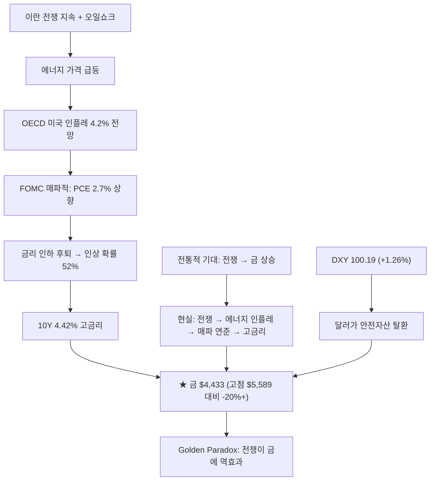

> **투자 시사점**: "전쟁이면 금이 오른다"는 공식이 완전히 깨졌습니다. **에너지 인플레 → 매파적 연준 → 고금리 + 달러 강세**가 무이자 자산인 금을 압살. 10Y 4.42%의 실질 수익률 대비 금의 기회비용이 극대화. DXY 100.19로 달러가 안전자산 지위를 탈환하면서 금의 대안자산 매력도 감소. 다만 중앙은행 매입이라는 구조적 수요는 유지.

---

## ★ FOMC 상세: 동결 유지, 인상 확률 사상 첫 50% 돌파

### FOMC 결정 요약

| 항목 | 내용 |
|------|------|
| **금리** | **3.50-3.75% 동결** |
| **파월 발언** | **"인플레 진전 불충분"** |
| **PCE 인플레 전망** | **2.7% (12월 2.5%에서 상향)** |
| **OECD 전망** | **미국 인플레 4.2%** |
| **Dot Plot** | **올해 1회 인하, 2027년 1회 추가** |

### 시장 금리 기대 (CME FedWatch)

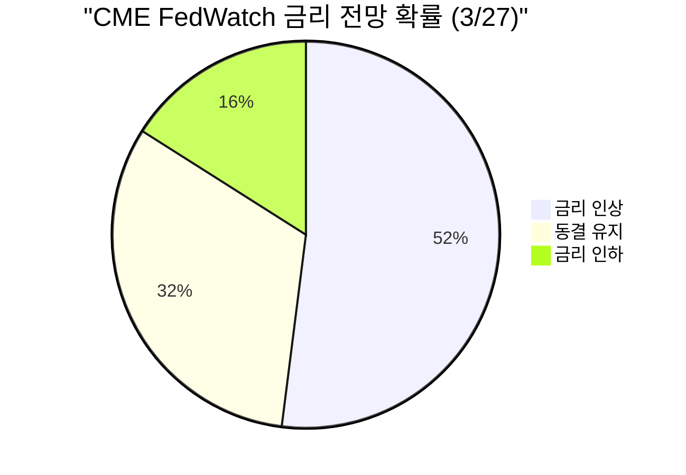

| 시점 | 확률 | 의미 |
|------|------|------|
| **★ 연내 인상** | **52%** | **사상 첫 50% 돌파 — 패러다임 전환** |
| **동결** | **~32%** | 인하 기대 급감 |
| **인하** | **~16%** | 소수 의견으로 전락 |

### 글로벌 긴축 동조: ECB도 인상 준비

| 중앙은행 | 스탠스 | 시사점 |
|---------|--------|--------|
| **Fed** | 동결 유지, 인상 확률 52% | 미국 금리 당분간 고수준 유지 |
| **ECB** | 라가르드 "금리 인상 준비" | 유럽도 긴축 재개 가능성 |
| **BOK** | 딜레마 (삼고시대) | 금리 인상도 동결도 고통 |

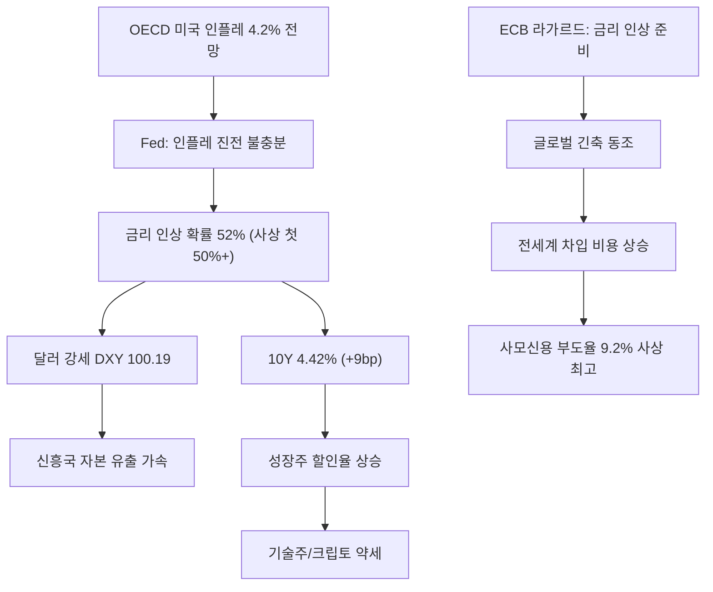

### 채권 시장 시그널

| 항목 | 수치 | 변동 | 의미 |
|------|------|------|------|
| **10Y** | **4.42%** | **+9bp** | 인플레 기대 반영 |
| **2Y** | **3.96%** | **+12bp** | 금리인상 기대 반영 (단기 더 많이 상승) |
| **10Y-2Y** | **0.56%** | **+0.05** | 스티프닝 — 장기 인플레 우려 |
| **HY Spread** | **3.21%** | | 신용 리스크 상승 |

> **투자 시사점**: 금리인상 확률 52%는 **시장의 인플레 공포가 극에 달했음**을 의미. OECD 4.2% 전망 + ECB 인상 준비까지 겹치며 **글로벌 긴축 재개** 우려. 10Y 4.42%, 2Y 3.96%으로 채권 수익률이 급등하면서 **성장주 할인율 상승 압력 극대화**. 단기채(SHY) 선호 지속.

---

## ★ 스태그플레이션: GDP 감속 + 인플레 가속 동시 (Negative Supply Shock)

### 스태그플레이션 핵심 데이터 (3/28 업데이트)

| 항목 | 수치 | 방향 |
|------|------|------|
| **OECD 인플레 전망** | **4.2%** | ★ 가속 |
| **Fed PCE 전망** | **2.7%** | 상향 |
| **NFP (비농업 고용)** | **-92K** | 고용 악화 |
| **실업률** | **4.4%** | 상승 추세 |
| **소비자심리** | **56.6** | 소비 위축 심화 |
| **10Y 국채** | **4.42% (+9bp)** | 인플레 반영 |
| **HY Spread** | **3.21%** | 신용 리스크 |
| **사모신용 부도율** | **9.2%** | ★ 사상 최고 |

### Negative Supply Shock 구조

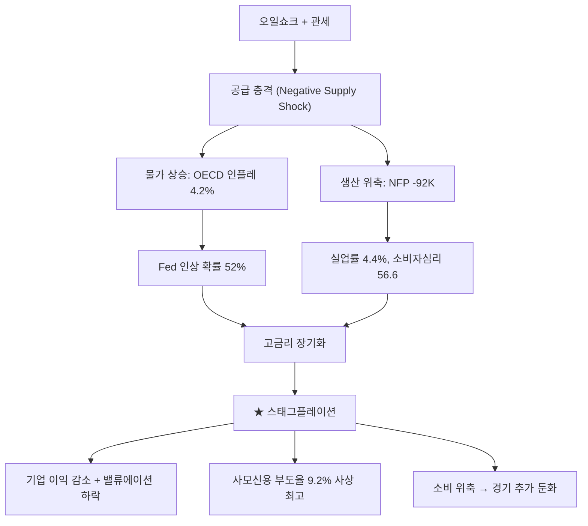

> **투자 시사점**: GDP 감속(NFP -92K, 소비자심리 56.6)과 인플레 가속(OECD 4.2%, PCE 2.7%)이 동시에 발생하는 **전형적 스태그플레이션 구조**. Negative Supply Shock(오일쇼크 + 관세)이 근본 원인. Fed는 인플레와 경기 둔화 사이에서 **어떤 선택도 고통스러운 딜레마**에 직면.

---

## ★ 사모신용(Private Credit) 위기: 부도율 9.2% 사상 최고

| 항목 | 내용 |
|------|------|
| **부도율** | **9.2% — 사상 최고** |
| **HY Spread** | **3.21%** |
| **배경** | 고금리 장기화 → 변동금리 차입 기업 압박 |
| **시스템 리스크** | 은행 대출 대비 규제 사각지대 |

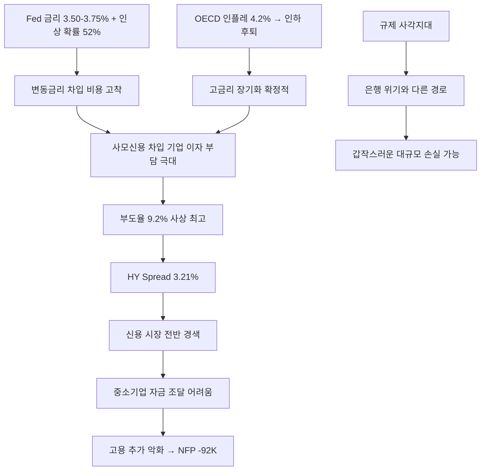

> **투자 시사점**: 사모신용 부도율 9.2%는 **고금리 장기화의 첫 번째 대형 피해자**. 금리인상 확률 52%가 이 위기를 더욱 악화시킬 것. HY Spread 3.21%는 신용 리스크가 사모신용에서 더 넓은 시장으로 전이될 수 있음을 시사. **고위험 채권/레버리지 자산 절대 회피**.

---

## ★ 비트코인: $66,587 (-3.59%) — Fear&Greed 13 극도 공포

| 항목 | 내용 |
|------|------|
| **현재 가격** | **$66,587 (-3.59%)** |
| **Fear&Greed** | **13 — 극도 공포 (Extreme Fear)** |
| **환경** | 금리인상 확률 52% + 달러 강세 DXY 100.19 |

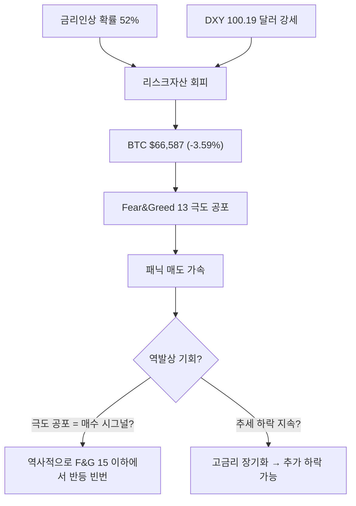

> **투자 시사점**: Fear&Greed 13은 **극단적 공포 구간**. 역사적으로 15 이하에서 반등한 사례가 많으나, 이번에는 금리인상 확률 52% + 달러 강세라는 **구조적 역풍**이 존재. 단기적으로 추가 하락 가능하나, **극도 공포 구간에서의 점진적 분할 매수**는 중장기 관점에서 검토 가능.

---

## ★ 유동성 환경: M2 증가 + RRP 거의 소진

| 항목 | 수치 | 변동 | 의미 |
|------|------|------|------|
| **M2** | **$22,667B** | **+0.88%** | 통화량 증가 |
| **Fed 대차대조표** | **$6.66T** | | QT 지속이나 속도 둔화 |
| **★ RRP** | **$0.99B** | | **거의 소진 — 시장 유동성 이전 완료** |
| **TGA** | **$874B** | **+2.46%** | 재정 잔고 증가 |

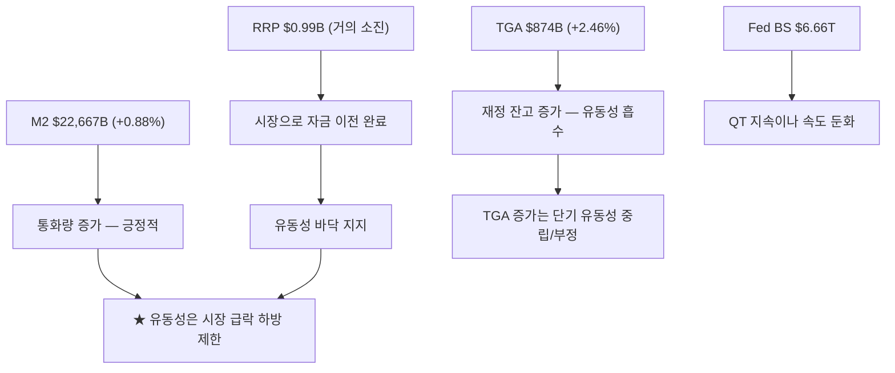

> **투자 시사점**: RRP $0.99B로 거의 소진되면서 **시장으로의 유동성 이전이 사실상 완료**. M2 $22,667B(+0.88%) 증가는 긍정적이나, TGA $874B(+2.46%) 증가는 재정 잔고가 유동성을 일부 흡수. 전반적으로 **유동성은 시장 급락의 하방을 지지**하는 역할.

---

## ★ 원/달러 1,504원: 한국 삼고시대 (고금리·고환율·고물가)

### 핵심 데이터

| 항목 | 내용 |
|------|------|
| **★ 현재 환율** | **1,504원** |
| **★ 국가부채** | **GDP 대비 180%** |
| **★ 외환위기 확률** | **30% (김대종 교수)** |
| **★ 자영업 폐업** | **100만 건** |
| **한미 금리차** | **BOK 2.50% vs Fed 3.50-3.75% = 125bp** |
| **DXY** | **100.19 (+1.26%) — 달러 강세 가속** |

### 삼고시대 구조

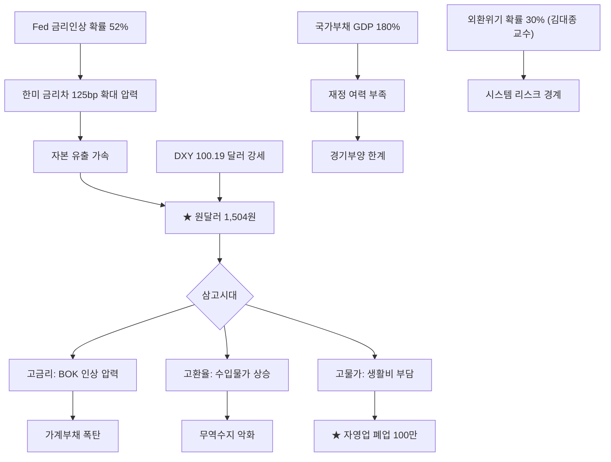

### 한국 경제 위기 지표

| 항목 | 수치 | 심각도 |
|------|------|--------|
| **환율** | 1,504원 | ★★★ |
| **국가부채** | GDP 180% | ★★★ |
| **자영업 폐업** | 100만 건 | ★★★ |
| **외환위기 확률** | 30% | ★★★ |
| **한미 금리차** | 125bp | ★★★ |
| **DXY 달러 강세** | 100.19 (+1.26%) | ★★☆ |

> **투자 시사점**: 한국은 **"삼고시대"(고금리·고환율·고물가)**에 진입. 국가부채 GDP 180%로 재정 여력이 부족한 상태에서 환율 1,504원, 자영업 폐업 100만이 동시에 발생. 외환위기 확률 30%는 극단적이나 경계가 필요한 수준. **달러 자산 비중 확대가 필수적**이며, DXY 100.19 달러 강세가 원화 약세를 구조적으로 가속.

---

## ★ 오일쇼크: 스태그플레이션 환경의 근본 원인

이란 전쟁으로 인한 호르무즈 해협 봉쇄가 **글로벌 거시경제 환경을 근본적으로 변경**했습니다. 이것은 단순한 유가 상승이 아니라, 이미 취약했던 경제에 공급 충격이 겹치는 **1970년대형 오일쇼크**입니다.

### 오일쇼크 파급 경로 (3/28 업데이트)

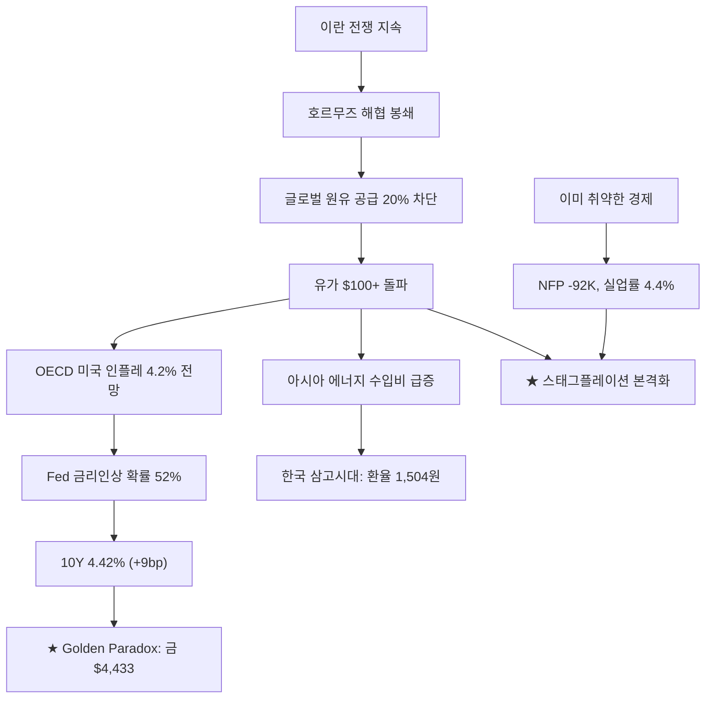

### 시나리오별 영향 (3/28 업데이트)

| 시나리오 | 확률 | 유가 | 금 | 비트코인 |
|---------|------|------|-----|---------|
| **이란 항복 → 조기 종결** | **저** | **$70-80** | **$5,000+ 반등** | **$80K+** |
| **SPR 방출 + 군사 호위 성공** | **중** | **$80-90** | **$4,500-4,800** | **$70-75K** |
| **장기전 + 봉쇄 지속 ★현재** | **높음** | **$100-130** | **$4,000-4,500** | **$55-65K** |
| **걸프 수출국 완전 중단** | **저** | **$150+** | **$5,000+ (안전자산 복귀)** | **$40K 이하** |

> **투자 시사점**: 3/28 기준 **"장기전 + 봉쇄 지속" 시나리오가 가장 유력**. OECD 4.2% 인플레 전망은 오일쇼크의 실물 경제 전이가 공식 확인된 것. 극단적 시나리오(걸프 완전 중단)에서는 금이 안전자산으로 복귀할 수 있으나, 현재는 **고금리 + 달러 강세 압력이 더 강함**.

---

## 트럼프 vs 파월 갈등: 장기 금리 리스크

| 항목 | 트럼프 | 파월 |
|------|--------|------|
| **목표** | **성장 촉진 + 달러 약세** | **물가 안정** |
| **금리 선호** | **즉시 인하** | **"인플레 진전 불충분" — 동결 유지** |
| **근거** | 경제 활성화, 수출 경쟁력 | OECD 4.2%, PCE 2.7% |
| **리스크** | Fed 독립성 훼손 → 장기 금리 급등 | 경기침체 유발 가능 |

> **투자 시사점**: 트럼프의 Fed 압박이 **장기 금리의 구조적 상승 요인**으로 작용. 10Y 4.42%는 이 갈등이 해소되지 않는 한 고착화 가능성. Fed 독립성이 훼손될 경우 미국채 프리미엄이 급등하며 **장기채 보유 리스크 증가**.

---

## ★ 투자 대가 포지션

### Ray Dalio — "자본 전쟁(Capital War)" 경고

| 항목 | 내용 |
|------|------|
| **핵심 주장** | **미국 "자본 전쟁" 진입** — 막대한 차입 vs 미국채 수요 감소 |
| **구조적 문제** | 중국·유럽이 미국채 매수를 줄이고 있음 |
| **3/28 맥락** | 금리인상 확률 52% + OECD 4.2% = Dalio 경고 현실화 |
| **결론** | **금융 리셋(Financial Reset) 경고** |

### Warren Buffett — 현금 $340B+ 방어적 포지션

| 항목 | 내용 |
|------|------|
| **현금 보유** | **$340B 이상** — 역대 최고 수준 |
| **해석** | 매력적인 투자 기회 부재, **스태그플레이션 환경에서 더욱 유효** |

### Stanley Druckenmiller — 금융섹터 ETF(XLF) 대규모 매수

| 항목 | 내용 |
|------|------|
| **매수 종목** | **State Street Financial Sector SPDR ETF (XLF)** |
| **투자 근거** | 대형은행·보험사가 **AI 자동화 수혜를 가장 먼저** 받을 것 |
| **3/28 맥락** | 고금리 장기화 → NIM 수혜 vs 사모신용 9.2% 리스크 |

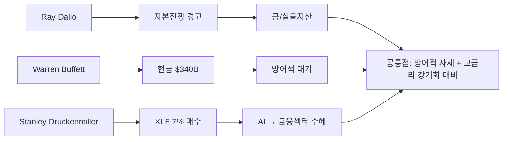

---

## ★ 이란 전쟁: 오일쇼크 + G7 SPR 방출

### 사건 전개

| 시점 | 사건 |
|------|------|
| **3/1** | 미국 "Operation Epic Fury" + 이스라엘 "Operation Roaring Lion" — 이란 합동 공습 |
| **3/1** | **하메네이 사망 확인** (IRGC 참모총장, 아마디네자드 전 대통령 동시 사망) |
| **3/1~2** | **호르무즈 해협 봉쇄** — 글로벌 원유 공급 20% 차단 |
| **3/3** | KOSPI -7% 폭락 |
| **3/4** | **KOSPI -12.06% "블랙 튜즈데이"** — 서킷브레이커, 사상 최대 폭락 |
| **3/5** | **KOSPI +9.63% 반등** — 이란 CIA 협상 신호, 2008년 이후 최대 반등 |
| **3/9~10** | **유가 $100+ 돌파**, G7 SPR 300~400M 배럴 방출 결정 |
| **~3/28** | **전쟁 장기화, OECD 인플레 4.2% 전망으로 실물 전이 확인** |

---

## 한국 자산시장 대전환 (중장기 테마)

삼고시대 + 원화 위기로 단기 압박이 심하나, **구조적 대전환 동력은 유효**합니다.

### 정책 대전환

| 항목 | 내용 |
|------|------|
| **상법 개정** | 배당소득 분리과세, 자사주 의무소각, 이사 책임 강화 |
| **MSCI 선진지수 추진** | 외환시장 개방 → 선진지수 편입 요건 충족 |
| **국민성장펀드** | **150조 원** (민간 75조 + 정부 75조) |
| **WGBI 편입** | **4월** — $56B+ 유입 예상 |

> **투자 시사점**: **삼고시대(고금리·고환율·고물가)**가 대전환 모멘텀을 심하게 압박. 그러나 WGBI 4월 편입 + 상법 개정 + 국민성장펀드라는 구조적 동력은 유효. 환율 위기 해소가 한국 자산시장 반등의 전제 조건.

---

## 관세: IEEPA 위헌 + Section 122 15% 유지

| 구분 | 현황 |
|------|------|
| **IEEPA 관세** | 대법원 위헌 판결 (6:3), $1,660억 환불 진행 |
| **Section 122** | **15%** (2/24 발효, ~7/23 만료) |
| **미-중 관세** | **평균 34%**, 10% 세율 2026년 11월까지 연장 |

---

## 투자 전략

### 현 국면 진단: "금리인상 확률 52% + 스태그플레이션 + Golden Paradox + 삼고시대"

**핵심 변화(3/28):**
- **★ 금리인상 확률 52%** — 사상 첫 50% 돌파, 패러다임 전환
- **★ OECD 미국 인플레 4.2% 전망** — 인플레 가속 공식 확인
- **★ ECB 라가르드 "금리 인상 준비"** — 글로벌 긴축 동조
- **★ 10Y 4.42%(+9bp), 2Y 3.96%(+12bp)** — 채권 수익률 급등
- **★ 금 $4,433, 고점 $5,589 대비 -20%+** — Golden Paradox
- **★ DXY 100.19(+1.26%)** — 달러 강세, 안전자산 탈환
- **★ BTC $66,587(-3.59%), F&G 13** — 극도 공포
- **★ 사모신용 부도율 9.2% 사상 최고**, HY Spread 3.21%
- **★ 한국 삼고시대** — 환율 1,504원, 국가부채 180%, 폐업 100만, 외환위기 30%
- **실업률 4.4%, NFP -92K, 소비자심리 56.6** — 경기 둔화
- **유동성** — M2 $22,667B(+0.88%), RRP $0.99B(거의 소진), TGA $874B(+2.46%)

### 단기 전략 (4월): "금리인상 대비 + 달러 강세 대응 + 극도 공포 경계"

| 우선순위 | 전략 | 근거 |
|---------|------|------|
| 1 | **현금/단기채 비중 최대화** | 금리인상 확률 52%, Buffett $340B 방어적 |
| 2 | **달러 자산 비중 확대** | DXY 100.19, 환율 1,504원, 삼고시대 |
| 3 | **에너지 포지션 유지** | 유가 $100+, 호르무즈 봉쇄 지속 |
| 4 | **금 포지션 축소/재평가** | Golden Paradox, 고점 대비 -20%+ |
| 5 | **사모신용 익스포저 절대 회피** | 부도율 9.2% 사상 최고 |
| 6 | **BTC 극도 공포 구간 모니터링** | F&G 13, 역사적 반등 구간이나 구조적 역풍 존재 |
| 7 | **방산 포지션 유지** | 이란 전쟁 장기화 |

### 중기 전략 (4~6월)

| 우선순위 | 전략 | 근거 |
|---------|------|------|
| 1 | **WGBI 편입 수혜 모니터링** | 4월 편입 ($56B+) — 환율 안정화 기대 |
| 2 | **금리인상 여부 최종 확인** | 52% 확률이 현실화되는지 추적 |
| 3 | **이란 전쟁 종결 시나리오 대비** | 종결 시 유가 하락 → 인플레 완화 → 금리인하 재개 |
| 4 | **사모신용 위기 전이 모니터링** | 9.2% 부도 → 은행권/공개 시장 전이 여부 |
| 5 | **한국 삼고시대 출구 전략** | 환율·금리·물가 동시 안정 시점 추적 |

### 포트폴리오 배분 제안 (금리인상 우려 + 스태그플레이션 방어)

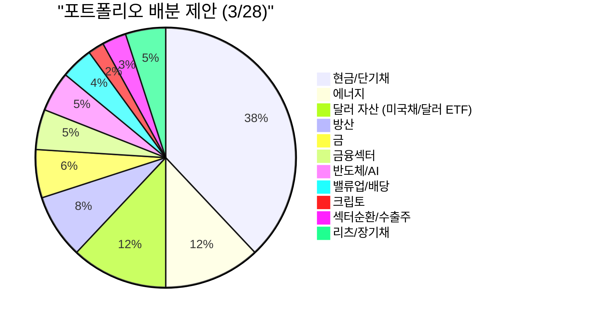

| 카테고리 | 비중 | 변동 | 근거 |
|---------|------|------|------|
| **현금/단기채** | **38%** | **↑ (35→38)** | 금리인상 확률 52%, 스태그플레이션 |
| **에너지** | **12%** | **유지** | 유가 $100+, 오일쇼크 지속 |
| **달러 자산** | **12%** | **↑ (10→12)** | DXY 100.19, 삼고시대, 달러 강세 가속 |
| **방산** | **8%** | **유지** | 이란 전쟁 장기화 |
| **금** | **6%** | **↓ (8→6)** | Golden Paradox, 고점 -20%+, 달러 강세 |
| **금융섹터** | **5%** | **유지** | 고금리 NIM 수혜 vs 사모신용 리스크 |
| **반도체/AI** | **5%** | **↓ (6→5)** | 금리인상 우려 → 성장주 할인율 극대화 |
| **리츠/장기채** | **5%** | **유지** | 장기 금리인하 시 수혜, 현재 저가 |
| **밸류업/배당** | **4%** | **↓ (5→4)** | 삼고시대로 한국 매력 추가 하락 |
| **섹터순환/수출주** | **3%** | **↓ (4→3)** | 삼고시대 + 관세 이중 부담 |
| **크립토** | **2%** | **유지** | F&G 13 극도 공포이나 구조적 역풍 |

## 월별 체크포인트

| 월 | 이벤트 | 투자 시사점 |
|----|--------|------------|
| **3/1** | 이란 전쟁 본격화, 하메네이 사망 | 유가 급등, 방산주 폭등 |
| **3/4** | KOSPI 블랙 튜즈데이 -12.06% | 사상 최대 폭락, 서킷브레이커 |
| **3/17~18** | FOMC 3.50-3.75% 동결 | PCE 2.7% 상향 |
| **3/27** | **★ 금리인상 확률 52% — 사상 첫 50% 돌파** | **패러다임 전환 시그널** |
| **3/28** | **★ OECD 인플레 4.2%, ECB 인상 준비** | **글로벌 긴축 동조** |
| **4월** | **WGBI 인덱스 편입 시작** | $56B+ 유입 + 환율 안정 기대 |
| **5월** | **Powell 퇴임, 신임 의장 취임** | 트럼프 영향력 확대 우려 |
| **~7/23** | Section 122 150일 만료 | 관세 재편 분기점 |
| **~11월** | 2026 중간선거 | 크립토 시장구조법안 데드라인 |

## 리스크 요인 정리

| 리스크 | 심각도 | 확률 | 대응 |
|--------|--------|------|------|
| **★ 금리인상 확률 52%** | **최고** | **높음** | 사상 첫 50% 돌파 → 현금/단기채 최대화 |
| **★ OECD 인플레 4.2%** | **최고** | **높음** | 인플레 가속 공식 확인 → 인플레 헤지 |
| **★ 스태그플레이션** | **최고** | **매우 높음** | NFP -92K + 인플레 4.2% + 소비자심리 56.6 |
| **★ 사모신용 부도율 9.2%** | **최고** | **높음** | 사상 최고 → 고위험 채권 절대 회피 |
| **★ 한국 삼고시대** | **최고** | **높음** | 환율 1,504, 부채 180%, 폐업 100만 → 달러 확대 |
| **★ Golden Paradox** | **높음** | **높음** | 금 고점 -20%+, 달러 강세 → 금 비중 축소 |
| **★ 글로벌 긴축 동조** | **높음** | **중-높음** | ECB 인상 준비 → 글로벌 차입 비용 상승 |
| **BTC 극도 공포** | **높음** | **높음** | F&G 13 → 추가 하락 or 반등 분기점 |
| **트럼프 vs 파월** | **높음** | **높음** | Fed 독립성 훼손 시 장기 금리 급등 |
| **오일쇼크 장기화** | **최고** | **높음** | 호르무즈 봉쇄 지속 → 에너지/현금 |

## 정리

| 항목 | 내용 |
|------|------|
| **★ 금리인상 확률** | **52% — 사상 첫 50% 돌파, 패러다임 전환** |
| **★ FOMC** | **3.50-3.75% 동결, 파월 "인플레 진전 불충분"** |
| **★ OECD** | **미국 인플레 4.2% 전망, PCE 2.7%** |
| **★ ECB** | **라가르드 "금리 인상 준비" — 글로벌 긴축 동조** |
| **★ Golden Paradox** | **금 $4,433, 고점 $5,589 대비 -20%+, 달러가 안전자산 탈환** |
| **★ DXY** | **100.19 (+1.26%) — 달러 강세** |
| **★ 채권** | **10Y 4.42%(+9bp), 2Y 3.96%(+12bp), 스프레드 0.56%** |
| **★ BTC** | **$66,587 (-3.59%), Fear&Greed 13 극도 공포** |
| **★ 사모신용** | **부도율 9.2% 사상 최고, HY Spread 3.21%** |
| **★ 한국 삼고시대** | **환율 1,504원, 국가부채 180%, 외환위기 30%, 폐업 100만** |
| **고용** | **실업률 4.4%, NFP -92K, 소비자심리 56.6** |
| **유동성** | **M2 $22,667B(+0.88%), RRP $0.99B(소진), TGA $874B(+2.46%), Fed BS $6.66T** |
| **오일쇼크** | **유가 $100+, 호르무즈 봉쇄 지속** |

**핵심 투자 원칙:**
1. **금리인상 확률 52% = 최대 리스크** -- 사상 첫 50% 돌파, 현금/단기채 비중 최대화
2. **OECD 4.2% = 인플레 가속 확정** -- 스태그플레이션 본격화, 방어적 포지션
3. **Golden Paradox = 금 패러다임 전환** -- 전쟁에도 금 하락, 달러 강세(DXY 100.19)가 안전자산 탈환
4. **BTC F&G 13 = 극도 공포** -- 역사적 반등 구간이나 구조적 역풍(고금리+달러강세) 존재
5. **사모신용 9.2% = 신용 위기의 씨앗** -- 고금리 장기화 + 인상 우려로 악화 가속
6. **삼고시대 = 한국 경제 총체적 위기** -- 환율 1,504원, 부채 180%, 폐업 100만, 외환위기 30%
7. **글로벌 긴축 동조** -- ECB도 인상 준비, 전세계 차입 비용 상승
8. **현금/단기채가 왕** -- Buffett $340B + 금리인상 52% + 사모신용 위기 = 방어 최우선
9. **달러 자산 확대 필수** -- DXY 100.19 강세 + 원화 구조적 약세
10. **유동성은 하방 지지** -- M2 증가 + RRP 소진이 급락의 바닥 제한

---

## 하위 섹터 상세 분석

- [원자재/희토류](/knowledge/invest/2026/03/07/commodities-rare-earth-outlook-2026.html) - 원자재·희토류 심층 분석

**투자 결정은 본인의 리스크 허용 범위와 투자 기간을 고려하여 신중하게 내리시기 바랍니다.**
