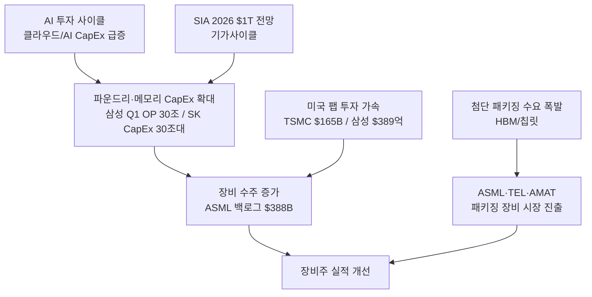
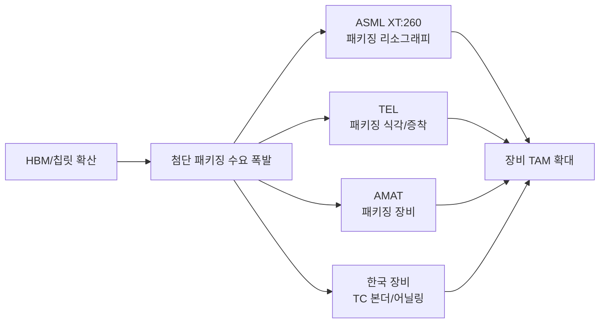
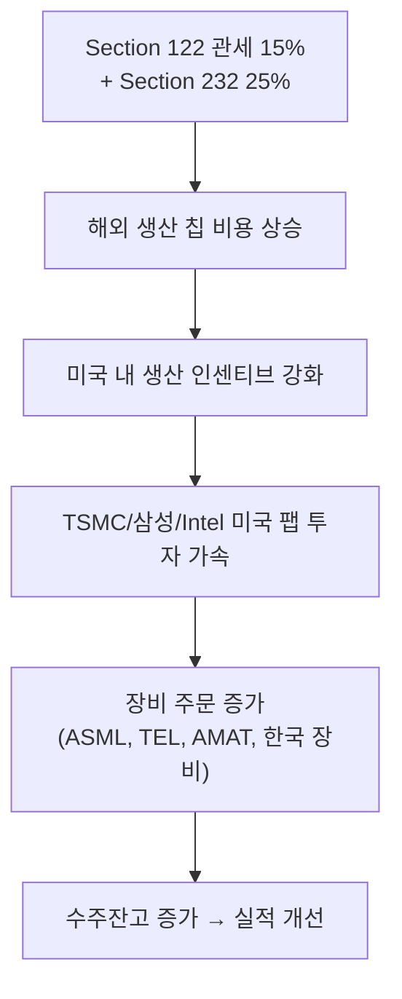

> **관련 글**: [2026년 투자 섹터 전망 (전체)](/knowledge/invest/2026/01/20/investment-sectors-outlook-2026.html) | [반도체 섹터 전망](/knowledge/invest/2026/01/21/semiconductor-sector-outlook-2026.html) | [파운드리 섹터 전망](/knowledge/invest/2026/01/21/foundry-sector-outlook-2026.html)

## 핵심 요약

2026년 소부장 섹터는 **AI 투자 사이클이 장비주를 직접 수혜하는 CapEx 확대 국면**입니다. SIA는 2026년 반도체 산업 규모를 **$1T(1조 달러)**로 전망하며, ASML·Applied Materials·Lam Research·TEL 등 글로벌 장비사가 **첨단 패키징 시장에 동시 진출**하며 TAM을 확장하고 있습니다.

---

## 3월 7일 핵심 업데이트

| 이벤트 | 소부장 영향 |
|--------|-----------|
| **ASML NXE:5000 출하 (1월)** | 최신 EUV 시스템, 처리량/정밀도 향상 → 2nm 양산 가속 |
| **ASML XT:260 출하** | 첨단 패키징 전용 리소그래피 → 후공정 TAM 확대 |
| **AMAT + Lam Research 다년 전략 협업** | 차세대 3D NAND/첨단 로직 식각·증착 공동 개발 |
| **Keysight Q1 기록 실적, 주가 +26%** | AI/6G 인프라 수요 → 반도체 테스트/계측 장비 수혜 확인 |
| **SIA 2026년 $1T 전망** | 기가사이클 진입, 장비 수주 구조적 확대 |
| **미국 수출 통제 강화 가능성** | ASML EUV 대중국 판매 추가 제한 리스크 |

**투자 시사점**: AI 투자 사이클은 반도체 장비주에 **가장 직접적인 수혜**를 줍니다. 클라우드/AI 기업의 CapEx 증가 → 파운드리/메모리 CapEx 증가 → 장비 수주 증가의 연쇄가 2026~27년 본격화됩니다. **Keysight Q1 기록 실적(+26%)**은 AI/6G 인프라 투자가 장비 매출로 전환되고 있음을 실증합니다.

---

## 글로벌 장비 시장: AI CapEx가 만드는 기가사이클

### 핵심 수치

| 지표 | 수치 | 의미 |
|------|------|------|
| **글로벌 반도체 시장** | **$1T (SIA 전망)** | 기가사이클 진입 |
| **ASML 누적 백로그** | **$388B** | 2-3년 매출 가시성 |
| **ASML 리소그래피 점유율** | **32%** | 시장 지배적 |
| **AMAT + TEL 증착/식각 점유율** | **45%+** | 듀오폴리 |

---

## ASML: NXE:5000 출하 + 첨단 패키징 본격 진출

### 핵심 수치

| 항목 | 수치 | 비고 |
|------|------|------|
| **NXE:5000** | **2026년 1월 출하** | 최신 EUV, 처리량·오버레이 향상 |
| **XT:260** | **출하 중** | 첨단 패키징 전용 |
| **Q1 주문** | **€132B** | 기록적 수준 |
| **누적 백로그** | **$388B** | 사상 최대 |
| **리소그래피 점유율** | **32%** | 시장 지배적 |

### NXE:5000 출하의 의미

ASML이 2026년 1월 **NXE:5000 EUV 리소그래피 시스템**을 출하했습니다. NXE:3800 대비 처리량과 오버레이 정밀도가 향상된 최신 시스템으로, TSMC 2nm/삼성 2nm GAA 양산 공정의 핵심 장비입니다.

### 첨단 패키징: XT:260 시스템

ASML은 **XT:260 시스템**을 첨단 패키징용으로 출하하고 있습니다. 기존 EUV 전공정을 넘어 **후공정 패키징 리소그래피까지 TAM을 확장**하는 전략입니다. HBM, CoWoS, 칩릿 등 첨단 패키징의 미세 회로 형성에 고정밀 리소그래피가 필수가 되면서 ASML의 새로운 성장 동력이 됩니다.

### 리스크: 미국 수출 통제 강화

미국 수출 통제가 추가로 강화될 경우 **ASML의 대중국 EUV 판매가 더 제한**될 수 있습니다. 다만 미국/한국/일본/유럽 팹 투자가 이를 상쇄하며, 오히려 미국 내 팹 건설 인센티브가 강화됩니다.

---

## Applied Materials + Lam Research: 전략적 다년 협업

Applied Materials와 Lam Research가 **차세대 식각(Etch) 및 증착(Deposition) 플랫폼 공동 개발**을 위한 전략적 다년 협업을 발표했습니다.

| 항목 | 내용 |
|------|------|
| **협업 범위** | 3D NAND + 첨단 로직용 식각/증착 |
| **AMAT + TEL 시장 점유율** | 증착/식각 45%+ |
| **의미** | 경쟁사 진입 장벽 강화, 기술 표준 주도 |

**투자 시사점**: 3D NAND의 300단+ 고적층 시대와 GAA 트랜지스터의 복잡한 공정이 식각/증착 장비 업그레이드를 요구합니다. 양사의 협업은 기술 리더십을 공고히 하며, 한국 장비업체(원익IPS 등)에게도 공급망 내 기회가 확대됩니다.

---

## Tokyo Electron (TEL): 스마트 팩토리 + 첨단 패키징

| 항목 | 수치 | 비고 |
|------|------|------|
| **FY2026 매출 가이던스** | **2.6조엔 (기록)** | |
| **2025년 자동화 SW 기업 인수** | 지역 자동화 소프트웨어 기업 | 스마트 팩토리·예지보전 강화 |
| **포지션** | 글로벌 장비 2위 | 첨단 패키징 시장 적극 진출 |

TEL은 2025년에 **자동화 소프트웨어 기업 인수**를 통해 스마트 팩토리 자동화와 예지보전(Predictive Maintenance) 역량을 확보했습니다. 장비 판매뿐 아니라 **팹 운영 소프트웨어·서비스 매출** 비중을 높이는 전략입니다.

---

## 첨단 패키징: 장비 업체의 새로운 성장 엔진

**ASML, TEL, Applied Materials 모두 첨단 패키징 시장에 적극 진출**하고 있습니다. HBM/칩릿의 급속한 확산이 패키징 장비 수요를 폭발적으로 증가시키고 있으며, 이는 장비 업체들에게 **새로운 성장 엔진**입니다.

| 장비사 | 패키징 진출 내용 |
|--------|---------------|
| **ASML** | XT:260 첨단 패키징 리소그래피 출하 |
| **TEL** | 패키징용 식각/증착 장비 라인업 확대 |
| **AMAT** | 하이브리드 본딩, Fan-out 장비 |
| **한미반도체** | TC 본더 (HBM 적층 핵심) |
| **HPSP** | 고압수소 어닐링 |

---

## High-NA EUV: 2027-28년 배치 경쟁

| 업체 | 배치 전망 | 비고 |
|------|---------|------|
| **Intel** | **2027년** | 18A 공정 |
| **Samsung** | **2027-28년** | 2nm GAA |
| **SK hynix** | **2027-28년** | HBM/메모리 |
| **TSMC** | **2027-28년** | N2 이후 |

High-NA EUV(0.55 NA)는 2nm 이하 공정의 핵심 장비입니다. 4개사 동시 배치 경쟁은 **ASML의 수주 파이프라인을 구조적으로 확대**합니다.

---

## HBM4 양산 가속: 후공정 장비 신사이클

### 장비 수혜 분석

삼성 HBM4 출하 + SK하이닉스 M15X HBM4 양산으로 후공정 장비 수요의 **새로운 사이클** 시작.

| 장비 카테고리 | 수혜 기업 | 이유 |
|-------------|---------|------|
| **TC 본더** | **한미반도체** (71.2%) | HBM4 적층 핵심, 16단 대응 |
| **어닐링** | **HPSP** (영업이익률 55%) | 고압수소 어닐링 HBM4 필수 |
| **테스트** | **리노공업**, ISC | 첨단 패키지 테스트 소켓 |
| **레이저** | **이오테크닉스** | 하이브리드 본딩, 레이저 다이싱 |
| **CVD** | **원익IPS** | 삼성/하이닉스 동시 납품 |

### HBF: 후공정 장비 TAM 확대

SK하이닉스 **HBF(High Bandwidth Flash)**는 NAND를 HBM 방식으로 적층/패키징하는 새 아키텍처. **후공정 장비 TAM이 메모리에서 스토리지까지 확대**.

- **샘플**: H2 2026
- **양산**: 2027년
- 수혜: TC 본더, 어닐링, 테스트 장비 = HBM 장비 업체 그대로

---

## 미국 팹 투자 가속: 장비 수주 확대

| 기업 | 미국 투자 | 공정 |
|------|----------|------|
| **TSMC** | **$165B** | 3nm, 2nm |
| **삼성전자** | **$389억** | 파운드리 + 메모리 |
| **Intel** | 대규모 | 18A HVM |
| **SK하이닉스** | **$41억** | HBM |

---

## 장비 사이클 연장 시나리오

### 실적 전망이 뒷받침하는 장기 사이클

| 전망 | 내용 | 장비 영향 |
|------|------|---------|
| **삼성 Q1 OP** | ~30조원 (사상 첫) | CapEx 대규모 집행 |
| **삼성 2026 OP** | 170-201조원 | |
| **삼성 2027 OP (MS)** | 317조원 | 장비 사이클 2027년까지 연장 |
| **SK하이닉스 2026 OP** | 100-189조원 | M15X 투자 20조+ |
| **SK하이닉스 CAPEX** | 중반 30조대 | |

| 시나리오 | 피크 | 장비 수주 피크 | 전략 |
|---------|------|-------------|------|
| 기존 컨센서스 | 2026 중반 | 2026 H1 | 점진적 축소 |
| **IB 상향 (MS/노무라)** | **2027 이후** | **2026 H2~2027** | **보유 기간 연장** |

---

## 관련 종목

### 글로벌 장비주

| 종목 | 핵심 투자 포인트 | 3월 업데이트 |
|------|---------------|------------|
| **ASML** | EUV 독점, 점유율 32%, 백로그 $388B | **NXE:5000 출하, XT:260 패키징용 출하** |
| **Applied Materials** | 증착/식각 선두, TEL과 45%+ 점유 | **Lam Research와 다년 전략 협업** |
| **Lam Research** | 3D NAND 식각 핵심 | **AMAT과 차세대 플랫폼 공동 개발** |
| **TEL** (8035.TSE) | 글로벌 2위, FY2026 2.6조엔 | **자동화 SW 인수, 스마트 팩토리 강화** |
| **Keysight** | AI/6G 테스트·계측 | **Q1 기록 실적, 주가 +26%** |

### 한국 장비주

| 종목 | 핵심 투자 포인트 | 3월 업데이트 |
|------|---------------|------------|
| **한미반도체** (042700) | TC 본더 71.2%, 영업이익률 50% | HBM4 양산 가속 → 추가 수요 |
| **HPSP** (403870) | 고압수소 어닐링 독보적, 이익률 55% | HBM4/HBF 모두 필수 |
| **리노공업** (058470) | IC 테스트 소켓 1위, 이익률 48% | 첨단 패키지 테스트 수혜 |
| **이오테크닉스** (039030) | 레이저 다이싱/본딩 | HBM4 공정 전환 수혜 |
| **원익IPS** (240810) | CVD, 삼성/하이닉스 동시 납품 | 대규모 CapEx + 미국 팹 수혜 |
| **ISC** (095340) | 테스트 인터커넥트 | HBM 테스트 수요 확대 |
| **DB아이텍** (024950) | 후공정 패키징/테스트, PER 11배 | 저밸류 매력 |

### 간접 투자

| 종목 | 핵심 |
|------|------|
| **SK스퀘어** (402340) | SK하이닉스 지주사 20%, 이중 할인 |

---

## 투자 전략

### 5가지 핵심 전략

**전략 1: AI CapEx 사이클 직접 수혜 (신규)**
- AI 투자 증가 → CapEx 확대 → 장비 수주 증가의 선순환
- Keysight Q1 기록 실적(+26%)이 AI/6G 장비 수요를 실증
- 수혜: ASML, AMAT, TEL, Keysight

**전략 2: ASML 기록적 수주 + 패키징 확장 (강화)**
- 백로그 $388B, 점유율 32% → 2-3년 매출 가시성
- NXE:5000 + XT:260 출하 → 전공정·후공정 동시 공략
- EUV 독점 + 가격 결정력

**전략 3: 장비사 패키징 시장 동시 진출 (신규)**
- ASML, TEL, AMAT 모두 첨단 패키징 장비 시장 확대
- HBM/칩릿 확산이 패키징 장비 수요를 구조적으로 증가
- 새로운 성장 엔진 → TAM 확대

**전략 4: HBM4 + HBF 사이클 수혜**
- 삼성 HBM4 + SK M15X + HBF → 후공정 장비 수요 구조적 확대
- 한미반도체, HPSP, 이오테크닉스 중심
- 영업이익률 40-55% 기업 = 사이클 둔화 시에도 방어력

**전략 5: 밸류에이션 분산**
- 고밸류(HPSP, 리노공업) + 저밸류(DB아이텍 PER 11배)
- SK스퀘어로 SK하이닉스 간접 투자
- ASML을 글로벌 핵심주로

---

## 핵심 모니터링

| 지표 | 의미 |
|------|------|
| **ASML 분기 수주** | €132B 유지 여부, NXE:5000/XT:260 납품 진행 |
| **AMAT-Lam 협업 진전** | 차세대 플랫폼 개발 진행, 시장 반응 |
| **Keysight 분기 실적** | AI/6G 장비 수요 지속 여부 |
| **장비 기업 수주잔고** | 둔화 시작 = 가장 이른 경고 |
| **SK하이닉스/삼성 CapEx** | 투자 축소 or 연장 신호 |
| **미국 대중국 수출 통제** | ASML EUV 추가 제한 리스크 |
| **HBF 양산 타임라인** | 구체적 일정 발표 여부 |
| **미국 팹 착공 진행** | 장비 설치 진행도 |

---

## 리스크 요인

| 리스크 | 내용 | 대응 |
|--------|------|------|
| **장비 수주 급감** | 메모리 실적보다 1-2분기 선행 | 분기 수주잔고 확인 |
| **미국 수출 통제 강화** | ASML 대중국 EUV 판매 추가 제한 가능 | 미국/한국/일본 팹 투자가 상쇄 |
| **관세 공급망 교란** | 수입 부품/소재 원가 부담 | 미국 팹 투자 수혜가 상쇄 |
| **밸류에이션 과열** | HBM 수혜 선반영 종목 주의 | 저밸류(DB아이텍) 분산 |
| **AMAT-Lam 협업 리스크** | 공동 개발 기술 유출, 독점 우려 | 규제 동향 모니터링 |
| **HBF 양산 지연** | 아키텍처 공개 단계 | 양산 구체화 시점 확인 |

---

## 결론

| 항목 | 내용 |
|------|------|
| **$1T 기가사이클** | SIA 2026년 $1T 전망 — 장비주 구조적 수혜 국면 |
| **AI CapEx 사이클** | AI 투자 → CapEx 확대 → 장비 수주 증가, Keysight +26%로 실증 |
| **ASML** | NXE:5000 출하, XT:260 패키징용 출하, 점유율 32%, 백로그 $388B |
| **AMAT + Lam** | 차세대 식각/증착 다년 전략 협업, 시장 45%+ 지배 |
| **첨단 패키징** | ASML·TEL·AMAT 동시 진출 — 장비 업체의 새로운 성장 엔진 |
| **HBM4/HBF** | 후공정 장비 수요 신사이클, TAM 확대 |
| **한국 장비** | 한미반도체, HPSP, 리노공업, 이오테크닉스, 원익IPS |
| **전략** | AI CapEx 수혜 + 패키징 TAM 확대 + 수주잔고 둔화 전까지 보유 |

---

**면책 조항**: 이 글은 투자 정보 제공 목적으로 작성되었으며, 특정 종목의 매수 또는 매도를 권유하지 않습니다. 투자 결정은 본인의 판단과 책임 하에 이루어져야 합니다. (2026년 3월 7일 업데이트)
