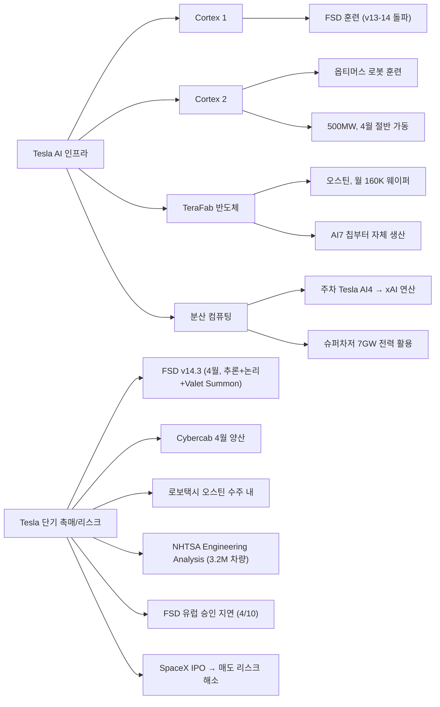
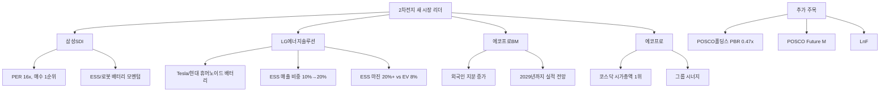
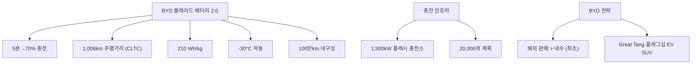
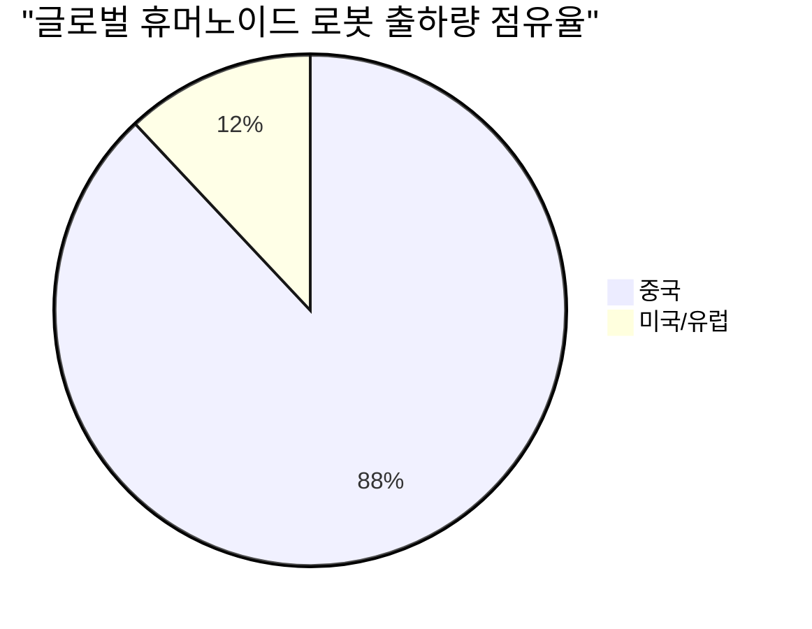
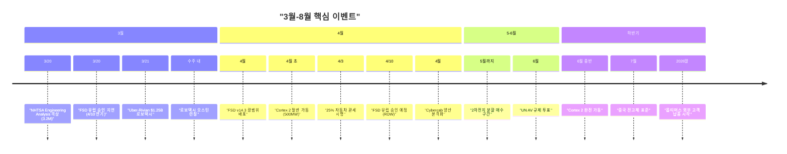

> **관련 글**: [2026년 투자 섹터 전망 (전체)](/knowledge/invest/2026/01/20/investment-sectors-outlook-2026.html)

2026년 3월 21일 기준, 자동차/로봇 섹터의 핵심 변화는 **FSD 유럽 승인 지연**(RDW 네덜란드 3/20→4/10 연기), **NHTSA FSD 조사 Engineering Analysis 격상**(3.2M 차량, 강제 리콜 직전 단계), **Cybertruck FSD 사고 반박**(운전자 수동 해제, FSD 정상 작동 확인), **TeraFab 반도체 공장**(오스틴, 월 160K 웨이퍼, TSMC GigaFab 초과), **분산 컴퓨팅**(주차 Tesla AI4 칩→xAI, 슈퍼차저 7GW), **FSD v14.3 임박**(추론+논리, Valet Summon, 4월 배포), **Uber-Rivian $1.25B 로보택시 동맹**, **Waymo 10개 도시 확장**(40만 회/주, 6세대 50% 비용 절감), **BOTZ $33.60 (-3.67%)**입니다.

## 최근 주요 뉴스 (3월 21일 기준)

| 항목 | 내용 |
|------|------|
| **★★★ FSD 유럽 승인 지연** | RDW(네덜란드) 3/20 승인 예정이었으나 **4/10으로 연기**. "최종 검토 단계"이나 승인일 미확정. Tesla 자체 발표 데드라인 반복 미달 패턴 |
| **★★★ NHTSA 조사 격상** | FSD 조사 **Engineering Analysis 단계** 격상, **3.2M 차량** 대상. **강제 리콜 직전 마지막 법적 단계**. EU 승인 목표일 전날 타이밍 의미심장 |
| **★★ Cybertruck FSD 사고 반박** | 로그 데이터: 운전자가 충돌 **4초 전 FSD 수동 해제**. 재현 테스트에서 FSD 정상 작동 확인 |
| **★★★ Tesla TeraFab** | 오스틴 텍사스 **반도체 공장**. 월 **160K 웨이퍼** 목표 (TSMC GigaFab 초과 규모). **AI7 칩**부터 자체 생산 |
| **★★★ Tesla 분산 컴퓨팅** | 주차된 Tesla **AI4 칩을 xAI 연산에 활용** 계획. 슈퍼차저 **7GW** 전력을 컴퓨팅에 활용 |
| **★★★ FSD v14.3 임박** | 차세대 FSD: **추론+논리 기능**, **자동 주차(Valet Summon)**. **4월 광범위 배포** 예정 |
| **★★★ Uber-Rivian 동맹** | Uber **$1.25B** Rivian 로보택시 투자. Rivian AV 데이터: **350만 마일** (vs Tesla **87억 마일** = 1/2,485) |
| **★★★ Waymo 확장** | **10개 도시**, 주간 **40만 회** 유료 라이드, 목표 **100만 회**. **6세대 50% 비용 절감** |
| **★★★ 4/3 25% 자동차 관세** | 모든 수입차에 25% 관세 시행 → 현대/기아·유럽 OEM 직격탄 |
| **★★ BOTZ ETF** | $33.60 (**-3.67%**) |

## 핵심 이슈 심층 분석

### 1. Tesla -- Cortex 2 + 로보택시 + 옵티머스



#### Cortex 2 슈퍼컴퓨터 (핵심 신규)

| 항목 | 내용 |
|------|------|
| **위치** | 기가텍사스 |
| **전력** | **500MW** (절반 가동 시에도 거대 규모) |
| **4월 가동** | **절반 운영 시작** |
| **완전 가동** | **2026년 중반** |
| **Cortex 1 역할** | FSD 훈련 (v13-14 돌파 달성) |
| **Cortex 2 역할** | **옵티머스 로봇 훈련 전용** |
| **머스크 발언** | "옵티머스 훈련이 제한 요소" → Cortex 2가 이를 해결 |

> **핵심**: Cortex 1이 FSD v13-14 돌파를 이끌었듯이, Cortex 2는 옵티머스 로봇의 AI 훈련 병목을 해소합니다. 500MW급 전용 슈퍼컴퓨터가 4월부터 가동되면 옵티머스의 자율 작업 능력이 급속도로 향상될 전망입니다.

#### TeraFab 반도체 공장 (3/21 신규)

| 항목 | 내용 |
|------|------|
| **위치** | 오스틴, 텍사스 |
| **유형** | **반도체 자체 생산 공장** |
| **목표 생산량** | 월 **160,000 웨이퍼** (TSMC GigaFab 초과 규모) |
| **적용 칩** | **AI7 칩**부터 자체 생산 |
| **의의** | 반도체 공급망 자체 내재화 → AI/로봇/FSD 칩 공급 안정성 확보 |

> **핵심**: Tesla가 반도체까지 수직 통합합니다. 월 160K 웨이퍼는 TSMC GigaFab보다 큰 규모로, AI7 칩부터 자체 생산하면 TSMC/삼성 의존도를 대폭 줄이고 FSD/옵티머스 칩 공급을 자체 통제하게 됩니다.

#### Tesla 분산 컴퓨팅 (3/21 신규)

| 항목 | 내용 |
|------|------|
| **개념** | 주차된 Tesla 차량의 **AI4 칩을 xAI 연산에 활용** |
| **전력** | 슈퍼차저 네트워크 **7GW** 전력을 컴퓨팅에 활용 |
| **의의** | 수백만 대의 분산 컴퓨팅 노드 = **세계 최대 분산 AI 컴퓨팅 네트워크** 가능성 |

> **핵심**: 주차 중인 수백만 대의 Tesla가 AI 컴퓨팅 자원으로 전환되면, 기존 데이터센터 중심 AI 인프라의 패러다임을 바꿀 수 있습니다. 슈퍼차저 7GW 전력 인프라와 결합하면 xAI의 연산 능력이 비약적으로 확대됩니다.

#### FSD v14.3 (3/21 신규)

| 항목 | 내용 |
|------|------|
| **버전** | FSD **v14.3** |
| **핵심 기능** | **추론(inference) + 논리(logic)** 통합 |
| **신규 기능** | **자동 주차(Valet Summon)** |
| **배포 시기** | **4월 광범위 배포** 예정 |
| **의의** | 단순 인식 → 추론/논리 기반 의사결정으로 진화 |

> **핵심**: FSD v14.3은 인식(perception)에서 추론+논리로의 도약입니다. Valet Summon(자동 주차)은 일상 사용성을 크게 높이며, 4월 광범위 배포는 로보택시 오스틴 런칭과 시기적으로 맞물립니다.

#### NHTSA FSD 조사 격상 (3/21 신규)

| 항목 | 내용 |
|------|------|
| **단계** | **Engineering Analysis** (예비조사 → 격상) |
| **대상** | **3.2M 차량** |
| **의미** | **강제 리콜 전 마지막 법적 단계** |
| **타이밍** | EU 승인 목표일(3/20) **전날** 발표 — 타이밍 의미심장 |
| **리스크** | 강제 리콜 시 FSD 기능 제한 또는 비활성화 가능성 |

> **핵심**: Engineering Analysis는 NHTSA 조사의 최종 단계로, 다음 단계는 강제 리콜입니다. 3.2M 차량 대상이라는 규모와 EU 승인 직전 타이밍은 Tesla FSD에 대한 규제 리스크가 현실화되고 있음을 보여줍니다. 단, 강제 리콜이 반드시 이루어지는 것은 아니며, OTA 업데이트로 해결될 가능성도 있습니다.

#### FSD 유럽 승인 지연 (3/21 신규)

| 항목 | 내용 |
|------|------|
| **기존 일정** | 3/20 RDW(네덜란드) 승인 예정 |
| **변경** | **4/10으로 연기** |
| **RDW 입장** | "최종 검토 단계"이나 **승인일 미확정** |
| **패턴** | Tesla 자체 발표 데드라인 **반복 미달** |

> **핵심**: FSD 유럽 승인이 또 한 번 지연되었습니다. Tesla가 자체적으로 발표한 일정을 반복적으로 놓치는 패턴은 투자자 신뢰를 약화시킵니다. 다만 "최종 검토 단계"라는 RDW 확인은 승인 자체가 무산될 가능성은 낮음을 시사합니다.

#### Cybertruck FSD 사고 반박 (3/21 신규)

| 항목 | 내용 |
|------|------|
| **사건** | Cybertruck FSD 사용 중 사고 보도 |
| **로그 데이터** | 운전자가 충돌 **4초 전 FSD 수동 해제** |
| **재현 테스트** | 동일 조건에서 FSD **정상 작동** 확인 |
| **결론** | FSD가 아닌 **운전자 과실**로 판명 |

#### 옵티머스 현황 (업데이트)

| 항목 | 내용 |
|------|------|
| **★ AWE 2026 공개** | AWE 2026 상하이에서 **3세대 대량 양산형** 공개 |
| **Q2 프리몬트 생산** | Model S/X 생산 라인을 옵티머스 생산으로 전환, Q2 2026 시작 |
| **생산 목표** | 3번째 생산 라인 **100K/월** 목표 |
| **외부 납품** | **2026년 말** 외부 고객 납품 시작 |
| **가격 목표** | **<$20,000/대** |
| **AI 기술** | Tesla 비전 기반 신경망, **인간 행동 관찰 학습** |
| **Gen3 양산** | 프리몬트 공장, 2026.1.21 시작 |
| **Gen3 손** | **22 DOF, 50 액추에이터** |
| **현재 상태** | 유용한 작업 수행 **아직 없음** (Q4 2025 실적 콜) |
| **현재 활동** | 학습 및 데이터 수집 단계 |
| **투자** | **$200억** (전년 대비 2배+) |

#### 로보택시 서비스 (신규)

| 항목 | 내용 |
|------|------|
| **런칭 시기** | **수주 내** (오스틴) |
| **기술** | FSD Unsupervised |
| **FSD v14.3** | **4월 배포** — 추론+논리, Valet Summon (로보택시 런칭 시기와 연동) |
| **NHTSA 조사** | **Engineering Analysis 격상** (3.2M 차량, 강제 리콜 직전 단계) |
| **NHTSA 3/9** | 안전 데이터 제출 기한 (14건 사고, 80+ 교통위반) |

#### Cybercab 양산 현황

| 항목 | 내용 |
|------|------|
| **★ DOT 본부 공개** | 워싱턴 DC 미교통부 본부에 **양산형 실물 공개** |
| **디스플레이** | **21인치 초대형** |
| **조종장치** | **핸들/페달 완전 제거** (비상 정지 버튼만) |
| **내부 사양** | 내구성 강화 소재 트렁크, 내부 트렁크 카메라(분실물 방지) |
| **외부 사양** | 전 외부 카메라 **고압 세척 시스템** |
| **테스트 현황** | 텍사스 기가팩토리 **30대+** 대기/테스트 중 |
| **양산 일정** | **4월 본격 양산 시작** |
| **가격** | **$30K** — 웨이모 차량 **2억원** 대비 압도적, 2인승, 200마일 |
| **FSD 데이터** | **87억 마일** 실주행 데이터, **마일당 $0.2~2** (우버 $2~3 대비) |
| **미교통부 장관** | **자율주행 = 국가안보 전략 자산** (중국 바이두 등에 주도권 뺏기지 않겠다) |

#### Tesla Semi 실증 데이터 (신규)

| 항목 | 내용 |
|------|------|
| **운행사** | 모네 트랜스포트 (텍사스) |
| **운행 거리** | **7,500km** |
| **에너지 효율** | **마일당 1.64kWh** (테슬라 목표 1.7kWh **상회**) |
| **디젤 대비** | 유류비 **74% 절감** |
| **비용 차이** | 트럭 1대당 연간 **~1.2억원** 비용 차이 |

> **핵심**: Tesla Semi가 실제 운행에서 디젤 대비 74% 유류비 절감을 실증했습니다. 트럭 1대당 연간 약 1.2억원의 비용 차이는 물류 업체들의 전환 동기를 강하게 만드며, 테슬라 목표치보다 우수한 에너지 효율은 양산 시 더 큰 경쟁력을 의미합니다.

#### SpaceX IPO의 테슬라 영향 (신규)

| 항목 | 내용 |
|------|------|
| **SpaceX 시총** | **$1.75T** |
| **단기 영향** | 기관 자금 재배분 → 테슬라 **단기 유동성 압력** |
| **장기 영향** | 머스크의 테슬라 주식 매도 필요성 해소 → **대주주 기습 매도 리스크 해소** |

> **핵심**: SpaceX IPO는 테슬라에 양면적 영향을 줍니다. 단기적으로는 기관 투자자들이 SpaceX에 자금을 배분하면서 테슬라에서 유출될 수 있지만, 장기적으로는 머스크가 SpaceX 지분으로 충분한 유동성을 확보해 테슬라 주식을 매도할 필요가 없어지므로, 시장에서 가장 우려하던 **대주주 매도 리스크가 구조적으로 해소**됩니다.

#### Model YL 한국 출시

| 항목 | 내용 |
|------|------|
| **배터리** | LG에너지솔루션 **97.25kWh** NCM |
| **인증 주행거리** | **543km** |
| **크기** | 기존 Model Y 대비 **+22.5cm 길이, +15cm 휠베이스** |
| **좌석** | **3열 시트** |
| **생산** | 기가상하이 (한국/호주/뉴질랜드 공급) |
| **북미** | 미출시 가능성 (머스크: 로보택시가 대체할 수 있음) |

#### Tesla 공급망 및 혁신

| 항목 | 내용 |
|------|------|
| **공급망 순위** | Lead the Charge **2년 연속 1위** |
| **로드스터 시트** | 모놀리식 기술 — 수백 개 부품 → **단일 복합 프레임** |
| **한국 수입차** | 2026년 2월 **7,868대** (1위), Model Y **7,015대** |

#### Trump-Tesla 규제 시너지

| 항목 | 내용 |
|------|------|
| **★ 미교통부 장관** | **자율주행 = 국가안보 전략 자산**, 중국 바이두 등에 주도권 뺏기지 않겠다 |
| **★ Cybercab DOT 공개** | 미교통부 본부에 양산형 사이버캡 실물 공개 → **정부-테슬라 협력 시그널** |
| **국방부** | 국방장관이 Grok을 국방부 요건 충족하는 **유일한 AI**로 평가 |
| **규제 전망** | 자율주행/로봇에 **3년간 우호적 규제** 예상 |
| **핸들/페달 규제 완화** | 트럼프 행정부 **핸들/페달 없는 차량** 규제 완화 법안 검토 |

> **핵심**: 미교통부 장관이 자율주행을 **국가안보 전략 자산**으로 규정하고, DOT 본부에 Cybercab 실물을 공개한 것은 정부와 Tesla의 협력이 구체화되고 있음을 보여줍니다. 3년간 우호적 규제 환경이 FSD/로보택시/옵티머스 모두에 순풍이 될 전망입니다.

### 2. 2차전지 -- 새로운 시장 리더 (신규 섹션)



#### 핵심 종목별 분석

| 종목 | 핵심 포인트 | 투자 매력도 |
|------|------------|------------|
| **삼성SDI** | PER 16x, ESS/로봇 배터리 모멘텀 | **매수 1순위** 추천 |
| **LG에너지솔루션** | Tesla/현대 휴머노이드 로봇 배터리, B2B 성장 | ESS 매출 비중 확대 주목 |
| **에코프로BM** | 외국인 지분 증가 추세, 2029년까지 실적 성장 전망 | 중장기 성장주 |
| **에코프로** | 코스닥 시가총액 1위, 그룹 시너지 | 테마 리더 |
| **POSCO홀딩스** | PBR **0.47x** (심각한 저평가) | 밸류에이션 매력 |
| **POSCO Future M** | 양극재/음극재 소재 | 밸류체인 수혜 |
| **LnF** | 양극재 전문 | 실적 회복 기대 |

#### ESS vs EV 배터리 마진 비교

| 항목 | EV 배터리 | ESS |
|------|----------|-----|
| **영업이익률** | **~8%** | **20%+** |
| **LG에너지 ESS 매출** | - | 10% → **20%** 확대 중 |
| **ESS가 20% 시** | - | 영업이익의 **~40%** 차지 추정 |

> **투자 전략**: 3월 조정 시 매수, 5월까지 분할 매수 전략. ESS 마진(20%+)이 EV 배터리(8%)의 2.5배라는 점에서, ESS 비중이 높은 삼성SDI와 LG에너지솔루션에 주목. 휴머노이드 로봇 배터리는 새로운 수요 촉매.

### 3. BYD -- 블레이드 배터리 2.0 + 해외 판매 최초 역전



#### 블레이드 배터리 2.0 사양

| 지표 | 수치 | 비교 |
|------|------|------|
| **충전 속도** | **10%→70% 5분** | 기존 LFP 대비 혁신적 |
| **에너지 밀도** | **210 Wh/kg** | LFP 최고 수준 |
| **주행거리** | **1,006km (CLTC)** | EV 불안감 해소 |
| **내구성** | **100만km** | 차량 수명 이상 |
| **저온 성능** | **-30°C 작동** | 한랭지 약점 극복 |

#### BYD 글로벌 전략

| 항목 | 내용 |
|------|------|
| **2월 해외 판매** | **최초로 내수 초과** |
| **충전소** | 1,500kW 플래시 충전, **20,000개 계획** |
| **Great Tang** | 플래그십 EV SUV 공개 |
| **2025년 연간** | 460만대 (글로벌 1위) |

> **핵심**: 블레이드 배터리 2.0은 EV의 두 가지 핵심 약점인 **충전 시간**과 **주행거리**를 LFP 소재로 해결했습니다. 5분 충전은 ICE차 주유와 동등한 수준이며, 해외 판매가 내수를 처음 넘어선 것은 BYD의 **글로벌 확장이 본격 궤도**에 올랐음을 의미합니다.

### 4. 현대/기아 -- 미국 EV 판매 급감 + 관세 위기

| 모델 | YoY 변화 | 원인 |
|------|----------|------|
| **IONIQ 6** | **-77%** | $7,500 세액공제 만료(2025.9), 25% 관세 |
| **EV6** | **-53%** | 동일 요인 |
| **EV9** | **-40%** | 동일 요인 |

| 대응 | 상태 |
|------|------|
| **IONIQ 6 Non-N** | 2026년 **출시 안함** |
| **EV6 GT** | **지연** |
| **EV9 GT** | **지연** |

#### 4/3 25% 자동차 관세 영향

| 항목 | 내용 |
|------|------|
| **시행일** | **2026년 4월 3일** |
| **대상** | 모든 수입차에 **25%** |
| **현대/기아 영향** | 미국 판매차의 상당 부분이 한국 생산 → **가격 경쟁력 타격** |
| **캐나다-중국 EV 관세** | 100% → **6.1%** 인하 (첫 49,000대) → BYD에 유리 |

> **핵심**: 현대/기아의 미국 EV 시장은 세액공제 만료와 25% 관세라는 이중 타격을 받고 있습니다. EV6/EV9 GT 지연과 IONIQ 6 출시 보류는 수요 약화의 반영입니다. 반면 **Waymo+IONIQ 5 파트너십**과 **BD+DeepMind 로봇 전략**은 중장기 가치를 유지합니다.

### 5. Waymo -- 10개 도시 + 주 40만 회 + 100만 회 목표 + 6세대 50% 비용 절감

| 항목 | 내용 |
|------|------|
| **운영 도시** | **10개 도시** (7개 → 확장) |
| **주간 유료 라이드** | 매주 **40만 회** (현재) |
| **목표** | **100만 회/주** |
| **6세대 차량** | **비용 50% 절감** (5세대 대비) |
| **안전성** | 에어백 사고율 **85% 낮음** |
| **운영 방식** | **원격 지원 의존** (완전 무인은 아님) |
| **차량** | 미국 내 **2,500대 이상** |
| **펀딩** | **$15B 조달 계획**, 밸류에이션 $110B |
| **안전 이슈** | 스쿨버스 위반, 오스틴 총격 시 앰뷸런스 차단 |
| **IONIQ 5** | 6세대 자율주행 플랫폼 도로 테스트 |

#### Uber-Rivian 로보택시 동맹 (3/21 신규)

| 항목 | 내용 |
|------|------|
| **투자 규모** | Uber **$1.25B** Rivian 투자 |
| **목적** | Rivian 기반 **로보택시** 개발 |
| **Rivian AV 데이터** | **350만 마일** |
| **Tesla FSD 데이터** | **87억 마일** |
| **데이터 격차** | Tesla 대비 **1/2,485** 수준 |

> **핵심**: Uber가 Rivian에 $1.25B를 투자해 로보택시 진영에 합류했으나, AV 데이터 격차가 압도적입니다. Tesla 87억 마일 vs Rivian 350만 마일(1/2,485)은 자율주행 AI 훈련의 데이터 장벽을 보여줍니다. Waymo(10개 도시, 40만 회/주)와 함께 non-Tesla 진영의 연합 시도로 볼 수 있습니다.

### 6. 자율주행 규제 동향

| 항목 | 내용 | 시사점 |
|------|------|--------|
| **★★★ NHTSA Engineering Analysis** | FSD 조사 **Engineering Analysis 단계 격상**, **3.2M 차량** 대상. 강제 리콜 직전 마지막 법적 단계 | Tesla FSD 규제 리스크 현실화 |
| **★★★ FSD 유럽 승인 지연** | RDW 네덜란드 3/20→**4/10 연기**. "최종 검토"이나 승인일 미확정 | EU 시장 진입 지연 |
| **★★★ NHTSA 자율주행 포럼 (3/10)** | 국가 자율주행 안전 포럼 개최, **연방 규제 표준 확립** 시도. 웨이모·죽스·오로라 CEO 참석 | 연방 차원의 통합 규제 기반 마련 |
| **★★★ 핸들/페달 규제 완화** | 트럼프 행정부, **핸들/페달 없는 차량** 규제 완화 법안 검토 | Cybercab 등 L4+ 차량에 직접 수혜 |
| **SELF DRIVE Act 2026** | 자율주행 연방법안 초안 | 규제 프레임워크 구체화 |
| **UN 글로벌 AV 규제** | **6월 투표** (50+ 개국 적용) | 글로벌 자율주행 표준화 |
| **Trump 행정부** | 자율주행/로봇에 3년간 우호 규제 예상 | Tesla 규제 순풍 |

### 7. Figure AI -- Figure 03 완전 재설계

| 항목 | 내용 |
|------|------|
| **Figure 03** | **완전 재설계**, 대량 생산 최적화 |
| **Helix AI** | **최초 VLA(Vision-Language-Action) 모델** |
| **BotQ 공장** | 연간 **12,000대** 생산 능력 |
| **BMW** | 가동 중, 라이프치히 확대 (2027.2) |

### 8. 배터리 기술 혁신

| 배터리 | 핵심 스펙 | 시사점 |
|--------|----------|--------|
| **BYD 블레이드 2.0** | 5분→70%, 210 Wh/kg, 1,006km, LFP | EV 충전/주행거리 혁명 |
| **LG에너지 NCM** | 97.25kWh (Model YL), 543km | Tesla 한국 독점 공급 |
| **CATL Naxtra 나트륨이온** | 175 Wh/kg, 500km, **-40°C**, 2026 양산 | 저가 EV 시장 확대 |
| **전고체 (한국)** | 리튬이온 대비 **4배 속도** 연구 | 양산 2027-2028 |
| **전고체 (중국)** | **7월 표준 제정** | 양산 로드맵 구체화 |

### 9. 로봇 시장 -- 중국 87-90% 점유



| 지표 | 수치 |
|------|------|
| **중국 점유율** | 글로벌 출하량 **87-90%** |
| **중국 제조업체** | **140개 이상** |
| 글로벌 산업용 로봇 설치 | **$167억** (사상 최고) |
| 2026년 시장 | $244.3억 |
| 2034년 시장 | $773.6억 (CAGR 15.5%) |

### 10. Xiaomi -- EV 시장 다크호스

| 항목 | 내용 |
|------|------|
| **1월 인도** | **39,002대** (YU7 97%) |
| **YU7** | 1월 중국 판매 1위 (Tesla Model Y의 **2배**) |
| **2026 목표** | **550,000대** (YoY +34%) |

### 11. 글로벌 EV 시장 현황

| 지역 | 1월 YoY | 비고 |
|------|---------|------|
| **유럽** | **+24%** | 규제 강화 효과 |
| **중국** | **-20%** | 설 연휴 일시적 |
| **북미** | **-33%** | 세액공제 만료 + 관세 |
| **2026 전망** | **~2,340만대 (+14%)** | TrendForce |

## 로드맵

```
2026.01.21: 옵티머스 Gen3 프리몬트 양산 시작 (22 DOF, 50 액추에이터)
2026.02.17: Cybercab 첫 유닛 생산
2026.02.28: 이란 전쟁 → 유가 급등
2026.03.03: KOSPI 폭락 (현대차 -11.72%, 기아 -11.29%)
2026.03.05: KOSPI 반등, 이란 CIA 협상 신호
2026.03.08: ★ Model YL 한국 상세 스펙 확인 (543km, 97.25kWh)
2026.03.09: ★★★ NHTSA FSD/로보택시 안전 데이터 제출 기한
2026.03.10: ★★★ NHTSA 국가 자율주행 안전 포럼 (연방 규제 표준, 웨이모·죽스·오로라 CEO)
2026.03.12: ★★★ Cybercab DOT 본부 양산형 실물 공개 (21인치 디스플레이, 핸들/페달 제거)
2026.03.12: ★★ Tesla Semi 실증 데이터 공개 (마일당 1.64kWh, 디젤 74% 절감)
2026.03.14: ★★★ 옵티머스 3세대 대량 양산형 AWE 2026 상하이 공개
2026.03 수주 내: ★★★ 로보택시 오스틴 FSD Unsupervised 런칭
2026.03.16~19: ★★★ GTC 2026 (Isaac GR00T N1 + Newton 물리엔진)
2026.03.20: ★★★ NHTSA FSD 조사 Engineering Analysis 격상 (3.2M 차량, 강제 리콜 직전)
2026.03.20: ★★ FSD 유럽 승인 지연 (RDW 네덜란드 3/20→4/10 연기)
2026.03.21: ★★ Cybertruck FSD 사고 반박 (운전자 수동 해제, FSD 정상 작동)
2026.03.21: ★★★ Uber-Rivian $1.25B 로보택시 동맹 (Rivian 350만 마일 vs Tesla 87억 마일)
2026.04: ★★★ FSD v14.3 광범위 배포 (추론+논리, Valet Summon)
2026.04: ★★★ Cortex 2 절반 가동 (500MW, 옵티머스 훈련)
2026.04.03: ★★★ 25% 자동차 관세 시행
2026.04: ★★ Cybercab 기가텍사스 양산 본격화
2026.04.10: ★★ FSD 유럽 승인 예정 (RDW 네덜란드)
2026.Q2: ★★★ 프리몬트 옵티머스 생산 시작 (Model S/X 라인 전환, 100K/월 목표)
2026.06: ★★★ UN 글로벌 자율주행 규제 투표
2026 중반: ★★★ Cortex 2 완전 가동
2026.07: 중국 전고체 배터리 표준 제정
2026 H2: Cybercab 로보택시 네트워크 투입
2026 말: ★★★ 옵티머스 외부 고객 납품 시작 (<$20K/대)
2026 말: Waymo 주간 100만+ 탑승 목표
2027 말: 옵티머스 소비자 판매 ($20K-$30K)
2027.02: Figure AI BMW 라이프치히 공장 확대
2027-28: 전고체 배터리 양산
```

## 휴머노이드 로봇 경쟁 구도

| 기업 | 현황 | 전략 | 핵심 수치 |
|------|------|------|-----------|
| **테슬라 옵티머스** | Gen3 양산, AWE 2026 3세대 대량 양산형 공개 | Q2 프리몬트 생산, 100K/월, 외부 납품 2026말 | **<$20K/대**, 비전 기반 신경망 |
| **보스턴다이나믹스** | Atlas 상용 런칭, 2026 배치 매진 | DeepMind 통합, 2028 3만대 | 기업가치 ~55조원 |
| **Figure AI** | Figure 03 완전 재설계, Helix AI VLA | BotQ 연 12K, BMW 가동 중 | BMW 라이프치히 확대 (2027.2) |
| **중국** | **87-90% 글로벌 점유**, 140+ 제조업체 | 대량 생산 가격 우위 | Unitree, UBTECH |

## 주요 종목 분석

| 종목 | 티커 | 방향성 | 핵심 근거 | 주요 리스크 |
|------|------|--------|----------|------------|
| 테슬라 | TSLA | **중장기 Strong Bullish** | TeraFab 반도체(월 160K 웨이퍼), 분산 컴퓨팅(AI4→xAI), FSD v14.3(4월), 옵티머스 AWE 2026, Cybercab 4월 양산, Cortex 2(4월) | **NHTSA Engineering Analysis(3.2M 차량)**, FSD 유럽 승인 지연(4/10), SpaceX IPO 단기 유동성 압력 |
| 삼성SDI | 006400.KS | **Bullish** | PER 16x, ESS/로봇 배터리 모멘텀, 매수 1순위 추천 | 전고체 양산 시기 불확실 |
| LG에너지솔루션 | 373220.KS | **Bullish** | Tesla/현대 로봇 배터리, ESS 마진 20%+, Model YL 97.25kWh | EV 배터리 마진 압박 |
| 에코프로BM | 247540.KQ | **Bullish** | 외국인 매수, 2029년까지 실적 전망 | 양극재 가격 변동 |
| 현대차 | 005380.KS | **단기 주의 / 로봇 Bullish** | BD+DeepMind, 50.5조 투자, Waymo+IONIQ 5 | 미국 EV 급감, 25% 관세, 이란 전쟁 |
| 기아 | 000270.KS | **단기 주의** | EV 라인업, 글로벌 판매 | EV6 -53%, EV9 -40%, 관세, EV GT 지연 |
| BYD | 1211.HK | **Bullish** | 블레이드 2.0(5분 충전), 해외>내수, 460만대 | 관세 리스크(미국 시장 진입 난항) |
| 알파벳 | GOOGL | **Bullish** | Waymo **10개 도시**, 40만회/주, 6세대 **50% 비용 절감**, $110B, DeepMind+BD | 안전 이슈, 원가 구조 |
| 엔비디아 | NVDA | **Bullish** | 자율주행/로봇 AI 인프라, GTC 3/16 | 밸류에이션 |
| POSCO홀딩스 | 005490.KS | **Bullish** | PBR **0.47x** 극단적 저평가, 2차전지 소재 | 철강 경기 |
| 한화 | 000880.KS | Bullish | 로봇/방산 복합 테마 | - |
| 삼성전자 | 005930.KS | Bullish | 레인보우로보틱스 35% 자회사 | 로봇 사업 초기 |

## 투자 전략 (3월 21일)

### 핵심 판단: 단기 리스크 구간이나 중장기 촉매 다수



### 시나리오별 전략

| 시나리오 | 전략 | 근거 |
|----------|------|------|
| **Cortex 2 가동 + 옵티머스 진전** | Tesla 비중 확대 | AI 훈련 병목 해소 → 로봇 진척 가속 |
| **로보택시 오스틴 성공** | Tesla 단기 반등 매수 | FSD Unsupervised 상용화 검증 |
| **SpaceX IPO 진행** | Tesla 단기 매수 기회 (유동성 압력 시 저점), 장기 보유 | 머스크 매도 리스크 구조적 해소 → 장기 상방 |
| **NHTSA Engineering Analysis → 리콜** | Tesla 단기 급락 → Waymo/알파벳 비중 확대 | 3.2M 차량 강제 리콜 시 FSD 기능 제한, 로보택시 지연 |
| **FSD v14.3 성공적 배포** | Tesla 비중 유지/확대 | 추론+논리 기반 FSD 진화 → 로보택시 상용화 가속 |
| **25% 관세 시행** | 미국 현지 생산 OEM 선호 (Tesla, GM) | 현대/기아·유럽 OEM 가격 경쟁력 하락 |
| **3월 조정 시** | 2차전지 분할 매수 시작 | 삼성SDI PER 16x, POSCO PBR 0.47x 저평가 |
| **이란 전쟁 종료** | 현대/기아 반등 매수 | 과매도 해소, 펀더멘탈 건재 |

### 포트폴리오 구성

```
자동차/로봇/배터리 섹터 배분 (100 기준):

테슬라: 30%
├─ ★ TeraFab 반도체 공장 (월 160K 웨이퍼, AI7 칩 자체 생산)
├─ ★ 분산 컴퓨팅 (주차 Tesla AI4→xAI, 슈퍼차저 7GW)
├─ ★ FSD v14.3 (4월, 추론+논리, Valet Summon)
├─ 중장기: Cortex 2(4월), 로보택시 오스틴 수주 내, Cybercab 4월 양산
├─ ⚠ NHTSA Engineering Analysis (3.2M 차량, 강제 리콜 직전)
├─ ⚠ FSD 유럽 승인 지연 (4/10)
└─ Trump 규제 시너지 (핸들/페달 규제 완화, 3년 우호 규제)

2차전지: 15% (신규 추가)
├─ 삼성SDI: PER 16x, ESS/로봇 배터리 모멘텀, 매수 1순위
├─ LG에너지솔루션: ESS 마진 20%+, Tesla/현대 로봇 배터리
├─ 에코프로BM: 외국인 매수, 2029년 실적 전망
├─ POSCO홀딩스: PBR 0.47x 극단적 저평가
└─ 전략: 3월 조정 시 매수, 5월까지 분할 매수

알파벳(Waymo): 15%
├─ Waymo 10개 도시, 40만회/주, 목표 100만회
├─ 6세대 50% 비용 절감, $110B 밸류에이션
├─ Uber-Rivian $1.25B 동맹 (경쟁 심화, but 데이터 열위)
└─ DeepMind+BD 통합

엔비디아: 15%
└─ 자율주행/로봇 AI 인프라 (GTC 3/16)

BYD: 10%
├─ 블레이드 2.0: 5분→70%, 1,006km
├─ 해외 판매 > 내수 (최초)
└─ 글로벌 EV 1위, 460만대 (2025)

현대차/기아: 5% (10%→5% 하향)
├─ 미국 EV 급감: IONIQ 6 -77%, EV6 -53%, EV9 -40%
├─ 4/3 25% 관세 직격탄
└─ 장기: BD+DeepMind, Waymo+IONIQ 5, 50.5조 투자

삼성전자/레인보우: 5% (10%→5% 하향)
└─ 레인보우로보틱스 35% 자회사

한화: 5% (10%→5% 하향)
└─ 로봇/방산 복합 모멘텀
```

## 주요 모니터링 이벤트

| 시기 | 이벤트 | 중요도 |
|------|--------|--------|
| **3월 수주 내** | **로보택시 오스틴 FSD Unsupervised 런칭** | 최고 |
| **상시** | **SpaceX $1.75T IPO 진행 동향** (테슬라 단기 유동성 압력 vs 장기 매도 리스크 해소) | 최고 |
| **상시** | **NHTSA Engineering Analysis 결과** (3.2M 차량, 강제 리콜 여부) | 최고 |
| **4월** | **FSD v14.3 광범위 배포** (추론+논리, Valet Summon) | 최고 |
| **4/10** | **FSD 유럽 승인 예정** (RDW 네덜란드) | 최고 |
| **4월** | **Cortex 2 절반 가동 (500MW, 옵티머스 훈련)** | 최고 |
| **4/3** | **25% 자동차 관세 시행** | 최고 |
| **4월** | **Cybercab 양산 본격화** | 최고 |
| **5월까지** | **2차전지 분할 매수 구간** (삼성SDI, LG에너지, 에코프로BM) | 높음 |
| **6월** | **UN 글로벌 자율주행 규제 투표** | 최고 |
| **2026 중반** | **Cortex 2 완전 가동** | 최고 |
| **7월** | 중국 전고체 배터리 표준 제정 | 높음 |
| **Q2** | **프리몬트 옵티머스 생산 시작 (Model S/X 라인 전환, 100K/월 목표)** | 최고 |
| **2026 말** | **옵티머스 외부 고객 납품 시작 (<$20K/대)** | 최고 |
| 2026 말 | Waymo 주간 100만+ 탑승 달성 여부 | 높음 |
| 상시 | **Tesla Q1 실적 (350K 기준)** | 최고 |
| 상시 | **이란 전쟁/유가 동향** | 높음 |
| 상시 | **BYD 해외 확장 속도** | 높음 |

## 결론

### 핵심 메시지 (3월 21일)

1. **NHTSA FSD 조사 Engineering Analysis 격상 — 규제 리스크 현실화**: 3.2M 차량 대상 FSD 조사가 강제 리콜 직전 단계로 격상되었습니다. EU 승인 목표일 전날 타이밍은 의미심장하며, 강제 리콜 시 FSD 기능 제한 가능성이 있습니다. 다만 OTA 업데이트로 해결될 여지도 있습니다

2. **FSD 유럽 승인 또 지연 — 데드라인 반복 미달 패턴**: RDW(네덜란드) 승인이 3/20에서 4/10으로 연기되었습니다. Tesla의 자체 발표 데드라인을 반복적으로 놓치는 패턴은 투자자 신뢰를 약화시키지만, "최종 검토 단계" 확인은 승인 자체가 무산될 가능성은 낮음을 시사합니다

3. **TeraFab — Tesla 반도체 수직 통합**: 오스틴에 월 160K 웨이퍼 규모(TSMC GigaFab 초과)의 반도체 공장을 건설합니다. AI7 칩부터 자체 생산으로 TSMC/삼성 의존도를 대폭 줄이는 전략적 움직임입니다

4. **분산 컴퓨팅 — 수백만 대의 Tesla가 AI 컴퓨팅 노드**: 주차 중인 Tesla AI4 칩을 xAI 연산에 활용하고, 슈퍼차저 7GW 전력을 컴퓨팅에 활용하는 계획은 AI 인프라의 패러다임 변화 가능성을 제시합니다

5. **FSD v14.3 — 인식에서 추론+논리로 도약**: 추론+논리 통합과 Valet Summon이 포함된 FSD v14.3이 4월 광범위 배포됩니다. 로보택시 오스틴 런칭과 시기적으로 맞물립니다

6. **Uber-Rivian $1.25B — non-Tesla 로보택시 연합 형성**: Uber가 Rivian에 $1.25B를 투자했으나, AV 데이터가 Tesla의 1/2,485(350만 vs 87억 마일)에 불과해 데이터 격차가 압도적입니다

7. **Waymo 10개 도시 확장 + 6세대 50% 비용 절감**: Waymo가 10개 도시로 확장하고 주 40만 회 라이드를 달성했습니다. 6세대 차량의 50% 비용 절감은 확장성을 크게 높입니다

8. **BOTZ $33.60 (-3.67%)**: 로봇/AI ETF 추가 하락, NHTSA 리스크와 연동

**투자 결정은 본인의 리스크 허용 범위와 투자 기간을 고려하여 신중하게 내리시기 바랍니다.**

---

## 하위 섹터 상세 분석

각 하위 섹터에 대한 더 깊은 분석은 아래 글들을 참고하세요.

- [EV/자율주행 투자 전망](/knowledge/invest/2026/01/21/ev-autonomous-driving-outlook-2026.html) - 전기차·자율주행 심층 분석
- [로봇 투자 전망](/knowledge/invest/2026/01/21/robotics-sector-outlook-2026.html) - 휴머노이드·산업용 로봇 분석
- [조선 투자 전망](/knowledge/invest/2026/01/21/shipbuilding-sector-outlook-2026.html) - LNG선/조선 슈퍼사이클 분석

---

## 참고 자료

- **[3/21 신규]** FSD 유럽 승인 지연: RDW 네덜란드 3/20→4/10 연기, "최종 검토 단계"이나 승인일 미확정
- **[3/21 신규]** NHTSA FSD 조사 Engineering Analysis 격상: 3.2M 차량 대상, 강제 리콜 직전 마지막 법적 단계
- **[3/21 신규]** Cybertruck FSD 사고 반박: 운전자 충돌 4초 전 수동 해제, 재현 테스트 FSD 정상 작동
- **[3/21 신규]** Tesla TeraFab: 오스틴 텍사스 반도체 공장, 월 160K 웨이퍼 (TSMC GigaFab 초과), AI7 칩부터
- **[3/21 신규]** Tesla 분산 컴퓨팅: 주차 Tesla AI4 칩→xAI 연산, 슈퍼차저 7GW 전력 활용
- **[3/21 신규]** Uber-Rivian $1.25B 로보택시 동맹: Rivian 350만 마일 vs Tesla 87억 마일 (1/2,485)
- **[3/21 신규]** FSD v14.3 임박: 추론+논리 통합, Valet Summon, 4월 광범위 배포
- **[3/21 신규]** Waymo 10개 도시 확장, 주 40만 회 라이드, 목표 100만 회, 6세대 50% 비용 절감
- **[3/21 신규]** BOTZ ETF: $33.60 (-3.67%)
- **[3/14 신규]** 옵티머스 3세대 대량 양산형 AWE 2026 상하이 공개
- **[3/14 신규]** 옵티머스 Q2 2026 프리몬트 생산 시작 (Model S/X 라인 전환)
- **[3/14 신규]** 옵티머스 3번째 생산 라인 100K/월 목표
- **[3/14 신규]** 옵티머스 외부 고객 납품 2026년 말 시작, <$20,000/대 가격 목표
- **[3/14 신규]** Tesla 비전 기반 신경망 기술로 인간 행동 관찰 학습
- **[3/14 신규]** BOTZ ETF: $34.83 (-2.14%)
- **[3/12 신규]** Cybercab DOT 본부 양산형 실물 공개: 21인치 디스플레이, 핸들/페달 완전 제거, 비상 정지 버튼만
- **[3/12 신규]** Cybercab: 내구성 강화 트렁크, 트렁크 카메라(분실물 방지), 전 카메라 고압 세척 시스템
- **[3/12 신규]** 텍사스 기가팩토리 30대+ 사이버캡 대기/테스트 중, 4월 본격 양산 시작
- **[3/12 신규]** 미교통부 장관: 자율주행 = 국가안보 전략 자산, 중국 바이두 등에 주도권 뺏기지 않겠다
- **[3/12 신규]** Tesla Semi 실증: 모네 트랜스포트 텍사스 7,500km, 마일당 1.64kWh(목표 1.7kWh 상회)
- **[3/12 신규]** Tesla Semi: 디젤 대비 유류비 74% 절감, 트럭 1대당 연간 ~1.2억원 비용 차이
- **[3/12 신규]** SpaceX $1.75T IPO: 단기 기관 자금 재배분 → 테슬라 유동성 압력
- **[3/12 신규]** SpaceX IPO 장기: 머스크 테슬라 주식 매도 필요성 해소 → 대주주 기습 매도 리스크 해소
- **[3/12 신규]** BOTZ ETF: $36.30 (+0.06%)
- **[3/11]** NHTSA 국가 자율주행 안전 포럼 (3/10): 연방 규제 표준 확립 시도, 웨이모·죽스·오로라 CEO 참석
- **[3/11]** Cybercab 4월 양산 $30K — 웨이모 차량 2억원 대비 압도적 가격 경쟁력
- **[3/11]** Tesla 84억 마일 FSD 실주행 데이터, 마일당 $0.2~2 (우버 $2~3 대비)
- **[3/11]** 웨이모: 매주 40만 회 유료 라이드, 에어백 사고율 85% 낮음, 원격 지원 의존
- **[3/11]** 트럼프 행정부: 핸들/페달 없는 차량 규제 완화 법안 검토
- **[3/11]** BOTZ ETF: 36.28 (+0.53%)
- **[3/8 신규]** Tesla Cortex 2: 기가텍사스, 500MW, 4월 절반 가동, 옵티머스 훈련 전용
- **[3/8 신규]** Cortex 1 = FSD 훈련(v13-14 돌파), Cortex 2 = 옵티머스 로봇 훈련
- **[3/8 신규]** 머스크: "옵티머스 훈련이 제한 요소" → Cortex 2가 해결
- **[3/8 신규]** 로보택시 오스틴 FSD Unsupervised 수주 내 런칭
- **[3/8 신규]** 옵티머스: 유용한 작업 아직 없음(Q4 2025 실적 콜), 학습/데이터 수집 단계
- **[3/8 신규]** 옵티머스 V2 쇼케이스 4-5개월 내 (개선된 손/움직임)
- **[3/8 신규]** Model YL 한국: LG에너지솔루션 97.25kWh NCM, 543km, +22.5cm/+15cm, 3열
- **[3/8 신규]** Model YL: 기가상하이 생산(한국/호주/NZ), 북미 미출시 가능성
- **[3/8 신규]** Tesla 공급망 순위 Lead the Charge 2년 연속 1위
- **[3/8 신규]** 로드스터 모놀리식 시트: 수백 개 부품 → 단일 복합 프레임
- **[3/8 신규]** Tesla 한국 수입차 1위: 2월 7,868대, Model Y 7,015대
- **[3/8 신규]** 2차전지 새 리더: 삼성SDI PER 16x 매수1순위, ESS/로봇 배터리 모멘텀
- **[3/8 신규]** LG에너지솔루션: ESS 마진 20%+ vs EV 8%, ESS 매출 10%→20% 시 영업이익 40%
- **[3/8 신규]** LG에너지솔루션: Tesla/현대 휴머노이드 로봇 배터리, B2B 성장
- **[3/8 신규]** 에코프로BM: 외국인 지분 증가, 2029년 실적 전망
- **[3/8 신규]** 에코프로: 코스닥 시가총액 1위, 그룹 시너지
- **[3/8 신규]** POSCO홀딩스 PBR 0.47x, POSCO Future M, LnF
- **[3/8 신규]** 2차전지 전략: 3월 조정 매수, 5월까지 분할 매수
- **[3/8 신규]** Trump-Tesla: 국방장관 Grok AI 국방부 요건 충족, 3년 우호 규제
- **[3/7]** Tesla Q1 베어케이스: 75% 확률로 <350K 대, 주가 $390-406
- **[3/7]** 중국 1월: Xiaomi YU7 판매 1위 (Tesla Model Y 2배)
- **[3/7]** Xiaomi 1월 39,002대 인도(YU7 97%), 2026 목표 550K(+34%)
- **[3/7]** NHTSA 3/9 FSD/로보택시 안전 데이터 제출 기한: 14건 사고, 80+ 교통위반
- **[3/7]** BYD 블레이드 배터리 2.0: 5분→70%, 210 Wh/kg, 1,006km, -30°C, 100만km
- **[3/7]** BYD 1,500kW 플래시 충전소 20,000개 계획
- **[3/7]** BYD 2월 해외 판매 > 내수 (최초)
- **[3/7]** 현대/기아 미국 EV 급감: IONIQ 6 -77%, EV6 -53%, EV9 -40%
- **[3/7]** 25% 자동차 관세 4/3 시행 (모든 수입차)
- **[3/7]** Waymo 2,500+ 차량, 7개 도시 확장, 주간 100만+ 탑승 목표
- **[3/7]** 옵티머스 Gen3 양산 시작 (2026.1.21, 프리몬트)
- **[3/7]** SELF DRIVE Act 2026 초안
- **[3/7]** Figure 03 완전 재설계, Helix AI(첫 VLA 모델)
- **[3/7]** 중국 휴머노이드 87-90% 글로벌 점유, 140+ 제조업체
- **[3/7]** CATL Naxtra 나트륨이온: 175 Wh/kg, 500km, -40°C, 2026 양산
- **[3/7]** 글로벌 EV 1월: 유럽 +24%, 중국 -20%, 북미 -33%
- Cybercab 기가텍사스 25대 관찰 (14대 골드, 9대 충돌 테스트)
- Cybercab 4월 양산 본격화
- Tesla CapEx $200억 (전년 대비 2배+)
- FSD $99/월 구독 전용 전환 (2/14), 누적 84억 마일
- BYD 2025년 연간 460만대, 글로벌 EV 1위
- 현대/기아 50.5조원 투자 (2026-2030)
- BD Atlas 상용 런칭, 2026 배치 매진, DeepMind 통합
- Waymo IONIQ 5 6세대 자율주행 플랫폼 도로 테스트
- UNECE 자율주행 규정 초안 채택, 6월 투표
- 글로벌 산업용 로봇 설치 $167억 사상 최고
