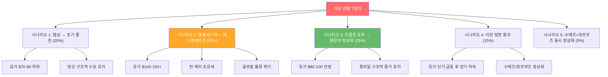

> **📢 섹터 구조 개편 안내 (2026.03.07)**
> 기존 조선/방산/원전 통합 문서가 다음과 같이 재편되었습니다:
> - **방산** → [방산/우주 섹터](/knowledge/invest/2026/03/07/defense-space-sector-outlook-2026.html) (방산, 드론/UAM, 우주/위성)
> - **원전** → [에너지 섹터](/knowledge/invest/2026/03/07/energy-sector-outlook-2026.html) (원전/SMR, 재생에너지, ESS, 수소)
> - **조선** → [모빌리티/로봇 섹터](/knowledge/invest/2026/01/21/automotive-robotics-sector-outlook-2026.html) 하위 섹터
>
> 이 문서는 기존 독자를 위해 유지되며, 조선 섹터 중심으로 업데이트됩니다.

> **관련 글**: [2026년 투자 섹터 전망 (전체)](/knowledge/invest/2026/01/20/investment-sectors-outlook-2026.html)

## 핵심 요약 (2026년 3월 7일 기준)

| 섹터 | 전망 | 핵심 촉매 | 주요 리스크 |
|------|------|----------|------------|
| 방산 | **★★★ 초강세** | **천궁-II 실전 90% 명중률**(UAE), EU €150B 방산 대출, 한화 노르웨이 천무 ₩2.8T, 글로벌 방산 $2.6T(+8.1%), NATO 3.5%, 필리핀 10대 MOU | 전쟁 조기 종전 시 모멘텀 약화 |
| 조선 | **★★★ 초강세** | **호르무즈 5일+ 완전 봉쇄**, LNG 일일용선료 $200K+(2배), HD현대 LNG 4척 ₩1.49T, 카타르 128척 LNG 확대, **Brent $89.44(+25%)** | 봉쇄 조기 해제, 철강 관세 |
| 원전 | **★★ 강세** | **i-SMR 규제심사 개시(3/5-6)**, 유가 $89→원전 경제성 극대화, 일미 $550B 패키지, 필리핀 4,800MW 로드맵, KHNP-태국 SMR | 프로젝트 지연, 규제 리스크 |

---

## ★★★ 이란 전쟁 7일차 (3/1~7) — 전 섹터 최대 호재

### 전쟁 경과

| 시점 | 내용 |
|------|------|
| **2/28~3/1** | 미국 **"Operation Epic Fury"** + 이스라엘 **"Operation Roaring Lion"** — 이란 핵시설·미사일 시설 타격 |
| **3/1** | **이란 최고지도자 하메네이 사망** 확인 |
| **3/1~2** | 이란 보복: **7개국(이스라엘·UAE·카타르·쿠웨이트·바레인·요르단·사우디)** 공격 |
| **3/2** | **호르무즈 해협 봉쇄 실행** — 일일 1,500만 배럴 원유 수송 차질 |
| **3/2** | MSC 중동 화물 전면 중단, Maersk 호르무즈/수에즈 통행 정지 |
| **3/3** | 방산주 폭등 — KOSPI -7.24%(5,792) 속에서 방산 독보적 강세 |
| **3/3** | 트럼프, **DFC 보험 + 유조선 군사 호위** 발표 (~4주 소요) |
| **3/4** | **사우디·UAE, 미국-이스라엘 연합 공식 합류** |
| **3/4~5** | 쿠르드 반군, 이란 국경 지상작전 개시 |
| **3/5** | **P&I 보험 공식 발효** — 미 호위 없이 호르무즈 통행 경제적 불가능 |
| **3/5** | 호르무즈 양측에 **수백 척 유조선 정박** (5일+ 통행 차단) |
| **3/5** | 미군, **이란 군함 20척+ 격침**. 미 국방장관 **"작전 최대 8주"** |
| **3/5** | **이란, 제3국 통해 CIA에 협상 시그널** 전달 |
| **3/5** | KOSPI **+9.63% 반등** (2008년 이후 최대) |
| **3/6** | **테헤란 중폭격 지속** — 수도 직접 타격 단계 |
| **3/6** | **호르무즈 유조선 통행 5일+ 차단** 확인 — 사실상 완전 봉쇄 |

### ★ 천궁-II 실전 배치 성공 — K-방산 역사적 전환점 (3/5)

| 항목 | 내용 |
|------|------|
| **명중률** | **90%** — 이란 미사일 실전 요격 성공 |
| **계약** | UAE $3.5B 천궁-II 계약 (2022.1), **10개 포대 중 2개 배치 완료** |
| **의미** | **K-방산 무기체계 최초 실전 검증** — 수출 신뢰도 획기적 상승 |
| **시장 반응** | 한화에어로+KAI **+8%** (3/5) |
| **파급 효과** | 사우디 ₩20조 패키지(천궁 포함), 중동·유럽 대공 미사일 수출 가속 |

> **핵심 포인트**: 무기체계 수출에서 **실전 검증(combat-proven)**은 최고의 마케팅. 이스라엘 Iron Dome이 실전 성공으로 글로벌 표준이 된 것처럼, **천궁-II 90% 명중률은 K-방산 대공 미사일 수출의 게임체인저**.

### 유가 동향 (3/7 기준)

| 항목 | 수치 |
|------|------|
| **Brent** | **$89.44** (전쟁 개시 이후 **+25%**) |
| **전쟁 전 Brent** | ~$71 |
| **Barclays 전망** | **$100/barrel** |
| **봉쇄 장기화 시** | **$100~150/barrel** |
| **OPEC+** | 206,000 bpd 증산 발표 (봉쇄 1,500만 bpd 대비 미미) |

### 섹터별 영향

#### 방산 — 실전 검증 + 전시 예산 폭발

| 촉매 | 내용 |
|------|------|
| **1. 천궁-II 실전 90%** | UAE에서 이란 미사일 요격 — K-방산 최초 실전 검증 |
| **2. 글로벌 방산 $2.6T** | 2026년 글로벌 방산 지출 **$2.6조(+8.1% YoY)** — 역대 평시 최대 |
| **3. EU €150B 방산 대출** | **3/6 합의** — ReArm Europe 총 €800B 패키지의 핵심 |
| **4. NATO GDP 3.5%** | 방산 GDP 목표 **3.5%** (기존 2%에서 대폭 상향) |
| **5. 중동 방위력 강화** | 이란 보복 받은 7개국 → 자체 방위력 강화 긴급 → 천궁-II 수출 가속 |

#### 조선 — 호르무즈 완전 봉쇄 + LNG 용선료 2배

| 영향 | 내용 |
|------|------|
| **호르무즈 5일+ 차단** | 유조선 통행 사실상 중단, 수백 척 정박 |
| **P&I 보험 발효** | 미 호위 없이 통행 경제적 불가능 (3/5~) |
| **LNG 용선료 $200K+** | 일일용선료 거의 **2배 급등** → LNG선 경제성 극대화 |
| **톤마일 구조적 증가** | 희망봉 우회 → 항해 거리 2배 → 선박 수요 폭발 |
| **Brent $89.44** | 유가 +25% → 미국 LNG 대체 수요 확대 → LNG선 추가 발주 |

#### 원전 — 유가 $89 + 에너지 안보 + i-SMR 규제심사

| 영향 | 내용 |
|------|------|
| **유가 $89.44** | 원유 발전 비용 급등 → **원전 경제성 대폭 개선** |
| **에너지 안보** | 호르무즈 봉쇄 → 원유 30% 수송 차질 → 각국 원전 투자 가속 |
| **한국 276만 배럴/일** | 호르무즈 의존 존재적 위협 → 원전 확대 불가피 |
| **역사적 패턴** | 1·2차 오일쇼크 → 원전 건설 붐 반복 |

---

## 방산 섹터 상세

### K-방산 핵심 수치

| 항목 | 수치 |
|------|------|
| **K-방산 빅4 2026 매출 전망** | **50.6조원** (+26% YoY) |
| **방산 빅4 수주잔고** | **101조 2,918억원** (+26.6% YoY) |
| **한화에어로 2025 매출** | **26.6조원** (+137%), OP 3.03조원 |
| **한화에어로 해외 수출 비중** | 2025년 **50% 초과** (사상 최초) |
| **한화에어로+KAI 2026 수주목표** | **~32조원** |
| **KF-21 공군 배치** | **2026년 하반기 최초 배치** |

### ★ EU €150B 방산 대출 합의 (3/6)

| 항목 | 내용 |
|------|------|
| **규모** | **€150B (약 230조원)** 방산 대출 |
| **배경** | ReArm Europe 총 €800B 패키지 — €650B 재정여력 + **€150B SAFE 대출** |
| **SAFE 규정** | EU 이사회 채택 완료 |
| **7대 역량 격차** | 대공미사일, 포병/탄약, 드론/대드론, 군사인프라, AI/전자전, 전략수송 |
| **K-방산 수혜** | K9·천무·K2·천궁-II → 유럽 7대 역량 격차 직접 대응 가능 |

### ★ 한화에어로스페이스 노르웨이 천무 ₩2.8T (신규)

| 항목 | 내용 |
|------|------|
| **규모** | **₩2.8조원** (풀패키지) |
| **내용** | 천무 다연장로켓 시스템 수출 |
| **의미** | 폴란드(18.6조), 노르웨이(2.8조), 에스토니아 → 유럽 천무 도미노 확산 |

### K-방산 수출 파이프라인

| 수출 건 | 규모 | 상태 |
|---------|------|------|
| **천궁-II (UAE)** | **$3.5B** | **실전 배치 완료, 90% 명중률 입증** |
| **캐나다 잠수함 CPSP** | **48조원** | 3/2 마감 완료, Q2 2026 결정 |
| **폴란드 천무 (누적)** | **18.6조원** | 3차(5.6조) 계약 완료 |
| **노르웨이 천무** | **₩2.8조원** | **계약 완료** |
| **에스토니아 천무** | 미정 | 수출 확정 — 발트3국 교두보 |
| **루마니아 IFV (레드백)** | **~4조원** | 협상 중 |
| **사우디 패키지** | **~20조원** | 협상 중 (천궁-II 실전 성공 → 협상력 극대화) |
| **필리핀 방산** | 미정 | 3/3 MOU 체결 — **10대 MOU**(방산·조선·원전·AI 등) |
| **UAE KF-21 패키지** | **$15B** | 추진 중 |
| **한-필리핀 10대 MOU** | 방산·조선·원전·AI 등 | **3/3 이재명 대통령 국빈 방문** |
| **루마니아 K9/K10 공장** | 현지 생산 | 2026년 착공, 한화 유럽 첫 생산센터 |

### 방산 관련 종목

| 종목 | 투자 포인트 | 최근 주가 반응 |
|------|-----------|--------------|
| 한화에어로스페이스 | 매출 26.6조(+137%), 천궁-II 실전 성공, 노르웨이 ₩2.8T, 사우디 20조 | 3/5 **+8%** (천궁-II) |
| 한화오션 | 캐나다 잠수함 48조, Philly 조선소 10척, 호르무즈 해군 수요 | |
| 한화시스템 | 레이더/전자전, 전시 수요 | 3/3 **상한가** |
| LIG넥스원 | 미사일/정밀유도무기, 전시 수요 | 3/3 **상한가** |
| KAI | KF-21 하반기 배치, UAE $15B | 3/5 **+8%** |
| 현대로템 | K2·K-IFV, 폴란드 납품 | 3/3 **+10.63%** |

---

## 조선 섹터 상세

### 핵심 수치 (3/7 기준)

| 항목 | 수치 |
|------|------|
| **호르무즈 봉쇄** | **5일+ 유조선 통행 차단**, 수백 척 정박 |
| **LNG 일일용선료** | **$200,000+** (거의 2배 급등) |
| **LNG 운반선 평균 선가** | **$260M+** (170,000m3급) |
| **HD현대 2026 수주 목표** | **$233.1억 (+29%)**, 현재 $43.8억 (18.8%) |
| **HD현대 LNG 수주** | **4척 ~₩1.49조** (아메리카 지역, 2029년 인도) |
| **한화오션 2026 수주 목표** | **$177억 (+82%)** |
| **합산 영업이익 전망** | **+45% YoY 성장** |
| **한화오션 OP** | **1.78조원** (2024 대비 7.5배) |

### ★ HD현대 LNG 4척 ₩1.49T 수주 (신규)

| 항목 | 내용 |
|------|------|
| **규모** | LNG 운반선 **4척, ~₩1.49조원** |
| **발주처** | 아메리카 지역 선주 |
| **인도** | **2029년** |
| **2026 수주 현황** | 목표 $233.1억 중 **$43.8억 달성 (18.8%)** — Q1 기준 양호 |

### ★ LNG선 시장 폭발 (3/7 업데이트)

| 항목 | 내용 |
|------|------|
| **LNG 일일용선료** | **$200,000+ 급등** — 거의 2배 상승 |
| **LNG 평균 선가** | **$260M+** (170,000m3급) |
| **삼성중공업** | **GTT LNG 탱크 설계** 계약 — 180,000m3급, 2028년 인도 |
| **한화오션** | **GTT LNG 탱크 설계 7척** 계약 |
| **카타르 QC-Max** | CSSC에 **6척 추가 발주** — 총 **128척** LNG 선대 확장 |
| **QC-Max 규모** | **271,000m3** (세계 최대급) |
| **발주 전망** | 2026년 50척 → 2027년 **100척** (Clarkson Research) |

### 호르무즈 봉쇄 → 조선 영향

| 영향 경로 | 내용 |
|----------|------|
| **5일+ 완전 봉쇄** | 유조선 통행 사실상 중단, 수백 척 정박, Brent $89.44(+25%) |
| **P&I 보험 발효** | 미 호위 없이 통행 경제적 불가능 → 최소 4~8주 공백 |
| **톤마일 구조적 증가** | 희망봉 우회 → 항해 거리 2배 → 선박 회전율 급감 → 유조선/LNG선 수요 폭발 |
| **해운사 운항 중단** | MSC·Maersk 중단 → 가용 선박 부족 심화 |
| **LNG 대체 수요** | 중동 에너지 불안 → 미국 LNG 수출 확대 → LNG선 추가 발주 가속 |
| **LNG 용선료 $200K+** | 수혜 → 선주 수익성 극대화 → 신규 발주 인센티브 |

### 관련 종목

| 종목 | 투자 포인트 | 리스크 |
|------|-----------|--------|
| HD현대중공업 | 수주 $233억(+29%), LNG 4척 1.49조, 특수선 $3B, MASGA, 사우디 프리깃함 | 철강 관세 |
| 삼성중공업 | GTT LNG 탱크 설계, FLNG 기술 1위, LNG선 수혜 | 실적 변동성 |
| 한화오션 | OP 1.78조(7.5배), GTT 7척, 캐나다 잠수함, Philly 10척 | 봉쇄 장기화 |

---

## 원전 섹터 상세

### 핵심 수치 (3/7 기준)

| 항목 | 수치 |
|------|------|
| **유가** | Brent **$89.44** (+25%) → 원전 경제성 극대화 |
| **우라늄** | **$86.20/lb** (피크 $101.50 대비 하락, 전년비 +32%) |
| **i-SMR 규제심사** | **3/5-6 NSSC 규제심사 착수** — 핵심 마일스톤 |
| **SMR 특별법** | 2/12 국회 통과 |
| **SMR 예산** | 상용화 1,000억원+ + 원전산업 성장기금 1,000억원 |
| **국내 SMR 설치 목표** | 2030년 |
| **필리핀 원전 로드맵** | **1,200MW by 2032 → 4,800MW by 2050** |

### ★ i-SMR 규제심사 개시 (3/5-6) — 한국 SMR 핵심 마일스톤

| 항목 | 내용 |
|------|------|
| **일정** | **3/5-6 원자력안전위원회(NSSC) 규제심사 착수** |
| **대상** | 한국형 소형모듈원자로 **i-SMR** |
| **의미** | SMR 특별법(2/12 통과) 이후 **실질적 상용화 첫 단계** |
| **다음 단계** | 규제 승인 → 시제기 건설 → 2030 국내 설치 목표 |
| **투자 시사점** | 한전기술(설계 주관), 두산에너빌리티(기자재) 직접 수혜 |

### ★ 글로벌 원전·SMR 모멘텀 (3/7 기준)

| 이벤트 | 내용 |
|--------|------|
| **KHNP-태국 EGAT** | SMR 협력 세미나 개최 — 동남아 SMR 시장 개척 |
| **미 USTDA** | 필리핀 SMR 타당성 조사에 **$2.7M** 지원 |
| **필리핀 로드맵** | **1,200MW by 2032 → 4,800MW by 2050** |
| **일미 투자 패키지** | **$550B** — 원전 프로젝트 포함 (3/5) |
| **Cameco-인도** | 장기 우라늄 공급 계약 (3/2) |
| **Oklo-Meta** | 오하이오 **1.2GW 원전 캠퍼스** (3/4) |
| **NuScale-TVA** | **최대 6GW SMR 배치** 합의 |

### 우라늄 동향

| 항목 | 수치 |
|------|------|
| **현재가** | **$86.20/lb** |
| **피크** | $101.50/lb (1월) |
| **전년비** | **+32%** |
| **Cameco-인도** | 장기 공급 계약 (3/2) — 신규 수요처 확대 |
| **구조적 공급 부족** | 전 세계 원전 재가동·신규 건설 → 우라늄 수요 > 공급 지속 |

### 관련 종목

| 종목 | 투자 포인트 | 리스크 |
|------|-----------|--------|
| 두산에너빌리티 | SMR 생산라인 착공(806.8억), i-SMR 규제심사 수혜, NuScale 기자재 | 프로젝트 지연 |
| 한전기술 | i-SMR 설계 주관, 규제심사 개시 직접 수혜, 필리핀 바탄 NPP MOU | 해외 수주 불확실 |
| 카메코 (CCJ) | 우라늄 $86.20(+32% YoY), 인도 장기 계약, 구조적 공급 부족 | 가격 변동성 |

---

## 한국 원자력잠수함 건조 미국 허가

| 항목 | 내용 |
|------|------|
| **핵심** | 트럼프 대통령, 한국의 원자력잠수함 건조 허가 |
| **배경** | 이재명 대통령이 무역·안보 협상 과정에서 확보 |
| **특별법** | 2026.1 국방부 특별법 추진 — 123 협정 우라늄 농축 불허 → 신규 협정 필요 |
| **타임라인** | 시작부터 완성까지 **10년+ 소요** |
| **투자 시사점** | 한화오션·HD현대중공업 장기(10년+) 밸류에이션 리레이팅 촉매 |

---

## 캐나다 잠수함 48조원 — Q2 2026 결과 대기

| 항목 | 내용 |
|------|------|
| 사업 규모 | **~48조원, 잠수함 12척** |
| 한국 측 | **한화오션 + HD현대중공업 컨소시엄** |
| 경쟁사 | 독일 TKMS |
| 마감 | **3/2 최종 제안서 제출 완료** |
| 사업자 발표 | **Q2 2026 예정** |
| 한화오션 제안 | 2032년 첫 인도 (TKMS 대비 3년 빠름) |
| **투자 시사점** | K-방산 역사상 최대 단일 계약. 이란 전쟁으로 잠수함 전략 가치 극대화 |

---

## 지정학 리스크 — 이란 전쟁 시나리오 (3/7 업데이트)

| 시나리오 | 확률 | 유가 | 방산 | 조선 | 원전 |
|---------|------|------|------|------|------|
| **1. CIA 협상 → 조기 종전** | 20% | $70-80 | 구조적 유지 | 정상화 점진적 | 모멘텀 약화 |
| **2. 봉쇄 장기화** | **35%** | **$100-150+** | **초강세** | **초강세** | **초강세** |
| **3. 호위 → 제한 정상화** | 25% | $80-100 | 강세 | 톤마일 증가 | 강세 |
| **4. 이란 정권 붕괴** | 15% | 급등→하락 | 유지 | 정상화 | 중립 |
| **5. 완전 정상화** | 5% | 하락 | 유지 | 조정 | 약화 |

> **3/7 변화**: 테헤란 중폭격 + 5일+ 봉쇄 지속 → 시나리오 2(봉쇄 장기화) 확률 30%→**35%** 상향. CIA 협상 시그널에도 불구하고, 테헤란 폭격 강도로 볼 때 미국이 더 유리한 조건을 추구 중.

---

## 기타 핵심 이슈

### 관세 체계 정리

| 관세 항목 | 상태 | 조선/방산 영향 |
|----------|------|---------------|
| **IEEPA 상호관세** | **위헌 판결** → 무효 | 긍정적 |
| **Section 122 15%** | 2/24 발효 | 대미 수출 비용 증가 |
| **철강/알루미늄** | 3/12 **25%** → 6/4 **50%** | 조선 원자재 비용 부담 |
| **MASGA 감면** | 25%→15% 조건부 | 한국 $1,500억 투입 조건 |

### MASGA 해양 액션플랜

| 항목 | 내용 |
|------|------|
| 핵심 | 동맹국 조선소에서 초도함 건조 허용 |
| 한국 투입 규모 | **$1,500억** (관세 감면 조건) |
| 한화 | 미 해군 프리깃함 건조 참여 |
| HD현대중공업 | 복수의 미국 조선사 인수 협상 중 |
| **호르무즈 효과** | 미 해군 선박 부족 → MASGA 긴급성 극대화 |

### 수출입은행법 법정자본금 30조 상향 발의

| 항목 | 내용 |
|------|------|
| 현행 | 15조원 |
| 발의 | **30조원 상향** |
| 진행 | 기재위 계류 중 |
| 수혜 | K-방산·조선 수출 금융 지원 확대 |

---

## 투자 전략

### 현 시점 핵심 액션

| 전략 | 내용 |
|------|------|
| **3섹터 삼각 포트폴리오** | 방산(전시+실전검증) + 조선(봉쇄+LNG) + 원전(에너지안보+SMR) |
| **방산 최우선** | 천궁-II 90% 명중률 = 게임체인저. EU €150B 대출. 한화+KAI +8%(3/5) |
| **유가 $89→$100 대비** | 원전·에너지 안보 테마 비중 확대, Barclays $100 전망 |
| **LNG 수혜 극대화** | 용선료 $200K+(2배), 선가 $260M+. HD현대·삼성중공업·한화오션 |
| **캐나다 잠수함 Q2** | 한화오션·HD현대 리레이팅 대기 |
| **i-SMR 규제심사** | 한전기술·두산에너빌리티 장기 모멘텀 |

### 섹터별 전략

#### 방산 — ★★★ 최우선

- **단기**: 천궁-II 90% 실전 → 중동·유럽 대공 미사일 수출 폭발, EU €150B 방산 대출
- **중기**: 글로벌 $2.6T(+8.1%), NATO 3.5%, 한화+KAI 32조 수주목표
- **장기**: K-방산 빅4 매출 50.6조, 유럽 현지 생산(루마니아 K9/K10 공장 2026 착공)

#### 조선 — ★★★ 격상

- **단기**: 호르무즈 5일+ 봉쇄 → LNG 용선료 $200K+(2배), Brent $89.44, P&I 보험 발효
- **중기**: HD현대 $233억(+29%), 카타르 128척 LNG, MASGA $1,500억
- **장기**: LNG선 2027년 100척, 수익성 슈퍼사이클, 한국 원잠 건조

#### 원전 — ★★

- **단기**: 유가 $89 + i-SMR 규제심사 개시 → 원전 경제성·정책 모멘텀 동시 강화
- **중기**: Oklo-Meta 1.2GW, NuScale-TVA 6GW, 필리핀 4,800MW 로드맵
- **장기**: 일미 $550B 패키지, AI 전력 수요 + 빅테크 원전, 글로벌 SMR 상용화

---

## 리스크 요인

| 리스크 | 영향 | 대응 |
|--------|------|------|
| **봉쇄 조기 해제** | 유가 하락, 해운 수요 정상화 | 고부가가치 선종(LNG, 군함) 집중 |
| **전쟁 장기화 $100+** | 글로벌 인플레이션, 경기침체 | 에너지·방산 비중 유지, 시장 리스크 관리 |
| **방산주 고점 조정** | 3/3-5 폭등 후 차익 실현 | 장기 구조적 성장 기반 분할 매수 |
| **철강 관세 50% (6/4)** | 조선 원자재 비용 | MASGA 감면, 미국 현지 생산 |
| **중국 LNG선 경쟁** | 카타르 CSSC 6척 추가 등 | 기술·품질 차별화, MASGA 미국 물량 |
| **우라늄 가격 하락** | $86.20 (피크 $101.50 대비 -15%) | 장기 공급 부족 + 에너지 안보 수요 지속 |
| **캐나다 잠수함 탈락** | 한화오션 기대감 후퇴 | 기존 수주 잔고 기반 유지 |

---

## 모니터링 체크리스트

1. **★★★ 이란 전쟁 7일차** — 테헤란 폭격 강도, CIA 협상 후속, 미 국방장관 "8주" 작전 전개
2. **★★★ 호르무즈 봉쇄** — 5일+ 유조선 차단 지속 여부, 트럼프 호위 시작(~4-8주), 통행 재개 시점
3. **★★★ 유가** — Brent $89.44→$100 돌파 여부, Barclays $100 전망
4. **★★★ 천궁-II 후속** — 90% 명중률 → 사우디 ₩20조 패키지 협상 가속, 추가 수출 계약
5. **★★ LNG 시장** — 용선료 $200K+ 지속 여부, 카타르 128척 확장, 2026 50척/2027 100척 발주
6. **★★ i-SMR 규제심사** — NSSC 심사 진행 상황, 한전기술·두산에너빌리티 수혜
7. **★★ EU €150B 방산 대출** — 집행 일정, K-방산 유럽 수주 구체화
8. **★★ 캐나다 잠수함 Q2 결과** — K-방산 역사상 최대 계약
9. **★ 한-필리핀 MOU 후속** — 원전·조선·방산 구체 계약
10. **★ 일미 $550B 패키지** — 원전 프로젝트 구체화
11. **3/12 철강/알루미늄 25% 관세** → 6/4 50% 확정 여부
12. **수은법 30조 기재위 심의** — 통과 시점
13. **HD현대 수주 달성률** — $233억 중 $43.8억(18.8%), 연간 목표 달성 페이스

---

**투자 결정은 본인의 리스크 허용 범위와 투자 기간을 고려하여 신중하게 내리시기 바랍니다. 이란 전쟁 7일차, 테헤란 폭격과 호르무즈 5일+ 봉쇄가 지속되면서 유가 $89.44(+25%). 천궁-II 실전 90% 명중률은 K-방산 역사적 전환점. CIA 협상 시그널에도 불구하고 봉쇄 장기화 확률이 높아 포지션 관리에 유의하시기 바랍니다.**

---

## 하위 섹터 상세 분석

각 하위 섹터에 대한 더 깊은 분석은 아래 글들을 참고하세요.

- [조선 투자 전망](/knowledge/invest/2026/01/21/shipbuilding-sector-outlook-2026.html) - LNG선/조선 슈퍼사이클 분석
- [원전 투자 전망](/knowledge/invest/2026/01/21/nuclear-power-sector-outlook-2026.html) - SMR/원전 르네상스 분석
- [방산 투자 전망](/knowledge/invest/2026/01/21/defense-sector-outlook-2026.html) - K-방산 수출 호조 분석
