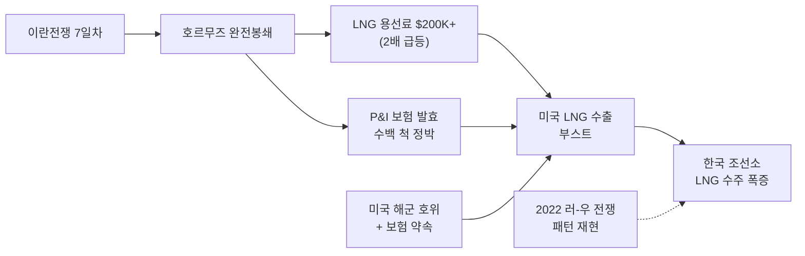

> **관련 글**: [2026년 투자 섹터 전망 (전체)](/knowledge/invest/2026/01/20/investment-sectors-outlook-2026.html) | [조선/방산/원전 섹터 전망](/knowledge/invest/2026/01/21/shipbuilding-defense-nuclear-sector-outlook-2026.html)

## 3월 7일 핵심 업데이트

| 날짜 | 이벤트 | 조선 영향 |
|------|--------|---------|
| **3/7** | **이란전쟁 7일차** — 호르무즈 완전봉쇄, 탱커 5일+ 통행 차단 (3/4 기준) | **2022 러-우 전쟁 패턴 재현** — LNG선 발주 폭증 임박 |
| **3/7** | **LNG 탱커 일일 용선료 $200,000+ 돌파** (수일 만에 ~2배) | LNG선 신조 경제성 급상승 → **발주 결정 촉진** |
| **3/7** | **미국, 석유/가스 수출 선박에 해군 호위 + 보험 제공** 약속 | 미국 LNG 수출 확대 → 한국 조선소 수주 직접 수혜 |
| **3/7** | **HD현대중공업** LNG 4척 ~₩1.49조 (아메리카, 2029 H2 인도) | 누적 29척, 수주 달성률 18.8% |
| **3/7** | **삼성중공업** GTT LNG 탱크 설계 — 180,000m3 Mark III Flex (유럽 선주, 2028 인도) | LNG선 수주 파이프라인 확인 |
| **3/7** | **한화오션** GTT LNG 7척 탱크 설계 계약 | LNG선 대규모 수주 가시화 |
| **3/7** | **카타르** QC-Max 6척 CSSC 추가발주 (총 128척 확장) | LNG 170K급 척당 **$2.6억+** (상승 중) |
| **3/5** | **P&I 보험 공식 발효** — 수백 척 유조선 정박 | 미 호위 없이 통행 불가 → 우회 항로 고착화 |
| **3/3** | **필리핀-한국 조선 MOU** (이재명 국빈 방문) | 세계 2위·4위 조선국 협력 |

---

## ★★★ 호르무즈 봉쇄 → 2022 러-우 패턴 재현

### 핵심 투자 로직

**2022년 러시아-우크라이나 전쟁 당시**, 유럽의 러시아 가스 의존도 탈피 → 미국·카타르 LNG 수입 전환 → **LNG선 발주 급증**이 발생했습니다. 지금 동일한 패턴이 반복되고 있습니다:

| 2022 러-우 전쟁 | 2026 이란 전쟁 |
|----------------|--------------|
| 러시아 가스 공급 차단 | 호르무즈 해협 완전봉쇄 |
| 유럽 → 미국/카타르 LNG 전환 | 중동 에너지 불안 → 미국 LNG 수출 확대 |
| LNG선 발주 급증 | **LNG선 발주 폭증 예상** |
| LNG 용선료 급등 | **$200,000+/일 (수일 만에 2배)** |

### 봉쇄 현황 (3/7 업데이트)

| 항목 | 내용 |
|------|------|
| **전쟁 경과** | **7일차** — 호르무즈 사실상 완전봉쇄 |
| **탱커 통행** | **5일+ 차단** (3/4 기준 baseline) |
| **LNG 용선료** | **$200,000+/일** (수일 만에 ~2배 급등) |
| **P&I 보험** | **3/5 공식 발효** — 호르무즈 양측 **수백 척 유조선 정박** |
| **미국 대응** | **석유/가스 수출 선박에 해군 호위 + 보험 제공** 약속 |
| **국방장관** | **"작전 최대 8주 소요"** (호위 개시까지 4~8주 공백) |
| **규모** | 세계 해상 원유 수송의 **30%**, **일일 1,500만 배럴** |
| **연합** | 3/4 **사우디·UAE** 미-이스라엘 연합 공식 합류 |
| **한국 영향** | 일일 원유 수입 **276만 배럴** → 에너지 안보 직접 영향 |
| **해운** | **MSC** 중동 화물 전면 중단, **Maersk** 호르무즈/수에즈 통행 정지 |

### 조선 영향 메커니즘

| 영향 경로 | 상세 |
|----------|------|
| **톤마일 구조적 증가** | 호르무즈 우회 → 희망봉 경유 → 항해 거리 ~**2배** → 선박 수요 급증 |
| **LNG 대체 수요** | 중동 에너지 불안 → **미국 LNG 수출 부스트** → LNG선 발주 가속 |
| **용선료 급등** | $200K+/일 → 신조선 경제성 대폭 개선 → 발주 결정 촉진 |
| **가용 선박 부족** | MSC·Maersk 운항 중단 + 수백 척 정박 → 신조선 발주 촉진 |
| **군함 수요** | 미 해군 추가 전개 필요 → MASGA 군함 수주 긴급성 극대화 |
| **장기 효과** | 봉쇄 해제 후에도 지정학 리스크 인식 → 대체 항로 대비 선박 확보 지속 |

---

## LNG운반선: 발주 폭증 임박

### Clarkson Research 전망 + 호르무즈 효과

| 연도 | 기존 전망 | 호르무즈 효과 |
|------|----------|-------------|
| **2026년** | **50척** | 봉쇄 → **상향 가능** |
| **2027년** | **100척** | 미국 LNG FID 본격화 + 대체 수요 |

### 최근 LNG/탱크 설계 수주 동향

| 계약 | 내용 |
|------|------|
| **HD현대 LNG 4척** | ~**₩1.49조** (아메리카, 2029 H2 인도) |
| **삼성중공업 GTT** | **180,000m3** LNG 탱크 설계 — Mark III Flex (유럽 선주, 2028 인도) |
| **한화오션 GTT** | **7척** LNG 탱크 설계 계약 |
| **HD현대 LNG 기수주** | **$25.5억** (기확정) |
| **NYK LOI** | HD현대에 **최대 8척** LNG 의향서 (~$20.8억) |

### 카타르 LNG 선대 확장

| 항목 | 내용 |
|------|------|
| **최신 발주** | QatarEnergy → **CSSC에 QC-Max 6척** 추가발주 |
| **QC-Max 규모** | **271,000m3** (세계 최대 LNG선) |
| **QC-Max 누적** | **24척** |
| **LNG 선대 총계** | **128척** 확장 프로그램 |
| **인도 시기** | **2028~2031년** |
| **170K급 가격** | 척당 **$2.6억+** (상승 중) |

### 한국 vs 중국 LNG선 경쟁

| 구분 | 한국 | 중국 |
|------|------|------|
| 점유율 | ~70% | 확대 중 (카타르 QC-Max 수주) |
| 기술력 | 멤브레인 화물창 독보적 | 추격 중 |
| 가격 | ~$2.6억/척 | ~$2.3억 (12% 저렴) |
| 품질/신뢰 | 검증됨 | 일부 우려 잔존 |
| MASGA 수혜 | **직접 수혜** | 미수혜 |
| **미국 프로젝트** | **호르무즈 → 미국 LNG 부스트 → 유리** | 미국 프로젝트 배제 가능 |

### 투자 시사점

1. **호르무즈 봉쇄 → 미국 LNG 수출 부스트 → 한국 조선소 최대 수혜**: 미국이 해군 호위 + 보험까지 약속하며 LNG 수출 확대를 강력 추진
2. **LNG 용선료 $200K+ → 신조 경제성 급상승**: 선주들의 발주 결정이 빨라짐
3. **2022 러-우 패턴 재현**: 에너지 공급 불안 → LNG선 발주 급증은 이미 증명된 패턴
4. **카타르 128척 + 미국 FID → 2027년 100척 이상 가시적**
5. **삼성·한화 GTT 계약 → LNG선 수주 파이프라인 두터움 확인**

---

## 시장 동향

### 컨테이너선·유조선

| 항목 | 내용 |
|------|------|
| **Costamare** | **12,400TEU 컨테이너선 4척** 추가 발주 |
| **Capital Group** | 컨테이너선 신조를 **수에즈막스 유조선으로 전환** (석유 수요 시프트) |

> Capital Group의 **컨테이너 → 유조선 전환**은 호르무즈 봉쇄에 따른 유조선 수요 급증과 석유 수송 경로 변화를 반영한 시장 신호입니다.

---

## 3대 조선사 현황 (3/7 기준)

### HD현대중공업 (329180) — 업종 대장주

| 항목 | 내용 |
|------|------|
| **2026 수주 목표** | **$233.1억 (+29.1%)** |
| **현재 수주** | **$43.8억** (달성률 **18.8%**) |
| **누적 수주 현황** | LNG 10척, 컨테이너선 10척, LPG/암모니아 3척, 원유탱커 4척, 석유화학 2척 = **총 29척** |
| **최근 수주** | LNG 4척 **~₩1.49조** (아메리카, 2029 H2) |
| **특수선 목표** | **$3B (~3배 YoY)** |
| **특수선 파이프라인** | 사우디 프리깃함 5척 입찰, 필리핀·태국 프리깃함, 에스토니아 OPV, 페루 잠수함 |
| **모회사 OP** | HD한국조선해양 **3.9조원** |
| **MASGA** | $1,500억, 미국 조선사 인수 (2035년 매출 3조) |
| **호르무즈 수혜** | 미국 LNG 수출 부스트 → **LNG선 추가 수주 최대 수혜** |

### 삼성중공업 (010140) — FLNG 1위 + GTT

| 항목 | 내용 |
|------|------|
| **수주 목표** | **$139억 (+76%)** |
| **GTT LNG 탱크** | **180,000m3** Mark III Flex (유럽 선주, 2028 인도) |
| **기술** | FLNG 글로벌 1위 |
| **LNG 수혜** | 2026년 50척 → 2027년 100척 |

### 한화오션 (042660) — OP 7.5배 + GTT 7척

| 항목 | 내용 |
|------|------|
| **OP** | **1.78조원 (7.5배 성장)** |
| **GTT 계약** | **7척** LNG 탱크 설계 계약 |
| **캐나다 잠수함** | **48조원** (3/2 마감, Q2 결정) |
| **미국 사업** | Philly Shipyard **LNG선 + 유조선 10척** |
| **MASGA** | 초도함 건조 + 프리깃함 |
| **수주 목표** | **$177억 (+82%, 합병 효과)**, 실질 ~$120억 |

### 수익성 슈퍼사이클

| 항목 | 내용 |
|------|------|
| 합산 영업이익 | **+45% YoY 성장** 전망 |
| 한화오션 OP | **1.78조원** (2024 대비 **7.5배**) |
| HD한국조선해양 OP | **3.9조원** |
| 의미 | 수주 + 수익성 동반 성장 = **슈퍼사이클 진행 중** |

---

## 기타 주요 이슈

### 필리핀-한국 조선 MOU (3/3)

이재명 대통령 국빈 방문(3/3~4) 시 **조선 협력 MOU**가 체결되었습니다. 세계 **2위(한국)·4위(필리핀)** 조선국 간 협력으로, 한국 조선기술 이전 + 필리핀 인력 활용 시너지가 기대됩니다.

### MASGA 해양 액션플랜

| 항목 | 내용 |
|------|------|
| 한국 투자 | **$1,500억** (약 219조원) |
| 동맹국 초도함 | 건조 허용 (미국 내 건조 원칙 완화) |
| 한화 | 미 해군 프리깃함 건조 참여 |
| HD현대중공업 | 미국 복수 조선사 인수 (2035년 매출 3조원 목표) |
| **호르무즈 효과** | 미 해군 선박 부족 → MASGA 긴급성 극대화 |

### 캐나다 잠수함 CPSP 48조원

| 항목 | 내용 |
|------|------|
| 사업 규모 | **~48조원** (12척) |
| 한국 측 | **한화오션 + HD현대중공업 컨소시엄** |
| 마감 | **3/2 최종 제안서 제출 완료** |
| 결과 발표 | **Q2 2026 예정** |

### 철강/알루미늄 관세

| 항목 | 내용 |
|------|------|
| 현행 | **25%** (3/12 발효) |
| 인상 예고 | **50%** (6/4 예정) |
| 대응 | 원자재 연동 계약 + 미국 현지 조달 → 영향 완화 |

---

## 투자 전략

### 시나리오별 접근

| 시나리오 | 확률 | 전략 |
|---------|------|------|
| **호르무즈 봉쇄 장기화 → 미국 LNG 부스트 → LNG선 폭증** | **매우 높음** | **3사 전체 비중 확대**, 특히 LNG선 수혜주 |
| **수주 목표 달성 + OP 45% 성장** | 매우 높음 | 한화오션(7.5배 성장) + HD현대중공업(대장주) |
| **LNG 2027년 100척 발주 가시화** | 높음 | HD현대중공업 + 삼성중공업 비중 확대 |
| **캐나다 잠수함 수주 성공** | 중간-높음 | 한화오션 리레이팅 |
| **봉쇄 조기 해제** | 낮음 | LNG·군함 구조적 수요 유지, 유조선 톤마일만 정상화 |
| **철강 관세 50% 발효** | 중간 | 원자재 연동 계약 + 미국 현지 조달 |

### 포트폴리오 배분

| 구분 | 비중 | 종목 | 근거 |
|------|------|------|------|
| 대장주 | 35% | HD현대중공업 | $233억(+29%), 누적 29척, LNG 미국 수혜, MASGA |
| 수익성 턴어라운드 | 30% | 한화오션 | OP 1.78조(7.5배), GTT 7척, 캐나다 잠수함, Philly 10척 |
| 해양/LNG | 25% | 삼성중공업 | $139억(+76%), FLNG, GTT 180K, LNG 2027 100척 |
| 기자재 | 10% | HD현대일렉트릭 | 조선 호황 후행 수혜 |

---

## 핵심 모니터링 포인트

1. **★★★ 호르무즈 봉쇄 + 미국 LNG 부스트** — 용선료 $200K+ 지속 여부, 미국 해군 호위 개시 시점, LNG선 신규 발주
2. **★★★ LNG선 발주 추이** — 2022 러-우 패턴 재현 여부, 2026 50척 / 2027 100척 달성률
3. **★★ HD현대 수주 진행률** — $233.1억 대비 $43.8억(18.8%), 누적 29척 기반 추가 수주
4. **★★ GTT 계약 후속** — 삼성 180K + 한화 7척 → 실제 LNG선 수주 전환
5. **★★ HD현대 특수선 $3B** — 사우디 프리깃함 5척 결과, 필리핀·태국·에스토니아·페루
6. **★ 캐나다 잠수함 Q2 결과** — 한화오션 리레이팅
7. **카타르 128척 추가분** — 한국 조선소 배분 비율
8. **MASGA 집행** — $1,500억 시행 일정, 초도함 계약
9. **철강 관세 6/4 50%** — 원가 영향
10. **합산 OP 45% 성장** — 분기 실적 추이

---

## 리스크 요인

| 리스크 | 영향 | 대응 |
|--------|------|------|
| **호르무즈 봉쇄 장기화** | 글로벌 물류 위기, 인플레이션 → 경기침체 시 발주 둔화 | 군함·LNG선 등 비경기민감 선종 집중 |
| **봉쇄 조기 해제** | 유조선 톤마일 정상화 (단, LNG·군함 수요 구조적 유지) | 장기 구조적 수요(LNG, 환경규제 교체) 유지 |
| **철강 관세 50%** | 후판 비용 상승 → 마진 압박 | 원자재 연동 계약, 미국 현지 조달 |
| **중국 LNG 경쟁** | 카타르 QC-Max CSSC 발주 등 점유율 잠식 | MASGA, 기술 차별화, 미국 프로젝트 한국 유리 |
| **인력 수급** | 건조 지연, 인건비 상승 | 외국인 근로자 확대, 필리핀 MOU 활용 |

---

## 결론

2026년 3월 7일 기준, 조선 섹터는 **이란전쟁 7일차 — 호르무즈 완전봉쇄**로 **2022년 러시아-우크라이나 전쟁 패턴이 정확히 재현**되는 국면입니다.

1. **LNG 탱커 일일 용선료가 $200,000+로 수일 만에 2배 급등**하며, 호르무즈 봉쇄의 즉각적 영향이 가격에 반영되고 있습니다. 미국이 석유/가스 수출 선박에 **해군 호위 + 보험 제공**을 약속하면서, 미국 LNG 수출 확대 → 한국 조선소 LNG 수주 급증의 경로가 확정되고 있습니다.

2. **HD현대중공업이 아메리카 LNG 4척 ~₩1.49조를 수주**(누적 29척, 달성률 18.8%)했고, **삼성중공업은 GTT 180,000m3 LNG 탱크 설계**, **한화오션은 GTT 7척 계약**을 체결하며 3사 모두 LNG선 파이프라인이 두텁습니다.

3. **카타르가 QC-Max 6척을 CSSC에 추가 발주**(총 128척)하며 글로벌 LNG 선대 확장이 가속화되고 있습니다. 170,000m3급 LNG선 가격이 **$2.6억+**으로 상승 중이며, 호르무즈 봉쇄로 추가 상승 압력이 존재합니다.

4. **3대 조선사 합산 영업이익 +45% YoY 성장** 전망은 유지되며, 호르무즈 봉쇄 장기화 시 **수주 목표 상향 가능성**도 열려 있습니다.

5. **리스크**: 봉쇄 조기 해제 시 유조선 톤마일 정상화 가능하나, LNG·군함 수요는 전쟁과 무관한 구조적 수요입니다. 철강 관세 50%(6/4)은 원자재 연동 계약으로 완화 가능합니다.

---

**면책 조항**: 본 글은 투자 참고 자료이며, 투자 결정에 대한 책임은 투자자 본인에게 있습니다. (2026년 3월 7일 업데이트)
