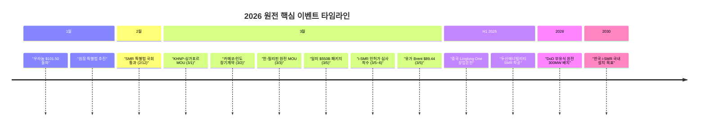

> **관련 글**: [2026년 투자 섹터 전망 (전체)](/knowledge/invest/2026/01/20/investment-sectors-outlook-2026.html) | [조선/방산/원전 섹터 전망](/knowledge/invest/2026/01/21/shipbuilding-defense-nuclear-sector-outlook-2026.html)

## 3월 7일 핵심 업데이트

| 날짜 | 이벤트 | 원전 영향 |
|------|--------|---------|
| **3/5~6** | **i-SMR 표준설계인가 심사 착수** (원안위) | 한국 독자 SMR 상용화 **핵심 마일스톤** — 2030년 설치 목표 가시화 |
| **3/5** | **유가 Brent $89.44** (이란전쟁 후 +25%) | P&I 보험 발효 + 유가 급등 → **원전 경제성 역대 최강** |
| **3/5** | **일미 $550B 투자 패키지** (원전 포함) | 미일 원전 동맹 강화, 아시아 원전 수요 가속 |
| **3월** | **KHNP-태국 EGAT SMR 세미나** | ASEAN SMR 시장 확장 — 싱가포르·필리핀 이어 **3번째 교두보** |
| **3월** | **USTDA $270만 필리핀 SMR 타당성 조사** | 미국도 필리핀 SMR 시장 진출 → 한미 경쟁/협력 구도 |
| **3/3~4** | **한-필리핀 KHNP+Meralco 3자 MOU** | 바탄 NPP + **신규 원전 프로젝트** 동시 추진 |
| **3/2** | **카메코-인도 장기 우라늄 공급 계약** | 우라늄 수요 구조적 확대 확인, 현재 $86.20/lb |

---

## ★★★ i-SMR 표준설계인가 심사 착수 (3/5~6)

**한국 원자력안전위원회(NSSC)**가 3월 5~6일 **i-SMR 표준설계인가 심사를 공식 개시**했습니다. SMR 기술개발사업단이 신청한 것으로, 한국 독자 SMR 상용화의 **핵심 마일스톤**입니다.

| 항목 | 내용 |
|------|------|
| **심사 개시** | 2026년 3월 5~6일 (원자력안전위원회) |
| **신청 주체** | SMR 기술개발사업단 |
| **i-SMR 사양** | 170MW, 한수원/한전기술 공동 개발 |
| **의미** | 설계 → **인허가** 단계 진입, 2030년 설치 목표 현실화 |
| **SMR 특별법** | 2/12 국회 통과로 법적 기반 확보 → 인허가 가속 기대 |

### 투자 시사점

1. **한전기술 직접 수혜**: i-SMR 설계 주관사로 인허가 통과 시 사업 가치 대폭 상승
2. **2030년 목표 가시화**: SMR 특별법(2/12) + 인허가 심사(3/5) → 예산 집행·기자재 발주 구체화
3. **i-SMR Holdings 설립 촉진**: 인허가 진전 시 사업 추진 주체 확립 가속
4. **글로벌 경쟁력**: NuScale(NRC 인증 유일) 독주에 한국이 **독자 인증 SMR** 가세

---

## ★★★ 유가 $89.44 + P&I 발효 — 원전 경제성 역대 최강

유가가 **Brent $89.44** (이란 전쟁 개시 후 **+25%**)까지 급등하면서 원전 경제성이 역대 최강 수준에 도달했습니다.

| 항목 | 내용 |
|------|------|
| **유가** | Brent **$89.44** (이란전쟁 후 +25%) |
| **P&I 보험** | **3/5 공식 발효** — 호르무즈 양측 수백 척 유조선 정박 |
| **전망** | 봉쇄 장기화 시 **$100~150/barrel** |
| **원전 영향** | 화석연료 발전 비용 급등 → **원전 LCOE 상대적 경쟁력 역대 최고** |

### 유가 시나리오별 원전 영향

| 유가 시나리오 | 원전 영향 | 수혜 종목 |
|-------------|---------|----------|
| **$89.44 (현재)** | 원전 경제성 대폭 개선, 에너지 안보 긴급 부각 | 전 섹터 강력 긍정 |
| **$100-150+ (봉쇄 장기화)** | 에너지 위기 → 원전 확대 국가적 과제, 오일쇼크 패턴 반복 | **원전 밸류체인 전체** |
| **$70-80 (협상 시)** | 원전 경제성 프리미엄 약화, 단 에너지 안보 인식 불가역 | 구조적 수요주 유지 |

### 역사적 패턴: 유가 급등 → 원전 건설 붐

| 시기 | 사건 | 결과 |
|------|------|------|
| 1973 | 1차 오일쇼크 | 글로벌 원전 건설 붐 |
| 1979 | 2차 오일쇼크 | 원전 투자 가속 |
| **2026** | **이란 전쟁 + 호르무즈 봉쇄 + Brent $89.44** | **원전 경제성 재부각 → 투자 가속** |

---

## ★★★ 동남아 원전 수출 — 3개국 교두보 확보

### KHNP-태국 EGAT SMR 세미나 (3월 신규)

| 항목 | 내용 |
|------|------|
| **배경** | 2025년 6월 KHNP-EGAT MOU 기반 |
| **참석** | KHNP, 한전기술, 한국전력기술서비스, KAERI, 두산에너빌리티 |
| **EGAT 부사장** | KHNP의 **"풍부한 원전 운영 경험과 기술 전문성"** 높이 평가 |
| **전략** | KHNP **ASEAN 전역 SMR 사업 확대** |
| **의미** | 싱가포르·필리핀 이어 **동남아 3번째 교두보** |

### 필리핀 원전 — 다중 트랙 진행

| 트랙 | 내용 | 주체 |
|------|------|------|
| **바탄 NPP 재가동** | 타당성 조사 MOU (3/3) | KHNP + 필리핀 |
| **KHNP+Meralco 3자 MOU** | 신규 원전 프로젝트 (이재명 방문, 3/3~4) | KHNP, Meralco |
| **USTDA $270만** | SMR 타당성 조사 (Meralco PowerGen) | 미국 USTDA |
| **필리핀 원전 로드맵** | **1,200MW (2032) → 2,400MW (2035) → 4,800MW (2050)** | 필리핀 정부 |

필리핀은 **4,800MW (2050년)**이라는 명확한 원전 로드맵을 제시하고 있어, **한국·미국 원전 기업에 장기 수주 파이프라인**을 제공합니다.

### 동남아 원전 시장 교두보 현황

| 국가 | 진행 | 한국 파트너 |
|------|------|-----------|
| **싱가포르** | KHNP MOU (3/1) | 원전 협력 초기 |
| **필리핀** | 바탄 NPP + 신규 MOU + USTDA 조사 | KHNP, 한전기술, 두산에너빌리티 |
| **태국** | KHNP-EGAT SMR 세미나 | KHNP, KAERI, 두산에너빌리티 |
| **인도네시아** | SMR 도입 검토 중 | 협의 중 |

---

## ★★ 일미 $550B 투자 패키지 (3/5)

| 항목 | 내용 |
|------|------|
| **규모** | **$550B (약 660조원)** |
| **내용** | 원전 프로젝트 포함 |
| **날짜** | 3월 5일 |
| **의미** | 미일 원전 동맹 강화, 아시아 원전 수요 대규모 가속 |
| **영향** | 미국·일본 원전 밸류체인 전체 수혜, 한국 기자재 수출 기회 |

---

## ★★ 우라늄: $86.20/lb + 카메코-인도 장기 계약

### 가격 동향

| 시점 | 가격 | 비고 |
|------|------|------|
| 2026년 1월 | **$101.50/lb** (피크) | 2년 만 최고 |
| 2026년 3월 7일 | **$86.20/lb** | 피크 대비 -15%, 전년비 **+32%** |

### 수급 동향

| 요인 | 상황 |
|------|------|
| **카메코-인도 장기계약 (3/2)** | 인도 원전 확대 → 우라늄 장기 공급 계약 체결 |
| **AI 데이터센터** | 빅테크 SMR 계약 → 우라늄 수요 구조적 증가 |
| **공급 부족** | 캐나다 McArthur River 감산, 카자톰프롬 하향, 미국 ISR 지연 |
| **DOE 농축** | $27억 국내 우라늄 농축 투자 (장기) |

### 투자 시사점

$86.20은 1월 $101.50 피크에서 조정 중이나 전년비 **+32%**이며, 카메코-인도 장기계약으로 **구조적 수요 확대가 재확인**되었습니다. AI 데이터센터 전력 수요 + 원전 신규 건설 70기+가 우라늄 수급 타이트닝의 근본 원인입니다.

---

## SMR 글로벌 현황

### 한국 SMR

| 항목 | 내용 |
|------|------|
| **SMR 특별법** | **2/12 국회 통과** — R&D → 국가 정책 사업 격상 |
| **i-SMR 인허가** | **3/5~6 표준설계인가 심사 착수** (원안위) |
| **예산** | 상용화 1,000억+, 성장기금 1,000억 |
| **i-SMR Holdings** | 설립 추진 (가칭) |
| **두산에너빌리티** | SMR 전용 생산 라인 **Q1 착공** (806.8억원) |
| **동남아 수출** | 싱가포르·필리핀·태국 3국 교두보 |

### 글로벌 SMR

| 프로젝트 | 내용 |
|---------|------|
| **NuScale-TVA 6GW** | 미국 최대 SMR 배치 합의 |
| **Meta-NuScale** | 기업 단일 최대 원전 구매 계약 |
| **Oklo-Meta 1.2GW** | 오하이오 데이터센터 캠퍼스 마이크로 원자로 |
| **중국 Linglong One** | 세계 최초 육상 SMR, H1 2026 상업운전 |
| **USTDA-필리핀** | $270만 SMR 타당성 조사 (Meralco PowerGen) |

---

## 원자력잠수함 특별법 추진

| 항목 | 내용 |
|------|------|
| **추진 주체** | 국방부 (1월~) |
| **현행 123 협정** | 한미 원자력 협력 협정 — **우라늄 농축 불허** |
| **한계** | 원잠에 필요한 고농축 우라늄(HEU) 확보 불가 → 신규 협정 필요 |
| **타임라인** | 시작~완성 **10년+ 소요** |
| **3월 진전** | 123 협정 제한 해결을 위한 **특별 입법 추진** 본격화 |
| **원전 영향** | 원잠 기술 = 원전 기술 밀접 → 한국 원자력 기술 역량 전반 강화 촉매 |

---

## 이란 전쟁 → 에너지 안보 → 원전

| 항목 | 내용 |
|------|------|
| **이란 전쟁** | Operation Epic Fury + Roaring Lion → 사우디·UAE 연합 합류 |
| **P&I 보험** | **3/5 공식 발효** — 호르무즈 양측 유조선 정박 |
| **유가** | Brent **$89.44** (이란전쟁 후 +25%) |
| **CIA 협상** | 3/5 이란 정보기관 → CIA 협상 시그널 |
| **원전 영향** | 에너지 안보 인식 **불가역적** → 원전 투자 모멘텀 유지 |

이란 CIA 협상 시그널이 있으나 조기 종전 가능성은 제한적이며, **유가 $89.44(+25%)**는 원전 경제성을 역대급으로 끌어올리고 있습니다. 설령 종전되더라도 각국에 심어진 에너지 안보 인식은 불가역적입니다.

---

## 빅테크 원전 전력 확보 현황

| 기업 | 원전 관련 | 2026 Capex |
|------|---------|-----------|
| **Meta** | **NuScale SMR 계약 + Oklo 1.2GW 오하이오 캠퍼스** | $65B+ |
| 아마존 | 데이터센터 원전 PPA, SMR 투자 | $200B |
| 마이크로소프트 | 스리마일섬 원전 재가동, NuScale 투자 | $80B+ |
| 구글 | 케이로스 파워 SMR 전력 구매 | $185B |

AI 데이터센터 전력 수요는 2025년 ~200TWh → 2030년 **~600TWh (3배)** 증가 예상이며, 원전은 24시간 안정·탄소중립·대용량·가격안정의 **유일한 대안**입니다.

---

## 관련 종목 분석

### 핵심 종목 비교

| 종목 | 티커 | 핵심 포인트 | 3/7 업데이트 |
|------|------|-----------|------------|
| 두산에너빌리티 | 034020 | 원전 기자재, SMR 착공 | 유가 $89.44 수혜, 태국 EGAT 세미나, 필리핀 다중 MOU |
| 한전기술 | 052690 | 원전 설계, i-SMR 주관 | **i-SMR 인허가 심사 착수** — 핵심 수혜, 동남아 3국 교두보 |
| 뉴스케일 파워 | SMR | NRC 인증 유일, 6GW | TVA 6GW + Meta + USTDA 필리핀 |
| 카메코 | CCJ | 세계 최대 우라늄 | $86.20 (+32% YoY), 인도 장기계약, 구조적 공급 부족 |
| Constellation Energy | CEG | 미국 최대 원전 운영 | 유가 $89.44 경제성 극대화, 빅테크 PPA |
| 한국전력 | 015760 | 원전 23기 운영 | 유가 $89.44 → 원전 발전 경제성 직접 수혜 |

### 두산에너빌리티 (034020)

| 항목 | 내용 |
|------|------|
| 핵심 | 원자로·증기발생기·터빈 원전 기자재 |
| **3/7 업데이트** | 유가 $89.44 + 태국 EGAT 세미나 참석 + 필리핀 MOU + SMR Q1 착공 |
| 미국 확대 | 2050년 4배, $57B + 일미 $550B 패키지 |
| SMR | NuScale 6GW + i-SMR 기자재 이중 수혜 |
| 동남아 | 싱가포르·필리핀·태국 3국 기자재 수출 파이프라인 |

### 한전기술 (052690)

| 항목 | 내용 |
|------|------|
| 핵심 | 원전 종합 설계 독보적 |
| **3/7 업데이트** | **i-SMR 표준설계인가 심사 착수** — 설계 주관사로 핵심 수혜 |
| 동남아 | 필리핀 바탄 NPP 타당성 + 태국 EGAT 세미나 → 설계 용역 기회 |
| SMR 특별법 | 법적 기반 + 인허가 진행 → **투자 불확실성 대폭 해소** |

### 카메코 (CCJ)

| 항목 | 내용 |
|------|------|
| 핵심 | 세계 최대 우라늄 생산·거래 |
| **3/7 업데이트** | 인도 장기계약(3/2) + $86.20/lb(+32% YoY) |
| 공급 부족 | McArthur River 감산, 카자톰프롬 하향 |
| 수요 확대 | 70기 건설 + AI 데이터센터 + 인도 원전 확대 |

---

## 밸류체인별 분류

| 카테고리 | 종목 | 수혜 테마 |
|---------|------|---------|
| 대형 원전 기자재 | 두산에너빌리티, 비에이치아이, 우진 | 유가 $89.44 + 일미 $550B + 70기 건설 + 동남아 수출 |
| 원전 설계 | 한전기술 | **i-SMR 인허가** + SMR 특별법 + 동남아 3국 |
| 원전 운영 | 한국전력, Constellation Energy | 유가 급등 경제성 + 빅테크 PPA |
| SMR | 뉴스케일, 두산에너빌리티, 한전기술 | TVA 6GW + Meta + i-SMR 인허가 + 필리핀 USTDA |
| 우라늄 | 카메코 (CCJ) | $86.20 + 인도 장기계약 + 구조적 공급 부족 |

---

## 투자 전략

### 시나리오별 접근

| 시나리오 | 확률 | 전략 |
|---------|------|------|
| **유가 $89→$100+ (봉쇄 장기화)** | **높음** | **원전 운영사(CEG, 한전) 비중 최대화**, 경제성 직접 수혜 |
| **i-SMR 인허가 순조** | 높음 | **한전기술** 비중 확대, 2030년 설치 목표 가시화 |
| **동남아 3국 수출 구체화** | 높음 | **두산에너빌리티 + 한전기술** — 기자재·설계 수출 |
| **일미 $550B 집행** | 매우 높음 | 글로벌 원전 밸류체인 전체, 특히 기자재 |
| **NuScale TVA 6GW + Meta 착공** | 높음 | **두산에너빌리티 + 뉴스케일** |
| **우라늄 $86→$100+ 재돌파** | 중간-높음 | **카메코 비중 확대** |
| **이란 협상 → 유가 $70-80** | 중간 | 원전 경제성 프리미엄 약화, 구조적 수요 유지 |

### 포트폴리오 배분

| 섹터 | 비중 | 종목 | 근거 |
|------|------|------|------|
| 대형 원전 기자재 | 25% | 두산에너빌리티 | 일미 $550B + 70기 + 동남아 3국 + SMR 착공 |
| **우라늄** | **20%** | **카메코** | $86.20, 인도 장기계약, 구조적 공급 부족 |
| 원전 설계 | 20% | 한전기술 | **i-SMR 인허가** + SMR 특별법 + 동남아 수출 |
| 원전 운영 | 15% | Constellation Energy | 유가 $89.44 수혜 + 빅테크 PPA |
| SMR | 10% | 뉴스케일 파워 | TVA 6GW + Meta (고위험 고수익) |
| 기자재 | 10% | 비에이치아이/우진 | 70기 건설 + 15기 가동 수혜 |

---

## 핵심 모니터링 포인트

1. **★★★ i-SMR 인허가** — 원안위 심사 진행, 인가 시점, 2030년 목표 구체화
2. **★★★ 유가 + P&I 봉쇄** — Brent $89.44, $100 돌파 여부, CIA 협상 추이
3. **★★★ 동남아 수출** — 필리핀 바탄 NPP 착수, 태국 EGAT 후속, 싱가포르 진전
4. **★★ 일미 $550B** — 원전 프로젝트 구체화, 기자재 발주
5. **★★ 필리핀 로드맵** — 1,200MW(2032) → 4,800MW(2050) 집행 여부
6. **★★ 원잠 특별법** — 123 협정 재협상, 특별 입법 진전
7. **★★ NuScale-TVA 6GW + Meta** — 착공 일정, 기자재 발주
8. **★★ SMR 특별법 후속** — i-SMR Holdings 설립, 예산 집행
9. **★ 우라늄** — $86.20 → $100 재돌파 여부, 카메코-인도 계약 후속
10. **★ Linglong One** — 세계 최초 육상 SMR 상업운전 (H1 2026)

---

## 리스크 요인

| 리스크 | 영향 | 대응 |
|--------|------|------|
| **이란 협상 → 유가 급락** | $89→$70 시 원전 경제성 프리미엄 약화 | 에너지 안보 인식 불가역, AI+기후+구조적 수요 유지 |
| **중동 전면전** | 금융시장 전체 하락, 원전주 단기 동반 하락 | 구조적 수요 불변, 조정 시 비중 확대 |
| **i-SMR 인허가 지연** | 2030년 목표 후퇴, 한전기술 밸류 하락 | NuScale 등 글로벌 SMR 대안 보유 |
| **SMR 상용화 지연** | SMR 테마 조정 | 대형 원전 70기+ 건설로 방어 |
| **우라늄 추가 하락** | $86→$70 시 카메코 실적 압박 | 구조적 공급 부족, 인도 장기계약 등 수요 확대 |
| **빅테크 Capex 축소** | AI 전력 수요 후퇴 | 미국 4배 + 70기 건설은 AI 무관 |
| **핵비확산 규제** | 이란 사태 후 민간 원전 규제 논의 | 역사적으로 제한적, IAEA 체제 유지 |

---

## 결론

2026년 3월 7일 기준, 원전 섹터는 **세 가지 강력한 동시 촉매**가 작동하고 있습니다.

1. **i-SMR 인허가 심사 착수(3/5~6)**는 한국 독자 SMR의 상용화 여정에서 가장 중요한 마일스톤입니다. SMR 특별법(2/12) → 인허가 심사(3/5) → 2030년 국내 설치라는 로드맵이 구체화되면서, **한전기술의 투자 불확실성이 대폭 해소**되었습니다.

2. **유가 Brent $89.44(이란전쟁 후 +25%)와 P&I 보험 발효**로 원전 경제성이 역대 최강 수준입니다. 1·2차 오일쇼크 때의 원전 건설 붐 패턴이 반복될 가능성이 높아지고 있습니다.

3. **동남아 원전 시장에서 한국이 3개국(싱가포르·필리핀·태국) 교두보를 확보**했습니다. 특히 필리핀은 4,800MW(2050년) 로드맵을 제시하면서 장기 수주 파이프라인을 형성하고 있고, **일미 $550B 투자 패키지**까지 더해져 아시아 원전 수요가 대규모로 가속되고 있습니다.

4. **우라늄 $86.20(+32% YoY)**과 **카메코-인도 장기계약(3/2)**은 구조적 수요 확대를 재확인했습니다. AI 데이터센터 → 빅테크 SMR 계약 → 우라늄 수요 증가의 선순환 구조가 강화되고 있습니다.

5. **리스크**: 이란 CIA 협상 시그널로 조기 종전 가능성이 있으나, 에너지 안보 인식은 불가역적이며, AI 전력 수요 + 글로벌 원전 르네상스(15기 가동, 70기 건설) + SMR 상용화라는 구조적 수요는 불변입니다.

---

**면책 조항**: 본 글은 투자 참고 자료이며, 투자 결정에 대한 책임은 투자자 본인에게 있습니다. (2026년 3월 7일 업데이트)
