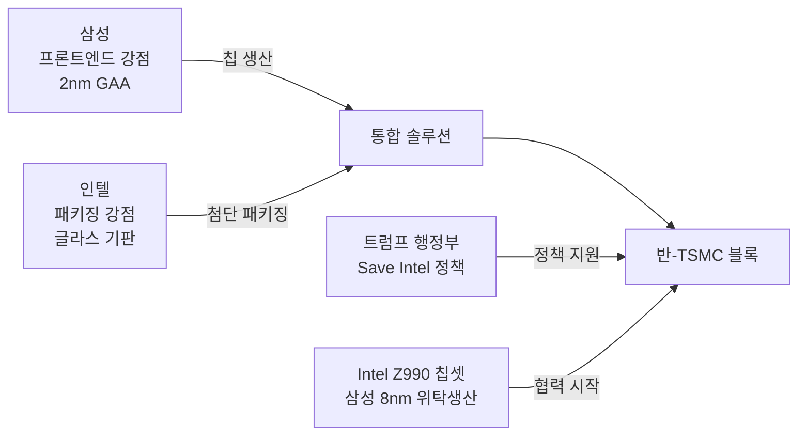
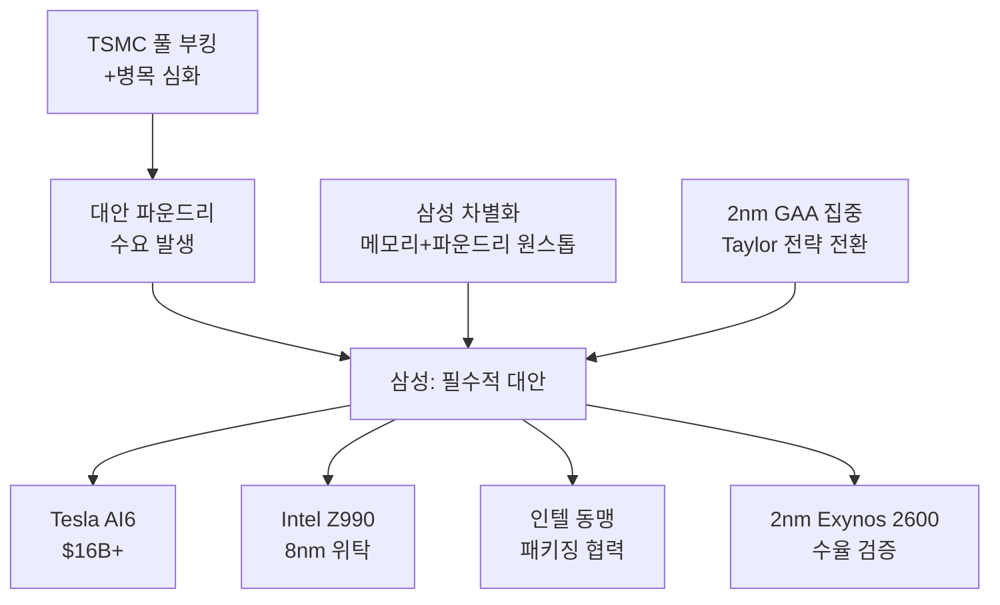
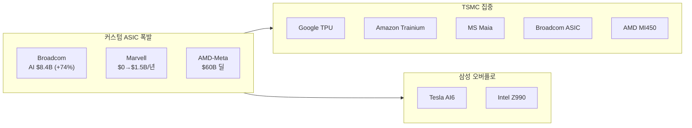

> **관련 글**: [2026년 투자 섹터 전망 (전체)](/knowledge/invest/2026/01/20/investment-sectors-outlook-2026.html) | [반도체 섹터 전망](/knowledge/invest/2026/01/21/semiconductor-sector-outlook-2026.html) | [반도체 소부장 전망](/knowledge/invest/2026/01/21/semiconductor-materials-equipment-outlook-2026.html)

## 핵심 요약

2026년 파운드리 섹터의 핵심 구도는 **TSMC 독주 심화 vs 삼성-인텔 동맹의 반-TSMC 블록 형성**입니다.

TSMC는 N2(2nm) 양산을 본격 램프하며 기술 리더십을 1-2세대 앞서고 있습니다. 동시에 커스텀 AI ASIC 시장이 폭발적으로 성장하면서(Broadcom AI +74%, Marvell $0→$1.5B) 파운드리 수요가 구조적으로 확대되고 있습니다.

이에 대응해 삼성과 인텔이 **파운드리 동맹**을 추진 중입니다. 삼성의 첨단 프론트엔드 + 인텔의 패키징·글라스 기판 기술이 상호보완적이며, 트럼프 행정부의 'Save Intel' 정책과도 맞물려 있습니다.

---

## 3월 7일 핵심 업데이트

| 날짜 | 이벤트 | 파운드리 영향 |
|------|--------|-------------|
| **3/7** | **삼성-인텔 파운드리 동맹 추진** | 이재용 방미, 패키징+글라스 기판 협력, 반-TSMC 블록 형성 |
| **3/7** | **Intel Z990 삼성 8nm 위탁생산** | Nova Lake CPU용 칩셋, 삼성 볼륨 확보 |
| **3/7** | **TSMC N2 램프 가속** | 카오슝 Fab 22 + 바오산, 연말 10만-14만장/월 목표 |
| **3/7** | **Broadcom AI 매출 $8.4B (+74%)** | 커스텀 ASIC 수요 폭발 지속 |
| **3/7** | **Marvell ASIC $0→$1.5B/년** | 커스텀 AI ASIC 시장 급성장 증명 |
| **3/16~19** | **GTC 2026** | Vera Rubin 상세, 차세대 AI 칩 파운드리 수요 확인 |

---

## TSMC: N2 양산 램프 + 차세대 A16

### N2(2nm) 양산 현황

| 항목 | 내용 |
|------|------|
| **공정** | **N2 (2nm) GAA** |
| **양산 팹** | **카오슝 Fab 22 + 바오산** |
| **목표 생산량** | **10만-14만장/월 (2026년 말)** |
| **성능** | **동일 전력 10-15% 성능 향상, 동일 속도 25-30% 전력 절감** |
| **웨이퍼 가격** | **$30,000+** |
| **핵심 고객** | **Apple, AMD, MediaTek, Qualcomm** |

### 차세대 공정 로드맵

| 공정 | 출시 | 핵심 특징 |
|------|------|----------|
| **N2** | **양산 중** | GAA, 10-15% 성능/25-30% 전력 개선 |
| **N2P** | **H2 2026** | N2 개선판 |
| **A16 (1.6 angstrom)** | **H2 2026** | **최초 Backside Power Delivery 적용** |

A16은 TSMC 최초로 **후면 전력 공급(Backside Power Delivery)** 기술을 적용하는 공정입니다. 이는 Intel의 PowerVia와 경쟁하는 기술로, NVIDIA Feynman 아키텍처에 적용될 전망입니다.

### 핵심 투자 포인트

- **기술 격차 1-2세대 선도**: N2 양산 + A16 H2 2026 동시 진행
- **$165B 미국 투자 → 관세 면제**: 경쟁사 대비 비용 우위 확보
- **풀 부킹**: NVIDIA, AMD, Apple, 빅테크 ASIC 모두 TSMC 경유
- **병목 심화 → 삼성 대안 수요 창출**: 구조적으로 경쟁사에도 수혜

---

## 삼성-인텔 파운드리 동맹: 반-TSMC 블록

### 동맹 배경

이재용 삼성전자 회장이 한미 정상회담 경제 사절단으로 방미하여, 인텔과 파운드리 동맹을 논의했습니다.

| 항목 | 삼성 | 인텔 |
|------|------|------|
| **강점** | **프론트엔드(첨단 공정)** | **패키징 + 글라스 기판** |
| **약점** | 첨단 패키징 | 프론트엔드 수율 |
| **역할** | 2nm GAA 생산 | 패키징 라인 투자 + 글라스 기판 기술 |

### 구조적 상호보완성

### 왜 주목해야 하는가

1. **Intel Z990 삼성 8nm 생산**: Nova Lake CPU용 칩셋을 삼성에 위탁 — 동맹의 첫 실질 협력
2. **글라스 기판**: 차세대 첨단 패키징 핵심 기술, 인텔이 업계 선도
3. **정책 지원**: 트럼프 'Save Intel' 정책과 한미 동맹 강화가 맞물림
4. **TSMC 견제**: 두 회사의 약점을 상호보완하여 TSMC에 대항

> **리스크**: 삼성-인텔 동맹이 실질적 성과를 내려면 삼성 2nm 수율 확보가 선행 조건. 현재 TSMC 대비 1-2세대 격차가 존재하므로, 단기 영향은 제한적.

---

## 삼성 파운드리: 2nm 전환 + 대형 수주

### 주요 현황

| 항목 | 내용 |
|------|------|
| **Taylor 공장** | **4nm 포기 → 2nm GAA 집중 전환** |
| **Taylor 양산** | **2027년 (지연)** |
| **Tesla AI6** | **$16B+ (역대 최대 외부 수주)** |
| **Intel Z990** | **삼성 8nm 위탁생산 (신규)** |
| **인텔 동맹** | **패키징+글라스 기판 협력 추진** |
| **2nm Exynos 2600** | 자사 칩으로 수율/성능 검증 |
| 차별화 | **메모리+파운드리 원스톱 턴키** |

### 삼성 파운드리 성장 구도

---

## Intel 파운드리: 삼성 동맹으로 활로

### Intel 18A 현황

| 항목 | 내용 |
|------|------|
| **공정** | **18A (1.8nm급)** |
| **기술** | RibbonFET(GAA) + PowerVia(후면 전력) |
| **목표** | **TSMC N2와 동급 성능** |
| **리스크** | **NVIDIA 테스트 중단 (수율 우려)** |
| **새 전략** | **삼성 동맹으로 반-TSMC 블록 형성** |

NVIDIA의 18A 테스트 중단으로 자체 파운드리 경쟁력에 의구심이 커진 상황에서, **삼성과의 동맹은 인텔에게 새로운 활로**입니다. 프론트엔드(삼성) + 패키징(인텔) 분업 구조가 실현되면, 단독으로는 불가능한 경쟁력 확보가 가능합니다.

---

## 커스텀 AI ASIC: 폭발적 성장 확인

### 3월 실적 하이라이트

| 기업 | 실적 | 핵심 |
|------|------|------|
| **Broadcom** | **Q1 AI 매출 $8.4B (+74% YoY)** | Q2 가이던스 $22B, ASIC 지배력 확인 |
| **Marvell** | **Q4 매출 $2.219B** | **커스텀 AI ASIC $0 → $1.5B/년**, 주가 +16% |
| **AMD-Meta** | **$60B 5년 딜** | 커스텀 MI450 GPU + Venice CPU |

### ASIC 시장 전망

| 항목 | 수치 |
|------|------|
| **시장 규모 (2033)** | **$118B** (CAGR 27%) |
| **Broadcom 점유율** | **60-80%** |
| **GPU 출하량 추월** | **2026년** |

### 파운드리 수요 다변화

**핵심**: 커스텀 ASIC 시장의 폭발적 성장(Broadcom +74%, Marvell $0→$1.5B)은 **파운드리 수요의 구조적 확대**를 의미. TSMC 병목 → 삼성 대안 수요 증가 선순환.

---

## 첨단 공정 경쟁 구도

| 기업 | 공정 | 상태 | 핵심 특징 |
|------|------|------|----------|
| **TSMC** | **N2 → N2P → A16** | **양산 램프 (10만-14만장/월)** | GAA + A16 Backside Power, 1-2세대 선도 |
| **삼성** | **2nm GAA** | **Taylor 2027년 양산 목표** | 인텔 동맹 + 원스톱 턴키, 4nm 포기→2nm 집중 |
| **Intel** | **18A (1.8nm)** | **HVM, NVIDIA 중단** | RibbonFET+PowerVia, 삼성 동맹 모색 |

---

## 반도체 관세: Section 122 15%

| 업체 | 관세 노출 | 대응 | 영향 |
|------|---------|------|------|
| **TSMC** | 높음→**면제** | $165B 미국 투자 | **수혜** |
| **삼성전자** | 중간 | $389억 투자 + AI6 $16B | 중립~긍정 |
| **Intel** | 낮음 | 미국 본사 | 상대적 수혜 |

---

## 관련 종목

| 종목 | 핵심 | 리스크 |
|------|------|--------|
| **TSMC (TSM)** | N2 램프 10만-14만장, A16 H2 2026, $165B 관세 면제, 기술 1-2세대 선도 | 대만 지정학 |
| **삼성전자 (005930)** | 인텔 동맹 추진, Tesla AI6 $16B+, 2nm GAA 집중, Intel Z990 수주 | TSMC 대비 수율 격차 |
| **브로드컴 (AVGO)** | AI 매출 $8.4B(+74%), ASIC 60-80%, Q2 가이던스 $22B | AI CAPEX 둔화 |
| **Marvell (MRVL)** | 커스텀 ASIC $0→$1.5B/년, 주가 +16% | 고객 집중도 |
| **Intel (INTC)** | 삼성 동맹으로 활로, 패키징·글라스 기판 강점, 미국 정책 수혜 | 18A 수율, NVIDIA 이탈 |
| **AMD (AMD)** | Meta $60B, MI450, AI 점유율 15%+ | NVIDIA 대비 생태계 격차 |
| **ASML** | EUV 독점, High-NA 2027-28, 백로그 $388B | 주문 변동성 |

---

## 투자 전략

### 시나리오별 포지셔닝

| 시나리오 | 전략 |
|---------|------|
| **TSMC 독주 지속** (기본) | TSMC 비중 확대 + 삼성 보유 유지 |
| **삼성-인텔 동맹 실현** | 삼성 비중 확대 (반-TSMC 블록 성과 시) |
| **커스텀 ASIC 가속** | Broadcom/Marvell + TSMC 비중 확대 |
| **AMD 점유율 확대** | AMD 비중 추가, TSMC 수혜 유지 |

### 핵심 모니터링

1. **GTC 2026 (3/16~19)** — Vera Rubin 상세, A16 적용 Feynman 아키텍처, 파운드리 수요 확인
2. **삼성-인텔 동맹 구체화** — 패키징 투자 규모, 글라스 기판 협력 범위
3. **삼성 Taylor 2nm 진행** — 양산 성공 및 수율 확보 여부
4. **TSMC N2 램프 속도** — 연말 10만-14만장 달성 여부
5. **Tesla AI6 양산** — 원스톱 턴키 검증
6. **Broadcom/Marvell ASIC 성장** — 다음 분기 AI 매출 추이
7. **Intel 18A 고객 확보** — 삼성 동맹 이후 신규 고객 유치

---

## 결론

| 항목 | 내용 |
|------|------|
| **TSMC** | N2 램프 10만-14만장 + A16 Backside Power H2 2026 + 기술 1-2세대 선도 = **독주 강화** |
| **삼성** | 인텔 동맹(패키징·글라스 기판) + Tesla AI6 $16B+ + 2nm 집중 = **반-TSMC 블록 핵심** |
| **Intel** | 삼성 동맹으로 활로 모색, 패키징·글라스 기판 차별화 = **단독 경쟁력은 미약, 동맹이 관건** |
| **커스텀 ASIC** | Broadcom +74%, Marvell $0→$1.5B, AMD-Meta $60B = **파운드리 수요 구조적 확대** |
| **전략** | TSMC 핵심 보유 + 삼성-인텔 동맹 진전 관찰 + ASIC 수혜주(Broadcom/Marvell) 주목 |

---

*본 글은 투자 참고용이며, 투자 결정은 본인의 판단과 책임하에 이루어져야 합니다. (2026년 3월 7일 업데이트)*
