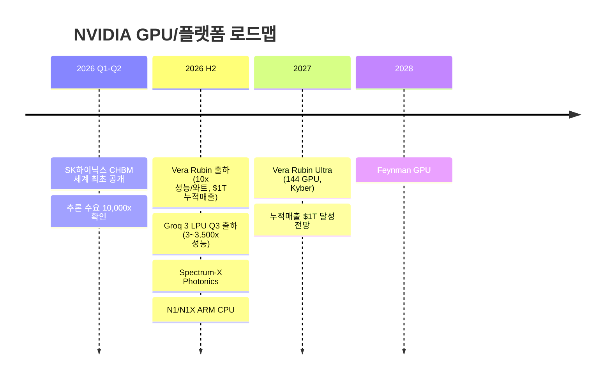
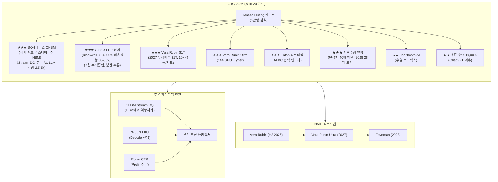
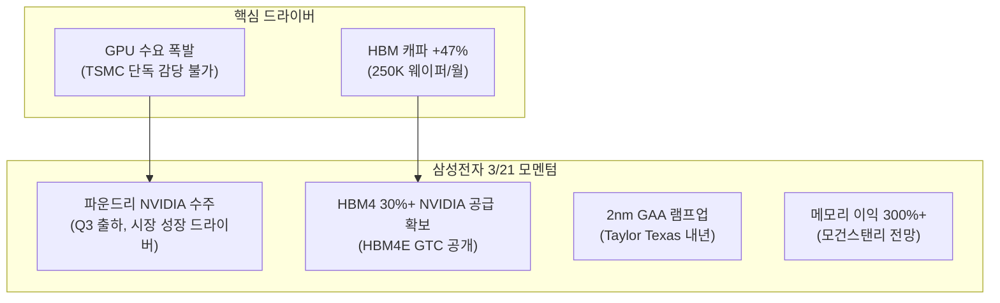
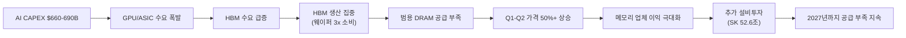
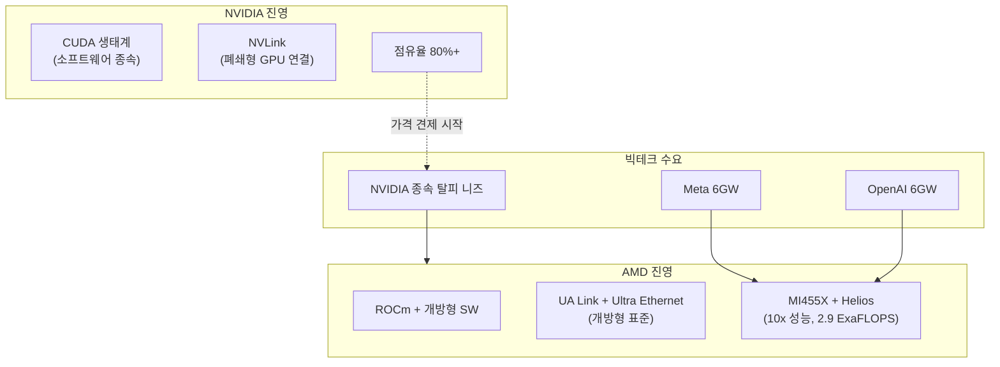

> **관련 글**: [2026년 투자 섹터 전망 (전체)](/knowledge/invest/2026/01/20/investment-sectors-outlook-2026.html)

2026년 글로벌 반도체 시장이 **$1T 돌파에 근접**하고 있습니다(~$975B, YoY +25%). 메모리 시장은 **$440B(+30%)** 성장이 전망되며, HBM TAM은 **$54.6B(+58% YoY, BofA)**, 2028년 $100B에 달할 것으로 예상됩니다.

**4월 8일 핵심:**
- **★★★ 삼성전자 Q1 어닝 서프라이즈**: Q1 OP **57.2조원**(컨센서스 43.7조 대비 **+31% 서프라이즈**). 매출 **133.3조원(+68% YoY)**. DS사업부 **~50조원**(QoQ 3배, YoY **+755%**). 2025 연간 OP(43조)를 **한 분기 만에 초과**. 연간 OP **300조원** 가능. 글로벌 이익 4위(Apple 76T > NVDA 66T > MS 57.5T > Samsung 57.2T). KB증권 목표가 **36만원**, 시티그룹 **30만원**
- **★★★ SK하이닉스 Q1 전망**: Q1 OP **30~39조원**, 상향 가능성. 상위 1% 트레이더 삼성보다 SK하이닉스 선호(서울경제). DRAM 마진 **73%**, 연간 OP **168조(+240%)**. HBM 점유율 **50%+**(골드만삭스). 2026년 DRAM/NAND/HBM 전량 매진
- **★★ 브로드컴 +6.21%**: 구글 TPU 장기 공급 계약 + 앤트로픽 협력
- **★★ 인텔 +4.19%**: 머스크 TeraFab 프로젝트 참여
- **★★ SOXX $347.76 (+1.06%)**: 반도체 지수 상승
- **★★ 삼성전자 프리마켓 +5%**: 휴전 뉴스 + 어닝 서프라이즈. KOSPI **5,809(+6.58%)** 반도체 랠리 주도
- **★★ DRAM 현물 하락**: DDR4 **-6%**, DDR5 **-5.1%**. 그러나 **90% 고정가 계약**으로 실적 영향 제한적
- **★ 헬륨 공급 리스크**: 카타르 의존도 **60-70%**, 4~6개월 재고 보유

삼성전자가 Q1 2026에서 **역사적 어닝 서프라이즈**를 기록했습니다. 영업이익 **57.2조원**(컨센서스 43.7조 대비 +31%)은 2025년 연간 OP(43조)를 **한 분기 만에 초과**한 수치입니다. 매출 **133.3조원(+68% YoY)**, DS사업부 **~50조원(QoQ 3배, YoY +755%)**으로 반도체 슈퍼사이클의 위력을 확인시켰습니다. 글로벌 이익 순위에서 Apple(76T), NVIDIA(66T), Microsoft(57.5T)에 이어 **4위**에 등극했습니다.

SK하이닉스도 Q1 OP **30~39조원**이 예상되며 상향 가능성이 있습니다. DRAM 마진 **73%**, 연간 OP **168조(+240%)**, HBM 점유율 **50%+**(골드만삭스)로 메모리 슈퍼사이클의 최대 수혜주입니다. SOXX **$347.76(+1.06%)**, KOSPI **5,809(+6.58%)**로 반도체 섹터 전반이 강세를 보이고 있습니다.

## 반도체 섹터 현황 (2026년 4월 8일 기준)

### 핵심 지표

| 항목 | 수치/현황 | 비고 |
|------|----------|------|
| **삼성전자 Q1 OP** | **57.2조원 (+31% 서프라이즈)** | 컨센서스 43.7조 대비. 2025 연간 OP(43조) 한 분기 만에 초과 |
| **삼성전자 Q1 매출** | **133.3조원 (+68% YoY)** | DS사업부 ~50조원(QoQ 3배, YoY +755%) |
| **삼성전자 글로벌 이익 순위** | **4위** | Apple 76T > NVDA 66T > MS 57.5T > Samsung 57.2T |
| **삼성전자 연간 OP** | **300조원 가능** | KB증권 목표가 36만원, 시티그룹 30만원 |
| **삼성전자 프리마켓** | **+5%** | 휴전 뉴스 + 어닝 서프라이즈 |
| **외국인 지분율** | **48.44% (역대 최저)** | 반등 시 외국인 매수 여력 |
| **SK하이닉스 Q1 OP** | **30~39조원** | 상향 가능성. 상위 1% 트레이더 선호(서울경제) |
| **SK하이닉스 DRAM 마진** | **73%** | 연간 OP 168조(+240%) |
| **SK하이닉스 HBM 점유율** | **50%+ (골드만삭스)** | 2026년 DRAM/NAND/HBM 전량 매진 |
| **SOXX** | **$347.76 (+1.06%)** | 반도체 지수 상승 |
| **KOSPI** | **5,809 (+6.58%)** | 반도체 랠리 주도 |
| **브로드컴** | **+6.21%** | 구글 TPU 장기 공급 계약 + 앤트로픽 협력 |
| **인텔** | **+4.19%** | 머스크 TeraFab 프로젝트 참여 |
| **DRAM 현물** | **DDR4 -6%, DDR5 -5.1%** | 90% 고정가 계약으로 실적 영향 제한적 |
| **헬륨 공급** | **카타르 의존 60-70%** | 4~6개월 재고 보유 |
| **NVIDIA Q4 FY2026** | **$65B 가이던스 (불변)** | "Blackwell off the charts", 클라우드 GPU 완판, 마진 75% |
| **글로벌 반도체 매출 (2026)** | **~$975B (+25% YoY)** | WSTS. **$1T 돌파 근접**, 메모리 **+30%** |
| **AI CAPEX (빅테크 합산)** | **$660-690B (~2x YoY)** | 75%($450B) AI 인프라 직접 투자 |
| **HBM** | **2025-2026 전량 고정계약 매진 (불변)** | HBM3E ~2/3 출하, HBM4 점진 증가 |
| **HBM TAM** | **$54.6B (+58% YoY, 2026) → $100B (2028)** | BofA/TrendForce |
| **CPO 시장** | **연간 137% 성장** | 2026년 양산 시작, 월가 TOP1 테마 |
| **공급 부족 전망** | **2027년까지 지속** | IDC/TrendForce |

### 4월 8일 핵심 업데이트

| 항목 | 내용 |
|------|------|
| **★★★ 삼성전자 Q1 어닝 서프라이즈** | Q1 OP **57.2조원**(컨센서스 43.7조 대비 **+31%**). 매출 **133.3조원(+68% YoY)**. DS사업부 **~50조원**(QoQ 3배, YoY **+755%**). 2025 연간 OP(43조) **한 분기 만에 초과**. 연간 OP **300조원** 가능. 글로벌 이익 **4위**. KB증권 **36만원**, 시티그룹 **30만원** |
| **★★★ SK하이닉스 Q1 전망** | Q1 OP **30~39조원**, 상향 가능성. 상위 1% 트레이더 선호(서울경제). DRAM 마진 **73%**, 연간 OP **168조(+240%)**. HBM 점유율 **50%+**(골드만삭스). DRAM/NAND/HBM **전량 매진** |
| **★★ 브로드컴 +6.21%** | 구글 TPU **장기 공급 계약** + 앤트로픽 협력 |
| **★★ 인텔 +4.19%** | 머스크 **TeraFab 프로젝트** 참여 |
| **★★ SOXX/KOSPI** | SOXX **$347.76(+1.06%)**. KOSPI **5,809(+6.58%)** 반도체 랠리 주도 |
| **★★ 삼성전자 프리마켓 +5%** | 휴전 뉴스 + 어닝 서프라이즈. 외국인 지분율 **48.44%(역대 최저)** |
| **★ DRAM 현물 하락** | DDR4 **-6%**, DDR5 **-5.1%**. **90% 고정가 계약**으로 실적 영향 제한적 |
| **★ 헬륨 공급 리스크** | 카타르 의존도 **60-70%**, 4~6개월 재고 보유 |

---

## GTC 2026 주요 발표 (3/20 업데이트)

GTC 2026에서 SK하이닉스 CHBM과 Groq 3 LPU 상세 스펙이 공개되며 **추론 패러다임 전환**이 본격화되고 있습니다.

### SK하이닉스 CHBM — 세계 최초 커스터마이징 HBM (3/20)

SK하이닉스가 GTC 2026에서 **CHBM(Customized HBM)**을 세계 최초로 공개했습니다. 베이스 다이를 고객 요구에 맞게 대역폭/용량/전력을 구성할 수 있는 혁신적 제품입니다.

| 항목 | 내용 |
|------|------|
| **CHBM** | 세계 최초 **커스터마이징 가능 HBM** — 베이스 다이를 고객별 대역폭/용량/전력에 맞게 구성 |
| **Stream DQ** | 베이스 다이에서 **역양자화(dequantization)** 수행(GPU 대신) → 추론 성능 **최대 7x** 향상 |
| **HBM4 성능** | HBM3 대비 **2x+ 대역폭**, **1.5-2x 용량**, **50% 전력효율** 개선 |
| **로직 공정** | HBM4 베이스 다이에 **로직 공정** 적용 → 대역폭/레이턴시 개선 |
| **LLM 서빙** | **2.5-5x** 성능 개선 전망 |
| **NVIDIA 협력** | GTC에 **협력 전시존** 운영, 딥 파트너십 |

**투자 시사점**: CHBM은 HBM을 단순 메모리에서 **고객 맞춤형 컴퓨팅 컴포넌트**로 진화시킨 것입니다. Stream DQ로 GPU의 역양자화 부담을 HBM으로 오프로드하여 추론 성능을 극적으로 개선합니다. SK하이닉스의 HBM 점유율 **57%**(HBM4 70%)에 기술적 해자가 더해졌습니다.

### Groq 3 LPU 상세 (3/20 업데이트)

GTC 2026에서 Groq 3 LPU의 상세 스펙과 분산 추론 아키텍처가 공개되었습니다.

| 항목 | 내용 |
|------|------|
| **성능** | Blackwell 대비 **3x~3,500x** 성능 |
| **비용성능** | **35-50x** 개선 |
| **아키텍처** | SRAM 기반 극한 추론 프로세서 |
| **분산 추론** | **Prefill(Rubin CPX)** + **Decode(Groq LPX)** 역할 분리 아키텍처 |
| **수직 통합** | **7개 칩** 수직 통합 (CPU, GPU, 네트워킹, LPU) |
| **추론 수요** | ChatGPT 이후 **10,000x** 증가 |

### GTC Healthcare AI (3/19)

| 항목 | 내용 | 의미 |
|------|------|------|
| **★★ Healthcare AI** | **Open-H, Cosmos-H, GR00T-H** — 수술 로보틱스 특화 | 의료 AI TAM 확대, 로봇 수술 시장 진입 |
| **★★ Partner Awards** | GTC 파트너 어워드 발표 | 생태계 확장 확인 |

### GTC Day 2~3 추가 발표 (3/18)

| 항목 | 내용 | 의미 |
|------|------|------|
| **★★★ Eaton 파트너십** | AI 데이터센터 **전력 인프라** 협력 | 전력 병목 해소, 전력 관련주 수혜 |
| **★★★ Vera Rubin 상세** | TSMC **3nm**, **336B 트랜지스터**, AI 추론 **H100 대비 25배** | 아키텍처 상세 확정, TSMC 3nm 대규모 수혜 |
| **★★★ 자율주행 연합** | 현대·BYD·닛산·지리 등 **글로벌 완성차 40%** 엔비디아 드라이브 채택 | 자율주행 TAM 폭발적 확대 |
| **★★ 로보택시** | **2028년 28개 도시** 로보택시 목표 | 자율주행 상용화 타임라인 구체화 |

### 키노트 핵심 발표 사항 (3/16)

| 항목 | 내용 | 의미 |
|------|------|------|
| **★★★ Vera Rubin** | Grace Blackwell 대비 **10x 성능/와트**, **1.3M 부품**, TSMC **3nm**, **336B 트랜지스터** | 차세대 GPU 아키텍처의 압도적 성능 도약 |
| **★★★ Vera Rubin Ultra** | **144 GPU 연결** 가능 | Kyber 아키텍처와 결합, 초대규모 AI 훈련 가능 |
| **★★★ $1T 누적매출** | 2027년까지 **$1T** 전망(월가 $0.9T, 4개월 전 $500B) | GPU 수요의 구조적 폭발 확인 |
| **★★★ Groq 3 LPU** | Blackwell 대비 **3~3,500x 성능**, 비용성능 **35-50x**, **Q3 출하** | 추론 패러다임 전환, 분산 추론 아키텍처 |
| **★★ Kyber** | 차세대 랙 아키텍처, **수직 통합 144 GPU** | Vera Rubin Ultra(2027)에 적용, 시스템 레벨 혁신 |
| **★★ 우주 데이터센터** | **Vera Rubin Space-1**, 궤도 데이터센터 | NVIDIA TAM 확장의 극단적 비전 |
| **★★ Thinking Machines Lab** | 다년 파트너십, **1GW+ Vera Rubin 시스템** | 단일 파트너 1GW+ 초대형 |
| **★★ NemoClaw** | **AI 에이전트 플랫폼** | 소프트웨어 생태계 확장 |
| **★ N1/N1X** | **ARM 기반 노트북 CPU** (Windows) | PC CPU 시장 진입, TAM 확대 |
| **★ DLSS 5** | 차세대 그래픽 업스케일링 | 게이밍/렌더링 혁신 |
| **★ OpenClaw** | 로보틱스 파트너십 | 물리 AI 생태계 확장 |

### NVIDIA 로드맵

### Kyber 아키텍처 + Vera Rubin Ultra

NVIDIA의 차세대 랙 아키텍처 **Kyber**는 수직 통합 방식으로 **144 GPU**를 단일 시스템으로 연결합니다. 2027년 출시 예정인 **Vera Rubin Ultra**에 적용되며, 기존 NVLink 대비 대폭 향상된 GPU 간 통신 대역폭을 제공합니다.

| 항목 | 내용 |
|------|------|
| **Kyber** | 차세대 랙 아키텍처, 수직 통합 **144 GPU** |
| **Vera Rubin Ultra** | Kyber 적용, **2027년** 출시 |
| **Vera Rubin** | **10x 성능/와트**, TSMC **3nm**, **336B 트랜지스터**, 추론 H100 대비 **25배**, **H2 2026** 출하 |
| **$1T 누적매출** | 2027년까지 누적 $1T 전망(월가 $0.9T), 4개월 전 $500B → **거의 2배** |

### Groq 3 LPU

NVIDIA가 $20B에 인수한 Groq의 첫 칩 **Groq 3 LPU**가 Q3 출하 예정입니다. GTC 2026에서 상세 스펙이 공개되며 **추론 패러다임 전환**이 가시화되었습니다.

| 항목 | 내용 |
|------|------|
| **인수 금액** | **$20B** |
| **출하 시기** | **Q3 2026** |
| **아키텍처** | SRAM 기반 LPU, AI 추론 특화 |
| **성능** | Blackwell 대비 **3x~3,500x** 성능 |
| **비용성능** | **35-50x** 개선 |
| **분산 추론** | **Prefill(Rubin CPX)** + **Decode(Groq LPX)** 역할 분리 |
| **수직 통합** | **7개 칩** (CPU, GPU, 네트워킹, LPU) |
| **제조** | TSMC **A16 공정** + **3D 스태킹** |
| **삼성 수혜** | SRAM 트랜지스터 6개 → 면적 大 → **삼성 4나노 가성비 우위** |
| **추론 수요** | ChatGPT 이후 **10,000x** 증가 |

**투자 시사점**: Groq 3 LPU는 Blackwell 대비 3~3,500x 성능과 35-50x 비용성능 개선으로, 추론 시장에서 GPU 보완재를 넘어 **추론 전용 인프라 패러다임**을 열 가능성이 높습니다. Prefill(Rubin CPX) + Decode(Groq LPX) 분산 추론 아키텍처는 훈련과 추론의 하드웨어 분리를 가속합니다. 삼성 파운드리의 SRAM 칩 생산 수혜와 메모리 구조의 DRAM+SRAM 이원화 등 공급망 전반에 파급효과가 있습니다.

### 우주 데이터센터

NVIDIA가 **Vera Rubin Space-1**으로 궤도 데이터센터를 목표로 합니다. 현재는 비전 단계이나, NVIDIA가 지구 밖 컴퓨팅 인프라까지 TAM을 확장하려는 야심을 보여줍니다.

---

## 삼성전자 파운드리 NVIDIA 수주 + HBM4 30%+ (3/21)

### 삼성 파운드리 NVIDIA 출하 확정

젠슨 황이 삼성전자 파운드리 진전에 긍정적 발언을 했으며, **Q3부터 출하**가 시작됩니다. 핵심은 삼성 기술 개선이 아니라 **시장 성장**이 드라이버라는 점입니다 — GPU 수요가 TSMC 단독으로 감당할 수 없는 수준에 도달했습니다.

| 항목 | 내용 |
|------|------|
| **수주 확정** | 젠슨 황 삼성 파운드리 진전 **긍정 발언** |
| **출하 시기** | **Q3 2026** |
| **핵심 드라이버** | 삼성 기술 개선이 아닌 **시장 성장** — TSMC 단독 감당 불가 |
| **2nm GAA** | 생산 **램프업 중**, Taylor Texas 팹 **내년** 본격화 |

### 삼성 HBM4 NVIDIA 30%+ 공급 확보

삼성전자가 NVIDIA HBM4의 **30% 이상**을 공급하는 계약을 확보했습니다. 업계 전체 HBM 캐파가 **+47%** 증가하여 2026년 말 **250K 웨이퍼/월**에 도달할 전망입니다.

| 항목 | 내용 |
|------|------|
| **삼성 HBM4 점유율** | NVIDIA HBM4의 **30% 이상** 공급 확보 |
| **HBM 캐파** | 업계 전체 **+47%** 증가 → 2026년 말 **250K 웨이퍼/월** |
| **HBM4E** | GTC 2026에서 **공개** |
| **삼성 메모리 이익** | 모건스탠리 **2026년 이익 300%+** 증가 전망 |

**투자 시사점**: 삼성전자가 **파운드리 NVIDIA 수주**와 **HBM4 30%+ 공급**을 동시에 확보하면서, 반도체 양대 사업(메모리+파운드리) 모두에서 모멘텀이 강화되었습니다. 특히 파운드리 수주는 삼성 기술 개선이 아닌 **시장 성장에 의한 것**이므로, AI 수요가 지속되는 한 구조적 수혜가 예상됩니다. 모건스탠리의 **2026년 이익 300%+ 증가** 전망은 메모리 슈퍼사이클과 파운드리 수주 확대를 반영합니다.

---

## TeraFab 공식 런칭 (3/21) + 반도체 50배 비전 (4/3 업데이트)

**TeraFab**이 3월 21일 공식 런칭되었습니다. Tesla, SpaceX, xAI의 **$25B 합작 벤처(JV)**로, Giga Texas North Campus에 위치합니다. 80%의 생산량은 우주용 **D3 칩**(SpaceX 위성), 20%는 지상용 **AI5 칩**(Tesla 차량/Optimus 로봇)에 배정됩니다.

### 머스크의 "반도체 50배" 비전 (4/3)

일론 머스크가 연간 **1억 대 휴머노이드 로봇 생산**을 위해 전 세계 반도체 생산량의 **50배가 필요**하다고 밝혔습니다. 이에 따라 텍사스에 **$200-400억(약 28-56조원) 규모의 반도체 공장** 건설을 계획하고 있습니다.

| 항목 | 내용 |
|------|------|
| **투자 규모 (기존)** | **$25B** (Tesla + SpaceX + xAI JV) |
| **추가 계획 (4/3)** | 텍사스 **$200-400억** 반도체 공장 신설 |
| **로봇 생산 목표** | 연간 **1억 대** 휴머노이드 로봇 |
| **반도체 수요** | 전 세계 현재 반도체 생산량의 **50배** 필요 |
| **위치** | **Giga Texas North Campus** |
| **공정** | **2nm** 목표 |
| **웨이퍼** | 월 **100만 장** 목표 (초기 10만 장) |
| **칩 배분** | 80% 우주용 **D3 칩**(SpaceX), 20% 지상용 **AI5 칩**(Tesla/Optimus) |
| **런칭일** | **3/21 공식 런칭** |
| **SpaceX IPO** | **2026년** 예정, 기업가치 **$1.75T** |
| **SpaceX IPO 개인 배정** | 개인 투자자 **30% 배정** (통상 5-10% 대비 **파격적**) |
| **합병 전망** | Dan Ives(Wedbush): Tesla-SpaceX **합병 2027년** 가능성 — "first step toward merger" |

### 투자 시사점

| 구분 | 내용 |
|------|------|
| **긍정적** | 우주+지상 반도체 수직통합. SpaceX IPO(2026, **$1.75T, 개인 30% 배정**)와 Tesla-SpaceX 합병(2027) 시나리오 시 반도체 수요 총량 확대 |
| **반도체 50배 (4/3)** | 연간 1억 대 휴머노이드 → 반도체 **50배 필요** → **$200-400억 텍사스 공장** 계획. 실현 시 반도체 수요 총량 **구조적 폭발** |
| **옵티머스 로봇** | 프리몬트 공장 **전용 라인 전환**, 연말 **100만 대** 목표 — AI5 칩 수요 가속 |
| **리스크** | 반도체 제조 경험 **전무**, 도조(Dojo) **실패 전례**, 2nm 공정 난이도 극단적. "50배" 비전은 극단적 — 실현 가능성 불확실 |
| **NVIDIA 영향** | 단기 무관 — 테슬라 자체 칩 양산까지 수년 소요. 장기적으로 GPU 매출 일부 대체 가능 |

---

## TurboQuant: "구글판 딥시크 충격" — 미국 영향 제한적 (4/3 업데이트)

구글이 AI 메모리 압축 기술 **TurboQuant**를 발표했습니다(카이스트 한인수 교수 공동 참여). KV캐시를 **16비트에서 3.5비트로 압축(6배)**, 추론 속도 **8배 향상**의 획기적 결과입니다. 한국 시장에서는 **"구글판 딥시크 충격"**으로 평가되며 SK하이닉스 -12%, 삼성 -7%의 급락을 초래했고, Micron도 $50B 시총이 증발했습니다. 그러나 **미국 시장에서는 영향이 극히 제한적**이었습니다 — NVDA $177.39(+0.93%), SOXX +0.32%.

### TurboQuant 기술 및 시장 충격

| 항목 | 내용 |
|------|------|
| **기술** | KV cache를 **16비트 → 3.5비트로 양자화** → 메모리 **6x 감소**, 속도 **8x 향상** |
| **참여자** | 구글 AI Research + **카이스트 한인수 교수** 공동 |
| **시장 충격** | SK하이닉스(서울) **-12%**, 삼성전자 **-7%**, Micron **$50B 시총 증발** |
| **KOSPI 급락 (4/3)** | 삼성전자 **178,800원(-5.91%)**, SK하이닉스 **839,900원(-6.83%)** — 전일 +14%/+10% 랠리 후 급반락 |
| **KOSPI 동반 하락** | 현대차 **-4.61%**, 두산에너빌리티 **-6.02%** |
| **미국 시장 (영향 제한적)** | NVDA **$177.39(+0.93%)**, SOXX **+0.32%** — "구글판 딥시크" 충격에도 미국 시장 안정 |
| **"구글판 딥시크"** | 한국 시장에서의 평가 — 딥시크 R1 쇼크와 유사한 패턴 |

### TurboQuant 반박 근거

| 항목 | 내용 |
|------|------|
| **제본스 역설 (Jevons Paradox)** | 효율성 향상 → 비용 하락 → 사용량 증가 → **하드웨어 수요 오히려 증가**. 딥시크 R1 이후 GPU 수요 증가한 전례 |
| **The Register** | **"효과가 과장됨"** — 실제 프로덕션 적용과 연구 결과 사이의 갭 지적 |
| **Motley Fool** | **"메모리 크런치 해소 불가"** — 구조적 메모리 수요를 단일 기술로 해소할 수 없음 |
| **한계 1** | 소형 모델(**7-8B 파라미터**)에서만 검증 — 프론티어 모델(**100B+**)에서는 미검증 |
| **한계 2** | **연구실 수준 브레이크스루** — ICLR 2026 발표 예정이나 프로덕션 타임라인 없음 |
| **논문 제출일** | **2025년 4월** — 대형 AI 기업은 이미 적용했을 가능성 높음 |
| **과대평가 확인 (4/2)** | SOD/염블리/한경TV 등 다수 채널이 **"과대평가"** 확인 |

### 펀더멘털 불변 확인

| 항목 | 내용 |
|------|------|
| **HBM** | 2025-2026 **전량 매진 불변** |
| **NVIDIA** | Q4 FY2026 **$65B 가이던스 불변** |
| **Micron** | Cantor Fitzgerald **$700 목표가 유지**, top pick |
| **미국 시장** | NVDA +0.93%, SOXX +0.32% — **펀더멘털에 대한 확신** |

**투자 시사점**: TurboQuant는 **"구글판 딥시크 충격"**으로 한국 시장에 큰 영향을 미쳤지만, **미국 시장에서는 영향이 제한적**(NVDA +0.93%, SOXX +0.32%)이었습니다. 이는 (1) 제본스 역설 — 효율 향상이 오히려 수요를 증가시키는 역사적 패턴, (2) The Register/Motley Fool의 "과장된 효과" 평가, (3) 소형 모델만 검증되고 프론티어 모델 미적용, (4) 2025년 4월 논문으로 이미 반영 가능성, (5) **HBM 전량 매진/NVIDIA $65B/Micron $700 등 펀더멘털 불변**을 시장이 인식하고 있기 때문입니다. KOSPI 반도체 급락은 **한국 시장 특유의 과잉반응**으로, 미국 시장과의 괴리가 향후 **매수 기회**가 될 수 있습니다.

---

## AI 에이전트 시대 본격화 — 컴퓨팅 수요의 새로운 축 (4/3)

AI 에이전트가 단순 챗봇을 넘어 **실제 수익을 창출하는 제품**으로 진화하고 있습니다. 이는 반도체 수요의 새로운 구조적 동력이 됩니다.

| 항목 | 내용 |
|------|------|
| **앤트로픽** | **Claude Code**(코딩 에이전트), **Cowork**(업무 자동화) 등으로 수익 창출. AI 에이전트 시대 선도 |
| **오픈AI** | **Sora(동영상 생성) 종료**, AI 에이전트에 **올인**. 리소스 재배치 |
| **시장 규모** | **"수조 달러 시장"** 평가 |
| **반도체 시사점** | 에이전트는 **24시간 자율 실행** → 추론 컴퓨팅 수요 **지속적·대규모 증가**. 챗봇(사용자 클릭 시 실행)과 달리 상시 가동 |

**투자 시사점**: AI 에이전트는 추론 컴퓨팅 수요를 구조적으로 확대합니다. 챗봇은 사용자가 질문할 때만 컴퓨팅을 소비하지만, 에이전트는 **자율적으로 24시간 작동**하며 지속적으로 GPU/메모리를 소비합니다. 오픈AI가 Sora를 포기하고 에이전트에 올인한 것은 시장 방향성을 확인시켜줍니다. 이는 TurboQuant 등 효율화 기술로 절약되는 메모리를 상쇄하고도 남을 수준의 **새로운 수요 원천**입니다.

---

## SK하이닉스 ADR 미국 상장 추진 (3/28 업데이트)

SK하이닉스가 SEC에 **F-1 양식을 비밀 제출**(3/24)하며 미국 ADR 상장을 공식 추진합니다. **10~15조원 규모**(전체 시총의 2.4%)를 조달할 계획이며, **2026년 내 상장**을 목표로 합니다. 핵심은 **PER 16배(vs Micron 34배)**라는 극심한 밸류에이션 갭입니다.

| 항목 | 내용 |
|------|------|
| **SEC 제출** | **F-1 비밀 제출** (3/24) |
| **조달 규모** | **10~15조원** (전체 시총의 **2.4%**) |
| **PER 비교** | **SK하이닉스 16배 vs Micron 34배** — 동종업체 대비 현저한 저평가 |
| **영업이익 비교** | **SK하이닉스 47조원 vs Micron 24조원** — 이익은 2배인데 PER은 절반 |
| **HBM 점유율** | **57%** (일부 소스 **62%**) — 압도적 1위 |
| **TSMC ADR 사례** | ADR 상장 후 **18% 프리미엄** 형성 — SK하이닉스에도 유사 프리미엄 기대 |
| **자금 용도** | **용인 클러스터 600조원** 투자 자금 조달 |
| **목표 시기** | **2026년 내** 상장 |

**투자 시사점**: SK하이닉스 ADR 상장은 **밸류에이션 리레이팅의 최대 카탈리스트**입니다. (1) **PER 16배 vs Micron 34배** — 영업이익은 2배(47조 vs 24조)인데 PER은 절반으로, 글로벌 투자자 접근 시 극적인 재평가 가능, (2) **TSMC ADR 18% 프리미엄 사례** — 유사한 프리미엄이 형성될 경우 상당한 업사이드, (3) **용인 클러스터 600조원** 투자 자금 확보로 HBM 캐파 확장 가속. 전체 시총 대비 2.4%의 제한적 희석은 밸류에이션 리레이팅 효과에 비해 미미합니다.

---

## CPO(Co-Packaged Optics): 2026년 월가 TOP1 투자 테마

데이터센터 내부 인터커넥트가 **구리선의 물리적 한계**에 도달했습니다. 224G SerDes에서 구리선 전송 거리는 **50cm**에 불과하며, 광 신호 전환이 불가피합니다.

### CPO 시장 현황

| 항목 | 내용 |
|------|------|
| **시장 성장률** | **연간 137%** 성장 |
| **양산 시점** | **2026년** 본격 양산 시작 |
| **구리선 한계** | 224G SerDes에서 **50cm** — 물리적 한계 도달 |
| **월가 평가** | **2026년 TOP1 투자 테마** |

### NVIDIA CPO 제품 라인업

| 제품 | 내용 | 시기 |
|------|------|------|
| **Spectrum-X Photonics** | CPO 기반 이더넷 스위치 | **H2 2026 출시** |
| **Quantum-X IB** | InfiniBand **115Tb/s** | GTC 발표 |

### CPO 핵심 수혜주

| 종목 | 포지션 | 비고 |
|------|--------|------|
| **Marvell (MRVL)** | 광통신 포토닉 패브릭스, AEC, DSP, 커스텀 칩 | 고점 대비 **-30% 저평가** |
| **Credo (CRDO)** | AEC(Active Electrical Cable) 리타이머 | CPO 전환기 수혜 |
| **Corning (GLW)** | 광섬유 소재 | 광 인프라 근간 |
| **NVIDIA** | Spectrum-X Photonics, Quantum-X | 플랫폼 주도 |

**투자 시사점**: CPO는 AI 인프라의 다음 병목(인터커넥트 대역폭)을 해소하는 핵심 기술입니다. 구리선의 물리적 한계는 소프트웨어로 해결할 수 없으며, 광 전환은 필연적입니다. **Marvell은 종합 플레이어임에도 고점 대비 -30% 저평가** 상태로 주목됩니다.

---

## HBM4 양산 가속 및 점유율 확정

HBM4 양산이 **2026년 2월부터** 시작되었습니다. **2025-2026년 HBM 전 용량이 고정계약으로 매진** 상태입니다. 2026년 출하의 **~2/3가 HBM3E**, 나머지는 **HBM4가 점진적으로 증가**하고 있습니다. SK하이닉스는 HBM4 시장에서 **NVIDIA Rubin 물량 ~70%**(UBS)를 확보하고, GTC 2026에서 **CHBM(Customized HBM)**을 세계 최초로 공개하여 기술적 해자를 강화했습니다. 삼성전자는 **NVIDIA HBM4 30%+ 공급 계약 확보**(3/21)와 함께 **AMD MI455X용 HBM4 공급 MoU**(3/18)를 체결했습니다. GTC에서 **HBM4E**가 공개되었으며, 업계 HBM 캐파는 **+47% 증가**하여 2026년 말 **250K 웨이퍼/월**에 도달 전망입니다.

### Samsung-AMD HBM4 MoU (3/18)

삼성전자가 AMD와 **MI455X AI 가속기용 HBM4 공급 MoU**를 체결했습니다. 차세대 AMD 제품에 대한 **파운드리 협력**도 병행 모색 중입니다.

| 항목 | 내용 |
|------|------|
| **대상 제품** | AMD **MI455X** AI 가속기용 HBM4 |
| **기술 사양** | **1c DRAM** + **4nm 로직 베이스 다이** |
| **대역폭** | **13 Gbps/pin**, **3.3TB/s 대역폭** 목표 |
| **파운드리 협력** | 차세대 AMD 제품 **파운드리 파트너십** 모색 |
| **의미** | 삼성 HBM4 고객 다변화(NVIDIA + AMD), 파운드리 수주 기회 동시 확보 |

### Micron Q2 실적 (3/18 장후)

Micron이 Q2 실적을 발표했습니다. HBM 생산분이 **2026년 말까지 전량 매진**되었음을 확인하며 **"AI-fueled supercycle"**을 공식 선언했습니다.

| 항목 | 내용 |
|------|------|
| **EPS** | **$8.42** (예상치) |
| **HBM 공급** | **2026년 말까지 전량 매진** |
| **키워드** | **"AI-fueled supercycle"** |
| **의미** | 3대 메모리 업체 모두 HBM 공급부족 확인 → 가격 결정력 극대화 |

### HBM4 점유율 현황

| 업체 | HBM4 점유율 | 현황 | 비고 |
|------|-----------|------|------|
| **SK하이닉스** | **~70%** (UBS), HBM 전체 **57%**(일부 62%) | **2025-2026 전 용량 고정계약 매진**, **CHBM 세계 최초 공개**, Rubin 물량 **70%** | 업계 압도적 1위, 실적 확정 + 기술적 해자 |
| **삼성전자** | **30%+** | **NVIDIA HBM4 30%+ 공급 확보**, 2/12 세계 최초 출하, HBM4E GTC 공개, **AMD MoU 체결** | 점유율 상향 + 고객 다변화 |
| **Micron** | **~20%** | Q2 2026 **15K 웨이퍼/월 램프**, **HBM 2026년 말까지 전량 매진**. Cantor Fitzgerald **$700 목표가**, top pick | DRAM 현물 하락은 B2C(5%)에 국한, AI DC 수요 견조 |
| **HBM3E** | ~2/3 출하 | 삼성/SK 모두 **~20% 인상** 추진. 2026년 출하의 약 **2/3** 차지 | 가격 결정력 강화 |
| **HBM4** | 점진 증가 | **16-Hi HBM4 Q4 2026 요청**, HBM4 점진 증가 중 | Vera Rubin 풀 프로덕션 |
| **NVIDIA** | — | **16-Hi HBM4 Q4 2026 요청** | Vera Rubin 풀 프로덕션 |

### HBM 시장 규모

| 연도 | TAM |
|------|-----|
| **2026** | **$54.6B (+58% YoY)** |
| **2028** | **$100B** |

### 소비자 메모리 부족 심화

HBM3E/HBM4/DDR7에 대한 수요가 범용 메모리 생산라인을 잠식하면서, 소비자 메모리 부족이 심화되고 있습니다.

| 항목 | 내용 |
|------|------|
| **원인** | HBM 생산이 GB당 **~3배 웨이퍼 용량** 소비 → 범용 DRAM 라인 축소 |
| **가격 영향** | **Q1-Q2 가격 50%+ 추가 상승 가능** |
| **공급 부족 기간** | **2027년까지 지속** (IDC/TrendForce) |
| **완화 시점** | SK하이닉스 M15X 팹 가동 (2027년 말) |

**핵심**: **2025-2026년 HBM 전 용량이 고정계약으로 매진**되었습니다. 2026년 출하의 ~2/3가 HBM3E이며 HBM4가 점진 증가 중입니다. SK하이닉스는 **HBM 점유율 57%**(일부 소스 62%), HBM4 Rubin 물량 ~70%(UBS)를 확보하고, **CHBM 세계 최초 공개**(3/20)로 기술적 해자를 강화했습니다. Micron은 Cantor Fitzgerald가 **$700 목표가**로 top pick을 유지하며, DRAM 현물 하락이 B2C(매출 5%)에 국한됨을 확인했습니다. **HBM3E 20% 가격 인상**이 추진되며 가격 결정력이 극대화되고 있습니다.

---

## AI 칩 수출규제 초안 (3월 5일 발표, 초안 단계)

| 항목 | 내용 |
|------|------|
| **상태** | **초안 단계** (3/5 발표) |
| **규제 범위** | 모든 글로벌 AI 칩 수출에 정부 라이선스 요구 |
| **영향** | NVIDIA, AMD, Broadcom, Intel 등 모든 AI 칩 업체 |
| **투자 시사점** | 미국 내 AI 인프라 투자($660-690B)는 영향 없음. 미국 내 제조 가속화에 긍정적 가능. **초안 단계이므로 최종 확정까지 모니터링 필요** |

---

## $1T 시대: 반도체 기가사이클

글로벌 반도체 시장이 2026년 **~$975B(YoY +25%, WSTS)**로 **$1T 돌파에 근접**하고 있습니다(메모리 **+30%**). 3대 성장 동력:

1. **AI 인프라 투자 폭발**: 빅테크 AI CAPEX $660-690B(~2x YoY), 75%가 AI 인프라 직접 투자
2. **RAMmageddon**: HBM 생산 집중 → 범용 DRAM 구조적 부족 → 전 메모리 가격 역사적 폭등
3. **HBM 과점 프리미엄**: SK하이닉스 70%, 삼성 mid-20%, Micron ~20% — 가격 결정력 극대화

---

## AI CAPEX: $660-690B (전년비 ~2배)

| 기업 | AI CAPEX (2026) | 비고 |
|------|----------------|------|
| **Amazon** | **$200B** | 최대 투자 |
| **Google** | **$175-185B** | |
| **Microsoft** | **$120B+** | |
| **Meta** | **$135B** | 20%(15K명) 해고, AI 인프라 투자로 재배치. AMD 6GW $60B 딜 포함 |
| **Oracle** | **$2.1B 구조조정** | AI 인력 재배치, CAPEX 불변 |
| **합산** | **$660-690B** | **전년비 ~2배**, 빅테크 AI 해고는 인건비→CAPEX 재배치 |
| **AI 인프라 직접** | **~$450B (75%)** | GPU/ASIC/서버/네트워크 |

---

## AI 칩: AMD MI455X로 NVIDIA 독점 최초 구조적 도전

### AMD MI455X + Helios

| 항목 | 내용 |
|------|------|
| **MI455X GPU** | HBM4 2GB, 전세대 대비 **10x 성능**, 칩렛 설계(2nm+3nm), **삼성 HBM4 MoU 체결** |
| **Helios 시스템** | GPU 72개 + CPU 18개 단일 렉, **2.9 ExaFLOPS** |
| **Meta 6GW 딜** | **~$60B (5년)**, 연간 $20-25B (2H 2026 시작) |
| **OpenAI 6GW 딜** | 합산 **12GW**, AMD AI 점유율 9% → 18% (2026E) |
| **출하 일정** | Helios **2H 2026** 목표, 온타겟 |

**투자 시사점**: NVIDIA 점유율은 장기적으로 60-70%로 하락 전망이나, **AI 데이터센터 시장 자체가 연 50% 성장**하므로 양사 모두 수혜.

### NVIDIA: Vera Rubin → Vera Rubin Ultra → Feynman

| 항목 | 내용 |
|------|------|
| **Q4 FY2026 가이던스** | **$65B** — "Blackwell off the charts, 클라우드 GPU 완판", 비GAAP 마진 **75%** |
| **FY27 매출 전망** | **$66B (+68% YoY)** |
| **누적매출 전망** | 2027년까지 **$1T** (월가 $0.9T, 4개월 전 $500B) |
| **Vera Rubin** | **10x 성능/와트**, TSMC **3nm**, **336B 트랜지스터**, 추론 H100 대비 **25배**, **H2 2026** 출하 |
| **Vera Rubin Ultra** | **144 GPU 연결**, Kyber 아키텍처 적용, **2027년** 출시 |
| **Eaton 파트너십** | AI 데이터센터 **전력 인프라** 협력 (GTC Day 2~3) |
| **자율주행 연합** | 완성차 **40%** 엔비디아 드라이브 채택, **2028년 28개 도시** 로보택시 |
| **Feynman GPU** | **2028년** 예정 — 차차세대 아키텍처 |
| **Groq 3 LPU** | $20B 인수, **Q3 2026** 출하, Blackwell 대비 **3~3,500x 성능**, 비용성능 **35-50x**, 분산 추론 |
| **Kyber** | 차세대 랙 아키텍처, 수직 통합 144 GPU |
| **N1/N1X** | **ARM 기반 노트북 CPU** (Windows) — PC TAM 확대 |
| **NemoClaw** | AI 에이전트 플랫폼 — 소프트웨어 생태계 확장 |
| **우주 DC** | Vera Rubin Space-1, 궤도 데이터센터 목표 |
| **점유율** | **80%+** (AMD 12GW가 첫 구조적 위협) |
| **목표가** | Goldman $250, Morgan Stanley $260 |

### Broadcom / Marvell

| 종목 | 핵심 | 최신 |
|------|------|------|
| **Broadcom** | ASIC 60-80% 점유 | **+6.21%** 구글 TPU 장기 공급 계약 + 앤트로픽 협력. AI 매출 $8.4B (+74%), Q2 $22B 가이던스 |
| **Marvell** | 커스텀 ASIC + **CPO 종합 플레이어** | **$0→$1.5B/년, 주가 +16%**, 고점 대비 **-30%** |

---

## RAMmageddon: 소비자 메모리 부족 심화

### 가격 동향

| 제품 | Q1 변동 | 최신 동향 |
|------|---------|----------|
| **범용 DRAM** | **+90-95% QoQ (역대 최대)** | 현물가 > 계약가 (이례적) |
| **서버 DRAM (DDR5)** | **+105-110% QoQ** | 삼성/SK → 구글/MS 60-70% 인상 요구 |
| **64GB RDIMM DDR5** | | $255(Q3'25) → $450(Q4'25) → **$700+(3월)** |
| **소비자 메모리** | | HBM3E/HBM4/DDR7 수요 → **Q1-Q2 50%+ 추가 상승 가능** |
| **NAND** | **+55-60% QoQ** | |

**현물 > 계약의 의미**: 공급 부족이 극심하여 급한 수요가 프리미엄을 지불하는 상황. **Q2 계약 가격은 최소 +20% 추가 상승 컨센서스.**

### SK하이닉스 대규모 투자

| 투자 | 금액 | 비고 |
|------|------|------|
| **용인 투자** | **₩31T** | 기존 발표 |
| **추가 투자 (2/25)** | **₩21.6T** | |
| **합계** | **₩52.6T** | HBM/첨단 DRAM 집중 |

---

## 파운드리: 삼성 NVIDIA 수주 + TSMC N2 램프업

| 항목 | 내용 |
|------|------|
| **삼성 NVIDIA 수주** | 젠슨 황 긍정 발언, **Q3 출하**, 시장 성장이 드라이버 (3/21) |
| **삼성 2nm GAA** | 생산 **램프업 중**, Taylor Texas 팹 **내년** 본격화 |
| **TSMC N2 (2nm)** | 램프업 진행 중, **100K-140K 웨이퍼/월** (2026년 말), $165B 미국 투자 |
| **삼성-인텔** | 파운드리 동맹 논의, Intel Z990 삼성 8nm 제조 |
| **삼성 Taylor** | 양산 2027년 연기, 2nm GAA 집중 |
| **테슬라 AI6** | $16B+ (역대 최대 외부 파운드리 수주) |

---

## 장비: EUV 신모델 + 첨단 패키징

| 항목 | 내용 |
|------|------|
| **ASML EUV NXE:5000** | **2026년 1월 출하** |
| **ASML 백로그** | $388B, Q1 주문 €132B(기록) |
| **Applied Materials + Lam** | 차세대 식각/증착 협업 |
| **첨단 패키징 장비** | HBM/chiplet용 수요 급증 |

---

## 주요 종목 분석

### SK하이닉스 (000660) - Q1 OP 30~39조원, DRAM 마진 73%, HBM 50%+

| 항목 | 내용 |
|------|------|
| **Q1 2026 OP** | **30~39조원**, 상향 가능성 |
| **DRAM 마진** | **73%** |
| **연간 OP** | **168조(+240%)** |
| **상위 1% 트레이더** | 삼성보다 **SK하이닉스 선호**(서울경제) |
| **PER** | **~16배** (vs **Micron 34배** — 동종업체 대비 현저한 저평가) |
| **HBM 점유율** | **50%+ (골드만삭스)** — 압도적 1위 |
| **HBM4 점유율** | **~70% (#1, UBS)**, NVIDIA Rubin 물량 **70%** 확보 |
| **CHBM** | **세계 최초 커스터마이징 HBM** — Stream DQ 추론 7x, LLM 서빙 2.5-5x |
| **2026 HBM** | **DRAM/NAND/HBM 전량 매진** |
| **용인 클러스터** | **600조원** 투자 — ADR 자금으로 조달 |
| **ADR 미국 상장** | SEC F-1 비밀 제출(3/24). **10~15조원** 규모(시총 2.4%). TSMC ADR **18% 프리미엄** 사례. 밸류에이션 리레이팅 기대 |

**목표가**

| 증권사 | 목표가 | OP 전망 |
|--------|--------|---------|
| 키움증권 | **130만원** | OP 170조 |
| 하나증권 | **145만원** | OP 112조 |
| 대신증권 | **145만원** | OP 100.7조 |
| 시티/SK증권 | **140-150만원** | |
| 노무라 | 156만원 | OP 189조 |

현재가 ~83.99만원 기준: 목표가 130만원은 **+55%**, 145만원은 **+73%**.

### 삼성전자 (005930) - Q1 OP 57.2조원 (+31% 서프라이즈)

| 항목 | 내용 |
|------|------|
| **주가** | 프리마켓 **+5%** (4/8 기준, 휴전 뉴스 + 어닝 서프라이즈) |
| **Q1 2026 OP** | **57.2조원** (컨센서스 43.7조 대비 **+31% 서프라이즈**). 2025 연간 OP(43조) **한 분기 만에 초과** |
| **Q1 2026 매출** | **133.3조원 (+68% YoY)** |
| **DS사업부** | **~50조원** (QoQ 3배, YoY **+755%**) |
| **글로벌 이익 순위** | **4위**: Apple 76T > NVDA 66T > MS 57.5T > **Samsung 57.2T** |
| **2026 연간 OP** | **300조원 가능** |
| **목표가** | KB증권 **36만원**, 시티그룹 **30만원** |
| **외국인 지분율** | **48.44% (역대 최저)** — 반등 시 외국인 매수 여력 |
| **HBM4 점유율** | **30%+** — NVIDIA HBM4 30%+ 공급 확보(3/21), 2/12 세계 최초 출하, HBM4E GTC 공개 |
| **HBM 캐파** | 업계 **+47%** 증가 → 2026년 말 **250K 웨이퍼/월** |
| **AMD HBM4 MoU** | MI455X용 HBM4 공급 MoU 체결(3/18), **1c DRAM + 4nm 로직**, 파운드리 협력 모색 |
| **파운드리 NVIDIA** | NVIDIA 수주 확정(3/21), **Q3 출하**, 시장 성장이 드라이버 |
| **2nm GAA** | 생산 **램프업 중**, Taylor Texas 팹 내년 본격화 |
| **DRAM 현물** | DDR4 **-6%**, DDR5 **-5.1%** — 그러나 **90% 고정가 계약**으로 실적 영향 제한적 |
| **헬륨 공급** | 카타르 의존 **60-70%**, **4~6개월 재고** 보유 |

### NVIDIA (NVDA) - Q4 FY2026 $65B 가이던스

| 항목 | 내용 |
|------|------|
| **Q4 FY2026 가이던스** | **$65B** — "Blackwell 판매 off the charts, 클라우드 GPU 완판" |
| **비GAAP 마진** | **75%** |
| **삼성 파운드리 수주** | 젠슨 황 삼성 파운드리 진전 긍정 발언, **Q3 출하**(3/21) |
| **삼성 HBM4 30%+** | 삼성이 HBM4의 **30%+ 공급** 확보(3/21) |
| **$1T 누적매출** | 2027년까지 **$1T 누적매출** 전망(월가 $0.9T). 4개월 전 $500B → 거의 2배 |
| **추론 수요** | ChatGPT 이후 **10,000x** 증가 |
| **GTC 키노트** | Vera Rubin **10x 성능/와트**, Vera Rubin Ultra **144 GPU**, Groq 3 LPU, Kyber, 우주 데이터센터 |
| **FY27 매출** | $66B (+68%) |
| **로드맵** | Vera Rubin(H2 2026) → Vera Rubin Ultra(2027, Kyber) → Feynman(2028) |
| **목표가** | Goldman $250, Morgan Stanley $260 |

### AMD (AMD) - MI455X + 12GW 초대형 계약 + Samsung HBM4 MoU

| 항목 | 내용 |
|------|------|
| **MI455X** | HBM4 2GB, 10x 성능, 칩렛 2nm+3nm, **삼성 HBM4 MoU(3/18)** |
| **Samsung MoU** | **1c DRAM + 4nm 로직 베이스 다이**, **13 Gbps/pin**, **3.3TB/s 대역폭**, 파운드리 협력 모색 |
| **Helios** | 2.9 ExaFLOPS, 2H 2026 출하 |
| **계약** | Meta 6GW + OpenAI 6GW = 12GW |
| **AI 점유율** | 9% → 18% (2026E) |

---

## 시장 지표

| 항목 | 수치 | 비고 |
|------|------|------|
| **삼성전자 Q1 OP** | **57.2조원 (+31% 서프라이즈)** | 컨센서스 43.7조 대비. DS사업부 ~50조원(QoQ 3배, YoY +755%) |
| **삼성전자 Q1 매출** | **133.3조원 (+68% YoY)** | 2025 연간 OP(43조) 한 분기 만에 초과 |
| **삼성전자 글로벌 이익** | **4위** | Apple 76T > NVDA 66T > MS 57.5T > Samsung 57.2T |
| **삼성전자 프리마켓** | **+5%** | 휴전 뉴스 + 어닝 서프라이즈 |
| **SK하이닉스 Q1 OP** | **30~39조원** | 상향 가능성. DRAM 마진 73%, 연간 OP 168조(+240%) |
| **SOXX** | **$347.76 (+1.06%)** | 반도체 지수 상승 |
| **KOSPI** | **5,809 (+6.58%)** | 반도체 랠리 주도 |
| **브로드컴** | **+6.21%** | 구글 TPU 장기 공급 계약 + 앤트로픽 협력 |
| **인텔** | **+4.19%** | 머스크 TeraFab 프로젝트 참여 |
| **DRAM 현물** | **DDR4 -6%, DDR5 -5.1%** | 90% 고정가 계약으로 실적 영향 제한적 |
| **외국인 지분율** | **48.44% (역대 최저)** | 삼성전자 외국인 매수 여력 |
| **NVIDIA Q4 FY2026** | **$65B 가이던스 (불변)** | Blackwell 완판, 마진 75% |
| **Micron** | **Cantor $700 목표가 유지** | DRAM 현물 하락 = B2C(5%)에 국한 |
| **글로벌 반도체 2026** | **~$975B (+25% YoY)** | WSTS. **$1T 돌파 근접**, 메모리 +30% |
| **HBM 시장 2026** | **$54.6B (+58% YoY)** | BofA 추정 |
| **헬륨 공급** | **카타르 60-70% 의존** | 4~6개월 재고 보유 |

---

## 관세 환경: Section 122 (15%)

| 관세 유형 | 세율 | 현황 | 반도체 영향 |
|----------|------|------|-----------|
| **IEEPA 상호관세** | 국가별 차등 | **위헌 무효** | 환급 가능 |
| **Section 122** | **15%** | **2/24 발효, 150일 한시** | IEEPA 25% 대비 하향 = **순긍정** |
| **Section 232** | **25%** | **유지** | 첨단 로직 대상 |

---

## 실적 전망

### 삼성전자

| 출처 | 2026 OP | 비고 |
|------|---------|------|
| **Q1 실적 (확정)** | **57.2조원 (+31% 서프라이즈)** | 컨센서스 43.7조 대비. 2025 연간 OP(43조) 한 분기 만에 초과 |
| **Q1 매출** | **133.3조원 (+68% YoY)** | DS사업부 ~50조원(QoQ 3배, YoY +755%) |
| **연간 OP** | **300조원 가능** | Q1 57.2조 × 4 기준 상회 |
| KB증권 | **목표가 36만원** | |
| 시티그룹 | **목표가 30만원** | |
| **글로벌 이익 순위** | **4위** | Apple 76T > NVDA 66T > MS 57.5T > Samsung 57.2T |
| **모건스탠리** | **이익 300%+ 증가** | 2026년 전망(3/21) |

### SK하이닉스

| 출처 | 2026 OP | 목표가 |
|------|---------|--------|
| **Q1 전망** | **30~39조원** | 상향 가능성 |
| **DRAM 마진** | **73%** | |
| **연간 OP** | **168조(+240%)** | |
| **HBM 점유율** | **50%+ (골드만삭스)** | DRAM/NAND/HBM 전량 매진 |
| 대신증권 | 100.7조 | **145만원** |
| 하나증권 | 112조 | **145만원** |
| 키움증권 | 170조 | **130만원** |
| 노무라 | 189조 | 156만원 |
| 시티/SK증권 | | **140-150만원** |

---

## 투자 전략

### 액션 플랜

| 전략 | 내용 |
|------|------|
| **단기 (1-2주)** | **삼성전자 Q1 어닝 서프라이즈(57.2조, +31%) 모멘텀 지속 여부 모니터링**. 프리마켓 +5% 후 본장 움직임. KOSPI 5,809(+6.58%) 반도체 랠리 지속성. SK하이닉스 Q1 실적 발표(30~39조) 확인. 외국인 지분율 48.44%(역대 최저) 반등 시 매수 유입 여부 |
| **중기 (1-3개월)** | 삼성 연간 OP 300조원 달성 경로 모니터링. SK하이닉스 DRAM 마진 73% 유지 여부. HBM4 양산 가속(SK HBM 점유율 50%+ + 전량 매진, 삼성 30%+ 확보, 캐파 +47%). 삼성 파운드리 Q3 NVIDIA 출하 시작. DRAM 현물 하락(DDR4 -6%, DDR5 -5.1%) vs 90% 고정가 계약 실적 영향 확인. SK하이닉스 ADR 상장 진행 |
| **장기 (6개월+)** | ~$975B(+25%) 기가사이클, AI CAPEX $660-690B, HBM TAM $54.6B(2026)→$100B(2028), 삼성 연간 OP 300조원 + 글로벌 이익 4위, Vera Rubin $1T 누적매출. SK하이닉스 미국 상장 완료 시 밸류에이션 리레이팅(TSMC ADR 18% 프리미엄 사례). 헬륨 공급 리스크(카타르 60-70%) 장기 모니터링 |

### 투자 근거

1. **삼성전자 Q1 어닝 서프라이즈**: OP 57.2조원(+31% 서프라이즈), 매출 133.3조원(+68% YoY). DS사업부 ~50조원(QoQ 3배, YoY +755%). 2025 연간 OP를 한 분기 만에 초과. 연간 OP 300조원 가능. 글로벌 이익 4위 등극 — 반도체 슈퍼사이클의 실적 증명
2. **SK하이닉스 Q1 OP 30~39조원**: DRAM 마진 73%, 연간 OP 168조(+240%). HBM 점유율 50%+(골드만삭스). DRAM/NAND/HBM 전량 매진. 상위 1% 트레이더 선호
3. **NVIDIA $65B 가이던스 불변**: Q4 FY2026 $65B, "off the charts" 판매, 비GAAP 마진 75%. 펀더멘털 견고
4. **HBM 2025-2026 전량 매진**: 고정계약으로 전량 매진. HBM3E ~2/3 출하, HBM4 점진 증가. SK하이닉스 Rubin ~70%(UBS)
5. **SK하이닉스 ADR — PER 16 vs Micron 34**: 이익 2배, PER 절반. TSMC ADR 18% 프리미엄 사례. 밸류에이션 리레이팅 최대 카탈리스트
6. **DRAM 현물 하락 영향 제한적**: DDR4 -6%, DDR5 -5.1%이나 90% 고정가 계약으로 실적 영향 미미
7. **삼성 파운드리 NVIDIA 수주 확정**: Q3 출하. TSMC 단독 감당 불가 → 삼성 파운드리 구조적 수혜
8. **브로드컴/인텔 모멘텀**: 브로드컴 +6.21%(구글 TPU 장기 계약), 인텔 +4.19%(TeraFab 참여)
9. **CPO 월가 TOP1 테마**: 구리선 물리적 한계 → 광 전환 불가피, 137% 성장 — Marvell(-30%)/Credo/Corning
10. **$1T 돌파 근접 기가사이클**: ~$975B(+25%, WSTS), 메모리 +30%, HBM $54.6B(+58%), AI CAPEX $660-690B 불변

### 매도 트리거 (감시 신호)

1. **DRAM 가격 하락 전환** -- 67-70% 영업마진이 꺾이기 시작할 때
2. **AI 메모리 효율화 기술 프로덕션 적용** -- TurboQuant 등이 프론티어 모델(100B+)에서 실제 프로덕션 적용 확인 시 메모리 수요 재평가 필요. 현재는 소형 모델(7-8B)만 검증, 미국 시장 영향 제한적
3. **DRAM 현물 하락 가속** -- DDR4 -6%, DDR5 -5.1%. 현재 90% 고정가 계약으로 영향 제한적이나, 현물 하락이 장기화되면 계약 가격 재협상 리스크
4. **AI 수출규제 최종 확정 시 범위** -- 동맹국 포함 여부, 시행 시기
5. **HBM 공급 과잉 신호** -- 3사 동시 증설 가속
6. **빅테크 CAPEX 가이던스 하향** -- AI 투자 모멘텀 둔화
7. **메모리 수요 파괴** -- PC/모바일 OEM 스펙 다운그레이드 현실화
8. **NVIDIA 가격 결정력 훼손** -- AMD 12GW + TeraFab(AI5/D3) 자체 칩으로 GPU ASP 하락 여부
9. **FOMC 금리인상 현실화** -- 인상 확률 상승 지속 시 성장주 전면 디레이팅 리스크

### 핵심 일정

| 일정 | 내용 | 중요도 |
|------|------|--------|
| **2026년 내** | **SK하이닉스 ADR 미국 상장** — PER 16 vs MU 34, 밸류에이션 리레이팅 | **최고** |
| **2026년** | **SpaceX IPO** — $1.75T, 개인 30% 배정 | **최고** |
| **Q3 2026** | **삼성 파운드리 NVIDIA 출하 시작** | **최고** |
| **Q3 2026** | **Groq 3 LPU 출하** | 높음 |
| **연말 2026** | **옵티머스 100만 대** 목표 (프리몬트 전용 라인) | 높음 |
| **~7월** | Section 122 관세 150일 시한 | 높음 |
| **Q2 2026** | HBM4 인증 예상 (TrendForce) | 높음 |
| H2 2026 | Vera Rubin 출하, AMD Helios/MI455X 출하, Spectrum-X Photonics | 높음 |
| 2027 | Vera Rubin Ultra + Kyber 아키텍처. Tesla-SpaceX 합병 전망(Dan Ives) | 높음 |
| 2027년 말 | SK하이닉스 M15X 가동 → 공급 완화 시작 | 중간 |
| 2028 | Feynman GPU | 높음 |

---

## 리스크 요인

| 리스크 | 현황 | 평가 |
|--------|------|------|
| **★★ DRAM 현물 하락** | DDR4 -6%, DDR5 -5.1% | **90% 고정가 계약**으로 현재 실적 영향 제한적. 장기화 시 계약 가격 재협상 리스크 |
| **★★ 헬륨 공급 리스크** | 카타르 의존도 60-70% | 4~6개월 재고 보유. 공급 차질 시 HBM/NAND 생산 영향 가능 |
| **★★ SK하이닉스 ADR 희석** | 10~15조원(시총 2.4%) | 희석 제한적, PER 16→MU급 34로 리레이팅 시 효과 압도 |
| **★★ FOMC 긴축 기조** | 금리인상 확률 상승, 성장주 압박 | 금리 리스크 상존 |
| **★★ 외국인 지분율 역대 최저** | 삼성전자 48.44% | 반등 시 매수 유입 기대이나, 추가 이탈 시 하방 압력 |
| **★ AI 칩 수출규제 초안** | 모든 AI 칩 수출에 정부 라이선스 요구 (3/5, 초안) | 최종 확정 시기 미정, 모니터링 |
| **★ 호르무즈 위기/전쟁** | 에너지 가격 급등, 글로벌 불확실성 | 전쟁 공포에서 회복. 반도체 직접 영향 제한적 |
| **NVIDIA 가격 결정력 약화** | AMD 12GW + 테슬라 AI5/D3 자체 칩 | 시장 파이 확대로 양사 수혜 가능. 테슬라 양산까지 수년 소요 |
| **TeraFab 리스크** | $25B JV(Tesla+SpaceX+xAI), 2nm 공정, 제조 경험 전무, Dojo 실패 전례 | 성공 시 반도체 수요 총량 확대, 실패 시 NVIDIA 수혜 지속 |
| **메모리 수요 파괴** | 가격 급등 → PC/모바일 OEM 스펙 다운그레이드 가능 | 서버/AI 수요 40%+, 기반 견고. DRAM 현물 하락은 B2C(5%)에 국한(Cantor) |
| **AI CAPEX 과잉** | $660-690B(~2x), 빅테크 FCF 급감 전망 | 분기별 CAPEX 가이던스 모니터링 |
| **Section 122 관세** | 15%, 150일 한시 | 정책 방향 모니터링 |

---

## 결론

| 항목 | 내용 |
|------|------|
| **전체 방향성** | **반도체 슈퍼사이클 실적으로 증명**. 삼성전자 Q1 OP 57.2조원(+31% 서프라이즈)으로 2025 연간 OP를 한 분기 만에 초과. 연간 300조원 가능. 글로벌 이익 4위 등극. SK하이닉스 Q1 30~39조원, DRAM 마진 73%. HBM 전량 매진, NVIDIA $65B 불변 |
| **최대 카탈리스트** | **삼성전자 Q1 어닝 서프라이즈**(57.2조, +31%), **SK하이닉스 Q1 실적 발표**(30~39조), **SK하이닉스 ADR 미국 상장**(PER 16 vs MU 34), **삼성 파운드리 NVIDIA Q3 출하** |
| **4/8 핵심** | 삼성전자 Q1 OP **57.2조원(+31% 서프라이즈)**. 매출 133.3조원(+68% YoY). DS ~50조원(QoQ 3배, YoY +755%). 글로벌 이익 4위. SK하이닉스 Q1 30~39조원. SOXX $347.76(+1.06%). KOSPI 5,809(+6.58%). 브로드컴 +6.21%. 인텔 +4.19% |
| **시장 포지션** | SOXX $347.76(+1.06%), KOSPI 5,809(+6.58%), 삼성전자 프리마켓 +5%, 브로드컴 +6.21%, 인텔 +4.19% |
| **최대 수혜** | **삼성전자(Q1 57.2조 서프라이즈 + 연간 300조 + 글로벌 이익 4위 + 파운드리 NVIDIA + HBM4 30%+)**, SK하이닉스(**Q1 30~39조 + DRAM 마진 73% + HBM 50%+ + ADR** + 용인 600조원), NVIDIA($65B + $1T 누적), Micron($700 목표가), 브로드컴(구글 TPU) |
| **이번 주 주시** | **삼성전자 Q1 실적 모멘텀 지속 여부**, SK하이닉스 Q1 실적 확인(30~39조 상향 여부), 외국인 지분율 48.44%(역대 최저) 반등 시 매수 유입, DRAM 현물 하락(DDR4 -6%, DDR5 -5.1%) 추이, 헬륨 공급 안정성 |
| **투자 전략** | **삼성전자 Q1 어닝 서프라이즈가 반도체 슈퍼사이클을 실적으로 증명. 연간 OP 300조원 가능, 글로벌 이익 4위 등극. SK하이닉스도 Q1 30~39조원, DRAM 마진 73%로 사상 최고 수준. 외국인 지분율 역대 최저(48.44%)는 반등 시 매수 여력을 의미. DRAM 현물 하락은 90% 고정가 계약으로 제한적. 펀더멘털(HBM 전량 매진 + NVIDIA $65B) 불변** |

삼성전자가 Q1 2026에서 **역사적 어닝 서프라이즈**를 기록했습니다. 영업이익 **57.2조원**(컨센서스 43.7조 대비 +31%)은 2025년 연간 OP(43조)를 **한 분기 만에 초과**한 수치입니다. DS사업부만 **~50조원**(QoQ 3배, YoY +755%)으로, 반도체 슈퍼사이클의 위력이 실적으로 증명되었습니다. 글로벌 이익 순위에서 Apple(76T), NVIDIA(66T), Microsoft(57.5T)에 이어 **4위에 등극**했으며, 연간 OP **300조원** 달성 가능성이 대두되고 있습니다.

SK하이닉스도 Q1 OP **30~39조원**이 예상되며 상향 가능성이 있습니다. DRAM 마진 **73%**, 연간 OP **168조(+240%)**, HBM 점유율 **50%+**(골드만삭스)로 메모리 슈퍼사이클의 최대 수혜주입니다. SOXX **$347.76(+1.06%)**, KOSPI **5,809(+6.58%)**로 반도체 섹터 전반이 강세입니다. 브로드컴 **+6.21%**(구글 TPU 장기 계약), 인텔 **+4.19%**(TeraFab 참여)도 섹터 모멘텀을 확인시킵니다.

**반도체 슈퍼사이클은 더 이상 전망이 아닌 실적으로 증명되고 있습니다.** 삼성전자 Q1 57.2조원, SK하이닉스 30~39조원 예상, HBM 전량 매진, NVIDIA $65B 가이던스 불변. 외국인 지분율 역대 최저(48.44%)는 반등 시 강력한 매수 여력을 의미하며, DRAM 현물 하락은 90% 고정가 계약으로 실적 영향이 제한적입니다.

**투자 결정은 본인의 리스크 허용 범위와 투자 기간을 고려하여 신중하게 내리시기 바랍니다.**

---

## 하위 섹터 상세 분석

- [HBM 투자 전망](/knowledge/invest/2026/01/21/hbm-sector-outlook-2026.html) - 고대역폭 메모리 심층 분석
- [DRAM/NAND 투자 전망](/knowledge/invest/2026/01/21/dram-nand-sector-outlook-2026.html) - 범용 메모리 분석
- [파운드리 투자 전망](/knowledge/invest/2026/01/21/foundry-sector-outlook-2026.html) - TSMC, 삼성전자 파운드리 분석
- [소부장 투자 전망](/knowledge/invest/2026/01/21/semiconductor-materials-equipment-outlook-2026.html) - 소재/부품/장비 분석
- [AI 소프트웨어/클라우드](/knowledge/invest/2026/03/07/ai-software-cloud-outlook-2026.html) - AI SW/클라우드 심층 분석
