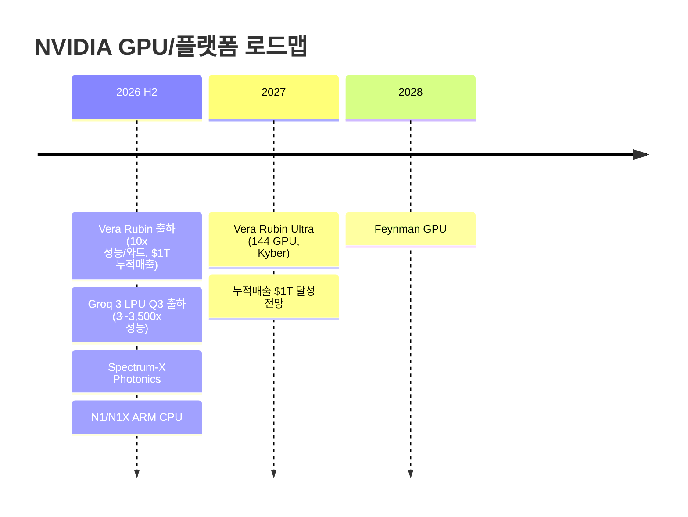

> **관련 글**: [2026년 투자 섹터 전망 (전체)](/knowledge/invest/2026/01/20/investment-sectors-outlook-2026.html)

2026년 글로벌 반도체 시장이 **$1T 마일스톤을 향해 질주**하고 있습니다. BofA는 30% YoY 성장을 전망하며, AI 인프라 투자 폭발(CAPEX $645B+)이 GPU/메모리 수요를 구조적으로 확대하고 있습니다. HBM TAM은 **$54.6B(+58% YoY, BofA)**, 2028년 $100B에 달할 것으로 예상됩니다.

**5월 4일 핵심:**
- **★★★ AI 4대 병목 공식화**: 빅테크 Q1 실적 발표에서 메모리·전력·CPU·광통신 4대 병목이 동시 공식화. MS "전력이 가장 큰 제약, 컴퓨팅보다 전력이 문제". MS CapEx 증가분 35%가 메모리 가격 상승분. 광통신: GPU N배 증가 → 연결은 N² 배
- **★★★ SanDisk 실적 폭발**: EPS $23.4(예상 $14.4, **+63% 어닝 서프라이즈**). 영업이익률 **78.4%**. 주가 +8%+. 4월 수익률: SanDisk +70%, AMD +70%, Micron +47%, TI +43%
- **★★★ 구글 클라우드 +63% YoY**: 업계 1위 성장률. 수주 잔고 243→460억 달러(+2배). Anthropic TPU 사용 급증. TPU 수익화 H2 2026 시작
- **★★★ AMD 5/5 어닝 프리뷰**: 매출 컨센서스 $9.84B(+32% YoY), EPS $1.28(+33% YoY). 주가 ~$360(4월 +68%). MI450 "고객 열망"(Lisa Su). EPYC CPU 수요 급증
- **★★ AI 수요 가속**: OpenRouter 토큰 1년 전 대비 ~10배 증가. 가용 GPU 감소 추세 지속. NVDA Blackwell B300 중국가격 700만 위안(~$1M) 공급 부족 심화
- **★★ 빅테크 메모리 병목 공식화**: MS(CapEx 35% 메모리), 메타(CFO 직접 언급), 아마존(AK 공시 리스크) — 3사 동시 메모리 공급 리스크 언급

**5월 2일 핵심 (참고):**
- **★★★ 2027년 쇼티지 공식화**: 삼성전자가 공식적으로 "2027년 수급 상황이 2026년보다 더 악화될 것"이라 발언. 주요 데이터센터 투자 가동까지 2년 이상 소요 → 2027H2~2028 전력·메모리 수요 집중
- **★★★ CPU 르네상스**: AI 패러다임 학습→추론 전환으로 CPU 수요 급증. GPU:CPU 비율 8:1→4:1→2:1~1:8 전망. INTC $99.62(+5.44%, 1987년 이후 가장 강한 월간 상승 추세). 에버코어 $111, HSBC $100 타겟
- **★★★ 메모리 슈퍼사이클**: SK하이닉스 HBM 2026 전체 capacity 매진. BofA DRAM +51%, NAND +45% YoY 전망. Micron 4월 +53%(구조적 수요 확인). SK하이닉스 HBM4 시장점유율 70%(UBS)
- **★★★ 빅테크 CapEx 건재**: 메타 $1,200B→$1,300B 상향, 구글 클라우드 +40%, 아마존/MS 투자 유지. OpenAI 우려 과도 — Anthropic·Google로 수요 이동, OpenAI NVDA 비중 ~20%로 축소이나 대세 영향 없음

## 반도체 섹터 현황 (2026년 5월 4일 기준)

### 핵심 지표

| 항목 | 수치/현황 | 비고 |
|------|----------|------|
| **SOXX** | **$465.75 (+0.93%)** | 반도체 섹터 강세 지속 |
| **NVIDIA** | **$198.45** | $5T 시총 근처 횡보 |
| **인텔** | **$99.62 (+5.44%)** | 역대 최고 수준 근접. 1987년 이후 가장 강한 월간 상승 추세 |
| **AMD** | **~$360 (4월 +68%, YTD +68%)** | 5/5 어닝 프리뷰: $9.84B 매출, EPS $1.28 컨센서스 |
| **SK하이닉스** | **HBM 2026 capacity 전량 매진** | HBM4 점유율 70%(UBS). Q1 역대 최대(매출 52.58조, OP 37.61조, 72% 마진) |
| **삼성전자** | **파운드리 2nm 수주 기대** | 노조 파업 우려로 하이닉스 대비 18%p 언더퍼폼 |
| **Micron** | **4월 +47%** | 구조적 수요 증가 시그널. 목표주가 $1,000 등장 |
| **SanDisk** | **4월 +70%, EPS $23.4(+63% 어닝 서프라이즈)** | 영업이익률 78.4%. 스토리지 수요 폭발 |
| **TSMC 2Q 가이던스** | **$39-40.2B** | TSMC 3nm 부족 → 서버 CPU 가격 10-20% 인상 |
| **AI CAPEX (빅테크 합산)** | **~$645B (+67% YoY, 2026)** | 메타 $1,200B→$1,300B 상향. 2027년 ~$1,500조 예상 |
| **2027 쇼티지** | **삼성전자 공식 인정** | "2027년 수급 2026년보다 악화". 데이터센터 투자 → 가동까지 2년 소요 |
| **HBM TAM** | **$54.6B (+58% YoY, 2026) → $100B (2028)** | BofA/TrendForce |
| **DRAM/NAND 전망** | **DRAM +51%, NAND +45% YoY (BofA)** | 메모리 슈퍼사이클 계속 |
| **글로벌 반도체 매출** | **$1.3T (2026 전망)** | BofA 최고 성장 전망. 30% YoY |
| **KOSPI** | **6,762.54 (+2.48%, 신고가)** | 반도체 강세 연동 |
| **AI 토큰 소비** | **1년 전 대비 ~10배 증가(OpenRouter)** | 꾸준히 우상향. GPU 가용 감소 추세 |

### 5월 4일 핵심 업데이트

| 항목 | 내용 |
|------|------|
| **★★★ AI 4대 병목 공식화** | 빅테크 Q1 실적에서 **메모리·전력·CPU·광통신** 4대 병목 동시 공식화. MS "전력이 가장 큰 제약 요인, 컴퓨팅보다 전력". MS CapEx 절반이 CPU+GPU. 광통신: GPU N배 → 연결 N² 배 |
| **★★★ 메모리 병목 3사 공식 인정** | MS: CapEx 증가분 35%가 **메모리 가격 상승**. 메타: CFO **직접 언급**. 아마존: AK 공시에 **메모리 공급 변동성을 리스크**로 명시 |
| **★★★ SanDisk 실적 폭발** | EPS **$23.4** vs 예상 $14.4(**+63% 서프라이즈**). 영업이익률 **78.4%**. 주가 **+8%+**. 4월 수익률: SanDisk **+70%**, AMD **+70%**, Micron **+47%**, TI **+43%** |
| **★★★ 구글 클라우드 +63% YoY** | 업계 **1위** 성장률. 수주 잔고 **243→460억 달러(+2배)**. Anthropic TPU 사용 급증. TPU 수익화 **H2 2026** 시작 |
| **★★★ AMD 5/5 어닝 프리뷰** | 매출 컨센서스 **$9.84B (+32% YoY)**, EPS **$1.28 (+33% YoY)**. 주가 **~$360**(4월 +68%). MI450 "고객 열망"(Lisa Su). EPYC CPU 수요 급증. Cathie Wood $79.9M 매도(차익실현). Deutsche Bank Hold $250 목표 |
| **★★ 아마존 AWS Q1** | Bedrock **1분기 처리 토큰 > 이전 전체 합산**. 트레이니엄 4세대 **완판**. 렉 판매 사업 진출 |
| **★★ 광통신 N² 수요** | GPU 클러스터 N배 증가 → 연결은 **N² 배** 증가. **Lumentum/Coherent** 직접 수혜. CPO 수요 가속 |
| **★★ AI 수요 가속 지표** | OpenRouter 토큰 **1년 전 대비 ~10배**. 가용 GPU **감소 추세** 지속. NVDA Blackwell B300 중국 가격 **700만 위안(~$1M)** — 공급 부족 심화 |
| **★★ KOSPI 6,762 신고가** | KOSPI **6,762.54 (+2.48%)**. SK하이닉스·삼성전자 동반 강세. BOTZ **$38.60 (+0.39%)** |

### 5월 2일 핵심 업데이트

| 항목 | 내용 |
|------|------|
| **★★★ 2027년 쇼티지 공식화** | 삼성전자 공식 발언: "2027년 수급이 2026년보다 더 악화". 데이터센터 투자 → 가동까지 **2년 이상** 소요 → 2027H2~2028 전력·메모리 수요 집중. SK Group 회장 "2030년까지 쇼티지 지속"과 일치 |
| **★★★ CPU 르네상스 — 추론 전환** | AI 패러다임 학습→추론 전환 → CPU 수요 급증. GPU:CPU 비율 **8:1 → 4:1 → 2:1~1:8** 전망. INTC **$99.62(+5.44%)** — 역대 최고 수준 근접. 에버코어 **$111**, HSBC **$100**, 노스랜드 **$92** 타겟 |
| **★★★ 메모리 슈퍼사이클 확인** | SK하이닉스 HBM **2026 전체 capacity 매진**. BofA: DRAM **+51%**, NAND **+45%** YoY 전망. Micron 4월 **+53%**(구조적 수요 확인). SK하이닉스 HBM4 시장점유율 **70% (UBS)** |
| **★★★ 빅테크 CapEx 건재** | 메타 **$1,200B→$1,300B** 상향, 구글 클라우드 **+40%**, 아마존/MS 투자 유지. OpenAI 우려 과도 — Anthropic·Google로 수요 이동. OpenAI NVDA 비중 ~20%로 축소이나 **대세 영향 없음** |
| **★★ 삼성전자 파운드리 반전 기대** | 2nm "조만간 의미있는 고객 수주" **공식 코멘트**. 수율 개선 중. TSMC 캐파 부족으로 인텔·삼성으로 수요 분산 조짐. 노조 파업 우려 — 하이닉스 대비 **18%p 언더퍼폼** 원인 |
| **★★ NVDA/Google/MS 펜타곤 AI 계약** | AI 군사 응용 확대 → NVDA **구조적 수요 기반 강화** |
| **★★ HBM 가격 시나리오** | 상승률 40%→8% 가정 시 하이닉스 연간 ~220조, 40%→15% 가정 시 ~290조 |

### 4월 29일 핵심 업데이트 (참고)

| 항목 | 내용 |
|------|------|
| **★★★ SK하이닉스 Q1 역대 최대** | 매출 **52.58조원**(+198% YoY, 처음으로 50조 돌파). OP **37.61조원**(+405% YoY), **72% 마진**. HBM 점유율 **57%**. HBM4 수요 향후 **3년치 초과 예약**. 목표가: 미래에셋 **200만원**, 모건스탠리 **170만원** |
| **★★★ 삼성전자 Q1 사상최대** | OP **57.2조원**(+755% YoY), 컨센서스 대비 **+31% 서프라이즈**. 파운드리 **2Q~3Q 흑자 전환** 예상. HBM4 양산 **2월 착수**. DRAM 마진 **73%** |
| **★★★ 빅테크 AI CapEx** | 2026년 **~$645B**(MSFT+AMZN+META+GOOGL), **+67% YoY** |
| **★★★ 에이전틱 AI → CPU 수요** | GPU:CPU 비율 8:1→4:1→2:1~1:8. Intel Q1: EPS 29c vs 1c(**+2800%**). 데이터센터 **+22%** |
| **★★ 두산 CCL + 파미셀** | 두산: 엔비디아 블랙웰 CCL **단독 공급**, 2027년까지 독점. 영업이익률 **25-30%**. 파미셀: CCL 소재 납품, 9월 3공장 증설(2배) |
| **★★ 씨게이트 어닝 서프라이즈** | EPS **$4.1** vs 예상 **$3.5**, 시간외 **+15%**. 다음 분기 EPS **$5** |
| **★★★ SanDisk 어닝 폭발 (5/4)** | EPS **$23.4** vs 예상 **$14.4**(**+63% 서프라이즈**). 영업이익률 **78.4%**. 주가 **+8%+**. AI 스토리지 수요 구조적 폭발 확인 |

---

## SanDisk 실적 폭발 — 스토리지 AI 수요 검증 (5/4 업데이트)

| 항목 | 내용 |
|------|------|
| **EPS** | **$23.4** (예상 $14.4, **+63% 서프라이즈**) |
| **영업이익률** | **78.4%** — 반도체 역사상 최고 수준 |
| **주가 반응** | **+8%+** 상승 |
| **4월 누적 수익률** | **SanDisk +70%**, AMD +70%, Micron +47%, TI +43% |
| **투자 시사점** | AI 데이터센터 스토리지 수요 폭발 → HBM 이외 스토리지(NAND) 수혜. 씨게이트(이전 분기 +15%)와 함께 스토리지 섹터 전체 슈퍼사이클 확인 |

**투자 시사점**: SanDisk 78.4% 영업이익률은 AI 스토리지 수요가 얼마나 폭발적인지를 보여줍니다. BofA NAND +45% YoY 전망이 실적으로 검증되고 있으며, 씨게이트(HDD)·SanDisk(NAND) 동반 강세는 스토리지 섹터 전반의 구조적 수혜를 시사합니다.

---

## 2027년 쇼티지 공식화 — 수급 악화 심화 확정 (5/2 업데이트)

삼성전자가 공식적으로 **"2027년 수급 상황이 2026년보다 더 악화될 것"**이라고 발언했습니다(김장열 인터뷰, 삼프로TV 5/1). 이는 반도체 슈퍼사이클이 2027~2028년까지 연장됨을 의미합니다.

| 항목 | 내용 |
|------|------|
| **삼성전자 공식 발언** | "**2027년 수급 상황이 2026년보다 더 악화**될 것" |
| **원인** | 데이터센터 투자 → **가동까지 2년 이상** 소요. 2024~2025년 투자가 2027H2~2028년에 집중 가동 |
| **전력·메모리 수요** | 2027H2~2028 **전력·메모리 수요 집중** 도래 |
| **SK Group 회장 (4/29)** | "**2030년까지** 메모리 쇼티지 지속" — 동일 방향성 |
| **OpenAI 우려** | 과도 — Anthropic·Google로 수요 이동. OpenAI NVDA 비중 ~20%로 축소이나 **대세 영향 없음** |
| **빅테크 CapEx** | 메타 $1,200B→**$1,300B 상향**, 구글 클라우드 **+40%**, 아마존/MS **유지** |

**투자 시사점**: 삼성전자의 공식 발언은 2027~2028년 반도체 수요가 현재보다 더 강할 것임을 확인합니다. 데이터센터 건설-가동 사이클(2년+)을 고려하면 현재 진행 중인 빅테크 CapEx가 2027H2~2028년에 폭발적으로 전력·메모리 수요를 창출합니다. SK하이닉스 HBM 2026 전체 capacity 매진 → 2027 쇼티지 심화는 구조적 가격 결정력을 유지시킵니다.

---

## CPU 르네상스 — AI 추론 전환으로 CPU 수요 급증 (5/2 업데이트)

AI 패러다임이 **학습(Training) → 추론(Inference)**으로 전환되면서 CPU 수요가 구조적으로 급증하고 있습니다. 에이전틱 AI가 확산되며 GPU 중심 아키텍처가 **CPU+GPU 이원화**로 재편되고 있습니다.

| 항목 | 내용 |
|------|------|
| **AI 패러다임 전환** | 학습 → **추론** 단계 전환 → CPU 병렬 연산 보조 역할 급증 |
| **GPU:CPU 비율 변화** | 현재 **8:1** → 단기 **4:1** → 향후 **2:1~1:8** 전망 |
| **TSMC 3nm 부족** | 에이전틱 AI 수요 → 3nm 공정 부족 → 서버 CPU 가격 **10-20% 인상** |
| **Intel 주가** | **$99.62 (+5.44%)** — 역대 최고 수준 근접. 1987년 이후 가장 강한 월간 상승 추세 |
| **Intel Q1 검증 (4/23)** | EPS **29c** vs 예상 1c(**+2800%**). 데이터센터 **+22% → $5.1B** |
| **AMD vs Intel 경쟁** | 시총 경쟁 심화. DA Davidson AMD $375 타겟. "CPU 수요 전례 없는 국면" |
| **Intel 목표주가** | 에버코어 **$111**, HSBC **$100**, 노스랜드 **$92** |
| **Tesla-Intel 14A** | 테슬라 = 인텔 14A **파운드리 파트너십 공식화** |
| **DRAM 수혜** | CPU 수요 급증 → **DRAM 수요 연계 확대** |

**투자 시사점**: 에이전틱 AI 시대에는 GPU만큼 CPU 수요가 폭발적으로 증가합니다. 챗봇(사용자 질문 시 실행)과 달리 에이전트는 **24시간 자율 실행**하며 CPU를 상시 소비합니다. Intel Q1 EPS +2800%와 AMD 데이터센터 매출 최고치는 이 테제가 실적으로 검증되고 있음을 보여줍니다. GPU:CPU 비율이 8:1에서 장기적으로 1:8까지 역전될 수 있다는 전망은 x86 CPU 시장의 구조적 재부상을 의미합니다.

---

## 메모리 슈퍼사이클 — HBM 매진, Micron +53% (5/2 업데이트)

HBM 공급 부족이 심화되고 메모리 슈퍼사이클이 가속되고 있습니다.

| 항목 | 내용 |
|------|------|
| **SK하이닉스 HBM** | **2026년 전체 capacity 매진** |
| **SK하이닉스 HBM4 점유율** | **70%** (UBS) 전망 |
| **BofA DRAM 전망** | **+51% YoY** |
| **BofA NAND 전망** | **+45% YoY** |
| **Micron** | 4월 **+53%** — 수요 구조적 증가 시그널. 목표주가 $1,000 등장. P/E ~6배 |
| **HBM 가격 시나리오** | 상승률 40%→8% 가정 시 하이닉스 연간 **~220조**, 40%→15% 가정 시 **~290조** |
| **DRAM Q2 가격** | **+30% QoQ** 확정. TrendForce: 일반 DRAM Q2 **+58-63% QoQ** |
| **HBM TAM** | **$54.6B (+58% YoY, 2026) → $100B (2028)** |

**투자 시사점**: SK하이닉스 HBM 2026 전체 capacity 매진은 가격 결정력의 극한을 보여줍니다. BofA의 DRAM +51%, NAND +45% YoY 전망은 메모리 슈퍼사이클이 HBM에서 범용 메모리로 확산됨을 의미합니다. Micron 4월 +53%는 미국 투자자들이 메모리 구조적 수요 증가를 본격적으로 인식하고 있음을 시사합니다.

---

## 삼성전자 파운드리 — 반전 기대, 노조 변수 (5/2 업데이트)

삼성전자 파운드리가 2nm 수주를 통해 반전을 모색하고 있습니다.

| 항목 | 내용 |
|------|------|
| **2nm 수주** | "조만간 의미있는 고객 수주" **공식 코멘트** |
| **수율 개선** | 진행 중 |
| **TSMC 캐파 부족** | 인텔·삼성으로 수요 분산 조짐 — **외부 환경 우호적** |
| **노조 파업 우려** | 하이닉스 대비 **18%p 언더퍼폼** 원인. 해소 시 **캐치업 기대** |
| **Q1 파운드리** | **2Q~3Q 흑자 전환** 예상 (4/29 기준) |
| **HBM4 점유율** | **30%+** — NVIDIA HBM4 30%+ 공급 확보 |

**투자 시사점**: 삼성전자는 HBM4 30%+ 점유율과 파운드리 2nm 수주 기대를 보유하고 있으나, 노조 파업 우려가 주가를 압박하고 있습니다. 노조 변수 해소 시 하이닉스 대비 18%p 언더퍼폼이 빠르게 캐치업될 가능성이 있습니다. TSMC 캐파 부족으로 인한 수요 분산은 삼성 파운드리에 구조적 기회입니다.

---

## 인텔 Q1 2026 블로우아웃 — ATH, YTD +100%, 테슬라 14A 파운드리 (4/23)

인텔이 Q1 2026 실적을 발표하며 **EPS 29c(예상 1c)**를 대폭 상회하는 블로우아웃 실적을 기록했습니다.

| 항목 | 내용 |
|------|------|
| **EPS** | **29c** (예상 1c, **2,800% 상회**) |
| **매출** | **$13.58B** (예상 $12.42B, **+9.3% 상회**) |
| **데이터센터** | **+22% → $5.1B** — 에이전틱 AI가 GPU→CPU 컴퓨팅 전환 가속 |
| **테슬라 14A 파운드리** | 테슬라 = **인텔 14A 공정 파트너십 공식화** |
| **주가 (5/2)** | **$99.62 (+5.44%)** — 역대 최고 수준 근접 |
| **YTD 성과** | **+100%** — 1987년 이후 가장 강한 월간 상승 추세 지속 |
| **DA Davidson** | **"CPU 수요가 전례 없는 국면(unprecedented phase) 진입"** |
| **목표주가** | 에버코어 **$111**, HSBC **$100**, 노스랜드 **$92** |
| **미 정부 수익** | 인텔 투자(보조금+지분)로 **~$30B 수익** 실현 |

---

## SK하이닉스 Q1 2026 역대 최대 실적 — OP 37.61조원, 72% 마진 (4/29 업데이트)

| 항목 | 내용 |
|------|------|
| **매출** | **52.58조원** (+60% QoQ, **+198% YoY**, **처음으로 50조 돌파**) |
| **영업이익** | **37.61조원** (+96% QoQ, **+405% YoY**) |
| **영업이익률** | **72%** |
| **순이익** | **40.35조원**(+398% YoY), 순이익률 **77%** |
| **HBM 점유율** | **57%** — 압도적 1위 (HBM4 70%, UBS) |
| **HBM4E** | 샘플 **H2 2026**, 양산 **2027** |
| **HBM4 수요** | 향후 **3년치 초과 예약** |
| **2026 HBM capacity** | **전량 매진** (5/2 업데이트) |
| **신규 공장** | **19조원** 규모 한국 내 제조공장 신설 |
| **SK Group 회장** | "**2030년까지** 메모리 쇼티지 지속" |
| **목표주가** | 미래에셋 **200만원**, 모건스탠리 **170만원**(+31%) |
| **주의사항** | 하반기 이익 성장률 **둔화 가능성** (2027년 +20% 초반 전망) |

---

## 삼성전자 Q1 2026 사상최대 — OP 57.2조원, +755% YoY (4/29 업데이트)

| 항목 | 내용 |
|------|------|
| **영업이익** | **57.2조원** (+755% YoY, 컨센서스 대비 **+31% 서프라이즈**) |
| **매출** | **133조원** |
| **반도체 부문 OP** | **48-50조원** 추정 |
| **DRAM 마진** | **73%** |
| **파운드리** | **2Q~3Q 흑자 전환** 예상 |
| **HBM4** | 양산 **2월 착수** — 하이닉스보다 선행 |
| **HBM4 점유율** | NVIDIA HBM4 **30%+** 공급 확보 |
| **2nm 파운드리** | "조만간 의미있는 고객 수주" 공식 코멘트 (5/2) |
| **글로벌 이익 순위** | **4위**: Apple 76T > NVDA 66T > MS 57.5T > Samsung 57.2T |
| **PER** | **6.5배** 저평가 |
| **모건스탠리 목표주가** | **36만원** (+43%) |
| **노조 변수** | 파업 우려 — 하이닉스 대비 18%p 언더퍼폼 원인. 해소 시 캐치업 기대 |

---

## 빅테크 AI CapEx & Q1 실적 — 수요 폭발 확인 (5/4 업데이트)

### AI CapEx 현황

| 기업 | AI CAPEX (2026) | 비고 |
|------|----------------|------|
| **Amazon** | **$200B** | 최대 투자 |
| **Google** | **$175-185B** | 클라우드 +63% YoY (업계 1위) |
| **Microsoft** | **$120B+** | 투자 유지. Azure 가이던스 39→40% |
| **Meta** | **$135B** | $1,200B→**$1,300B 상향** |
| **합산** | **~$645B** | **+67% YoY**, 약 1,000조원 |
| **2027 전망** | **~$1,500조원** | 2026년 대비 약 1.5배 추가 성장 |

### 빅테크 Q1 2026 실적 요약 (5/4 기준)

| 기업 | Q1 핵심 | 반도체 시사점 |
|------|---------|------------|
| **구글 클라우드** | **+63% YoY** (업계 1위). 수주잔고 243→**460억 달러(+2배)**. Anthropic TPU 사용 급증 | TPU 수익화 H2 2026 → 브로드컴 수혜 |
| **아마존 AWS** | Bedrock **1분기 토큰 > 이전 전체 합산**. 트레이니엄 4세대 **완판**. 렉 판매 사업 진출 | HBM/스토리지 수요 폭발 |
| **메타** | CapEx 전망치 **상향**. Broadcom **2nm AI칩** 파트너십. **Assured Robot Intelligence(humanoid AI)** 인수 | 메모리 가격 급등 CFO 직접 언급 |
| **MS** | Azure 성장률 **39→40% 가이던스**. CapEx 절반 **CPU+GPU** | 전력이 컴퓨팅보다 큰 제약. CapEx 35% 메모리 가격 |
| **애플** | 전 부문 **어닝 그린라이트**. 시총 **$4T 돌파**. 아이폰 17 수요 폭발 | A 시리즈 칩 TSMC N3 수요 |

### AI 4대 병목 공식화 (5/4 빅테크 Q1 실적)

| 병목 | 내용 | 수혜 종목 |
|------|------|---------|
| **메모리** | MS CapEx 증가분 35%가 메모리 가격 상승. 메타 CFO 직접 언급. 아마존 AK 공시 리스크 명시 | SK하이닉스, Micron, SanDisk |
| **전력** | MS "전력이 가장 큰 제약 요인, 컴퓨팅보다 전력이 문제" | Eaton, 발전 인프라 |
| **CPU** | 아마존 핵심 자산 어필. MS CapEx 절반이 CPU+GPU | Intel, AMD EPYC |
| **광통신** | GPU N배 증가 → 연결은 **N² 배**. 병목 구조적 | Lumentum, Coherent, Credo, Marvell |

**OpenAI 우려 대비 실상**: OpenAI NVDA 비중 ~20%로 축소이나, Anthropic·Google로 수요가 이동하여 전체 AI 인프라 수요는 대세 영향 없음. AI 생태계 다변화 = 복수 클라우드 업체의 AI 인프라 투자 경쟁 가속.

---

## 종목 선호도 및 투자 전략 (5/2 기준)

### 추천 종목 순위 (김장열, 5/1)

| 순위 | 종목 | 이유 |
|------|------|------|
| **1** | **SK하이닉스** | HBM 선두(점유율 70%), P/E ~5배 저평가, 단기 모멘텀 우위. 2026 capacity 매진 |
| **2** | **삼성전자** | HBM4 기술 선행·파운드리 2nm 수주 기대. 노조 변수 해소 시 캐치업 |
| **3** | **마이크론** | P/E ~6배, 미국 접근성 장점, 목표주가 $1,000 등장. 4월 +53% |
| **참고** | **인텔** | CPU 르네상스 최대 수혜. YTD +100%, 목표주가 $111(에버코어) |

### HBM 가격 시나리오

| 시나리오 | 조건 | 하이닉스 연간 이익 |
|---------|------|---------|
| **보수적** | HBM 가격 상승률 40%→8% | **~220조원** |
| **기본** | HBM 가격 상승률 40%→15% | **~290조원** |

---

## 두산 CCL 엔비디아 블랙웰 단독 공급 + 파미셀 (4/29)

### 두산 전자BG

| 항목 | 내용 |
|------|------|
| **공급 대상** | 엔비디아 **블랙웰 GPU** CCL 단독 공급 |
| **경쟁사 탈락** | **EMC 탈락** — 두산 독점 확정 |
| **독점 기간** | **2027년까지** |
| **2026 영업이익률** | **25-30%** |
| **매출 성장** | 2026년 매출 **2024년 대비 2배** |

### 파미셀 — 두산향 CCL 소재 납품

| 항목 | 내용 |
|------|------|
| **납품 소재** | 두산향 CCL 소재(**레진/경화제**) |
| **영업이익률** | **30%+** |
| **3공장 증설** | **9월** 착공, 생산 능력 **2배** 확대 |

---

## OpenAI-MS 파트너십 재편 — 구조적 수요 불변 (4/29)

4/27 MS-OpenAI 독점 파트너십이 해제되며 SOXX -3.67% 일시 조정이 발생했으나, 구조적 수요는 불변입니다.

| 항목 | 내용 |
|------|------|
| **4/28 반도체 반응** | NVDA **-1.63%**, AMD **-3.4%**, Broadcom **-4%**, SOXX **-3.67%** |
| **실상** | OpenAI WAU **4억→9억(2배 성장)**. Anthropic ARR **$30B > OpenAI $25B** 역전 |
| **반도체 시사점** | AI 클라우드 다변화 = AWS·Google·MS 모두 AI 인프라 투자 경쟁 가속 |
| **판단** | **일시적 과잉반응 → 매수 기회** |

---

## SaaS 위기 = AI 인프라 투자 가속의 역설 (4/23)

소프트웨어 섹터가 AI 도구 확산으로 대폭 하락했으나, 이는 AI 인프라/반도체 투자 가속을 시사합니다.

| 항목 | 내용 |
|------|------|
| **SaaS 충격** | ServiceNow **-18%**, IBM **-8%**, Salesforce **-9%**, Workday **-9%**(YTD **-45%**) |
| **원인** | AI 도구가 기업용 SaaS를 **대체/파괴** |
| **역설** | SaaS CAPEX → **AI 인프라 CAPEX**로 전환 가속 |
| **반도체 시사점** | **사모신용/SaaS 리스크 = 반도체에 오히려 수혜** — SaaS 위기일수록 AI 인프라 투자 가속 |

---

## SOCAMM2 메모리 전쟁 (4/29 업데이트)

| 업체 | 현황 | 비고 |
|------|------|------|
| **SK하이닉스** | **192GB 양산** 선두 | 시장 선점. 엔비디아 베라루빈 공급망 |
| **마이크론** | **256GB 샘플** 준비 중 | 용량 경쟁 돌파구 |
| **삼성전자** | **와피지(Wafer Process Issue) 해결** 발표 | 양산 정상화 기대 |

---

## GTC 2026 주요 발표 (3/20 업데이트)

### SK하이닉스 CHBM — 세계 최초 커스터마이징 HBM

| 항목 | 내용 |
|------|------|
| **CHBM** | 세계 최초 **커스터마이징 가능 HBM** — 대역폭/용량/전력을 고객별로 구성 |
| **Stream DQ** | 베이스 다이에서 **역양자화** 수행(GPU 대신) → 추론 성능 **최대 7x** 향상 |
| **HBM4 성능** | HBM3 대비 **2x+ 대역폭**, **1.5-2x 용량**, **50% 전력효율** 개선 |

### Groq 3 LPU

| 항목 | 내용 |
|------|------|
| **성능** | Blackwell 대비 **3x~3,500x** 성능, 비용성능 **35-50x** 개선 |
| **출하** | **Q3 2026** |
| **아키텍처** | SRAM 기반 LPU + **분산 추론** (Prefill/Decode 역할 분리) |

### NVIDIA 로드맵

---

## TeraFab — Tesla/SpaceX/xAI $25B JV + 인텔 합류

| 항목 | 내용 |
|------|------|
| **JV 규모** | **$25B** (Tesla + SpaceX + xAI 합작) |
| **인텔 합류 (4/9)** | 인텔 파운드리 14A 공정 참여 확정. Tesla **14A 파운드리 파트너십 공식화** (5/2) |
| **공정** | **2nm** 목표. 월 **100만 장** 웨이퍼(초기 10만 장) |
| **칩 배분** | 80% 우주용 **D3 칩**(SpaceX 위성), 20% 지상용 **AI5 칩**(Tesla/Optimus) |
| **반도체 50배 비전** | 머스크: 연간 1억 대 휴머노이드 → 반도체 **50배** 필요 |

---

## HBM4 양산 및 점유율 현황

### HBM4 점유율

| 업체 | HBM4 점유율 | 현황 |
|------|-----------|------|
| **SK하이닉스** | **~70%** (UBS), HBM 전체 **57%** | 2026 capacity **전량 매진**. CHBM 세계 최초. Rubin 물량 70% |
| **삼성전자** | **30%+** | NVIDIA HBM4 30%+ 공급. AMD MoU 체결. 2nm 수주 기대 |
| **Micron** | **~20%** | 4월 +53%. P/E ~6배. 목표주가 $1,000 등장 |

### HBM 시장 규모

| 연도 | TAM |
|------|-----|
| **2026** | **$54.6B (+58% YoY)** |
| **2028** | **$100B** |

---

## AI CAPEX: ~$645B + AI 인프라 폭발

| 항목 | 내용 |
|------|------|
| **★★★ 2027 쇼티지 공식화 (5/2)** | 삼성전자: "2027년 수급 2026년보다 악화". 데이터센터 투자→가동 2년 소요 → 2027H2~2028 집중 |
| **★★★ 메타 CapEx 상향 (5/2)** | $1,200B → **$1,300B 상향**. 구글 클라우드 **+40%**. 아마존/MS 유지 |
| **★★★ CPU 르네상스 (5/2)** | GPU:CPU 비율 **8:1→향후 1:8** 전망. INTC $99.62(역대 최고 근접) |
| **★★★ OpenAI-MS 파트너십 재편 (4/29)** | 독점 해제 → AI 생태계 다변화 → 클라우드 경쟁 가속 → AI 인프라 수요 확대 |
| **Anthropic** | ARR **$30B** (오픈AI $25B 추월). IPO **$380B** |
| **오픈AI** | WAU **9억**(2배 성장). 기업가치 **$852B** |
| **브로드컴** | Meta **2nm AI칩(1GW)** + 구글 **TPU 2031** 장기계약 |
| **Marvell** | NVIDIA **지분 투자** + Amazon 칩 계약. Barclays **$150** |
| **AI 트래픽** | **2027년** AI 트래픽이 **인간 트래픽 초과** 전망 |
| **OpenRouter 토큰 (5/4)** | **1년 전 대비 ~10배** 증가, 꾸준히 우상향 중 |
| **GPU 가용성 (5/4)** | 가용 GPU **감소 추세** 지속. Blackwell B300 중국 **700만 위안(~$1M)** |

---

## AI 칩: AMD MI455X로 NVIDIA 독점 최초 구조적 도전

### AMD MI455X + Helios

| 항목 | 내용 |
|------|------|
| **MI455X GPU** | HBM4 2GB, 전세대 대비 **10x 성능**, 칩렛 설계(2nm+3nm), 삼성 HBM4 MoU 체결 |
| **Helios 시스템** | GPU 72개 + CPU 18개 단일 렉, **2.9 ExaFLOPS** |
| **Meta 6GW 딜** | **~$60B (5년)** |
| **AI 점유율** | 9% → **18%** (2026E) |
| **출하 일정** | Helios **2H 2026** 목표 |

**투자 시사점**: NVIDIA 점유율은 장기적으로 60-70%로 하락 전망이나, **AI 데이터센터 시장 자체가 연 50% 성장**하므로 양사 모두 수혜.

---

## RAMmageddon: 소비자 메모리 가격 폭등

| 제품 | 동향 |
|------|------|
| **범용 DRAM** | Q2 **+30% QoQ** 인상. TrendForce: Q2 **+58-63% QoQ**. BofA: YoY **+51%** |
| **DDR4 8Gb** | 평균 **$13** (11개월 연속 상승) |
| **서버 DRAM (DDR5)** | **+105-110% QoQ**. 64GB RDIMM: $255(Q3'25)→$450(Q4'25)→**$700+(3월)** |
| **NAND** | **+55-60% QoQ**. BofA: YoY **+45%** |

---

## CPO(Co-Packaged Optics): 2026년 월가 TOP1 투자 테마

| 항목 | 내용 |
|------|------|
| **시장 성장률** | **연간 137%** 성장 |
| **양산 시점** | **2026년** 본격 양산 시작 |
| **NVIDIA** | Spectrum-X Photonics(H2 2026), Quantum-X IB |

| 종목 | 포지션 |
|------|--------|
| **Marvell (MRVL)** | 광통신 포토닉 패브릭스, AEC, DSP, 커스텀 칩 |
| **Credo (CRDO)** | AEC 리타이머. **$750M DustPhotonics 인수**(실리콘 포토닉스) |
| **Corning (GLW)** | 광섬유 소재 |

---

## 파운드리: 삼성 수주 + TSMC N2 램프업

| 항목 | 내용 |
|------|------|
| **삼성 2nm 수주 (5/2)** | "조만간 의미있는 고객 수주" **공식 코멘트**. 수율 개선 중 |
| **삼성 파운드리 Q3** | NVIDIA 출하 시작. TSMC 캐파 부족 → 수요 분산 조짐 |
| **TSMC N2 (2nm)** | 램프업 진행 중, **100K-140K 웨이퍼/월** (2026년 말), $165B 미국 투자 |
| **TSMC 3nm 부족** | 서버 CPU 가격 **10-20% 인상** — 삼성/인텔 기회 |
| **Intel 14A** | 테슬라 파트너십 공식화. 파운드리 비즈니스 모델 검증 |

---

## 주요 종목 분석

### SK하이닉스 (000660) — HBM 70%, 2026 capacity 매진

| 항목 | 내용 |
|------|------|
| **Q1 2026 실적** | 매출 **52.58조**(+198% YoY, 50조 첫 돌파). OP **37.61조**(72% 마진) |
| **HBM 점유율** | **57%** (HBM4 **70%**, UBS) |
| **2026 HBM** | **전체 capacity 매진** (5/2) |
| **HBM4 수요** | 향후 **3년치 초과 예약** |
| **PER** | **~5배** (저평가) |
| **SK Group 회장** | "**2030년까지** 메모리 쇼티지 지속" |
| **HBM 가격 시나리오** | 40%→15% 가정 시 연간 **~290조원** |

**목표주가**

| 증권사 | 목표가 |
|--------|--------|
| **미래에셋** | **200만원** |
| **모건스탠리** | **170만원** (+31%) |
| 노무라 | 156만원 |
| 하나증권 | **145만원** |
| 대신증권 | **145만원** |
| 시티/SK증권 | **140-150만원** |
| 키움증권 | **130만원** |

### 삼성전자 (005930) — Q1 사상최대, 파운드리 2nm 수주 기대

| 항목 | 내용 |
|------|------|
| **Q1 2026 OP** | **57.2조원** (+755% YoY, 컨센서스 **+31% 서프라이즈**) |
| **파운드리** | 2Q~3Q **흑자 전환** 예상. 2nm "조만간 의미있는 수주" (5/2) |
| **HBM4** | 양산 2월 착수(하이닉스보다 선행). **30%+** 점유율 |
| **PER** | **6.5배** 저평가 |
| **노조 변수** | 파업 우려 → 하이닉스 대비 18%p 언더퍼폼. **해소 시 캐치업 기대** |
| **목표주가** | 모건스탠리 **36만원**(+43%), KB증권 **36만원** |

### NVIDIA (NVDA) — $198.45, $5T 시총

| 항목 | 내용 |
|------|------|
| **주가 (5/2)** | **$198.45 (-0.56%)** |
| **Q4 FY2026 가이던스** | **$65B** — "Blackwell 판매 off the charts" |
| **$1T 누적매출** | 2027년까지 누적 $1T 전망 |
| **펜타곤 AI 계약** | NVDA/Google/MS — AI 군사 응용 확대 (5/2) |
| **Rubin GPU** | KeyBanc: 생산 **150만 대**(당초 200만). HBM4 인증 지연 |
| **로드맵** | Vera Rubin(H2 2026) → Vera Rubin Ultra(2027) → Feynman(2028) |
| **목표가** | Goldman $250, Morgan Stanley $260 |

### AMD (AMD) — 어닝 프리뷰 5/5, 현재 $360

| 항목 | 내용 |
|------|------|
| **주가 (5/4)** | **~$360** (4월 **+68%**, YTD **+68%**) |
| **5/5 어닝 컨센서스** | 매출 **$9.84B (+32% YoY)**, EPS **$1.28 (+33% YoY)** |
| **MI450 GPU** | Lisa Su "고객 열망(customer demand is very strong)" |
| **EPYC CPU** | 수요 급증 — 에이전틱 AI 추론 전환 수혜 |
| **DA Davidson** | **Buy** $375 목표. "CPU 수요가 전례 없는 국면 진입" |
| **Deutsche Bank** | Hold, **$250** 목표 (밸류에이션 부담 우려) |
| **Cathie Wood (ARK)** | **$79.9M 매도** — 차익실현. 고점 주의 신호로 모니터링 |
| **데이터센터 매출** | **$5.38B** — 역대 최고 |
| **MI455X** | HBM4, 10x 성능, Meta 6GW + OpenAI 6GW = 12GW |
| **AI 점유율** | 9% → 18% (2026E) |

### Intel (INTC) — CPU 르네상스 최대 수혜

| 항목 | 내용 |
|------|------|
| **주가 (5/2)** | **$99.62 (+5.44%)** — 역대 최고 수준 근접 |
| **YTD** | **+100%** — 1987년 이후 가장 강한 월간 상승 추세 |
| **Q1 EPS** | **29c** vs 예상 1c (**+2800%**) |
| **데이터센터** | **+22% → $5.1B** |
| **Tesla-Intel 14A** | 파운드리 파트너십 공식화 |
| **목표주가** | 에버코어 **$111**, HSBC **$100**, 노스랜드 **$92** |

### Micron (MU) — 미국 메모리 대표주

| 항목 | 내용 |
|------|------|
| **4월 수익률** | **+53%** — 구조적 수요 확인 |
| **P/E** | **~6배** — 저평가 |
| **목표주가** | $1,000 등장 |
| **HBM** | 2026년 말까지 전량 매진. Q2 15K 웨이퍼/월 램프 |

---

## 시장 지표 (5/4 기준)

| 항목 | 수치 | 비고 |
|------|------|------|
| **SOXX** | **$465.75 (+0.93%)** | 반도체 섹터 강세 지속 |
| **BOTZ** | **$38.60 (+0.39%)** | AI/로보틱스 ETF |
| **NVIDIA** | **$198.45** | $5T 시총 근처 횡보 |
| **AMD** | **~$360 (4월 +68%)** | 5/5 어닝 프리뷰. MI450/EPYC 수요 |
| **인텔** | **$99.62 (+5.44%)** | 역대 최고 수준 근접. YTD +100% |
| **SK하이닉스** | **Q1 역대 최대: 매출 52.58조, OP 37.61조, 72% 마진** | HBM 2026 capacity 매진. 목표가 미래에셋 200만 |
| **삼성전자** | **Q1 사상최대: OP 57.2조 (+755% YoY)** | 2nm 수주 기대. 노조 변수 해소 시 캐치업 |
| **Micron** | **4월 +47%** | P/E ~6배. 목표주가 $1,000 등장 |
| **SanDisk** | **4월 +70%, EPS $23.4 (+63% 서프라이즈)** | 영업이익률 78.4%. 스토리지 슈퍼사이클 |
| **TSMC 2Q 가이던스** | **$39-40.2B** | 3nm 부족 → CPU 가격 10-20% 인상 |
| **두산 CCL** | **엔비디아 블랙웰 단독 공급, 2027년까지 독점** | 영업이익률 25-30% |
| **2027 쇼티지** | **삼성전자 공식 인정** | 수급 2026년보다 악화 전망 |
| **DRAM/NAND** | **DRAM +51%, NAND +45% YoY (BofA)** | Micron 4월 +47% 구조적 확인 |
| **AI CAPEX** | **~$645B (+67% YoY, 2026)** | 메타 $1,300B 상향. 2027년 ~$1,500조 |
| **HBM TAM** | **$54.6B (+58% YoY) → $100B (2028)** | BofA/TrendForce |
| **반도체 시장 규모** | **$1.3T (2026)** | BofA 최고 성장 전망 |
| **KOSPI** | **6,762.54 (+2.48%, 신고가)** | 반도체 강세 동반 신고가 |

---

## 관세 환경: Section 122 (15%)

| 관세 유형 | 세율 | 현황 | 반도체 영향 |
|----------|------|------|-----------|
| **IEEPA 상호관세** | 국가별 차등 | **위헌 무효** | 환급 가능 |
| **Section 122** | **15%** | **2/24 발효, 150일 한시** | IEEPA 25% 대비 하향 = **순긍정** |
| **Section 232** | **25%** | **유지** | 첨단 로직 대상 |

---

## 투자 전략

### 액션 플랜

| 전략 | 내용 |
|------|------|
| **단기 (1-2주)** | **AMD 5/5 어닝**(EPS $1.28 컨센서스, $360 주가 기대치 반영 여부). SanDisk +70% 이후 추세 지속 여부. SOXX $465 지지 확인. 빅테크 4대 병목 공식화 → 메모리·광통신 종목 파급효과 |
| **중기 (1-3개월)** | NVIDIA 실적 발표. SK하이닉스 HBM4E 샘플(H2 2026). 삼성 파운드리 Q3 NVIDIA 출하 시작. 삼성 노조 파업 리스크 모니터링. SK하이닉스 ADR 상장 일정. Lumentum/Coherent 광통신 N² 수혜 모니터링 |
| **장기 (6개월+)** | 2027~2028 쇼티지 심화 확정(삼성 공식 발언) → HBM/DRAM/NAND 가격 결정력 유지. 광통신 N² 수요(GPU 클러스터 확장). BofA $1.3T 반도체 시장 실현. Rubin GPU 풀프로덕션(2027). HBM TAM $54.6B(2026)→$100B(2028) |

### 투자 근거

1. **AI 4대 병목 공식화(5/4 빅테크 Q1 실적)**: 메모리·전력·CPU·광통신 동시 병목. 수혜 섹터 전방위 확산
2. **SanDisk 78.4% 영업이익률**: 스토리지 슈퍼사이클 실적 검증. NAND +45% YoY 전망(BofA) 조기 실현
3. **구글 클라우드 +63% YoY**: AI 클라우드 수요 폭발. 수주잔고 2배(460억 달러). TPU 수익화 H2 2026
4. **AMD 5/5 어닝 기대**: $9.84B 매출(+32% YoY). MI450 고객 열망. EPYC CPU 에이전틱 AI 수혜
5. **2027년 쇼티지 공식화(삼성전자 발언)**: 데이터센터 투자→가동 2년 소요 → 2027H2~2028 수요 집중. SK Group "2030년까지 쇼티지"와 일치
6. **CPU 르네상스**: AI 추론 전환 → GPU:CPU 비율 8:1→1:8 전망. INTC +100% YTD, $99.62(역대 최고 근접). 에버코어 $111 목표
7. **SK하이닉스 2026 capacity 매진**: HBM4 70% 점유율. HBM 가격 40%→15% 시나리오 시 연간 ~290조원
8. **메모리 슈퍼사이클**: BofA DRAM +51%, NAND +45% YoY. Micron 4월 +47%
9. **빅테크 CapEx 건재**: 메타 $1,300B 상향, 구글 클라우드 +63%. 2027년 ~$1,500조 예상
10. **광통신 N² 수요**: GPU 클러스터 N배 → 연결 N² 배. Lumentum/Coherent/Credo 구조적 수혜
11. **삼성전자 파운드리 반전**: 2nm "조만간 수주" + TSMC 캐파 부족 수혜. 노조 변수 해소 시 캐치업
12. **SaaS 위기 = AI 인프라 투자 가속**: SaaS CAPEX → AI 인프라 CAPEX로 전환. 사모신용/SaaS 리스크가 반도체에는 오히려 수혜

### 매도 트리거 (감시 신호)

1. **DRAM 가격 하락 전환** — 67-70% 영업마진이 꺾이기 시작할 때
2. **AI 메모리 효율화 기술 프로덕션 적용** — TurboQuant 등이 프론티어 모델(100B+)에서 실제 적용 확인 시
3. **빅테크 CAPEX 가이던스 하향** — AI 투자 모멘텀 둔화
4. **HBM 공급 과잉 신호** — 3사 동시 증설 가속으로 2027 쇼티지 완화 전망 나올 때
5. **NVIDIA Rubin 지연 심화** — HBM4 인증 지연이 150만 대 이하로 추가 축소 시
6. **AI 수출규제 최종 확정** — 동맹국 포함 여부, 시행 시기
7. **FOMC 금리인상 현실화** — 인상 확률 상승 지속 시 성장주 전면 디레이팅 리스크
8. **삼성 노조 파업 장기화** — 파운드리·메모리 생산 차질 현실화 시

### 핵심 일정

| 일정 | 내용 | 중요도 |
|------|------|--------|
| **2026-05-05** | **AMD Q1 어닝 발표** — EPS $1.28, 매출 $9.84B 컨센서스 | **최고** |
| **2026 내** | **삼성 파운드리 2nm 고객 수주 발표** | **최고** |
| **Q3 2026** | **삼성 파운드리 NVIDIA 출하 시작** | **최고** |
| **2026년 내** | **SK하이닉스 ADR 미국 상장** | **최고** |
| **2026년** | **SpaceX IPO** — $1.75T, 개인 30% 배정 | **최고** |
| **10월 2026** | **앤트로픽 IPO** — $380B | **최고** |
| **9월 2026** | **파미셀 3공장 증설** 착공 | 높음 |
| **Q3 2026** | **Groq 3 LPU 출하** | 높음 |
| **~7월** | Section 122 관세 150일 시한 | 높음 |
| **H2 2026** | SK하이닉스 HBM4E 샘플. Vera Rubin 출하 | 높음 |
| **2027** | Vera Rubin Ultra + Kyber. HBM4E 양산. **2027 쇼티지 심화 도래** | 높음 |
| **2027년 말** | SK하이닉스 M15X 가동 → 공급 완화 시작 | 중간 |
| **2028** | Feynman GPU | 높음 |

---

## 리스크 요인

| 리스크 | 현황 | 평가 |
|--------|------|------|
| **★★ 삼성전자 노조 파업** | 하이닉스 대비 18%p 언더퍼폼 원인 | 해소 시 빠른 캐치업 기대. 장기화 시 파운드리·메모리 생산 차질 |
| **★★ 하이닉스 이익 성장률 둔화** | 하반기부터 성장률 둔화 가능성 | 2027년 +20% 초반 전망. 72% 마진 지속 가능성 모니터링 |
| **★★ NVIDIA Rubin 지연** | 생산 150만 대(당초 200만). HBM4 인증 지연 | 수요 불변, 공급 문제. Blackwell 수명 연장 + HBM3E 수요 장기화에 긍정적 측면 |
| **★★ DRAM 현물 하락** | DDR4 -6%, DDR5 -5.1% | **90% 고정가 계약**으로 현재 실적 영향 제한적. 장기화 시 재협상 리스크 |
| **★★ FOMC 긴축 기조** | 금리인상 확률 상승 | 성장주 압박 상존 |
| **★ AI 칩 수출규제 초안** | 3/5 발표, 초안 단계 | 최종 확정 시기 미정. 모니터링 |
| **★ HeIium 공급 리스크** | 카타르 의존도 60-70% | 4~6개월 재고 보유 |
| **AI CAPEX 과잉** | ~$645B, 빅테크 FCF 급감 전망 | 분기별 가이던스 모니터링 |
| **SaaS/사모신용 위기** | SW 크래시, 기업 신용 우려 | **반도체에 역설적 수혜** — SaaS 대체 = AI 인프라 투자 가속 |
| **Section 122 관세** | 15%, 150일 한시 | 정책 방향 모니터링 |

---

## 결론

| 항목 | 내용 |
|------|------|
| **전체 방향성** | **2027 쇼티지 공식화 + AI 4대 병목 공식화 + 빅테크 Q1 실적 검증** — 반도체 슈퍼사이클 2026~2028 구조적 확장 국면 |
| **최대 카탈리스트** | 빅테크 Q1 메모리·전력·CPU·광통신 4대 병목 공식화. SanDisk 78.4% 영업이익률(스토리지 슈퍼사이클). 구글 클라우드 +63% YoY. AMD 5/5 어닝 기대. BofA $1.3T 반도체 시장 |
| **5/4 핵심** | SOXX **$465.75(+0.93%)**. KOSPI **6,762(신고가)**. SanDisk EPS **$23.4(+63% 서프라이즈)**. AMD **~$360(5/5 어닝 프리뷰)**. 구글 클라우드 **+63% YoY**. 빅테크 **AI 4대 병목** 공식화 |
| **종목 선호도** | 1위 **SK하이닉스**(HBM 70%, capacity 매진, P/E ~5배), 2위 **삼성전자**(2nm 수주 기대, 노조 해소 시 캐치업), 3위 **마이크론**(P/E ~6배, 미국 접근성, 목표주가 $1,000) |
| **추가 주목** | **인텔**(CPU 르네상스 최대 수혜, 에버코어 $111). **SanDisk**(스토리지 슈퍼사이클). **Lumentum/Coherent**(광통신 N² 수요) |
| **투자 전략** | 4대 병목 공식화 → 메모리(SK하이닉스·Micron·SanDisk), 광통신(Lumentum·Coherent·Credo), CPU(Intel·AMD) 동반 수혜. 스토리지 섹터 추가 주목 |

빅테크 Q1 실적에서 메모리·전력·CPU·광통신 **4대 병목이 공식화**되었습니다. SanDisk 78.4% 영업이익률과 구글 클라우드 +63% YoY는 AI 인프라 수요가 이론이 아니라 실적으로 증명되고 있음을 보여줍니다. OpenRouter 토큰 소비량 1년 전 대비 ~10배 증가와 GPU 가용성 감소는 공급 부족이 심화되고 있음을 시사합니다.

SK하이닉스 HBM 2026 전체 capacity 매진과 삼성전자의 "2027년 수급 악화" 공식 발언은 반도체 슈퍼사이클이 2028년까지 연장됨을 확인합니다. AMD 5/5 어닝($9.84B 매출 컨센서스)과 광통신 N² 수요(GPU N배 → 연결 N² 배)는 반도체 섹터 내 투자 아이디어를 다변화시키고 있습니다.

SaaS/사모신용 위기는 반도체에 역설적 수혜입니다 — SaaS가 AI 도구로 대체될수록 더 많은 AI 추론 인프라(GPU·CPU·메모리·스토리지)가 필요하기 때문입니다.

**투자 결정은 본인의 리스크 허용 범위와 투자 기간을 고려하여 신중하게 내리시기 바랍니다.**

---

## 하위 섹터 상세 분석

- [HBM 투자 전망](/knowledge/invest/2026/01/21/hbm-sector-outlook-2026.html) - 고대역폭 메모리 심층 분석
- [DRAM/NAND 투자 전망](/knowledge/invest/2026/01/21/dram-nand-sector-outlook-2026.html) - 범용 메모리 분석
- [파운드리 투자 전망](/knowledge/invest/2026/01/21/foundry-sector-outlook-2026.html) - TSMC, 삼성전자 파운드리 분석
- [소부장 투자 전망](/knowledge/invest/2026/01/21/semiconductor-materials-equipment-outlook-2026.html) - 소재/부품/장비 분석
- [AI 소프트웨어/클라우드](/knowledge/invest/2026/03/07/ai-software-cloud-outlook-2026.html) - AI SW/클라우드 심층 분석
