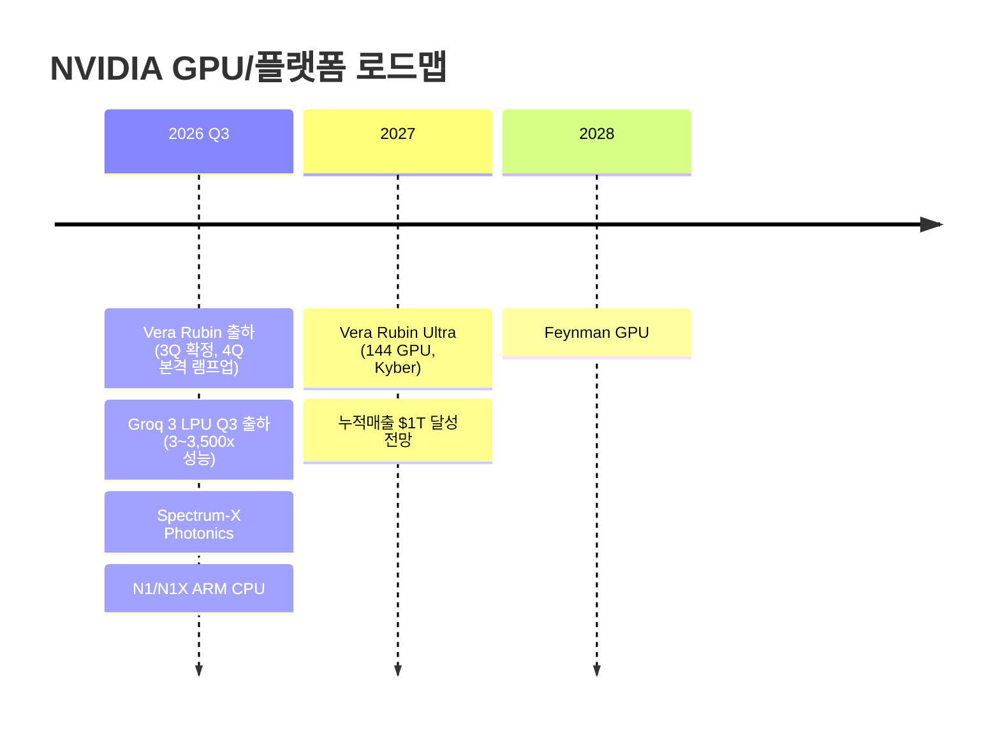

> **관련 글**: [2026년 투자 섹터 전망 (전체)](/knowledge/invest/2026/01/20/investment-sectors-outlook-2026.html)

2026년 글로벌 반도체 시장이 **$1T 마일스톤을 향해 질주**하고 있습니다. BofA는 30% YoY 성장을 전망하며, AI 인프라 투자 폭발(CAPEX $745B+)이 GPU/메모리 수요를 구조적으로 확대하고 있습니다. HBM TAM은 **$54.6B(+58% YoY, BofA)**, 2028년 $100B에 달할 것으로 예상됩니다.

**5월 29일 핵심 (오늘):**
- **★★★ Dell AI 서버 Q1 FY27 블로우아웃**: 매출 **$43.8B(+88% YoY**, vs 예상 $35.43B). AI 서버 매출 **$16.1B(+757% YoY)**. EPS **$4.86**(vs 예상 $2.88, **+69% 서프라이즈**). FY27 AI 서버 가이던스 **$60B(+$10B 상향)**. 시간외 **+30%**. → AI 인프라 수요 폭발 구조적 확인 → HBM/메모리/GPU 수요 직결
- **★★★ HBM LTA 구조적 강세**: DDR4 계약가 **$1.35(2025/3) → $13(2026/3) 1년 만에 10배 급등**. SK하이닉스 HBM **3년 솔드아웃** (Microsoft, Google LTA 체결, 선급 10~30%). 삼성·SK하이닉스·마이크론: DRAM 웨이퍼 **23% HBM 재배치** → DRAM 공급 부족 구조화. UBS 마이크론 목표가 **$1,625**(HBM PER 15배 적용, 기존 5~7배)
- **★★★ KOSPI 반도체 섹터**: KOSPI **8,397.52(+2.05%, 5/29)**. **삼성전자+SK하이닉스 합산 KOSPI 비중 50% 돌파** (사상 최고). 삼성증권 KOSPI 목표 **11,000 상향**(삼성전자 59만원, SK하이닉스 400만원 내포). SK하이닉스 시총 **$1T 클럽** 합류. KOSPI 8,400 장중 돌파 시 77개 상승 vs 826개 하락(극심한 쏠림 → 쏠림 리스크 주의)
- **★★ 반도체 순환매 → 소프트웨어/CPU**: Snowflake **+36%**, Palantir +8%, MS +3.5% (반도체 차익 → SW로). AMD ATH 지속, ARM 강세. CPU:GPU 비율 변화 지속(AMD 데이터센터 $5.8B > Intel $5.1B, 첫 추월)
- **★★ 이선엽(AFW파트너스) 분석**: HBM 메모리 PER 기존 5~7배 → **15배** 상향(UBS·바클레이즈). 삼성전자·SK하이닉스 현재가 대비 **2배+ 상승 여지**. 국민연금 매도 우려 과도(실질 3~4%, 블록딜). 강세장 평균 20개월 중 현재 **6~7개월** 경과 → 최소 1년+ 남음
- **★★ Computex 2026 D-3 (6/1~5)**: Jensen Huang + Lisa Su(AMD) + Lip-Bu Tan(Intel) 총집결. NVDA Vera Rubin 플랫폼 발표. NVDA **$150B** 대만 투자. Marvell CEO **6/2 공동 기조연설**(CPO 테마)
- **★★ TSMC 지정학 리스크 부상**: 트럼프, 미중 협상에서 대만 무기 판매 유보를 협상 카드로 활용. "글로벌 반도체 기업은 미국으로 오라" → 한국 파운드리(삼성), 미국 내 TSMC 공장, 인텔 수혜 가능. Anthropic: 올해 **80배 성장** 중(예상 10배 대비)

**5월 28일 핵심:**
- **★★★ Micron(MU) Forward PER 8배** (SK하이닉스 7배) — Goldman Sachs: "NVDA + MU가 AI 최대 수혜자". Barclays: "AI가 반도체 버스트 사이클을 끝냈다". Q3 어닝콜 **6월 24일**. 분기 매출 **$23.86B(+196% YoY)**, 마진 **75%**, EPS **$12.20**(컨센 $8.65 대비 **+41%**)
- **★★★ 역 스케일링 딜레마**: HBM 1개 생산 = DRAM **4개 포기** → HBM 확대 시 DRAM 공급 부족 심화. 클린룸 한계로 **2027년까지 신규 증설 제한**
- **★★★ Zuckerberg 발언**: Meta CapEx 증가의 주요 원인은 **"메모리 비용 상승"** — HBM 수요 구조 확인
- **★★★ SK하이닉스 시총 $1T 클럽 가입** — 국내 최초. iHBM(Intelligent HBM): 열 저항 30% 감소. Q1 OP 37.61조(마진 72%). LTA → 2029년 다운사이클에도 EPS 하방 경직성 → 이례적 **PER 15배** 적용(UBS). 노무라 400만원, MS 170만원(+31%)
- **★★★ Computex 2026 (6/1-5) 카운트다운**: Jensen Huang + Marvell CEO **6/2 공동 기조연설** — "AI의 미래는 연결성". Vera Rubin: 학습 **3.5배**, 추론 **5배**, 추론 비용 **1/7**. 메모리 원가 **25%**(전작 9%). NVDA 대만 **$150B** 투자 발표
- **★★★ Marvell(MRVL) 사상최고 어닝** — Jensen Huang + Marvell CEO 6/2 공동 기조연설. AI 연결성 테마 핵심 수혜
- **★★ AMD ATH $467.51(+118.3% YTD)**: 2nm Venice CPU 양산. 데이터센터 $5.8B > Intel $5.1B. Evercore 목표 **$579**. Computex Lisa Su 기조연설(6월)
- **★★ Intel YTD +100%+**: "Agentic AI → CPU 수요 폭증". TSMC 14A 파트너십(Tesla·SpaceX). Lip-Bu Tan CEO Computex 확정
- **★★ KOSPI 5/27 8,228(+2.25%)**: SK하이닉스 **+9%**, 삼성전자 +2.56%. 코스피 상승 종목 70개 — 극단적 반도체 쏠림. 5월 반도체 수출 **+200%**(1~20일, YoY)

**5월 27일 핵심:**
- **★★★ Micron(MU) $1조 클럽 가입**: UBS 목표가 **$535 → $1,625**(3배 상향). 주가 **+19.3%**. 분기 매출 **$23.9B**(3배), 마진 **67.6%**, EPS **$12.20**(컨센 $8.65 vs **41% 서프라이즈**). HBM LTA NVDA와 **2029년까지** 체결. "메모리 가격 = 유가 $60→$300 구조 변화"
- **★★★ NVDA Vera Rubin 원가 분해** (모건스탠리) — 메모리 원가 **5배**(전체의 **25%**, 전작 9%). 한 대당 **30억원**이 메모리. Jensen Huang: "최대 병목은 메모리". HBM 2-3년 전부터 로드맵 조율
- **★★★ CPU 기판/PCB 랠리**: LG이노텍 **+17%**, 삼성전기 급등. AI 사이클 차기 병목으로 CPU 기판 집중 매수. 심텍·대덕전자·아모텍·코리아서키트. GPU→전력기기→반도체→CPU 기판 순서
- **★★★ 5월 한국 반도체 수출 +200%** (YoY, 1~20일 속보치). 전체 수출 **+65%**. LTA 기반 → 사이클 하강 리스크 대폭 감소
- **★★★ SK하이닉스 iHBM 발표** — HBM 패키지 내 냉각 요소 내장. 열 저항 **30% 감소**. 고온·고압 AI 데이터센터 환경 안정성 향상. 오늘(5/27) KOSPI 급등 촉매
- **★★ Anthropic 흑자 전환 2026년 2Q 전망** — 당초 2028년에서 대폭 앞당겨짐. AI 에이전트 수요(클로드 코드) 폭발. ACI 수요가 빅테크 넘어 전산업으로 확산
- **★★ 모든 메모리가 부족** (김장열) — HBM + 일반 DRAM + MLCC + PCB + GPU 모두 쇼티지. LTA 요구 추세. HBM 4E 전환 시점 가격 인상 추가 가능. **전력 인프라가 최대 리스크**(금리 인상보다 위험)
- **★★ 삼성전기 목표가 200만원** (김장열) — 실리콘 커패시터(마벨 고객, 1.6조 매출) + MLCC + 기판 임베딩. 28년 영업이익 3.3~3.9조. P/E 50배 적용
- **★★★ SOXX $570.09(+6.10%)** / **KOSPI 8,389(+6.90%) 사상 최고**

**5월 26일 핵심:**
- **★★★ AMD 데이터센터 매출 Intel 추월**: AMD **$5.8B** vs Intel **$5.1B** (Q1 2026) — CPU 시장 역전 역사적 순간
- **★★★ CPU:GPU 비율 급변**: 1:8 → **1:4** 로 이미 변화, 향후 **1:1 수렴** 가능 (Counterpoint Research) — GPU 중심 투자 패러다임 전환
- **★★★ AMD 2nm Venice CPU (EPYC Zen 6) TSMC N2 양산 시작** — AMD TSMC 2nm 파운드리 파트너십 강화, 대만 **$10B AI 투자** 확약
- **★★★ NVIDIA Vera CPU 단독 판매 개시**: 올해 **$20B 매출 목표** — 서버 CPU 시장 $2,000억 구조 변화 가속
- **★★ AMD 일부 CPU 납기 8~10주 연장** → 수요 급증 확인. 컴퓨텍스 전 수급 타이트
- **★★★ 6/2 컴퓨텍스(NVDA·AMD·Intel CEO 총출동)**: 업계 최대 이벤트 임박. 차세대 로드맵·AI 칩 발표 예정
- **★★★ ARM 주간 +46.5% 급등, 신고가 돌파**: NVDA 베라 CPU 설계 기반 수혜. BofA Vivek Arya NVDA 목표가 **$350** (현재 $215 대비 +63%)
- **★★ NVIDIA 중국 AI 칩 시장 화웨이에 "largely conceded"** — 비중국 시장에 집중 전략 전환
- **★★ 루멘텀(CPO 독점)**: 향후 1년 매출 **2배 성장** 전망. 3분기 변곡점: HBM 가격 모멘텀→수량 모멘텀 전환
- **★ KOSPI 사상 최고 8,060.86**: 삼성/SK하이닉스 레버리지 ETF **5/28 출시** 예정

**5월 23일 핵심:**
- **★★★ NVDA 베라 CPU 별도 판매 발표**: 서버 CPU 시장 **$2,000억** 전망(ARM $1,250억, AMD $1,000억 대비 최대). Vera CPU 1개당 LPDDR 최대 **1.5TB** 탑재. $200억 판매 기준(5,000달러 단가) → LPDDR 수요 기존 예측 대비 **30~100% 추가** 증가
- **★★★ NVL 72 메모리 비중 급확대**: GB300→VR200 전환 시 메모리 비중 **9%→25%** 확대, 가격 **5.3배** 증가. AI 클라우드 임대료 **30~75% 인상**(6/1부터) → AI 인프라 수급 타이트 재확인
- **★★★ 삼성 HBM4 NVDA 최종 테스트 통과**: 6월부터 공급 시작. HBM4 로직다이 파운드리 가격 **40~50% 인상**
- **★★★ SK하이닉스 HBM 공급 부족 2028년까지 지속**: ATH **194.9만원**(YTD +197%). MS, Google, Amazon SK하이닉스에 HBM 용량 선투자 계획
- **★★★ LTA(장기 공급 계약) 이중 시장 구조**: 빅테크 3~5년 장기 계약으로 공급자 협상력 강화. 삼성+하이닉스 합산 영업이익 2026년 **600~700조**, 2027년 **800조+** 전망
- **★★ NVDA 주가 미반응 분석**: 배당 +2,400%+$80B 자사주 → "성숙기업 신호" 해석. Custom ASIC +44.6% vs GPU +16.1%. 주가 ~$215, 컨센 **$272**(26% 업사이드)

**5월 22일 핵심 (참고):**
- **★★★ NVDA Q1 FY27 초대형 어닝**: 매출 **$81.6B**(+85% YoY, 컨센서스 $79.2B 상회), 데이터센터 **$75.2B**(+92%) 단일 분기 역대 최고. Q2 가이던스 **$91B**(컨센서스 $86.8B 대폭 상회)
- **★★★ 베라루빈(Vera Rubin) GPU 3Q 출하 확정, 4Q 본격 램프업**: HBM4 수요 증가로 삼성·SK하이닉스 모두 수혜
- **★★★ 삼성전자 노사합의**: DS부문 성과금 자사주 지급, 2028년까지 DS 영업이익 200조 보장. 연간 1.2억주 자사주 매입 → 유통 주식 감소. 삼성전자 5/21 **+8.5%**(29.9만원)
- **★★★ SK하이닉스 +11%**(14만원): HBM 2026 capacity 매진 지속, HBM 공급부족 2027~2030 공식화
- **★★ 삼성전기 +13%(120만원 돌파)**: 마벨향 실리콘 캐패시터 **1.6조 계약** 확인. 목표가 160~170만원

## 반도체 섹터 현황 (2026년 5월 29일 기준)

### 핵심 지표

| 항목 | 수치/현황 | 비고 |
|------|----------|------|
| **SOXX** | **$569.47 (5/29)** | 반도체 섹터 대표 ETF |
| **KOSPI** | **8,397.52 (+2.05%, 5/29)** | 삼성전자+SK하이닉스 합산 비중 **50% 돌파**(사상 최고). 77개 상승 vs 826개 하락(극심한 쏠림) |
| **NVIDIA** | **~$215. BofA Vivek Arya 목표가 $350. Computex 6/1-5** | Vera Rubin: 학습 3.5배·추론 5배·비용 1/7. 메모리 원가 25%(전작 9%). Jensen: "최대 병목은 메모리" |
| **Micron(MU)** | **$1조 클럽. Forward PER 8배. UBS 목표가 $1,625** | Q2 매출 $23.86B(+196% YoY), 마진 75%, EPS $12.20(컨센 +41%). HBM LTA 2026 전량 완판. Q3 어닝콜 6/24 |
| **AMD** | **ATH 지속. 데이터센터 $5.8B Intel 첫 추월** | 2nm Venice(EPYC Zen6) 양산. 대만 $10B. Evercore 목표 $579. Computex Lisa Su 기조연설 |
| **ARM** | **강세 지속** | NVDA Vera CPU 설계 기반. CPU 르네상스 핵심 수혜 |
| **SK하이닉스** | **시총 $1T(국내 최초). iHBM. HBM 3년 솔드아웃** | LTA → PER 15배 적용(UBS). 노무라 400만원. 삼성증권 KOSPI 11,000(400만원 내포) |
| **삼성전자** | **29.9만원대. 목표가 컨센 39만원** | HBM4 6월 공급 시작. 노무라 59만원. 삼성증권 KOSPI 11,000(59만원 내포) |
| **삼성전기** | **120만원대. 목표가 200만원 (김장열)** | 실리콘 커패시터(마벨, 1.6조) + MLCC + 기판. 28년 영업이익 3.3~3.9조, P/E 50배 |
| **Dell(DELL)** | **시간외 +30%. FY27 AI서버 가이던스 $60B** | Q1 FY27 매출 $43.8B(+88%), AI서버 $16.1B(+757%), EPS $4.86(+69%). AI 인프라 수요 폭발 확인 |
| **Snowflake** | **+36% (5/29)** | 반도체 차익 → SW/클라우드 순환매. Palantir +8%, MS +3.5% 동반 |
| **Marvell(MRVL)** | **사상최고 어닝. Jensen + Marvell CEO 6/2 공동 기조연설** | AI 연결성 테마 핵심. CPO·커스텀칩 수혜 |
| **CPU:GPU 비율** | **현재 1:4 (이미 변화), 향후 1:1 수렴 가능** | Counterpoint Research. 기존 1:8에서 급속 전환 |
| **HBM DDR4 계약가** | **$1.35(2025/3) → $13(2026/3) 1년 만에 10배** | LTA 구조로 메모리 사이클 패러다임 전환 |
| **SK하이닉스 HBM LTA** | **3년 솔드아웃**. MS, Google LTA. 선급 **10~30%** | DRAM 웨이퍼 23% HBM 재배치 → DRAM 공급 부족 심화 |
| **AI CAPEX (하이퍼스케일러)** | **~$745B (7,450억 달러, 2026년 예상)** | 구글 클라우드 +63% YoY (역대 최고) |
| **한국 반도체 수출** | **+200% YoY (5월 1~20일 속보치)** | 전체 수출 +65%. LTA 기반으로 사이클 하강 리스크 감소 |
| **역 스케일링 딜레마** | **HBM 1개 = DRAM 4개 포기** | HBM 확대 → DRAM 공급 부족 심화. 클린룸 2027년까지 신규 증설 제한 |
| **HBM 공급 부족** | **2028년까지 지속** | SK하이닉스 공식 발표. HBM 내년 가격 인상 예정 |
| **HBM TAM** | **$54.6B (+58% YoY, 2026) → $100B (2028)** | BofA/TrendForce |
| **DRAM/NAND 전망** | **DRAM +51%, NAND +45% YoY (BofA)** | 2Q DRAM 가격 40% 이상 상승률 |
| **글로벌 반도체 매출** | **$1.3T (2026 전망)** | BofA 최고 성장 전망. 30% YoY |
| **AI 클라우드 임대 가격** | **30~75% 인상 (6/1부터)** | AI 인프라 수급 타이트 재확인 |
| **반도체 수출 (한국)** | **4~5월 합산 31조** | 1Q 15조 대비 2배+. 2Q 영업이익 100조 가능성 |
| **삼성+하이닉스 합산 영업이익** | **2026년 600~700조 / 2027년 800조+** | 한국 연간 예산 초과 수준 |
| **장기 금리** | **미국 30Y 5.118%, 일본 30Y 사상 최고** | 성장주 할인율 리스크 |
| **소비자 심리지수** | **49.8 (사상 최저)** | 거시경제 리스크 주의 |

### 5월 29일 핵심 업데이트

| 항목 | 내용 |
|------|------|
| **★★★ Dell AI 서버 Q1 FY27 블로우아웃** | 매출 **$43.8B(+88% YoY)**, vs 예상 $35.43B. AI 서버 매출 **$16.1B(+757% YoY)**. EPS **$4.86**(vs 예상 $2.88, **+69% 서프라이즈**). FY27 AI 서버 가이던스 **$60B(+$10B 상향)**. 시간외 **+30%**. → AI 인프라 수요 폭발 구조적 확인 → HBM/메모리/GPU 수요 구조적 확인 |
| **★★★ HBM LTA 구조적 강세** | DDR4 계약가 **$1.35(2025/3) → $13(2026/3) 1년 만에 10배 급등**. SK하이닉스 HBM **3년 솔드아웃** (MS, Google LTA 체결, 선급 10~30%). 삼성·SK하이닉스·마이크론: DRAM 웨이퍼 **23% HBM 재배치** → DRAM 공급 부족 구조화. LTA: 5년 장기 계약 + 최소가격 보장 → 메모리 사이클 변동성 구조적 감소 |
| **★★★ KOSPI 반도체 섹터** | KOSPI **8,397.52(+2.05%, 5/29)**. 삼성전자+SK하이닉스 합산 KOSPI 비중 **50% 돌파**(사상 최고). 삼성증권 KOSPI 목표 **11,000 상향**(삼성전자 59만원, SK하이닉스 400만원 내포). SK하이닉스 시총 **$1T 클럽**. KOSPI 8,400 장중 돌파 시 77개 상승 vs 826개 하락(극심한 쏠림 → 쏠림 리스크 주의) |
| **★★ 반도체 순환매 → 소프트웨어/CPU** | Snowflake **+36%**, Palantir +8%, MS +3.5%(반도체 차익 → SW로). AMD ATH 지속, ARM 강세. CPU:GPU 비율 변화 지속(AMD 데이터센터 $5.8B > Intel $5.1B, 역사적 첫 추월) |
| **★★ 이선엽(AFW파트너스) 분석** | HBM 메모리 PER 기존 5~7배 → **15배** 상향(UBS·바클레이즈). 삼성전자·SK하이닉스 현재가 대비 **2배+ 상승 여지**. 국민연금 매도 우려 과도(실질 3~4%, 블록딜 방식). 강세장 평균 20개월 중 현재 **6~7개월** 경과 → 최소 1년+ 남음 |
| **★★ Computex 2026 D-3 (6/1~5)** | Jensen Huang + Lisa Su(AMD) + Lip-Bu Tan(Intel) 총집결. NVDA Vera Rubin 플랫폼 발표 예정. NVDA **$150B** 대만 투자 발표. Marvell CEO **6/2 공동 기조연설**(CPO 테마) |
| **★★ TSMC 지정학 리스크 부상** | 트럼프, 미중 협상에서 대만 무기 판매 유보를 협상 카드로 활용. "글로벌 반도체 기업은 미국으로 오라" → 한국 파운드리(삼성), 미국 내 TSMC 공장, 인텔 수혜 가능. Anthropic: 올해 **80배 성장** 중(예상 10배 대비) |

### 5월 28일 핵심 업데이트

| 항목 | 내용 |
|------|------|
| **★★★ Micron(MU) Forward PER 8배** | SK하이닉스 7배. Goldman Sachs: **"NVDA + MU가 AI 최대 수혜자"**. Barclays: "AI가 반도체 버스트 사이클을 끝냈다". Q3 어닝콜 **6월 24일**. Q2 매출 **$23.86B(+196% YoY)**, 마진 **75%**, EPS **$12.20**(컨센 +41% 서프라이즈) |
| **★★★ 역 스케일링 딜레마** | HBM 1개 생산 = DRAM **4개 포기** → HBM 확대 시 DRAM 공급 부족 심화. 클린룸 한계: **2027년까지 신규 증설 제한** |
| **★★★ Zuckerberg 발언** | Meta CapEx 증가 주요 원인: **"메모리 비용 상승"** — HBM 수요 구조적 확인 |
| **★★★ SK하이닉스 시총 $1T 클럽 가입** | 국내 최초. iHBM(Intelligent HBM): 열 저항 30% 감소. Q1 OP 37.61조(72% 마진). LTA → 2029년 다운사이클에도 EPS 하방 경직성 → **PER 15배** 적용(UBS). 노무라 400만원, MS 170만원(+31%) |
| **★★★ Computex 2026 (6/1-5)** | Jensen Huang + Marvell CEO **6/2 공동 기조연설** — "AI의 미래는 연결성". Vera Rubin: 학습 **3.5배**, 추론 **5배**, 비용 **1/7**. NVDA 대만 **$150B** 투자. 모건스탠리: Vera Rubin 랙 단가 400만→800만달러, 메모리 원가 **25%** |
| **★★★ Marvell(MRVL) 사상최고 어닝** | Jensen Huang + Marvell CEO 6/2 공동 기조연설. "AI 미래는 연결성" — AI 연결성 테마 핵심 수혜 |
| **★★ AMD ATH $467.51(+118.3% YTD)** | 2nm Venice CPU 양산 시작. 데이터센터 $5.8B Intel 추월. Evercore 목표 **$579**. Lisa Su 기조연설(Computex) |
| **★★ Intel YTD +100%+** | "Agentic AI → CPU 수요 폭증". TSMC 14A 파트너십(Tesla·SpaceX). Lip-Bu Tan CEO Computex 참석 확정 |
| **★★ KOSPI 5/27 8,228(+2.25%)** | SK하이닉스 **+9%**, 삼성전자 +2.56%. 상승 종목 70개 — 극단적 반도체 쏠림. 5월 반도체 수출 **+200%** |

### 5월 27일 핵심 업데이트

| 항목 | 내용 |
|------|------|
| **★★★ Micron(MU) $1조 클럽 가입** | UBS 목표가 **$535 → $1,625**(3배 상향). 주가 **+19.3%**. 분기 매출 **$23.9B**(3배), 마진 **67.6%**, EPS **$12.20**(컨센 $8.65 vs **41% 서프라이즈**). HBM LTA NVDA와 **2029년까지** 체결. "메모리 가격 = 유가 $60→$300 구조 변화" |
| **★★★ NVDA Vera Rubin 원가 분해 (모건스탠리)** | 메모리 원가 **5배** 증가(전체 원가의 **25%**, 전작 9%). 한 대당 **30억원**이 메모리. Jensen Huang: "최대 병목은 메모리". HBM 2-3년 전부터 로드맵 조율 |
| **★★★ CPU 기판/PCB 랠리** | LG이노텍 **+17%**, 삼성전기 급등. AI 사이클 **차기 병목**으로 CPU 기판 집중 매수. 심텍·대덕전자·아모텍·코리아서키트. GPU→전력기기→반도체→**CPU 기판** 순서 |
| **★★★ 5월 한국 반도체 수출 +200%** | YoY (1~20일 속보치). 전체 수출 **+65%**. LTA 기반 → 사이클 하강 리스크 대폭 감소 |
| **★★★ SK하이닉스 iHBM 발표** | HBM 패키지 내 냉각 요소 내장. 열 저항 **30% 감소**. 고온·고압 AI 데이터센터 환경 안정성 향상. 오늘(5/27) KOSPI 급등 촉매 |
| **★★ Anthropic 흑자 전환 2026년 2Q 전망** | 당초 2028년에서 대폭 앞당겨짐. AI 에이전트 수요(클로드 코드) 폭발. ACI(AI Cloud/Industry) 수요가 빅테크 넘어 전산업으로 확산 |
| **★★ 모든 메모리가 부족 (김장열)** | HBM + 일반 DRAM + MLCC + PCB + GPU 모두 쇼티지. LTA 요구 추세. HBM 4E 전환 시점 가격 인상 추가 가능. **전력 인프라가 최대 리스크**(금리 인상보다 위험) |
| **★★ 삼성전기 목표가 200만원 (김장열)** | 실리콘 커패시터(마벨 고객, 1.6조 매출) + MLCC + 기판 임베딩. 28년 영업이익 **3.3~3.9조**. P/E **50배** 적용 |
| **★★★ SOXX $570.09(+6.10%) / KOSPI 8,389(+6.90%) 사상 최고** | SK하이닉스 iHBM 발표 + Micron $1조 클럽 가입이 동반 촉매 |

### 5월 26일 핵심 업데이트

| 항목 | 내용 |
|------|------|
| **★★★ AMD 데이터센터 매출 Intel 추월** | AMD **$5.8B** vs Intel **$5.1B** (Q1 2026) — 역사적 역전. CPU 시장 패권 이동 확인 |
| **★★★ CPU:GPU 비율 급변 (Counterpoint Research)** | 기존 **1:8** → 현재 **1:4** → 향후 **1:1 수렴** 전망. GPU 중심 투자 패러다임 구조적 전환 진행 중 |
| **★★★ AMD 2nm Venice(EPYC Zen6) TSMC N2 양산 시작** | AMD 대만 **$10B AI 투자** 확약. TSMC 2nm 파운드리 파트너십 강화. 납기 **8~10주 연장** → 수요 급증 확인 |
| **★★★ NVIDIA Vera CPU 단독 판매 개시** | 올해 **$20B 매출 목표**. 서버 CPU 시장 $2,000억 구조 변화 가속 |
| **★★★ 6/2 컴퓨텍스 (NVDA·AMD·Intel CEO 총출동)** | 업계 최대 이벤트. 차세대 CPU/GPU 로드맵 발표 예정. 단기 모멘텀 최대 이벤트 |
| **★★★ ARM 주간 +46.5% 신고가** | NVDA Vera CPU 설계 기반. BofA Vivek Arya NVDA 목표가 **$350** (현재 $215 대비 +63%) |
| **★★ NVIDIA 중국 AI 칩 시장 화웨이에 "largely conceded"** | 비중국 시장 집중 전략 전환. 화웨이 중국 AI 칩 시장 장악 |
| **★★ 루멘텀(Lumentum) — CPO 독점** | 향후 1년 매출 **2배 성장** 전망. 3Q 변곡점: HBM 가격 모멘텀 → 수량 모멘텀 전환. 8~9월 NVDA/Oracle/Broadcom 실적이 확인 시점 |
| **★★ AI 데이터센터 병목 다변화 (손정우 테크밸리인사이트)** | GPU 중심 → CPU·메모리·네트워킹·스토리지 병목 확산. NVDA 5가지 렉 구조: GPU 렉, LPX 렉, CPU 렉, SPX 네트워킹 렉 등 |
| **★ KOSPI 사상 최고 8,060.86** | 삼성전자/SK하이닉스 레버리지 ETF **5/28 출시** 예정. 반도체 섹터 수급 확대 기대 |

### 5월 23일 핵심 업데이트

| 항목 | 내용 |
|------|------|
| **★★★ NVDA 베라 CPU 별도 판매** | 서버 CPU 시장 **$2,000억** 전망(ARM $1,250억, AMD $1,000억 대비 최대). Vera CPU 1개당 LPDDR 최대 **1.5TB** 탑재. $200억 판매(5,000달러 단가) 기준 → LPDDR 수요 기존 예측 대비 **30~100% 추가** 증가 |
| **★★★ NVL 72 메모리 비중 급확대** | GB300→VR200 전환 시 메모리 비중 **9%→25%** 확대, 가격 **5.3배** 증가. AI 클라우드 임대료 **30~75% 인상**(6/1부터) → AI 인프라 수급 타이트 재확인 |
| **★★★ 삼성 HBM4 NVDA 최종 테스트 통과** | 6월부터 공급 시작. 삼성 HBM4 로직다이 파운드리 가격 **40~50% 인상** |
| **★★★ SK하이닉스 HBM 공급 부족 2028년까지** | ATH **194.9만원**(YTD +197%). MS, Google, Amazon SK하이닉스에 HBM 용량 **선투자 계획** |
| **★★★ LTA 이중 시장 구조 형성** | 빅테크 3~5년 장기 계약으로 공급자 협상력 강화. 삼성+하이닉스 합산 영업이익 2026년 **600~700조**, 2027년 **800조+** 전망(한국 연간 예산 초과) |
| **★★ HBM 내년 가격 인상 예정** | 현재 HBM 마진이 일반 DRAM보다 낮아 인상 여력 충분 |
| **★★ NVDA 주가 미반응 분석** | 배당 +2,400%($0.01→$0.25)+$80B 자사주 → "성숙기업 신호" 해석. Custom ASIC +44.6% vs GPU +16.1% → 빅테크 자체 칩 경쟁 심화. 주가 ~$215, 분석가 컨센 **$272**(26% 업사이드) → 단기 조정은 매수 기회 |
| **★★ 거시경제 리스크** | 미국 30Y 금리 **5.118%**, 일본 30Y 사상 최고 → 성장주 할인율 증가. 소비자 심리지수 **49.8(사상 최저)** |

### 5월 22일 핵심 업데이트

| 항목 | 내용 |
|------|------|
| **★★★ NVDA Q1 FY27 초대형 어닝** | 매출 **$81.6B**(+85% YoY, 컨센서스 $79.2B 상회). 데이터센터 **$75.2B**(+92% YoY) 단일 분기 역대 최고. EPS **$1.87**(예상 $1.78 상회). Q2 가이던스 **$91B**(컨센서스 $86.8B 대폭 상회). 배당 $0.01→**$0.25(+2,400%)**, 자사주매입 **$80B** 신규 인가 |
| **★★★ 베라루빈(Vera Rubin) 3Q 출하 확정** | 4Q 본격 램프업 확정. HBM4 수요: 삼성전자·SK하이닉스 HBM4 수요 증가 기대. DRAM 가격 2Q 상승률 당초 40% 예상보다 크게 상향 조정 |
| **★★★ 삼성전자 노사합의** | DS부문 성과금 자사주 지급. **2028년까지 DS 영업이익 200조 보장** 조항. 연간 **1.2억주 자사주 매입** → 유통 주식 감소 → 주가 구조적 지지. 5/21 **+8.5%**(29.9만원). 반도체 수출 4~5월 합산 **31조**(1Q 15조 대비 2배+). 노무라 목표가 **59만원**, JPMorgan **48만원** |
| **★★★ SK하이닉스 +11%** | 14만원. HBM 2026 capacity 매진 지속. HBM 공급부족 2027~2030 공식화. MS 목표가 **170만원**, SK증권 **300만원** |
| **★★ 삼성전기 +13%** | 120만원 돌파. 마벨향 실리콘 캐패시터 **1.6조 계약** 확인. 애널리스트 목표가 **160~170만원** |
| **★★ TaaS — 토큰 기반 과금 전환** | SaaS→토큰 기반 결제 구조 전환. 구글 분당 API 토큰 처리량: 160억→**190억**(1개월 만, 분기 성장률 60~70%). 토큰 처리량 = 빅테크 매출 선행지표로 부상 |
| **★★ ARM +16%** | NVDA 실적 후 AI 하드웨어 종목 일제 랠리 |
| **★ 양자컴퓨팅 $2B CHIPS Act** | IBM $1B(Anderson 퀀텀 파운드리, 뉴욕), Rigetti $100M, D-Wave $100M, Infleqtion. 투자 신흥 테마로 부상 |

### 5월 20일 핵심 업데이트

| 항목 | 내용 |
|------|------|
| **★★★ 마이크론 Q2 실적 대호황** | 매출 **$28.86B**(+196% YoY), OP **$16.135B**(+810% YoY). **목표주가 $700→$1,100 상향**(Melvius). NAND 가격 **+186%(Citi)**, 엔터프라이즈 SSD **+265%**. 메모리 슈퍼사이클 구조적 수요 확인 |
| **★★★ 엔비디아 베라 CPU 초기 공급 시작** | SpaceX, OpenAI, Anthropic, Oracle Cloud에 초기 베라 실리콘 **직접 전달**. H2 2026부터 글로벌 파트너를 통해 본격 공급. 에이전틱 AI 수요 구체화 |
| **★★★ 구글 I/O 2026 에이전틱 AI** | 제미나이 3.5 플래시(빠른 응답), 제미나이 옴니(멀티모달), 제미나이 스파크(에이전트). **AI Ultra $100/월** 플랜 출시. TPU 외부 판매 수익화 본격화 신호 |
| **★★ 반도체 섹터 강세 지속** | 마이크론 실적 발표 후 -6% → +15% 급등. 메모리 공급 부족과 가격 인상 구도 명확화 |
| **★★ CPU 르네상스 구체화** | 에이전틱 AI 패러다임 전환으로 추론 AI 수요 급증. GPU:CPU 비율 8:1→2:1로 급속도 변화 |

### 5월 5일 핵심 업데이트

| 항목 | 내용 |
|------|------|
| **★★★ 빅테크 Q1 AI 구조적 수요 확인** | AWS **+28% 성장**(15분기 최고), 구글 클라우드 **+63% 성장**(역대 최고). 구글 EPS **5.11**(예상치 2.6의 2배), 광고도 **+15%**. 빅테크 일제 "컴퓨팅 용량 부족" 언급 |
| **★★★ CapEx 7,450억 달러 확정** | 하이퍼스케일러 2026년 예상 **$745B**. AI 투자 피크아웃 신호 없음 |
| **★★★ 자체 반도체 외부 판매 개시** | 구글(TPU)/아마존(Trainium) 자체 반도체 **외부 판매 시작** → NVDA 독점 구도 변화. Bedrock 전분기 대비 **170% 급증** |
| **★★★ HBM 공급 부족 2027~2030 공식화** | Samsung: "2027년이 2026년보다 더 악화". SK Group: "2030년까지 쇼티지 지속". **HBM3E 가격 20% 인상**(2026년). SK하이닉스 HBM 2026 전량 매진 |
| **★★★ HBM4 점유율 전망** | SK하이닉스 **70% 점유 예상**(UBS). 삼성 "customers said Samsung is back" — 기술력 회복 공식 확인 |
| **★★ KOSPI 6,937 신고가** | 5/4 기준. SK하이닉스 **+12.5%**, 삼성전자 **+5.4%**. 외국인 **3조원 순매수** |
| **★★ SK하이닉스 저평가 지속** | SK하이닉스 PER **< 이마트 PER** — 수급 논리 대비 극단적 저평가 |
| **★★ 오픈AI-MS 독점 해지** | OpenAI MS 독점 계약 해지 → **AWS도 GPT 서비스 가능** → 클라우드 AI 경쟁 전방위 확산. AI 생태계 다변화 = 복수 클라우드 투자 가속 |

### 5월 4일 핵심 업데이트

| 항목 | 내용 |
|------|------|
| **★★★ AI 4대 병목 공식화** | 빅테크 Q1 실적에서 **메모리·전력·CPU·광통신** 4대 병목 동시 공식화. MS "전력이 가장 큰 제약 요인, 컴퓨팅보다 전력". MS CapEx 절반이 CPU+GPU. 광통신: GPU N배 → 연결 N² 배 |
| **★★★ 메모리 병목 3사 공식 인정** | MS: CapEx 증가분 35%가 **메모리 가격 상승**. 메타: CFO **직접 언급**. 아마존: AK 공시에 **메모리 공급 변동성을 리스크**로 명시 |
| **★★★ SanDisk 실적 폭발** | EPS **$23.4** vs 예상 $14.4(**+63% 서프라이즈**). 영업이익률 **78.4%**. 주가 **+8%+**. 4월 수익률: SanDisk **+70%**, AMD **+70%**, Micron **+47%**, TI **+43%** |
| **★★★ 구글 클라우드 +63% YoY** | 업계 **1위** 성장률. 수주 잔고 **243→460억 달러(+2배)**. Anthropic TPU 사용 급증. TPU 수익화 **H2 2026** 시작 |
| **★★ 아마존 AWS Q1** | Bedrock **1분기 처리 토큰 > 이전 전체 합산**. 트레이니엄 4세대 **완판**. 렉 판매 사업 진출 |
| **★★ 광통신 N² 수요** | GPU 클러스터 N배 증가 → 연결은 **N² 배** 증가. **Lumentum/Coherent** 직접 수혜. CPO 수요 가속 |
| **★★ AI 수요 가속 지표** | OpenRouter 토큰 **1년 전 대비 ~10배**. 가용 GPU **감소 추세** 지속. NVDA Blackwell B300 중국 가격 **700만 위안(~$1M)** — 공급 부족 심화 |

### 5월 2일 핵심 업데이트

| 항목 | 내용 |
|------|------|
| **★★★ 2027년 쇼티지 공식화** | 삼성전자 공식 발언: "2027년 수급이 2026년보다 더 악화". 데이터센터 투자 → 가동까지 **2년 이상** 소요 → 2027H2~2028 전력·메모리 수요 집중. SK Group 회장 "2030년까지 쇼티지 지속"과 일치 |
| **★★★ CPU 르네상스 — 추론 전환** | AI 패러다임 학습→추론 전환 → CPU 수요 급증. GPU:CPU 비율 **8:1 → 4:1 → 2:1~1:8** 전망. INTC 주간 **+20%** — CPU 르네상스 수혜 |
| **★★★ 메모리 슈퍼사이클 확인** | SK하이닉스 HBM **2026 전체 capacity 매진**. BofA: DRAM **+51%**, NAND **+45%** YoY 전망. Micron 4월 **+53%**(구조적 수요 확인). SK하이닉스 HBM4 시장점유율 **70% (UBS)** |
| **★★★ 빅테크 CapEx 건재** | 메타 **$1,200B→$1,300B** 상향, 구글 클라우드 **+40%**, 아마존/MS 투자 유지. OpenAI 우려 과도 — Anthropic·Google로 수요 이동. OpenAI NVDA 비중 ~20%로 축소이나 **대세 영향 없음** |
| **★★ 삼성전자 파운드리 반전 기대** | 2nm "조만간 의미있는 고객 수주" **공식 코멘트**. 수율 개선 중. TSMC 캐파 부족으로 인텔·삼성으로 수요 분산 조짐 |
| **★★ NVDA/Google/MS 펜타곤 AI 계약** | AI 군사 응용 확대 → NVDA **구조적 수요 기반 강화** |

### 4월 29일 핵심 업데이트 (참고)

| 항목 | 내용 |
|------|------|
| **★★★ SK하이닉스 Q1 역대 최대** | 매출 **52.58조원**(+198% YoY, 처음으로 50조 돌파). OP **37.61조원**(+405% YoY), **72% 마진**. HBM 점유율 **57%**. HBM4 수요 향후 **3년치 초과 예약**. 목표가: 미래에셋 **200만원**, 모건스탠리 **170만원** |
| **★★★ 삼성전자 Q1 사상최대** | OP **57.2조원**(+755% YoY), 컨센서스 대비 **+31% 서프라이즈**. 파운드리 **2Q~3Q 흑자 전환** 예상. HBM4 양산 **2월 착수**. DRAM 마진 **73%** |
| **★★★ 빅테크 AI CapEx** | 2026년 **~$645B**(MSFT+AMZN+META+GOOGL), **+67% YoY** |
| **★★★ 에이전틱 AI → CPU 수요** | GPU:CPU 비율 8:1→4:1→2:1~1:8. Intel Q1: EPS 29c vs 1c(**+2800%**). 데이터센터 **+22%** |
| **★★ 두산 CCL + 파미셀** | 두산: 엔비디아 블랙웰 CCL **단독 공급**, 2027년까지 독점. 영업이익률 **25-30%**. 파미셀: CCL 소재 납품, 9월 3공장 증설(2배) |
| **★★ 씨게이트 어닝 서프라이즈** | EPS **$4.1** vs 예상 **$3.5**, 시간외 **+15%**. 다음 분기 EPS **$5** |
| **★★★ SanDisk 어닝 폭발 (5/4)** | EPS **$23.4** vs 예상 **$14.4**(**+63% 서프라이즈**). 영업이익률 **78.4%**. 주가 **+8%+**. AI 스토리지 수요 구조적 폭발 확인 |

---

## NVDA Q1 FY27 초대형 어닝 — 주가 미반응 분석 (5/23 업데이트)

NVIDIA가 Q1 FY27(2026년 1분기) 실적을 발표하며 모든 지표에서 컨센서스를 대폭 상회했습니다.

| 항목 | 내용 |
|------|------|
| **매출** | **$81.6B** (+85% YoY), 컨센서스 $79.2B 상회 |
| **데이터센터** | **$75.2B** (+92% YoY) — 단일 분기 역대 최고 |
| **EPS** | **$1.87** (예상 $1.78 상회) |
| **Q2 가이던스** | **$91B** (컨센서스 $86.8B 대폭 상회) |
| **배당** | $0.01→**$0.25**(+2,400%) |
| **자사주매입** | **$80B** 신규 인가 |
| **베라루빈(Vera Rubin) GPU** | **3Q 출하, 4Q 본격 램프업** 확정 |
| **HBM4 수요 영향** | 삼성전자·SK하이닉스 HBM4 수요 증가 기대. DRAM 가격 2Q 상승률 당초 40% 예상보다 크게 상향 |
| **AI 클라우드 임대 가격** | **30~75% 인상** (6/1부터) — AI 인프라 수급 타이트 재확인 |
| **주가** | 어닝 후 ~**$215** 소폭 하락. 분석가 컨센 **$272** (26% 업사이드) |

### 주가 미반응 원인 분석

| 요인 | 내용 |
|------|------|
| **성숙기업 신호 해석** | 배당 +2,400%+$80B 자사주 → 시장이 "고성장기업 → 성숙기업 전환 신호"로 해석 |
| **Custom ASIC 경쟁 심화** | TrendForce: Custom ASIC 성장률 **+44.6%** vs GPU **+16.1%** → 빅테크 자체 칩 경쟁 가속. 장기 시장점유율 우려 |
| **투자 시사점** | 단기 조정은 매수 기회. 분석가 컨센 $272(26% 업사이드) 유효 |

**투자 시사점**: NVDA Q2 가이던스 $91B은 AI 인프라 수요가 여전히 가속 중임을 증명합니다. 베라루빈 3Q 출하 확정은 HBM4 수요를 구조적으로 당기고, 이는 삼성전자·SK하이닉스 실적에 직접 반영됩니다. 어닝 후 주가 조정은 Custom ASIC 우려와 성숙기업 해석이 원인이나, 분석가 컨센서스 $272 대비 26% 업사이드가 유효해 단기 조정은 매수 기회입니다.

---

## 삼성전자 노사합의 — 구조적 주가 지지 (5/22 업데이트)

삼성전자가 DS부문 노사합의를 통해 주가 구조적 지지 기반을 마련했습니다.

| 항목 | 내용 |
|------|------|
| **성과금 구조** | DS부문 성과금 **자사주 지급** |
| **영업이익 보장** | **2028년까지** DS 영업이익 **200조 보장** 조항 |
| **자사주매입** | 연간 **1.2억주** 자사주 매입 필요 → 유통 주식 감소 → **주가 구조적 지지** |
| **주가 반응** | 5/21 **+8.5%** (29.9만원) |
| **반도체 수출** | 4~5월 합산 **31조** (1Q 15조 대비 **2배+**) → 2Q 영업이익 100조 가능성 |
| **목표주가 (노무라)** | **59만원** (PBR 기반) |
| **목표주가 (JPMorgan)** | **48만원** |
| **목표주가 (SK증권)** | **50만원** |

**투자 시사점**: 자사주 매입으로 인한 유통 주식 감소는 EPS를 구조적으로 높이며 주가를 지지합니다. 반도체 수출 4~5월 합산 31조(1Q 15조 대비 2배+)는 2Q 실적 급등을 선행 시사합니다. 노무라 목표가 59만원은 현재 가격 대비 약 100% 이상 업사이드로, 하이닉스 대비 언더퍼폼이 빠르게 해소될 수 있습니다.

---

## SK하이닉스 +11% — HBM 구조적 수혜 지속 (5/22 업데이트)

| 항목 | 내용 |
|------|------|
| **주가 반응** | 5/21 **+11%** (14만원) |
| **HBM 2026** | capacity **매진** 상태 지속 |
| **HBM 공급부족** | **2027~2030** 공식화 |
| **목표주가 (MS)** | **170만원** |
| **목표주가 (SK증권)** | **300만원** |

**투자 시사점**: NVDA 베라루빈 3Q 출하 확정이 HBM4 수요를 당기며 SK하이닉스 실적 개선 모멘텀이 유지됩니다. 2027~2030 공급부족이 공식화된 상황에서 SK하이닉스 PER이 이마트보다 낮다는 사실은 여전히 극단적 저평가를 시사합니다.

---

## Dell AI 서버 Q1 FY27 블로우아웃 — AI 인프라 수요 폭발 확인 (5/29 업데이트)

Dell이 Q1 FY27(2026년 1분기) 실적을 발표하며 AI 서버 매출이 +757% YoY를 기록하는 사상 최대 블로우아웃 실적을 냈습니다. 이는 AI 인프라 수요가 구조적으로 폭발 중임을 수요자 측에서 직접 확인한 것으로, HBM/메모리/GPU 수요 강세의 구조적 근거가 됩니다.

| 항목 | 내용 |
|------|------|
| **매출** | **$43.8B (+88% YoY)** — 예상 $35.43B 대폭 상회 |
| **AI 서버 매출** | **$16.1B (+757% YoY)** — 분기 역대 최고 |
| **EPS** | **$4.86** (예상 $2.88, **+69% 서프라이즈**) |
| **FY27 AI 서버 가이던스** | **$60B** (+$10B 상향) |
| **주가 반응** | 시간외 **+30%** |
| **반도체 시사점** | AI 인프라 수요 폭발 → **HBM/메모리/GPU 수요 구조적 확인**. 서버 OEM이 이 정도 수요를 확인한다는 것은 GPU/메모리 공급망 전체에 직결 |

**투자 시사점**: Dell AI 서버 +757%는 단순 기업 실적이 아니라 AI 인프라 수요의 구조적 폭발을 수요자 측에서 입증한 것입니다. FY27 AI 서버 가이던스 $60B은 올해 하반기부터 AI 서버 수요가 더욱 가속화됨을 시사하며, 이는 SK하이닉스·Micron의 HBM 수요와 NVDA·AMD GPU 수요로 직결됩니다. Snowflake +36%, Palantir +8% 등 SW 섹터로의 순환매가 동시에 진행되고 있어 반도체 차익실현 후 SW 로테이션이 단기적으로 진행 중이지만, 구조적 수요는 훼손되지 않습니다.

---

## HBM LTA 구조적 강세 — DDR4 1년 만에 10배, 3년 솔드아웃 (5/29 업데이트)

HBM 장기공급계약(LTA) 구조가 메모리 시장 패러다임을 완전히 바꾸고 있습니다. DDR4 계약가가 1년 만에 10배 급등하고, SK하이닉스 HBM이 3년치 솔드아웃 상태에서 빅테크가 선급금까지 지불하는 구조가 형성되었습니다.

| 항목 | 내용 |
|------|------|
| **DDR4 계약가 10배** | **$1.35(2025/3) → $13(2026/3)** — 1년 만에 **10배 급등** |
| **SK하이닉스 HBM 솔드아웃** | **3년치** 완판. Microsoft, Google LTA 체결. 선급금 **10~30%** 지급 |
| **DRAM 웨이퍼 재배치** | 삼성·SK하이닉스·마이크론: DRAM 웨이퍼 **23% HBM 재배치** → DRAM 공급 부족 구조화 |
| **LTA 구조** | **5년 장기 계약** + **최소가격 보장** → 메모리 사이클 변동성 구조적 감소 |
| **UBS 마이크론 목표가** | **$1,625** (HBM PER **15배** 적용, 기존 5~7배) |
| **PER 재평가** | LTA 구조로 다운사이클 EPS 하방 경직성 확보 → 기존 5~7배 → **15배** 상향(UBS·바클레이즈) |
| **이선엽 분석** | 삼성전자·SK하이닉스 현재가 대비 **2배+ 상승 여지**. 강세장 평균 20개월 중 6~7개월 경과 → 최소 1년+ 남음 |

**투자 시사점**: LTA 구조는 단순히 "물량이 많다"가 아니라 가격 구조 자체를 바꿉니다. DDR4 계약가 10배 급등과 SK하이닉스 3년 솔드아웃은 공급자가 가격 결정권을 확보했음을 의미합니다. 빅테크가 선급금 10~30%를 지불한다는 것은 메모리 공급이 수요를 따라가지 못하는 구조임을 수요자 스스로 인정한 것입니다. UBS의 PER 15배 적용(기존 5~7배)은 이 구조적 변화를 밸류에이션에 반영한 것으로, 마이크론과 SK하이닉스 모두 상당한 추가 리레이팅 여지가 있습니다.

---

## Micron(MU) $1조 클럽 가입 — Forward PER 8배, 메모리 구조 변화 (5/28 업데이트)

Micron이 사상 최대 어닝을 발표하며 $1조 클럽에 가입했습니다. Goldman Sachs는 NVDA+MU를 AI 최대 수혜자로 지목하고, Barclays는 "AI가 반도체 버스트 사이클을 끝냈다"고 선언했습니다.

| 항목 | 내용 |
|------|------|
| **주가 반응** | **+19.3%** — $1조 클럽 가입 |
| **UBS 목표가 상향** | **$535 → $1,625** (3배 상향) — 최고 목표가 |
| **Forward PER** | **8배** (SK하이닉스 7배) — 극단적 저평가 |
| **분기 매출** | **$23.86B(+196% YoY)** |
| **영업 마진** | **75%** |
| **EPS** | **$12.20** (컨센서스 $8.65 대비 **41% 서프라이즈**) |
| **HBM LTA 계약** | 2026년 생산 **전량 LTA(장기고정가계약)** 완판 |
| **Q3 어닝콜** | **6월 24일** |
| **Goldman Sachs** | **"NVDA + MU가 AI 최대 수혜자"** |
| **Barclays** | "AI가 메모리 버스트 사이클을 끝냈다" |
| **메모리 가격 구조 변화** | "메모리 가격 = 유가 **$60→$300** 구조 변화" — 단순 사이클이 아닌 **구조적 가격 재편** |
| **메모리 원가 비중** | NVDA Vera Rubin 기준 메모리 원가 전체의 **25%** (전작 9%, 5배 증가) |

**투자 시사점**: Forward PER 8배(SK하이닉스 7배)는 극단적 저평가를 시사합니다. 2026년 HBM 생산 전량 LTA 완판으로 가시성이 확보되었으며, Goldman의 "AI 최대 수혜자" 지목과 Barclays의 버스트 사이클 종료 선언은 구조적 재평가 근거입니다. Q3 어닝콜(6/24) 전 모멘텀 유지가 기대됩니다.

---

## SK하이닉스 시총 $1T 클럽 + iHBM — 국내 최초 (5/28 업데이트)

SK하이닉스가 시총 $1조 클럽에 국내 최초로 가입하고, iHBM(Intelligent HBM) 기술을 발표했습니다. LTA 구조로 다운사이클 리스크까지 헤지된 상태에서 UBS는 이례적 PER 15배를 적용합니다.

| 항목 | 내용 |
|------|------|
| **시총 $1T 클럽** | 국내 최초. LTA 기반 실적 하방 경직성 → **PER 15배** 적용(UBS) |
| **iHBM (Intelligent HBM)** | HBM 패키지 내 **냉각 요소 내장** + 지능형 제어 |
| **열 저항 감소** | **30% 감소** |
| **적용 환경** | 고온·고압 AI 데이터센터 환경 안정성 향상 |
| **Q1 2026 실적** | OP **37.61조**(마진 72%). HBM 점유율 **57%** |
| **LTA 효과** | 2029년 다운사이클에도 EPS 하방 경직성 확보 |
| **KOSPI 촉매** | 5/27 SK하이닉스 **+9%** — 코스피 반도체 극단 쏠림 |
| **목표주가 (컨센)** | **240만원** |
| **목표주가 (노무라)** | **400만원** |
| **목표주가 (MS)** | **170만원** (+31%) |

**투자 시사점**: 시총 $1T 달성은 한국 반도체 섹터의 글로벌 재평가를 상징합니다. LTA 구조로 메모리 사이클 리스크가 구조적으로 완화되면서 UBS의 PER 15배 적용은 정당화됩니다. iHBM은 Vera Rubin 등 차세대 고온·고압 AI 칩에서 구조적 채택이 기대됩니다.

---

## CPU 기판/PCB 랠리 — AI 사이클 차기 병목 (5/27 업데이트)

GPU→전력기기→반도체에 이어 CPU 기판/PCB가 AI 사이클의 차기 병목 섹터로 부각되었습니다.

| 항목 | 내용 |
|------|------|
| **LG이노텍** | **+17%** — CPU 기판 AI 사이클 수혜 집중 매수 |
| **삼성전기** | 급등 — CPU 기판 + 실리콘 커패시터 이중 수혜 |
| **소부장 동반 랠리** | 심텍, 대덕전자, 아모텍, 코리아서키트 등 |
| **AI 사이클 순서** | GPU → 전력기기 → 반도체 → **CPU 기판(현재)** |
| **수혜 근거** | NVDA Vera CPU 단독 판매 $20B → CPU 기판 수요 폭발. CPU:GPU 비율 1:4→1:1 전환 |

**투자 시사점**: CPU 기판/PCB는 AI 사이클에서 상대적으로 뒤늦게 주목받는 섹터입니다. GPU 수요가 CPU 수요를 견인하고, CPU 수요가 CPU 기판 수요를 견인하는 구조입니다. NVDA Vera CPU 단독 판매 $20B 목표와 CPU:GPU 비율의 1:1 수렴은 CPU 기판 수요의 구조적 증가를 의미합니다.

---

## 삼성전기 — 실리콘 캐패시터 1.6조 계약 (5/22 업데이트)

| 항목 | 내용 |
|------|------|
| **마벨향 계약** | 실리콘 캐패시터 **1.6조 계약** 확인 |
| **주가 반응** | **+13%** (120만원 돌파) |
| **목표주가 (애널리스트)** | **160~170만원** 제시 |
| **목표주가 (김장열)** | **200만원** — 28년 영업이익 3.3~3.9조, P/E 50배 적용 |
| **성장 동력** | 실리콘 커패시터(마벨 고객, 1.6조) + MLCC + 기판 임베딩 삼각 성장 |

**투자 시사점**: 실리콘 캐패시터는 고성능 반도체 패키징에 핵심 부품으로, 마벨향 1.6조 계약은 삼성전기의 AI 반도체 소재 부품 공급망 내 위치를 확인합니다. 김장열의 200만원 목표가(P/E 50배, 28년 영업이익 3.3~3.9조 기반)는 160~170만원 컨센서스 대비 추가 업사이드를 제시합니다.

---

## TaaS(Token as a Service) — AI 과금 구조 전환 (5/22 업데이트)

SaaS에서 토큰 기반 결제 구조로의 전환이 가속되고 있습니다.

| 항목 | 내용 |
|------|------|
| **과금 패러다임** | SaaS → **토큰 기반 결제(TaaS)** 구조 전환 |
| **구글 토큰 처리량** | 분당 160억 → **190억** (1개월 만, 분기 성장률 **60~70%**) |
| **선행지표 역할** | 토큰 처리량 = **빅테크 매출 선행지표**로 부상 |
| **반도체 시사점** | 토큰 처리량 증가 = GPU·HBM·DRAM 수요 구조적 증가 |

**투자 시사점**: 토큰 처리량 분기 성장률 60~70%는 AI 인프라 수요 폭발의 실시간 지표입니다. TaaS 전환이 가속될수록 빅테크의 AI 하드웨어 CapEx 집행은 더욱 구조적으로 증가합니다.

---

## 빅테크 Q1 AI 구조적 수요 확인 (5/5 업데이트)

빅테크 Q1 실적이 AI 클라우드 수요의 구조적 성장을 강력하게 확인했습니다.

| 항목 | 내용 |
|------|------|
| **구글 클라우드 성장률** | **+63% YoY** — 역대 최고, 업계 1위 |
| **구글 EPS** | **$5.11** (예상치 2.6의 **2배 초과**) |
| **구글 광고 성장** | **+15%** YoY |
| **AWS 성장률** | **+28% YoY** — 15분기 최고 |
| **Bedrock 급증** | 전분기 대비 **170% 급증** |
| **빅테크 공통 언급** | "컴퓨팅 용량 부족" 일제 언급 — 투자 **더 늘릴 계획** |
| **AI 투자 피크아웃?** | 신호 없음. **과거 닷컴버블 패턴 미해당** |

**투자 시사점**: 구글 EPS가 예상치의 2배를 기록하고 AWS가 15분기 최고 성장률을 달성한 것은 AI 클라우드 수요가 이론이 아닌 실적으로 검증되고 있음을 보여줍니다. "컴퓨팅 용량 부족" 발언은 GPU·메모리·전력 인프라 투자가 더 가속화될 것임을 시사합니다.

---

## 자체 반도체 외부 판매 — 생태계 변화 (5/5 업데이트)

구글(TPU)과 아마존(Trainium)이 자체 AI 반도체를 외부에 판매하기 시작했습니다.

| 항목 | 내용 |
|------|------|
| **구글 TPU 외부 판매** | TPU 외부 고객 대상 판매 시작. 수익화 **H2 2026** 본격화 |
| **아마존 Trainium 외부 판매** | 트레이니엄 렉 판매 사업 진출 |
| **오픈AI-MS 독점 해지** | OpenAI MS 독점 계약 해지 → **AWS도 GPT 서비스 가능** |
| **AI 생태계 변화** | 빅테크 자체 칩 → 외부 판매 = NVDA 의존도 분산. 그러나 전체 AI 수요는 더 확대 |
| **브로드컴 수혜** | 구글 TPU/메타 AI칩 제조 파트너로 **구조적 수혜** |

**투자 시사점**: 자체 반도체 외부 판매는 AI 칩 생태계를 다변화시키지만, 전체 AI 인프라 수요는 더 확대됩니다. NVDA 독점 구도가 점진적으로 분산되는 한편, HBM/메모리 수요는 플랫폼을 가리지 않고 계속 증가합니다.

---

## HBM 공급 부족 2028년까지 지속 — 삼성 HBM4 최종 테스트 통과 (5/23 업데이트)

HBM 공급 부족이 2028년까지 지속되는 가운데, 삼성 HBM4가 NVDA 최종 테스트를 통과해 6월부터 공급이 시작됩니다.

| 항목 | 내용 |
|------|------|
| **삼성 HBM4 NVDA 최종 테스트 통과** | **6월부터 공급 시작**. HBM4 로직다이 파운드리 가격 **40~50% 인상** |
| **SK하이닉스 HBM 공급 부족** | **2028년까지** 지속 공식 발표. ATH **194.9만원**(YTD +197%) |
| **빅테크 선투자** | MS, Google, Amazon SK하이닉스에 HBM 용량 **선투자 계획** |
| **HBM 내년 가격 인상** | 현재 HBM 마진이 일반 DRAM보다 낮아 **인상 여력 충분** |
| **삼성전자 공식 발언** | "**2027년 수급 상황이 2026년보다 더 악화**될 것" |
| **SK Group 회장** | "**2030년까지** 메모리 쇼티지 지속" |
| **HBM3E 가격 인상** | **20% 인상** (2026년) |
| **SK하이닉스 2026 HBM** | **전량 매진** (NVIDIA 공급 우선) |
| **HBM4 점유율** | SK하이닉스 **70% 예상**(UBS). 삼성 "customers said Samsung is back" |
| **공급 제약 원인** | 데이터센터 투자 → **가동까지 2년 이상** 소요 → 2027H2~2028 수요 집중 |

**투자 시사점**: 삼성 HBM4 NVDA 최종 테스트 통과로 삼성이 HBM4 공급망에 본격 편입되며, HBM4 로직다이 파운드리 가격 40~50% 인상은 ASP 상승으로 직결됩니다. SK하이닉스는 ATH 194.9만원(YTD +197%)을 기록하며 빅테크 선투자까지 확보, 공급자 우위 구도가 더욱 강화되고 있습니다. HBM 내년 가격 인상 여력은 마진 추가 개선을 시사합니다.

---

## SanDisk 실적 폭발 — 스토리지 AI 수요 검증 (5/4 업데이트)

| 항목 | 내용 |
|------|------|
| **EPS** | **$23.4** (예상 $14.4, **+63% 서프라이즈**) |
| **영업이익률** | **78.4%** — 반도체 역사상 최고 수준 |
| **주가 반응** | **+8%+** 상승 |
| **4월 누적 수익률** | **SanDisk +70%**, AMD +70%, Micron +47%, TI +43% |
| **투자 시사점** | AI 데이터센터 스토리지 수요 폭발 → HBM 이외 스토리지(NAND) 수혜. 씨게이트(이전 분기 +15%)와 함께 스토리지 섹터 전체 슈퍼사이클 확인 |

**투자 시사점**: SanDisk 78.4% 영업이익률은 AI 스토리지 수요가 얼마나 폭발적인지를 보여줍니다. BofA NAND +45% YoY 전망이 실적으로 검증되고 있으며, 씨게이트(HDD)·SanDisk(NAND) 동반 강세는 스토리지 섹터 전반의 구조적 수혜를 시사합니다.

---

## 2027년 쇼티지 공식화 — 수급 악화 심화 확정 (5/2 업데이트)

삼성전자가 공식적으로 **"2027년 수급 상황이 2026년보다 더 악화될 것"**이라고 발언했습니다(김장열 인터뷰, 삼프로TV 5/1). 이는 반도체 슈퍼사이클이 2027~2028년까지 연장됨을 의미합니다.

| 항목 | 내용 |
|------|------|
| **삼성전자 공식 발언** | "**2027년 수급 상황이 2026년보다 더 악화**될 것" |
| **원인** | 데이터센터 투자 → **가동까지 2년 이상** 소요. 2024~2025년 투자가 2027H2~2028년에 집중 가동 |
| **전력·메모리 수요** | 2027H2~2028 **전력·메모리 수요 집중** 도래 |
| **SK Group 회장 (4/29)** | "**2030년까지** 메모리 쇼티지 지속" — 동일 방향성 |
| **OpenAI 우려** | 과도 — Anthropic·Google로 수요 이동. OpenAI NVDA 비중 ~20%로 축소이나 **대세 영향 없음** |
| **빅테크 CapEx** | 메타 $1,200B→**$1,300B 상향**, 구글 클라우드 **+40%**, 아마존/MS **유지** |

**투자 시사점**: 삼성전자의 공식 발언은 2027~2028년 반도체 수요가 현재보다 더 강할 것임을 확인합니다. 데이터센터 건설-가동 사이클(2년+)을 고려하면 현재 진행 중인 빅테크 CapEx가 2027H2~2028년에 폭발적으로 전력·메모리 수요를 창출합니다. SK하이닉스 HBM 2026 전체 capacity 매진 → 2027 쇼티지 심화는 구조적 가격 결정력을 유지시킵니다.

---

## GPU→CPU 무게중심 이동 — CPU 르네상스 가속 (5/26 업데이트)

AMD 데이터센터 매출이 Intel을 추월하고, CPU:GPU 비율이 급속히 변화하며 CPU 르네상스가 가속되고 있습니다. NVIDIA Vera CPU 단독 판매와 함께 AI 패러다임이 **학습(Training) → 추론(Inference) → 서비스**로 전환되면서 GPU 중심에서 CPU+GPU 이원화 아키텍처로 무게중심이 이동하고 있습니다.

### CPU 르네상스 가속 (5/26 업데이트)

| 항목 | 내용 |
|------|------|
| **AMD 데이터센터 매출** | **$5.8B** — Intel **$5.1B** 추월 (Q1 2026). 역사적 역전 확인 |
| **CPU:GPU 비율 변화** | Counterpoint Research: **1:8 → 1:4** (이미 변화), 향후 **1:1 수렴** 가능 |
| **AMD 2nm Venice (EPYC Zen6)** | TSMC **N2 양산 시작**. AMD 대만 **$10B AI 투자** 확약 |
| **NVIDIA Vera CPU 단독 판매** | 올해 **$20B 매출 목표**. 단독 판매(탈GPU 번들) 개시 |
| **AMD CPU 납기 연장** | 일부 CPU 납기 **8~10주** → 수요 급증 확인. 컴퓨텍스 전 수급 타이트 |
| **6/2 컴퓨텍스** | NVDA·AMD·Intel CEO 총출동. 차세대 CPU/GPU 로드맵 발표 예정. **업계 최대 이벤트** |
| **AMD 대만 $10B 투자** | TSMC 2nm 파운드리 파트너십 강화. 생산 기반 확대 |

### AI 데이터센터 구조 변화 (5/26 손정우 테크밸리인사이트)

| 항목 | 내용 |
|------|------|
| **병목 다변화** | GPU 중심 → **CPU·메모리·네트워킹·스토리지** 병목 확산 |
| **AI 시대 3단계** | 학습(Training) → 추론(2024.11~) → **서비스(2025H2~)** 전환 중 |
| **NVDA 5가지 렉** | GPU 렉, LPX 렉, **CPU 렉**, SPX 네트워킹 렉 등 — CPU 렉 신설이 핵심 |
| **루멘텀(CPO 독점)** | 향후 1년 매출 **2배 성장** 전망 |
| **3Q 변곡점** | HBM **가격 모멘텀 → 수량 모멘텀** 전환. 8~9월 NVDA/Oracle/Broadcom 실적 발표가 확인 시점 |

### NVDA 베라 CPU 별도 판매 (5/23 업데이트)

| 항목 | 내용 |
|------|------|
| **서버 CPU 시장 전망** | 엔비디아 **$2,000억** (ARM $1,250억, AMD $1,000억 대비 최대) |
| **Vera CPU LPDDR** | CPU 1개당 LPDDR 최대 **1.5TB** 탑재 |
| **LPDDR 수요 증가** | $200억 판매(5,000달러 단가) 기준 → LPDDR 수요 기존 예측 대비 **30~100% 추가** 증가 |
| **NVL 72 메모리 비중** | GB300→VR200 전환 시 메모리 비중 **9%→25%** 확대, 가격 **5.3배** 증가 |

### CPU 르네상스 — AI 추론 전환 (5/2 업데이트)

| 항목 | 내용 |
|------|------|
| **AI 패러다임 전환** | 학습 → **추론** 단계 전환 → CPU 병렬 연산 보조 역할 급증 |
| **GPU:CPU 비율 변화** | **1:8 → 1:4** (이미 변화, 5/26 Counterpoint 확인) → 향후 **1:1 수렴** 전망 |
| **TSMC 3nm 부족** | 에이전틱 AI 수요 → 3nm 공정 부족 → 서버 CPU 가격 **10-20% 인상** |
| **Intel Q1 검증 (4/23)** | EPS **29c** vs 예상 1c(**+2800%**). 데이터센터 **+22% → $5.1B** |
| **AMD vs Intel 경쟁** | AMD Q1 $5.8B로 Intel $5.1B 추월. DA Davidson AMD $375 타겟. "CPU 수요 전례 없는 국면" |
| **Intel 목표주가** | 에버코어 **$111**, HSBC **$100**, 노스랜드 **$92** |
| **Tesla-Intel 14A** | 테슬라 = 인텔 14A **파운드리 파트너십 공식화** |
| **DRAM 수혜** | CPU 수요 급증 → **DRAM+LPDDR 수요 연계 확대** |

**투자 시사점**: AMD가 Q1 2026 데이터센터 매출에서 Intel을 추월($5.8B vs $5.1B)하며 CPU 시장 패권 이동이 현실화되었습니다. CPU:GPU 비율이 1:8에서 1:4로 급변(Counterpoint Research)하고, AMD 2nm Venice EPYC Zen6 양산 시작, NVIDIA Vera CPU 단독 판매 $20B 목표로 CPU 시장 전체가 구조적 성장기에 진입했습니다. 6/2 컴퓨텍스(NVDA·AMD·Intel CEO 총출동)는 단기 모멘텀의 최대 이벤트입니다. 에이전트는 챗봇과 달리 **24시간 자율 실행**하며 CPU를 상시 소비합니다.

---

## LTA(장기고정가계약) 구조 — 메모리 사이클 종료, 구조적 성장 (5/28 업데이트)

LTA(Long-Term Agreement)는 메모리 가격 변동성을 구조적으로 완화하고, 2029년 다운사이클에도 EPS 하방 경직성을 확보합니다. Barclays: "AI가 메모리 버스트 사이클을 끝냈다".

| 항목 | 내용 |
|------|------|
| **LTA 의미** | 빅테크가 **3~5년** 선매입 → 공급자 협상력 구조적 강화 |
| **사이클 종료** | Barclays: "AI가 메모리 **버스트 사이클(bust cycle)**을 끝냈다" |
| **PER 재평가** | LTA → 2029년 다운사이클에도 EPS 하방 경직성 → **SK하이닉스 PER 15배** 적용(UBS) — 이례적 |
| **Micron LTA** | 2026년 HBM 생산 전량 완판. NVDA와 다년 계약 |
| **SK하이닉스 LTA** | 2026 전체 capacity 매진. 2027~2030 공급 부족 구조 확정 |
| **메모리 원가 비중** | NVDA Vera Rubin: 메모리 **25%** → 공급자 협상력 더욱 강화 |

**투자 시사점**: LTA 구조는 기존 메모리 사이클(상승-하락 반복)의 패러다임을 전환합니다. 수요자(빅테크)가 선제적으로 3~5년 물량을 확보하는 구조에서 공급자는 사이클 변동 없이 안정적 매출을 확보합니다. 이는 메모리 기업에 대한 PER 프리미엄 적용의 근거가 됩니다.

---

## 메모리 슈퍼사이클 구조 강화 — LTA 이중 시장 구조 (5/23 업데이트)

HBM 공급 부족이 심화되고 LTA(장기 공급 계약)를 통한 이중 시장 구조가 형성되며 메모리 슈퍼사이클이 더욱 강화되고 있습니다.

| 항목 | 내용 |
|------|------|
| **LTA 이중 시장 구조** | 빅테크 **3~5년 장기 계약** → 공급자 협상력 강화. 장기계약(LTA) vs 현물시장 이중 구조 형성 |
| **삼성+하이닉스 합산 영업이익** | 2026년 **600~700조**, 2027년 **800조+** 전망 (한국 연간 예산 초과) |
| **SK하이닉스 HBM** | **2026년 전체 capacity 매진**. 공급 부족 **2028년까지** 지속 |
| **HBM 내년 가격 인상** | 현재 HBM 마진이 일반 DRAM보다 낮아 **인상 여력 충분** |
| **SK하이닉스 HBM4 점유율** | **70%** (UBS) 전망 |
| **HBM3E 가격** | **20% 인상** (2026년) |
| **BofA DRAM 전망** | **+51% YoY** |
| **BofA NAND 전망** | **+45% YoY** |
| **Micron** | 4월 **+53%** — 수요 구조적 증가 시그널. 목표주가 $1,000 등장. P/E ~6배 |
| **HBM 가격 시나리오** | 상승률 40%→8% 가정 시 하이닉스 연간 **~220조**, 40%→15% 가정 시 **~290조** |
| **DRAM Q2 가격** | **+30% QoQ** 확정. TrendForce: 일반 DRAM Q2 **+58-63% QoQ** |
| **HBM TAM** | **$54.6B (+58% YoY, 2026) → $100B (2028)** |

**투자 시사점**: LTA(장기 공급 계약) 확산으로 빅테크가 3~5년 선매입을 하면서 공급자 협상력이 구조적으로 강화되고 있습니다. 삼성+하이닉스 합산 영업이익 2026년 600~700조, 2027년 800조+ 전망은 한국 연간 예산을 초과하는 규모입니다. HBM 내년 가격 인상 여력은 현재 HBM 마진이 일반 DRAM보다 낮다는 사실에서 기인하며, 추가 마진 개선이 기대됩니다.

---

## 삼성전자 파운드리 — 반전 기대, 노사합의 해소 (5/22 업데이트)

삼성전자 파운드리가 2nm 수주를 통해 반전을 모색하고 있습니다.

| 항목 | 내용 |
|------|------|
| **2nm 수주** | "조만간 의미있는 고객 수주" **공식 코멘트** |
| **수율 개선** | 진행 중 |
| **TSMC 캐파 부족** | 인텔·삼성으로 수요 분산 조짐 — **외부 환경 우호적** |
| **노사합의 (5/21)** | DS 영업이익 200조 보장, 자사주 1.2억주 매입 → **노조 리스크 해소** |
| **Q1 파운드리** | **2Q~3Q 흑자 전환** 예상 (4/29 기준) |
| **HBM4 점유율** | **30%+** — NVIDIA HBM4 30%+ 공급 확보. "customers said Samsung is back" |

**투자 시사점**: 삼성전자 노사합의로 하이닉스 대비 언더퍼폼의 핵심 원인이었던 노조 변수가 해소되었습니다. HBM4 30%+ 점유율과 파운드리 2nm 수주 기대를 보유한 상황에서 노무라 목표가 59만원까지 빠른 캐치업이 기대됩니다.

---

## 인텔 Q1 2026 블로우아웃 — 주간 +20%, 테슬라 14A 파운드리 (4/23)

인텔이 Q1 2026 실적을 발표하며 **EPS 29c(예상 1c)**를 대폭 상회하는 블로우아웃 실적을 기록했습니다.

| 항목 | 내용 |
|------|------|
| **EPS** | **29c** (예상 1c, **2,800% 상회**) |
| **매출** | **$13.58B** (예상 $12.42B, **+9.3% 상회**) |
| **데이터센터** | **+22% → $5.1B** — 에이전틱 AI가 GPU→CPU 컴퓨팅 전환 가속 |
| **테슬라 14A 파운드리** | 테슬라 = **인텔 14A 공정 파트너십 공식화** |
| **YTD 성과** | **+100%** — 1987년 이후 가장 강한 월간 상승 추세 |
| **DA Davidson** | **"CPU 수요가 전례 없는 국면(unprecedented phase) 진입"** |
| **목표주가** | 에버코어 **$111**, HSBC **$100**, 노스랜드 **$92** |
| **미 정부 수익** | 인텔 투자(보조금+지분)로 **~$30B 수익** 실현 |

---

## SK하이닉스 Q1 2026 역대 최대 실적 — OP 37.61조원, 72% 마진 (4/29 업데이트)

| 항목 | 내용 |
|------|------|
| **매출** | **52.58조원** (+60% QoQ, **+198% YoY**, **처음으로 50조 돌파**) |
| **영업이익** | **37.61조원** (+96% QoQ, **+405% YoY**) |
| **영업이익률** | **72%** — 글로벌 최고 수준 |
| **순이익** | **40.35조원**(+398% YoY), 순이익률 **77%** |
| **HBM 점유율** | **57%** — 압도적 1위 (HBM4 70%, UBS) |
| **HBM4E** | 샘플 **H2 2026**, 양산 **2027** |
| **HBM4 수요** | 향후 **3년치 초과 예약** |
| **2026 HBM capacity** | **전량 매진** (NVIDIA 공급 우선) |
| **신규 공장** | **19조원** 규모 한국 내 제조공장 신설 |
| **SK Group 회장** | "**2030년까지** 메모리 쇼티지 지속" |
| **SK하이닉스 PER** | **< 이마트 PER** — 극단적 저평가 |
| **목표주가** | 미래에셋 **200만원**, 모건스탠리 **170만원**, SK증권 **300만원** |
| **주의사항** | 하반기 이익 성장률 **둔화 가능성** (2027년 +20% 초반 전망) |

---

## 삼성전자 Q1 2026 사상최대 — OP 57.2조원, +755% YoY (4/29 업데이트)

| 항목 | 내용 |
|------|------|
| **영업이익** | **57.2조원** (+755% YoY, 컨센서스 대비 **+31% 서프라이즈**) |
| **매출** | **133조원** |
| **반도체 부문 OP** | **53.7조원** (컨센서스 43.7조 대비 **+31% 서프라이즈**) |
| **DRAM 마진** | **73%** |
| **파운드리** | **2Q~3Q 흑자 전환** 예상 |
| **HBM4** | 양산 **2월 착수** — 하이닉스보다 선행 |
| **HBM4 점유율** | NVIDIA HBM4 **30%+** 공급 확보. "customers said Samsung is back" |
| **2nm 파운드리** | "조만간 의미있는 고객 수주" 공식 코멘트 (5/2) |
| **글로벌 이익 순위** | **4위**: Apple 76T > NVDA 66T > MS 57.5T > Samsung 57.2T |
| **PER** | **6.5배** 저평가 |
| **목표주가** | 노무라 **59만원**, JPMorgan **48만원**, SK증권 **50만원** |

---

## 빅테크 AI CapEx & Q1 실적 — 수요 폭발 확인 (5/5 업데이트)

### AI CapEx 현황

| 기업 | AI CAPEX (2026) | 비고 |
|------|----------------|------|
| **Amazon** | **$200B+** | AWS +28% 성장(15분기 최고). Bedrock +170% QoQ |
| **Google** | **$175-185B** | 클라우드 +63% YoY (업계 1위). EPS 5.11(예상치 2배) |
| **Microsoft** | **$120B+** | 투자 유지. Azure 가이던스 39→40% |
| **Meta** | **$135B** | $1,200B→**$1,300B 상향** |
| **합산** | **~$745B (7,450억 달러)** | 전년 **~$4,000억 대비 대폭 증가** |
| **2027 전망** | **추가 증가** | 투자 피크아웃 신호 없음 |

### 빅테크 Q1 2026 실적 요약 (5/5 기준)

| 기업 | Q1 핵심 | 반도체 시사점 |
|------|---------|------------|
| **구글 클라우드** | **+63% YoY** (역대 최고·업계 1위). EPS **5.11**(예상치 2.6의 2배). 광고 **+15%**. 수주잔고 243→**460억 달러(+2배)**. 분당 토큰 처리량 160억→**190억**(1개월 만) | TPU 수익화 H2 2026 → 브로드컴 수혜. TPU 외부 판매 시작 |
| **아마존 AWS** | **+28% YoY**(15분기 최고). Bedrock **+170% QoQ**. 트레이니엄 4세대 **완판**. Trainium 외부 판매 시작 | HBM/스토리지 수요 폭발. 자체칩 외부 판매 → 생태계 확장 |
| **메타** | CapEx 전망치 **상향**. Broadcom **2nm AI칩** 파트너십. **Assured Robot Intelligence(humanoid AI)** 인수 | 메모리 가격 급등 CFO 직접 언급 |
| **MS** | Azure 성장률 **39→40% 가이던스**. CapEx 절반 **CPU+GPU**. OpenAI MS 독점 **해지** | 전력이 컴퓨팅보다 큰 제약. CapEx 35% 메모리 가격 |
| **애플** | 전 부문 **어닝 그린라이트**. 시총 **$4T 돌파**. 아이폰 17 수요 폭발 | A 시리즈 칩 TSMC N3 수요 |

### AI 4대 병목 공식화 (5/4 빅테크 Q1 실적)

| 병목 | 내용 | 수혜 종목 |
|------|------|---------|
| **메모리** | MS CapEx 증가분 35%가 메모리 가격 상승. 메타 CFO 직접 언급. 아마존 AK 공시 리스크 명시 | SK하이닉스, Micron, SanDisk |
| **전력** | MS "전력이 가장 큰 제약 요인, 컴퓨팅보다 전력이 문제" | Eaton, 발전 인프라 |
| **CPU** | 아마존 핵심 자산 어필. MS CapEx 절반이 CPU+GPU | Intel, AMD EPYC |
| **광통신** | GPU N배 증가 → 연결은 **N² 배**. 병목 구조적 | Lumentum, Coherent, Credo, Marvell |

**OpenAI 우려 대비 실상**: OpenAI MS 독점 계약 해지 → AWS도 GPT 서비스 가능. AI 생태계 다변화 = 복수 클라우드 업체의 AI 인프라 투자 경쟁 가속.

---

## 종목 선호도 및 투자 전략 (5/29 기준)

### 추천 종목 (5/29 기준)

**한국 (대형주 위주 유지)**

| 종목 | 현황 | 투자 포인트 |
|------|------|-----------|
| **삼성전자** | 29.9만원대. 노사합의. PER 6.5배 저평가 | 노사합의로 노조 리스크 해소. 자사주 1.2억주 매입 → 주가 구조적 지지. DS 200조 영업이익 보장. 노무라 59만원. JPM KOSPI 8,500 목표 |
| **SK하이닉스** | 시총 $1T(국내 최초). iHBM. ATH 194.9만원 | iHBM 냉각 내장(열저항 30%↓). LTA → PER 15배(UBS). 2027~2030 쇼티지 구조적 수혜. 노무라 400만원, MS 170만원(+31%) |
| **삼성전기** | 120만원대 | 실리콘 커패시터(마벨, 1.6조) + MLCC + CPU기판. 목표가 200만원(김장열, 28년 영업이익 3.3~3.9조, P/E 50배) |

**미국**

| 종목 | 현황 | 투자 포인트 |
|------|------|-----------|
| **NVDA** | ~$215. BofA 목표가 $350. Computex 6/1-5 | Vera Rubin: 학습 3.5배·추론 5배·비용 1/7. 메모리 원가 25%. $150B 대만 투자. Q2 가이던스 $91B |
| **AMD** | **ATH $467.51(+118.3% YTD)**. 데이터센터 $5.8B Intel 추월 | 2nm Venice 양산. Evercore 목표 $579. Lisa Su Computex 기조연설 |
| **ARM** | 주간 +46.5% 신고가 | CPU 르네상스 최대 수혜. NVDA Vera CPU + AMD EPYC 라이선스. 구조적 성장 |
| **Marvell(MRVL)** | **사상최고 어닝** | Jensen + Marvell CEO 6/2 공동 기조연설. "AI 미래는 연결성". CPO·커스텀칩 수혜 |
| **AVGO(브로드컴)** | — | 구글 TPU·메타 AI칩 파트너. 자체 반도체 외부 판매 확대 수혜 |
| **INTC** | **YTD +100%+**. CPU 르네상스 | "Agentic AI → CPU 수요 폭증". TSMC 14A 파트너십. Lip-Bu Tan Computex 확정 |
| **GOOGL** | 클라우드 +63%(역대 최고). 토큰 처리량 190억 | AI 클라우드 1위. TaaS 전환 핵심 수혜. TPU 외부 판매 수익화 H2 2026 |
| **Lumentum** | CPO 독점. 향후 1년 매출 2배 성장 전망 | 광통신 N² 수요 + 3Q 변곡점(수량 모멘텀) |
| **AMZN** | AWS +28%(15분기 최고) | Bedrock +170% QoQ. Trainium 외부 판매. 클라우드 AI 생태계 확장 |

**ETF**

| ETF | 현황 | 비고 |
|-----|------|------|
| **SOXX** | **$569.47 (5/29)** | 반도체 섹터 대표 ETF |
| **KWEB** | **$26.66 (5/29)** | 중국 빅테크/AI 섹터 ETF |
| **SCHD** | — | 배당 안정성 확보 |

**소부장/기판 (CPU기판 AI 사이클 차기 병목)**

| 종목 | 현황 | 비고 |
|------|------|------|
| **LG이노텍** | **+17% (5/27)** | CPU 기판 AI 사이클 차기 병목 수혜. GPU→전력기기→반도체→CPU 기판 순서 |
| **삼성전기** | 120만원대 | CPU 기판 + 실리콘 커패시터 이중 수혜. 목표가 200만원 |
| **심텍** | +20% | CPU 기판/반도체 소재 수혜 |
| **대덕전자** | 랠리 중 | CPU 기판 수혜 |
| **아모텍** | 랠리 중 | CPU 기판 수혜 |
| **코리아서키트** | 랠리 중 | CPU 기판 수혜 |
| **한미반도체** | +15% | 장비 소부장 수혜 |

**미국 메모리**

| 종목 | 현황 | 비고 |
|------|------|------|
| **Micron(MU)** | **$1조 클럽. Forward PER 8배. UBS 목표가 $1,625** | Q2 매출 $23.86B, 마진 75%, EPS $12.20(+41%). HBM 전량 LTA 완판. Q3 어닝콜 6/24 |

### HBM 가격 시나리오

| 시나리오 | 조건 | 하이닉스 연간 이익 |
|---------|------|---------|
| **보수적** | HBM 가격 상승률 40%→8% | **~220조원** |
| **기본** | HBM 가격 상승률 40%→15% | **~290조원** |

---

## 두산 CCL 엔비디아 블랙웰 단독 공급 + 파미셀 (4/29)

### 두산 전자BG

| 항목 | 내용 |
|------|------|
| **공급 대상** | 엔비디아 **블랙웰 GPU** CCL 단독 공급 |
| **경쟁사 탈락** | **EMC 탈락** — 두산 독점 확정 |
| **독점 기간** | **2027년까지** |
| **2026 영업이익률** | **25-30%** |
| **매출 성장** | 2026년 매출 **2024년 대비 2배** |

### 파미셀 — 두산향 CCL 소재 납품

| 항목 | 내용 |
|------|------|
| **납품 소재** | 두산향 CCL 소재(**레진/경화제**) |
| **영업이익률** | **30%+** |
| **3공장 증설** | **9월** 착공, 생산 능력 **2배** 확대 |

---

## OpenAI-MS 파트너십 재편 — AI 생태계 다변화 (5/5 업데이트)

5/5 OpenAI MS 독점 파트너십이 해제되었습니다. 이는 AI 생태계 다변화를 가속시킵니다.

| 항목 | 내용 |
|------|------|
| **OpenAI-MS 독점 해지** | OpenAI MS 독점 계약 해지 → **AWS도 GPT 서비스 가능** |
| **실상** | OpenAI WAU **4억→9억(2배 성장)**. Anthropic ARR **$30B > OpenAI $25B** 역전 |
| **반도체 시사점** | AI 클라우드 다변화 = AWS·Google·MS 모두 AI 인프라 투자 경쟁 가속 |
| **판단** | AI 생태계 다변화 = **전체 AI 수요 확대**로 반도체 구조적 수혜 |

---

## SaaS 위기 = AI 인프라 투자 가속의 역설 (4/23)

소프트웨어 섹터가 AI 도구 확산으로 대폭 하락했으나, 이는 AI 인프라/반도체 투자 가속을 시사합니다.

| 항목 | 내용 |
|------|------|
| **SaaS 충격** | ServiceNow **-18%**, IBM **-8%**, Salesforce **-9%**, Workday **-9%**(YTD **-45%**) |
| **원인** | AI 도구가 기업용 SaaS를 **대체/파괴** |
| **역설** | SaaS CAPEX → **AI 인프라 CAPEX**로 전환 가속 |
| **반도체 시사점** | **사모신용/SaaS 리스크 = 반도체에 오히려 수혜** — SaaS 위기일수록 AI 인프라 투자 가속 |

---

## SOCAMM2 메모리 전쟁 (4/29 업데이트)

| 업체 | 현황 | 비고 |
|------|------|------|
| **SK하이닉스** | **192GB 양산** 선두 | 시장 선점. 엔비디아 베라루빈 공급망 |
| **마이크론** | **256GB 샘플** 준비 중 | 용량 경쟁 돌파구 |
| **삼성전자** | **와피지(Wafer Process Issue) 해결** 발표 | 양산 정상화 기대 |

---

## Computex 2026 — Vera Rubin 핵심 발표 (6/1-5, 5/28 업데이트)

Computex 2026(6/1-5)에서 NVIDIA Jensen Huang과 Marvell CEO가 6/2 공동 기조연설을 진행합니다. "AI의 미래는 연결성"을 주제로 차세대 로드맵이 공개됩니다.

| 항목 | 내용 |
|------|------|
| **일정** | **6/1-5 (타이베이)**. Jensen Huang + Marvell CEO **6/2 공동 기조연설** |
| **핵심 메시지** | **"AI의 미래는 연결성에 달려 있다"** |
| **Vera Rubin 플랫폼** | Vera CPU + Rubin GPU **6칩 시스템** |
| **학습 성능** | Blackwell 대비 **3.5배** |
| **추론 성능** | Blackwell 대비 **5배** |
| **추론 비용** | Blackwell 대비 **1/7** |
| **NVDA 대만 투자** | **$150B** — Vera Rubin 생산용 TSMC CoWoS 확보 |
| **메모리 원가** | Vera Rubin 랙 단가 400만→**800만 달러**, 메모리 원가 **25%**(전작 9%) |
| **Jensen 발언** | "현 시점 최대 병목은 메모리" — SK하이닉스·마이크론과 2-3년 전부터 로드맵 조율 |
| **AMD** | Lisa Su 기조연설 예정 |
| **Intel** | Lip-Bu Tan CEO 참석 확정 |

**투자 시사점**: Vera Rubin 랙 메모리 원가 25%(전작 9%)는 SK하이닉스·Micron의 ASP를 구조적으로 끌어올립니다. NVDA의 $150B 대만 투자는 CoWoS 패키징 용량 확보를 의미하며, 메모리-NVDA 공급망 2-3년 로드맵 조율은 LTA 수요 가시성의 근거입니다. 6/2 Jensen+Marvell 공동 기조연설은 광통신/연결성 섹터의 단기 최대 모멘텀입니다.

---

## GTC 2026 주요 발표 (3/20 업데이트)

### SK하이닉스 CHBM — 세계 최초 커스터마이징 HBM

| 항목 | 내용 |
|------|------|
| **CHBM** | 세계 최초 **커스터마이징 가능 HBM** — 대역폭/용량/전력을 고객별로 구성 |
| **Stream DQ** | 베이스 다이에서 **역양자화** 수행(GPU 대신) → 추론 성능 **최대 7x** 향상 |
| **HBM4 성능** | HBM3 대비 **2x+ 대역폭**, **1.5-2x 용량**, **50% 전력효율** 개선 |

### Groq 3 LPU

| 항목 | 내용 |
|------|------|
| **성능** | Blackwell 대비 **3x~3,500x** 성능, 비용성능 **35-50x** 개선 |
| **출하** | **Q3 2026** |
| **아키텍처** | SRAM 기반 LPU + **분산 추론** (Prefill/Decode 역할 분리) |

### NVIDIA 로드맵

---

## TeraFab — Tesla/SpaceX/xAI $25B JV + 인텔 합류

| 항목 | 내용 |
|------|------|
| **JV 규모** | **$25B** (Tesla + SpaceX + xAI 합작) |
| **인텔 합류 (4/9)** | 인텔 파운드리 14A 공정 참여 확정. Tesla **14A 파운드리 파트너십 공식화** (5/2) |
| **공정** | **2nm** 목표. 월 **100만 장** 웨이퍼(초기 10만 장) |
| **칩 배분** | 80% 우주용 **D3 칩**(SpaceX 위성), 20% 지상용 **AI5 칩**(Tesla/Optimus) |
| **반도체 50배 비전** | 머스크: 연간 1억 대 휴머노이드 → 반도체 **50배** 필요 |

---

## HBM4 양산 및 점유율 현황

### HBM4 점유율

| 업체 | HBM4 점유율 | 현황 |
|------|-----------|------|
| **SK하이닉스** | **~70%** (UBS), HBM 전체 **57%** | 2026 capacity **전량 매진**. CHBM 세계 최초. Rubin 물량 70% |
| **삼성전자** | **30%+** | NVIDIA HBM4 30%+ 공급. AMD MoU 체결. "customers said Samsung is back". 노사합의 후 생산 안정화 기대 |
| **Micron** | **~20%** | Q2 실적 대호황: 매출 $28.86B(+196%), OP $16.135B(+810%). 목표주가 $700→$1,100. P/E ~6배 → 저평가 지속 |

### HBM 시장 규모

| 연도 | TAM |
|------|-----|
| **2026** | **$54.6B (+58% YoY)** |
| **2028** | **$100B** |

---

## AI CAPEX: ~$745B + AI 인프라 폭발

| 항목 | 내용 |
|------|------|
| **★★★ NVDA Q1 FY27 어닝 (5/22)** | 매출 **$81.6B**(+85%), 데이터센터 **$75.2B**(+92%) 역대 최고. Q2 가이던스 **$91B**. 베라루빈 3Q 출하 확정 |
| **★★★ 빅테크 Q1 수요 확인 (5/5)** | AWS **+28%**(15분기 최고), 구글 **+63%**(역대 최고). "컴퓨팅 용량 부족" 일제 언급 |
| **★★★ CapEx 7,450억 달러 (5/22)** | 하이퍼스케일러 2026년 예상 **$745B**. 구글 클라우드 +63% YoY (역대 최고). 투자 피크아웃 신호 없음 |
| **★★★ TaaS 전환 (5/22)** | 구글 분당 토큰 처리량 160억→**190억**(1개월 만). SaaS→토큰 기반 과금 전환. 토큰 처리량 = 매출 선행지표 |
| **★★★ 2027 쇼티지 공식화 (5/2)** | 삼성전자: "2027년 수급 2026년보다 악화". 데이터센터 투자→가동 2년 소요 → 2027H2~2028 집중 |
| **★★★ 메타 CapEx 상향 (5/2)** | $1,200B → **$1,300B 상향**. 구글 클라우드 **+40%**. 아마존/MS 유지 |
| **★★★ CPU 르네상스 가속 (5/26)** | AMD 데이터센터 **$5.8B** Intel 추월. CPU:GPU 비율 **1:8→1:4→1:1** 전환(Counterpoint). AMD 2nm Venice 양산. 6/2 컴퓨텍스 |
| **★★★ CPU 르네상스 (5/2)** | GPU:CPU 비율 **8:1→향후 1:8** 전망. INTC 지속 강세 |
| **★★★ 자체 반도체 외부 판매 (5/5)** | 구글 TPU + 아마존 Trainium 외부 판매 → AI 생태계 다변화 가속 |
| **★★★ OpenAI-MS 독점 해지 (5/5)** | AWS도 GPT 서비스 가능. AI 클라우드 전방위 경쟁 가속 |
| **Anthropic** | ARR **$30B** (오픈AI $25B 추월). IPO **$380B** |
| **오픈AI** | WAU **9억**(2배 성장). 기업가치 **$852B** |
| **브로드컴** | Meta **2nm AI칩(1GW)** + 구글 **TPU 2031** 장기계약 |
| **Marvell** | 삼성전기 실리콘 캐패시터 1.6조 계약. NVIDIA **지분 투자** + Amazon 칩 계약. Barclays **$150** |
| **AI 트래픽** | **2027년** AI 트래픽이 **인간 트래픽 초과** 전망 |
| **GPU 가용성 (5/4)** | 가용 GPU **감소 추세** 지속. Blackwell B300 중국 **700만 위안(~$1M)** |
| **H/A 클라우드 임대** | 연초 대비 **+15~20% 상승** |

---

## AI 칩: AMD MI455X로 NVIDIA 독점 최초 구조적 도전

### AMD MI455X + Helios

| 항목 | 내용 |
|------|------|
| **MI455X GPU** | HBM4 2GB, 전세대 대비 **10x 성능**, 칩렛 설계(2nm+3nm), 삼성 HBM4 MoU 체결 |
| **Helios 시스템** | GPU 72개 + CPU 18개 단일 렉, **2.9 ExaFLOPS** |
| **Meta 6GW 딜** | **~$60B (5년)** |
| **AI 점유율** | 9% → **18%** (2026E) |
| **출하 일정** | Helios **2H 2026** 목표 |

**투자 시사점**: NVIDIA 점유율은 장기적으로 60-70%로 하락 전망이나, **AI 데이터센터 시장 자체가 연 50% 성장**하므로 양사 모두 수혜.

---

## RAMmageddon: 소비자 메모리 가격 폭등

| 제품 | 동향 |
|------|------|
| **범용 DRAM** | Q2 **+30% QoQ** 인상. TrendForce: Q2 **+58-63% QoQ**. BofA: YoY **+51%** |
| **DDR4 8Gb** | 평균 **$13** (11개월 연속 상승) |
| **서버 DRAM (DDR5)** | **+105-110% QoQ**. 64GB RDIMM: $255(Q3'25)→$450(Q4'25)→**$700+(3월)** |
| **NAND** | **+55-60% QoQ**. BofA: YoY **+45%** |
| **HBM4 관련 DRAM** | NVDA 베라루빈 3Q 출하 확정으로 2Q 가격 상승률 **당초 40% 예상 크게 상향 조정** |

---

## CPO(Co-Packaged Optics): 2026년 월가 TOP1 투자 테마

| 항목 | 내용 |
|------|------|
| **시장 성장률** | **연간 137%** 성장 |
| **양산 시점** | **2026년** 본격 양산 시작 |
| **NVIDIA** | Spectrum-X Photonics(H2 2026), Quantum-X IB |

| 종목 | 포지션 |
|------|--------|
| **Marvell (MRVL)** | 광통신 포토닉 패브릭스, AEC, DSP, 커스텀 칩 |
| **Credo (CRDO)** | AEC 리타이머. **$750M DustPhotonics 인수**(실리콘 포토닉스) |
| **Corning (GLW)** | 광섬유 소재 |

---

## 파운드리: 삼성 수주 + TSMC N2 램프업

| 항목 | 내용 |
|------|------|
| **삼성 2nm 수주 (5/2)** | "조만간 의미있는 고객 수주" **공식 코멘트**. 수율 개선 중 |
| **삼성 파운드리 Q3** | NVIDIA 출하 시작. TSMC 캐파 부족 → 수요 분산 조짐 |
| **TSMC N2 (2nm)** | 램프업 진행 중, **100K-140K 웨이퍼/월** (2026년 말), $165B 미국 투자 |
| **TSMC 3nm 부족** | 서버 CPU 가격 **10-20% 인상** — 삼성/인텔 기회 |
| **Intel 14A** | 테슬라 파트너십 공식화. 파운드리 비즈니스 모델 검증 |

---

## 양자컴퓨팅 — $2B CHIPS Act 신규 테마 (5/22 업데이트)

| 기업 | 투자 규모 | 내용 |
|------|---------|------|
| **IBM** | **$1B** | Anderson 퀀텀 파운드리, 뉴욕 |
| **Rigetti** | **$100M** | 초전도 양자 컴퓨터 |
| **D-Wave** | **$100M** | 양자 어닐링 |
| **Infleqtion** | 기타 | 중성 원자 기반 |

**투자 시사점**: $2B CHIPS Act 양자컴퓨팅 투자는 반도체 섹터의 신흥 테마로 부상 중입니다. 단기 투자 실적보다는 장기 포지셔닝 관점에서 접근이 필요합니다.

---

## 주요 종목 분석

### SK하이닉스 (000660) — 시총 $1T 국내 최초, iHBM, LTA PER 15배 (5/28 업데이트)

| 항목 | 내용 |
|------|------|
| **시총 $1T 클럽** | 국내 최초 달성 |
| **iHBM (Intelligent HBM)** | HBM 패키지 내 **냉각 요소 내장**. 열 저항 **30% 감소** |
| **Q1 2026 실적** | 매출 **52.58조**(+198% YoY, 50조 첫 돌파). OP **37.61조**(72% 마진) |
| **HBM 점유율** | **57%** (HBM4 **70%**, UBS) |
| **2026 HBM** | **전체 capacity 매진** (NVIDIA 공급 우선) |
| **LTA 효과** | 2029년 다운사이클에도 EPS 하방 경직성 → **PER 15배** 적용(UBS) — 이례적 |
| **HBM4 수요** | 향후 **3년치 초과 예약** |
| **HBM3E 가격** | **20% 인상** (2026년) |
| **KOSPI 촉매** | 5/27 **+9%** — 반도체 극단 쏠림 |
| **HBM 공급 부족** | **2028년까지** 지속. MS/Google/Amazon 선투자 계획 |
| **SK Group 회장** | "**2030년까지** 메모리 쇼티지 지속" |
| **HBM 내년 가격** | 인상 예정. 현재 마진 일반 DRAM보다 낮아 인상 여력 충분 |
| **HBM 가격 시나리오** | 40%→15% 가정 시 연간 **~290조원** |

**목표주가**

| 증권사 | 목표가 |
|--------|--------|
| **노무라** | **400만원** (5/23 신규) |
| **SK증권** | **300만원** |
| **컨센서스** | **240만원** (26~27년 영업이익 270조+, P/E 10~15배) |
| **미래에셋** | **200만원** |
| **모건스탠리(MS)** | **170만원** (+31%) |
| 하나증권 | **145만원** |
| 대신증권 | **145만원** |
| 시티/SK증권 | **140-150만원** |
| 키움증권 | **130만원** |

### 삼성전자 (005930) — 노사합의, 파운드리 2nm 수주 기대

| 항목 | 내용 |
|------|------|
| **Q1 2026 반도체 OP** | **53.7조원** (컨센서스 43.7조 대비 **+31% 서프라이즈**) |
| **전체 Q1 OP** | **57.2조원** (+755% YoY) |
| **노사합의 (5/21)** | DS 영업이익 200조 보장. 연간 1.2억주 자사주 매입. 노조 리스크 해소 |
| **파운드리** | 2Q~3Q **흑자 전환** 예상. 2nm "조만간 의미있는 수주" (5/2) |
| **HBM4** | 양산 2월 착수(하이닉스보다 선행). **30%+** 점유율. "customers said Samsung is back" |
| **HBM4 NVDA 최종 테스트** | **통과** — 6월부터 공급 시작. HBM4 로직다이 파운드리 가격 **40~50% 인상** |
| **PER** | **6.5배** 저평가 |
| **컨센서스 목표가** | **39만원** (26~27년 영업이익 350조 전망, P/E 10~15배) |
| **목표주가** | 노무라 **59만원**(PER 13배 기준), JPMorgan **48만원**, SK증권 **50만원** |

### 삼성전기 (009150) — 실리콘 캐패시터 신성장 동력

| 항목 | 내용 |
|------|------|
| **마벨향 계약** | 실리콘 캐패시터 **1.6조** 계약 확인 |
| **주가 (5/21)** | **+13%** (120만원 돌파) |
| **목표주가** | 애널리스트 **160~170만원** 제시 |
| **투자 포인트** | AI 반도체 패키징 핵심 부품. 마벨 외 추가 고객 확장 기대 |

### NVIDIA (NVDA) — 베라 CPU 별도 판매 + Q1 FY27 (5/23 업데이트)

| 항목 | 내용 |
|------|------|
| **Q1 FY27 매출** | **$81.6B** (+85% YoY), 컨센서스 $79.2B 상회 |
| **데이터센터** | **$75.2B** (+92% YoY) — 단일 분기 역대 최고 |
| **EPS** | **$1.87** (예상 $1.78 상회) |
| **Q2 가이던스** | **$91B** (컨센서스 $86.8B 대폭 상회) |
| **베라루빈(Vera Rubin)** | **3Q 출하 확정, 4Q 본격 램프업** |
| **베라 CPU 별도 판매** | 서버 CPU 시장 **$2,000억** 진입 발표. CPU 1개당 LPDDR 최대 **1.5TB** |
| **자사주매입** | **$80B** 신규 인가 |
| **배당** | $0.01→**$0.25** (+2,400%) |
| **주가** | ~**$215** (어닝 후 소폭 하락). 분석가 컨센 **$272** (26% 업사이드) |
| **Custom ASIC 경쟁** | TrendForce: ASIC **+44.6%** vs GPU **+16.1%** — 장기 점유율 우려 |
| **목표가** | Goldman $250, Morgan Stanley $260, 컨센 $272 |

### AMD (AMD) — ATH $467.51, 데이터센터 Intel 추월 (5/28 업데이트)

| 항목 | 내용 |
|------|------|
| **주가** | **ATH $467.51 (+118.3% YTD)** |
| **데이터센터 매출 (Q1 2026)** | **$5.8B** — Intel **$5.1B** 추월. 역사적 역전 |
| **2nm Venice CPU (EPYC Zen6)** | TSMC **N2 양산 시작**. 납기 **8~10주 연장** → 수요 급증 확인 |
| **대만 투자** | **$10B** TSMC 2nm 파운드리 파트너십 강화 |
| **Computex 2026** | **Lisa Su 기조연설** 예정(6월). 차세대 CPU 로드맵 발표 |
| **Evercore** | 목표가 **$579** 상향 |
| **DA Davidson** | **Buy** $375 목표. "CPU 수요가 전례 없는 국면 진입" |
| **MI455X GPU** | HBM4, 10x 성능, Meta 6GW + OpenAI 6GW = 12GW |
| **AI 점유율** | 9% → **18%** (2026E) |

### Intel (INTC) — CPU 르네상스 최대 수혜

| 항목 | 내용 |
|------|------|
| **YTD** | **+100%** — 1987년 이후 가장 강한 월간 상승 추세 |
| **Q1 EPS** | **29c** vs 예상 1c (**+2800%**) |
| **데이터센터** | **+22% → $5.1B** |
| **Tesla-Intel 14A** | 파운드리 파트너십 공식화 |
| **목표주가** | 에버코어 **$111**, HSBC **$100**, 노스랜드 **$92** |

### Micron (MU) — $1조 클럽, Forward PER 8배, UBS $1,625 (5/28 업데이트)

| 항목 | 내용 |
|------|------|
| **주가 반응 (5/27)** | **+19.3%** — $1조 클럽 가입 |
| **Forward PER** | **8배** (SK하이닉스 7배) — 극단적 저평가 |
| **Q2 매출** | **$23.86B(+196% YoY)** |
| **영업 마진** | **75%** |
| **EPS** | **$12.20** (컨센서스 $8.65 대비 **41% 서프라이즈**) |
| **HBM LTA** | 2026년 생산 **전량 LTA 완판**. NVDA 다년 계약 |
| **Q3 어닝콜** | **6월 24일** |
| **Goldman Sachs** | **"NVDA + MU가 AI 최대 수혜자"** |
| **Barclays** | "AI가 메모리 버스트 사이클을 끝냈다" |
| **목표주가 (UBS)** | **$1,625** (기존 $535 → **3배 상향**) — 최고 목표가 |
| **목표주가 (Melvius)** | **$700→$1,100 상향** |

### ARM (ARM) — 주간 +46.5% 신고가, CPU 르네상스 핵심 수혜 (5/26 업데이트)

| 항목 | 내용 |
|------|------|
| **주가 (5/26)** | 주간 **+46.5% 급등**, 신고가 돌파 |
| **수혜 구조** | NVDA Vera CPU 설계 기반 + AMD EPYC 등 AI 서버 CPU 라이선스 수혜 |
| **CPU 르네상스** | CPU:GPU 비율 1:8→1:4→1:1 수렴 → ARM 라이선스 로열티 구조적 급증 |
| **BofA 목표가** | Vivek Arya: NVDA **$350** 목표 제시 (현재 ~$215 대비 +63%) |
| **NVDA 연계** | 베라루빈 등 AI 시스템에 ARM 기반 CPU 채용. 베라 CPU 단독 판매 $20B 수혜 |

---

## 시장 지표 (5/29 기준)

| 항목 | 수치 | 비고 |
|------|------|------|
| **SOXX** | **$569.47 (5/29)** | 반도체 섹터 대표 ETF |
| **KWEB** | **$26.66 (5/29)** | 중국 빅테크/AI 섹터 ETF |
| **KOSPI** | **8,397.52 (+2.05%, 5/29)** | 삼성+SK하이닉스 합산 비중 50% 돌파. 77개 상승 vs 826개 하락 |
| **NVIDIA** | **~$215. BofA 목표가 $350. Computex 6/1-5** | Vera Rubin: 학습 3.5배·추론 5배·비용 1/7. 메모리 25%. Jensen: "병목은 메모리" |
| **Micron** | **$1조 클럽. Forward PER 8배. UBS 목표가 $1,625** | Q2 매출 $23.86B, 마진 75%, EPS $12.20(+41%). Q3 어닝콜 6/24 |
| **Dell(DELL)** | **시간외 +30%. AI서버 $16.1B(+757%). 가이던스 $60B** | Q1 FY27 블로우아웃. AI 인프라 수요 폭발 구조적 확인 |
| **Snowflake** | **+36% (5/29)** | 반도체 → SW 순환매. Palantir +8%, MS +3.5% |
| **AMD** | **ATH 지속** | 2nm Venice 양산. 데이터센터 $5.8B Intel 첫 추월. Evercore 목표 $579 |
| **ARM** | **강세 지속** | CPU 르네상스 최대 수혜 |
| **Marvell(MRVL)** | **사상최고 어닝** | 6/2 Jensen 공동 기조연설. AI 연결성 테마 핵심 |
| **인텔** | **YTD +100%+** | "Agentic AI → CPU 폭증". Computex 확정. TSMC 지정학 대안 수혜 |
| **SK하이닉스** | **시총 $1T(국내 최초). iHBM. HBM 3년 솔드아웃** | LTA PER 15배(UBS). 노무라 400만원. 삼성증권 KOSPI 11,000 |
| **삼성전자** | **29.9만원대** | HBM4 6월 공급. 노무라 59만원. 삼성증권 KOSPI 11,000 |
| **삼성전기** | **120만원대. 목표가 200만원 (김장열)** | 실리콘 커패시터 + MLCC + CPU기판 삼각 성장 |
| **루멘텀** | **향후 1년 매출 2배 성장 전망** | CPO 독점. 3Q 변곡점(HBM 수량 모멘텀) |
| **한국 반도체 수출** | **+200% YoY (5월 1~20일)** | 전체 수출 +65%. LTA 기반 안정화 |
| **HBM DDR4 계약가** | **$1.35 → $13 (1년 만에 10배)** | SK하이닉스 3년 솔드아웃. 선급금 10~30% |
| **역 스케일링 딜레마** | **HBM 1개 = DRAM 4개 포기** | 클린룸 2027년까지 증설 불가 → DRAM 공급 부족 구조화 |
| **HBM 공급 부족** | **2027~2030년까지 지속** | Samsung·SK Group 공식 발표 |
| **DRAM/NAND** | **DRAM +51%, NAND +45% YoY (BofA)** | HBM4 수요 확대 → DRAM 가격 상승 압박 |
| **AI CAPEX** | **~$745B (7,450억 달러)** | Dell AI서버 +757%로 수요 폭발 재확인 |
| **HBM TAM** | **$54.6B (+58% YoY) → $100B (2028)** | BofA/TrendForce |
| **반도체 시장 규모** | **$1.3T (2026)** | BofA 최고 성장 전망 |

---

## 관세 환경: Section 122 (15%)

| 관세 유형 | 세율 | 현황 | 반도체 영향 |
|----------|------|------|-----------|
| **IEEPA 상호관세** | 국가별 차등 | **위헌 무효** | 환급 가능 |
| **Section 122** | **15%** | **2/24 발효, 150일 한시** | IEEPA 25% 대비 하향 = **순긍정** |
| **Section 232** | **25%** | **유지** | 첨단 로직 대상 |

---

## 투자 전략

### 액션 플랜

| 전략 | 내용 |
|------|------|
| **단기 (1-2주)** | **Computex 2026(6/1-5 D-3)** — Jensen + Marvell 6/2 기조연설: AI 연결성 테마 확인. Vera Rubin 상세 스펙 공개 → 메모리 수요 가시화. Dell AI서버 +757% 모멘텀 + Snowflake +36% 순환매 주시. TSMC 지정학 리스크 모니터링 |
| **중기 (1-3개월)** | **Micron Q3 어닝콜(6/24)** — Forward PER 8배에서 추가 가이던스 확인. 삼성 HBM4 6월 공급 시작. NVIDIA 베라루빈 3Q 실제 출하 및 램프업 속도. SK하이닉스 HBM4E 샘플(H2 2026) |
| **2026 하반기** | Computex → 실적 시즌(삼성 분기 영업이익 100조 추정). 베라루빈 4Q 본격 램프업 → HBM4 수요 가시화. 클라우드 임대료 30~75% 인상(6/1부터) 수요 충격파 확인 |
| **2027~** | HBM 공급 부족 지속(클린룸 한계: 신규 증설 불가). 역 스케일링 딜레마로 DRAM 공급 부족 구조화. LTA 기반 가격 결정력 유지. HBM TAM $54.6B(2026)→$100B(2028) |

### 투자 근거

1. **Dell AI 서버 블로우아웃(5/29)**: 매출 $43.8B(+88%), AI서버 $16.1B(+757%), EPS $4.86(+69%). FY27 가이던스 $60B 상향. AI 인프라 수요 폭발을 수요자 측에서 직접 확인
2. **HBM LTA 구조적 강세(5/29)**: DDR4 계약가 1년 만에 10배($1.35→$13). SK하이닉스 HBM 3년 솔드아웃(MS/Google LTA, 선급 10~30%). DRAM 웨이퍼 23% HBM 재배치 → DRAM 공급 부족 구조화. UBS 마이크론 $1,625(PER 15배, 기존 5~7배)
3. **KOSPI 반도체 섹터(5/29)**: KOSPI 8,397.52(+2.05%). 삼성+SK하이닉스 비중 50% 돌파. 삼성증권 KOSPI 11,000 목표(삼성전자 59만원·SK하이닉스 400만원 내포). 이선엽: 강세장 6~7개월 경과, 최소 1년+ 남음
4. **Micron $1조 클럽 가입(5/27)**: UBS 목표가 $1,625(3배 상향). 분기 매출 $23.9B, 마진 67.6%, EPS 41% 서프라이즈. HBM LTA NVDA 2029년까지. "메모리 가격 = 유가 $60→$300 구조 변화"
2. **SK하이닉스 iHBM(5/27)**: HBM 패키지 내 냉각 내장, 열 저항 30% 감소. KOSPI +6.90% 급등 촉매
3. **CPU 기판/PCB 랠리(5/27)**: LG이노텍 +17%. AI 사이클 차기 병목으로 집중 매수. GPU→전력기기→반도체→CPU 기판 순서
4. **5월 한국 반도체 수출 +200% YoY(5/27 속보)**: 전체 수출 +65%. LTA 기반으로 사이클 하강 리스크 감소
5. **전력 인프라 최대 리스크(5/27, 김장열)**: 금리 인상보다 위험. 모든 메모리(HBM+DRAM+MLCC+PCB+GPU) 쇼티지 동시 진행
6. **AMD 데이터센터 매출 Intel 추월(5/26)**: AMD $5.8B vs Intel $5.1B (Q1 2026). CPU 시장 패권 이동 역사적 확인. AMD 2nm Venice(EPYC Zen6) TSMC N2 양산, 납기 8~10주 연장으로 수요 급증 확인
7. **CPU:GPU 비율 급변(5/26, Counterpoint Research)**: 1:8 → 1:4 (이미 변화), 향후 1:1 수렴 전망. GPU 중심 투자 패러다임 구조 전환 진행 중
3. **6/2 컴퓨텍스(NVDA·AMD·Intel CEO 총출동)**: 차세대 CPU/GPU 로드맵 발표 예정. 단기 최대 모멘텀 이벤트
4. **ARM 주간 +46.5% 신고가(5/26)**: NVDA Vera CPU 설계 기반 수혜. BofA Vivek Arya NVDA 목표가 $350 (현재 $215 대비 +63%)
5. **NVIDIA Vera CPU 단독 판매 $20B 목표(5/26)**: 서버 CPU 시장 $2,000억 진입 가속. CPU 르네상스 최대 수혜
6. **NVDA 베라 CPU 별도 판매(5/23)**: 서버 CPU 시장 $2,000억 진입. Vera CPU 1개당 LPDDR 최대 1.5TB → LPDDR 수요 30~100% 추가 증가
2. **삼성 HBM4 NVDA 최종 테스트 통과(5/23)**: 6월부터 공급 시작. HBM4 로직다이 파운드리 가격 40~50% 인상
3. **SK하이닉스 ATH 194.9만원(YTD +197%)**: HBM 공급 부족 2028년까지. MS/Google/Amazon 선투자 계획
4. **LTA 이중 시장 구조(5/23)**: 빅테크 3~5년 장기 계약. 삼성+하이닉스 합산 영업이익 2026년 600~700조, 2027년 800조+
5. **HBM 내년 가격 인상 여력**: 현재 HBM 마진이 일반 DRAM보다 낮아 인상 여력 충분
6. **NVDA Q1 FY27 초대형 어닝(5/22)**: 매출 $81.6B(+85%), 데이터센터 $75.2B(+92%) 역대 최고. Q2 가이던스 $91B(컨센서스 대폭 상회). 베라루빈 3Q 출하 확정
7. **삼성전자 노사합의(5/22)**: DS 200조 영업이익 보장. 연간 1.2억주 자사주 매입 → 주가 구조적 지지. 반도체 수출 4~5월 31조(1Q 15조 대비 2배+)
8. **SK하이닉스 +11%(5/22)**: HBM 2026 capacity 매진 지속. NVDA 베라루빈으로 HBM4 수요 당김. 노무라 목표가 400만원
9. **삼성전기 실리콘 캐패시터 1.6조(5/22)**: 마벨향 계약 확인. AI 반도체 부품 공급망 핵심 위치
10. **TaaS 전환 가속(5/22)**: 구글 분당 토큰 처리량 190억(1개월 만). 토큰 처리량 = 빅테크 매출 선행지표
11. **하이퍼스케일러 CapEx $745B**: 구글 클라우드 +63% YoY(역대 최고). 투자 피크아웃 신호 없음
12. **빅테크 Q1 AI 구조적 수요 확인(5/5)**: AWS +28%(15분기 최고), 구글 클라우드 +63%(역대 최고·EPS 5.11 예상치 2배). "컴퓨팅 용량 부족" 일제 언급
13. **HBM 공급 부족 2028년까지 공식화**: Samsung+SK Group 동시 확인. HBM3E 가격 20% 인상. HBM 내년 추가 인상 여력
14. **CPU 르네상스**: NVDA 베라 CPU 별도 판매로 서버 CPU 시장 구조 변화. GPU:CPU 비율 8:1→1:8 전망. INTC 지속 강세
15. **SK하이닉스 2026 capacity 매진**: HBM4 70% 점유율. HBM3E 가격 20% 인상. 연간 ~290조원 시나리오
16. **메모리 슈퍼사이클**: BofA DRAM +51%, NAND +45% YoY. Micron Q2 +196% 실적 확인
17. **광통신 N² 수요**: GPU 클러스터 N배 → 연결 N² 배. Lumentum/Coherent/Credo 구조적 수혜
18. **삼성전자 파운드리 반전**: HBM4 6월 공급 시작 + 2nm "조만간 수주" + TSMC 캐파 부족 수혜. "Samsung is back". 노사합의로 생산 리스크 해소

### 매도 트리거 (감시 신호)

1. **DRAM 가격 하락 전환** — 67-70% 영업마진이 꺾이기 시작할 때
2. **AI 메모리 효율화 기술 프로덕션 적용** — TurboQuant 등이 프론티어 모델(100B+)에서 실제 적용 확인 시
3. **빅테크 CAPEX 가이던스 하향** — AI 투자 모멘텀 둔화
4. **HBM 공급 과잉 신호** — 3사 동시 증설 가속으로 2027 쇼티지 완화 전망 나올 때
5. **NVIDIA Rubin 지연 심화** — HBM4 인증 지연이 추가 축소 시
6. **AI 수출규제 최종 확정** — 동맹국 포함 여부, 시행 시기
7. **전력 인프라 심각한 공급 차질** — 금리 인상보다 위험한 최대 리스크. 전력망 병목이 데이터센터 증설 자체를 막을 경우 (김장열)
8. **장기 금리 추가 급등** — 미국 30Y 5.5% 이상 돌파 시 성장주 전면 디레이팅 리스크 심화
9. **FOMC 금리인상 현실화** — 인상 확률 상승 지속 시 성장주 전면 디레이팅 리스크
10. **NVDA Custom ASIC 가속** — ASIC 성장률이 GPU 대비 격차 확대 시 NVDA 시장점유율 하락 심화
11. **NVDA 탈엔비디아 가속** — 빅테크 자체칩 비중이 예상보다 빠르게 증가 시

### 핵심 일정

| 일정 | 내용 | 중요도 |
|------|------|--------|
| **2026년 6/1-5** | **Computex 2026** — 6/2 Jensen Huang + Marvell CEO 공동 기조연설. "AI의 미래는 연결성". Vera Rubin 상세 발표. AMD Lisa Su·Intel Lip-Bu Tan CEO 참석 | **최고** |
| **2026년 6/24** | **Micron Q3 어닝콜** — Forward PER 8배, HBM LTA 완판 상태에서 추가 가이던스 | **최고** |
| **2026년 6월** | **삼성 HBM4 NVDA 공급 시작** — 삼성 HBM4 점유율 30%+ 본격화 | **최고** |
| **2026 Q3** | **NVIDIA 베라루빈(Vera Rubin) 출하 시작** | **최고** |
| **2026 Q4** | **베라루빈 본격 램프업** — HBM4 수요 가시화 | **최고** |
| **2026 내** | **삼성 파운드리 2nm 고객 수주 발표** | **최고** |
| **Q3 2026** | **삼성 파운드리 NVIDIA 출하 시작** | **최고** |
| **2026년 내** | **SK하이닉스 ADR 미국 상장** | **최고** |
| **2026년** | **SpaceX IPO** — $1.75T, 개인 30% 배정 | **최고** |
| **10월 2026** | **앤트로픽 IPO** — $380B | **최고** |
| **9월 2026** | **파미셀 3공장 증설** 착공 | 높음 |
| **Q3 2026** | **Groq 3 LPU 출하** | 높음 |
| **~7월** | Section 122 관세 150일 시한 | 높음 |
| **H2 2026** | SK하이닉스 HBM4E 샘플. 구글 TPU 수익화 | 높음 |
| **2027** | Vera Rubin Ultra + Kyber. HBM4E 양산. **2027 쇼티지 심화 도래** | 높음 |
| **2027년 말** | SK하이닉스 M15X 가동 → 공급 완화 시작 | 중간 |
| **2028** | Feynman GPU | 높음 |
| **2030** | SK Group "메모리 쇼티지 지속" 예상 시한 | 장기 |

---

## 리스크 요인

| 리스크 | 현황 | 평가 |
|--------|------|------|
| **★★★ KOSPI 반도체 극단 쏠림** | 삼성+SK하이닉스 비중 **50% 돌파**. 8,400 돌파 시 77개 상승 vs 826개 하락 | 쏠림 극단화 → 외부 충격 시 패닉셀 리스크. 개별 종목보다 지수 변동성 확대 가능 |
| **★★★ TSMC 지정학 리스크** | 트럼프 미중 협상에서 대만 무기 판매 유보 협상 카드 활용 | TSMC 지정학 불확실성 → 단기 변동성. 장기적으로 삼성·인텔 대안 수혜 가능 |
| **★★★ 전세계 장기 금리 급등** | 미국 30Y **5.118%**, 일본 30Y 사상 최고 | 성장주 할인율 증가 → 밸류에이션 압박. 특히 NVDA 등 고PER 성장주 직격 |
| **★★★ 소비자 심리 위축** | 소비자 심리지수 **49.8** (사상 최저) | 거시경제 침체 선행지표. B2B AI 수요는 유지되나 거시 리스크 동반 모니터링 필요 |
| **★★ 반도체→SW 순환매** | Snowflake +36%, Palantir +8%, MS +3.5% (5/29) | 반도체 차익실현 → SW로 이동. 단기 반도체 모멘텀 약화 가능. 구조적 수요는 훼손 없음 |
| **★★ Custom ASIC 경쟁 심화** | TrendForce: ASIC **+44.6%** vs GPU **+16.1%** | 빅테크 자체 칩 경쟁 심화 → NVDA 장기 시장점유율 우려. 전체 AI 인프라 수요는 확대 |
| **★★ 탈엔비디아 우려** | NVDA 어닝 후 소폭 하락 (~$215) | 배당/자사주 → "성숙기업" 해석. 분석가 컨센 $272(26% 업사이드) → 단기 조정은 매수 기회 |
| **★★ 하이닉스 이익 성장률 둔화** | 하반기부터 성장률 둔화 가능성 | 2027년 +20% 초반 전망. 72% 마진 지속 가능성 모니터링 |
| **★★ NVIDIA Rubin 지연** | HBM4 인증 지연 가능성 | 수요 불변, 공급 문제. Blackwell 수명 연장 + HBM3E 수요 장기화에 긍정적 측면 |
| **★★ DRAM 현물 하락** | DDR4 -6%, DDR5 -5.1% | **90% 고정가 계약**으로 현재 실적 영향 제한적. 장기화 시 재협상 리스크 |
| **★★ FOMC 긴축 기조** | 금리인상 확률 상승 | 성장주 압박 상존 |
| **★ AI 칩 수출규제 초안** | 3/5 발표, 초안 단계 | 최종 확정 시기 미정. 모니터링 |
| **★ Helium 공급 리스크** | 카타르 의존도 60-70% | 4~6개월 재고 보유 |
| **AI CAPEX 과잉** | ~$745B, 빅테크 FCF 급감 전망 | 분기별 가이던스 모니터링 |
| **SaaS/사모신용 위기** | SW 크래시, 기업 신용 우려 | **반도체에 역설적 수혜** — SaaS 대체 = AI 인프라 투자 가속 |
| **Section 122 관세** | 15%, 150일 한시 | 정책 방향 모니터링 |

---

## 결론

| 항목 | 내용 |
|------|------|
| **전체 방향성** | **Dell AI서버 +757% + HBM LTA 3년 솔드아웃 + DDR4 10배 + Computex 2026(6/1-5) + 삼성증권 KOSPI 11,000** — AI 인프라 수요 폭발이 수요자 측(Dell)에서 재확인되고, 메모리 공급자 협상력이 구조적으로 강화 |
| **최대 카탈리스트 (5/29~)** | **Computex 2026 D-3**: 6/2 Jensen+Marvell 공동 기조연설 + Vera Rubin 스펙 공개 + Dell +30% 시간외 모멘텀 + 삼성 HBM4 6월 공급 + Micron 6/24 어닝콜 |
| **5/29 핵심** | Dell AI서버 **$16.1B(+757%)** 블로우아웃. HBM LTA DDR4 **10배** 급등. SK하이닉스 **3년 솔드아웃**. KOSPI **8,397.52**(삼성+SK하이닉스 비중 50% 돌파). 삼성증권 KOSPI **11,000** 상향. Snowflake **+36%** 순환매. TSMC 지정학 리스크. Anthropic **80배 성장** |
| **5/28 핵심** | MU Forward PER **8배**. 역 스케일링 딜레마(HBM 1개=DRAM 4개). Zuckerberg "메모리 비용 상승". SK하이닉스 시총 **$1T**(국내 최초). Computex 6/1-5. Marvell 사상최고 어닝. KOSPI 5/27 **8,228** |
| **5/27 핵심** | Micron **$1조 클럽**. SK하이닉스 iHBM. CPU기판 랠리(LG이노텍 +17%). 한국 반도체 수출 **+200%**. SOXX $570.09. KOSPI **8,389(사상 최고)** |
| **추천 종목 (한국)** | **SK하이닉스**(3년 솔드아웃·LTA PER 15배·노무라 400만원·삼성증권 KOSPI 11,000 내포), **삼성전자**(HBM4 6월·목표 59만원), **삼성전기**(CPU기판+실리콘 커패시터·목표 200만원) |
| **추천 종목 (미국 핵심)** | **NVDA**(Computex Vera Rubin·Q2 $91B), **MU**(Forward PER 8배·Goldman AI수혜·UBS $1,625), **Dell**(AI서버 +757%·가이던스 $60B), **AMD**(ATH·2nm Venice·Evercore $579), **Marvell**(사상최고 어닝·AI 연결성) |
| **추천 소부장** | **LG이노텍**(CPU기판), **심텍**, **대덕전자**, **한미반도체** |
| **추천 ETF** | **SOXX($569.47)**, **KWEB($26.66)**, SCHD |
| **투자 전략** | Dell 블로우아웃→AI 인프라 수요 구조적 확인, LTA DDR4 10배·3년 솔드아웃→공급자 협상력 재평가(PER 15배), Computex Vera Rubin 메모리 25%→ASP 상승, 역 스케일링 딜레마→DRAM 공급 부족 구조화, 반도체→SW 순환매 주시(Snowflake +36%) |

**Dell AI 서버 +757%가 AI 인프라 수요 폭발을 수요자 측에서 재확인했습니다.** FY27 AI 서버 가이던스 $60B 상향과 시간외 +30%는 AI 인프라 수요가 피크아웃이 아닌 가속 단계임을 보여줍니다. 이는 HBM/메모리/GPU 수요의 구조적 근거를 강화합니다.

**HBM LTA 구조가 메모리 가격을 10배 올렸습니다.** DDR4 계약가 $1.35(2025/3) → $13(2026/3) 1년 만에 10배 급등, SK하이닉스 3년 솔드아웃(MS/Google LTA, 선급금 10~30%)은 메모리 공급자가 가격 결정권을 완전히 확보했음을 의미합니다. UBS의 마이크론 목표가 $1,625(HBM PER 15배, 기존 5~7배)는 이 구조적 변화를 밸류에이션에 반영한 것입니다. Barclays: "AI가 메모리 버스트 사이클을 끝냈다."

**KOSPI 반도체 섹터 집중도 사상 최고** — 삼성전자+SK하이닉스 합산 KOSPI 비중 50% 돌파는 긍정적 모멘텀이지만 쏠림 리스크도 동반합니다(77개 상승 vs 826개 하락). 삼성증권 KOSPI 11,000 목표 상향은 삼성전자 59만원, SK하이닉스 400만원을 내포해 현재 대비 2배+ 업사이드를 시사합니다.

**Computex 2026(6/1-5 D-3)이 단기 최대 모멘텀입니다.** Jensen Huang + Lisa Su(AMD) + Lip-Bu Tan(Intel) + Marvell CEO 총집결. 6/2 Jensen+Marvell 공동 기조연설("AI의 미래는 연결성")은 Vera Rubin 메모리 원가 25% 구조를 공식화하고 광통신·AI 연결성 섹터에 강력한 모멘텀을 제공합니다.

**TSMC 지정학 리스크는 양면적입니다.** 트럼프가 대만 무기 판매 유보를 협상 카드로 활용하면서 삼성 파운드리, 미국 내 TSMC 공장, 인텔이 대안 수혜를 받을 수 있습니다.

장기 금리 급등(미국 30Y 5.118%)과 소비자 심리지수 49.8(사상 최저)은 거시경제 리스크이나, AI 인프라 B2B 수요는 Dell 블로우아웃으로 구조적 성장세가 재확인되었습니다.

**투자 결정은 본인의 리스크 허용 범위와 투자 기간을 고려하여 신중하게 내리시기 바랍니다.**

---

## 하위 섹터 상세 분석

- [HBM 투자 전망](/knowledge/invest/2026/01/21/hbm-sector-outlook-2026.html) - 고대역폭 메모리 심층 분석
- [DRAM/NAND 투자 전망](/knowledge/invest/2026/01/21/dram-nand-sector-outlook-2026.html) - 범용 메모리 분석
- [파운드리 투자 전망](/knowledge/invest/2026/01/21/foundry-sector-outlook-2026.html) - TSMC, 삼성전자 파운드리 분석
- [소부장 투자 전망](/knowledge/invest/2026/01/21/semiconductor-materials-equipment-outlook-2026.html) - 소재/부품/장비 분석
- [AI 소프트웨어/클라우드](/knowledge/invest/2026/03/07/ai-software-cloud-outlook-2026.html) - AI SW/클라우드 심층 분석
