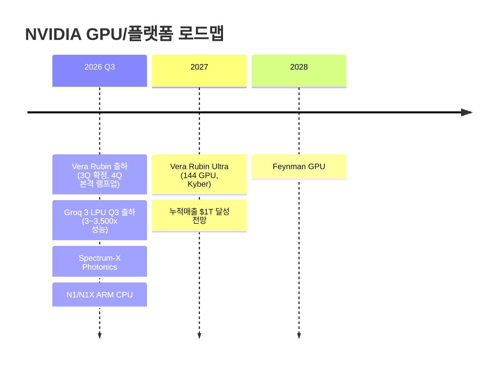

> **관련 글**: [2026년 투자 섹터 전망 (전체)](/knowledge/invest/2026/01/20/investment-sectors-outlook-2026.html)

2026년 글로벌 반도체 시장이 **$1T 마일스톤을 향해 질주**하고 있습니다. BofA는 30% YoY 성장을 전망하며, AI 인프라 투자 폭발(CAPEX $745B+)이 GPU/메모리 수요를 구조적으로 확대하고 있습니다. HBM TAM은 **$54.6B(+58% YoY, BofA)**, 2028년 $100B에 달할 것으로 예상됩니다.

**5월 23일 핵심:**
- **★★★ NVDA 베라 CPU 별도 판매 발표**: 서버 CPU 시장 **$2,000억** 전망(ARM $1,250억, AMD $1,000억 대비 최대). Vera CPU 1개당 LPDDR 최대 **1.5TB** 탑재. $200억 판매 기준(5,000달러 단가) → LPDDR 수요 기존 예측 대비 **30~100% 추가** 증가
- **★★★ NVL 72 메모리 비중 급확대**: GB300→VR200 전환 시 메모리 비중 **9%→25%** 확대, 가격 **5.3배** 증가. AI 클라우드 임대료 **30~75% 인상**(6/1부터) → AI 인프라 수급 타이트 재확인
- **★★★ 삼성 HBM4 NVDA 최종 테스트 통과**: 6월부터 공급 시작. HBM4 로직다이 파운드리 가격 **40~50% 인상**
- **★★★ SK하이닉스 HBM 공급 부족 2028년까지 지속**: ATH **194.9만원**(YTD +197%). MS, Google, Amazon SK하이닉스에 HBM 용량 선투자 계획
- **★★★ LTA(장기 공급 계약) 이중 시장 구조**: 빅테크 3~5년 장기 계약으로 공급자 협상력 강화. 삼성+하이닉스 합산 영업이익 2026년 **600~700조**, 2027년 **800조+** 전망
- **★★ NVDA 주가 미반응 분석**: 배당 +2,400%+$80B 자사주 → "성숙기업 신호" 해석. Custom ASIC +44.6% vs GPU +16.1%. 주가 ~$215, 컨센 **$272**(26% 업사이드)

**5월 22일 핵심 (참고):**
- **★★★ NVDA Q1 FY27 초대형 어닝**: 매출 **$81.6B**(+85% YoY, 컨센서스 $79.2B 상회), 데이터센터 **$75.2B**(+92%) 단일 분기 역대 최고. Q2 가이던스 **$91B**(컨센서스 $86.8B 대폭 상회)
- **★★★ 베라루빈(Vera Rubin) GPU 3Q 출하 확정, 4Q 본격 램프업**: HBM4 수요 증가로 삼성·SK하이닉스 모두 수혜
- **★★★ 삼성전자 노사합의**: DS부문 성과금 자사주 지급, 2028년까지 DS 영업이익 200조 보장. 연간 1.2억주 자사주 매입 → 유통 주식 감소. 삼성전자 5/21 **+8.5%**(29.9만원)
- **★★★ SK하이닉스 +11%**(14만원): HBM 2026 capacity 매진 지속, HBM 공급부족 2027~2030 공식화
- **★★ 삼성전기 +13%(120만원 돌파)**: 마벨향 실리콘 캐패시터 **1.6조 계약** 확인. 목표가 160~170만원

## 반도체 섹터 현황 (2026년 5월 23일 기준)

### 핵심 지표

| 항목 | 수치/현황 | 비고 |
|------|----------|------|
| **SOXX** | **$524.71 (+0.85%, 5/22)** | 반도체 섹터 강세 지속 |
| **NVIDIA** | **~$215 (어닝 후 소폭 하락)** | Custom ASIC +44.6% vs GPU +16.1%. 컨센 $272(26% 업사이드) |
| **인텔** | **CPU 르네상스 지속** | 주간 강세 유지 |
| **SK하이닉스** | **ATH 194.9만원 (YTD +197%)** | HBM 공급 부족 2028년까지. MS/Google/Amazon 선투자 |
| **삼성전자** | **+8.5% (29.9만원)** | 노사합의 효과. 목표가 노무라 59만원, JPMorgan 48만원 |
| **삼성전기** | **+13% (120만원 돌파)** | 마벨향 실리콘 캐패시터 1.6조 계약. 목표가 160~170만원 |
| **Micron** | **Q2 매출 $28.86B (+196% YoY), OP $16.135B (+810% YoY). 목표주가 $700→$1,100 상향 (Melvius)** | 메모리 슈퍼사이클 구조적 수요 확인 |
| **AI CAPEX (하이퍼스케일러)** | **~$745B (7,450억 달러, 2026년 예상)** | 구글 클라우드 +63% YoY (역대 최고) |
| **HBM 공급 부족** | **2028년까지 지속** | SK하이닉스 공식 발표. HBM 내년 가격 인상 예정 |
| **HBM TAM** | **$54.6B (+58% YoY, 2026) → $100B (2028)** | BofA/TrendForce |
| **DRAM/NAND 전망** | **DRAM +51%, NAND +45% YoY (BofA)** | 2Q DRAM 가격 40% 이상 상승률 |
| **글로벌 반도체 매출** | **$1.3T (2026 전망)** | BofA 최고 성장 전망. 30% YoY |
| **AI 클라우드 임대 가격** | **30~75% 인상 (6/1부터)** | AI 인프라 수급 타이트 재확인 |
| **반도체 수출 (한국)** | **4~5월 합산 31조** | 1Q 15조 대비 2배+. 2Q 영업이익 100조 가능성 |
| **삼성+하이닉스 합산 영업이익** | **2026년 600~700조 / 2027년 800조+** | 한국 연간 예산 초과 수준 |
| **장기 금리** | **미국 30Y 5.118%, 일본 30Y 사상 최고** | 성장주 할인율 리스크 |
| **소비자 심리지수** | **49.8 (사상 최저)** | 거시경제 리스크 주의 |

### 5월 23일 핵심 업데이트

| 항목 | 내용 |
|------|------|
| **★★★ NVDA 베라 CPU 별도 판매** | 서버 CPU 시장 **$2,000억** 전망(ARM $1,250억, AMD $1,000억 대비 최대). Vera CPU 1개당 LPDDR 최대 **1.5TB** 탑재. $200억 판매(5,000달러 단가) 기준 → LPDDR 수요 기존 예측 대비 **30~100% 추가** 증가 |
| **★★★ NVL 72 메모리 비중 급확대** | GB300→VR200 전환 시 메모리 비중 **9%→25%** 확대, 가격 **5.3배** 증가. AI 클라우드 임대료 **30~75% 인상**(6/1부터) → AI 인프라 수급 타이트 재확인 |
| **★★★ 삼성 HBM4 NVDA 최종 테스트 통과** | 6월부터 공급 시작. 삼성 HBM4 로직다이 파운드리 가격 **40~50% 인상** |
| **★★★ SK하이닉스 HBM 공급 부족 2028년까지** | ATH **194.9만원**(YTD +197%). MS, Google, Amazon SK하이닉스에 HBM 용량 **선투자 계획** |
| **★★★ LTA 이중 시장 구조 형성** | 빅테크 3~5년 장기 계약으로 공급자 협상력 강화. 삼성+하이닉스 합산 영업이익 2026년 **600~700조**, 2027년 **800조+** 전망(한국 연간 예산 초과) |
| **★★ HBM 내년 가격 인상 예정** | 현재 HBM 마진이 일반 DRAM보다 낮아 인상 여력 충분 |
| **★★ NVDA 주가 미반응 분석** | 배당 +2,400%($0.01→$0.25)+$80B 자사주 → "성숙기업 신호" 해석. Custom ASIC +44.6% vs GPU +16.1% → 빅테크 자체 칩 경쟁 심화. 주가 ~$215, 분석가 컨센 **$272**(26% 업사이드) → 단기 조정은 매수 기회 |
| **★★ 거시경제 리스크** | 미국 30Y 금리 **5.118%**, 일본 30Y 사상 최고 → 성장주 할인율 증가. 소비자 심리지수 **49.8(사상 최저)** |

### 5월 22일 핵심 업데이트

| 항목 | 내용 |
|------|------|
| **★★★ NVDA Q1 FY27 초대형 어닝** | 매출 **$81.6B**(+85% YoY, 컨센서스 $79.2B 상회). 데이터센터 **$75.2B**(+92% YoY) 단일 분기 역대 최고. EPS **$1.87**(예상 $1.78 상회). Q2 가이던스 **$91B**(컨센서스 $86.8B 대폭 상회). 배당 $0.01→**$0.25(+2,400%)**, 자사주매입 **$80B** 신규 인가 |
| **★★★ 베라루빈(Vera Rubin) 3Q 출하 확정** | 4Q 본격 램프업 확정. HBM4 수요: 삼성전자·SK하이닉스 HBM4 수요 증가 기대. DRAM 가격 2Q 상승률 당초 40% 예상보다 크게 상향 조정 |
| **★★★ 삼성전자 노사합의** | DS부문 성과금 자사주 지급. **2028년까지 DS 영업이익 200조 보장** 조항. 연간 **1.2억주 자사주 매입** → 유통 주식 감소 → 주가 구조적 지지. 5/21 **+8.5%**(29.9만원). 반도체 수출 4~5월 합산 **31조**(1Q 15조 대비 2배+). 노무라 목표가 **59만원**, JPMorgan **48만원** |
| **★★★ SK하이닉스 +11%** | 14만원. HBM 2026 capacity 매진 지속. HBM 공급부족 2027~2030 공식화. MS 목표가 **170만원**, SK증권 **300만원** |
| **★★ 삼성전기 +13%** | 120만원 돌파. 마벨향 실리콘 캐패시터 **1.6조 계약** 확인. 애널리스트 목표가 **160~170만원** |
| **★★ TaaS — 토큰 기반 과금 전환** | SaaS→토큰 기반 결제 구조 전환. 구글 분당 API 토큰 처리량: 160억→**190억**(1개월 만, 분기 성장률 60~70%). 토큰 처리량 = 빅테크 매출 선행지표로 부상 |
| **★★ ARM +16%** | NVDA 실적 후 AI 하드웨어 종목 일제 랠리 |
| **★ 양자컴퓨팅 $2B CHIPS Act** | IBM $1B(Anderson 퀀텀 파운드리, 뉴욕), Rigetti $100M, D-Wave $100M, Infleqtion. 투자 신흥 테마로 부상 |

### 5월 20일 핵심 업데이트

| 항목 | 내용 |
|------|------|
| **★★★ 마이크론 Q2 실적 대호황** | 매출 **$28.86B**(+196% YoY), OP **$16.135B**(+810% YoY). **목표주가 $700→$1,100 상향**(Melvius). NAND 가격 **+186%(Citi)**, 엔터프라이즈 SSD **+265%**. 메모리 슈퍼사이클 구조적 수요 확인 |
| **★★★ 엔비디아 베라 CPU 초기 공급 시작** | SpaceX, OpenAI, Anthropic, Oracle Cloud에 초기 베라 실리콘 **직접 전달**. H2 2026부터 글로벌 파트너를 통해 본격 공급. 에이전틱 AI 수요 구체화 |
| **★★★ 구글 I/O 2026 에이전틱 AI** | 제미나이 3.5 플래시(빠른 응답), 제미나이 옴니(멀티모달), 제미나이 스파크(에이전트). **AI Ultra $100/월** 플랜 출시. TPU 외부 판매 수익화 본격화 신호 |
| **★★ 반도체 섹터 강세 지속** | 마이크론 실적 발표 후 -6% → +15% 급등. 메모리 공급 부족과 가격 인상 구도 명확화 |
| **★★ CPU 르네상스 구체화** | 에이전틱 AI 패러다임 전환으로 추론 AI 수요 급증. GPU:CPU 비율 8:1→2:1로 급속도 변화 |

### 5월 5일 핵심 업데이트

| 항목 | 내용 |
|------|------|
| **★★★ 빅테크 Q1 AI 구조적 수요 확인** | AWS **+28% 성장**(15분기 최고), 구글 클라우드 **+63% 성장**(역대 최고). 구글 EPS **5.11**(예상치 2.6의 2배), 광고도 **+15%**. 빅테크 일제 "컴퓨팅 용량 부족" 언급 |
| **★★★ CapEx 7,450억 달러 확정** | 하이퍼스케일러 2026년 예상 **$745B**. AI 투자 피크아웃 신호 없음 |
| **★★★ 자체 반도체 외부 판매 개시** | 구글(TPU)/아마존(Trainium) 자체 반도체 **외부 판매 시작** → NVDA 독점 구도 변화. Bedrock 전분기 대비 **170% 급증** |
| **★★★ HBM 공급 부족 2027~2030 공식화** | Samsung: "2027년이 2026년보다 더 악화". SK Group: "2030년까지 쇼티지 지속". **HBM3E 가격 20% 인상**(2026년). SK하이닉스 HBM 2026 전량 매진 |
| **★★★ HBM4 점유율 전망** | SK하이닉스 **70% 점유 예상**(UBS). 삼성 "customers said Samsung is back" — 기술력 회복 공식 확인 |
| **★★ KOSPI 6,937 신고가** | 5/4 기준. SK하이닉스 **+12.5%**, 삼성전자 **+5.4%**. 외국인 **3조원 순매수** |
| **★★ SK하이닉스 저평가 지속** | SK하이닉스 PER **< 이마트 PER** — 수급 논리 대비 극단적 저평가 |
| **★★ 오픈AI-MS 독점 해지** | OpenAI MS 독점 계약 해지 → **AWS도 GPT 서비스 가능** → 클라우드 AI 경쟁 전방위 확산. AI 생태계 다변화 = 복수 클라우드 투자 가속 |

### 5월 4일 핵심 업데이트

| 항목 | 내용 |
|------|------|
| **★★★ AI 4대 병목 공식화** | 빅테크 Q1 실적에서 **메모리·전력·CPU·광통신** 4대 병목 동시 공식화. MS "전력이 가장 큰 제약 요인, 컴퓨팅보다 전력". MS CapEx 절반이 CPU+GPU. 광통신: GPU N배 → 연결 N² 배 |
| **★★★ 메모리 병목 3사 공식 인정** | MS: CapEx 증가분 35%가 **메모리 가격 상승**. 메타: CFO **직접 언급**. 아마존: AK 공시에 **메모리 공급 변동성을 리스크**로 명시 |
| **★★★ SanDisk 실적 폭발** | EPS **$23.4** vs 예상 $14.4(**+63% 서프라이즈**). 영업이익률 **78.4%**. 주가 **+8%+**. 4월 수익률: SanDisk **+70%**, AMD **+70%**, Micron **+47%**, TI **+43%** |
| **★★★ 구글 클라우드 +63% YoY** | 업계 **1위** 성장률. 수주 잔고 **243→460억 달러(+2배)**. Anthropic TPU 사용 급증. TPU 수익화 **H2 2026** 시작 |
| **★★ 아마존 AWS Q1** | Bedrock **1분기 처리 토큰 > 이전 전체 합산**. 트레이니엄 4세대 **완판**. 렉 판매 사업 진출 |
| **★★ 광통신 N² 수요** | GPU 클러스터 N배 증가 → 연결은 **N² 배** 증가. **Lumentum/Coherent** 직접 수혜. CPO 수요 가속 |
| **★★ AI 수요 가속 지표** | OpenRouter 토큰 **1년 전 대비 ~10배**. 가용 GPU **감소 추세** 지속. NVDA Blackwell B300 중국 가격 **700만 위안(~$1M)** — 공급 부족 심화 |

### 5월 2일 핵심 업데이트

| 항목 | 내용 |
|------|------|
| **★★★ 2027년 쇼티지 공식화** | 삼성전자 공식 발언: "2027년 수급이 2026년보다 더 악화". 데이터센터 투자 → 가동까지 **2년 이상** 소요 → 2027H2~2028 전력·메모리 수요 집중. SK Group 회장 "2030년까지 쇼티지 지속"과 일치 |
| **★★★ CPU 르네상스 — 추론 전환** | AI 패러다임 학습→추론 전환 → CPU 수요 급증. GPU:CPU 비율 **8:1 → 4:1 → 2:1~1:8** 전망. INTC 주간 **+20%** — CPU 르네상스 수혜 |
| **★★★ 메모리 슈퍼사이클 확인** | SK하이닉스 HBM **2026 전체 capacity 매진**. BofA: DRAM **+51%**, NAND **+45%** YoY 전망. Micron 4월 **+53%**(구조적 수요 확인). SK하이닉스 HBM4 시장점유율 **70% (UBS)** |
| **★★★ 빅테크 CapEx 건재** | 메타 **$1,200B→$1,300B** 상향, 구글 클라우드 **+40%**, 아마존/MS 투자 유지. OpenAI 우려 과도 — Anthropic·Google로 수요 이동. OpenAI NVDA 비중 ~20%로 축소이나 **대세 영향 없음** |
| **★★ 삼성전자 파운드리 반전 기대** | 2nm "조만간 의미있는 고객 수주" **공식 코멘트**. 수율 개선 중. TSMC 캐파 부족으로 인텔·삼성으로 수요 분산 조짐 |
| **★★ NVDA/Google/MS 펜타곤 AI 계약** | AI 군사 응용 확대 → NVDA **구조적 수요 기반 강화** |

### 4월 29일 핵심 업데이트 (참고)

| 항목 | 내용 |
|------|------|
| **★★★ SK하이닉스 Q1 역대 최대** | 매출 **52.58조원**(+198% YoY, 처음으로 50조 돌파). OP **37.61조원**(+405% YoY), **72% 마진**. HBM 점유율 **57%**. HBM4 수요 향후 **3년치 초과 예약**. 목표가: 미래에셋 **200만원**, 모건스탠리 **170만원** |
| **★★★ 삼성전자 Q1 사상최대** | OP **57.2조원**(+755% YoY), 컨센서스 대비 **+31% 서프라이즈**. 파운드리 **2Q~3Q 흑자 전환** 예상. HBM4 양산 **2월 착수**. DRAM 마진 **73%** |
| **★★★ 빅테크 AI CapEx** | 2026년 **~$645B**(MSFT+AMZN+META+GOOGL), **+67% YoY** |
| **★★★ 에이전틱 AI → CPU 수요** | GPU:CPU 비율 8:1→4:1→2:1~1:8. Intel Q1: EPS 29c vs 1c(**+2800%**). 데이터센터 **+22%** |
| **★★ 두산 CCL + 파미셀** | 두산: 엔비디아 블랙웰 CCL **단독 공급**, 2027년까지 독점. 영업이익률 **25-30%**. 파미셀: CCL 소재 납품, 9월 3공장 증설(2배) |
| **★★ 씨게이트 어닝 서프라이즈** | EPS **$4.1** vs 예상 **$3.5**, 시간외 **+15%**. 다음 분기 EPS **$5** |
| **★★★ SanDisk 어닝 폭발 (5/4)** | EPS **$23.4** vs 예상 **$14.4**(**+63% 서프라이즈**). 영업이익률 **78.4%**. 주가 **+8%+**. AI 스토리지 수요 구조적 폭발 확인 |

---

## NVDA Q1 FY27 초대형 어닝 — 주가 미반응 분석 (5/23 업데이트)

NVIDIA가 Q1 FY27(2026년 1분기) 실적을 발표하며 모든 지표에서 컨센서스를 대폭 상회했습니다.

| 항목 | 내용 |
|------|------|
| **매출** | **$81.6B** (+85% YoY), 컨센서스 $79.2B 상회 |
| **데이터센터** | **$75.2B** (+92% YoY) — 단일 분기 역대 최고 |
| **EPS** | **$1.87** (예상 $1.78 상회) |
| **Q2 가이던스** | **$91B** (컨센서스 $86.8B 대폭 상회) |
| **배당** | $0.01→**$0.25**(+2,400%) |
| **자사주매입** | **$80B** 신규 인가 |
| **베라루빈(Vera Rubin) GPU** | **3Q 출하, 4Q 본격 램프업** 확정 |
| **HBM4 수요 영향** | 삼성전자·SK하이닉스 HBM4 수요 증가 기대. DRAM 가격 2Q 상승률 당초 40% 예상보다 크게 상향 |
| **AI 클라우드 임대 가격** | **30~75% 인상** (6/1부터) — AI 인프라 수급 타이트 재확인 |
| **주가** | 어닝 후 ~**$215** 소폭 하락. 분석가 컨센 **$272** (26% 업사이드) |

### 주가 미반응 원인 분석

| 요인 | 내용 |
|------|------|
| **성숙기업 신호 해석** | 배당 +2,400%+$80B 자사주 → 시장이 "고성장기업 → 성숙기업 전환 신호"로 해석 |
| **Custom ASIC 경쟁 심화** | TrendForce: Custom ASIC 성장률 **+44.6%** vs GPU **+16.1%** → 빅테크 자체 칩 경쟁 가속. 장기 시장점유율 우려 |
| **투자 시사점** | 단기 조정은 매수 기회. 분석가 컨센 $272(26% 업사이드) 유효 |

**투자 시사점**: NVDA Q2 가이던스 $91B은 AI 인프라 수요가 여전히 가속 중임을 증명합니다. 베라루빈 3Q 출하 확정은 HBM4 수요를 구조적으로 당기고, 이는 삼성전자·SK하이닉스 실적에 직접 반영됩니다. 어닝 후 주가 조정은 Custom ASIC 우려와 성숙기업 해석이 원인이나, 분석가 컨센서스 $272 대비 26% 업사이드가 유효해 단기 조정은 매수 기회입니다.

---

## 삼성전자 노사합의 — 구조적 주가 지지 (5/22 업데이트)

삼성전자가 DS부문 노사합의를 통해 주가 구조적 지지 기반을 마련했습니다.

| 항목 | 내용 |
|------|------|
| **성과금 구조** | DS부문 성과금 **자사주 지급** |
| **영업이익 보장** | **2028년까지** DS 영업이익 **200조 보장** 조항 |
| **자사주매입** | 연간 **1.2억주** 자사주 매입 필요 → 유통 주식 감소 → **주가 구조적 지지** |
| **주가 반응** | 5/21 **+8.5%** (29.9만원) |
| **반도체 수출** | 4~5월 합산 **31조** (1Q 15조 대비 **2배+**) → 2Q 영업이익 100조 가능성 |
| **목표주가 (노무라)** | **59만원** (PBR 기반) |
| **목표주가 (JPMorgan)** | **48만원** |
| **목표주가 (SK증권)** | **50만원** |

**투자 시사점**: 자사주 매입으로 인한 유통 주식 감소는 EPS를 구조적으로 높이며 주가를 지지합니다. 반도체 수출 4~5월 합산 31조(1Q 15조 대비 2배+)는 2Q 실적 급등을 선행 시사합니다. 노무라 목표가 59만원은 현재 가격 대비 약 100% 이상 업사이드로, 하이닉스 대비 언더퍼폼이 빠르게 해소될 수 있습니다.

---

## SK하이닉스 +11% — HBM 구조적 수혜 지속 (5/22 업데이트)

| 항목 | 내용 |
|------|------|
| **주가 반응** | 5/21 **+11%** (14만원) |
| **HBM 2026** | capacity **매진** 상태 지속 |
| **HBM 공급부족** | **2027~2030** 공식화 |
| **목표주가 (MS)** | **170만원** |
| **목표주가 (SK증권)** | **300만원** |

**투자 시사점**: NVDA 베라루빈 3Q 출하 확정이 HBM4 수요를 당기며 SK하이닉스 실적 개선 모멘텀이 유지됩니다. 2027~2030 공급부족이 공식화된 상황에서 SK하이닉스 PER이 이마트보다 낮다는 사실은 여전히 극단적 저평가를 시사합니다.

---

## 삼성전기 — 실리콘 캐패시터 1.6조 계약 (5/22 업데이트)

| 항목 | 내용 |
|------|------|
| **마벨향 계약** | 실리콘 캐패시터 **1.6조 계약** 확인 |
| **주가 반응** | **+13%** (120만원 돌파) |
| **목표주가** | 애널리스트 **160~170만원** 제시 |

**투자 시사점**: 실리콘 캐패시터는 고성능 반도체 패키징에 핵심 부품으로, 마벨향 1.6조 계약은 삼성전기의 AI 반도체 소재 부품 공급망 내 위치를 확인합니다. 160~170만원 목표가는 현재 대비 약 30~40% 업사이드입니다.

---

## TaaS(Token as a Service) — AI 과금 구조 전환 (5/22 업데이트)

SaaS에서 토큰 기반 결제 구조로의 전환이 가속되고 있습니다.

| 항목 | 내용 |
|------|------|
| **과금 패러다임** | SaaS → **토큰 기반 결제(TaaS)** 구조 전환 |
| **구글 토큰 처리량** | 분당 160억 → **190억** (1개월 만, 분기 성장률 **60~70%**) |
| **선행지표 역할** | 토큰 처리량 = **빅테크 매출 선행지표**로 부상 |
| **반도체 시사점** | 토큰 처리량 증가 = GPU·HBM·DRAM 수요 구조적 증가 |

**투자 시사점**: 토큰 처리량 분기 성장률 60~70%는 AI 인프라 수요 폭발의 실시간 지표입니다. TaaS 전환이 가속될수록 빅테크의 AI 하드웨어 CapEx 집행은 더욱 구조적으로 증가합니다.

---

## 빅테크 Q1 AI 구조적 수요 확인 (5/5 업데이트)

빅테크 Q1 실적이 AI 클라우드 수요의 구조적 성장을 강력하게 확인했습니다.

| 항목 | 내용 |
|------|------|
| **구글 클라우드 성장률** | **+63% YoY** — 역대 최고, 업계 1위 |
| **구글 EPS** | **$5.11** (예상치 2.6의 **2배 초과**) |
| **구글 광고 성장** | **+15%** YoY |
| **AWS 성장률** | **+28% YoY** — 15분기 최고 |
| **Bedrock 급증** | 전분기 대비 **170% 급증** |
| **빅테크 공통 언급** | "컴퓨팅 용량 부족" 일제 언급 — 투자 **더 늘릴 계획** |
| **AI 투자 피크아웃?** | 신호 없음. **과거 닷컴버블 패턴 미해당** |

**투자 시사점**: 구글 EPS가 예상치의 2배를 기록하고 AWS가 15분기 최고 성장률을 달성한 것은 AI 클라우드 수요가 이론이 아닌 실적으로 검증되고 있음을 보여줍니다. "컴퓨팅 용량 부족" 발언은 GPU·메모리·전력 인프라 투자가 더 가속화될 것임을 시사합니다.

---

## 자체 반도체 외부 판매 — 생태계 변화 (5/5 업데이트)

구글(TPU)과 아마존(Trainium)이 자체 AI 반도체를 외부에 판매하기 시작했습니다.

| 항목 | 내용 |
|------|------|
| **구글 TPU 외부 판매** | TPU 외부 고객 대상 판매 시작. 수익화 **H2 2026** 본격화 |
| **아마존 Trainium 외부 판매** | 트레이니엄 렉 판매 사업 진출 |
| **오픈AI-MS 독점 해지** | OpenAI MS 독점 계약 해지 → **AWS도 GPT 서비스 가능** |
| **AI 생태계 변화** | 빅테크 자체 칩 → 외부 판매 = NVDA 의존도 분산. 그러나 전체 AI 수요는 더 확대 |
| **브로드컴 수혜** | 구글 TPU/메타 AI칩 제조 파트너로 **구조적 수혜** |

**투자 시사점**: 자체 반도체 외부 판매는 AI 칩 생태계를 다변화시키지만, 전체 AI 인프라 수요는 더 확대됩니다. NVDA 독점 구도가 점진적으로 분산되는 한편, HBM/메모리 수요는 플랫폼을 가리지 않고 계속 증가합니다.

---

## HBM 공급 부족 2028년까지 지속 — 삼성 HBM4 최종 테스트 통과 (5/23 업데이트)

HBM 공급 부족이 2028년까지 지속되는 가운데, 삼성 HBM4가 NVDA 최종 테스트를 통과해 6월부터 공급이 시작됩니다.

| 항목 | 내용 |
|------|------|
| **삼성 HBM4 NVDA 최종 테스트 통과** | **6월부터 공급 시작**. HBM4 로직다이 파운드리 가격 **40~50% 인상** |
| **SK하이닉스 HBM 공급 부족** | **2028년까지** 지속 공식 발표. ATH **194.9만원**(YTD +197%) |
| **빅테크 선투자** | MS, Google, Amazon SK하이닉스에 HBM 용량 **선투자 계획** |
| **HBM 내년 가격 인상** | 현재 HBM 마진이 일반 DRAM보다 낮아 **인상 여력 충분** |
| **삼성전자 공식 발언** | "**2027년 수급 상황이 2026년보다 더 악화**될 것" |
| **SK Group 회장** | "**2030년까지** 메모리 쇼티지 지속" |
| **HBM3E 가격 인상** | **20% 인상** (2026년) |
| **SK하이닉스 2026 HBM** | **전량 매진** (NVIDIA 공급 우선) |
| **HBM4 점유율** | SK하이닉스 **70% 예상**(UBS). 삼성 "customers said Samsung is back" |
| **공급 제약 원인** | 데이터센터 투자 → **가동까지 2년 이상** 소요 → 2027H2~2028 수요 집중 |

**투자 시사점**: 삼성 HBM4 NVDA 최종 테스트 통과로 삼성이 HBM4 공급망에 본격 편입되며, HBM4 로직다이 파운드리 가격 40~50% 인상은 ASP 상승으로 직결됩니다. SK하이닉스는 ATH 194.9만원(YTD +197%)을 기록하며 빅테크 선투자까지 확보, 공급자 우위 구도가 더욱 강화되고 있습니다. HBM 내년 가격 인상 여력은 마진 추가 개선을 시사합니다.

---

## SanDisk 실적 폭발 — 스토리지 AI 수요 검증 (5/4 업데이트)

| 항목 | 내용 |
|------|------|
| **EPS** | **$23.4** (예상 $14.4, **+63% 서프라이즈**) |
| **영업이익률** | **78.4%** — 반도체 역사상 최고 수준 |
| **주가 반응** | **+8%+** 상승 |
| **4월 누적 수익률** | **SanDisk +70%**, AMD +70%, Micron +47%, TI +43% |
| **투자 시사점** | AI 데이터센터 스토리지 수요 폭발 → HBM 이외 스토리지(NAND) 수혜. 씨게이트(이전 분기 +15%)와 함께 스토리지 섹터 전체 슈퍼사이클 확인 |

**투자 시사점**: SanDisk 78.4% 영업이익률은 AI 스토리지 수요가 얼마나 폭발적인지를 보여줍니다. BofA NAND +45% YoY 전망이 실적으로 검증되고 있으며, 씨게이트(HDD)·SanDisk(NAND) 동반 강세는 스토리지 섹터 전반의 구조적 수혜를 시사합니다.

---

## 2027년 쇼티지 공식화 — 수급 악화 심화 확정 (5/2 업데이트)

삼성전자가 공식적으로 **"2027년 수급 상황이 2026년보다 더 악화될 것"**이라고 발언했습니다(김장열 인터뷰, 삼프로TV 5/1). 이는 반도체 슈퍼사이클이 2027~2028년까지 연장됨을 의미합니다.

| 항목 | 내용 |
|------|------|
| **삼성전자 공식 발언** | "**2027년 수급 상황이 2026년보다 더 악화**될 것" |
| **원인** | 데이터센터 투자 → **가동까지 2년 이상** 소요. 2024~2025년 투자가 2027H2~2028년에 집중 가동 |
| **전력·메모리 수요** | 2027H2~2028 **전력·메모리 수요 집중** 도래 |
| **SK Group 회장 (4/29)** | "**2030년까지** 메모리 쇼티지 지속" — 동일 방향성 |
| **OpenAI 우려** | 과도 — Anthropic·Google로 수요 이동. OpenAI NVDA 비중 ~20%로 축소이나 **대세 영향 없음** |
| **빅테크 CapEx** | 메타 $1,200B→**$1,300B 상향**, 구글 클라우드 **+40%**, 아마존/MS **유지** |

**투자 시사점**: 삼성전자의 공식 발언은 2027~2028년 반도체 수요가 현재보다 더 강할 것임을 확인합니다. 데이터센터 건설-가동 사이클(2년+)을 고려하면 현재 진행 중인 빅테크 CapEx가 2027H2~2028년에 폭발적으로 전력·메모리 수요를 창출합니다. SK하이닉스 HBM 2026 전체 capacity 매진 → 2027 쇼티지 심화는 구조적 가격 결정력을 유지시킵니다.

---

## GPU→CPU 무게중심 이동 — NVDA 베라 CPU 별도 판매 (5/23 업데이트)

NVIDIA가 Vera CPU 별도 판매를 공식 발표하며 서버 CPU 시장에 직접 진입했습니다. AI 패러다임이 **학습(Training) → 추론(Inference)**으로 전환되면서 GPU 중심에서 CPU+GPU 이원화 아키텍처로 무게중심이 이동하고 있습니다.

### NVDA 베라 CPU 별도 판매

| 항목 | 내용 |
|------|------|
| **서버 CPU 시장 전망** | 엔비디아 **$2,000억** (ARM $1,250억, AMD $1,000억 대비 최대) |
| **Vera CPU LPDDR** | CPU 1개당 LPDDR 최대 **1.5TB** 탑재 |
| **LPDDR 수요 증가** | $200억 판매(5,000달러 단가) 기준 → LPDDR 수요 기존 예측 대비 **30~100% 추가** 증가 |
| **NVL 72 메모리 비중** | GB300→VR200 전환 시 메모리 비중 **9%→25%** 확대, 가격 **5.3배** 증가 |

### CPU 르네상스 — AI 추론 전환 (5/2 업데이트)

| 항목 | 내용 |
|------|------|
| **AI 패러다임 전환** | 학습 → **추론** 단계 전환 → CPU 병렬 연산 보조 역할 급증 |
| **GPU:CPU 비율 변화** | 현재 **8:1** → 단기 **4:1** → 향후 **2:1~1:8** 전망 |
| **TSMC 3nm 부족** | 에이전틱 AI 수요 → 3nm 공정 부족 → 서버 CPU 가격 **10-20% 인상** |
| **Intel 주가** | 지속 강세 — CPU 르네상스 수혜 지속 |
| **Intel Q1 검증 (4/23)** | EPS **29c** vs 예상 1c(**+2800%**). 데이터센터 **+22% → $5.1B** |
| **AMD vs Intel 경쟁** | 시총 경쟁 심화. DA Davidson AMD $375 타겟. "CPU 수요 전례 없는 국면" |
| **Intel 목표주가** | 에버코어 **$111**, HSBC **$100**, 노스랜드 **$92** |
| **Tesla-Intel 14A** | 테슬라 = 인텔 14A **파운드리 파트너십 공식화** |
| **DRAM 수혜** | CPU 수요 급증 → **DRAM+LPDDR 수요 연계 확대** |

**투자 시사점**: NVDA 베라 CPU 별도 판매는 서버 CPU 시장 $2,000억 진입을 의미하며, Vera CPU 1개당 LPDDR 최대 1.5TB 탑재로 메모리 수요가 기존 예측 대비 30~100% 추가 증가합니다. 에이전틱 AI 시대에 GPU:CPU 비율이 8:1에서 장기적으로 1:8까지 역전될 수 있다는 전망은 x86 CPU 및 ARM 기반 CPU 시장의 구조적 재부상을 의미합니다. 에이전트는 챗봇과 달리 **24시간 자율 실행**하며 CPU를 상시 소비합니다.

---

## 메모리 슈퍼사이클 구조 강화 — LTA 이중 시장 구조 (5/23 업데이트)

HBM 공급 부족이 심화되고 LTA(장기 공급 계약)를 통한 이중 시장 구조가 형성되며 메모리 슈퍼사이클이 더욱 강화되고 있습니다.

| 항목 | 내용 |
|------|------|
| **LTA 이중 시장 구조** | 빅테크 **3~5년 장기 계약** → 공급자 협상력 강화. 장기계약(LTA) vs 현물시장 이중 구조 형성 |
| **삼성+하이닉스 합산 영업이익** | 2026년 **600~700조**, 2027년 **800조+** 전망 (한국 연간 예산 초과) |
| **SK하이닉스 HBM** | **2026년 전체 capacity 매진**. 공급 부족 **2028년까지** 지속 |
| **HBM 내년 가격 인상** | 현재 HBM 마진이 일반 DRAM보다 낮아 **인상 여력 충분** |
| **SK하이닉스 HBM4 점유율** | **70%** (UBS) 전망 |
| **HBM3E 가격** | **20% 인상** (2026년) |
| **BofA DRAM 전망** | **+51% YoY** |
| **BofA NAND 전망** | **+45% YoY** |
| **Micron** | 4월 **+53%** — 수요 구조적 증가 시그널. 목표주가 $1,000 등장. P/E ~6배 |
| **HBM 가격 시나리오** | 상승률 40%→8% 가정 시 하이닉스 연간 **~220조**, 40%→15% 가정 시 **~290조** |
| **DRAM Q2 가격** | **+30% QoQ** 확정. TrendForce: 일반 DRAM Q2 **+58-63% QoQ** |
| **HBM TAM** | **$54.6B (+58% YoY, 2026) → $100B (2028)** |

**투자 시사점**: LTA(장기 공급 계약) 확산으로 빅테크가 3~5년 선매입을 하면서 공급자 협상력이 구조적으로 강화되고 있습니다. 삼성+하이닉스 합산 영업이익 2026년 600~700조, 2027년 800조+ 전망은 한국 연간 예산을 초과하는 규모입니다. HBM 내년 가격 인상 여력은 현재 HBM 마진이 일반 DRAM보다 낮다는 사실에서 기인하며, 추가 마진 개선이 기대됩니다.

---

## 삼성전자 파운드리 — 반전 기대, 노사합의 해소 (5/22 업데이트)

삼성전자 파운드리가 2nm 수주를 통해 반전을 모색하고 있습니다.

| 항목 | 내용 |
|------|------|
| **2nm 수주** | "조만간 의미있는 고객 수주" **공식 코멘트** |
| **수율 개선** | 진행 중 |
| **TSMC 캐파 부족** | 인텔·삼성으로 수요 분산 조짐 — **외부 환경 우호적** |
| **노사합의 (5/21)** | DS 영업이익 200조 보장, 자사주 1.2억주 매입 → **노조 리스크 해소** |
| **Q1 파운드리** | **2Q~3Q 흑자 전환** 예상 (4/29 기준) |
| **HBM4 점유율** | **30%+** — NVIDIA HBM4 30%+ 공급 확보. "customers said Samsung is back" |

**투자 시사점**: 삼성전자 노사합의로 하이닉스 대비 언더퍼폼의 핵심 원인이었던 노조 변수가 해소되었습니다. HBM4 30%+ 점유율과 파운드리 2nm 수주 기대를 보유한 상황에서 노무라 목표가 59만원까지 빠른 캐치업이 기대됩니다.

---

## 인텔 Q1 2026 블로우아웃 — 주간 +20%, 테슬라 14A 파운드리 (4/23)

인텔이 Q1 2026 실적을 발표하며 **EPS 29c(예상 1c)**를 대폭 상회하는 블로우아웃 실적을 기록했습니다.

| 항목 | 내용 |
|------|------|
| **EPS** | **29c** (예상 1c, **2,800% 상회**) |
| **매출** | **$13.58B** (예상 $12.42B, **+9.3% 상회**) |
| **데이터센터** | **+22% → $5.1B** — 에이전틱 AI가 GPU→CPU 컴퓨팅 전환 가속 |
| **테슬라 14A 파운드리** | 테슬라 = **인텔 14A 공정 파트너십 공식화** |
| **YTD 성과** | **+100%** — 1987년 이후 가장 강한 월간 상승 추세 |
| **DA Davidson** | **"CPU 수요가 전례 없는 국면(unprecedented phase) 진입"** |
| **목표주가** | 에버코어 **$111**, HSBC **$100**, 노스랜드 **$92** |
| **미 정부 수익** | 인텔 투자(보조금+지분)로 **~$30B 수익** 실현 |

---

## SK하이닉스 Q1 2026 역대 최대 실적 — OP 37.61조원, 72% 마진 (4/29 업데이트)

| 항목 | 내용 |
|------|------|
| **매출** | **52.58조원** (+60% QoQ, **+198% YoY**, **처음으로 50조 돌파**) |
| **영업이익** | **37.61조원** (+96% QoQ, **+405% YoY**) |
| **영업이익률** | **72%** — 글로벌 최고 수준 |
| **순이익** | **40.35조원**(+398% YoY), 순이익률 **77%** |
| **HBM 점유율** | **57%** — 압도적 1위 (HBM4 70%, UBS) |
| **HBM4E** | 샘플 **H2 2026**, 양산 **2027** |
| **HBM4 수요** | 향후 **3년치 초과 예약** |
| **2026 HBM capacity** | **전량 매진** (NVIDIA 공급 우선) |
| **신규 공장** | **19조원** 규모 한국 내 제조공장 신설 |
| **SK Group 회장** | "**2030년까지** 메모리 쇼티지 지속" |
| **SK하이닉스 PER** | **< 이마트 PER** — 극단적 저평가 |
| **목표주가** | 미래에셋 **200만원**, 모건스탠리 **170만원**, SK증권 **300만원** |
| **주의사항** | 하반기 이익 성장률 **둔화 가능성** (2027년 +20% 초반 전망) |

---

## 삼성전자 Q1 2026 사상최대 — OP 57.2조원, +755% YoY (4/29 업데이트)

| 항목 | 내용 |
|------|------|
| **영업이익** | **57.2조원** (+755% YoY, 컨센서스 대비 **+31% 서프라이즈**) |
| **매출** | **133조원** |
| **반도체 부문 OP** | **53.7조원** (컨센서스 43.7조 대비 **+31% 서프라이즈**) |
| **DRAM 마진** | **73%** |
| **파운드리** | **2Q~3Q 흑자 전환** 예상 |
| **HBM4** | 양산 **2월 착수** — 하이닉스보다 선행 |
| **HBM4 점유율** | NVIDIA HBM4 **30%+** 공급 확보. "customers said Samsung is back" |
| **2nm 파운드리** | "조만간 의미있는 고객 수주" 공식 코멘트 (5/2) |
| **글로벌 이익 순위** | **4위**: Apple 76T > NVDA 66T > MS 57.5T > Samsung 57.2T |
| **PER** | **6.5배** 저평가 |
| **목표주가** | 노무라 **59만원**, JPMorgan **48만원**, SK증권 **50만원** |

---

## 빅테크 AI CapEx & Q1 실적 — 수요 폭발 확인 (5/5 업데이트)

### AI CapEx 현황

| 기업 | AI CAPEX (2026) | 비고 |
|------|----------------|------|
| **Amazon** | **$200B+** | AWS +28% 성장(15분기 최고). Bedrock +170% QoQ |
| **Google** | **$175-185B** | 클라우드 +63% YoY (업계 1위). EPS 5.11(예상치 2배) |
| **Microsoft** | **$120B+** | 투자 유지. Azure 가이던스 39→40% |
| **Meta** | **$135B** | $1,200B→**$1,300B 상향** |
| **합산** | **~$745B (7,450억 달러)** | 전년 **~$4,000억 대비 대폭 증가** |
| **2027 전망** | **추가 증가** | 투자 피크아웃 신호 없음 |

### 빅테크 Q1 2026 실적 요약 (5/5 기준)

| 기업 | Q1 핵심 | 반도체 시사점 |
|------|---------|------------|
| **구글 클라우드** | **+63% YoY** (역대 최고·업계 1위). EPS **5.11**(예상치 2.6의 2배). 광고 **+15%**. 수주잔고 243→**460억 달러(+2배)**. 분당 토큰 처리량 160억→**190억**(1개월 만) | TPU 수익화 H2 2026 → 브로드컴 수혜. TPU 외부 판매 시작 |
| **아마존 AWS** | **+28% YoY**(15분기 최고). Bedrock **+170% QoQ**. 트레이니엄 4세대 **완판**. Trainium 외부 판매 시작 | HBM/스토리지 수요 폭발. 자체칩 외부 판매 → 생태계 확장 |
| **메타** | CapEx 전망치 **상향**. Broadcom **2nm AI칩** 파트너십. **Assured Robot Intelligence(humanoid AI)** 인수 | 메모리 가격 급등 CFO 직접 언급 |
| **MS** | Azure 성장률 **39→40% 가이던스**. CapEx 절반 **CPU+GPU**. OpenAI MS 독점 **해지** | 전력이 컴퓨팅보다 큰 제약. CapEx 35% 메모리 가격 |
| **애플** | 전 부문 **어닝 그린라이트**. 시총 **$4T 돌파**. 아이폰 17 수요 폭발 | A 시리즈 칩 TSMC N3 수요 |

### AI 4대 병목 공식화 (5/4 빅테크 Q1 실적)

| 병목 | 내용 | 수혜 종목 |
|------|------|---------|
| **메모리** | MS CapEx 증가분 35%가 메모리 가격 상승. 메타 CFO 직접 언급. 아마존 AK 공시 리스크 명시 | SK하이닉스, Micron, SanDisk |
| **전력** | MS "전력이 가장 큰 제약 요인, 컴퓨팅보다 전력이 문제" | Eaton, 발전 인프라 |
| **CPU** | 아마존 핵심 자산 어필. MS CapEx 절반이 CPU+GPU | Intel, AMD EPYC |
| **광통신** | GPU N배 증가 → 연결은 **N² 배**. 병목 구조적 | Lumentum, Coherent, Credo, Marvell |

**OpenAI 우려 대비 실상**: OpenAI MS 독점 계약 해지 → AWS도 GPT 서비스 가능. AI 생태계 다변화 = 복수 클라우드 업체의 AI 인프라 투자 경쟁 가속.

---

## 종목 선호도 및 투자 전략 (5/22 기준)

### 추천 종목 (5/22 기준)

**한국 (대형주 위주 유지)**

| 종목 | 현황 | 투자 포인트 |
|------|------|-----------|
| **삼성전자** | 5/21 +8.5%(29.9만원). 노사합의. PER 6.5배 저평가 | 노사합의로 노조 리스크 해소. 자사주 1.2억주 매입 → 주가 구조적 지지. DS 200조 영업이익 보장. 목표가 노무라 59만원 |
| **SK하이닉스** | 5/21 +11%(14만원). HBM 2026 전량 매진 | HBM 70% 점유(UBS). 2027~2030 쇼티지 구조적 수혜. NVDA 베라루빈 3Q 출하로 HBM4 수요 당김. 목표가 MS 170만원, SK증권 300만원 |
| **삼성전기** | 5/21 +13%(120만원 돌파) | 마벨향 실리콘 캐패시터 1.6조 계약. AI 반도체 핵심 부품 공급망 내 위치 확인. 목표가 160~170만원 |

**미국**

| 종목 | 현황 | 투자 포인트 |
|------|------|-----------|
| **NVDA** | Q1 FY27 매출 $81.6B(+85%), Q2 가이던스 $91B | AI 인프라 핵심. 베라루빈 3Q 출하. $745B+ CapEx 수혜. BofA 목표가 상향 |
| **AVGO(브로드컴)** | — | 구글 TPU·메타 AI칩 파트너. 자체 반도체 외부 판매 확대 수혜 |
| **INTC** | CPU 르네상스 지속 | CPU 르네상스 최대 수혜. 에버코어 목표 $111. TeraFab 14A 파운드리 |
| **GOOGL** | 클라우드 +63%(역대 최고). 토큰 처리량 190억 | AI 클라우드 1위. TaaS 전환 핵심 수혜. TPU 외부 판매 수익화 H2 2026 |
| **AMZN** | AWS +28%(15분기 최고) | Bedrock +170% QoQ. Trainium 외부 판매. 클라우드 AI 생태계 확장 |
| **ARM** | NVDA 실적 후 +16% | AI 하드웨어 랠리 참여. CPU 아키텍처 라이선스 구조적 수혜 |

**ETF**

| ETF | 현황 | 비고 |
|-----|------|------|
| **SOXX** | $524.71 (+0.85%, 5/22) | 반도체 섹터 대표 ETF |

**소부장**

| 종목 | 현황 | 비고 |
|------|------|------|
| **심택** | +20% | 반도체 소재 수혜 |
| **한미반도체** | +15% | 장비 소부장 수혜 |

### HBM 가격 시나리오

| 시나리오 | 조건 | 하이닉스 연간 이익 |
|---------|------|---------|
| **보수적** | HBM 가격 상승률 40%→8% | **~220조원** |
| **기본** | HBM 가격 상승률 40%→15% | **~290조원** |

---

## 두산 CCL 엔비디아 블랙웰 단독 공급 + 파미셀 (4/29)

### 두산 전자BG

| 항목 | 내용 |
|------|------|
| **공급 대상** | 엔비디아 **블랙웰 GPU** CCL 단독 공급 |
| **경쟁사 탈락** | **EMC 탈락** — 두산 독점 확정 |
| **독점 기간** | **2027년까지** |
| **2026 영업이익률** | **25-30%** |
| **매출 성장** | 2026년 매출 **2024년 대비 2배** |

### 파미셀 — 두산향 CCL 소재 납품

| 항목 | 내용 |
|------|------|
| **납품 소재** | 두산향 CCL 소재(**레진/경화제**) |
| **영업이익률** | **30%+** |
| **3공장 증설** | **9월** 착공, 생산 능력 **2배** 확대 |

---

## OpenAI-MS 파트너십 재편 — AI 생태계 다변화 (5/5 업데이트)

5/5 OpenAI MS 독점 파트너십이 해제되었습니다. 이는 AI 생태계 다변화를 가속시킵니다.

| 항목 | 내용 |
|------|------|
| **OpenAI-MS 독점 해지** | OpenAI MS 독점 계약 해지 → **AWS도 GPT 서비스 가능** |
| **실상** | OpenAI WAU **4억→9억(2배 성장)**. Anthropic ARR **$30B > OpenAI $25B** 역전 |
| **반도체 시사점** | AI 클라우드 다변화 = AWS·Google·MS 모두 AI 인프라 투자 경쟁 가속 |
| **판단** | AI 생태계 다변화 = **전체 AI 수요 확대**로 반도체 구조적 수혜 |

---

## SaaS 위기 = AI 인프라 투자 가속의 역설 (4/23)

소프트웨어 섹터가 AI 도구 확산으로 대폭 하락했으나, 이는 AI 인프라/반도체 투자 가속을 시사합니다.

| 항목 | 내용 |
|------|------|
| **SaaS 충격** | ServiceNow **-18%**, IBM **-8%**, Salesforce **-9%**, Workday **-9%**(YTD **-45%**) |
| **원인** | AI 도구가 기업용 SaaS를 **대체/파괴** |
| **역설** | SaaS CAPEX → **AI 인프라 CAPEX**로 전환 가속 |
| **반도체 시사점** | **사모신용/SaaS 리스크 = 반도체에 오히려 수혜** — SaaS 위기일수록 AI 인프라 투자 가속 |

---

## SOCAMM2 메모리 전쟁 (4/29 업데이트)

| 업체 | 현황 | 비고 |
|------|------|------|
| **SK하이닉스** | **192GB 양산** 선두 | 시장 선점. 엔비디아 베라루빈 공급망 |
| **마이크론** | **256GB 샘플** 준비 중 | 용량 경쟁 돌파구 |
| **삼성전자** | **와피지(Wafer Process Issue) 해결** 발표 | 양산 정상화 기대 |

---

## GTC 2026 주요 발표 (3/20 업데이트)

### SK하이닉스 CHBM — 세계 최초 커스터마이징 HBM

| 항목 | 내용 |
|------|------|
| **CHBM** | 세계 최초 **커스터마이징 가능 HBM** — 대역폭/용량/전력을 고객별로 구성 |
| **Stream DQ** | 베이스 다이에서 **역양자화** 수행(GPU 대신) → 추론 성능 **최대 7x** 향상 |
| **HBM4 성능** | HBM3 대비 **2x+ 대역폭**, **1.5-2x 용량**, **50% 전력효율** 개선 |

### Groq 3 LPU

| 항목 | 내용 |
|------|------|
| **성능** | Blackwell 대비 **3x~3,500x** 성능, 비용성능 **35-50x** 개선 |
| **출하** | **Q3 2026** |
| **아키텍처** | SRAM 기반 LPU + **분산 추론** (Prefill/Decode 역할 분리) |

### NVIDIA 로드맵

---

## TeraFab — Tesla/SpaceX/xAI $25B JV + 인텔 합류

| 항목 | 내용 |
|------|------|
| **JV 규모** | **$25B** (Tesla + SpaceX + xAI 합작) |
| **인텔 합류 (4/9)** | 인텔 파운드리 14A 공정 참여 확정. Tesla **14A 파운드리 파트너십 공식화** (5/2) |
| **공정** | **2nm** 목표. 월 **100만 장** 웨이퍼(초기 10만 장) |
| **칩 배분** | 80% 우주용 **D3 칩**(SpaceX 위성), 20% 지상용 **AI5 칩**(Tesla/Optimus) |
| **반도체 50배 비전** | 머스크: 연간 1억 대 휴머노이드 → 반도체 **50배** 필요 |

---

## HBM4 양산 및 점유율 현황

### HBM4 점유율

| 업체 | HBM4 점유율 | 현황 |
|------|-----------|------|
| **SK하이닉스** | **~70%** (UBS), HBM 전체 **57%** | 2026 capacity **전량 매진**. CHBM 세계 최초. Rubin 물량 70% |
| **삼성전자** | **30%+** | NVIDIA HBM4 30%+ 공급. AMD MoU 체결. "customers said Samsung is back". 노사합의 후 생산 안정화 기대 |
| **Micron** | **~20%** | Q2 실적 대호황: 매출 $28.86B(+196%), OP $16.135B(+810%). 목표주가 $700→$1,100. P/E ~6배 → 저평가 지속 |

### HBM 시장 규모

| 연도 | TAM |
|------|-----|
| **2026** | **$54.6B (+58% YoY)** |
| **2028** | **$100B** |

---

## AI CAPEX: ~$745B + AI 인프라 폭발

| 항목 | 내용 |
|------|------|
| **★★★ NVDA Q1 FY27 어닝 (5/22)** | 매출 **$81.6B**(+85%), 데이터센터 **$75.2B**(+92%) 역대 최고. Q2 가이던스 **$91B**. 베라루빈 3Q 출하 확정 |
| **★★★ 빅테크 Q1 수요 확인 (5/5)** | AWS **+28%**(15분기 최고), 구글 **+63%**(역대 최고). "컴퓨팅 용량 부족" 일제 언급 |
| **★★★ CapEx 7,450억 달러 (5/22)** | 하이퍼스케일러 2026년 예상 **$745B**. 구글 클라우드 +63% YoY (역대 최고). 투자 피크아웃 신호 없음 |
| **★★★ TaaS 전환 (5/22)** | 구글 분당 토큰 처리량 160억→**190억**(1개월 만). SaaS→토큰 기반 과금 전환. 토큰 처리량 = 매출 선행지표 |
| **★★★ 2027 쇼티지 공식화 (5/2)** | 삼성전자: "2027년 수급 2026년보다 악화". 데이터센터 투자→가동 2년 소요 → 2027H2~2028 집중 |
| **★★★ 메타 CapEx 상향 (5/2)** | $1,200B → **$1,300B 상향**. 구글 클라우드 **+40%**. 아마존/MS 유지 |
| **★★★ CPU 르네상스 (5/2)** | GPU:CPU 비율 **8:1→향후 1:8** 전망. INTC 지속 강세 |
| **★★★ 자체 반도체 외부 판매 (5/5)** | 구글 TPU + 아마존 Trainium 외부 판매 → AI 생태계 다변화 가속 |
| **★★★ OpenAI-MS 독점 해지 (5/5)** | AWS도 GPT 서비스 가능. AI 클라우드 전방위 경쟁 가속 |
| **Anthropic** | ARR **$30B** (오픈AI $25B 추월). IPO **$380B** |
| **오픈AI** | WAU **9억**(2배 성장). 기업가치 **$852B** |
| **브로드컴** | Meta **2nm AI칩(1GW)** + 구글 **TPU 2031** 장기계약 |
| **Marvell** | 삼성전기 실리콘 캐패시터 1.6조 계약. NVIDIA **지분 투자** + Amazon 칩 계약. Barclays **$150** |
| **AI 트래픽** | **2027년** AI 트래픽이 **인간 트래픽 초과** 전망 |
| **GPU 가용성 (5/4)** | 가용 GPU **감소 추세** 지속. Blackwell B300 중국 **700만 위안(~$1M)** |
| **H/A 클라우드 임대** | 연초 대비 **+15~20% 상승** |

---

## AI 칩: AMD MI455X로 NVIDIA 독점 최초 구조적 도전

### AMD MI455X + Helios

| 항목 | 내용 |
|------|------|
| **MI455X GPU** | HBM4 2GB, 전세대 대비 **10x 성능**, 칩렛 설계(2nm+3nm), 삼성 HBM4 MoU 체결 |
| **Helios 시스템** | GPU 72개 + CPU 18개 단일 렉, **2.9 ExaFLOPS** |
| **Meta 6GW 딜** | **~$60B (5년)** |
| **AI 점유율** | 9% → **18%** (2026E) |
| **출하 일정** | Helios **2H 2026** 목표 |

**투자 시사점**: NVIDIA 점유율은 장기적으로 60-70%로 하락 전망이나, **AI 데이터센터 시장 자체가 연 50% 성장**하므로 양사 모두 수혜.

---

## RAMmageddon: 소비자 메모리 가격 폭등

| 제품 | 동향 |
|------|------|
| **범용 DRAM** | Q2 **+30% QoQ** 인상. TrendForce: Q2 **+58-63% QoQ**. BofA: YoY **+51%** |
| **DDR4 8Gb** | 평균 **$13** (11개월 연속 상승) |
| **서버 DRAM (DDR5)** | **+105-110% QoQ**. 64GB RDIMM: $255(Q3'25)→$450(Q4'25)→**$700+(3월)** |
| **NAND** | **+55-60% QoQ**. BofA: YoY **+45%** |
| **HBM4 관련 DRAM** | NVDA 베라루빈 3Q 출하 확정으로 2Q 가격 상승률 **당초 40% 예상 크게 상향 조정** |

---

## CPO(Co-Packaged Optics): 2026년 월가 TOP1 투자 테마

| 항목 | 내용 |
|------|------|
| **시장 성장률** | **연간 137%** 성장 |
| **양산 시점** | **2026년** 본격 양산 시작 |
| **NVIDIA** | Spectrum-X Photonics(H2 2026), Quantum-X IB |

| 종목 | 포지션 |
|------|--------|
| **Marvell (MRVL)** | 광통신 포토닉 패브릭스, AEC, DSP, 커스텀 칩 |
| **Credo (CRDO)** | AEC 리타이머. **$750M DustPhotonics 인수**(실리콘 포토닉스) |
| **Corning (GLW)** | 광섬유 소재 |

---

## 파운드리: 삼성 수주 + TSMC N2 램프업

| 항목 | 내용 |
|------|------|
| **삼성 2nm 수주 (5/2)** | "조만간 의미있는 고객 수주" **공식 코멘트**. 수율 개선 중 |
| **삼성 파운드리 Q3** | NVIDIA 출하 시작. TSMC 캐파 부족 → 수요 분산 조짐 |
| **TSMC N2 (2nm)** | 램프업 진행 중, **100K-140K 웨이퍼/월** (2026년 말), $165B 미국 투자 |
| **TSMC 3nm 부족** | 서버 CPU 가격 **10-20% 인상** — 삼성/인텔 기회 |
| **Intel 14A** | 테슬라 파트너십 공식화. 파운드리 비즈니스 모델 검증 |

---

## 양자컴퓨팅 — $2B CHIPS Act 신규 테마 (5/22 업데이트)

| 기업 | 투자 규모 | 내용 |
|------|---------|------|
| **IBM** | **$1B** | Anderson 퀀텀 파운드리, 뉴욕 |
| **Rigetti** | **$100M** | 초전도 양자 컴퓨터 |
| **D-Wave** | **$100M** | 양자 어닐링 |
| **Infleqtion** | 기타 | 중성 원자 기반 |

**투자 시사점**: $2B CHIPS Act 양자컴퓨팅 투자는 반도체 섹터의 신흥 테마로 부상 중입니다. 단기 투자 실적보다는 장기 포지셔닝 관점에서 접근이 필요합니다.

---

## 주요 종목 분석

### SK하이닉스 (000660) — HBM 70%, 2026 capacity 매진

| 항목 | 내용 |
|------|------|
| **Q1 2026 실적** | 매출 **52.58조**(+198% YoY, 50조 첫 돌파). OP **37.61조**(72% 마진) |
| **HBM 점유율** | **57%** (HBM4 **70%**, UBS) |
| **2026 HBM** | **전체 capacity 매진** (NVIDIA 공급 우선) |
| **HBM4 수요** | 향후 **3년치 초과 예약** |
| **HBM3E 가격** | **20% 인상** (2026년) |
| **주가 (5/23)** | ATH **194.9만원** (YTD **+197%**) |
| **HBM 공급 부족** | **2028년까지** 지속. MS/Google/Amazon 선투자 계획 |
| **PER** | **< 이마트 PER** — 극단적 저평가 |
| **SK Group 회장** | "**2030년까지** 메모리 쇼티지 지속" |
| **HBM 내년 가격** | 인상 예정. 현재 마진 일반 DRAM보다 낮아 인상 여력 충분 |
| **HBM 가격 시나리오** | 40%→15% 가정 시 연간 **~290조원** |

**목표주가**

| 증권사 | 목표가 |
|--------|--------|
| **SK증권** | **300만원** |
| **노무라** | **400만원** (5/23 신규) |
| **미래에셋** | **200만원** |
| **모건스탠리(MS)** | **170만원** (+31%) |
| 노무라 (기존) | 156만원 |
| 하나증권 | **145만원** |
| 대신증권 | **145만원** |
| 시티/SK증권 | **140-150만원** |
| 키움증권 | **130만원** |

### 삼성전자 (005930) — 노사합의, 파운드리 2nm 수주 기대

| 항목 | 내용 |
|------|------|
| **Q1 2026 반도체 OP** | **53.7조원** (컨센서스 43.7조 대비 **+31% 서프라이즈**) |
| **전체 Q1 OP** | **57.2조원** (+755% YoY) |
| **노사합의 (5/21)** | DS 영업이익 200조 보장. 연간 1.2억주 자사주 매입. 노조 리스크 해소 |
| **파운드리** | 2Q~3Q **흑자 전환** 예상. 2nm "조만간 의미있는 수주" (5/2) |
| **HBM4** | 양산 2월 착수(하이닉스보다 선행). **30%+** 점유율. "customers said Samsung is back" |
| **HBM4 NVDA 최종 테스트** | **통과** — 6월부터 공급 시작. HBM4 로직다이 파운드리 가격 **40~50% 인상** |
| **PER** | **6.5배** 저평가 |
| **목표주가** | 노무라 **59만원**(PER 13배 기준), JPMorgan **48만원**, SK증권 **50만원** |

### 삼성전기 (009150) — 실리콘 캐패시터 신성장 동력

| 항목 | 내용 |
|------|------|
| **마벨향 계약** | 실리콘 캐패시터 **1.6조** 계약 확인 |
| **주가 (5/21)** | **+13%** (120만원 돌파) |
| **목표주가** | 애널리스트 **160~170만원** 제시 |
| **투자 포인트** | AI 반도체 패키징 핵심 부품. 마벨 외 추가 고객 확장 기대 |

### NVIDIA (NVDA) — 베라 CPU 별도 판매 + Q1 FY27 (5/23 업데이트)

| 항목 | 내용 |
|------|------|
| **Q1 FY27 매출** | **$81.6B** (+85% YoY), 컨센서스 $79.2B 상회 |
| **데이터센터** | **$75.2B** (+92% YoY) — 단일 분기 역대 최고 |
| **EPS** | **$1.87** (예상 $1.78 상회) |
| **Q2 가이던스** | **$91B** (컨센서스 $86.8B 대폭 상회) |
| **베라루빈(Vera Rubin)** | **3Q 출하 확정, 4Q 본격 램프업** |
| **베라 CPU 별도 판매** | 서버 CPU 시장 **$2,000억** 진입 발표. CPU 1개당 LPDDR 최대 **1.5TB** |
| **자사주매입** | **$80B** 신규 인가 |
| **배당** | $0.01→**$0.25** (+2,400%) |
| **주가** | ~**$215** (어닝 후 소폭 하락). 분석가 컨센 **$272** (26% 업사이드) |
| **Custom ASIC 경쟁** | TrendForce: ASIC **+44.6%** vs GPU **+16.1%** — 장기 점유율 우려 |
| **목표가** | Goldman $250, Morgan Stanley $260, 컨센 $272 |

### AMD (AMD) — 어닝 결과 확인 필요

| 항목 | 내용 |
|------|------|
| **5/5 어닝 컨센서스** | 매출 **$9.84B (+32% YoY)**, EPS **$1.28 (+33% YoY)** |
| **MI450 GPU** | Lisa Su "고객 열망(customer demand is very strong)" |
| **EPYC CPU** | 수요 급증 — 에이전틱 AI 추론 전환 수혜 |
| **DA Davidson** | **Buy** $375 목표. "CPU 수요가 전례 없는 국면 진입" |
| **Deutsche Bank** | Hold, **$250** 목표 (밸류에이션 부담 우려) |
| **데이터센터 매출** | **$5.38B** — 역대 최고 |
| **MI455X** | HBM4, 10x 성능, Meta 6GW + OpenAI 6GW = 12GW |
| **AI 점유율** | 9% → 18% (2026E) |

### Intel (INTC) — CPU 르네상스 최대 수혜

| 항목 | 내용 |
|------|------|
| **YTD** | **+100%** — 1987년 이후 가장 강한 월간 상승 추세 |
| **Q1 EPS** | **29c** vs 예상 1c (**+2800%**) |
| **데이터센터** | **+22% → $5.1B** |
| **Tesla-Intel 14A** | 파운드리 파트너십 공식화 |
| **목표주가** | 에버코어 **$111**, HSBC **$100**, 노스랜드 **$92** |

### Micron (MU) — 미국 메모리 대표주

| 항목 | 내용 |
|------|------|
| **Q2 FY2026 실적** | 매출 **$28.86B**(+196% YoY), OP **$16.135B**(+810% YoY) |
| **목표주가** | Melvius **$700→$1,100 상향** |
| **P/E** | **~6배** — 저평가 |
| **HBM** | 2026년 말까지 전량 매진. Q2 15K 웨이퍼/월 램프 |

### ARM (ARM) — AI 하드웨어 랠리 +16%

| 항목 | 내용 |
|------|------|
| **주가 반응** | NVDA 실적 후 **+16%** |
| **수혜 구조** | CPU 아키텍처 라이선스 → AI 서버 CPU 수요 급증 직접 수혜 |
| **NVDA 연계** | 베라루빈 등 AI 시스템에 ARM 기반 CPU 채용 |

---

## 시장 지표 (5/22 기준)

| 항목 | 수치 | 비고 |
|------|------|------|
| **SOXX** | **$524.71 (+0.85%, 5/22)** | 반도체 섹터 |
| **NVIDIA** | **어닝 후 소폭 하락** | 탈엔비디아 우려 복합. Q1 $81.6B(+85%), Q2 가이던스 $91B |
| **인텔** | **CPU 르네상스 지속** | 목표가 에버코어 $111 |
| **SK하이닉스** | **5/21 +11% (14만원)** | HBM 2026 capacity 매진. 목표가 SK증권 300만원 |
| **삼성전자** | **5/21 +8.5% (29.9만원)** | 노사합의. 목표가 노무라 59만원 |
| **삼성전기** | **5/21 +13% (120만원 돌파)** | 마벨향 실리콘 캐패시터 1.6조 |
| **ARM** | **+16%** | NVDA 실적 AI 하드웨어 랠리 |
| **Micron** | **Q2 +196% YoY, 목표주가 $1,100** | P/E ~6배 저평가 |
| **SanDisk** | **4월 +70%, EPS $23.4 (+63% 서프라이즈)** | 영업이익률 78.4%. 스토리지 슈퍼사이클 |
| **TSMC 2Q 가이던스** | **$39-40.2B** | 3nm 부족 → CPU 가격 10-20% 인상 |
| **두산 CCL** | **엔비디아 블랙웰 단독 공급, 2027년까지 독점** | 영업이익률 25-30% |
| **HBM 공급 부족** | **2027~2030년까지 지속** | Samsung·SK Group 공식 발표 |
| **DRAM/NAND** | **DRAM +51%, NAND +45% YoY (BofA)** | HBM4 수요 DRAM 2Q 가격 당초 40% 예상 상향 |
| **AI CAPEX** | **~$745B (7,450억 달러)** | 구글 클라우드 +63%, 분당 토큰 처리량 +19% |
| **HBM TAM** | **$54.6B (+58% YoY) → $100B (2028)** | BofA/TrendForce |
| **반도체 시장 규모** | **$1.3T (2026)** | BofA 최고 성장 전망 |

---

## 관세 환경: Section 122 (15%)

| 관세 유형 | 세율 | 현황 | 반도체 영향 |
|----------|------|------|-----------|
| **IEEPA 상호관세** | 국가별 차등 | **위헌 무효** | 환급 가능 |
| **Section 122** | **15%** | **2/24 발효, 150일 한시** | IEEPA 25% 대비 하향 = **순긍정** |
| **Section 232** | **25%** | **유지** | 첨단 로직 대상 |

---

## 투자 전략

### 액션 플랜

| 전략 | 내용 |
|------|------|
| **단기 (1-2주)** | NVDA 베라루빈 3Q 출하 확정 → HBM4 수요 당김. 삼성전자 노사합의 주가 반영 지속 여부. 삼성전기 160~170만원 목표가 추격 가능성. SOXX $524 지지 확인 |
| **중기 (1-3개월)** | NVIDIA 베라루빈 3Q 실제 출하 및 램프업 속도. SK하이닉스 HBM4E 샘플(H2 2026). 삼성 파운드리 Q3 NVIDIA 출하 시작. DRAM 2Q 가격 상승률 40% 이상 확인. 구글 분당 토큰 처리량 추가 상승 |
| **장기 (6개월+)** | 2027~2030 쇼티지 심화 확정(Samsung·SK Group 공식 발언) → HBM/DRAM/NAND 가격 결정력 유지. 광통신 N² 수요(GPU 클러스터 확장). BofA $1.3T 반도체 시장 실현. HBM TAM $54.6B(2026)→$100B(2028) |

### 투자 근거

1. **NVDA 베라 CPU 별도 판매(5/23)**: 서버 CPU 시장 $2,000억 진입. Vera CPU 1개당 LPDDR 최대 1.5TB → LPDDR 수요 30~100% 추가 증가
2. **삼성 HBM4 NVDA 최종 테스트 통과(5/23)**: 6월부터 공급 시작. HBM4 로직다이 파운드리 가격 40~50% 인상
3. **SK하이닉스 ATH 194.9만원(YTD +197%)**: HBM 공급 부족 2028년까지. MS/Google/Amazon 선투자 계획
4. **LTA 이중 시장 구조(5/23)**: 빅테크 3~5년 장기 계약. 삼성+하이닉스 합산 영업이익 2026년 600~700조, 2027년 800조+
5. **HBM 내년 가격 인상 여력**: 현재 HBM 마진이 일반 DRAM보다 낮아 인상 여력 충분
6. **NVDA Q1 FY27 초대형 어닝(5/22)**: 매출 $81.6B(+85%), 데이터센터 $75.2B(+92%) 역대 최고. Q2 가이던스 $91B(컨센서스 대폭 상회). 베라루빈 3Q 출하 확정
7. **삼성전자 노사합의(5/22)**: DS 200조 영업이익 보장. 연간 1.2억주 자사주 매입 → 주가 구조적 지지. 반도체 수출 4~5월 31조(1Q 15조 대비 2배+)
8. **SK하이닉스 +11%(5/22)**: HBM 2026 capacity 매진 지속. NVDA 베라루빈으로 HBM4 수요 당김. 노무라 목표가 400만원
9. **삼성전기 실리콘 캐패시터 1.6조(5/22)**: 마벨향 계약 확인. AI 반도체 부품 공급망 핵심 위치
10. **TaaS 전환 가속(5/22)**: 구글 분당 토큰 처리량 190억(1개월 만). 토큰 처리량 = 빅테크 매출 선행지표
11. **하이퍼스케일러 CapEx $745B**: 구글 클라우드 +63% YoY(역대 최고). 투자 피크아웃 신호 없음
12. **빅테크 Q1 AI 구조적 수요 확인(5/5)**: AWS +28%(15분기 최고), 구글 클라우드 +63%(역대 최고·EPS 5.11 예상치 2배). "컴퓨팅 용량 부족" 일제 언급
13. **HBM 공급 부족 2028년까지 공식화**: Samsung+SK Group 동시 확인. HBM3E 가격 20% 인상. HBM 내년 추가 인상 여력
14. **CPU 르네상스**: NVDA 베라 CPU 별도 판매로 서버 CPU 시장 구조 변화. GPU:CPU 비율 8:1→1:8 전망. INTC 지속 강세
15. **SK하이닉스 2026 capacity 매진**: HBM4 70% 점유율. HBM3E 가격 20% 인상. 연간 ~290조원 시나리오
16. **메모리 슈퍼사이클**: BofA DRAM +51%, NAND +45% YoY. Micron Q2 +196% 실적 확인
17. **광통신 N² 수요**: GPU 클러스터 N배 → 연결 N² 배. Lumentum/Coherent/Credo 구조적 수혜
18. **삼성전자 파운드리 반전**: HBM4 6월 공급 시작 + 2nm "조만간 수주" + TSMC 캐파 부족 수혜. "Samsung is back". 노사합의로 생산 리스크 해소

### 매도 트리거 (감시 신호)

1. **DRAM 가격 하락 전환** — 67-70% 영업마진이 꺾이기 시작할 때
2. **AI 메모리 효율화 기술 프로덕션 적용** — TurboQuant 등이 프론티어 모델(100B+)에서 실제 적용 확인 시
3. **빅테크 CAPEX 가이던스 하향** — AI 투자 모멘텀 둔화
4. **HBM 공급 과잉 신호** — 3사 동시 증설 가속으로 2027 쇼티지 완화 전망 나올 때
5. **NVIDIA Rubin 지연 심화** — HBM4 인증 지연이 추가 축소 시
6. **AI 수출규제 최종 확정** — 동맹국 포함 여부, 시행 시기
7. **장기 금리 추가 급등** — 미국 30Y 5.5% 이상 돌파 시 성장주 전면 디레이팅 리스크 심화
8. **FOMC 금리인상 현실화** — 인상 확률 상승 지속 시 성장주 전면 디레이팅 리스크
9. **NVDA Custom ASIC 가속** — ASIC 성장률이 GPU 대비 격차 확대 시 NVDA 시장점유율 하락 심화
10. **NVDA 탈엔비디아 가속** — 빅테크 자체칩 비중이 예상보다 빠르게 증가 시

### 핵심 일정

| 일정 | 내용 | 중요도 |
|------|------|--------|
| **2026년 6월** | **삼성 HBM4 NVDA 공급 시작** — 삼성 HBM4 점유율 30%+ 본격화 | **최고** |
| **2026 Q3** | **NVIDIA 베라루빈(Vera Rubin) 출하 시작** | **최고** |
| **2026 Q4** | **베라루빈 본격 램프업** — HBM4 수요 가시화 | **최고** |
| **2026 내** | **삼성 파운드리 2nm 고객 수주 발표** | **최고** |
| **Q3 2026** | **삼성 파운드리 NVIDIA 출하 시작** | **최고** |
| **2026년 내** | **SK하이닉스 ADR 미국 상장** | **최고** |
| **2026년** | **SpaceX IPO** — $1.75T, 개인 30% 배정 | **최고** |
| **10월 2026** | **앤트로픽 IPO** — $380B | **최고** |
| **9월 2026** | **파미셀 3공장 증설** 착공 | 높음 |
| **Q3 2026** | **Groq 3 LPU 출하** | 높음 |
| **~7월** | Section 122 관세 150일 시한 | 높음 |
| **H2 2026** | SK하이닉스 HBM4E 샘플. 구글 TPU 수익화 | 높음 |
| **2027** | Vera Rubin Ultra + Kyber. HBM4E 양산. **2027 쇼티지 심화 도래** | 높음 |
| **2027년 말** | SK하이닉스 M15X 가동 → 공급 완화 시작 | 중간 |
| **2028** | Feynman GPU | 높음 |
| **2030** | SK Group "메모리 쇼티지 지속" 예상 시한 | 장기 |

---

## 리스크 요인

| 리스크 | 현황 | 평가 |
|--------|------|------|
| **★★★ 전세계 장기 금리 급등** | 미국 30Y **5.118%**, 일본 30Y 사상 최고 | 성장주 할인율 증가 → 밸류에이션 압박. 특히 NVDA 등 고PER 성장주 직격 |
| **★★★ 소비자 심리 위축** | 소비자 심리지수 **49.8** (사상 최저) | 거시경제 침체 선행지표. B2B AI 수요는 유지되나 거시 리스크 동반 모니터링 필요 |
| **★★ Custom ASIC 경쟁 심화** | TrendForce: ASIC **+44.6%** vs GPU **+16.1%** | 빅테크 자체 칩 경쟁 심화 → NVDA 장기 시장점유율 우려. 전체 AI 인프라 수요는 확대 |
| **★★ 탈엔비디아 우려** | NVDA 어닝 후 소폭 하락 (~$215) | 배당/자사주 → "성숙기업" 해석. 분석가 컨센 $272(26% 업사이드) → 단기 조정은 매수 기회 |
| **★★ 하이닉스 이익 성장률 둔화** | 하반기부터 성장률 둔화 가능성 | 2027년 +20% 초반 전망. 72% 마진 지속 가능성 모니터링 |
| **★★ NVIDIA Rubin 지연** | HBM4 인증 지연 가능성 | 수요 불변, 공급 문제. Blackwell 수명 연장 + HBM3E 수요 장기화에 긍정적 측면 |
| **★★ DRAM 현물 하락** | DDR4 -6%, DDR5 -5.1% | **90% 고정가 계약**으로 현재 실적 영향 제한적. 장기화 시 재협상 리스크 |
| **★★ FOMC 긴축 기조** | 금리인상 확률 상승 | 성장주 압박 상존 |
| **★ AI 칩 수출규제 초안** | 3/5 발표, 초안 단계 | 최종 확정 시기 미정. 모니터링 |
| **★ Helium 공급 리스크** | 카타르 의존도 60-70% | 4~6개월 재고 보유 |
| **AI CAPEX 과잉** | ~$745B, 빅테크 FCF 급감 전망 | 분기별 가이던스 모니터링 |
| **SaaS/사모신용 위기** | SW 크래시, 기업 신용 우려 | **반도체에 역설적 수혜** — SaaS 대체 = AI 인프라 투자 가속 |
| **Section 122 관세** | 15%, 150일 한시 | 정책 방향 모니터링 |

---

## 결론

| 항목 | 내용 |
|------|------|
| **전체 방향성** | **NVDA 베라 CPU 별도 판매($2,000억 시장) + 삼성 HBM4 6월 공급 + LTA 이중 시장구조 + SK하이닉스 ATH** — GPU→CPU 무게중심 이동이 메모리 슈퍼사이클을 더욱 구조적으로 강화 |
| **최대 카탈리스트** | NVDA 베라 CPU → LPDDR 수요 30~100% 추가 증가. 삼성 HBM4 6월 공급 → HBM4 점유율 30%+ 확보. SK하이닉스 ATH 194.9만원(YTD +197%). LTA 이중 시장 → 삼성+하이닉스 합산 영업이익 2026년 600~700조, 2027년 800조+ |
| **5/23 핵심** | NVDA 베라 CPU 별도 판매 **$2,000억** 시장. 삼성 HBM4 NVDA 최종 테스트 통과 **6월 공급**. SK하이닉스 ATH **194.9만원**(YTD +197%). 빅테크 선투자. LTA 구조 강화 |
| **5/22 핵심** | SOXX **$524.71(+0.85%)**. 삼성전자 **+8.5%(29.9만원)**. SK하이닉스 **+11%(14만원)**. 삼성전기 **+13%(120만원)**. ARM **+16%**. NVDA Q2 가이던스 **$91B** |
| **추천 종목 (한국)** | **삼성전자**(HBM4 6월 공급·노사합의·목표가 노무라 59만원), **SK하이닉스**(ATH·HBM 2028쇼티지·노무라 400만원), **삼성전기**(실리콘 캐패시터 1.6조·목표가 160만원) |
| **추천 종목 (미국)** | **NVDA**(베라CPU $2,000억·Q2 $91B 가이던스·컨센 $272→26% 업사이드), **AVGO**(자체칩 외부판매 수혜), **INTC**(CPU 르네상스), **GOOGL**(클라우드 +63%·TaaS), **AMZN**(AWS +28%), **ARM**(CPU 르네상스 라이선스 수혜) |
| **추천 소부장** | **심택**(+20%), **한미반도체**(+15%) |
| **추천 ETF** | **SOXX** |
| **투자 전략** | NVDA 베라 CPU→LPDDR 수요 폭증(삼성·SK하이닉스·Micron), LTA 이중 시장→공급자 협상력 강화, 삼성 HBM4 6월 공급 모멘텀, 삼성전기 실리콘 캐패시터, CPU 르네상스(Intel·AMD·ARM), 광통신 N² 수요(Lumentum·Coherent·Credo) |

NVDA 베라 CPU 별도 판매는 서버 CPU 시장 $2,000억 진입을 의미하며, CPU 1개당 LPDDR 최대 1.5TB 탑재로 메모리 수요가 기존 예측 대비 30~100% 추가 증가합니다. NVL 72 시스템에서 GB300→VR200 전환 시 메모리 비중이 9%→25%로 확대되고 가격이 5.3배 증가하는 것은 메모리 슈퍼사이클의 구조적 강화를 의미합니다.

삼성 HBM4 NVDA 최종 테스트 통과(6월 공급)로 삼성이 HBM4 공급망에 본격 편입되며, SK하이닉스는 ATH 194.9만원(YTD +197%)과 빅테크 선투자로 공급자 우위 구도가 더욱 강화됩니다. LTA(장기 공급 계약)로 형성된 이중 시장 구조는 삼성+하이닉스 합산 영업이익 2026년 600~700조, 2027년 800조+ 전망의 기반입니다.

장기 금리 급등(미국 30Y 5.118%, 일본 30Y 사상 최고)과 소비자 심리지수 49.8(사상 최저)은 거시경제 리스크이나, AI 인프라 B2B 수요는 구조적 성장세를 유지하고 있습니다.

SaaS/사모신용 위기는 반도체에 역설적 수혜입니다 — SaaS가 AI 도구로 대체될수록 더 많은 AI 추론 인프라(GPU·CPU·메모리·스토리지)가 필요하기 때문입니다.

**투자 결정은 본인의 리스크 허용 범위와 투자 기간을 고려하여 신중하게 내리시기 바랍니다.**

---

## 하위 섹터 상세 분석

- [HBM 투자 전망](/knowledge/invest/2026/01/21/hbm-sector-outlook-2026.html) - 고대역폭 메모리 심층 분석
- [DRAM/NAND 투자 전망](/knowledge/invest/2026/01/21/dram-nand-sector-outlook-2026.html) - 범용 메모리 분석
- [파운드리 투자 전망](/knowledge/invest/2026/01/21/foundry-sector-outlook-2026.html) - TSMC, 삼성전자 파운드리 분석
- [소부장 투자 전망](/knowledge/invest/2026/01/21/semiconductor-materials-equipment-outlook-2026.html) - 소재/부품/장비 분석
- [AI 소프트웨어/클라우드](/knowledge/invest/2026/03/07/ai-software-cloud-outlook-2026.html) - AI SW/클라우드 심층 분석
