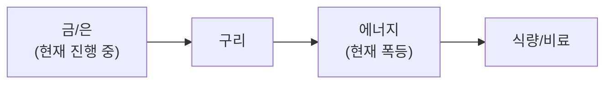

**4월 16일(수), KOSPI 6,193 신고가 근접 + TSMC Q1 $35.7B 서프라이즈 + UBS 테슬라 업그레이드 + 은행 실적 기록 + 이란 2차 협상 추진 + S&P/Nasdaq 11일 연속 신고가.** KOSPI **6,193.68(+1.68%)** — 4/15 6,148에서 추가 상승, 신고가 근접. S&P 500 **7,022.95(+0.80%)** 신기록, Nasdaq **24,016.02(+1.59%)** 신기록 — **11일 연속 강세**, 최근 15일간 **+15%**(2022-03 이후 최고). **TSMC Q1 2026 실적**: 매출 NT$1,134B(**$35.71B, +35.1% YoY**), 3월 단독 NT$415B(+45.2%) — 사상 최고. **2026 Capex $52-56B(+30%)** — 사상 최대. AI 수요 둔화 징후 전무. HBM4 advanced packaging **10%+ 투자**. **UBS 테슬라 업그레이드**: 매도→중립, 목표 **$352**, 'Physical AI' 재평가. TSLA **$391.95(+7.62%)**. FSD 유럽 네덜란드 €49-99 구독 개시(100만→1000만 목표). Q1 어닝 **4/22**. **은행 실적 서프라이즈**: JPM 순이익 **$16.5B(+13%)**, EPS $5.94, 마켓 $11.6B(+20% 사상 최대). Citi 매출 +14%, 순이익 +42%, M&A 사상 최고. Goldman 사상 최대 주식 트레이딩. 단 Dimon "복잡한 리스크" 경고. **삼성/SK하이닉스 외국인 4월 대량 매집**: 4/1-14 외국인 SK하이닉스 **2.87조**, 삼성전자 **1.96조** 순매수(합산 **4.83조**). SK하이닉스 4/14 **1.13M원 장중 52주 신고가**(110.3만 +6.06%). 두 기업 KOSPI 시총 비중 **34%→40.9%** 급등. HBM4 Samsung 언베일, NVIDIA Rubin(H2) 대비 양산 준비. **이란-미국 2차 협상 재개 추진**: 파키스탄 군지도자 **Asim Munir가 4/16 테헤란 방문**(워싱턴 메시지 전달). 4/12 Islamabad 1차 협상 **21시간 마라톤** 끝에 결렬(이란 우라늄 농축 20년 중단 거부, 5년 역제안). **4/22 휴전 만료** 임박. 이란 요구: 레바논 이스라엘 공세 중단. 사망자 **4,000+명**. VIX **18.36(-3.97%)** 추가 하락. 유가 **WTI $92 미만**(4/14 -8% 급락 지속). 금 **$4,852.40(+1.09%)** — 신고가 근접. DXY **97.97(-0.69% W)** 98 하회. 비트코인 **$74,992(+1.09%)**.

**핵심 이슈:** ①★★★ KOSPI 6,193 신고가 근접(+1.68%) ②★★★ S&P/Nasdaq 11일 연속 신고가, 15일간 +15%(2022-03 이후 최고) ③★★★ TSMC Q1 $35.71B(+35.1% YoY) + 2026 Capex $52-56B(+30%) 사상 최대 ④★★★ UBS 테슬라 업그레이드→'Physical AI' 재평가. TSLA +7.62% ⑤★★★ 은행 실적 기록: JPM $16.5B, Citi +42%, Goldman 주식 사상최대 ⑥★★★ 이란-미국 2차 협상 추진(Munir 4/16 테헤란). 4/22 휴전 만료 임박 ⑦★★★ 삼성/SK하이닉스 외국인 4.83조 순매수(4월). 시총 비중 40.9% ⑧★★ 금 $4,852 신고가 근접. DXY 97.97 ⑨★★ VIX 18.36 추가 하락→리스크-온 극대화.

<details><summary>4월 15일 이전 요약 (클릭하여 펼치기)</summary>

**4월 15일(화), KOSPI 사상 최초 6,000 돌파 + Nasdaq 10일 연속 상승 + SOXX +13.8% 주간 + Anthropic Mythos + 유가 $91.28 급락 + Meta-Broadcom 2nm AI칩.** KOSPI **사상 최초 6,000 돌파**(4/14 장중 6,026.52, 종가 5,967.75 +2.74%) → 4/15 **6,148.71(+3.03%)**. GS 타겟 7,000 → **14% 업사이드**. Nasdaq **10일 연속 상승**(2021년 이후 최장). 반도체 ETF SOXX **+13.8% 주간**(Broadcom +18%, Marvell +20%, Intel +23.8%). **Anthropic Mythos** — White House 긴급회의(Powell+Bessent+Bank CEO). 자율적 zero-day 취약점 발견/공격. 제한적 공개(Apple, Google, MS, NVIDIA, Palo Alto, CrowdStrike). 유가 WTI **$91.28(-8%)** 급락 — 이란-미국 평화 협상 재개 기대감. Meta-Broadcom **2nm AI칩** multi-year 파트너십(초기 1GW, "Personal Superintelligence" 목표). 테슬라 FSD **유럽 승인 확정**(네덜란드 RDW). DXY **98.13**(99 하회, 달러 약세 가속). 금 **$4,870.50(+2.70%)**.

<details><summary>4월 13일 이전 요약 (클릭하여 펼치기)</summary>

**4월 13일(일), 파키스탄 협상 결렬 + SpaceX IPO $2T 확정 + 트럼프 전면 봉쇄 위협.** VP Vance가 **합의 없이 파키스탄을 떠남**. 이란이 ①우라늄 농축 중단 ②호르무즈 무료 개방(통행료 없이) ③무장단체 자금 지원 중단을 **모두 거부**. 트럼프가 이란에 **"전면 해군 봉쇄"**를 위협 — 휴전→**재에스컬레이션** 리스크 급상승. SpaceX IPO **$2T**(기존 $1.75T에서 상향) 신청 확정 — **역대 최대 IPO**. 우주주 일제 급등: Firefly **+20%**, AST SpaceMobile **+12%**, Rocket Lab **+11%**(+$816M 정부 계약), Planet Labs **+10%**. 은행 실적 시즌 시작(GS, Citi, WF, JPM, MS, BofA).

<details><summary>4월 12일 이전 요약 (클릭하여 펼치기)</summary>

**4월 12일(토), 테슬라 FSD 유럽 첫 승인(네덜란드) + 이란 휴전 파키스탄 중재 + 유가 -13% 급락 + Vance 평화 협상.** 네덜란드 RDW가 테슬라 FSD Supervised를 **유럽 최초 승인** — EU 27개국 확산 + 런던/베를린 비감독 FSD 파일럿. 이란 휴전 **5일차** — 취약하지만 유지. VP Vance가 **파키스탄에서 평화 협상** 주도. 호르무즈 **부분 개방**(소수 선박만 통과). 유가 WTI ~$95.5(-13% from highs), Brent ~$96.69. 이스라엘 레바논 공습 지속으로 **휴전 위기** 상존.

<details><summary>4월 10일 이전 요약 (클릭하여 펼치기)</summary>

**4월 10일(목), VIX 19.49 급락(-7.37%) + CPI 3.3% + S&P 주간 +3%(11월 이후 최고) + DeepX 삼성 2nm + 테슬라 소형 SUV.** VIX **24.17→19.49(-7.37%)** 급락 — 위험선호 개선, 리스크-온 전환 신호. CPI 3월 MoM **+0.9%**(에너지 급등), YoY **+3.3%**. Core CPI **+0.2% MoM**, **+2.6% YoY** — 에너지 주도 인플레이나 코어는 안정. S&P 주간 **+3%**(11월 이후 최고) — 이란 휴전 + 반도체 랠리 복합 효과.

**DeepX AI 칩 + 테슬라 소형 SUV.** 한국 스타트업 DeepX, NVIDIA 대비 **전성비 20배** AI 칩 개발 — **삼성 2나노 첫 고객**, 피지컬 AI 타겟. 테슬라, 로이터 보도 — 모델Y보다 저렴한 **소형 SUV** 개발 중(중국 생산). Q1 실적 **4/22** 발표 예정.

**금 애널리스트 타겟 일제 상향.** Yardeni **$6,000**, Deutsche Bank **$6,000**, ANZ **$5,800**, Morgan Stanley **$5,700**(bull), GS **$5,400**, JPM **$4,753**(baseline). 월가 평균 **$5,180**. SK하이닉스 **이익실현 -1.79%**(전일 15% 급등 후). DRAM Q2 **+30% QoQ** 재확인. 소비자 심리 **UM 사상 최저**(전쟁+인플레 영향).

<details><summary>4월 9일 이전 요약 (클릭하여 펼치기)</summary>

**4월 9일(수), 이스라엘 레바논 대규모 공습 + 이란 호르무즈 재폐쇄 + 유가 $97 급락 + 관세 데드라인 + 인텔 테라팹 +11%.** 이스라엘이 레바논에 **10분간 100회+ 공습**, **112명 사망** — 휴전 파기 위험 급상승. 이란이 보복으로 호르무즈 해협 **유조선 통행 재차단**. 트럼프 **Section 122 기반 10% 관세 데드라인**(4/9). 인텔 **테라팹 합류**(테슬라/스페이스X/xAI, 2나노 공정 월100만 웨이퍼) — INTC **+11.42%**.

**앤트로픽 ARR $30B > 오픈AI $25B.** 앤트로픽이 오픈AI 매출 **최초 추월**. 10월 IPO $380B. 오픈AI $852B 기업가치, 역사상 최대 $122B 펀딩 라운드 완료. **GPU 공급 부족 심화** — A100조차 클라우드 확보 어려움, NVIDIA 루빈 지연 가능.

**유가 급락.** WTI **$97.62(-13%)**, Brent **$97.39**. 휴전 기대→급락했으나 이스라엘 공습+호르무즈 재폐쇄로 **불확실성 극대화**. DRAM Q2 가격 **+30% QoQ**(TrendForce: +58-63%). 외국인 **삼성전자→SK하이닉스 스위칭**, 2.5조원 순매수. 에드 야데니 **S&P 바닥 선언**(PER 23→19배).

**노보노디스크 위고비 HD 출시.** 고용량 위고비, 체중 **21% 감량** 임상. 브로드컴 **구글 TPU** 2031년까지 차세대 칩 공급 계약(+6.2%).

<details><summary>4월 8일 이전 요약 (클릭하여 펼치기)</summary>

**4월 8일(화), 이란 2주 휴전 합의 + 삼성전자 57.2조 사상 최대 + KOSPI 5,809 폭등 + SpaceX IPO 6월 로드쇼.** 트럼프 대통령이 2주간 이란 폭격 중단을 선언하고, 이란이 호르무즈 해협 완전·즉시·안전한 개방에 합의. 삼성전자 Q1 OP 57.2조원 사상 최대(+755% YoY). KOSPI 5,809(+6.58%). SpaceX IPO 6월 로드쇼, $75B 조달, $1.75T.

<details><summary>4월 7일 이전 요약 (클릭하여 펼치기)</summary>

**4월 7일(월), 이란 45일 휴전안 + 트럼프 화요일 8pm 데드라인 + 시트리니 호르무즈 수금소 + 월가 저점 베팅.** 이집트/파키스탄/터키가 **45일 휴전안** 제출. 이란: **임시 휴전 거부**, 종전만 수용. 트럼프: **"not good enough, but very significant step"** — 화요일 8pm ET 데드라인 유지. 시트리니 리서치: 호르무즈 **수금소 모델**(선별적 통제). 월가 큰손 저점 베팅(야데니/톰리/애크먼).

<details><summary>4월 6일 이전 요약 (클릭하여 펼치기)</summary>

**4월 6일(일), 트럼프 4/7 이란 딜 데드라인 + 이란 CIA 간접 접촉 + KOSPI 5,443 반등.** 트럼프: **"4/6까지 딜 가능성 높다"**(4/5 발언) + **4/7 최종 데드라인** 설정 — 미합의 시 핵심 인프라 타격 경고. 이란 정보부가 **CIA에 간접 접촉**하여 종전 조건 논의 시작. KOSPI 5,443(+1.23%) 반등. CME 동결 94.8%. 금 $4,656(GS $5,400 재확인).

<details><summary>4월 5일 이전 요약 (클릭하여 펼치기)</summary>

**4월 5일(토), 부셰르 원전+석유화학특구 폭발 + WTI $112 > Brent $109 역전 지속 + GS KOSPI 7,000 상향.** 4/4 이란 **부셰르 원전 보조건물 + 마쉬르 석유화학특구 폭발** — 핵시설·에너지 인프라 동시 타격으로 에스컬레이션 심화. WTI **$111.54 > Brent $109.03** 역전 지속(호르무즈 봉쇄 심각도 사상 최고). GS **KOSPI 타겟 7,000 상향**(기존 6,400). 시티그룹 **삼성전자 목표가 30만원**, Q1 OP **51조**(컨센서스 40.7조 대폭 상회), 연간 **310조** 전망.

**종전 임박 시그널 부상 + 미국 패권 3대 약화.** ①트럼프 지지율 **33%** 사상 최저 ②**동맹국 전면 비협조**(NATO·프랑스·폴란드·스페인·일본 참전 거부) ③패트리어트 재고 보충 **5-6년** 소요 ④유가 상승·주가 하락이 미국 내 종전 압력으로 작용. 성상현(연합뉴스): 미국 패권 **3대 약화**(산업: GDP 대비 제조업 25%→11%, 금융: 페트로달러 약화, 재정: 부채 급증) — **80년 패권 사이클** 말기 신호. 이란은 **"종전(영구적 전쟁 종료)"만 수용**, 미국의 "휴전(일시 중단)"을 거부 — 근본적 대립 구도.

**VIX 24.54 + AI 실전 검증 + 데이터센터 50% 지연.** VIX **24.54(-2.81%)**, HY스프레드 **3.17%** 안정, RRP **$0.33B** 피크 유동성. 미국 **Good Friday+주말** 휴장(4/3-5). S&P 500 **6,583(+0.11%)**, NASDAQ **21,879(+0.18%)** (4/2 종가). **AI 실전 검증**: 엔트로픽 AI + 팔란티어 위성분석으로 참수작전 수행 — AI 군사 활용 첫 실전. 미국 **데이터센터 50% 지연/취소**(전력 부족) → 변압기·전력기기 수혜. 지상군 **2만명** 쿠웨이트 도착, 항구/섬 점령 목표.

**삼성전자 어닝 서프라이즈 임박 + 금 UBS $6,200.** 시티그룹: 삼성전자 Q1 OP **51조**(블룸버그 컨센서스 40.7조 대비 **+25% 서프라이즈**), 연간 OP **310조**, 목표가 **300,000원**. SK하이닉스 DRAM 마진 **73%**, 연간 OP **168조(+240%)**. 금 **$4,651(-2.8%)** — JPM **$6,300**, GS **$5,400**, UBS **$6,200**(상위 $7,200), DB **$6,000**. BTC **$67,140(+0.31%)**.

</details>

</details>

</details>

</details>

</details>

</details>

</details>

</details>

</details>

## 6대 투자 섹터 구조

| 섹터 | 하위 섹터 | 상세 분석 |
|------|----------|----------|
| **1. 반도체/AI** | HBM, DRAM/NAND, 파운드리, 소부장, AI SW/클라우드 | [반도체 섹터](/knowledge/invest/2026/01/21/semiconductor-sector-outlook-2026.html) |
| **2. 에너지** | 원전/SMR, 재생에너지, ESS, 수소 | [에너지 섹터](/knowledge/invest/2026/03/07/energy-sector-outlook-2026.html) |
| **3. 방산/우주** | 방산, 드론/UAM, 우주/위성 | [방산/우주 섹터](/knowledge/invest/2026/03/07/defense-space-sector-outlook-2026.html) |
| **4. 모빌리티/로봇** | EV/자율주행, 로봇, 조선 | [모빌리티/로봇 섹터](/knowledge/invest/2026/01/21/automotive-robotics-sector-outlook-2026.html) |
| **5. 바이오/헬스케어** | 신약/바이오텍, GLP-1/비만치료, 의료AI | [바이오/헬스케어 섹터](#바이오헬스케어-및-생명공학) |
| **6. 자산/거시경제** | 금/은, 암호화폐, 원자재/희토류, 거시경제/정책 | [거시경제/정책 섹터](/knowledge/invest/2026/01/21/macroeconomic-policy-sector-outlook-2026.html) |

### 하위 섹터 상세 링크

**반도체/AI**
- [HBM 투자 전망](/knowledge/invest/2026/01/21/hbm-sector-outlook-2026.html)
- [DRAM/NAND 투자 전망](/knowledge/invest/2026/01/21/dram-nand-sector-outlook-2026.html)
- [파운드리 투자 전망](/knowledge/invest/2026/01/21/foundry-sector-outlook-2026.html)
- [소부장 투자 전망](/knowledge/invest/2026/01/21/semiconductor-materials-equipment-outlook-2026.html)
- [AI 소프트웨어/클라우드](/knowledge/invest/2026/03/07/ai-software-cloud-outlook-2026.html)

**에너지**
- [원전 투자 전망](/knowledge/invest/2026/01/21/nuclear-power-sector-outlook-2026.html)

**방산/우주**
- [방산 투자 전망](/knowledge/invest/2026/01/21/defense-sector-outlook-2026.html)

**모빌리티/로봇**
- [EV/자율주행 투자 전망](/knowledge/invest/2026/01/21/ev-autonomous-driving-outlook-2026.html)
- [로봇 투자 전망](/knowledge/invest/2026/01/21/robotics-sector-outlook-2026.html)
- [조선 투자 전망](/knowledge/invest/2026/01/21/shipbuilding-sector-outlook-2026.html)

**자산/거시경제**
- [원자재/희토류](/knowledge/invest/2026/03/07/commodities-rare-earth-outlook-2026.html)

---

## 미래 워치리스트

| 테마 | 현황 | 주시 포인트 |
|------|------|-----------|
| **양자컴퓨팅** | Google Willow, IBM Heron 등 진전. 상용화 초기 | 오류 정정(QEC) 돌파, 금융/제약 응용 |
| **합성생물학** | AI+유전체 편집 융합 가속 | 바이오 제조, 식량/에너지 응용 |
| **BCI (뇌-컴퓨터 인터페이스)** | Neuralink 임상시험, 경쟁사 등장 | FDA 승인, 의료 응용 확대 |
| **핵융합** | Commonwealth Fusion, TAE 등 민간 투자 확대 | 상용 발전 시점(2030년대 중반 전망) |

---

## 목차

1. [거시적 시장 환경](#거시적-시장-환경)
2. [AI 및 클라우드 컴퓨팅](#ai-및-클라우드-컴퓨팅)
3. [AI 네트워크 인프라](#ai-네트워크-인프라)
4. [반도체 및 첨단 제조](#반도체-및-첨단-제조)
5. [로보틱스 및 자율주행](#로보틱스-및-자율주행)
6. [에너지 전환 및 친환경](#에너지-전환-및-친환경)
7. [바이오헬스케어 및 생명공학](#바이오헬스케어-및-생명공학)
8. [우주산업 및 뉴스페이스](#우주산업-및-뉴스페이스)
9. [방위산업 및 국방기술](#방위산업-및-국방기술)
10. [핀테크, 암호화폐 및 STO](#핀테크-암호화폐-및-sto)
11. [사이버보안 및 데이터 인프라](#사이버보안-및-데이터-인프라)
12. [지정학적 관점: 한국은 1980년대 일본](#지정학적-관점-한국은-1980년대-일본)
13. [초거대 기업들의 전략과 투자 방향](#초거대-기업들의-전략과-투자-방향)
14. [한국 시장 구조 변화](#한국-시장-구조-변화)
15. [섹터별 투자 전략: 3월 실전 가이드](#섹터별-투자-전략-3월-실전-가이드)

---

## 거시적 시장 환경

### 글로벌 증시 현황 (4/16 기준)

| 지수 | 수준 | 변동 | 비고 |
|------|------|----------|------|
| **S&P 500** | **7,022.95** | **★★★ +0.80%** | **★★★ 신기록! 11일 연속 강세. 15일간 +15%(2022-03 이후 최고)** |
| **NASDAQ** | **24,016.02** | **★★★ +1.59%** | **★★★ 신기록! 11일 연속 강세. TSMC/테슬라 주도** |
| **Dow** | **48,463.72** | **-0.15%** | **소폭 조정. S&P·Nasdaq만 신기록** |
| **KOSPI** | **6,193.68** | **★★★ +1.68%** | **★★★ 4/16 신고가 근접! 삼성/SK 외국인 4.83조 순매수(4월). 시총비중 40.9%** |
| **원/달러** | **1,483.9원** | **-** | **원화 강세 지속. DXY 97.97 연계** |
| **WTI** | **$92 미만** | **★★ 약세 지속** | **★★ 4/14 -8% 급락 지속. Brent $94.93. 2차 협상 기대** |
| **금(Gold)** | **$4,852.40** | **+1.09%** | **★★★ 신고가 근접! DXY 97.97 약세 가속** |
| **은(Silver)** | 강세 유지 | **$100 전망 유지** | 6년 연속 공급적자 |
| **비트코인** | **$74,992** | **+1.09%** | **리스크-온 지속. $75K 임박** |
| **VIX** | **18.36** | **★★ -3.97%** | **★★ 19.12→18.36 추가 하락. 리스크-온 극대화** |
| **10Y Treasury** | **4.26%** | **-0.04** | **2Y 3.76%. 스프레드 0.53%로 소폭 확대** |
| **5Y Breakeven** | **2.61%** | **+0.03** | **CPI 3.3% YoY. Core CPI 2.6% YoY** |
| **Fed Funds** | **3.50-3.75%** | **동결** | **CME June 동결 확률 89.2%. 다음 FOMC 4/28-29** |
| **DXY** | **97.97** | **★★ -0.69% W** | **★★ 98 하회! 달러 약세 가속→금/EM 강력 지지** |
| **HY Spread** | **2.84%** | **-0.11** | **2.95%→2.84% 축소. 크레딧 완화** |
| **RRP** | **$0.223B** | **★ 사실상 제로** | **피크 유동성. 완전 소진** |
| **TGA** | **$748B** | **-** | **재정 지출 안정** |
| **M2** | **$22,667B** | **+0.88%** | **유동성 확대 지속** |
| **SOXX** | **$401.86** | **+0.15%** | **★★★ TSMC Q1 $35.71B(+35.1% YoY) 서프라이즈 반영** |
| **NVDA** | **$198.87** | **+1.2%** | **AI 칩 강세. TSMC 2026 Capex $52-56B 수혜** |
| **BOTZ** | **$36.73** | **+0.38%** | **로봇/AI 유지. UBS 테슬라 업그레이드** |
| **LIT** | **$79.64** | **-1.13%** | **배터리 소폭 약세** |
| **상하이** | **4,048.64** | **+0.53%** | **소폭 강세** |
| **항셍** | **26,306.55** | **+1.38%** | **강세 지속** |
| **XLE** | **$55.76** | **-0.34%** | **유가 약세 지속→에너지주 약세** |
| **ICLN** | **$19.53** | **-1.01%** | **클린에너지 소폭 조정** |
| **TLT** | **$86.83** | **-0.44%** | **채권 소폭 약세. 10Y 4.26%** |
| **EUR/USD** | **1.1723** | **+** | **유로 강세. DXY 97.97** |
| **USD/JPY** | **159.22** | **-** | **엔 안정** |

### 이번 주 핵심 변화 (4/16 업데이트)

| 항목 | 변화 | 투자 시사점 |
|------|------|-----------|
| **★★★ KOSPI 6,193 신고가 근접** | **4/16 6,193.68(+1.68%). 4/15 6,148→4/16 6,193. 삼성/SK 외국인 4.83조 순매수(4월)** | **★★★ GS 타겟 7,000(13% 업사이드). 구조적 강세** |
| **★★★ S&P/Nasdaq 11일 연속 신고가** | **S&P 7,022.95(+0.80%), Nasdaq 24,016(+1.59%). 15일간 +15%(2022-03 이후 최고)** | **★★★ 리스크-온 극대화. 기술주 강세 지속** |
| **★★★ TSMC Q1 $35.71B(+35.1% YoY)** | **3월 단독 $13B 사상 최고. 2026 Capex $52-56B(+30%) 사상 최대. HBM4 10%+ 투자** | **★★★ 반도체 슈퍼사이클 재확인. AI 수요 둔화 징후 전무** |
| **★★★ UBS 테슬라 업그레이드** | **매도→중립, 목표 $352. 'Physical AI' 재평가. TSLA $391.95(+7.62%)** | **★★★ 테슬라 재평가. FSD 유럽 €49-99 구독. 어닝 4/22** |
| **★★★ 은행 실적 기록** | **JPM 순이익 $16.5B(+13%), 마켓 $11.6B(+20% 사상최대). Citi +42%, Goldman 주식 사상최대** | **★★★ 리스크-온 근거. Dimon "복잡한 리스크" 경고 주시** |
| **★★★ 이란-미국 2차 협상 추진** | **파키스탄 Munir 4/16 테헤란 방문(워싱턴 메시지). 4/12 1차 21시간 결렬. 4/22 휴전 만료 임박** | **★★★ 4/22 시한. 평화→유가 하락, 결렬→반등. 방산 변동성** |
| **★★★ 삼성/SK하이닉스 외국인 대량 매집** | **4/1-14 SK 2.87조, 삼성 1.96조 순매수. SK 4/14 1.13M원 신고가. 시총비중 40.9%** | **★★★ HBM4 Samsung 언베일. NVIDIA Rubin H2 양산 준비** |
| **★★ 금 $4,852 신고가 근접** | **DXY 97.97 약세 가속(98 하회). 기관 타겟 유지** | **★★ 금/EM 강력 지지. 원화 강세 지속(1,483.9원)** |
| **★★ VIX 18.36 추가 하락** | **19.12→18.36(-3.97%). HY Spread 2.84%(-0.11) 축소** | **★★ 리스크-온 극대화. 현금 유지** |
| **★★ Fund Flow 1W** | **대만 +5.67%, 한국 +4.04%, EM +3.19%, 미국 +2.95%, 브라질 +2.27%** | **★★ EM 자금 유입 지속. 대만 TSMC 서프라이즈 반영** |

### 핵심 매크로 변수 5가지

#### 1. 이란 전쟁 Week 8+ — 2차 협상 재개 추진(파키스탄 Munir 4/16 테헤란) + 유가 $92 하회 + 4/22 휴전 만료 임박

| 항목 | 내용 | 투자 시사점 |
|------|------|-----------|
| **★★★ 이란-미국 2차 협상 재개 추진** | **파키스탄 군지도자 Asim Munir 4/16 테헤란 방문(워싱턴 메시지 전달). 4/12 Islamabad 1차 21시간 마라톤 결렬** | **★★★ 핵심 촉매. 중재자 교체—미국 직접 메시지** |
| **★★★ 1차 결렬 원인** | **이란 우라늄 농축 20년 중단 거부, 5년 역제안. 이란 요구: 레바논 이스라엘 공세 중단** | **★★ 구조적 격차 존재. 2차도 난항 가능** |
| **★★★ 4/22 휴전 만료 임박** | **Time/Axios 기준 4/22 만료. 2차 협상 결과 전 시한 도래** | **★★★ 4/22 전 합의 실패 시 재에스컬레이션** |
| **★★★ 유가 WTI $92 미만** | **4/14 -8% 급락 지속. Brent $94.93. 2차 협상 기대 반영** | **★★ 에너지 비중 10% 유지. FRED $100은 2주 지연** |
| **★★ 사망자 4,000+명** | **이란·레바논 중심. 인도주의 압력 가중** | **★★ 국제 압력 증가→평화 동력** |
| **★★★ 호르무즈 부분 개방 지속** | **15척/일 통과(정상 140척). 비대칭전 리스크 상존** | **★★ 석유화학 공급망 위기 지속이나 완화 기대** |
| **★★ 사우디 피해** | **-600K bpd 생산능력, -700K bpd 파이프라인 피해** | **★★ 공급 제약 장기화 가능** |
| **★★★ 전쟁권한법 4/28 시한** | **4/28 만료. FOMC 4/28-29 동시** | **2차 협상 + 4/22 휴전 만료 + 4/28 시한→평화 압력 증가** |
| **★★ Fed 3.50-3.75% 동결** | **CME June 동결 확률 89.2%. 다음 FOMC 4/28-29** | **동결 지속 전망** |

**핵심 판단:** 이란-미국 **2차 협상 재개** — 파키스탄 군지도자 **Munir가 4/16 테헤란 방문**(워싱턴 메시지 전달). 4/12 Islamabad 1차 협상 **21시간 마라톤** 끝에 결렬(이란 우라늄 농축 20년 중단 거부, 5년 역제안). 이란은 레바논 이스라엘 공세 중단 요구. **4/22 휴전 만료** 임박으로 시간 촉박. 유가 WTI **$92 미만** 지속(4/14 -8% 급락), Brent $94.93. 사망자 4,000+명(이란·레바논 중심)으로 인도주의 압력 가중. 호르무즈 **15척/일**(정상 140척) 부분 개방 지속. 에너지 **10%**, 방산 **19%** 유지 — 2차 협상이나 결렬 리스크로 기존 비중 유지. **4/22 → 4/28 전쟁권한법 → FOMC 4/28-29** 순으로 핵심 이벤트 집중.

#### 2. 사모신용 $265B 멜트다운 — El-Erian "전염 현상" + $2.1T 시장 2008년 이후 최대 위기

| 항목 | 내용 | 투자 시사점 |
|------|------|-----------|
| **★ Fortune $265B 멜트다운** | **월가 최대 투자 열풍이 패닉으로 전환. $2.1T 시장 2008년 이후 최대 위기** | 시스템 리스크 진행 중 |
| **★ El-Erian 경고** | **"전형적인 전염 현상" — 원하는 걸 못 팔면 팔 수 있는 걸 판다** | 다른 자산 클래스로 전이 우려 |
| **BlackRock** | **$26B 펀드 5% 환매 제한. $25M 대출 전액 손실** | 세계 1위 운용사 위기 |
| **Blackstone** | **BCRED $6.5B(7.9%) 환매 요청. 임직원 $400M 자체 투입** | 전례 없는 자구책 |
| **★ AI 담보 파괴 "SaaS-pocalypse"** | **에이전틱 AI→SaaS 구독 매출 침식. 사모 대출 포트폴리오 40%가 소프트웨어 기업** | 구조적 원인. AI 발전할수록 악화 |
| **사모신용 부도율** | **Fitch: 사모신용 부도율 사상 최고 9.2%** | 악화 가속 |
| **하이일드 스프레드** | **3.28%(+3.47%) — 신용 스프레드 확대 지속** | 전이 신호 |

**판단:** Fortune이 **"$265B 멜트다운"**으로 보도, El-Erian이 **"전형적인 전염 현상"** 경고. Fitch 부도율 **9.2% 사상 최고**. 핵심 원인은 AI(에이전틱 AI)가 SaaS 기업 담보 가치를 구조적으로 파괴하는 **"SaaS-pocalypse"** — 사모 대출 포트폴리오의 **40%가 소프트웨어 기업**. 그러나 HY스프레드 **3.28%(-5.2%)로 축소** 전환 — 신용 리스크 완화 시그널. **금융주 경계 유지**하되 공포 피크는 지난 것으로 판단.

#### 3. KOSPI 6,193(+1.68%) — ★★★ 신고가 근접 + 삼성/SK하이닉스 외국인 4.83조 대량 매집

| 항목 | 내용 | 투자 시사점 |
|------|------|-----------|
| **★★★ KOSPI 6,193 신고가 근접** | **4/14 5,967.75→4/15 6,148.71→4/16 6,193.68(+1.68%). 연속 신고가** | **★★★ GS 타겟 7,000(13% 업사이드). 구조적 강세** |
| **★★★ 삼성/SK하이닉스 외국인 매집** | **4/1-14 SK하이닉스 2.87조, 삼성전자 1.96조 순매수. 합산 4.83조** | **★★★ 메모리 슈퍼사이클 베팅. 글로벌 재평가 진행** |
| **★★★ SK하이닉스 신고가** | **4/14 장중 1,130,000원 52주 신고가(110.3만 +6.06%)** | **★★★ HBM 62% 점유. UBS HBM4 70%** |
| **★★★ 시총비중 40.9%** | **삼성+SK 합산 KOSPI 시총 비중 34%→40.9% 급등** | **★★★ KOSPI 반도체 의존도 사상 최고** |
| **★★★ HBM4 Samsung 언베일** | **NVIDIA Rubin(H2) 대비 양산 준비. 삼성 HBM4 PRA 완료** | **★★★ 삼성 HBM 경쟁 복귀** |
| **★★ TSMC Q1 $35.71B 서프라이즈** | **+35.1% YoY. 3월 단독 $13B 사상최고. AI 수요 둔화 징후 전무** | **★★★ 반도체 생태계 전반 강세 확인** |
| **★★ WGBI 편입** | **선진국 채권지수 편입 확정. 74조원 채권 유입(8회 분할). 원화 강세** | **구조적 매수 촉매. 코리아 디스카운트 해소** |
| **★★ 환율 1,483.9원** | **원화 강세. WGBI 편입+달러 약세(DXY 97.97)** | **원화 강세 + 외국인 자금 유입 가속** |

**판단:** KOSPI **6,193.68(+1.68%)** — 4/14 5,967.75 → 4/15 6,148.71 → 4/16 6,193.68, 연속 신고가. 삼성전자 + SK하이닉스 외국인 **4월 1-14 합산 4.83조** 순매수(SK 2.87조, 삼성 1.96조). SK하이닉스 **4/14 1,130,000원 52주 신고가**(장중 +6.06%). 두 기업 KOSPI 시총 비중 **34%→40.9%** 급등 — KOSPI 반도체 의존도 사상 최고. HBM4 **Samsung 언베일**로 NVIDIA Rubin(H2) 양산 준비. **TSMC Q1 $35.71B(+35.1% YoY)** 서프라이즈가 반도체 생태계 전반 강세 확인. GS 타겟 **7,000**(13% 업사이드). 환율 **1,483.9원** 원화 강세(DXY 97.97 달러 약세 효과). **6,000~6,500** 신규 구간 진입. SK하이닉스 실적(4/27) + 테슬라 어닝(4/22)이 다음 촉매.

#### 4. TSMC Q1 $35.71B 서프라이즈 + HBM4 양산 경쟁 — 반도체 슈퍼사이클 재확인

| 항목 | 내용 | 투자 시사점 |
|------|------|-----------|
| **★★★ TSMC Q1 2026 매출** | **NT$1,134B($35.71B, +35.1% YoY). 3월 단독 NT$415B(+45.2%) 사상 최고** | **★★★ AI 수요 둔화 징후 전무. 파운드리 독점** |
| **★★★ TSMC 2026 Capex** | **$52-56B(+30%) 사상 최대. HBM4 advanced packaging 10%+ 투자** | **★★★ 반도체 생태계 설비투자 급증→소부장 수혜** |
| **★★★ HBM 전량 매진 불변** | **2025-2026 전 용량 계약 완료. NVIDIA $65B 가이던스 불변. 글로벌 $975B(+25%)** | **★★★ 슈퍼사이클 펀더멘털 강화** |
| **★★★ HBM4 Samsung 언베일** | **NVIDIA Rubin(H2) 대비 양산 준비. 삼성 HBM4 경쟁 복귀** | **★★★ HBM4 양산 경쟁 심화. SK/삼성 병행 수혜** |
| **★★★ SK하이닉스 외국인 매집** | **4월 1-14 2.87조 순매수. 4/14 장중 1,130,000원 52주 신고가** | **★★★ 구조적 재평가. HBM 62% 점유 프리미엄** |
| **★★★ Micron $700 목표 유지** | **Cantor Fitzgerald 탑 픽 유지. DRAM Q2 +30% QoQ 재확인** | **구조적 강세 불변** |
| **★★ NVDA $198.87(+1.2%)** | **SOXX $401.86(+0.15%). TSMC 서프라이즈 반영** | **AI 칩 강세 유지. Vera Rubin H2** |
| **★★ UBS 테슬라 'Physical AI'** | **매도→중립, 목표 $352. TSLA +7.62%. FSD 유럽 €49-99 구독** | **Physical AI 재평가→AI 칩 수요 추가 확대** |

**핵심 판단:** **TSMC Q1 $35.71B(+35.1% YoY)** 서프라이즈 — 3월 단독 **$13B 사상 최고**. **2026 Capex $52-56B(+30%)** 사상 최대, HBM4 advanced packaging **10%+ 투자**. AI 수요 둔화 징후 **전무** 확인. HBM 전량 매진 + NVIDIA $65B 가이던스 불변. **삼성 HBM4 언베일**로 NVIDIA Rubin(H2) 양산 준비 — SK/삼성 병행 수혜 구도. SK하이닉스 외국인 4월 **2.87조** 매집, 4/14 **신고가 1,130,000원**. UBS 테슬라 **'Physical AI'** 재평가(+7.62%)가 AI 칩 수요 추가 확대 신호. 반도체 **27% 유지** — TSMC 실적으로 슈퍼사이클 재확인, 조정 시 매수 기회.

#### 5. 금 $4,852(+1.09%) — 신고가 근접 + DXY 97.97 약세 가속 + 기관 타겟 유지

| 항목 | 현황 | 변화 |
|------|------|------|
| **★★★ 금 $4,852.40(+1.09%)** | **신고가 근접! 4/15 $4,870→4/16 $4,852 소폭 조정이나 고점권 유지** | **DXY 약세 지속→금 강세 구조** |
| **★★★ 기관 타겟** | **JPM $6,300, GS $5,400, UBS $6,200(상위 $7,200), DB $6,000, Yardeni $6,000, ANZ $5,800, MS $5,700** | **30~45% 업사이드. 구조적 강세 확인** |
| **★★★ DXY 97.97(-0.69% W)** | **★★ 98 하회! 달러 약세 가속. EUR/USD 1.1723** | **달러 약세→금 강세 구조 강화. EM/원화 지지** |
| **★★ 지정학 불확실성** | **이란 2차 협상 추진이나 4/22 휴전 만료 리스크. Munir 4/16 테헤란** | **안전자산 수요 지속** |
| **★★ Fed 3.50-3.75% 동결** | **CME June 동결 확률 89.2%. 다음 FOMC 4/28-29** | **동결 지속→금 지지** |
| **★★ 5Y Breakeven 2.61%** | **+0.03. Core CPI 2.6% YoY** | **인플레 기대 안정→금 장기 지지** |
| **★ 페트로위안 구조적 촉매** | **이란 위안화 + 사우디 비갱신. 80년 패권 사이클 말기** | **구조적 전환. 금 최대 수혜** |

**판단:** 금 **$4,852.40(+1.09%)** 신고가 근접 — 4/15 $4,870 고점권 유지. DXY **97.97**(98 하회) 달러 약세 가속이 핵심 동력. 기관 타겟: JPM **$6,300**, UBS **$6,200**(상위 $7,200), DB **$6,000**, Yardeni **$6,000**, ANZ **$5,800**, MS **$5,700**, GS **$5,400** — 30~45% 업사이드. 지정학 불확실성(이란 2차 협상 + 4/22 휴전 만료)→안전자산 수요 지속. **금 8% 유지**, $4,700↓ 조정 시 적극 매수.

### 관세 현황 -- Section 122 15% 발효 중 (7/23 만료)

| 관세 | 세율 | 상태 | 비고 |
|------|------|------|------|
| **글로벌 보편관세** | **15%** | **발효 중** (2/24~) | **150일 한시** (7/23 만료) |
| **★ Section 122 10% 관세** | **10%** | **4/9 데드라인 경과** | **트럼프 관세 데드라인 경과. 후속 조치 모니터링** |
| **중국 관세** | **35~50%** | USTR 유지 | 트럼프 방중 완료 |
| **반도체** | 25%+ | **Section 232 유지** | 별도 법적 근거 |
| **자동차** | **25%** | **발효 중** (4/3~) | **현대/기아 직접 타격** |
| **철강/알루미늄** | 25% | **Section 232 유지** | 3/12 발효 |

---

## AI 및 클라우드 컴퓨팅

### 현재 상황 (4월 16일 — TSMC Q1 $35.71B 서프라이즈 + UBS 테슬라 'Physical AI' 업그레이드 + HBM4 Samsung 언베일)

**★★★ TSMC Q1 $35.71B(+35.1% YoY)**: 3월 단독 NT$415B(+45.2%) 사상 최고. **2026 Capex $52-56B(+30%)** 사상 최대. HBM4 advanced packaging **10%+ 투자**. AI 수요 둔화 징후 **전무** — AI 칩/파운드리 독점. **UBS 테슬라 업그레이드**: 매도→중립, 목표 $352, 'Physical AI' 재평가. TSLA **$391.95(+7.62%)**. FSD 유럽 €49-99 구독(네덜란드), 100만→1000만 목표. Q1 어닝 **4/22**. **HBM4 Samsung 언베일**: NVIDIA Rubin(H2) 대비 양산 준비. SK/삼성 병행 수혜. 앤트로픽 ARR **$30B** > 오픈AI $25B. 10월 IPO **$380B** 목표. HBM **2025-2026 전량 매진** 불변. NVIDIA **$65B** 가이던스 불변. 빅테크 AI CAPEX **~$700B**(+60%). SOXX **$401.86(+0.15%)**, NVDA **$198.87(+1.2%)**. 삼성/SK하이닉스 외국인 4월 **4.83조** 순매수(시총비중 40.9%).

| 기업 | 2026 AI CAPEX | 핵심 이슈 |
|------|--------------|---------|
| **Amazon** | **$2,000억** | FCF 마이너스 전환 전망 |
| **Alphabet** | **$1,850억** | FCF 90% 감소 전망 |
| **Microsoft** | **$1,450억** | Azure AI 확대 |
| **Meta** | **$1,350억** | FCF 90% 감소 전망 |
| **합계** | **$6,500~7,000억** | 전년 대비 **+60% 이상** |

### 핵심 투자 포인트

| 영역 | 내용 | 전망 |
|------|------|------|
| **AI 칩셋** | 엔비디아 시총 ~$4.31조 | **GTC 진행: $1T 주문, Vera Rubin 10x, Eaton 전력 파트너십** |
| **커스텀 ASIC** | **Broadcom AI $8.4B(+74%)**, **Marvell $0→$1.5B** | 2026년 GPU 출하량 추월 전망 |
| **클라우드 인프라** | AWS, Azure, GCP | $7,000억 투자 직접 수혜 |
| **AI 응용** | CRM, 헬스케어, 금융 AI | 하드웨어 실적 파티 vs 소프트웨어 수익화 미완 |

### 4월 투자 전략

**단기**: NVIDIA Q4 **$65B** 가이던스로 수요 확인. HBM **전량 매진**. 삼성·SK하이닉스 역대급 반등 — **매수 유지**. SpaceX IPO SEC 제출 → **유동성 흡수 리스크** 주의.

**중기**: 에이전틱 AI 시장 **$8B→$215B(2035)**. AI 에이전트가 일자리 파괴 + 인프라 수요 폭증의 **이중 구조**. H2 **IPO 러시**(Anthropic, OpenAI, SpaceX) 기대.

**리스크**: ①유가 $100+→데이터센터 전력비 상승, ②AI 칩 수출통제, ③SpaceX IPO 유동성 흡수.

### 주요 기업 및 ETF

**대표 기업:**
- 엔비디아 (NVDA): **$198.87(+1.2%)**. Q4 가이던스 $65B. Vera Rubin + Feynman. TSMC Capex $52-56B 수혜
- **TSMC (TSM)**: **★★★ Q1 $35.71B(+35.1% YoY)**, 3월 $13B 사상최고, 2026 Capex $52-56B(+30%) 사상 최대
- **AMD (AMD)**: MI455X + Helios — Meta 6GW + OpenAI 6GW = **12GW 계약**
- **Broadcom (AVGO)**: AI 매출 **$8.4B(+74%)**, 구글 TPU 2031년 계약, Meta 2nm 파트너십
- **Marvell (MRVL)**: ASIC 매출 **$0→$1.5B**
- **인텔 (INTC)**: **테라팹 합류**(테슬라/스페이스X/xAI, 2나노, 월100만 웨이퍼)

**투자 ETF:**
- BOTZ (Global X Robotics & AI ETF)
- ROBO (ROBO Global Robotics & Automation Index ETF)

---

## AI 네트워크 인프라

### 핵심 테마: 데이터센터 ROI의 열쇠

$700B 규모의 AI 데이터센터 투자에서 **네트워크 인프라는 ROI를 결정짓는 핵심 요소**입니다.

### InfiniBand vs Ethernet 경쟁

| 기술 | 대표 기업 | 특징 |
|------|----------|------|
| **InfiniBand** | 엔비디아 (Mellanox) | 현재 AI 학습 표준, 저지연 |
| **Ethernet (AI용)** | Arista Networks, Broadcom | 범용성 우수, 비용 효율적 |

### ★ CPO(Co-Packaged Optics) — 2026년 월가 TOP1 테마

**구리선의 물리적 한계**: 224G SerDes 환경에서 구리 전송 거리가 **50cm까지 축소**. 스킨 이펙트로 열과 전력 소모 급증. **CPO가 유일한 대안** — 광통신 모듈을 칩 패키지에 통합하여 전기→광 신호 변환.

| 항목 | 내용 |
|------|------|
| **시장 성장** | **2026년 양산 시작, 연간 137% 성장** |
| **NVIDIA** | Spectrum-X Photonics (Ethernet CPO) **H2 2026 출시**, Quantum-X IB 115Tb/s |
| **Marvell** | 광통신 포토닉 패브릭스, AEC, DSP, 커스텀 칩. **고점 대비 -30% 저평가** |
| **Credo** | AEC 리타이머, CPO 핵심 부품 |
| **Corning** | 광섬유 소재 공급 |

### 대역폭 에스컬레이션

```
현재: 400G
진행중: 800G
2026-2027: 1.6T (CPO 양산 시작)
2028+: 3.2T
```

각 세대 전환마다 **광트랜시버, 스위치, 광케이블** 수요가 2배씩 증가. **CPO가 1.6T 이상에서 필수 기술**.

### 핵심 투자 기업

| 기업 | 분야 | 핵심 강점 |
|------|------|----------|
| **Arista Networks** | 데이터센터 스위칭 | AI 데이터센터 네트워킹 1위 |
| **Coherent** | 광트랜시버 | 시장 점유율 1위, 800G/1.6T 리더 |
| **Lumentum** | 광학 부품 | 레이저, 광부품 핵심 공급 |
| **Broadcom** | 네트워크 칩 + ASIC | AI 네트워크 + 커스텀 ASIC, **AI $8.4B(+74%)**. **★ 구글 TPU 2031년 계약(+6.2%)** |

---

## 반도체 및 첨단 제조

### 핵심 이벤트: TSMC Q1 $35.71B(+35.1% YoY) + HBM4 Samsung 언베일 + SK하이닉스 외국인 2.87조 매집 + NVDA $198.87

**★★★ TSMC Q1 2026 매출 $35.71B(+35.1% YoY)**: NT$1,134B. 3월 단독 NT$415B(+45.2%) 사상 최고. **2026 Capex $52-56B(+30%)** 사상 최대, HBM4 advanced packaging **10%+ 투자**. AI 수요 둔화 징후 전무. **HBM4 Samsung 언베일** — NVIDIA Rubin(H2) 대비 양산 준비. SK/삼성 병행 수혜. **SK하이닉스 외국인 4월 2.87조**, 삼성전자 **1.96조** 순매수(합산 4.83조). SK하이닉스 **4/14 장중 1,130,000원 52주 신고가**. 두 기업 KOSPI 시총 비중 **34%→40.9%**. NVDA **$198.87(+1.2%)**. DRAM Q2 가격 +30% QoQ 인상(TrendForce: +58-63% QoQ). 삼성전자 Q1 OP 57.2조원 사상 최대(+755% YoY). SK하이닉스 DRAM 마진 **73%**. NVIDIA Q4 가이던스 **$65B**. HBM **2025-2026 전량 매진**. 글로벌 반도체 **$975B(+25%)**, $1T 임박. SOXX **$401.86(+0.15%)**, BOTZ **$36.73(+0.38%)**.

| 항목 | 내용 | 투자 시사점 |
|------|------|-----------|
| **★★★ TSMC Q1 $35.71B 서프라이즈** | **+35.1% YoY. 3월 $13B 사상최고. 2026 Capex $52-56B(+30%) 사상 최대** | **★★★ 반도체 생태계 전반 강세 재확인** |
| **★★★ HBM4 Samsung 언베일** | **NVIDIA Rubin(H2) 대비 양산 준비. PRA 완료** | **★★★ SK/삼성 병행 수혜. HBM4 경쟁 본격화** |
| **★★★ HBM 전량 매진** | **2025-2026 전 용량 계약 완료. 가격 상승 지속** | **슈퍼사이클 확정. 구조적 강세** |
| **★★★ NVIDIA Q4 $65B** | **FY2026 Q4 가이던스 $65B. AI CAPEX $700B+ 직접 수혜** | **AI 칩 수요 가속 확인** |
| **★★★ Micron $700 목표** | **Cantor Fitzgerald 탑 픽. DRAM 현물 하락은 B2C(5%) 한정** | **구조적 강세. 과잉 우려 불필요** |
| **★★★ SK하이닉스 외국인 2.87조** | **4월 1-14 누적. 4/14 1,130,000원 52주 신고가(장중 +6.06%)** | **★★★ 글로벌 재평가. HBM 62% 점유** |
| **★★★ 삼성전자 외국인 1.96조** | **4월 1-14 누적. HBM4 언베일. 경쟁 복귀 신호** | **★★ 저PER 반등. HBM4 경쟁 본격화** |
| **★★★ DRAM Q2 +30% QoQ** | **TrendForce: +58-63% QoQ 인상. 메모리 슈퍼사이클 확인** | **삼성·SK하이닉스 추가 실적 상향** |
| **★★ 시총비중 40.9%** | **KOSPI 삼성+SK 합산 시총 비중 사상 최고** | **KOSPI 반도체 의존도 사상 최고** |
| **★★ TeraFab $25B** | **Tesla+SpaceX+xAI+Intel. 2nm. 80% 우주/20% 지상** | **머스크 반도체 자급** |
| **★ CPO 양산 시작** | 2026년 변곡점, 연간 137% 성장 | AI 네트워크 핵심 |
| **반도체 $975B** | **+25% YoY. 메모리 +30%. $1T 임박** | 기가사이클 가속 |

### 한국 메모리의 기가사이클

**SK하이닉스 HBM 시장 점유율 62%**로 압도적 1위. **삼성은 HBM4 PRA 완료**로 양산 본격화 임박.

핵심 포인트:
- **SK하이닉스**: HBM 62% 점유, 16단 48GB HBM4 공개
- **삼성 HBM4 PRA 완료**: 세계 최초 양산 출하, 대역폭 3.3TB/s
- **DRAM Q1 +90~95%**: 역사적 기록. **Q2 +30% QoQ**(TrendForce: +58-63%)
- **SIA $1T**: 2026년 글로벌 매출 $1조 돌파 전망

### 4월 투자 전략

**핵심 전략: HBM 전량 매진 + 반도체 역대급 반등 + 슈퍼사이클 가속**

1. **삼성전자**: 190,000원(+14%) 반등. HBM4 양산. **저PER에서 반등 시작**.
2. **SK하이닉스**: 901,500원(+10%). HBM 50%+ 점유, ADR 추진. **글로벌 재평가**.
3. **Micron**: Cantor $700 목표, 탑 픽. DRAM 현물 하락은 B2C 한정. **적극 매수**.
4. **엔비디아**: Q4 $65B 가이던스. Vera Rubin + Feynman.
5. **소부장**: 한미반도체, HPSP, 리노공업 — 설비투자 70조 낙수효과.

### 주요 기업

| 카테고리 | 주요 기업 | 현황 |
|----------|----------|------|
| **AI 칩** | 엔비디아, AMD | GTC 3/16~19, SOXX +3.98% |
| **파운드리** | TSMC, 삼성전자 | TSMC N2 램프 |
| **메모리** | 삼성전자, SK하이닉스 | SK 62% HBM, DRAM Q1 +95% |
| **커스텀 ASIC** | Broadcom, Marvell | Broadcom AI $8.4B(+74%) |
| **소부장** | 한미반도체, HPSP, 리노공업 | 고수익성 지속 |
| **장비** | ASML, 램리서치 | ASML 분기 주문 EUR132억 기록 |

**ETF:**
- SMH (VanEck Semiconductor ETF)
- SOXX (iShares Semiconductor ETF) — **$401.86(+0.15%)**

---

## 로보틱스 및 자율주행

### 현재 상황: UBS 테슬라 업그레이드 + TSLA +7.62% + FSD 유럽 구독 + Cybercab 양산

| 항목 | 내용 | 시사점 |
|------|------|--------|
| **★★★ UBS 테슬라 업그레이드** | **매도→중립, 목표 $352. 'Physical AI' 재평가. TSLA $391.95(+7.62%)** | **★★★ 구조적 재평가. AI 칩 수요 추가 확대** |
| **★★★ FSD 유럽 구독 개시** | **네덜란드 €49-99 구독. 100만→1000만 목표. Q1 어닝 4/22** | **★★★ 구독 매출 가속. 유럽 27개국 확산** |
| **★★★ 옵티머스 Gen3 실물 공개** | **매쉬 소재 다이빙 슈트형 외피. $20K 목표가. FSD 컴퓨터 탑재 확인** | **양산형 디자인 확정. 여름 생산** |
| **★★★ 로봇 안보법(ASRA) 발의** | **미 상원 초당적. 중국 로봇 연방정부 사용 금지. 데이터 주권 보호** | **★ 테슬라 독점 강화. 중국 로봇 퇴출** |
| **★★ FSD→로봇 이식** | **89억 마일 실주행 데이터→옵티머스 공간인지. 복제 불가능한 경쟁력** | **자동차-로봇 신경망 통합** |
| **★★ Waymo 20도시·주100만회** | **2026년 20개 도시 확장. 주 100만 라이드 목표** | 자율주행 상용화 본격화 |
| **★ 중국 로봇 한계 노출** | **샤오펑 아이언 로봇 시연 중 넘어짐. 균형 제어 한계** | **테슬라 기술 우위 확인** |
| **양산 목표** | 프리몬트 연간 100만 대, **기가텍사스 연간 1,000만 대** | <$20K, 소프트웨어 구독 $200/월 |
| **★★★ 사이버캡 4월 양산 시작** | **기가텍사스 양산 개시. 연간 2-4M 목표. $25K-30K. FSD 14.3 배포** | **로보택시 현실화. 웨이모 압도** |
| **★★★ FSD 14.3 광범위 배포** | **활성 FSD 구독 1.1M(+38% YoY). NHTSA 조사 확대(320만 차량)** | **구독 매출 급증. 규제 리스크 주시** |
| **AV 시장 $39.3B** | **2026년 글로벌 AV 시장 $39.3B. 4.3만 대** | 급성장 초입 |
| **Zoox+Uber** | **Zoox, Uber 자율주행 라이드 서비스 2026년 출시** | 경쟁 가속 |
| **★ X머니 4월 출시** | **비자 제휴, 메탈 카드, 탭투페이**. FSD/로보택시/에너지 결제 통합 | 테슬라 생태계 수익화 |
| **중국 로봇 90% 점유** | 중국 기업들이 글로벌 판매량 90%+ 장악 | 경쟁 리스크 주의 |
| **자동차 관세 25%** | 4/3 발효 예정 | 현대/기아 직접 타격 |
| **★★★ 테슬라 소형 SUV** | **로이터: 모델Y보다 저렴한 소형 SUV 개발 중. 중국 생산. 전략 변경 신호** | **EV 대중화 가속. Q1 실적 4/22** |
| **★★★ DeepX 피지컬 AI** | **NVIDIA 대비 전성비 20배 AI 칩. 삼성 2나노 첫 고객. 피지컬 AI 타겟** | **로봇/자율주행 AI 칩 혁신. 비상장(삼성 파운드리 수혜)** |

### 한국 로봇 섹터

- 두산로보틱스: 협동 로봇 리더
- 레인보우로보틱스: 휴머노이드 로봇 개발
- 현대차/보스턴다이나믹스: 기업가치 ~55조원
- **주의**: 중국 휴머노이드 로봇 **87-90%** 점유 — 경쟁 리스크 최대

**ETF:**
- BOTZ (Global X Robotics & AI ETF)
- ROBO (ROBO Global Robotics & Automation Index ETF)

---

## 에너지 전환 및 친환경

### 유가 $92 하회 지속 + 이란 2차 협상 추진(Munir 4/16 테헤란) + 4/22 휴전 만료 임박

| 항목 | 내용 |
|------|------|
| **★★★ WTI $92 미만(실시간)** | **★★★ 4/14 -8% 급락 지속. Brent $94.93. 2차 협상 기대 반영** |
| **★★★ 이란-미국 2차 협상 추진** | **파키스탄 Munir 4/16 테헤란 방문(워싱턴 메시지). 1차 21시간 마라톤 결렬** |
| **★★ 4/22 휴전 만료 임박** | **Time/Axios 기준 4/22 만료. 2차 협상 결과 전 시한 도래** |
| **★★ 사망자 4,000+명** | **이란·레바논 중심. 인도주의 압력 가중** |
| **★★ CPI MoM +0.9%** | **YoY +3.3%. 유가 하락 시 CPI 완화 기대** |
| **★★★ EV +172% 폭등** | **한국 EV 등록 +172% 역대 최대. 유럽 폭증(프랑스+203%)** |
| **★★ XLE $55.76(-0.34%)** | **유가 약세 지속→에너지주 약세. 에너지 비중 10% 유지** |
| **★★ 전쟁권한법 4/28 시한** | **4/28 만료. 4/22 휴전 → 4/28 시한 순차 이벤트** |
| **★★ ICLN $19.53(-1.01%)** | **클린에너지 소폭 조정. 유가 약세 영향** |
| **★★ 2차전지·ESS 유지** | **ESS 40%+ 성장. LIT $79.64(-1.13%)** |
| **미국 원전 $80B** | 신규 원전 펀딩, AI 데이터센터 전력 수요 |

### 에너지 시나리오 (4/16 기준 — 이란 2차 협상 추진 + 유가 $92 하회 + 4/22 휴전 만료)

| 시나리오 | 유가 전망 | 확률 | 영향 |
|---------|----------|------|------|
| **2차 협상 타결→휴전 연장** | **$80~95** | **★★★ 최고 (40%)** | **Munir 중재 + 4/28 시한 압력. $92 현수준 유지~하락** |
| **현상 유지(휴전 잠정 연장, 협상 진행)** | **$85~100** | **★★ (30%)** | **4/22 휴전 만료 전 잠정 연장. 불확실성 지속** |
| **재에스컬레이션(2차 결렬+봉쇄 강화)** | **$120~160** | **하락 (20%)** | **1차처럼 2차도 결렬 시. 호르무즈 전면 차단** |
| **완전 종전** | **$65~80** | **저 (10%)** | **이란 우라늄 농축 합의+봉쇄 완전 해제** |

**시나리오 변화:** 이란-미국 **2차 협상 추진**(파키스탄 Munir 4/16 테헤란 방문)으로 유가 WTI **$92 미만** 약세 지속. 1차 협상은 21시간 마라톤 끝에 결렬(이란 우라늄 농축 20년 중단 거부, 5년 역제안). **4/22 휴전 만료** 임박으로 시간 촉박. 사망자 4,000+명으로 인도주의 압력 가중. 호르무즈 **15척/일**(정상 140척) 부분 개방 지속. **에너지 10% 유지**(평화 기대이나 2차 결렬 리스크 대비). 원전은 AI 전력 수요로 구조적 강세 유지. 4/22 휴전 만료가 다음 핵심 변곡점.

### 핵심 하위 섹터

#### 원전 (Nuclear Renaissance) -- 에너지 안보 + AI 전력 수요

AI 데이터센터 전력 수요 + 이란 전쟁 에너지 안보 + 탈탄소 정책 삼중 호재.

| 항목 | 내용 | 투자 시사점 |
|------|------|-----------|
| **우라늄** | +32% YoY | 구조적 공급 부족 |
| **i-SMR 규제심사 착수** | 한국 SMR 규제 프로세스 시작 | 상용화 가시화 |
| **미국 $80B 신규 원전** | NuScale SMR 규제 승인 | 원전 르네상스 가속 |
| **KHNP 태국·필리핀** | 원전 수출 파이프라인 확대 | K-원전 해외 수주 |

#### 배터리/ESS -- 2차전지 강세 + ESS 40%+ 성장 + 희토류 탈중국

**2차전지 신고가 + ESS 폭발적 성장.** LG에너지솔루션·LNF **신고가** 기록. 글로벌 ESS 설치 **40%+ 성장** 전망. LG에솔 **140GWh 수주잔고**(북미 그리드+데이터센터). 매출 **15~20% 성장** 가이던스(ESS 주도). 글로벌 EV 성장률 **40%+**, 미국 **200%** 성장(한경TV). **희토류 탈중국** — LS에코에너지·JS링크가 호주 라이너스와 전략적 파트너십.

| 항목 | 내용 | 투자 시사점 |
|------|------|-----------|
| **★★ ESS 40%+ 성장** | **LG에솔 ESS 140GWh 수주잔고. 그리드+데이터센터+유틸리티** | **ESS=배터리 핵심 성장 엔진** |
| **★★ LG에솔·LNF 신고가** | **ESS 주도 매출 성장 15~20%. EV 둔화를 ESS가 상쇄** | **2차전지 반등 본격화** |
| **★ 희토류 탈중국** | **LS에코에너지+라이너스(호주). 전략적 공급망 구축** | **희토류 밸류체인 투자 기회** |
| **추천 종목** | **LG에너지솔루션(ESS 비중 최대), LNF(하이니켈+테슬라), 포스코퓨처엠** | **ESS 비중 높은 기업 우선** |

### 투자 ETF

- ICLN (iShares Global Clean Energy) — **$19.53(-1.01%)**
- LIT (Global X Lithium & Battery Tech) — **$79.64(-1.13%)**
- URA (Global X Uranium ETF)

---

## 바이오헬스케어 및 생명공학

### 스태그플레이션 방어 + GLP-1 경쟁 구도 변화

오일 쇼크 + 스태그플레이션 환경에서 **방어적 헬스케어 매력도 상승**.

### 핵심 투자 포인트

#### GLP-1 비만 치료제

| 기업 | 현황 | 전망 |
|------|------|------|
| **Eli Lilly (LLY)** | GLP-1 시장 지배, EPS $35 전망(2026) | Mounjaro/Zepbound 선도 |
| **Novo Nordisk (NVO)** | **★ 위고비 HD 출시! 고용량, 체중 21% 감량 임상** | 저평가 반전 모멘텀 |
| **Viking Therapeutics** | 2상 결과 13주 14.7% 체중 감량 | 신규 경쟁자 |

#### AI 신약 개발

- 엑셀런시아, 리커전: AI 기반 약물 발견
- 빅테크 진출: 구글 DeepMind, 아마존 헬스케어

### 투자 ETF

- XBI (SPDR S&P Biotech ETF)
- IBB (iShares Biotechnology ETF)
- ARKG (ARK Genomic Revolution ETF)

---

## 우주산업 및 뉴스페이스

### 현재 상황: SpaceX IPO $2T 확정 + 우주주 일제 급등 + 아르테미스 2 성공

| 기업/영역 | 내용 | 전망 |
|----------|------|------|
| **★★★ SpaceX IPO $2T 확정** | **$1.75T→$2T 상향 신청. 역대 최대 IPO. 6/8주 로드쇼. MS·BofA·Citi·JPM·GS 주관** | **★★★ 우주=메인스트림. 섹터 업그레이드** |
| **★★★ 우주주 일제 급등** | **Firefly +20%, AST SpaceMobile +12%, Rocket Lab +11%(+$816M 정부 계약), Planet Labs +10%** | **★★★ SpaceX IPO 효과 확산** |
| **★★★ 아르테미스 2** | **4/2 발사 성공(54년 만 달 유인 탐사). 4명 승무원 달 궤도. 4/11 귀환** | **우주 관련주 급등** |
| **★★ Starlink 매출** | **$18.7B(2026) 전망. 급성장** | **IPO 핵심 가치** |
| **★★ EchoStar** | **위성 통신 기업. SpaceX IPO 수혜 기대** | **소수몽키 추천. 위성 통신 핵심** |
| **★★ Rocket Lab (RKLB)** | **소형 위성 발사. +$816M 정부 계약. +11%** | **발사 서비스 2위. 정부 계약 대형** |
| **★★ Planet Labs (PL)** | **지구 관측 위성. Google 파트너십. +10%** | **소수몽키 추천. 데이터 사업** |
| **★★ MDA Space** | **위성 서비스 로봇. 궤도 서비스 기술** | **소수몽키 추천. 위성 서비스 독점** |
| **★ ACE US Space Tech ETF** | **2026년 4월 출시. 우주 기술 액티브 ETF** | **한국 투자자용 우주 ETF** |
| 한화에어로스페이스 | K-방산/우주 대표주 | 수주잔고 100조+ |

### SpaceX IPO 유동성 리스크

**$2T 밸류에이션**으로 역대 최대 IPO. 소매 투자자 **30% 배정**은 기존 주식 매도→SpaceX 청약 전환 유발 가능. 트럼프 행정부 **FY2027 국방비 $1.5조 제안**에서 우주 최우선. 아르테미스 2 성공 + 우주주 일제 급등으로 **우주=메인스트림** 전환 확인.

**투자 ETF:**
- UFO (Procure Space ETF)
- ARKX (ARK Space Exploration ETF)

---

## 방위산업 및 국방기술

### 현재 상황: $1.01T 예산(+13.4%) + 억만장자 $28B 증가 + 4배 증산 + ITA +14% YTD

방산이 2026년 최대 수혜 섹터. 미국 FY2026 **$1.01T 예산(+13.4%)**. 방산 억만장자 자산 3개월 만에 **$28B 증가**. **6대 미국 방산사 무기 4배 증산 서약**. Rheinmetall **매출 40-45% 성장**. 글로벌 CAPEX **+38%**. AI·사이버·우주·미사일 방어에 투자 집중.

| 항목 | 내용 | 시사점 |
|------|------|--------|
| **★★ 방산 4배 증산** | **RTX, Lockheed, Boeing, Northrop, BAE, L3Harris 백악관에서 4배 증산 서약** | **이란전 재고 보충 + 장기 수요 폭증** |
| **★ ITA +14% YTD** | **미국 방산 ETF 압도적 성과** | 방산 = 2026년 최강 섹터 |
| **★ Rheinmetall +40-45%** | **2026년 매출 40-45% 성장 전망. 사상 최대 수주잔고** | 유럽 방산 붐 대표주 |
| **★ Leonardo 수익 2배** | **이탈리아 방산, 2030년까지 수익 2배 목표** | EU 방산 투자 수혜 |
| **방산 CAPEX +38%** | 글로벌 방산 투자 38% 증가 전망 | 장기 성장 사이클 |
| **청궁-II 실전 검증** | UAE에서 명중률 90% — 실전 실증 | K-방산 신뢰도 구조적 상향 |
| **EU ReArm 8,000억유로** | EU 정상 합의 (~1,250조원) | K-방산 유럽 수출 대폭 확대 |
| **NATO 방위비 GDP 5%** | 2035년까지 목표 상향 (기존 2%) | 글로벌 방산 장기 수요 |
| **AeroVironment** | **드론(이란전 실전 검증) + 우주 + 자율수중차. BlueHalo 인수** | 중소형 방산 유망주 |

### 조선 -- 호르무즈 봉쇄 + LNG 용선율 $200K+ + 슈퍼사이클

| 항목 | 내용 |
|------|------|
| **HD현대 LNG 4척 ₩1.49T** | LNG 용선율 $200K+ (기존 대비 2배) |
| **호르무즈 봉쇄** | 선박 통행 불가, 해군함·호위함 수요 급증 |
| **3대 조선사 수주 목표** | $464억(+30%) |
| **LNG선 전망** | 2026년 글로벌 115척 발주 전망 (+24%) |

### 주요 기업

**주요 기업:** 한화에어로스페이스 (수주잔고 100조+, 청궁-II 실전 검증), 한화오션 (캐나다 잠수함 48조), HD현대중공업 (LNG 4척 ₩1.49T), LIG넥스원 (사우디 L-SAM), HD한국조선해양 (수주 35조)

**투자 ETF:**
- ITA (iShares U.S. Aerospace & Defense ETF) — **+14% YTD**
- XAR (SPDR S&P Aerospace & Defense ETF)
- SHLD (Global X Defense Tech ETF)

---

## 핀테크, 암호화폐 및 STO

### STO 법안 국회 통과 -- 2026년 상반기 토큰증권 원년

| 항목 | 내용 |
|------|------|
| **법안 통과** | **2026.1.15 국회 통과** |
| **시행** | 2027년 1월 시행 |
| **시장 전망** | 2026년 상반기 STO 시장 원년 |
| **2030년 시장 규모** | 약 **367조원** |

### 자산 현황: 금·은·비트코인

| 자산 | 현재 | 전망 | 포지션 |
|------|------|------|--------|
| **금(Gold)** | **$4,852.40/oz** (+1.09%) | **JPM $6,300, GS $5,400, UBS $6,200(상위 $7,200). 30% 업사이드** | **비중 8% 유지, $4,700↓시 적극 매수** |
| **은(Silver)** | 강세 유지 | $100 전망, 6년 연속 공급적자 | **유지** |
| **비트코인** | **$74,992** (+1.09%) | **리스크-온 지속. $75K 임박** | **소규모 유지** |

**금 판단:** $4,852.40(+1.09%) 신고가 근접. DXY **97.97**(98 하회) 달러 약세 가속→**금 강세 동력**. 기관 타겟: JPM **$6,300**, GS **$5,400**, UBS **$6,200**(상위 $7,200), DB **$6,000**, Yardeni **$6,000**, ANZ **$5,800**, MS **$5,700**. 이란 2차 협상 추진이나 4/22 휴전 만료 리스크→안전자산 수요 지속. **비중 8% 유지**, $4,700↓ 시 적극 매수.

**비트코인 판단:** $74,992, **+1.09%** 상승. 리스크-온 극대화(VIX 18.36). 유동성 환경 양호(M2 +0.88%, RRP 사실상 제로). **소규모 유지**.

**ETF:**
- BITO (ProShares Bitcoin Strategy ETF)
- BLOK (Amplify Transformational Data Sharing ETF)

---

## 사이버보안 및 데이터 인프라

### 현재 상황

이란 전쟁 7주차로 **이란발 사이버 보복 공격 가능성 지속**. AI 칩 수출통제로 보안 인프라 수요도 구조적 증가. **팔란티어**: 온톨로지 기술(현실 세계 관계 모델링) + 국방 데이터 독점 + 플라이휠 효과 — **AI 전쟁 핵심 플레이어, 대체 불가능한 해자**. 피터 틸이 일본 다카이치 총리와 회담하며 **미일 방산 AI 소프트웨어 협업** 기대감.

### 핵심 기업

| 분야 | 기업 | 강점 |
|------|------|------|
| 네트워크 보안 | 팔로알토, 포티넷 | 차세대 방화벽 |
| 클라우드 보안 | 크라우드스트라이크, 제트스케일러 | EDR, 제로 트러스트 |
| AI 보안 | 팔란티어 | 전장 AI, 데이터 분석 |

### 투자 ETF

- CIBR (First Trust NASDAQ Cybersecurity ETF)
- HACK (ETFMG Prime Cyber Security ETF)

---

## 지정학적 관점: 한국은 1980년대 일본

### 핵심 프레임: 미중 경쟁 수혜 + 이란 전쟁 방산 수혜 + 에너지 의존 취약성

미-중 기술 패권 경쟁에서 한국이 **미국의 핵심 동맹 공급국**으로서 구조적 수혜. 이란 전쟁 + 청궁-II 실전 검증으로 K-방산 신뢰도 구조적 상향. 그러나 **에너지 자급률 19%로 오일 쇼크에 가장 취약한 선진국 중 하나**.

### 한국의 글로벌 핵심 공급 분야

| 분야 | 한국 위상 | 핵심 기업 |
|------|----------|----------|
| **HBM** | 글로벌 양강, SK하이닉스 62% | SK하이닉스, 삼성전자 |
| **전력/변압기** | 핵심 공급국 | 현대일렉트릭, LS산전 |
| **조선** | 글로벌 1위, LNG $200K+ 용선율 | HD한국조선해양, 삼성중공업 |
| **K-배터리** | 글로벌 3강 | LG에너지솔루션, 삼성SDI |
| **K-방산** | 수주잔고 100조+, 청궁-II 실전 검증 | 한화에어로스페이스, LIG넥스원 |
| **로보틱스** | 로봇밀도 세계 1위 | 두산로보틱스, 현대로보틱스 |

### 미국 전략적 수혜 섹터

| 우선순위 | 섹터 | 정책 |
|---------|------|------|
| 1순위 | **에너지** | 에너지 독립(자급률 105%), S&P 500 견조 |
| 1순위 | **방산/우주** | ITA +14% YTD, CAPEX +38%, 이란 전쟁 |
| 2순위 | **반도체** | SIA $1T, SOXX +3.98%, GTC 3/16 |
| 2순위 | **AI** | $700B CAPEX |
| 3순위 | **암호화폐** | Clarity Act 법제화 추진 |

---

## 초거대 기업들의 전략과 투자 방향

### $700B AI 투자의 흐름: 공급망 수혜 지도

```
AI 칩 → 엔비디아($4.31조, GTC 3/16~19), AMD, TSMC
커스텀 ASIC → Broadcom(AI $8.4B, +74%), Marvell($0→$1.5B)
데이터센터 네트워크 → Arista, Coherent, Lumentum
서버/메모리 → SK하이닉스(HBM 62%), 삼성전자(HBM4 PRA 완료)
냉각 시스템 → LG전자(공조), SK이노베이션(액침 냉각)
전력 인프라 → 원전(i-SMR), 우라늄
```

### 테슬라의 전략적 피벗 -- SpaceX 합병론 + 사이버캡 + 옵티머스 + 3열 SUV

| 전략 | 내용 | 의미 |
|------|------|------|
| **★★★ 테슬라-SpaceX 합병론** | **차마스 99.999% 합병 예측(SpaceX 역합병 into Tesla). S-1 비밀 제출(4/1). $1.75T. Polymarket 6/30까지 5% 미만** | **중장기 핵심 테마. AI7 칩=우주 기반 AI 컴퓨팅** |
| **★★★ SpaceX IPO $2T 확정** | **$1.75T→$2T 상향 신청. 역대 최대 IPO. 6/8주 로드쇼. MS·BofA·Citi·JPM·GS 주관** | **★★★ 우주=메인스트림. 유동성 흡수 리스크** |
| **★★★ 사이버캡 4월 양산** | **기가텍사스 양산 개시. 연간 2-4M 목표. $25K-30K. FSD 14.3** | **로보택시 현실화. 1.1M FSD 구독(+38%)** |
| **★ Optimus 3 여름 양산** | **2026년 여름 초기 생산 확정**. 기가텍사스 900만 sq ft | 자동차→노동력 기업 전환 |
| **★ 3열 SUV 개발 시사** | **머스크 "알았다" — 3열 전용 SUV 개발 암시. 공간+문 구조 핵심** | 가족 시장 공략 |
| **★ X머니 4월 출시** | **비자 제휴, 메탈 카드, 탭투페이** | 테슬라 생태계 결제 통합 |
| **나스닥 5배 가중 승수** | **SpaceX 유통 4.3%→21.5% 가중. QQQ 등 $22~37조 강제 매수** | IPO 시 대규모 패시브 유입 |

---

## 한국 시장 구조 변화

### KOSPI: 6,193 — ★★★ 연속 신고가 + 삼성/SK 외국인 4.83조 대량 매집 + 시총비중 40.9%

2/26 사상최고(6,307) → 3/4 -12.64%(사상 최대 폭락) → 3/11 +8.28% → 3/25 5,696 → 3/31 5,108(-6.09%W) → 4/2 5,545(+9.75% 폭등!) → 4/3 5,377(-2.8%) → 4/6 5,443(+1.23%) → 4/7 5,468(+0.33%) → 4/8 5,809(+6.58% 폭등!) → 4/9 5,789(-0.4%) → 4/10 5,859(+1.40%) → 4/11 5,796(-1.07%) → 4/14 5,967.75(+2.74%, 장중 6,026.52 사상 최초 6,000 돌파!) → 4/15 6,148.71(+3.03%) → **4/16 6,193.68(+1.68%)**. GS KOSPI **7,000** 타겟(13% 업사이드).

| 항목 | 3/4 | 3/31 | 4/2 | 4/8 | 4/11 | 4/14 | **4/15** | **4/16** |
|------|------|------|------|------|------|------|------|------|
| **KOSPI** | -12.64% | 5,108 | 5,545(+9.75%) | 5,809(+6.58%) | 5,796(-1.07%) | 5,967.75(+2.74%) | **6,148.71(+3.03%)** | **6,193.68(+1.68%)** |
| **핵심** | 서킷브레이커 | 추가하락 | 역대급 폭등 | 폭등 | 소폭 풀백 | **6,000 돌파!** | **★★★ 신고가!** | **★★★ 6,193 추가 신고가!** |

### 글로벌 자금 흐름 (Fund Flow) — 4/16 기준

| 국가 | ETF | 1W | 시사점 |
|------|------|------|--------|
| **대만** | EWT | **+5.67%** | **★★★ TSMC Q1 $35.71B 서프라이즈. 반도체 최강** |
| **한국** | EWY | **+4.04%** | **★★★ KOSPI 6,193 연속 신고가! 삼성/SK 외국인 4.83조** |
| **EM** | EEM | **+3.19%** | **EM 전반 강세. DXY 97.97 달러 약세 수혜** |
| **미국** | SPY | **+2.95%** | **S&P/Nasdaq 11일 연속 신고가. 리스크-온** |
| **브라질** | EWZ | **+2.27%** | **원자재 수혜. 상승률은 둔화** |
| **인도** | INDA | **+1.85%** | **인도 안정** |
| **호주** | EWA | **+1.65%** | **원자재 강세** |
| **중국** | FXI | **+1.63%** | **상하이 4,048(+0.53%), 항셍 26,306(+1.38%)** |
| **유럽** | VGK | **+1.46%** | **유럽 안정** |
| **일본** | EWJ | **+0.96%** | **일본 상대 약세** |
| **달러** | DXY | **97.97** | **★★ 98 하회! 달러 약세 가속→금/EM 강력 지지** |
| **금** | Gold | **$4,852.40** | **+1.09%. 신고가 근접. DXY 약세→금 강세** |
| **채권** | TLT | **$86.83** | **-0.44%. 10Y 4.26%** |

**핵심:** 대만 **+5.67%**(TSMC 서프라이즈), 한국 **+4.04%**(삼성/SK 외국인 4.83조), EM **+3.19%**, 미국 **+2.95%**(S&P/Nasdaq 11일 연속 신고가) — EM/K제조업 전반 강세. KOSPI **6,193.68(+1.68%)** 연속 신고가. S&P/Nasdaq **11일 연속 신고가**(15일간 +15%, 2022-03 이후 최고). DXY **97.97**(98 하회) 달러 약세 가속 → 금 **$4,852(+1.09%)** 신고가 근접 + EM 강력 지지. 유가 **$92 미만** 약세 지속.

### ★ 한국 자산시장 대전환 — 부동산·예금 → 주식

| 항목 | 내용 | 투자 시사점 |
|------|------|-----------|
| **대통령 ETF 매수 선언** | 분당 아파트 매각, ETF 매수 | 정부 차원의 주식 투자 장려 |
| **상법 개정** | 배당소득 분리과세, 자사주 의무소각 | 자본시장 친화 정책 |
| **국민성장펀드 150조** | 민간 75조 + 정부 75조 | 코스닥 15조 유입 |
| **고객예탁금 130조** | 사상 최고 | 투자 대기 자금 극대화 |
| **MSCI 선진지수** | 환율시장 개방 추진 | WGBI 4월 편입과 시너지 |

### 배당 ETF: 고변동성 시기 방어

| ETF | 특징 | 수익률 |
|-----|------|--------|
| **PLUS 고배당주 위클리 커버드콜** | 주간 콜옵션 매도 | 분배율 **20.55%** |
| **KODEX 코리아 밸류업 토탈리턴** | 밸류업 + 토탈리턴 | **101.87%** |
| KODEX 200 타겟위클리 커버드콜 | 주간 콜옵션 매도 | 연 **17%** 배당 |

---

## 섹터별 투자 전략: 4월 실전 가이드

### 핵심 전략: "KOSPI 6,193 신고가 + TSMC $35.7B 서프라이즈 + UBS 테슬라 업그레이드 + 은행 실적 기록 + 이란 2차 협상 + S&P/Nasdaq 11일 연속 신고가"

4월 16일 기준 핵심 전략:

1. **★★★ KOSPI 6,193 연속 신고가**: 4/16 +1.68%. 삼성/SK 외국인 4.83조 순매수(4월). **GS 7,000(13% 업사이드)**
2. **★★★ S&P/Nasdaq 11일 연속 신고가**: S&P 7,022(+0.80%), Nasdaq 24,016(+1.59%). 15일간 +15%(2022-03 이후 최고)
3. **★★★ TSMC Q1 $35.71B 서프라이즈**: +35.1% YoY. 3월 $13B 사상최고. 2026 Capex $52-56B(+30%) 사상 최대. **AI/반도체 27% 유지**
4. **★★★ UBS 테슬라 업그레이드**: 매도→중립, 목표 $352. 'Physical AI' 재평가. TSLA +7.62%. FSD 유럽 €49-99 구독
5. **★★★ 은행 실적 기록**: JPM $16.5B(+13%), Citi +42%, Goldman 주식 사상최대. **리스크-온 근거. Dimon 경고 주시**
6. **★★★ 이란-미국 2차 협상 추진**: 파키스탄 Munir 4/16 테헤란 방문. 4/22 휴전 만료 임박. **방산 19%, 에너지 10% 유지**
7. **★★★ 삼성/SK하이닉스 외국인 4.83조**: 시총 비중 40.9%. HBM4 Samsung 언베일. NVIDIA Rubin H2 양산 준비
8. **★★ 금 $4,852 신고가 근접**: DXY 97.97(98 하회). **금 8% 유지**
9. **★★ VIX 18.36 추가 하락**: HY Spread 2.84%(-0.11) 축소. **리스크-온 극대화. 현금 10% 유지**
10. **다음 핵심**: ★★★ 이란 휴전 만료(4/22), 테슬라 어닝(4/22), SK하이닉스(4/27), 전쟁권한법(4/28), FOMC(4/28-29)

### 상품 사이클 순서 (commodity cycle)



현재 금/은 → 에너지가 **동시에 급등** 중. 식량/비료가 다음 사이클 후보.

### 자산 상관관계 (4/16 기준)

| 자산 | 방향 | 최신 수준 | 근거 |
|------|------|---------|------|
| **★★★ KOSPI** | **★★★ 연속 신고가!** | **6,193.68 (+1.68%)** | **4/15 6,148 → 4/16 6,193. 삼성/SK 외국인 4.83조** |
| **★★★ VIX** | **★★ 18.36 추가 하락** | **18.36 (-3.97%)** | **리스크-온 극대화. HY Spread 2.84%(-0.11)** |
| **★★★ S&P 500** | **★★★ 11일 연속 신기록** | **7,022.95 (+0.80%)** | **15일간 +15%(2022-03 이후 최고). 은행 실적 기록** |
| **★★★ NASDAQ** | **★★★ 11일 연속 신기록** | **24,016.02 (+1.59%)** | **TSMC 서프라이즈 + UBS 테슬라 업그레이드** |
| **★★★ 유가(Oil)** | **★★ 약세 지속** | **WTI $92 미만** | **2차 협상 기대. Brent $94.93. 4/22 휴전 만료** |
| **★★★ 금(Gold)** | **강세(+1.09%)** | **$4,852.40** | **신고가 근접. DXY 97.97 약세→금 강세** |
| **★★★ 달러(DXY)** | **★★ 98 하회** | **97.97 (-0.69% W)** | **달러 약세 가속→금/EM 강력 지지. EUR/USD 1.1723** |
| **★★★ 반도체** | **강세 유지** | **SOXX $401.86(+0.15%), NVDA $198.87(+1.2%)** | **TSMC Q1 $35.71B 서프라이즈. 2026 Capex $52-56B** |
| **★★ 테슬라** | **★★★ UBS 업그레이드** | **TSLA $391.95 (+7.62%)** | **매도→중립 $352. 'Physical AI' 재평가. FSD 유럽** |
| **★★ 우주** | **강세 유지** | **SpaceX IPO $2T 확정** | **우주=메인스트림. 구조적 강세** |
| **★★ 비트코인** | **상승(+1.09%)** | **$74,992** | **리스크-온 지속. $75K 임박** |
| **★★ RRP** | **★ 사실상 제로** | **$0.223B** | **피크 유동성. 완전 소진** |
| **★★ 에너지주** | **약세(-0.34%)** | **XLE $55.76** | **유가 약세 지속→에너지주 약세** |
| **★★ 5Y BEI** | **안정** | **2.61% (+0.03)** | **CPI 3.3% YoY. Core CPI 2.6%** |
| **HY Spread** | **★★ 축소** | **2.84% (-0.11)** | **크레딧 완화. 리스크-온 극대화** |
| **★★ TLT** | **소폭 약세** | **$86.83 (-0.44%)** | **10Y 4.26%(-0.04). 2Y 3.76%** |
| **★ ICLN** | **소폭 조정** | **$19.53 (-1.01%)** | **클린에너지 소폭 약세** |
| **★ LIT** | **소폭 약세** | **$79.64 (-1.13%)** | **배터리 소폭 약세** |

### 포트폴리오 구성 제안

**4/15 대비 비중 유지 — TSMC 서프라이즈 + UBS 테슬라 업그레이드 + 은행 실적 기록 + 이란 2차 협상 추진, 대부분 섹터 "유지"**

#### 전일 대비 변동 (4/16 vs 4/15 — TSMC·UBS·은행 실적·이란 2차 협상→전반 유지, 내부 근거만 갱신)

| 섹터 | 전일 비중 | 금일 비중 | 변동 | 변동 사유 |
|------|----------|----------|------|----------|
| AI/반도체 | 27% | **27%** | - | **★★★ TSMC Q1 $35.71B(+35.1% YoY). 2026 Capex $52-56B(+30%) 사상최대. 슈퍼사이클 재확인** |
| 방산/조선 | 19% | **19%** | - | **이란 2차 협상 추진(Munir 4/16 테헤란)이나 결렬 리스크. 4/22 휴전 만료 대비** |
| 에너지/원전 | 10% | **10%** | - | **유가 $92 미만 약세 지속. 호르무즈 부분 개방. 원전 AI 전력 구조적 강세** |
| 우주 | 3% | 3% | - | SpaceX IPO $2T. 유지 |
| 금 | 8% | **8%** | - | **★★ $4,852(+1.09%) 신고가 근접. DXY 97.97 약세. 기관 타겟 유지** |
| 은 | 2% | 2% | - | 유지 |
| 로봇/자율주행 | 7% | **7%** | - | **★★★ UBS 테슬라 업그레이드. TSLA +7.62%. FSD 유럽 €49-99 구독. 어닝 4/22** |
| AI 네트워크/CPO | 3% | 3% | - | 유지 |
| STO/핀테크 | 0% | 0% | - | 유지 |
| 현금 | 10% | **10%** | - | **VIX 18.36(-3.97%) 추가 하락이나 4/22 테슬라 어닝 + 4/22 휴전 만료 대비** |
| 바이오/헬스 | 4% | 4% | - | 유지 |
| 배당ETF | 5% | 5% | - | 유지 |

#### 추천 종목 (실제 종목/ETF)

| 섹터 | 추천 종목 (티커) | 추천 사유 | 정량 근거 |
|------|----------------|----------|----------|
| AI/반도체 | **삼성전자**, **SK하이닉스**, **TSMC(TSM)**, NVDA, SOXX(ETF), **Micron(MU)**, **Broadcom(AVGO)**, **인텔(INTC)** | **★★★ TSMC Q1 $35.71B(+35.1% YoY). HBM4 Samsung 언베일. 외국인 4.83조 순매수** | ①TSMC $35.71B +35.1% YoY ②2026 Capex $52-56B(+30%) ③HBM4 언베일 ④SK 외국인 2.87조 ⑤시총비중 40.9% ⑥NVDA $198.87 |
| 방산/조선 | **한화에어로스페이스**, LIG넥스원, HD한국조선해양, ITA(ETF), **팔란티어(PLTR)** | **2차 협상 진행이나 결렬 리스크. 4/22 휴전 만료 대비** | ①ITA +14% YTD ②방산 CAPEX +38% ③Munir 4/16 테헤란 ④4/22 휴전 만료 ⑤구조적 장기 수요 |
| 에너지/원전 | **LG에너지솔루션**, 두산에너빌리티, Cameco(CCJ), **ICLN(ETF)** | **유가 약세 지속이나 호르무즈 부분 개방. 원전 AI 전력 구조적 강세** | ①WTI $92 미만 ②Brent $94.93 ③2차 협상 기대 ④원전 구조적 강세 ⑤ICLN $19.53(-1.01%) |
| **우주** | **Rocket Lab(RKLB)**, **EchoStar(SATS)**, **Planet Labs(PL)**, **MDA Space(MDA)**, **FLY**, LUNR, UFO(ETF), ARKX(ETF) | **★★★ SpaceX IPO $2T 확정. 우주=메인스트림 유지** | ①SpaceX $2T ②RKLB +$816M 정부 계약 ③ACE US Space Tech ETF |
| AI 네트워크/CPO | **Marvell(MRVL)**, Credo(CRDO), **Broadcom(AVGO)** | **TSMC Capex $52-56B. Meta-Broadcom 2nm. CPO 변곡점** | ①TSMC 2026 Capex $52-56B(+30%) ②Meta 2nm 파트너십 ③CPO 2026 양산 ④HBM4 advanced packaging 10%+ |
| 금 | GLD, IAU, KODEX 골드선물(H) | **★★ $4,852(+1.09%) 신고가 근접. DXY 97.97 약세. 기관 타겟 유지** | ①JPM $6,300 ②UBS $6,200(상위 $7,200) ③DB $6,000 ④DXY 97.97 ⑤ANZ $5,800 ⑥MS $5,700 |
| 은 | SLV, PSLV, 고려아연 | **$100 전망, 6년 공급적자** | ①6년 연속 공급적자 ②금/은 비율 역사적 고점 |
| 로봇/자율주행 | **테슬라(TSLA)**, Waymo(GOOGL), 두산로보틱스, BOTZ(ETF) | **★★★ UBS 테슬라 업그레이드 $352. 'Physical AI' 재평가. TSLA +7.62%. 어닝 4/22** | ①UBS 업그레이드 매도→중립 ②TSLA $391.95(+7.62%) ③FSD 유럽 €49-99 구독 ④BOTZ $36.73 ⑤어닝 4/22 |
| 바이오 | Eli Lilly(LLY), **노보노디스크(NVO)**, **유나이티드헬스(UNH)**, Viking(VKTX) | **위고비 HD 모멘텀 지속. 방어 섹터** | ①위고비 HD 고용량 출시 ②GLP-1 시장 확대 ③헬스케어 방어적 특성 |
| 배당ETF | **PLUS 고배당주 위클리 커버드콜**, KODEX 밸류업 | **변동성 방어+현금 대체** | ①분배율 20.55% ②VIX 18.36 |

**※ 종목 추천은 참고용이며, 투자 판단은 본인 책임입니다.**

#### 공격적 투자자

| 섹터 | 비중 | 근거 |
|------|------|------|
| **AI/반도체 (HBM·메모리)** | **27%** | **★★★ TSMC Q1 $35.71B. 2026 Capex $52-56B. HBM4 Samsung 언베일. 외국인 4.83조** |
| **방산/조선** | **19%** | **2차 협상 진행이나 결렬 리스크. 4/22 휴전 만료 대비** |
| **에너지/원전** | **10%** | **유가 $92 미만 약세 지속이나 호르무즈 부분 개방. 원전 AI 전력** |
| **우주** | **3%** | **SpaceX IPO $2T 확정. 우주=메인스트림** |
| **금** | **8%** | **$4,852(+1.09%) 신고가 근접. DXY 97.97 약세. 기관 타겟: JPM $6,300** |
| **은** | **2%** | **$100 전망, 6년 공급적자** |
| 로봇/자율주행 | **7%** | **UBS 테슬라 업그레이드 $352. TSLA +7.62%. FSD 유럽 구독. 어닝 4/22** |
| AI 네트워크/CPO | 3% | TSMC Capex $52-56B(+30%). Meta 2nm. CPO 변곡점 |
| 바이오/헬스 | **4%** | **위고비 HD 모멘텀 유지** |
| 배당ETF | **5%** | **VIX 18.36. 유지** |
| **현금** | **10%** | **리스크-온 극대화이나 4/22 테슬라 어닝 + 4/22 휴전 만료 대비** |

#### 균형 투자자

| 섹터 | 비중 | 근거 |
|------|------|------|
| **AI/반도체** | **22%** | TSMC $35.71B. NVDA $198.87. HBM4 Samsung 언베일 |
| **방산/조선** | **14%** | 2차 협상 진행이나 결렬 리스크. 4/22 휴전 만료 |
| **에너지/원전** | **7%** | 유가 약세 지속. 원전 AI 전력 구조적 강세 |
| **금** | **13%** | $4,852(+1.09%). DXY 97.97. 기관 타겟: JPM $6,300 |
| 배당 ETF | 8% | VIX 18.36, PLUS 위클리 20.55% |
| 바이오/헬스 | 4% | 위고비 HD 모멘텀. 방어 섹터 |
| 로봇/자율주행 | **6%** | UBS 테슬라 업그레이드. 어닝 4/22 |
| AI 네트워크/CPO | 3% | TSMC Capex $52-56B. Meta 2nm. CPO 변곡점 |
| **우주** | **3%** | SpaceX IPO $2T 확정 |
| **은** | **2%** | $100 전망, 6년 공급적자 |
| **현금** | **18%** | **이란 2차 협상 결과 불확실. 4/22 휴전 만료 대비. 보수적 유지** |

#### 보수적 투자자

| 섹터 | 비중 | 근거 |
|------|------|------|
| **금** | **20%** | $4,852(+1.09%). DXY 97.97 약세. JPM $6,300 |
| 배당 ETF | 13% | PLUS 위클리 20.55%, VIX 18.36 |
| AI/반도체 | 10% | TSMC 서프라이즈. 구조적 강세 |
| **방산** | **7%** | 2차 협상이나 결렬 리스크. 구조적 수요는 유지 |
| **에너지/원전** | **5%** | 유가 약세 지속. 원전 AI 전력 |
| **은** | **3%** | 안전자산 분산 |
| 사이버보안 | 3% | AI 안보 리스크 지속 주시 |
| **우주** | **2%** | SpaceX IPO $2T 확정 |
| **현금/채권** | **37%** | **4/22 테슬라 어닝 + 4/22 휴전 만료 + 4/28 FOMC → 보수 전략 유지** |

### 한국 시장 특화 전략

| 섹터 | 추천 포지션 | 근거 |
|------|-----------|------|
| **SK하이닉스** | **★★★ 적극 매수** | **외국인 4월 2.87조 순매수. 4/14 1,130,000원 52주 신고가. HBM 62%. 4/27 실적** |
| **삼성전자** | **★★ 적극 매수** | **외국인 4월 1.96조 순매수. HBM4 언베일. 57.2조 사상 최대. KB증권 36만원** |
| **한화에어로스페이스** | **★★ 매수** | **구조적 수요 유지. 이란 2차 협상 변수. 장기 보유** |
| **LIG넥스원** | **매수** | **방산 구조적 성장. 4/22 휴전 만료 주시** |
| **한화오션/HD현대중공업** | **매수** | **LNG 수요 구조적. 조선 세계 1위** |
| HD한국조선해양 | **매수** | 수주 35조, K제조업 조선 세계 1위 |
| 두산에너빌리티 | **매수** | i-SMR, AI 데이터센터 전력 수혜 |
| 전력 인프라 | **매수** | 효성중공업, HD현대일렉트릭, LS일렉트릭 |
| **금 ETF** | **★★ 적극 매수** | **$4,852(+1.09%) 신고가 근접. DXY 97.97 약세 가속. JPM $6,300, UBS $6,200** |
| 월배당 ETF | **적극 매수** | PLUS 위클리 20.55%. VIX 18.36 |
| **테슬라(TSLA)** | **★★★ 매수** | **UBS 업그레이드 $352. 'Physical AI'. TSLA +7.62%. FSD 유럽 €49-99 구독. 어닝 4/22** |
| **금융주(JPM/Citi/GS)** | **★ 관심** | **JPM 순이익 $16.5B(+13%), Citi +42%, Goldman 주식 사상최대. Dimon 경고 주시** |
| **⚠️ 달러 자산 분산** | **권고** | **원화 강세(1,483.9원). DXY 97.97 약세 가속** |

### 핵심 모니터링 일정

| 일정 | 이벤트 | 투자 시사점 |
|------|--------|------------|
| **★★★ 4/14-18** | **은행 실적 시즌 진행 (JPM $16.5B·Citi +42%·Goldman 주식 사상최대 기록)** | **리스크-온 근거 완성. Dimon "복잡한 리스크" 경고 주시** |
| **★★★ 4/22** | **★★★ 이란 휴전 만료 (Time/Axios 기준)** | **★★★ 2차 협상 결과(Munir 4/16 테헤란)에 따라 유가·방산 방향 결정** |
| **★★★ 4/22(화)** | **★★★ 테슬라 Q1 실적 발표** | **UBS 'Physical AI' 업그레이드 후 어닝. FSD 유럽 €49-99 구독 효과** |
| **★★ 당일(4/16)** | **★★ TSMC Q1 실적 발표 완료** | **★★★ $35.71B(+35.1% YoY). 2026 Capex $52-56B(+30%) 사상최대** |
| **★★★ 4/27** | **SK하이닉스 Q1 실적 발표** | **HBM 실적 확인. DRAM Q2 +30% 가이던스 기대. 외국인 4월 2.87조** |
| **★★★ 4/28** | **전쟁 권한법 60일 시한** | **★★★ 4/22 휴전 만료 → 4/28 시한 순차 이벤트** |
| **★★★ 4/29-30** | **FOMC 4월 회의** | **CME June 동결 확률 89.2%. CPI 3.3%에 따른 방향** |
| **★★ 4월** | **★ WGBI 편입 시작** (8회 분할) | $56B+ 외국인 자금 유입 |
| **5-6월** | **캐나다 잠수함 사업자 발표** | 48조원 결과 |
| **5/15** | **Powell 연준 의장 은퇴** | 후임 인선이 금리 정책 방향 |
| **★★★ 6/8주** | **SpaceX IPO 로드쇼 시작. $2T 목표** | **역대 최대 IPO. 우주 섹터 메이저 이벤트** |
| **6월** | **거래시간 연장** + 지방선거 | 유동성 확대 |
| **7/23** | **Section 122 관세 150일 만료** | 의회 관세 입법 여부 |
| **H2 2026** | **엔비디아 Vera Rubin GPU 출시** | 삼성 HBM4 탑재 |
| **9/30** | **미국 $7,500 EV 세액공제 만료** | EV 수요 조정 (이미 -28% 영향 시작) |
| **11월** | **미국 중간선거** | Clarity Act 통과 확률 50-60% |
| **2027/1** | **STO 법안 시행** | 토큰증권 본격화 |

---

## 2026년 투자 섹터 종합 정리

### 핵심 메시지

**2026년 4월 16일(수), KOSPI 6,193 신고가 근접 + TSMC Q1 $35.71B 서프라이즈 + UBS 테슬라 업그레이드 + 은행 실적 기록 + 이란 2차 협상 추진 + S&P/Nasdaq 11일 연속 신고가.**

1. **★★★ KOSPI 6,193 연속 신고가** — 4/16 +1.68%. 삼성/SK 외국인 4.83조 순매수(4월). GS 7,000(13% 업사이드)
2. **★★★ S&P/Nasdaq 11일 연속 신고가** — S&P 7,022(+0.80%), Nasdaq 24,016(+1.59%). 15일간 +15%(2022-03 이후 최고)
3. **★★★ TSMC Q1 $35.71B(+35.1% YoY)** — 3월 $13B 사상최고. 2026 Capex $52-56B(+30%) 사상 최대. AI 수요 둔화 징후 전무
4. **★★★ UBS 테슬라 업그레이드** — 매도→중립, 목표 $352. 'Physical AI' 재평가. TSLA +7.62%. FSD 유럽 €49-99 구독
5. **★★★ 은행 실적 기록** — JPM 순이익 $16.5B(+13%), 마켓 $11.6B(+20% 사상최대). Citi +42%, Goldman 주식 사상최대
6. **★★★ 이란-미국 2차 협상 추진** — 파키스탄 Munir 4/16 테헤란 방문. 4/12 1차 21시간 결렬. 4/22 휴전 만료 임박
7. **★★★ 삼성/SK하이닉스 외국인 4.83조** — SK 2.87조·삼성 1.96조. 시총비중 40.9%. HBM4 Samsung 언베일
8. **★★ 금 $4,852(+1.09%)** — 신고가 근접. DXY 97.97(98 하회). 기관 타겟 유지
9. **★★ VIX 18.36(-3.97%)** — HY Spread 2.84% 축소. 리스크-온 극대화

**투자 환경:** 반도체 **27%**, 방산 **19%**, 에너지 **10%**, 금 **8%**, 로봇 **7%**, 배당 5%, 바이오 4%, 우주 3%, CPO 3%, 은 2%, 현금 **10%** — 4/15 대비 전반 유지. TSMC 서프라이즈로 슈퍼사이클 재확인, UBS 테슬라 업그레이드로 Physical AI 확대, 은행 실적으로 리스크-온 근거 완성. 이란 2차 협상 진행이나 4/22 결렬 리스크로 방산/에너지 축소 유지. 이란 휴전 만료(4/22) + 테슬라 어닝(4/22) + SK하이닉스(4/27) + 전쟁권한법(4/28) + FOMC(4/28-29)이 다음 핵심 분기점.

### 4월 기준 섹터 우선순위

| 순위 | 섹터 | 근거 | 포지션 |
|------|------|------|--------|
| **1위** | **AI/반도체 (메모리·HBM)** | **★★★ TSMC Q1 $35.71B(+35.1% YoY). 2026 Capex $52-56B 사상최대. HBM4 Samsung 언베일. 외국인 4.83조** | **★ 적극 매수 (27%)** |
| **2위** | **방산/조선** | **이란 2차 협상 추진이나 4/22 결렬 리스크. 구조적 수요 유지** | **유지 (19%)** |
| **3위** | **에너지/원전** | **유가 $92 미만 약세 지속. 호르무즈 부분 개방. 원전 AI 전력 구조적 강세** | **유지 (10%)** |
| **4위** | **금/은** | **$4,852(+1.09%) 신고가 근접. DXY 97.97 약세→금 강세. JPM $6,300** | **유지 (10%)** |
| **5위** | **로봇/자율주행** | **UBS 테슬라 업그레이드 $352. 'Physical AI'. TSLA +7.62%. 어닝 4/22** | **유지 (7%)** |
| **6위** | **우주** | **SpaceX IPO $2T 확정. 우주=메인스트림** | **유지 (3%)** |
| 7위 | **배당 ETF** | 월배당 20.55%, VIX 18.36 | 유지 (5%) |
| 8위 | **바이오/헬스** | **위고비 HD 모멘텀. 방어 섹터** | **유지 (4%)** |
| 9위 | **AI 네트워크/CPO** | TSMC Capex $52-56B(+30%). Meta 2nm. CPO 변곡점 | 유지 (3%) |
| - | **암호화폐** | BTC $74,992(+1.09%), 리스크-온 지속 | **소규모 유지** |

### 핵심 투자 원칙

1. **★★★ KOSPI 6,193 연속 신고가** — 삼성/SK 외국인 4.83조 순매수. 시총비중 40.9%. GS 7,000(13% 업사이드)
2. **★★★ S&P/Nasdaq 11일 연속 신고가** — 15일간 +15%(2022-03 이후 최고). 리스크-온 극대화
3. **★★★ TSMC Q1 $35.71B(+35.1% YoY)** — 2026 Capex $52-56B(+30%) 사상최대. 반도체 슈퍼사이클 재확인
4. **★★★ UBS 테슬라 업그레이드** — 'Physical AI' 재평가 $352. TSLA +7.62%. FSD 유럽 €49-99 구독
5. **★★★ 은행 실적 기록** — JPM $16.5B·Citi +42%·Goldman 주식 사상최대. 리스크-온 근거 완성
6. **★★★ 이란-미국 2차 협상 추진** — Munir 4/16 테헤란. 4/22 휴전 만료 임박
7. **★★ 금 $4,852 신고가 근접** — DXY 97.97 약세. 금 8% 유지
8. **리스크** — 이란 4/22 휴전 만료·2차 결렬, 테슬라 어닝 4/22, Dimon "복잡한 리스크" 경고, 사모신용 9.2% 부도율

**투자 결정은 본인의 리스크 허용 범위와 투자 기간을 고려하여 신중하게 내리시기 바랍니다. 이란 휴전 만료(4/22) + 테슬라 어닝(4/22) + SK하이닉스(4/27) + 전쟁권한법(4/28) + FOMC(4/28-29)이 핵심 변수.**
