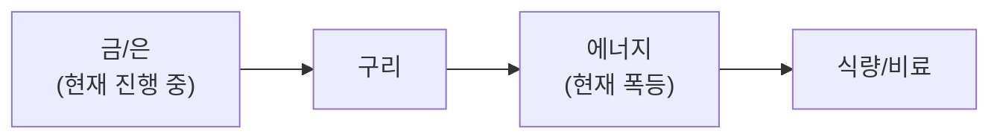

**4월 3일(목), TurboQuant 충격 — 삼성 -5.91%, SK하이닉스 -6.83% + 트럼프 "2-3주 극강 타격" + 테슬라 Q1 miss.** 구글 TurboQuant(KV캐시 6배 압축)가 메모리 수요 감소 공포를 촉발했으나, **제번스 역설**(효율 향상→수요 증가) + **The Register "과장"** 판단으로 과잉 반응 가능성. KOSPI **~5,529(+0.92%)** — 반도체 급락(삼성 -5.91%, SK하이닉스 -6.83%) vs 방산 급등(한화에어로 **+7.50%**). 미국 시장 **Good Friday 휴장**.

**VIX 24.54(-2.81%) + HY스프레드 3.16%(-3.66%) + 리스크 완화 지속.** VIX **24.54(-2.81%)** — 추가 하락. HY스프레드 **3.16%(-3.66%)** 축소 지속. RRP **$0.33B** 사실상 제로 — **피크 유동성**. M2 **$22,667B(+0.88%)**. S&P 500 **6,583(+0.11%)**, NASDAQ **21,879(+0.18%)** (4/2 종가). 섹터별: Technology **+2.5%**(반등), Industrials **-1.78%**(하락). **NASDAQ 섹터 로테이션 지속**.

**이란 전쟁 Week 5 — 트럼프 "2-3주 내 극도로 강력한 타격" + 지상전 미배제.** 트럼프가 전국민 대상 연설에서 "이란을 석기시대로 보낼 것"이라 발언. 시장은 휴전 신호를 기대했으나 **에스컬레이션 신호**. JP모건: 해병대·특수부대 결집, A-10 배치, 추가 항공모함 파견으로 **지상전 가능성**(10% 추정) 경고. 68% 미국인 지상전 반대. 유가 하락: Brent **$105.58(-6.2%)**, WTI **$103.36(-1.3%)** — 트럼프 "전쟁 수주 내 종료 가능" 발언 영향. 그러나 이란은 "100년 전쟁도 불사" 맞대응.

**TurboQuant 충격 vs 제번스 역설 — 반도체 과잉 반응.** 구글 AI 메모리 압축 기술(16비트→3.5비트, 6배 압축). SK하이닉스 서울 **-12%**, 삼성 **-7%**. Micron $50B 시총 증발. 그러나 **The Register**: "효과가 과장됨", **Motley Fool**: "메모리 크런치 해소 불가". 제번스 역설: 효율 향상 → AI 활용 폭 증가 → **장기 메모리 수요 오히려 증가**. 딥시크 충격의 재현 패턴. HBM 전량 매진 + NVIDIA $65B 가이던스 불변.

**테슬라 Q1 miss + 금 $4,703 + BTC $66,606.** 테슬라 Q1 인도 **358K**(예상 365K 하회), 생산 **408K** — **50K 과잉재고**. ESS **8.8GWh**(예상 14.4GWh 대폭 하회). 주가 **-5%**. 유럽은 폭증(프랑스 +203%, 노르웨이 +178%). SpaceX IPO SEC 제출, **$1.75T** 밸류에이션. 금 **$4,703(-1.7%)** — JPM **$6,300**, GS **$5,400** 목표 유지. BTC **$66,606(-2.2%)**.

## 6대 투자 섹터 구조

| 섹터 | 하위 섹터 | 상세 분석 |
|------|----------|----------|
| **1. 반도체/AI** | HBM, DRAM/NAND, 파운드리, 소부장, AI SW/클라우드 | [반도체 섹터](/knowledge/invest/2026/01/21/semiconductor-sector-outlook-2026.html) |
| **2. 에너지** | 원전/SMR, 재생에너지, ESS, 수소 | [에너지 섹터](/knowledge/invest/2026/03/07/energy-sector-outlook-2026.html) |
| **3. 방산/우주** | 방산, 드론/UAM, 우주/위성 | [방산/우주 섹터](/knowledge/invest/2026/03/07/defense-space-sector-outlook-2026.html) |
| **4. 모빌리티/로봇** | EV/자율주행, 로봇, 조선 | [모빌리티/로봇 섹터](/knowledge/invest/2026/01/21/automotive-robotics-sector-outlook-2026.html) |
| **5. 바이오/헬스케어** | 신약/바이오텍, GLP-1/비만치료, 의료AI | [바이오/헬스케어 섹터](#바이오헬스케어-및-생명공학) |
| **6. 자산/거시경제** | 금/은, 암호화폐, 원자재/희토류, 거시경제/정책 | [거시경제/정책 섹터](/knowledge/invest/2026/01/21/macroeconomic-policy-sector-outlook-2026.html) |

### 하위 섹터 상세 링크

**반도체/AI**
- [HBM 투자 전망](/knowledge/invest/2026/01/21/hbm-sector-outlook-2026.html)
- [DRAM/NAND 투자 전망](/knowledge/invest/2026/01/21/dram-nand-sector-outlook-2026.html)
- [파운드리 투자 전망](/knowledge/invest/2026/01/21/foundry-sector-outlook-2026.html)
- [소부장 투자 전망](/knowledge/invest/2026/01/21/semiconductor-materials-equipment-outlook-2026.html)
- [AI 소프트웨어/클라우드](/knowledge/invest/2026/03/07/ai-software-cloud-outlook-2026.html)

**에너지**
- [원전 투자 전망](/knowledge/invest/2026/01/21/nuclear-power-sector-outlook-2026.html)

**방산/우주**
- [방산 투자 전망](/knowledge/invest/2026/01/21/defense-sector-outlook-2026.html)

**모빌리티/로봇**
- [EV/자율주행 투자 전망](/knowledge/invest/2026/01/21/ev-autonomous-driving-outlook-2026.html)
- [로봇 투자 전망](/knowledge/invest/2026/01/21/robotics-sector-outlook-2026.html)
- [조선 투자 전망](/knowledge/invest/2026/01/21/shipbuilding-sector-outlook-2026.html)

**자산/거시경제**
- [원자재/희토류](/knowledge/invest/2026/03/07/commodities-rare-earth-outlook-2026.html)

---

## 미래 워치리스트

| 테마 | 현황 | 주시 포인트 |
|------|------|-----------|
| **양자컴퓨팅** | Google Willow, IBM Heron 등 진전. 상용화 초기 | 오류 정정(QEC) 돌파, 금융/제약 응용 |
| **합성생물학** | AI+유전체 편집 융합 가속 | 바이오 제조, 식량/에너지 응용 |
| **BCI (뇌-컴퓨터 인터페이스)** | Neuralink 임상시험, 경쟁사 등장 | FDA 승인, 의료 응용 확대 |
| **핵융합** | Commonwealth Fusion, TAE 등 민간 투자 확대 | 상용 발전 시점(2030년대 중반 전망) |

---

## 목차

1. [거시적 시장 환경](#거시적-시장-환경)
2. [AI 및 클라우드 컴퓨팅](#ai-및-클라우드-컴퓨팅)
3. [AI 네트워크 인프라](#ai-네트워크-인프라)
4. [반도체 및 첨단 제조](#반도체-및-첨단-제조)
5. [로보틱스 및 자율주행](#로보틱스-및-자율주행)
6. [에너지 전환 및 친환경](#에너지-전환-및-친환경)
7. [바이오헬스케어 및 생명공학](#바이오헬스케어-및-생명공학)
8. [우주산업 및 뉴스페이스](#우주산업-및-뉴스페이스)
9. [방위산업 및 국방기술](#방위산업-및-국방기술)
10. [핀테크, 암호화폐 및 STO](#핀테크-암호화폐-및-sto)
11. [사이버보안 및 데이터 인프라](#사이버보안-및-데이터-인프라)
12. [지정학적 관점: 한국은 1980년대 일본](#지정학적-관점-한국은-1980년대-일본)
13. [초거대 기업들의 전략과 투자 방향](#초거대-기업들의-전략과-투자-방향)
14. [한국 시장 구조 변화](#한국-시장-구조-변화)
15. [섹터별 투자 전략: 3월 실전 가이드](#섹터별-투자-전략-3월-실전-가이드)

---

## 거시적 시장 환경

### 글로벌 증시 현황 (4/3 기준)

| 지수 | 수준 | 변동 | 비고 |
|------|------|----------|------|
| **S&P 500** | **6,583** | **+0.11%** | **소폭 상승 (4/2 종가). 4/3 Good Friday 휴장** |
| **NASDAQ** | **21,879** | **+0.18%** | **보합. Tech +2.5% 반등, Industrial -1.78%** |
| **KOSPI** | **~5,529** | **+0.92%** | **★★ 반도체 급락(삼성-5.9%, SK하이닉스-6.8%) vs 방산 급등(한화에어로+7.5%)** |
| **원/달러** | **~1,510원** | **-** | **WGBI 편입→원화 강세 기대** |
| **Brent** | **$105.58** | **-6.2%** | **★★ 트럼프 "전쟁 수주 내 종료" 발언→유가 하락** |
| **WTI** | **$103.36** | **-1.3%** | **$100+ 유지. 4/6 데드라인 핵심** |
| **금(Gold)** | **$4,703** | **-1.7%** | **★ JPM $6,300, GS $5,400. 34% 업사이드** |
| **은(Silver)** | 강세 유지 | **$100 전망 유지** | 6년 연속 공급적자 |
| **비트코인** | **$66,606** | **-2.2%** | **하락. 이란 에스컬레이션 불확실성** |
| **VIX** | **24.54** | **-2.81%** | **★ 추가 하락. 공포 완화 지속** |
| **10Y Treasury** | **4.33%** | **+0.7%** | **2Y 3.81%. 스프레드 0.52%** |
| **5Y Breakeven** | **2.57%** | **+0.78%** | **인플레 기대 소폭 상승** |
| **Fed Funds** | **3.5-3.75%** | **동결** | **95% 동결 확률(4월 FOMC). 인하 기대 약화** |
| **DXY** | **100.04** | **-0.11%(1W)** | **약세 유지. 금 지지** |
| **HY Spread** | **3.16%** | **-3.66%** | **★★ 신용 리스크 완화 가속** |
| **RRP** | **$0.33B** | **사실상 제로** | **★★ 피크 유동성. 시장 지지** |
| **M2** | **$22,667B** | **+0.88%** | **유동성 확대 지속** |

### 이번 주 핵심 변화 (4/3 업데이트)

| 항목 | 변화 | 투자 시사점 |
|------|------|-----------|
| **★★★ TurboQuant 충격** | **구글 KV캐시 6배 압축. 삼성 -5.91%, SK하이닉스 -6.83%(-12% 서울). Micron $50B 시총 증발** | **★ 제번스 역설→과잉 반응. 딥시크 충격 재현 패턴. 매수 기회** |
| **★★★ 트럼프 "2-3주 극강 타격"** | **전국민 연설 "석기시대로 보낼 것". 지상전 미배제. JP모건: 해병대·A-10 배치** | **에스컬레이션 신호. 68% 미국인 지상전 반대. 4/6 데드라인 핵심** |
| **★★★ 테슬라 Q1 인도 miss** | **358K(예상 365K 하회). ESS 8.8GWh(예상 14.4GWh 대폭 miss). 주가 -5%** | **50K 과잉재고. 유럽은 폭증(프랑스+203%). 양극화** |
| **★★ Brent $105.58(-6.2%)** | **트럼프 "전쟁 수주 내 종료" 발언→유가 하락. 3월 55% 상승(역사적 기록) 후 조정** | **$100+ 유지. 4/6 데드라인이 방향 결정** |
| **★★ KOSPI ~5,529(+0.92%)** | **반도체 급락(TurboQuant) vs 방산 급등(한화에어로 +7.50%). 섹터 로테이션** | **전일 폭등 후 차별화. 반도체→방산 자금 이동** |
| **★★ VIX 24.54(-2.81%)** | **추가 하락. HY스프레드 3.16%(-3.66%). Good Friday 전 안정** | **공포 완화 지속. HY스프레드 개선 가속** |
| **★★ 금 $4,703(-1.7%)** | **$4,815→$4,703 하락. JPM $6,300, GS $5,400. 34% 업사이드** | **단기 조정이나 장기 강세 불변** |
| **★ SpaceX IPO 진행중** | **SEC 제출 완료. 6월 상장 목표. $1.75T 밸류에이션** | **역대 최대 IPO. 유동성 흡수 리스크** |
| **★ 미국 Good Friday 휴장** | **4/3 NYSE·NASDAQ 휴장. 4/7(월) 재개** | **주말 리스크. 이란 상황 변화 가능** |
| **★ Fed 95% 동결** | **4월 FOMC 95% 동결 확률. 이란 전쟁→인하 기대 약화** | **금리 현행 유지. 인하·인상 모두 어려운 교착** |

### 핵심 매크로 변수 5가지

#### 1. 이란 전쟁 Week 5 — 트럼프 "석기시대" + 지상전 가능성 + 4/6 데드라인

| 항목 | 내용 | 투자 시사점 |
|------|------|-----------|
| **★★★ 트럼프 "2-3주 극강 타격"** | **전국민 연설 "석기시대로 보낼 것". 테헤란 연구시설·다리·제철소 공격 확대** | **에스컬레이션 최고조. 시장은 휴전 기대했으나 실패** |
| **★★★ 지상전 가능성 부상** | **JP모건: 해병대·특수부대 결집, A-10 배치, 추가 항공모함 파견. 전문가 10% 추정** | **68% 미국인 반대. 지상전 시 유가 $150+ 시나리오** |
| **★★★ 4/6 에너지 공격 일시정지 만료** | **트럼프가 에너지 시설 공격 일시정지를 4/6으로 연장** | **4/6이 핵심 분기점. 공격 재개 vs 추가 연장** |
| **★★★ Brent $105.58(-6.2%)** | **WTI $103.36(-1.3%). 트럼프 "수주 내 종료" 발언이 유가 하락 촉발** | **$100+ 유지이나 하방 압력 증가** |
| **★★★ 전쟁 60일 시한** | **4/28 만료. 의회 승인 없이 연장 불가** | **4/6 + 4/28 이중 시한** |
| **★★ 이란 "100년 전쟁" 맞대응** | **이란 외무부: 트럼프 "이란이 휴전 원해" 주장은 거짓. "100년 전쟁도 불사"** | **외교 교착 심화. 발언과 군사행동 상충 주시** |
| **★★ Ken Fisher 3단계 유효** | **전쟁 전→최악 반영→회복. 현재 2-3단계(회복 진행)** | **시장 이미 회복 시작. 지상전 미시행 시 계속** |

**핵심 판단:** 트럼프가 "석기시대"로 보내겠다는 초강경 발언으로 에스컬레이션 최고조. 그러나 동시에 "전쟁 수주 내 종료" 발언 → 유가 Brent **$105.58(-6.2%)** 하락. **발언과 군사행동이 상충**(발언은 디에스컬레이션, 군사는 에스컬레이션). JP모건이 **지상전 가능성**(해병대·A-10 배치) 경고했으나 확률은 **10%**. 68% 미국인 반대. **4/6 데드라인 + 4/28 시한**이 핵심 변수. 에너지 비중 **15% 유지**.

#### 2. 사모신용 $265B 멜트다운 — El-Erian "전염 현상" + $2.1T 시장 2008년 이후 최대 위기

| 항목 | 내용 | 투자 시사점 |
|------|------|-----------|
| **★ Fortune $265B 멜트다운** | **월가 최대 투자 열풍이 패닉으로 전환. $2.1T 시장 2008년 이후 최대 위기** | 시스템 리스크 진행 중 |
| **★ El-Erian 경고** | **"전형적인 전염 현상" — 원하는 걸 못 팔면 팔 수 있는 걸 판다** | 다른 자산 클래스로 전이 우려 |
| **BlackRock** | **$26B 펀드 5% 환매 제한. $25M 대출 전액 손실** | 세계 1위 운용사 위기 |
| **Blackstone** | **BCRED $6.5B(7.9%) 환매 요청. 임직원 $400M 자체 투입** | 전례 없는 자구책 |
| **★ AI 담보 파괴 "SaaS-pocalypse"** | **에이전틱 AI→SaaS 구독 매출 침식. 사모 대출 포트폴리오 40%가 소프트웨어 기업** | 구조적 원인. AI 발전할수록 악화 |
| **사모신용 부도율** | **Fitch: 사모신용 부도율 사상 최고 9.2%** | 악화 가속 |
| **하이일드 스프레드** | **3.28%(+3.47%) — 신용 스프레드 확대 지속** | 전이 신호 |

**판단:** Fortune이 **"$265B 멜트다운"**으로 보도, El-Erian이 **"전형적인 전염 현상"** 경고. Fitch 부도율 **9.2% 사상 최고**. 핵심 원인은 AI(에이전틱 AI)가 SaaS 기업 담보 가치를 구조적으로 파괴하는 **"SaaS-pocalypse"** — 사모 대출 포트폴리오의 **40%가 소프트웨어 기업**. 그러나 HY스프레드 **3.28%(-5.2%)로 축소** 전환 — 신용 리스크 완화 시그널. **금융주 경계 유지**하되 공포 피크는 지난 것으로 판단.

#### 3. KOSPI ~5,529(+0.92%) — TurboQuant 반도체 급락 vs 방산 급등 + WGBI 편입

| 항목 | 내용 | 투자 시사점 |
|------|------|-----------|
| **★★ KOSPI ~5,529(+0.92%)** | **전일 +9.75% 폭등 후 소폭 상승. 반도체↓ vs 방산↑ 뚜렷한 섹터 로테이션** | **차별화 장세. 섹터 선별 중요** |
| **★★ 반도체 급락** | **삼성 -5.91%, SK하이닉스 -6.83%. TurboQuant 메모리 수요 감소 공포** | **전일 급등분 일부 반납. 제번스 역설→매수 기회** |
| **★★ 방산 급등** | **한화에어로스페이스 +7.50%, KB금융 +3.30%. LG에솔 +3.07%** | **트럼프 에스컬레이션→방산 수혜. 자금 이동** |
| **★★ EWY 3M +20.2%** | **글로벌 상위권 유지. WGBI 편입→구조적 자금 유입** | **장기 강세 구조 유지** |
| **★★ WGBI 편입** | **선진국 채권지수 편입 확정. 패시브 자금 유입 + 원화 강세** | **구조적 매수 촉매. 코리아 디스카운트 해소** |
| **★ 환율 ~1,510원** | **안정 유지. WGBI 편입→원화 강세 기대** | **원화 방어 + 달러 자산 분산 유지** |

**판단:** KOSPI **~5,529(+0.92%)** — 전일 **+9.75% 폭등** 후 숨 고르기. 핵심은 **섹터 로테이션**: 반도체 급락(삼성 -5.91%, SK하이닉스 -6.83%, TurboQuant 충격) vs 방산 급등(한화에어로 +7.50%, 트럼프 에스컬레이션 수혜). EWY **3M +20.2%** 글로벌 상위권 유지. WGBI 편입 + Ken Fisher 패턴(회복 단계)이 **구조적 지지**. TurboQuant는 제번스 역설 + 딥시크 재현 패턴으로 **반도체 매수 기회**. KOSPI **5,500~6,000** 구간 유지 전망.

#### 4. TurboQuant 충격 vs 반도체 슈퍼사이클 — 제번스 역설 + HBM 전량 매진

| 항목 | 내용 | 투자 시사점 |
|------|------|-----------|
| **★★★ TurboQuant 충격** | **구글 AI 메모리 압축(16비트→3.5비트, 6배). SK하이닉스 -12%(서울), 삼성 -7%. Micron $50B 증발** | **단기 충격. 딥시크 재현 패턴** |
| **★★★ 제번스 역설** | **The Register "과장됨". Motley Fool "메모리 크런치 해소 불가". 효율↑→AI 활용↑→수요↑** | **★ 과잉 반응→매수 기회. 역사적으로 효율 향상은 수요 증가** |
| **★★★ HBM 전량 매진 불변** | **2025-2026 전 용량 계약 완료. NVIDIA $65B 가이던스 불변. $975B(+25%)** | **슈퍼사이클 펀더멘털 무영향** |
| **★★★ Micron $700 목표 유지** | **Cantor Fitzgerald 탑 픽 유지. DRAM 현물 하락 B2C(5%) 한정** | **구조적 강세 불변** |
| **★★ 삼성 -5.91%, SK하이닉스 -6.83%** | **전일 +14%/+10% 후 급락. TurboQuant 공포가 원인** | **전일 급등분 반납. 변동성 확대** |
| **★★ NVDA $177.39(+0.93%)** | **SOXX +0.32%. 미국 반도체주는 미미한 반응** | **미국 시장은 TurboQuant 영향 제한적** |

**핵심 판단:** TurboQuant(구글 KV캐시 6배 압축)가 메모리 수요 감소 공포를 촉발. 삼성 **-5.91%**, SK하이닉스 **-6.83%** 급락. 그러나 이는 **딥시크 충격의 재현 패턴** — 제번스 역설(효율↑→AI 활용↑→수요↑)이 적용. The Register: "효과가 과장됨". HBM **전량 매진** + NVIDIA **$65B** 가이던스 불변. 미국 NVDA **+0.93%**, SOXX **+0.32%**로 미국 시장 영향은 제한적. **한국 반도체 과잉 반응→매수 기회**. 비중 **22% 소폭 축소**(단기 변동성 관리).

#### 5. 금 $4,703(-1.7%) — 단기 조정이나 JPM $6,300 + GS $5,400 불변

| 항목 | 현황 | 변화 |
|------|------|------|
| **★★ 금 $4,703(-1.7%)** | **$4,815→$4,703 하락. 1W +4.69%. 단기 조정** | **강세 추세 내 건전한 조정** |
| **★★★ 기관 타겟 불변** | **JPM $6,300(EOY), GS $5,400. 중앙은행 분기 585톤 매수** | **34% 업사이드. 기관 컨센서스 강세** |
| **★★ DXY 100.04** | **1W -0.11% 약세 유지. 달러 약세→금 지지** | **달러 약세가 금 하방 방어** |
| **★★ Fed 95% 동결** | **4월 FOMC 동결 확률 95%. 인하 기대 약화(이란 전쟁)** | **금리 현행 유지. 기회비용 제한적** |
| **★ CoinCodex $5,005 전망** | **7일 내 $5,005 전망(+5.18%). WalletInvestor $5,009** | **단기 반등 여지** |
| **★ 페트로위안 구조적 촉매** | **이란 위안화 + 사우디 비갱신. DXY 장기 약세→금 장기 강세** | **구조적 전환. 금 최대 수혜** |

**판단:** 금 **$4,703(-1.7%)** 단기 조정. $4,815→$4,703 하락이나 **1W +4.69%** 여전히 강세 추세 내. JPM **$6,300**, GS **$5,400** 기관 타겟 불변 — **34% 업사이드**. 달러 약세 유지(DXY 100.04) + Fed 동결(95% 확률) + 중앙은행 매입이 구조적 지지. CoinCodex/WalletInvestor **$5,000+** 단기 전망. **금 7% 유지**, $4,500↓ 시 적극 매수.

### 관세 현황 -- Section 122 15% 발효 중 (7/23 만료)

| 관세 | 세율 | 상태 | 비고 |
|------|------|------|------|
| **글로벌 보편관세** | **15%** | **발효 중** (2/24~) | **150일 한시** (7/23 만료) |
| **중국 관세** | **35~50%** | USTR 유지 | 트럼프 방중 완료 |
| **반도체** | 25%+ | **Section 232 유지** | 별도 법적 근거 |
| **자동차** | **25%** | **발효 중** (4/3~) | **현대/기아 직접 타격. 오늘부터 적용** |
| **철강/알루미늄** | 25% | **Section 232 유지** | 3/12 발효 |

---

## AI 및 클라우드 컴퓨팅

### 현재 상황 (4월 3일 — TurboQuant 충격 + 제번스 역설 + HBM 전량 매진)

**TurboQuant 충격**: 구글이 AI 메모리 압축 기술(KV캐시 16비트→3.5비트, **6배 압축**, 속도 **8배 향상**)을 발표. 삼성 **-5.91%**, SK하이닉스 **-6.83%**(서울 -12%). Micron **$50B 시총 증발**. 그러나 **제번스 역설**(효율↑→AI 활용↑→수요↑)로 과잉 반응 판단. The Register: "효과 과장". NVDA **$177.39(+0.93%)** — 미국 시장 영향 제한적. HBM **2025-2026 전량 매진** 불변. NVIDIA **$65B** 가이던스 불변. 빅테크 AI CAPEX **~$700B**(+60%). **TeraFab** $25B(Tesla+SpaceX+xAI, 2nm). 젠슨 황: **"AI 3번째 변곡점 — AI 에이전트 시대"**. SaaS→**AaaS** 전환. 에이전틱 AI 시장 **$8B→$215B(2035)**.

| 기업 | 2026 AI CAPEX | 핵심 이슈 |
|------|--------------|---------|
| **Amazon** | **$2,000억** | FCF 마이너스 전환 전망 |
| **Alphabet** | **$1,850억** | FCF 90% 감소 전망 |
| **Microsoft** | **$1,450억** | Azure AI 확대 |
| **Meta** | **$1,350억** | FCF 90% 감소 전망 |
| **합계** | **$6,500~7,000억** | 전년 대비 **+60% 이상** |

### 핵심 투자 포인트

| 영역 | 내용 | 전망 |
|------|------|------|
| **AI 칩셋** | 엔비디아 시총 ~$4.31조 | **GTC 진행: $1T 주문, Vera Rubin 10x, Eaton 전력 파트너십** |
| **커스텀 ASIC** | **Broadcom AI $8.4B(+74%)**, **Marvell $0→$1.5B** | 2026년 GPU 출하량 추월 전망 |
| **클라우드 인프라** | AWS, Azure, GCP | $7,000억 투자 직접 수혜 |
| **AI 응용** | CRM, 헬스케어, 금융 AI | 하드웨어 실적 파티 vs 소프트웨어 수익화 미완 |

### 4월 투자 전략

**단기**: NVIDIA Q4 **$65B** 가이던스로 수요 확인. HBM **전량 매진**. 삼성·SK하이닉스 역대급 반등 — **매수 유지**. SpaceX IPO SEC 제출 → **유동성 흡수 리스크** 주의.

**중기**: 에이전틱 AI 시장 **$8B→$215B(2035)**. AI 에이전트가 일자리 파괴 + 인프라 수요 폭증의 **이중 구조**. H2 **IPO 러시**(Anthropic, OpenAI, SpaceX) 기대.

**리스크**: ①유가 $100+→데이터센터 전력비 상승, ②AI 칩 수출통제, ③SpaceX IPO 유동성 흡수.

### 주요 기업 및 ETF

**대표 기업:**
- 엔비디아 (NVDA): **Q4 가이던스 $65B**. Vera Rubin + Feynman
- **AMD (AMD)**: MI455X + Helios — Meta 6GW + OpenAI 6GW = **12GW 계약**
- **Broadcom (AVGO)**: AI 매출 **$8.4B(+74%)**, 커스텀 ASIC 리더
- **Marvell (MRVL)**: ASIC 매출 **$0→$1.5B**

**투자 ETF:**
- BOTZ (Global X Robotics & AI ETF)
- ROBO (ROBO Global Robotics & Automation Index ETF)

---

## AI 네트워크 인프라

### 핵심 테마: 데이터센터 ROI의 열쇠

$700B 규모의 AI 데이터센터 투자에서 **네트워크 인프라는 ROI를 결정짓는 핵심 요소**입니다.

### InfiniBand vs Ethernet 경쟁

| 기술 | 대표 기업 | 특징 |
|------|----------|------|
| **InfiniBand** | 엔비디아 (Mellanox) | 현재 AI 학습 표준, 저지연 |
| **Ethernet (AI용)** | Arista Networks, Broadcom | 범용성 우수, 비용 효율적 |

### ★ CPO(Co-Packaged Optics) — 2026년 월가 TOP1 테마

**구리선의 물리적 한계**: 224G SerDes 환경에서 구리 전송 거리가 **50cm까지 축소**. 스킨 이펙트로 열과 전력 소모 급증. **CPO가 유일한 대안** — 광통신 모듈을 칩 패키지에 통합하여 전기→광 신호 변환.

| 항목 | 내용 |
|------|------|
| **시장 성장** | **2026년 양산 시작, 연간 137% 성장** |
| **NVIDIA** | Spectrum-X Photonics (Ethernet CPO) **H2 2026 출시**, Quantum-X IB 115Tb/s |
| **Marvell** | 광통신 포토닉 패브릭스, AEC, DSP, 커스텀 칩. **고점 대비 -30% 저평가** |
| **Credo** | AEC 리타이머, CPO 핵심 부품 |
| **Corning** | 광섬유 소재 공급 |

### 대역폭 에스컬레이션

```
현재: 400G
진행중: 800G
2026-2027: 1.6T (CPO 양산 시작)
2028+: 3.2T
```

각 세대 전환마다 **광트랜시버, 스위치, 광케이블** 수요가 2배씩 증가. **CPO가 1.6T 이상에서 필수 기술**.

### 핵심 투자 기업

| 기업 | 분야 | 핵심 강점 |
|------|------|----------|
| **Arista Networks** | 데이터센터 스위칭 | AI 데이터센터 네트워킹 1위 |
| **Coherent** | 광트랜시버 | 시장 점유율 1위, 800G/1.6T 리더 |
| **Lumentum** | 광학 부품 | 레이저, 광부품 핵심 공급 |
| **Broadcom** | 네트워크 칩 + ASIC | AI 네트워크 + 커스텀 ASIC, **AI $8.4B(+74%)** |

---

## 반도체 및 첨단 제조

### 핵심 이벤트: HBM 전량 매진 + NVIDIA $65B + Micron $700 목표 + 삼성/SK 역대급 반등

**HBM 2025-2026 전량 매진.** NVIDIA Q4 FY2026 가이던스 **$65B**. Cantor Fitzgerald: Micron **$700 목표**, 탑 픽 유지 — DRAM 현물가 하락은 **B2C(매출 5%)**에 한정. 삼성전자 **190,000원(+14%)**, SK하이닉스 **901,500원(+10%)** 역대급 반등. 글로벌 반도체 **$975B(+25%)**.

| 항목 | 내용 | 투자 시사점 |
|------|------|-----------|
| **★★★ HBM 전량 매진** | **2025-2026 전 용량 계약 완료. 가격 상승 지속** | **슈퍼사이클 확정. 구조적 강세** |
| **★★★ NVIDIA Q4 $65B** | **FY2026 Q4 가이던스 $65B. AI CAPEX $700B+ 직접 수혜** | **AI 칩 수요 가속 확인** |
| **★★★ Micron $700 목표** | **Cantor Fitzgerald 탑 픽. DRAM 현물 하락은 B2C(5%) 한정** | **구조적 강세. 과잉 우려 불필요** |
| **★★★ 삼성 190K(+14%)** | **역대급 반등. HBM4 양산 가속. 삼성·SK 합산 70조 원 설비투자** | **저PER 반등. Ken Fisher 패턴** |
| **★★★ SK하이닉스 901,500(+10%)** | **HBM 50%+. UBS HBM4 70%. ADR SEC 제출** | **글로벌 재평가 진행** |
| **★★ TeraFab $25B** | **Tesla+SpaceX+xAI. 2nm. 80% 우주/20% 지상** | **머스크 반도체 자급** |
| **★ CPO 양산 시작** | 2026년 변곡점, 연간 137% 성장 | AI 네트워크 핵심 |
| **반도체 $975B** | **+25% YoY. 메모리 +30%. $1T 임박** | 기가사이클 가속 |

### 한국 메모리의 기가사이클

**SK하이닉스 HBM 시장 점유율 62%**로 압도적 1위. **삼성은 HBM4 PRA 완료**로 양산 본격화 임박.

핵심 포인트:
- **SK하이닉스**: HBM 62% 점유, 16단 48GB HBM4 공개
- **삼성 HBM4 PRA 완료**: 세계 최초 양산 출하, 대역폭 3.3TB/s
- **DRAM Q1 +90~95%**: 역사적 기록
- **SIA $1T**: 2026년 글로벌 매출 $1조 돌파 전망

### 4월 투자 전략

**핵심 전략: HBM 전량 매진 + 반도체 역대급 반등 + 슈퍼사이클 가속**

1. **삼성전자**: 190,000원(+14%) 반등. HBM4 양산. **저PER에서 반등 시작**.
2. **SK하이닉스**: 901,500원(+10%). HBM 50%+ 점유, ADR 추진. **글로벌 재평가**.
3. **Micron**: Cantor $700 목표, 탑 픽. DRAM 현물 하락은 B2C 한정. **적극 매수**.
4. **엔비디아**: Q4 $65B 가이던스. Vera Rubin + Feynman.
5. **소부장**: 한미반도체, HPSP, 리노공업 — 설비투자 70조 낙수효과.

### 주요 기업

| 카테고리 | 주요 기업 | 현황 |
|----------|----------|------|
| **AI 칩** | 엔비디아, AMD | GTC 3/16~19, SOXX +3.98% |
| **파운드리** | TSMC, 삼성전자 | TSMC N2 램프 |
| **메모리** | 삼성전자, SK하이닉스 | SK 62% HBM, DRAM Q1 +95% |
| **커스텀 ASIC** | Broadcom, Marvell | Broadcom AI $8.4B(+74%) |
| **소부장** | 한미반도체, HPSP, 리노공업 | 고수익성 지속 |
| **장비** | ASML, 램리서치 | ASML 분기 주문 EUR132억 기록 |

**ETF:**
- SMH (VanEck Semiconductor ETF)
- SOXX (iShares Semiconductor ETF) — **+3.98% (오일 쇼크 속 반등)**

---

## 로보틱스 및 자율주행

### 현재 상황: 옵티머스 Gen3 실물 + 로봇 안보법 + 자율주행 변곡점 + 사이버캡 4월

| 항목 | 내용 | 시사점 |
|------|------|--------|
| **★★★ 옵티머스 Gen3 실물 공개** | **매쉬 소재 다이빙 슈트형 외피. $20K 목표가. FSD 컴퓨터 탑재 확인** | **양산형 디자인 확정. 여름 생산** |
| **★★★ 로봇 안보법(ASRA) 발의** | **미 상원 초당적. 중국 로봇 연방정부 사용 금지. 데이터 주권 보호** | **★ 테슬라 독점 강화. 중국 로봇 퇴출** |
| **★★ FSD→로봇 이식** | **89억 마일 실주행 데이터→옵티머스 공간인지. 복제 불가능한 경쟁력** | **자동차-로봇 신경망 통합** |
| **★★ Waymo 20도시·주100만회** | **2026년 20개 도시 확장. 주 100만 라이드 목표** | 자율주행 상용화 본격화 |
| **★ 중국 로봇 한계 노출** | **샤오펑 아이언 로봇 시연 중 넘어짐. 균형 제어 한계** | **테슬라 기술 우위 확인** |
| **양산 목표** | 프리몬트 연간 100만 대, **기가텍사스 연간 1,000만 대** | <$20K, 소프트웨어 구독 $200/월 |
| **★★ 사이버캡 첫 생산+4월 양산** | **2/17 기가텍사스 첫 롤오프. 4월 양산. 플라스틱 바디+밀봉 휠+점자 표기** | **극단적 원가 절감. 웨이모 압도** |
| **AV 시장 $39.3B** | **2026년 글로벌 AV 시장 $39.3B. 4.3만 대** | 급성장 초입 |
| **Zoox+Uber** | **Zoox, Uber 자율주행 라이드 서비스 2026년 출시** | 경쟁 가속 |
| **★ X머니 4월 출시** | **비자 제휴, 메탈 카드, 탭투페이**. FSD/로보택시/에너지 결제 통합 | 테슬라 생태계 수익화 |
| **중국 로봇 90% 점유** | 중국 기업들이 글로벌 판매량 90%+ 장악 | 경쟁 리스크 주의 |
| **자동차 관세 25%** | 4/3 발효 예정 | 현대/기아 직접 타격 |

### 한국 로봇 섹터

- 두산로보틱스: 협동 로봇 리더
- 레인보우로보틱스: 휴머노이드 로봇 개발
- 현대차/보스턴다이나믹스: 기업가치 ~55조원
- **주의**: 중국 휴머노이드 로봇 **87-90%** 점유 — 경쟁 리스크 최대

**ETF:**
- BOTZ (Global X Robotics & AI ETF)
- ROBO (ROBO Global Robotics & Automation Index ETF)

---

## 에너지 전환 및 친환경

### WTI $104.69 + 호르무즈 4/6 데드라인 + EV +172% 폭등 + 맥쿼리 $200 시나리오

| 항목 | 내용 |
|------|------|
| **★★★ WTI $104.69(+3.4%)** | **Brent $112.57(+45% YTD). $100+ 뉴노멀 유지** |
| **★★★ 호르무즈 4/6 데드라인** | **트럼프 에너지 공격 일시정지 4/6 연장. 130→6척/일 봉쇄 지속** |
| **★★★ 맥쿼리 시나리오** | **6월까지 봉쇄 시 Brent $200. 외교 돌파 시 $80-90** |
| **★★★ EV +172% 폭등** | **한국 EV 등록 +172% 역대 최대. 유럽 유사. 유가 수혜** |
| **★★ 미국 EV -28%(신차)** | **세액공제 만료 영향. 중고 EV +12%** |
| **★★ 전쟁 60일 시한** | **4/28 만료. 4/6 + 4/28 이중 시한** |
| **★★ 2차전지·ESS 강세** | **ESS 40%+ 성장. EV 폭등 수혜** |
| **미국 원전 $80B** | 신규 원전 펀딩, AI 데이터센터 전력 수요 |

### 에너지 시나리오 (4/2 기준 — 맥쿼리 시나리오 반영)

| 시나리오 | 유가 전망 | 확률 | 영향 |
|---------|----------|------|------|
| **봉쇄 지속(현상 유지)** | **$100~130** | **★★★ 최고 (40%)** | **호르무즈 6척/일 봉쇄 지속. $100+ 뉴노멀** |
| **6월까지 완전 봉쇄(맥쿼리)** | **$130~200** | **중 (25%)** | **맥쿼리: Brent $200. 글로벌 에너지 위기** |
| **4/6 이후 외교 돌파** | **$80~90** | **중 (25%)** | **맥쿼리: 외교 돌파 시 $80-90. Ken Fisher 회복 단계** |
| **완전 외교 해결** | **$65~80** | **저 (10%)** | **이란 항복+봉쇄 해제. 60일 시한(4/28) 압박** |

**시나리오 변화:** 트럼프가 에너지 공격 일시정지를 **4/6으로 연장** — 공격 의지는 유지하되 시간 벌기. 맥쿼리가 **두 극단 시나리오**(봉쇄 $200 vs 돌파 $80-90) 제시. 이란은 15조건 거부, 외교 교착. 그러나 Ken Fisher 3단계 패턴과 KOSPI +9.75% 반등은 **시장이 회복 단계를 선반영** 중. **4/6 결과가 시나리오 분기점**. 외교 돌파 확률 상향(25%).

### 핵심 하위 섹터

#### 원전 (Nuclear Renaissance) -- 에너지 안보 + AI 전력 수요

AI 데이터센터 전력 수요 + 이란 전쟁 에너지 안보 + 탈탄소 정책 삼중 호재.

| 항목 | 내용 | 투자 시사점 |
|------|------|-----------|
| **우라늄** | +32% YoY | 구조적 공급 부족 |
| **i-SMR 규제심사 착수** | 한국 SMR 규제 프로세스 시작 | 상용화 가시화 |
| **미국 $80B 신규 원전** | NuScale SMR 규제 승인 | 원전 르네상스 가속 |
| **KHNP 태국·필리핀** | 원전 수출 파이프라인 확대 | K-원전 해외 수주 |

#### 배터리/ESS -- 2차전지 강세 + ESS 40%+ 성장 + 희토류 탈중국

**2차전지 신고가 + ESS 폭발적 성장.** LG에너지솔루션·LNF **신고가** 기록. 글로벌 ESS 설치 **40%+ 성장** 전망. LG에솔 **140GWh 수주잔고**(북미 그리드+데이터센터). 매출 **15~20% 성장** 가이던스(ESS 주도). 글로벌 EV 성장률 **40%+**, 미국 **200%** 성장(한경TV). **희토류 탈중국** — LS에코에너지·JS링크가 호주 라이너스와 전략적 파트너십.

| 항목 | 내용 | 투자 시사점 |
|------|------|-----------|
| **★★ ESS 40%+ 성장** | **LG에솔 ESS 140GWh 수주잔고. 그리드+데이터센터+유틸리티** | **ESS=배터리 핵심 성장 엔진** |
| **★★ LG에솔·LNF 신고가** | **ESS 주도 매출 성장 15~20%. EV 둔화를 ESS가 상쇄** | **2차전지 반등 본격화** |
| **★ 희토류 탈중국** | **LS에코에너지+라이너스(호주). 전략적 공급망 구축** | **희토류 밸류체인 투자 기회** |
| **추천 종목** | **LG에너지솔루션(ESS 비중 최대), LNF(하이니켈+테슬라), 포스코퓨처엠** | **ESS 비중 높은 기업 우선** |

### 투자 ETF

- ICLN (iShares Global Clean Energy) — **+3.04%**
- LIT (Global X Lithium & Battery Tech) — **+3.57%**
- URA (Global X Uranium ETF)

---

## 바이오헬스케어 및 생명공학

### 스태그플레이션 방어 + GLP-1 경쟁 구도 변화

오일 쇼크 + 스태그플레이션 환경에서 **방어적 헬스케어 매력도 상승**.

### 핵심 투자 포인트

#### GLP-1 비만 치료제

| 기업 | 현황 | 전망 |
|------|------|------|
| **Eli Lilly (LLY)** | GLP-1 시장 지배, EPS $35 전망(2026) | Mounjaro/Zepbound 선도 |
| **Novo Nordisk (NVO)** | 1년간 56% 하락, 경쟁 심화 | 저평가, $70 목표가 |
| **Viking Therapeutics** | 2상 결과 13주 14.7% 체중 감량 | 신규 경쟁자 |

#### AI 신약 개발

- 엑셀런시아, 리커전: AI 기반 약물 발견
- 빅테크 진출: 구글 DeepMind, 아마존 헬스케어

### 투자 ETF

- XBI (SPDR S&P Biotech ETF)
- IBB (iShares Biotechnology ETF)
- ARKG (ARK Genomic Revolution ETF)

---

## 우주산업 및 뉴스페이스

### 현재 상황: SpaceX IPO SEC 제출 + $1.75T + 유동성 흡수 리스크

| 기업/영역 | 내용 | 전망 |
|----------|------|------|
| **★★★ SpaceX IPO** | **이번 주 SEC 제출. 6월 상장 목표. $1.75T 밸류에이션. $50B 조달** | **역대 최대 IPO. 소매 최대 30% 배정** |
| **★★ Starlink 매출** | **$18.7B(2026) 전망. 급성장** | **IPO 핵심 가치** |
| 한화에어로스페이스 | K-방산/우주 대표주 | 수주잔고 100조+ |
| 로켓랩 (RKLB) | 소형 위성 발사 전문 | 트럼프 국방부 관심 |

### SpaceX IPO 유동성 리스크

**$50B 조달**은 시장 유동성 흡수 효과. 소매 투자자 **최대 30% 배정**($15B)은 기존 주식 매도→SpaceX 청약 전환 유발 가능. 트럼프 행정부 **FY2027 국방비 $1.5조 제안**에서 우주 최우선.

**투자 ETF:**
- UFO (Procure Space ETF)
- ARKX (ARK Space Exploration ETF)

---

## 방위산업 및 국방기술

### 현재 상황: $1.01T 예산(+13.4%) + 억만장자 $28B 증가 + 4배 증산 + ITA +14% YTD

방산이 2026년 최대 수혜 섹터. 미국 FY2026 **$1.01T 예산(+13.4%)**. 방산 억만장자 자산 3개월 만에 **$28B 증가**. **6대 미국 방산사 무기 4배 증산 서약**. Rheinmetall **매출 40-45% 성장**. 글로벌 CAPEX **+38%**. AI·사이버·우주·미사일 방어에 투자 집중.

| 항목 | 내용 | 시사점 |
|------|------|--------|
| **★★ 방산 4배 증산** | **RTX, Lockheed, Boeing, Northrop, BAE, L3Harris 백악관에서 4배 증산 서약** | **이란전 재고 보충 + 장기 수요 폭증** |
| **★ ITA +14% YTD** | **미국 방산 ETF 압도적 성과** | 방산 = 2026년 최강 섹터 |
| **★ Rheinmetall +40-45%** | **2026년 매출 40-45% 성장 전망. 사상 최대 수주잔고** | 유럽 방산 붐 대표주 |
| **★ Leonardo 수익 2배** | **이탈리아 방산, 2030년까지 수익 2배 목표** | EU 방산 투자 수혜 |
| **방산 CAPEX +38%** | 글로벌 방산 투자 38% 증가 전망 | 장기 성장 사이클 |
| **청궁-II 실전 검증** | UAE에서 명중률 90% — 실전 실증 | K-방산 신뢰도 구조적 상향 |
| **EU ReArm 8,000억유로** | EU 정상 합의 (~1,250조원) | K-방산 유럽 수출 대폭 확대 |
| **NATO 방위비 GDP 5%** | 2035년까지 목표 상향 (기존 2%) | 글로벌 방산 장기 수요 |
| **AeroVironment** | **드론(이란전 실전 검증) + 우주 + 자율수중차. BlueHalo 인수** | 중소형 방산 유망주 |

### 조선 -- 호르무즈 봉쇄 + LNG 용선율 $200K+ + 슈퍼사이클

| 항목 | 내용 |
|------|------|
| **HD현대 LNG 4척 ₩1.49T** | LNG 용선율 $200K+ (기존 대비 2배) |
| **호르무즈 봉쇄** | 선박 통행 불가, 해군함·호위함 수요 급증 |
| **3대 조선사 수주 목표** | $464억(+30%) |
| **LNG선 전망** | 2026년 글로벌 115척 발주 전망 (+24%) |

### 주요 기업

**주요 기업:** 한화에어로스페이스 (수주잔고 100조+, 청궁-II 실전 검증), 한화오션 (캐나다 잠수함 48조), HD현대중공업 (LNG 4척 ₩1.49T), LIG넥스원 (사우디 L-SAM), HD한국조선해양 (수주 35조)

**투자 ETF:**
- ITA (iShares U.S. Aerospace & Defense ETF) — **+14% YTD**
- XAR (SPDR S&P Aerospace & Defense ETF)
- SHLD (Global X Defense Tech ETF)

---

## 핀테크, 암호화폐 및 STO

### STO 법안 국회 통과 -- 2026년 상반기 토큰증권 원년

| 항목 | 내용 |
|------|------|
| **법안 통과** | **2026.1.15 국회 통과** |
| **시행** | 2027년 1월 시행 |
| **시장 전망** | 2026년 상반기 STO 시장 원년 |
| **2030년 시장 규모** | 약 **367조원** |

### 자산 현황: 금·은·비트코인

| 자산 | 현재 | 전망 | 포지션 |
|------|------|------|--------|
| **금(Gold)** | **$4,815/oz** (+3.6%, 1W +10.05%) | **JPM $6,300, GS $5,400. 31% 업사이드** | **비중 7% 유지, $4,500↓시 적극 매수** |
| **은(Silver)** | 강세 유지 | $100 전망, 6년 연속 공급적자 | **유지** |
| **비트코인** | **$68,250** (반등) | **공포 완화. VIX 25 복귀 속 반등** | **소규모 유지** |

**금 판단:** $4,815(+3.6%, 1W +10.05%)로 **강세 가속**. JPM **$6,300**, GS **$5,400** 기관 타겟 — **31% 업사이드**. 달러 약세 전환(DXY 1W -0.32%)이 상방 촉매. 중앙은행 매수(분기 585톤) + 페트로위안 전환이 구조적 지지. **비중 7% 유지**, $4,500↓ 시 적극 매수.

**비트코인 판단:** $68,250, **공포 완화**. VIX 25 복귀 + 유동성 확대(RRP 제로, M2 +0.88%) 속 반등. 그러나 SpaceX IPO 유동성 흡수 리스크. **소규모 유지**.

**ETF:**
- BITO (ProShares Bitcoin Strategy ETF)
- BLOK (Amplify Transformational Data Sharing ETF)

---

## 사이버보안 및 데이터 인프라

### 현재 상황

이란 전쟁 9일차로 **이란발 사이버 보복 공격 가능성 지속**. AI 칩 수출통제로 보안 인프라 수요도 구조적 증가. 팔란티어는 피터 틸이 일본 다카이치 총리와 회담하며 **미일 방산 AI 소프트웨어 협업** 기대감.

### 핵심 기업

| 분야 | 기업 | 강점 |
|------|------|------|
| 네트워크 보안 | 팔로알토, 포티넷 | 차세대 방화벽 |
| 클라우드 보안 | 크라우드스트라이크, 제트스케일러 | EDR, 제로 트러스트 |
| AI 보안 | 팔란티어 | 전장 AI, 데이터 분석 |

### 투자 ETF

- CIBR (First Trust NASDAQ Cybersecurity ETF)
- HACK (ETFMG Prime Cyber Security ETF)

---

## 지정학적 관점: 한국은 1980년대 일본

### 핵심 프레임: 미중 경쟁 수혜 + 이란 전쟁 방산 수혜 + 에너지 의존 취약성

미-중 기술 패권 경쟁에서 한국이 **미국의 핵심 동맹 공급국**으로서 구조적 수혜. 이란 전쟁 + 청궁-II 실전 검증으로 K-방산 신뢰도 구조적 상향. 그러나 **에너지 자급률 19%로 오일 쇼크에 가장 취약한 선진국 중 하나**.

### 한국의 글로벌 핵심 공급 분야

| 분야 | 한국 위상 | 핵심 기업 |
|------|----------|----------|
| **HBM** | 글로벌 양강, SK하이닉스 62% | SK하이닉스, 삼성전자 |
| **전력/변압기** | 핵심 공급국 | 현대일렉트릭, LS산전 |
| **조선** | 글로벌 1위, LNG $200K+ 용선율 | HD한국조선해양, 삼성중공업 |
| **K-배터리** | 글로벌 3강 | LG에너지솔루션, 삼성SDI |
| **K-방산** | 수주잔고 100조+, 청궁-II 실전 검증 | 한화에어로스페이스, LIG넥스원 |
| **로보틱스** | 로봇밀도 세계 1위 | 두산로보틱스, 현대로보틱스 |

### 미국 전략적 수혜 섹터

| 우선순위 | 섹터 | 정책 |
|---------|------|------|
| 1순위 | **에너지** | 에너지 독립(자급률 105%), S&P 500 견조 |
| 1순위 | **방산/우주** | ITA +14% YTD, CAPEX +38%, 이란 전쟁 |
| 2순위 | **반도체** | SIA $1T, SOXX +3.98%, GTC 3/16 |
| 2순위 | **AI** | $700B CAPEX |
| 3순위 | **암호화폐** | Clarity Act 법제화 추진 |

---

## 초거대 기업들의 전략과 투자 방향

### $700B AI 투자의 흐름: 공급망 수혜 지도

```
AI 칩 → 엔비디아($4.31조, GTC 3/16~19), AMD, TSMC
커스텀 ASIC → Broadcom(AI $8.4B, +74%), Marvell($0→$1.5B)
데이터센터 네트워크 → Arista, Coherent, Lumentum
서버/메모리 → SK하이닉스(HBM 62%), 삼성전자(HBM4 PRA 완료)
냉각 시스템 → LG전자(공조), SK이노베이션(액침 냉각)
전력 인프라 → 원전(i-SMR), 우라늄
```

### 테슬라의 전략적 피벗 -- SpaceX 합병 + 사이버캡 + 옵티머스 + 3열 SUV

| 전략 | 내용 | 의미 |
|------|------|------|
| **★★★ SpaceX IPO SEC 제출** | **이번 주 SEC 제출. $1.75T. $50B 조달. Starlink $18.7B. 소매 30%** | **역대 최대 IPO. 유동성 흡수 리스크** |
| **★★ 사이버캡 첫 생산** | **2/17 기가텍사스 첫 롤오프. 4월 양산. 플라스틱 바디+밀봉 휠+점자 표기** | **극단적 원가 절감. 웨이모 압도** |
| **★ Optimus 3 여름 양산** | **2026년 여름 초기 생산 확정**. 기가텍사스 900만 sq ft | 자동차→노동력 기업 전환 |
| **★ 3열 SUV 개발 시사** | **머스크 "알았다" — 3열 전용 SUV 개발 암시. 공간+문 구조 핵심** | 가족 시장 공략 |
| **★ X머니 4월 출시** | **비자 제휴, 메탈 카드, 탭투페이** | 테슬라 생태계 결제 통합 |
| **나스닥 5배 가중 승수** | **SpaceX 유통 4.3%→21.5% 가중. QQQ 등 $22~37조 강제 매수** | IPO 시 대규모 패시브 유입 |

---

## 한국 시장 구조 변화

### KOSPI: 5,545(+9.75%) — 역대급 폭등 + WGBI 편입 + Ken Fisher 회복 단계

2/26 사상최고(6,307) → 3/4 -12.64%(사상 최대 폭락) → 3/11 +8.28% → 3/25 5,696 → 3/31 5,108(-6.09%W) → **4/2 5,545(+9.75% 폭등!)**. WGBI 편입 확정. 삼성 **+14%(190K)**, SK하이닉스 **+10%(901,500)**. EWY 1W **+5.19%**, 3M **+29.83%** — 글로벌 탑 퍼포머.

| 항목 | 3/4 | 3/11 | 3/25 | 3/31 | **4/2** |
|------|------|------|------|------|------|
| **KOSPI** | -12.64% | +8.28% | +5.37% | 5,108(-6.09%W) | **5,545(+9.75%)** |
| **핵심** | 서킷브레이커 | 대반등 | 급반등 | 추가하락 | **★★★ 역대급 폭등!** |

### 글로벌 자금 흐름 (Fund Flow) — 4/2 기준

| 국가 | ETF | 1W | 3M | 시사점 |
|------|------|------|------|--------|
| **한국** | EWY | **+5.19%** | **+29.83%** | **★★★ 글로벌 탑 퍼포머! WGBI 편입 수혜** |
| 일본 | EWJ | **+4.56%** | - | **아시아 2위. 내수 견조** |
| 유럽 | VGK | **+4.32%** | - | **유럽 반등. ReArm 수혜** |
| 미국 | SPY | **+1.57%** | **-3.65%** | **3M 여전히 마이너스. 로테이션 아웃** |
| 인도 | INDA | **+0.21%** | **-13.58%** | **3M 최악 지속. 구조적 자금 유출** |
| 달러 | DXY | **-0.32%** | - | **달러 약세 전환. 금·EM 지지** |
| 금 | Gold | **+10.05%** | - | **★★ 주간 두 자릿수 급등** |

**핵심:** EWY 1W **+5.19%**, 3M **+29.83%** — **글로벌 탑 퍼포머**로 완전 반전. 한국이 최저 Forward PER에서 반등 시작, WGBI 편입이 구조적 촉매. 일본·유럽도 강반등. 미국 SPY는 3M **-3.65%** 여전히 마이너스 — **Tech→아시아/유럽 로테이션** 진행 중. 금 1W **+10.05%** 급등, 달러 약세(-0.32%)가 지지.

### ★ 한국 자산시장 대전환 — 부동산·예금 → 주식

| 항목 | 내용 | 투자 시사점 |
|------|------|-----------|
| **대통령 ETF 매수 선언** | 분당 아파트 매각, ETF 매수 | 정부 차원의 주식 투자 장려 |
| **상법 개정** | 배당소득 분리과세, 자사주 의무소각 | 자본시장 친화 정책 |
| **국민성장펀드 150조** | 민간 75조 + 정부 75조 | 코스닥 15조 유입 |
| **고객예탁금 130조** | 사상 최고 | 투자 대기 자금 극대화 |
| **MSCI 선진지수** | 환율시장 개방 추진 | WGBI 4월 편입과 시너지 |

### 배당 ETF: 고변동성 시기 방어

| ETF | 특징 | 수익률 |
|-----|------|--------|
| **PLUS 고배당주 위클리 커버드콜** | 주간 콜옵션 매도 | 분배율 **20.55%** |
| **KODEX 코리아 밸류업 토탈리턴** | 밸류업 + 토탈리턴 | **101.87%** |
| KODEX 200 타겟위클리 커버드콜 | 주간 콜옵션 매도 | 연 **17%** 배당 |

---

## 섹터별 투자 전략: 4월 실전 가이드

### 핵심 전략: "KOSPI +9.75% 폭등 + VIX 25 공포 완화 + 4/6 데드라인 → 로테이션 매수 + 에너지 유지 + 반도체 확대"

4월 2일 기준 핵심 전략:

1. **KOSPI 5,545(+9.75% 폭등!)**: 삼성 +14%, SK하이닉스 +10%. Ken Fisher 3단계 회복. **적극 매수**
2. **VIX 25.25(-17.5%)**: 30 하회 복귀. HY스프레드 -5.2%. **현금 축소 가능**
3. **4/6 에너지 데드라인**: 트럼프 일시정지 만료. 맥쿼리 봉쇄 $200 vs 돌파 $80-90. **핵심 분기점**
4. **HBM 전량 매진**: NVIDIA $65B. Micron $700 목표. **반도체 슈퍼사이클 확정**
5. **SpaceX IPO**: SEC 제출, 6월 상장, $1.75T. $50B 조달. **유동성 흡수 리스크**
6. **EV +172%**: 한국 역대 최대. 유럽 유사. 유가 수혜. **에너지 전환 가속**
7. **WGBI 편입**: 선진국 채권지수 진입. 패시브 자금 유입. **구조적 촉매**
8. **RRP $2.1B 제로**: 피크 유동성. M2 +0.88%. **시장 하방 지지**
9. **금 $4,815(+3.6%)**: JPM $6,300, GS $5,400. 달러 약세 전환. **금 7% 유지**
10. **글로벌 로테이션**: Korea +5.19% 탑, US +1.57%. Tech -2.81%. **아시아/유럽 수혜**
11. **다음 핵심**: ★★★ 4/6 에너지 데드라인, 4/28 전쟁 시한, 4/29 FOMC, SpaceX S-1

### 상품 사이클 순서 (commodity cycle)



현재 금/은 → 에너지가 **동시에 급등** 중. 식량/비료가 다음 사이클 후보.

### 자산 상관관계 (4/3 기준)

| 자산 | 방향 | 최신 수준 | 근거 |
|------|------|---------|------|
| **★★★ KOSPI** | **★ 소폭 상승** | **~5,529 (+0.92%)** | **반도체↓(TurboQuant) vs 방산↑(한화에어로+7.5%)** |
| **★★★ 유가(Oil)** | **★ 조정** | **Brent $105.58(-6.2%), WTI $103.36** | **트럼프 "수주 내 종료" 발언→하락** |
| **★★ 금(Gold)** | **소폭 하락** | **$4,703 (-1.7%, 1W +4.69%)** | **단기 조정. JPM $6,300, GS $5,400** |
| **★★ VIX** | **★ 추가 하락** | **24.54 (-2.81%)** | **공포 완화 지속** |
| **★★ S&P 500** | **보합** | **6,583 (+0.11%)** | **Good Friday 휴장(4/3). 4/2 종가** |
| **★★ 달러(DXY)** | **약세 유지** | **100.04 (-0.11% 1W)** | **금·EM 지지. 환율 ~1,510원** |
| **★★★ 반도체** | **★★ 급락** | **삼성 -5.91%, SK -6.83%** | **TurboQuant 충격. 제번스 역설→매수 기회** |
| **★ 비트코인** | **하락** | **$66,606 (-2.2%)** | **이란 불확실성 + 리스크 오프** |
| **★★ RRP** | **제로** | **$0.33B** | **★★ 피크 유동성. 시장 지지** |
| **★★ 에너지주** | **보합** | **XLE +0.47%** | **유가 하락이나 $100+ 유지** |
| **★★ 방산주** | **★★ 급등** | **한화에어로 +7.50%** | **트럼프 에스컬레이션 수혜** |
| **HY Spread** | **★★ 축소** | **3.16% (-3.66%)** | **신용 리스크 완화 가속** |

### 포트폴리오 구성 제안

**TurboQuant 충격(반도체↓) + 트럼프 에스컬레이션(방산↑) + 테슬라 Q1 miss → 반도체 소폭 축소 + 방산 확대 + 현금 확대**

#### 전일 대비 변동 (4/3 vs 4/2)

| 섹터 | 전일 비중 | 금일 비중 | 변동 | 변동 사유 |
|------|----------|----------|------|----------|
| AI/반도체 | 23% | **22%** | **-1%** | **TurboQuant 단기 변동성. 제번스 역설→매수 기회이나 단기 리스크 관리** |
| 방산/조선 | 21% | **22%** | **+1%** | **★ 한화에어로 +7.50%. 트럼프 "극강 타격" 발언. 구조적 수혜** |
| 에너지/원전 | 15% | 15% | - | Brent $106(-6.2%) 조정이나 $100+ 유지. 4/6 데드라인 |
| 금 | 7% | 7% | - | $4,703(-1.7%). JPM $6,300. 단기 조정 내 강세 불변 |
| 은 | 2% | 2% | - | $100 전망 유지. 6년 공급적자 |
| 로봇/자율주행 | 5% | **4%** | **-1%** | **테슬라 Q1 miss(358K). ESS 8.8GWh 대폭 하회. 주가 -5%** |
| AI 네트워크/CPO | 3% | 3% | - | CPO 변곡점 유지 |
| STO/핀테크 | 0% | 0% | - | 제외 |
| 현금 | 17% | **18%** | **+1%** | **주말 리스크(Good Friday). 트럼프 에스컬레이션 불확실성** |
| 바이오/헬스 | 3% | 3% | - | 방어 분산 유지 |
| 배당ETF | 4% | 4% | - | 변동성 방어 유지 |

#### 추천 종목 (실제 종목/ETF)

| 섹터 | 추천 종목 (티커) | 추천 사유 | 정량 근거 |
|------|----------------|----------|----------|
| AI/반도체 | **삼성전자**, **SK하이닉스**, NVDA, SOXX(ETF), **Micron(MU)** | **★ TurboQuant 과잉 반응→매수 기회. HBM 전량 매진. Micron $700** | ①HBM 전량 매진 ②NVIDIA $65B ③Micron $700 ④제번스 역설 ⑤NVDA +0.93%(미국 미반응) |
| 방산/조선 | **한화에어로스페이스**, LIG넥스원, HD한국조선해양, ITA(ETF) | **★ 한화에어로 +7.50%. 트럼프 에스컬레이션. 구조적 수요** | ①ITA +22% YTD ②방산 CAPEX +38% ③트럼프 "2-3주 극강 타격" |
| 에너지/원전 | **LG에너지솔루션**, 두산에너빌리티, Cameco(CCJ), **XLE(ETF)** | **Brent $106. 4/6 데드라인 핵심. EV 폭증** | ①Brent $106 ②한국 EV +172% ③맥쿼리 $200 시나리오 유효 |
| AI 네트워크/CPO | **Marvell(MRVL)**, Credo(CRDO) | **CPO 변곡점. 연간 137% 성장** | ①CPO 2026 양산 ②1.6T 대역폭 전환 |
| 금 | GLD, IAU, KODEX 골드선물(H) | **JPM $6,300, GS $5,400. $4,703에서 34% 업사이드** | ①1W +4.69% ②중앙은행 분기 585톤 ③달러 약세 유지 |
| 은 | SLV, PSLV, 고려아연 | **$100 전망, 6년 공급적자** | ①6년 연속 공급적자 ②금/은 비율 역사적 고점 |
| 로봇/자율주행 | **테슬라(TSLA)**, Waymo(GOOGL), 두산로보틱스, BOTZ(ETF) | **Q1 miss이나 유럽 폭증(프랑스+203%). SpaceX IPO** | ①유럽 EV 폭증 ②SpaceX $1.75T ③옵티머스 Gen3 |
| 바이오 | Eli Lilly(LLY), **유나이티드헬스(UNH)**, Viking(VKTX) | **방어 섹터. 로테이션 수혜** | ①GLP-1 시장 확대 ②헬스케어 방어적 특성 |
| 배당ETF | **PLUS 고배당주 위클리 커버드콜**, KODEX 밸류업 | **변동성 방어+현금 대체** | ①분배율 20.55% ②VIX 24.5 환경 적합 |

**※ 종목 추천은 참고용이며, 투자 판단은 본인 책임입니다.**

#### 공격적 투자자

| 섹터 | 비중 | 근거 |
|------|------|------|
| **AI/반도체 (HBM·메모리)** | **22%** | **TurboQuant 과잉 반응→매수 기회. HBM 전량 매진. 슈퍼사이클** |
| **방산/조선** | **22%** | **★ 트럼프 "극강 타격". 한화에어로 +7.50%. 구조적 수요** |
| **에너지/원전** | **15%** | **Brent $106. 4/6 데드라인. EV +172%** |
| **금** | **7%** | **JPM $6,300, GS $5,400. $4,703→34% 업사이드** |
| **은** | **2%** | **$100 전망, 6년 공급적자** |
| 로봇/자율주행 | **4%** | **테슬라 Q1 miss. 유럽 폭증이나 재고 리스크** |
| AI 네트워크/CPO | 3% | CPO 변곡점 유지 |
| 바이오/헬스 | **3%** | **방어 분산. 로테이션 수혜** |
| 배당ETF | **4%** | **변동성 방어. PLUS 위클리 20.55%** |
| **현금** | **18%** | **주말 리스크. 트럼프 에스컬레이션. 4/6 데드라인 대기** |

#### 균형 투자자

| 섹터 | 비중 | 근거 |
|------|------|------|
| **AI/반도체** | **17%** | TurboQuant 변동성이나 HBM 전량 매진. 슈퍼사이클 |
| **방산/조선** | **17%** | 트럼프 에스컬레이션, 한화에어로 +7.50% |
| **에너지/원전** | **12%** | Brent $106, 4/6 데드라인, EV +172% |
| **금** | **12%** | $4,703, JPM $6,300, 34% 업사이드 |
| 배당 ETF | 7% | VIX 24.5, PLUS 위클리 20.55% 방어 |
| 바이오/헬스 | 3% | 방어 섹터, 로테이션 |
| 로봇/자율주행 | 3% | 테슬라 Q1 miss이나 유럽 폭증 |
| AI 네트워크/CPO | 3% | CPO 변곡점 |
| **은** | **2%** | $100 전망, 6년 공급적자 |
| **현금** | **24%** | **주말 리스크 + 4/6 데드라인 + 맥쿼리 $200 시나리오** |

#### 보수적 투자자

| 섹터 | 비중 | 근거 |
|------|------|------|
| **금** | **18%** | $4,703, JPM $6,300, 달러 약세, 안전자산 최우선 |
| 배당 ETF | 12% | PLUS 위클리 20.55%, VIX 24.5 방어 |
| **방산** | **10%** | 트럼프 에스컬레이션, 구조적 성장 |
| AI/반도체 | 7% | TurboQuant 과잉 반응이나 변동성 경계 |
| **에너지/원전** | **8%** | Brent $106, 원전 수혜 |
| **은** | **3%** | 안전자산 분산 |
| 사이버보안 | 2% | 이란 사이버 공격 리스크 |
| **현금/채권** | **40%** | **주말 리스크 + 4/6 + 지상전 가능성 → 현금 최우선** |

### 한국 시장 특화 전략

| 섹터 | 추천 포지션 | 근거 |
|------|-----------|------|
| **SK하이닉스** | **★ 적극 매수** | **901,500원(+10%). HBM 50%+. ADR 추진. Ken Fisher 회복 진입** |
| **삼성전자** | **★ 적극 매수** | **190,000원(+14%). HBM4 양산. 역대급 반등. WGBI 편입 수혜** |
| **한화에어로스페이스** | **적극 매수** | **이란 전쟁+방산예산 $1.01T. 구조적 최강** |
| **LIG넥스원** | **적극 매수** | **방산 구조적 성장. 각국 각자도생 국면** |
| **한화오션/HD현대중공업** | **적극 매수** | **호르무즈 봉쇄 지속. 해군 수요 + 유가 $104** |
| HD한국조선해양 | **매수** | 수주 35조, Strong Buy 컨센서스 |
| 두산에너빌리티 | **매수** | i-SMR, 에너지 위기 수혜 |
| 전력 인프라 | **매수** | 효성중공업, HD현대일렉트릭, LS일렉트릭 |
| **금 ETF** | **★ 적극 매수** | **JPM $6,300, GS $5,400. $4,815에서 31% 업사이드** |
| 월배당 ETF | **적극 매수** | PLUS 위클리 20.55%. 변동성 방어 |
| **테슬라(TSLA)** | **매수** | **옵티머스 Gen3. SpaceX IPO 소매 30%. 분할 매수** |
| **⚠️ 금융주 주의** | **경계 유지** | **HY스프레드 완화(-5.2%)이나 사모신용 9.2% 리스크** |
| **⚠️ 달러 자산 분산** | **권고** | **원화 강세 기대(WGBI)이나 호르무즈 리스크 상존** |

### 핵심 모니터링 일정

| 일정 | 이벤트 | 투자 시사점 |
|------|--------|------------|
| **★★★ 4/6** | **에너지 공격 일시정지 만료** | **★ 핵심 분기점! 맥쿼리 $200 vs $80-90** |
| **★★★ 이번 주** | **SpaceX S-1 SEC 제출** | **$1.75T IPO. $50B 조달. 소매 30%** |
| **★★★ 4/28** | **전쟁 권한법 60일 시한** | **★ 전쟁 분기점 2차. 의회 승인 없이 연장 불가** |
| **★★★ 4/29-30** | **FOMC 4월 회의** | **Fed 3.5-3.75% 동결. 유가·고용 따라 방향** |
| **★★ 4/3** | **자동차 25% 관세 발효** | 현대/기아 직접 타격 |
| **★★ 4월** | **★ WGBI 편입 시작** (8회 분할) | $56B+ 외국인 자금 유입 |
| **4/10** | **테슬라 FSD 유럽 승인 예정** | RDW 최종 검토 |
| **5-6월** | **캐나다 잠수함 사업자 발표** | 48조원 결과 |
| **5/15** | **Powell 연준 의장 은퇴** | 후임 인선이 금리 정책 방향 |
| **6월** | **SpaceX IPO 상장 목표** | $1.75T. 역대 최대 IPO. 유동성 흡수 |
| **6월** | **거래시간 연장** + 지방선거 | 유동성 확대 |
| **7/23** | **Section 122 관세 150일 만료** | 의회 관세 입법 여부 |
| **H2 2026** | **엔비디아 Vera Rubin GPU 출시** | 삼성 HBM4 탑재 |
| **9/30** | **미국 $7,500 EV 세액공제 만료** | EV 수요 조정 (이미 -28% 영향 시작) |
| **11월** | **미국 중간선거** | Clarity Act 통과 확률 50-60% |
| **2027/1** | **STO 법안 시행** | 토큰증권 본격화 |

---

## 2026년 투자 섹터 종합 정리

### 핵심 메시지

**2026년 4월 2일(수), KOSPI +9.75% 폭등! + VIX 25 복귀 + 4/6 에너지 데드라인 + SpaceX IPO + HBM 전량 매진.**

1. **KOSPI 5,545(+9.75% 폭등!)** — 삼성 +14%(190K), SK하이닉스 +10%(901,500). Ken Fisher 3단계 회복 진입. EWY 3M +29.83% 글로벌 탑
2. **4/6 에너지 데드라인** — 트럼프 에너지 공격 일시정지 만료. 맥쿼리 봉쇄 $200 vs 돌파 $80-90. 핵심 분기점
3. **VIX 25(-17.5%)** — 30 하회 복귀. HY스프레드 -5.2%. 공포 완화 → 로테이션 매수 기회
4. **SpaceX IPO SEC 제출** — $1.75T. $50B 조달. Starlink $18.7B. 소매 30%. 유동성 흡수 리스크
5. **HBM 전량 매진** — NVIDIA $65B. Micron $700 목표. 반도체 $975B(+25%). 슈퍼사이클 확정
6. **EV +172%** — 한국 역대 최대. 유럽 유사. 유가 수혜로 에너지 전환 가속
7. **금 $4,815(+3.6%)** — JPM $6,300, GS $5,400. 달러 약세 전환. 1W +10.05%

**투자 환경:** 반도체 **23%**(↑2%), 방산 21%(↓2%), 에너지 15%, 금 7%, CPO 3%, 로봇 5%, 배당 4%(신규), 현금 **17%**(↓3%). Ken Fisher 3단계 패턴으로 **시장 회복 진입**. VIX 25 복귀 + RRP 제로 유동성 + WGBI 편입이 지지. 그러나 **4/6 에너지 데드라인** + 호르무즈 봉쇄(6척/일) + 맥쿼리 $200 시나리오가 리스크. **4/6 결과**가 최대 변수.

### 4월 기준 섹터 우선순위

| 순위 | 섹터 | 근거 | 포지션 |
|------|------|------|--------|
| **1위** | **AI/반도체 (메모리·HBM)** | **★ HBM 전량 매진. Micron $700. 삼성+14%, SK+10%. 슈퍼사이클** | **적극 매수 (23%)** |
| **2위** | **방산/조선** | **이란 전쟁 지속. 방산 CAPEX +38%. 구조적 수요** | **적극 매수 (21%)** |
| **3위** | **에너지/원전** | **WTI $104. 4/6 데드라인. EV +172%** | **유지 (15%)** |
| **4위** | **금/은** | **JPM $6,300, GS $5,400. 달러 약세. 31% 업사이드** | **유지 (9%)** |
| **5위** | **로봇/자율주행** | Gen3 + SpaceX IPO + 로봇 안보법 | 유지 (5%) |
| 6위 | **배당 ETF** | 월배당 20.55%, VIX 25 환경 방어 | **필수 편입 (4%)** |
| 7위 | **AI 네트워크/CPO** | CPO 변곡점. 연간 137% 성장 | 유지 (3%) |
| 8위 | **바이오/헬스** | 방어 섹터, 로테이션 수혜 | 확대 (3%) |
| - | **암호화폐** | BTC $68,250, 공포 완화 속 반등 | **소규모 유지** |

### 핵심 투자 원칙

1. **Ken Fisher 3단계 회복 진입** — KOSPI +9.75% 폭등. 삼성 +14%, SK +10%. **반도체 23%**
2. **4/6 에너지 데드라인** — 맥쿼리 봉쇄 $200 vs 돌파 $80-90. **최대 변수**
3. **HBM 전량 매진 = 슈퍼사이클** — NVIDIA $65B. Micron $700. **반도체 적극 매수**
4. **VIX 25 복귀 = 현금 축소** — 공포 완화. RRP 제로 유동성. **현금 17%로 축소**
5. **금 $4,815 강세** — JPM $6,300, GS $5,400. 달러 약세. 31% 업사이드. **금 7%**
6. **WGBI 편입 + EWY 글로벌 탑** — 한국 구조적 자금 유입. **코리아 디스카운트 해소**
7. **다음 핵심** — ★★★ 4/6 데드라인, 4/28 전쟁 시한, 4/29 FOMC, SpaceX IPO
8. **리스크** — 호르무즈 봉쇄(6척/일), 맥쿼리 $200, SpaceX 유동성 흡수, 이란 교착

**투자 결정은 본인의 리스크 허용 범위와 투자 기간을 고려하여 신중하게 내리시기 바랍니다. 4/6 에너지 데드라인 결과에 따라 시나리오 대폭 변동 가능.**
