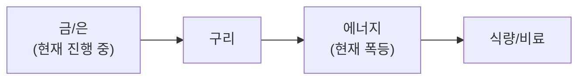

**3월 29일(일), 후티 이스라엘 미사일 공격 참전 + WTI $100 목전 + TurboQuant 과장 확인 + 2차전지 강세.** **후티(예멘)가 이스라엘에 탄도미사일 발사** — 이란전 최초 참전으로 전쟁 다자화. 테헤란 전역 대규모 폭격 지속. 이란 **"휴전 요청한 적 없다"**(아라그치 외무장관) 강경 고수. 파키스탄 국기 선박 **20척 호르무즈 통과** 허용(일 2척). WTI **$99.64** — $100 돌파 초읽기. 이란 호르무즈 **'톨부스' 의회 법안화** 추진 — 연간 **$1,000억+** 수입 가능(석유 수입 3배). 홍장원: **파키스탄 직접 회담 조만간 예상**.

**TurboQuant 과장 확인 → 제번스 역설 → 메모리 수요 증가.** ①**1년 전 연구**(2025.2~4월 논문) ②**"6배 압축" 과장** — 무압축(16비트) 기준, 기존 대비 미미(48.50→50.06점) ③**제번스 역설 확정** — AI 에이전트 토큰 사용량이 일반 대화의 **만 배**, 효율↑→사용량↑→수요↑ ④Vera Rubin 서버 랙 하나에 KV캐시용 **9,600TB SSD 필요**. **2차전지 강세** — LG에너지솔루션·LNF **신고가**. 글로벌 ESS **40%+ 성장**. LG에솔 **140GWh 수주잔고**. 삼성전자 외국인 지분율 **49% 이하**(12.5년 최저). 한국경제TV: 삼성전자 **17~17.5만원 매수 적정**.

**금 $4,492 반등 + BTC $66K 극도 공포 + 환율 1,600원 경고.** 금 **$4,492**(+2.66%), 1월 고점 대비 **-20%+**. "지정학 역설" 지속 — 달러가 안전자산 역할 탈환. JPM **$6,300** EOY(상향), GS **$5,200**. 비트코인 **$66,358**, Fear **13(극도 공포)**. 곽수종 박사: **환율 1,600원 열려 있으며**, 유가 90~100달러 6개월 시 한국 **성장률 0%** 가능. KB증권: **W자 이중 바닥** 패턴 — 2차 바닥이 더 낮을 수 있어 기계적 분할매수 유효.

**SpaceX-테슬라 합병 시나리오 + 사이버캡 첫 생산.** SpaceX 시총 **$1.75T**. 나스닥 **패스트 엔트리**(시총 상위40 → 15거래일 내 즉시 편입). **5배 가중 승수** — 유통 4.3%지만 21.5%로 계산, **$22~37조 패시브 매수** 강제. **테슬라-SpaceX 합병 시** 통합법인 **$3.5T**, S&P 비중 5.7%, **$861조 패시브 매수** 유입. 사이버캡 **첫 생산 유닛 2월 롤오프**(기가텍사스), **4월 양산** 시작. **플라스틱 바디+밀봉 휠+점자 표기** — 극단적 원가 절감+접근성. VIX **27.44(+8.33%)**, SOXX **$323.48(-1.63%)**, BOTZ **$32.46(-2.49%)**.

## 6대 투자 섹터 구조

| 섹터 | 하위 섹터 | 상세 분석 |
|------|----------|----------|
| **1. 반도체/AI** | HBM, DRAM/NAND, 파운드리, 소부장, AI SW/클라우드 | [반도체 섹터](/knowledge/invest/2026/01/21/semiconductor-sector-outlook-2026.html) |
| **2. 에너지** | 원전/SMR, 재생에너지, ESS, 수소 | [에너지 섹터](/knowledge/invest/2026/03/07/energy-sector-outlook-2026.html) |
| **3. 방산/우주** | 방산, 드론/UAM, 우주/위성 | [방산/우주 섹터](/knowledge/invest/2026/03/07/defense-space-sector-outlook-2026.html) |
| **4. 모빌리티/로봇** | EV/자율주행, 로봇, 조선 | [모빌리티/로봇 섹터](/knowledge/invest/2026/01/21/automotive-robotics-sector-outlook-2026.html) |
| **5. 바이오/헬스케어** | 신약/바이오텍, GLP-1/비만치료, 의료AI | [바이오/헬스케어 섹터](#바이오헬스케어-및-생명공학) |
| **6. 자산/거시경제** | 금/은, 암호화폐, 원자재/희토류, 거시경제/정책 | [거시경제/정책 섹터](/knowledge/invest/2026/01/21/macroeconomic-policy-sector-outlook-2026.html) |

### 하위 섹터 상세 링크

**반도체/AI**
- [HBM 투자 전망](/knowledge/invest/2026/01/21/hbm-sector-outlook-2026.html)
- [DRAM/NAND 투자 전망](/knowledge/invest/2026/01/21/dram-nand-sector-outlook-2026.html)
- [파운드리 투자 전망](/knowledge/invest/2026/01/21/foundry-sector-outlook-2026.html)
- [소부장 투자 전망](/knowledge/invest/2026/01/21/semiconductor-materials-equipment-outlook-2026.html)
- [AI 소프트웨어/클라우드](/knowledge/invest/2026/03/07/ai-software-cloud-outlook-2026.html)

**에너지**
- [원전 투자 전망](/knowledge/invest/2026/01/21/nuclear-power-sector-outlook-2026.html)

**방산/우주**
- [방산 투자 전망](/knowledge/invest/2026/01/21/defense-sector-outlook-2026.html)

**모빌리티/로봇**
- [EV/자율주행 투자 전망](/knowledge/invest/2026/01/21/ev-autonomous-driving-outlook-2026.html)
- [로봇 투자 전망](/knowledge/invest/2026/01/21/robotics-sector-outlook-2026.html)
- [조선 투자 전망](/knowledge/invest/2026/01/21/shipbuilding-sector-outlook-2026.html)

**자산/거시경제**
- [원자재/희토류](/knowledge/invest/2026/03/07/commodities-rare-earth-outlook-2026.html)

---

## 미래 워치리스트

| 테마 | 현황 | 주시 포인트 |
|------|------|-----------|
| **양자컴퓨팅** | Google Willow, IBM Heron 등 진전. 상용화 초기 | 오류 정정(QEC) 돌파, 금융/제약 응용 |
| **합성생물학** | AI+유전체 편집 융합 가속 | 바이오 제조, 식량/에너지 응용 |
| **BCI (뇌-컴퓨터 인터페이스)** | Neuralink 임상시험, 경쟁사 등장 | FDA 승인, 의료 응용 확대 |
| **핵융합** | Commonwealth Fusion, TAE 등 민간 투자 확대 | 상용 발전 시점(2030년대 중반 전망) |

---

## 목차

1. [거시적 시장 환경](#거시적-시장-환경)
2. [AI 및 클라우드 컴퓨팅](#ai-및-클라우드-컴퓨팅)
3. [AI 네트워크 인프라](#ai-네트워크-인프라)
4. [반도체 및 첨단 제조](#반도체-및-첨단-제조)
5. [로보틱스 및 자율주행](#로보틱스-및-자율주행)
6. [에너지 전환 및 친환경](#에너지-전환-및-친환경)
7. [바이오헬스케어 및 생명공학](#바이오헬스케어-및-생명공학)
8. [우주산업 및 뉴스페이스](#우주산업-및-뉴스페이스)
9. [방위산업 및 국방기술](#방위산업-및-국방기술)
10. [핀테크, 암호화폐 및 STO](#핀테크-암호화폐-및-sto)
11. [사이버보안 및 데이터 인프라](#사이버보안-및-데이터-인프라)
12. [지정학적 관점: 한국은 1980년대 일본](#지정학적-관점-한국은-1980년대-일본)
13. [초거대 기업들의 전략과 투자 방향](#초거대-기업들의-전략과-투자-방향)
14. [한국 시장 구조 변화](#한국-시장-구조-변화)
15. [섹터별 투자 전략: 3월 실전 가이드](#섹터별-투자-전략-3월-실전-가이드)

---

## 거시적 시장 환경

### 글로벌 증시 현황 (3/29 기준)

| 지수 | 수준 | 변동 | 비고 |
|------|------|----------|------|
| **S&P 500** | **6,369** | **-1.67%** | **SPY $634.09. 기술주 전멸. NVDA -2.2%, MSFT -2.5%, META -4%** |
| **NASDAQ** | **20,948** | **-2.15%** | **459pt 하락. 에너지 비용+스태그플 이중 압박** |
| **KOSPI** | **5,439** | **-0.40%** | **★ 장중 -4% 급락 후 개인매수세로 보합 회복. 3일 연속 하락** |
| **상해종합** | **3,914** | **+0.63%** | 중국 상대적 견조 |
| **항셍** | **24,952** | **+0.38%** | KWEB $27.91(-1.03%) |
| **원/달러** | **~1,504원** | **-** | **★ 곽수종: 1,600원 열려있음. 삼고시대 경고** |
| **Brent** | **$112.57** | **+4.22%** | **★ 2022년 이후 최고. 호르무즈 톨부스 법안화** |
| **WTI** | **$99.64** | **+5.46%** | **★ $100 돌파 초읽기. 장중 $100.04 돌파** |
| **금(Gold)** | **$4,492** | **+2.66%** | **반등 강화. JPM $6,300↑, GS $5,200. 역설 지속** |
| **은(Silver)** | 조정 중 | **$100 전망 유지** | 6년 연속 공급적자 |
| **비트코인** | **$66,358** | **-3.72%** | **★ Fear 13 극도 공포. 달러 강세 직격** |
| **VIX** | **27.44** | **+8.33%** | **★ 공포 재상승. 후티 참전+스태그플 우려** |
| **TLT** | **$85.64** | **-0.55%** | **10Y 4.42%(+9bp), 2Y 3.96%(+12bp), 스프레드 0.56%** |
| **SOXX** | **$323.48** | **-1.63%** | **반도체 약세. 그러나 Micron·WDC TurboQuant 충격 극복 반등** |
| **5Y Breakeven** | **2.56%** | **-** | **OECD 미국 인플레 4.2% 상향. 추가 상승 가능** |
| **실업률** | **4.4%** | **+0.1%p** | **★ Fed 금리인상 확률 52% 사상 첫 돌파** |
| **DXY** | **100.15** | **+1.21%** | **★ 달러=안전자산. 금보다 달러 선호** |

### 이번 주 핵심 변화 (3/29 업데이트)

| 항목 | 변화 | 투자 시사점 |
|------|------|-----------|
| **★★★ 후티(예멘) 이스라엘 미사일 공격** | **이란전 최초 참전. 전쟁 다자화. 테헤란 전역 대규모 폭격 지속** | **전쟁 확대. 호르무즈 리스크 심화** |
| **★★★ WTI $99.64 — $100 목전** | **장중 $100.04 돌파. Brent $112.57(+4.22%). 호르무즈 톨부스 법안화 추진** | **에너지 인플레 본격화. 에너지 15%** |
| **★★★ Fed 금리인상 확률 52%** | **OECD 인플레 4.2% 상향. 4월 동결 95%, 6월 동결 77%** | **금리인하 기대 소멸. 방어 포지션** |
| **★★★ TurboQuant 과장 확인** | **1년 전 연구. 6배=무압축 기준 과장. 제번스 역설→메모리 수요↑** | **반도체 매수 기회. 삼성 17~17.5만원 적정** |
| **★★ 2차전지 ESS 강세** | **LG에솔·LNF 신고가. ESS 40%+ 성장. 140GWh 수주잔고** | **ESS=배터리 핵심 성장 엔진** |
| **★★ 환율 1,600원 경고** | **곽수종: 유가 90~100$ 6개월 시 1,600원, 성장률 0%. 삼고시대** | **한국 리스크↑. 달러 분산 필수** |
| **★★ 금 $4,492 반등 강화** | **+2.66%. JPM $6,300(상향), GS $5,200. 역설 속 반등** | **금 7% 유지. 장기 강세 유효** |
| **★★ KOSPI 개인매수세 방어** | **장중 -4% 급락 후 개인이 보합 회복. W자 이중 바닥 전략** | **분할매수 유효. 코스피 5,200~5,800 박스** |
| **★★ SpaceX-테슬라 합병 시나리오** | **합병 시 $3.5T. $861조 패시브 매수. 5배 가중 승수** | **테슬라 보유+SpaceX 청약 = 양동 작전** |
| **★★ 사이버캡 첫 생산** | **2월 기가텍사스 첫 생산. 4월 양산. 플라스틱 바디 원가 혁신** | **자율주행 상용화 가속** |
| **★ BTC $66,358 극도 공포** | **Fear 13. 달러 강세 직격. 4주 연속 하락** | **위험자산 회피 심화** |

### 핵심 매크로 변수 5가지

#### 1. 이란전쟁 29일차 — 후티 참전 + WTI $100 목전 + 호르무즈 톨부스 법안화

| 항목 | 내용 | 투자 시사점 |
|------|------|-----------|
| **★★★ 후티(예멘) 이스라엘 미사일 공격** | **이란전 최초 참전. 전쟁 다자화. 테헤란 전역 대규모 폭격 지속** | **전쟁 확대→유가 추가 상승 압력** |
| **★★★ WTI $99.64 — $100 목전** | **장중 $100.04 돌파. Brent $112.57(+4.22%). 2022년 이후 최고** | **에너지 인플레 본격화. 에너지 15%** |
| **★★★ 호르무즈 톨부스 법안화** | **이란 의회, 호르무즈 주권·통행료 징수 법안 추진. 연 $1,000억+(석유 3배)** | **수입화=영구적. 휴전해도 톨부스 유지** |
| **★★★ 1973년 오일쇼크 구조** | **게임이론: 이란 우월전략=호르무즈 통제. 휴전해도 경제전쟁 지속** | **유가 $120-150(휴전), $200-300(전면전)** |
| **★★ 이란 "휴전 요청 없다"** | **"협상도, 휴전 요청도 한 적 없다"(아라그치). 미국 제안 "최대주의적, 불합리"** | **외교 채널 완전 붕괴** |
| **★★ 파키스탄 중재** | **파키스탄 국기 선박 20척 호르무즈 통과 허용(일 2척). 직접 회담 임박 전망** | **유일한 중재 채널** |
| **★★ Goldman 유가 전망** | **지정학 프리미엄 $14-18/bbl. "장기 교란 시 2008년 ATH 돌파"** | **$147(2008 ATH) 시나리오 현실화** |
| **★ 각국 각자도생** | **일본: 비축유 국내전용. 호주: 500+ 주유소 연료 바닥. 한국: 나프타 수출금지** | **글로벌 에너지 보호주의** |

**핵심 판단:** **후티(예멘)가 이스라엘에 탄도미사일 발사** — 전쟁이 **이란→이스라엘 양자에서 다자 분쟁으로 확대**. WTI **$99.64** — 장중 **$100.04 돌파**. 이란 의회가 호르무즈 **'톨부스' 법안화** 추진 — 선박당 $200만(연 $1,000억+)으로 **석유 수입의 3배**, 이는 **수입원의 영구화**를 의미하여 휴전해도 톨부스 유지. 아라그치 외무장관 **"휴전 요청한 적 없다"** 강경 재확인. 유일한 돌파구는 **파키스탄 중재** — 20척 선박 통과 허용, 직접 회담 임박(홍장원 분석). **에너지 비중 15% 유지**.

#### 2. 사모신용 $265B 멜트다운 — El-Erian "전염 현상" + $2.1T 시장 2008년 이후 최대 위기

| 항목 | 내용 | 투자 시사점 |
|------|------|-----------|
| **★ Fortune $265B 멜트다운** | **월가 최대 투자 열풍이 패닉으로 전환. $2.1T 시장 2008년 이후 최대 위기** | 시스템 리스크 진행 중 |
| **★ El-Erian 경고** | **"전형적인 전염 현상" — 원하는 걸 못 팔면 팔 수 있는 걸 판다** | 다른 자산 클래스로 전이 우려 |
| **BlackRock** | **$26B 펀드 5% 환매 제한. $25M 대출 전액 손실** | 세계 1위 운용사 위기 |
| **Blackstone** | **BCRED $6.5B(7.9%) 환매 요청. 임직원 $400M 자체 투입** | 전례 없는 자구책 |
| **★ AI 담보 파괴 "SaaS-pocalypse"** | **에이전틱 AI→SaaS 구독 매출 침식. 사모 대출 포트폴리오 40%가 소프트웨어 기업** | 구조적 원인. AI 발전할수록 악화 |
| **사모신용 부도율** | **Fitch: 사모신용 부도율 사상 최고 9.2%** | 악화 가속 |
| **하이일드 스프레드** | **3.28%(+3.47%) — 신용 스프레드 확대 지속** | 전이 신호 |

**판단:** Fortune이 **"$265B 멜트다운"**으로 보도, El-Erian이 **"전형적인 전염 현상"** 경고. Fitch 부도율 **9.2% 사상 최고**. 핵심 원인은 AI(에이전틱 AI)가 SaaS 기업 담보 가치를 구조적으로 파괴하는 **"SaaS-pocalypse"** — 사모 대출 포트폴리오의 **40%가 소프트웨어 기업**. Blackstone BCRED $6.5B 환매에 임직원 $400M 투입이라는 전례 없는 자구책. **하이일드 스프레드 3.28%로 확대 지속**. **현금·금 비중 유지 + 금융주 경계** 필수.

#### 3. KOSPI 5,439 개인매수세 방어 — 장중 -4% 급락 후 보합 회복 + W자 이중 바닥

| 항목 | 내용 | 투자 시사점 |
|------|------|-----------|
| **★★★ 개인투자자 매수세** | **장중 -4% 급락 후 개인매수세로 보합(-0.4%) 회복. 저점 매수 유효** | **개인 = 단기 방어 주체. 분할매수 전략 작동** |
| **★★ W자 이중 바닥** | **KB증권: 1주 15% 하락 사례에서 W자 반등 패턴. 2차 바닥 더 낮을 수 있음** | **V자 기대 금물. 기계적 분할매수** |
| **★★ 외국인 3월 22조+ 매도** | **16거래일 중 13거래일 매도. 삼성 외인 지분율 49% 이하(12.5년 최저)** | **외인 수익 실현 매도. 구조적 이탈 아닌 차익** |
| **★★ 환율 1,600원 경고** | **곽수종: 유가 $90~100 6개월 시 1,600원. 성장률 0%. 물가 20% 상승** | **삼고시대. 한국 경제 최대 리스크** |
| **★★ 2차전지 강세** | **LG에너지솔루션·LNF 신고가. ESS 40%+ 성장. 희토류 탈중국** | **ESS=新성장 엔진. 배터리 반등** |
| **★ 코스피 5,200~5,800 박스** | **하단 매수, 상단 추격매수 자제. 염블리: 기계적 대응** | **박스권 트레이딩 전략** |
| **WGBI 4월 편입** | **8회 분할 편입 시작. $56B+ 외국인 자금 유입** | **구조적 외국인 매수 촉매(중장기)** |

**판단:** KOSPI **5,439(-0.4%)** — 장중 **-4% 급락에서 개인매수세로 보합 회복**이 인상적. KB증권: **W자 이중 바닥** 패턴이 유력하며 2차 바닥이 더 낮을 수 있어 **기계적 분할매수가 정답**. 외국인 3월 **22조+** 매도(삼성 외인 지분율 12.5년 최저)는 구조적 이탈보다 **차익실현** 성격(곽수종). 환율 **1,600원** 경고(유가 $90~100 6개월 시)와 **삼고시대**(고금리·고환율·고물가) 리스크 주의. **2차전지 강세**(LG에솔·LNF 신고가, ESS 40%+)는 방어 섹터 내 공격 기회. **코스피 5,200~5,800 박스권 분할매수 전략 유지**.

#### 4. TurboQuant 과장 확인 → 반도체 매수 기회

| 항목 | 내용 | 투자 시사점 |
|------|------|-----------|
| **★★★ "6배 압축" 과장** | **무압축(16비트) 기준. 기존 최고 대비 미미(48.50→50.06점). 증권가 호들갑** | **과잉반응 확인. 반등 매수 기회** |
| **★★★ 1년 전 연구** | **논문 2025.2~4월 공개. 업계 이미 적용. 카이스트 한인수 교수 참여** | **시장은 이미 알고 있었던 내용** |
| **★★★ 제번스 역설 확정** | **AI 에이전트 토큰=일반 대화 만 배. Vera Rubin 1랙 KV캐시 9,600TB SSD** | **효율↑→사용량 폭증→메모리 수요↑** |
| **★★ Micron·WDC 반등 시작** | **마이크론, 웨스턴디지털 3/27 상승 마감. TurboQuant 충격 극복 신호** | **바닥 확인. 분할 매수 본격화** |
| **★★ 삼성전자 매수 적정가** | **한경TV: 17~17.5만원 매수 적정. 배당수익률 5% 레벨. PBR 무시 수준** | **가치+성장 동시 매력** |
| **★ SK하이닉스 PBR 4배↓** | **PBR 4배 이하 오래 지속 안됨(한경TV). HBM 62% 독점** | **구조적 저평가. 분할 매수** |

**핵심 판단:** TurboQuant **과장 확인** — ①**1년 전 연구**(2025.2~4월) ②"6배"는 **무압축 기준**, 기존 대비 미미(48.50→50.06) ③**증권가와 언론의 호들갑**(SOD 분석). **제번스 역설 확정** — AI 에이전트 토큰 사용량이 일반 대화의 **만 배**, Vera Rubin 1랙에 KV캐시용 **9,600TB SSD** 필요. Micron·WDC **3/27 반등 마감**으로 충격 극복 시작. 삼성전자 **17~17.5만원 매수 적정**(배당수익률 5%), SK하이닉스 **PBR 4배↓는 오래 못 감**. **반도체 비중 21% 유지, 적극 분할 매수 시점**.

#### 5. 금 $4,492 반등 강화 — 역설 지속 + 기관 타겟 상향 + 달러가 안전자산

| 항목 | 현황 | 변화 |
|------|------|------|
| **★★ 금 $4,492 반등** | **+2.66%. 최악 주간 후 반등 강화. $4,250~4,489 레인지** | **$5,589 대비 -20%+. 바닥 형성 중** |
| **★★★ "Golden Paradox"** | **전쟁 속 금 폭락. 달러가 2026년 안전자산 탈환** | **전통적 "전쟁=금 상승" 공식 깨짐** |
| **★★★ Fed 인상 52%** | **연내 인상 확률 52% 사상 첫 돌파. 4월 동결 95%** | **금 기회비용 극대화. 추가 약세 가능** |
| **★★ JPM 타겟 대폭 상향** | **JPM $5,055→$6,300(+25% 상향). GS $5,200. DB $6,000** | **기관 컨센서스 대폭 상향. 장기 강세** |
| **★★ DXY 100.15(+1.21%)** | **달러 강세 지속. 국제 바이어 구매력↓→금 수요↓** | **달러 강세가 금 하방 압력** |
| **★ GS 4월 타겟 $4,600** | **GS 4월 말 $4,600. ①Fed 피벗 시그널 ②중앙은행 매입 ③걸프 매도 소진** | **단기 반등 여력 있음** |

**판단:** 금 **$4,492(+2.66%)**으로 **반등 강화**. JPM이 EOY 타겟을 **$5,055→$6,300**으로 25% 대폭 상향, GS는 4월 **$4,600** 타겟. **"Golden Paradox"** 지속이나 바닥 형성 조짐. **Fed 인상 확률 52%**와 DXY 100+가 금 하방 압력이지만, 중앙은행 매입(분기 585톤) + 기관 타겟 상향이 하방 지지. $4,492 현재가 대비 JPM $6,300은 **40% 업사이드**. **금 7% 유지**, $4,200↓ 시 적극 매수.

### 관세 현황 -- Section 122 15% 발효 중 (7/23 만료)

| 관세 | 세율 | 상태 | 비고 |
|------|------|------|------|
| **글로벌 보편관세** | **15%** | **발효 중** (2/24~) | **150일 한시** (7/23 만료) |
| **중국 관세** | **35~50%** | USTR 유지 | **트럼프-시진핑 정상회담 3월 말 변수** |
| **반도체** | 25%+ | **Section 232 유지** | 별도 법적 근거 |
| **자동차** | **25%** | **4/3 발효 예정** | **현대/기아 직접 타격** |
| **철강/알루미늄** | 25% | **Section 232 유지** | 3/12 발효 |

---

## AI 및 클라우드 컴퓨팅

### 현재 상황 (3월 29일 — TurboQuant 과장 확인 + TeraFab $25B + AI 에이전트 시대 + 2차전지 강세)

Google **TurboQuant** 과장 확인 — ①**1년 전 연구**(논문 2025.2~4월) ②**"6배 압축" 과장**(무압축 기준, 기존 대비 미미) ③**제번스 역설 확정** — AI 에이전트 토큰=일반 대화 **만 배**, Vera Rubin 1랙 KV캐시용 **9,600TB SSD** 필요. Micron·WDC **3/27 상승 마감**으로 충격 극복 시작. 삼성전자 외인 지분율 **49% 이하**(12.5년 최저) — 구조적 이탈 아닌 차익실현. **TeraFab** $25B 공식 런칭(3/21) — Tesla+SpaceX+xAI 합작, 2nm, 80% 우주/20% 지상. 젠슨 황 GTC: **"AI 3번째 변곡점 — AI 에이전트 시대"**. SaaS→**AaaS** 전환. 빅테크 AI CAPEX **~$700B**(+60%). 에이전틱 AI 시장 **$8B→$215B(2035)**.

| 기업 | 2026 AI CAPEX | 핵심 이슈 |
|------|--------------|---------|
| **Amazon** | **$2,000억** | FCF 마이너스 전환 전망 |
| **Alphabet** | **$1,850억** | FCF 90% 감소 전망 |
| **Microsoft** | **$1,450억** | Azure AI 확대 |
| **Meta** | **$1,350억** | FCF 90% 감소 전망 |
| **합계** | **$6,500~7,000억** | 전년 대비 **+60% 이상** |

### 핵심 투자 포인트

| 영역 | 내용 | 전망 |
|------|------|------|
| **AI 칩셋** | 엔비디아 시총 ~$4.31조 | **GTC 진행: $1T 주문, Vera Rubin 10x, Eaton 전력 파트너십** |
| **커스텀 ASIC** | **Broadcom AI $8.4B(+74%)**, **Marvell $0→$1.5B** | 2026년 GPU 출하량 추월 전망 |
| **클라우드 인프라** | AWS, Azure, GCP | $7,000억 투자 직접 수혜 |
| **AI 응용** | CRM, 헬스케어, 금융 AI | 하드웨어 실적 파티 vs 소프트웨어 수익화 미완 |

### 3월 투자 전략

**단기**: **TurboQuant 메모리 충격** — Google AI 메모리 6x 압축으로 MU·WDC·SNDK -3%+. 그러나 소형 모델만 검증, 제본스 역설 적용 → **매수 기회**. **TeraFab $25B** — Tesla+SpaceX+xAI 합작, 2nm. Dan Ives "2027 합병 1단계". 머스크: **"반도체+전력 현재 필요량의 2%"**.

**중기**: 에이전틱 AI 시장 **$8B→$215B(2035)**. AI 에이전트가 일자리 파괴 + 인프라 수요 폭증의 **이중 구조**. H2 **IPO 러시**(Anthropic, OpenAI, SpaceX) 기대.

**리스크**: ①빅테크 AI 해고→소비 둔화→경기 침체, ②유가 $100→데이터센터 전력비 상승, ③AI 칩 수출통제.

### 주요 기업 및 ETF

**대표 기업:**
- 엔비디아 (NVDA): 시총 ~$4.31조. **GTC 마감: Groq 3 LPU 3,500배 + Vera Rubin $1T + CHBM**
- **AMD (AMD)**: MI455X + Helios — Meta 6GW + OpenAI 6GW = **12GW 계약**
- **Broadcom (AVGO)**: AI 매출 **$8.4B(+74%)**, 커스텀 ASIC 리더
- **Marvell (MRVL)**: ASIC 매출 **$0→$1.5B**

**투자 ETF:**
- BOTZ (Global X Robotics & AI ETF)
- ROBO (ROBO Global Robotics & Automation Index ETF)

---

## AI 네트워크 인프라

### 핵심 테마: 데이터센터 ROI의 열쇠

$700B 규모의 AI 데이터센터 투자에서 **네트워크 인프라는 ROI를 결정짓는 핵심 요소**입니다.

### InfiniBand vs Ethernet 경쟁

| 기술 | 대표 기업 | 특징 |
|------|----------|------|
| **InfiniBand** | 엔비디아 (Mellanox) | 현재 AI 학습 표준, 저지연 |
| **Ethernet (AI용)** | Arista Networks, Broadcom | 범용성 우수, 비용 효율적 |

### ★ CPO(Co-Packaged Optics) — 2026년 월가 TOP1 테마

**구리선의 물리적 한계**: 224G SerDes 환경에서 구리 전송 거리가 **50cm까지 축소**. 스킨 이펙트로 열과 전력 소모 급증. **CPO가 유일한 대안** — 광통신 모듈을 칩 패키지에 통합하여 전기→광 신호 변환.

| 항목 | 내용 |
|------|------|
| **시장 성장** | **2026년 양산 시작, 연간 137% 성장** |
| **NVIDIA** | Spectrum-X Photonics (Ethernet CPO) **H2 2026 출시**, Quantum-X IB 115Tb/s |
| **Marvell** | 광통신 포토닉 패브릭스, AEC, DSP, 커스텀 칩. **고점 대비 -30% 저평가** |
| **Credo** | AEC 리타이머, CPO 핵심 부품 |
| **Corning** | 광섬유 소재 공급 |

### 대역폭 에스컬레이션

```
현재: 400G
진행중: 800G
2026-2027: 1.6T (CPO 양산 시작)
2028+: 3.2T
```

각 세대 전환마다 **광트랜시버, 스위치, 광케이블** 수요가 2배씩 증가. **CPO가 1.6T 이상에서 필수 기술**.

### 핵심 투자 기업

| 기업 | 분야 | 핵심 강점 |
|------|------|----------|
| **Arista Networks** | 데이터센터 스위칭 | AI 데이터센터 네트워킹 1위 |
| **Coherent** | 광트랜시버 | 시장 점유율 1위, 800G/1.6T 리더 |
| **Lumentum** | 광학 부품 | 레이저, 광부품 핵심 공급 |
| **Broadcom** | 네트워크 칩 + ASIC | AI 네트워크 + 커스텀 ASIC, **AI $8.4B(+74%)** |

---

## 반도체 및 첨단 제조

### 핵심 이벤트: TurboQuant 메모리 충격 + SK하이닉스 ADR + TeraFab $25B

**TurboQuant 충격 vs 제본스 역설.** Google TurboQuant AI 메모리 압축(KV캐시 3비트, 6x 축소, H100 8x 속도)으로 **MU·WDC·SNDK -3%+** 급락. 그러나 ①소형 모델(7-8B)만 검증 ②논문 2025.4 이미 제출(주요 기업 적용 완료) ③**제본스 역설** 적용. **SK하이닉스 ADR** SEC F-1 비밀 제출(3/24) — $9.6-14.4B, 연내 상장. **TeraFab** $25B 공식 런칭 — Tesla+SpaceX+xAI, 2nm. SOXX **345(+1.24%)**, NVDA **$178.68(+1.99%)** — TurboQuant 충격에도 반도체 견조.

| 항목 | 내용 | 투자 시사점 |
|------|------|-----------|
| **★★★ TurboQuant** | **Google AI 메모리 6x 압축. MU·WDC·SNDK -3%+. 소형 모델만 검증** | **단기 충격, 제본스 역설→매수 기회** |
| **★★★ SK하이닉스 ADR** | **3/24 SEC F-1 비밀 제출. $9.6-14.4B. 연내 상장 목표** | **글로벌 밸류에이션 갭 해소 촉매** |
| **★★ TeraFab $25B** | **Tesla+SpaceX+xAI. 2nm. 80% 우주(D3)/20% 지상(AI5)** | **머스크 반도체 자급. 2027 합병 전망** |
| **★★ Micron Q2 $23.8B** | **매출 3배. 2026~27 완전 매진. HBM4 양산. TurboQuant에도 펀더멘탈 견조** | **슈퍼사이클 지속** |
| **★★ SK하이닉스 HBM4 70%** | **UBS: HBM4 시장점유율 70%. ADR로 글로벌 접근성 확대** | **한국 메모리 지배력+재평가** |
| **★★ Intel $47.18(+7.08%)** | **파운드리+TeraFab 연관 기대감 급등** | **Intel 재평가 진행** |
| **★ SOXX $345(+1.24%)** | **TurboQuant 충격에도 반도체 견조** | **펀더멘탈>단기 이슈** |
| **★ NVDA $178.68(+1.99%)** | **$175→$179 반등. $1T 매출 전망 유지** | **장기 최강** |
| **★ CPO 양산 시작** | 2026년 변곡점, 연간 137% 성장 | AI 네트워크 핵심 |
| **반도체 $975B** | **+25% YoY. 메모리 +30%. $1T 임박** | 기가사이클 가속 |

### 한국 메모리의 기가사이클

**SK하이닉스 HBM 시장 점유율 62%**로 압도적 1위. **삼성은 HBM4 PRA 완료**로 양산 본격화 임박.

핵심 포인트:
- **SK하이닉스**: HBM 62% 점유, 16단 48GB HBM4 공개
- **삼성 HBM4 PRA 완료**: 세계 최초 양산 출하, 대역폭 3.3TB/s
- **DRAM Q1 +90~95%**: 역사적 기록
- **SIA $1T**: 2026년 글로벌 매출 $1조 돌파 전망

### 3월 투자 전략

**핵심 전략: GTC 촉매 대기 + DRAM 슈퍼사이클 + 오일 쇼크 디커플링**

1. **삼성전자**: HBM4 PRA 완료 + MS 2027 OP 317조 + DRAM Q1 +95%. KOSPI 폭락으로 저가 매수 기회.
2. **SK하이닉스**: HBM 62% 점유율, PER 극저. DRAM Q2 추가 상승.
3. **엔비디아**: 시총 $4.31T. **GTC 3/16~19 핵심**. Vera Rubin + Feynman + NVL144.
4. **커스텀 ASIC**: Broadcom AI $8.4B(+74%), Marvell $1.5B.
5. **소부장**: 한미반도체(영업이익률 50%, TC 본더 71.2%), HPSP(55%), 리노공업(48%).

### 주요 기업

| 카테고리 | 주요 기업 | 현황 |
|----------|----------|------|
| **AI 칩** | 엔비디아, AMD | GTC 3/16~19, SOXX +3.98% |
| **파운드리** | TSMC, 삼성전자 | TSMC N2 램프 |
| **메모리** | 삼성전자, SK하이닉스 | SK 62% HBM, DRAM Q1 +95% |
| **커스텀 ASIC** | Broadcom, Marvell | Broadcom AI $8.4B(+74%) |
| **소부장** | 한미반도체, HPSP, 리노공업 | 고수익성 지속 |
| **장비** | ASML, 램리서치 | ASML 분기 주문 EUR132억 기록 |

**ETF:**
- SMH (VanEck Semiconductor ETF)
- SOXX (iShares Semiconductor ETF) — **+3.98% (오일 쇼크 속 반등)**

---

## 로보틱스 및 자율주행

### 현재 상황: 자율주행 변곡점 + 옵티머스 여름 양산 + 사이버캡 4월

| 항목 | 내용 | 시사점 |
|------|------|--------|
| **★★ Waymo 20도시·주100만회** | **2026년 20개 도시 확장. 주 100만 라이드 목표** | 자율주행 상용화 본격화 |
| **★★ CES 자율주행 전환** | **CES 2026 모빌리티 트렌드: EV→자율주행으로 전환** | 산업 변곡점 확인 |
| **★ 옵티머스 3 여름 양산** | **2026년 여름 초기 생산 확정**(머스크 공식 발표). 2027년 여름 대량 생산 | 타임라인 구체화 |
| **★ 기가텍사스 로봇 공장** | **900만 sq ft(25만평) 전용 공장**. 기존 공장 합산 57만평 = 여의도 66% | 대규모 투자 확인 |
| **양산 목표** | 프리몬트 연간 100만 대, **기가텍사스 연간 1,000만 대** | <$20K, 소프트웨어 구독 $200/월 |
| **★★ 사이버캡 첫 생산+4월 양산** | **2/17 기가텍사스 첫 롤오프. 4월 양산. 플라스틱 바디+밀봉 휠+점자 표기** | **극단적 원가 절감. 웨이모 압도** |
| **AV 시장 $39.3B** | **2026년 글로벌 AV 시장 $39.3B. 4.3만 대** | 급성장 초입 |
| **Zoox+Uber** | **Zoox, Uber 자율주행 라이드 서비스 2026년 출시** | 경쟁 가속 |
| **★ X머니 4월 출시** | **비자 제휴, 메탈 카드, 탭투페이**. FSD/로보택시/에너지 결제 통합 | 테슬라 생태계 수익화 |
| **중국 로봇 90% 점유** | 중국 기업들이 글로벌 판매량 90%+ 장악 | 경쟁 리스크 주의 |
| **자동차 관세 25%** | 4/3 발효 예정 | 현대/기아 직접 타격 |

### 한국 로봇 섹터

- 두산로보틱스: 협동 로봇 리더
- 레인보우로보틱스: 휴머노이드 로봇 개발
- 현대차/보스턴다이나믹스: 기업가치 ~55조원
- **주의**: 중국 휴머노이드 로봇 **87-90%** 점유 — 경쟁 리스크 최대

**ETF:**
- BOTZ (Global X Robotics & AI ETF)
- ROBO (ROBO Global Robotics & Automation Index ETF)

---

## 에너지 전환 및 친환경

### 후티 참전 + WTI $100 목전 + 톨부스 법안화 + 2차전지 강세

| 항목 | 내용 |
|------|------|
| **★★★ 후티(예멘) 참전** | **이스라엘에 탄도미사일 발사. 전쟁 다자화. 테헤란 전역 대규모 폭격 지속** |
| **★★★ WTI $100 목전** | **$99.64(+5.46%), 장중 $100.04 돌파. Brent $112.57(+4.22%)** |
| **★★★ 톨부스 법안화** | **이란 의회, 호르무즈 주권·통행료 징수 법안 추진. 연 $1,000억+(석유 3배)** |
| **★★ 이란 "휴전 요청 없다"** | **아라그치: 협상도, 휴전 요청도 없다. 미국 제안 "최대주의적, 불합리"** |
| **★★ 파키스탄 중재** | **파키스탄 국기 선박 20척 통과 허용. 직접 회담 임박 전망** |
| **★★ 2차전지·ESS 강세** | **LG에솔·LNF 신고가. ESS 40%+ 성장. 140GWh 수주잔고** |
| **★★ 걸프 인프라 누적** | **이라크 FM(900K) + 쿠웨이트 730K + 카타르 LNG 17% = ~3M bpd** |
| **★ OECD 인플레 4.2%** | **미국 인플레 전망 2.8%→4.2% 상향. 유가 $110+ 반영** |
| **미국 원전 $80B** | 신규 원전 펀딩, AI 데이터센터 전력 수요 |

### 에너지 시나리오 (3/29 기준)

| 시나리오 | 유가 전망 | 확률 | 영향 |
|---------|----------|------|------|
| **봉쇄 지속 + 톨부스 영구화** | **$95~120** | **★★★ 최고 (45%)** | **후티 참전+톨부스 법안화. WTI $100 기본선 상향** |
| **위기 확전·다자화** | **$120~200** | **중-고 (35%)** | **후티+사우디·UAE 참전 가능. 다자전쟁→유가 폭등** |
| **파키스탄 중재 + 부분 협상** | **$85~100** | **중-저 (15%)** | **파키스탄 선박 통과 허용=유일한 디에스컬레이션 신호** |
| **외교적 해결** | **$65~80** | **매우 저 (5%)** | **이란 "휴전 요청 없다" 재확인. 거의 불가능** |

**시나리오 변화:** **후티 참전**으로 전쟁 다자화 + 톨부스 **법안화**(수입원 영구화) → 봉쇄 기본선을 **$95~120**으로 상향. WTI **$100이 뉴노멀**. 유일한 디에스컬레이션 신호는 파키스탄 중재(20척 통과 허용, 직접 회담 임박). 홍장원: 트럼프는 "**지쳐가고 있으며** 승리 선언 후 넘어가고 싶어 하는" 심리 — 주말 파키스탄 회담 일정 발표 여부가 다음 주 핵심.

### 핵심 하위 섹터

#### 원전 (Nuclear Renaissance) -- 에너지 안보 + AI 전력 수요

AI 데이터센터 전력 수요 + 이란 전쟁 에너지 안보 + 탈탄소 정책 삼중 호재.

| 항목 | 내용 | 투자 시사점 |
|------|------|-----------|
| **우라늄** | +32% YoY | 구조적 공급 부족 |
| **i-SMR 규제심사 착수** | 한국 SMR 규제 프로세스 시작 | 상용화 가시화 |
| **미국 $80B 신규 원전** | NuScale SMR 규제 승인 | 원전 르네상스 가속 |
| **KHNP 태국·필리핀** | 원전 수출 파이프라인 확대 | K-원전 해외 수주 |

#### 배터리/ESS -- 2차전지 강세 + ESS 40%+ 성장 + 희토류 탈중국

**2차전지 신고가 + ESS 폭발적 성장.** LG에너지솔루션·LNF **신고가** 기록. 글로벌 ESS 설치 **40%+ 성장** 전망. LG에솔 **140GWh 수주잔고**(북미 그리드+데이터센터). 매출 **15~20% 성장** 가이던스(ESS 주도). 글로벌 EV 성장률 **40%+**, 미국 **200%** 성장(한경TV). **희토류 탈중국** — LS에코에너지·JS링크가 호주 라이너스와 전략적 파트너십.

| 항목 | 내용 | 투자 시사점 |
|------|------|-----------|
| **★★ ESS 40%+ 성장** | **LG에솔 ESS 140GWh 수주잔고. 그리드+데이터센터+유틸리티** | **ESS=배터리 핵심 성장 엔진** |
| **★★ LG에솔·LNF 신고가** | **ESS 주도 매출 성장 15~20%. EV 둔화를 ESS가 상쇄** | **2차전지 반등 본격화** |
| **★ 희토류 탈중국** | **LS에코에너지+라이너스(호주). 전략적 공급망 구축** | **희토류 밸류체인 투자 기회** |
| **추천 종목** | **LG에너지솔루션(ESS 비중 최대), LNF(하이니켈+테슬라), 포스코퓨처엠** | **ESS 비중 높은 기업 우선** |

### 투자 ETF

- ICLN (iShares Global Clean Energy) — **+3.04%**
- LIT (Global X Lithium & Battery Tech) — **+3.57%**
- URA (Global X Uranium ETF)

---

## 바이오헬스케어 및 생명공학

### 스태그플레이션 방어 + GLP-1 경쟁 구도 변화

오일 쇼크 + 스태그플레이션 환경에서 **방어적 헬스케어 매력도 상승**.

### 핵심 투자 포인트

#### GLP-1 비만 치료제

| 기업 | 현황 | 전망 |
|------|------|------|
| **Eli Lilly (LLY)** | GLP-1 시장 지배, EPS $35 전망(2026) | Mounjaro/Zepbound 선도 |
| **Novo Nordisk (NVO)** | 1년간 56% 하락, 경쟁 심화 | 저평가, $70 목표가 |
| **Viking Therapeutics** | 2상 결과 13주 14.7% 체중 감량 | 신규 경쟁자 |

#### AI 신약 개발

- 엑셀런시아, 리커전: AI 기반 약물 발견
- 빅테크 진출: 구글 DeepMind, 아마존 헬스케어

### 투자 ETF

- XBI (SPDR S&P Biotech ETF)
- IBB (iShares Biotechnology ETF)
- ARKG (ARK Genomic Revolution ETF)

---

## 우주산업 및 뉴스페이스

### 현재 상황: 방산 급등과 함께 우주 관련 수혜

| 기업/영역 | 내용 | 전망 |
|----------|------|------|
| SpaceX-xAI 합병 | 역삼각합병 추진 중 | 우주+AI 시너지 |
| 한화에어로스페이스 | K-방산/우주 대표주 | 수주잔고 100조+ |
| 로켓랩 (RKLB) | 소형 위성 발사 전문 | 트럼프 국방부 관심 |

### 트럼프 국방 정책과 우주

트럼프 행정부의 **FY2027 국방비 $1.5조 제안**에서 우주가 최우선 분야.

**투자 ETF:**
- UFO (Procure Space ETF)
- ARKX (ARK Space Exploration ETF)

---

## 방위산업 및 국방기술

### 현재 상황: $1.01T 예산(+13.4%) + 억만장자 $28B 증가 + 4배 증산 + ITA +14% YTD

방산이 2026년 최대 수혜 섹터. 미국 FY2026 **$1.01T 예산(+13.4%)**. 방산 억만장자 자산 3개월 만에 **$28B 증가**. **6대 미국 방산사 무기 4배 증산 서약**. Rheinmetall **매출 40-45% 성장**. 글로벌 CAPEX **+38%**. AI·사이버·우주·미사일 방어에 투자 집중.

| 항목 | 내용 | 시사점 |
|------|------|--------|
| **★★ 방산 4배 증산** | **RTX, Lockheed, Boeing, Northrop, BAE, L3Harris 백악관에서 4배 증산 서약** | **이란전 재고 보충 + 장기 수요 폭증** |
| **★ ITA +14% YTD** | **미국 방산 ETF 압도적 성과** | 방산 = 2026년 최강 섹터 |
| **★ Rheinmetall +40-45%** | **2026년 매출 40-45% 성장 전망. 사상 최대 수주잔고** | 유럽 방산 붐 대표주 |
| **★ Leonardo 수익 2배** | **이탈리아 방산, 2030년까지 수익 2배 목표** | EU 방산 투자 수혜 |
| **방산 CAPEX +38%** | 글로벌 방산 투자 38% 증가 전망 | 장기 성장 사이클 |
| **청궁-II 실전 검증** | UAE에서 명중률 90% — 실전 실증 | K-방산 신뢰도 구조적 상향 |
| **EU ReArm 8,000억유로** | EU 정상 합의 (~1,250조원) | K-방산 유럽 수출 대폭 확대 |
| **NATO 방위비 GDP 5%** | 2035년까지 목표 상향 (기존 2%) | 글로벌 방산 장기 수요 |
| **AeroVironment** | **드론(이란전 실전 검증) + 우주 + 자율수중차. BlueHalo 인수** | 중소형 방산 유망주 |

### 조선 -- 호르무즈 봉쇄 + LNG 용선율 $200K+ + 슈퍼사이클

| 항목 | 내용 |
|------|------|
| **HD현대 LNG 4척 ₩1.49T** | LNG 용선율 $200K+ (기존 대비 2배) |
| **호르무즈 봉쇄** | 선박 통행 불가, 해군함·호위함 수요 급증 |
| **3대 조선사 수주 목표** | $464억(+30%) |
| **LNG선 전망** | 2026년 글로벌 115척 발주 전망 (+24%) |

### 주요 기업

**주요 기업:** 한화에어로스페이스 (수주잔고 100조+, 청궁-II 실전 검증), 한화오션 (캐나다 잠수함 48조), HD현대중공업 (LNG 4척 ₩1.49T), LIG넥스원 (사우디 L-SAM), HD한국조선해양 (수주 35조)

**투자 ETF:**
- ITA (iShares U.S. Aerospace & Defense ETF) — **+14% YTD**
- XAR (SPDR S&P Aerospace & Defense ETF)
- SHLD (Global X Defense Tech ETF)

---

## 핀테크, 암호화폐 및 STO

### STO 법안 국회 통과 -- 2026년 상반기 토큰증권 원년

| 항목 | 내용 |
|------|------|
| **법안 통과** | **2026.1.15 국회 통과** |
| **시행** | 2027년 1월 시행 |
| **시장 전망** | 2026년 상반기 STO 시장 원년 |
| **2030년 시장 규모** | 약 **367조원** |

### 자산 현황: 금·은·비트코인

| 자산 | 현재 | 전망 | 포지션 |
|------|------|------|--------|
| **금(Gold)** | **$4,492/oz** (+2.66%) | **반등 강화. JPM $6,300(상향), GS $5,200. 바닥 형성 중** | **비중 7% 유지, $4,200↓시 적극 매수** |
| **은(Silver)** | 조정 중 | $100 전망, 6년 연속 공급적자 | **유지** |
| **비트코인** | **$66,358** (-3.72%) | **극도 공포. Fear 13. 달러 강세 직격** | **소규모 유지** |

**금 판단:** $4,492(+2.66%)로 **반등 강화**. JPM EOY 타겟 **$5,055→$6,300** 대폭 상향. GS **$5,200**, DB **$6,000**. 기관 컨센서스 대폭 상향이 장기 강세 논리 강화. 중앙은행 매수(분기 585톤) + 미국 재정적자가 구조적 지지. **비중 7% 유지**, $4,200↓ 시 적극 매수.

**비트코인 판단:** $66,358(-3.72%), **Fear 13 극도 공포**(2025.10 이후 최저). 후티 참전→전쟁 확대로 위험자산 회피 심화. 달러 강세 직격. 레버리지 금지, **소규모 유지**.

**ETF:**
- BITO (ProShares Bitcoin Strategy ETF)
- BLOK (Amplify Transformational Data Sharing ETF)

---

## 사이버보안 및 데이터 인프라

### 현재 상황

이란 전쟁 9일차로 **이란발 사이버 보복 공격 가능성 지속**. AI 칩 수출통제로 보안 인프라 수요도 구조적 증가. 팔란티어는 피터 틸이 일본 다카이치 총리와 회담하며 **미일 방산 AI 소프트웨어 협업** 기대감.

### 핵심 기업

| 분야 | 기업 | 강점 |
|------|------|------|
| 네트워크 보안 | 팔로알토, 포티넷 | 차세대 방화벽 |
| 클라우드 보안 | 크라우드스트라이크, 제트스케일러 | EDR, 제로 트러스트 |
| AI 보안 | 팔란티어 | 전장 AI, 데이터 분석 |

### 투자 ETF

- CIBR (First Trust NASDAQ Cybersecurity ETF)
- HACK (ETFMG Prime Cyber Security ETF)

---

## 지정학적 관점: 한국은 1980년대 일본

### 핵심 프레임: 미중 경쟁 수혜 + 이란 전쟁 방산 수혜 + 에너지 의존 취약성

미-중 기술 패권 경쟁에서 한국이 **미국의 핵심 동맹 공급국**으로서 구조적 수혜. 이란 전쟁 + 청궁-II 실전 검증으로 K-방산 신뢰도 구조적 상향. 그러나 **에너지 자급률 19%로 오일 쇼크에 가장 취약한 선진국 중 하나**.

### 한국의 글로벌 핵심 공급 분야

| 분야 | 한국 위상 | 핵심 기업 |
|------|----------|----------|
| **HBM** | 글로벌 양강, SK하이닉스 62% | SK하이닉스, 삼성전자 |
| **전력/변압기** | 핵심 공급국 | 현대일렉트릭, LS산전 |
| **조선** | 글로벌 1위, LNG $200K+ 용선율 | HD한국조선해양, 삼성중공업 |
| **K-배터리** | 글로벌 3강 | LG에너지솔루션, 삼성SDI |
| **K-방산** | 수주잔고 100조+, 청궁-II 실전 검증 | 한화에어로스페이스, LIG넥스원 |
| **로보틱스** | 로봇밀도 세계 1위 | 두산로보틱스, 현대로보틱스 |

### 미국 전략적 수혜 섹터

| 우선순위 | 섹터 | 정책 |
|---------|------|------|
| 1순위 | **에너지** | 에너지 독립(자급률 105%), S&P 500 견조 |
| 1순위 | **방산/우주** | ITA +14% YTD, CAPEX +38%, 이란 전쟁 |
| 2순위 | **반도체** | SIA $1T, SOXX +3.98%, GTC 3/16 |
| 2순위 | **AI** | $700B CAPEX |
| 3순위 | **암호화폐** | Clarity Act 법제화 추진 |

---

## 초거대 기업들의 전략과 투자 방향

### $700B AI 투자의 흐름: 공급망 수혜 지도

```
AI 칩 → 엔비디아($4.31조, GTC 3/16~19), AMD, TSMC
커스텀 ASIC → Broadcom(AI $8.4B, +74%), Marvell($0→$1.5B)
데이터센터 네트워크 → Arista, Coherent, Lumentum
서버/메모리 → SK하이닉스(HBM 62%), 삼성전자(HBM4 PRA 완료)
냉각 시스템 → LG전자(공조), SK이노베이션(액침 냉각)
전력 인프라 → 원전(i-SMR), 우라늄
```

### 테슬라의 전략적 피벗 -- SpaceX 합병 + 사이버캡 + 옵티머스 + 3열 SUV

| 전략 | 내용 | 의미 |
|------|------|------|
| **★★ SpaceX 합병 시나리오** | **합병 시 통합 $3.5T. S&P 비중 5.7%. $861조 패시브 매수. 의결권 25% 달성** | **"양동 작전" — 테슬라 보유+SpaceX 청약** |
| **★★ 사이버캡 첫 생산** | **2/17 기가텍사스 첫 롤오프. 4월 양산. 플라스틱 바디+밀봉 휠+점자 표기** | **극단적 원가 절감. 웨이모 압도** |
| **★ Optimus 3 여름 양산** | **2026년 여름 초기 생산 확정**. 기가텍사스 900만 sq ft | 자동차→노동력 기업 전환 |
| **★ 3열 SUV 개발 시사** | **머스크 "알았다" — 3열 전용 SUV 개발 암시. 공간+문 구조 핵심** | 가족 시장 공략 |
| **★ X머니 4월 출시** | **비자 제휴, 메탈 카드, 탭투페이** | 테슬라 생태계 결제 통합 |
| **나스닥 5배 가중 승수** | **SpaceX 유통 4.3%→21.5% 가중. QQQ 등 $22~37조 강제 매수** | IPO 시 대규모 패시브 유입 |

---

## 한국 시장 구조 변화

### KOSPI: 5,439(-0.40%) — 개인매수세 방어 + W자 이중 바닥 + 환율 1,600원 경고

2/26 사상최고(6,307) → 3/4 -12.64%(사상 최대 폭락) → 3/11 +8.28% → 3/19 5,925(+5.04%) → 3/25 5,696(+5.37%) → 3/26~27 조정 → **3/27 5,439(-0.40%)**. 장중 **-4% 급락** 후 개인매수세로 **보합 회복**. EWY 1W **-9.59%**, 3M **+26.23%**. 곽수종: **환율 1,600원 열려 있음**, 성장률 **0%** 가능.

| 항목 | 3/4 | 3/11 | 3/19 | 3/23 | 3/25 | 3/26 | **3/27** |
|------|------|------|------|------|------|------|------|
| **KOSPI** | -12.64% | +8.28% | +5.04% | -4.57% | +5.37% | -2.04% | **-0.40% (5,439)** |
| **핵심** | 서킷브레이커 | 대반등 | 급등 | 패닉 | 급반등 | TQ충격 | **★ 개인방어** |

### 글로벌 자금 흐름 (Fund Flow)

| 국가 | ETF | 1W | 1M | 3M | 시사점 |
|------|------|-----|------|------|--------|
| **🇰🇷 한국** | EWY $121 | **-9.59%** | -20.08% | +26.23% | **★ 1W 글로벌 최악. 외인 30조 매도** |
| 🇺🇸 미국 | SPY $634 | -3.25% | -7.31% | -7.89% | 기술주 전멸. 에너지만 상승 |
| 🇹🇼 대만 | EWT $69 | -3.70% | -8.17% | +10.27% | 반도체 약세 동조 |
| 🇮🇳 인도 | INDA $46 | -3.80% | -12.34% | -14.9% | 3M 최악. 구조적 자금 유출 |
| 🇯🇵 일본 | EWJ $81 | -2.54% | -11.84% | +0.57% | 엔약세 + 에너지 보호주의 |
| 🇨🇳 중국 | FXI $35 | -1.50% | -6.52% | -10.48% | 상대적 방어 |
| 🇧🇷 브라질 | EWZ $37 | -0.60% | -5.42% | +15.83% | 원자재 수혜. 1W 최강 |

**핵심:** EWY 1W **-9.59%**(글로벌 최악) vs 3M **+26.23%**(글로벌 2위) — 단기 급락이나 3M 기준 여전히 강세. 곽수종: 외인 매도는 "100조 중 30~50조 차익실현"이지 구조적 이탈 아님.

### ★ 한국 자산시장 대전환 — 부동산·예금 → 주식

| 항목 | 내용 | 투자 시사점 |
|------|------|-----------|
| **대통령 ETF 매수 선언** | 분당 아파트 매각, ETF 매수 | 정부 차원의 주식 투자 장려 |
| **상법 개정** | 배당소득 분리과세, 자사주 의무소각 | 자본시장 친화 정책 |
| **국민성장펀드 150조** | 민간 75조 + 정부 75조 | 코스닥 15조 유입 |
| **고객예탁금 130조** | 사상 최고 | 투자 대기 자금 극대화 |
| **MSCI 선진지수** | 환율시장 개방 추진 | WGBI 4월 편입과 시너지 |

### 배당 ETF: 고변동성 시기 방어

| ETF | 특징 | 수익률 |
|-----|------|--------|
| **PLUS 고배당주 위클리 커버드콜** | 주간 콜옵션 매도 | 분배율 **20.55%** |
| **KODEX 코리아 밸류업 토탈리턴** | 밸류업 + 토탈리턴 | **101.87%** |
| KODEX 200 타겟위클리 커버드콜 | 주간 콜옵션 매도 | 연 **17%** 배당 |

---

## 섹터별 투자 전략: 3월 실전 가이드

### 핵심 전략: "후티 참전 + TurboQuant 해소 + 2차전지 강세 → 반도체 매수 + 에너지 유지 + 현금 방어"

3월 29일 기준 핵심 전략:

1. **후티 이스라엘 미사일 공격**: 전쟁 다자화. **에너지 15% 유지**
2. **TurboQuant 과장 확인**: 1년 전 연구, 6배 과장. **반도체 매수 기회. 삼성 17~17.5만원**
3. **2차전지 ESS 강세**: LG에솔·LNF 신고가. ESS 40%+ 성장. **ESS=新성장 엔진**
4. **Fed 금리인상 52%**: 사상 첫 50% 돌파. **성장주 리스크. 방어 모드**
5. **이란 호르무즈 톨부스 법안화**: 연 $1,000억+. **수입원 영구화**
6. **환율 1,600원 경고**: 곽수종 — 유가 $90~100 6개월 시. **한국 최대 리스크**
7. **VIX 27.44(+8.33%)**: 공포 재상승. **현금 20% 유지**
8. **금 $4,492 반등 강화**: JPM $6,300 상향. **금 7% 유지**
9. **SpaceX-테슬라 합병**: $3.5T 통합. $861조 패시브 매수. **양동 작전**
10. **W자 이중 바닥**: KB증권 — 2차 바닥 가능. **기계적 분할매수**
11. **다음 핵심**: ★★★ ~4/5 유예 만료, 4/3 자동차 관세 발효, 4월 사이버캡 양산, WGBI 4월 편입

### 상품 사이클 순서 (commodity cycle)



현재 금/은 → 에너지가 **동시에 급등** 중. 식량/비료가 다음 사이클 후보.

### 자산 상관관계 (3/29 기준)

| 자산 | 방향 | 최신 수준 | 근거 |
|------|------|---------|------|
| **★★★ 유가(Oil)** | **★ 폭등** | **Brent $112.57, WTI $99.64** | **$100 돌파 초읽기. 후티 참전. 톨부스 법안화** |
| **★★★ 달러(DXY)** | **★ 급등** | **100.15 (+1.21%)** | **안전자산 탈환. 금·BTC 대체** |
| **★★★ VIX** | **★ 급등** | **27.44 (+8.33%)** | **후티 참전+스태그플+Fed 인상 삼중 공포** |
| **★★ 금(Gold)** | **반등 강화** | **$4,492 (+2.66%)** | **JPM $6,300 상향. 바닥 형성 중** |
| **★★ 비트코인** | **★ 급락** | **$66,358 (-3.72%)** | **Fear 13 극도 공포. 달러 강세 직격** |
| **★★ KOSPI** | **방어** | **5,439 (-0.40%)** | **★ 장중 -4% 후 개인매수세 보합 회복** |
| **★★ 반도체** | **바닥 형성** | SOXX $323.48(-1.63%) | **TurboQuant 해소. Micron·WDC 반등 시작** |
| **★★ S&P 500** | **하락** | **6,369 (-1.67%)** | **기술주 전멸. 에너지 비용 압박** |
| **★★ 2차전지** | **★ 강세** | **LG에솔·LNF 신고가** | **ESS 40%+ 성장. 140GWh 수주** |
| **★ 에너지주** | **★ 상승** | **XLE $62.56 (+1.69%)** | **유일한 양수 섹터. 유가 $100 수혜** |
| **★ 방산주** | **상대적 방어** | +22% YTD | 후티 참전→방산 수요↑ |
| **은(Silver)** | **조정** | $100 전망 유지 | 6년 공급적자 |
| **TLT** | **하락** | **$85.64 (-0.55%)** | **10Y 4.42%(+9bp). Fed 인상 52%** |

### 포트폴리오 구성 제안

**후티 참전 + TurboQuant 해소 + 2차전지 강세 → 반도체 매수 + 에너지 유지 + 현금 방어**

#### 전일 대비 변동 (3/29 vs 3/28)

| 섹터 | 전일 비중 | 금일 비중 | 변동 | 변동 사유 |
|------|----------|----------|------|----------|
| AI/반도체 | 21% | 21% | - | TurboQuant 과장 확인→매수 기회. Micron·WDC 반등 시작 |
| 방산/조선 | 23% | 23% | - | 후티 참전→전쟁 다자화. 방산 수요 구조적 증가 |
| 에너지/원전 | 15% | 15% | - | WTI $100 목전. 톨부스 법안화. 2차전지·ESS 40%+ 강세 |
| 금 | 7% | 7% | - | $4,492 반등 강화. JPM $6,300 상향. 바닥 형성 |
| 은 | 2% | 2% | - | $100 전망 유지. 6년 공급적자 |
| 로봇/자율주행 | 5% | 5% | - | 사이버캡 4월 양산. SpaceX 합병 시나리오 |
| AI 네트워크/CPO | 3% | 3% | - | CPO 변곡점 유지 |
| STO/핀테크 | 0% | 0% | - | 제외 |
| 현금 | 20% | 20% | - | VIX 27.44. Fed 인상 52%. W자 이중 바닥 대비 |
| 바이오/헬스 | 2% | 2% | - | 방어적 포지션 유지 |

#### 추천 종목 (실제 종목/ETF)

| 섹터 | 추천 종목 (티커) | 추천 사유 | 현재가/밸류에이션 |
|------|----------------|----------|-----------------|
| AI/반도체 | **삼성전자**, **SK하이닉스**, NVDA, SOXX(ETF), Micron(MU) | **★ TurboQuant 해소→매수 기회. 삼성 17~17.5만원 적정(배당 5%). SK PBR 4배↓** | NVDA $167.52, SOXX $323.48 |
| 방산/조선 | 한화에어로스페이스, LIG넥스원, HD한국조선해양, ITA(ETF), KTOS | **후티 참전→전쟁 다자화. 방산예산 $1.01T. 구조적 수요** | ITA +22% YTD |
| 에너지/원전 | **LG에너지솔루션**, 두산에너빌리티, Cameco(CCJ), **XLE(ETF)** | **★ ESS 40%+ 성장, 140GWh 수주. WTI $100 목전** | XLE $62.56, LIT $71.91 |
| AI 네트워크/CPO | **Marvell(MRVL)**, Credo(CRDO) | **CPO 변곡점 유지** | MRVL 고점 -30%+ |
| 금 | GLD, IAU, KODEX 골드선물(H) | **JPM $6,300(상향), GS $5,200. $4,492는 40% 업사이드** | $4,492 |
| 은 | SLV, PSLV, 고려아연 | **$100 전망, 6년 공급적자** | 공급적자 구조 |
| 로봇/자율주행 | **테슬라(TSLA)**, Waymo(GOOGL), 두산로보틱스, BOTZ(ETF) | **사이버캡 4월 양산. SpaceX 합병 시나리오. 양동 작전** | BOTZ $32.46 |
| 바이오 | Eli Lilly(LLY), **유나이티드헬스(UNH)**, Viking(VKTX) | **UNH 방어 섹터. 스태그플레이션 환경** | 방어 섹터 |

**※ 종목 추천은 참고용이며, 투자 판단은 본인 책임입니다.**

#### 공격적 투자자

| 섹터 | 비중 | 근거 |
|------|------|------|
| **AI/반도체 (HBM·메모리)** | **21%** | **SK하이닉스 ADR(PER 16). HBM 57%. TurboQuant 후 분할 매수** |
| **방산/조선** | **23%** | **이란 확전+방산예산 $1.01T(+13.4%). 구조적 수요 최강** |
| **에너지/원전** | **15%** | **★ WTI $99.64 $100 목전. 1973년 구조 반복. 에너지 유일 양수** |
| **금** | **7%** | **JPM $6,300, GS $5,400. $4,433은 42% 업사이드. 역설 속 매수** |
| **은** | **2%** | **$100 전망, 6년 공급적자** |
| 로봇/자율주행 | **5%** | **옵티머스 대량생산 전환. 아필라 중단→경쟁 약화** |
| AI 네트워크/CPO | 3% | CPO 변곡점 유지. 비중 조정 |
| 바이오/헬스 | **2%** | **방어 섹터. 스태그플레이션 환경 유리** |
| **현금** | **20%** | **★ VIX 27.44. Fed 인상 52%. 극도 공포. 방어 최우선** |

#### 균형 투자자

| 섹터 | 비중 | 근거 |
|------|------|------|
| **AI/반도체** | **15%** | GTC 수혜. VIX 23 반영 |
| **방산/조선** | **19%** | 이란 전쟁 장기화, CAPEX +38% |
| **에너지/원전** | **12%** | WTI $96, 원전 수혜 |
| **금** | **13%** | $5,016, 사모신용→안전자산, Goldman $5,400 |
| 배당 ETF | 7% | VIX 23으로 하락, 방어 유지 |
| 바이오/헬스 | 3% | 방어 섹터 |
| 로봇/자율주행 | 3% | TeraFab D-3, 로보택시 확장 |
| AI 네트워크/CPO | 3% | CPO 변곡점, Eaton 파트너십 |
| **은** | **2%** | $100 전망, 6년 공급적자 |
| **현금** | **23%** | **VIX 23. FOMC 대기. 사모신용 리스크** |

#### 보수적 투자자

| 섹터 | 비중 | 근거 |
|------|------|------|
| **금** | **18%** | $5,023, 사모신용 $3.5T→안전자산 최우선 |
| 배당 ETF | 12% | PLUS 위클리 20.55%, VIX 27 방어 |
| **방산** | **12%** | 이란 전쟁 장기화, 구조적 성장 |
| AI/반도체 | 5% | GTC 촉매, VIX 27 반영 축소 |
| **에너지/원전** | **8%** | WTI $99, 원전 수혜 |
| **은** | **3%** | 안전자산 분산 |
| 사이버보안 | 2% | 이란 사이버 공격 리스크 |
| **현금/채권** | **40%** | **VIX 27 + 사모신용 $3.5T → 현금 최우선** |

### 한국 시장 특화 전략

| 섹터 | 추천 포지션 | 근거 |
|------|-----------|------|
| **SK하이닉스** | **★ 적극 매수** | **ADR 미국상장 추진. PER 16(vs MU 34). HBM 57%. 코리아 디스카운트 해소** |
| **삼성전자** | **분할 매수** | **-4.22%. HBM4 양산. TurboQuant 과잉반응 후 저점 접근** |
| **한화에어로스페이스** | **적극 매수** | **이란 확전+방산예산 $1.01T. 구조적 최강** |
| **LIG넥스원** | **적극 매수** | **방산 구조적 성장. 각국 각자도생 국면** |
| **한화오션/HD현대중공업** | **적극 매수** | **호르무즈→해군 수요 + 원잠 + 유가 $100 목전** |
| HD한국조선해양 | **매수** | 수주 35조, Strong Buy 컨센서스 |
| 두산에너빌리티 | **매수** | i-SMR, NuScale+TVA 6GW. 에너지 위기 수혜 |
| 전력 인프라 | **매수** | 효성중공업, HD현대일렉트릭, LS일렉트릭 |
| **금 ETF** | **★ 적극 매수** | **JPM $6,300, GS $5,400. $4,433은 42% 업사이드. 역설 속 매수** |
| 월배당 ETF | **적극 매수** | PLUS 위클리 변동성 방어. 삼고시대 대비 |
| **테슬라(TSLA)** | **매수** | **옵티머스 대량생산 전환. SpaceX IPO 개인 30%. 분할 매수** |
| **⚠️ 금융주 주의** | **★ 경계** | **★ 삼고시대. 은행 줄파산 경고. 환율 1,504원. 사모신용 9.2%** |
| **⚠️ 달러 자산 분산** | **권고** | **자산 20-30% 달러 기반 보유(김대종 교수). 환율 우상향 86%** |

### 핵심 모니터링 일정

| 일정 | 이벤트 | 투자 시사점 |
|------|--------|------------|
| **★★★ ~4/5** | **에너지 시설 유예 10일 만료** | **확전 vs 추가 유예 분기점. 유가 $100+ 방향 결정** |
| **★★★ 3월 말~4월 초** | **SpaceX S-1 SEC 제출** | **$1.75T IPO. 개인 30% 배정. 우주 섹터 변곡점** |
| **★★ 4/3** | **자동차 25% 관세 발효** | 현대/기아 직접 타격. 한국 수출 압박 |
| **★★ 4월** | **★ WGBI 편입 시작** (8회 분할) | $56B+ 외국인 자금 유입. 삼고시대 완충 |
| **4/10** | **★ 테슬라 FSD 유럽 승인 예정** | RDW 최종 검토. 재연기 가능성 |
| **4~5월** | **★★★ FOMC 5월 회의** | **인상 확률 52%. 유가 $100+면 인상 현실화** |
| **5-6월** | **캐나다 잠수함 사업자 발표** | 48조원 결과 |
| **11월** | **미국 중간선거** | **이란 전략: 11월 전까지 트럼프 압박(유가 통제)** |
| **H2 2026** | **SpaceX IPO 상장** | $1.75T. 역대 최대 IPO |
| **5/15** | **Powell 연준 의장 은퇴** | 후임 인선이 금리 정책 방향 |
| **6월** | **거래시간 연장** + 지방선거 | 유동성 확대 |
| **7/23** | **Section 122 관세 150일 만료** | 의회 관세 입법 여부 |
| **H2 2026** | **엔비디아 Vera Rubin GPU 출시** | 삼성 HBM4 탑재 |
| **9/30** | **미국 $7,500 EV 세액공제 만료** | EV 수요 조정 |
| **11월** | **미국 중간선거** | Clarity Act 통과 확률 50-60% |
| **2027/1** | **STO 법안 시행** | 토큰증권 본격화 |

---

## 2026년 투자 섹터 종합 정리

### 핵심 메시지

**2026년 3월 26일(목), TurboQuant 메모리 충격 + SK하이닉스 ADR + 이란 15개조 평화안 + JPM 금 $6,300.**

1. **TurboQuant 메모리 충격** — Google AI 메모리 6x 압축. MU·WDC·SNDK -3%+. 소형 모델만 검증, 제본스 역설→매수 기회
2. **SK하이닉스 ADR SEC 제출** — 3/24 F-1 비밀 제출. $9.6-14.4B 신주. 연내 상장. 글로벌 재평가 촉매
3. **이란 15개조 평화안** — 미국 15개조(파키스탄 경유). 이란 부인하나 IRGC 역조건. 협상 채널 개설
4. **JPM 금 $6,300** — 연말 타겟 대폭 상향(중앙은행 800톤). GS $5,400. $4,527은 28% 업사이드
5. **Fed 매파** — 3.50-3.75% 동결. 2026년 1회 인하. 장기중립 3.125%(10년래 최고)
6. **TeraFab $25B 런칭** — Tesla+SpaceX+xAI. 2nm. 80% 우주/20% 지상. 2027 합병 전망
7. **KOSPI 5,642(+1.59%)** — 이란 협상+SK하이닉스 ADR. 한화에어 +4.34%

**투자 환경:** 반도체 22%, 방산 23%, 에너지 14%, 금 **8%**(▲1%), CPO 4%, 로봇 6%, 현금 **17%**(▼1%). 이란 **15개조 평화안**으로 협상 채널 개설 — 유가 하방 압력. JPM 금 **$6,300** 타겟으로 금 비중 확대. TurboQuant 메모리 충격은 **제본스 역설**로 매수 기회. 3/28 유예 만료가 다음 분기점.

### 3월 기준 섹터 우선순위

| 순위 | 섹터 | 근거 | 포지션 |
|------|------|------|--------|
| **1위** | **AI/반도체 (메모리·HBM)** | **TurboQuant=매수 기회. SK하이닉스 ADR. 슈퍼사이클 지속** | **적극 매수 (22%)** |
| **2위** | **방산/조선** | **이란 전쟁+TeraFab 우주. 군사 압박 지속. 구조적 수요** | **적극 매수 (23%)** |
| **3위** | **에너지/원전** | **이란 협상→유가 $85-95 레인지. 원전 구조적** | **유지 (14%)** |
| **4위** | **금/은** | **JPM $6,300, GS $5,400. 조정 내 매수. 28% 업사이드** | **확대 (8%)** |
| **5위** | **AI 네트워크/CPO** | **CPO 변곡점. 코런트 S&P 편입** | **유지 (4%)** |
| 6위 | **로봇/자율주행** | 로보택시 500대, 사이버캡 4월, 피지컬 AI | 유지 (6%) |
| 7위 | **배당 ETF** | 월배당 20%+, 변동성 방어 | **필수 편입** |
| 8위 | **바이오/헬스** | UNH 고점 -54%. SCHD 편입 | 유지 (2%) |
| - | **암호화폐** | BTC $70,581 보합, 지정학 관망 | **소규모 유지** |

### 핵심 투자 원칙

1. **TurboQuant=매수 기회** — Google 메모리 6x 압축은 소형 모델만 검증. 제본스 역설 적용. **반도체 22% 유지**
2. **SK하이닉스 ADR** — SEC F-1 비밀 제출. $9.6-14.4B. 글로벌 재평가 촉매. **한국 반도체 핵심**
3. **이란 15개조 평화안** — 협상 채널 개설. 유가 하방 압력. **에너지 14% 유지**
4. **JPM 금 $6,300** — 기관 타겟 대폭 상향. $4,527은 28% 업사이드. **금 8% 확대**
5. **Fed 매파** — 2026년 1회 인하. 장기중립 3.125%. **성장주 압박, 금 유리**
6. **TeraFab $25B** — Tesla+SpaceX+xAI. 반도체+우주. **방산/우주 23% 유지**
7. **다음 핵심** — ★★★ 3/28 유예 만료, 미군 해병대 27일 도착, 트럼프-시진핑(3월 말), FSD 유럽 4/10
8. **리스크** — 이란 협상 결렬→재에스컬레이션, FOMC 매파→금리 고착, 환율 1,504원, 사모신용 9.2%

**투자 결정은 본인의 리스크 허용 범위와 투자 기간을 고려하여 신중하게 내리시기 바랍니다.**
