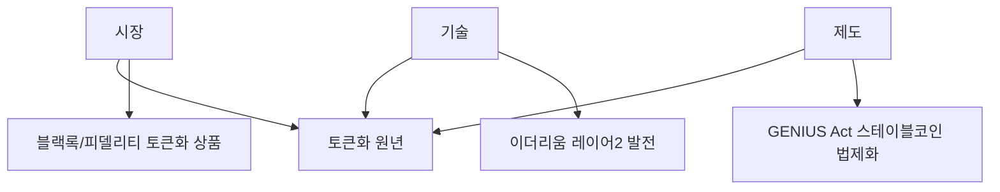

2025년 암호화폐 시장은 기관 투자 확대와 현물 ETF 승인에 힘입어 강세를 보였습니다. 2026년은 단순히 비트코인뿐 아니라, **이더리움의 부상**, **스테이블코인 제도화**, **실물자산 토큰화(RWA)**가 핵심 화두로 떠오르고 있습니다.

이 글에서는 글로벌 애널리스트들의 전망과 함께, **피터 틸의 20년 크립토 전략**, **오태민 교수의 이더리움 주목 이유** 등을 종합해 2026년 암호화폐 투자 전망을 정리합니다.

## 목차

1. [비트코인(BTC) 전망](#비트코인btc-전망)
2. [이더리움(ETH) 전망: 2026년 주목해야 하는 이유](#이더리움eth-전망-2026년-주목해야-하는-이유)
3. [스테이블코인과 토큰화(RWA) 트렌드](#스테이블코인과-토큰화rwa-트렌드)
4. [피터 틸의 크립토 전략](#피터-틸의-크립토-전략-20년간의-일관된-비전)
5. [트럼프 행정부와 암호화폐 정책](#트럼프-행정부와-암호화폐-정책)
6. [투자 전략 및 주의사항](#투자-전략-및-주의사항)

---

## 비트코인(BTC) 전망

### 현재 시장 상황 (2026년 1월 기준)

| 항목 | 현황 |
|------|------|
| 현재 가격 범위 | ~$95,000-105,000 |
| 2025년 주요 이벤트 | 현물 ETF 승인, 기관 채택 확대 |
| 시장 심리 | 불확실성 고조 |
| 옵션 시장 신호 | 2026년 전망 불투명 |

### 전망이 엇갈리는 이유

1. **사이클 논쟁**: 비트코인이 4년 주기를 따를지 여부
2. **기관 채택 효과**: 구조적 변화인지 일시적 현상인지
3. **거시경제 불확실성**: 금리, 유동성, 규제 환경
4. **기술적 매물대**: 6자릿수 돌파 후 저항 예상

## 긍정적 전망: 비트코인 $100K-$250K 달성

### 주요 낙관론 애널리스트 및 목표가

| 애널리스트/기관 | 2026년 목표가 | 핵심 근거 |
|----------------|--------------|----------|
| Charles Hoskinson (Cardano 창립자) | $250,000 | 기관 채택 가속화 |
| Tim Draper (벤처캐피털리스트) | $250,000 | 장기 상승 사이클 지속 |
| Arthur Hayes (BitMEX 공동창립자) | $200,000+ (3월까지) | 글로벌 유동성 확대 |
| Brad Garlinghouse (Ripple CEO) | $180,000 | 규제 명확화, ETF 성장 |
| JPMorgan | $170,000 | 이론적 공정 가치 |
| Standard Chartered | $150,000 | ETF 자금 유입 (하향 조정) |

### 낙관론의 핵심 논거

#### 1. 기관 투자 확대: 구조적 변화

```
2024-2025년 비트코인 현물 ETF 순유입: $350억+
기관 보유량 지속 증가 → 공급 감소 효과
```

블랙록(BlackRock), 피델리티(Fidelity) 등 글로벌 자산운용사들의 비트코인 ETF가 막대한 자금을 유치했습니다. 이는 단순한 투기가 아닌 **장기 자산배분**의 일환으로 평가됩니다.

#### 2. 금리 인하 사이클 진입

| 시나리오 | 비트코인 영향 |
|---------|-------------|
| 연준 금리 인하 | 유동성 증가 → 위험자산 선호 |
| 달러 약세 | 대체 자산으로 BTC 수요 증가 |
| 실질금리 하락 | 비수익 자산인 BTC 매력 상승 |

많은 애널리스트들이 2026년 금리 인하를 2026년 비트코인 회복의 핵심 요인으로 지목하고 있습니다.

#### 3. 정부 비축분 확대 논의

미국을 비롯한 여러 국가에서 비트코인을 **전략적 자산**으로 보유하는 논의가 진행 중입니다. 실현될 경우 수요 측면에서 강력한 호재가 될 것입니다.

#### 4. 반감기 후 공급 충격 (Post-Halving Supply Shock)

2024년 4월 반감기 이후 채굴 보상이 절반으로 감소했습니다. 역사적으로 반감기 후 12-18개월 뒤에 가격이 정점에 도달하는 패턴이 있었습니다.

```
전통적 사이클:
반감기 (2024.4) → 12-18개월 후 정점 (2025.10 - 2026.4)
```

#### 5. 탈중앙화 금융(DeFi) 및 비트코인 레이어2 발전

비트코인 네트워크 위에서 작동하는 레이어2 솔루션(라이트닝 네트워크, 스택스 등)이 발전하면서 비트코인의 활용도가 증가하고 있습니다.

### 낙관론 대표 의견: Arthur Hayes

> "글로벌 유동성이 우호적인 상태를 유지한다면, 비트코인은 2026년 3월까지 $200,000를 넘어설 것입니다. 중앙은행들의 통화 확장 정책이 비트코인에 유리한 환경을 조성하고 있습니다."

## 부정적/신중한 전망: 비트코인 $10K-$75K 하락

### 주요 신중론/비관론 애널리스트 및 전망

| 애널리스트/기관 | 2026년 전망 | 핵심 우려 |
|----------------|------------|----------|
| Mike McGlone (Bloomberg Intelligence) | $10,000 가능 | 평균 회귀, 유동성 긴축 |
| Peter Brandt (기술적 분석가) | $25,000 (약세 시) | 장기 기술적 구조 붕괴 |
| VanEck | 횡보 조정 | 폭발적 랠리 없음, 소화 국면 |
| Barclays | 보합~약세 | 투자자 열기 회복 어려움 |
| Galaxy Digital (Alex Thorn) | 불확실 | 옵션 신호, 거시 리스크 |

### 신중론의 핵심 논거

#### 1. 평균 회귀 (Mean Reversion) 리스크

```
비트코인 역사적 패턴:
급등 → 버블 정점 → 70-80% 하락 → 긴 조정
```

Mike McGlone은 비트코인이 6자릿수 도달 후 **대규모 평균 회귀**를 겪을 수 있다고 경고합니다. 과거 사이클에서도 정점 후 70-85% 하락이 반복되었습니다.

| 사이클 | 정점 | 저점 | 하락률 |
|--------|------|------|--------|
| 2013-2015 | $1,150 | $200 | -83% |
| 2017-2018 | $19,800 | $3,200 | -84% |
| 2021-2022 | $69,000 | $15,500 | -78% |

#### 2. 유동성 긴축 지속 가능성

연준이 인플레이션 재발 우려로 금리를 예상보다 높게 유지하거나 재인상할 경우, 위험자산인 비트코인은 큰 타격을 받을 수 있습니다.

```
금리 인상/고금리 유지 → 달러 강세 → 위험자산 회피 → BTC 하락
```

#### 3. 기술적 구조 붕괴 경고

Peter Brandt는 비트코인의 장기 차트에서 중요한 지지선이 붕괴될 경우 **$25,000까지 하락**할 수 있다고 분석합니다.

#### 4. ETF 자금 유입 둔화

2024-2025년 폭발적이었던 ETF 자금 유입이 2026년에는 둔화될 수 있습니다. 초기 수요가 충족된 후 추가 유입이 제한적일 경우 가격 상승 동력이 약화됩니다.

#### 5. 투자 심리 냉각 (Sentiment Fatigue)

Barclays는 암호화폐 시장에 대한 투자자 열기가 2026년에 회복되기 어렵다고 전망합니다. 2022년 하락장 트라우마와 규제 불확실성이 여전히 남아있습니다.

#### 6. 사이클 정점 논란

일부 애널리스트들은 2025년 말~2026년 초가 이미 사이클 정점일 수 있다고 주장합니다. 전통적 4년 주기를 따른다면 2026년은 하락 국면에 진입하는 시기입니다.

### 비관론 대표 의견: Mike McGlone

> "비트코인이 6자릿수에 도달한 후 유동성이 긴축되고 투기 수요가 사라지면, 가격은 평균으로 회귀하여 $10,000까지 하락할 수 있습니다. 역사적으로 비트코인은 극단적 변동성을 보여왔습니다."

## 중립/횡보 전망: $75K-$120K 레인지

### 주요 중립 전망

| 기관/애널리스트 | 전망 내용 |
|----------------|----------|
| VanEck | 조정 국면, 횡보 가능성 높음 |
| Galaxy Digital | 불확실성 고조, 방향성 불명확 |
| 일부 기관들 | 변동성 높은 레인지 장세 |

VanEck은 2026년 비트코인이 **폭발적 랠리도 폭락도 아닌 조정 국면**에 진입할 가능성이 높다고 봅니다. 이전 상승을 소화하는 시간이 필요하다는 의미입니다.

### 비트코인 전망 비교: 어떤 입장이 가장 인정받고 있나?

#### 2026년 비트코인 가격 전망 스펙트럼

```
         극비관        비관         신중         중립         낙관        극낙관
           ↓            ↓            ↓            ↓            ↓           ↓
    ┌──────┴────┬───────┴────┬───────┴────┬───────┴────┬───────┴────┬────┴─────┐
  $10K        $25K        $75K       $120K       $150K      $180K     $250K
    │           │           │          │           │          │         │
  McGlone    Brandt     업계      횡보        SC      Garlinghouse  Hoskinson
           (약세시)    일부     컨센서스                              Draper
```

### 컨센서스(합의) 전망 분석

| 구분 | 가격대 | 비중 | 주요 근거 |
|------|--------|------|----------|
| 극비관 | $10K-25K | 극소수 | 평균 회귀, 사이클 종료 |
| 비관 | $50K-75K | 소수 | 조정 불가피 |
| 신중/중립 | $75K-120K | **다수** | 횡보, 소화 국면 |
| 낙관 | $120K-175K | 상당수 | 기관 채택, 금리 인하 |
| 극낙관 | $180K-250K | 소수 | 유동성 폭발, 정부 비축 |

### 가장 인정받는 전망: **$120K-$175K 범위**

업계 컨센서스는 **$120,000-$175,000** 범위에 집중되어 있습니다. 이는:

1. **기관 채택이 구조적 변화**라는 점을 인정
2. **극단적 낙관론($250K)**은 과도하다고 판단
3. **극단적 비관론($10K-25K)**은 현실성이 낮다고 평가
4. **횡보 후 상승** 시나리오를 가장 가능성 있게 봄

### 컨센서스 형성 이유

#### 긍정 요인 (상방)

- ✅ 기관 투자 확대는 구조적 변화
- ✅ ETF를 통한 지속적 수요
- ✅ 금리 인하 가능성
- ✅ 반감기 효과 (역사적 패턴)

#### 부정 요인 (하방)

- ⚠️ 이미 상당히 상승한 상태
- ⚠️ 거시경제 불확실성
- ⚠️ 초기 ETF 유입 둔화 가능성
- ⚠️ 사이클 정점 논란

### 전문가들의 중도 의견

Galaxy Digital의 Alex Thorn은 옵션 시장 신호를 분석한 결과, **2026년 전망이 매우 불확실**하지만 **2027년 말까지 $250,000**는 가능하다고 봅니다. 즉, 2026년은 조정기, 2027년에 재상승이라는 시나리오입니다.

---

## 이더리움(ETH) 전망: 2026년 주목해야 하는 이유

2026년은 비트코인뿐 아니라 **이더리움이 특별히 주목받는 해**가 될 것으로 보입니다. 비트코인 전문가로 알려진 오태민 교수조차 "2026년은 이더리움의 해"라고 언급한 배경을 분석합니다.

### 오태민 교수가 이더리움에 주목하는 3가지 이유

#### 1. 비탈릭의 "비트코인화" 선언

2025년 5월, 이더리움 창시자 비탈릭 부테린이 **"이더리움도 비트코인처럼 희소성 중심으로 전환하겠다"**고 선언했습니다.

```
비탈릭 선언 이후:
- 이더리움 가격 2배 상승
- 비트코인과 유사한 "디지털 골드" 내러티브 획득
- 기관 투자자 관심 증가
```

#### 2. 실물자산 토큰화(RWA)의 핵심 인프라

2026년은 **"토큰화(Tokenization) 원년"**으로 불립니다. 시장-기술-제도의 삼각형이 완성되는 시점이며, 그 중심에 이더리움이 있습니다.

| 구분 | 내용 |
|------|------|
| 시장 | 블랙록, 피델리티 등 기관들의 토큰화 상품 출시 |
| 기술 | 이더리움 레이어2 발전, 가스비 감소 |
| 제도 | GENIUS Act 등 스테이블코인 법제화 |

#### 3. 피터 틸의 이더리움 베팅

PayPal 공동창업자이자 트럼프 행정부의 크립토 브레인인 피터 틸이 **이더리움에 집중 투자**하고 있습니다.

| 투자처 | 내용 |
|--------|------|
| BitMine | 지분 9.1% 인수, 세계 최대 ETH 보유 기업 (16만+ ETH) |
| Founders Fund | 2024년 $1억 규모 ETH 직접 매입 |

> "피터 틸이 이더리움 뒤에 있다" - 오태민 교수

### 이더리움 2026년 전망 요약

| 시나리오 | 가격 범위 | 근거 |
|----------|----------|------|
| 강세 | $6,000-10,000 | RWA 토큰화 폭발, 기관 채택 |
| 중립 | $3,500-6,000 | 점진적 성장, 비트코인 대비 언더퍼폼 |
| 약세 | $2,000-3,500 | 시장 전체 약세, 규제 리스크 |

---

## 스테이블코인과 토큰화(RWA) 트렌드

### 2026년이 "토큰화 원년"인 이유

오태민 교수는 2026년을 **"시장-기술-제도 삼각형이 완성되는 원년"**이라고 표현했습니다.



### GENIUS Act: 스테이블코인 제도화

트럼프 행정부에서 통과된 GENIUS Act는 **스테이블코인에 대한 첫 번째 연방 규제 프레임워크**입니다.

| 항목 | 내용 |
|------|------|
| 법안명 | GENIUS Act (Guiding and Ensuring National Innovation for US Stablecoins) |
| 핵심 내용 | 스테이블코인 발행사 규제, 소비자 보호 조항 |
| 의미 | 스테이블코인의 제도권 편입, 대규모 채택 기반 |

### 주요 스테이블코인 플레이어

| 스테이블코인 | 발행사 | 시가총액 | 특징 |
|-------------|--------|----------|------|
| USDT | Tether | ~$1,400억 | 최대 규모, 오프쇼어 중심 |
| USDC | Circle | ~$400억 | 규제 친화적, 미국 중심 |
| PYUSD | PayPal | ~$10억 | 핀테크 기업 진출 |

### 트럼프의 3단계 전략 (오태민 분석)

오태민 교수는 트럼프 행정부의 경제 전략을 다음과 같이 분석했습니다:

```
1단계: 관세 전쟁 → 무역 협상력 확보
2단계: 금리 전쟁 → 달러 약세 유도
3단계: 스테이블코인 전쟁 → 달러 패권 유지 + 크립토 주도권
```

> "미국은 시속 200km로 달리는데, 한국은 스쿨존에서 조심 운전 중"

---

## 피터 틸의 크립토 전략: 20년간의 일관된 비전

피터 틸은 1999년 PayPal 창업 시부터 **"국가가 아닌 개인이 주권을 갖는 디지털 화폐"**라는 비전을 추구해왔습니다.

### 피터 틸 크립토 연대기

| 시기 | 활동 | 의미 |
|------|------|------|
| 1999-2002 | PayPal 창업 | "새로운 세계 화폐" 비전 → eBay 인수로 축소 |
| 2012-2022 | 비트코인 투자 | $15-20M 투자 → $18억 매각 (2022년 3월, 시장 붕괴 직전) |
| 2014 | Thiel Fellowship | 비탈릭 부테린 $10만 장학금 → 이더리움 탄생 |
| 2023-현재 | 전방위 투자 | BTC/ETH 투자, BitMine, Bullish, Erebor 은행 |

### 피터 틸의 현재 크립토 포트폴리오

| 투자처 | 분야 | 비고 |
|--------|------|------|
| BitMine | 이더리움 보유 | 지분 9.1%, 세계 최대 ETH 보유 기업 |
| Bullish | 크립토 거래소 | 2025년 NYSE 상장 신청 |
| Erebor | 크립토/AI 전용 은행 | 스테이블코인 사업 포함 |
| Paxos | 스테이블코인 발행 | 규제 친화적 발행사 |

### 투자 철학

> "크립토는 자유지상주의적이고, AI는 공산주의적이다" - 피터 틸

- **비트코인** = 디지털 금 + 중앙은행 파산의 경고
- **이더리움** = RWA 토큰화의 핵심 인프라
- **스테이블코인** = 새로운 글로벌 결제 인프라

---

## 트럼프 행정부와 암호화폐 정책

### "PayPal 마피아"의 백악관 진출

피터 틸의 인맥이 트럼프 행정부 핵심 자리에 포진해 있습니다.

| 인물 | 직책 | 배경 |
|------|------|------|
| David Sacks | 백악관 AI/크립토 차르 | PayPal COO, 피터 틸 동료 |
| Gregory Barbaccia | OMB CIO | 전 Palantir 10년 |
| Clark Minor | HHS CIO | 전 Palantir 13년 |

### 암호화폐 친화적 정책 방향

1. **GENIUS Act 통과**: 스테이블코인 연방 규제 프레임워크
2. **ETF 승인 확대**: 비트코인·이더리움 현물 ETF
3. **기관 채택 촉진**: 연금, 국부펀드 진입 기반 마련

### 한국에 대한 시사점

오태민 교수의 경고:

> "한국이 제도를 안 바꾸면, 한국 주식과 부동산도 로빈후드에서 토큰화되어 거래될 것"

- 미국은 토큰화 제도를 빠르게 정비 중
- 한국은 규제 샌드박스 수준에 머물러 있음
- 글로벌 금융 인프라 경쟁에서 뒤처질 위험

---

## 비트코인 단기 vs 장기 전망

### 단기 전망 (2026년)

| 시나리오 | 가격 범위 | 확률 추정 |
|----------|----------|-----------|
| 강세 지속 | $150K-200K | 중간 |
| 횡보 조정 | $80K-130K | **높음** |
| 약세 전환 | $40K-75K | 낮음 |

**2026년 핵심 변수:**
- 연준 금리 정책 (인하 여부, 속도)
- ETF 자금 유입 지속성
- 규제 환경 변화
- 거시경제 안정성

### 장기 전망 (2027-2030)

장기적으로는 대부분의 애널리스트들이 비트코인에 대해 **더 낙관적**입니다:

| 요인 | 영향 |
|------|------|
| 희소성 | 2,100만 개 상한, 반감기로 공급 감소 |
| 기관 채택 심화 | 연금, 국부펀드 진입 가능 |
| 인플레이션 헤지 | 법정화폐 가치 하락 대비 |
| 기술 발전 | 레이어2, DeFi 확장 |

장기 목표가 (2030년):
- 보수적: $200,000-300,000
- 중립적: $300,000-500,000
- 낙관적: $500,000-1,000,000

## 투자 전략 및 주의사항

### 시나리오별 대응 전략

#### 1. 장기 투자자 (Hodlers)

```
전략: 분할 매수 (DCA) + 장기 보유
- 단기 변동성 무시
- 매달 일정 금액 자동 매수
- 2027-2030년 목표
```

#### 2. 중기 투자자 (Swing Traders)

```
전략: 레인지 트레이딩
- $80K-90K: 매수 구간
- $130K-150K: 차익 실현 구간
- 손절라인 설정 필수
```

#### 3. 보수적 투자자

```
전략: 대기 후 저점 매수
- 2026년 상반기 관망
- $75K 이하 시 분할 매수
- 비중 낮게 유지 (포트폴리오 5% 이하)
```

### 투자 시 반드시 고려할 사항

#### 1. 극단적 변동성

```
비트코인 일일 변동폭: ±10-20% 가능
급등 후 급락, 급락 후 급등 반복
→ 멘탈 관리 필수
```

#### 2. 분산 투자 원칙

| 자산군 | 권장 비중 |
|--------|----------|
| 안전자산 (현금, 채권) | 40-60% |
| 주식/ETF | 30-40% |
| 대체자산 (금, 부동산) | 10-20% |
| 암호화폐 (BTC 포함) | **5-15%** |

비트코인은 **포트폴리오의 5-15%를 초과하지 않도록** 권장됩니다.

#### 3. 손절 라인 설정

```
예시:
- 매수가: $100,000
- 손절가: $80,000 (-20%)
- 목표가: $150,000 (+50%)

위험/보상 비율: 1:2.5
```

#### 4. 감정적 결정 금지

```
❌ FOMO (Fear of Missing Out): 급등 시 고점 매수
❌ 공포 매도: 급락 시 저점 매도
✅ 계획된 전략 고수
```

#### 5. 규제 리스크 모니터링

각국 정부의 암호화폐 규제는 계속 진화하고 있습니다. 규제 뉴스를 지속적으로 체크해야 합니다.

#### 6. 보안 철저

- 거래소 해킹 리스크
- 개인 지갑 관리 (하드웨어 월렛 권장)
- 피싱 사기 주의

## 2026년 암호화폐 전망 종합 정리

### 자산별 전망 요약

| 자산 | 컨센서스 | 핵심 포인트 |
|------|----------|-------------|
| **비트코인** | $120K-175K | 횡보 후 상승, 기관 채택 구조적 변화 |
| **이더리움** | $3,500-6,000 | RWA 토큰화 인프라, 피터 틸 베팅 |
| **스테이블코인** | 제도화 원년 | GENIUS Act 통과, 대규모 채택 기반 |

### 2026년 핵심 변수

| 변수 | 영향 |
|------|------|
| 금리 정책 | 인하 시 위험자산 선호 → 암호화폐 상승 |
| ETF 자금 유입 | 지속 시 가격 지지, 둔화 시 조정 |
| 토큰화(RWA) 진전 | 이더리움 중심 생태계 확대 |
| 트럼프 정책 | 암호화폐 친화적 → 기관 채택 가속 |
| 한국 규제 | 미진 시 글로벌 경쟁에서 뒤처짐 |

### 최종 결론

**2026년은 비트코인 단독이 아닌, 암호화폐 생태계 전체의 "제도화 원년"입니다.**

1. **비트코인**: 횡보 조정 후 상승 가능성, 컨센서스 $120K-175K
2. **이더리움**: RWA 토큰화의 핵심 인프라로 부상, 피터 틸·기관 투자 집중
3. **스테이블코인**: GENIUS Act로 제도권 편입, 달러 패권 도구로 활용

> "2026년은 토큰화의 시장-기술-제도 삼각형이 완성되는 원년" - 오태민 교수

### 투자자를 위한 조언

1. **포트폴리오 다변화**: 비트코인뿐 아니라 이더리움, 토큰화 관련 자산 고려
2. **장기 관점 유지**: 단기 투기보다 구조적 변화에 베팅
3. **분할 매수 전략**: 한 번에 몰빵하지 말고 시간 분산
4. **규제 동향 주시**: GENIUS Act 등 제도화 흐름 모니터링
5. **리스크 관리**: 암호화폐는 포트폴리오 5-15% 권장

**투자 결정은 본인의 재무 상황, 리스크 허용도, 투자 목표를 고려하여 신중하게 내리시기 바랍니다.**

---

## 참고 자료

- [Bitcoin 2026 Price Predictions: Who's Bullish, Who's Bearish, And Why? - Benzinga](https://www.benzinga.com/crypto/cryptocurrency/25/12/49616686/bitcoin-2026-price-predictions-whos-bullish-whos-bearish-and-why)
- [Bitcoin 2026 Price Predictions: Will BTC See $250K or $10K Next Year? - Yahoo Finance](https://finance.yahoo.com/news/bitcoin-2026-price-predictions-btc-100000369.html)
- [Bitcoin Price Prediction 2026: Can BTC Hit $225K or Will Fall to $75K? - Finance Magnates](https://www.financemagnates.com/trending/bitcoin-price-prediction-2026-can-btc-hit-225k-or-will-fall-to-75k/)
- [Bitcoin 2026 forecast: post-halving setup or cycle peak? - IG International](https://www.ig.com/en/news-and-trade-ideas/bitcoin-2026-market-outlook-251212)
- [Bitcoin Price Prediction 2026 2027 2028 - 2030 - Changelly](https://changelly.com/blog/bitcoin-price-prediction/)
- [Bitcoin (BTC) Price Prediction & Forecast 2026, 2027, 2028-2030 - Binance](https://www.binance.com/en/price-prediction/bitcoin)
- [Galaxy Digital's Head of Research Explains Why Bitcoin's Outlook Is So Uncertain in 2026 - CoinDesk](https://www.coindesk.com/markets/2025/12/21/galaxy-digital-s-head-of-research-explains-why-bitcoin-s-outlook-is-so-uncertain-in-2026)
- [2026년 비트코인, '장밋빛' 전망 또는 '폭락' 경고 - Benzinga Korea](https://kr.benzinga.com/crypto/bitcoin/2026년-비트코인-장밋빛-전망-또는-폭락-경고/)
- [애널리스트들, 2026년 비트코인 회복 요인으로 금리 인하 - Yellow](https://yellow.com/ko/news/애널리스트들-2026년-비트코인-회복-요인으로-금리-인하·정부-비축분-확대-지목)
- [애널리스트들, 비트코인 2026년 전망 7만5천~22만5천달러로 엇갈려 - 99Bitcoins Korea](https://99bitcoins.com/kr/news/presales/analysts-hedge-bets-as-bitcoin-2026-predictions-swing-from-75k-to-225k/)
- [비트코인 전망 2025~2030년 - CryptoNews](https://cryptonews.com/kr/cryptocurrency/bitcoin-price-prediction/)
