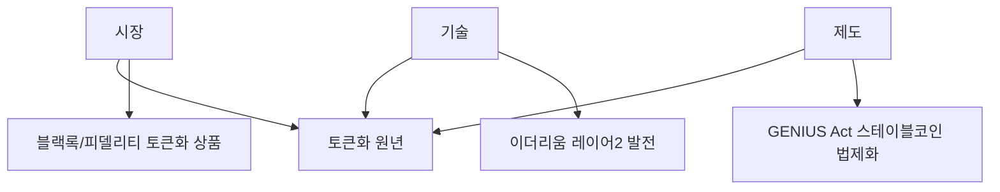

2026년 2월 초, 암호화폐 시장은 **극단적 변동성과 극단적으로 갈린 전망**이 공존하는 상황입니다. 비트코인이 $61K까지 급락한 뒤 반등하는 과정에서, 한쪽에서는 "대폭등 임박"을 외치고 다른 쪽에서는 "나스닥과 동반 사망 나선(death spiral)"을 경고하고 있습니다.

이 글에서는 2026년 2월 기준 최신 시장 상황과 함께, 기관 투자 트렌드, 규제 진전, 그리고 리스크 요인을 종합적으로 분석합니다.

## 목차

1. [2월 시장 현황: 급락과 반등](#2월-시장-현황-급락과-반등)
2. [비트코인(BTC) 전망](#비트코인btc-전망)
3. [이더리움(ETH) 전망](#이더리움eth-전망-2026년-주목해야-하는-이유)
4. [스테이블코인과 토큰화(RWA) 트렌드](#스테이블코인과-토큰화rwa-트렌드)
5. [트럼프 행정부와 암호화폐 정책](#트럼프-행정부와-암호화폐-정책)
6. [투자 전략 및 주의사항](#투자-전략-및-주의사항)

---

## 2월 시장 현황: 급락과 반등

### 최근 시장 동향 (2026년 2월 초)

| 항목 | 현황 |
|------|------|
| 비트코인 | $61K까지 급락 후 반등 (2/5-6) |
| 미국 주식 | 3일 연속 하락, 리스크오프 심리 |
| 시장 분위기 | "대폭등" vs "death spiral" 극단적 분열 |
| 빗썸 사건 | 2,000 BTC 과오지급 (2,000원으로 잘못 전송) |
| GENIUS Act | 스테이블코인 규제 법안 진전 |

### 급락 원인 분석

2월 초 비트코인 급락의 배경:

1. **미국 주식 3일 연속 하락**: 전반적 리스크오프 분위기 확산
2. **비트코인/나스닥 연동 심화**: AI capex 사이클과 연동된 상승이었던 만큼, 하락도 동조
3. **지정학 리스크**: 이란 공격 가능성 등 지정학적 불확실성
4. **차익 실현 압력**: 2025년 상승분에 대한 이익 확정 매물

### 빗썸 과오지급 사건

빗썸이 2,000 KRW를 보내야 할 것을 **2,000 BTC(약 1,200억원)**를 잘못 전송한 사건이 발생했습니다. 거래소 운영 리스크를 상기시키는 사건으로, 보안과 내부 통제의 중요성을 재확인했습니다.

---

## 비트코인(BTC) 전망

### 현재 시장 상황 (2026년 2월 기준)

| 항목 | 현황 |
|------|------|
| 최근 가격 범위 | ~$61K-70K (급락 후 반등 중) |
| 1월 가격 범위 | ~$95K-105K |
| 2025년 주요 이벤트 | 현물 ETF 승인, 기관 채택 확대 |
| 시장 심리 | 극도의 공포와 탐욕 교차 |
| 핵심 논쟁 | "대폭등" vs "death spiral" |

### 전망이 극단적으로 갈리는 이유

김단테 분석에 따르면, 비트코인/나스닥의 동반 상승은 **AI capex 사이클에 의한 구조적 상승**이었습니다. 단순 투기가 아닌 실체가 있는 상승이라는 것입니다. 반면, 일부 애널리스트들은 나스닥과의 높은 상관관계가 오히려 **동반 하락(death spiral)**의 원인이 될 수 있다고 경고합니다.

## 긍정적 전망: 비트코인 대폭등 시나리오

### 주요 낙관론 근거

| 요인 | 내용 |
|------|------|
| AI capex 사이클 | 비트코인 상승이 실체 있는 구조적 변화 (김단테) |
| 백악관/월가 소문 | 기관 채택 지속, 전략적 비축 논의 |
| 트럼프 행정부 | 친크립토 정책 기조 유지 |
| 반감기 효과 | 2024.4 반감기 → 12-18개월 후 정점 패턴 |
| ETF 자금 유입 | 구조적 수요 지속 |

### 낙관론의 핵심 논거

#### 1. AI capex 사이클과의 연동 (김단테 분석)

```
김단테 핵심 주장:
- 비트코인/나스닥 동반 상승 = AI 설비투자 사이클이 원동력
- 단순 투기가 아닌 실물 경제의 구조적 변화
- AI capex가 지속되는 한 비트코인도 상승 가능
```

#### 2. 기관 투자 확대: 구조적 변화

```
2024-2025년 비트코인 현물 ETF 순유입: $350억+
기관 보유량 지속 증가 → 공급 감소 효과
```

블랙록(BlackRock), 피델리티(Fidelity) 등 글로벌 자산운용사들의 비트코인 ETF가 막대한 자금을 유치했습니다. 이는 단순한 투기가 아닌 **장기 자산배분**의 일환입니다.

#### 3. 백악관·월가의 비트코인 움직임

박정호 교수 분석에 따르면, 백악관과 월스트리트에서 비트코인에 대한 "무서운 소문"이 퍼지고 있습니다. 이는 기관급 채택이 더 깊어지고 있음을 시사합니다. 미국 정부의 전략적 비트코인 비축 논의도 계속되고 있습니다.

#### 4. 반감기 후 공급 충격

2024년 4월 반감기 이후 채굴 보상이 절반으로 감소했습니다. 역사적으로 반감기 후 12-18개월 뒤에 가격이 정점에 도달하는 패턴이 있었습니다.

```
전통적 사이클:
반감기 (2024.4) → 12-18개월 후 정점 (2025.10 - 2026.4)
→ 현재가 사이클 정점 부근일 수 있음
```

### 주요 낙관론 목표가

| 애널리스트/기관 | 2026년 목표가 | 핵심 근거 |
|----------------|--------------|----------|
| Charles Hoskinson | $250,000 | 기관 채택 가속화 |
| Tim Draper | $250,000 | 장기 상승 사이클 지속 |
| Arthur Hayes | $200,000+ | 글로벌 유동성 확대 |
| Brad Garlinghouse | $180,000 | 규제 명확화, ETF 성장 |
| Standard Chartered | $150,000 | ETF 자금 유입 |

## 부정적 전망: "Death Spiral" 시나리오

### 주요 비관론 근거

| 요인 | 내용 |
|------|------|
| 나스닥 동조 하락 | 비트코인/나스닥 상관관계가 높아 동반 하락 위험 |
| 미국 주식 3일 연속 하락 | 리스크오프 전환 신호 |
| 이란 공격 가능성 | 지정학 리스크 시 모든 위험자산 급락 |
| 사이클 정점 우려 | 2025말-2026초가 이미 정점일 가능성 |
| $61K 급락 | 지지선 붕괴 시 추가 하락 가능 |

### 비관론의 핵심 논거

#### 1. 나스닥과의 "Death Spiral"

비트코인이 나스닥과 높은 상관관계를 보이면서, 기술주 하락이 비트코인 하락을 촉발하고, 이것이 다시 투자심리를 악화시키는 **악순환** 가능성이 제기되고 있습니다.

#### 2. 지정학 리스크: 이란 변수

트럼프 행정부의 이란 공격 위협이 현실화될 경우, **모든 위험자산이 동반 급락**할 수 있습니다. 비트코인도 예외가 아닙니다.

```
이란 공격 시나리오:
→ 유가 급등 → 인플레이션 우려 → 금리 상승 압력
→ 위험자산 전면 하락 → 비트코인 급락
→ 비트코인은 "디지털 금"이 아닌 "위험자산"으로 분류됨
```

#### 3. 평균 회귀 리스크

| 사이클 | 정점 | 저점 | 하락률 |
|--------|------|------|--------|
| 2013-2015 | $1,150 | $200 | -83% |
| 2017-2018 | $19,800 | $3,200 | -84% |
| 2021-2022 | $69,000 | $15,500 | -78% |
| 2025-? | $105,000? | ? | ? |

### 주요 비관론 전망

| 애널리스트/기관 | 전망 | 핵심 우려 |
|----------------|------|----------|
| Mike McGlone | $10,000 가능 | 평균 회귀, 유동성 긴축 |
| Peter Brandt | $25,000 (약세 시) | 기술적 구조 붕괴 |
| VanEck | 횡보 조정 | 폭발적 랠리 없음 |

## 중립/횡보 전망: 조정 후 방향 탐색

### $61K 급락의 의미

$61K까지의 급락은 두 가지로 해석됩니다:

1. **건전한 조정**: 과열된 시장의 정상적 조정. 반등 후 재상승
2. **추세 전환 신호**: 사이클 정점 후 본격 하락의 시작

### 컨센서스 분석 (2월 업데이트)

| 구분 | 가격대 | 비중 | 주요 근거 |
|------|--------|------|----------|
| 극비관 | $10K-25K | 극소수 | 평균 회귀, 사이클 종료 |
| 비관 | $40K-60K | 소수 | 심각한 조정 |
| 신중/중립 | $60K-100K | **다수** | 횡보 후 방향 탐색 |
| 낙관 | $100K-175K | 상당수 | 기관 채택, AI capex 지속 |
| 극낙관 | $180K-250K | 소수 | 유동성 폭발, 정부 비축 |

### 2월 이후 핵심 변수

| 변수 | 상방 시나리오 | 하방 시나리오 |
|------|-------------|-------------|
| 미국 금리 | 인하 → 유동성 확대 | 동결/인상 → 긴축 |
| AI capex | 지속 → 나스닥/BTC 동반 회복 | 둔화 → 동반 하락 |
| 이란 | 외교적 해결 → 안도 랠리 | 군사 충돌 → 전면 급락 |
| ETF 자금 | 유입 지속 → 가격 지지 | 유출 → 추가 하락 |

---

## 이더리움(ETH) 전망: 2026년 주목해야 하는 이유

### 오태민 교수가 이더리움에 주목하는 3가지 이유

#### 1. 비탈릭의 "비트코인화" 선언

2025년 5월, 이더리움 창시자 비탈릭 부테린이 **"이더리움도 비트코인처럼 희소성 중심으로 전환하겠다"**고 선언했습니다.

```
비탈릭 선언 이후:
- 이더리움 가격 2배 상승
- 비트코인과 유사한 "디지털 골드" 내러티브 획득
- 기관 투자자 관심 증가
```

#### 2. 실물자산 토큰화(RWA)의 핵심 인프라

2026년은 **"토큰화(Tokenization) 원년"**으로 불립니다. 시장-기술-제도의 삼각형이 완성되는 시점이며, 그 중심에 이더리움이 있습니다.

| 구분 | 내용 |
|------|------|
| 시장 | 블랙록, 피델리티 등 기관들의 토큰화 상품 출시 |
| 기술 | 이더리움 레이어2 발전, 가스비 감소 |
| 제도 | GENIUS Act 등 스테이블코인 법제화 진전 |

#### 3. 피터 틸의 이더리움 베팅

PayPal 공동창업자이자 트럼프 행정부의 크립토 브레인인 피터 틸이 **이더리움에 집중 투자**하고 있습니다.

| 투자처 | 내용 |
|--------|------|
| BitMine | 지분 9.1% 인수, 세계 최대 ETH 보유 기업 (16만+ ETH) |
| Founders Fund | 2024년 $1억 규모 ETH 직접 매입 |

### 이더리움 2026년 전망 요약

| 시나리오 | 가격 범위 | 근거 |
|----------|----------|------|
| 강세 | $6,000-10,000 | RWA 토큰화 폭발, 기관 채택 |
| 중립 | $3,500-6,000 | 점진적 성장, 비트코인 대비 언더퍼폼 |
| 약세 | $2,000-3,500 | 시장 전체 약세, 규제 리스크 |

---

## 스테이블코인과 토큰화(RWA) 트렌드

### GENIUS Act: 스테이블코인 제도화 진전

GENIUS Act(Guiding and Ensuring National Innovation for US Stablecoins)는 **스테이블코인에 대한 첫 번째 연방 규제 프레임워크**로, 2026년 들어 의회 통과를 향한 진전이 이루어지고 있습니다.

| 항목 | 내용 |
|------|------|
| 법안명 | GENIUS Act |
| 핵심 내용 | 스테이블코인 발행사 규제, 소비자 보호 조항 |
| 현재 상태 | 의회 심의 진행 중, 진전 가속화 |
| 의미 | 스테이블코인의 제도권 편입, 대규모 채택 기반 |

### 2026년이 "토큰화 원년"인 이유

오태민 교수는 2026년을 **"시장-기술-제도 삼각형이 완성되는 원년"**이라고 표현했습니다.



### 주요 스테이블코인 플레이어

| 스테이블코인 | 발행사 | 시가총액 | 특징 |
|-------------|--------|----------|------|
| USDT | Tether | ~$1,400억 | 최대 규모, 오프쇼어 중심 |
| USDC | Circle | ~$400억 | 규제 친화적, 미국 중심 |
| PYUSD | PayPal | ~$10억 | 핀테크 기업 진출 |

### 트럼프의 3단계 전략 (오태민 분석)

```
1단계: 관세 전쟁 → 무역 협상력 확보
2단계: 금리 전쟁 → 달러 약세 유도
3단계: 스테이블코인 전쟁 → 달러 패권 유지 + 크립토 주도권
```

---

## 트럼프 행정부와 암호화폐 정책

### "PayPal 마피아"의 백악관 진출

피터 틸의 인맥이 트럼프 행정부 핵심 자리에 포진해 있습니다.

| 인물 | 직책 | 배경 |
|------|------|------|
| David Sacks | 백악관 AI/크립토 차르 | PayPal COO, 피터 틸 동료 |
| Gregory Barbaccia | OMB CIO | 전 Palantir 10년 |
| Clark Minor | HHS CIO | 전 Palantir 13년 |

### 암호화폐 친화적 정책 기조 유지

2월 현재에도 트럼프 행정부는 친크립토 기조를 유지하고 있습니다.

1. **GENIUS Act 진전**: 스테이블코인 연방 규제 프레임워크 법안 의회 심의 중
2. **ETF 승인 확대**: 비트코인·이더리움 현물 ETF 지속 운영
3. **기관 채택 촉진**: 연금, 국부펀드 진입 기반 마련
4. **전략적 비축 논의**: 미국 정부의 비트코인 보유 논의 지속

### 피터 틸의 크립토 전략

피터 틸은 1999년 PayPal 창업 시부터 **"국가가 아닌 개인이 주권을 갖는 디지털 화폐"**라는 비전을 추구해왔습니다.

| 투자처 | 분야 | 비고 |
|--------|------|------|
| BitMine | 이더리움 보유 | 지분 9.1%, 세계 최대 ETH 보유 기업 |
| Bullish | 크립토 거래소 | 2025년 NYSE 상장 신청 |
| Erebor | 크립토/AI 전용 은행 | 스테이블코인 사업 포함 |
| Paxos | 스테이블코인 발행 | 규제 친화적 발행사 |

### 한국에 대한 시사점

> "한국이 제도를 안 바꾸면, 한국 주식과 부동산도 로빈후드에서 토큰화되어 거래될 것" - 오태민 교수

- 미국은 토큰화 제도를 빠르게 정비 중
- 한국은 규제 샌드박스 수준에 머물러 있음
- 글로벌 금융 인프라 경쟁에서 뒤처질 위험

---

## 투자 전략 및 주의사항

### 2월 급락을 반영한 시나리오별 전략

#### 시나리오 1: "건전한 조정 후 재상승" (확률: 중간)

```
가정: $61K가 저점, 점진적 회복
전략: 분할 매수 시작
- $60K-65K: 1차 매수 (30%)
- $55K-60K: 2차 매수 (30%)
- $50K 이하: 3차 매수 (40%)
- 목표: $100K+ 회복 시 일부 차익실현
```

#### 시나리오 2: "추가 하락 후 바닥 탐색" (확률: 중간)

```
가정: 사이클 조정 본격화
전략: 대기 후 저점 매수
- $50K 이하 시 분할 매수 시작
- $40K 이하 시 적극 매수
- 비중: 포트폴리오 5-10%
```

#### 시나리오 3: "지정학 리스크로 전면 급락" (확률: 낮으나 무시 불가)

```
가정: 이란 충돌 → 위험자산 전면 하락
전략: 현금 확보, 매수 대기
- 비트코인 포함 위험자산 비중 최소화
- $30K 이하 시 장기 투자 관점 매수
```

### 분산 투자 원칙

| 자산군 | 권장 비중 |
|--------|----------|
| 안전자산 (현금, 채권) | 40-60% |
| 주식/ETF | 30-40% |
| 대체자산 (금, 부동산) | 10-20% |
| 암호화폐 (BTC 포함) | **5-15%** |

### 거래소 리스크 관리

빗썸 과오지급 사건이 보여주듯, 거래소 운영 리스크는 여전합니다.

- **분산 보관**: 하나의 거래소에 전체 보유량 집중 금지
- **하드웨어 월렛**: 장기 보유분은 콜드 월렛으로 이전
- **거래소 선택**: 규제 준수, 재무 건전성 확인

### 핵심 주의사항

#### 1. 극단적 변동성 대비

```
2월 사례: $100K+ → $61K (약 -40%) → 반등
- 레버리지 거래 절대 금지 (청산 리스크)
- 손절라인 사전 설정
- 멘탈 관리 필수
```

#### 2. 상반된 전망에 현혹되지 말 것

```
"대폭등" 주장 → FOMO 유발 → 고점 매수 위험
"death spiral" 주장 → 공포 유발 → 저점 매도 위험

→ 계획된 분할 매수/매도 전략 고수
```

#### 3. 지정학 리스크 모니터링

이란 상황이 악화될 경우 **모든 위험자산이 동반 급락**할 수 있습니다. 비트코인은 "디지털 금"이 아닌 "위험자산"으로 취급될 가능성이 높습니다.

---

## 2026년 2월 암호화폐 전망 종합 정리

### 자산별 전망 요약 (2월 업데이트)

| 자산 | 컨센서스 (조정 반영) | 핵심 포인트 |
|------|---------------------|-------------|
| **비트코인** | $60K-175K (범위 확대) | $61K 급락으로 불확실성 증가. "대폭등" vs "death spiral" 극단적 분열 |
| **이더리움** | $2,500-6,000 | RWA 토큰화 인프라, 피터 틸 베팅. BTC 대비 하방 위험 더 큼 |
| **스테이블코인** | 제도화 진전 | GENIUS Act 의회 진행, 대규모 채택 기반 확대 |

### 1월 대비 변화 사항

| 항목 | 1월 전망 | 2월 현실 | 변화 |
|------|---------|---------|------|
| BTC 가격대 | $95K-105K | $61K-70K | 대폭 하락 |
| 시장 심리 | 불확실 | 극단적 공포/탐욕 | 변동성 급증 |
| ETF 자금 | 유입 지속 | 유출 압력 | 악화 |
| 규제 | GENIUS Act 기대 | 진전 확인 | 소폭 개선 |
| 지정학 | 불확실 | 이란 리스크 부각 | 악화 |

### 최종 결론

**2026년 2월, 암호화폐 시장은 "제도화"와 "급락"이 동시에 진행되는 복합 국면입니다.**

1. **비트코인**: $61K 급락은 단기 공포를 유발했으나, AI capex 사이클이 유효한 한 구조적 상승 동력은 건재. 다만 지정학 리스크(이란)가 최대 변수
2. **이더리움**: RWA 토큰화의 핵심 인프라로서의 위상은 유지. 피터 틸/기관 투자 지속
3. **스테이블코인**: GENIUS Act 진전으로 제도화 가속. 트럼프 행정부의 달러 패권 전략과 연동

### 투자자를 위한 2월 액션 아이템

1. **급락에 당황하지 말 것**: $61K는 과거 사이클 대비 아직 높은 수준. 장기 관점 유지
2. **분할 매수 전략**: $60K 이하에서 분할 매수 시작 고려
3. **이란 리스크 대비**: 현금 비중 확보, 과도한 레버리지 금지
4. **거래소 리스크 관리**: 빗썸 사건 교훈, 분산 보관 필수
5. **상반된 전망에 대한 중립적 자세**: "대폭등"도 "death spiral"도 아닌 계획적 대응

**투자 결정은 본인의 재무 상황, 리스크 허용도, 투자 목표를 고려하여 신중하게 내리시기 바랍니다.**

---

## 참고 자료

- [Bitcoin 2026 Price Predictions - Benzinga](https://www.benzinga.com/crypto/cryptocurrency/25/12/49616686/bitcoin-2026-price-predictions-whos-bullish-whos-bearish-and-why)
- [Bitcoin 2026 Price Predictions - Yahoo Finance](https://finance.yahoo.com/news/bitcoin-2026-price-predictions-btc-100000369.html)
- [Galaxy Digital's Head of Research - CoinDesk](https://www.coindesk.com/markets/2025/12/21/galaxy-digital-s-head-of-research-explains-why-bitcoin-s-outlook-is-so-uncertain-in-2026)
- 김단테 분석: 비트코인 나스닥 대폭등의 진짜 이유 (2026.2.6)
- 박정호 교수 분석: 백악관과 월가에 퍼진 비트코인 소문 (2026.2.6)
- 빗썸 과오지급 사건 보도
