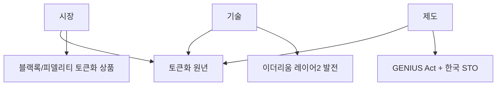

2026년 2월 현재, 암호화폐 시장은 **극단적 변동성과 극단적으로 갈린 전망**이 공존하는 상황입니다. 비트코인이 $100K+에서 $61K까지 **FTX 이후 최대 15% 급락**을 겪은 뒤 $69K로 반등했으나, 예측시장에서는 $65K 이하 추가 하락 가능성을 90% 이상으로 보고 있습니다.

**케빈 워시 연준 의장 임명**으로 금리인하 지연 우려가 확산되고 미국 정부 셧다운 리스크까지 겹치면서 유동성 고갈이 급락의 주요 원인으로 지목됩니다. 반면, **일본 다카이치 총선 압승**으로 엔캐리 트레이드 재개 가능성이 부각되며 중기 호재가 등장했고, **스트레티지(Strategy)의 "$8,000까지 하락해도 재무적으로 괜찮다"** 발언이 시장에 안도감을 주고 있습니다.

이 글에서는 2026년 2월 9일 기준 최신 시장 상황과 함께, 기관 투자 트렌드, 규제 진전, 그리고 리스크 요인을 종합적으로 분석합니다.

## 목차

1. [2월 시장 현황: 급락과 반등](#2월-시장-현황-급락과-반등)
2. [비트코인(BTC) 전망](#비트코인btc-전망)
3. [이더리움(ETH) 전망](#이더리움eth-전망-2026년-주목해야-하는-이유)
4. [스테이블코인과 토큰화(RWA) 트렌드](#스테이블코인과-토큰화rwa-트렌드)
5. [STO(토큰증권): 한국의 새로운 크립토 테마](#sto토큰증권-한국의-새로운-크립토-테마)
6. [트럼프 행정부와 암호화폐 정책](#트럼프-행정부와-암호화폐-정책)
7. [투자 전략 및 주의사항](#투자-전략-및-주의사항)

---

## 2월 시장 현황: 급락과 반등

### 최근 시장 동향 (2026년 2월 9일 기준)

| 항목 | 현황 |
|------|------|
| 비트코인 | $61K까지 15% 급락(FTX 이후 최대) 후 $69K 반등 |
| 급락 원인 | 유동성 고갈, 케빈 워시 연준 의장 임명(금리인하 지연), 미국 정부 셧다운 |
| 일본 총선 | 다카이치 압승 → 엔캐리 트레이드 재개 가능성 (중기 호재) |
| 예측시장 | $65K 이하 추가 하락 가능성 90%+ |
| 스트레티지 | "$8,000까지 하락해도 재무적 괜찮다" 발언 |
| 빗썸 사건 | 62만 BTC 과오지급, 현행법상 비트코인 '재물' 미인정 문제 부각 |
| 서클(Circle) | 스테이블코인 시장 10년 내 10배 성장 전망 |
| 이더리움 ETF | 스테이킹 포함 승인 추세, 이자 약 3~4% |
| GENIUS Act | 스테이블코인 규제 법안 진전 |
| 한국 STO | 토큰증권 제도화 본격 추진 |

### 급락 원인 분석 (2월 9일 업데이트)

**FTX 이후 최대인 15% 급락**의 배경은 복합적입니다:

1. **유동성 고갈**: 시장 전반의 유동성이 급격히 축소되면서 매도 압력이 가중
2. **케빈 워시 연준 의장 임명**: 매파적 성향의 워시 임명으로 금리 인하 지연/중단 우려 확산
3. **미국 정부 셧다운**: 재정 불확실성이 위험자산 전반에 부정적 영향
4. **미국 주식 조정**: 전반적 리스크오프 분위기 확산
5. **비트코인/나스닥 연동 심화**: AI capex 사이클과 연동된 상승이었던 만큼, 하락도 동조
6. **차익 실현 압력**: 2025년 상승분에 대한 이익 확정 매물

### 케빈 워시 연준 의장 임명의 시장 영향

케빈 워시가 차기 연준 의장으로 임명되면서, **금리 인하 사이클이 지연되거나 속도가 느려질 수 있다**는 우려가 확산되었습니다. 워시는 매파적 성향으로 알려져 있어, 금리 인하에 대한 시장 기대가 크게 후퇴했습니다.

| 항목 | 내용 |
|------|------|
| 인물 | 케빈 워시 (Kevin Warsh) |
| 성향 | 매파적 (금리 인하에 소극적) |
| 시장 영향 | 금리 인하 지연 우려 → 유동성 기대 후퇴 → 위험자산 하락 |
| 크립토 영향 | 비트코인 급락의 주요 촉매 중 하나 |

```
이전 기대: 연준 금리 인하 사이클 지속 → 유동성 확대 → 크립토 우호적
현재 변화: 워시 임명 → 금리 인하 지연/둔화 가능성 → 유동성 기대 후퇴
→ 비트코인 등 위험자산에 부정적 단기 충격
```

### 다카이치 총선 압승: 엔캐리 트레이드 재개 가능성 (중기 호재)

일본의 다카이치가 총선에서 압승하면서, **엔캐리 트레이드 재개 가능성**이 부각되고 있습니다. 이는 비트코인에 **중기적 호재**로 작용할 수 있습니다.

| 항목 | 내용 |
|------|------|
| 이벤트 | 다카이치 총선 압승 |
| 정책 방향 | 엔화 약세 용인, 금융 완화 기조 |
| 메커니즘 | 엔 약세 → 엔캐리 트레이드 재개 → 글로벌 유동성 증가 |
| 크립토 영향 | 글로벌 유동성 확대 → 비트코인 등 위험자산에 긍정적 (중기) |

```
엔캐리 트레이드 재개 시나리오:
다카이치 압승 → 일본 금융 완화 지속
→ 엔화 약세 → 저금리 엔화 차입 후 고금리 자산 투자
→ 글로벌 유동성 증가 → 위험자산 선호도 상승
→ 비트코인 중기 상승 압력
```

### 예측시장: 추가 하락 경고

예측시장에서는 **비트코인이 $65K 이하로 추가 하락할 가능성을 90% 이상**으로 보고 있습니다. 이는 단기적으로 비관적 전망이 우세함을 의미합니다.

### 이란-미국 오만 회담 (이전 업데이트)

2월 6일 오만에서 진행된 이란-미국 간접 회담이 마무리되었습니다. 양측은 대화를 지속하기로 합의했으며, 이는 즉각적인 군사 충돌 가능성을 낮추는 신호입니다.

| 항목 | 내용 |
|------|------|
| 회담 일시 | 2026년 2월 6일, 오만 |
| 결과 | 양측 대화 지속 합의 |
| 추가 조치 | 이란 원유에 대한 신규 제재 추가 |
| 시장 영향 | 지정학 리스크 다소 완화, 그러나 완전 해소는 아님 |

다만, 신규 제재가 추가된 만큼 이란과의 긴장은 여전히 존재합니다. "외교적 해결" 방향으로 한 발짝 나아갔으나, 리스크가 완전히 소멸된 것은 아닙니다.

### 빗썸 62만 BTC 과오지급 사건 (2월 9일 업데이트)

빗썸이 **62만 BTC(수조 원 규모)**를 잘못 전송한 과오지급 사건이 발생했습니다. 이 사건에서 더 큰 이슈는, **현행법상 비트코인이 '재물'로 인정되지 않아** 횡령이나 절도죄 적용이 어렵다는 법적 공백이 드러났다는 점입니다.

| 항목 | 내용 |
|------|------|
| 사건 | 빗썸 62만 BTC 과오지급 |
| 규모 | 수조 원 상당 |
| 법적 쟁점 | 현행법상 비트코인은 '재물' 미인정 → 형사 처벌 어려움 |
| 시사점 | **디지털 자산 기본법** 제정 시급성 부각 |
| 거래소 리스크 | 운영 리스크, 내부 통제 중요성 재확인 |

```
법적 공백 문제:
비트코인 = 현행법상 '재물' 아님
→ 과오지급 받은 비트코인을 돌려주지 않아도 형사 처벌 어려움
→ 민사 소송(부당이득반환)만 가능
→ 디지털 자산 기본법 제정 필요성 부각
```

---

## 비트코인(BTC) 전망

### 현재 시장 상황 (2026년 2월 9일 기준)

| 항목 | 현황 |
|------|------|
| 최근 가격 | ~$69K (15% 급락 후 반등) |
| 급락 저점 | ~$61K (FTX 이후 최대 급락) |
| 1월 가격 범위 | ~$95K-105K |
| 급락 촉매 | 유동성 고갈, 워시 임명, 정부 셧다운 |
| 중기 호재 | 다카이치 압승 → 엔캐리 트레이드 재개 가능성 |
| 예측시장 | $65K 이하 추가 하락 가능성 90%+ |
| 핵심 논쟁 | "분할 매수 구간" vs "추가 하락 경고" |
| 지정학 | 이란-미국 오만 회담으로 리스크 다소 완화 |
| 스트레티지 | "$8,000까지도 재무적으로 괜찮다" |

### 스트레티지(Strategy)의 시장 안정 메시지

마이크로스트레티지의 후신인 스트레티지(Strategy)가 **"비트코인이 $8,000까지 하락해도 재무적으로 괜찮다"**고 발언하여 시장에 안도감을 주었습니다. 이는 기관급 비트코인 최대 보유 기업이 강제 청산 리스크가 없음을 시사합니다.

```
스트레티지 메시지의 의미:
- BTC $8,000까지 하락해도 재무 건전성 유지 가능
- 강제 청산/마진콜 리스크 없음
- 기관급 보유자의 패닉 매도 가능성 낮음
→ 시장의 "마이크로스트레티지 청산" 공포 해소에 기여
```

### 전망이 극단적으로 갈리는 이유

김단테 분석에 따르면, 비트코인/나스닥의 동반 상승은 **AI capex 사이클에 의한 구조적 상승**이었습니다. 단순 투기가 아닌 실체가 있는 상승이라는 것입니다. 반면, 예측시장은 $65K 이하 추가 하락을 90%+ 확률로 보고 있어, **단기 비관 vs 중장기 낙관**의 구도가 형성되어 있습니다.

## 긍정적 전망: 비트코인 재상승 시나리오

### 주요 낙관론 근거

| 요인 | 내용 |
|------|------|
| 다카이치 총선 압승 | 엔캐리 트레이드 재개 → 글로벌 유동성 확대 (중기 호재) |
| 스트레티지 발언 | $8,000까지 재무 건전 → 기관 패닉 매도 리스크 해소 |
| AI capex 사이클 | 비트코인 상승이 실체 있는 구조적 변화 (김단테) |
| 온체인 데이터 | 분할 매수 구간 시사 → 시장 기회 |
| 반감기 효과 | 2024.4 반감기 → 12-18개월 후 정점 패턴 |
| ETF 자금 유입 | 구조적 수요 지속 |
| 트럼프 행정부 | 친크립토 정책 기조 유지 |

### 낙관론의 핵심 논거

#### 1. 다카이치 압승과 엔캐리 트레이드 재개

일본 다카이치의 총선 압승은 비트코인에 **가장 중요한 중기 호재**입니다. 일본의 금융 완화 기조가 강화되면 엔캐리 트레이드가 재개되고, 이는 글로벌 유동성 확대로 이어져 비트코인을 포함한 위험자산에 강한 상승 압력을 가합니다.

#### 2. 온체인 데이터 기준 분할 매수 구간

온체인 데이터 분석에 따르면 현재 가격대는 **분할 매수 구간**으로 평가되고 있습니다. 장기 보유자(LTH)의 비용 기반, 실현 가격 대비 현재 가격 등의 지표가 역사적 매수 기회 구간을 시사합니다.

```
온체인 매수 신호:
- 장기 보유자 비용 기반 대비 할인 구간 진입
- 실현 가격 대비 괴리 축소
→ 과거 사이클에서 유사한 구간은 매수 기회였음
→ 단, 과거 패턴이 반드시 반복되리란 보장은 없음
```

#### 3. AI capex 사이클과의 연동 (김단테 분석)

```
김단테 핵심 주장:
- 비트코인/나스닥 동반 상승 = AI 설비투자 사이클이 원동력
- 단순 투기가 아닌 실물 경제의 구조적 변화
- AI capex가 지속되는 한 비트코인도 상승 가능
```

#### 4. 기관 투자 확대: 구조적 변화

```
2024-2025년 비트코인 현물 ETF 순유입: $350억+
기관 보유량 지속 증가 → 공급 감소 효과
스트레티지: $8K까지도 버틸 수 있음 → 기관 매도 압력 낮음
```

블랙록(BlackRock), 피델리티(Fidelity) 등 글로벌 자산운용사들의 비트코인 ETF가 막대한 자금을 유치했습니다. 이는 단순한 투기가 아닌 **장기 자산배분**의 일환입니다.

#### 5. 이란 리스크 다소 완화

오만 회담에서 양측이 대화 지속에 합의한 것은, "외교적 해결" 시나리오의 가능성을 높였습니다. 즉각적인 군사 충돌 가능성이 줄어든 것은 위험자산에 안도감을 줍니다.

#### 6. 백악관·월가의 비트코인 움직임

박정호 교수 분석에 따르면, 백악관과 월스트리트에서 비트코인에 대한 "무서운 소문"이 퍼지고 있습니다. 이는 기관급 채택이 더 깊어지고 있음을 시사합니다. 미국 정부의 전략적 비트코인 비축 논의도 계속되고 있습니다.

#### 7. 반감기 후 공급 충격

2024년 4월 반감기 이후 채굴 보상이 절반으로 감소했습니다. 역사적으로 반감기 후 12-18개월 뒤에 가격이 정점에 도달하는 패턴이 있었습니다.

```
전통적 사이클:
반감기 (2024.4) → 12-18개월 후 정점 (2025.10 - 2026.4)
→ 현재가 사이클 정점 부근이거나, 조정 후 마지막 상승 국면일 수 있음
```

### 주요 낙관론 목표가

| 애널리스트/기관 | 2026년 목표가 | 핵심 근거 |
|----------------|--------------|----------|
| Charles Hoskinson | $250,000 | 기관 채택 가속화 |
| Tim Draper | $250,000 | 장기 상승 사이클 지속 |
| Arthur Hayes | $200,000+ | 글로벌 유동성 확대 |
| Brad Garlinghouse | $180,000 | 규제 명확화, ETF 성장 |
| Standard Chartered | $150,000 | ETF 자금 유입 |

## 부정적 전망: 추가 하락 시나리오

### 주요 비관론 근거

| 요인 | 내용 |
|------|------|
| 예측시장 | $65K 이하 추가 하락 가능성 90%+ |
| 케빈 워시 임명 | 금리 인하 지연/중단 우려 → 유동성 기대 후퇴 |
| 미국 정부 셧다운 | 재정 불확실성 확대 |
| 유동성 고갈 | 시장 전반 유동성 급격 축소 |
| 나스닥 동조 하락 | 비트코인/나스닥 상관관계가 높아 동반 하락 위험 |
| 사이클 정점 우려 | 2025말-2026초가 이미 정점일 가능성 |

### 비관론의 핵심 논거

#### 1. 워시 임명과 금리 인하 지연

매파적 성향의 케빈 워시가 연준 의장으로 임명되면서, 금리 인하 사이클에 대한 기대가 크게 후퇴했습니다. 이전에는 "금리 인하 사이클이 크립토에 우호적"이라는 전제가 있었지만, 워시 체제 하에서는 이 전제가 약해질 수 있습니다.

#### 2. 유동성 고갈과 정부 셧다운

미국 정부 셧다운 리스크와 결합한 유동성 고갈은 위험자산 전반에 부정적입니다. 연방 정부가 셧다운되면 경제 데이터 발표가 지연되고, 정부 지출이 중단되면서 시장 불확실성이 극대화됩니다.

#### 3. 예측시장의 추가 하락 경고

예측시장에서 **$65K 이하 추가 하락 가능성을 90% 이상**으로 보고 있다는 것은, 시장 참여자 다수가 현재 반등($69K)이 일시적이라고 판단하고 있음을 의미합니다.

```
예측시장 시그널:
$65K 이하 하락 확률: 90%+
→ 현재 $69K 반등은 "dead cat bounce" 가능성
→ 추가 하락 시 $55K-60K 구간이 다음 지지선
→ 단, 예측시장도 틀릴 수 있음 (참고 지표)
```

#### 4. 나스닥과의 "Death Spiral"

비트코인이 나스닥과 높은 상관관계를 보이면서, 기술주 하락이 비트코인 하락을 촉발하고, 이것이 다시 투자심리를 악화시키는 **악순환** 가능성이 제기되고 있습니다.

#### 5. 평균 회귀 리스크

| 사이클 | 정점 | 저점 | 하락률 |
|--------|------|------|--------|
| 2013-2015 | $1,150 | $200 | -83% |
| 2017-2018 | $19,800 | $3,200 | -84% |
| 2021-2022 | $69,000 | $15,500 | -78% |
| 2025-? | $105,000? | ? | ? |

### 주요 비관론 전망

| 애널리스트/기관 | 전망 | 핵심 우려 |
|----------------|------|----------|
| 예측시장 컨센서스 | $65K 이하 재방문 90%+ | 유동성 고갈, 워시 임명 |
| Mike McGlone | $10,000 가능 | 평균 회귀, 유동성 긴축 |
| Peter Brandt | $25,000 (약세 시) | 기술적 구조 붕괴 |
| VanEck | 횡보 조정 | 폭발적 랠리 없음 |

## 중립/횡보 전망: 조정 후 방향 탐색

### $61K → $69K 반등의 의미

$100K+에서 $61K까지의 15% 급락 후 $69K로 반등한 현재 상황은 두 가지로 해석됩니다:

1. **건전한 조정**: 과열된 시장의 정상적 조정. 다카이치 엔캐리 호재와 맞물려 중기 반등 가능
2. **추세 전환 신호**: 사이클 정점 후 본격 하락의 시작. 반등은 "dead cat bounce"에 불과

### 컨센서스 분석 (2월 9일 업데이트)

| 구분 | 가격대 | 비중 | 주요 근거 |
|------|--------|------|----------|
| 극비관 | $10K-25K | 극소수 | 평균 회귀, 사이클 종료 |
| 비관 | $40K-60K | 소수→증가 | 워시 임명, 유동성 고갈, 예측시장 경고 |
| 신중/중립 | $60K-100K | **다수** | 횡보 후 방향 탐색, 엔캐리 호재가 하방 지지 가능 |
| 낙관 | $100K-175K | 상당수 | 기관 채택, AI capex 지속, 엔캐리 트레이드 |
| 극낙관 | $180K-250K | 소수 | 유동성 폭발, 정부 비축 |

### 2월 이후 핵심 변수

| 변수 | 상방 시나리오 | 하방 시나리오 |
|------|-------------|-------------|
| 연준 (워시) | 인하 기조 유지 → 안도 | 인하 중단/지연 → 유동성 경색 |
| 일본 (다카이치) | 엔캐리 재개 → 글로벌 유동성 확대 | 정책 지연 → 기대 미달 |
| 미국 정부 | 셧다운 회피 → 안도 | 셧다운 현실화 → 추가 하락 |
| AI capex | 지속 → 나스닥/BTC 동반 회복 | 둔화 → 동반 하락 |
| 이란 | 외교 진전 지속 → 안도 랠리 | 외교 결렬 → 급락 |
| ETF 자금 | 유입 재개 → 가격 지지 | 유출 지속 → 추가 하락 |
| 한국 STO | 크립토 인프라 수요 증가 | 규제 불확실성 |

---

## 이더리움(ETH) 전망: 2026년 주목해야 하는 이유

### 스테이킹 ETF: 게임 체인저 (2월 9일 신규)

이더리움 스테이킹을 포함한 ETF **승인 추세**가 확인되면서, 이더리움 투자에 새로운 차원이 열리고 있습니다. 기존 현물 ETF에 **스테이킹 이자 약 3~4%**가 추가되면, 전통 금융 투자자들에게 매력적인 인컴형 자산으로 포지셔닝됩니다.

| 항목 | 내용 |
|------|------|
| 스테이킹 ETF | 스테이킹 포함 승인 추세 |
| 스테이킹 이자 | 약 3~4% (연간) |
| 의미 | ETH가 "인컴형 자산"으로 분류 가능 |
| 기관 영향 | 연금·보험 등 인컴 추구 기관 자금 유입 기대 |

```
이더리움 스테이킹 ETF의 의미:
기존 현물 ETF: 가격 상승 수익만 가능
스테이킹 ETF: 가격 상승 + 연 3~4% 스테이킹 이자
→ 배당형 자산처럼 인컴 제공
→ 전통 금융 기관의 자산배분 대상으로 격상
→ "비트코인은 금, 이더리움은 배당주" 내러티브 강화
```

### 오태민 교수가 이더리움에 주목하는 3가지 이유

#### 1. 비탈릭의 "비트코인화" 선언

2025년 5월, 이더리움 창시자 비탈릭 부테린이 **"이더리움도 비트코인처럼 희소성 중심으로 전환하겠다"**고 선언했습니다.

```
비탈릭 선언 이후:
- 이더리움 가격 2배 상승
- 비트코인과 유사한 "디지털 골드" 내러티브 획득
- 기관 투자자 관심 증가
```

#### 2. 실물자산 토큰화(RWA)의 핵심 인프라

2026년은 **"토큰화(Tokenization) 원년"**으로 불립니다. 시장-기술-제도의 삼각형이 완성되는 시점이며, 그 중심에 이더리움이 있습니다.

| 구분 | 내용 |
|------|------|
| 시장 | 블랙록, 피델리티 등 기관들의 토큰화 상품 출시 |
| 기술 | 이더리움 레이어2 발전, 가스비 감소 |
| 제도 | GENIUS Act 등 스테이블코인 법제화 진전, 한국 STO 추진 |

#### 3. 피터 틸의 이더리움 베팅

PayPal 공동창업자이자 트럼프 행정부의 크립토 브레인인 피터 틸이 **이더리움에 집중 투자**하고 있습니다.

| 투자처 | 내용 |
|--------|------|
| BitMine | 지분 9.1% 인수, 세계 최대 ETH 보유 기업 (16만+ ETH) |
| Founders Fund | 2024년 $1억 규모 ETH 직접 매입 |

### 이더리움 2026년 전망 요약

| 시나리오 | 가격 범위 | 근거 |
|----------|----------|------|
| 강세 | $6,000-10,000 | RWA 토큰화 폭발, 기관 채택, 스테이킹 ETF |
| 중립 | $3,500-6,000 | 점진적 성장, 스테이킹 이자 매력으로 기관 유입 |
| 약세 | $2,000-3,500 | 시장 전체 약세, 규제 리스크 |

---

## 스테이블코인과 토큰화(RWA) 트렌드

### 서클(Circle)의 전망: 스테이블코인 시장 10배 성장 (2월 9일 신규)

서클(Circle)이 **스테이블코인 시장이 10년 내 10배 성장**할 것이라는 전망을 내놓았습니다. 현재 주가 $50 수준에서 장기적으로 **$500까지 상승**할 수 있다는 분석입니다.

| 항목 | 내용 |
|------|------|
| 기업 | 서클(Circle) - USDC 발행사 |
| 전망 | 스테이블코인 시장 10년 내 10배 성장 |
| 현재 주가 | ~$50 |
| 장기 목표 | ~$500 |
| 근거 | 규제 명확화(GENIUS Act), 결제/송금 채택 확대, 토큰화 트렌드 |

```
서클의 성장 시나리오:
현재 스테이블코인 시가총액: ~$2,000억
10배 성장 시: ~$2조
→ 글로벌 결제 시장의 일부를 스테이블코인이 대체
→ GENIUS Act 통과 시 제도적 기반 확보
→ 서클(USDC)이 미국 규제 친화적 스테이블코인으로 수혜
```

### GENIUS Act: 스테이블코인 제도화 진전

GENIUS Act(Guiding and Ensuring National Innovation for US Stablecoins)는 **스테이블코인에 대한 첫 번째 연방 규제 프레임워크**로, 2026년 들어 의회 통과를 향한 진전이 이루어지고 있습니다.

| 항목 | 내용 |
|------|------|
| 법안명 | GENIUS Act |
| 핵심 내용 | 스테이블코인 발행사 규제, 소비자 보호 조항 |
| 현재 상태 | 의회 심의 진행 중, 진전 가속화 |
| 의미 | 스테이블코인의 제도권 편입, 대규모 채택 기반 |

### 2026년이 "토큰화 원년"인 이유

오태민 교수는 2026년을 **"시장-기술-제도 삼각형이 완성되는 원년"**이라고 표현했습니다.



### 주요 스테이블코인 플레이어

| 스테이블코인 | 발행사 | 시가총액 | 특징 |
|-------------|--------|----------|------|
| USDT | Tether | ~$1,400억 | 최대 규모, 오프쇼어 중심 |
| USDC | Circle | ~$400억 | 규제 친화적, 미국 중심, 10배 성장 전망 |
| PYUSD | PayPal | ~$10억 | 핀테크 기업 진출 |

### 트럼프의 3단계 전략 (오태민 분석)

```
1단계: 관세 전쟁 → 무역 협상력 확보
2단계: 금리 전쟁 → 달러 약세 유도 (단, 워시 임명으로 변수)
3단계: 스테이블코인 전쟁 → 달러 패권 유지 + 크립토 주도권
```

---

## STO(토큰증권): 한국의 새로운 크립토 테마

### STO란?

STO(Security Token Offering)는 주식, 채권, 부동산 등 **실물 자산을 블록체인 토큰으로 발행**하는 것입니다. 기존 ICO와 달리 증권법의 적용을 받으며, 규제 프레임워크 안에서 운영됩니다.

| 항목 | ICO | STO |
|------|-----|-----|
| 법적 지위 | 규제 모호 | 증권법 적용 |
| 기초 자산 | 없거나 불명확 | 실물 자산 (주식, 부동산 등) |
| 투자자 보호 | 미비 | 증권법 수준 보호 |
| 유동성 | 크립토 거래소 | 인가된 토큰 거래소 |

### 한국 정부의 STO 추진

한국 정부가 토큰증권 제도화를 본격 추진하고 있습니다. 이는 기존 크립토 인프라(블록체인, 커스터디, 거래 시스템)와 전통 금융의 교차점에 해당합니다.

```
한국 STO 추진의 크립토 시장 영향:
- 블록체인 인프라 수요 증가 (이더리움 등)
- 전통 금융과 크립토의 경계 흐림
- 규제 프레임워크 정비 → 기관 투자 진입 장벽 하락
- 한국 특유의 높은 크립토 관심도와 시너지
```

### 디지털 자산 기본법의 시급성 (2월 9일 신규)

빗썸 62만 BTC 과오지급 사건이 보여주듯, 현행법상 비트코인이 '재물'로 인정되지 않는 **법적 공백**이 심각합니다. STO 추진과 함께 **디지털 자산 기본법** 제정이 시급한 상황입니다.

| 항목 | 내용 |
|------|------|
| 현행법 | 비트코인 = '재물' 미인정 |
| 문제점 | 과오지급·횡령 시 형사 처벌 어려움 |
| 필요 법안 | 디지털 자산 기본법 |
| 연계 | STO 제도화와 함께 디지털 자산 법적 지위 정립 필요 |

### STO와 크립토 인프라의 교차점

STO가 크립토 시장에 미치는 영향:

| 영향 분야 | 내용 |
|-----------|------|
| 블록체인 수요 | 토큰 발행/유통을 위한 블록체인 인프라 필요 |
| 스마트 컨트랙트 | 이더리움 등 프로그래머블 블록체인 활용 |
| 커스터디 | 토큰증권 보관을 위한 디지털 자산 수탁 서비스 |
| 거래소 | 토큰증권 전용 거래 플랫폼 구축 |
| 스테이블코인 | 토큰증권 결제 수단으로 활용 가능 |

### 주의점

STO는 크립토와 기술적 기반을 공유하지만, **법적 성격은 증권**입니다. 기존 크립토(비트코인, 이더리움 등)와는 규제 체계가 다르므로, 이를 혼동하지 않는 것이 중요합니다.

---

## 트럼프 행정부와 암호화폐 정책

### "PayPal 마피아"의 백악관 진출

피터 틸의 인맥이 트럼프 행정부 핵심 자리에 포진해 있습니다.

| 인물 | 직책 | 배경 |
|------|------|------|
| David Sacks | 백악관 AI/크립토 차르 | PayPal COO, 피터 틸 동료 |
| Gregory Barbaccia | OMB CIO | 전 Palantir 10년 |
| Clark Minor | HHS CIO | 전 Palantir 13년 |

### 암호화폐 친화적 정책 기조 유지 (단, 워시 임명 변수)

2월 현재에도 트럼프 행정부는 친크립토 기조를 유지하고 있으나, **케빈 워시 연준 의장 임명**이라는 새로운 변수가 등장했습니다.

1. **GENIUS Act 진전**: 스테이블코인 연방 규제 프레임워크 법안 의회 심의 중
2. **ETF 승인 확대**: 비트코인·이더리움 현물 ETF 지속 운영, **이더리움 스테이킹 ETF 승인 추세**
3. **기관 채택 촉진**: 연금, 국부펀드 진입 기반 마련
4. **전략적 비축 논의**: 미국 정부의 비트코인 보유 논의 지속
5. **이란 외교적 접근**: 오만 회담을 통한 대화 채널 유지
6. **워시 임명**: 금리 인하에 소극적인 매파 인사 → 금리 정책 불확실성 증가

### 피터 틸의 크립토 전략

피터 틸은 1999년 PayPal 창업 시부터 **"국가가 아닌 개인이 주권을 갖는 디지털 화폐"**라는 비전을 추구해왔습니다.

| 투자처 | 분야 | 비고 |
|--------|------|------|
| BitMine | 이더리움 보유 | 지분 9.1%, 세계 최대 ETH 보유 기업 |
| Bullish | 크립토 거래소 | 2025년 NYSE 상장 신청 |
| Erebor | 크립토/AI 전용 은행 | 스테이블코인 사업 포함 |
| Paxos | 스테이블코인 발행 | 규제 친화적 발행사 |

### 한국에 대한 시사점

> "한국이 제도를 안 바꾸면, 한국 주식과 부동산도 로빈후드에서 토큰화되어 거래될 것" - 오태민 교수

- 미국은 토큰화 제도를 빠르게 정비 중
- 한국은 STO를 통해 뒤늦게 토큰화 시장에 진입 시도
- 빗썸 사건이 보여주듯 디지털 자산 기본법 제정 시급
- 글로벌 금융 인프라 경쟁에서 속도가 관건

---

## 투자 전략 및 주의사항

### 2월 상황을 반영한 시나리오별 전략 (2월 9일 업데이트)

#### 시나리오 1: "엔캐리 트레이드 재개 + 온체인 매수 신호 → 중기 반등" (확률: 중간)

```
가정: 다카이치 정책 실행 → 엔캐리 재개, 워시 임명에도 급격한 긴축 없음
전략: 분할 매수 시작 (온체인 데이터 기반)
- $65K-69K: 1차 매수 (20%)
- $60K-65K: 2차 매수 (30%)
- $55K-60K: 3차 매수 (30%)
- $50K 이하: 4차 매수 (20%)
- 목표: $100K+ 회복 시 일부 차익실현
```

#### 시나리오 2: "예측시장 전망대로 추가 하락" (확률: 중간-높음)

```
가정: 워시 임명 효과 지속, 정부 셧다운, 유동성 고갈 심화
전략: 대기 후 더 낮은 가격에 매수
- $55K 이하 시 분할 매수 시작
- $45K-50K: 적극 매수
- 스트레티지의 $8K 발언처럼 극단적 하락 대비도 고려
```

#### 시나리오 3: "지정학 리스크 + 유동성 경색으로 급락" (확률: 낮음)

```
가정: 이란 외교 결렬, 정부 셧다운 장기화, 워시 긴축 강화
전략: 현금 확보, 매수 대기
- 비트코인 포함 위험자산 비중 최소화
- $30K 이하 시 장기 투자 관점 매수
```

### 분산 투자 원칙

| 자산군 | 권장 비중 |
|--------|----------|
| 안전자산 (현금, 채권) | 40-60% |
| 주식/ETF | 30-40% |
| 대체자산 (금, 부동산) | 10-20% |
| 암호화폐 (BTC 포함) | **5-15%** |

### 거래소 리스크 관리

빗썸 62만 BTC 과오지급 사건이 보여주듯, 거래소 운영 리스크는 여전히 심각합니다. 특히 현행법상 비트코인이 '재물'로 인정되지 않아 법적 보호가 미비합니다.

- **분산 보관**: 하나의 거래소에 전체 보유량 집중 금지
- **하드웨어 월렛**: 장기 보유분은 콜드 월렛으로 이전
- **거래소 선택**: 규제 준수, 재무 건전성 확인
- **법적 리스크 인지**: 디지털 자산 기본법 제정 전까지 법적 보호 미비

### 핵심 주의사항

#### 1. 극단적 변동성 대비

```
최근 사례: $100K+ → $61K (FTX 이후 최대 15% 급락) → $69K 반등
- 레버리지 거래 절대 금지 (청산 리스크)
- 손절라인 사전 설정
- 예측시장 $65K 이하 추가 하락 90%+ 경고 주시
- 멘탈 관리 필수
```

#### 2. 상반된 전망에 현혹되지 말 것

```
"분할 매수 구간" 주장 → FOMO 유발 → 낙폭 확대 시 손실 위험
"추가 하락 90%" 주장 → 공포 유발 → 저점 매도 위험

→ 계획된 분할 매수/매도 전략 고수
→ 스트레티지 $8K 발언처럼 장기 관점 유지
```

#### 3. 금리 정책 불확실성 모니터링 (중요도 상승)

워시 임명으로 금리 정책 불확실성이 크게 높아졌습니다. 이전까지의 "금리 인하 사이클 = 크립토 우호적" 전제를 재점검해야 합니다.

```
워시 리스크 모니터링 포인트:
- 워시의 첫 FOMC 회의 발언 및 스탠스
- 금리 인하 속도 변화 여부
- 시장 기대와의 괴리
```

#### 4. 엔캐리 트레이드 모니터링

다카이치 압승 이후 엔캐리 트레이드 재개 여부를 모니터링해야 합니다. 엔화 약세 추세가 실제로 형성되는지, 일본은행의 정책 변화가 있는지가 관건입니다.

#### 5. 지정학 리스크 모니터링 (지속)

오만 회담으로 리스크가 다소 완화되었으나, 이란에 대한 신규 제재가 추가된 만큼 상황을 계속 주시해야 합니다.

---

## 2026년 2월 암호화폐 전망 종합 정리

### 자산별 전망 요약 (2월 9일 업데이트)

| 자산 | 컨센서스 (조정 반영) | 핵심 포인트 |
|------|---------------------|-------------|
| **비트코인** | $60K-175K (범위 확대) | $61K까지 FTX 이후 최대 급락 후 $69K 반등. 워시 임명·셧다운이 하방 압력, 다카이치 엔캐리가 중기 호재. 예측시장 $65K 이하 90%+ 경고 |
| **이더리움** | $2,500-6,000 | 스테이킹 ETF 승인 추세(이자 3~4%)로 인컴형 자산 부상. RWA 토큰화 인프라, 피터 틸 베팅 지속 |
| **스테이블코인** | 10년 내 10배 성장 | 서클 $50→$500 전망. GENIUS Act 의회 진행, 대규모 채택 기반 확대 |
| **STO** | 한국 제도화 추진 | 전통 금융-크립토 교차점. 디지털 자산 기본법 시급성 부각 |

### 2월 8일 대비 변화 사항 (2월 9일)

| 항목 | 2월 8일 전망 | 2월 9일 업데이트 | 변화 |
|------|-------------|-----------------|------|
| BTC 가격 | $60K-70K 횡보 | $61K 급락(15%) 후 $69K 반등 | FTX 이후 최대 급락 발생 |
| 급락 원인 | 리스크오프, 나스닥 동조 | 유동성 고갈, 워시 임명, 셧다운 | 원인 구체화 |
| 금리 전망 | 인하 사이클 시작 | 워시 임명으로 인하 지연 우려 | 악화 |
| 일본 변수 | 없음 | 다카이치 압승 → 엔캐리 호재 | 신규 호재 |
| 빗썸 사건 | 2,000 BTC 과오지급 | 62만 BTC 과오지급, 법적 공백 부각 | 규모 확대, 법적 이슈 심화 |
| 이더리움 ETF | 현물 ETF | 스테이킹 ETF 승인 추세 | 개선 |
| 스테이블코인 | GENIUS Act 진전 | 서클 10배 성장 전망 추가 | 장기 성장 전망 강화 |
| 스트레티지 | 없음 | $8K까지 괜찮다 발언 | 기관 매도 공포 해소 |
| 예측시장 | 없음 | $65K 이하 하락 90%+ | 단기 비관 강화 |

### 최종 결론

**2026년 2월 9일 현재, 암호화폐 시장은 FTX 이후 최대 급락을 겪으면서 "단기 악재 집중"과 "중기 호재 부상"이 공존하는 극도의 불확실성 국면입니다.**

1. **비트코인**: $61K까지 15% 급락 후 $69K 반등. 워시 임명·셧다운·유동성 고갈이 단기 악재이나, 다카이치 엔캐리 호재와 스트레티지의 $8K 안전망 발언이 중기 안도감 제공. 예측시장은 $65K 이하 추가 하락 90%+를 경고하고 있어, 온체인 기반 분할 매수 전략이 유효
2. **이더리움**: 스테이킹 ETF 승인 추세(이자 3~4%)로 "인컴형 자산"이라는 새로운 매력 확보. RWA 토큰화 인프라 + 피터 틸 투자 지속
3. **스테이블코인**: 서클의 10년 10배 성장 전망은 장기 낙관적. GENIUS Act 통과 시 대규모 채택 가속화
4. **STO/규제**: 빗썸 62만 BTC 사건이 현행법의 비트코인 '재물' 미인정 문제를 부각. 디지털 자산 기본법 제정 시급

### 투자자를 위한 2월 액션 아이템

1. **예측시장 경고 주시**: $65K 이하 추가 하락 90%+ 확률. 무리한 매수보다는 분할 매수 구간 설정
2. **엔캐리 트레이드 모니터링**: 다카이치 정책 실행 여부가 중기 방향의 핵심. 엔화 동향 주시
3. **워시 연준 의장 스탠스 확인**: 금리 인하 지연 폭이 시장의 핵심 변수
4. **온체인 데이터 기반 분할 매수**: 현재 구간이 역사적 매수 기회인지 지표 확인
5. **이더리움 스테이킹 ETF 관심**: 3~4% 이자 포함 ETF 승인 시 새로운 투자 기회
6. **거래소 리스크 관리 강화**: 빗썸 사건 교훈, 분산 보관·콜드 월렛 필수
7. **스트레티지 발언 참고**: 기관 보유자 $8K까지 안전 → 기관 패닉 매도 리스크 낮음을 안도 요인으로 활용

**투자 결정은 본인의 재무 상황, 리스크 허용도, 투자 목표를 고려하여 신중하게 내리시기 바랍니다.**

---

## 참고 자료

- [Bitcoin 2026 Price Predictions - Benzinga](https://www.benzinga.com/crypto/cryptocurrency/25/12/49616686/bitcoin-2026-price-predictions-whos-bullish-whos-bearish-and-why)
- [Bitcoin 2026 Price Predictions - Yahoo Finance](https://finance.yahoo.com/news/bitcoin-2026-price-predictions-btc-100000369.html)
- [Galaxy Digital's Head of Research - CoinDesk](https://www.coindesk.com/markets/2025/12/21/galaxy-digital-s-head-of-research-explains-why-bitcoin-s-outlook-is-so-uncertain-in-2026)
- 김단테 분석: 비트코인 나스닥 대폭등의 진짜 이유 (2026.2.6)
- 박정호 교수 분석: 백악관과 월가에 퍼진 비트코인 소문 (2026.2.6)
- 빗썸 62만 BTC 과오지급 사건 보도
- 서클(Circle) 스테이블코인 시장 전망
- 스트레티지(Strategy) $8,000 하방 안전 발언
- 다카이치 총선 압승 및 엔캐리 트레이드 분석
