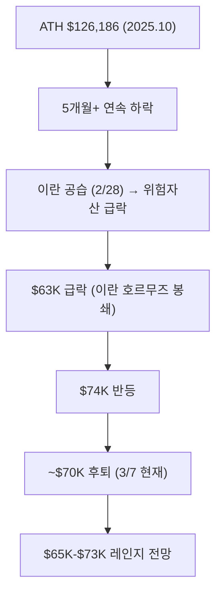
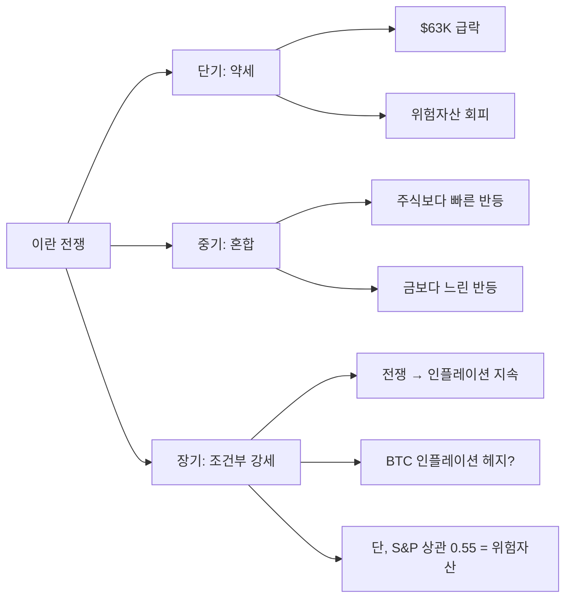
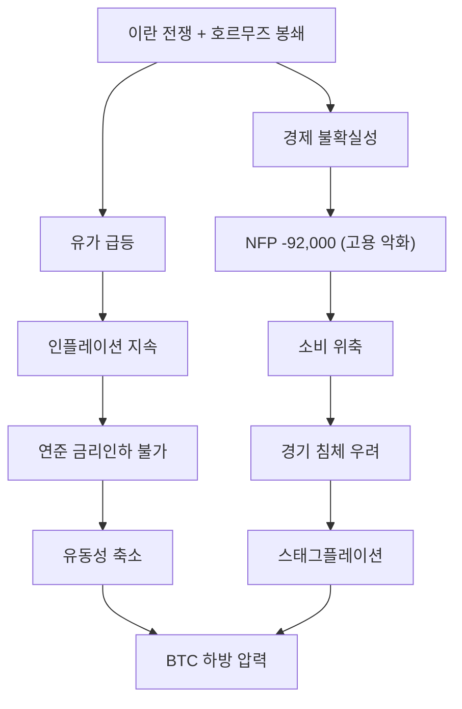

## 핵심 요약 (2026년 3월 7일 기준)

| 항목 | 현황 |
|------|------|
| 비트코인 | **~$70,000** (주간 $63K-$74K 범위) |
| 이더리움 | **~$2,078** (BTC 대비 약세) |
| ATH | $126,186 (2025.10) |
| ATH 대비 | **-43%** (5개월+ 연속 하락) |
| S&P 500 상관계수 | **0.55** (30일 롤링) → 위험자산으로 거래 중 |
| 장기보유자 매도 | **87% 감소** → 매도 소진 신호 |
| ETF AUM | $170B → **$84.3B (-50%)**, 최근 $1B+ 유입 |
| 2월 NFP | **-92,000** → 스태그플레이션 우려 |
| 핵심 지지/저항 | **$60K 지지 / $69K 분기점 / $73.3K 저항** |
| 단기 전망 | **$65K-$73K 레인지** (높은 불확실성) |
| 투자 판단 | **관망 또는 극소량 분할 매수. 레버리지 금지** |

---

## 시장 현황

### 가격 동향


```mermaid
graph TD
    A["ATH $126,186 (2025.10)"] --> B["5개월+ 연속 하락"]
    B --> C["이란 공습 (2/28) → 위험자산 급락"]
    C --> D["$63K 급락 (이란 호르무즈 봉쇄)"]
    D --> E["$74K 반등"]
    E --> F["~$70K 후퇴 (3/7 현재)"]
    F --> G["$65K-$73K 레인지 전망"]
```

**이번 주 핵심 움직임**: 이란 전쟁 뉴스에 $63K까지 급락 → $74K까지 빠르게 반등 → $70K로 후퇴. 주목할 점은 **전쟁 시 금처럼 오르지 않고 주식처럼 급락**했다는 것으로, "디지털 금" 내러티브가 크게 약화되었습니다.

### 비트코인 핵심 레벨

```
  $80,000 ─── 돌파 시 본격 상승 (지정학 불확실성 해소 필요)
  $73,300 ─── 저항선
  $69,000 ─── ★ 기술적 분기점
  $60,000 ─── ★★ 핵심 지지 (실패 시 급락)
  $55,000 ─── 다음 지지
  $50,000 ─── 극단적 약세
```

### S&P 500 상관계수: BTC는 위험자산

| 지표 | 수치 | 의미 |
|------|------|------|
| S&P 500 30일 상관계수 | **0.55** | BTC = 위험자산 (안전자산 아님) |
| 이란 전쟁 시 BTC | **$63K 급락** | 주식과 함께 하락 |
| 이란 전쟁 시 금 | **상승** | 전통적 안전자산 역할 |
| 반등 속도 | 주식보다 빠름, 금보다 느림 | 혼합 신호 |

> **핵심 시사점**: S&P 상관계수 0.55는 BTC가 아직 "디지털 금"이 아니라 **위험자산**으로 거래되고 있음을 의미합니다. 유동성 축소·금리 인상 환경에서 BTC는 하방 압력을 받습니다.

---

## ETF 자금 흐름

| 항목 | 수치 | 의미 |
|------|------|------|
| 피크 AUM | $170B (2025.10) | |
| 현재 AUM | **$84.3B** | **-50% 감소** |
| 최근 순유입 | **$1B+** | 과매도 반등 매수 |
| 3개월 순유출 | **-$5.8B** | 유출 기조 지속 |
| YTD 순유입 | **+$14.2B** | 장기 기관 자금 잔류 |

> 최근 $1B+ 순유입은 긍정적이나, **$170B → $84.3B(-50%) AUM 감소**와 3개월 -$5.8B 유출 기조를 반전시키기엔 부족합니다.

---

## 장기보유자 매도 소진 신호

| 지표 | 수치 | 의미 |
|------|------|------|
| 장기보유자 순매도 감소 | **87%** | 팔 사람이 거의 다 팔았다는 신호 |
| ETF 최근 유입 | $1B+ | 기관 저가 매수 시작 가능성 |

> 장기보유자 매도 87% 감소는 **매도 압력 소진**을 의미합니다. 과거 사이클에서 이 신호 후 수개월 내 바닥 형성이 나타났습니다. 다만 매크로 환경(전쟁, 스태그플레이션)이 변수입니다.

---

## 이란 전쟁의 BTC 영향


```mermaid
graph LR
    A["이란 전쟁"] --> B["단기: 약세"]
    A --> C["중기: 혼합"]
    A --> D["장기: 조건부 강세"]
    B --> B1["$63K 급락"]
    B --> B2["위험자산 회피"]
    C --> C1["주식보다 빠른 반등"]
    C --> C2["금보다 느린 반등"]
    D --> D1["전쟁 → 인플레이션 지속"]
    D --> D2["BTC 인플레이션 헤지?"]
    D --> D3["단, S&P 상관 0.55 = 위험자산"]
```

| 시간축 | 영향 | 근거 |
|--------|------|------|
| **단기** | **약세** | $63K 급락. 전쟁 뉴스 = 위험자산 매도 |
| **중기** | **혼합** | 주식보다 빠르게 반등했으나 금보다 느림 |
| **장기** | **조건부 강세** | 전쟁 → 인플레이션 지속 시 BTC 헤지 수요. 단 S&P 상관 0.55로 위험자산 성격이 우세 |

---

## 매크로 환경: 스태그플레이션 리스크

### 핵심 매크로 데이터

| 지표 | 수치 | BTC 영향 |
|------|------|----------|
| **2월 NFP** | **-92,000** | 스태그플레이션 우려 → 위험자산 약세 |
| 연준 금리인하 기대 | **후퇴** | 유동성 의존 자산에 부정적 |
| 유가 | **$100+ 지속 시** | 금리인하 불가 → BTC 하방 압력 |

> **2월 NFP -92,000은 충격적 수치**입니다. 고용 악화 + 인플레이션 지속 = 스태그플레이션 시나리오는 **위험자산에 최악의 환경**입니다. 연준이 금리를 인하할 수도, 동결할 수도 없는 딜레마에 빠집니다.

### 스태그플레이션 경로


```mermaid
graph TD
    A["이란 전쟁 + 호르무즈 봉쇄"] --> B["유가 급등"]
    B --> C["인플레이션 지속"]
    C --> D["연준 금리인하 불가"]
    D --> E["유동성 축소"]
    E --> F["BTC 하방 압력"]

    A --> G["경제 불확실성"]
    G --> H["NFP -92,000 (고용 악화)"]
    H --> I["소비 위축"]
    I --> J["경기 침체 우려"]
    J --> K["스태그플레이션"]
    K --> F
```

---

## BTC 전망

### 긍정적 요인

| 요인 | 내용 |
|------|------|
| **장기보유자 매도 87% 감소** | 매도 소진 → 바닥 형성 신호 |
| **ETF $1B+ 유입** | 기관 저가 매수 시작 가능성 |
| 기관 전망 | $120K-$175K (전쟁 리스크 해소 전제) |
| GENIUS Act | 스테이블코인 제도화 → 기관 진입 장벽 하락 |
| ETF BTC 보유 | 1.5M+ BTC (공급 잠금 효과) |

### 부정적 요인 (현재 우세)

| 요인 | 내용 |
|------|------|
| **S&P 상관 0.55** | 위험자산 = 매크로 악화 시 동반 하락 |
| **디지털 금 내러티브 약화** | 전쟁 시 금처럼 상승하지 않고 급락 |
| **NFP -92,000** | 스태그플레이션 → 위험자산 최악 환경 |
| **5개월+ 하락** | ATH 이후 지속적 하방 추세 |
| **ETF AUM -50%** | $170B → $84.3B |
| **유가 $100+ 시** | 금리인하 불가 → BTC 압력 |

### 평균 회귀 리스크

| 사이클 | 정점 | 저점 | 하락률 |
|--------|------|------|--------|
| 2013-2015 | $1,150 | $200 | -83% |
| 2017-2018 | $19,800 | $3,200 | -84% |
| 2021-2022 | $69,000 | $15,500 | -78% |
| **2025-?** | **$126,186** | **$63,000** | **-50% (진행 중)** |

과거 사이클 저점은 -78~84%. 현재 -50%는 과거 대비 추가 하락 여지가 있습니다.

### 기관 전망

| 기관 | 전망 | 비고 |
|------|------|------|
| Standard Chartered | **$120K** | 보수적 |
| Bernstein | **$150K** | 중도 |
| Fundstrat | **$175K** | 낙관적 |
| **컨센서스** | **$120K-$175K** | **모두 전쟁 리스크 해소 전제** |

> **주의**: 기관 전망은 전쟁·스태그플레이션 이전에 제시된 것이 대부분입니다. 현재 ~$70K은 이 전망의 절반 수준으로, **지정학 리스크 해소 + 매크로 안정화 없이는 달성 불가**합니다.

---

## 이더리움(ETH) 전망

| 항목 | 현황 |
|------|------|
| 최근 가격 | **~$2,078** |
| BTC 대비 성과 | **약세** (위기 시 BTC보다 더 큰 폭 하락) |
| 스테이킹 ETF | BlackRock 신청, 승인 추세 |
| DeFi TVL | $74B (이더리움 65%+ 호스팅) |
| RWA 토큰화 | $310B (이더리움 65%+ 점유) |

### 2026년 업그레이드

| 업그레이드 | 시기 | 내용 |
|-----------|------|------|
| **Glamsterdam** | 상반기 | 성능 개선, EVM 업데이트 |
| **Hegota** | 하반기 | 확장성 개선 |

---

## 규제 환경

| 규제 | 상태 | 내용 |
|------|------|------|
| **GENIUS Act** | **진행 중** | 7/18 스테이블코인 규칙 확정 시한 |
| **스테이블코인 시장** | **성장 중** | BTC 약세에도 불구하고 확대 |
| **EU MiCA** | **시행 완료** (2024.12.30) | 포괄적 암호화폐 규제 |
| **STO법 (한국)** | **통과** | 2027.1 시행 → 2030년 367조원 시장 |
| 100+ 신규 ETF | Bitwise 예상 | 제도권 진입 가속 |

---

## 투자 전략

### 현 시점 핵심 원칙

1. **$65K-$73K 레인지 전망**: 높은 불확실성으로 무리한 진입 금지
2. **$60K 지지 관찰**: 실패 시 급락
3. **$80K 돌파 조건**: 지정학 불확실성 해소 필요
4. **레버리지**: **절대 금지**

### 시나리오별 전략

#### 시나리오 1: $65K-$73K 레인지 횡보 (확률: 높음)

```
전략: 관망 또는 극소량 분할 매수
- ~$70K: 신규 매수 자제, 관망
- $65K 접근: 극소량 분할 매수 (10%)
- $60K 접근: 소량 분할 매수 (20%)
```

#### 시나리오 2: $60K 지지 실패, $50K대 급락 (확률: 중간)

```
전략: 대기 후 저가 매수
- $55K-58K: 소량 분할 매수 (20%)
- $50K-55K: 적극 매수 (30%)
- $45K 이하: 추가 매수 (30%)
```

#### 시나리오 3: 전쟁 해소 + 매크로 안정 → $75K+ 회복 (확률: 낮음)

```
전략: 확인 후 매수
- 지정학 해소 + NFP 반등 확인: 분할 매수 시작
- $73.3K 돌파: 상승 추세 전환 신호
- $80K 돌파: 본격 상승
```

---

## 3월 핵심 모니터링

1. **이란 전쟁 동향**: 해소/장기화가 시장 방향성 결정
2. **NFP 후속 데이터**: 스태그플레이션 확인/부정
3. **유가 동향**: $100+ 지속 시 금리인하 불가 → BTC 압력
4. **$60K 지지선**: 실패 시 급락
5. **$69K 기술적 분기점**: 회복 여부가 추세 전환 핵심
6. **ETF 자금 흐름**: $1B+ 유입 지속 여부
7. **장기보유자 동향**: 매도 소진 → 바닥 형성 신호 확인
8. **GENIUS Act**: 스테이블코인 규칙 확정 모니터링

---

## 종합 정리

| 자산 | 현황 | 핵심 포인트 |
|------|------|-------------|
| **비트코인** | ~$70,000 | ATH -43%. S&P 상관 0.55 = 위험자산. 장기보유자 매도 87% 감소. NFP -92K 스태그플레이션 |
| **이더리움** | ~$2,078 | BTC 대비 약세. Glamsterdam/Hegota 업그레이드 대기 |
| **스테이블코인** | 성장 중 | GENIUS Act 진행. BTC 약세에도 시장 확대 |
| **STO** | 시행 확정 | 2027.1 시행. 2030년 367조원 시장 |

**2026년 3월 7일 현재, BTC는 ~$70,000에서 ATH 대비 -43% 하락 상태입니다.** 이란 전쟁으로 $63K까지 급락 후 $74K까지 반등했으나 $70K로 후퇴했습니다. **S&P 500 상관계수 0.55**로 "디지털 금"이 아닌 위험자산으로 거래되고 있으며, 전쟁 시 금과 달리 급락한 점이 이를 확인합니다.

**장기보유자 순매도 87% 감소**는 매도 소진 신호로 긍정적이나, **2월 NFP -92,000 스태그플레이션 우려**, **유가 상승에 따른 금리인하 후퇴** 등 매크로 역풍이 강합니다. **$65K-$73K 레인지** 전망이며, 지정학 리스크 해소 없이 $80K 돌파는 어렵습니다.

**투자 결정은 본인의 재무 상황, 리스크 허용도, 투자 목표를 고려하여 신중하게 내리시기 바랍니다.**

---

## 참고 자료

- BTC 가격: ~$70,000 (주간 $63K-$74K), ATH $126,186 대비 -43%
- ETH 가격: ~$2,078
- S&P 500 30일 상관계수: 0.55
- 장기보유자 순매도: 87% 감소
- ETF AUM: $170B → $84.3B (-50%), 최근 $1B+ 유입
- 2월 NFP: -92,000
- 핵심 레벨: $60K 지지 / $69K 분기점 / $73.3K 저항
- [Bitcoin ETF Outflows - CoinDesk](https://www.coindesk.com/markets/2026/02/04/bitcoin-etf-outflows-deepen-as-ether-and-xrp-funds-quietly-attract-inflows)
- [Bitcoin Forecasts $65K-$250K - TradingView](https://www.tradingview.com/news/newsbtc:b54130e2d094b:0-bitcoin-forecasts-for-2026-range-from-65k-to-250k-as-sentiment-hits-extreme-fear/)
- [Trump Strategic Bitcoin Reserve - White House](https://www.whitehouse.gov/fact-sheets/2025/03/fact-sheet-president-donald-j-trump-establishes-the-strategic-bitcoin-reserve-and-u-s-digital-asset-stockpile/)
