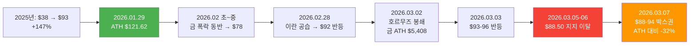
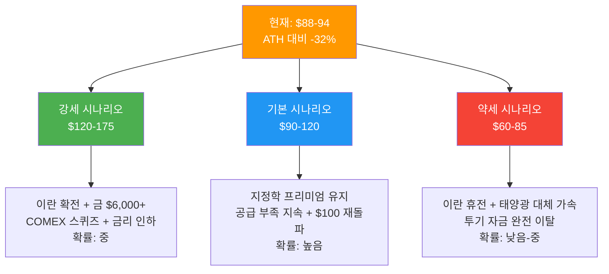
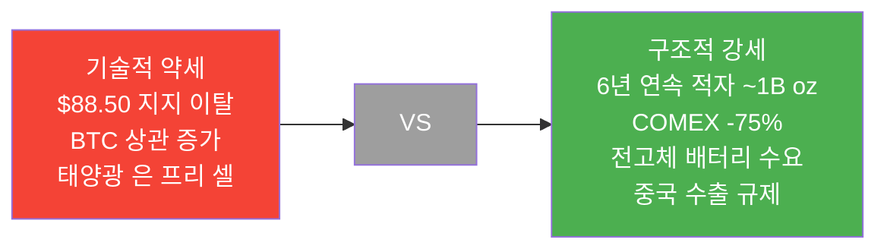

> **관련 글**: [2026년 투자 섹터 전망 (전체)](/knowledge/invest/2026/01/20/investment-sectors-outlook-2026.html)

## 핵심 요약 (2026년 3월 7일 기준)

| 항목 | 내용 |
|------|------|
| 현재 가격 | **$88-94/oz** 박스권 |
| ATH | **$121.62** (2026.01.29) |
| ATH 대비 | **-32%** |
| 핵심 지지 $88.50 | **완전 이탈** (3/6 확인) → 기술적 약세 |
| 금 가격 | **$5,081-5,171/oz** (ATH $5,408에서 후퇴) |
| 금은비 | **~58-60:1** |
| 공급 적자 | **6년 연속**, 누적 **~10억oz** |
| COMEX 재고 | **-75%** 감소 (346M → 82M oz) |
| 투자 수요 | **+20%** (227M oz, 3년래 최고) |
| 전고체 배터리 | **삼성 Ag-C** — EV당 ~1kg(32oz), 2027 양산 |
| 태양광 리스크 | **은 프리 셀 양산 시작** → PV 은 수요 감소 |
| 중국 수출 규제 | 정제은 수출 **정부 승인제** 지속 |
| 이란/호르무즈 | 금 ATH $5,408 달성 후 조정 중, 유가 상승 → 인플레 헤지 |
| 투자 판단 | **기술적 약세 vs 구조적 공급적자 팽팽. $82-85 다음 지지, $94 저항. 신규 진입 대기 or $82-85 분할 매수 검토** |

---

## 가격 흐름



**핵심 포인트**: 이란 공습(2/28) 후 금이 $5,408 ATH를 찍으며 은도 동반 상승했으나, 금 대비 은의 후퇴 폭이 더 큼. 은은 귀금속이면서도 산업금속 성격이 강해 위기 시 금보다 변동성이 큰 패턴이 반복되고 있음.

---

## 강세 논거

### 1. 금 $5,081-5,171 — ATH $5,408에서 후퇴, 그래도 역사적 고점권

| 항목 | 수치 |
|------|------|
| 금 현재가 | **$5,081-5,171** |
| 금 ATH | **$5,408** (2026.03.02, 이란 공습 직후) |
| JP Morgan 목표 | **$6,300** |
| UBS 목표 | **$6,200** |
| 중앙은행 매입 | **585톤/분기** |

금이 $5,408 ATH에서 후퇴 중이지만 $5,000+ 수준을 유지하고 있습니다. 기관들의 $6,000+ 목표가 유효하다면 금은비 60:1 기준 은 $100 재돌파가 가능한 수준입니다.

### 2. 구조적 공급 부족: 6년 연속 적자, 누적 ~10억oz

| 연도 | 공급 부족 (M oz) | 누적 |
|------|-----------------|------|
| 2021 | -50 | -50 |
| 2022 | -240 | -290 |
| 2023 | -185 | -475 |
| 2024 | -215 | -690 |
| 2025 | -230 | -920 |
| **2026E** | **-67** | **-987** |

- 누적 적자 **약 10억oz** (1년치 생산량 초과)
- 광산 생산: 2016년 피크(900M oz) → 현재 ~835M oz
- **71%가 구리/아연/납 채굴의 부산물** → 은 가격 상승에도 독립적 증산 불가
- 신규 광산 개발: 8-12년 소요

### 3. COMEX 재고 위기 지속

| 시점 | 등록 재고 (M oz) |
|------|----------------|
| 2020년 피크 | ~346 |
| 2026년 3월 | **~82** |
| **감소율** | **-75%** |

전체 재고 1억oz 이하. 실물 인도 가능 물량이 위험 수준입니다.

### 4. 이란/호르무즈 → 인플레이션 헤지

- 이란 공습(2/28) 후 금 $5,408 ATH → 은도 동반 급등
- 호르무즈 봉쇄 → 유가 상승 압력 지속
- **유가 $100+ 지속 시** → 인플레이션 구조화 → 은의 인플레 헤지 수요 강화
- 다만 은은 금보다 후퇴 폭이 크고 (산업금속 성격), 위기 시 리스크 자산처럼 행동하는 경향

### 5. 전고체 배터리 — 삼성 Ag-C 나노복합층

| 항목 | 내용 |
|------|------|
| **기술** | **Ag-C(은-탄소) 나노복합층** — 캐소드 측 5um 두께 |
| **EV당 은 사용량** | **~1kg (32.15oz)** |
| **삼성SDI** | BMW 테스트 차량 **2026년 말**, 양산 **2027년** |
| **삼성전기** | 소형 전고체 배터리 **세계 최초** — Galaxy Watch/Ring, **2026년 말** |
| **EV 보급 시나리오** | 연 1,000만대 전고체 EV 시 **321.5M oz 신규 수요** |

태양광 은 프리 셀로 인한 PV 수요 감소를 **상쇄하거나 초과**할 잠재력. 다만 양산은 2027년부터이므로 현재 가격에는 미반영.

### 6. AI/데이터센터 신규 수요

| 용도 | 은 수요 |
|------|--------|
| 하이퍼스케일 DC (500MW) | **약 300톤** |
| GPU 방열/전도 부품 | 증가 추세 |
| EV 배터리/전자부품 | 안정적 |

### 7. 실물 투자 수요 +20%

| 항목 | 수치 |
|------|------|
| 실물 투자 수요 | **227M oz** |
| 전년비 | **+20%** |
| 위치 | **3년래 최고** |

### 8. 중국 수출 규제

- 2026년 1월부터 정제은 수출에 **정부 승인 필요**
- 대형 국영기업만 수출 허가
- 런던/취리히 시장 공급 압박 → 글로벌 프리미엄 상승

---

## 약세 요인

### 1. 태양광 은 프리(Silver-Free) 셀 양산 시작 (핵심 리스크)

| 항목 | 내용 |
|------|------|
| 변화 | 중국 제조사(Longi 등) **은 프리 태양광 셀 양산 시작** |
| PV 은 수요 | YoY **-7%** (~194M oz) |
| 의미 | 과거 태양광 = 은 수요 폭증 시나리오의 **근본적 수정** |
| 장기 전망 | 태양광 설치량 증가에도 은 수요는 감소 추세 전환 가능 |

태양광은 은 산업수요의 핵심 성장 동력이었으나, **은 프리 셀 기술의 양산 진입은 장기 수요 전망을 구조적으로 약화**시킵니다. 하반기부터 실제 PV 은 수요 감소가 데이터로 나타날 전망. 다만 전고체 배터리(삼성 Ag-C)의 은 수요가 이를 상쇄할 잠재력이 있어, **수요 구조 전환의 방향성**이 핵심 변수.

### 2. $88.50 지지 완전 이탈 → 기술적 약세 확인

- 3월 6일 데이터에서 **$88.50 지지선 완전 이탈 확인**
- 이전 지지선이 저항선으로 전환
- 기술적으로 추가 하락 가능성 열린 상태

### 3. BTC 상관관계 증가 — 리스크 자산 행동

- 이란 전쟁 상황에서 은이 **금보다 더 크게 후퇴**
- BTC와 상관관계 증가 → 리스크 자산처럼 행동
- 안전자산(금) vs 산업금속(은)의 성격 차이가 극명하게 드러남

### 4. 고변동성

$121(ATH) → $78(조정) → $93-96(반등) → $88-94(현재)까지 짧은 기간 내 극심한 변동. 은은 금보다 변동성이 2-3배 높습니다.

### 5. 보석/은식기 수요 위축

- 보석 수요: **-9%**
- 은식기 수요: **-17%**
- 전통적 소비 수요 감소 지속

---

## 가격 전망

### 기관 전망 (3월 7일 기준)

| 기관/출처 | 전망 | 비고 |
|----------|------|------|
| **UBS** | **$58-60 → $65 (상향)** | 현재가 대비 보수적 |
| **JP Morgan** | **평균 $81, Q4 $85** | $88-94 범위보다 하단 |
| **BofA** | **$135-$309** | 낙관적 범위 |
| **Peter Krauth** | **가격 사이클 초기** | 장기 슈퍼사이클 관점 |
| **연말 컨센서스** | **$70-80** | 현재가보다 하단 |

### 2026년 시나리오별 전망



### 기술적 분석 (3/7 기준)

| 항목 | 레벨 | 의미 |
|------|------|------|
| **다음 지지** | **$82-85** | $88.50 이탈 후 다음 구간 |
| 심리적 지지 | $80 | 라운드 넘버 |
| **1차 저항** | **$94** | 현재 박스권 상단 |
| 2차 저항 | $100 | 심리적 저항 + 이전 돌파 레벨 |
| 손절 라인 | $70 | 구조적 지지 이탈 시 |

---

## 투자 전략

### 핵심 판단: 기술적 약세 vs 구조적 공급적자

현재 은 시장은 **두 힘이 팽팽히 대치** 중입니다.



### 전략 테이블

| 전략 | 구체적 방법 |
|------|-----------|
| 기존 포지션 | **보유 유지**, $82-85 지지 모니터링 |
| 신규 진입 | **$82-85에서 분할 매수 검토** (기술적 지지 확인 후) |
| 반등 확인 | $94 돌파 시 추세 전환 신호 |
| 손절 라인 | **$70** (구조적 지지 이탈) |
| 목표가 | $94 회복 (단기), $100+ (금 $6,000+ 동반 시) |
| 비중 | 포트폴리오 5-15% |

### 시나리오별 대응

```
시나리오 A: 이란 확전 + 금 $6,000 + 전고체 모멘텀 ($88 → $94 → $100+) [확률: 중]
  → 포지션 보유, $94 돌파 시 추세 전환 확인
  → 유가 $100+ 지속 시 인플레이션 구조화 → 은 강세

시나리오 B: $82-94 박스권 유지 [확률: 높음]
  → $82-85 지지 확인 시 분할 매수 검토
  → 태양광 은 프리 vs 전고체 수요 균형 관찰

시나리오 C: 투기 완전 이탈 ($60-82) [확률: 낮음-중]
  → $80 이하 분할 매수 ($80 → $75 → $70)
  → $70 이하 시 손절 후 재진입 탐색
  → 구조적 강세(공급적자+전고체)는 여전히 유효
```

---

## 모니터링 체크리스트

1. **이란/호르무즈 봉쇄 동향**: 유가 $100+ 지속 시 은 인플레 헤지 구조화
2. **태양광 은 프리 셀 보급률**: 양산 시작 후 시장 점유율 추이 (핵심 장기 변수)
3. **삼성 전고체 배터리 양산 일정**: Ag-C 나노복합층 — 2026말 소형, 2027 EV
4. **기술적 $82-85 지지선**: $88.50 이탈 후 다음 지지 구간
5. **금 ATH $5,408 재돌파 여부**: 현재 $5,081-5,171에서 조정 중
6. **COMEX 등록 재고**: 82M oz 이하 추이
7. **금은비**: ~58-60:1 변화 방향
8. **BTC 상관관계**: 리스크 자산 행동 패턴 지속 여부
9. **연준 금리**: 유가 급등이 인하 지연 가능성
10. **중국 수출 규제**: 강화/완화 동향

---

## 정리

은은 **구조적 공급 부족**(6년 연속 적자 누적 ~10억oz, COMEX -75%, 광산 71% 부산물)과 **전고체 배터리 신규 수요**(삼성 Ag-C, EV당 32oz), **중국 수출 규제**가 장기 호재로 유효합니다. 이란 공습 후 금이 $5,408 ATH를 기록하며 은도 동반 상승했으나, 금 대비 후퇴 폭이 더 커 **산업금속 성격이 부각**되고 있습니다.

**핵심 리스크는 태양광 은 프리 셀 양산 시작**으로, PV 은 수요 -7% 감소가 시작됩니다. 반면 전고체 배터리(2027 양산)가 이를 상쇄할 잠재력이 있어 **수요 구조 전환의 방향성**이 핵심 변수입니다.

**기술적으로 $88.50 이탈 → 약세 확인**. 다음 지지는 $82-85, 저항은 $94입니다. BTC와 상관관계 증가로 리스크 자산 행동 패턴이 관찰되고 있어, 안전자산 포지션으로는 금이 더 적합한 상황입니다.

**투자 결정은 본인의 리스크 허용 범위와 투자 기간을 고려하여 신중하게 내리시기 바랍니다.**

---

## 참고 자료

- Silver Institute: 2026년 6년 연속 공급 적자 전망 (-67M oz, 누적 ~1B oz)
- COMEX 등록 재고: 82M oz (-75% from peak)
- 이란 호르무즈 해협 봉쇄 (2026.03.02): 금 ATH $5,408
- 금 현재가: $5,081-5,171 (ATH $5,408에서 후퇴)
- UBS 은 전망 상향: $58-60 → $65
- BofA 분석가 전망: $135-$309 범위
- JP Morgan: 평균 $81, Q4 $85
- Peter Krauth: 은 가격 사이클 초기, 매니아 단계 수년 후
- 삼성SDI 전고체 배터리: Ag-C 나노복합층, BMW 테스트 2026년 말, 양산 2027, 800km/9분충전
- 삼성전기: 세계 최초 소형 전고체 배터리 (Galaxy Watch/Ring), 2026년 말
- 전고체 배터리 EV당 은 사용량: ~1kg (32.15oz)
- 중국 태양광 은 프리 셀 양산: Longi 등 Q2 2026 시작, PV 은 수요 YoY -7%
- [Silver Price Predictions 2026 - GoldSilver](https://goldsilver.com/industry-news/article/silver-price-forecast-predictions/)
- [Silver Price Forecast 2026 - CBS News](https://www.cbsnews.com/news/expert-driven-silver-price-forecast-for-2026/)
- [COMEX Silver Inventory - CoinWeek](https://coinweek.com/comex-silver-inventories-fall-below-100-million-ounces-as-physical-demand-tightens-global-market/)
- [Silver Institute - Global Silver Investment 2026](https://silverinstitute.org/global-silver-investment-to-remain-strong-in-2026-against-the-backdrop-of-a-sixth-consecutive-annual-market-deficit/)
- [J.P. Morgan Silver Price Forecast 2026](https://www.jpmorgan.com/insights/global-research/commodities/silver-prices)
