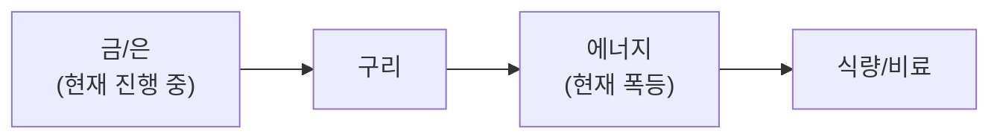

**3월 18일, VIX 23.51 급락(-13.5%) + FOMC 결정 오늘 + 빅테크 AI 해고 물결.** VIX **27.19→23.51** 급락으로 **공포 크게 완화**. S&P 500 **6,716(+0.25%)**, NASDAQ **22,480(+0.47%)** 이틀 연속 상승. **FOMC 결정 오늘 오후** — 동결 확실, SEP·점도표 핵심. 빅테크 **AI 해고 물결** — Meta 20%(15K명), Oracle $2.1B 구조조정, 2026 YTD 35,000명+. 에이전틱 AI 시장 **$8B→$215B(2035)**. GTC 진행 중(~19), **Eaton 파트너십**(AI 데이터센터 전력). TeraFab **3/21 런칭** 임박.

**유가 $96 재반등 + NATO 균열.** WTI **~$96(+2.57%)** 재반등, Brent **$102+**. 이란 UAE 에너지 인프라 공격으로 유가 상승 압력 지속. **유럽 NATO 균열** — 그리스·노르웨이·프랑스가 미국 이란전 협조 거부, 트럼프 SNS 불만 표출. 협상 교착 지속.

**사모신용 $265B 멜트다운 + AI 해고 가속.** Fortune: $2.1T 시장 2008년 이후 최대 위기. **AI 에이전트가 9,200개 포지션 제거**(2026 YTD). 블록(Block) CEO: "모든 기업이 같은 길을 걸을 것". Meta **$135B AI 인프라** 투자 위해 20% 해고 검토. **에이전틱 AI**가 SaaS 담보 40% 파괴 + 일자리까지 파괴 → 사모신용 부도율 **9.2% 사상 최고** 지속.

**시장 반등 지속 + BTC $74K.** KOSPI **5,550(+1.14%)**. EWY 3M **+48.23% 글로벌 최강** 유지. **BTC $74,001(-1.15%)** 소폭 조정. S&P 500 **200일선(6,589) 위 유지**. **금 $5,016**($5K 위 안정). Micron HBM 공급 부족으로 **AI 메모리 수혜**.

**방산 4배 증산 + 유럽 방산 붐.** 6대 미국 방산사 **4배 증산** 백악관 서약. ITA +14% YTD. Rheinmetall **40-45% 성장**. EU ReArm **8,000억유로**. 한국 방산주 **131% YoY 성장**.

**FOMC 결정 오늘 오후 + H2 IPO 러시 기대.** FOMC 동결 확실이나 **SEP·점도표가 핵심** — 유가 인플레 반영 여부. 시장 **12월 1회 인하만** 반영. 하반기 **Anthropic·OpenAI·SpaceX IPO** 러시 기대 — S&P 500 조기 편입 규칙 변경 검토 중.

## 6대 투자 섹터 구조

| 섹터 | 하위 섹터 | 상세 분석 |
|------|----------|----------|
| **1. 반도체/AI** | HBM, DRAM/NAND, 파운드리, 소부장, AI SW/클라우드 | [반도체 섹터](/knowledge/invest/2026/01/21/semiconductor-sector-outlook-2026.html) |
| **2. 에너지** | 원전/SMR, 재생에너지, ESS, 수소 | [에너지 섹터](/knowledge/invest/2026/03/07/energy-sector-outlook-2026.html) |
| **3. 방산/우주** | 방산, 드론/UAM, 우주/위성 | [방산/우주 섹터](/knowledge/invest/2026/03/07/defense-space-sector-outlook-2026.html) |
| **4. 모빌리티/로봇** | EV/자율주행, 로봇, 조선 | [모빌리티/로봇 섹터](/knowledge/invest/2026/01/21/automotive-robotics-sector-outlook-2026.html) |
| **5. 바이오/헬스케어** | 신약/바이오텍, GLP-1/비만치료, 의료AI | [바이오/헬스케어 섹터](#바이오헬스케어-및-생명공학) |
| **6. 자산/거시경제** | 금/은, 암호화폐, 원자재/희토류, 거시경제/정책 | [거시경제/정책 섹터](/knowledge/invest/2026/01/21/macroeconomic-policy-sector-outlook-2026.html) |

### 하위 섹터 상세 링크

**반도체/AI**
- [HBM 투자 전망](/knowledge/invest/2026/01/21/hbm-sector-outlook-2026.html)
- [DRAM/NAND 투자 전망](/knowledge/invest/2026/01/21/dram-nand-sector-outlook-2026.html)
- [파운드리 투자 전망](/knowledge/invest/2026/01/21/foundry-sector-outlook-2026.html)
- [소부장 투자 전망](/knowledge/invest/2026/01/21/semiconductor-materials-equipment-outlook-2026.html)
- [AI 소프트웨어/클라우드](/knowledge/invest/2026/03/07/ai-software-cloud-outlook-2026.html)

**에너지**
- [원전 투자 전망](/knowledge/invest/2026/01/21/nuclear-power-sector-outlook-2026.html)

**방산/우주**
- [방산 투자 전망](/knowledge/invest/2026/01/21/defense-sector-outlook-2026.html)

**모빌리티/로봇**
- [EV/자율주행 투자 전망](/knowledge/invest/2026/01/21/ev-autonomous-driving-outlook-2026.html)
- [로봇 투자 전망](/knowledge/invest/2026/01/21/robotics-sector-outlook-2026.html)
- [조선 투자 전망](/knowledge/invest/2026/01/21/shipbuilding-sector-outlook-2026.html)

**자산/거시경제**
- [원자재/희토류](/knowledge/invest/2026/03/07/commodities-rare-earth-outlook-2026.html)

---

## 미래 워치리스트

| 테마 | 현황 | 주시 포인트 |
|------|------|-----------|
| **양자컴퓨팅** | Google Willow, IBM Heron 등 진전. 상용화 초기 | 오류 정정(QEC) 돌파, 금융/제약 응용 |
| **합성생물학** | AI+유전체 편집 융합 가속 | 바이오 제조, 식량/에너지 응용 |
| **BCI (뇌-컴퓨터 인터페이스)** | Neuralink 임상시험, 경쟁사 등장 | FDA 승인, 의료 응용 확대 |
| **핵융합** | Commonwealth Fusion, TAE 등 민간 투자 확대 | 상용 발전 시점(2030년대 중반 전망) |

---

## 목차

1. [거시적 시장 환경](#거시적-시장-환경)
2. [AI 및 클라우드 컴퓨팅](#ai-및-클라우드-컴퓨팅)
3. [AI 네트워크 인프라](#ai-네트워크-인프라)
4. [반도체 및 첨단 제조](#반도체-및-첨단-제조)
5. [로보틱스 및 자율주행](#로보틱스-및-자율주행)
6. [에너지 전환 및 친환경](#에너지-전환-및-친환경)
7. [바이오헬스케어 및 생명공학](#바이오헬스케어-및-생명공학)
8. [우주산업 및 뉴스페이스](#우주산업-및-뉴스페이스)
9. [방위산업 및 국방기술](#방위산업-및-국방기술)
10. [핀테크, 암호화폐 및 STO](#핀테크-암호화폐-및-sto)
11. [사이버보안 및 데이터 인프라](#사이버보안-및-데이터-인프라)
12. [지정학적 관점: 한국은 1980년대 일본](#지정학적-관점-한국은-1980년대-일본)
13. [초거대 기업들의 전략과 투자 방향](#초거대-기업들의-전략과-투자-방향)
14. [한국 시장 구조 변화](#한국-시장-구조-변화)
15. [섹터별 투자 전략: 3월 실전 가이드](#섹터별-투자-전략-3월-실전-가이드)

---

## 거시적 시장 환경

### 글로벌 증시 현황 (3/18 기준)

| 지수 | 수준 | 변동 | 비고 |
|------|------|----------|------|
| **S&P 500 (SPY)** | **6,716** | **+0.25%** | **★ 이틀 연속 상승. 200일선(6,589) 위 유지** |
| **NASDAQ** | **22,480** | **+0.47%** | **★ GTC 진행 중. 기술주 반등** |
| **Dow** | **46,993** | **+0.10%** | 소폭 상승 |
| **KOSPI** | **5,550** | **+1.14%** | **상승 지속. EWY 3M +48.23% 글로벌 최강** |
| **상해종합** | **4,050** | **-0.85%** | 약세 |
| **항셍** | **25,869** | **+0.13%** | 보합 |
| **원/달러** | **~1,499원** | **+0.47%** | **1,500원 심리선 근접. WGBI 4월 편입** |
| **Brent** | **~$102** | **+2.72%** | **★ 재반등. 이란 UAE 인프라 공격** |
| **WTI** | **~$96** | **+2.57%** | **$93.50→$96 재반등. 유가 변동성 지속** |
| **금(Gold)** | **$5,016/oz** | **+0.43%** | **$5K 위 안정. Goldman $5,400 타겟** |
| **은(Silver)** | 강세 유지 | **$100 전망 지속** | 6년 연속 공급적자 |
| **비트코인** | **$74,001** | **-1.15%** | **소폭 조정. $74K 지지** |
| **VIX** | **23.51** | **-13.5%** | **★★ 공포 크게 완화. 27→23 급락** |
| **TLT** | **87.45** | **+0.28%** | 10Y 4.23%(-1.17%), 2Y 3.68%(-1.34%) |
| **SOXX** | **340.25** | **+0.72%** | **반도체 상승 지속. GTC 수혜** |
| **하이일드 스프레드** | 확대 지속 | | **사모신용 전이→신용 스프레드 확대** |
| **5Y Breakeven** | **2.62%** | **+1.55%** | **★ 인플레 기대 반등(유가 영향)** |
| **실업률** | **4.4%** | **+0.1%p** | **FOMC 결정 오늘 오후. 12월 1회만** |

### 이번 주 핵심 변화 (3/18 업데이트)

| 항목 | 변화 | 투자 시사점 |
|------|------|-----------|
| **★★★ VIX 23.51 급락(-13.5%)** | **27.19→23.51. 공포 크게 완화. S&P 6,716·NASDAQ 22,480 이틀 연속 상승. 시장 센티먼트 전환 시그널** | **바닥 형성 강화. 위험자산 선호도 개선** |
| **★★★ FOMC 결정 오늘 오후** | **동결 확실(92%+). SEP·점도표 핵심 — 유가 인플레·사모신용 리스크 반영 여부. 12월 1회 인하만 반영** | **파월 발언이 시장 방향 결정** |
| **★★★ 빅테크 AI 해고 물결** | **Meta 20%(15K명), Oracle $2.1B 구조조정, 2026 YTD 35,000명+. AI 에이전트 9,200개 포지션 제거. 에이전틱 AI 시장 $8B→$215B(2035)** | **AI→일자리 파괴 본격화. SaaS 사모신용 악화** |
| **★★★ 유가 $96 재반등** | **이란 UAE 에너지 인프라 공격으로 WTI $93.50→$96 재반등. Brent $102+. 유럽 NATO 균열(프랑스·그리스·노르웨이 협조 거부)** | **유가 하락 기대 후퇴. 변동성 지속** |
| **★★ GTC 진행 중(Day 2)** | **Eaton 파트너십(AI DC 전력). GTC 3/16~19 계속. $1T 주문·Vera Rubin 10x 소화 중** | **반도체·AI 인프라 모멘텀 지속** |
| **★★ Micron HBM 공급부족** | **HBM 타이트 서플라이→Micron 상승. AI 메모리 수요 > 공급 확인** | **메모리 슈퍼사이클 강화** |
| **★★ S&P 200일선 위 유지** | **6,716, 200일선(6,589) 위. VIX 23까지 하락. 이틀 연속 상승** | **바닥 형성 확률 상승** |
| **★ TeraFab D-3** | **3/21 런칭 임박. $25B, 2nm, 월 100만 웨이퍼** | **반도체 시장 구도 변화 잠재** |
| **★ H2 IPO 러시 기대** | **Anthropic·OpenAI·SpaceX IPO 예상. S&P 조기 편입 규칙 변경 검토** | **하반기 시장 자금 유입 촉매** |
| **★ 금 $5,016** | **$5K 위 안정. Goldman $5,400. 사모신용 불안 지속** | **안전자산 수요 구조적** |

### 핵심 매크로 변수 5가지

#### 1. 유가 $96 재반등 + NATO 균열 + 변동성 지속

| 항목 | 내용 | 투자 시사점 |
|------|------|-----------|
| **★ WTI ~$96 재반등** | **$93.50(3/15)→$96(3/17) +2.57%. Brent $102+ 재돌파** | **하락 기대 후퇴. 유가 변동성 지속** |
| **★ 이란 UAE 인프라 공격** | **이란이 아랍에미리트 에너지 인프라 공격. 유가 상승 압력 지속** | **중동 전쟁 확전 리스크** |
| **★ NATO 균열** | **그리스·노르웨이·프랑스가 미국 이란전 협조 거부. 트럼프 SNS 불만** | **서방 연합 약화→장기전 가능성 증가** |
| **선별적 봉쇄 지속** | **인도(해군호위), 그리스(스텔스), 터키·파키스탄 통과 허용은 유지** | 완전 봉쇄는 아니나 유가 $90+ 고착화 |
| **EIA 전망 상향** | **2026 WTI 평균 전망 $20 상향** | 유가 장기 고공 행진 전망 |
| **한국 비축유** | **석유 비축량 7개월치 보유** | 단기 위기 가능성 낮음 |
| **블룸버그 시나리오** | **1개월 봉쇄: $80, 3개월+: $160 돌파** | 선별적 봉쇄로 중간 시나리오 |

**핵심 판단:** 전일 유가 하락 시그널($102→$99)에서 **$96으로 재반등** — 이란의 UAE 에너지 인프라 공격이 **상승 촉매**. 유럽 NATO 균열(프랑스·그리스·노르웨이 이란전 협조 거부)로 **서방 연합 약화**, 장기전 가능성 증가. 트럼프가 동맹 비협조에 SNS로 불만 표출하는 등 **외교적 혼란** 지속. WTI $90~100 박스권 고착화 전망. **에너지 비중 14% 유지**(유가 변동성이 높아 추가 축소 보류).

#### 2. 사모신용 $265B 멜트다운 — El-Erian "전염 현상" + $2.1T 시장 2008년 이후 최대 위기

| 항목 | 내용 | 투자 시사점 |
|------|------|-----------|
| **★ Fortune $265B 멜트다운** | **월가 최대 투자 열풍이 패닉으로 전환. $2.1T 시장 2008년 이후 최대 위기** | 시스템 리스크 진행 중 |
| **★ El-Erian 경고** | **"전형적인 전염 현상" — 원하는 걸 못 팔면 팔 수 있는 걸 판다** | 다른 자산 클래스로 전이 우려 |
| **BlackRock** | **$26B 펀드 5% 환매 제한. $25M 대출 전액 손실** | 세계 1위 운용사 위기 |
| **Blackstone** | **BCRED $6.5B(7.9%) 환매 요청. 임직원 $400M 자체 투입** | 전례 없는 자구책 |
| **★ AI 담보 파괴 "SaaS-pocalypse"** | **에이전틱 AI→SaaS 구독 매출 침식. 사모 대출 포트폴리오 40%가 소프트웨어 기업** | 구조적 원인. AI 발전할수록 악화 |
| **사모신용 부도율** | **Fitch: 사모신용 부도율 사상 최고 9.2%** | 악화 가속 |
| **하이일드 스프레드** | **3.28%(+3.47%) — 신용 스프레드 확대 지속** | 전이 신호 |

**판단:** Fortune이 **"$265B 멜트다운"**으로 보도, El-Erian이 **"전형적인 전염 현상"** 경고. Fitch 부도율 **9.2% 사상 최고**. 핵심 원인은 AI(에이전틱 AI)가 SaaS 기업 담보 가치를 구조적으로 파괴하는 **"SaaS-pocalypse"** — 사모 대출 포트폴리오의 **40%가 소프트웨어 기업**. Blackstone BCRED $6.5B 환매에 임직원 $400M 투입이라는 전례 없는 자구책. **하이일드 스프레드 3.28%로 확대 지속**. **현금·금 비중 유지 + 금융주 경계** 필수.

#### 3. KOSPI 5,550(+1.14%) + EWY 3M +48.23% 글로벌 최강

| 항목 | 내용 | 투자 시사점 |
|------|------|-----------|
| **★ KOSPI 3/18** | **5,550 (+1.14%)** | **상승 지속. GTC + 반도체 수혜** |
| **★ EWY 3M +48.23%** | **글로벌 최강 수익률 유지** | **한국 구조적 상승 지속** |
| **Goldman 목표** | **연말 7,000 (기존 6,400에서 상향)** | **삼성 +216%, SK +356% 12M** |
| **EWY 1W** | **+1.19%** | **주간 상승 지속** |
| **EWY 3M** | **+48.23%** | **★ 3개월 글로벌 최강 지속** |
| **방산주** | **한국 방산 업종 YoY +131%** | **Hanwha +20%, LIG Nex1 +30%** |
| **환율** | **~1,499원** | **1,500원 심리선 근접. WGBI 4월 편입** |

**판단:** KOSPI **5,550(+1.14%)** 상승 지속 — 100조원 금융시장 안정화기금 효과 + GTC 반도체 수혜 반영. EWY 3M **+48.23%로 글로벌 최강** 수익률 유지(대만 EWT +19.1% 2배 이상 격차). 한국 방산주 YoY **+131%** 성장으로 글로벌 최강 방산 섹터. WGBI 4월 편입($56B+)이 구조적 원화 강세 촉매. 환율 **~1,499원**으로 유가 재반등에도 원화 약세 제한적. **한국 시장 구조적 상승 지속**.

#### 4. GTC 진행 중(Day 2~3) + Eaton 파트너십 + Micron HBM + TeraFab D-3

| 항목 | 내용 | 투자 시사점 |
|------|------|-----------|
| **★★ GTC 진행 중(~19)** | **키노트 완료 후 Day 2~3 진행. $1T 구매주문, Vera Rubin 10x 시장 소화 중** | **AI 인프라 모멘텀 지속** |
| **★★ Eaton 파트너십** | **NVIDIA + Eaton: AI 데이터센터 전력 인프라 협력** | **AI DC 전력 수요→전력 인프라 수혜** |
| **★★ Micron HBM 공급부족** | **HBM 타이트 서플라이 확인. Micron 실적 발표 앞두고 상승** | **메모리 슈퍼사이클 강화** |
| **★ Vera Rubin 10x** | **TSMC 3nm, 336B 트랜지스터. AI 추론 25배(H100 대비)** | **AI 효율성 혁명** |
| **★ Groq 3 LPU** | **$20B 인수 기업의 첫 칩. Q3 출하. SRAM 기반 디코드 가속** | **추론 시장 새 경쟁 축** |
| **★ 자율주행 연합** | **현대·BYD·닛산·지리 등 글로벌 완성차 40% 엔비디아 드라이브 채택. 2028년 28개 도시 로보택시** | **자율주행 플랫폼 독점 강화** |
| **★★ TeraFab D-3** | **3/21 런칭. $25B, 2nm, 월 100만 웨이퍼. AI5 칩** | **NVDA/TSMC 경쟁 구도 변화 잠재** |
| **HBM4 양산** | **SK하이닉스 70%(UBS). 삼성 생산 50% 확대** | **메모리 슈퍼사이클** |
| **반도체 $975B** | **SIA 2026년 $975B(+25%). 메모리 $440B(+30%)** | **기가사이클 가속** |
| **SOXX 340.25** | **+0.72% 상승 지속. NVDA $181.93** | **GTC 수혜 반영 지속** |

**핵심 판단:** GTC Day 2~3 진행 중. **Eaton 파트너십**으로 AI 데이터센터 전력 인프라가 새로운 투자 테마로 부상. **Micron HBM 공급부족** 확인으로 메모리 슈퍼사이클 강화. 자율주행 연합군(글로벌 완성차 40%)으로 NVIDIA 자율주행 플랫폼 독점 강화. 테슬라 **TeraFab 3/21 런칭 D-3** — 반도체 제조 경험 전무로 성공 불확실하나 시장 관심 집중. SOXX **340.25(+0.72%)** 상승 지속. **반도체 비중 20% 유지**.

#### 5. FOMC 결정 오늘 오후 + VIX 23 급락 + S&P 이틀 연속 상승

| 항목 | 현황 | 변화 |
|------|------|------|
| **★★★ VIX 23.51 급락** | **27.19→23.51 (-13.5% 주간)** | **★★ 공포 크게 완화. 시장 센티먼트 전환** |
| **★★ FOMC 결정 오늘 오후** | **동결 확실(92%+). SEP·점도표 발표** | **이란 전쟁+유가 인플레 반영 여부 핵심** |
| **★★ 금리인하 전망** | **12월 1회 인하만 반영. 연말 3.25~3.5% 전망** | **Goldman: 2026년 총 2회 인하 전망** |
| **★ S&P 이틀 연속 상승** | **6,716(+0.25%). 200일선(6,589) 위 유지** | **바닥 형성 강화** |
| **★ NASDAQ 반등** | **22,480(+0.47%). 기술주 회복** | **GTC + AI 모멘텀** |
| **★ Druckenmiller** | **달러 50년 내 기축통화 상실. 스테이블코인 15년 내 글로벌 결제 대세** | **BTC·금 수요 구조적 강화** |
| 원/달러 환율 | **~1,499원** | **1,500원 근접. WGBI 4월 편입** |
| DXY | **120.55** (Broad) | **달러 소폭 강세** |
| **실업률** | **4.4% (+0.1%p)** | **NFP -92K, 노동시장 약화** |
| **5Y Breakeven** | **2.62% (+1.55%)** | **★ 인플레 기대 반등(유가 재반등 영향)** |
| **10Y 금리** | **4.23% (-1.17%)** | **장단기 스프레드 0.52%** |
| **RRP** | **$0.80B** | 역레포 거의 고갈 |
| WGBI 편입 | **4월 시작, 8회 분할 편입** | $56B+ 유입 전망 |

**판단:** VIX **27→23 급락(-13.5%)**이 시장 센티먼트 전환의 가장 중요한 시그널. S&P 500 **6,716**으로 이틀 연속 상승, **200일선(6,589) 위 안정적 유지**. FOMC **결정 오늘 오후** — 동결 확실이나 **SEP·점도표**에서 유가 인플레·이란 전쟁 리스크를 얼마나 반영하는지가 핵심. Goldman은 **2026년 2회 인하**(연말 3.25~3.5%) 전망. 소수몽키: 빅테크 AI 해고 물결이 **"최악의 시나리오"가 아닌 "구조 전환"** — 하반기 Anthropic·OpenAI·SpaceX **IPO 러시**가 시장 자금 유입 촉매. **"VIX 23 + 200일선 유지 + FOMC 무난 통과"면 3월 바닥, 4월 본격 회복** 시나리오 강화.

### 관세 현황 -- Section 122 15% 발효 중 (7/23 만료)

| 관세 | 세율 | 상태 | 비고 |
|------|------|------|------|
| **글로벌 보편관세** | **15%** | **발효 중** (2/24~) | **150일 한시** (7/23 만료) |
| **중국 관세** | **35~50%** | USTR 유지 | **트럼프-시진핑 정상회담 3월 말 변수** |
| **반도체** | 25%+ | **Section 232 유지** | 별도 법적 근거 |
| **자동차** | **25%** | **4/3 발효 예정** | **현대/기아 직접 타격** |
| **철강/알루미늄** | 25% | **Section 232 유지** | 3/12 발효 |

---

## AI 및 클라우드 컴퓨팅

### 현재 상황 (3월 18일 — GTC 진행 중 + 빅테크 AI 해고 물결)

빅테크의 2026년 AI CAPEX **~$700B**(전년 대비 60%+ 급증). GTC에서 **$1T 구매주문** 전망 발표. **빅테크 AI 해고 물결** 본격화 — Meta 20%(15K명, $135B AI 인프라용), Oracle $2.1B 구조조정, 2026 YTD **35,000명+** 해고. **에이전틱 AI 시장 $8B→$215B(2035)**. AI 에이전트가 **9,200개 포지션 직접 제거**. 블록(Block) CEO: "모든 기업이 같은 길을 걸을 것". **AI가 일자리를 파괴하면서 동시에 AI 인프라 수요를 폭증시키는 이중 구조**.

| 기업 | 2026 AI CAPEX | 핵심 이슈 |
|------|--------------|---------|
| **Amazon** | **$2,000억** | FCF 마이너스 전환 전망 |
| **Alphabet** | **$1,850억** | FCF 90% 감소 전망 |
| **Microsoft** | **$1,450억** | Azure AI 확대 |
| **Meta** | **$1,350억** | FCF 90% 감소 전망 |
| **합계** | **$6,500~7,000억** | 전년 대비 **+60% 이상** |

### 핵심 투자 포인트

| 영역 | 내용 | 전망 |
|------|------|------|
| **AI 칩셋** | 엔비디아 시총 ~$4.31조 | **GTC 진행: $1T 주문, Vera Rubin 10x, Eaton 전력 파트너십** |
| **커스텀 ASIC** | **Broadcom AI $8.4B(+74%)**, **Marvell $0→$1.5B** | 2026년 GPU 출하량 추월 전망 |
| **클라우드 인프라** | AWS, Azure, GCP | $7,000억 투자 직접 수혜 |
| **AI 응용** | CRM, 헬스케어, 금융 AI | 하드웨어 실적 파티 vs 소프트웨어 수익화 미완 |

### 3월 투자 전략

**단기**: GTC 진행 중(~19). **Eaton 파트너십**(AI DC 전력)으로 전력 인프라 테마 부상. Micron HBM 공급부족 확인. TeraFab **3/21 런칭 D-3**. 빅테크 **AI 해고 물결**(Meta 20%, Oracle $2.1B) — AI 투자 가속화의 이면.

**중기**: 에이전틱 AI 시장 **$8B→$215B(2035)**. AI 에이전트가 일자리 파괴 + 인프라 수요 폭증의 **이중 구조**. H2 **IPO 러시**(Anthropic, OpenAI, SpaceX) 기대.

**리스크**: ①빅테크 AI 해고→소비 둔화→경기 침체, ②유가 $100→데이터센터 전력비 상승, ③AI 칩 수출통제.

### 주요 기업 및 ETF

**대표 기업:**
- 엔비디아 (NVDA): 시총 ~$4.31조. **GTC 3/16~19: Vera Rubin + Feynman + NVL144 + CPO + HBM4**
- **AMD (AMD)**: MI455X + Helios — Meta 6GW + OpenAI 6GW = **12GW 계약**
- **Broadcom (AVGO)**: AI 매출 **$8.4B(+74%)**, 커스텀 ASIC 리더
- **Marvell (MRVL)**: ASIC 매출 **$0→$1.5B**

**투자 ETF:**
- BOTZ (Global X Robotics & AI ETF)
- ROBO (ROBO Global Robotics & Automation Index ETF)

---

## AI 네트워크 인프라

### 핵심 테마: 데이터센터 ROI의 열쇠

$700B 규모의 AI 데이터센터 투자에서 **네트워크 인프라는 ROI를 결정짓는 핵심 요소**입니다.

### InfiniBand vs Ethernet 경쟁

| 기술 | 대표 기업 | 특징 |
|------|----------|------|
| **InfiniBand** | 엔비디아 (Mellanox) | 현재 AI 학습 표준, 저지연 |
| **Ethernet (AI용)** | Arista Networks, Broadcom | 범용성 우수, 비용 효율적 |

### ★ CPO(Co-Packaged Optics) — 2026년 월가 TOP1 테마

**구리선의 물리적 한계**: 224G SerDes 환경에서 구리 전송 거리가 **50cm까지 축소**. 스킨 이펙트로 열과 전력 소모 급증. **CPO가 유일한 대안** — 광통신 모듈을 칩 패키지에 통합하여 전기→광 신호 변환.

| 항목 | 내용 |
|------|------|
| **시장 성장** | **2026년 양산 시작, 연간 137% 성장** |
| **NVIDIA** | Spectrum-X Photonics (Ethernet CPO) **H2 2026 출시**, Quantum-X IB 115Tb/s |
| **Marvell** | 광통신 포토닉 패브릭스, AEC, DSP, 커스텀 칩. **고점 대비 -30% 저평가** |
| **Credo** | AEC 리타이머, CPO 핵심 부품 |
| **Corning** | 광섬유 소재 공급 |

### 대역폭 에스컬레이션

```
현재: 400G
진행중: 800G
2026-2027: 1.6T (CPO 양산 시작)
2028+: 3.2T
```

각 세대 전환마다 **광트랜시버, 스위치, 광케이블** 수요가 2배씩 증가. **CPO가 1.6T 이상에서 필수 기술**.

### 핵심 투자 기업

| 기업 | 분야 | 핵심 강점 |
|------|------|----------|
| **Arista Networks** | 데이터센터 스위칭 | AI 데이터센터 네트워킹 1위 |
| **Coherent** | 광트랜시버 | 시장 점유율 1위, 800G/1.6T 리더 |
| **Lumentum** | 광학 부품 | 레이저, 광부품 핵심 공급 |
| **Broadcom** | 네트워크 칩 + ASIC | AI 네트워크 + 커스텀 ASIC, **AI $8.4B(+74%)** |

---

## 반도체 및 첨단 제조

### 핵심 이벤트: GTC 키노트 완료 + $1T 주문 + $975B 기가사이클 + TeraFab 3/21

**GTC 2026 키노트 완료(3/16).** Vera Rubin **10x 성능/와트**, 블랙웰+루빈 **$1T 구매주문** 전망, Groq 3 LPU(Q3), Kyber 144GPU. 테슬라 **TeraFab 3/21 런칭**($25B, 2nm). 반도체 시장 **$975B(+25%)**, 메모리 **$440B(+30%)**로 기가사이클 가속.

| 항목 | 내용 | 투자 시사점 |
|------|------|-----------|
| **★★ GTC 키노트 완료** | **Vera Rubin 10x, $1T 주문, Groq 3 LPU, Kyber, 우주DC** | **AI 수요 예상 2배 상향** |
| **★ CPO 양산 시작** | 2026년 변곡점, 연간 137% 성장 | AI 네트워크 새 투자 테마 |
| **반도체 $975B** | **2026년 $975B(+25%). 메모리 $440B(+30%)** | 기가사이클 가속 |
| **HBM4: SK하이닉스 70%** | HBM4 양산 개시, 70% 점유(UBS). 삼성 50% 확대 | 압도적 1위 유지 |
| **DRAM Q1 +90~95%** | 역사적 기록, 스팟 > 계약 | 슈퍼사이클 가속 |
| **Broadcom AI $8.4B** | +74%, 커스텀 ASIC 리더 | GPU 출하량 추월 전망 |
| **★ TeraFab 3/21** | **테슬라 $25B 자체 팹. 2nm. AI5 칩. 3/21 런칭** | **NVDA/TSMC 장기 경쟁 변수** |
| **NVDA $183** | **$183(+1.65%). GTC 키노트 수혜** | **SOXX +1.96% 반등** |

### 한국 메모리의 기가사이클

**SK하이닉스 HBM 시장 점유율 62%**로 압도적 1위. **삼성은 HBM4 PRA 완료**로 양산 본격화 임박.

핵심 포인트:
- **SK하이닉스**: HBM 62% 점유, 16단 48GB HBM4 공개
- **삼성 HBM4 PRA 완료**: 세계 최초 양산 출하, 대역폭 3.3TB/s
- **DRAM Q1 +90~95%**: 역사적 기록
- **SIA $1T**: 2026년 글로벌 매출 $1조 돌파 전망

### 3월 투자 전략

**핵심 전략: GTC 촉매 대기 + DRAM 슈퍼사이클 + 오일 쇼크 디커플링**

1. **삼성전자**: HBM4 PRA 완료 + MS 2027 OP 317조 + DRAM Q1 +95%. KOSPI 폭락으로 저가 매수 기회.
2. **SK하이닉스**: HBM 62% 점유율, PER 극저. DRAM Q2 추가 상승.
3. **엔비디아**: 시총 $4.31T. **GTC 3/16~19 핵심**. Vera Rubin + Feynman + NVL144.
4. **커스텀 ASIC**: Broadcom AI $8.4B(+74%), Marvell $1.5B.
5. **소부장**: 한미반도체(영업이익률 50%, TC 본더 71.2%), HPSP(55%), 리노공업(48%).

### 주요 기업

| 카테고리 | 주요 기업 | 현황 |
|----------|----------|------|
| **AI 칩** | 엔비디아, AMD | GTC 3/16~19, SOXX +3.98% |
| **파운드리** | TSMC, 삼성전자 | TSMC N2 램프 |
| **메모리** | 삼성전자, SK하이닉스 | SK 62% HBM, DRAM Q1 +95% |
| **커스텀 ASIC** | Broadcom, Marvell | Broadcom AI $8.4B(+74%) |
| **소부장** | 한미반도체, HPSP, 리노공업 | 고수익성 지속 |
| **장비** | ASML, 램리서치 | ASML 분기 주문 EUR132억 기록 |

**ETF:**
- SMH (VanEck Semiconductor ETF)
- SOXX (iShares Semiconductor ETF) — **+3.98% (오일 쇼크 속 반등)**

---

## 로보틱스 및 자율주행

### 현재 상황: 자율주행 변곡점 + 옵티머스 여름 양산 + 사이버캡 4월

| 항목 | 내용 | 시사점 |
|------|------|--------|
| **★★ Waymo 20도시·주100만회** | **2026년 20개 도시 확장. 주 100만 라이드 목표** | 자율주행 상용화 본격화 |
| **★★ CES 자율주행 전환** | **CES 2026 모빌리티 트렌드: EV→자율주행으로 전환** | 산업 변곡점 확인 |
| **★ 옵티머스 3 여름 양산** | **2026년 여름 초기 생산 확정**(머스크 공식 발표). 2027년 여름 대량 생산 | 타임라인 구체화 |
| **★ 기가텍사스 로봇 공장** | **900만 sq ft(25만평) 전용 공장**. 기존 공장 합산 57만평 = 여의도 66% | 대규모 투자 확인 |
| **양산 목표** | 프리몬트 연간 100만 대, **기가텍사스 연간 1,000만 대** | <$20K, 소프트웨어 구독 $200/월 |
| **★ 사이버캡 4월 양산** | **4월부터 주당 수백 대 양산**. $30K 미만. 완전자율주행 전용 | 로보택시 상용화 가속 |
| **AV 시장 $39.3B** | **2026년 글로벌 AV 시장 $39.3B. 4.3만 대** | 급성장 초입 |
| **Zoox+Uber** | **Zoox, Uber 자율주행 라이드 서비스 2026년 출시** | 경쟁 가속 |
| **★ X머니 4월 출시** | **비자 제휴, 메탈 카드, 탭투페이**. FSD/로보택시/에너지 결제 통합 | 테슬라 생태계 수익화 |
| **중국 로봇 90% 점유** | 중국 기업들이 글로벌 판매량 90%+ 장악 | 경쟁 리스크 주의 |
| **자동차 관세 25%** | 4/3 발효 예정 | 현대/기아 직접 타격 |

### 한국 로봇 섹터

- 두산로보틱스: 협동 로봇 리더
- 레인보우로보틱스: 휴머노이드 로봇 개발
- 현대차/보스턴다이나믹스: 기업가치 ~55조원
- **주의**: 중국 휴머노이드 로봇 **87-90%** 점유 — 경쟁 리스크 최대

**ETF:**
- BOTZ (Global X Robotics & AI ETF)
- ROBO (ROBO Global Robotics & Automation Index ETF)

---

## 에너지 전환 및 친환경

### 유가 $96 재반등 + NATO 균열 + 원전 르네상스

| 항목 | 내용 |
|------|------|
| **★ WTI $96 재반등** | **$93.50(3/15)→$96(3/17). Brent $102+ 재돌파** |
| **★ 이란 UAE 공격** | **이란이 아랍에미리트 에너지 인프라 공격. 유가 상승 압력** |
| **★ NATO 균열** | **그리스·노르웨이·프랑스가 미국 이란전 협조 거부. 트럼프 불만** |
| **선별적 봉쇄 지속** | **비동맹국 선박 통과 허용 유지. 유가 $90+ 고착화** |
| **EIA 전망 상향** | **2026 WTI 평균 전망 $20 상향** |
| **미국 원전 $80B** | 신규 원전 펀딩, AI 데이터센터 전력 수요 |
| **Eaton 파트너십** | **NVIDIA + Eaton: AI DC 전력 인프라 협력** |
| **NuScale+TVA** | **6GW SMR 배치 협약** |

### 에너지 시나리오 (3/18 기준)

| 시나리오 | 유가 전망 | 확률 | 영향 |
|---------|----------|------|------|
| **휴전/부분 해제** | **$70~85** | **중-저 (30%)** | **★ NATO 균열로 확률 40%→30% 하향** |
| **★ 현상 유지 (선별 봉쇄)** | **$90~105** | **★ 중-고 (45%)** | **★ WTI $96 수준. 가장 유력 시나리오** |
| **봉쇄 장기화 + 보복 확대** | **$130~160** | **중-저 (25%)** | **이란 UAE 공격으로 확전 가능성 잔존** |
| 이란 체제 전환 성공 | $55~65 | 극저 | 유가 하락, 리스크 프리미엄 완전 해소 |

**시나리오 변화:** 이란의 **UAE 에너지 인프라 공격**과 **유럽 NATO 균열**(프랑스·그리스·노르웨이 협조 거부)로 유가 **하락 기대 후퇴**. 현상 유지(선별 봉쇄) 확률 **35%→45% 상향**, 휴전/부분 해제 **40%→30% 하향**. WTI **$90~100 박스권 고착화** 전망. 소수몽키: "유가 방향 전환이 증시 바닥의 가장 중요한 신호" — 현재 유가 방향 아직 미확정.

### 핵심 하위 섹터

#### 원전 (Nuclear Renaissance) -- 에너지 안보 + AI 전력 수요

AI 데이터센터 전력 수요 + 이란 전쟁 에너지 안보 + 탈탄소 정책 삼중 호재.

| 항목 | 내용 | 투자 시사점 |
|------|------|-----------|
| **우라늄** | +32% YoY | 구조적 공급 부족 |
| **i-SMR 규제심사 착수** | 한국 SMR 규제 프로세스 시작 | 상용화 가시화 |
| **미국 $80B 신규 원전** | NuScale SMR 규제 승인 | 원전 르네상스 가속 |
| **KHNP 태국·필리핀** | 원전 수출 파이프라인 확대 | K-원전 해외 수주 |

#### 배터리/청정에너지 -- 오일 쇼크 대안 수요

**ICLN +3.04%, LIT +3.57%** — 오일 쇼크가 청정에너지/배터리로의 전환 수요를 가속. 에너지 위기가 장기화될수록 재생에너지·ESS 투자 강화.

### 투자 ETF

- ICLN (iShares Global Clean Energy) — **+3.04%**
- LIT (Global X Lithium & Battery Tech) — **+3.57%**
- URA (Global X Uranium ETF)

---

## 바이오헬스케어 및 생명공학

### 스태그플레이션 방어 + GLP-1 경쟁 구도 변화

오일 쇼크 + 스태그플레이션 환경에서 **방어적 헬스케어 매력도 상승**.

### 핵심 투자 포인트

#### GLP-1 비만 치료제

| 기업 | 현황 | 전망 |
|------|------|------|
| **Eli Lilly (LLY)** | GLP-1 시장 지배, EPS $35 전망(2026) | Mounjaro/Zepbound 선도 |
| **Novo Nordisk (NVO)** | 1년간 56% 하락, 경쟁 심화 | 저평가, $70 목표가 |
| **Viking Therapeutics** | 2상 결과 13주 14.7% 체중 감량 | 신규 경쟁자 |

#### AI 신약 개발

- 엑셀런시아, 리커전: AI 기반 약물 발견
- 빅테크 진출: 구글 DeepMind, 아마존 헬스케어

### 투자 ETF

- XBI (SPDR S&P Biotech ETF)
- IBB (iShares Biotechnology ETF)
- ARKG (ARK Genomic Revolution ETF)

---

## 우주산업 및 뉴스페이스

### 현재 상황: 방산 급등과 함께 우주 관련 수혜

| 기업/영역 | 내용 | 전망 |
|----------|------|------|
| SpaceX-xAI 합병 | 역삼각합병 추진 중 | 우주+AI 시너지 |
| 한화에어로스페이스 | K-방산/우주 대표주 | 수주잔고 100조+ |
| 로켓랩 (RKLB) | 소형 위성 발사 전문 | 트럼프 국방부 관심 |

### 트럼프 국방 정책과 우주

트럼프 행정부의 **FY2027 국방비 $1.5조 제안**에서 우주가 최우선 분야.

**투자 ETF:**
- UFO (Procure Space ETF)
- ARKX (ARK Space Exploration ETF)

---

## 방위산업 및 국방기술

### 현재 상황: 방산 4배 증산 + $1.01T 예산 + CAPEX +38% + ITA +14% YTD + 유럽 붐

방산이 2026년 최대 수혜 섹터. **6대 미국 방산사 무기 4배 증산 서약**(백악관). ITA **+14% YTD**. Rheinmetall **매출 40-45% 성장**, Leonardo **수익 2030년까지 2배** 목표. 글로벌 방산 CAPEX **+38% 증가 전망**.

| 항목 | 내용 | 시사점 |
|------|------|--------|
| **★★ 방산 4배 증산** | **RTX, Lockheed, Boeing, Northrop, BAE, L3Harris 백악관에서 4배 증산 서약** | **이란전 재고 보충 + 장기 수요 폭증** |
| **★ ITA +14% YTD** | **미국 방산 ETF 압도적 성과** | 방산 = 2026년 최강 섹터 |
| **★ Rheinmetall +40-45%** | **2026년 매출 40-45% 성장 전망. 사상 최대 수주잔고** | 유럽 방산 붐 대표주 |
| **★ Leonardo 수익 2배** | **이탈리아 방산, 2030년까지 수익 2배 목표** | EU 방산 투자 수혜 |
| **방산 CAPEX +38%** | 글로벌 방산 투자 38% 증가 전망 | 장기 성장 사이클 |
| **청궁-II 실전 검증** | UAE에서 명중률 90% — 실전 실증 | K-방산 신뢰도 구조적 상향 |
| **EU ReArm 8,000억유로** | EU 정상 합의 (~1,250조원) | K-방산 유럽 수출 대폭 확대 |
| **NATO 방위비 GDP 5%** | 2035년까지 목표 상향 (기존 2%) | 글로벌 방산 장기 수요 |
| **AeroVironment** | **드론(이란전 실전 검증) + 우주 + 자율수중차. BlueHalo 인수** | 중소형 방산 유망주 |

### 조선 -- 호르무즈 봉쇄 + LNG 용선율 $200K+ + 슈퍼사이클

| 항목 | 내용 |
|------|------|
| **HD현대 LNG 4척 ₩1.49T** | LNG 용선율 $200K+ (기존 대비 2배) |
| **호르무즈 봉쇄** | 선박 통행 불가, 해군함·호위함 수요 급증 |
| **3대 조선사 수주 목표** | $464억(+30%) |
| **LNG선 전망** | 2026년 글로벌 115척 발주 전망 (+24%) |

### 주요 기업

**주요 기업:** 한화에어로스페이스 (수주잔고 100조+, 청궁-II 실전 검증), 한화오션 (캐나다 잠수함 48조), HD현대중공업 (LNG 4척 ₩1.49T), LIG넥스원 (사우디 L-SAM), HD한국조선해양 (수주 35조)

**투자 ETF:**
- ITA (iShares U.S. Aerospace & Defense ETF) — **+14% YTD**
- XAR (SPDR S&P Aerospace & Defense ETF)
- SHLD (Global X Defense Tech ETF)

---

## 핀테크, 암호화폐 및 STO

### STO 법안 국회 통과 -- 2026년 상반기 토큰증권 원년

| 항목 | 내용 |
|------|------|
| **법안 통과** | **2026.1.15 국회 통과** |
| **시행** | 2027년 1월 시행 |
| **시장 전망** | 2026년 상반기 STO 시장 원년 |
| **2030년 시장 규모** | 약 **367조원** |

### 자산 현황: 금·은·비트코인

| 자산 | 현재 | 전망 | 포지션 |
|------|------|------|--------|
| **금(Gold)** | **$5,008/oz** (-0.89%) | **Goldman $5,400**, 3M +16%, El-Erian 전염 경고→안전자산 | **적극 매수** |
| **은(Silver)** | 강세 유지 | $100 전망, 6년 연속 공급적자 | **분할 매수** |
| **비트코인** | **$74,941** (+2.95%) | **★ 반등 가속. 달러 약세 + 사모신용 불안→탈중앙화 수요** | **소규모 유지** |

**금 판단:** $5,016으로 **$5K 위 안정** 유지. Goldman $5,400, JPM Q4 $5,000+ 타겟. 사모신용 $265B 멜트다운 + 이란 전쟁 불확실성이 안전자산 수요 구조적 강화. 중앙은행 매입 **분기 585톤**(2026). **비중 12% 유지**.

**비트코인 판단:** $74,001(-1.15%)로 **소폭 조정**. Druckenmiller의 **"15년 내 스테이블코인이 글로벌 결제 대세"** 전망 + 코인베이스·바이낸스 CEO "AI 에이전트가 인간보다 100만 배 더 많은 결제 처리" 전망이 **암호화폐 장기 수요** 근거. VIX 23으로 하락했으나 레버리지 금지, 소규모 유지.

**ETF:**
- BITO (ProShares Bitcoin Strategy ETF)
- BLOK (Amplify Transformational Data Sharing ETF)

---

## 사이버보안 및 데이터 인프라

### 현재 상황

이란 전쟁 9일차로 **이란발 사이버 보복 공격 가능성 지속**. AI 칩 수출통제로 보안 인프라 수요도 구조적 증가. 팔란티어는 피터 틸이 일본 다카이치 총리와 회담하며 **미일 방산 AI 소프트웨어 협업** 기대감.

### 핵심 기업

| 분야 | 기업 | 강점 |
|------|------|------|
| 네트워크 보안 | 팔로알토, 포티넷 | 차세대 방화벽 |
| 클라우드 보안 | 크라우드스트라이크, 제트스케일러 | EDR, 제로 트러스트 |
| AI 보안 | 팔란티어 | 전장 AI, 데이터 분석 |

### 투자 ETF

- CIBR (First Trust NASDAQ Cybersecurity ETF)
- HACK (ETFMG Prime Cyber Security ETF)

---

## 지정학적 관점: 한국은 1980년대 일본

### 핵심 프레임: 미중 경쟁 수혜 + 이란 전쟁 방산 수혜 + 에너지 의존 취약성

미-중 기술 패권 경쟁에서 한국이 **미국의 핵심 동맹 공급국**으로서 구조적 수혜. 이란 전쟁 + 청궁-II 실전 검증으로 K-방산 신뢰도 구조적 상향. 그러나 **에너지 자급률 19%로 오일 쇼크에 가장 취약한 선진국 중 하나**.

### 한국의 글로벌 핵심 공급 분야

| 분야 | 한국 위상 | 핵심 기업 |
|------|----------|----------|
| **HBM** | 글로벌 양강, SK하이닉스 62% | SK하이닉스, 삼성전자 |
| **전력/변압기** | 핵심 공급국 | 현대일렉트릭, LS산전 |
| **조선** | 글로벌 1위, LNG $200K+ 용선율 | HD한국조선해양, 삼성중공업 |
| **K-배터리** | 글로벌 3강 | LG에너지솔루션, 삼성SDI |
| **K-방산** | 수주잔고 100조+, 청궁-II 실전 검증 | 한화에어로스페이스, LIG넥스원 |
| **로보틱스** | 로봇밀도 세계 1위 | 두산로보틱스, 현대로보틱스 |

### 미국 전략적 수혜 섹터

| 우선순위 | 섹터 | 정책 |
|---------|------|------|
| 1순위 | **에너지** | 에너지 독립(자급률 105%), S&P 500 견조 |
| 1순위 | **방산/우주** | ITA +14% YTD, CAPEX +38%, 이란 전쟁 |
| 2순위 | **반도체** | SIA $1T, SOXX +3.98%, GTC 3/16 |
| 2순위 | **AI** | $700B CAPEX |
| 3순위 | **암호화폐** | Clarity Act 법제화 추진 |

---

## 초거대 기업들의 전략과 투자 방향

### $700B AI 투자의 흐름: 공급망 수혜 지도

```
AI 칩 → 엔비디아($4.31조, GTC 3/16~19), AMD, TSMC
커스텀 ASIC → Broadcom(AI $8.4B, +74%), Marvell($0→$1.5B)
데이터센터 네트워크 → Arista, Coherent, Lumentum
서버/메모리 → SK하이닉스(HBM 62%), 삼성전자(HBM4 PRA 완료)
냉각 시스템 → LG전자(공조), SK이노베이션(액침 냉각)
전력 인프라 → 원전(i-SMR), 우라늄
```

### 테슬라의 전략적 피벗 -- 옵티머스 여름 양산 + 사이버캡 + X머니

| 전략 | 내용 | 의미 |
|------|------|------|
| **★ Optimus 3 여름 양산** | **2026년 여름 초기 생산 확정**. 기가텍사스 900만 sq ft | 자동차→노동력 기업 전환 |
| **★ 사이버캡 4월 양산** | **주당 수백 대. $30K 미만. 완전자율주행** | 로보택시 $3.25/trip |
| **★ X머니 4월 출시** | **비자 제휴, 메탈 카드, 탭투페이** | 테슬라 생태계 결제 통합 |
| **코텍스2 (500MW)** | 4월 절반 가동, 옵티머스 전용 훈련 | 피지컬AI 핵심 병목 해소 |
| **기가텍사스 확장** | 기존 32만평 + 로봇 25만평 = 57만평 (여의도 66%) | 프리몬트 100만대/연, 기가텍사스 1,000만대/연 목표 |

---

## 한국 시장 구조 변화

### KOSPI: 5,550(+1.14%) — 상승 지속 + EWY 3M +48.23% 글로벌 최강

2/26 사상최고(6,307) → 3/4 -12.64%(사상 최대 폭락) → 3/11 +8.28% 대반등 → 3/17 5,683(+3.57%) → **3/18 5,550(+1.14%)** 상승 지속. EWY 3M **+48.23% 글로벌 최강**. Goldman 연말 목표 **7,000**.

| 항목 | 3/4 | 3/5 | 3/10 | 3/11 | 3/12 | 3/13 | 3/16 | 3/17 | 3/18 |
|------|------|------|------|------|------|------|------|------|------|
| **KOSPI** | -12.64% | +9.63% | -5.96% | +8.28% | -0.48% | -1.72% | +0.75% | +3.57% | **+1.14% (5,550)** |
| **핵심** | 서킷브레이커 | 반등 | 추가 하락 | 대반등 | 보합 | 급락 | GTC 개막 | 대반등 | **상승 지속** |

### 반도체·방산 주도 대반등

| 종목 | 등락률 | 핵심 촉매 |
|------|--------|----------|
| **SK하이닉스** | **+12.2%** | HBM 62% 점유, HBM4 가속 |
| **삼성전자** | **+8.3%** | HBM4 NVIDIA 양산, DRAM Q1+95% |
| **SK스퀘어** | **+8.8%** | SK하이닉스 지분 수혜 |
| **두산에너빌리티** | **+6.6%** | i-SMR 규제심사, 원전 수요 |
| **현대차** | **+3.6%** | 유가 하락=에너지 비용 완화 |

### ★ 한국 자산시장 대전환 — 부동산·예금 → 주식

| 항목 | 내용 | 투자 시사점 |
|------|------|-----------|
| **대통령 ETF 매수 선언** | 분당 아파트 매각, ETF 매수 | 정부 차원의 주식 투자 장려 |
| **상법 개정** | 배당소득 분리과세, 자사주 의무소각 | 자본시장 친화 정책 |
| **국민성장펀드 150조** | 민간 75조 + 정부 75조 | 코스닥 15조 유입 |
| **고객예탁금 130조** | 사상 최고 | 투자 대기 자금 극대화 |
| **MSCI 선진지수** | 환율시장 개방 추진 | WGBI 4월 편입과 시너지 |

### 배당 ETF: 고변동성 시기 방어

| ETF | 특징 | 수익률 |
|-----|------|--------|
| **PLUS 고배당주 위클리 커버드콜** | 주간 콜옵션 매도 | 분배율 **20.55%** |
| **KODEX 코리아 밸류업 토탈리턴** | 밸류업 + 토탈리턴 | **101.87%** |
| KODEX 200 타겟위클리 커버드콜 | 주간 콜옵션 매도 | 연 **17%** 배당 |

---

## 섹터별 투자 전략: 3월 실전 가이드

### 핵심 전략: "VIX 23 급락 + FOMC 결정 대기 + 빅테크 AI 해고 + 바닥 형성 강화"

3월 18일 기준 핵심 전략:

1. **VIX 23 급락**: 27→23(-13.5%). 시장 센티먼트 전환 핵심 시그널. **바닥 형성 강화**
2. **FOMC 결정 오늘 오후**: 동결 확실. SEP·점도표에서 유가 인플레 반영 여부 핵심. **현금 16% 유지, 무난 통과 시 축소 검토**
3. **빅테크 AI 해고 물결**: Meta 20%(15K), Oracle $2.1B. 에이전틱 AI $8B→$215B. **AI가 일자리 파괴 + 인프라 수요 폭증 이중 구조**
4. **유가 $96 재반등**: 이란 UAE 공격. NATO 균열. 하락 기대 후퇴. **에너지 14% 유지**
5. **반도체 GTC 진행**: Day 2~3. Eaton 파트너십. Micron HBM 공급부족. **반도체 20% 유지**
6. **방산 최강**: 4배 증산. 한국 +131% YoY. ITA +14% YTD. **방산 24% 유지**
7. **S&P 이틀 연속 상승**: 6,716. 200일선 위 안정. **바닥→회복 시나리오 강화**
8. **TeraFab D-3**: 3/21 런칭 임박. $25B, 2nm. **반도체 시장 구도 변수**
9. **이번 주 핵심**: **FOMC(오늘 결정)**, **GTC 진행 중(~19)**, **TeraFab 3/21**, S&P 리밸런싱(3/23), 트럼프-시진핑(3월 말)
10. **H2 모멘텀**: Anthropic·OpenAI·SpaceX IPO 러시 기대. S&P 조기 편입 규칙 변경 검토

### 상품 사이클 순서 (commodity cycle)



현재 금/은 → 에너지가 **동시에 급등** 중. 식량/비료가 다음 사이클 후보.

### 자산 상관관계 (3/18 기준)

| 자산 | 방향 | 최신 수준 | 근거 |
|------|------|---------|------|
| **★★ VIX** | **★★ 급락** | **23.51 (-13.5%)** | **공포 크게 완화. 센티먼트 전환 핵심 시그널** |
| **★ 유가(Oil)** | **재반등** | WTI ~$96, Brent $102+ | 이란 UAE 공격. NATO 균열. 변동성 지속 |
| **★ 반도체** | **상승 지속** | NVDA $181.93, SOXX 340.25(+0.72%) | GTC Day 2, Micron HBM, Eaton |
| **★ 방산주** | **최강** | ITA +14% YTD, 한국 +131% YoY | 4배 증산, 구조적 수요 |
| **★ CPO** | **변곡점** | 2026 양산, 137% 성장 | Marvell -30% 저평가, GTC 수혜 |
| **금(Gold)** | **$5K 위 안정** | $5,016 (+0.43%) | Goldman $5,400, 사모신용 불안 |
| **은(Silver)** | **강세 유지** | $100 전망 | 6년 공급적자 |
| **KOSPI** | **상승 지속** | **5,550 (+1.14%)** | **EWY 3M +48.23% 글로벌 최강** |
| **비트코인** | **소폭 조정** | **$74,001 (-1.15%)** | **$74K 지지. 달러 약세 수혜** |
| **TLT** | **소폭 상승** | 87.45 (+0.28%) | 10Y 4.23%, 안전자산 |
| **S&P 500** | **★ 이틀 연속↑** | **6,716 (+0.25%)** | **200일선 위 유지. 바닥 형성 강화** |

### 포트폴리오 구성 제안

**VIX 23 급락 + 이틀 연속 상승 + FOMC 결정 대기 → 방향 유지, FOMC 후 조정 대비**

#### 전일 대비 변동 (3/18 vs 3/17)

| 섹터 | 전일 비중 | 금일 비중 | 변동 | 변동 사유 |
|------|----------|----------|------|----------|
| AI/반도체 | 20% | 20% | - | GTC 진행중. SOXX 340.25. Micron HBM 공급부족 |
| 방산/조선 | 24% | 24% | - | 4배 증산. ITA +14% YTD. 한국 +131% YoY |
| 에너지/원전 | 14% | 14% | - | WTI $96 재반등. 변동성 지속→현행 유지 |
| 금 | 12% | 12% | - | $5,016, $5K 위 안정. Goldman $5,400 |
| 은 | 2% | 2% | - | $100 전망, 6년 공급적자 |
| 로봇/자율주행 | 6% | 6% | - | TeraFab D-3. 로보택시 7개 도시 확장 |
| AI 네트워크/CPO | 4% | 4% | - | CPO 변곡점. Eaton 파트너십 |
| STO/핀테크 | 0% | 0% | - | 사모신용 위기→사실상 제외 |
| 현금 | 16% | 16% | - | FOMC 결정 대기. 무난 통과 시 추가 축소 검토 |
| 바이오/헬스 | 2% | 2% | - | Healthcare PE 26.5. 방어적 포지션 유지 |

#### 추천 종목 (실제 종목/ETF)

| 섹터 | 추천 종목 (티커) | 추천 사유 | 현재가/밸류에이션 |
|------|----------------|----------|-----------------|
| AI/반도체 | SK하이닉스, 삼성전자, NVDA, SOXX(ETF), Micron(MU) | **GTC 진행. Micron HBM 공급부족. SOXX 340.25** | NVDA $181.93, SOXX 340.25 |
| 방산/조선 | 한화에어로스페이스, LIG넥스원, HD한국조선해양, ITA(ETF) | **4배 증산. 한국 방산 +131% YoY** | 방산 최강 섹터 |
| 에너지/원전 | 두산에너빌리티, Cameco(CCJ), NuScale(SMR), URA(ETF) | **WTI $96 재반등. 원전 $80B** | WTI ~$96 |
| AI 네트워크/CPO | **Marvell(MRVL)**, Credo(CRDO), Eaton(ETN) | **CPO 변곡점. Eaton AI DC 전력 파트너십** | MRVL 고점 -30% |
| 금 | GLD, IAU, KODEX 골드선물(H) | **$5,016, $5K 위 안정, Goldman $5,400** | $5,016 |
| 은 | SLV, PSLV, 고려아연 | **$100 전망, 6년 공급적자** | 공급적자 구조 |
| 로봇/자율주행 | 테슬라(TSLA), Waymo(GOOGL), 두산로보틱스, BOTZ(ETF) | **TeraFab D-3. 로보택시 7도시 확장. 사이버캡 4월** | BOTZ 35.38 |
| 바이오 | Eli Lilly(LLY), Vertex(VRTX), Viking(VKTX) | **방어 매력. Healthcare PE 26.5** | 방어 섹터 |

**※ 종목 추천은 참고용이며, 투자 판단은 본인 책임입니다.**

#### 공격적 투자자

| 섹터 | 비중 | 근거 |
|------|------|------|
| **AI/반도체 (HBM·메모리)** | **20%** | **GTC 진행중. Micron HBM 공급부족. SOXX 340.25. $975B 기가사이클** |
| **방산/조선** | **24%** | **4배 증산. ITA +14% YTD. 한국 +131% YoY** |
| **에너지/원전** | **14%** | **WTI $96 재반등. 변동성 지속. 원전 $80B** |
| **금** | **12%** | **$5,016, $5K 위 안정, Goldman $5,400, 사모신용 불안** |
| **은** | **2%** | **$100 전망, 6년 공급적자** |
| 로봇/자율주행 | **6%** | **TeraFab D-3. 로보택시 7도시 확장. 사이버캡 4월** |
| AI 네트워크/CPO | 4% | CPO 변곡점, Eaton 파트너십, GTC 수혜 |
| 바이오/헬스 | **2%** | **방어적 매력, PE 26.5** |
| **현금** | **16%** | **FOMC 대기. 무난 통과 시 추가 축소 검토** |

#### 균형 투자자

| 섹터 | 비중 | 근거 |
|------|------|------|
| **AI/반도체** | **15%** | GTC 수혜. VIX 23 반영 |
| **방산/조선** | **19%** | 이란 전쟁 장기화, CAPEX +38% |
| **에너지/원전** | **12%** | WTI $96, 원전 수혜 |
| **금** | **13%** | $5,016, 사모신용→안전자산, Goldman $5,400 |
| 배당 ETF | 7% | VIX 23으로 하락, 방어 유지 |
| 바이오/헬스 | 3% | 방어 섹터 |
| 로봇/자율주행 | 3% | TeraFab D-3, 로보택시 확장 |
| AI 네트워크/CPO | 3% | CPO 변곡점, Eaton 파트너십 |
| **은** | **2%** | $100 전망, 6년 공급적자 |
| **현금** | **23%** | **VIX 23. FOMC 대기. 사모신용 리스크** |

#### 보수적 투자자

| 섹터 | 비중 | 근거 |
|------|------|------|
| **금** | **18%** | $5,023, 사모신용 $3.5T→안전자산 최우선 |
| 배당 ETF | 12% | PLUS 위클리 20.55%, VIX 27 방어 |
| **방산** | **12%** | 이란 전쟁 장기화, 구조적 성장 |
| AI/반도체 | 5% | GTC 촉매, VIX 27 반영 축소 |
| **에너지/원전** | **8%** | WTI $99, 원전 수혜 |
| **은** | **3%** | 안전자산 분산 |
| 사이버보안 | 2% | 이란 사이버 공격 리스크 |
| **현금/채권** | **40%** | **VIX 27 + 사모신용 $3.5T → 현금 최우선** |

### 한국 시장 특화 전략

| 섹터 | 추천 포지션 | 근거 |
|------|-----------|------|
| **삼성전자** | **분할 매수** | **HBM4 양산 +50%. GTC $1T 확인. +1.4%** |
| **SK하이닉스** | **분할 매수** | **HBM4 70% 점유. +3.5%. GTC 수혜** |
| **한화에어로스페이스** | **적극 매수** | **4배 증산 서약. 구조적 최강** |
| **LIG넥스원** | **적극 매수** | **방산 구조적 성장** |
| **한화오션/HD현대중공업** | **적극 매수** | **호르무즈→해군 수요 + 원잠 + 유가 $99** |
| HD한국조선해양 | **매수** | 수주 35조, Strong Buy 컨센서스 |
| 두산에너빌리티 | **매수** | i-SMR, NuScale+TVA 6GW |
| 전력 인프라 | **매수** | 효성중공업, HD현대일렉트릭, LS일렉트릭 |
| **금 ETF** | **적극 매수** | **$5,008, 사모신용 $265B+El-Erian→안전자산** |
| 월배당 ETF | **적극 매수** | PLUS 위클리 20.55%, VIX 27 방어 |
| **테슬라(TSLA)** | **매수** | **TeraFab 3/21, 옵티머스 여름, 사이버캡 4월** |
| **⚠️ 금융주 주의** | **경계** | **은행 74조원 인출, 새마을금고 20% 부실, 환율 1,490원** |

### 핵심 모니터링 일정

| 일정 | 이벤트 | 투자 시사점 |
|------|--------|------------|
| **3/16~19** | **NVIDIA GTC 2026 진행 중** (키노트 완료) | **Vera Rubin 10x, $1T 주문, Groq 3 LPU** |
| **3/17~18** | **★★ FOMC 오늘** | **동결 확실. SEP·점도표 핵심** |
| **3/21** | **★ 테슬라 TeraFab 런칭** | **$25B 자체 반도체 팹 공개** |
| **3/23** | **S&P 500 리밸런싱** | 지수 구성 변경 |
| **3월 말** | **★ 트럼프-시진핑 정상회담** | 미중 관세 협상 |
| **4/3** | **자동차 25% 관세 발효** | 현대/기아 직접 타격 |
| **4월** | **WGBI 편입 시작** (8회 분할) | $56B+ 외국인 자금 유입 |
| **5-6월** | **캐나다 잠수함 사업자 발표** | 48조원 결과 |
| **5/15** | **Powell 연준 의장 은퇴** | 후임 인선이 금리 정책 방향 |
| **6월** | **거래시간 연장** + 지방선거 | 유동성 확대 |
| **7/23** | **Section 122 관세 150일 만료** | 의회 관세 입법 여부 |
| **H2 2026** | **엔비디아 Vera Rubin GPU 출시** | 삼성 HBM4 탑재 |
| **9/30** | **미국 $7,500 EV 세액공제 만료** | EV 수요 조정 |
| **11월** | **미국 중간선거** | Clarity Act 통과 확률 50-60% |
| **2027/1** | **STO 법안 시행** | 토큰증권 본격화 |

---

## 2026년 투자 섹터 종합 정리

### 핵심 메시지

**2026년 3월 16일, GTC 오늘 개막(Vera Rubin 1GW + NemoClaw + N1X) + 호르무즈 봉쇄 $100+ + 방산 4배 증산 + FOMC 내일. 반도체·방산·자율주행 공격, 현금 소폭 축소.**

1. **GTC 오늘 개막** — Vera Rubin 1GW 파트너십. NemoClaw AI 에이전트. N1X ARM CPU. Feynman(2028) 로드맵
2. **Fed 인하 12월로 후퇴** — 9월 인하 제거. 12월 1회만. Druckenmiller 순매도, Dalio 침체 경고
3. **사모신용 $3.5T 위기** — 4대 운용사 동시 위기 지속. AI가 SaaS 담보 파괴. 2008 대비 2.7배
4. **GTC 내일(D-1)** — Vera Rubin, Feynman, CPO 발표 임박. NVDA $180 조정은 분할 매수 기회
5. **옵티머스 여름 양산 확정** — 2026년 여름 초기 생산, 기가텍사스 900만 sq ft, 사이버캡 4월 양산
6. **켄 피셔 낙관론** — 전쟁 공포 이미 반영, 종전 시 유가 전쟁 전보다 하락. 공포매도 자제
7. **금 $5,062** — 차익실현 속 3M +18.11%. Goldman $5,400. 안전자산 수요 구조적

**투자 환경:** 반도체 20%, 방산 24%, 에너지 15%, 금 12%, CPO 4%, 현금 18%. 전일 대비 비중 변동 없음(주말). GTC(3/16)가 반등 최대 촉매. **카르그섬 에스컬레이션 + Fed 인하 후퇴**가 시장 압박이나, **켄 피셔의 "공포 이미 반영" 논거**도 유효. **현금·금 유지 + GTC 분할 매수**가 핵심 전략.

### 3월 기준 섹터 우선순위

| 순위 | 섹터 | 근거 | 포지션 |
|------|------|------|--------|
| **1위** | **방산/조선** | **카르그섬 에스컬레이션, CAPEX +38%, NATO 5% GDP** | **적극 매수** |
| **2위** | **금/은** | **$5,062, 3M +18.11%. 사모신용+Fed 인하 후퇴→안전자산** | **적극 매수** |
| **3위** | **AI/반도체 (메모리·HBM)** | **GTC 내일 촉매, HBM $54.6B(+58%), NVDA $180** | **분할 매수** |
| **4위** | **에너지/원전** | **Brent $103, 카르그섬→유가 고공행진** | **유지** |
| **5위** | **AI 네트워크/CPO** | **CPO 변곡점, 137% 성장, MRVL -30%, GTC 촉매** | **유지** |
| 6위 | **배당 ETF** | 월배당 20%+, VIX 27 변동성 방어 | **필수 편입** |
| 7위 | **로봇/자율주행** | 옵티머스 여름 양산 확정, 사이버캡 4월, <$20K | 매수 |
| 8위 | **바이오/헬스** | 방어 섹터 매력 | 매수 |
| - | **암호화폐** | BTC $71,011 (+0.06%), 보합 | **소규모 유지** |

### 핵심 투자 원칙

1. **카르그섬 에스컬레이션** — 군사시설 폭격, 에너지 시설 타격 가능성 상존. Brent $103. **에너지 15% 유지**
2. **Fed 인하 12월로 후퇴** — 유가 인플레→금리 인하 여지 소멸. Druckenmiller 순매도. **현금 18% 유지**
3. **GTC 내일 최대 촉매** — Vera Rubin, Feynman, CPO, NVL144. NVDA $180 조정은 **분할 매수 기회**. 반도체 비중 20%
4. **사모신용 $3.5T 위험** — AI가 SaaS 담보 구조적 파괴. 위장 대출 $14조+. 2008 대비 2.7배. **금 12%, 금융주 경계**
5. **켄 피셔 역발상** — 전쟁 공포 이미 반영, 종전 시 유가 하락. 장기 투자자 공포매도 자제. 한국 비축유 7개월
6. **환율 1,490원 경계** — 2009 이후 최약. DXY 1W +1.33% 달러 강세. 1,500원 돌파 시 패닉. **한국 비중 선별적**
7. **이번 주 핵심 이벤트** — **NVIDIA GTC(3/16~19)**, FOMC(3/17~18), S&P 500 리밸런싱(3/23), 트럼프-시진핑(3월 말)
8. **옵티머스 여름 양산 확정** — 2026년 여름 초기 생산, 기가텍사스 900만 sq ft, <$20K. 사이버캡 4월 양산

**투자 결정은 본인의 리스크 허용 범위와 투자 기간을 고려하여 신중하게 내리시기 바랍니다.**
