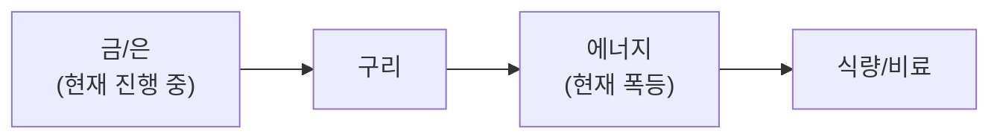

**3월 24일(화), 트럼프 이란 발전소 공격 5일 연기 + S&P 6,581(+1.15%) 급등 + 유가 폭락.** 트럼프, 이란과 **"매우 좋고 생산적인 대화"**를 했다며 이란 발전소·에너지 인프라 공격을 **5일간 연기** 지시. S&P **+1.15%**, 소비재 **+3.04%**, 산업재 **+2.69%**, 기술 **+2.46%** 급등. WTI **~$86(-11% 폭락)**, Brent **~$101(-$10)**. 그러나 **이란은 대화 사실 전면 부인**, 이스라엘은 테헤란 공습 지속. 터키·이집트·파키스탄·오만 등 **다자 중재 진행 중**(Witkoff+Araghchi 회동). **디에스컬레이션 기대감 vs 이란·이스라엘 현실 괴리**.

**KOSPI 5,601(-3.12%) + 원화 1,504.** 전일 5,517(-4.57%) 패닉에서 **소폭 반등**. 원화 1,509→**1,504** 소폭 안정. BOK 100조 안정화 프로그램 가동 중. EWY 1W **-0.46%**(전주 -5.50%에서 개선), 3M **+46.5%**. WGBI **4월 편입** 임박.

**금 $4,407 하락 지속 + 비트코인 $70,705 반등.** 금 **$4,407(-3.6%)** — 에너지 인플레→금리인하 후퇴→금 기회비용 상승 메커니즘 지속. JPM **$6,300**, GS **$6,000** 타겟 유지 — **"조정 내 매수 기회"**. 비트코인 **$70,705(+4.2%)** 반등 — 디에스컬레이션 기대감으로 위험자산 선호 회복.

**Fund Flow 개선 조짐.** 전주 전면 적색에서 **브라질 +0.38%(1W)**, 한국 -0.46%(1W, 개선). 중국 -4.09%(1W, 최악). SPY -2.03%(1W). VGK(EU) -2.96%(1W). DXY **99.27**. TLT **86.39(+0.65%)**. **테슬라 TeraFab** $25B 반도체 팹 3/21 런칭 — 2nm, AI5·D3칩, Jensen Huang: **"virtually impossible"**.

## 6대 투자 섹터 구조

| 섹터 | 하위 섹터 | 상세 분석 |
|------|----------|----------|
| **1. 반도체/AI** | HBM, DRAM/NAND, 파운드리, 소부장, AI SW/클라우드 | [반도체 섹터](/knowledge/invest/2026/01/21/semiconductor-sector-outlook-2026.html) |
| **2. 에너지** | 원전/SMR, 재생에너지, ESS, 수소 | [에너지 섹터](/knowledge/invest/2026/03/07/energy-sector-outlook-2026.html) |
| **3. 방산/우주** | 방산, 드론/UAM, 우주/위성 | [방산/우주 섹터](/knowledge/invest/2026/03/07/defense-space-sector-outlook-2026.html) |
| **4. 모빌리티/로봇** | EV/자율주행, 로봇, 조선 | [모빌리티/로봇 섹터](/knowledge/invest/2026/01/21/automotive-robotics-sector-outlook-2026.html) |
| **5. 바이오/헬스케어** | 신약/바이오텍, GLP-1/비만치료, 의료AI | [바이오/헬스케어 섹터](#바이오헬스케어-및-생명공학) |
| **6. 자산/거시경제** | 금/은, 암호화폐, 원자재/희토류, 거시경제/정책 | [거시경제/정책 섹터](/knowledge/invest/2026/01/21/macroeconomic-policy-sector-outlook-2026.html) |

### 하위 섹터 상세 링크

**반도체/AI**
- [HBM 투자 전망](/knowledge/invest/2026/01/21/hbm-sector-outlook-2026.html)
- [DRAM/NAND 투자 전망](/knowledge/invest/2026/01/21/dram-nand-sector-outlook-2026.html)
- [파운드리 투자 전망](/knowledge/invest/2026/01/21/foundry-sector-outlook-2026.html)
- [소부장 투자 전망](/knowledge/invest/2026/01/21/semiconductor-materials-equipment-outlook-2026.html)
- [AI 소프트웨어/클라우드](/knowledge/invest/2026/03/07/ai-software-cloud-outlook-2026.html)

**에너지**
- [원전 투자 전망](/knowledge/invest/2026/01/21/nuclear-power-sector-outlook-2026.html)

**방산/우주**
- [방산 투자 전망](/knowledge/invest/2026/01/21/defense-sector-outlook-2026.html)

**모빌리티/로봇**
- [EV/자율주행 투자 전망](/knowledge/invest/2026/01/21/ev-autonomous-driving-outlook-2026.html)
- [로봇 투자 전망](/knowledge/invest/2026/01/21/robotics-sector-outlook-2026.html)
- [조선 투자 전망](/knowledge/invest/2026/01/21/shipbuilding-sector-outlook-2026.html)

**자산/거시경제**
- [원자재/희토류](/knowledge/invest/2026/03/07/commodities-rare-earth-outlook-2026.html)

---

## 미래 워치리스트

| 테마 | 현황 | 주시 포인트 |
|------|------|-----------|
| **양자컴퓨팅** | Google Willow, IBM Heron 등 진전. 상용화 초기 | 오류 정정(QEC) 돌파, 금융/제약 응용 |
| **합성생물학** | AI+유전체 편집 융합 가속 | 바이오 제조, 식량/에너지 응용 |
| **BCI (뇌-컴퓨터 인터페이스)** | Neuralink 임상시험, 경쟁사 등장 | FDA 승인, 의료 응용 확대 |
| **핵융합** | Commonwealth Fusion, TAE 등 민간 투자 확대 | 상용 발전 시점(2030년대 중반 전망) |

---

## 목차

1. [거시적 시장 환경](#거시적-시장-환경)
2. [AI 및 클라우드 컴퓨팅](#ai-및-클라우드-컴퓨팅)
3. [AI 네트워크 인프라](#ai-네트워크-인프라)
4. [반도체 및 첨단 제조](#반도체-및-첨단-제조)
5. [로보틱스 및 자율주행](#로보틱스-및-자율주행)
6. [에너지 전환 및 친환경](#에너지-전환-및-친환경)
7. [바이오헬스케어 및 생명공학](#바이오헬스케어-및-생명공학)
8. [우주산업 및 뉴스페이스](#우주산업-및-뉴스페이스)
9. [방위산업 및 국방기술](#방위산업-및-국방기술)
10. [핀테크, 암호화폐 및 STO](#핀테크-암호화폐-및-sto)
11. [사이버보안 및 데이터 인프라](#사이버보안-및-데이터-인프라)
12. [지정학적 관점: 한국은 1980년대 일본](#지정학적-관점-한국은-1980년대-일본)
13. [초거대 기업들의 전략과 투자 방향](#초거대-기업들의-전략과-투자-방향)
14. [한국 시장 구조 변화](#한국-시장-구조-변화)
15. [섹터별 투자 전략: 3월 실전 가이드](#섹터별-투자-전략-3월-실전-가이드)

---

## 거시적 시장 환경

### 글로벌 증시 현황 (3/24 기준)

| 지수 | 수준 | 변동 | 비고 |
|------|------|----------|------|
| **S&P 500** | **6,581** | **★★ +1.15%** | **SPY $655.38. 트럼프 5일 공격 연기 발표→급등. 소비재+3%, 기술+2.5%** |
| **NASDAQ** | **21,648** | **보합** | **NVDA $175.64(+1.7%). SOXX +1.23%. 기술주 반등** |
| **KOSPI** | **5,601** | **-3.12%** | **전일 5,517 패닉에서 반등. EWY 1W -0.46%, 3M +46.5%** |
| **상해종합** | **3,813** | **-3.63%** | 하락 지속. 글로벌 매도세 여파 |
| **항셍** | **24,382** | **-3.54%** | 하락. 지정학 리스크 + 중국 경기 우려 |
| **원/달러** | **~1,504원** | **★★ 소폭 안정** | **1,509→1,504. BOK 100조 안정화 가동. 17년 만의 최저 수준 지속** |
| **Brent** | **~$101** | **★★★ -$10 폭락** | **트럼프 5일 공격 연기→유가 급락. 호르무즈 재개방 기대** |
| **WTI** | **~$86** | **★★★ -11% 폭락** | **Brent-WTI 스프레드 ~$15. 해상 공급 교란 프리미엄** |
| **금(Gold)** | **$4,407** | **-3.58%** | **하락 지속. JPM $6,300, GS $6,000 타겟 유지** |
| **은(Silver)** | 조정 중 | **$100 전망 유지** | 6년 연속 공급적자 |
| **비트코인** | **$70,706** | **★ +4.22%** | **디에스컬레이션 기대→위험자산 반등** |
| **VIX** | **26.78** | **+11.3%** | **24.06→26.78. 이란 부인+이스라엘 공습 지속 불확실성** |
| **TLT** | **86.39** | **+0.65%** | **10Y 4.39%(+14bp), 2Y 3.88%, 스프레드 0.51%** |
| **SOXX** | **336.59** | **+1.23%** | **반도체 반등. NVDA +1.7%. 기술 섹터 선도** |
| **하이일드 스프레드** | **3.24%** | **-0.03%** | **소폭 축소. 리스크 선호 개선** |
| **5Y Breakeven** | **2.53%** | **-0.10%** | **인플레 기대 하락. 유가 급락 반영** |
| **실업률** | **4.4%** | **+0.1%p** | FOMC 동결. 1회 인하 전망 |
| **DXY** | **99.27** | **1W -0.31%** | 달러 소폭 약세 |

### 이번 주 핵심 변화 (3/24 업데이트)

| 항목 | 변화 | 투자 시사점 |
|------|------|-----------|
| **★★★ 트럼프 5일 공격 연기** | **이란과 "생산적 대화" 주장. 발전소·에너지 인프라 공격 5일 연기 지시** | **디에스컬레이션 기대 → S&P 급등, 유가 폭락** |
| **★★★ 이란 대화 전면 부인** | **이란 매체(MEHR, 미잔, 타스님): 트럼프와의 대화 사실 부인. "시간 벌기"로 해석** | **실질 협상 불확실. 이란 강경파 입장 불변** |
| **★★★ 유가 폭락 WTI $86** | **WTI -11%($98.50→$86). Brent $108→$101(-$10). 전쟁 시작 후 최대 하락** | **휴전 기대 + 에너지 비용 완화** |
| **★★★ S&P 6,581(+1.15%)** | **트럼프 발표 직후 급등. 소비재+3%, 기술+2.5%, 산업재+2.7%** | **시장은 디에스컬레이션 선반영 중** |
| **★★ 이스라엘 독자 행동 지속** | **트럼프 휴전 발표 직후에도 테헤란 공습 계속. "전쟁 끝 안 보인다"** | **이스라엘이 핵심 변수. 트럼프 설득 여부** |
| **★★ 다자 중재 본격화** | **터키·이집트·파키스탄·오만 중재. Witkoff+Araghchi 회동** | **외교 채널 활성화. 5일 내 결과 주시** |
| **★★ 금 $4,407(-3.6%)** | **하락 지속. $5,000→$4,407. JPM $6,300, GS $6,000 유지** | **"조정 내 매수 기회" — 기관 타겟 불변** |
| **★★ 테슬라 TeraFab $25B** | **3/21 런칭. 2nm 자체 팹. AI5·D3칩. Jensen Huang "virtually impossible"** | **장기 NVDA/TSMC 경쟁 변수. 산업 구조 변화** |
| **★ BTC $70,706(+4.2%)** | **디에스컬레이션 기대→위험자산 반등** | **리스크온 회복 신호** |
| **★ KOSPI 5,601 반등** | **5,517→5,601. EWY 1W -0.46%(개선). 원화 1,504** | **패닉 진정. 트럼프 협상 결과 대기** |

### 핵심 매크로 변수 5가지

#### 1. 트럼프 5일 공격 연기 + 이란 부인 + 다자 중재 → 유가 폭락 but 불확실성 지속

| 항목 | 내용 | 투자 시사점 |
|------|------|-----------|
| **★★★ 트럼프 5일 공격 연기** | **이란 발전소·에너지 인프라 공격 5일 연기. "생산적 대화" 주장** | **디에스컬레이션 첫 신호. WTI $86 폭락** |
| **★★★ 이란 대화 전면 부인** | **이란 매체·대변인: 24일간 미국과 대화 없었다. "시간 벌기 시도"로 해석** | **실질 협상 여부 불투명. 강경파 입장 불변** |
| **★★★ 이스라엘 독자 행동** | **트럼프 휴전 직후에도 테헤란 공습 지속. "전쟁 끝 안 보인다"** | **이스라엘 설득이 핵심 변수** |
| **★★ 다자 중재 본격화** | **터키 Fidan + 이란 Araghchi + 미국 Witkoff. 사우디·카타르·오만·이집트·파키스탄 참여** | **외교 채널 활성화. 5일 내 결과 주시** |
| **★★ 유가 폭락** | **WTI ~$86(-11%), Brent ~$101(-$10). 전쟁 후 최대 하락** | **$90-95 유동성 void. 추가 급락 가능** |
| **★★ 호르무즈 97% 감소 유지** | **봉쇄 미해제. 전쟁 전 100척+/일 → 21척/3주간** | **실질 봉쇄 지속. 유가 하방 제한** |
| **★★ 걸프 인프라 누적 피해** | **이라크 FM(900K) + 쿠웨이트 730K + 카타르 LNG 17% = ~3M bpd** | **공급 차질 구조적** |
| **★ 사상자 2,000명+** | **이란 1,200명+, 레바논 1,000명+, 이스라엘 15명** | **인도적 압박 → 휴전 협상 동력** |

**핵심 판단:** 트럼프 **5일 공격 연기**로 **시나리오 B(협상 압박 카드)가 현실화** — 48시간 최후통첩이 실제 폭격이 아닌 **외교적 압박**이었음이 확인됨. WTI **$86(-11%)**, Brent **$101(-$10)** 폭락. 그러나 **이란은 대화를 전면 부인**하고, **이스라엘은 독자 공습을 지속**하여 실질적 디에스컬레이션은 미달성. **다자 중재(터키·이집트·파키스탄 등)**가 본격화된 점은 긍정적이나, 5일 유예 후 협상 실패 시 **재에스컬레이션 리스크** 잔존. **호르무즈 봉쇄는 여전히 97% 감소** 상태. 유가 급락으로 인플레 압력 완화 기대 → **금리인상 우려 다소 후퇴**. **에너지 비중 14%로 축소(15%→), 현금 19%로 축소(21%→), 반도체 21%로 확대(20%→)**.

#### 2. 사모신용 $265B 멜트다운 — El-Erian "전염 현상" + $2.1T 시장 2008년 이후 최대 위기

| 항목 | 내용 | 투자 시사점 |
|------|------|-----------|
| **★ Fortune $265B 멜트다운** | **월가 최대 투자 열풍이 패닉으로 전환. $2.1T 시장 2008년 이후 최대 위기** | 시스템 리스크 진행 중 |
| **★ El-Erian 경고** | **"전형적인 전염 현상" — 원하는 걸 못 팔면 팔 수 있는 걸 판다** | 다른 자산 클래스로 전이 우려 |
| **BlackRock** | **$26B 펀드 5% 환매 제한. $25M 대출 전액 손실** | 세계 1위 운용사 위기 |
| **Blackstone** | **BCRED $6.5B(7.9%) 환매 요청. 임직원 $400M 자체 투입** | 전례 없는 자구책 |
| **★ AI 담보 파괴 "SaaS-pocalypse"** | **에이전틱 AI→SaaS 구독 매출 침식. 사모 대출 포트폴리오 40%가 소프트웨어 기업** | 구조적 원인. AI 발전할수록 악화 |
| **사모신용 부도율** | **Fitch: 사모신용 부도율 사상 최고 9.2%** | 악화 가속 |
| **하이일드 스프레드** | **3.28%(+3.47%) — 신용 스프레드 확대 지속** | 전이 신호 |

**판단:** Fortune이 **"$265B 멜트다운"**으로 보도, El-Erian이 **"전형적인 전염 현상"** 경고. Fitch 부도율 **9.2% 사상 최고**. 핵심 원인은 AI(에이전틱 AI)가 SaaS 기업 담보 가치를 구조적으로 파괴하는 **"SaaS-pocalypse"** — 사모 대출 포트폴리오의 **40%가 소프트웨어 기업**. Blackstone BCRED $6.5B 환매에 임직원 $400M 투입이라는 전례 없는 자구책. **하이일드 스프레드 3.28%로 확대 지속**. **현금·금 비중 유지 + 금융주 경계** 필수.

#### 3. KOSPI 5,601(-3.12%) 반등 + 원화 1,504 소폭 안정 — 패닉 진정 조짐

| 항목 | 내용 | 투자 시사점 |
|------|------|-----------|
| **★★ KOSPI 3/24** | **5,601 (-3.12%)** | **전일 5,517 패닉에서 반등. 유가 급락 수혜** |
| **★★ 원화 1,504원** | **1,509→1,504 소폭 안정. BOK 100조 안정화 가동 중** | **환율 위기 소폭 완화** |
| **★★ EWY 1W -0.46%** | **전주 -5.50%→-0.46% 대폭 개선** | **자금 유출 진정** |
| **★ EWY 3M +46.5%** | **3개월 글로벌 최강 지속** | **구조적 상승 기반 건재** |
| **★ 유가 급락 수혜** | **WTI $86(-11%). 에너지 수입 비용 즉시 완화** | **한국 에너지 자급률 19% → 유가 하락이 가장 큰 호재** |
| **★ 개인 120조 대기** | **추가 하락 시 받쳐줄 여력 잔존** | **하방 지지** |
| **WGBI 4월 편입** | **8회 분할 편입 시작. $56B+ 외국인 자금 유입** | **구조적 외국인 매수 촉매** |
| **금리 딜레마 완화** | **유가 하락→인플레 완화→BOK 동결 여력 확대** | **정책 선택지 소폭 개선** |

**판단:** KOSPI **5,601(-3.12%)**로 전일 **5,517 패닉(-4.57%)**에서 반등. 트럼프 **5일 공격 연기** + **유가 폭락(WTI $86)**이 한국에 가장 긍정적 — 에너지 자급률 19%인 한국에 유가 하락은 **직접적인 경기 부양 효과**. 원화 **1,504원**으로 1,509에서 소폭 안정. EWY 1W **-0.46%**(전주 -5.50%에서 대폭 개선). 3M **+46.5% 글로벌 최강** 지속. BOK **100조 안정화** 가동 + WGBI **4월 편입** 임박이 긍정적. 그러나 **이란 부인 + 이스라엘 독자 공습**으로 5일 후 재에스컬레이션 리스크 잔존. **한국 비중 유지, 유가 하락 지속 시 비중 확대 검토**.

#### 4. 삼성 파운드리 NVIDIA + HBM4 30%+ + 반도체 매크로 하락

| 항목 | 내용 | 투자 시사점 |
|------|------|-----------|
| **★★ 삼성 파운드리 NVIDIA** | **젠슨 황 긍정 발언. Q3 본격 출하. 시장 폭발적 성장이 핵심 원인** | **삼성 파운드리 전환점** |
| **★★ 삼성 HBM4 30%+** | **NVIDIA HBM4의 30%+ 공급 확보. 용량 +47%(250K 웨이퍼/월)** | **삼성 메모리 이익 300%+ 전망(MS)** |
| **★★ NVDA $172.70(-3.28%)** | **FOMC+유가 충격. 매크로 하락이나 펀더멘탈 사상 최강** | **매크로 하락 = 매수 기회** |
| **★★ SMCI $20.53(-33%)** | **슈퍼마이크로 폭락. 서버 섹터 리스크** | **개별 종목 리스크 주의** |
| **★★ INTC $43.87(-5%)** | **인텔 급락. 파운드리 사업 불확실성** | **경쟁 구도 변화** |
| **★ SOXX $332.51(-2.26%)** | **반도체 ETF 하락. FOMC+유가 매크로 악재** | **단기 조정, 중기 강세** |
| **★ HBM4E 공개** | **삼성 GTC에서 HBM4E 공개. NVIDIA 파트너십 강조** | **차세대 HBM 기술 선점** |
| **TeraFab $25B 런칭** | **3/21 런칭. 2nm, AI5·D3칩. Jensen Huang "virtually impossible"** | **장기 NVDA/TSMC 경쟁 변수. 산업 구조 변화** |

**핵심 판단:** 삼성전자 **파운드리 NVIDIA 수주**(Q3 출하) + **HBM4 30%+ 공급** 확보로 반도체 경쟁력 전환점. Morgan Stanley **이익 300%+ 전망**. 유가 급락(WTI $86)으로 **매크로 역풍 상당 부분 해소** — SOXX **336.59(+1.23%)**, NVDA **$175.64(+1.7%)** 반등. 테슬라 **TeraFab $25B** 런칭(2nm, 월 160K 웨이퍼)은 장기적으로 NVDA/TSMC에 경쟁 변수이나, Jensen Huang **"virtually impossible"** 발언처럼 단기 실현 가능성은 낮음. **펀더멘탈 사상 최강 + 매크로 개선** 조합. **반도체 비중 21%로 확대(20%→), 유가 하락이 지속되면 추가 확대 검토**.

#### 5. 금 $4,407(-3.6%) 하락 지속 + 유가 급락→인플레 완화 기대

| 항목 | 현황 | 변화 |
|------|------|------|
| **★★ 금 $4,407 하락 지속** | **$4,445→$4,407(-3.6%). $5,000에서 -12% 조정** | **JPM $6,300, GS $6,000 유지. "조정 내 매수"** |
| **★★ 유가 급락→인플레 완화** | **WTI $86(-11%). 에너지 인플레 압력 즉시 완화** | **금리인상 우려 후퇴. 금 하방 제한** |
| **★★ FOMC 1회 인하 전망** | **CME: 75% 동결, 60% 미만 12월 인하. Dot plot 1회** | **금리인하 기대 극히 제한적** |
| **★★ PCE 2.7% 상향** | **12월 2.5%→3월 2.7%. 핵심 PCE도 2.7%** | **인플레 상향 고착. 유가 하락이 완화 요인** |
| **★ 10Y 금리 4.39%** | **+14bp. 2Y 3.88%. 스프레드 0.51%** | **금리 상승 지속이나 유가 하락이 상쇄 가능** |
| **★ 5Y Breakeven 2.53%** | **2.63%→2.53%(-10bp)** | **인플레 기대 하락. 유가 급락 반영** |
| **★ 트럼프 vs 파월** | **금리인하 요구 vs 물가 안정. 파월 5/15 은퇴** | **후임 인선이 정책 방향 결정** |
| **VIX 26.78** | **+11.3%(24.06→26.78)** | **이란 부인+이스라엘 공습→불확실성** |
| **HY 스프레드 3.24%** | **-0.03% 소폭 축소** | **리스크 선호 개선 조짐** |
| **실업률 4.4%** | **NFP -92K. 신규실업 205K(-8K)** | **고용 약화 지속** |

**판단:** 금 **$4,407(-3.6%)**로 하락 지속이나, **유가 폭락(WTI $86)**이 게임 체인저. 유가 $100+→에너지 인플레→금리인상 공포 메커니즘에서, **유가 $86 급락으로 인플레 압력이 즉시 완화** → 5Y Breakeven **2.63%→2.53%(-10bp)** 하락. 이는 **금리인상 우려를 상당 부분 해소**. 그러나 PCE **2.7%** 고착 + FOMC **1회 인하**(dot plot)로 금 기회비용은 여전히 높음. JPM **$6,300**, GS **$6,000** 타겟 불변 — 유가 하락이 금리 경로를 바꾸면 **금 반등의 촉매**가 될 수 있음. **금 7% 유지, $4,200 이하 시 적극 매수**. 유가 하락 지속 시 금 비중 확대 검토.

### 관세 현황 -- Section 122 15% 발효 중 (7/23 만료)

| 관세 | 세율 | 상태 | 비고 |
|------|------|------|------|
| **글로벌 보편관세** | **15%** | **발효 중** (2/24~) | **150일 한시** (7/23 만료) |
| **중국 관세** | **35~50%** | USTR 유지 | **트럼프-시진핑 정상회담 3월 말 변수** |
| **반도체** | 25%+ | **Section 232 유지** | 별도 법적 근거 |
| **자동차** | **25%** | **4/3 발효 예정** | **현대/기아 직접 타격** |
| **철강/알루미늄** | 25% | **Section 232 유지** | 3/12 발효 |

---

## AI 및 클라우드 컴퓨팅

### 현재 상황 (3월 20일 — GTC 사후 + 추론 혁명 + 빅테크 AI 해고 물결)

빅테크의 2026년 AI CAPEX **~$700B**(전년 대비 60%+ 급증). GTC에서 **$1T 구매주문** 전망 발표. **빅테크 AI 해고 물결** 본격화 — Meta 20%(15K명, $135B AI 인프라용), Oracle $2.1B 구조조정, 2026 YTD **35,000명+** 해고. **에이전틱 AI 시장 $8B→$215B(2035)**. AI 에이전트가 **9,200개 포지션 직접 제거**. 블록(Block) CEO: "모든 기업이 같은 길을 걸을 것". **AI가 일자리를 파괴하면서 동시에 AI 인프라 수요를 폭증시키는 이중 구조**.

| 기업 | 2026 AI CAPEX | 핵심 이슈 |
|------|--------------|---------|
| **Amazon** | **$2,000억** | FCF 마이너스 전환 전망 |
| **Alphabet** | **$1,850억** | FCF 90% 감소 전망 |
| **Microsoft** | **$1,450억** | Azure AI 확대 |
| **Meta** | **$1,350억** | FCF 90% 감소 전망 |
| **합계** | **$6,500~7,000억** | 전년 대비 **+60% 이상** |

### 핵심 투자 포인트

| 영역 | 내용 | 전망 |
|------|------|------|
| **AI 칩셋** | 엔비디아 시총 ~$4.31조 | **GTC 진행: $1T 주문, Vera Rubin 10x, Eaton 전력 파트너십** |
| **커스텀 ASIC** | **Broadcom AI $8.4B(+74%)**, **Marvell $0→$1.5B** | 2026년 GPU 출하량 추월 전망 |
| **클라우드 인프라** | AWS, Azure, GCP | $7,000억 투자 직접 수혜 |
| **AI 응용** | CRM, 헬스케어, 금융 AI | 하드웨어 실적 파티 vs 소프트웨어 수익화 미완 |

### 3월 투자 전략

**단기**: GTC 마감. **Groq 3 LPU 3,500배 추론** + **CHBM 세계 최초**가 핵심 테이크어웨이. **$1T 매출 전망** 상향. **TeraFab 3/21 런칭** — 테슬라 $25B 자체 반도체 팹(2nm, AI5·D3칩). 빅테크 **AI 해고 물결**(Meta 20%, Oracle $2.1B) — AI 투자 가속화의 이면.

**중기**: 에이전틱 AI 시장 **$8B→$215B(2035)**. AI 에이전트가 일자리 파괴 + 인프라 수요 폭증의 **이중 구조**. H2 **IPO 러시**(Anthropic, OpenAI, SpaceX) 기대.

**리스크**: ①빅테크 AI 해고→소비 둔화→경기 침체, ②유가 $100→데이터센터 전력비 상승, ③AI 칩 수출통제.

### 주요 기업 및 ETF

**대표 기업:**
- 엔비디아 (NVDA): 시총 ~$4.31조. **GTC 마감: Groq 3 LPU 3,500배 + Vera Rubin $1T + CHBM**
- **AMD (AMD)**: MI455X + Helios — Meta 6GW + OpenAI 6GW = **12GW 계약**
- **Broadcom (AVGO)**: AI 매출 **$8.4B(+74%)**, 커스텀 ASIC 리더
- **Marvell (MRVL)**: ASIC 매출 **$0→$1.5B**

**투자 ETF:**
- BOTZ (Global X Robotics & AI ETF)
- ROBO (ROBO Global Robotics & Automation Index ETF)

---

## AI 네트워크 인프라

### 핵심 테마: 데이터센터 ROI의 열쇠

$700B 규모의 AI 데이터센터 투자에서 **네트워크 인프라는 ROI를 결정짓는 핵심 요소**입니다.

### InfiniBand vs Ethernet 경쟁

| 기술 | 대표 기업 | 특징 |
|------|----------|------|
| **InfiniBand** | 엔비디아 (Mellanox) | 현재 AI 학습 표준, 저지연 |
| **Ethernet (AI용)** | Arista Networks, Broadcom | 범용성 우수, 비용 효율적 |

### ★ CPO(Co-Packaged Optics) — 2026년 월가 TOP1 테마

**구리선의 물리적 한계**: 224G SerDes 환경에서 구리 전송 거리가 **50cm까지 축소**. 스킨 이펙트로 열과 전력 소모 급증. **CPO가 유일한 대안** — 광통신 모듈을 칩 패키지에 통합하여 전기→광 신호 변환.

| 항목 | 내용 |
|------|------|
| **시장 성장** | **2026년 양산 시작, 연간 137% 성장** |
| **NVIDIA** | Spectrum-X Photonics (Ethernet CPO) **H2 2026 출시**, Quantum-X IB 115Tb/s |
| **Marvell** | 광통신 포토닉 패브릭스, AEC, DSP, 커스텀 칩. **고점 대비 -30% 저평가** |
| **Credo** | AEC 리타이머, CPO 핵심 부품 |
| **Corning** | 광섬유 소재 공급 |

### 대역폭 에스컬레이션

```
현재: 400G
진행중: 800G
2026-2027: 1.6T (CPO 양산 시작)
2028+: 3.2T
```

각 세대 전환마다 **광트랜시버, 스위치, 광케이블** 수요가 2배씩 증가. **CPO가 1.6T 이상에서 필수 기술**.

### 핵심 투자 기업

| 기업 | 분야 | 핵심 강점 |
|------|------|----------|
| **Arista Networks** | 데이터센터 스위칭 | AI 데이터센터 네트워킹 1위 |
| **Coherent** | 광트랜시버 | 시장 점유율 1위, 800G/1.6T 리더 |
| **Lumentum** | 광학 부품 | 레이저, 광부품 핵심 공급 |
| **Broadcom** | 네트워크 칩 + ASIC | AI 네트워크 + 커스텀 ASIC, **AI $8.4B(+74%)** |

---

## 반도체 및 첨단 제조

### 핵심 이벤트: 삼성 HBM4E + NVIDIA SRAM 칩 + 매크로 하락

**삼성 반도체 전환점.** 젠슨 황 **삼성 파운드리 긍정**, **Q3 출하**. 삼성 GTC에서 **HBM4E 공개**(16Gbps/pin, **4TB/s**). HBM4 **30%+ NVIDIA 공급** 확보. 반면 NVIDIA **SRAM 기반 추론 칩** 아키텍처 공개 — 대규모 학습·범용 추론은 **HBM+DRAM 필수** 유지되나, 특화 추론에서 SRAM 비중 확대. 계층적 메모리(SRAM+HBM+DRAM) 전환으로 HBM 수요 장기 영향 주시. FOMC 매파+유가 $112로 **SOXX -2.26%** 매크로 하락.

| 항목 | 내용 | 투자 시사점 |
|------|------|-----------|
| **★★ 삼성 파운드리 NVIDIA** | **젠슨 황 긍정. Q3 본격 출하. 시장 성장이 핵심 원인** | **삼성 파운드리 전환점** |
| **★★ 삼성 HBM4 30%+** | **NVIDIA HBM4의 30%+ 공급 확보. 용량 +47%(250K/월)** | **MS: 이익 300%+ 전망** |
| **★★ HBM4E 공개** | **삼성 GTC에서 HBM4E 공개. NVIDIA 파트너십 강조** | **차세대 HBM 선점** |
| **★★ SOXX -2.26%** | **332.51. FOMC+유가 매크로 악재. INTC -5%, SMCI -33%** | **매크로 하락 = 매수 기회** |
| **★ NVDA $172.70(-3.28%)** | **매크로 하락. 펀더멘탈 $1T 전망 유지** | **기대 선반영, 매크로 역풍** |
| **★ CPO 양산 시작** | 2026년 변곡점, 연간 137% 성장 | AI 네트워크 핵심 테마 |
| **반도체 $975B** | **+25% YoY. 메모리 +30%. $1T 임박** | 기가사이클 가속 |
| **TeraFab 런칭** | **테슬라 $25B 자체 팹. 2nm, 월 160K 웨이퍼** | **NVDA/TSMC 장기 경쟁 변수** |
| **개인 120조 대기** | **한국 개인투자자 120조 대기. 20조 매수. 하방 지지** | **한국 반도체주 지지** |

### 한국 메모리의 기가사이클

**SK하이닉스 HBM 시장 점유율 62%**로 압도적 1위. **삼성은 HBM4 PRA 완료**로 양산 본격화 임박.

핵심 포인트:
- **SK하이닉스**: HBM 62% 점유, 16단 48GB HBM4 공개
- **삼성 HBM4 PRA 완료**: 세계 최초 양산 출하, 대역폭 3.3TB/s
- **DRAM Q1 +90~95%**: 역사적 기록
- **SIA $1T**: 2026년 글로벌 매출 $1조 돌파 전망

### 3월 투자 전략

**핵심 전략: GTC 촉매 대기 + DRAM 슈퍼사이클 + 오일 쇼크 디커플링**

1. **삼성전자**: HBM4 PRA 완료 + MS 2027 OP 317조 + DRAM Q1 +95%. KOSPI 폭락으로 저가 매수 기회.
2. **SK하이닉스**: HBM 62% 점유율, PER 극저. DRAM Q2 추가 상승.
3. **엔비디아**: 시총 $4.31T. **GTC 3/16~19 핵심**. Vera Rubin + Feynman + NVL144.
4. **커스텀 ASIC**: Broadcom AI $8.4B(+74%), Marvell $1.5B.
5. **소부장**: 한미반도체(영업이익률 50%, TC 본더 71.2%), HPSP(55%), 리노공업(48%).

### 주요 기업

| 카테고리 | 주요 기업 | 현황 |
|----------|----------|------|
| **AI 칩** | 엔비디아, AMD | GTC 3/16~19, SOXX +3.98% |
| **파운드리** | TSMC, 삼성전자 | TSMC N2 램프 |
| **메모리** | 삼성전자, SK하이닉스 | SK 62% HBM, DRAM Q1 +95% |
| **커스텀 ASIC** | Broadcom, Marvell | Broadcom AI $8.4B(+74%) |
| **소부장** | 한미반도체, HPSP, 리노공업 | 고수익성 지속 |
| **장비** | ASML, 램리서치 | ASML 분기 주문 EUR132억 기록 |

**ETF:**
- SMH (VanEck Semiconductor ETF)
- SOXX (iShares Semiconductor ETF) — **+3.98% (오일 쇼크 속 반등)**

---

## 로보틱스 및 자율주행

### 현재 상황: 자율주행 변곡점 + 옵티머스 여름 양산 + 사이버캡 4월

| 항목 | 내용 | 시사점 |
|------|------|--------|
| **★★ Waymo 20도시·주100만회** | **2026년 20개 도시 확장. 주 100만 라이드 목표** | 자율주행 상용화 본격화 |
| **★★ CES 자율주행 전환** | **CES 2026 모빌리티 트렌드: EV→자율주행으로 전환** | 산업 변곡점 확인 |
| **★ 옵티머스 3 여름 양산** | **2026년 여름 초기 생산 확정**(머스크 공식 발표). 2027년 여름 대량 생산 | 타임라인 구체화 |
| **★ 기가텍사스 로봇 공장** | **900만 sq ft(25만평) 전용 공장**. 기존 공장 합산 57만평 = 여의도 66% | 대규모 투자 확인 |
| **양산 목표** | 프리몬트 연간 100만 대, **기가텍사스 연간 1,000만 대** | <$20K, 소프트웨어 구독 $200/월 |
| **★ 사이버캡 4월 양산** | **4월부터 주당 수백 대 양산**. $30K 미만. 완전자율주행 전용 | 로보택시 상용화 가속 |
| **AV 시장 $39.3B** | **2026년 글로벌 AV 시장 $39.3B. 4.3만 대** | 급성장 초입 |
| **Zoox+Uber** | **Zoox, Uber 자율주행 라이드 서비스 2026년 출시** | 경쟁 가속 |
| **★ X머니 4월 출시** | **비자 제휴, 메탈 카드, 탭투페이**. FSD/로보택시/에너지 결제 통합 | 테슬라 생태계 수익화 |
| **중국 로봇 90% 점유** | 중국 기업들이 글로벌 판매량 90%+ 장악 | 경쟁 리스크 주의 |
| **자동차 관세 25%** | 4/3 발효 예정 | 현대/기아 직접 타격 |

### 한국 로봇 섹터

- 두산로보틱스: 협동 로봇 리더
- 레인보우로보틱스: 휴머노이드 로봇 개발
- 현대차/보스턴다이나믹스: 기업가치 ~55조원
- **주의**: 중국 휴머노이드 로봇 **87-90%** 점유 — 경쟁 리스크 최대

**ETF:**
- BOTZ (Global X Robotics & AI ETF)
- ROBO (ROBO Global Robotics & Automation Index ETF)

---

## 에너지 전환 및 친환경

### 트럼프 5일 공격 연기 + 유가 폭락 + 원전 르네상스

| 항목 | 내용 |
|------|------|
| **★★★ 유가 폭락** | **WTI ~$86(-11%), Brent ~$101(-$10). 트럼프 5일 연기 발표 직후 급락** |
| **★★★ 트럼프 5일 연기** | **이란 발전소·에너지 인프라 공격 5일 연기. "생산적 대화" 주장** |
| **★★ 호르무즈 97% 감소 유지** | **봉쇄 미해제. 실질 봉쇄 지속 중. 유가 하방 제한** |
| **★★ 이란 부인+이스라엘 독자행동** | **실질 디에스컬레이션 미달성. 5일 후 재에스컬레이션 가능** |
| **★★ 걸프 인프라 누적** | **이라크 FM(900K) + 쿠웨이트 730K + 카타르 LNG 17% = ~3M bpd** |
| **★ IEA 최대 경고** | **"역사상 최대 에너지 안보 위협". 걸프 복구 6개월** |
| **★ 에너지 인플레 완화** | **유가 급락→5Y Breakeven 2.53%(-10bp). 금리인상 우려 후퇴** |
| **미국 원전 $80B** | 신규 원전 펀딩, AI 데이터센터 전력 수요 |

### 에너지 시나리오 (3/24 기준)

| 시나리오 | 유가 전망 | 확률 | 영향 |
|---------|----------|------|------|
| **제재 완화 + 부분 협상** | **$80~100** | **★★★ 최고 (40%)** | **트럼프 5일 유예+다자 중재→부분 봉쇄 해제. 현재 WTI $86 수준 유지** |
| **봉쇄 지속 + 인프라 피격** | **$100~120** | **중-고 (30%)** | **이란 부인+이스라엘 독자 행동→협상 실패 시 현 봉쇄 지속** |
| **위기 확전·장기화** | **$120~200** | **중 (20%)** | **5일 후 협상 결렬→트럼프 폭격 재개→호르무즈 완전봉쇄(수개월)** |
| **외교적 해결** | **$65~80** | **저 (10%)** | **다자 중재 성공+호르무즈 개방→전쟁 전 수준 회귀** |

**시나리오 변화:** 전일 대비 **대폭 전환**. **"제재 완화+부분 협상" 18%→40%** 급상향 — 트럼프가 48시간 최후통첩을 폭격이 아닌 **외교로 전환**했고, **다자 중재(터키·이집트·파키스탄)**가 본격화. **"위기 확전" 45%→20%** 대폭 하향 — 트럼프의 협상 의지가 명확히 확인됨. 그러나 **이란이 대화 자체를 부인**하고, **이스라엘이 독자 공습을 지속**하여 **실질적 디에스컬레이션은 미달성**. 5일 유예 만료(3/28) 후 ①협상 진전→봉쇄 완화→$80대 안정 ②교착→재에스컬레이션→$120+ 중 하나로 급변 가능. **유가 급락($90-95 유동성 void)은 급반등 리스크도 내포**.

### 핵심 하위 섹터

#### 원전 (Nuclear Renaissance) -- 에너지 안보 + AI 전력 수요

AI 데이터센터 전력 수요 + 이란 전쟁 에너지 안보 + 탈탄소 정책 삼중 호재.

| 항목 | 내용 | 투자 시사점 |
|------|------|-----------|
| **우라늄** | +32% YoY | 구조적 공급 부족 |
| **i-SMR 규제심사 착수** | 한국 SMR 규제 프로세스 시작 | 상용화 가시화 |
| **미국 $80B 신규 원전** | NuScale SMR 규제 승인 | 원전 르네상스 가속 |
| **KHNP 태국·필리핀** | 원전 수출 파이프라인 확대 | K-원전 해외 수주 |

#### 배터리/청정에너지 -- 오일 쇼크 대안 수요

**ICLN +3.04%, LIT +3.57%** — 오일 쇼크가 청정에너지/배터리로의 전환 수요를 가속. 에너지 위기가 장기화될수록 재생에너지·ESS 투자 강화.

### 투자 ETF

- ICLN (iShares Global Clean Energy) — **+3.04%**
- LIT (Global X Lithium & Battery Tech) — **+3.57%**
- URA (Global X Uranium ETF)

---

## 바이오헬스케어 및 생명공학

### 스태그플레이션 방어 + GLP-1 경쟁 구도 변화

오일 쇼크 + 스태그플레이션 환경에서 **방어적 헬스케어 매력도 상승**.

### 핵심 투자 포인트

#### GLP-1 비만 치료제

| 기업 | 현황 | 전망 |
|------|------|------|
| **Eli Lilly (LLY)** | GLP-1 시장 지배, EPS $35 전망(2026) | Mounjaro/Zepbound 선도 |
| **Novo Nordisk (NVO)** | 1년간 56% 하락, 경쟁 심화 | 저평가, $70 목표가 |
| **Viking Therapeutics** | 2상 결과 13주 14.7% 체중 감량 | 신규 경쟁자 |

#### AI 신약 개발

- 엑셀런시아, 리커전: AI 기반 약물 발견
- 빅테크 진출: 구글 DeepMind, 아마존 헬스케어

### 투자 ETF

- XBI (SPDR S&P Biotech ETF)
- IBB (iShares Biotechnology ETF)
- ARKG (ARK Genomic Revolution ETF)

---

## 우주산업 및 뉴스페이스

### 현재 상황: 방산 급등과 함께 우주 관련 수혜

| 기업/영역 | 내용 | 전망 |
|----------|------|------|
| SpaceX-xAI 합병 | 역삼각합병 추진 중 | 우주+AI 시너지 |
| 한화에어로스페이스 | K-방산/우주 대표주 | 수주잔고 100조+ |
| 로켓랩 (RKLB) | 소형 위성 발사 전문 | 트럼프 국방부 관심 |

### 트럼프 국방 정책과 우주

트럼프 행정부의 **FY2027 국방비 $1.5조 제안**에서 우주가 최우선 분야.

**투자 ETF:**
- UFO (Procure Space ETF)
- ARKX (ARK Space Exploration ETF)

---

## 방위산업 및 국방기술

### 현재 상황: $1.01T 예산(+13.4%) + 억만장자 $28B 증가 + 4배 증산 + ITA +14% YTD

방산이 2026년 최대 수혜 섹터. 미국 FY2026 **$1.01T 예산(+13.4%)**. 방산 억만장자 자산 3개월 만에 **$28B 증가**. **6대 미국 방산사 무기 4배 증산 서약**. Rheinmetall **매출 40-45% 성장**. 글로벌 CAPEX **+38%**. AI·사이버·우주·미사일 방어에 투자 집중.

| 항목 | 내용 | 시사점 |
|------|------|--------|
| **★★ 방산 4배 증산** | **RTX, Lockheed, Boeing, Northrop, BAE, L3Harris 백악관에서 4배 증산 서약** | **이란전 재고 보충 + 장기 수요 폭증** |
| **★ ITA +14% YTD** | **미국 방산 ETF 압도적 성과** | 방산 = 2026년 최강 섹터 |
| **★ Rheinmetall +40-45%** | **2026년 매출 40-45% 성장 전망. 사상 최대 수주잔고** | 유럽 방산 붐 대표주 |
| **★ Leonardo 수익 2배** | **이탈리아 방산, 2030년까지 수익 2배 목표** | EU 방산 투자 수혜 |
| **방산 CAPEX +38%** | 글로벌 방산 투자 38% 증가 전망 | 장기 성장 사이클 |
| **청궁-II 실전 검증** | UAE에서 명중률 90% — 실전 실증 | K-방산 신뢰도 구조적 상향 |
| **EU ReArm 8,000억유로** | EU 정상 합의 (~1,250조원) | K-방산 유럽 수출 대폭 확대 |
| **NATO 방위비 GDP 5%** | 2035년까지 목표 상향 (기존 2%) | 글로벌 방산 장기 수요 |
| **AeroVironment** | **드론(이란전 실전 검증) + 우주 + 자율수중차. BlueHalo 인수** | 중소형 방산 유망주 |

### 조선 -- 호르무즈 봉쇄 + LNG 용선율 $200K+ + 슈퍼사이클

| 항목 | 내용 |
|------|------|
| **HD현대 LNG 4척 ₩1.49T** | LNG 용선율 $200K+ (기존 대비 2배) |
| **호르무즈 봉쇄** | 선박 통행 불가, 해군함·호위함 수요 급증 |
| **3대 조선사 수주 목표** | $464억(+30%) |
| **LNG선 전망** | 2026년 글로벌 115척 발주 전망 (+24%) |

### 주요 기업

**주요 기업:** 한화에어로스페이스 (수주잔고 100조+, 청궁-II 실전 검증), 한화오션 (캐나다 잠수함 48조), HD현대중공업 (LNG 4척 ₩1.49T), LIG넥스원 (사우디 L-SAM), HD한국조선해양 (수주 35조)

**투자 ETF:**
- ITA (iShares U.S. Aerospace & Defense ETF) — **+14% YTD**
- XAR (SPDR S&P Aerospace & Defense ETF)
- SHLD (Global X Defense Tech ETF)

---

## 핀테크, 암호화폐 및 STO

### STO 법안 국회 통과 -- 2026년 상반기 토큰증권 원년

| 항목 | 내용 |
|------|------|
| **법안 통과** | **2026.1.15 국회 통과** |
| **시행** | 2027년 1월 시행 |
| **시장 전망** | 2026년 상반기 STO 시장 원년 |
| **2030년 시장 규모** | 약 **367조원** |

### 자산 현황: 금·은·비트코인

| 자산 | 현재 | 전망 | 포지션 |
|------|------|------|--------|
| **금(Gold)** | **$4,407/oz** (-3.58%) | **하락 지속이나 유가 하락→인플레 완화가 반등 촉매. JPM $6,300, GS $6,000** | **비중 7% 유지, $4,200↓시 적극 매수** |
| **은(Silver)** | 조정 중 | $100 전망, 6년 연속 공급적자 | **유지** |
| **비트코인** | **$70,706** (+4.22%) | **디에스컬레이션→위험자산 반등** | **소규모 유지** |

**금 판단:** $4,407(-3.6%)로 **하락 지속**이나 게임 체인저 등장 — **유가 폭락(WTI $86)**으로 에너지 인플레 압력 즉시 완화. 5Y Breakeven **2.53%(-10bp)** 하락. 유가 하락 지속 시 **금리 경로 변화 → 금 반등 촉매**. JPM **$6,300**, GS **$6,000** 타겟 불변. Pepperstone: **"가격 논리 조정이지 장기 추세 전환 아님"**. 중앙은행 매수(분기 585톤) + 미국 재정적자가 구조적 지지. **비중 7% 유지**, $4,200 이하 시 적극 매수.

**비트코인 판단:** $70,706(+4.22%)로 **강하게 반등**. 트럼프 디에스컬레이션 발표 → **리스크온 전환** → 위험자산 선호 회복. 레버리지 금지, **소규모 유지**.

**ETF:**
- BITO (ProShares Bitcoin Strategy ETF)
- BLOK (Amplify Transformational Data Sharing ETF)

---

## 사이버보안 및 데이터 인프라

### 현재 상황

이란 전쟁 9일차로 **이란발 사이버 보복 공격 가능성 지속**. AI 칩 수출통제로 보안 인프라 수요도 구조적 증가. 팔란티어는 피터 틸이 일본 다카이치 총리와 회담하며 **미일 방산 AI 소프트웨어 협업** 기대감.

### 핵심 기업

| 분야 | 기업 | 강점 |
|------|------|------|
| 네트워크 보안 | 팔로알토, 포티넷 | 차세대 방화벽 |
| 클라우드 보안 | 크라우드스트라이크, 제트스케일러 | EDR, 제로 트러스트 |
| AI 보안 | 팔란티어 | 전장 AI, 데이터 분석 |

### 투자 ETF

- CIBR (First Trust NASDAQ Cybersecurity ETF)
- HACK (ETFMG Prime Cyber Security ETF)

---

## 지정학적 관점: 한국은 1980년대 일본

### 핵심 프레임: 미중 경쟁 수혜 + 이란 전쟁 방산 수혜 + 에너지 의존 취약성

미-중 기술 패권 경쟁에서 한국이 **미국의 핵심 동맹 공급국**으로서 구조적 수혜. 이란 전쟁 + 청궁-II 실전 검증으로 K-방산 신뢰도 구조적 상향. 그러나 **에너지 자급률 19%로 오일 쇼크에 가장 취약한 선진국 중 하나**.

### 한국의 글로벌 핵심 공급 분야

| 분야 | 한국 위상 | 핵심 기업 |
|------|----------|----------|
| **HBM** | 글로벌 양강, SK하이닉스 62% | SK하이닉스, 삼성전자 |
| **전력/변압기** | 핵심 공급국 | 현대일렉트릭, LS산전 |
| **조선** | 글로벌 1위, LNG $200K+ 용선율 | HD한국조선해양, 삼성중공업 |
| **K-배터리** | 글로벌 3강 | LG에너지솔루션, 삼성SDI |
| **K-방산** | 수주잔고 100조+, 청궁-II 실전 검증 | 한화에어로스페이스, LIG넥스원 |
| **로보틱스** | 로봇밀도 세계 1위 | 두산로보틱스, 현대로보틱스 |

### 미국 전략적 수혜 섹터

| 우선순위 | 섹터 | 정책 |
|---------|------|------|
| 1순위 | **에너지** | 에너지 독립(자급률 105%), S&P 500 견조 |
| 1순위 | **방산/우주** | ITA +14% YTD, CAPEX +38%, 이란 전쟁 |
| 2순위 | **반도체** | SIA $1T, SOXX +3.98%, GTC 3/16 |
| 2순위 | **AI** | $700B CAPEX |
| 3순위 | **암호화폐** | Clarity Act 법제화 추진 |

---

## 초거대 기업들의 전략과 투자 방향

### $700B AI 투자의 흐름: 공급망 수혜 지도

```
AI 칩 → 엔비디아($4.31조, GTC 3/16~19), AMD, TSMC
커스텀 ASIC → Broadcom(AI $8.4B, +74%), Marvell($0→$1.5B)
데이터센터 네트워크 → Arista, Coherent, Lumentum
서버/메모리 → SK하이닉스(HBM 62%), 삼성전자(HBM4 PRA 완료)
냉각 시스템 → LG전자(공조), SK이노베이션(액침 냉각)
전력 인프라 → 원전(i-SMR), 우라늄
```

### 테슬라의 전략적 피벗 -- 옵티머스 여름 양산 + 사이버캡 + X머니

| 전략 | 내용 | 의미 |
|------|------|------|
| **★ Optimus 3 여름 양산** | **2026년 여름 초기 생산 확정**. 기가텍사스 900만 sq ft | 자동차→노동력 기업 전환 |
| **★ 사이버캡 4월 양산** | **주당 수백 대. $30K 미만. 완전자율주행** | 로보택시 $3.25/trip |
| **★ X머니 4월 출시** | **비자 제휴, 메탈 카드, 탭투페이** | 테슬라 생태계 결제 통합 |
| **코텍스2 (500MW)** | 4월 절반 가동, 옵티머스 전용 훈련 | 피지컬AI 핵심 병목 해소 |
| **기가텍사스 확장** | 기존 32만평 + 로봇 25만평 = 57만평 (여의도 66%) | 프리몬트 100만대/연, 기가텍사스 1,000만대/연 목표 |

---

## 한국 시장 구조 변화

### KOSPI: 5,601(-3.12%) — 패닉 진정 + 유가 하락 수혜

2/26 사상최고(6,307) → 3/4 -12.64%(사상 최대 폭락) → 3/11 +8.28% 대반등 → 3/19 **5,925(+5.04%)** 급등 → 3/20 5,809(-1.96%) → 3/21 5,781(+0.31%) → 3/23 5,517(-4.57%) 패닉 → **3/24 5,601(-3.12%) 반등**. EWY 1W **-0.46%**, 3M **+46.5%**. Goldman 연말 목표 **7,000**.

| 항목 | 3/4 | 3/5 | 3/10 | 3/11 | 3/12 | 3/16 | 3/17 | 3/19 | 3/20 | 3/21 | 3/23 | 3/24 |
|------|------|------|------|------|------|------|------|------|------|------|------|------|
| **KOSPI** | -12.64% | +9.63% | -5.96% | +8.28% | -0.48% | +0.75% | +3.57% | **+5.04%** | -1.96% | +0.31% | -4.57% | **-3.12% (5,601)** |
| **핵심** | 서킷브레이커 | 반등 | 추가 하락 | 대반등 | 보합 | GTC | 대반등 | **급등** | 조정 | 보합 | 패닉 | **반등** |

### 반도체·방산 주도 대반등

| 종목 | 등락률 | 핵심 촉매 |
|------|--------|----------|
| **SK하이닉스** | **+12.2%** | HBM 62% 점유, HBM4 가속 |
| **삼성전자** | **+8.3%** | HBM4 NVIDIA 양산, DRAM Q1+95% |
| **SK스퀘어** | **+8.8%** | SK하이닉스 지분 수혜 |
| **두산에너빌리티** | **+6.6%** | i-SMR 규제심사, 원전 수요 |
| **현대차** | **+3.6%** | 유가 하락=에너지 비용 완화 |

### ★ 한국 자산시장 대전환 — 부동산·예금 → 주식

| 항목 | 내용 | 투자 시사점 |
|------|------|-----------|
| **대통령 ETF 매수 선언** | 분당 아파트 매각, ETF 매수 | 정부 차원의 주식 투자 장려 |
| **상법 개정** | 배당소득 분리과세, 자사주 의무소각 | 자본시장 친화 정책 |
| **국민성장펀드 150조** | 민간 75조 + 정부 75조 | 코스닥 15조 유입 |
| **고객예탁금 130조** | 사상 최고 | 투자 대기 자금 극대화 |
| **MSCI 선진지수** | 환율시장 개방 추진 | WGBI 4월 편입과 시너지 |

### 배당 ETF: 고변동성 시기 방어

| ETF | 특징 | 수익률 |
|-----|------|--------|
| **PLUS 고배당주 위클리 커버드콜** | 주간 콜옵션 매도 | 분배율 **20.55%** |
| **KODEX 코리아 밸류업 토탈리턴** | 밸류업 + 토탈리턴 | **101.87%** |
| KODEX 200 타겟위클리 커버드콜 | 주간 콜옵션 매도 | 연 **17%** 배당 |

---

## 섹터별 투자 전략: 3월 실전 가이드

### 핵심 전략: "트럼프 5일 공격 연기 + 유가 폭락 → 리스크온 전환 시작, 현금 축소 + 반도체 확대"

3월 24일 기준 핵심 전략:

1. **트럼프 5일 공격 연기**: 외교 전환 확인. 유가 폭락(WTI $86). **에너지 14%로 축소(15%→)**
2. **이란 부인+이스라엘 독자행동**: 실질 디에스컬레이션 미달성. **5일 후(3/28) 재에스컬레이션 가능**
3. **반도체 매크로 개선**: SOXX +1.23%, NVDA +1.7%. 유가 하락→인플레 완화. **반도체 21% 확대(20%→)**
4. **KOSPI 5,601 반등**: 패닉 진정. 유가 하락=한국 최대 호재. **한국 비중 유지, 유가 하락 지속 시 확대**
5. **금 $4,407 하락 지속**: 유가 하락→인플레 완화가 금 반등 촉매 가능. **금 7% 유지, $4,200↓시 적극 매수**
6. **현금 축소**: 디에스컬레이션 기대→리스크온. **현금 19%로 축소(21%→)**
7. **TeraFab $25B**: 테슬라 수직계열화. 장기 반도체 산업 구조 변화. **로봇/자율주행 6% 확대(5%→)**
8. **BTC $70,706(+4.2%)**: 위험자산 반등. 디에스컬레이션 수혜
9. **다음 핵심**: ★★★ 트럼프 5일 유예 만료(3/28), 트럼프-시진핑(3월 말), FSD 유럽 4/10
10. **리스크**: 5일 후 협상 결렬→재에스컬레이션, 이란 부인의 진의, 이스라엘 설득 실패

### 상품 사이클 순서 (commodity cycle)



현재 금/은 → 에너지가 **동시에 급등** 중. 식량/비료가 다음 사이클 후보.

### 자산 상관관계 (3/24 기준)

| 자산 | 방향 | 최신 수준 | 근거 |
|------|------|---------|------|
| **★★★ 유가(Oil)** | **★★★ 폭락** | **Brent ~$101(-$10), WTI ~$86(-11%)** | **트럼프 5일 공격 연기→디에스컬레이션 기대** |
| **★★ S&P 500** | **★★ 급등** | **6,581 (+1.15%)** | **트럼프 발표→급등. 소비재+3%, 기술+2.5%** |
| **★★ 금(Gold)** | **★★ 하락 지속** | **$4,407 (-3.6%)** | **에너지 인플레 완화이나 금리 고착. JPM $6,300 유지** |
| **★★ KOSPI** | **반등** | **5,601 (-3.12%)** | **5,517 패닉에서 반등. EWY 1W -0.46%(개선)** |
| **★★ NASDAQ** | **보합** | **21,648** | **NVDA $175.64(+1.7%). 기술주 반등** |
| **★★ 반도체** | **반등** | SOXX $336.59(+1.23%) | **매크로 개선+펀더멘탈 최강** |
| **★ 비트코인** | **★ 반등** | **$70,706 (+4.22%)** | **디에스컬레이션→위험자산 선호 회복** |
| **★ 방산주** | **최강 유지** | ITA +14% YTD | 이란 전쟁 장기화→구조적 수요 |
| **★ 글로벌 펀드플로** | **개선 조짐** | **브라질 +0.38%, 한국 -0.46%** | **중국 -4.09% 최악. 전주 대비 개선** |
| **은(Silver)** | **조정** | $100 전망 유지 | 6년 공급적자 |
| **TLT** | **반등** | **86.39 (+0.65%)** | **10Y 4.39%. 유가 하락→인플레 완화 기대** |
| **VIX** | **상승** | **26.78 (+11.3%)** | **이란 부인+이스라엘 독자행동→불확실성 지속** |

### 포트폴리오 구성 제안

**트럼프 5일 공격 연기 + 유가 폭락 + 디에스컬레이션 기대 → 현금 축소, 반도체 확대**

#### 전일 대비 변동 (3/24 vs 3/23)

| 섹터 | 전일 비중 | 금일 비중 | 변동 | 변동 사유 |
|------|----------|----------|------|----------|
| AI/반도체 | 20% | **21%** | **▲1%** | **유가 하락→매크로 개선. SOXX +1.23%, NVDA +1.7%. 펀더멘탈+매크로 동시 호전** |
| 방산/조선 | 24% | **23%** | **▼1%** | **디에스컬레이션 기대→방산 프리미엄 소폭 축소. 단 이란전쟁 미종결로 높은 비중 유지** |
| 에너지/원전 | 15% | **14%** | **▼1%** | **유가 급락(WTI $86). 에너지 프리미엄 축소. 원전은 구조적 수요 유지** |
| 금 | 7% | 7% | - | $4,407. JPM $6,300 유지. 유가 하락→인플레 완화가 금 반등 촉매 가능 |
| 은 | 2% | 2% | - | $100 전망 유지. 6년 공급적자 |
| 로봇/자율주행 | 5% | **6%** | **▲1%** | **TeraFab $25B + 사이버캡 4월 양산. 테슬라 수직계열화 기대감** |
| AI 네트워크/CPO | 4% | 4% | - | CPO 변곡점 유지 |
| STO/핀테크 | 0% | 0% | - | 사모신용 위기→제외 |
| 현금 | 21% | **19%** | **▼2%** | **디에스컬레이션 기대→리스크온 전환. 단 5일 후 재에스컬레이션 가능→완전 축소는 시기상조** |
| 바이오/헬스 | 2% | 2% | - | 방어적 포지션 유지 |

#### 추천 종목 (실제 종목/ETF)

| 섹터 | 추천 종목 (티커) | 추천 사유 | 현재가/밸류에이션 |
|------|----------------|----------|-----------------|
| AI/반도체 | SK하이닉스, 삼성전자, NVDA, SOXX(ETF), Micron(MU) | **펀더멘탈+매크로 동시 호전. $1T 매출 전망** | NVDA $175.64, SOXX 336.59 |
| 방산/조선 | 한화에어로스페이스, LIG넥스원, HD한국조선해양, ITA(ETF) | **이란전쟁 미종결. 구조적 수요 지속** | ITA +14% YTD |
| 에너지/원전 | 두산에너빌리티, Cameco(CCJ), NuScale(SMR), XLE(ETF) | **원전 구조적 수요. 유가 변동성 지속** | XLE $59.63 |
| AI 네트워크/CPO | **Marvell(MRVL)**, Credo(CRDO), Eaton(ETN) | **CPO 변곡점. TeraFab 런칭** | MRVL 고점 -30% |
| 금 | GLD, IAU, KODEX 골드선물(H) | **$4,407. JPM $6,300 유지. 유가 하락→인플레 완화 시 반등** | $4,407 |
| 은 | SLV, PSLV, 고려아연 | **$100 전망, 6년 공급적자** | 공급적자 구조 |
| 로봇/자율주행 | Waymo(GOOGL), **테슬라(TSLA)**, 두산로보틱스, BOTZ(ETF) | **TeraFab $25B + 사이버캡 4월. 수직계열화 기대** | BOTZ $34.24 |
| 바이오 | Eli Lilly(LLY), Vertex(VRTX), Viking(VKTX) | **방어 매력. Healthcare PE 26.1** | 방어 섹터 |

**※ 종목 추천은 참고용이며, 투자 판단은 본인 책임입니다.**

#### 공격적 투자자

| 섹터 | 비중 | 근거 |
|------|------|------|
| **AI/반도체 (HBM·메모리)** | **21%** | **펀더멘탈+매크로 동시 호전. $1T 매출 전망. SOXX +1.23%** |
| **방산/조선** | **23%** | **이란전쟁 미종결. 구조적 수요. 디에스컬레이션 시 소폭 축소** |
| **에너지/원전** | **14%** | **유가 급락 but 원전 구조적 수요. 호르무즈 봉쇄 지속** |
| **금** | **7%** | **$4,407. JPM $6,300. 유가 하락→인플레 완화 시 반등 촉매** |
| **은** | **2%** | **$100 전망, 6년 공급적자** |
| 로봇/자율주행 | **6%** | **TeraFab $25B + 사이버캡 4월 양산. 수직계열화** |
| AI 네트워크/CPO | 4% | CPO 변곡점 유지 |
| 바이오/헬스 | **2%** | **방어적 매력** |
| **현금** | **19%** | **★ 디에스컬레이션 기대→축소. 5일 후 재에스컬레이션 가능→완전 축소 시기상조** |

#### 균형 투자자

| 섹터 | 비중 | 근거 |
|------|------|------|
| **AI/반도체** | **15%** | GTC 수혜. VIX 23 반영 |
| **방산/조선** | **19%** | 이란 전쟁 장기화, CAPEX +38% |
| **에너지/원전** | **12%** | WTI $96, 원전 수혜 |
| **금** | **13%** | $5,016, 사모신용→안전자산, Goldman $5,400 |
| 배당 ETF | 7% | VIX 23으로 하락, 방어 유지 |
| 바이오/헬스 | 3% | 방어 섹터 |
| 로봇/자율주행 | 3% | TeraFab D-3, 로보택시 확장 |
| AI 네트워크/CPO | 3% | CPO 변곡점, Eaton 파트너십 |
| **은** | **2%** | $100 전망, 6년 공급적자 |
| **현금** | **23%** | **VIX 23. FOMC 대기. 사모신용 리스크** |

#### 보수적 투자자

| 섹터 | 비중 | 근거 |
|------|------|------|
| **금** | **18%** | $5,023, 사모신용 $3.5T→안전자산 최우선 |
| 배당 ETF | 12% | PLUS 위클리 20.55%, VIX 27 방어 |
| **방산** | **12%** | 이란 전쟁 장기화, 구조적 성장 |
| AI/반도체 | 5% | GTC 촉매, VIX 27 반영 축소 |
| **에너지/원전** | **8%** | WTI $99, 원전 수혜 |
| **은** | **3%** | 안전자산 분산 |
| 사이버보안 | 2% | 이란 사이버 공격 리스크 |
| **현금/채권** | **40%** | **VIX 27 + 사모신용 $3.5T → 현금 최우선** |

### 한국 시장 특화 전략

| 섹터 | 추천 포지션 | 근거 |
|------|-----------|------|
| **삼성전자** | **분할 매수** | **HBM4 양산 +50%. GTC $1T 확인. +1.4%** |
| **SK하이닉스** | **분할 매수** | **HBM4 70% 점유. +3.5%. GTC 수혜** |
| **한화에어로스페이스** | **적극 매수** | **4배 증산 서약. 구조적 최강** |
| **LIG넥스원** | **적극 매수** | **방산 구조적 성장** |
| **한화오션/HD현대중공업** | **적극 매수** | **호르무즈→해군 수요 + 원잠 + 유가 $99** |
| HD한국조선해양 | **매수** | 수주 35조, Strong Buy 컨센서스 |
| 두산에너빌리티 | **매수** | i-SMR, NuScale+TVA 6GW |
| 전력 인프라 | **매수** | 효성중공업, HD현대일렉트릭, LS일렉트릭 |
| **금 ETF** | **보유** | **$4,407. JPM $6,300 유지. 유가 하락→인플레 완화 시 반등** |
| 월배당 ETF | **적극 매수** | PLUS 위클리 20.55%, 변동성 방어 |
| **테슬라(TSLA)** | **매수** | **사이버캡 4월, 옵티머스 여름** |
| **⚠️ 금융주 주의** | **경계** | **환율 1,504원, 사모신용 9.2%, 금리 딜레마(유가 하락으로 소폭 완화)** |

### 핵심 모니터링 일정

| 일정 | 이벤트 | 투자 시사점 |
|------|--------|------------|
| **★★★ 3/28** | **트럼프 5일 공격 연기 만료** | **협상 진전 vs 재에스컬레이션 분기점. 유가 방향 결정** |
| **3월 말** | **★ 트럼프-시진핑 정상회담** | 미중 관세 협상 |
| **4/3** | **자동차 25% 관세 발효** | 현대/기아 직접 타격 |
| **4/10** | **★ 테슬라 FSD 유럽 승인 예정** | RDW 최종 검토. 재연기 가능성 |
| **4월** | **★ WGBI 편입 시작** (8회 분할) | $56B+ 외국인 자금 유입 |
| **4~5월** | **★ FOMC 5월 회의** | 유가 하락 지속 시 인상 가능성 후퇴 |
| **5-6월** | **캐나다 잠수함 사업자 발표** | 48조원 결과 |
| **H2 2026** | **SpaceX IPO** | $1.5T 밸류에이션. 우주산업 변곡점 |
| **5/15** | **Powell 연준 의장 은퇴** | 후임 인선이 금리 정책 방향 |
| **6월** | **거래시간 연장** + 지방선거 | 유동성 확대 |
| **7/23** | **Section 122 관세 150일 만료** | 의회 관세 입법 여부 |
| **H2 2026** | **엔비디아 Vera Rubin GPU 출시** | 삼성 HBM4 탑재 |
| **9/30** | **미국 $7,500 EV 세액공제 만료** | EV 수요 조정 |
| **11월** | **미국 중간선거** | Clarity Act 통과 확률 50-60% |
| **2027/1** | **STO 법안 시행** | 토큰증권 본격화 |

---

## 2026년 투자 섹터 종합 정리

### 핵심 메시지

**2026년 3월 23일(월), 트럼프 48시간 최후통첩 + 이란 디모나 핵시설 공격 + KOSPI -4.57% 패닉 + 글로벌 전면 매도.**

1. **트럼프 48시간 최후통첩** — 호르무즈 개방 안하면 이란 발전소 "말살". 3/24 시한 도래. 유가 극단 분기점
2. **이란 디모나 공격** — 이스라엘 핵연구센터 최초 피격. 100명+ 부상. 에스컬레이션 최고 수준
3. **이란 호르무즈 완전봉쇄 경고** — "발전소 피격 시 완전 봉쇄, 재건까지 미개방". 수개월 봉쇄 시 $150~200
4. **KOSPI 5,517(-4.57%)** — 트럼프 최후통첩 패닉. 원화 1,509(2009년 이후 최저). BOK 100조 안정화
5. **금 $4,445(-11% 주간)** — 1983년 이후 최대 주간 하락. JPM $6,300, DB $6,000 유지. "전술적 조정"
6. **글로벌 전면 매도** — 모든 국가 1W 마이너스. US -2.79%, EU -4.76%, 한국 -5.50%
7. **AI 전문직 대체 가속** — Claude 엑셀 DCF 10분 완성. APEX Index AI 52.5%(인간 65%)

**투자 환경:** 반도체 20%, 방산 24%, 에너지 15%, 금 **7%**(▼1%), CPO 4%, 로봇 5%, 현금 **21%**(▲1%). 트럼프 48시간 최후통첩(3/24 시한)이 **유가·시장의 최대 분기점**. 폭격 시 호르무즈 완전봉쇄→$150+, 블러프 시 $100 안정. **금 축소→현금 확대**로 극단 시나리오 대비.

### 3월 기준 섹터 우선순위

| 순위 | 섹터 | 근거 | 포지션 |
|------|------|------|--------|
| **1위** | **방산/조선** | **디모나 공격→에스컬레이션 최고. $1.01T 예산. NATO 5% GDP** | **적극 매수** |
| **2위** | **AI/반도체 (메모리·HBM)** | **$1T 매출 전망. 펀더멘탈 최강. 매크로 하락=매수 기회** | **분할 매수** |
| **3위** | **에너지/원전** | **트럼프 최후통첩→극단 시나리오. 원전 $80B** | **유지 (15%)** |
| **4위** | **금/은** | **$4,445(-11%주간). JPM $6,300, DB $6,000. "전술적 조정"** | **유지 (7%)** |
| **5위** | **AI 네트워크/CPO** | **CPO 변곡점, 137% 성장** | **유지** |
| 6위 | **배당 ETF** | 월배당 20%+, 변동성 방어 | **필수 편입** |
| 7위 | **로봇/자율주행** | 사이버캡 4월, Waymo 20도시 | 유지 |
| 8위 | **바이오/헬스** | 방어 섹터 매력 | 유지 |
| - | **암호화폐** | BTC $67,858 (-1.24%), 위험자산 기피 | **소규모 유지** |

### 핵심 투자 원칙

1. **트럼프 48시간 최후통첩** — 3/24 시한. 폭격→호르무즈 완전봉쇄→$150+ or 블러프→$100 안정. **에너지 15% 유지**
2. **디모나 핵시설 공격** — 에스컬레이션 최고. 이스라엘 보복 강화 불가피. **방산 24% 유지**
3. **KOSPI 5,517(-4.57%)** — 패닉 급락. 원화 1,509. **3/24 결과 확인 후 조정 검토**
4. **금 $4,445(-11%주간)** — 1983년 이후 최대 주간 하락. JPM $6,300. **금 7%로 축소, $4,200↓시 재매수**
5. **반도체 펀더멘탈 최강** — $1T 매출 전망. 매크로 하락=매수 기회. **반도체 20% 유지**
6. **글로벌 전면 매도** — 모든 국가 1W 마이너스. 안전자산마저 하락. **현금 21%로 확대**
7. **다음 핵심** — ★★★ 트럼프 최후통첩 결과(3/24), 트럼프-시진핑(3월 말), FSD 유럽 4/10
8. **리스크 관리** — 이란 발전소 폭격→$150+, 호르무즈 완전봉쇄(수개월), 금리인상, 환율 1,509+

**투자 결정은 본인의 리스크 허용 범위와 투자 기간을 고려하여 신중하게 내리시기 바랍니다.**
