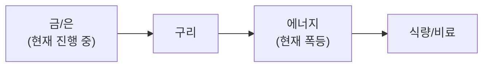

**3월 14일, VIX 27.29 공포 급등 — 사모신용 $3.5T 위기 심화 + WTI $99 + 한국 금융 리스크.** VIX가 24.23→**27.29(+12.6%)**로 급등하며 시장 공포가 확대. S&P 500 **3주 연속 하락**, 연초 대비 **-5%**. 이란 전쟁 13일차, 글로벌 원유 공급 **8M bbl/day 차단**(IEA 추산). 트럼프 "곧 끝난다" 발언에도 미 국방장관 "완전한 승리까지" 상반 메시지.

**사모신용(Private Credit) 위기 $3.5T로 심화.** Blue Owl $1.6B **영구 환매 동결**. BlackRock $26B 사모신용 펀드 **환매 5% 제한**(9.3% 요청). Blackstone BCRED $820억 **7.9% 환매** 요청, 임직원 25명이 사비 충당. **Morgan Stanley** 노세이브 PE **10.9% 환매** 요청. **핵심 원인**: AI(에이전틱 AI)가 SaaS 구독 매출 담보 가치 급락시킴 → JP모건 소프트웨어 담보 인정 **80%→50%** 하향. 2008년 서브프라임 $1.3T vs 현재 사모신용 **$3.5T(2.7배)**. 소프트웨어 대출이 식품·화학 등 다른 분류로 **위장**, 실제 노출 **$14조+** 가능성(Bloomberg).

**글로벌 시장 전면 약세.** S&P 500 **6,632(-0.61%)**, KOSPI **5,487(-1.72%)** 급락. 나스닥 -0.93%. VIX **27.29(+12.6%)** 공포 급등. 에너지만 유일한 양(+1.05%), 기술 -1.49%, 금융 -2.02%. **환율 1,490원** — 2009년 이후 최약. **금 $5,023(-1.8%)** 차익실현 지속. **비트코인 $70,860(+0.5%)** 보합.

**GTC D-2 + CPO 테마 부상.** GTC(3/16)까지 **2일**. **CPO(Co-Packaged Optics)**가 2026년 월가 TOP1 테마로 부상 — 구리선의 물리적 한계 극복, **연간 137% 성장** 시장. NVIDIA Spectrum-X Photonics H2 2026 출시 예정. Marvell **고점 대비 -30%** 조정 중 저평가 기회. 테슬라 AWE 2026에서 **옵티머스 3세대** 대규모 양산형 공개, Q2 프리몬트 생산 시작.

**HBM4 양산 가속.** 2월부터 16-Hi HBM4 양산 시작(NVIDIA Rubin용). SK하이닉스 **70%**, 삼성 mid-20%, Micron ~20%. HBM 시장 $35B(2025)→$100B(2028). SIA 글로벌 반도체 매출 **$1조** 돌파 전망.

## 6대 투자 섹터 구조

| 섹터 | 하위 섹터 | 상세 분석 |
|------|----------|----------|
| **1. 반도체/AI** | HBM, DRAM/NAND, 파운드리, 소부장, AI SW/클라우드 | [반도체 섹터](/knowledge/invest/2026/01/21/semiconductor-sector-outlook-2026.html) |
| **2. 에너지** | 원전/SMR, 재생에너지, ESS, 수소 | [에너지 섹터](/knowledge/invest/2026/03/07/energy-sector-outlook-2026.html) |
| **3. 방산/우주** | 방산, 드론/UAM, 우주/위성 | [방산/우주 섹터](/knowledge/invest/2026/03/07/defense-space-sector-outlook-2026.html) |
| **4. 모빌리티/로봇** | EV/자율주행, 로봇, 조선 | [모빌리티/로봇 섹터](/knowledge/invest/2026/01/21/automotive-robotics-sector-outlook-2026.html) |
| **5. 바이오/헬스케어** | 신약/바이오텍, GLP-1/비만치료, 의료AI | [바이오/헬스케어 섹터](#바이오헬스케어-및-생명공학) |
| **6. 자산/거시경제** | 금/은, 암호화폐, 원자재/희토류, 거시경제/정책 | [거시경제/정책 섹터](/knowledge/invest/2026/01/21/macroeconomic-policy-sector-outlook-2026.html) |

### 하위 섹터 상세 링크

**반도체/AI**
- [HBM 투자 전망](/knowledge/invest/2026/01/21/hbm-sector-outlook-2026.html)
- [DRAM/NAND 투자 전망](/knowledge/invest/2026/01/21/dram-nand-sector-outlook-2026.html)
- [파운드리 투자 전망](/knowledge/invest/2026/01/21/foundry-sector-outlook-2026.html)
- [소부장 투자 전망](/knowledge/invest/2026/01/21/semiconductor-materials-equipment-outlook-2026.html)
- [AI 소프트웨어/클라우드](/knowledge/invest/2026/03/07/ai-software-cloud-outlook-2026.html)

**에너지**
- [원전 투자 전망](/knowledge/invest/2026/01/21/nuclear-power-sector-outlook-2026.html)

**방산/우주**
- [방산 투자 전망](/knowledge/invest/2026/01/21/defense-sector-outlook-2026.html)

**모빌리티/로봇**
- [EV/자율주행 투자 전망](/knowledge/invest/2026/01/21/ev-autonomous-driving-outlook-2026.html)
- [로봇 투자 전망](/knowledge/invest/2026/01/21/robotics-sector-outlook-2026.html)
- [조선 투자 전망](/knowledge/invest/2026/01/21/shipbuilding-sector-outlook-2026.html)

**자산/거시경제**
- [원자재/희토류](/knowledge/invest/2026/03/07/commodities-rare-earth-outlook-2026.html)

---

## 미래 워치리스트

| 테마 | 현황 | 주시 포인트 |
|------|------|-----------|
| **양자컴퓨팅** | Google Willow, IBM Heron 등 진전. 상용화 초기 | 오류 정정(QEC) 돌파, 금융/제약 응용 |
| **합성생물학** | AI+유전체 편집 융합 가속 | 바이오 제조, 식량/에너지 응용 |
| **BCI (뇌-컴퓨터 인터페이스)** | Neuralink 임상시험, 경쟁사 등장 | FDA 승인, 의료 응용 확대 |
| **핵융합** | Commonwealth Fusion, TAE 등 민간 투자 확대 | 상용 발전 시점(2030년대 중반 전망) |

---

## 목차

1. [거시적 시장 환경](#거시적-시장-환경)
2. [AI 및 클라우드 컴퓨팅](#ai-및-클라우드-컴퓨팅)
3. [AI 네트워크 인프라](#ai-네트워크-인프라)
4. [반도체 및 첨단 제조](#반도체-및-첨단-제조)
5. [로보틱스 및 자율주행](#로보틱스-및-자율주행)
6. [에너지 전환 및 친환경](#에너지-전환-및-친환경)
7. [바이오헬스케어 및 생명공학](#바이오헬스케어-및-생명공학)
8. [우주산업 및 뉴스페이스](#우주산업-및-뉴스페이스)
9. [방위산업 및 국방기술](#방위산업-및-국방기술)
10. [핀테크, 암호화폐 및 STO](#핀테크-암호화폐-및-sto)
11. [사이버보안 및 데이터 인프라](#사이버보안-및-데이터-인프라)
12. [지정학적 관점: 한국은 1980년대 일본](#지정학적-관점-한국은-1980년대-일본)
13. [초거대 기업들의 전략과 투자 방향](#초거대-기업들의-전략과-투자-방향)
14. [한국 시장 구조 변화](#한국-시장-구조-변화)
15. [섹터별 투자 전략: 3월 실전 가이드](#섹터별-투자-전략-3월-실전-가이드)

---

## 거시적 시장 환경

### 글로벌 증시 현황 (3/14 기준)

| 지수 | 수준 | 변동 | 비고 |
|------|------|----------|------|
| **S&P 500** | **6,632** | **-0.61%** | **3주 연속 하락, 연초 -5%, 에너지만 양** |
| **NASDAQ** | **22,105** | **-0.93%** | **기술 -1.49%, GTC D-2 대기** |
| **KOSPI** | **5,487** | **-1.72%** | **급락, 유가·환율 악재 동조** |
| **상해종합** | **4,095** | **-0.82%** | 약세 전환 |
| **항셍** | **25,466** | **-0.98%** | 조정 지속 |
| **원/달러** | **~1,490원** | **+7원** | **2009년 이후 최약, 1,500원 임박** |
| **WTI** | **~$99** | **$100 근방 지속** | **이란 8M bbl/day 공급 차단 (IEA)** |
| **금(Gold)** | **$5,023/oz** | **-1.81%** | **차익실현 지속, Goldman $5,400 유지** |
| **은(Silver)** | 강세 유지 | **$100 전망 지속** | 6년 연속 공급적자 |
| **비트코인** | **$70,860** | **+0.52%** | **보합, $71K 재돌파 시도** |
| **VIX** | **27.29** | **+12.6%** | **★ 공포 급등, 사모신용 $3.5T 위기** |
| **TLT** | **86.54** | **-0.49%** | 10Y 4.27%(+0.06), 금리 상승 지속 |
| **SOXX** | **331.32** | **+0.34%** | **반도체 보합, GTC D-2 대기** |
| **하이일드 스프레드** | **상승** | **리스크 악화** | **사모신용 전이→신용 스프레드 확대** |
| **5Y Breakeven** | **2.61%** | **-0.02** | **인플레 기대 소폭 완화** |
| **실업률** | **4.4%** | **+0.1%p** | **Fed 딜레마: 인플레 vs 고용** |

### 이번 주 핵심 변화 (3/14 업데이트)

| 항목 | 변화 | 투자 시사점 |
|------|------|-----------|
| **★★★ VIX 27.29 공포 급등** | **VIX 24→27(+12.6%). S&P 3주 연속 하락, 연초 -5%** | **공포 확산. 현금 비중 확대, 방어적 포지셔닝 강화** |
| **★★★ 사모신용 $3.5T 위기** | **Blue Owl 영구 동결, BlackRock 5% 제한, Blackstone 7.9%, Morgan Stanley 10.9%. AI가 SaaS 담보 가치 파괴. 2008년 대비 2.7배** | **시스템 리스크 심화. 소프트웨어 대출 위장($14조+ 잠재). 현금·금 확대** |
| **★★★ 이란 전쟁 Day 13+** | **8M bbl/day 공급 차단(IEA). WTI ~$99. 트럼프 "곧 끝" vs 국방장관 "완전 승리까지". 이란 휴전 조건 제시** | **유가 고공행진 지속. 에너지 비중 유지. 휴전 조건 충돌→장기화 우려** |
| **★★ KOSPI 5,487 급락** | **-1.72%. 환율 1,490원(2009 이후 최약). 유가·환율 쌍끌이 악재** | **한국 시장 취약. 1,500원 돌파 시 추가 악화 가능** |
| **★★ GTC D-2** | **Groq LPU, Vera Rubin, Feynman, NVL144, CPO 발표 2일 후** | **반도체 최대 촉매 임박. 조정은 분할 매수 기회** |
| **★★ CPO 테마 부상** | **2026 변곡점, 연간 137% 성장. NVIDIA Spectrum-X H2 출시. Marvell 고점 대비 -30%** | **AI 네트워크 인프라 핵심. GTC에서 추가 모멘텀 기대** |
| **★★ 옵티머스 AWE 공개** | **AWE 2026 상하이: 3세대 대량 양산형 공개. Q2 프리몬트 생산. 100K/월 목표** | **로봇 양산 타임라인 구체화. <$20K** |
| **★ 금 $5,023** | **-1.81% 차익실현 지속. Goldman $5,400. 3M +17.21%** | **단기 조정이나 사모신용→안전자산 수요 구조적** |
| **★ 섹터 분화** | **에너지만 +1.05% 양. 기술 -1.49%, 금융 -2.02%** | **섹터 로테이션: 에너지·방산 강세, 기술·금융 약세** |

### 핵심 매크로 변수 5가지

#### 1. 이란 전쟁 Day 13+ — WTI $99 + 8M bbl/day 차단 + 휴전 교착

| 항목 | 내용 | 투자 시사점 |
|------|------|-----------|
| **WTI** | **$98.71 (3/12 마감). $100 근방 지속** | 호르무즈 봉쇄 지속→유가 고공행진 |
| **IEA 공급 차단** | **글로벌 원유 공급 8M bbl/day 차단 (3월 추산)** | 역대 최대 공급 충격 |
| **트럼프 발언** | **"곧 끝난다" → 그러나 국방장관 "완전 승리까지"** | 상반된 메시지, 시장 혼란 |
| **이란 휴전 조건** | **정당한 권리 인정 + 배상금 + 국제적 보장** | 조건 충돌→단기 휴전 어려움 |
| **Goldman 전망** | **Q4 Brent/WTI 전망 상향** | 장기 봉쇄 시나리오 반영 |
| **Brent 시나리오** | **1개월 봉쇄: $80, 3개월+: $160 돌파** | 블룸버그 분석 |
| **CNBC 분석** | **트럼프의 유가 하락 계획 실패 중** | 정치적 해결 불확실 |
| **연준 금리** | **3.64%**, 10Y: 4.27%(+0.06), 2Y: 3.76%(+0.12) | 금리 상승 압력 지속 |

**핵심 판단:** WTI $99 수준 지속. IEA가 **월 기준 8M bbl/day 공급 차단**을 추산하며 역대 최대 공급 충격 확인. 트럼프는 "곧 끝난다" 발언을 반복하나, 미 국방장관 Hegseth는 "완전한 승리까지"를 강조하며 **상반된 메시지**. 이란 페제시키안 대통령이 **3가지 휴전 조건**(정당한 권리 인정, 배상금, 국제적 보장)을 제시했으나, 미국·이스라엘 입장과 충돌. CNBC는 "트럼프의 유가 하락 계획이 작동하지 않고 있다"고 분석. **휴전 교착→유가 고공행진 장기화 가능성 상향. 에너지 비중 15% 유지**.

#### 2. 사모신용 $3.5T 위기 — 2008년 대비 2.7배, AI가 담보 파괴

| 항목 | 내용 | 투자 시사점 |
|------|------|-----------|
| **Blue Owl** | **$1.6B OBDC II 영구 환매 동결. 기술 펀드(오틱) 15% 환매→주가 -40~50%** | 환매 도미노 시발점 |
| **BlackRock** | **$26B HLEND 펀드 5% 제한 (9.3% 요청). HPS 사기 $4B 전액 손실** | 세계 1위 운용사도 위기 |
| **Blackstone** | **$82B BCRED 7.9% 환매. 임직원 25명 사비 충당** | 자체 자금 투입 불가피 |
| **Morgan Stanley** | **노세이브 PE 10.9% 환매 요청, 5%만 지급** | 4대 대형 운용사 동시 위기 |
| **★ AI 담보 파괴** | **에이전틱 AI→SaaS 구독 매출 담보 급락. JP모건 소프트웨어 담보 80%→50%** | 구조적 원인 — 일시적이 아님 |
| **위장 대출** | **소프트웨어 대출이 식품·화학 등으로 분류 위장. 실제 노출 $14조+(Bloomberg)** | 실제 규모 파악 불가 |
| **규모 비교** | **2008 서브프라임 $1.3T vs 현재 사모신용 $3.5T (2.7배)** | 시스템 리스크 잠재적으로 2008 초과 |

**판단:** 사모신용 위기가 **4대 대형 운용사**(Blue Owl, BlackRock, Blackstone, Morgan Stanley)로 동시 확산. **핵심 원인은 AI(에이전틱 AI)가 SaaS 기업의 구독 매출 기반 담보 가치를 구조적으로 파괴**한 것. JP모건이 소프트웨어 담보 인정을 80%→50%로 하향하며 자금줄 차단. Bloomberg 보도에 따르면 소프트웨어 대출이 다른 업종으로 **위장**되어 있어 실제 노출이 **$14조 이상**일 가능성. 2008년 서브프라임($1.3T) 대비 **2.7배** 규모. **현금·금 비중 확대 + 금융주 경계** 필요.

#### 3. KOSPI 5,487 급락 + 환율 1,490원 (2009 이후 최약)

| 항목 | 내용 | 투자 시사점 |
|------|------|-----------|
| **KOSPI 3/13** | **5,487 (-1.72%)** | **급락, 유가·환율·글로벌 약세 동조** |
| **EWY 1W** | **-7.27%** | **주간 급락, 단기 모멘텀 악화** |
| **EWY 3M** | **+33.68%** | **3개월 기준 여전히 글로벌 최강** |
| **JPMorgan 목표** | **기본 6,000 / 강세 7,500** | 구조적 상승 전망 유지 |
| **한국은행 리스크** | **긴급여신 체계 구축, 은행 74조원 인출** | 한국 금융 안정성 우려 |
| **3대 뇌관** | **PF 135조, 자영업 1,069조, 주담대 50조** | 금리 인상 시 동시 폭발 위험 |
| **환율** | **~1,490원 — 2009년 이후 최약** | **1,500원 심리적 저항선 임박. 돌파 시 패닉 가능** |

**판단:** KOSPI **5,487(-1.72%)** 급락. EWY 1W **-7.27%**로 주간 기준 글로벌 최악 수준. 환율이 **1,490원**으로 **2009년 이후 최약** — 1,500원 심리적 저항선이 임박하며 돌파 시 달러 매수 러시·외국인 이탈 가속 위험. 유가 $99 + 환율 약세 + 글로벌 위험 회피가 삼중 압박. 다만 EWY 3M +33.68%로 **3개월 수익률은 여전히 글로벌 최강**이며, WGBI 4월 편입($56B+)이 구조적 원화 강세 촉매. GTC D-2가 반도체 대형주(삼성/SK) 반등 촉매이나, **환율 1,500원 돌파 여부**가 한국 시장 최대 변수.

#### 4. GTC D-2 + CPO 변곡점 + 옵티머스 AWE 공개

| 항목 | 내용 | 투자 시사점 |
|------|------|-----------|
| **★ GTC D-2** | **Groq LPU, Vera Rubin, Feynman, NVL144, CPO — 2일 후** | **반도체 최대 촉매 임박** |
| **★ CPO 변곡점** | **2026 양산 시작, 연간 137% 성장. 구리선 물리적 한계 극복** | **AI 네트워크 핵심. Marvell -30% 저평가** |
| **NVIDIA CPO** | **Spectrum-X Photonics H2 2026 출시. Quantum-X IB 115Tb/s** | GTC에서 구체화 예상 |
| **HBM4 양산 가속** | **2월 양산 시작. SK 70%, 삼성 mid-20%, Micron ~20%** | HBM 시장 $35B→$100B(2028) |
| **NVDA $180** | **-1.59%, $180. VIX 공포에 동반 하락** | GTC 촉매 전 저가 매수 기회 |
| **SOXX +0.34%** | **반도체 보합, 에너지 제외 전 섹터 약세 속 방어** | 구조적 수요 확인 |
| **옵티머스 AWE** | **AWE 2026 상하이: 3세대 대량 양산형 공개. Q2 프리몬트 생산** | **100K/월 목표, <$20K** |
| **Optimus 양산** | **프리몬트 Model S/X 라인→Optimus 전환. 3번째 라인 100K/월** | 로봇 사업 본격화 |

**핵심 판단:** GTC 2026(3/16)까지 **D-2**. NVDA $180으로 VIX 공포에 동반 하락했으나, GTC에서 **CPO + Vera Rubin + Feynman** 발표가 강력한 반등 촉매. **CPO(Co-Packaged Optics)가 2026년 월가 TOP1 테마**로 부상 — 구리선의 물리적 한계(224G SerDes에서 50cm)를 광 신호로 극복하며 **연간 137% 성장** 예상. Marvell은 고점 대비 -30%로 저평가 기회. 테슬라가 AWE 2026에서 **3세대 대량 양산형** 옵티머스를 공개하며 Q2 프리몬트 생산 시작, **월 100K대 목표**. **GTC 전 반도체 조정은 분할 매수 기회**, 반도체 비중 20% 유지.

#### 5. Fed 인하 딜레마 + 사모신용 시스템 리스크 + 환율

| 항목 | 현황 | 변화 |
|------|------|------|
| 원/달러 환율 | **~1,490원** | **2009년 이후 최약. 1,500원 임박** |
| EUR/USD | **1.1606** | 달러 약세 |
| DXY | **100.50** | 소폭 반등 |
| **실업률** | **4.4% (+0.1%p)** | **NFP -92K, 노동시장 약화** |
| **Fed 인하 전망** | **3월 동결 확실. 1회 인하 전망(중앙값)** | **인플레 vs 고용 딜레마, Fed 내부 분열** |
| **VIX** | **27.29 (+12.6%)** | **★ 공포 급등, 사모신용 위기 심화** |
| **5Y Breakeven** | **2.61% (-0.02)** | **인플레 기대 소폭 완화** |
| **10Y 금리** | **4.27% (+0.06)** | 금리 상승 압력 지속 |
| **사모신용 위기** | **4대 운용사 동시 위기, $3.5T 규모** | **시스템 리스크 심화, 2008 대비 2.7배** |
| **RRP** | **$0.43B** | 역레포 거의 고갈→유동성 제약 |
| WGBI 편입 | **4월 시작, 8회 분할 편입** | $56B+ 유입 전망 |

**판단:** Fed는 **인플레(유가 $99) vs 고용 악화(실업률 4.4%) vs 사모신용 시스템 리스크** 3중 딜레마에 직면. VIX **27.29(+12.6%)**로 공포가 급등하며 시장 심리 악화. St. Louis Fed는 "이중 책무 충돌" 보고서를 발간하며 **인플레와 고용 사이 정책 긴장**을 공식 인정. 3월 동결 후 사모신용 위기 대응이 우선순위. FOMC(3/17~18)에서 **사모신용 리스크 언급 여부**가 핵심 모니터링 포인트. WGBI 4월 편입은 구조적 원화 강세 촉매이나, 환율 1,490원(2009 이후 최약)이 리스크.

### 관세 현황 -- Section 122 15% 발효 중 (7/23 만료)

| 관세 | 세율 | 상태 | 비고 |
|------|------|------|------|
| **글로벌 보편관세** | **15%** | **발효 중** (2/24~) | **150일 한시** (7/23 만료) |
| **중국 관세** | **35~50%** | USTR 유지 | **트럼프-시진핑 정상회담 3월 말 변수** |
| **반도체** | 25%+ | **Section 232 유지** | 별도 법적 근거 |
| **자동차** | **25%** | **4/3 발효 예정** | **현대/기아 직접 타격** |
| **철강/알루미늄** | 25% | **Section 232 유지** | 3/12 발효 |

---

## AI 및 클라우드 컴퓨팅

### 현재 상황 (3월 10일 기준)

빅테크의 2026년 AI CAPEX가 합산 **$6,500~7,000억(~$700B)**에 달하며, 전년 대비 **60% 이상** 급증. 오일 쇼크에도 불구하고 **AI 투자는 구조적**이어서 삭감 가능성 낮음. **GTC 2026(3/16~19)**이 핵심 방향성 결정 이벤트.

| 기업 | 2026 AI CAPEX | 핵심 이슈 |
|------|--------------|---------|
| **Amazon** | **$2,000억** | FCF 마이너스 전환 전망 |
| **Alphabet** | **$1,850억** | FCF 90% 감소 전망 |
| **Microsoft** | **$1,450억** | Azure AI 확대 |
| **Meta** | **$1,350억** | FCF 90% 감소 전망 |
| **합계** | **$6,500~7,000억** | 전년 대비 **+60% 이상** |

### 핵심 투자 포인트

| 영역 | 내용 | 전망 |
|------|------|------|
| **AI 칩셋** | 엔비디아 시총 ~$4.31조 | **GTC 3/16~19: Vera Rubin, Feynman, NVL144, CPO, HBM4** |
| **커스텀 ASIC** | **Broadcom AI $8.4B(+74%)**, **Marvell $0→$1.5B** | 2026년 GPU 출하량 추월 전망 |
| **클라우드 인프라** | AWS, Azure, GCP | $7,000억 투자 직접 수혜 |
| **AI 응용** | CRM, 헬스케어, 금융 AI | 하드웨어 실적 파티 vs 소프트웨어 수익화 미완 |

### 3월 투자 전략

**단기**: **GTC 2026(3/16~19)**이 최대 촉매. Vera Rubin(6개 칩, 성능/와트 10배), **Feynman 아키텍처**, NVL144, CPO, HBM4 발표 예정. SOXX +3.98%로 **오일 쇼크 속에서도 반도체 선호** 확인.

**중기**: 커스텀 ASIC(Broadcom AI $8.4B, Marvell $1.5B)이 새로운 성장 축. AI 수요는 유가와 무관하게 구조적.

**리스크**: ①AI 칩 수출통제 초안, ②스태그플레이션 → 데이터센터 전력비 상승(유가 $100), ③빅테크 FCF 급감.

### 주요 기업 및 ETF

**대표 기업:**
- 엔비디아 (NVDA): 시총 ~$4.31조. **GTC 3/16~19: Vera Rubin + Feynman + NVL144 + CPO + HBM4**
- **AMD (AMD)**: MI455X + Helios — Meta 6GW + OpenAI 6GW = **12GW 계약**
- **Broadcom (AVGO)**: AI 매출 **$8.4B(+74%)**, 커스텀 ASIC 리더
- **Marvell (MRVL)**: ASIC 매출 **$0→$1.5B**

**투자 ETF:**
- BOTZ (Global X Robotics & AI ETF)
- ROBO (ROBO Global Robotics & Automation Index ETF)

---

## AI 네트워크 인프라

### 핵심 테마: 데이터센터 ROI의 열쇠

$700B 규모의 AI 데이터센터 투자에서 **네트워크 인프라는 ROI를 결정짓는 핵심 요소**입니다.

### InfiniBand vs Ethernet 경쟁

| 기술 | 대표 기업 | 특징 |
|------|----------|------|
| **InfiniBand** | 엔비디아 (Mellanox) | 현재 AI 학습 표준, 저지연 |
| **Ethernet (AI용)** | Arista Networks, Broadcom | 범용성 우수, 비용 효율적 |

### ★ CPO(Co-Packaged Optics) — 2026년 월가 TOP1 테마

**구리선의 물리적 한계**: 224G SerDes 환경에서 구리 전송 거리가 **50cm까지 축소**. 스킨 이펙트로 열과 전력 소모 급증. **CPO가 유일한 대안** — 광통신 모듈을 칩 패키지에 통합하여 전기→광 신호 변환.

| 항목 | 내용 |
|------|------|
| **시장 성장** | **2026년 양산 시작, 연간 137% 성장** |
| **NVIDIA** | Spectrum-X Photonics (Ethernet CPO) **H2 2026 출시**, Quantum-X IB 115Tb/s |
| **Marvell** | 광통신 포토닉 패브릭스, AEC, DSP, 커스텀 칩. **고점 대비 -30% 저평가** |
| **Credo** | AEC 리타이머, CPO 핵심 부품 |
| **Corning** | 광섬유 소재 공급 |

### 대역폭 에스컬레이션

```
현재: 400G
진행중: 800G
2026-2027: 1.6T (CPO 양산 시작)
2028+: 3.2T
```

각 세대 전환마다 **광트랜시버, 스위치, 광케이블** 수요가 2배씩 증가. **CPO가 1.6T 이상에서 필수 기술**.

### 핵심 투자 기업

| 기업 | 분야 | 핵심 강점 |
|------|------|----------|
| **Arista Networks** | 데이터센터 스위칭 | AI 데이터센터 네트워킹 1위 |
| **Coherent** | 광트랜시버 | 시장 점유율 1위, 800G/1.6T 리더 |
| **Lumentum** | 광학 부품 | 레이저, 광부품 핵심 공급 |
| **Broadcom** | 네트워크 칩 + ASIC | AI 네트워크 + 커스텀 ASIC, **AI $8.4B(+74%)** |

---

## 반도체 및 첨단 제조

### 핵심 이벤트: $1T 기가사이클 + GTC D-2 + CPO 변곡점

**SIA가 2026년 글로벌 반도체 매출 $1조 돌파를 전망.** VIX 27 공포 속에서도 **SOXX +0.34%**로 반도체는 방어적 강도 유지. **GTC 2026(3/16~19)까지 D-2, CPO 양산 시작이 추가 촉매.**

| 항목 | 내용 | 투자 시사점 |
|------|------|-----------|
| **★ GTC D-2** | Vera Rubin, Feynman, HBM4, **CPO**, NVL144 | **반등 핵심 촉매 2일 후** |
| **★ CPO 양산 시작** | 2026년 변곡점, 연간 137% 성장 | AI 네트워크 새 투자 테마 |
| **SIA $1조 전망** | 2026년 글로벌 반도체 매출 $1T 돌파 | 기가사이클 가속 |
| **HBM: SK하이닉스 70%** | HBM4 양산 개시, 70% 점유(UBS) | 압도적 1위 유지 |
| **DRAM Q1 +90~95%** | 역사적 기록, 스팟 > 계약 | 슈퍼사이클 가속 |
| **Broadcom AI $8.4B** | +74%, 커스텀 ASIC 리더 | GPU 출하량 추월 전망 |
| **NVDA $180** | -1.59%, VIX 공포 동반 하락 | GTC 전 저가 매수 기회 |

### 한국 메모리의 기가사이클

**SK하이닉스 HBM 시장 점유율 62%**로 압도적 1위. **삼성은 HBM4 PRA 완료**로 양산 본격화 임박.

핵심 포인트:
- **SK하이닉스**: HBM 62% 점유, 16단 48GB HBM4 공개
- **삼성 HBM4 PRA 완료**: 세계 최초 양산 출하, 대역폭 3.3TB/s
- **DRAM Q1 +90~95%**: 역사적 기록
- **SIA $1T**: 2026년 글로벌 매출 $1조 돌파 전망

### 3월 투자 전략

**핵심 전략: GTC 촉매 대기 + DRAM 슈퍼사이클 + 오일 쇼크 디커플링**

1. **삼성전자**: HBM4 PRA 완료 + MS 2027 OP 317조 + DRAM Q1 +95%. KOSPI 폭락으로 저가 매수 기회.
2. **SK하이닉스**: HBM 62% 점유율, PER 극저. DRAM Q2 추가 상승.
3. **엔비디아**: 시총 $4.31T. **GTC 3/16~19 핵심**. Vera Rubin + Feynman + NVL144.
4. **커스텀 ASIC**: Broadcom AI $8.4B(+74%), Marvell $1.5B.
5. **소부장**: 한미반도체(영업이익률 50%, TC 본더 71.2%), HPSP(55%), 리노공업(48%).

### 주요 기업

| 카테고리 | 주요 기업 | 현황 |
|----------|----------|------|
| **AI 칩** | 엔비디아, AMD | GTC 3/16~19, SOXX +3.98% |
| **파운드리** | TSMC, 삼성전자 | TSMC N2 램프 |
| **메모리** | 삼성전자, SK하이닉스 | SK 62% HBM, DRAM Q1 +95% |
| **커스텀 ASIC** | Broadcom, Marvell | Broadcom AI $8.4B(+74%) |
| **소부장** | 한미반도체, HPSP, 리노공업 | 고수익성 지속 |
| **장비** | ASML, 램리서치 | ASML 분기 주문 EUR132억 기록 |

**ETF:**
- SMH (VanEck Semiconductor ETF)
- SOXX (iShares Semiconductor ETF) — **+3.98% (오일 쇼크 속 반등)**

---

## 로보틱스 및 자율주행

### 현재 상황: 옵티머스 AWE 3세대 공개·CPO 시너지·Cybercab 양산

| 항목 | 내용 | 시사점 |
|------|------|--------|
| **★ 옵티머스 3세대 AWE 공개** | AWE 2026 상하이: 대규모 양산형. Q2 프리몬트 생산 시작 | 로봇 양산 타임라인 구체화 |
| **★ 양산 계획** | 프리몬트 S/X 라인 전환 + 3번째 라인 **100K/월** | 2026말 외부 고객 납품 시작 |
| **가격 목표** | **<$20,000/대** | 인건비 대비 압도적 경쟁력 |
| **Cybercab $30K 양산** | 2/17 첫 출고, 로보택시 $3.25 | 로보택시 상용화 가시화 |
| **코텍스2 4월 가동** | 500MW, 기가텍사스. 옵티머스 전용 훈련 | 피지컬AI 가속 |
| **BYD 블레이드 배터리 2.0** | 5분→70% 충전, 1,006km | 중국 EV 기술 격차 확대 |
| **자동차 관세 25%** | 4/3 발효 예정 | 현대/기아 직접 타격 |

### 한국 로봇 섹터

- 두산로보틱스: 협동 로봇 리더
- 레인보우로보틱스: 휴머노이드 로봇 개발
- 현대차/보스턴다이나믹스: 기업가치 ~55조원
- **주의**: 중국 휴머노이드 로봇 **87-90%** 점유 — 경쟁 리스크 최대

**ETF:**
- BOTZ (Global X Robotics & AI ETF)
- ROBO (ROBO Global Robotics & Automation Index ETF)

---

## 에너지 전환 및 친환경

### 오일쇼크 심화: WTI $100 돌파 + 원전 $80B + i-SMR

| 항목 | 내용 |
|------|------|
| **WTI** | **$100 돌파 (CNN). FRED $94.65 (3/9, 시차)** |
| **이란 IRGC** | **"석유 한 방울도 통과 못 한다" — 완전 봉쇄 선언** |
| **IEA 비축유** | **사상 최대 4억 배럴 방출 결정에도 유가 억제 실패** |
| **Goldman** | **Q4 Brent/WTI 전망 상향** |
| **블룸버그 시나리오** | **1개월 봉쇄: $80, 3개월+: $160 돌파** |
| **산유국 감산** | **사우디·이라크·UAE·쿠웨이트 총 600만 배럴** |
| **미국 원전 $80B** | 신규 원전 펀딩, AI 데이터센터 전력 5x 성장 |
| **i-SMR 규제심사** | 한국 SMR 규제 프로세스 본격 시작 |
| **NuScale+TVA** | **6GW SMR 배치 협약** |

### 에너지 시나리오 (3/14 기준)

| 시나리오 | 유가 전망 | 확률 | 영향 |
|---------|----------|------|------|
| **★ 휴전 협상 타결** | **$65~75** | **중-저 (40%)** | **유가 급락, 아시아 반등, 에너지주 조정** |
| **IEA 방출 + 부분 봉쇄 완화** | **$85~100** | **중 (35%)** | **현재 수준 유지, 변동성 지속** |
| **봉쇄 장기화 (3개월+)** | **$130~160** | **중 (25%)** | **스태그플레이션 심화, 글로벌 경기 침체** |
| 이란 체제 전환 성공 | $55~65 | 극저 | 유가 하락, 리스크 프리미엄 완전 해소 |

**시나리오 변화:** 이란 휴전 조건 충돌(이란: 배상금+보장 vs 미국: 완전 승리)로 단기 휴전 확률 50%→40%로 하향. 봉쇄 장기화 확률 상향.

### 핵심 하위 섹터

#### 원전 (Nuclear Renaissance) -- 에너지 안보 + AI 전력 수요

AI 데이터센터 전력 수요 + 이란 전쟁 에너지 안보 + 탈탄소 정책 삼중 호재.

| 항목 | 내용 | 투자 시사점 |
|------|------|-----------|
| **우라늄** | +32% YoY | 구조적 공급 부족 |
| **i-SMR 규제심사 착수** | 한국 SMR 규제 프로세스 시작 | 상용화 가시화 |
| **미국 $80B 신규 원전** | NuScale SMR 규제 승인 | 원전 르네상스 가속 |
| **KHNP 태국·필리핀** | 원전 수출 파이프라인 확대 | K-원전 해외 수주 |

#### 배터리/청정에너지 -- 오일 쇼크 대안 수요

**ICLN +3.04%, LIT +3.57%** — 오일 쇼크가 청정에너지/배터리로의 전환 수요를 가속. 에너지 위기가 장기화될수록 재생에너지·ESS 투자 강화.

### 투자 ETF

- ICLN (iShares Global Clean Energy) — **+3.04%**
- LIT (Global X Lithium & Battery Tech) — **+3.57%**
- URA (Global X Uranium ETF)

---

## 바이오헬스케어 및 생명공학

### 스태그플레이션 방어 + GLP-1 경쟁 구도 변화

오일 쇼크 + 스태그플레이션 환경에서 **방어적 헬스케어 매력도 상승**.

### 핵심 투자 포인트

#### GLP-1 비만 치료제

| 기업 | 현황 | 전망 |
|------|------|------|
| **Eli Lilly (LLY)** | GLP-1 시장 지배, EPS $35 전망(2026) | Mounjaro/Zepbound 선도 |
| **Novo Nordisk (NVO)** | 1년간 56% 하락, 경쟁 심화 | 저평가, $70 목표가 |
| **Viking Therapeutics** | 2상 결과 13주 14.7% 체중 감량 | 신규 경쟁자 |

#### AI 신약 개발

- 엑셀런시아, 리커전: AI 기반 약물 발견
- 빅테크 진출: 구글 DeepMind, 아마존 헬스케어

### 투자 ETF

- XBI (SPDR S&P Biotech ETF)
- IBB (iShares Biotechnology ETF)
- ARKG (ARK Genomic Revolution ETF)

---

## 우주산업 및 뉴스페이스

### 현재 상황: 방산 급등과 함께 우주 관련 수혜

| 기업/영역 | 내용 | 전망 |
|----------|------|------|
| SpaceX-xAI 합병 | 역삼각합병 추진 중 | 우주+AI 시너지 |
| 한화에어로스페이스 | K-방산/우주 대표주 | 수주잔고 100조+ |
| 로켓랩 (RKLB) | 소형 위성 발사 전문 | 트럼프 국방부 관심 |

### 트럼프 국방 정책과 우주

트럼프 행정부의 **FY2027 국방비 $1.5조 제안**에서 우주가 최우선 분야.

**투자 ETF:**
- UFO (Procure Space ETF)
- ARKX (ARK Space Exploration ETF)

---

## 방위산업 및 국방기술

### 현재 상황: 이란 전쟁 13일+ + $1.01T 예산 + CAPEX +38% + ITA +14% YTD

방산이 2026년 최대 수혜 섹터. ITA **+14% YTD**, 트럼프 FY2026 국방비 **$1.01조(13.4% 인상)**, 글로벌 방산 CAPEX **+38% 증가 전망**. 이란 전쟁 장기화(13일+)로 방산 수요 구조적 확대. 이란 휴전 조건 충돌→단기 종결 확률 하향.

| 항목 | 내용 | 시사점 |
|------|------|--------|
| **★ ITA +14% YTD** | **미국 방산 ETF 압도적 성과** | 방산 = 2026년 최강 섹터 |
| **Northrop +6%, RTX +5%** | 미국 방산 대형주 일제히 상승 | 글로벌 방산 지출 구조적 증가 |
| **방산 CAPEX +38%** | 글로벌 방산 투자 38% 증가 전망 | 장기 성장 사이클 |
| **청궁-II 실전 검증** | UAE에서 명중률 90% — 실전 실증 | K-방산 신뢰도 구조적 상향 |
| **EU ReArm 8,000억유로** | EU 정상 합의 (~1,250조원) | K-방산 유럽 수출 대폭 확대 |
| **EU €150B 방산 대출 (3/6)** | EU 공동 방산 투자 대규모 확대 | K-방산 유럽 수주 기회 |
| **NATO 방위비 GDP 5%** | 2035년까지 목표 상향 (기존 2%) | 글로벌 방산 장기 수요 |

### 조선 -- 호르무즈 봉쇄 + LNG 용선율 $200K+ + 슈퍼사이클

| 항목 | 내용 |
|------|------|
| **HD현대 LNG 4척 ₩1.49T** | LNG 용선율 $200K+ (기존 대비 2배) |
| **호르무즈 봉쇄** | 선박 통행 불가, 해군함·호위함 수요 급증 |
| **3대 조선사 수주 목표** | $464억(+30%) |
| **LNG선 전망** | 2026년 글로벌 115척 발주 전망 (+24%) |

### 주요 기업

**주요 기업:** 한화에어로스페이스 (수주잔고 100조+, 청궁-II 실전 검증), 한화오션 (캐나다 잠수함 48조), HD현대중공업 (LNG 4척 ₩1.49T), LIG넥스원 (사우디 L-SAM), HD한국조선해양 (수주 35조)

**투자 ETF:**
- ITA (iShares U.S. Aerospace & Defense ETF) — **+14% YTD**
- XAR (SPDR S&P Aerospace & Defense ETF)
- SHLD (Global X Defense Tech ETF)

---

## 핀테크, 암호화폐 및 STO

### STO 법안 국회 통과 -- 2026년 상반기 토큰증권 원년

| 항목 | 내용 |
|------|------|
| **법안 통과** | **2026.1.15 국회 통과** |
| **시행** | 2027년 1월 시행 |
| **시장 전망** | 2026년 상반기 STO 시장 원년 |
| **2030년 시장 규모** | 약 **367조원** |

### 자산 현황: 금·은·비트코인

| 자산 | 현재 | 전망 | 포지션 |
|------|------|------|--------|
| **금(Gold)** | **$5,107/oz** (-1.17%) | **Goldman $5,400**, 사모신용→안전자산 수요 | **적극 매수** |
| **은(Silver)** | 강세 유지 | $100 전망, 6년 연속 공급적자 | **분할 매수** |
| **비트코인** | **$71,505** (+1.85%) | 사모신용 위기에도 상대적 강세 | **소규모 유지** |

**금 판단:** $5,107로 차익실현 조정 지속이나, Goldman $5,400 타겟 유지. 3M +21.69%. **사모신용 위기 + 한국 뱅크런 대비**로 안전자산 수요가 구조적으로 강화. 스태그플레이션(유가 $100+) + 시스템 리스크(사모신용)가 금 매수 근거를 더욱 강화. **비중 11%로 확대**.

**비트코인 판단:** $71,505(+1.85%)로 사모신용·유가 쌍끌이 악재 속에서도 **상대적 강세**. 전통 금융 시스템 불안이 역설적으로 탈중앙화 자산 수요를 지지. 다만 레버리지 절대 금지, 소규모 유지.

**ETF:**
- BITO (ProShares Bitcoin Strategy ETF)
- BLOK (Amplify Transformational Data Sharing ETF)

---

## 사이버보안 및 데이터 인프라

### 현재 상황

이란 전쟁 9일차로 **이란발 사이버 보복 공격 가능성 지속**. AI 칩 수출통제로 보안 인프라 수요도 구조적 증가. 팔란티어는 피터 틸이 일본 다카이치 총리와 회담하며 **미일 방산 AI 소프트웨어 협업** 기대감.

### 핵심 기업

| 분야 | 기업 | 강점 |
|------|------|------|
| 네트워크 보안 | 팔로알토, 포티넷 | 차세대 방화벽 |
| 클라우드 보안 | 크라우드스트라이크, 제트스케일러 | EDR, 제로 트러스트 |
| AI 보안 | 팔란티어 | 전장 AI, 데이터 분석 |

### 투자 ETF

- CIBR (First Trust NASDAQ Cybersecurity ETF)
- HACK (ETFMG Prime Cyber Security ETF)

---

## 지정학적 관점: 한국은 1980년대 일본

### 핵심 프레임: 미중 경쟁 수혜 + 이란 전쟁 방산 수혜 + 에너지 의존 취약성

미-중 기술 패권 경쟁에서 한국이 **미국의 핵심 동맹 공급국**으로서 구조적 수혜. 이란 전쟁 + 청궁-II 실전 검증으로 K-방산 신뢰도 구조적 상향. 그러나 **에너지 자급률 19%로 오일 쇼크에 가장 취약한 선진국 중 하나**.

### 한국의 글로벌 핵심 공급 분야

| 분야 | 한국 위상 | 핵심 기업 |
|------|----------|----------|
| **HBM** | 글로벌 양강, SK하이닉스 62% | SK하이닉스, 삼성전자 |
| **전력/변압기** | 핵심 공급국 | 현대일렉트릭, LS산전 |
| **조선** | 글로벌 1위, LNG $200K+ 용선율 | HD한국조선해양, 삼성중공업 |
| **K-배터리** | 글로벌 3강 | LG에너지솔루션, 삼성SDI |
| **K-방산** | 수주잔고 100조+, 청궁-II 실전 검증 | 한화에어로스페이스, LIG넥스원 |
| **로보틱스** | 로봇밀도 세계 1위 | 두산로보틱스, 현대로보틱스 |

### 미국 전략적 수혜 섹터

| 우선순위 | 섹터 | 정책 |
|---------|------|------|
| 1순위 | **에너지** | 에너지 독립(자급률 105%), S&P 500 견조 |
| 1순위 | **방산/우주** | ITA +14% YTD, CAPEX +38%, 이란 전쟁 |
| 2순위 | **반도체** | SIA $1T, SOXX +3.98%, GTC 3/16 |
| 2순위 | **AI** | $700B CAPEX |
| 3순위 | **암호화폐** | Clarity Act 법제화 추진 |

---

## 초거대 기업들의 전략과 투자 방향

### $700B AI 투자의 흐름: 공급망 수혜 지도

```
AI 칩 → 엔비디아($4.31조, GTC 3/16~19), AMD, TSMC
커스텀 ASIC → Broadcom(AI $8.4B, +74%), Marvell($0→$1.5B)
데이터센터 네트워크 → Arista, Coherent, Lumentum
서버/메모리 → SK하이닉스(HBM 62%), 삼성전자(HBM4 PRA 완료)
냉각 시스템 → LG전자(공조), SK이노베이션(액침 냉각)
전력 인프라 → 원전(i-SMR), 우라늄
```

### 테슬라의 전략적 피벗 -- 코텍스2 + 옵티머스 + 로보택시

| 전략 | 내용 | 의미 |
|------|------|------|
| **코텍스2 (500MW)** | 4월 절반 가동, 옵티머스 전용 훈련 | 피지컬AI 핵심 병목 해소 |
| **Optimus Gen3 양산** | 1/21 프리몬트 생산 | V2 쇼케이스 4-5개월 내 |
| **로보택시 오스틴** | FSD Unsupervised | 자율주행 상용화 전환점 |
| **Cybercab 양산** | 기가텍사스, $30K | 4~8주 내 본격 생산 |
| **세미트럭 3월 양산** | 네바다 공장 완공 | EV 상용차 전환점 |

---

## 한국 시장 구조 변화

### KOSPI: 5,487 급락 — 환율 1,490원(2009 이후 최약)

2/26 사상최고(6,307) → 3/4 -12.64%(사상 최대 폭락) → 3/11 +8.28% 대반등 → **3/13 5,487(-1.72%)** 급락. 유가 $99 + 환율 1,490원 + VIX 27 삼중 악재.

| 항목 | 3/4 | 3/5 | 3/10 | 3/11 | 3/12 | 3/13 |
|------|------|------|------|------|------|------|
| **KOSPI** | -12.64% | +9.63% | -5.96% | +8.28% | -0.48% | **-1.72% (5,487)** |
| **핵심** | 서킷브레이커 | 반등 | 추가 하락 | 대반등 | 보합 | **유가·환율 급락** |

### 반도체·방산 주도 대반등

| 종목 | 등락률 | 핵심 촉매 |
|------|--------|----------|
| **SK하이닉스** | **+12.2%** | HBM 62% 점유, HBM4 가속 |
| **삼성전자** | **+8.3%** | HBM4 NVIDIA 양산, DRAM Q1+95% |
| **SK스퀘어** | **+8.8%** | SK하이닉스 지분 수혜 |
| **두산에너빌리티** | **+6.6%** | i-SMR 규제심사, 원전 수요 |
| **현대차** | **+3.6%** | 유가 하락=에너지 비용 완화 |

### ★ 한국 자산시장 대전환 — 부동산·예금 → 주식

| 항목 | 내용 | 투자 시사점 |
|------|------|-----------|
| **대통령 ETF 매수 선언** | 분당 아파트 매각, ETF 매수 | 정부 차원의 주식 투자 장려 |
| **상법 개정** | 배당소득 분리과세, 자사주 의무소각 | 자본시장 친화 정책 |
| **국민성장펀드 150조** | 민간 75조 + 정부 75조 | 코스닥 15조 유입 |
| **고객예탁금 130조** | 사상 최고 | 투자 대기 자금 극대화 |
| **MSCI 선진지수** | 환율시장 개방 추진 | WGBI 4월 편입과 시너지 |

### 배당 ETF: 고변동성 시기 방어

| ETF | 특징 | 수익률 |
|-----|------|--------|
| **PLUS 고배당주 위클리 커버드콜** | 주간 콜옵션 매도 | 분배율 **20.55%** |
| **KODEX 코리아 밸류업 토탈리턴** | 밸류업 + 토탈리턴 | **101.87%** |
| KODEX 200 타겟위클리 커버드콜 | 주간 콜옵션 매도 | 연 **17%** 배당 |

---

## 섹터별 투자 전략: 3월 실전 가이드

### 핵심 전략: "VIX 27 공포 + 사모신용 $3.5T + GTC D-2 촉매"

3월 14일 기준 핵심 전략:

1. **VIX 27.29 공포 급등**: 24→27(+12.6%). S&P 3주 연속 하락. **현금 비중 18%로 확대**
2. **사모신용 $3.5T 위기**: 4대 운용사 동시 위기. AI가 SaaS 담보 파괴. 2008 대비 2.7배. **금 비중 12%로 확대**
3. **GTC D-2 촉매**: Vera Rubin, Feynman, CPO 발표 임박. NVDA $180 조정은 **분할 매수 기회**. 반도체 비중 20%
4. **유가 $99**: 이란 휴전 조건 충돌→장기화 우려. 8M bbl/day 차단. **에너지 비중 15% 유지**
5. **CPO 변곡점**: 2026 양산 시작, 연간 137% 성장. Marvell -30% 저평가. **AI 네트워크 4%로 확대**
6. **환율 1,490원**: 2009 이후 최약. 1,500원 돌파 시 패닉. **한국 비중 선별적**
7. **방산 구조적 강세**: 이란 전쟁 장기화, 글로벌 CAPEX +38%. **24% 유지**
8. **이번 주 핵심**: **NVIDIA GTC(3/16~19)**, FOMC(3/17~18), 트럼프-시진핑(3월 말)

### 상품 사이클 순서 (commodity cycle)



현재 금/은 → 에너지가 **동시에 급등** 중. 식량/비료가 다음 사이클 후보.

### 자산 상관관계 (3/14 기준)

| 자산 | 방향 | 최신 수준 | 근거 |
|------|------|---------|------|
| **유가(Oil)** | **$99 근방** | WTI $98.71 (3/12) | 이란 8M bbl/day 차단, 휴전 교착 |
| **★ 반도체** | **보합 방어** | NVDA $180(-1.59%), SOXX +0.34% | VIX 27 속 방어, GTC D-2 반등 기대 |
| **★ 방산주** | **강세 유지** | 이란 전쟁 13일+ 장기화 | 글로벌 CAPEX +38%, 구조적 수요 |
| **★ CPO** | **변곡점** | 2026 양산, 137% 성장 | Marvell -30% 저평가, GTC 촉매 |
| **금(Gold)** | **차익 조정** | $5,023 (-1.81%) | Goldman $5,400, 사모신용→안전자산 수요 |
| **은(Silver)** | **강세 유지** | $100 전망 | 6년 공급적자 |
| **KOSPI** | **급락** | 5,487 (-1.72%) | 환율 1,490원, EWY 1W -7.27% |
| **비트코인** | **보합** | $70,860 (+0.52%) | $71K 재돌파 시도 |
| **TLT** | **약세** | 86.54 (-0.49%) | 10Y 4.27%, 금리 상승 지속 |
| **VIX** | **★ 공포 급등** | 27.29 (+12.6%) | 사모신용 $3.5T + 유가 $99 |

### 포트폴리오 구성 제안

**VIX 27 공포 방어: 현금·금 확대, 반도체 축소, CPO 신규 편입**

#### 전일 대비 변동 (3/14 vs 3/13)

| 섹터 | 전일 비중 | 금일 비중 | 변동 | 변동 사유 |
|------|----------|----------|------|----------|
| AI/반도체 | 21% | **20%** | **-1%** | **VIX 27 공포. NVDA $180. GTC D-2 촉매 유효하나 방어적. 사모신용 $3.5T** |
| 방산/조선 | 25% | **24%** | **-1%** | 이란 전쟁 장기화. 구조적 강세이나 VIX 공포 반영 소폭 축소 |
| 에너지/원전 | 15% | 15% | - | WTI $99. 이란 8M bbl/day 차단. 휴전 교착→에너지 비중 유지 |
| 금 | 11% | **12%** | **+1%** | **사모신용 $3.5T + VIX 27→안전자산 수요 강화. Goldman $5,400** |
| 은 | 2% | 2% | - | $100 전망, 6년 공급적자 |
| 로봇/자율주행 | 5% | 5% | - | 옵티머스 AWE 3세대 공개, 양산 구체화 |
| AI 네트워크/CPO | 3% | **4%** | **+1%** | **★ CPO 2026 변곡점. 연 137% 성장. GTC 추가 촉매 기대** |
| STO/핀테크 | 1% | 1% | - | 사모신용 위기→투기 축소 유지 |
| 현금 | 17% | **18%** | **+1%** | **VIX 27.29 공포. 사모신용 $3.5T. 환율 1,490원** |

#### 추천 종목 (실제 종목/ETF)

| 섹터 | 추천 종목 (티커) | 추천 사유 | 현재가/밸류에이션 |
|------|----------------|----------|-----------------|
| AI/반도체 | SK하이닉스, 삼성전자, NVDA, SOXX(ETF) | **GTC D-2 촉매, SK HBM4 70%, NVDA $180 조정 매수** | NVDA $180, SOXX 331 |
| 방산/조선 | 한화에어로스페이스, LIG넥스원, HD한국조선해양, ITA(ETF) | 이란 전쟁 장기화, CAPEX +38%, 구조적 성장 | ITA +14% YTD |
| 에너지/원전 | 두산에너빌리티, Cameco(CCJ), NuScale(SMR), URA(ETF) | **WTI $99, NuScale+TVA 6GW, NuScale +15%** | NuScale 모멘텀 |
| AI 네트워크/CPO | **Marvell(MRVL)**, Credo(CRDO), Corning(GLW), SOXX | **★ CPO 변곡점. MRVL -30% 저평가. GTC 추가 촉매** | MRVL 고점 -30% |
| 금 | GLD, IAU, KODEX 골드선물(H) | **$5,023 조정 매수, Goldman $5,400, 사모신용→안전자산** | $5,023, 3M +17.21% |
| 은 | SLV, PSLV, 고려아연 | **$100 전망, 6년 공급적자** | 공급적자 구조 |
| 로봇/자율주행 | 테슬라(TSLA), 두산로보틱스, BOTZ(ETF) | **AWE 옵티머스 3세대, Q2 양산, <$20K, 100K/월** | 양산 구체화 |
| 바이오 | Eli Lilly(LLY), Vertex(VRTX), Viking(VKTX) | LLY 우위, Healthcare 방어적 매력 | 방어 섹터 |

**※ 종목 추천은 참고용이며, 투자 판단은 본인 책임입니다.**

#### 공격적 투자자

| 섹터 | 비중 | 근거 |
|------|------|------|
| **AI/반도체 (HBM·메모리)** | **20%** | **GTC D-2, HBM4 양산, NVDA $180 조정 매수. VIX 27 방어적** |
| **방산/조선** | **24%** | **이란 전쟁 장기화, CAPEX +38%, 구조적 최강 섹터** |
| **에너지/원전** | **15%** | **WTI $99, 이란 8M bbl/day 차단, NuScale+TVA 6GW** |
| **금** | **12%** | **$5,023, 사모신용 $3.5T→안전자산, Goldman $5,400** |
| **은** | **2%** | **$100 전망, 6년 공급적자** |
| 로봇/자율주행 | 5% | 옵티머스 AWE 3세대, Q2 양산, <$20K |
| AI 네트워크/CPO | 4% | **★ CPO 변곡점, MRVL -30%, GTC 촉매** |
| **현금** | **18%** | **VIX 27.29. 사모신용 $3.5T. 환율 1,490원** |

#### 균형 투자자

| 섹터 | 비중 | 근거 |
|------|------|------|
| **AI/반도체** | **15%** | GTC D-2 촉매. VIX 27 반영 축소 |
| **방산/조선** | **19%** | 이란 전쟁 장기화, CAPEX +38% |
| **에너지/원전** | **12%** | WTI $99, 원전 수혜 |
| **금** | **13%** | $5,023, 사모신용→안전자산, Goldman $5,400 |
| 배당 ETF | 7% | 월 20%+ 분배율, VIX 27 방어 |
| 바이오/헬스 | 3% | 방어 섹터 |
| 로봇/자율주행 | 3% | 옵티머스 AWE 3세대 |
| AI 네트워크/CPO | 3% | CPO 변곡점, GTC 수혜 |
| **은** | **2%** | $100 전망, 6년 공급적자 |
| **현금** | **23%** | **VIX 27.29. 사모신용 $3.5T 방어** |

#### 보수적 투자자

| 섹터 | 비중 | 근거 |
|------|------|------|
| **금** | **18%** | $5,023, 사모신용 $3.5T→안전자산 최우선 |
| 배당 ETF | 12% | PLUS 위클리 20.55%, VIX 27 방어 |
| **방산** | **12%** | 이란 전쟁 장기화, 구조적 성장 |
| AI/반도체 | 5% | GTC 촉매, VIX 27 반영 축소 |
| **에너지/원전** | **8%** | WTI $99, 원전 수혜 |
| **은** | **3%** | 안전자산 분산 |
| 사이버보안 | 2% | 이란 사이버 공격 리스크 |
| **현금/채권** | **40%** | **VIX 27 + 사모신용 $3.5T → 현금 최우선** |

### 한국 시장 특화 전략

| 섹터 | 추천 포지션 | 근거 |
|------|-----------|------|
| **삼성전자** | **분할 매수** | **HBM4 양산, 생산 50% 확대, GTC D-2** |
| **SK하이닉스** | **분할 매수** | **HBM4 70% 양산 개시. KOSPI 급락으로 저가 매수** |
| **한화에어로스페이스** | **적극 매수** | **이란 전쟁 장기화, CAPEX +38%, 구조적 최강** |
| **LIG넥스원** | **적극 매수** | **방산 구조적 성장** |
| **한화오션/HD현대중공업** | **적극 매수** | **호르무즈→해군 수요 + 원잠 + 유가 $99** |
| HD한국조선해양 | **매수** | 수주 35조, Strong Buy 컨센서스 |
| 두산에너빌리티 | **매수** | i-SMR, NuScale+TVA 6GW |
| 전력 인프라 | **매수** | 효성중공업, HD현대일렉트릭, LS일렉트릭 |
| **금 ETF** | **적극 매수** | **$5,023, 사모신용 $3.5T→안전자산** |
| 월배당 ETF | **적극 매수** | PLUS 위클리 20.55%, VIX 27 방어 |
| **테슬라(TSLA)** | **매수** | **AWE 옵티머스 3세대, Q2 양산, <$20K** |
| **⚠️ 금융주 주의** | **경계** | **은행 74조원 인출, 새마을금고 20% 부실, 환율 1,490원** |

### 핵심 모니터링 일정

| 일정 | 이벤트 | 투자 시사점 |
|------|--------|------------|
| **이번 주** | **CPI 발표** | **아직 유가 급등 반영 안 됨 — 다음 달이 진짜 쇼크** |
| **3/12** | **철강/알루미늄 25% 관세 발효** | Section 232 |
| **3/16~19** | **★ NVIDIA GTC 2026** (San Jose) | **Vera Rubin, Feynman, HBM4, CPO, NVL144** |
| **3/17~18** | **FOMC** | 동결 확실, 유가 인플레 논의 |
| **3/23** | **S&P 500 리밸런싱** | 지수 구성 변경 |
| **3월 말** | **★ 트럼프-시진핑 정상회담** | 미중 관세 협상 |
| **4/3** | **자동차 25% 관세 발효** | 현대/기아 직접 타격 |
| **4월** | **WGBI 편입 시작** (8회 분할) | $56B+ 외국인 자금 유입 |
| **5-6월** | **캐나다 잠수함 사업자 발표** | 48조원 결과 |
| **5/15** | **Powell 연준 의장 은퇴** | 후임 인선이 금리 정책 방향 |
| **6월** | **거래시간 연장** + 지방선거 | 유동성 확대 |
| **7/23** | **Section 122 관세 150일 만료** | 의회 관세 입법 여부 |
| **H2 2026** | **엔비디아 Vera Rubin GPU 출시** | 삼성 HBM4 탑재 |
| **9/30** | **미국 $7,500 EV 세액공제 만료** | EV 수요 조정 |
| **11월** | **미국 중간선거** | Clarity Act 통과 확률 50-60% |
| **2027/1** | **STO 법안 시행** | 토큰증권 본격화 |

---

## 2026년 투자 섹터 종합 정리

### 핵심 메시지

**2026년 3월 14일, VIX 27 공포 급등 + 사모신용 $3.5T 위기 심화 + GTC D-2 촉매 임박. 방어 최우선, GTC 분할 매수 준비.**

1. **VIX 27.29 공포** — 24→27(+12.6%). S&P 3주 연속 하락, 연초 -5%. 에너지만 양(+1.05%), 기술 -1.49%, 금융 -2.02%
2. **사모신용 $3.5T 위기** — 4대 운용사 동시 위기. AI가 SaaS 담보 파괴. 2008 대비 2.7배. 위장 대출 $14조+ 잠재
3. **이란 전쟁 Day 13+** — 8M bbl/day 차단. WTI $99. 휴전 조건 충돌→장기화 우려. 봉쇄 장기화 확률 25%
4. **GTC D-2** — Vera Rubin, Feynman, CPO 발표 임박. NVDA $180 조정은 분할 매수 기회
5. **CPO 변곡점** — 2026 양산 시작, 연간 137% 성장. Marvell -30% 저평가. GTC 추가 촉매
6. **KOSPI 5,487 급락** — -1.72%. 환율 1,490원(2009 이후 최약). 1,500원 돌파 시 패닉 가능
7. **금 $5,023** — 차익실현 지속이나 사모신용→안전자산 수요 구조적. Goldman $5,400

**투자 환경:** 반도체 20%(-1%), 방산 24%(-1%), 에너지 15%, 금 12%(+1%), CPO 4%(+1%), 현금 18%(+1%). GTC(3/16)가 반등 최대 촉매이나, **VIX 27 + 사모신용 $3.5T**가 전체 시장 압박. **현금·금 확대 + GTC 전후 분할 매수**가 핵심 전략.

### 3월 기준 섹터 우선순위

| 순위 | 섹터 | 근거 | 포지션 |
|------|------|------|--------|
| **1위** | **방산/조선** | **이란 전쟁 장기화, CAPEX +38%, 에너지 유일한 양 섹터** | **적극 매수** |
| **2위** | **금/은** | **사모신용 $3.5T+VIX 27→안전자산. Goldman $5,400, 은 $100** | **적극 매수** |
| **3위** | **AI/반도체 (메모리·HBM)** | **GTC D-2 촉매, HBM4 양산, NVDA $180 조정 매수** | **분할 매수** |
| **4위** | **에너지/원전** | **WTI $99, 8M bbl/day 차단, NuScale +15%** | **유지** |
| **5위** | **AI 네트워크/CPO** | **★ CPO 변곡점, 137% 성장, MRVL -30%, GTC 촉매** | **신규 확대** |
| 6위 | **배당 ETF** | 월배당 20%+, VIX 27 변동성 방어 | **필수 편입** |
| 7위 | **로봇/자율주행** | AWE 옵티머스 3세대, Q2 양산, <$20K | 매수 |
| 8위 | **바이오/헬스** | 방어 섹터 매력 | 매수 |
| - | **암호화폐** | BTC $70,860 (+0.52%), 보합 | **소규모 유지** |

### 핵심 투자 원칙

1. **VIX 27 공포 방어** — VIX 24→27(+12.6%). **현금 18%로 확대**. 공포 급등 시 추가 하락 가능. 사모신용 $3.5T 시스템 리스크
2. **GTC D-2 최대 촉매** — Vera Rubin, Feynman, CPO, NVL144 발표 임박. NVDA $180 조정은 **분할 매수 기회**. 반도체 비중 20%
3. **CPO 신규 테마** — 2026년 변곡점. 구리선 물리적 한계→광 신호 전환. 연간 137% 성장. **Marvell -30% 저평가**
4. **사모신용 $3.5T 위험** — AI가 SaaS 담보 구조적 파괴. 위장 대출 $14조+. 2008 대비 2.7배. **금 12%로 확대, 금융주 경계**
5. **이란 휴전 교착** — 조건 충돌(이란: 배상금 vs 미국: 완전 승리). 봉쇄 장기화 확률 상향. **에너지 15% 유지**
6. **환율 1,490원 경계** — 2009 이후 최약. 1,500원 돌파 시 달러 매수 러시. **한국 비중 선별적**
7. **이번 주 핵심 이벤트** — **NVIDIA GTC(3/16~19)**, FOMC(3/17~18), S&P 500 리밸런싱(3/23), 트럼프-시진핑(3월 말)
8. **옵티머스 양산 구체화** — AWE 3세대 공개, Q2 프리몬트 생산, 100K/월, <$20K. 로봇 사업 가시화

**투자 결정은 본인의 리스크 허용 범위와 투자 기간을 고려하여 신중하게 내리시기 바랍니다.**
