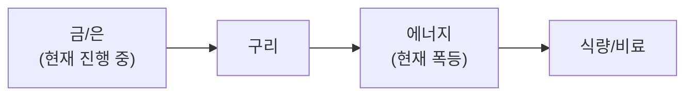

**3월 10일, WTI $115 돌파 후 G7 SPR 300~400M 배럴 방출 논의로 $99~100까지 후퇴. 호르무즈 완전 봉쇄 지속, 글로벌 원유 공급 20% 위협.**

**KOSPI 사상 최대 폭락.** 3/4 단일일 -12.64%(역대 최악), 2일간 -18%. 서킷브레이커 발동. 에너지 의존도 높은 아시아가 가장 큰 타격. 반면 **S&P 500은 비교적 견조**(YTD 변동 미미) — 미국의 에너지 독립이 핵심 차이.

**방산주 급등.** ITA(미국 방산 ETF) **+14% YTD**, Northrop +6%, RTX +5%. 글로벌 방산 CAPEX **+38% 증가 전망**. 에너지·방산이 포트폴리오 핵심 헤지 자산으로 부상.

**G7 SPR 방출 논의 — 오일 쇼크 완화 변수.** 300~400M 배럴 방출 시 유가 $10~20/bbl 하락 효과. 3개국 이미 지지. 그러나 호르무즈 봉쇄 자체가 해소되지 않는 한 구조적 공급 리스크 지속.

**BCA Research: 수주 내 해결 가능성 제시.** 상황이 "수개월이 아닌 수주 내" 해소될 수 있다는 분석. 이란 체제 전환 시나리오와 함께 유가 급락 반전 가능성도 열어두어야 합니다.

다음 주 **NVIDIA GTC(3/16~19)**: Vera Rubin, Feynman 아키텍처, HBM4, CPO, NVL144 발표 예정. **SOXX +3.98%** — 반도체는 오일 쇼크 속에서도 회복세.

## 6대 투자 섹터 구조

| 섹터 | 하위 섹터 | 상세 분석 |
|------|----------|----------|
| **1. 반도체/AI** | HBM, DRAM/NAND, 파운드리, 소부장, AI SW/클라우드 | [반도체 섹터](/knowledge/invest/2026/01/21/semiconductor-sector-outlook-2026.html) |
| **2. 에너지** | 원전/SMR, 재생에너지, ESS, 수소 | [에너지 섹터](/knowledge/invest/2026/03/07/energy-sector-outlook-2026.html) |
| **3. 방산/우주** | 방산, 드론/UAM, 우주/위성 | [방산/우주 섹터](/knowledge/invest/2026/03/07/defense-space-sector-outlook-2026.html) |
| **4. 모빌리티/로봇** | EV/자율주행, 로봇, 조선 | [모빌리티/로봇 섹터](/knowledge/invest/2026/01/21/automotive-robotics-sector-outlook-2026.html) |
| **5. 바이오/헬스케어** | 신약/바이오텍, GLP-1/비만치료, 의료AI | [바이오/헬스케어 섹터](#바이오헬스케어-및-생명공학) |
| **6. 자산/거시경제** | 금/은, 암호화폐, 원자재/희토류, 거시경제/정책 | [거시경제/정책 섹터](/knowledge/invest/2026/01/21/macroeconomic-policy-sector-outlook-2026.html) |

### 하위 섹터 상세 링크

**반도체/AI**
- [HBM 투자 전망](/knowledge/invest/2026/01/21/hbm-sector-outlook-2026.html)
- [DRAM/NAND 투자 전망](/knowledge/invest/2026/01/21/dram-nand-sector-outlook-2026.html)
- [파운드리 투자 전망](/knowledge/invest/2026/01/21/foundry-sector-outlook-2026.html)
- [소부장 투자 전망](/knowledge/invest/2026/01/21/semiconductor-materials-equipment-outlook-2026.html)
- [AI 소프트웨어/클라우드](/knowledge/invest/2026/03/07/ai-software-cloud-outlook-2026.html)

**에너지**
- [원전 투자 전망](/knowledge/invest/2026/01/21/nuclear-power-sector-outlook-2026.html)

**방산/우주**
- [방산 투자 전망](/knowledge/invest/2026/01/21/defense-sector-outlook-2026.html)

**모빌리티/로봇**
- [EV/자율주행 투자 전망](/knowledge/invest/2026/01/21/ev-autonomous-driving-outlook-2026.html)
- [로봇 투자 전망](/knowledge/invest/2026/01/21/robotics-sector-outlook-2026.html)
- [조선 투자 전망](/knowledge/invest/2026/01/21/shipbuilding-sector-outlook-2026.html)

**자산/거시경제**
- [원자재/희토류](/knowledge/invest/2026/03/07/commodities-rare-earth-outlook-2026.html)

---

## 미래 워치리스트

| 테마 | 현황 | 주시 포인트 |
|------|------|-----------|
| **양자컴퓨팅** | Google Willow, IBM Heron 등 진전. 상용화 초기 | 오류 정정(QEC) 돌파, 금융/제약 응용 |
| **합성생물학** | AI+유전체 편집 융합 가속 | 바이오 제조, 식량/에너지 응용 |
| **BCI (뇌-컴퓨터 인터페이스)** | Neuralink 임상시험, 경쟁사 등장 | FDA 승인, 의료 응용 확대 |
| **핵융합** | Commonwealth Fusion, TAE 등 민간 투자 확대 | 상용 발전 시점(2030년대 중반 전망) |

---

## 목차

1. [거시적 시장 환경](#거시적-시장-환경)
2. [AI 및 클라우드 컴퓨팅](#ai-및-클라우드-컴퓨팅)
3. [AI 네트워크 인프라](#ai-네트워크-인프라)
4. [반도체 및 첨단 제조](#반도체-및-첨단-제조)
5. [로보틱스 및 자율주행](#로보틱스-및-자율주행)
6. [에너지 전환 및 친환경](#에너지-전환-및-친환경)
7. [바이오헬스케어 및 생명공학](#바이오헬스케어-및-생명공학)
8. [우주산업 및 뉴스페이스](#우주산업-및-뉴스페이스)
9. [방위산업 및 국방기술](#방위산업-및-국방기술)
10. [핀테크, 암호화폐 및 STO](#핀테크-암호화폐-및-sto)
11. [사이버보안 및 데이터 인프라](#사이버보안-및-데이터-인프라)
12. [지정학적 관점: 한국은 1980년대 일본](#지정학적-관점-한국은-1980년대-일본)
13. [초거대 기업들의 전략과 투자 방향](#초거대-기업들의-전략과-투자-방향)
14. [한국 시장 구조 변화](#한국-시장-구조-변화)
15. [섹터별 투자 전략: 3월 실전 가이드](#섹터별-투자-전략-3월-실전-가이드)

---

## 거시적 시장 환경

### 글로벌 증시 현황 (3/10 기준)

| 지수 | 수준 | 변동 | 비고 |
|------|------|----------|------|
| **S&P 500** | **비교적 견조** | **YTD 변동 미미** | **미국 에너지 독립 → 오일 쇼크 방어** |
| **KOSPI** | **5,251.87** | **-5.96%** | **3/4 -12.64%(사상 최악) → 2일 -18%, 서킷브레이커** |
| **상해종합** | - | **-0.67%** | 중국도 에너지 의존도 타격 |
| **항셍** | - | **-1.35%** | 아시아 전반 약세 |
| **원/달러** | **1,482.98원** | 1,500 터치 후 소폭 안정 | 유가+환율 이중 타격 지속 |
| **WTI** | **$99~100** | **1주간 +36%→$115 후 SPR 논의로 후퇴** | **G7 SPR 300~400M 배럴 방출 논의** |
| **Brent** | **$119.50 고점** | **월가: $120~150 경고** | **호르무즈 탱커 트래픽 거의 제로** |
| **금(Gold)** | **$5,144/oz** | **-0.03%** | 고점권 횡보, $5,589 ATH 기록 후 |
| **은(Silver)** | 강세 유지 | **$100 전망 지속** | 6년 연속 공급적자 |
| **비트코인** | **$68,461** | **+3.78%** | 위험자산 속 반등, F&G 27 (Extreme Fear) |
| **VIX** | **29.49** | **+24.17%** | **공포 지수 급등, 역사적 매수 기회 근접** |
| **TLT** | +0.87% | 안전자산 선호 | 채권으로 자금 이동 |
| **엔비디아** | 시총 ~$4.31조 | SOXX +3.98% | **GTC 3/16~19 핵심 촉매** |

### 이번 주 핵심 변화 (3/10 업데이트)

| 항목 | 변화 | 투자 시사점 |
|------|------|-----------|
| **★★★ 오일 쇼크 — WTI $115 돌파** | **1주간 +36%, Brent $119.50 고점, 글로벌 원유 20% 위협** | **73년 오일 쇼크 이후 최대급 에너지 위기** |
| **★★★ G7 SPR 방출 논의** | **300~400M 배럴, 3개국 지지, 유가 $10~20 하락 효과** | **$99~100으로 안정화, 그러나 봉쇄 해소 전까지 구조적 리스크** |
| **★★★ KOSPI 사상 최대 폭락** | **3/4 -12.64%(단일일 역대 최악), 2일 -18%, 서킷브레이커** | **에너지 의존 아시아 최대 타격, 한국 취약성 극대화** |
| **★★★ 방산주 급등** | **ITA +14% YTD, Northrop +6%, RTX +5%, CAPEX +38% 전망** | **전쟁 수혜 + 방산 지출 구조적 증가 확정** |
| **★★ 반도체 회복세** | **SOXX +3.98%**, 오일 쇼크 속 반도체만 반등 | **GTC(3/16~19) 기대감 + AI 수요 견조** |
| **★★ BCA Research 수주 내 해결론** | **"수개월이 아닌 수주 내" 해소 가능성** | **유가 급락 반전 시나리오도 열어두어야** |
| **★★ 하이일드 스프레드 확대** | **3.13 (+4.33%)** | **신용 리스크 확대 신호, 위험자산 경계** |
| **★ 쿠웨이트/UAE 감산** | 저장탱크 포화로 자발적 감산 시작 | 봉쇄 장기화 시 산유국 자체 감산 → 공급 추가 축소 |
| **★ 이란 강경파 승계** | 모즈타바 하메네이(강경파) 새 지도자 | 협상 가능성 더 축소, 미국은 체제 전환 목표 |

### 핵심 매크로 변수 5가지

#### 1. 오일 쇼크 — WTI $115 후 G7 SPR로 $99~100 안정

| 항목 | 내용 | 투자 시사점 |
|------|------|-----------|
| **WTI** | **$115+ 돌파 → G7 SPR 논의 후 $99~100** | 1주간 +36%, 73년 이후 최대급 급등 |
| **Brent** | **$119.50 고점** 기록 | 월가: $120~150 경고 |
| **G7 SPR** | **300~400M 배럴 방출 논의, 3국 지지** | 유가 $10~20 하락 효과 |
| **호르무즈** | **탱커 트래픽 거의 제로** | 글로벌 원유 공급 20% 위협 |
| **쿠웨이트/UAE** | 저장탱크 포화 → 자발적 감산 시작 | 봉쇄 장기화 시 공급 추가 축소 |
| **연준 금리** | **3.64%**, 10Y: 4.15%, 2Y: 3.56% | 유가 인플레 → 금리 인하 불가 |

**핵심 판단:** WTI가 1주간 36% 폭등하여 $115를 돌파한 것은 **73년 오일 쇼크급 충격**. G7 SPR 300~400M 배럴 방출 논의가 $99~100으로 안정시켰으나, 호르무즈 봉쇄 자체가 해소되지 않으면 구조적 공급 위기 지속. 그러나 **BCA Research의 "수주 내 해결" 전망**과 G7 대응을 감안하면, 양방향 시나리오를 모두 준비해야 합니다.

#### 2. 이란 전쟁 (Operation Epic Fury) + 호르무즈 완전 봉쇄

| 항목 | 내용 | 투자 시사점 |
|------|------|-----------|
| **작전명** | **Operation Epic Fury** (3/2 개시) | 8일차 진행 중 |
| **호르무즈 탱커 트래픽** | **거의 제로** | 사실상 완전 봉쇄 |
| **글로벌 원유** | **20% 공급 위협** | 역사적 에너지 위기 |
| **이란 신지도자** | **모즈타바 하메네이 (강경파)** | 협상 여지 축소 |
| **미국 목표** | **체제 전환 (regime change)** | 장기화 가능성 |
| **BCA Research** | **"수주 내 해결 가능"** | 낙관적 시나리오 |
| **한국 에너지 자급률** | **19%** (미국 105%) | 한국·일본·대만 최대 피해국 |

**판단:** 호르무즈 봉쇄가 탱커 트래픽 "거의 제로"로 **완전 봉쇄** 상태. 미국은 에너지 독립(자급률 105%)으로 S&P 500 상대적 견조. 반면 **한국(19%)/일본(13%)/대만(4%)이 실질 피해국**. BCA Research가 수주 내 해결 가능성을 제시하고 있어, **빠른 종전 시 유가 급락 + 아시아 반등** 시나리오도 대비해야 합니다.

#### 3. KOSPI 사상 최대 폭락 — 서킷브레이커·2일 -18%

| 항목 | 내용 | 투자 시사점 |
|------|------|-----------|
| **3/4 KOSPI** | **-12.64%** (단일일 역대 최악) | 서킷브레이커 발동 |
| **2일 합산** | **-18%** | 2/26 사상최고(6,307) → 5,100대 급락 |
| **3/10 KOSPI** | **5,251.87 (-5.96%)** | 추가 하락 후 안정화 시도 |
| **원인** | 에너지 의존 경제 + 유가 폭등 + 환율 급등 | 한국 경제 구조적 취약성 노출 |
| **VIX** | **29.49 (+24.17%)** | 공포 지수 급등 |
| **Fear & Greed** | **27 (Extreme Fear)** | **역사적 매수 기회 근접** |

**판단:** KOSPI의 사상 최대 폭락은 한국 경제의 **에너지 의존도 취약성**을 극적으로 드러냈습니다. VIX 29.49, Fear & Greed 27은 역사적으로 **극도의 공포 구간**이며, 과거 데이터상 이 수준에서의 매수는 6~12개월 수익률이 양호했습니다. 단, 전쟁 종결 시점이 불확실하므로 **분할 매수**가 원칙.

#### 4. DRAM 가격 역대 최대폭 폭등 + 반도체 $1T 돌파 + SOXX +3.98%

| 제품 | Q1 QoQ 가격 변동 | Q2 전망 | 비고 |
|------|-------------|---------|------|
| **컨벤셔널 DRAM** | **+90~95%** 확인 | **최대 +70% 추가 상승** | **역사적 기록** |
| **DRAM 스팟** | **스팟 > 계약 가격** | 추가 상승 | 공급 부족 심화 |
| **NAND Flash** | **+55~60%** | 상승 지속 | 기존 전망 대비 상향 |
| **HBM3E** | **+20% 인상** | 추가 인상 전망 | 수요 > 공급 지속 |
| **SOXX** | **+3.98%** | - | **오일 쇼크 속 반도체 회복** |

**핵심 판단:** SOXX가 오일 쇼크 속에서 +3.98% 반등한 것은 **AI 수요의 구조적 강도**를 확인. GTC(3/16~19)에서 Vera Rubin/Feynman 아키텍처 발표가 추가 촉매.

#### 5. 환율 1,482.98원 + 유가 $100 = 한국 경제 최대 위기

| 항목 | 현황 | 변화 |
|------|------|------|
| 원/달러 환율 | **1,482.98원** | 1,500 터치 후 소폭 안정 |
| EUR/USD | **1.1606** | 달러 약세 진행 |
| **유가+환율 이중 타격** | 환율 1,483원 x 유가 $100 | **원화 기준 에너지 수입비 역대급** |
| WGBI 편입 | **4월 시작, 8회 분할 편입** | $56B+ 유입 전망 — 유일한 환율 안정 촉매 |
| **시나리오별 전망** | **수주 내 종료: 1,400원대 / 장기화: 1,530~1,600원** | BCA "수주 내 해결" vs 봉쇄 장기화 |

**판단:** 환율 1,483원 + 유가 $100 = **한국 경제 최대 스트레스**. 단, BCA Research의 수주 내 해결론이 현실화되면 환율은 빠르게 1,400원대로 안정. WGBI 4월 편입이 구조적 지지. 양방향 대비 필수.

### 관세 현황 -- Section 122 15% 발효 중 (7/23 만료)

| 관세 | 세율 | 상태 | 비고 |
|------|------|------|------|
| **글로벌 보편관세** | **15%** | **발효 중** (2/24~) | **150일 한시** (7/23 만료) |
| **중국 관세** | **35~50%** | USTR 유지 | **트럼프-시진핑 정상회담 3월 말 변수** |
| **반도체** | 25%+ | **Section 232 유지** | 별도 법적 근거 |
| **자동차** | **25%** | **4/3 발효 예정** | **현대/기아 직접 타격** |
| **철강/알루미늄** | 25% | **Section 232 유지** | 3/12 발효 |

---

## AI 및 클라우드 컴퓨팅

### 현재 상황 (3월 10일 기준)

빅테크의 2026년 AI CAPEX가 합산 **$6,500~7,000억(~$700B)**에 달하며, 전년 대비 **60% 이상** 급증. 오일 쇼크에도 불구하고 **AI 투자는 구조적**이어서 삭감 가능성 낮음. **GTC 2026(3/16~19)**이 핵심 방향성 결정 이벤트.

| 기업 | 2026 AI CAPEX | 핵심 이슈 |
|------|--------------|---------|
| **Amazon** | **$2,000억** | FCF 마이너스 전환 전망 |
| **Alphabet** | **$1,850억** | FCF 90% 감소 전망 |
| **Microsoft** | **$1,450억** | Azure AI 확대 |
| **Meta** | **$1,350억** | FCF 90% 감소 전망 |
| **합계** | **$6,500~7,000억** | 전년 대비 **+60% 이상** |

### 핵심 투자 포인트

| 영역 | 내용 | 전망 |
|------|------|------|
| **AI 칩셋** | 엔비디아 시총 ~$4.31조 | **GTC 3/16~19: Vera Rubin, Feynman, NVL144, CPO, HBM4** |
| **커스텀 ASIC** | **Broadcom AI $8.4B(+74%)**, **Marvell $0→$1.5B** | 2026년 GPU 출하량 추월 전망 |
| **클라우드 인프라** | AWS, Azure, GCP | $7,000억 투자 직접 수혜 |
| **AI 응용** | CRM, 헬스케어, 금융 AI | 하드웨어 실적 파티 vs 소프트웨어 수익화 미완 |

### 3월 투자 전략

**단기**: **GTC 2026(3/16~19)**이 최대 촉매. Vera Rubin(6개 칩, 성능/와트 10배), **Feynman 아키텍처**, NVL144, CPO, HBM4 발표 예정. SOXX +3.98%로 **오일 쇼크 속에서도 반도체 선호** 확인.

**중기**: 커스텀 ASIC(Broadcom AI $8.4B, Marvell $1.5B)이 새로운 성장 축. AI 수요는 유가와 무관하게 구조적.

**리스크**: ①AI 칩 수출통제 초안, ②스태그플레이션 → 데이터센터 전력비 상승(유가 $100), ③빅테크 FCF 급감.

### 주요 기업 및 ETF

**대표 기업:**
- 엔비디아 (NVDA): 시총 ~$4.31조. **GTC 3/16~19: Vera Rubin + Feynman + NVL144 + CPO + HBM4**
- **AMD (AMD)**: MI455X + Helios — Meta 6GW + OpenAI 6GW = **12GW 계약**
- **Broadcom (AVGO)**: AI 매출 **$8.4B(+74%)**, 커스텀 ASIC 리더
- **Marvell (MRVL)**: ASIC 매출 **$0→$1.5B**

**투자 ETF:**
- BOTZ (Global X Robotics & AI ETF)
- ROBO (ROBO Global Robotics & Automation Index ETF)

---

## AI 네트워크 인프라

### 핵심 테마: 데이터센터 ROI의 열쇠

$700B 규모의 AI 데이터센터 투자에서 **네트워크 인프라는 ROI를 결정짓는 핵심 요소**입니다.

### InfiniBand vs Ethernet 경쟁

| 기술 | 대표 기업 | 특징 |
|------|----------|------|
| **InfiniBand** | 엔비디아 (Mellanox) | 현재 AI 학습 표준, 저지연 |
| **Ethernet (AI용)** | Arista Networks, Broadcom | 범용성 우수, 비용 효율적 |

### 대역폭 에스컬레이션

```
현재: 400G
진행중: 800G
2026-2027: 1.6T
2028+: 3.2T
```

각 세대 전환마다 **광트랜시버, 스위치, 광케이블** 수요가 2배씩 증가합니다.

### 핵심 투자 기업

| 기업 | 분야 | 핵심 강점 |
|------|------|----------|
| **Arista Networks** | 데이터센터 스위칭 | AI 데이터센터 네트워킹 1위 |
| **Coherent** | 광트랜시버 | 시장 점유율 1위, 800G/1.6T 리더 |
| **Lumentum** | 광학 부품 | 레이저, 광부품 핵심 공급 |
| **Broadcom** | 네트워크 칩 + ASIC | AI 네트워크 + 커스텀 ASIC, **AI $8.4B(+74%)** |

---

## 반도체 및 첨단 제조

### 핵심 이벤트: $1T 기가사이클 + GTC 3/16 + SOXX +3.98%

**SIA가 2026년 글로벌 반도체 매출 $1조 돌파를 전망.** 오일 쇼크 속에서도 **SOXX +3.98%**로 반도체는 별도의 강한 수요 사이클 진행 중. **GTC 2026(3/16~19)에서 Vera Rubin/Feynman/HBM4/CPO/NVL144 발표가 핵심 촉매.**

| 항목 | 내용 | 투자 시사점 |
|------|------|-----------|
| **SOXX +3.98%** | 오일 쇼크 속 반도체 회복 | AI 수요 구조적 강도 확인 |
| **GTC 2026 (3/16~19)** | Vera Rubin, Feynman, HBM4, CPO, NVL144 | **반등 핵심 촉매** |
| **SIA $1조 전망** | 2026년 글로벌 반도체 매출 $1T 돌파 | 기가사이클 가속 |
| **HBM: SK하이닉스 62%** | HBM 시장 점유율 62%, 삼성 HBM4 PRA 완료 | 양강 과점 구조 |
| **DRAM Q1 +90~95%** | 역사적 기록, 스팟 > 계약 | 슈퍼사이클 가속 |
| **Broadcom AI $8.4B** | +74%, 커스텀 ASIC 리더 | GPU 출하량 추월 전망 |
| **AI 칩 수출통제 (3/5)** | 초안 단계 | 단기 센티먼트 리스크 |

### 한국 메모리의 기가사이클

**SK하이닉스 HBM 시장 점유율 62%**로 압도적 1위. **삼성은 HBM4 PRA 완료**로 양산 본격화 임박.

핵심 포인트:
- **SK하이닉스**: HBM 62% 점유, 16단 48GB HBM4 공개
- **삼성 HBM4 PRA 완료**: 세계 최초 양산 출하, 대역폭 3.3TB/s
- **DRAM Q1 +90~95%**: 역사적 기록
- **SIA $1T**: 2026년 글로벌 매출 $1조 돌파 전망

### 3월 투자 전략

**핵심 전략: GTC 촉매 대기 + DRAM 슈퍼사이클 + 오일 쇼크 디커플링**

1. **삼성전자**: HBM4 PRA 완료 + MS 2027 OP 317조 + DRAM Q1 +95%. KOSPI 폭락으로 저가 매수 기회.
2. **SK하이닉스**: HBM 62% 점유율, PER 극저. DRAM Q2 추가 상승.
3. **엔비디아**: 시총 $4.31T. **GTC 3/16~19 핵심**. Vera Rubin + Feynman + NVL144.
4. **커스텀 ASIC**: Broadcom AI $8.4B(+74%), Marvell $1.5B.
5. **소부장**: 한미반도체(영업이익률 50%, TC 본더 71.2%), HPSP(55%), 리노공업(48%).

### 주요 기업

| 카테고리 | 주요 기업 | 현황 |
|----------|----------|------|
| **AI 칩** | 엔비디아, AMD | GTC 3/16~19, SOXX +3.98% |
| **파운드리** | TSMC, 삼성전자 | TSMC N2 램프 |
| **메모리** | 삼성전자, SK하이닉스 | SK 62% HBM, DRAM Q1 +95% |
| **커스텀 ASIC** | Broadcom, Marvell | Broadcom AI $8.4B(+74%) |
| **소부장** | 한미반도체, HPSP, 리노공업 | 고수익성 지속 |
| **장비** | ASML, 램리서치 | ASML 분기 주문 EUR132억 기록 |

**ETF:**
- SMH (VanEck Semiconductor ETF)
- SOXX (iShares Semiconductor ETF) — **+3.98% (오일 쇼크 속 반등)**

---

## 로보틱스 및 자율주행

### 현재 상황: 세미트럭 양산·Cybercab $30K·코텍스2 4월·데이터센터 냉각

| 항목 | 내용 | 시사점 |
|------|------|--------|
| **세미트럭 3월 양산** | 네바다 공장 완공, UPS 100대+/DHL 주문 | EV 상용차 시장 전환점 |
| **Cybercab $30K 생산 시작** | 2/17 첫 양산 출고, 로보택시 $3.25 (우버 대비 50-60% 저렴) | 로보택시 상용화 가시화 |
| **데이터센터 냉각 신테마** | LG전자(공조), SK이노베이션(SK루브론 액침 냉각) | AI 데이터센터 핵심 병목 |
| **코텍스2 4월 가동** | 500MW, 기가텍사스. 옵티머스 전용 훈련 | 피지컬AI 가속 |
| **Optimus Gen3 양산** | 1/21 프리몬트 생산 개시 | 학습/데이터 수집 단계 |
| **BYD 블레이드 배터리 2.0** | 5분→70% 충전, 1,006km | 중국 EV 기술 격차 확대 |
| **자동차 관세 25%** | 4/3 발효 예정 | 현대/기아 직접 타격 |

### 한국 로봇 섹터

- 두산로보틱스: 협동 로봇 리더
- 레인보우로보틱스: 휴머노이드 로봇 개발
- 현대차/보스턴다이나믹스: 기업가치 ~55조원
- **주의**: 중국 휴머노이드 로봇 **87-90%** 점유 — 경쟁 리스크 최대

**ETF:**
- BOTZ (Global X Robotics & AI ETF)
- ROBO (ROBO Global Robotics & Automation Index ETF)

---

## 에너지 전환 및 친환경

### 오일 쇼크: WTI $115→SPR $99~100 + 호르무즈 완전 봉쇄 + i-SMR 규제심사

| 항목 | 내용 |
|------|------|
| **WTI** | **$115+ 돌파 → G7 SPR 논의 → $99~100** |
| **Brent** | **$119.50 고점**, 월가 $120~150 경고 |
| **G7 SPR** | **300~400M 배럴 방출 논의**, 3개국 지지, $10~20 하락 효과 |
| **호르무즈 봉쇄** | **탱커 트래픽 거의 제로**, 글로벌 원유 20% 위협 |
| **쿠웨이트/UAE** | 저장탱크 포화 → 자발적 감산 시작 |
| **한국 호르무즈 의존도** | 일 276만 배럴 수입 — 산업경제 존립 위협 |
| **ICLN** | **+3.04%** | 청정에너지 대안 수요 |
| **LIT** | **+3.57%** | 배터리/리튬 관심 증가 |
| **i-SMR 규제심사 (3/5-6)** | 한국 소형모듈원전 규제 프로세스 본격 시작 |

### 에너지 시나리오 (3/10 기준)

| 시나리오 | 유가 전망 | 확률 | 영향 |
|---------|----------|------|------|
| **G7 SPR 방출 + 봉쇄 지속** | **$90~110** | **고** | **SPR로 일시적 안정, 구조적 리스크 지속** |
| **봉쇄 강화 (SPR 소진)** | **$120~150** | **중** | **글로벌 스태그플레이션 심화** |
| **수주 내 종전 (BCA)** | **$65~80** | **중** | **유가 급락, 아시아 반등, 방산 조정** |
| 이란 체제 전환 성공 | $55~65 | 저 | 유가 하락, 리스크 프리미엄 완전 해소 |

### 핵심 하위 섹터

#### 원전 (Nuclear Renaissance) -- 에너지 안보 + AI 전력 수요

AI 데이터센터 전력 수요 + 이란 전쟁 에너지 안보 + 탈탄소 정책 삼중 호재.

| 항목 | 내용 | 투자 시사점 |
|------|------|-----------|
| **우라늄** | +32% YoY | 구조적 공급 부족 |
| **i-SMR 규제심사 착수** | 한국 SMR 규제 프로세스 시작 | 상용화 가시화 |
| **미국 $80B 신규 원전** | NuScale SMR 규제 승인 | 원전 르네상스 가속 |
| **KHNP 태국·필리핀** | 원전 수출 파이프라인 확대 | K-원전 해외 수주 |

#### 배터리/청정에너지 -- 오일 쇼크 대안 수요

**ICLN +3.04%, LIT +3.57%** — 오일 쇼크가 청정에너지/배터리로의 전환 수요를 가속. 에너지 위기가 장기화될수록 재생에너지·ESS 투자 강화.

### 투자 ETF

- ICLN (iShares Global Clean Energy) — **+3.04%**
- LIT (Global X Lithium & Battery Tech) — **+3.57%**
- URA (Global X Uranium ETF)

---

## 바이오헬스케어 및 생명공학

### 스태그플레이션 방어 + GLP-1 경쟁 구도 변화

오일 쇼크 + 스태그플레이션 환경에서 **방어적 헬스케어 매력도 상승**.

### 핵심 투자 포인트

#### GLP-1 비만 치료제

| 기업 | 현황 | 전망 |
|------|------|------|
| **Eli Lilly (LLY)** | GLP-1 시장 지배, EPS $35 전망(2026) | Mounjaro/Zepbound 선도 |
| **Novo Nordisk (NVO)** | 1년간 56% 하락, 경쟁 심화 | 저평가, $70 목표가 |
| **Viking Therapeutics** | 2상 결과 13주 14.7% 체중 감량 | 신규 경쟁자 |

#### AI 신약 개발

- 엑셀런시아, 리커전: AI 기반 약물 발견
- 빅테크 진출: 구글 DeepMind, 아마존 헬스케어

### 투자 ETF

- XBI (SPDR S&P Biotech ETF)
- IBB (iShares Biotechnology ETF)
- ARKG (ARK Genomic Revolution ETF)

---

## 우주산업 및 뉴스페이스

### 현재 상황: 방산 급등과 함께 우주 관련 수혜

| 기업/영역 | 내용 | 전망 |
|----------|------|------|
| SpaceX-xAI 합병 | 역삼각합병 추진 중 | 우주+AI 시너지 |
| 한화에어로스페이스 | K-방산/우주 대표주 | 수주잔고 100조+ |
| 로켓랩 (RKLB) | 소형 위성 발사 전문 | 트럼프 국방부 관심 |

### 트럼프 국방 정책과 우주

트럼프 행정부의 **FY2027 국방비 $1.5조 제안**에서 우주가 최우선 분야.

**투자 ETF:**
- UFO (Procure Space ETF)
- ARKX (ARK Space Exploration ETF)

---

## 방위산업 및 국방기술

### 현재 상황: 이란 전쟁 8일차 + 방산 CAPEX +38% + ITA +14% YTD

오일 쇼크와 함께 **방산이 2026년 최대 수혜 섹터**로 확정. ITA(미국 방산 ETF) **+14% YTD**, 글로벌 방산 CAPEX **+38% 증가 전망**.

| 항목 | 내용 | 시사점 |
|------|------|--------|
| **★ ITA +14% YTD** | **미국 방산 ETF 압도적 성과** | 방산 = 2026년 최강 섹터 |
| **Northrop +6%, RTX +5%** | 미국 방산 대형주 일제히 상승 | 글로벌 방산 지출 구조적 증가 |
| **방산 CAPEX +38%** | 글로벌 방산 투자 38% 증가 전망 | 장기 성장 사이클 |
| **청궁-II 실전 검증** | UAE에서 명중률 90% — 실전 실증 | K-방산 신뢰도 구조적 상향 |
| **EU ReArm 8,000억유로** | EU 정상 합의 (~1,250조원) | K-방산 유럽 수출 대폭 확대 |
| **EU €150B 방산 대출 (3/6)** | EU 공동 방산 투자 대규모 확대 | K-방산 유럽 수주 기회 |
| **NATO 방위비 GDP 5%** | 2035년까지 목표 상향 (기존 2%) | 글로벌 방산 장기 수요 |

### 조선 -- 호르무즈 봉쇄 + LNG 용선율 $200K+ + 슈퍼사이클

| 항목 | 내용 |
|------|------|
| **HD현대 LNG 4척 ₩1.49T** | LNG 용선율 $200K+ (기존 대비 2배) |
| **호르무즈 봉쇄** | 선박 통행 불가, 해군함·호위함 수요 급증 |
| **3대 조선사 수주 목표** | $464억(+30%) |
| **LNG선 전망** | 2026년 글로벌 115척 발주 전망 (+24%) |

### 주요 기업

**주요 기업:** 한화에어로스페이스 (수주잔고 100조+, 청궁-II 실전 검증), 한화오션 (캐나다 잠수함 48조), HD현대중공업 (LNG 4척 ₩1.49T), LIG넥스원 (사우디 L-SAM), HD한국조선해양 (수주 35조)

**투자 ETF:**
- ITA (iShares U.S. Aerospace & Defense ETF) — **+14% YTD**
- XAR (SPDR S&P Aerospace & Defense ETF)
- SHLD (Global X Defense Tech ETF)

---

## 핀테크, 암호화폐 및 STO

### STO 법안 국회 통과 -- 2026년 상반기 토큰증권 원년

| 항목 | 내용 |
|------|------|
| **법안 통과** | **2026.1.15 국회 통과** |
| **시행** | 2027년 1월 시행 |
| **시장 전망** | 2026년 상반기 STO 시장 원년 |
| **2030년 시장 규모** | 약 **367조원** |

### 자산 현황: 금·은·비트코인

| 자산 | 현재 | 전망 | 포지션 |
|------|------|------|--------|
| **금(Gold)** | **$5,144/oz** (-0.03%) | JP모건 $6,300, Yardeni $6,000 | **적극 매수** |
| **은(Silver)** | 강세 유지 | $100 전망, 6년 연속 공급적자 | **분할 매수** |
| **비트코인** | **$68,461** (+3.78%) | F&G 27 Extreme Fear, 위험자산 거래 | **관망/극소량** |

**금 판단:** $5,144로 고점권 횡보. ATH $5,589 이후 G7 SPR 논의로 안전자산 수요 소폭 후퇴했으나, 호르무즈 봉쇄 해소 전까지 **구조적 상승 기조** 유지. 전쟁 종결 시 단기 조정 가능하나, 스태그플레이션 + 달러 약세 + 중앙은행 매입 트렌드는 지속.

**비트코인 판단:** $68,461(+3.78%)로 반등했으나 F&G 27 (Extreme Fear). 위험자산 성격 강해 전쟁 해소 시 추가 반등 가능하나, 구조적으로 S&P 상관계수 0.55 유지 중. **레버리지 절대 금지**.

**ETF:**
- BITO (ProShares Bitcoin Strategy ETF)
- BLOK (Amplify Transformational Data Sharing ETF)

---

## 사이버보안 및 데이터 인프라

### 현재 상황

이란 전쟁 8일차로 **이란발 사이버 보복 공격 가능성 극대화**. AI 칩 수출통제로 보안 인프라 수요도 구조적 증가.

### 핵심 기업

| 분야 | 기업 | 강점 |
|------|------|------|
| 네트워크 보안 | 팔로알토, 포티넷 | 차세대 방화벽 |
| 클라우드 보안 | 크라우드스트라이크, 제트스케일러 | EDR, 제로 트러스트 |
| AI 보안 | 팔란티어 | 전장 AI, 데이터 분석 |

### 투자 ETF

- CIBR (First Trust NASDAQ Cybersecurity ETF)
- HACK (ETFMG Prime Cyber Security ETF)

---

## 지정학적 관점: 한국은 1980년대 일본

### 핵심 프레임: 미중 경쟁 수혜 + 이란 전쟁 방산 수혜 + 에너지 의존 취약성

미-중 기술 패권 경쟁에서 한국이 **미국의 핵심 동맹 공급국**으로서 구조적 수혜. 이란 전쟁 + 청궁-II 실전 검증으로 K-방산 신뢰도 구조적 상향. 그러나 **에너지 자급률 19%로 오일 쇼크에 가장 취약한 선진국 중 하나**.

### 한국의 글로벌 핵심 공급 분야

| 분야 | 한국 위상 | 핵심 기업 |
|------|----------|----------|
| **HBM** | 글로벌 양강, SK하이닉스 62% | SK하이닉스, 삼성전자 |
| **전력/변압기** | 핵심 공급국 | 현대일렉트릭, LS산전 |
| **조선** | 글로벌 1위, LNG $200K+ 용선율 | HD한국조선해양, 삼성중공업 |
| **K-배터리** | 글로벌 3강 | LG에너지솔루션, 삼성SDI |
| **K-방산** | 수주잔고 100조+, 청궁-II 실전 검증 | 한화에어로스페이스, LIG넥스원 |
| **로보틱스** | 로봇밀도 세계 1위 | 두산로보틱스, 현대로보틱스 |

### 미국 전략적 수혜 섹터

| 우선순위 | 섹터 | 정책 |
|---------|------|------|
| 1순위 | **에너지** | 에너지 독립(자급률 105%), S&P 500 견조 |
| 1순위 | **방산/우주** | ITA +14% YTD, CAPEX +38%, 이란 전쟁 |
| 2순위 | **반도체** | SIA $1T, SOXX +3.98%, GTC 3/16 |
| 2순위 | **AI** | $700B CAPEX |
| 3순위 | **암호화폐** | Clarity Act 법제화 추진 |

---

## 초거대 기업들의 전략과 투자 방향

### $700B AI 투자의 흐름: 공급망 수혜 지도

```
AI 칩 → 엔비디아($4.31조, GTC 3/16~19), AMD, TSMC
커스텀 ASIC → Broadcom(AI $8.4B, +74%), Marvell($0→$1.5B)
데이터센터 네트워크 → Arista, Coherent, Lumentum
서버/메모리 → SK하이닉스(HBM 62%), 삼성전자(HBM4 PRA 완료)
냉각 시스템 → LG전자(공조), SK이노베이션(액침 냉각)
전력 인프라 → 원전(i-SMR), 우라늄
```

### 테슬라의 전략적 피벗 -- 코텍스2 + 옵티머스 + 로보택시

| 전략 | 내용 | 의미 |
|------|------|------|
| **코텍스2 (500MW)** | 4월 절반 가동, 옵티머스 전용 훈련 | 피지컬AI 핵심 병목 해소 |
| **Optimus Gen3 양산** | 1/21 프리몬트 생산 | V2 쇼케이스 4-5개월 내 |
| **로보택시 오스틴** | FSD Unsupervised | 자율주행 상용화 전환점 |
| **Cybercab 양산** | 기가텍사스, $30K | 4~8주 내 본격 생산 |
| **세미트럭 3월 양산** | 네바다 공장 완공 | EV 상용차 전환점 |

---

## 한국 시장 구조 변화

### KOSPI: 사상 최대 폭락 후 불안정 — 5,251.87 (-5.96%)

2/26 사상최고(6,307) → **3/4 -12.64%(사상 최대 폭락, 서킷브레이커)** → **2일 합산 -18%** → 3/10 **5,251.87 (-5.96%)** 추가 하락.

| 항목 | 3/3 | 3/4 | 3/5 | 3/10 |
|------|------|------|------|------|
| **KOSPI** | -7.24% | **-12.64% (사상 최악)** | +9.63% | **5,251.87 (-5.96%)** |
| **서킷브레이커** | - | **발동** | - | - |

### 방산·에너지주 폭등 — KOSPI 폭락 속 극단적 양극화 지속

| 종목 | 등락률 | 핵심 촉매 |
|------|--------|----------|
| **LIG넥스원** | **+29.99% (상한가)** | 사우디 L-SAM, 이란 전쟁 |
| **한화시스템즈** | **+29.99% (상한가)** | 방산 전자·레이더 수요 |
| **S-Oil** | **+28.45%** | 유가 상승 수혜 |
| **한화에어로스페이스** | **+19.83%** | 수주잔고 100조+, 청궁-II |

### ★ 한국 자산시장 대전환 — 부동산·예금 → 주식

| 항목 | 내용 | 투자 시사점 |
|------|------|-----------|
| **대통령 ETF 매수 선언** | 분당 아파트 매각, ETF 매수 | 정부 차원의 주식 투자 장려 |
| **상법 개정** | 배당소득 분리과세, 자사주 의무소각 | 자본시장 친화 정책 |
| **국민성장펀드 150조** | 민간 75조 + 정부 75조 | 코스닥 15조 유입 |
| **고객예탁금 130조** | 사상 최고 | 투자 대기 자금 극대화 |
| **MSCI 선진지수** | 환율시장 개방 추진 | WGBI 4월 편입과 시너지 |

### 배당 ETF: 고변동성 시기 방어

| ETF | 특징 | 수익률 |
|-----|------|--------|
| **PLUS 고배당주 위클리 커버드콜** | 주간 콜옵션 매도 | 분배율 **20.55%** |
| **KODEX 코리아 밸류업 토탈리턴** | 밸류업 + 토탈리턴 | **101.87%** |
| KODEX 200 타겟위클리 커버드콜 | 주간 콜옵션 매도 | 연 **17%** 배당 |

---

## 섹터별 투자 전략: 3월 실전 가이드

### 핵심 전략: "오일 쇼크 + 방산 급등 + KOSPI 공포 = 에너지·방산 최우선, 반도체 분할 매수"

3월 10일 기준 핵심 전략:

1. **오일 쇼크: WTI $115→$99~100**: G7 SPR 300~400M 배럴 방출 논의가 안정화 촉매. 그러나 호르무즈 봉쇄 해소 전까지 구조적 리스크 → **에너지 비중 유지**
2. **방산 = 2026년 최강 섹터**: ITA +14% YTD, CAPEX +38%. 전쟁 종결과 무관하게 글로벌 방산 지출 구조적 증가 확정 → **방산 최적극 매수**
3. **KOSPI 사상 최대 폭락 = 공포 속 기회**: VIX 29.49, F&G 27 (Extreme Fear). 역사적으로 이 수준은 6~12개월 수익률 양호 → **분할 매수 시작**
4. **반도체 디커플링**: SOXX +3.98%, GTC 3/16~19 촉매. 오일 쇼크와 무관한 AI 수요 → **반도체 분할 매수**
5. **BCA "수주 내 해결"**: 빠른 종전 시 유가 급락 + 아시아 반등 시나리오 대비 → **양방향 포지셔닝**
6. **금 고점권 횡보**: $5,144(-0.03%). 전쟁 해소 시 단기 조정 가능하나, 스태그플레이션 구조 지속 → **보유 유지**
7. **이번 주 핵심**: CPI(아직 유가 반영 안 됨), **NVIDIA GTC(3/16~19)**, S&P 500 리밸런싱(3/23), 트럼프-시진핑 회담(3월 말)

### 상품 사이클 순서 (commodity cycle)



현재 금/은 → 에너지가 **동시에 급등** 중. 식량/비료가 다음 사이클 후보.

### 자산 상관관계 (3/10 기준)

| 자산 | 방향 | 최신 수준 | 근거 |
|------|------|---------|------|
| **유가(Oil)** | **폭등→안정화** | WTI $99~100 (고점 $115) | G7 SPR 방출 논의, 호르무즈 봉쇄 지속 |
| **★ 방산주** | **최강세** | ITA +14% YTD | CAPEX +38%, 전쟁 수혜, 구조적 |
| **금(Gold)** | **고점 횡보** | $5,144 (-0.03%) | 안전자산, ATH $5,589 후 횡보 |
| **반도체** | **회복** | SOXX +3.98% | GTC 촉매, AI 수요 견조 |
| **은(Silver)** | **강세 유지** | $100 전망 | 6년 공급적자, 산업 수요 |
| **KOSPI** | **급락** | 5,251.87 (-5.96%) | 오일 쇼크 + 에너지 의존 |
| **비트코인** | **반등** | $68,461 (+3.78%) | F&G 27, 위험자산 |
| **TLT** | **상승** | +0.87% | 안전자산 선호 |
| **VIX** | **급등** | 29.49 (+24.17%) | 공포 = 역사적 매수 기회 근접 |

### 포트폴리오 구성 제안

**오일 쇼크 + 방산 급등 + KOSPI 공포: 방산 최우선, 반도체 분할 매수, 현금 비중 유지**

#### 전일 대비 변동 (3/10 vs 3/9)

| 섹터 | 전일 비중 | 금일 비중 | 변동 | 변동 사유 |
|------|----------|----------|------|----------|
| 방산/조선 | 25% | **27%** | **+2%** | **ITA +14% YTD, CAPEX +38%, 구조적 최강 섹터** |
| AI/반도체 | 17% | **18%** | **+1%** | **SOXX +3.98% 반등, GTC 3/16 촉매, KOSPI 폭락=매수 기회** |
| 에너지/원전 | 15% | 15% | - | G7 SPR 논의로 유가 안정화, 봉쇄 지속 |
| 금 | 10% | **9%** | **-1%** | 고점 횡보(-0.03%), 전쟁 해소 시 조정 가능성 |
| 은 | 2% | 2% | - | $100 전망 유지 |
| 로봇/자동화 | 4% | 4% | - | 세미트럭 양산 중기 호재 |
| AI 네트워크 인프라 | 3% | 3% | - | GTC 수혜 기대 |
| STO/핀테크 | 2% | 2% | - | 변동 없음 |
| 현금 | 22% | **20%** | **-2%** | **VIX 29.49, F&G 27=극도 공포. 방산+반도체 분할 매수 실행** |

#### 추천 종목 (실제 종목/ETF)

| 섹터 | 추천 종목 (티커) | 추천 사유 | 현재가/밸류에이션 |
|------|----------------|----------|-----------------|
| 방산/조선 | 한화에어로스페이스, LIG넥스원, HD한국조선해양, ITA(ETF), XAR(ETF) | 청궁-II 실전검증, ITA +14% YTD, CAPEX +38% | 방산 구조적 최강 |
| AI/반도체 | SK하이닉스, 삼성전자, NVDA, SMH(ETF), SOXX(ETF) | SOXX +3.98%, GTC 3/16, DRAM Q1+95% | KOSPI 폭락=매수 기회 |
| 에너지/원전 | 두산에너빌리티, S-Oil, Cameco(CCJ), URA(ETF) | i-SMR 규제심사, WTI $99~100, 우라늄+32% | Cameco EPS +55% |
| 금 | GLD, IAU, KODEX 골드선물(H) | $5,144, 스태그플레이션 헤지, JP모건 $6,300 | 고점권 횡보 |
| 은 | SLV, PSLV, KODEX 은선물(H) | $100 전망, 6년 공급적자 | 강세 유지 |
| 청정에너지 | ICLN(ETF), LIT(ETF) | 오일 쇼크 대안 수요, ICLN +3.04%, LIT +3.57% | 에너지 전환 가속 |
| 로봇/자동화 | 테슬라(TSLA), 두산로보틱스, BOTZ(ETF) | 세미트럭·Cybercab 양산, 코텍스2 4월 | Cybercab $30K |
| 바이오 | Eli Lilly(LLY), Novo Nordisk(NVO), Viking(VKTX) | GLP-1, NVO -56% 저평가 | 방어적 섹터 |

**※ 종목 추천은 참고용이며, 투자 판단은 본인 책임입니다.**

#### 공격적 투자자

| 섹터 | 비중 | 근거 |
|------|------|------|
| **방산/조선** | **27%** | **ITA +14% YTD, CAPEX +38%, 청궁-II, 구조적 최강** |
| AI/반도체 (HBM·메모리) | 18% | **SOXX +3.98%, GTC 3/16, DRAM Q1 +95%, KOSPI 폭락=매수 기회** |
| **에너지/원전** | **15%** | **WTI $99~100, 호르무즈 봉쇄, 미국 $80B 원전** |
| **금** | **9%** | **$5,144 고점 횡보, 스태그플레이션 헤지** |
| **은** | **2%** | **$100 전망, 6년 공급적자** |
| 로봇/자동화 | 4% | 세미트럭 양산, Cybercab $30K |
| AI 네트워크 인프라 | 3% | Broadcom AI $8.4B, GTC 수혜 |
| STO/핀테크 | 2% | 법안 통과, 2027년 1월 시행 |
| **현금** | **20%** | **양방향 시나리오 대비, VIX 29.49=분할 매수 진행** |

#### 균형 투자자

| 섹터 | 비중 | 근거 |
|------|------|------|
| **방산/조선** | **22%** | **ITA +14% YTD, CAPEX +38%, 구조적** |
| AI/반도체 | 15% | SOXX +3.98%, GTC 촉매, 분할 매수 |
| **에너지/원전** | **12%** | WTI $99~100, 호르무즈, 원전 |
| **금** | **9%** | $5,144, 안전자산 |
| 배당 ETF | 7% | 월 20%+ 분배율, 스태그플레이션 방어 |
| 바이오/헬스 | 3% | NVO -56% 역발상, 방어 섹터 |
| 로봇/자동화 | 3% | 세미트럭 양산 |
| **은** | **2%** | $100 전망, 6년 공급적자 |
| AI 네트워크 인프라 | 2% | GTC 수혜 |
| STO/핀테크 | 2% | 법안 통과 |
| **현금** | **23%** | **VIX 29.49, 양방향 대비** |

#### 보수적 투자자

| 섹터 | 비중 | 근거 |
|------|------|------|
| **금** | **15%** | $5,144, 스태그플레이션+전쟁 헤지 |
| 배당 ETF | 14% | PLUS 위클리 20.55%, 방어 |
| **방산** | **12%** | ITA +14% YTD, 구조적 성장 |
| **에너지/원전** | **8%** | 오일 쇼크, 에너지 안보 |
| **TLT/채권** | **5%** | +0.87%, 안전자산 선호 |
| **은** | **3%** | 안전자산 분산 |
| 사이버보안 | 3% | 이란 사이버 공격 리스크 |
| **현금/채권** | **40%** | **오일 쇼크 + 전쟁 + 스태그플레이션 → 현금 최우선** |

### 한국 시장 특화 전략

| 섹터 | 추천 포지션 | 근거 |
|------|-----------|------|
| 삼성전자 | **분할 매수 시작** | **KOSPI 폭락=저가 기회, HBM4 PRA 완료, DRAM Q1 +95%** |
| SK하이닉스 | **분할 매수 시작** | **HBM 62% 점유, PER 극저, KOSPI 폭락=저가 기회** |
| **한화에어로스페이스** | **최적극 매수** | **수주잔고 100조+, 청궁-II, ITA +14% YTD** |
| **LIG넥스원** | **최적극 매수** | **사우디 L-SAM, 방산 CAPEX +38%** |
| **한화시스템즈** | **최적극 매수** | **방산 전자·레이더** |
| **한화오션/HD현대중공업** | **최적극 매수** | **호르무즈 봉쇄→해군 수요 + 원잠 + 캐나다 48조** |
| HD한국조선해양 | **적극 매수** | 수주 35조, LNG $200K+ |
| **S-Oil / 에너지** | **적극 매수** | WTI $99~100, 유가 구조적 상승 |
| 두산에너빌리티 | **매수** | i-SMR 규제심사 착수 |
| 전력 인프라 | **매수** | 효성중공업, HD현대일렉트릭, LS일렉트릭 |
| **금 ETF** | **보유 유지** | $5,144 고점 횡보, 전쟁 해소 시 조정 가능 |
| 월배당 ETF | **매수** | PLUS 위클리 20.55%, 변동성 방어 |

### 핵심 모니터링 일정

| 일정 | 이벤트 | 투자 시사점 |
|------|--------|------------|
| **이번 주** | **CPI 발표** | **아직 유가 급등 반영 안 됨 — 다음 달이 진짜 쇼크** |
| **3/12** | **철강/알루미늄 25% 관세 발효** | Section 232 |
| **3/16~19** | **★ NVIDIA GTC 2026** (San Jose) | **Vera Rubin, Feynman, HBM4, CPO, NVL144** |
| **3/17~18** | **FOMC** | 동결 확실, 유가 인플레 논의 |
| **3/23** | **S&P 500 리밸런싱** | 지수 구성 변경 |
| **3월 말** | **★ 트럼프-시진핑 정상회담** | 미중 관세 협상 |
| **4/3** | **자동차 25% 관세 발효** | 현대/기아 직접 타격 |
| **4월** | **WGBI 편입 시작** (8회 분할) | $56B+ 외국인 자금 유입 |
| **5-6월** | **캐나다 잠수함 사업자 발표** | 48조원 결과 |
| **5/15** | **Powell 연준 의장 은퇴** | 후임 인선이 금리 정책 방향 |
| **6월** | **거래시간 연장** + 지방선거 | 유동성 확대 |
| **7/23** | **Section 122 관세 150일 만료** | 의회 관세 입법 여부 |
| **H2 2026** | **엔비디아 Vera Rubin GPU 출시** | 삼성 HBM4 탑재 |
| **9/30** | **미국 $7,500 EV 세액공제 만료** | EV 수요 조정 |
| **11월** | **미국 중간선거** | Clarity Act 통과 확률 50-60% |
| **2027/1** | **STO 법안 시행** | 토큰증권 본격화 |

---

## 2026년 투자 섹터 종합 정리

### 핵심 메시지

**2026년 3월 10일, WTI $115 돌파 후 G7 SPR 방출 논의로 $99~100 안정. 73년 이후 최대급 오일 쇼크가 글로벌 투자 지형을 재편하고 있습니다.**

1. **오일 쇼크 + G7 대응** — WTI 1주간 +36%→$115, G7 SPR 300~400M 배럴 논의로 $99~100 안정. 호르무즈 봉쇄 해소 전까지 구조적 리스크
2. **KOSPI 사상 최대 폭락** — 3/4 -12.64%(역대 최악), 2일 -18%, 서킷브레이커. VIX 29.49, F&G 27 = **역사적 매수 기회 근접**
3. **방산 = 2026년 최강 섹터** — ITA +14% YTD, CAPEX +38%. 전쟁 종결과 무관하게 구조적 성장
4. **반도체 디커플링** — SOXX +3.98%. 오일 쇼크에도 AI 수요 견조. **GTC(3/16~19)** 핵심 촉매
5. **BCA "수주 내 해결"** — 빠른 종전 시 유가 급락 + 아시아 반등 시나리오 대비 필요
6. **금 고점 횡보** — $5,144(-0.03%). 스태그플레이션 구조 지속, 전쟁 해소 시 단기 조정 가능

**투자 환경:** 방산 최우선(ITA +14%, 구조적). 에너지 비중 유지. 반도체 분할 매수(SOXX +3.98%, GTC 촉매). VIX 29.49/F&G 27 = 극도 공포에서 분할 매수 시작. **양방향 시나리오(전쟁 장기화 vs 수주 내 해결)** 모두 대비.

### 3월 기준 섹터 우선순위

| 순위 | 섹터 | 근거 | 포지션 |
|------|------|------|--------|
| **1위** | **방산/조선** | **ITA +14% YTD, CAPEX +38%, 청궁-II, EU ReArm, NATO 5%** | **최적극 매수** |
| **2위** | **에너지/원전** | **WTI $99~100 (고점 $115), 호르무즈 봉쇄, 미국 $80B 원전** | **적극 매수** |
| **3위** | **AI/반도체 (메모리·HBM)** | **SOXX +3.98%, GTC 3/16, DRAM Q1 +95%, KOSPI 폭락=매수 기회** | **분할 매수 시작** |
| **4위** | **금/은** | **금 $5,144 고점 횡보, 은 $100 전망, 스태그플레이션 헤지** | **보유 유지/조정 시 매수** |
| **5위** | **청정에너지/배터리** | **ICLN +3.04%, LIT +3.57%, 오일 쇼크 대안 수요** | **분할 매수** |
| 6위 | **배당 ETF** | 월배당 20%+, 변동성 방어 | 필수 편입 |
| 7위 | **로봇/자동화** | 세미트럭 양산, Cybercab $30K | 매수 |
| 8위 | **바이오/헬스** | NVO -56% 역발상, 방어 섹터 | 매수 |
| 9위 | **AI 네트워크/냉각** | Broadcom AI $8.4B, 데이터센터 냉각 | 매수 |
| 10위 | **STO/핀테크** | 법안 통과, 2027년 1월 시행 | 매수 |
| - | **암호화폐** | BTC $68,461 (+3.78%), F&G 27, 위험자산 | **관망/극소량** |

### 핵심 투자 원칙

1. **방산 = 구조적 최강** — ITA +14% YTD, CAPEX +38%. 전쟁 종결과 무관하게 글로벌 방산 지출 구조적 증가. 비중 최대
2. **VIX 29.49 / F&G 27 = 극도 공포 = 분할 매수** — 역사적으로 이 수준에서 6~12개월 수익률 양호. 단, 일시 매수 금지, 분할 원칙
3. **양방향 시나리오 대비** — BCA "수주 내 해결" 가능성 있음. 전쟁 장기화(유가 $120~150) vs 빠른 종전(유가 $65~80) 모두 대비. 현금 비중 유지
4. **반도체는 오일과 디커플링** — SOXX +3.98%. AI 수요는 유가와 무관하게 구조적. GTC(3/16~19) 핵심 촉매. KOSPI 폭락=반도체 저가 매수 기회
5. **에너지: G7 SPR = 일시적 진통제** — 300~400M 배럴 방출은 유가 $10~20 하락 효과이나, 호르무즈 봉쇄 자체 해소 아님. 구조적 에너지 포지션 유지
6. **금은 보유 유지** — $5,144 고점 횡보. 전쟁 해소 시 단기 조정 가능하나, 스태그플레이션+달러 약세+중앙은행 매입 구조는 변함없음
7. **이번 주 핵심 이벤트** — CPI(유가 미반영), **NVIDIA GTC(3/16~19)**, S&P 500 리밸런싱(3/23), 트럼프-시진핑 회담(3월 말)
8. **현금 비중 유지** — 오일 쇼크·전쟁·스태그플레이션·수출통제 4중 리스크. 분할 매수용 현금 확보 필수

**투자 결정은 본인의 리스크 허용 범위와 투자 기간을 고려하여 신중하게 내리시기 바랍니다.**
