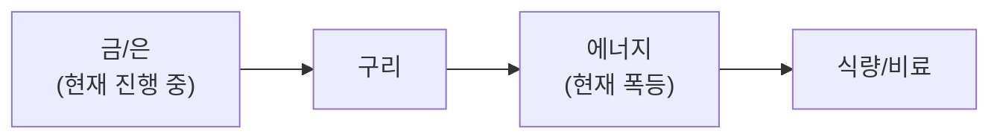

**3월 16일, GTC 2026 오늘 개막 — Vera Rubin 1GW + NemoClaw + N1X ARM + 방산 4배 증산.** Jensen Huang 키노트 오늘(3/16) 오전 11시(PT). NVIDIA-Thinking Machines Lab **1GW+ Vera Rubin 시스템** 다년 파트너십 발표. **NemoClaw** AI 에이전트 플랫폼 공개. ARM 기반 **N1/N1X 노트북 CPU** 출시. Vera Ultra(2027 H2), **Feynman GPU(2028)** 로드맵 공개.

**호르무즈 봉쇄 지속 — Brent $100+ 고착.** 전쟁(2/28 시작) 이후 **호르무즈 일일 통행 5척 vs 전쟁 전 138척**. IEA: **8M bbl/day 공급 차단**(역대 최대). Brent **$92~$120 레인지** — FRED API 지연으로 $94.65 표시되나, 실시간 $100+ 지속. IRGC: "석유 한 방울도 못 통과". **이란 $200 위협**. 트럼프 유가 대책 실패 중(CNBC).

**사모신용 $3.5T 위기 + 금융주 최악.** S&P 500 Financials **연초 -11%** — 2020년 이후 최악 분기 실적. Blue Owl $1.6B 영구 동결, BlackRock $26B 5% 제한, Blackstone BCRED 7.9% 환매. AI가 SaaS 담보 파괴(JP모건 80%→50%). 위장 대출 **$14조+**(Bloomberg).

**KOSPI 5,528 반등 + 비트코인 $72.6K 회복.** KOSPI **5,528(+0.75%)** 반등. EWY 1W -7.27%이나 3M +33.68% 글로벌 최강 유지. Goldman 연말 **KOSPI 7,000** 목표(기존 6,400에서 상향). **비트코인 $72,632(+2.0%)** 반등 — Druckenmiller 달러 회의론이 BTC 수요 지지.

**방산 4배 증산 + 유럽 방산 붐.** 미국 6대 방산사(RTX, Lockheed, Boeing, Northrop, BAE, L3Harris) **무기 4배 증산** 백악관 서약. ITA +14% YTD. Rheinmetall **매출 40-45% 성장 전망**. Leonardo **수익 2030년까지 2배** 목표. EU ReArm **8,000억유로**.

**자율주행 변곡점.** Waymo **20개 도시·주 100만회 라이드** 2026년 목표. CES 2026에서 **모빌리티 중심이 EV→자율주행으로 전환** 확인. 사이버캡 4월 양산. 옵티머스 여름 양산 확정.

## 6대 투자 섹터 구조

| 섹터 | 하위 섹터 | 상세 분석 |
|------|----------|----------|
| **1. 반도체/AI** | HBM, DRAM/NAND, 파운드리, 소부장, AI SW/클라우드 | [반도체 섹터](/knowledge/invest/2026/01/21/semiconductor-sector-outlook-2026.html) |
| **2. 에너지** | 원전/SMR, 재생에너지, ESS, 수소 | [에너지 섹터](/knowledge/invest/2026/03/07/energy-sector-outlook-2026.html) |
| **3. 방산/우주** | 방산, 드론/UAM, 우주/위성 | [방산/우주 섹터](/knowledge/invest/2026/03/07/defense-space-sector-outlook-2026.html) |
| **4. 모빌리티/로봇** | EV/자율주행, 로봇, 조선 | [모빌리티/로봇 섹터](/knowledge/invest/2026/01/21/automotive-robotics-sector-outlook-2026.html) |
| **5. 바이오/헬스케어** | 신약/바이오텍, GLP-1/비만치료, 의료AI | [바이오/헬스케어 섹터](#바이오헬스케어-및-생명공학) |
| **6. 자산/거시경제** | 금/은, 암호화폐, 원자재/희토류, 거시경제/정책 | [거시경제/정책 섹터](/knowledge/invest/2026/01/21/macroeconomic-policy-sector-outlook-2026.html) |

### 하위 섹터 상세 링크

**반도체/AI**
- [HBM 투자 전망](/knowledge/invest/2026/01/21/hbm-sector-outlook-2026.html)
- [DRAM/NAND 투자 전망](/knowledge/invest/2026/01/21/dram-nand-sector-outlook-2026.html)
- [파운드리 투자 전망](/knowledge/invest/2026/01/21/foundry-sector-outlook-2026.html)
- [소부장 투자 전망](/knowledge/invest/2026/01/21/semiconductor-materials-equipment-outlook-2026.html)
- [AI 소프트웨어/클라우드](/knowledge/invest/2026/03/07/ai-software-cloud-outlook-2026.html)

**에너지**
- [원전 투자 전망](/knowledge/invest/2026/01/21/nuclear-power-sector-outlook-2026.html)

**방산/우주**
- [방산 투자 전망](/knowledge/invest/2026/01/21/defense-sector-outlook-2026.html)

**모빌리티/로봇**
- [EV/자율주행 투자 전망](/knowledge/invest/2026/01/21/ev-autonomous-driving-outlook-2026.html)
- [로봇 투자 전망](/knowledge/invest/2026/01/21/robotics-sector-outlook-2026.html)
- [조선 투자 전망](/knowledge/invest/2026/01/21/shipbuilding-sector-outlook-2026.html)

**자산/거시경제**
- [원자재/희토류](/knowledge/invest/2026/03/07/commodities-rare-earth-outlook-2026.html)

---

## 미래 워치리스트

| 테마 | 현황 | 주시 포인트 |
|------|------|-----------|
| **양자컴퓨팅** | Google Willow, IBM Heron 등 진전. 상용화 초기 | 오류 정정(QEC) 돌파, 금융/제약 응용 |
| **합성생물학** | AI+유전체 편집 융합 가속 | 바이오 제조, 식량/에너지 응용 |
| **BCI (뇌-컴퓨터 인터페이스)** | Neuralink 임상시험, 경쟁사 등장 | FDA 승인, 의료 응용 확대 |
| **핵융합** | Commonwealth Fusion, TAE 등 민간 투자 확대 | 상용 발전 시점(2030년대 중반 전망) |

---

## 목차

1. [거시적 시장 환경](#거시적-시장-환경)
2. [AI 및 클라우드 컴퓨팅](#ai-및-클라우드-컴퓨팅)
3. [AI 네트워크 인프라](#ai-네트워크-인프라)
4. [반도체 및 첨단 제조](#반도체-및-첨단-제조)
5. [로보틱스 및 자율주행](#로보틱스-및-자율주행)
6. [에너지 전환 및 친환경](#에너지-전환-및-친환경)
7. [바이오헬스케어 및 생명공학](#바이오헬스케어-및-생명공학)
8. [우주산업 및 뉴스페이스](#우주산업-및-뉴스페이스)
9. [방위산업 및 국방기술](#방위산업-및-국방기술)
10. [핀테크, 암호화폐 및 STO](#핀테크-암호화폐-및-sto)
11. [사이버보안 및 데이터 인프라](#사이버보안-및-데이터-인프라)
12. [지정학적 관점: 한국은 1980년대 일본](#지정학적-관점-한국은-1980년대-일본)
13. [초거대 기업들의 전략과 투자 방향](#초거대-기업들의-전략과-투자-방향)
14. [한국 시장 구조 변화](#한국-시장-구조-변화)
15. [섹터별 투자 전략: 3월 실전 가이드](#섹터별-투자-전략-3월-실전-가이드)

---

## 거시적 시장 환경

### 글로벌 증시 현황 (3/16 기준)

| 지수 | 수준 | 변동 | 비고 |
|------|------|----------|------|
| **S&P 500 (SPY)** | **662.29** | **-0.57%** | **3주 연속 하락, 에너지만 양** |
| **NASDAQ** | **22,105** | **-0.93%** | **기술 -0.00%, GTC 오늘 개막** |
| **KOSPI** | **5,528** | **+0.75%** | **반등, Goldman 연말 7,000 상향** |
| **상해종합** | **4,095** | **-0.82%** | 약세 전환 |
| **항셍** | **25,466** | **-0.98%** | 조정 지속 |
| **원/달러** | **~1,483원** | | **2009년 이후 약세, 1,500원 심리선** |
| **Brent** | **$100+** | | **★ 호르무즈 봉쇄 지속. $92~120 레인지** |
| **WTI** | **$94.65** | **+4.27%** | **FRED 지연. 실시간 $100+** |
| **금(Gold)** | **$5,032/oz** | **-0.41%** | **차익실현. 3M +17%, Goldman $5,400** |
| **은(Silver)** | 강세 유지 | **$100 전망 지속** | 6년 연속 공급적자 |
| **비트코인** | **$72,633** | **+2.0%** | **★ 반등. Druckenmiller 달러 회의론** |
| **VIX** | **27.29** | **+12.6%** | **★ 공포 지속, 사모신용 $3.5T** |
| **TLT** | **86.54** | **-0.49%** | 10Y 4.27%(+0.06), 금리 상승 지속 |
| **SOXX** | **331.32** | **+0.34%** | **반도체 보합, GTC 오늘** |
| **하이일드 스프레드** | **3.17%** | **+2.59%** | **사모신용 전이→신용 스프레드 확대** |
| **5Y Breakeven** | **2.61%** | **-0.76%** | **인플레 기대 하락** |
| **실업률** | **4.4%** | **+0.1%p** | **Fed 인하 1-2회 전망** |

### 이번 주 핵심 변화 (3/16 업데이트)

| 항목 | 변화 | 투자 시사점 |
|------|------|-----------|
| **★★★ GTC 오늘 개막** | **Vera Rubin 1GW 파트너십(Thinking Machines Lab). NemoClaw AI 에이전트. N1/N1X ARM CPU. Vera Ultra(2027H2), Feynman(2028)** | **반도체 최대 촉매 오늘. Huang 키노트 11AM PT** |
| **★★★ 호르무즈 봉쇄 지속** | **일일 통행 5척 vs 전쟁 전 138척. 8M bbl/day 차단. 이란 $200 위협. 트럼프 대책 실패** | **유가 $100+ 고착. 에너지·방산·금 수혜 지속** |
| **★★★ 방산 4배 증산** | **6대 미국 방산사 백악관에서 무기 4배 증산 서약. Rheinmetall +40-45% 매출 성장** | **방산 = 2026 최강 섹터 확정. ITA +14% YTD** |
| **★★ 사모신용→금융주 최악** | **S&P 500 Financials 연초 -11%. 2020 이후 최악 분기. 4대 운용사 동시 위기** | **금융 섹터 회피. 현금·금 유지** |
| **★★ KOSPI 5,528 반등** | **+0.75%. Goldman 연말 7,000 상향(기존 6,400). EWY 3M +33.68% 글로벌 최강** | **한국 구조적 상승 유효. 반도체·방산 주도** |
| **★★ BTC $72.6K 반등** | **+2.0%. Druckenmiller 달러 50년 내 기축통화 상실 전망→BTC 수요 지지** | **디지털 자산 수요 구조적** |
| **★★ 자율주행 변곡점** | **Waymo 20도시·주100만회 목표. CES 2026 모빌리티 트렌드 EV→자율주행 전환** | **자율주행 상용화 가시화** |
| **★ 금 $5,032** | **-0.41% 차익실현 속 3M +17%. Goldman $5,400** | **단기 조정이나 안전자산 수요 구조적** |
| **★ 반도체 $975B** | **SIA 2026년 $975B(+25%). HBM4 양산 시작. SK하이닉스 70% 점유** | **기가사이클 가속, 메모리 +30%** |

### 핵심 매크로 변수 5가지

#### 1. 카르그섬 폭격 — Brent $103 + 호르무즈 중단 + 에스컬레이션 최고조

| 항목 | 내용 | 투자 시사점 |
|------|------|-----------|
| **★ 카르그섬 폭격** | **이란 원유 수출 90% 통과 카르그섬 군사시설 90곳 폭격. 에너지 시설은 미타격** | 에스컬레이션 최고조. 에너지 시설 타격 가능성 상존 |
| **★ Brent $103.14** | **+2.67%. 2일 연속 $100+. 호르무즈 해협 유조선 통행 사실상 중단(CNBC)** | 유가 $100+ 고착화 |
| **이란 보복 위협** | **걸프 인접국 에너지시설 타격 경고. "석유 한 방울도 통과 못 한다"** | 이란 보복→$130+ 시나리오 |
| **트럼프 호위** | **호르무즈에서 미 해군 유조선 호위 시작 예고. 한중일 등에 함선 파견 요구** | 군사적 긴장 장기화 |
| **켄 피셔 낙관론** | **전쟁 공포 이미 유가에 반영. 종전 시 전쟁 전보다 하락. 전쟁→약세장 사례 극히 드묾** | 중장기 투자자 공포매도 지양 |
| **한국 비축유** | **석유 비축량 7개월치 보유** | 단기 위기 가능성 낮음 |
| **IEA 공급 차단** | **8M bbl/day 차단 (3월 추산)** | 역대 최대 공급 충격 |
| **Brent 시나리오** | **1개월 봉쇄: $80, 3개월+: $160 돌파** | 블룸버그 분석 |

**핵심 판단:** 트럼프가 이란의 **카르그섬 군사시설 90곳을 폭격**하며 에스컬레이션 최고조. 에너지 시설은 의도적으로 미타격했으나, "호르무즈 방해 시 석유시설도 공격" 경고. Brent **$103.14(+2.67%)**로 2일 연속 $100+, 호르무즈 유조선 통행 사실상 중단. **그러나 켄 피셔는 전쟁 공포가 이미 유가에 반영**되어 있어 종전 시 오히려 하락할 것으로 전망. 한국은 석유 비축량 7개월치로 단기 위기 가능성 낮음. **에너지 비중 15% 유지, 중장기 투자자 공포매도 자제**.

#### 2. 사모신용 $3.5T 위기 — 2008년 대비 2.7배, AI가 담보 파괴

| 항목 | 내용 | 투자 시사점 |
|------|------|-----------|
| **Blue Owl** | **$1.6B OBDC II 영구 환매 동결. 기술 펀드(오틱) 15% 환매→주가 -40~50%** | 환매 도미노 시발점 |
| **BlackRock** | **$26B HLEND 펀드 5% 제한 (9.3% 요청). HPS 사기 $4B 전액 손실** | 세계 1위 운용사도 위기 |
| **Blackstone** | **$82B BCRED 7.9% 환매. 임직원 25명 사비 충당** | 자체 자금 투입 불가피 |
| **Morgan Stanley** | **노세이브 PE 10.9% 환매 요청, 5%만 지급** | 4대 대형 운용사 동시 위기 |
| **★ AI 담보 파괴** | **에이전틱 AI→SaaS 구독 매출 담보 급락. JP모건 소프트웨어 담보 80%→50%** | 구조적 원인 — 일시적이 아님 |
| **위장 대출** | **소프트웨어 대출이 식품·화학 등으로 분류 위장. 실제 노출 $14조+(Bloomberg)** | 실제 규모 파악 불가 |
| **규모 비교** | **2008 서브프라임 $1.3T vs 현재 사모신용 $3.5T (2.7배)** | 시스템 리스크 잠재적으로 2008 초과 |

**판단:** 사모신용 위기가 **4대 대형 운용사**(Blue Owl, BlackRock, Blackstone, Morgan Stanley)로 동시 확산. **핵심 원인은 AI(에이전틱 AI)가 SaaS 기업의 구독 매출 기반 담보 가치를 구조적으로 파괴**한 것. JP모건이 소프트웨어 담보 인정을 80%→50%로 하향하며 자금줄 차단. Bloomberg 보도에 따르면 소프트웨어 대출이 다른 업종으로 **위장**되어 있어 실제 노출이 **$14조 이상**일 가능성. 2008년 서브프라임($1.3T) 대비 **2.7배** 규모. **현금·금 비중 확대 + 금융주 경계** 필요.

#### 3. KOSPI 5,528 반등 + Goldman 7,000 상향 + 환율 1,483원

| 항목 | 내용 | 투자 시사점 |
|------|------|-----------|
| **KOSPI 3/16** | **5,528 (+0.75%)** | **반등. GTC 개막 촉매** |
| **Goldman 목표 상향** | **연말 7,000 (기존 6,400에서 상향)** | **삼성 +216%, SK +356% 12M** |
| **EWY 1W** | **-7.27%** | **주간 급락, 단기 모멘텀 약화** |
| **EWY 3M** | **+33.68%** | **3개월 기준 여전히 글로벌 최강** |
| **한국은행 리스크** | **긴급여신 체계 구축, 은행 74조원 인출** | 한국 금융 안정성 우려 |
| **3대 뇌관** | **PF 135조, 자영업 1,069조, 주담대 50조** | 금리 인상 시 동시 폭발 위험 |
| **환율** | **~1,483원** | **2009년 이후 약세이나 소폭 개선** |

**판단:** KOSPI **5,528(+0.75%)** 반등. Goldman Sachs가 연말 KOSPI 목표를 **6,400→7,000으로 상향** — 삼성전자 12M +216%, SK하이닉스 +356%의 반도체 랠리가 핵심 근거. EWY 3M +33.68%로 **글로벌 최강 수익률** 유지. GTC 오늘 개막이 반도체 대형주(삼성/SK) 추가 반등 촉매. WGBI 4월 편입($56B+)이 구조적 원화 강세 촉매. 환율 **~1,483원**으로 1,500원 심리선 하회 유지 중이나, 유가 $100+ 지속 시 재돌파 리스크 상존. **한국 시장 구조적 상승 유효, 반도체·방산 주도**.

#### 4. GTC 오늘 개막 + Vera Rubin 1GW + NemoClaw + 자율주행 변곡점

| 항목 | 내용 | 투자 시사점 |
|------|------|-----------|
| **★ GTC 오늘 개막** | **3/16~19 San Jose. Huang 키노트 오늘 11AM PT. 3만명 참석** | **반도체 최대 촉매 오늘** |
| **★ Vera Rubin 1GW** | **NVIDIA-Thinking Machines Lab 다년 파트너십. 1GW+ Vera Rubin 시스템** | **AI 인프라 대규모 계약** |
| **★ NemoClaw** | **NVIDIA AI 에이전트 플랫폼 공개. 기업용 에이전트 배포** | **에이전틱 AI 인프라 새 시장** |
| **★ N1/N1X ARM CPU** | **NVIDIA 노트북 CPU 출시. ARM 아키텍처 Windows** | **Qualcomm/Intel PC 시장 진입** |
| **Vera Ultra(2027H2)** | **Vera Rubin 후속 GPU. 2027 하반기** | 로드맵 가시화 |
| **Feynman(2028)** | **차세대 GPU 아키텍처 2028년** | 장기 성장 스토리 |
| **★ Waymo 20도시** | **2026년 20개 도시·주 100만 라이드 목표. CES 자율주행 전환** | **자율주행 상용화 본격화** |
| **CPO 변곡점** | **2026 양산 시작, 연간 137% 성장** | **AI 네트워크 핵심. Marvell -30%** |
| **HBM4 양산** | **SK하이닉스 70%(UBS). 삼성 생산 50% 확대. $54.6B(+58%)** | **메모리 슈퍼사이클** |
| **반도체 $975B** | **2026년 $975B(+25%). 메모리 +30%. $440B 메모리** | **기가사이클 가속** |

**핵심 판단:** GTC 2026이 **오늘 개막**. NVIDIA가 Thinking Machines Lab과 **1GW 이상의 Vera Rubin 시스템** 다년 파트너십을 발표하며 AI 인프라 투자의 규모를 재확인. **NemoClaw** AI 에이전트 플랫폼으로 에이전틱 AI 시장에 직접 진출, **N1/N1X ARM CPU**로 PC 시장까지 확장. HBM4 양산 본격화(SK하이닉스 70%), 반도체 시장 **$975B(+25%)**로 기가사이클 가속. **자율주행도 변곡점** — Waymo 20도시·주 100만 라이드 목표, CES에서 모빌리티 트렌드가 EV→자율주행으로 전환 확인. **GTC 촉매로 반도체 비중 20% 유지, 로봇/자율주행 5%→6% 상향**.

#### 5. Fed 듀얼 맨데이트 갈등 + Druckenmiller 달러 비관 + FOMC 내일

| 항목 | 현황 | 변화 |
|------|------|------|
| **★ Fed 듀얼 맨데이트** | **Fed 내부 인플레 vs 고용 갈등 심화**(St. Louis Fed) | **유가 인플레 + 실업률 상승 = 딜레마** |
| **★ Fed 인하 전망** | **3월 동결 확실. 6-9월 1-2회 인하 가능**(Oxford Economics) | **Fed 중간값 1회 인하. iShares: 새 의장 후 추가 가능** |
| **★ Druckenmiller** | **달러 50년 내 기축통화 상실 전망. 미국 부채 $38T+** | **BTC·금 수요 구조적 강화** |
| **★ Dalio** | **미국 자산 의존도 리스크 경고. Bridgewater 외국인 자금 유출 우려** | **달러·미국채 장기 약세 관점** |
| 원/달러 환율 | **~1,483원** | **소폭 개선. 1,500원 심리선 하회** |
| DXY | **119.49** (Broad) | 달러 약보합 |
| **실업률** | **4.4% (+0.1%p)** | **NFP -92K, 노동시장 약화** |
| **VIX** | **27.29 (+12.6%)** | **★ 공포 지속** |
| **5Y Breakeven** | **2.61% (-0.76%)** | **인플레 기대 하락** |
| **10Y 금리** | **4.27% (+1.43%)** | 금리 상승 압력 |
| **사모신용 위기** | **4대 운용사 동시 위기, $3.5T** | **금융주 연초 -11%** |
| **RRP** | **$0.43B** | 역레포 거의 고갈→유동성 제약 |
| WGBI 편입 | **4월 시작, 8회 분할 편입** | $56B+ 유입 전망 |

**판단:** Fed가 **듀얼 맨데이트 갈등**(인플레 vs 고용) 심화. 유가 $100+가 인플레 압력이나, 실업률 4.4%·NFP -92K로 노동시장도 약화 중. 시장은 6월 또는 9월 **1-2회 인하**를 기대하나, Fed 중간값은 1회만. 5월 Powell 은퇴 후 **새 의장의 성향이 핵심 변수**. **Druckenmiller가 달러의 기축통화 지위를 50년 내 상실할 것으로 전망** — 미국 부채 $38T+, 이자 비용 급증이 근거. Dalio도 미국 자산 의존도 리스크 경고. **FOMC(3/17~18) 내일** — 동결 확실이나 유가 인플레·사모신용 리스크 논의가 핵심. WGBI 4월 편입은 구조적 원화 강세 촉매.

### 관세 현황 -- Section 122 15% 발효 중 (7/23 만료)

| 관세 | 세율 | 상태 | 비고 |
|------|------|------|------|
| **글로벌 보편관세** | **15%** | **발효 중** (2/24~) | **150일 한시** (7/23 만료) |
| **중국 관세** | **35~50%** | USTR 유지 | **트럼프-시진핑 정상회담 3월 말 변수** |
| **반도체** | 25%+ | **Section 232 유지** | 별도 법적 근거 |
| **자동차** | **25%** | **4/3 발효 예정** | **현대/기아 직접 타격** |
| **철강/알루미늄** | 25% | **Section 232 유지** | 3/12 발효 |

---

## AI 및 클라우드 컴퓨팅

### 현재 상황 (3월 16일 — GTC 오늘 개막)

빅테크의 2026년 AI CAPEX가 합산 **$6,500~7,000억(~$700B)**에 달하며, 전년 대비 **60% 이상** 급증. 오일 쇼크에도 불구하고 **AI 투자는 구조적**이어서 삭감 가능성 낮음. **GTC 2026(3/16~19) 오늘 개막** — Vera Rubin 1GW 파트너십, NemoClaw AI 에이전트, N1X ARM CPU 발표.

| 기업 | 2026 AI CAPEX | 핵심 이슈 |
|------|--------------|---------|
| **Amazon** | **$2,000억** | FCF 마이너스 전환 전망 |
| **Alphabet** | **$1,850억** | FCF 90% 감소 전망 |
| **Microsoft** | **$1,450억** | Azure AI 확대 |
| **Meta** | **$1,350억** | FCF 90% 감소 전망 |
| **합계** | **$6,500~7,000억** | 전년 대비 **+60% 이상** |

### 핵심 투자 포인트

| 영역 | 내용 | 전망 |
|------|------|------|
| **AI 칩셋** | 엔비디아 시총 ~$4.31조 | **★ GTC 오늘: Vera Rubin 1GW, NemoClaw, N1X, Feynman(2028)** |
| **커스텀 ASIC** | **Broadcom AI $8.4B(+74%)**, **Marvell $0→$1.5B** | 2026년 GPU 출하량 추월 전망 |
| **클라우드 인프라** | AWS, Azure, GCP | $7,000억 투자 직접 수혜 |
| **AI 응용** | CRM, 헬스케어, 금융 AI | 하드웨어 실적 파티 vs 소프트웨어 수익화 미완 |

### 3월 투자 전략

**단기**: **GTC 오늘 개막**. Vera Rubin 1GW 파트너십(Thinking Machines Lab), **NemoClaw** AI 에이전트 플랫폼, **N1/N1X ARM CPU**, Feynman(2028) 로드맵 공개. 에이전틱 AI + PC 시장 진출로 TAM 확대.

**중기**: 커스텀 ASIC(Broadcom AI $8.4B, Marvell $1.5B)이 새로운 성장 축. AI 수요는 유가와 무관하게 구조적.

**리스크**: ①AI 칩 수출통제 초안, ②스태그플레이션 → 데이터센터 전력비 상승(유가 $100), ③빅테크 FCF 급감.

### 주요 기업 및 ETF

**대표 기업:**
- 엔비디아 (NVDA): 시총 ~$4.31조. **GTC 3/16~19: Vera Rubin + Feynman + NVL144 + CPO + HBM4**
- **AMD (AMD)**: MI455X + Helios — Meta 6GW + OpenAI 6GW = **12GW 계약**
- **Broadcom (AVGO)**: AI 매출 **$8.4B(+74%)**, 커스텀 ASIC 리더
- **Marvell (MRVL)**: ASIC 매출 **$0→$1.5B**

**투자 ETF:**
- BOTZ (Global X Robotics & AI ETF)
- ROBO (ROBO Global Robotics & Automation Index ETF)

---

## AI 네트워크 인프라

### 핵심 테마: 데이터센터 ROI의 열쇠

$700B 규모의 AI 데이터센터 투자에서 **네트워크 인프라는 ROI를 결정짓는 핵심 요소**입니다.

### InfiniBand vs Ethernet 경쟁

| 기술 | 대표 기업 | 특징 |
|------|----------|------|
| **InfiniBand** | 엔비디아 (Mellanox) | 현재 AI 학습 표준, 저지연 |
| **Ethernet (AI용)** | Arista Networks, Broadcom | 범용성 우수, 비용 효율적 |

### ★ CPO(Co-Packaged Optics) — 2026년 월가 TOP1 테마

**구리선의 물리적 한계**: 224G SerDes 환경에서 구리 전송 거리가 **50cm까지 축소**. 스킨 이펙트로 열과 전력 소모 급증. **CPO가 유일한 대안** — 광통신 모듈을 칩 패키지에 통합하여 전기→광 신호 변환.

| 항목 | 내용 |
|------|------|
| **시장 성장** | **2026년 양산 시작, 연간 137% 성장** |
| **NVIDIA** | Spectrum-X Photonics (Ethernet CPO) **H2 2026 출시**, Quantum-X IB 115Tb/s |
| **Marvell** | 광통신 포토닉 패브릭스, AEC, DSP, 커스텀 칩. **고점 대비 -30% 저평가** |
| **Credo** | AEC 리타이머, CPO 핵심 부품 |
| **Corning** | 광섬유 소재 공급 |

### 대역폭 에스컬레이션

```
현재: 400G
진행중: 800G
2026-2027: 1.6T (CPO 양산 시작)
2028+: 3.2T
```

각 세대 전환마다 **광트랜시버, 스위치, 광케이블** 수요가 2배씩 증가. **CPO가 1.6T 이상에서 필수 기술**.

### 핵심 투자 기업

| 기업 | 분야 | 핵심 강점 |
|------|------|----------|
| **Arista Networks** | 데이터센터 스위칭 | AI 데이터센터 네트워킹 1위 |
| **Coherent** | 광트랜시버 | 시장 점유율 1위, 800G/1.6T 리더 |
| **Lumentum** | 광학 부품 | 레이저, 광부품 핵심 공급 |
| **Broadcom** | 네트워크 칩 + ASIC | AI 네트워크 + 커스텀 ASIC, **AI $8.4B(+74%)** |

---

## 반도체 및 첨단 제조

### 핵심 이벤트: GTC 오늘 개막 + $975B 기가사이클 + HBM4 양산

**GTC 2026 오늘 개막(3/16~19).** Vera Rubin 1GW 파트너십, NemoClaw AI 에이전트, N1X ARM CPU 발표. 반도체 시장 **$975B(+25%)**, 메모리 **$440B(+30%)**로 기가사이클 가속.

| 항목 | 내용 | 투자 시사점 |
|------|------|-----------|
| **★ GTC 오늘 개막** | **Vera Rubin 1GW, NemoClaw, N1X, Feynman(2028)** | **반도체 최대 촉매 오늘** |
| **★ CPO 양산 시작** | 2026년 변곡점, 연간 137% 성장 | AI 네트워크 새 투자 테마 |
| **반도체 $975B** | **2026년 $975B(+25%). 메모리 $440B(+30%)** | 기가사이클 가속 |
| **HBM4: SK하이닉스 70%** | HBM4 양산 개시, 70% 점유(UBS). 삼성 50% 확대 | 압도적 1위 유지 |
| **DRAM Q1 +90~95%** | 역사적 기록, 스팟 > 계약 | 슈퍼사이클 가속 |
| **Broadcom AI $8.4B** | +74%, 커스텀 ASIC 리더 | GPU 출하량 추월 전망 |
| **NVDA $180** | $180. GTC 촉매로 반등 기대 | 분할 매수 기회 |

### 한국 메모리의 기가사이클

**SK하이닉스 HBM 시장 점유율 62%**로 압도적 1위. **삼성은 HBM4 PRA 완료**로 양산 본격화 임박.

핵심 포인트:
- **SK하이닉스**: HBM 62% 점유, 16단 48GB HBM4 공개
- **삼성 HBM4 PRA 완료**: 세계 최초 양산 출하, 대역폭 3.3TB/s
- **DRAM Q1 +90~95%**: 역사적 기록
- **SIA $1T**: 2026년 글로벌 매출 $1조 돌파 전망

### 3월 투자 전략

**핵심 전략: GTC 촉매 대기 + DRAM 슈퍼사이클 + 오일 쇼크 디커플링**

1. **삼성전자**: HBM4 PRA 완료 + MS 2027 OP 317조 + DRAM Q1 +95%. KOSPI 폭락으로 저가 매수 기회.
2. **SK하이닉스**: HBM 62% 점유율, PER 극저. DRAM Q2 추가 상승.
3. **엔비디아**: 시총 $4.31T. **GTC 3/16~19 핵심**. Vera Rubin + Feynman + NVL144.
4. **커스텀 ASIC**: Broadcom AI $8.4B(+74%), Marvell $1.5B.
5. **소부장**: 한미반도체(영업이익률 50%, TC 본더 71.2%), HPSP(55%), 리노공업(48%).

### 주요 기업

| 카테고리 | 주요 기업 | 현황 |
|----------|----------|------|
| **AI 칩** | 엔비디아, AMD | GTC 3/16~19, SOXX +3.98% |
| **파운드리** | TSMC, 삼성전자 | TSMC N2 램프 |
| **메모리** | 삼성전자, SK하이닉스 | SK 62% HBM, DRAM Q1 +95% |
| **커스텀 ASIC** | Broadcom, Marvell | Broadcom AI $8.4B(+74%) |
| **소부장** | 한미반도체, HPSP, 리노공업 | 고수익성 지속 |
| **장비** | ASML, 램리서치 | ASML 분기 주문 EUR132억 기록 |

**ETF:**
- SMH (VanEck Semiconductor ETF)
- SOXX (iShares Semiconductor ETF) — **+3.98% (오일 쇼크 속 반등)**

---

## 로보틱스 및 자율주행

### 현재 상황: 자율주행 변곡점 + 옵티머스 여름 양산 + 사이버캡 4월

| 항목 | 내용 | 시사점 |
|------|------|--------|
| **★★ Waymo 20도시·주100만회** | **2026년 20개 도시 확장. 주 100만 라이드 목표** | 자율주행 상용화 본격화 |
| **★★ CES 자율주행 전환** | **CES 2026 모빌리티 트렌드: EV→자율주행으로 전환** | 산업 변곡점 확인 |
| **★ 옵티머스 3 여름 양산** | **2026년 여름 초기 생산 확정**(머스크 공식 발표). 2027년 여름 대량 생산 | 타임라인 구체화 |
| **★ 기가텍사스 로봇 공장** | **900만 sq ft(25만평) 전용 공장**. 기존 공장 합산 57만평 = 여의도 66% | 대규모 투자 확인 |
| **양산 목표** | 프리몬트 연간 100만 대, **기가텍사스 연간 1,000만 대** | <$20K, 소프트웨어 구독 $200/월 |
| **★ 사이버캡 4월 양산** | **4월부터 주당 수백 대 양산**. $30K 미만. 완전자율주행 전용 | 로보택시 상용화 가속 |
| **AV 시장 $39.3B** | **2026년 글로벌 AV 시장 $39.3B. 4.3만 대** | 급성장 초입 |
| **Zoox+Uber** | **Zoox, Uber 자율주행 라이드 서비스 2026년 출시** | 경쟁 가속 |
| **★ X머니 4월 출시** | **비자 제휴, 메탈 카드, 탭투페이**. FSD/로보택시/에너지 결제 통합 | 테슬라 생태계 수익화 |
| **중국 로봇 90% 점유** | 중국 기업들이 글로벌 판매량 90%+ 장악 | 경쟁 리스크 주의 |
| **자동차 관세 25%** | 4/3 발효 예정 | 현대/기아 직접 타격 |

### 한국 로봇 섹터

- 두산로보틱스: 협동 로봇 리더
- 레인보우로보틱스: 휴머노이드 로봇 개발
- 현대차/보스턴다이나믹스: 기업가치 ~55조원
- **주의**: 중국 휴머노이드 로봇 **87-90%** 점유 — 경쟁 리스크 최대

**ETF:**
- BOTZ (Global X Robotics & AI ETF)
- ROBO (ROBO Global Robotics & Automation Index ETF)

---

## 에너지 전환 및 친환경

### 카르그섬 폭격 + Brent $103 + 원전 르네상스

| 항목 | 내용 |
|------|------|
| **★ 카르그섬 폭격** | **이란 원유 수출 90% 통과 카르그섬 군사시설 90곳 폭격. 에너지 시설 미타격** |
| **★ Brent $103.14** | **2일 연속 $100+. 호르무즈 유조선 통행 사실상 중단** |
| **이란 보복 위협** | **걸프 인접국 에너지시설 보복 공격 경고** |
| **IEA 비축유** | **사상 최대 4억 배럴 방출 결정에도 유가 억제 실패** |
| **블룸버그 시나리오** | **1개월 봉쇄: $80, 3개월+: $160 돌파** |
| **미국 원전 $80B** | 신규 원전 펀딩, AI 데이터센터 전력 5x 성장 |
| **i-SMR 규제심사** | 한국 SMR 규제 프로세스 본격 시작 |
| **NuScale+TVA** | **6GW SMR 배치 협약** |

### 에너지 시나리오 (3/15 기준)

| 시나리오 | 유가 전망 | 확률 | 영향 |
|---------|----------|------|------|
| **★ 휴전 협상 타결** | **$65~75** | **중-저 (35%)** | **유가 급락, 아시아 반등, 에너지주 조정** |
| **현상 유지 (부분 봉쇄)** | **$95~110** | **중 (35%)** | **현재 Brent $103 수준 지속** |
| **봉쇄 장기화 + 보복 확대** | **$130~160** | **중 (30%)** | **이란 걸프 에너지시설 보복 시. 스태그플레이션** |
| 이란 체제 전환 성공 | $55~65 | 극저 | 유가 하락, 리스크 프리미엄 완전 해소 |

**시나리오 변화:** 카르그섬 폭격으로 에스컬레이션 최고조. 이란이 걸프 인접국 에너지시설 보복을 위협하며 **봉쇄 장기화+보복 확대 확률 25%→30% 상향**. 휴전 확률 40%→35% 하향. 켄 피셔는 전쟁 공포가 이미 반영되어 **종전 시 유가가 전쟁 전보다 하락**할 것으로 전망.

### 핵심 하위 섹터

#### 원전 (Nuclear Renaissance) -- 에너지 안보 + AI 전력 수요

AI 데이터센터 전력 수요 + 이란 전쟁 에너지 안보 + 탈탄소 정책 삼중 호재.

| 항목 | 내용 | 투자 시사점 |
|------|------|-----------|
| **우라늄** | +32% YoY | 구조적 공급 부족 |
| **i-SMR 규제심사 착수** | 한국 SMR 규제 프로세스 시작 | 상용화 가시화 |
| **미국 $80B 신규 원전** | NuScale SMR 규제 승인 | 원전 르네상스 가속 |
| **KHNP 태국·필리핀** | 원전 수출 파이프라인 확대 | K-원전 해외 수주 |

#### 배터리/청정에너지 -- 오일 쇼크 대안 수요

**ICLN +3.04%, LIT +3.57%** — 오일 쇼크가 청정에너지/배터리로의 전환 수요를 가속. 에너지 위기가 장기화될수록 재생에너지·ESS 투자 강화.

### 투자 ETF

- ICLN (iShares Global Clean Energy) — **+3.04%**
- LIT (Global X Lithium & Battery Tech) — **+3.57%**
- URA (Global X Uranium ETF)

---

## 바이오헬스케어 및 생명공학

### 스태그플레이션 방어 + GLP-1 경쟁 구도 변화

오일 쇼크 + 스태그플레이션 환경에서 **방어적 헬스케어 매력도 상승**.

### 핵심 투자 포인트

#### GLP-1 비만 치료제

| 기업 | 현황 | 전망 |
|------|------|------|
| **Eli Lilly (LLY)** | GLP-1 시장 지배, EPS $35 전망(2026) | Mounjaro/Zepbound 선도 |
| **Novo Nordisk (NVO)** | 1년간 56% 하락, 경쟁 심화 | 저평가, $70 목표가 |
| **Viking Therapeutics** | 2상 결과 13주 14.7% 체중 감량 | 신규 경쟁자 |

#### AI 신약 개발

- 엑셀런시아, 리커전: AI 기반 약물 발견
- 빅테크 진출: 구글 DeepMind, 아마존 헬스케어

### 투자 ETF

- XBI (SPDR S&P Biotech ETF)
- IBB (iShares Biotechnology ETF)
- ARKG (ARK Genomic Revolution ETF)

---

## 우주산업 및 뉴스페이스

### 현재 상황: 방산 급등과 함께 우주 관련 수혜

| 기업/영역 | 내용 | 전망 |
|----------|------|------|
| SpaceX-xAI 합병 | 역삼각합병 추진 중 | 우주+AI 시너지 |
| 한화에어로스페이스 | K-방산/우주 대표주 | 수주잔고 100조+ |
| 로켓랩 (RKLB) | 소형 위성 발사 전문 | 트럼프 국방부 관심 |

### 트럼프 국방 정책과 우주

트럼프 행정부의 **FY2027 국방비 $1.5조 제안**에서 우주가 최우선 분야.

**투자 ETF:**
- UFO (Procure Space ETF)
- ARKX (ARK Space Exploration ETF)

---

## 방위산업 및 국방기술

### 현재 상황: 방산 4배 증산 + $1.01T 예산 + CAPEX +38% + ITA +14% YTD + 유럽 붐

방산이 2026년 최대 수혜 섹터. **6대 미국 방산사 무기 4배 증산 서약**(백악관). ITA **+14% YTD**. Rheinmetall **매출 40-45% 성장**, Leonardo **수익 2030년까지 2배** 목표. 글로벌 방산 CAPEX **+38% 증가 전망**.

| 항목 | 내용 | 시사점 |
|------|------|--------|
| **★★ 방산 4배 증산** | **RTX, Lockheed, Boeing, Northrop, BAE, L3Harris 백악관에서 4배 증산 서약** | **이란전 재고 보충 + 장기 수요 폭증** |
| **★ ITA +14% YTD** | **미국 방산 ETF 압도적 성과** | 방산 = 2026년 최강 섹터 |
| **★ Rheinmetall +40-45%** | **2026년 매출 40-45% 성장 전망. 사상 최대 수주잔고** | 유럽 방산 붐 대표주 |
| **★ Leonardo 수익 2배** | **이탈리아 방산, 2030년까지 수익 2배 목표** | EU 방산 투자 수혜 |
| **방산 CAPEX +38%** | 글로벌 방산 투자 38% 증가 전망 | 장기 성장 사이클 |
| **청궁-II 실전 검증** | UAE에서 명중률 90% — 실전 실증 | K-방산 신뢰도 구조적 상향 |
| **EU ReArm 8,000억유로** | EU 정상 합의 (~1,250조원) | K-방산 유럽 수출 대폭 확대 |
| **NATO 방위비 GDP 5%** | 2035년까지 목표 상향 (기존 2%) | 글로벌 방산 장기 수요 |
| **AeroVironment** | **드론(이란전 실전 검증) + 우주 + 자율수중차. BlueHalo 인수** | 중소형 방산 유망주 |

### 조선 -- 호르무즈 봉쇄 + LNG 용선율 $200K+ + 슈퍼사이클

| 항목 | 내용 |
|------|------|
| **HD현대 LNG 4척 ₩1.49T** | LNG 용선율 $200K+ (기존 대비 2배) |
| **호르무즈 봉쇄** | 선박 통행 불가, 해군함·호위함 수요 급증 |
| **3대 조선사 수주 목표** | $464억(+30%) |
| **LNG선 전망** | 2026년 글로벌 115척 발주 전망 (+24%) |

### 주요 기업

**주요 기업:** 한화에어로스페이스 (수주잔고 100조+, 청궁-II 실전 검증), 한화오션 (캐나다 잠수함 48조), HD현대중공업 (LNG 4척 ₩1.49T), LIG넥스원 (사우디 L-SAM), HD한국조선해양 (수주 35조)

**투자 ETF:**
- ITA (iShares U.S. Aerospace & Defense ETF) — **+14% YTD**
- XAR (SPDR S&P Aerospace & Defense ETF)
- SHLD (Global X Defense Tech ETF)

---

## 핀테크, 암호화폐 및 STO

### STO 법안 국회 통과 -- 2026년 상반기 토큰증권 원년

| 항목 | 내용 |
|------|------|
| **법안 통과** | **2026.1.15 국회 통과** |
| **시행** | 2027년 1월 시행 |
| **시장 전망** | 2026년 상반기 STO 시장 원년 |
| **2030년 시장 규모** | 약 **367조원** |

### 자산 현황: 금·은·비트코인

| 자산 | 현재 | 전망 | 포지션 |
|------|------|------|--------|
| **금(Gold)** | **$5,032/oz** (-0.41%) | **Goldman $5,400**, 3M +17%, Druckenmiller 달러 비관→안전자산 | **적극 매수** |
| **은(Silver)** | 강세 유지 | $100 전망, 6년 연속 공급적자 | **분할 매수** |
| **비트코인** | **$72,633** (+2.0%) | **★ 반등. Druckenmiller 달러 50년 기축상실 전망→BTC 수요** | **소규모 유지** |

**금 판단:** $5,032로 차익실현 조정 속에서도 **3M +17%** 강세. Goldman $5,400 타겟 유지. **사모신용 $3.5T + 호르무즈 봉쇄 + Druckenmiller 달러 기축통화 상실 전망**이 안전자산 수요를 구조적으로 강화. **비중 12% 유지**.

**비트코인 판단:** $72,633(+2.0%)로 **반등**. Druckenmiller의 "달러 50년 내 기축통화 지위 상실" 전망이 BTC 수요를 구조적으로 지지. 미국 부채 $38T+ 급증 + 이자 비용 증가가 달러 신뢰 약화 요인. 전통 금융 시스템 불안(사모신용 $3.5T)도 탈중앙화 자산 매력 강화. 다만 VIX 27 환경에서 레버리지 절대 금지, 소규모 유지.

**ETF:**
- BITO (ProShares Bitcoin Strategy ETF)
- BLOK (Amplify Transformational Data Sharing ETF)

---

## 사이버보안 및 데이터 인프라

### 현재 상황

이란 전쟁 9일차로 **이란발 사이버 보복 공격 가능성 지속**. AI 칩 수출통제로 보안 인프라 수요도 구조적 증가. 팔란티어는 피터 틸이 일본 다카이치 총리와 회담하며 **미일 방산 AI 소프트웨어 협업** 기대감.

### 핵심 기업

| 분야 | 기업 | 강점 |
|------|------|------|
| 네트워크 보안 | 팔로알토, 포티넷 | 차세대 방화벽 |
| 클라우드 보안 | 크라우드스트라이크, 제트스케일러 | EDR, 제로 트러스트 |
| AI 보안 | 팔란티어 | 전장 AI, 데이터 분석 |

### 투자 ETF

- CIBR (First Trust NASDAQ Cybersecurity ETF)
- HACK (ETFMG Prime Cyber Security ETF)

---

## 지정학적 관점: 한국은 1980년대 일본

### 핵심 프레임: 미중 경쟁 수혜 + 이란 전쟁 방산 수혜 + 에너지 의존 취약성

미-중 기술 패권 경쟁에서 한국이 **미국의 핵심 동맹 공급국**으로서 구조적 수혜. 이란 전쟁 + 청궁-II 실전 검증으로 K-방산 신뢰도 구조적 상향. 그러나 **에너지 자급률 19%로 오일 쇼크에 가장 취약한 선진국 중 하나**.

### 한국의 글로벌 핵심 공급 분야

| 분야 | 한국 위상 | 핵심 기업 |
|------|----------|----------|
| **HBM** | 글로벌 양강, SK하이닉스 62% | SK하이닉스, 삼성전자 |
| **전력/변압기** | 핵심 공급국 | 현대일렉트릭, LS산전 |
| **조선** | 글로벌 1위, LNG $200K+ 용선율 | HD한국조선해양, 삼성중공업 |
| **K-배터리** | 글로벌 3강 | LG에너지솔루션, 삼성SDI |
| **K-방산** | 수주잔고 100조+, 청궁-II 실전 검증 | 한화에어로스페이스, LIG넥스원 |
| **로보틱스** | 로봇밀도 세계 1위 | 두산로보틱스, 현대로보틱스 |

### 미국 전략적 수혜 섹터

| 우선순위 | 섹터 | 정책 |
|---------|------|------|
| 1순위 | **에너지** | 에너지 독립(자급률 105%), S&P 500 견조 |
| 1순위 | **방산/우주** | ITA +14% YTD, CAPEX +38%, 이란 전쟁 |
| 2순위 | **반도체** | SIA $1T, SOXX +3.98%, GTC 3/16 |
| 2순위 | **AI** | $700B CAPEX |
| 3순위 | **암호화폐** | Clarity Act 법제화 추진 |

---

## 초거대 기업들의 전략과 투자 방향

### $700B AI 투자의 흐름: 공급망 수혜 지도

```
AI 칩 → 엔비디아($4.31조, GTC 3/16~19), AMD, TSMC
커스텀 ASIC → Broadcom(AI $8.4B, +74%), Marvell($0→$1.5B)
데이터센터 네트워크 → Arista, Coherent, Lumentum
서버/메모리 → SK하이닉스(HBM 62%), 삼성전자(HBM4 PRA 완료)
냉각 시스템 → LG전자(공조), SK이노베이션(액침 냉각)
전력 인프라 → 원전(i-SMR), 우라늄
```

### 테슬라의 전략적 피벗 -- 옵티머스 여름 양산 + 사이버캡 + X머니

| 전략 | 내용 | 의미 |
|------|------|------|
| **★ Optimus 3 여름 양산** | **2026년 여름 초기 생산 확정**. 기가텍사스 900만 sq ft | 자동차→노동력 기업 전환 |
| **★ 사이버캡 4월 양산** | **주당 수백 대. $30K 미만. 완전자율주행** | 로보택시 $3.25/trip |
| **★ X머니 4월 출시** | **비자 제휴, 메탈 카드, 탭투페이** | 테슬라 생태계 결제 통합 |
| **코텍스2 (500MW)** | 4월 절반 가동, 옵티머스 전용 훈련 | 피지컬AI 핵심 병목 해소 |
| **기가텍사스 확장** | 기존 32만평 + 로봇 25만평 = 57만평 (여의도 66%) | 프리몬트 100만대/연, 기가텍사스 1,000만대/연 목표 |

---

## 한국 시장 구조 변화

### KOSPI: 5,528 반등 — Goldman 7,000 상향

2/26 사상최고(6,307) → 3/4 -12.64%(사상 최대 폭락) → 3/11 +8.28% 대반등 → **3/16 5,528(+0.75%)** 반등. Goldman 연말 목표 **6,400→7,000 상향**.

| 항목 | 3/4 | 3/5 | 3/10 | 3/11 | 3/12 | 3/13 | 3/16 |
|------|------|------|------|------|------|------|------|
| **KOSPI** | -12.64% | +9.63% | -5.96% | +8.28% | -0.48% | -1.72% | **+0.75% (5,528)** |
| **핵심** | 서킷브레이커 | 반등 | 추가 하락 | 대반등 | 보합 | 급락 | **GTC 개막 반등** |

### 반도체·방산 주도 대반등

| 종목 | 등락률 | 핵심 촉매 |
|------|--------|----------|
| **SK하이닉스** | **+12.2%** | HBM 62% 점유, HBM4 가속 |
| **삼성전자** | **+8.3%** | HBM4 NVIDIA 양산, DRAM Q1+95% |
| **SK스퀘어** | **+8.8%** | SK하이닉스 지분 수혜 |
| **두산에너빌리티** | **+6.6%** | i-SMR 규제심사, 원전 수요 |
| **현대차** | **+3.6%** | 유가 하락=에너지 비용 완화 |

### ★ 한국 자산시장 대전환 — 부동산·예금 → 주식

| 항목 | 내용 | 투자 시사점 |
|------|------|-----------|
| **대통령 ETF 매수 선언** | 분당 아파트 매각, ETF 매수 | 정부 차원의 주식 투자 장려 |
| **상법 개정** | 배당소득 분리과세, 자사주 의무소각 | 자본시장 친화 정책 |
| **국민성장펀드 150조** | 민간 75조 + 정부 75조 | 코스닥 15조 유입 |
| **고객예탁금 130조** | 사상 최고 | 투자 대기 자금 극대화 |
| **MSCI 선진지수** | 환율시장 개방 추진 | WGBI 4월 편입과 시너지 |

### 배당 ETF: 고변동성 시기 방어

| ETF | 특징 | 수익률 |
|-----|------|--------|
| **PLUS 고배당주 위클리 커버드콜** | 주간 콜옵션 매도 | 분배율 **20.55%** |
| **KODEX 코리아 밸류업 토탈리턴** | 밸류업 + 토탈리턴 | **101.87%** |
| KODEX 200 타겟위클리 커버드콜 | 주간 콜옵션 매도 | 연 **17%** 배당 |

---

## 섹터별 투자 전략: 3월 실전 가이드

### 핵심 전략: "GTC 오늘 개막 + 호르무즈 봉쇄 + 방산 4배 증산 + FOMC 내일"

3월 16일 기준 핵심 전략:

1. **GTC 오늘 개막**: Vera Rubin 1GW 파트너십, NemoClaw, N1X ARM CPU. **반도체 비중 20% 유지**
2. **호르무즈 봉쇄 지속**: 일일 5척(vs 138척), 8M bbl/day 차단. $100+ 고착. **에너지 비중 15% 유지**
3. **방산 4배 증산**: 6대 방산사 백악관 서약. Rheinmetall +40-45%. ITA +14% YTD. **방산 24% 유지**
4. **사모신용→금융 최악**: S&P Financials 연초 -11%. $3.5T 위기 지속. **금 비중 12% 유지**
5. **자율주행 변곡점**: Waymo 20도시, CES EV→자율주행 전환. 사이버캡 4월. **로봇/자율주행 5%→6% 상향**
6. **Fed 듀얼 맨데이트 갈등**: 인플레 vs 고용. FOMC 내일(3/17~18). **현금 비중 17%로 1%p 축소**
7. **Druckenmiller 달러 비관**: 50년 내 기축통화 상실 전망. BTC $72.6K 반등 지지
8. **이번 주 핵심**: **GTC(오늘~19)**, **FOMC(내일~18)**, S&P 리밸런싱(3/23), 트럼프-시진핑(3월 말)

### 상품 사이클 순서 (commodity cycle)



현재 금/은 → 에너지가 **동시에 급등** 중. 식량/비료가 다음 사이클 후보.

### 자산 상관관계 (3/16 기준)

| 자산 | 방향 | 최신 수준 | 근거 |
|------|------|---------|------|
| **★ 유가(Oil)** | **$100+ 고착** | Brent $100+, WTI $94.65(지연) | 호르무즈 봉쇄 지속, 8M bbl/day 차단 |
| **★ 반도체** | **GTC 촉매** | NVDA $180, SOXX 331.32 | Vera Rubin 1GW, NemoClaw, $975B |
| **★ 방산주** | **★ 최강** | ITA +14% YTD | 4배 증산, Rheinmetall +40-45%, 구조적 수요 |
| **★ CPO** | **변곡점** | 2026 양산, 137% 성장 | Marvell -30% 저평가, GTC 오늘 촉매 |
| **금(Gold)** | **차익 조정** | $5,032 (-0.41%), 3M +17% | Goldman $5,400, Druckenmiller 달러 비관 |
| **은(Silver)** | **강세 유지** | $100 전망 | 6년 공급적자 |
| **KOSPI** | **반등** | **5,528 (+0.75%)** | **Goldman 7,000 상향. 삼성+216%, SK+356%** |
| **비트코인** | **★ 반등** | **$72,633 (+2.0%)** | **Druckenmiller 달러 비관→BTC 수요** |
| **TLT** | **약세** | 86.54 (-0.49%), 1W -3.01% | 10Y 4.27%, 금리 상승 지속 |
| **VIX** | **공포 지속** | 27.29 (+12.6%) | 사모신용 $3.5T + 호르무즈 봉쇄 |

### 포트폴리오 구성 제안

**GTC 오늘 개막 + 호르무즈 봉쇄 + 방산 4배 증산 → 공격 포지션 소폭 확대**

#### 전일 대비 변동 (3/16 vs 3/15)

| 섹터 | 전일 비중 | 금일 비중 | 변동 | 변동 사유 |
|------|----------|----------|------|----------|
| AI/반도체 | 20% | 20% | - | GTC 오늘 개막. Vera Rubin 1GW. NemoClaw. HBM4 양산 |
| 방산/조선 | 24% | 24% | - | **4배 증산 서약. Rheinmetall +40-45%. ITA +14% YTD** |
| 에너지/원전 | 15% | 15% | - | 호르무즈 봉쇄 지속. $100+ 고착 |
| 금 | 12% | 12% | - | $5,032, 3M +17%. 사모신용+Druckenmiller 달러 비관 |
| 은 | 2% | 2% | - | $100 전망, 6년 공급적자 |
| 로봇/자율주행 | 5% | **6%** | **+1%** | **★ Waymo 20도시, CES 자율주행 전환. 사이버캡 4월. 옵티머스 여름** |
| AI 네트워크/CPO | 4% | 4% | - | CPO 변곡점. GTC 오늘 촉매 |
| STO/핀테크 | 0% | 0% | - | 사모신용 위기→사실상 제외 |
| 현금 | 18% | **17%** | **-1%** | **GTC 촉매 + KOSPI 반등으로 소폭 축소. VIX 27 여전히 경계** |

#### 추천 종목 (실제 종목/ETF)

| 섹터 | 추천 종목 (티커) | 추천 사유 | 현재가/밸류에이션 |
|------|----------------|----------|-----------------|
| AI/반도체 | SK하이닉스, 삼성전자, NVDA, SOXX(ETF) | **GTC 오늘 개막. Vera Rubin 1GW. SK HBM4 70%. $975B 기가사이클** | NVDA $180, SOXX 331 |
| 방산/조선 | 한화에어로스페이스, LIG넥스원, HD한국조선해양, ITA(ETF) | **★ 4배 증산 서약. Rheinmetall +40-45%. ITA +14% YTD** | 방산 최강 섹터 |
| 에너지/원전 | 두산에너빌리티, Cameco(CCJ), NuScale(SMR), URA(ETF) | **호르무즈 봉쇄 $100+. NuScale+TVA 6GW. 원전 $80B** | Brent $100+ 지속 |
| AI 네트워크/CPO | **Marvell(MRVL)**, Credo(CRDO), Corning(GLW) | **CPO 변곡점. MRVL -30% 저평가. GTC 오늘 촉매** | MRVL 고점 -30% |
| 금 | GLD, IAU, KODEX 골드선물(H) | **$5,032, 3M +17%, Goldman $5,400, Druckenmiller 달러 비관** | $5,032 |
| 은 | SLV, PSLV, 고려아연 | **$100 전망, 6년 공급적자** | 공급적자 구조 |
| 로봇/자율주행 | 테슬라(TSLA), Waymo(GOOGL), 두산로보틱스, BOTZ(ETF) | **★ Waymo 20도시·주100만회. 옵티머스 여름양산. 사이버캡 4월** | 자율주행 변곡점 |
| 바이오 | Eli Lilly(LLY), Vertex(VRTX), Viking(VKTX) | LLY 우위, Healthcare 방어적 매력 | 방어 섹터 |

**※ 종목 추천은 참고용이며, 투자 판단은 본인 책임입니다.**

#### 공격적 투자자

| 섹터 | 비중 | 근거 |
|------|------|------|
| **AI/반도체 (HBM·메모리)** | **20%** | **GTC 오늘 개막. Vera Rubin 1GW. HBM4 $54.6B(+58%). $975B 기가사이클** |
| **방산/조선** | **24%** | **★ 4배 증산 서약. Rheinmetall +40-45%. ITA +14% YTD. CAPEX +38%** |
| **에너지/원전** | **15%** | **호르무즈 봉쇄 $100+ 지속. NuScale+TVA 6GW. 원전 $80B** |
| **금** | **12%** | **$5,032, 3M +17%, Druckenmiller 달러 비관→안전자산** |
| **은** | **2%** | **$100 전망, 6년 공급적자** |
| 로봇/자율주행 | **6%** | **★ Waymo 20도시. 옵티머스 여름. 사이버캡 4월. CES 자율주행 전환** |
| AI 네트워크/CPO | 4% | CPO 변곡점, MRVL -30%, GTC 오늘 촉매 |
| **현금** | **17%** | **VIX 27.29. GTC+KOSPI 반등으로 소폭 축소** |

#### 균형 투자자

| 섹터 | 비중 | 근거 |
|------|------|------|
| **AI/반도체** | **15%** | GTC D-1 촉매. VIX 27 반영 축소 |
| **방산/조선** | **19%** | 이란 전쟁 장기화, CAPEX +38% |
| **에너지/원전** | **12%** | WTI $99, 원전 수혜 |
| **금** | **13%** | $5,023, 사모신용→안전자산, Goldman $5,400 |
| 배당 ETF | 7% | 월 20%+ 분배율, VIX 27 방어 |
| 바이오/헬스 | 3% | 방어 섹터 |
| 로봇/자율주행 | 3% | 옵티머스 AWE 3세대 |
| AI 네트워크/CPO | 3% | CPO 변곡점, GTC 수혜 |
| **은** | **2%** | $100 전망, 6년 공급적자 |
| **현금** | **23%** | **VIX 27.29. 사모신용 $3.5T 방어** |

#### 보수적 투자자

| 섹터 | 비중 | 근거 |
|------|------|------|
| **금** | **18%** | $5,023, 사모신용 $3.5T→안전자산 최우선 |
| 배당 ETF | 12% | PLUS 위클리 20.55%, VIX 27 방어 |
| **방산** | **12%** | 이란 전쟁 장기화, 구조적 성장 |
| AI/반도체 | 5% | GTC 촉매, VIX 27 반영 축소 |
| **에너지/원전** | **8%** | WTI $99, 원전 수혜 |
| **은** | **3%** | 안전자산 분산 |
| 사이버보안 | 2% | 이란 사이버 공격 리스크 |
| **현금/채권** | **40%** | **VIX 27 + 사모신용 $3.5T → 현금 최우선** |

### 한국 시장 특화 전략

| 섹터 | 추천 포지션 | 근거 |
|------|-----------|------|
| **삼성전자** | **분할 매수** | **HBM4 양산 50% 확대. GTC 오늘. 12M +216%** |
| **SK하이닉스** | **분할 매수** | **HBM4 70% 점유. 12M +356%. GTC 촉매** |
| **한화에어로스페이스** | **적극 매수** | **4배 증산 서약. CAPEX +38%, 구조적 최강** |
| **LIG넥스원** | **적극 매수** | **방산 구조적 성장** |
| **한화오션/HD현대중공업** | **적극 매수** | **호르무즈→해군 수요 + 원잠 + 유가 $99** |
| HD한국조선해양 | **매수** | 수주 35조, Strong Buy 컨센서스 |
| 두산에너빌리티 | **매수** | i-SMR, NuScale+TVA 6GW |
| 전력 인프라 | **매수** | 효성중공업, HD현대일렉트릭, LS일렉트릭 |
| **금 ETF** | **적극 매수** | **$5,062, 3M +18.11%, 사모신용+Fed 인하 후퇴→안전자산** |
| 월배당 ETF | **적극 매수** | PLUS 위클리 20.55%, VIX 27 방어 |
| **테슬라(TSLA)** | **매수** | **옵티머스 여름 양산 확정, 사이버캡 4월, <$20K** |
| **⚠️ 금융주 주의** | **경계** | **은행 74조원 인출, 새마을금고 20% 부실, 환율 1,490원** |

### 핵심 모니터링 일정

| 일정 | 이벤트 | 투자 시사점 |
|------|--------|------------|
| **이번 주** | **CPI 발표** | **아직 유가 급등 반영 안 됨 — 다음 달이 진짜 쇼크** |
| **3/12** | **철강/알루미늄 25% 관세 발효** | Section 232 |
| **3/16~19** | **★ NVIDIA GTC 2026 오늘 개막** (San Jose) | **Vera Rubin 1GW, NemoClaw, N1X, Feynman(2028)** |
| **3/17~18** | **★ FOMC 내일** | 동결 확실, 유가 인플레·사모신용 논의 |
| **3/23** | **S&P 500 리밸런싱** | 지수 구성 변경 |
| **3월 말** | **★ 트럼프-시진핑 정상회담** | 미중 관세 협상 |
| **4/3** | **자동차 25% 관세 발효** | 현대/기아 직접 타격 |
| **4월** | **WGBI 편입 시작** (8회 분할) | $56B+ 외국인 자금 유입 |
| **5-6월** | **캐나다 잠수함 사업자 발표** | 48조원 결과 |
| **5/15** | **Powell 연준 의장 은퇴** | 후임 인선이 금리 정책 방향 |
| **6월** | **거래시간 연장** + 지방선거 | 유동성 확대 |
| **7/23** | **Section 122 관세 150일 만료** | 의회 관세 입법 여부 |
| **H2 2026** | **엔비디아 Vera Rubin GPU 출시** | 삼성 HBM4 탑재 |
| **9/30** | **미국 $7,500 EV 세액공제 만료** | EV 수요 조정 |
| **11월** | **미국 중간선거** | Clarity Act 통과 확률 50-60% |
| **2027/1** | **STO 법안 시행** | 토큰증권 본격화 |

---

## 2026년 투자 섹터 종합 정리

### 핵심 메시지

**2026년 3월 16일, GTC 오늘 개막(Vera Rubin 1GW + NemoClaw + N1X) + 호르무즈 봉쇄 $100+ + 방산 4배 증산 + FOMC 내일. 반도체·방산·자율주행 공격, 현금 소폭 축소.**

1. **GTC 오늘 개막** — Vera Rubin 1GW 파트너십. NemoClaw AI 에이전트. N1X ARM CPU. Feynman(2028) 로드맵
2. **Fed 인하 12월로 후퇴** — 9월 인하 제거. 12월 1회만. Druckenmiller 순매도, Dalio 침체 경고
3. **사모신용 $3.5T 위기** — 4대 운용사 동시 위기 지속. AI가 SaaS 담보 파괴. 2008 대비 2.7배
4. **GTC 내일(D-1)** — Vera Rubin, Feynman, CPO 발표 임박. NVDA $180 조정은 분할 매수 기회
5. **옵티머스 여름 양산 확정** — 2026년 여름 초기 생산, 기가텍사스 900만 sq ft, 사이버캡 4월 양산
6. **켄 피셔 낙관론** — 전쟁 공포 이미 반영, 종전 시 유가 전쟁 전보다 하락. 공포매도 자제
7. **금 $5,062** — 차익실현 속 3M +18.11%. Goldman $5,400. 안전자산 수요 구조적

**투자 환경:** 반도체 20%, 방산 24%, 에너지 15%, 금 12%, CPO 4%, 현금 18%. 전일 대비 비중 변동 없음(주말). GTC(3/16)가 반등 최대 촉매. **카르그섬 에스컬레이션 + Fed 인하 후퇴**가 시장 압박이나, **켄 피셔의 "공포 이미 반영" 논거**도 유효. **현금·금 유지 + GTC 분할 매수**가 핵심 전략.

### 3월 기준 섹터 우선순위

| 순위 | 섹터 | 근거 | 포지션 |
|------|------|------|--------|
| **1위** | **방산/조선** | **카르그섬 에스컬레이션, CAPEX +38%, NATO 5% GDP** | **적극 매수** |
| **2위** | **금/은** | **$5,062, 3M +18.11%. 사모신용+Fed 인하 후퇴→안전자산** | **적극 매수** |
| **3위** | **AI/반도체 (메모리·HBM)** | **GTC 내일 촉매, HBM $54.6B(+58%), NVDA $180** | **분할 매수** |
| **4위** | **에너지/원전** | **Brent $103, 카르그섬→유가 고공행진** | **유지** |
| **5위** | **AI 네트워크/CPO** | **CPO 변곡점, 137% 성장, MRVL -30%, GTC 촉매** | **유지** |
| 6위 | **배당 ETF** | 월배당 20%+, VIX 27 변동성 방어 | **필수 편입** |
| 7위 | **로봇/자율주행** | 옵티머스 여름 양산 확정, 사이버캡 4월, <$20K | 매수 |
| 8위 | **바이오/헬스** | 방어 섹터 매력 | 매수 |
| - | **암호화폐** | BTC $71,011 (+0.06%), 보합 | **소규모 유지** |

### 핵심 투자 원칙

1. **카르그섬 에스컬레이션** — 군사시설 폭격, 에너지 시설 타격 가능성 상존. Brent $103. **에너지 15% 유지**
2. **Fed 인하 12월로 후퇴** — 유가 인플레→금리 인하 여지 소멸. Druckenmiller 순매도. **현금 18% 유지**
3. **GTC 내일 최대 촉매** — Vera Rubin, Feynman, CPO, NVL144. NVDA $180 조정은 **분할 매수 기회**. 반도체 비중 20%
4. **사모신용 $3.5T 위험** — AI가 SaaS 담보 구조적 파괴. 위장 대출 $14조+. 2008 대비 2.7배. **금 12%, 금융주 경계**
5. **켄 피셔 역발상** — 전쟁 공포 이미 반영, 종전 시 유가 하락. 장기 투자자 공포매도 자제. 한국 비축유 7개월
6. **환율 1,490원 경계** — 2009 이후 최약. DXY 1W +1.33% 달러 강세. 1,500원 돌파 시 패닉. **한국 비중 선별적**
7. **이번 주 핵심 이벤트** — **NVIDIA GTC(3/16~19)**, FOMC(3/17~18), S&P 500 리밸런싱(3/23), 트럼프-시진핑(3월 말)
8. **옵티머스 여름 양산 확정** — 2026년 여름 초기 생산, 기가텍사스 900만 sq ft, <$20K. 사이버캡 4월 양산

**투자 결정은 본인의 리스크 허용 범위와 투자 기간을 고려하여 신중하게 내리시기 바랍니다.**
