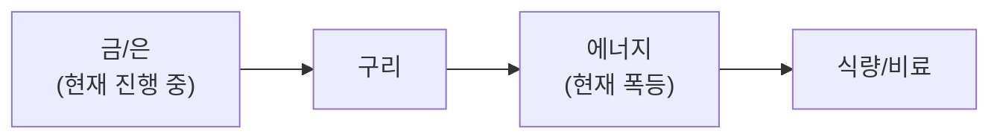

**3월 11일, 오일 쇼크 진정 국면 진입.** WTI **$120→$83** (-31%). G7 SPR 방출 논의 + 트럼프 전쟁 조기 종결 발언이 유가 안정에 기여. 호르무즈 기뢰 배치 보도로 변동성은 지속되나, 전쟁 참여 주체 모두 장기전 원하지 않아 **단기 종결 가능성 80%** (김단테 분석).

**KOSPI 폭락 후 대반등.** 5,252→**5,687 (+8.28%)**. 삼성전자 +8.3%, SK하이닉스 +12.2%. 유가 하락이 시장 공포 완화, 리스크 선호 회복. 2008년 이후 최대 일간 반등 기록.

**내부자 대규모 매수 — 분위기 반전 신호.** MSFT 내부자 26억원(10년 만에 최대), ServiceNow CEO 40억원, **TradeDesk CEO 2,000억원(광고업계 사상 최대)**. 마이클 버리 어도비 매수. AI 위기론이 "대체"에서 **"협업으로 시장 확대"** 로 전환.

**금 $5,222 사상 최고권.** Goldman Sachs $5,400 타겟. 지정학 불확실성 + 스태그플레이션 + 중앙은행 매입. 비트코인 $70K 회복.

**실업률 4.4%로 상승.** NFP -92K. Powell 5/15 은퇴. Fed 금리 인하 1회 추가 전망. 노동시장 약화가 성장주에 오히려 호재(금리 인하 기대).

**NHTSA 자율주행 안전 포럼(3/10).** 연방 규제 표준 확립 시도. 테슬라 Cybercab 4월 양산, $30K. 캐시우드: 자율주행 확산으로 유가 $50 이하 전망.

이번 주 **NVIDIA GTC(3/16~19)**: Vera Rubin, Feynman 아키텍처, HBM4, CPO, NVL144 발표 예정. **반도체 강세** — 마이크론 +6%, 샌디스크 +7%. HBM4 공급망 가속.

## 6대 투자 섹터 구조

| 섹터 | 하위 섹터 | 상세 분석 |
|------|----------|----------|
| **1. 반도체/AI** | HBM, DRAM/NAND, 파운드리, 소부장, AI SW/클라우드 | [반도체 섹터](/knowledge/invest/2026/01/21/semiconductor-sector-outlook-2026.html) |
| **2. 에너지** | 원전/SMR, 재생에너지, ESS, 수소 | [에너지 섹터](/knowledge/invest/2026/03/07/energy-sector-outlook-2026.html) |
| **3. 방산/우주** | 방산, 드론/UAM, 우주/위성 | [방산/우주 섹터](/knowledge/invest/2026/03/07/defense-space-sector-outlook-2026.html) |
| **4. 모빌리티/로봇** | EV/자율주행, 로봇, 조선 | [모빌리티/로봇 섹터](/knowledge/invest/2026/01/21/automotive-robotics-sector-outlook-2026.html) |
| **5. 바이오/헬스케어** | 신약/바이오텍, GLP-1/비만치료, 의료AI | [바이오/헬스케어 섹터](#바이오헬스케어-및-생명공학) |
| **6. 자산/거시경제** | 금/은, 암호화폐, 원자재/희토류, 거시경제/정책 | [거시경제/정책 섹터](/knowledge/invest/2026/01/21/macroeconomic-policy-sector-outlook-2026.html) |

### 하위 섹터 상세 링크

**반도체/AI**
- [HBM 투자 전망](/knowledge/invest/2026/01/21/hbm-sector-outlook-2026.html)
- [DRAM/NAND 투자 전망](/knowledge/invest/2026/01/21/dram-nand-sector-outlook-2026.html)
- [파운드리 투자 전망](/knowledge/invest/2026/01/21/foundry-sector-outlook-2026.html)
- [소부장 투자 전망](/knowledge/invest/2026/01/21/semiconductor-materials-equipment-outlook-2026.html)
- [AI 소프트웨어/클라우드](/knowledge/invest/2026/03/07/ai-software-cloud-outlook-2026.html)

**에너지**
- [원전 투자 전망](/knowledge/invest/2026/01/21/nuclear-power-sector-outlook-2026.html)

**방산/우주**
- [방산 투자 전망](/knowledge/invest/2026/01/21/defense-sector-outlook-2026.html)

**모빌리티/로봇**
- [EV/자율주행 투자 전망](/knowledge/invest/2026/01/21/ev-autonomous-driving-outlook-2026.html)
- [로봇 투자 전망](/knowledge/invest/2026/01/21/robotics-sector-outlook-2026.html)
- [조선 투자 전망](/knowledge/invest/2026/01/21/shipbuilding-sector-outlook-2026.html)

**자산/거시경제**
- [원자재/희토류](/knowledge/invest/2026/03/07/commodities-rare-earth-outlook-2026.html)

---

## 미래 워치리스트

| 테마 | 현황 | 주시 포인트 |
|------|------|-----------|
| **양자컴퓨팅** | Google Willow, IBM Heron 등 진전. 상용화 초기 | 오류 정정(QEC) 돌파, 금융/제약 응용 |
| **합성생물학** | AI+유전체 편집 융합 가속 | 바이오 제조, 식량/에너지 응용 |
| **BCI (뇌-컴퓨터 인터페이스)** | Neuralink 임상시험, 경쟁사 등장 | FDA 승인, 의료 응용 확대 |
| **핵융합** | Commonwealth Fusion, TAE 등 민간 투자 확대 | 상용 발전 시점(2030년대 중반 전망) |

---

## 목차

1. [거시적 시장 환경](#거시적-시장-환경)
2. [AI 및 클라우드 컴퓨팅](#ai-및-클라우드-컴퓨팅)
3. [AI 네트워크 인프라](#ai-네트워크-인프라)
4. [반도체 및 첨단 제조](#반도체-및-첨단-제조)
5. [로보틱스 및 자율주행](#로보틱스-및-자율주행)
6. [에너지 전환 및 친환경](#에너지-전환-및-친환경)
7. [바이오헬스케어 및 생명공학](#바이오헬스케어-및-생명공학)
8. [우주산업 및 뉴스페이스](#우주산업-및-뉴스페이스)
9. [방위산업 및 국방기술](#방위산업-및-국방기술)
10. [핀테크, 암호화폐 및 STO](#핀테크-암호화폐-및-sto)
11. [사이버보안 및 데이터 인프라](#사이버보안-및-데이터-인프라)
12. [지정학적 관점: 한국은 1980년대 일본](#지정학적-관점-한국은-1980년대-일본)
13. [초거대 기업들의 전략과 투자 방향](#초거대-기업들의-전략과-투자-방향)
14. [한국 시장 구조 변화](#한국-시장-구조-변화)
15. [섹터별 투자 전략: 3월 실전 가이드](#섹터별-투자-전략-3월-실전-가이드)

---

## 거시적 시장 환경

### 글로벌 증시 현황 (3/11 기준)

| 지수 | 수준 | 변동 | 비고 |
|------|------|----------|------|
| **S&P 500** | **6,781** | **-0.21%** | **미국 에너지 독립 → 오일 쇼크 방어** |
| **NASDAQ** | **22,696** | **+1.38%** | **기술주 반등, 내부자 매수 효과** |
| **KOSPI** | **5,687** | **+8.28%** | **폭락 후 대반등, 삼성+8.3%, SK하이닉스+12.2%** |
| **상해종합** | **4,123** | **+0.65%** | 안정화 |
| **항셍** | **25,960** | **+2.17%** | 아시아 반등 동참 |
| **원/달러** | **1,483원** | 소폭 안정 | 유가 하락으로 환율 압력 완화 |
| **WTI** | **$83** | **고점 $120 대비 -31%** | **G7 SPR + 트럼프 평화 신호** |
| **금(Gold)** | **$5,222/oz** | **+2.57%** | **Goldman $5,400 타겟, 안전자산 수요 지속** |
| **은(Silver)** | 강세 유지 | **$100 전망 지속** | 6년 연속 공급적자 |
| **비트코인** | **$70,007** | **+2.35%** | 리스크 선호 회복 |
| **VIX** | **25.5** | **-13.53%** | **공포 완화, 그러나 여전히 경계 수준** |
| **TLT** | **88.28** | -1.06% | 금리 상승 압력 |
| **SOXX** | **338.81** | **+0.73%** | **HBM4 가속, 마이크론+6%** |
| **실업률** | **4.4%** | **+0.1%p** | **NFP -92K, 노동시장 약화** |

### 이번 주 핵심 변화 (3/11 업데이트)

| 항목 | 변화 | 투자 시사점 |
|------|------|-----------|
| **★★★ 오일 쇼크 진정** | **WTI $120→$83 (-31%). G7 SPR + 트럼프 평화 신호** | **유가 안정화 진행. 호르무즈 기뢰 보도로 변동성 잔존** |
| **★★★ KOSPI 대반등 +8.28%** | **5,252→5,687. 삼성 +8.3%, SK하이닉스 +12.2%** | **2008년 이후 최대 반등. 유가 하락→리스크 선호 회복** |
| **★★★ 내부자 대규모 매수** | **MSFT 26억원, ServiceNow 40억원, TradeDesk 2,000억원** | **AI 위기론 완화, "협업" 내러티브로 전환. 분위기 반전 신호** |
| **★★★ 전쟁 단기 종결 80%** | **모든 참여 주체(미·이란·이스라엘·중국)가 장기전 원하지 않음** | **유가 추가 하락 시나리오 비중 상향. 방산은 구조적** |
| **★★ 실업률 4.4% 상승** | **NFP -92K, Powell 5/15 은퇴. Fed 추가 인하 1회 전망** | **노동시장 약화→금리 인하 기대→성장주 호재** |
| **★★ NHTSA 자율주행 포럼** | **연방 규제 표준 확립 시도. Cybercab 4월 양산, $30K** | **자율주행 "실험→일상" 전환. 테슬라 최대 수혜** |
| **★★ 금 $5,222 신고점권** | **Goldman $5,400 타겟. 3M +24.73%** | **안전자산 구조적 상승. 스태그플레이션 헤지** |
| **★★ HBM4 가속** | **마이크론 15K 웨이퍼/월, 삼성 NVIDIA 양산 시작** | **반도체 강세 지속. GTC 3/16 촉매** |
| **★ 방산 $1.01T 예산** | **트럼프 FY2026 국방비 13.4% 인상 → $1.01조** | **글로벌 방산 구조적 성장 재확인** |
| **★ 산유국 감산** | **사우디·이라크·UAE·쿠웨이트 총 600만 배럴 감산** | **호르무즈 봉쇄 + 감산 = 공급 리스크 잔존** |

### 핵심 매크로 변수 5가지

#### 1. 오일 쇼크 진정 — WTI $120→$83 (-31%)

| 항목 | 내용 | 투자 시사점 |
|------|------|-----------|
| **WTI** | **$120→$83 (-31%)** | G7 SPR 방출 + 트럼프 평화 신호가 하락 견인 |
| **G7 SPR** | **300~400M 배럴 방출 논의, 실행 중** | 유가 안정화 핵심 변수 |
| **트럼프 평화 발언** | **전쟁 조기 종결 시사** | 유가 추가 하락 기대감 |
| **호르무즈 기뢰** | **이란 기뢰 배치 보도 → 유가 일시 반등** | 변동성 잔존, 완전 해소 아직 |
| **산유국 감산** | **사우디·이라크·UAE·쿠웨이트 총 600만 배럴** | 봉쇄 + 감산 = 공급 리스크 잔존 |
| **캐시우드 전망** | **자율주행+EV 확산 → 장기 유가 $50 이하** | 장기 에너지 패러다임 전환 |
| **연준 금리** | **3.64%**, 10Y: 4.12%, 2Y: 3.56% | 유가 하락 시 인플레 압력 완화 |

**핵심 판단:** WTI가 $120에서 $83으로 **31% 하락**하며 오일 쇼크가 진정 국면에 접어들었습니다. 전쟁 참여 주체 모두 장기전을 원하지 않으며(단기 종결 가능성 80%), G7 SPR 방출도 효과를 보이고 있습니다. 그러나 호르무즈 기뢰 배치 보도와 산유국 600만 배럴 감산으로 **변동성은 잔존**. 유가 추가 하락($65~70) 시나리오의 비중을 상향 조정합니다.

#### 2. 이란 전쟁 — 단기 종결 가능성 80%

| 항목 | 내용 | 투자 시사점 |
|------|------|-----------|
| **작전명** | **Operation Epic Fury** (3/2 개시) | 9일차, 미 역대 최강도 공습 |
| **호르무즈** | **탱커 트래픽 95% 감소, 기뢰 배치** | 봉쇄 지속, 미 해군 16개 기뢰 제거 |
| **단기 종결 80%** | **미·이란·이스라엘·중국 모두 장기전 불리** | 미국=중간선거 리스크, 이란=체제 존속 위험 |
| **트럼프 평화 신호** | **전쟁 조기 종결 발언** | 유가 하락 + 시장 안정화 촉매 |
| **미국 에너지 독립** | **자급률 105%** → S&P 500 견조 | 한국(19%)/일본(13%) 대비 우위 |

**판단:** 전쟁 참여 주체 모두 장기전이 자국 이익에 반합니다. 미국은 중간선거 패배 리스크, 이란은 체제 존속 위험, 이스라엘은 경제적 부담, 중국은 에너지 가격 상승 고통. **단기 종결 가능성 80%** (김단테 분석). 다만 지도자 즉흥적 판단에 의한 실수 가능성 20%는 열어두어야 합니다. **빠른 종전 시 유가 $65~70 + KOSPI 추가 반등** 시나리오 비중 상향.

#### 3. KOSPI 대반등 — 5,687 (+8.28%), 2008년 이후 최대

| 항목 | 내용 | 투자 시사점 |
|------|------|-----------|
| **KOSPI 3/11** | **5,687 (+8.28%)** | **2008년 이후 최대 일간 반등** |
| **삼성전자** | **+8.3%** | DRAM 슈퍼사이클 + HBM4 |
| **SK하이닉스** | **+12.2%** | HBM 62% 점유, HBM4 가속 |
| **반등 원인** | **유가 하락($120→$83) → 에너지 공포 완화** | 리스크 선호 회복 |
| **EWY 3M** | **+40.14%** | 글로벌 펀드 플로우 최강 |
| **VIX** | **25.5 (-13.53%)** | 공포 완화, 경계에서 중립으로 |

**판단:** KOSPI가 2008년 이후 최대 반등을 기록하며 시장 심리가 **공포→경계→중립**으로 전환 중입니다. 유가 하락이 핵심 촉매이며, 삼성전자/SK하이닉스의 반도체 슈퍼사이클이 반등을 주도. EWY 3개월 +40.14%는 글로벌 최강 수익률. **분할 매수 전략이 정당화**되고 있으며, 전쟁 단기 종결 시 추가 상승 여력 충분.

#### 4. 반도체 강세 지속 + HBM4 가속 + 내부자 매수

| 항목 | 내용 | 투자 시사점 |
|------|------|-----------|
| **마이크론 +6%** | HBM4 공급망 참여 확인, Applied Materials 공동 R&D | HBM4 15K 웨이퍼/월 램프 |
| **샌디스크 +7%** | NAND 가격 상승 수혜 | 메모리 슈퍼사이클 |
| **삼성 HBM4** | **NVIDIA Vera Rubin 양산 공급 시작** | 세계 최초 양산 출하 |
| **DRAM Q1 +90~95%** | 역사적 기록 유지 | Q2 추가 +70% 전망 |
| **SOXX 338.81** | **+0.73%** | AI 수요 구조적 견조 |
| **내부자 매수** | **MSFT 26억원, ServiceNow 40억원, TradeDesk 2,000억원** | **AI 위기론 완화, 분위기 반전** |
| **GTC 3/16~19** | Vera Rubin, Feynman, HBM4, CPO, NVL144 | **핵심 촉매** |

**핵심 판단:** 마이크론 +6%, 샌디스크 +7%로 **반도체 강세가 유가 하락과 함께 가속**. HBM4 공급 경쟁이 본격화(삼성 양산 시작, 마이크론 15K 웨이퍼 램프, SK하이닉스 62%). 빅테크 내부자들의 대규모 매수는 **AI 위기론이 "과도한 우려"에서 "협업 기회"로 전환**되고 있음을 시사. GTC(3/16~19)가 핵심 촉매.

#### 5. 환율 안정화 + 실업률 상승 = 금리 인하 기대

| 항목 | 현황 | 변화 |
|------|------|------|
| 원/달러 환율 | **1,483원** | 유가 하락으로 환율 압력 완화 |
| EUR/USD | **1.1606** | 달러 약세 진행 |
| **유가 하락 효과** | **$120→$83** | **에너지 수입비 부담 30% 경감** |
| **실업률** | **4.4% (+0.1%p)** | **NFP -92K, 노동시장 약화** |
| **Powell 은퇴** | **5/15** | 후임 인선이 금리 정책 방향 결정 |
| **Fed 전망** | **추가 인하 1회 (6~9월)** | 고용 약화 → 인하 가능성 상향 |
| WGBI 편입 | **4월 시작, 8회 분할 편입** | $56B+ 유입 전망 |
| **시나리오별 전망** | **전쟁 종결: 1,380~1,420원 / 지속: 1,480~1,530원** | 유가 하락+WGBI=환율 안정화 |

**판단:** 유가 $120→$83 하락으로 한국 경제 스트레스가 **대폭 완화**. 실업률 4.4% 상승과 NFP -92K는 Fed 금리 인하 기대를 높이며, 이는 성장주/기술주에 호재. Powell 5/15 은퇴 후 후임 인선이 2026년 금리 정책의 최대 변수. WGBI 4월 편입이 구조적 원화 강세 촉매.

### 관세 현황 -- Section 122 15% 발효 중 (7/23 만료)

| 관세 | 세율 | 상태 | 비고 |
|------|------|------|------|
| **글로벌 보편관세** | **15%** | **발효 중** (2/24~) | **150일 한시** (7/23 만료) |
| **중국 관세** | **35~50%** | USTR 유지 | **트럼프-시진핑 정상회담 3월 말 변수** |
| **반도체** | 25%+ | **Section 232 유지** | 별도 법적 근거 |
| **자동차** | **25%** | **4/3 발효 예정** | **현대/기아 직접 타격** |
| **철강/알루미늄** | 25% | **Section 232 유지** | 3/12 발효 |

---

## AI 및 클라우드 컴퓨팅

### 현재 상황 (3월 10일 기준)

빅테크의 2026년 AI CAPEX가 합산 **$6,500~7,000억(~$700B)**에 달하며, 전년 대비 **60% 이상** 급증. 오일 쇼크에도 불구하고 **AI 투자는 구조적**이어서 삭감 가능성 낮음. **GTC 2026(3/16~19)**이 핵심 방향성 결정 이벤트.

| 기업 | 2026 AI CAPEX | 핵심 이슈 |
|------|--------------|---------|
| **Amazon** | **$2,000억** | FCF 마이너스 전환 전망 |
| **Alphabet** | **$1,850억** | FCF 90% 감소 전망 |
| **Microsoft** | **$1,450억** | Azure AI 확대 |
| **Meta** | **$1,350억** | FCF 90% 감소 전망 |
| **합계** | **$6,500~7,000억** | 전년 대비 **+60% 이상** |

### 핵심 투자 포인트

| 영역 | 내용 | 전망 |
|------|------|------|
| **AI 칩셋** | 엔비디아 시총 ~$4.31조 | **GTC 3/16~19: Vera Rubin, Feynman, NVL144, CPO, HBM4** |
| **커스텀 ASIC** | **Broadcom AI $8.4B(+74%)**, **Marvell $0→$1.5B** | 2026년 GPU 출하량 추월 전망 |
| **클라우드 인프라** | AWS, Azure, GCP | $7,000억 투자 직접 수혜 |
| **AI 응용** | CRM, 헬스케어, 금융 AI | 하드웨어 실적 파티 vs 소프트웨어 수익화 미완 |

### 3월 투자 전략

**단기**: **GTC 2026(3/16~19)**이 최대 촉매. Vera Rubin(6개 칩, 성능/와트 10배), **Feynman 아키텍처**, NVL144, CPO, HBM4 발표 예정. SOXX +3.98%로 **오일 쇼크 속에서도 반도체 선호** 확인.

**중기**: 커스텀 ASIC(Broadcom AI $8.4B, Marvell $1.5B)이 새로운 성장 축. AI 수요는 유가와 무관하게 구조적.

**리스크**: ①AI 칩 수출통제 초안, ②스태그플레이션 → 데이터센터 전력비 상승(유가 $100), ③빅테크 FCF 급감.

### 주요 기업 및 ETF

**대표 기업:**
- 엔비디아 (NVDA): 시총 ~$4.31조. **GTC 3/16~19: Vera Rubin + Feynman + NVL144 + CPO + HBM4**
- **AMD (AMD)**: MI455X + Helios — Meta 6GW + OpenAI 6GW = **12GW 계약**
- **Broadcom (AVGO)**: AI 매출 **$8.4B(+74%)**, 커스텀 ASIC 리더
- **Marvell (MRVL)**: ASIC 매출 **$0→$1.5B**

**투자 ETF:**
- BOTZ (Global X Robotics & AI ETF)
- ROBO (ROBO Global Robotics & Automation Index ETF)

---

## AI 네트워크 인프라

### 핵심 테마: 데이터센터 ROI의 열쇠

$700B 규모의 AI 데이터센터 투자에서 **네트워크 인프라는 ROI를 결정짓는 핵심 요소**입니다.

### InfiniBand vs Ethernet 경쟁

| 기술 | 대표 기업 | 특징 |
|------|----------|------|
| **InfiniBand** | 엔비디아 (Mellanox) | 현재 AI 학습 표준, 저지연 |
| **Ethernet (AI용)** | Arista Networks, Broadcom | 범용성 우수, 비용 효율적 |

### 대역폭 에스컬레이션

```
현재: 400G
진행중: 800G
2026-2027: 1.6T
2028+: 3.2T
```

각 세대 전환마다 **광트랜시버, 스위치, 광케이블** 수요가 2배씩 증가합니다.

### 핵심 투자 기업

| 기업 | 분야 | 핵심 강점 |
|------|------|----------|
| **Arista Networks** | 데이터센터 스위칭 | AI 데이터센터 네트워킹 1위 |
| **Coherent** | 광트랜시버 | 시장 점유율 1위, 800G/1.6T 리더 |
| **Lumentum** | 광학 부품 | 레이저, 광부품 핵심 공급 |
| **Broadcom** | 네트워크 칩 + ASIC | AI 네트워크 + 커스텀 ASIC, **AI $8.4B(+74%)** |

---

## 반도체 및 첨단 제조

### 핵심 이벤트: $1T 기가사이클 + GTC 3/16 + SOXX +3.98%

**SIA가 2026년 글로벌 반도체 매출 $1조 돌파를 전망.** 오일 쇼크 속에서도 **SOXX +3.98%**로 반도체는 별도의 강한 수요 사이클 진행 중. **GTC 2026(3/16~19)에서 Vera Rubin/Feynman/HBM4/CPO/NVL144 발표가 핵심 촉매.**

| 항목 | 내용 | 투자 시사점 |
|------|------|-----------|
| **SOXX +3.98%** | 오일 쇼크 속 반도체 회복 | AI 수요 구조적 강도 확인 |
| **GTC 2026 (3/16~19)** | Vera Rubin, Feynman, HBM4, CPO, NVL144 | **반등 핵심 촉매** |
| **SIA $1조 전망** | 2026년 글로벌 반도체 매출 $1T 돌파 | 기가사이클 가속 |
| **HBM: SK하이닉스 62%** | HBM 시장 점유율 62%, 삼성 HBM4 PRA 완료 | 양강 과점 구조 |
| **DRAM Q1 +90~95%** | 역사적 기록, 스팟 > 계약 | 슈퍼사이클 가속 |
| **Broadcom AI $8.4B** | +74%, 커스텀 ASIC 리더 | GPU 출하량 추월 전망 |
| **AI 칩 수출통제 (3/5)** | 초안 단계 | 단기 센티먼트 리스크 |

### 한국 메모리의 기가사이클

**SK하이닉스 HBM 시장 점유율 62%**로 압도적 1위. **삼성은 HBM4 PRA 완료**로 양산 본격화 임박.

핵심 포인트:
- **SK하이닉스**: HBM 62% 점유, 16단 48GB HBM4 공개
- **삼성 HBM4 PRA 완료**: 세계 최초 양산 출하, 대역폭 3.3TB/s
- **DRAM Q1 +90~95%**: 역사적 기록
- **SIA $1T**: 2026년 글로벌 매출 $1조 돌파 전망

### 3월 투자 전략

**핵심 전략: GTC 촉매 대기 + DRAM 슈퍼사이클 + 오일 쇼크 디커플링**

1. **삼성전자**: HBM4 PRA 완료 + MS 2027 OP 317조 + DRAM Q1 +95%. KOSPI 폭락으로 저가 매수 기회.
2. **SK하이닉스**: HBM 62% 점유율, PER 극저. DRAM Q2 추가 상승.
3. **엔비디아**: 시총 $4.31T. **GTC 3/16~19 핵심**. Vera Rubin + Feynman + NVL144.
4. **커스텀 ASIC**: Broadcom AI $8.4B(+74%), Marvell $1.5B.
5. **소부장**: 한미반도체(영업이익률 50%, TC 본더 71.2%), HPSP(55%), 리노공업(48%).

### 주요 기업

| 카테고리 | 주요 기업 | 현황 |
|----------|----------|------|
| **AI 칩** | 엔비디아, AMD | GTC 3/16~19, SOXX +3.98% |
| **파운드리** | TSMC, 삼성전자 | TSMC N2 램프 |
| **메모리** | 삼성전자, SK하이닉스 | SK 62% HBM, DRAM Q1 +95% |
| **커스텀 ASIC** | Broadcom, Marvell | Broadcom AI $8.4B(+74%) |
| **소부장** | 한미반도체, HPSP, 리노공업 | 고수익성 지속 |
| **장비** | ASML, 램리서치 | ASML 분기 주문 EUR132억 기록 |

**ETF:**
- SMH (VanEck Semiconductor ETF)
- SOXX (iShares Semiconductor ETF) — **+3.98% (오일 쇼크 속 반등)**

---

## 로보틱스 및 자율주행

### 현재 상황: NHTSA 자율주행 포럼·Cybercab 4월 양산·코텍스2·데이터센터 냉각

| 항목 | 내용 | 시사점 |
|------|------|--------|
| **세미트럭 3월 양산** | 네바다 공장 완공, UPS 100대+/DHL 주문 | EV 상용차 시장 전환점 |
| **Cybercab $30K 생산 시작** | 2/17 첫 양산 출고, 로보택시 $3.25 (우버 대비 50-60% 저렴) | 로보택시 상용화 가시화 |
| **데이터센터 냉각 신테마** | LG전자(공조), SK이노베이션(SK루브론 액침 냉각) | AI 데이터센터 핵심 병목 |
| **코텍스2 4월 가동** | 500MW, 기가텍사스. 옵티머스 전용 훈련 | 피지컬AI 가속 |
| **Optimus Gen3 양산** | 1/21 프리몬트 생산 개시 | 학습/데이터 수집 단계 |
| **BYD 블레이드 배터리 2.0** | 5분→70% 충전, 1,006km | 중국 EV 기술 격차 확대 |
| **자동차 관세 25%** | 4/3 발효 예정 | 현대/기아 직접 타격 |

### 한국 로봇 섹터

- 두산로보틱스: 협동 로봇 리더
- 레인보우로보틱스: 휴머노이드 로봇 개발
- 현대차/보스턴다이나믹스: 기업가치 ~55조원
- **주의**: 중국 휴머노이드 로봇 **87-90%** 점유 — 경쟁 리스크 최대

**ETF:**
- BOTZ (Global X Robotics & AI ETF)
- ROBO (ROBO Global Robotics & Automation Index ETF)

---

## 에너지 전환 및 친환경

### 오일 쇼크 진정: WTI $120→$83 + 원전 $80B + i-SMR

| 항목 | 내용 |
|------|------|
| **WTI** | **$120→$83 (-31%)**, G7 SPR + 트럼프 평화 신호 |
| **G7 SPR** | **300~400M 배럴 방출 실행 중** |
| **호르무즈** | **탱커 트래픽 95% 감소, 기뢰 배치**, 미 해군 제거 작전 |
| **산유국 감산** | **사우디·이라크·UAE·쿠웨이트 총 600만 배럴** |
| **캐시우드 전망** | 자율주행+EV 확산 → 장기 유가 **$50 이하** |
| **XLE** | **55.60 (-1.28%)** — 유가 하락으로 에너지 주 약세 |
| **ICLN** | **18.25 (+1.61%)** — 청정에너지 대안 수요 |
| **LIT** | **72.02 (+0.83%)** — 배터리/리튬 |
| **미국 원전 $80B** | 신규 원전 펀딩, AI 데이터센터 전력 5x 성장 |
| **i-SMR 규제심사** | 한국 SMR 규제 프로세스 본격 시작 |

### 에너지 시나리오 (3/11 기준)

| 시나리오 | 유가 전망 | 확률 | 영향 |
|---------|----------|------|------|
| **★ 단기 종전 (수주 내)** | **$65~75** | **고 (80%)** | **유가 급락, 아시아 반등, 에너지주 조정** |
| **G7 SPR + 봉쇄 완화** | **$75~90** | **중** | **점진적 안정화** |
| **봉쇄 장기화** | **$100~130** | **저 (20%)** | **스태그플레이션 재심화** |
| 이란 체제 전환 성공 | $55~65 | 극저 | 유가 하락, 리스크 프리미엄 완전 해소 |

### 핵심 하위 섹터

#### 원전 (Nuclear Renaissance) -- 에너지 안보 + AI 전력 수요

AI 데이터센터 전력 수요 + 이란 전쟁 에너지 안보 + 탈탄소 정책 삼중 호재.

| 항목 | 내용 | 투자 시사점 |
|------|------|-----------|
| **우라늄** | +32% YoY | 구조적 공급 부족 |
| **i-SMR 규제심사 착수** | 한국 SMR 규제 프로세스 시작 | 상용화 가시화 |
| **미국 $80B 신규 원전** | NuScale SMR 규제 승인 | 원전 르네상스 가속 |
| **KHNP 태국·필리핀** | 원전 수출 파이프라인 확대 | K-원전 해외 수주 |

#### 배터리/청정에너지 -- 오일 쇼크 대안 수요

**ICLN +3.04%, LIT +3.57%** — 오일 쇼크가 청정에너지/배터리로의 전환 수요를 가속. 에너지 위기가 장기화될수록 재생에너지·ESS 투자 강화.

### 투자 ETF

- ICLN (iShares Global Clean Energy) — **+3.04%**
- LIT (Global X Lithium & Battery Tech) — **+3.57%**
- URA (Global X Uranium ETF)

---

## 바이오헬스케어 및 생명공학

### 스태그플레이션 방어 + GLP-1 경쟁 구도 변화

오일 쇼크 + 스태그플레이션 환경에서 **방어적 헬스케어 매력도 상승**.

### 핵심 투자 포인트

#### GLP-1 비만 치료제

| 기업 | 현황 | 전망 |
|------|------|------|
| **Eli Lilly (LLY)** | GLP-1 시장 지배, EPS $35 전망(2026) | Mounjaro/Zepbound 선도 |
| **Novo Nordisk (NVO)** | 1년간 56% 하락, 경쟁 심화 | 저평가, $70 목표가 |
| **Viking Therapeutics** | 2상 결과 13주 14.7% 체중 감량 | 신규 경쟁자 |

#### AI 신약 개발

- 엑셀런시아, 리커전: AI 기반 약물 발견
- 빅테크 진출: 구글 DeepMind, 아마존 헬스케어

### 투자 ETF

- XBI (SPDR S&P Biotech ETF)
- IBB (iShares Biotechnology ETF)
- ARKG (ARK Genomic Revolution ETF)

---

## 우주산업 및 뉴스페이스

### 현재 상황: 방산 급등과 함께 우주 관련 수혜

| 기업/영역 | 내용 | 전망 |
|----------|------|------|
| SpaceX-xAI 합병 | 역삼각합병 추진 중 | 우주+AI 시너지 |
| 한화에어로스페이스 | K-방산/우주 대표주 | 수주잔고 100조+ |
| 로켓랩 (RKLB) | 소형 위성 발사 전문 | 트럼프 국방부 관심 |

### 트럼프 국방 정책과 우주

트럼프 행정부의 **FY2027 국방비 $1.5조 제안**에서 우주가 최우선 분야.

**투자 ETF:**
- UFO (Procure Space ETF)
- ARKX (ARK Space Exploration ETF)

---

## 방위산업 및 국방기술

### 현재 상황: 이란 전쟁 9일차 + $1.01T 예산 + CAPEX +38% + ITA +14% YTD

방산이 2026년 최대 수혜 섹터. ITA **+14% YTD**, 트럼프 FY2026 국방비 **$1.01조(13.4% 인상)**, 글로벌 방산 CAPEX **+38% 증가 전망**. 전쟁 단기 종결 80%로 풀백 리스크 존재하나, 구조적 성장은 확정.

| 항목 | 내용 | 시사점 |
|------|------|--------|
| **★ ITA +14% YTD** | **미국 방산 ETF 압도적 성과** | 방산 = 2026년 최강 섹터 |
| **Northrop +6%, RTX +5%** | 미국 방산 대형주 일제히 상승 | 글로벌 방산 지출 구조적 증가 |
| **방산 CAPEX +38%** | 글로벌 방산 투자 38% 증가 전망 | 장기 성장 사이클 |
| **청궁-II 실전 검증** | UAE에서 명중률 90% — 실전 실증 | K-방산 신뢰도 구조적 상향 |
| **EU ReArm 8,000억유로** | EU 정상 합의 (~1,250조원) | K-방산 유럽 수출 대폭 확대 |
| **EU €150B 방산 대출 (3/6)** | EU 공동 방산 투자 대규모 확대 | K-방산 유럽 수주 기회 |
| **NATO 방위비 GDP 5%** | 2035년까지 목표 상향 (기존 2%) | 글로벌 방산 장기 수요 |

### 조선 -- 호르무즈 봉쇄 + LNG 용선율 $200K+ + 슈퍼사이클

| 항목 | 내용 |
|------|------|
| **HD현대 LNG 4척 ₩1.49T** | LNG 용선율 $200K+ (기존 대비 2배) |
| **호르무즈 봉쇄** | 선박 통행 불가, 해군함·호위함 수요 급증 |
| **3대 조선사 수주 목표** | $464억(+30%) |
| **LNG선 전망** | 2026년 글로벌 115척 발주 전망 (+24%) |

### 주요 기업

**주요 기업:** 한화에어로스페이스 (수주잔고 100조+, 청궁-II 실전 검증), 한화오션 (캐나다 잠수함 48조), HD현대중공업 (LNG 4척 ₩1.49T), LIG넥스원 (사우디 L-SAM), HD한국조선해양 (수주 35조)

**투자 ETF:**
- ITA (iShares U.S. Aerospace & Defense ETF) — **+14% YTD**
- XAR (SPDR S&P Aerospace & Defense ETF)
- SHLD (Global X Defense Tech ETF)

---

## 핀테크, 암호화폐 및 STO

### STO 법안 국회 통과 -- 2026년 상반기 토큰증권 원년

| 항목 | 내용 |
|------|------|
| **법안 통과** | **2026.1.15 국회 통과** |
| **시행** | 2027년 1월 시행 |
| **시장 전망** | 2026년 상반기 STO 시장 원년 |
| **2030년 시장 규모** | 약 **367조원** |

### 자산 현황: 금·은·비트코인

| 자산 | 현재 | 전망 | 포지션 |
|------|------|------|--------|
| **금(Gold)** | **$5,222/oz** (+2.57%) | **Goldman $5,400**, JP모건 $6,300 | **적극 보유** |
| **은(Silver)** | 강세 유지 | $100 전망, 6년 연속 공급적자 | **분할 매수** |
| **비트코인** | **$70,007** (+2.35%) | 트럼프-코인베이스 회동, 법안 촉구 | **소규모 매수** |

**금 판단:** $5,222로 신고점권. Goldman Sachs $5,400 타겟 상향. 3개월 +24.73% 수익률. 지정학 불확실성 + 스태그플레이션 + 달러 약세 + 중앙은행 매입이 **구조적 상승 기조** 유지. 전쟁 종결 시에도 스태그플레이션 구조가 지속되므로 하방 제한적.

**비트코인 판단:** $70,007(+2.35%)로 $70K 회복. 트럼프가 코인베이스 CEO와 회동하며 암호화폐 법안 통과 촉구. 리스크 선호 회복과 함께 반등 중. 다만 레버리지 절대 금지, 소규모 분할 매수 원칙.

**ETF:**
- BITO (ProShares Bitcoin Strategy ETF)
- BLOK (Amplify Transformational Data Sharing ETF)

---

## 사이버보안 및 데이터 인프라

### 현재 상황

이란 전쟁 9일차로 **이란발 사이버 보복 공격 가능성 지속**. AI 칩 수출통제로 보안 인프라 수요도 구조적 증가. 팔란티어는 피터 틸이 일본 다카이치 총리와 회담하며 **미일 방산 AI 소프트웨어 협업** 기대감.

### 핵심 기업

| 분야 | 기업 | 강점 |
|------|------|------|
| 네트워크 보안 | 팔로알토, 포티넷 | 차세대 방화벽 |
| 클라우드 보안 | 크라우드스트라이크, 제트스케일러 | EDR, 제로 트러스트 |
| AI 보안 | 팔란티어 | 전장 AI, 데이터 분석 |

### 투자 ETF

- CIBR (First Trust NASDAQ Cybersecurity ETF)
- HACK (ETFMG Prime Cyber Security ETF)

---

## 지정학적 관점: 한국은 1980년대 일본

### 핵심 프레임: 미중 경쟁 수혜 + 이란 전쟁 방산 수혜 + 에너지 의존 취약성

미-중 기술 패권 경쟁에서 한국이 **미국의 핵심 동맹 공급국**으로서 구조적 수혜. 이란 전쟁 + 청궁-II 실전 검증으로 K-방산 신뢰도 구조적 상향. 그러나 **에너지 자급률 19%로 오일 쇼크에 가장 취약한 선진국 중 하나**.

### 한국의 글로벌 핵심 공급 분야

| 분야 | 한국 위상 | 핵심 기업 |
|------|----------|----------|
| **HBM** | 글로벌 양강, SK하이닉스 62% | SK하이닉스, 삼성전자 |
| **전력/변압기** | 핵심 공급국 | 현대일렉트릭, LS산전 |
| **조선** | 글로벌 1위, LNG $200K+ 용선율 | HD한국조선해양, 삼성중공업 |
| **K-배터리** | 글로벌 3강 | LG에너지솔루션, 삼성SDI |
| **K-방산** | 수주잔고 100조+, 청궁-II 실전 검증 | 한화에어로스페이스, LIG넥스원 |
| **로보틱스** | 로봇밀도 세계 1위 | 두산로보틱스, 현대로보틱스 |

### 미국 전략적 수혜 섹터

| 우선순위 | 섹터 | 정책 |
|---------|------|------|
| 1순위 | **에너지** | 에너지 독립(자급률 105%), S&P 500 견조 |
| 1순위 | **방산/우주** | ITA +14% YTD, CAPEX +38%, 이란 전쟁 |
| 2순위 | **반도체** | SIA $1T, SOXX +3.98%, GTC 3/16 |
| 2순위 | **AI** | $700B CAPEX |
| 3순위 | **암호화폐** | Clarity Act 법제화 추진 |

---

## 초거대 기업들의 전략과 투자 방향

### $700B AI 투자의 흐름: 공급망 수혜 지도

```
AI 칩 → 엔비디아($4.31조, GTC 3/16~19), AMD, TSMC
커스텀 ASIC → Broadcom(AI $8.4B, +74%), Marvell($0→$1.5B)
데이터센터 네트워크 → Arista, Coherent, Lumentum
서버/메모리 → SK하이닉스(HBM 62%), 삼성전자(HBM4 PRA 완료)
냉각 시스템 → LG전자(공조), SK이노베이션(액침 냉각)
전력 인프라 → 원전(i-SMR), 우라늄
```

### 테슬라의 전략적 피벗 -- 코텍스2 + 옵티머스 + 로보택시

| 전략 | 내용 | 의미 |
|------|------|------|
| **코텍스2 (500MW)** | 4월 절반 가동, 옵티머스 전용 훈련 | 피지컬AI 핵심 병목 해소 |
| **Optimus Gen3 양산** | 1/21 프리몬트 생산 | V2 쇼케이스 4-5개월 내 |
| **로보택시 오스틴** | FSD Unsupervised | 자율주행 상용화 전환점 |
| **Cybercab 양산** | 기가텍사스, $30K | 4~8주 내 본격 생산 |
| **세미트럭 3월 양산** | 네바다 공장 완공 | EV 상용차 전환점 |

---

## 한국 시장 구조 변화

### KOSPI: 폭락 후 대반등 — 5,687 (+8.28%)

2/26 사상최고(6,307) → 3/4 -12.64%(사상 최대 폭락) → 2일 -18% → **3/11 5,687 (+8.28% 대반등)**. 2008년 이후 최대 일간 상승.

| 항목 | 3/3 | 3/4 | 3/5 | 3/10 | 3/11 |
|------|------|------|------|------|------|
| **KOSPI** | -7.24% | -12.64% | +9.63% | -5.96% | **+8.28% (5,687)** |
| **핵심** | 전쟁 공포 | 서킷브레이커 | 반등 | 추가 하락 | **유가 하락→대반등** |

### 반도체·방산 주도 대반등

| 종목 | 등락률 | 핵심 촉매 |
|------|--------|----------|
| **SK하이닉스** | **+12.2%** | HBM 62% 점유, HBM4 가속 |
| **삼성전자** | **+8.3%** | HBM4 NVIDIA 양산, DRAM Q1+95% |
| **SK스퀘어** | **+8.8%** | SK하이닉스 지분 수혜 |
| **두산에너빌리티** | **+6.6%** | i-SMR 규제심사, 원전 수요 |
| **현대차** | **+3.6%** | 유가 하락=에너지 비용 완화 |

### ★ 한국 자산시장 대전환 — 부동산·예금 → 주식

| 항목 | 내용 | 투자 시사점 |
|------|------|-----------|
| **대통령 ETF 매수 선언** | 분당 아파트 매각, ETF 매수 | 정부 차원의 주식 투자 장려 |
| **상법 개정** | 배당소득 분리과세, 자사주 의무소각 | 자본시장 친화 정책 |
| **국민성장펀드 150조** | 민간 75조 + 정부 75조 | 코스닥 15조 유입 |
| **고객예탁금 130조** | 사상 최고 | 투자 대기 자금 극대화 |
| **MSCI 선진지수** | 환율시장 개방 추진 | WGBI 4월 편입과 시너지 |

### 배당 ETF: 고변동성 시기 방어

| ETF | 특징 | 수익률 |
|-----|------|--------|
| **PLUS 고배당주 위클리 커버드콜** | 주간 콜옵션 매도 | 분배율 **20.55%** |
| **KODEX 코리아 밸류업 토탈리턴** | 밸류업 + 토탈리턴 | **101.87%** |
| KODEX 200 타겟위클리 커버드콜 | 주간 콜옵션 매도 | 연 **17%** 배당 |

---

## 섹터별 투자 전략: 3월 실전 가이드

### 핵심 전략: "오일 쇼크 진정 + KOSPI 대반등 + 내부자 매수 = 반도체·방산 적극 매수, 리스크 선호 회복"

3월 11일 기준 핵심 전략:

1. **오일 쇼크 진정: WTI $120→$83**: G7 SPR + 트럼프 평화 신호. 전쟁 단기 종결 80%. 에너지 비중 축소, 성장주 비중 확대
2. **KOSPI 대반등 +8.28%**: 삼성 +8.3%, SK하이닉스 +12.2%. 유가 하락→리스크 선호 회복. **분할 매수 정당화**
3. **내부자 대규모 매수**: MSFT·ServiceNow·TradeDesk. AI 위기론 "대체"→"협업" 전환. **기술주 반등 신호**
4. **반도체 = 최대 수혜**: HBM4 가속(삼성 양산, 마이크론 램프), GTC 3/16~19 촉매. **반도체 비중 확대**
5. **방산 구조적 성장**: $1.01T 예산, CAPEX +38%. 전쟁 종결과 무관하게 구조적 → **방산 유지**
6. **금 $5,222 신고점권**: Goldman $5,400 타겟. 지정학+스태그플레이션 → **보유 유지**
7. **실업률 4.4%**: NFP -92K. Fed 추가 인하 기대 → **성장주 호재**
8. **이번 주 핵심**: CPI, **NVIDIA GTC(3/16~19)**, FOMC(3/17~18), S&P 500 리밸런싱(3/23)

### 상품 사이클 순서 (commodity cycle)



현재 금/은 → 에너지가 **동시에 급등** 중. 식량/비료가 다음 사이클 후보.

### 자산 상관관계 (3/11 기준)

| 자산 | 방향 | 최신 수준 | 근거 |
|------|------|---------|------|
| **유가(Oil)** | **하락 안정화** | WTI $83 (고점 $120 대비 -31%) | G7 SPR + 트럼프 평화 신호, 단기 종결 80% |
| **★ 방산주** | **강세 유지** | ITA +14% YTD | $1.01T 예산, CAPEX +38%, 구조적 |
| **★ 반도체** | **강세** | SOXX 338.81, 마이크론+6% | HBM4 가속, GTC 촉매, 내부자 매수 |
| **금(Gold)** | **신고점** | $5,222 (+2.57%) | Goldman $5,400, 3M +24.73% |
| **은(Silver)** | **강세 유지** | $100 전망 | 6년 공급적자, 산업 수요 |
| **KOSPI** | **대반등** | 5,687 (+8.28%) | 유가 하락, 반도체 슈퍼사이클 |
| **비트코인** | **$70K 회복** | $70,007 (+2.35%) | 리스크 선호 회복 |
| **TLT** | **약보합** | 88.28 (-1.06%) | 금리 상승 압력 |
| **VIX** | **하락** | 25.5 (-13.53%) | 공포 완화, 경계→중립 전환 |

### 포트폴리오 구성 제안

**오일 쇼크 진정 + KOSPI 대반등: 반도체 비중 확대, 에너지 축소, 방산 유지**

#### 전일 대비 변동 (3/11 vs 3/10)

| 섹터 | 전일 비중 | 금일 비중 | 변동 | 변동 사유 |
|------|----------|----------|------|----------|
| 방산/조선 | 27% | **25%** | **-2%** | **전쟁 단기 종결 80%, 종전 풀백 리스크 대비. 구조적은 유지** |
| AI/반도체 | 18% | **22%** | **+4%** | **KOSPI 대반등+8.28%, HBM4 가속, 내부자 매수, GTC 촉매** |
| 에너지/원전 | 15% | **12%** | **-3%** | **WTI $120→$83, 유가 하락으로 에너지 긴급성 완화** |
| 금 | 9% | **10%** | **+1%** | **$5,222 신고점, Goldman $5,400, 스태그플레이션 헤지** |
| 은 | 2% | 2% | - | $100 전망 유지 |
| 로봇/자율주행 | 4% | **5%** | **+1%** | **NHTSA 자율주행 포럼, Cybercab 4월 양산** |
| AI 네트워크 인프라 | 3% | 3% | - | GTC 수혜 기대 |
| STO/핀테크 | 2% | 2% | - | 변동 없음 |
| 현금 | 20% | **19%** | **-1%** | **VIX 25.5 하락, 리스크 선호 회복. 반도체 분할 매수 실행** |

#### 추천 종목 (실제 종목/ETF)

| 섹터 | 추천 종목 (티커) | 추천 사유 | 현재가/밸류에이션 |
|------|----------------|----------|-----------------|
| AI/반도체 | SK하이닉스, 삼성전자, NVDA, SOXX(ETF) | **KOSPI +8.28% 반등, HBM4 가속, GTC 3/16, 내부자 매수** | SK하이닉스 +12.2% |
| 방산/조선 | 한화에어로스페이스, LIG넥스원, HD한국조선해양, ITA(ETF) | $1.01T 예산, CAPEX +38%, 청궁-II 실전검증 | ITA +14% YTD |
| 에너지/원전 | 두산에너빌리티, Cameco(CCJ), URA(ETF) | i-SMR, 미국 $80B 원전, 우라늄+32% | Cameco EPS +55% |
| 금 | GLD, IAU, KODEX 골드선물(H) | **$5,222, Goldman $5,400, 3M +24.73%** | 신고점권 |
| 은 | SLV, PSLV, KODEX 은선물(H) | $100 전망, 6년 공급적자 | 강세 유지 |
| 로봇/자율주행 | 테슬라(TSLA), 두산로보틱스, BOTZ(ETF) | **NHTSA 포럼, Cybercab 4월 양산 $30K** | 자율주행 규제 표준화 |
| 바이오 | Eli Lilly(LLY), Vertex(VRTX), Viking(VKTX) | **LLY orforglipron 우위, VRTX 다중 프랜차이즈** | NVO→VRTX 교체 |
| AI SW/플랫폼 | MSFT, ServiceNow(NOW), Palantir(PLTR) | **내부자 대규모 매수, AI 위기론 완화** | MSFT -30% 저가 |

**※ 종목 추천은 참고용이며, 투자 판단은 본인 책임입니다.**

#### 공격적 투자자

| 섹터 | 비중 | 근거 |
|------|------|------|
| **AI/반도체 (HBM·메모리)** | **22%** | **KOSPI +8.28%, HBM4 가속, GTC 3/16, 내부자 매수, DRAM Q1 +95%** |
| **방산/조선** | **25%** | **$1.01T 예산, CAPEX +38%, 구조적 최강** |
| **에너지/원전** | **12%** | **WTI $83 안정화, 미국 $80B 원전, 원전 비중 확대** |
| **금** | **10%** | **$5,222, Goldman $5,400, 스태그플레이션 헤지** |
| **은** | **2%** | **$100 전망, 6년 공급적자** |
| 로봇/자율주행 | 5% | NHTSA 포럼, Cybercab $30K |
| AI 네트워크 인프라 | 3% | Broadcom AI $8.4B, GTC 수혜 |
| STO/핀테크 | 2% | 법안 통과, 2027년 1월 시행 |
| **현금** | **19%** | **VIX 25.5, 리스크 선호 회복. 분할 매수 진행** |

#### 균형 투자자

| 섹터 | 비중 | 근거 |
|------|------|------|
| **AI/반도체** | **18%** | KOSPI 반등, HBM4, GTC 촉매, 분할 매수 |
| **방산/조선** | **20%** | $1.01T 예산, CAPEX +38%, 구조적 |
| **에너지/원전** | **10%** | WTI $83, 원전 비중 확대 |
| **금** | **10%** | $5,222, Goldman $5,400 |
| 배당 ETF | 7% | 월 20%+ 분배율, 변동성 방어 |
| 바이오/헬스 | 3% | LLY orforglipron 우위, 방어 섹터 |
| 로봇/자율주행 | 4% | NHTSA 포럼, Cybercab |
| **은** | **2%** | $100 전망, 6년 공급적자 |
| AI 네트워크 인프라 | 2% | GTC 수혜 |
| STO/핀테크 | 2% | 법안 통과 |
| **현금** | **22%** | **VIX 25.5, 변동성 잔존 대비** |

#### 보수적 투자자

| 섹터 | 비중 | 근거 |
|------|------|------|
| **금** | **15%** | $5,222, 스태그플레이션+지정학 헤지 |
| 배당 ETF | 14% | PLUS 위클리 20.55%, 방어 |
| **방산** | **12%** | $1.01T 예산, 구조적 성장 |
| AI/반도체 | 8% | 내부자 매수, GTC 촉매 |
| **에너지/원전** | **6%** | 원전 비중 확대, 유가 안정화 |
| **은** | **3%** | 안전자산 분산 |
| 사이버보안 | 3% | 이란 사이버 공격 리스크 |
| **현금/채권** | **39%** | **지정학 불확실성 잔존 → 현금 우선** |

### 한국 시장 특화 전략

| 섹터 | 추천 포지션 | 근거 |
|------|-----------|------|
| **삼성전자** | **적극 매수** | **+8.3% 반등, HBM4 NVIDIA 양산, DRAM Q1 +95%** |
| **SK하이닉스** | **적극 매수** | **+12.2% 반등, HBM 62% 점유, HBM4 가속** |
| **한화에어로스페이스** | **적극 매수** | **수주잔고 100조+, 청궁-II, $1.01T 예산** |
| **LIG넥스원** | **적극 매수** | **사우디 L-SAM, 방산 CAPEX +38%** |
| **한화오션/HD현대중공업** | **적극 매수** | **호르무즈→해군 수요 + 원잠 + 캐나다 48조** |
| HD한국조선해양 | **매수** | 수주 35조, LNG $200K+ |
| 두산에너빌리티 | **매수** | i-SMR 규제심사, 미국 $80B 원전 |
| 전력 인프라 | **매수** | 효성중공업, HD현대일렉트릭, LS일렉트릭 |
| **금 ETF** | **적극 보유** | **$5,222 신고점, Goldman $5,400** |
| 월배당 ETF | **매수** | PLUS 위클리 20.55%, 변동성 방어 |
| **테슬라(TSLA)** | **매수** | **NHTSA 포럼, Cybercab 4월 양산 $30K** |

### 핵심 모니터링 일정

| 일정 | 이벤트 | 투자 시사점 |
|------|--------|------------|
| **이번 주** | **CPI 발표** | **아직 유가 급등 반영 안 됨 — 다음 달이 진짜 쇼크** |
| **3/12** | **철강/알루미늄 25% 관세 발효** | Section 232 |
| **3/16~19** | **★ NVIDIA GTC 2026** (San Jose) | **Vera Rubin, Feynman, HBM4, CPO, NVL144** |
| **3/17~18** | **FOMC** | 동결 확실, 유가 인플레 논의 |
| **3/23** | **S&P 500 리밸런싱** | 지수 구성 변경 |
| **3월 말** | **★ 트럼프-시진핑 정상회담** | 미중 관세 협상 |
| **4/3** | **자동차 25% 관세 발효** | 현대/기아 직접 타격 |
| **4월** | **WGBI 편입 시작** (8회 분할) | $56B+ 외국인 자금 유입 |
| **5-6월** | **캐나다 잠수함 사업자 발표** | 48조원 결과 |
| **5/15** | **Powell 연준 의장 은퇴** | 후임 인선이 금리 정책 방향 |
| **6월** | **거래시간 연장** + 지방선거 | 유동성 확대 |
| **7/23** | **Section 122 관세 150일 만료** | 의회 관세 입법 여부 |
| **H2 2026** | **엔비디아 Vera Rubin GPU 출시** | 삼성 HBM4 탑재 |
| **9/30** | **미국 $7,500 EV 세액공제 만료** | EV 수요 조정 |
| **11월** | **미국 중간선거** | Clarity Act 통과 확률 50-60% |
| **2027/1** | **STO 법안 시행** | 토큰증권 본격화 |

---

## 2026년 투자 섹터 종합 정리

### 핵심 메시지

**2026년 3월 11일, 오일 쇼크 진정 국면 + KOSPI 대반등 + 내부자 대규모 매수. 리스크 선호가 회복되며 반도체·기술주가 주도권을 되찾고 있습니다.**

1. **오일 쇼크 진정** — WTI $120→$83(-31%). G7 SPR + 트럼프 평화 신호. 전쟁 단기 종결 80% 전망
2. **KOSPI 대반등 +8.28%** — 삼성 +8.3%, SK하이닉스 +12.2%. 2008년 이후 최대 일간 반등. 분할 매수 정당화
3. **내부자 대규모 매수** — MSFT·ServiceNow·TradeDesk. AI 위기론 "대체"→"협업" 전환. 분위기 반전 신호
4. **반도체 = 최대 수혜** — HBM4 가속(삼성 양산, 마이크론 램프). **GTC(3/16~19)** 핵심 촉매
5. **방산 구조적 성장** — $1.01T 예산, CAPEX +38%. 전쟁 종결과 무관하게 구조적
6. **금 $5,222 신고점** — Goldman $5,400. 지정학+스태그플레이션+중앙은행 매입
7. **실업률 4.4%** — NFP -92K. Fed 추가 인하 기대 → 성장주 호재

**투자 환경:** 반도체 비중 확대(22%), 방산 유지(25%), 에너지 축소(12%). KOSPI 대반등+내부자 매수로 **리스크 선호 회복 국면**. GTC(3/16~19)가 이번 주 최대 촉매. 전쟁 단기 종결 시 유가 추가 하락+아시아 추가 반등 시나리오 대비.

### 3월 기준 섹터 우선순위

| 순위 | 섹터 | 근거 | 포지션 |
|------|------|------|--------|
| **1위** | **AI/반도체 (메모리·HBM)** | **KOSPI +8.28%, HBM4 가속, GTC 3/16, 내부자 매수, DRAM Q1+95%** | **적극 매수** |
| **2위** | **방산/조선** | **$1.01T 예산, CAPEX +38%, 청궁-II, EU ReArm, NATO 5%** | **적극 매수** |
| **3위** | **금/은** | **금 $5,222 Goldman $5,400, 은 $100 전망, 3M +24.73%** | **적극 보유/매수** |
| **4위** | **에너지/원전** | **WTI $83, 미국 $80B 원전, 원전 비중 확대** | **원전 매수, 에너지 축소** |
| **5위** | **로봇/자율주행** | **NHTSA 포럼, Cybercab 4월 양산, 자율주행 규제 표준화** | **매수** |
| 6위 | **배당 ETF** | 월배당 20%+, 변동성 방어 | 필수 편입 |
| 7위 | **바이오/헬스** | LLY orforglipron 우위, Vertex 다중 프랜차이즈 | 매수 |
| 8위 | **AI SW/플랫폼** | 내부자 대규모 매수, AI 위기론 완화 | 매수 |
| 9위 | **AI 네트워크/냉각** | Broadcom AI $8.4B, 데이터센터 냉각 | 매수 |
| 10위 | **STO/핀테크** | 법안 통과, 2027년 1월 시행 | 매수 |
| - | **암호화폐** | BTC $70,007 (+2.35%), 트럼프-코인베이스 회동 | **소규모 매수** |

### 핵심 투자 원칙

1. **반도체 = 최대 수혜** — KOSPI +8.28%, HBM4 가속, 내부자 매수, GTC 촉매. AI 수요는 유가와 무관하게 구조적. 비중 22%로 확대
2. **방산 = 구조적 성장** — $1.01T 예산, CAPEX +38%. 전쟁 종결과 무관하게 글로벌 방산 지출 구조적 증가. 단, 종전 풀백 리스크 비중 25%로 소폭 축소
3. **내부자 매수 = 분위기 반전** — MSFT·ServiceNow·TradeDesk 대규모 매수. AI 위기론이 "대체"→"협업"으로 전환. 소프트웨어/플랫폼주 주목
4. **전쟁 단기 종결 80%** — 모든 참여 주체 장기전 불리. 유가 추가 하락 시나리오 비중 상향. 에너지 비중 12%로 축소
5. **금 $5,222 신고점** — Goldman $5,400. 스태그플레이션+달러 약세+중앙은행 매입 구조 지속. 적극 보유
6. **실업률 4.4% 상승** — Fed 추가 인하 기대. Powell 5/15 은퇴. 노동시장 약화가 성장주에 호재
7. **이번 주 핵심 이벤트** — CPI, **NVIDIA GTC(3/16~19)**, FOMC(3/17~18), S&P 500 리밸런싱(3/23), 트럼프-시진핑 회담(3월 말)
8. **분할 매수 정당화** — VIX 25.5 하락, KOSPI +8.28% 반등. 리스크 선호 회복 국면이나, 지정학 변동성 잔존으로 일시 매수 금지

**투자 결정은 본인의 리스크 허용 범위와 투자 기간을 고려하여 신중하게 내리시기 바랍니다.**
