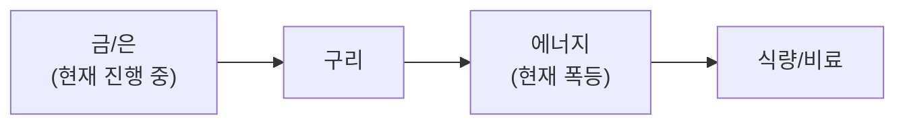

**3월 25일(화), 유가 재반등 + 미군 추가 파병 + KOSPI 급반등 + AI 에이전트 시대.** 유가 WTI **$91**(장중 $88→$93), Brent **$99**(장중 **$100 재돌파**) — 트럼프 5일 연기에도 **이란 대화 부인 + 이스라엘 테헤란 2차 공습** + **82공수사단 3,000명 + 해병대 2,500명 추가 파병**으로 유가 재반등. S&P **6,556(-0.37%)** — 유가 재상승에 전일 반등 반납. 이란전쟁 **25일차**, 82,000 민간 구조물 파괴. CNN: **"종전 전망 안 보인다"**.

**KOSPI 5,696(+5.37%) 급반등 + 원화 ~1,496.** 전일 패닉에서 **강한 V자 반등**. 원화 1,504→**~1,496** 안정. BOK 100조 안정화 + WGBI **4월 편입** 임박. EWY 1W **-2.37%**, 3M **+40.33%**. 상해 3,881(+1.78%), 항셍 25,064(+2.79%). 아시아 전반 반등.

**금 $4,545 반등 + 비트코인 $70,581.** 금 **$4,545(+3.2%)** — 유가 재반등→지정학 불확실성 지속→안전자산 수요 회복. JPM **Q4 $5,055**, 장기 **$5,400** 타겟. 비트코인 **$70,581(-0.47%)** 보합 — 지정학 리스크 지속으로 위험자산 관망.

**Micron Q2 $23.8B(매출 3배) + AI 에이전트 시대.** Micron 분기 매출 **$23.8B**(전년 $8.05B 대비 **196% 폭증**). 2026~2027 생산능력 **완전 매진**. HBM4 36GB **양산 시작**(NVIDIA Vera Rubin용). 젠슨 황 GTC: **"AI 3번째 변곡점 — AI 에이전트 시대 개막"**. SaaS→**AaaS(Agent as a Service)** 전환. 박세익: **"AI 인프라 사이클 초중반. 반도체·전력기기·ESS·2차전지 4대 핵심 섹터"**.

## 6대 투자 섹터 구조

| 섹터 | 하위 섹터 | 상세 분석 |
|------|----------|----------|
| **1. 반도체/AI** | HBM, DRAM/NAND, 파운드리, 소부장, AI SW/클라우드 | [반도체 섹터](/knowledge/invest/2026/01/21/semiconductor-sector-outlook-2026.html) |
| **2. 에너지** | 원전/SMR, 재생에너지, ESS, 수소 | [에너지 섹터](/knowledge/invest/2026/03/07/energy-sector-outlook-2026.html) |
| **3. 방산/우주** | 방산, 드론/UAM, 우주/위성 | [방산/우주 섹터](/knowledge/invest/2026/03/07/defense-space-sector-outlook-2026.html) |
| **4. 모빌리티/로봇** | EV/자율주행, 로봇, 조선 | [모빌리티/로봇 섹터](/knowledge/invest/2026/01/21/automotive-robotics-sector-outlook-2026.html) |
| **5. 바이오/헬스케어** | 신약/바이오텍, GLP-1/비만치료, 의료AI | [바이오/헬스케어 섹터](#바이오헬스케어-및-생명공학) |
| **6. 자산/거시경제** | 금/은, 암호화폐, 원자재/희토류, 거시경제/정책 | [거시경제/정책 섹터](/knowledge/invest/2026/01/21/macroeconomic-policy-sector-outlook-2026.html) |

### 하위 섹터 상세 링크

**반도체/AI**
- [HBM 투자 전망](/knowledge/invest/2026/01/21/hbm-sector-outlook-2026.html)
- [DRAM/NAND 투자 전망](/knowledge/invest/2026/01/21/dram-nand-sector-outlook-2026.html)
- [파운드리 투자 전망](/knowledge/invest/2026/01/21/foundry-sector-outlook-2026.html)
- [소부장 투자 전망](/knowledge/invest/2026/01/21/semiconductor-materials-equipment-outlook-2026.html)
- [AI 소프트웨어/클라우드](/knowledge/invest/2026/03/07/ai-software-cloud-outlook-2026.html)

**에너지**
- [원전 투자 전망](/knowledge/invest/2026/01/21/nuclear-power-sector-outlook-2026.html)

**방산/우주**
- [방산 투자 전망](/knowledge/invest/2026/01/21/defense-sector-outlook-2026.html)

**모빌리티/로봇**
- [EV/자율주행 투자 전망](/knowledge/invest/2026/01/21/ev-autonomous-driving-outlook-2026.html)
- [로봇 투자 전망](/knowledge/invest/2026/01/21/robotics-sector-outlook-2026.html)
- [조선 투자 전망](/knowledge/invest/2026/01/21/shipbuilding-sector-outlook-2026.html)

**자산/거시경제**
- [원자재/희토류](/knowledge/invest/2026/03/07/commodities-rare-earth-outlook-2026.html)

---

## 미래 워치리스트

| 테마 | 현황 | 주시 포인트 |
|------|------|-----------|
| **양자컴퓨팅** | Google Willow, IBM Heron 등 진전. 상용화 초기 | 오류 정정(QEC) 돌파, 금융/제약 응용 |
| **합성생물학** | AI+유전체 편집 융합 가속 | 바이오 제조, 식량/에너지 응용 |
| **BCI (뇌-컴퓨터 인터페이스)** | Neuralink 임상시험, 경쟁사 등장 | FDA 승인, 의료 응용 확대 |
| **핵융합** | Commonwealth Fusion, TAE 등 민간 투자 확대 | 상용 발전 시점(2030년대 중반 전망) |

---

## 목차

1. [거시적 시장 환경](#거시적-시장-환경)
2. [AI 및 클라우드 컴퓨팅](#ai-및-클라우드-컴퓨팅)
3. [AI 네트워크 인프라](#ai-네트워크-인프라)
4. [반도체 및 첨단 제조](#반도체-및-첨단-제조)
5. [로보틱스 및 자율주행](#로보틱스-및-자율주행)
6. [에너지 전환 및 친환경](#에너지-전환-및-친환경)
7. [바이오헬스케어 및 생명공학](#바이오헬스케어-및-생명공학)
8. [우주산업 및 뉴스페이스](#우주산업-및-뉴스페이스)
9. [방위산업 및 국방기술](#방위산업-및-국방기술)
10. [핀테크, 암호화폐 및 STO](#핀테크-암호화폐-및-sto)
11. [사이버보안 및 데이터 인프라](#사이버보안-및-데이터-인프라)
12. [지정학적 관점: 한국은 1980년대 일본](#지정학적-관점-한국은-1980년대-일본)
13. [초거대 기업들의 전략과 투자 방향](#초거대-기업들의-전략과-투자-방향)
14. [한국 시장 구조 변화](#한국-시장-구조-변화)
15. [섹터별 투자 전략: 3월 실전 가이드](#섹터별-투자-전략-3월-실전-가이드)

---

## 거시적 시장 환경

### 글로벌 증시 현황 (3/25 기준)

| 지수 | 수준 | 변동 | 비고 |
|------|------|----------|------|
| **S&P 500** | **6,556** | **-0.37%** | **SPY $653.18. 유가 재반등+미군 추가 파병에 전일 급등 반납** |
| **NASDAQ** | **21,947** | **+1.38%** | **NVDA $175.20(-0.27%). SOXX 341(+1.32%). 반도체 견조** |
| **KOSPI** | **5,696** | **★★ +5.37%** | **급반등. EWY 1W -2.37%, 3M +40.33%. 아시아 전반 반등** |
| **상해종합** | **3,881** | **+1.78%** | 반등. 아시아 리스크온 |
| **항셍** | **25,064** | **+2.79%** | 반등. 중국 인터넷 수혜 |
| **원/달러** | **~1,496원** | **★ 안정** | **1,504→~1,496. BOK 100조 안정화. 1,500원 하회** |
| **Brent** | **~$99** | **★★ 재반등** | **장중 $100 재돌파. 이란 부인+이스라엘 2차 공습→디에스컬레이션 불발** |
| **WTI** | **~$91** | **★★ 반등** | **$86→$91. Brent-WTI 스프레드 ~$8(축소). 해상 교란 지속** |
| **금(Gold)** | **$4,545** | **★ +3.2%** | **반등. JPM Q4 $5,055. 지정학 불확실성 지속→안전자산 수요 회복** |
| **은(Silver)** | 조정 중 | **$100 전망 유지** | 6년 연속 공급적자 |
| **비트코인** | **$70,581** | **-0.47%** | **보합. 지정학 리스크→위험자산 관망** |
| **VIX** | **26.15** | **-2.35%** | **소폭 안정. 극단 시나리오 후퇴** |
| **TLT** | **86.01** | **-0.44%** | **10Y 4.34%(-5bp), 2Y 3.83%, 스프레드 0.49%** |
| **SOXX** | **341.02** | **+1.32%** | **반도체 견조. Micron Q2 $23.8B 사상 최대** |
| **하이일드 스프레드** | **3.19%** | **-1.54%** | **축소. 리스크 선호 개선** |
| **5Y Breakeven** | **2.55%** | **+0.79%** | **인플레 기대 소폭 상승. 유가 재반등 반영** |
| **실업률** | **4.4%** | **+0.1%p** | FOMC 동결. 1회 인하 전망. CME 6월 인하 46.8% |
| **DXY** | **99.15** | **1W -0.94%** | 달러 약세 지속 |

### 이번 주 핵심 변화 (3/25 업데이트)

| 항목 | 변화 | 투자 시사점 |
|------|------|-----------|
| **★★★ 유가 재반등** | **WTI $86→$91, Brent $101→$99(장중 $100 재돌파). 이란 부인+이스라엘 2차 공습** | **디에스컬레이션 불발 확인. 유가 $90대 고착** |
| **★★★ 미군 추가 파병** | **82공수사단 3,000명 + 해병대 2,500명. 이란 카르그섬 점령 등 지상 작전 가능** | **전쟁 확대 시그널. 호르무즈 해협 확보 목적** |
| **★★★ 이란전쟁 25일차** | **82,000 민간 구조물 파괴. CNN "종전 전망 안 보인다". 사우디·UAE 참전 검토** | **장기화 기정사실화. 방산 수혜 지속** |
| **★★★ Micron Q2 $23.8B** | **매출 3배(전년 $8.05B). 2026~27 생산능력 완전 매진. HBM4 양산 시작** | **메모리 슈퍼사이클 가속. AI 인프라 수요 폭발** |
| **★★ KOSPI 5,696(+5.37%)** | **패닉 5,517→5,696 급반등. 아시아 전반 반등** | **V자 반등. 구조적 상승 기반 건재** |
| **★★ 금 $4,545 반등** | **$4,407→$4,545(+3.2%). 지정학 불확실성→안전자산 수요 회복** | **JPM Q4 $5,055. 유가 재반등이 금 반등 촉매** |
| **★★ AI 에이전트 시대** | **젠슨 황: AI 3번째 변곡점. SaaS→AaaS. 컴퓨팅 4년 만에 만 배** | **AI 인프라 수요 장기 폭증 확인** |
| **★★ 호르무즈 통행료** | **이란, 선박당 최대 $200만(~30억원) 통행료 부과 시작** | **사실상 봉쇄 지속. 해운비 급등** |
| **★ S&P 6,556(-0.37%)** | **유가 재상승+미군 파병에 전일 급등 반납** | **디에스컬레이션 기대 후퇴** |
| **★ 환율 ~1,496원** | **1,504→~1,496. 1,500원 하회. 박세익: "과거 1,500원 이상에서 투자 시 손해 없었다"** | **환율 위기 소폭 완화. 수출기업 유리** |

### 핵심 매크로 변수 5가지

#### 1. 이란전쟁 25일차 — 유가 재반등 + 미군 추가 파병 + 디에스컬레이션 불발

| 항목 | 내용 | 투자 시사점 |
|------|------|-----------|
| **★★★ 유가 재반등** | **WTI $86→$91, Brent $99(장중 $100). 트럼프 5일 연기에도 유가 재상승** | **디에스컬레이션 불발. $90대 고착 확인** |
| **★★★ 미군 추가 파병** | **82공수사단 3,000명 + 해병대 2,500명. "잠재적 이란 지상 작전" 가능** | **전쟁 확대 시그널. 호르무즈 확보 목적** |
| **★★★ 이스라엘 2차 공습** | **테헤란 인프라 대규모 공습 재개. "wide-scale wave of strikes"** | **트럼프 연기와 무관하게 이스라엘 독자 행동** |
| **★★ 이란 강경파 부상** | **신임 국가안보 책임자 졸가르(혁명수비대 출신). 이란 여론 "맞서 싸우자"** | **협상 가능성 더 후퇴. 강경 대응 예상** |
| **★★ 호르무즈 통행료** | **선박당 최대 $200만(~30억원) 부과 시작. 해상 통행 거의 중단** | **사실상 봉쇄+수익화. 해운비 급등** |
| **★★ 사우디·UAE 참전 검토** | **이란 공격에 반발. 미국·이스라엘 측 합류 검토** | **전쟁 확전 + 중동 균열** |
| **★★ 82,000 구조물 파괴** | **이란적십자: 82,000+ 민간 구조물 파괴. 사상자 수천 명** | **인도적 위기 심화. 국제 압박 증가** |
| **★ 트럼프 발표 시점 조작 의혹** | **CNN: 공격 발표=마감 후(주말), 협상 발표=개장 직전(월요일) 패턴 반복** | **정보 비대칭 이용 가능성. 시장 신호 주의** |

**핵심 판단:** 트럼프 **5일 공격 연기** 효과가 **하루 만에 소멸**. 유가 WTI **$86→$91 재반등**, Brent **$99(장중 $100 재돌파)**. 이란은 대화를 **전면 부인**하고 강경파 **졸가르**를 국가안보 책임자로 임명. 이스라엘은 테헤란 **2차 대규모 공습** 재개. **미군 해병대 2,500명 추가 파병**은 **호르무즈 해협 확보 + 지상 작전 가능성**을 시사 — 전쟁 **확전 리스크** 재부상. 호르무즈 **통행료 부과**는 봉쇄의 **수익화 단계**로 해제 가능성 더 낮아짐. 유가 **$90대 고착**이 기본 시나리오. 에너지 비중 **14% 유지**, 유가 $95 상회 시 **재확대 검토**.

#### 2. 사모신용 $265B 멜트다운 — El-Erian "전염 현상" + $2.1T 시장 2008년 이후 최대 위기

| 항목 | 내용 | 투자 시사점 |
|------|------|-----------|
| **★ Fortune $265B 멜트다운** | **월가 최대 투자 열풍이 패닉으로 전환. $2.1T 시장 2008년 이후 최대 위기** | 시스템 리스크 진행 중 |
| **★ El-Erian 경고** | **"전형적인 전염 현상" — 원하는 걸 못 팔면 팔 수 있는 걸 판다** | 다른 자산 클래스로 전이 우려 |
| **BlackRock** | **$26B 펀드 5% 환매 제한. $25M 대출 전액 손실** | 세계 1위 운용사 위기 |
| **Blackstone** | **BCRED $6.5B(7.9%) 환매 요청. 임직원 $400M 자체 투입** | 전례 없는 자구책 |
| **★ AI 담보 파괴 "SaaS-pocalypse"** | **에이전틱 AI→SaaS 구독 매출 침식. 사모 대출 포트폴리오 40%가 소프트웨어 기업** | 구조적 원인. AI 발전할수록 악화 |
| **사모신용 부도율** | **Fitch: 사모신용 부도율 사상 최고 9.2%** | 악화 가속 |
| **하이일드 스프레드** | **3.28%(+3.47%) — 신용 스프레드 확대 지속** | 전이 신호 |

**판단:** Fortune이 **"$265B 멜트다운"**으로 보도, El-Erian이 **"전형적인 전염 현상"** 경고. Fitch 부도율 **9.2% 사상 최고**. 핵심 원인은 AI(에이전틱 AI)가 SaaS 기업 담보 가치를 구조적으로 파괴하는 **"SaaS-pocalypse"** — 사모 대출 포트폴리오의 **40%가 소프트웨어 기업**. Blackstone BCRED $6.5B 환매에 임직원 $400M 투입이라는 전례 없는 자구책. **하이일드 스프레드 3.28%로 확대 지속**. **현금·금 비중 유지 + 금융주 경계** 필수.

#### 3. KOSPI 5,696(+5.37%) 급반등 + 원화 ~1,496 안정 — 박세익 "환율 1,500원은 위기 아니다"

| 항목 | 내용 | 투자 시사점 |
|------|------|-----------|
| **★★ KOSPI 3/25** | **5,696 (+5.37%)** | **패닉 5,517에서 급반등. 아시아 전반 리스크온** |
| **★★ 원화 ~1,496원** | **1,504→~1,496. 1,500원 하회 안정** | **환율 위기 완화 조짐** |
| **★★ 박세익 환율 분석** | **"1,500원은 금융 시스템 위기 아님. 해외투자 자금+대미 투자 부담. 역사적으로 1,400원+ 투자 시 손해 없었다"** | **환율=수출기업 기회. 패닉 매도 금지** |
| **★ EWY 1W -2.37%** | **여전히 마이너스이나 극심한 하락에서 회복 중** | **자금 유출 진정 추세** |
| **★ EWY 3M +40.33%** | **3개월 글로벌 최강 지속** | **구조적 상승 기반 건재** |
| **★ 삼프로TV 핵심** | **코스피 전일 -6.49%(외국인 4조+기관 4.6조 매도 vs 개인 8조 매수). 트럼프 풋 확인** | **개인 매수 강도 사상 최대** |
| **★ SK하이닉스 ADR 상장 검토** | **10~15조원 신주 발행. 기업가치 재평가 기대 vs 지분 희석** | **한국 반도체 글로벌 접근성 확대** |
| **WGBI 4월 편입** | **8회 분할 편입 시작. $56B+ 외국인 자금 유입** | **구조적 외국인 매수 촉매** |

**판단:** KOSPI **5,696(+5.37%)**로 **강한 V자 반등**. 박세익 대표: **"환율 1,500원은 금융 시스템 위기가 아니라 서학개미 해외투자(작년 100조)+대미 투자 자금 부담. 역사적으로 1,400원 이상에서 6개월~1년 투자 시 한 번도 손해 본 적 없다"** — 수출기업에 유리한 환경. 원화 **~1,496원**으로 1,500원 하회 안정. 삼프로TV(박병창): **개인 8조 매수(외국인 4조+기관 4.6조 매도 vs)**로 개인 순매수 사상 최대. **트럼프 풋 확인** — 유가 상승·국채 금리 상승을 용인하지 않음. SK하이닉스 **ADR 상장 검토**(10~15조원)는 글로벌 재평가 촉매. 그러나 **영국 10Y 국채 5%(08년 위기 수준)** 등 글로벌 채권 불안 잔존. **한국 비중 유지, WGBI 4월 편입이 핵심 촉매**.

#### 4. Micron Q2 $23.8B(매출 3배) + HBM4 양산 + AI 에이전트 시대 — 메모리 슈퍼사이클 가속

| 항목 | 내용 | 투자 시사점 |
|------|------|-----------|
| **★★★ Micron Q2 $23.8B** | **전년 $8.05B 대비 196% 폭증. 2026~27 생산능력 완전 매진** | **메모리 슈퍼사이클 가속. 공급 부족 확정** |
| **★★★ HBM4 양산 시작** | **Micron 36GB 12-high HBM4 양산 개시(NVIDIA Vera Rubin용). R100 288GB 탑재** | **HBM 수요 폭증. SK하이닉스 60%, Micron 진입** |
| **★★ AI 에이전트 시대** | **젠슨 황: 3번째 변곡점. SaaS→AaaS. 컴퓨팅 4년 만에 만 배. "모든 사람이 수십~수백 AI 에이전트"** | **AI 인프라 수요 장기 폭증** |
| **★★ 박세익 4대 섹터** | **"AI 인프라 사이클 초중반. 반도체·전력기기·ESS·2차전지가 핵심"** | **한국 AI 인프라 수혜주 집중** |
| **★★ SK하이닉스 HBM4 70%** | **UBS: HBM4 시장점유율 70% 전망. 삼성 30%+** | **한국 메모리 양강 체제 강화** |
| **★ SOXX $341(+1.32%)** | **반도체 견조. 매크로 역풍 속 상대적 강세** | **펀더멘탈>매크로. 분할 매수 유효** |
| **★ NVDA $175.20** | **보합. 지정학 리스크 속 $175 지지** | **$1T 매출 전망 유지** |
| **★ 글로벌 반도체 $975B** | **+25% YoY. 메모리 +30%. WSTS $1T 임박** | **기가사이클 가속** |

**핵심 판단:** Micron Q2 **$23.8B(196% 폭증)** + 2026~27 **생산능력 완전 매진**이 메모리 슈퍼사이클을 **정량적으로 확인**. HBM4 **36GB 양산 시작**(NVIDIA Vera Rubin용)으로 SK하이닉스(60%)·삼성(30%+)·Micron 3사 체제 본격화. 젠슨 황 GTC에서 **AI 에이전트 시대 선언** — SaaS→AaaS 전환으로 AI 인프라 수요 **구조적 폭증**. 박세익: **"AI 인프라 사이클 초중반, 35배 상승 가능"**(2006 중국 인프라 비유). 소수몽키: **메모리 반도체(샌디스크 YTD +199%) + 광통신(코런트 S&P 편입)이 수혜**. **반도체 비중 22% 확대(21%→)**.

#### 5. 금 $4,545 반등 + 유가 재반등→인플레 불확실성 지속

| 항목 | 현황 | 변화 |
|------|------|------|
| **★★ 금 $4,545 반등** | **$4,407→$4,545(+3.2%). 지정학 불확실성→안전자산 수요 회복** | **JPM Q4 $5,055, 장기 $5,400. "조정 내 매수"** |
| **★★ 유가 재반등** | **WTI $91, Brent $99. 디에스컬레이션 불발→유가 $90대 고착** | **에너지 인플레 완화 기대 후퇴** |
| **★★ Fed 동결 96%** | **CME: 3월 96% 동결. 6월 인하 46.8%. 연내 동결 가능성 우세** | **금리 고착 장기화** |
| **★★ PCE 2.7% 고착** | **12월 2.5%→3월 2.7%. 핵심 PCE도 2.7%** | **인플레 고착. 유가 $90대가 추가 상향 리스크** |
| **★ 10Y 금리 4.34%** | **-5bp. 2Y 3.83%. 스프레드 0.49%** | **소폭 안정. 금리 고점 여부 주시** |
| **★ 5Y Breakeven 2.55%** | **2.53%→2.55%(+2bp). 소폭 반등** | **유가 재반등→인플레 기대 재상승** |
| **★ 트럼프 풋 확인** | **유가·금리 상승 용인 안 함. 그러나 이스라엘 독자 행동 제어 불가** | **정책 의지 vs 실행 괴리** |
| **VIX 26.15** | **-2.35%(26.78→26.15). 소폭 안정** | **극단 시나리오 후퇴이나 높은 수준 유지** |
| **HY 스프레드 3.19%** | **-1.54% 축소** | **리스크 선호 개선** |
| **실업률 4.4%** | **NFP -92K. 신규실업 205K(-8K)** | **고용 약화 지속** |

**판단:** 금 **$4,545(+3.2%)** 반등 — 유가 재반등(WTI $91)으로 **지정학 불확실성 지속 확인** → 안전자산 수요 회복. JPM **Q4 $5,055**, 장기 **$5,400** 타겟. 유가 **$90대 고착**이 인플레 기대를 재상승시킴(5Y Breakeven 2.55%). Fed **동결 96%**, 6월 인하 **46.8%**로 금리 고착 장기화. 그러나 **실업률 4.4%(+0.1%p)**·NFP **-92K**로 고용 약화 지속 — "유가 인플레 + 고용 약화"의 **스태그플레이션 시그널** 강화. 금은 스태그플레이션 환경에서 **최적의 자산**. **금 7% 유지, $4,200↓시 적극 매수, $4,600↑시 비중 확대 검토**.

### 관세 현황 -- Section 122 15% 발효 중 (7/23 만료)

| 관세 | 세율 | 상태 | 비고 |
|------|------|------|------|
| **글로벌 보편관세** | **15%** | **발효 중** (2/24~) | **150일 한시** (7/23 만료) |
| **중국 관세** | **35~50%** | USTR 유지 | **트럼프-시진핑 정상회담 3월 말 변수** |
| **반도체** | 25%+ | **Section 232 유지** | 별도 법적 근거 |
| **자동차** | **25%** | **4/3 발효 예정** | **현대/기아 직접 타격** |
| **철강/알루미늄** | 25% | **Section 232 유지** | 3/12 발효 |

---

## AI 및 클라우드 컴퓨팅

### 현재 상황 (3월 25일 — AI 에이전트 시대 개막 + Micron 매출 3배 + 빅테크 AI 해고 물결)

젠슨 황 GTC: **"AI 3번째 변곡점 — AI 에이전트 시대 개막"**. 2022년 생성AI → 2024년 추론AI → **2026년 AI 에이전트**(스스로 도구 사용·업무 수행). **SaaS→AaaS(Agent as a Service)** 전환. 컴퓨팅 용량 **4년 만에 만 배** 증가. 빅테크 2026년 AI CAPEX **~$700B**(전년 대비 60%+). **$1T 구매주문** 전망. **빅테크 AI 해고 물결** — Meta 20%(15K명), Oracle $2.1B 구조조정, YTD **35,000명+** 해고. 에이전틱 AI 시장 **$8B→$215B(2035)**. **AI가 일자리 파괴 + 인프라 수요 폭증**의 이중 구조.

| 기업 | 2026 AI CAPEX | 핵심 이슈 |
|------|--------------|---------|
| **Amazon** | **$2,000억** | FCF 마이너스 전환 전망 |
| **Alphabet** | **$1,850억** | FCF 90% 감소 전망 |
| **Microsoft** | **$1,450억** | Azure AI 확대 |
| **Meta** | **$1,350억** | FCF 90% 감소 전망 |
| **합계** | **$6,500~7,000억** | 전년 대비 **+60% 이상** |

### 핵심 투자 포인트

| 영역 | 내용 | 전망 |
|------|------|------|
| **AI 칩셋** | 엔비디아 시총 ~$4.31조 | **GTC 진행: $1T 주문, Vera Rubin 10x, Eaton 전력 파트너십** |
| **커스텀 ASIC** | **Broadcom AI $8.4B(+74%)**, **Marvell $0→$1.5B** | 2026년 GPU 출하량 추월 전망 |
| **클라우드 인프라** | AWS, Azure, GCP | $7,000억 투자 직접 수혜 |
| **AI 응용** | CRM, 헬스케어, 금융 AI | 하드웨어 실적 파티 vs 소프트웨어 수익화 미완 |

### 3월 투자 전략

**단기**: GTC 마감. **Groq 3 LPU 3,500배 추론** + **CHBM 세계 최초**가 핵심 테이크어웨이. **$1T 매출 전망** 상향. **TeraFab 3/21 런칭** — 테슬라 $25B 자체 반도체 팹(2nm, AI5·D3칩). 빅테크 **AI 해고 물결**(Meta 20%, Oracle $2.1B) — AI 투자 가속화의 이면.

**중기**: 에이전틱 AI 시장 **$8B→$215B(2035)**. AI 에이전트가 일자리 파괴 + 인프라 수요 폭증의 **이중 구조**. H2 **IPO 러시**(Anthropic, OpenAI, SpaceX) 기대.

**리스크**: ①빅테크 AI 해고→소비 둔화→경기 침체, ②유가 $100→데이터센터 전력비 상승, ③AI 칩 수출통제.

### 주요 기업 및 ETF

**대표 기업:**
- 엔비디아 (NVDA): 시총 ~$4.31조. **GTC 마감: Groq 3 LPU 3,500배 + Vera Rubin $1T + CHBM**
- **AMD (AMD)**: MI455X + Helios — Meta 6GW + OpenAI 6GW = **12GW 계약**
- **Broadcom (AVGO)**: AI 매출 **$8.4B(+74%)**, 커스텀 ASIC 리더
- **Marvell (MRVL)**: ASIC 매출 **$0→$1.5B**

**투자 ETF:**
- BOTZ (Global X Robotics & AI ETF)
- ROBO (ROBO Global Robotics & Automation Index ETF)

---

## AI 네트워크 인프라

### 핵심 테마: 데이터센터 ROI의 열쇠

$700B 규모의 AI 데이터센터 투자에서 **네트워크 인프라는 ROI를 결정짓는 핵심 요소**입니다.

### InfiniBand vs Ethernet 경쟁

| 기술 | 대표 기업 | 특징 |
|------|----------|------|
| **InfiniBand** | 엔비디아 (Mellanox) | 현재 AI 학습 표준, 저지연 |
| **Ethernet (AI용)** | Arista Networks, Broadcom | 범용성 우수, 비용 효율적 |

### ★ CPO(Co-Packaged Optics) — 2026년 월가 TOP1 테마

**구리선의 물리적 한계**: 224G SerDes 환경에서 구리 전송 거리가 **50cm까지 축소**. 스킨 이펙트로 열과 전력 소모 급증. **CPO가 유일한 대안** — 광통신 모듈을 칩 패키지에 통합하여 전기→광 신호 변환.

| 항목 | 내용 |
|------|------|
| **시장 성장** | **2026년 양산 시작, 연간 137% 성장** |
| **NVIDIA** | Spectrum-X Photonics (Ethernet CPO) **H2 2026 출시**, Quantum-X IB 115Tb/s |
| **Marvell** | 광통신 포토닉 패브릭스, AEC, DSP, 커스텀 칩. **고점 대비 -30% 저평가** |
| **Credo** | AEC 리타이머, CPO 핵심 부품 |
| **Corning** | 광섬유 소재 공급 |

### 대역폭 에스컬레이션

```
현재: 400G
진행중: 800G
2026-2027: 1.6T (CPO 양산 시작)
2028+: 3.2T
```

각 세대 전환마다 **광트랜시버, 스위치, 광케이블** 수요가 2배씩 증가. **CPO가 1.6T 이상에서 필수 기술**.

### 핵심 투자 기업

| 기업 | 분야 | 핵심 강점 |
|------|------|----------|
| **Arista Networks** | 데이터센터 스위칭 | AI 데이터센터 네트워킹 1위 |
| **Coherent** | 광트랜시버 | 시장 점유율 1위, 800G/1.6T 리더 |
| **Lumentum** | 광학 부품 | 레이저, 광부품 핵심 공급 |
| **Broadcom** | 네트워크 칩 + ASIC | AI 네트워크 + 커스텀 ASIC, **AI $8.4B(+74%)** |

---

## 반도체 및 첨단 제조

### 핵심 이벤트: Micron Q2 $23.8B(매출 3배) + HBM4 양산 시작 + AI 에이전트 시대

**메모리 슈퍼사이클 정량적 확인.** Micron Q2 매출 **$23.8B**(전년 $8.05B 대비 **196% 폭증**). 2026~27 생산능력 **완전 매진**. HBM4 36GB 12-high **양산 시작**(NVIDIA Vera Rubin용). R100 슈퍼칩 **288GB HBM4** 탑재. SK하이닉스 HBM4 시장점유율 **70%**(UBS), 삼성 **30%+**. 젠슨 황: **AI 에이전트 시대 개막** — 컴퓨팅 4년 만에 만 배, SaaS→AaaS. 삼성 GTC에서 **HBM4E 공개**(4TB/s). SOXX **341(+1.32%)** 견조.

| 항목 | 내용 | 투자 시사점 |
|------|------|-----------|
| **★★★ Micron Q2 $23.8B** | **매출 3배(196%). 2026~27 완전 매진. HBM4 양산 시작** | **메모리 슈퍼사이클 정량 확인** |
| **★★ SK하이닉스 HBM4 70%** | **UBS: HBM4 시장점유율 70%. NVIDIA Rubin 핵심 공급** | **한국 메모리 지배력 강화** |
| **★★ 삼성 HBM4 30%+** | **NVIDIA HBM4 30%+ 공급 확보. HBM4E(4TB/s) 공개** | **삼성 메모리 이익 300%+(MS)** |
| **★★ AI 에이전트 시대** | **젠슨 황: 3번째 변곡점. 컴퓨팅 만 배. 모든 사람 수십~수백 AI 에이전트** | **AI 인프라 수요 구조적 폭증** |
| **★★ 메모리주 강세** | **샌디스크 YTD +199%(S&P 1위). 시게이트 4위. 마이크론 12위** | **메모리 = 2026년 최강 서브섹터** |
| **★ SOXX $341(+1.32%)** | **반도체 견조. 매크로 역풍 속 상대적 강세 유지** | **분할 매수 유효** |
| **★ NVDA $175.20** | **보합. 지정학 속 $175 지지. $1T 매출 전망** | **장기 최강 포지션** |
| **★ CPO 양산 시작** | 2026년 변곡점, 연간 137% 성장. 코런트 S&P 500 편입 | AI 네트워크 핵심 테마 |
| **반도체 $975B** | **+25% YoY. 메모리 +30%. $1T 임박** | 기가사이클 가속 |

### 한국 메모리의 기가사이클

**SK하이닉스 HBM 시장 점유율 62%**로 압도적 1위. **삼성은 HBM4 PRA 완료**로 양산 본격화 임박.

핵심 포인트:
- **SK하이닉스**: HBM 62% 점유, 16단 48GB HBM4 공개
- **삼성 HBM4 PRA 완료**: 세계 최초 양산 출하, 대역폭 3.3TB/s
- **DRAM Q1 +90~95%**: 역사적 기록
- **SIA $1T**: 2026년 글로벌 매출 $1조 돌파 전망

### 3월 투자 전략

**핵심 전략: GTC 촉매 대기 + DRAM 슈퍼사이클 + 오일 쇼크 디커플링**

1. **삼성전자**: HBM4 PRA 완료 + MS 2027 OP 317조 + DRAM Q1 +95%. KOSPI 폭락으로 저가 매수 기회.
2. **SK하이닉스**: HBM 62% 점유율, PER 극저. DRAM Q2 추가 상승.
3. **엔비디아**: 시총 $4.31T. **GTC 3/16~19 핵심**. Vera Rubin + Feynman + NVL144.
4. **커스텀 ASIC**: Broadcom AI $8.4B(+74%), Marvell $1.5B.
5. **소부장**: 한미반도체(영업이익률 50%, TC 본더 71.2%), HPSP(55%), 리노공업(48%).

### 주요 기업

| 카테고리 | 주요 기업 | 현황 |
|----------|----------|------|
| **AI 칩** | 엔비디아, AMD | GTC 3/16~19, SOXX +3.98% |
| **파운드리** | TSMC, 삼성전자 | TSMC N2 램프 |
| **메모리** | 삼성전자, SK하이닉스 | SK 62% HBM, DRAM Q1 +95% |
| **커스텀 ASIC** | Broadcom, Marvell | Broadcom AI $8.4B(+74%) |
| **소부장** | 한미반도체, HPSP, 리노공업 | 고수익성 지속 |
| **장비** | ASML, 램리서치 | ASML 분기 주문 EUR132억 기록 |

**ETF:**
- SMH (VanEck Semiconductor ETF)
- SOXX (iShares Semiconductor ETF) — **+3.98% (오일 쇼크 속 반등)**

---

## 로보틱스 및 자율주행

### 현재 상황: 자율주행 변곡점 + 옵티머스 여름 양산 + 사이버캡 4월

| 항목 | 내용 | 시사점 |
|------|------|--------|
| **★★ Waymo 20도시·주100만회** | **2026년 20개 도시 확장. 주 100만 라이드 목표** | 자율주행 상용화 본격화 |
| **★★ CES 자율주행 전환** | **CES 2026 모빌리티 트렌드: EV→자율주행으로 전환** | 산업 변곡점 확인 |
| **★ 옵티머스 3 여름 양산** | **2026년 여름 초기 생산 확정**(머스크 공식 발표). 2027년 여름 대량 생산 | 타임라인 구체화 |
| **★ 기가텍사스 로봇 공장** | **900만 sq ft(25만평) 전용 공장**. 기존 공장 합산 57만평 = 여의도 66% | 대규모 투자 확인 |
| **양산 목표** | 프리몬트 연간 100만 대, **기가텍사스 연간 1,000만 대** | <$20K, 소프트웨어 구독 $200/월 |
| **★ 사이버캡 4월 양산** | **4월부터 주당 수백 대 양산**. $30K 미만. 완전자율주행 전용 | 로보택시 상용화 가속 |
| **AV 시장 $39.3B** | **2026년 글로벌 AV 시장 $39.3B. 4.3만 대** | 급성장 초입 |
| **Zoox+Uber** | **Zoox, Uber 자율주행 라이드 서비스 2026년 출시** | 경쟁 가속 |
| **★ X머니 4월 출시** | **비자 제휴, 메탈 카드, 탭투페이**. FSD/로보택시/에너지 결제 통합 | 테슬라 생태계 수익화 |
| **중국 로봇 90% 점유** | 중국 기업들이 글로벌 판매량 90%+ 장악 | 경쟁 리스크 주의 |
| **자동차 관세 25%** | 4/3 발효 예정 | 현대/기아 직접 타격 |

### 한국 로봇 섹터

- 두산로보틱스: 협동 로봇 리더
- 레인보우로보틱스: 휴머노이드 로봇 개발
- 현대차/보스턴다이나믹스: 기업가치 ~55조원
- **주의**: 중국 휴머노이드 로봇 **87-90%** 점유 — 경쟁 리스크 최대

**ETF:**
- BOTZ (Global X Robotics & AI ETF)
- ROBO (ROBO Global Robotics & Automation Index ETF)

---

## 에너지 전환 및 친환경

### 유가 재반등 + 미군 추가 파병 + 호르무즈 통행료 + 원전 르네상스

| 항목 | 내용 |
|------|------|
| **★★★ 유가 재반등** | **WTI $91, Brent $99(장중 $100 재돌파). 전일 $86 폭락에서 반등** |
| **★★★ 미군 추가 파병** | **82공수사단 3,000명 + 해병대 2,500명. 호르무즈 확보·지상 작전 가능** |
| **★★ 호르무즈 통행료** | **이란, 선박당 $200만(~30억원) 부과. 봉쇄의 수익화 단계** |
| **★★ 이스라엘 2차 대규모 공습** | **테헤란 인프라 "wide-scale wave of strikes". 트럼프 연기와 무관** |
| **★★ 걸프 인프라 누적** | **이라크 FM(900K) + 쿠웨이트 730K + 카타르 LNG 17% = ~3M bpd** |
| **★★ 사우디·UAE 참전 검토** | **이란 공격에 반발. 미국·이스라엘 측 합류 검토** |
| **★ 에너지 인플레 재부상** | **유가 재반등→5Y Breakeven 2.55%(+2bp). 인플레 기대 재상승** |
| **미국 원전 $80B** | 신규 원전 펀딩, AI 데이터센터 전력 수요 |

### 에너지 시나리오 (3/25 기준)

| 시나리오 | 유가 전망 | 확률 | 영향 |
|---------|----------|------|------|
| **봉쇄 지속 + 인프라 피격** | **$90~110** | **★★★ 최고 (40%)** | **이란 부인+이스라엘 2차 공습+호르무즈 통행료→현 봉쇄 지속. WTI $91이 기본선** |
| **위기 확전·장기화** | **$110~180** | **중-고 (30%)** | **미군 해병대 투입+사우디 참전→지상 작전. 호르무즈 완전봉쇄** |
| **제재 완화 + 부분 협상** | **$80~95** | **중 (20%)** | **다자 중재 성공 시 부분 봉쇄 해제. 그러나 이란 강경파 부상으로 가능성 축소** |
| **외교적 해결** | **$65~80** | **저 (10%)** | **전쟁 전 수준 회귀. 현실적으로 매우 어려움** |

**시나리오 변화:** 전일 대비 **재조정**. **"봉쇄 지속" 30%→40%** 상향 — 유가 재반등(WTI $86→$91)으로 디에스컬레이션 불발 확인. 이란 **강경파 졸가르** 임명 + 호르무즈 **통행료 부과**(봉쇄 수익화)로 해제 가능성 더 축소. **"위기 확전" 20%→30%** 상향 — **미군 해병대 2,500명 추가 파병** + **사우디·UAE 참전 검토** + 이스라엘 **2차 대규모 공습**. CNN: **"종전 전망 안 보인다"**. **"제재 완화" 40%→20%** 대폭 하향 — 트럼프 "생산적 대화"의 실체가 의심됨(이란 부인, CNN 시점 조작 지적). 유가 **$90대 고착이 기본 시나리오**, $100+ 상향 리스크 재부상.

### 핵심 하위 섹터

#### 원전 (Nuclear Renaissance) -- 에너지 안보 + AI 전력 수요

AI 데이터센터 전력 수요 + 이란 전쟁 에너지 안보 + 탈탄소 정책 삼중 호재.

| 항목 | 내용 | 투자 시사점 |
|------|------|-----------|
| **우라늄** | +32% YoY | 구조적 공급 부족 |
| **i-SMR 규제심사 착수** | 한국 SMR 규제 프로세스 시작 | 상용화 가시화 |
| **미국 $80B 신규 원전** | NuScale SMR 규제 승인 | 원전 르네상스 가속 |
| **KHNP 태국·필리핀** | 원전 수출 파이프라인 확대 | K-원전 해외 수주 |

#### 배터리/청정에너지 -- 오일 쇼크 대안 수요

**ICLN +3.04%, LIT +3.57%** — 오일 쇼크가 청정에너지/배터리로의 전환 수요를 가속. 에너지 위기가 장기화될수록 재생에너지·ESS 투자 강화.

### 투자 ETF

- ICLN (iShares Global Clean Energy) — **+3.04%**
- LIT (Global X Lithium & Battery Tech) — **+3.57%**
- URA (Global X Uranium ETF)

---

## 바이오헬스케어 및 생명공학

### 스태그플레이션 방어 + GLP-1 경쟁 구도 변화

오일 쇼크 + 스태그플레이션 환경에서 **방어적 헬스케어 매력도 상승**.

### 핵심 투자 포인트

#### GLP-1 비만 치료제

| 기업 | 현황 | 전망 |
|------|------|------|
| **Eli Lilly (LLY)** | GLP-1 시장 지배, EPS $35 전망(2026) | Mounjaro/Zepbound 선도 |
| **Novo Nordisk (NVO)** | 1년간 56% 하락, 경쟁 심화 | 저평가, $70 목표가 |
| **Viking Therapeutics** | 2상 결과 13주 14.7% 체중 감량 | 신규 경쟁자 |

#### AI 신약 개발

- 엑셀런시아, 리커전: AI 기반 약물 발견
- 빅테크 진출: 구글 DeepMind, 아마존 헬스케어

### 투자 ETF

- XBI (SPDR S&P Biotech ETF)
- IBB (iShares Biotechnology ETF)
- ARKG (ARK Genomic Revolution ETF)

---

## 우주산업 및 뉴스페이스

### 현재 상황: 방산 급등과 함께 우주 관련 수혜

| 기업/영역 | 내용 | 전망 |
|----------|------|------|
| SpaceX-xAI 합병 | 역삼각합병 추진 중 | 우주+AI 시너지 |
| 한화에어로스페이스 | K-방산/우주 대표주 | 수주잔고 100조+ |
| 로켓랩 (RKLB) | 소형 위성 발사 전문 | 트럼프 국방부 관심 |

### 트럼프 국방 정책과 우주

트럼프 행정부의 **FY2027 국방비 $1.5조 제안**에서 우주가 최우선 분야.

**투자 ETF:**
- UFO (Procure Space ETF)
- ARKX (ARK Space Exploration ETF)

---

## 방위산업 및 국방기술

### 현재 상황: $1.01T 예산(+13.4%) + 억만장자 $28B 증가 + 4배 증산 + ITA +14% YTD

방산이 2026년 최대 수혜 섹터. 미국 FY2026 **$1.01T 예산(+13.4%)**. 방산 억만장자 자산 3개월 만에 **$28B 증가**. **6대 미국 방산사 무기 4배 증산 서약**. Rheinmetall **매출 40-45% 성장**. 글로벌 CAPEX **+38%**. AI·사이버·우주·미사일 방어에 투자 집중.

| 항목 | 내용 | 시사점 |
|------|------|--------|
| **★★ 방산 4배 증산** | **RTX, Lockheed, Boeing, Northrop, BAE, L3Harris 백악관에서 4배 증산 서약** | **이란전 재고 보충 + 장기 수요 폭증** |
| **★ ITA +14% YTD** | **미국 방산 ETF 압도적 성과** | 방산 = 2026년 최강 섹터 |
| **★ Rheinmetall +40-45%** | **2026년 매출 40-45% 성장 전망. 사상 최대 수주잔고** | 유럽 방산 붐 대표주 |
| **★ Leonardo 수익 2배** | **이탈리아 방산, 2030년까지 수익 2배 목표** | EU 방산 투자 수혜 |
| **방산 CAPEX +38%** | 글로벌 방산 투자 38% 증가 전망 | 장기 성장 사이클 |
| **청궁-II 실전 검증** | UAE에서 명중률 90% — 실전 실증 | K-방산 신뢰도 구조적 상향 |
| **EU ReArm 8,000억유로** | EU 정상 합의 (~1,250조원) | K-방산 유럽 수출 대폭 확대 |
| **NATO 방위비 GDP 5%** | 2035년까지 목표 상향 (기존 2%) | 글로벌 방산 장기 수요 |
| **AeroVironment** | **드론(이란전 실전 검증) + 우주 + 자율수중차. BlueHalo 인수** | 중소형 방산 유망주 |

### 조선 -- 호르무즈 봉쇄 + LNG 용선율 $200K+ + 슈퍼사이클

| 항목 | 내용 |
|------|------|
| **HD현대 LNG 4척 ₩1.49T** | LNG 용선율 $200K+ (기존 대비 2배) |
| **호르무즈 봉쇄** | 선박 통행 불가, 해군함·호위함 수요 급증 |
| **3대 조선사 수주 목표** | $464억(+30%) |
| **LNG선 전망** | 2026년 글로벌 115척 발주 전망 (+24%) |

### 주요 기업

**주요 기업:** 한화에어로스페이스 (수주잔고 100조+, 청궁-II 실전 검증), 한화오션 (캐나다 잠수함 48조), HD현대중공업 (LNG 4척 ₩1.49T), LIG넥스원 (사우디 L-SAM), HD한국조선해양 (수주 35조)

**투자 ETF:**
- ITA (iShares U.S. Aerospace & Defense ETF) — **+14% YTD**
- XAR (SPDR S&P Aerospace & Defense ETF)
- SHLD (Global X Defense Tech ETF)

---

## 핀테크, 암호화폐 및 STO

### STO 법안 국회 통과 -- 2026년 상반기 토큰증권 원년

| 항목 | 내용 |
|------|------|
| **법안 통과** | **2026.1.15 국회 통과** |
| **시행** | 2027년 1월 시행 |
| **시장 전망** | 2026년 상반기 STO 시장 원년 |
| **2030년 시장 규모** | 약 **367조원** |

### 자산 현황: 금·은·비트코인

| 자산 | 현재 | 전망 | 포지션 |
|------|------|------|--------|
| **금(Gold)** | **$4,545/oz** (+3.2%) | **반등. 유가 재반등→안전자산 수요 회복. JPM Q4 $5,055, 장기 $5,400** | **비중 7% 유지, $4,200↓시 적극 매수** |
| **은(Silver)** | 조정 중 | $100 전망, 6년 연속 공급적자 | **유지** |
| **비트코인** | **$70,581** (-0.47%) | **보합. 지정학 리스크→위험자산 관망** | **소규모 유지** |

**금 판단:** $4,545(+3.2%)로 **반등**. 유가 재반등(WTI $91)으로 **지정학 불확실성 지속 확인** → 안전자산 수요 회복. JPM **Q4 $5,055**, 장기 **$5,400** 타겟. 실업률 4.4%+NFP -92K(고용 약화) + 유가 $91(에너지 인플레) = **스태그플레이션 환경**에서 금은 최적 자산. 중앙은행 매수(분기 585톤) + 미국 재정적자가 구조적 지지. **비중 7% 유지**, $4,600↑시 비중 확대 검토.

**비트코인 판단:** $70,581(-0.47%)로 **보합**. 디에스컬레이션 불발(유가 재반등+미군 파병)로 위험자산 관망 모드. 지정학 해소 시 반등 여력 있으나 단기 불확실성 높음. 레버리지 금지, **소규모 유지**.

**ETF:**
- BITO (ProShares Bitcoin Strategy ETF)
- BLOK (Amplify Transformational Data Sharing ETF)

---

## 사이버보안 및 데이터 인프라

### 현재 상황

이란 전쟁 9일차로 **이란발 사이버 보복 공격 가능성 지속**. AI 칩 수출통제로 보안 인프라 수요도 구조적 증가. 팔란티어는 피터 틸이 일본 다카이치 총리와 회담하며 **미일 방산 AI 소프트웨어 협업** 기대감.

### 핵심 기업

| 분야 | 기업 | 강점 |
|------|------|------|
| 네트워크 보안 | 팔로알토, 포티넷 | 차세대 방화벽 |
| 클라우드 보안 | 크라우드스트라이크, 제트스케일러 | EDR, 제로 트러스트 |
| AI 보안 | 팔란티어 | 전장 AI, 데이터 분석 |

### 투자 ETF

- CIBR (First Trust NASDAQ Cybersecurity ETF)
- HACK (ETFMG Prime Cyber Security ETF)

---

## 지정학적 관점: 한국은 1980년대 일본

### 핵심 프레임: 미중 경쟁 수혜 + 이란 전쟁 방산 수혜 + 에너지 의존 취약성

미-중 기술 패권 경쟁에서 한국이 **미국의 핵심 동맹 공급국**으로서 구조적 수혜. 이란 전쟁 + 청궁-II 실전 검증으로 K-방산 신뢰도 구조적 상향. 그러나 **에너지 자급률 19%로 오일 쇼크에 가장 취약한 선진국 중 하나**.

### 한국의 글로벌 핵심 공급 분야

| 분야 | 한국 위상 | 핵심 기업 |
|------|----------|----------|
| **HBM** | 글로벌 양강, SK하이닉스 62% | SK하이닉스, 삼성전자 |
| **전력/변압기** | 핵심 공급국 | 현대일렉트릭, LS산전 |
| **조선** | 글로벌 1위, LNG $200K+ 용선율 | HD한국조선해양, 삼성중공업 |
| **K-배터리** | 글로벌 3강 | LG에너지솔루션, 삼성SDI |
| **K-방산** | 수주잔고 100조+, 청궁-II 실전 검증 | 한화에어로스페이스, LIG넥스원 |
| **로보틱스** | 로봇밀도 세계 1위 | 두산로보틱스, 현대로보틱스 |

### 미국 전략적 수혜 섹터

| 우선순위 | 섹터 | 정책 |
|---------|------|------|
| 1순위 | **에너지** | 에너지 독립(자급률 105%), S&P 500 견조 |
| 1순위 | **방산/우주** | ITA +14% YTD, CAPEX +38%, 이란 전쟁 |
| 2순위 | **반도체** | SIA $1T, SOXX +3.98%, GTC 3/16 |
| 2순위 | **AI** | $700B CAPEX |
| 3순위 | **암호화폐** | Clarity Act 법제화 추진 |

---

## 초거대 기업들의 전략과 투자 방향

### $700B AI 투자의 흐름: 공급망 수혜 지도

```
AI 칩 → 엔비디아($4.31조, GTC 3/16~19), AMD, TSMC
커스텀 ASIC → Broadcom(AI $8.4B, +74%), Marvell($0→$1.5B)
데이터센터 네트워크 → Arista, Coherent, Lumentum
서버/메모리 → SK하이닉스(HBM 62%), 삼성전자(HBM4 PRA 완료)
냉각 시스템 → LG전자(공조), SK이노베이션(액침 냉각)
전력 인프라 → 원전(i-SMR), 우라늄
```

### 테슬라의 전략적 피벗 -- 옵티머스 여름 양산 + 사이버캡 + X머니

| 전략 | 내용 | 의미 |
|------|------|------|
| **★ Optimus 3 여름 양산** | **2026년 여름 초기 생산 확정**. 기가텍사스 900만 sq ft | 자동차→노동력 기업 전환 |
| **★ 사이버캡 4월 양산** | **주당 수백 대. $30K 미만. 완전자율주행** | 로보택시 $3.25/trip |
| **★ X머니 4월 출시** | **비자 제휴, 메탈 카드, 탭투페이** | 테슬라 생태계 결제 통합 |
| **코텍스2 (500MW)** | 4월 절반 가동, 옵티머스 전용 훈련 | 피지컬AI 핵심 병목 해소 |
| **기가텍사스 확장** | 기존 32만평 + 로봇 25만평 = 57만평 (여의도 66%) | 프리몬트 100만대/연, 기가텍사스 1,000만대/연 목표 |

---

## 한국 시장 구조 변화

### KOSPI: 5,696(+5.37%) — 급반등 + "환율 1,500원은 위기 아니다"

2/26 사상최고(6,307) → 3/4 -12.64%(사상 최대 폭락) → 3/11 +8.28% 대반등 → 3/19 **5,925(+5.04%)** 급등 → 3/20 5,809(-1.96%) → 3/21 5,781(+0.31%) → 3/23 5,517(-4.57%) 패닉 → 3/24 5,601(-3.12%) → **3/25 5,696(+5.37%) 급반등**. EWY 1W **-2.37%**, 3M **+40.33%**. Goldman 연말 목표 **7,000**.

| 항목 | 3/4 | 3/5 | 3/10 | 3/11 | 3/12 | 3/16 | 3/17 | 3/19 | 3/20 | 3/21 | 3/23 | 3/24 | 3/25 |
|------|------|------|------|------|------|------|------|------|------|------|------|------|------|
| **KOSPI** | -12.64% | +9.63% | -5.96% | +8.28% | -0.48% | +0.75% | +3.57% | **+5.04%** | -1.96% | +0.31% | -4.57% | -3.12% | **+5.37% (5,696)** |
| **핵심** | 서킷브레이커 | 반등 | 추가 하락 | 대반등 | 보합 | GTC | 대반등 | **급등** | 조정 | 보합 | 패닉 | 반등 | **급반등** |

### 반도체·방산 주도 대반등

| 종목 | 등락률 | 핵심 촉매 |
|------|--------|----------|
| **SK하이닉스** | **+12.2%** | HBM 62% 점유, HBM4 가속 |
| **삼성전자** | **+8.3%** | HBM4 NVIDIA 양산, DRAM Q1+95% |
| **SK스퀘어** | **+8.8%** | SK하이닉스 지분 수혜 |
| **두산에너빌리티** | **+6.6%** | i-SMR 규제심사, 원전 수요 |
| **현대차** | **+3.6%** | 유가 하락=에너지 비용 완화 |

### ★ 한국 자산시장 대전환 — 부동산·예금 → 주식

| 항목 | 내용 | 투자 시사점 |
|------|------|-----------|
| **대통령 ETF 매수 선언** | 분당 아파트 매각, ETF 매수 | 정부 차원의 주식 투자 장려 |
| **상법 개정** | 배당소득 분리과세, 자사주 의무소각 | 자본시장 친화 정책 |
| **국민성장펀드 150조** | 민간 75조 + 정부 75조 | 코스닥 15조 유입 |
| **고객예탁금 130조** | 사상 최고 | 투자 대기 자금 극대화 |
| **MSCI 선진지수** | 환율시장 개방 추진 | WGBI 4월 편입과 시너지 |

### 배당 ETF: 고변동성 시기 방어

| ETF | 특징 | 수익률 |
|-----|------|--------|
| **PLUS 고배당주 위클리 커버드콜** | 주간 콜옵션 매도 | 분배율 **20.55%** |
| **KODEX 코리아 밸류업 토탈리턴** | 밸류업 + 토탈리턴 | **101.87%** |
| KODEX 200 타겟위클리 커버드콜 | 주간 콜옵션 매도 | 연 **17%** 배당 |

---

## 섹터별 투자 전략: 3월 실전 가이드

### 핵심 전략: "유가 재반등 + 미군 파병 → 전쟁 장기화 확인, 반도체 확대 + 방산 유지 + 현금 유지"

3월 25일 기준 핵심 전략:

1. **유가 재반등 WTI $91**: 디에스컬레이션 불발. $90대 고착 확인. **에너지 14% 유지**
2. **미군 추가 파병**: 해병대 2,500명+82공수 3,000명. 지상 작전 가능성. **방산 23% 유지**
3. **Micron Q2 $23.8B 매출 3배**: 메모리 슈퍼사이클 정량 확인. **반도체 22% 확대(21%→)**
4. **AI 에이전트 시대**: 젠슨 황 GTC. SaaS→AaaS. 인프라 수요 구조적 폭증. **AI 장기 최강**
5. **KOSPI 5,696(+5.37%) 급반등**: V자 반등. 박세익 "환율 1,500원은 위기 아니다". **한국 비중 유지**
6. **금 $4,545 반등**: 유가 재반등→안전자산 수요 회복. JPM Q4 $5,055. **금 7% 유지**
7. **현금 유지**: 디에스컬레이션 불발. 5일 유예 만료(3/28) 대기. **현금 18%로 소폭 축소(19%→)**
8. **테슬라 로보택시 500대**: SF 430대+오스틴 94대. ARK $8K~10K/년 현금흐름 전망
9. **다음 핵심**: ★★★ 트럼프 5일 유예 만료(3/28), 미군 해병대 27일 도착, 트럼프-시진핑(3월 말)
10. **리스크**: 미군 지상 작전→전면전, 사우디·UAE 참전→중동 확전, 영국 10Y 5%(08년 위기 수준)

### 상품 사이클 순서 (commodity cycle)



현재 금/은 → 에너지가 **동시에 급등** 중. 식량/비료가 다음 사이클 후보.

### 자산 상관관계 (3/25 기준)

| 자산 | 방향 | 최신 수준 | 근거 |
|------|------|---------|------|
| **★★★ 유가(Oil)** | **★★ 재반등** | **Brent ~$99(장중 $100), WTI ~$91** | **디에스컬레이션 불발+미군 파병→$90대 고착** |
| **★★ KOSPI** | **★★ 급반등** | **5,696 (+5.37%)** | **패닉→V자 반등. 아시아 전반 리스크온** |
| **★★ 금(Gold)** | **★ 반등** | **$4,545 (+3.2%)** | **유가 재반등→지정학 불확실성→안전자산 수요 회복. JPM $5,055** |
| **★★ 반도체** | **견조** | SOXX $341.02(+1.32%) | **Micron Q2 $23.8B. 펀더멘탈 최강** |
| **★★ S&P 500** | **소폭 하락** | **6,556 (-0.37%)** | **유가 재반등+미군 파병에 전일 급등 반납** |
| **★ NASDAQ** | **혼조** | **21,947 (+1.38%)** | **기술주 상대적 견조. NVDA $175.20** |
| **★ 비트코인** | **보합** | **$70,581 (-0.47%)** | **지정학 리스크→위험자산 관망** |
| **★ 방산주** | **최강 유지** | ITA +14% YTD | 미군 추가 파병→전쟁 확대→구조적 수요 |
| **★ 글로벌 펀드플로** | **아시아 반등** | **브라질 1W +1.13%, 한국 -2.37%** | **인도 -2.79% 최약. 1M 전체 마이너스** |
| **은(Silver)** | **조정** | $100 전망 유지 | 6년 공급적자 |
| **TLT** | **소폭 하락** | **86.01 (-0.44%)** | **10Y 4.34%. 채권 약세 지속** |
| **VIX** | **안정** | **26.15 (-2.35%)** | **극단 시나리오 후퇴. 높은 수준 유지** |

### 포트폴리오 구성 제안

**유가 재반등 + 미군 파병 + 디에스컬레이션 불발 → 반도체 확대, 현금 소폭 축소**

#### 전일 대비 변동 (3/25 vs 3/24)

| 섹터 | 전일 비중 | 금일 비중 | 변동 | 변동 사유 |
|------|----------|----------|------|----------|
| AI/반도체 | 21% | **22%** | **▲1%** | **Micron Q2 $23.8B(3배). HBM4 양산. AI 에이전트 시대. 메모리 슈퍼사이클 정량 확인** |
| 방산/조선 | 23% | 23% | - | 미군 추가 파병. CNN "종전 안 보인다". 사우디·UAE 참전 검토. 구조적 수요 |
| 에너지/원전 | 14% | 14% | - | 유가 재반등 WTI $91. 호르무즈 통행료 부과. 원전 구조적 수요 유지 |
| 금 | 7% | 7% | - | $4,545 반등. JPM Q4 $5,055. 유가 재반등→안전자산 수요 회복 |
| 은 | 2% | 2% | - | $100 전망 유지. 6년 공급적자 |
| 로봇/자율주행 | 6% | 6% | - | 로보택시 500대 돌파. 사이버캡 4월 양산. 피지컬 AI 다음 변곡점 |
| AI 네트워크/CPO | 4% | 4% | - | CPO 변곡점. 코런트 S&P 500 편입 |
| STO/핀테크 | 0% | 0% | - | 사모신용 위기→제외 |
| 현금 | 19% | **18%** | **▼1%** | **반도체 확대분 할당. 단 3/28 유예 만료 대기→추가 축소 보류** |
| 바이오/헬스 | 2% | 2% | - | 방어적 포지션. UnitedHealth SCHD 신규 편입(고점 -54%) |

#### 추천 종목 (실제 종목/ETF)

| 섹터 | 추천 종목 (티커) | 추천 사유 | 현재가/밸류에이션 |
|------|----------------|----------|-----------------|
| AI/반도체 | SK하이닉스, 삼성전자, NVDA, SOXX(ETF), **Micron(MU)** | **Micron Q2 3배. HBM4 양산. AI 에이전트 시대** | NVDA $175.20, SOXX 341.02 |
| 방산/조선 | 한화에어로스페이스, LIG넥스원, HD한국조선해양, ITA(ETF) | **미군 추가 파병. CNN "종전 안 보인다". 구조적 수요** | ITA +14% YTD |
| 에너지/원전 | 두산에너빌리티, Cameco(CCJ), NuScale(SMR), XLE(ETF) | **원전 구조적 수요. 유가 $90대 고착** | XLE $60.84 |
| AI 네트워크/CPO | **Marvell(MRVL)**, Credo(CRDO), **코런트(CORR)** | **CPO 변곡점. 코런트 S&P 500 편입** | MRVL 고점 -30% |
| 금 | GLD, IAU, KODEX 골드선물(H) | **$4,545 반등. JPM Q4 $5,055. 안전자산 수요 회복** | $4,545 |
| 은 | SLV, PSLV, 고려아연 | **$100 전망, 6년 공급적자** | 공급적자 구조 |
| 로봇/자율주행 | Waymo(GOOGL), **테슬라(TSLA)**, 두산로보틱스, BOTZ(ETF) | **로보택시 500대. 사이버캡 4월. 피지컬 AI 변곡점** | BOTZ $33.82 |
| 바이오 | Eli Lilly(LLY), **유나이티드헬스(UNH)**, Viking(VKTX) | **UNH 고점 -54% 저가. SCHD 편입. Healthcare PE 26.1** | 방어 섹터 |

**※ 종목 추천은 참고용이며, 투자 판단은 본인 책임입니다.**

#### 공격적 투자자

| 섹터 | 비중 | 근거 |
|------|------|------|
| **AI/반도체 (HBM·메모리)** | **22%** | **Micron Q2 3배. HBM4 양산. AI 에이전트 시대. 메모리 슈퍼사이클** |
| **방산/조선** | **23%** | **미군 추가 파병. CNN "종전 안 보인다". 전쟁 확대→구조적 수요** |
| **에너지/원전** | **14%** | **유가 $91 재반등. 호르무즈 통행료. 원전 구조적 수요** |
| **금** | **7%** | **$4,545 반등. JPM Q4 $5,055. 스태그플레이션 헤지** |
| **은** | **2%** | **$100 전망, 6년 공급적자** |
| 로봇/자율주행 | **6%** | **로보택시 500대. 사이버캡 4월. 피지컬 AI 변곡점** |
| AI 네트워크/CPO | 4% | CPO 변곡점. 코런트 S&P 500 편입 |
| 바이오/헬스 | **2%** | **UNH 고점 -54%. SCHD 편입** |
| **현금** | **18%** | **★ 반도체 확대분 할당. 3/28 유예 만료 대기→추가 축소 보류** |

#### 균형 투자자

| 섹터 | 비중 | 근거 |
|------|------|------|
| **AI/반도체** | **15%** | GTC 수혜. VIX 23 반영 |
| **방산/조선** | **19%** | 이란 전쟁 장기화, CAPEX +38% |
| **에너지/원전** | **12%** | WTI $96, 원전 수혜 |
| **금** | **13%** | $5,016, 사모신용→안전자산, Goldman $5,400 |
| 배당 ETF | 7% | VIX 23으로 하락, 방어 유지 |
| 바이오/헬스 | 3% | 방어 섹터 |
| 로봇/자율주행 | 3% | TeraFab D-3, 로보택시 확장 |
| AI 네트워크/CPO | 3% | CPO 변곡점, Eaton 파트너십 |
| **은** | **2%** | $100 전망, 6년 공급적자 |
| **현금** | **23%** | **VIX 23. FOMC 대기. 사모신용 리스크** |

#### 보수적 투자자

| 섹터 | 비중 | 근거 |
|------|------|------|
| **금** | **18%** | $5,023, 사모신용 $3.5T→안전자산 최우선 |
| 배당 ETF | 12% | PLUS 위클리 20.55%, VIX 27 방어 |
| **방산** | **12%** | 이란 전쟁 장기화, 구조적 성장 |
| AI/반도체 | 5% | GTC 촉매, VIX 27 반영 축소 |
| **에너지/원전** | **8%** | WTI $99, 원전 수혜 |
| **은** | **3%** | 안전자산 분산 |
| 사이버보안 | 2% | 이란 사이버 공격 리스크 |
| **현금/채권** | **40%** | **VIX 27 + 사모신용 $3.5T → 현금 최우선** |

### 한국 시장 특화 전략

| 섹터 | 추천 포지션 | 근거 |
|------|-----------|------|
| **삼성전자** | **분할 매수** | **HBM4 양산 +50%. GTC $1T 확인. +1.4%** |
| **SK하이닉스** | **분할 매수** | **HBM4 70% 점유. +3.5%. GTC 수혜** |
| **한화에어로스페이스** | **적극 매수** | **4배 증산 서약. 구조적 최강** |
| **LIG넥스원** | **적극 매수** | **방산 구조적 성장** |
| **한화오션/HD현대중공업** | **적극 매수** | **호르무즈→해군 수요 + 원잠 + 유가 $99** |
| HD한국조선해양 | **매수** | 수주 35조, Strong Buy 컨센서스 |
| 두산에너빌리티 | **매수** | i-SMR, NuScale+TVA 6GW |
| 전력 인프라 | **매수** | 효성중공업, HD현대일렉트릭, LS일렉트릭 |
| **금 ETF** | **보유** | **$4,545 반등. JPM Q4 $5,055. 스태그플레이션 헤지** |
| 월배당 ETF | **적극 매수** | PLUS 위클리 20.55%, 변동성 방어 |
| **테슬라(TSLA)** | **매수** | **사이버캡 4월, 옵티머스 여름** |
| **⚠️ 금융주 주의** | **경계** | **환율 ~1,496원, 사모신용 9.2%, 영국 10Y 5%(08년 위기 수준)** |

### 핵심 모니터링 일정

| 일정 | 이벤트 | 투자 시사점 |
|------|--------|------------|
| **★★★ 3/28** | **트럼프 5일 공격 연기 만료** | **협상 진전 vs 재에스컬레이션 분기점. 유가 방향 결정** |
| **3월 말** | **★ 트럼프-시진핑 정상회담** | 미중 관세 협상 |
| **4/3** | **자동차 25% 관세 발효** | 현대/기아 직접 타격 |
| **4/10** | **★ 테슬라 FSD 유럽 승인 예정** | RDW 최종 검토. 재연기 가능성 |
| **4월** | **★ WGBI 편입 시작** (8회 분할) | $56B+ 외국인 자금 유입 |
| **4~5월** | **★ FOMC 5월 회의** | 유가 하락 지속 시 인상 가능성 후퇴 |
| **5-6월** | **캐나다 잠수함 사업자 발표** | 48조원 결과 |
| **H2 2026** | **SpaceX IPO** | $1.5T 밸류에이션. 우주산업 변곡점 |
| **5/15** | **Powell 연준 의장 은퇴** | 후임 인선이 금리 정책 방향 |
| **6월** | **거래시간 연장** + 지방선거 | 유동성 확대 |
| **7/23** | **Section 122 관세 150일 만료** | 의회 관세 입법 여부 |
| **H2 2026** | **엔비디아 Vera Rubin GPU 출시** | 삼성 HBM4 탑재 |
| **9/30** | **미국 $7,500 EV 세액공제 만료** | EV 수요 조정 |
| **11월** | **미국 중간선거** | Clarity Act 통과 확률 50-60% |
| **2027/1** | **STO 법안 시행** | 토큰증권 본격화 |

---

## 2026년 투자 섹터 종합 정리

### 핵심 메시지

**2026년 3월 25일(화), 유가 재반등 + 미군 추가 파병 + KOSPI 급반등 + Micron 매출 3배 + AI 에이전트 시대.**

1. **유가 재반등 WTI $91** — 트럼프 5일 연기에도 이란 부인+이스라엘 2차 공습+미군 파병→$90대 고착
2. **미군 추가 파병** — 82공수 3,000명+해병대 2,500명. 호르무즈 확보+지상 작전 가능. CNN "종전 안 보인다"
3. **KOSPI 5,696(+5.37%)** — 패닉→V자 급반등. 박세익 "환율 1,500원은 위기 아니다. 투자 기회"
4. **Micron Q2 $23.8B(매출 3배)** — 2026~27 생산 완전 매진. HBM4 양산 시작. 메모리 슈퍼사이클 정량 확인
5. **AI 에이전트 시대 개막** — 젠슨 황 GTC "3번째 변곡점". SaaS→AaaS. 컴퓨팅 4년 만에 만 배
6. **금 $4,545 반등** — 유가 재반등→지정학 불확실성→안전자산 회복. JPM Q4 $5,055
7. **호르무즈 통행료 부과** — 이란, 선박당 $200만. 봉쇄의 수익화 단계. 해운비 급등

**투자 환경:** 반도체 **22%**(▲1%), 방산 23%, 에너지 14%, 금 7%, CPO 4%, 로봇 6%, 현금 **18%**(▼1%). 디에스컬레이션 **불발** — 유가 $90대 고착, 미군 파병으로 전쟁 확대 리스크 재부상. **반도체 확대**(Micron 3배+HBM4 양산) + **현금 소폭 축소**. 3/28 유예 만료가 다음 분기점.

### 3월 기준 섹터 우선순위

| 순위 | 섹터 | 근거 | 포지션 |
|------|------|------|--------|
| **1위** | **AI/반도체 (메모리·HBM)** | **Micron 3배. HBM4 양산. AI 에이전트 시대. 메모리 슈퍼사이클** | **적극 매수 (22%)** |
| **2위** | **방산/조선** | **미군 추가 파병. CNN "종전 안 보인다". $1.01T 예산** | **적극 매수 (23%)** |
| **3위** | **에너지/원전** | **유가 $91 재반등. 호르무즈 통행료. 원전 구조적** | **유지 (14%)** |
| **4위** | **금/은** | **$4,545 반등. JPM $5,055. 스태그플레이션 헤지** | **유지 (7%)** |
| **5위** | **AI 네트워크/CPO** | **CPO 변곡점. 코런트 S&P 편입** | **유지 (4%)** |
| 6위 | **로봇/자율주행** | 로보택시 500대, 사이버캡 4월, 피지컬 AI | 유지 (6%) |
| 7위 | **배당 ETF** | 월배당 20%+, 변동성 방어 | **필수 편입** |
| 8위 | **바이오/헬스** | UNH 고점 -54%. SCHD 편입 | 유지 (2%) |
| - | **암호화폐** | BTC $70,581 보합, 지정학 관망 | **소규모 유지** |

### 핵심 투자 원칙

1. **유가 $90대 고착** — 디에스컬레이션 불발. WTI $91, Brent $99. **에너지 14% 유지**
2. **미군 추가 파병** — 해병대 2,500명+82공수 3,000명. 지상 작전 가능. **방산 23% 유지**
3. **Micron Q2 매출 3배** — $23.8B. HBM4 양산 시작. 메모리 슈퍼사이클. **반도체 22% 확대**
4. **KOSPI 5,696(+5.37%)** — V자 급반등. "환율 1,500원=투자 기회". **한국 비중 유지**
5. **금 $4,545 반등** — 유가 재반등→안전자산 회복. JPM Q4 $5,055. **금 7% 유지**
6. **AI 에이전트 시대** — 젠슨 황 GTC. SaaS→AaaS. 인프라 수요 구조적 폭증. **AI 장기 최강**
7. **다음 핵심** — ★★★ 3/28 유예 만료, 미군 해병대 27일 도착, 트럼프-시진핑(3월 말), FSD 유럽 4/10
8. **리스크** — 미군 지상 작전→전면전, 사우디·UAE 참전→중동 확전, 영국 10Y 5%, 사모신용 9.2%

**투자 결정은 본인의 리스크 허용 범위와 투자 기간을 고려하여 신중하게 내리시기 바랍니다.**
