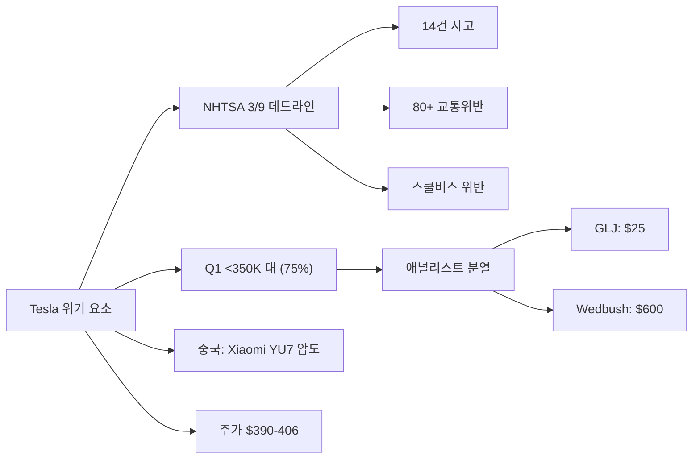
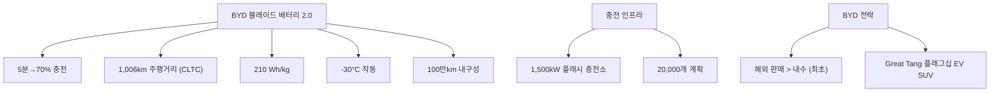
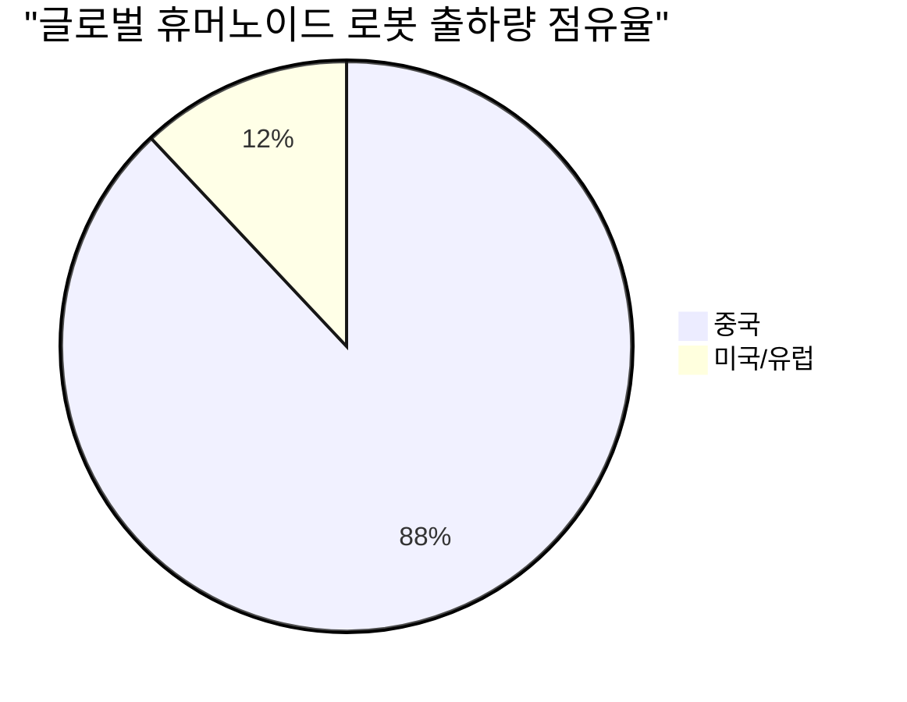
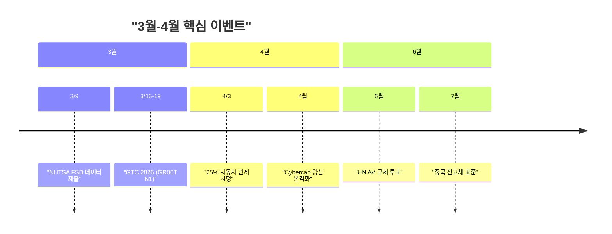

> **관련 글**: [2026년 투자 섹터 전망 (전체)](/knowledge/invest/2026/01/20/investment-sectors-outlook-2026.html)

2026년 3월 7일 기준, 자동차/로봇 섹터의 핵심 변화는 **Tesla Q1 베어케이스**(<350K 75% 확률, 주가 $390-406), **BYD 블레이드 배터리 2.0**(5분→70% 충전, 1,006km), **현대/기아 미국 EV 판매 급감**(IONIQ 6 -77%, 세액공제 만료+관세), **Waymo 7개 도시 확장**(주간 100만+ 탑승 목표, $110B), **NHTSA 3/9 FSD 데드라인**(14건 사고, 80+ 교통위반), **4/3 25% 자동차 관세 시행**, 그리고 **중국 휴머노이드 로봇 87-90% 글로벌 점유**입니다.

## 최근 주요 뉴스 (3월 7일 기준)

| 항목 | 내용 |
|------|------|
| **★★★ Tesla Q1 베어케이스** | **<350K 대 (75% 확률)**, 주가 $390-406. 중국에서 Xiaomi YU7이 Model Y 2배 판매 |
| **★★★ BYD 블레이드 2.0** | **5분→70% 충전**, 1,006km 주행거리, -30°C 작동, 1,500kW 충전소 20,000개 계획 |
| **★★★ NHTSA 3/9 데드라인** | FSD/로보택시 안전 데이터 제출 기한. **14건 사고, 80+ 교통위반** |
| **★★★ 4/3 25% 자동차 관세** | 모든 수입차에 25% 관세 시행 → 현대/기아·유럽 OEM 직격탄 |
| **★★ 현대/기아 미국 EV 급감** | IONIQ 6 **-77%**, EV6 **-53%**, EV9 **-40%** (세액공제 만료+관세) |
| **★★ Waymo 7개 도시 확장** | 2,500+ 차량, **주간 100만+ 탑승** 목표, **$15B 조달 계획**, $110B |
| **★★ 옵티머스 Gen3 양산** | 프리몬트 양산, 50-액추에이터/22 DOF 손, **$200억 투자** |
| **★★ SELF DRIVE Act 2026** | 자율주행 연방법안 초안, **UN 글로벌 AV 규제 6월 투표** |
| **★ Figure 03** | 완전 재설계, **Helix AI(첫 VLA 모델)**, BotQ 연 12K, BMW 가동 중 |
| **★ CATL 나트륨이온** | Naxtra **175 Wh/kg**, 500km, **-40°C**, 2026 대규모 양산 |
| **★ 중국 휴머노이드** | 글로벌 출하량 **87-90%**, 140+ 제조업체 |
| **★ 글로벌 EV 1월** | 유럽 +24%, 중국 -20%(명절), 북미 -33%. 2026 전망 **2,340만대(+14%)** |

## 핵심 이슈 심층 분석

### 1. Tesla -- Q1 베어케이스 + NHTSA 3/9 데드라인



#### Q1 2026 판매 전망

| 항목 | 내용 |
|------|------|
| **베어케이스 확률** | **75% 확률로 <350K 대** |
| **주가** | **$390-406** |
| **애널리스트** | GLJ **$25** vs Wedbush **$600** (극단적 분열) |
| **중국 1월** | Xiaomi YU7이 **Model Y 판매의 2배** (1위) |

#### NHTSA 3/9 안전 데이터 데드라인

| 항목 | 수치 |
|------|------|
| **제출 기한** | **2026년 3월 9일** |
| **로보택시 사고** | **14건** |
| **교통 위반** | **80건 이상** |
| **주요 사건** | 스쿨버스 위반, 오스틴 총격 시 앰뷸런스 차단 |

> **핵심**: 3월 9일 NHTSA 데이터 제출은 Tesla FSD/로보택시의 **단기 최대 리스크**입니다. 14건 사고와 80+ 교통위반 기록이 공개되면 규제 강화 압력이 높아질 수 있습니다. 동시에 Q1 판매 부진과 중국 시장에서 Xiaomi에 밀리는 상황이 겹쳐 단기 주가 압박이 예상됩니다.

#### Cybercab 양산 현황

| 항목 | 내용 |
|------|------|
| **첫 유닛 생산** | 2026년 2월 17일, 기가텍사스 |
| **관찰** | 25대 확인 (14대 메탈릭 골드, 9대 충돌 테스트) |
| **양산 일정** | **4월 본격화** |
| **가격** | $30,000 이하, 2인승, 200마일 |
| **리스크** | NHTSA 면제 미취득, 캘리포니아 자율주행 허가 미신청 |

#### 옵티머스 Gen3 양산

| 항목 | 내용 |
|------|------|
| **양산** | 프리몬트 공장 (Model S/X 라인 전환) |
| **Gen3 손** | **50 액추에이터, 22 DOF** |
| **투자** | **$200억** (전년 대비 2배+) |
| **소비자 판매** | 2027년 목표, $20,000-$30,000 |

### 2. BYD -- 블레이드 배터리 2.0 + 해외 판매 최초 역전



#### 블레이드 배터리 2.0 사양

| 지표 | 수치 | 비교 |
|------|------|------|
| **충전 속도** | **10%→70% 5분** | 기존 LFP 대비 혁신적 |
| **에너지 밀도** | **210 Wh/kg** | LFP 최고 수준 |
| **주행거리** | **1,006km (CLTC)** | EV 불안감 해소 |
| **내구성** | **100만km** | 차량 수명 이상 |
| **저온 성능** | **-30°C 작동** | 한랭지 약점 극복 |

#### BYD 글로벌 전략

| 항목 | 내용 |
|------|------|
| **2월 해외 판매** | **최초로 내수 초과** |
| **충전소** | 1,500kW 플래시 충전, **20,000개 계획** |
| **Great Tang** | 플래그십 EV SUV 공개 |
| **2025년 연간** | 460만대 (글로벌 1위) |

> **핵심**: 블레이드 배터리 2.0은 EV의 두 가지 핵심 약점인 **충전 시간**과 **주행거리**를 LFP 소재로 해결했습니다. 5분 충전은 ICE차 주유와 동등한 수준이며, 해외 판매가 내수를 처음 넘어선 것은 BYD의 **글로벌 확장이 본격 궤도**에 올랐음을 의미합니다.

### 3. 현대/기아 -- 미국 EV 판매 급감 + 관세 위기

| 모델 | YoY 변화 | 원인 |
|------|----------|------|
| **IONIQ 6** | **-77%** | $7,500 세액공제 만료(2025.9), 25% 관세 |
| **EV6** | **-53%** | 동일 요인 |
| **EV9** | **-40%** | 동일 요인 |

| 대응 | 상태 |
|------|------|
| **IONIQ 6 Non-N** | 2026년 **출시 안함** |
| **EV6 GT** | **지연** |
| **EV9 GT** | **지연** |

#### 4/3 25% 자동차 관세 영향

| 항목 | 내용 |
|------|------|
| **시행일** | **2026년 4월 3일** |
| **대상** | 모든 수입차에 **25%** |
| **현대/기아 영향** | 미국 판매차의 상당 부분이 한국 생산 → **가격 경쟁력 타격** |
| **캐나다-중국 EV 관세** | 100% → **6.1%** 인하 (첫 49,000대) → BYD에 유리 |

> **핵심**: 현대/기아의 미국 EV 시장은 세액공제 만료와 25% 관세라는 이중 타격을 받고 있습니다. EV6/EV9 GT 지연과 IONIQ 6 출시 보류는 수요 약화의 반영입니다. 반면 **Waymo+IONIQ 5 파트너십**과 **BD+DeepMind 로봇 전략**은 중장기 가치를 유지합니다.

### 4. Waymo -- 7개 도시 확장 + $110B

| 항목 | 내용 |
|------|------|
| **차량** | 미국 내 **2,500대 이상** |
| **확장** | **7개 신규 도시** 확장 중 |
| **목표** | 2026년 말까지 주간 **100만+ 탑승** |
| **펀딩** | **$15B 조달 계획**, 밸류에이션 $110B |
| **안전 이슈** | 스쿨버스 위반, 오스틴 총격 시 앰뷸런스 차단 |
| **IONIQ 5** | 6세대 자율주행 플랫폼 도로 테스트 |

### 5. 자율주행 규제 동향

| 항목 | 내용 | 시사점 |
|------|------|--------|
| **NHTSA 3/9** | FSD/로보택시 안전 데이터 제출 기한 | Tesla에 단기 리스크 |
| **SELF DRIVE Act 2026** | 자율주행 연방법안 초안 | 규제 프레임워크 구체화 |
| **UN 글로벌 AV 규제** | **6월 투표** (50+ 개국 적용) | 글로벌 자율주행 표준화 |

### 6. Figure AI -- Figure 03 완전 재설계

| 항목 | 내용 |
|------|------|
| **Figure 03** | **완전 재설계**, 대량 생산 최적화 |
| **Helix AI** | **최초 VLA(Vision-Language-Action) 모델** |
| **BotQ 공장** | 연간 **12,000대** 생산 능력 |
| **BMW** | 가동 중, 라이프치히 확대 (2027.2) |

### 7. 배터리 기술 혁신

| 배터리 | 핵심 스펙 | 시사점 |
|--------|----------|--------|
| **BYD 블레이드 2.0** | 5분→70%, 210 Wh/kg, 1,006km, LFP | EV 충전/주행거리 혁명 |
| **CATL Naxtra 나트륨이온** | 175 Wh/kg, 500km, **-40°C**, 2026 양산 | 저가 EV 시장 확대 |
| **전고체 (한국)** | 리튬이온 대비 **4배 속도** 연구 | 양산 2027-2028 |
| **전고체 (중국)** | **7월 표준 제정** | 양산 로드맵 구체화 |

### 8. 로봇 시장 -- 중국 87-90% 점유



| 지표 | 수치 |
|------|------|
| **중국 점유율** | 글로벌 출하량 **87-90%** |
| **중국 제조업체** | **140개 이상** |
| 글로벌 산업용 로봇 설치 | **$167억** (사상 최고) |
| 2026년 시장 | $244.3억 |
| 2034년 시장 | $773.6억 (CAGR 15.5%) |

### 9. Xiaomi -- EV 시장 다크호스

| 항목 | 내용 |
|------|------|
| **1월 인도** | **39,002대** (YU7 97%) |
| **YU7** | 1월 중국 판매 1위 (Tesla Model Y의 **2배**) |
| **2026 목표** | **550,000대** (YoY +34%) |

### 10. 글로벌 EV 시장 현황

| 지역 | 1월 YoY | 비고 |
|------|---------|------|
| **유럽** | **+24%** | 규제 강화 효과 |
| **중국** | **-20%** | 설 연휴 일시적 |
| **북미** | **-33%** | 세액공제 만료 + 관세 |
| **2026 전망** | **~2,340만대 (+14%)** | TrendForce |

## 로드맵

```
2026.02.17: Cybercab 첫 유닛 생산 / 옵티머스 Gen3 50-액추에이터 손 공개
2026.02.28: 이란 전쟁 → 유가 급등
2026.03.03: KOSPI 폭락 (현대차 -11.72%, 기아 -11.29%)
2026.03.05: KOSPI 반등, 이란 CIA 협상 신호
2026.03.09: ★★★ NHTSA FSD/로보택시 안전 데이터 제출 기한
2026.03.16~19: ★★★ GTC 2026 (Isaac GR00T N1 + Newton 물리엔진)
2026.04.03: ★★★ 25% 자동차 관세 시행
2026.04: ★★ Cybercab 기가텍사스 양산 본격화
2026.Q2: Model S/X 생산 중단 → 옵티머스 라인 전환
2026.06: ★★★ UN 글로벌 자율주행 규제 투표
2026.07: 중국 전고체 배터리 표준 제정
2026 H2: Cybercab 로보택시 네트워크 투입
2026 말: Waymo 주간 100만+ 탑승 목표
2027 말: 옵티머스 소비자 판매 ($20K-$30K)
2027.02: Figure AI BMW 라이프치히 공장 확대
2027-28: 전고체 배터리 양산
```

## 휴머노이드 로봇 경쟁 구도

| 기업 | 현황 | 전략 | 핵심 수치 |
|------|------|------|-----------|
| **테슬라 옵티머스** | Gen3 프리몬트 양산, 50-액추에이터/22 DOF | Model S/X 단종→라인 전환, $20B CapEx | 소비자 $20K-$30K, 2027말 |
| **보스턴다이나믹스** | Atlas 상용 런칭, 2026 배치 매진 | DeepMind 통합, 2028 3만대 | 기업가치 ~55조원 |
| **Figure AI** | Figure 03 완전 재설계, Helix AI VLA | BotQ 연 12K, BMW 가동 중 | BMW 라이프치히 확대 (2027.2) |
| **중국** | **87-90% 글로벌 점유**, 140+ 제조업체 | 대량 생산 가격 우위 | Unitree, UBTECH |

## 주요 종목 분석

| 종목 | 티커 | 방향성 | 핵심 근거 | 주요 리스크 |
|------|------|--------|----------|------------|
| 테슬라 | TSLA | **단기 Bearish / 중장기 Bullish** | Cybercab 4월 양산, 옵티머스 Gen3, $200억 CapEx | Q1 <350K(75%), NHTSA 3/9, 중국 Xiaomi 압도, 애널리스트 극단 분열 |
| 현대차 | 005380.KS | **단기 주의 / 로봇 Bullish** | BD+DeepMind, 50.5조 투자, Waymo+IONIQ 5 | 미국 EV 급감(IONIQ 6 -77%), 25% 관세 4/3, 이란 전쟁 |
| 기아 | 000270.KS | **단기 주의** | EV 라인업, 글로벌 판매 | EV6 -53%, EV9 -40%, 관세, EV GT 지연 |
| BYD | 1211.HK | **Bullish** | 블레이드 2.0(5분 충전), 해외>내수, 460만대 | 관세 리스크(미국 시장 진입 난항) |
| 알파벳 | GOOGL | **Bullish** | Waymo $110B, 7개 도시 확장, DeepMind+BD | 안전 이슈, 원가 구조 |
| 엔비디아 | NVDA | **Bullish** | 자율주행/로봇 AI 인프라, GTC 3/16 | 밸류에이션 |
| 한화 | 000880.KS | Bullish | 로봇/방산 복합 테마 | - |
| 삼성전자 | 005930.KS | Bullish | 레인보우로보틱스 35% 자회사 | 로봇 사업 초기 |

## 투자 전략 (3월 7일)

### 핵심 판단: 단기 리스크 집중 구간



### 시나리오별 전략

| 시나리오 | 전략 | 근거 |
|----------|------|------|
| **NHTSA 데이터 부정적** | Tesla 단기 비중 축소, Waymo/알파벳 비중 확대 | FSD 규제 강화 → Waymo 반사 수혜 |
| **25% 관세 시행** | 미국 현지 생산 OEM 선호 (Tesla, GM) | 현대/기아·유럽 OEM 가격 경쟁력 하락 |
| **BYD 글로벌 확대 가속** | BYD 직접 또는 EV ETF 비중 확대 | 블레이드 2.0 + 해외>내수 전환 |
| **이란 전쟁 종료** | 현대/기아 반등 매수 | 과매도 해소, 펀더멘탈 건재 |

### 포트폴리오 구성

```
자동차/로봇 섹터 배분 (100 기준):

테슬라: 30% (40%→30% 하향)
├─ 중장기: Cybercab 4월 양산, 옵티머스 Gen3, $200억 CapEx
├─ 단기 리스크: Q1 <350K(75%), NHTSA 3/9, Xiaomi 중국 압도
├─ 애널리스트 극단 분열 (GLJ $25 vs Wedbush $600)
└─ 3/9 이후 데이터 확인 후 비중 재조정

현대차/기아: 10% (15%→10% 하향)
├─ 미국 EV 급감: IONIQ 6 -77%, EV6 -53%, EV9 -40%
├─ 4/3 25% 관세 직격탄
├─ 장기: BD+DeepMind, Waymo+IONIQ 5, 50.5조 투자
└─ 이란 전쟁 종료 시 반등 여지

BYD: 10% (신규 추가)
├─ 블레이드 2.0: 5분→70%, 1,006km
├─ 해외 판매 > 내수 (최초)
└─ 글로벌 EV 1위, 460만대 (2025)

엔비디아: 15%
└─ 자율주행/로봇 AI 인프라 (GTC 3/16)

알파벳(Waymo): 15% (10%→15% 상향)
├─ Waymo $110B, 7개 도시 확장
├─ 주간 100만+ 탑승 목표
└─ DeepMind+BD 통합

삼성전자/레인보우: 10%
└─ 레인보우로보틱스 35% 자회사

한화: 10%
└─ 로봇/방산 복합 모멘텀
```

## 주요 모니터링 이벤트

| 시기 | 이벤트 | 중요도 |
|------|--------|--------|
| **3/9** | **NHTSA FSD/로보택시 안전 데이터 제출 기한** | 최고 |
| **3/16~19** | **GTC 2026** (Isaac GR00T N1, Newton 물리엔진) | 최고 |
| **4/3** | **25% 자동차 관세 시행** | 최고 |
| **4월** | **Cybercab 양산 본격화** | 최고 |
| **6월** | **UN 글로벌 자율주행 규제 투표** | 최고 |
| **7월** | 중국 전고체 배터리 표준 제정 | 높음 |
| Q2 | Model S/X 생산 중단 → 옵티머스 전환 | 높음 |
| 2026 말 | Waymo 주간 100만+ 탑승 달성 여부 | 높음 |
| 상시 | **Tesla Q1 실적 (350K 기준)** | 최고 |
| 상시 | **이란 전쟁/유가 동향** | 높음 |
| 상시 | **BYD 해외 확장 속도** | 높음 |

## 결론

### 핵심 메시지 (3월 7일)

1. **Tesla는 3월 9일이 단기 분수령**: NHTSA 안전 데이터 제출 기한(3/9)에 FSD 14건 사고, 80+ 교통위반 데이터가 공개됩니다. Q1 <350K 대(75% 확률)와 중국 Xiaomi YU7 압도가 겹쳐 **단기 압박은 불가피**하나, Cybercab 4월 양산과 옵티머스 Gen3는 **중장기 가치를 유지**합니다

2. **BYD 블레이드 2.0은 EV 게임 체인저**: 5분→70% 충전과 1,006km 주행거리를 LFP로 달성한 것은 **EV 대중화의 마지막 장벽(충전 시간)을 제거**합니다. 해외 판매가 내수를 넘어선 것은 글로벌 확장의 티핑 포인트입니다

3. **현대/기아 미국 EV는 구조적 역풍**: IONIQ 6 -77%, EV6 -53%는 $7,500 세액공제 만료와 25% 관세의 이중 타격입니다. EV6/EV9 GT 지연은 신모델 부재를 의미합니다. 4/3 관세 시행 전까지 **추가 하방 압력**이 예상됩니다

4. **Waymo가 자율주행 리더십을 공고히 하고 있음**: 2,500+ 차량, 7개 도시 확장, 주간 100만+ 탑승 목표는 **상업적 검증 단계**를 넘어서고 있습니다. $110B 밸류에이션과 $15B 조달 계획은 스케일업 의지를 반영합니다

5. **중국 휴머노이드 87-90% 점유는 구조적 위협**: 140+ 제조업체의 가격 경쟁은 미국·한국 로봇 기업들의 **하드웨어 마진을 압박**할 것입니다. Tesla, BD, Figure AI는 **AI 소프트웨어 차별화**가 관건입니다

6. **CATL 나트륨이온 + 전고체 배터리 경쟁**: CATL Naxtra(-40°C, 500km)는 저가 EV 시장을 확대하고, 중국 전고체 7월 표준 제정은 양산 로드맵을 구체화합니다. 한국의 리튬이온 4배 속도 연구도 주목해야 합니다

7. **4/3 25% 관세가 산업 지형을 바꿀 것**: 모든 수입차에 25% 관세는 **미국 현지 생산이 없는 OEM에 치명적**입니다. Tesla(미국 생산)에는 상대적 수혜, 현대/기아·유럽 OEM에는 직격탄입니다

**투자 결정은 본인의 리스크 허용 범위와 투자 기간을 고려하여 신중하게 내리시기 바랍니다.**

---

## 하위 섹터 상세 분석

각 하위 섹터에 대한 더 깊은 분석은 아래 글들을 참고하세요.

- [EV/자율주행 투자 전망](/knowledge/invest/2026/01/21/ev-autonomous-driving-outlook-2026.html) - 전기차·자율주행 심층 분석
- [로봇 투자 전망](/knowledge/invest/2026/01/21/robotics-sector-outlook-2026.html) - 휴머노이드·산업용 로봇 분석
- [조선 투자 전망](/knowledge/invest/2026/01/21/shipbuilding-sector-outlook-2026.html) - LNG선/조선 슈퍼사이클 분석

---

## 참고 자료

- **[3/7 신규]** Tesla Q1 베어케이스: 75% 확률로 <350K 대, 주가 $390-406
- **[3/7 신규]** 중국 1월: Xiaomi YU7 판매 1위 (Tesla Model Y 2배)
- **[3/7 신규]** Xiaomi 1월 39,002대 인도(YU7 97%), 2026 목표 550K(+34%)
- **[3/7 신규]** NHTSA 3/9 FSD/로보택시 안전 데이터 제출 기한: 14건 사고, 80+ 교통위반
- **[3/7 신규]** Waymo 안전 이슈: 스쿨버스 위반, 오스틴 총격 앰뷸런스 차단
- **[3/7 신규]** BYD 블레이드 배터리 2.0: 5분→70%, 210 Wh/kg, 1,006km, -30°C, 100만km
- **[3/7 신규]** BYD 1,500kW 플래시 충전소 20,000개 계획
- **[3/7 신규]** BYD 2월 해외 판매 > 내수 (최초), Great Tang 플래그십 EV SUV
- **[3/7 신규]** 현대/기아 미국 EV 급감: IONIQ 6 -77%, EV6 -53%, EV9 -40%
- **[3/7 신규]** $7,500 세액공제 만료(2025.9), IONIQ 6 Non-N 2026 미출시, EV6/EV9 GT 지연
- **[3/7 신규]** 25% 자동차 관세 4/3 시행 (모든 수입차)
- **[3/7 신규]** 캐나다-중국 EV 관세: 100% → 6.1% (첫 49K대)
- **[3/7 신규]** Waymo 2,500+ 차량, 7개 도시 확장, 주간 100만+ 탑승 목표
- **[3/7 신규]** Waymo $15B 조달 계획, $110B 밸류에이션
- **[3/7 신규]** 옵티머스 Gen3 손: 50 액추에이터, 22 DOF
- **[3/7 신규]** SELF DRIVE Act 2026 초안
- **[3/7 신규]** Figure 03 완전 재설계, Helix AI(첫 VLA 모델), BotQ 연 12K
- **[3/7 신규]** 중국 휴머노이드 87-90% 글로벌 점유, 140+ 제조업체
- **[3/7 신규]** CATL Naxtra 나트륨이온: 175 Wh/kg, 500km, -40°C, 2026 양산
- **[3/7 신규]** 중국 전고체 배터리 표준 7월 제정, 한국 연구 리튬이온 4배 속도
- **[3/7 신규]** 글로벌 EV 1월: 유럽 +24%, 중국 -20%, 북미 -33%
- **[3/7 신규]** TrendForce: 2026 글로벌 EV 판매 ~2,340만대 (+14%)
- **[3/7 신규]** 테슬라 애널리스트 분열: GLJ $25 vs Wedbush $600
- Cybercab 기가텍사스 25대 관찰 (14대 골드/외부, 9대 충돌 테스트)
- Cybercab 4월 양산 본격화
- Tesla CapEx $200억 (전년 대비 2배+)
- 옵티머스 Gen3 프리몬트 양산, Model S/X Q2 단종→로봇 라인 전환
- 옵티머스 소비자 판매 2027년 말, $20,000-$30,000
- FSD $99/월 구독 전용 전환 (2/14), 누적 84억 마일
- BYD 2025년 연간 460만대, 글로벌 EV 1위
- 현대/기아 50.5조원 투자 (2026-2030)
- BD Atlas 상용 런칭, 2026 배치 매진, DeepMind 통합
- Waymo IONIQ 5 6세대 자율주행 플랫폼 도로 테스트
- UNECE 자율주행 규정 초안 채택, 6월 투표
- 글로벌 산업용 로봇 설치 $167억 사상 최고
