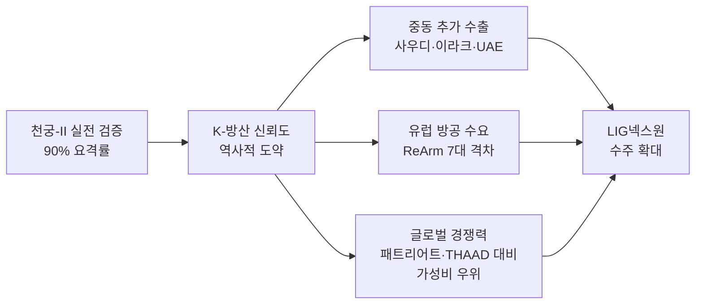
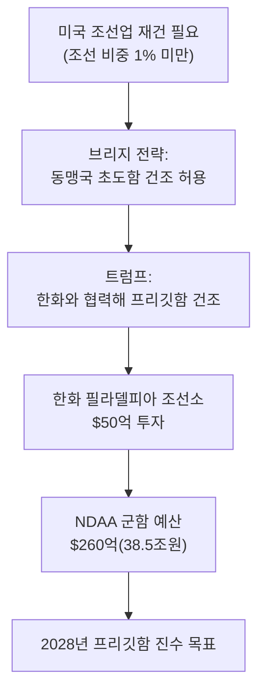

> **관련 글**: [2026년 투자 섹터 전망 (전체)](/knowledge/invest/2026/01/20/investment-sectors-outlook-2026.html) | [조선/방산/원전 섹터 전망](/knowledge/invest/2026/01/21/shipbuilding-defense-nuclear-sector-outlook-2026.html)

## 3월 7일 핵심 업데이트

| 날짜 | 이벤트 | 방산 영향 |
|------|--------|---------|
| **3/5** | **천궁-II, UAE에서 이란 미사일 90% 요격 — 실전 검증 완료** | **K-방산 신뢰도 역사적 도약**, 추가 수출 계약 기대 |
| **3/6** | **EU 이사회 €150B 방산대출 합의** | ReArm Europe 법적 집행 기반 강화, K-방산 유럽 수출 가속 |
| **3/5** | **한화시스템·한국항공우주 +8%** (천궁-II 실전 검증 반영) | 천궁-II 사격통제(한화시스템), K-방산 전반 프리미엄 |
| **3/5** | **KOSPI 5,583.9 (+9.63% 반등)** — 2008년 이후 최대 일간 상승 | 시장 반등 속 방산주 강세 유지 |
| **이란 전쟁** | **Day 7, 확전 중** — 사우디·UAE 연합 합류, 쿠르드 지상작전 | 국방비 추가 증액 불가피, 중동 방위력 강화 수요 극대화 |
| **NATO** | **GDP 3.5% 서약** (기존 2%→5% 경로) | 동맹국 방산 예산 대폭 확대 |
| **마크롱** | **프랑스 핵억지력 유럽방위 확대** 선언 | 유럽 안보 패러다임 전환, 방산 지출 구조적 확대 |

---

## 핵심 요약 (2026년 3월 7일 기준)

| 항목 | 내용 |
|------|------|
| **★★★ 천궁-II 실전 검증** | UAE에서 이란 미사일 **90% 요격** — 10개 포대 중 2개 배치, $3.5B 계약(2022) → **추가 수출 기대** |
| **★★★ 트리플 촉매** | **ReArm Europe €800B+ + NATO 3.5%~5% + 이란 전쟁 Day 7** = 방산 수요 역사상 최대 |
| **★★★ 글로벌 방위비** | **$2.6T (사상 최대 평시 기록)** + 미국 FY2026 **$1.5T** + EU **€150B 대출** 합의 |
| **★★ 방산 독주** | 3/3 KOSPI -7.24% 속 한화에어로 +19.83%, LIG/한화시스템 상한가 → 3/5 KOSPI +9.63% 반등 |
| **★★ K-방산 수출 파이프라인** | 노르웨이 천무 ₩2.8T, 필리핀 MOU 10건, UAE 방산협력, 사우디 K9·천무 추가 조달 |
| **★★ 한화에어로+KAI 수주목표** | **2026년 신규수주 ~32조원** (LS증권 목표주가 **125만원**) |
| **한화에어로스페이스** | **매출 31.8조, OP 4.6조(+30.8%)** — 최고 이익 성장률 |
| **한국 국방예산** | **66.3조(+7.6%)**, 방위력개선비 **20.2조(+11.6%)** |
| **K-방산 제2막** | **MRO + 현지 생산 본격화** — 단순 수출에서 지속 수익 모델로 전환 |
| **캐나다 잠수함 CPSP** | **48조원**, 3/2 마감 완료, 6월 결과 발표 |

---

## 천궁-II 실전 검증 — K-방산 게임 체인저

**2026년 3월 5일, 천궁-II가 UAE에서 이란 미사일을 실전 요격하며 90% 명중률을 기록했습니다.** 이는 K-방산 역사상 최초의 실전 검증(Combat Proven) 사례입니다.

| 항목 | 내용 |
|------|------|
| **요격 성공률** | **90%** — 이란 탄도미사일 실전 요격 |
| **UAE 계약** | **$3.5B** (2022년 1월 체결), **10개 포대** 발주, **2개 포대 현지 배치** |
| **시장 반응** | 한화시스템 +8%, 한국항공우주 +8% (3/5) |
| **수혜 기업** | **한화시스템**(사격통제 레이더/C4I), **LIG넥스원**(미사일/CIWS/정밀탄), **한화에어로**(발사대) |

**투자 시사점**:

**실전 검증은 방산 수출의 최대 장벽을 제거합니다.** 패트리어트·아이언돔·THAAD 등 기존 실전 검증 시스템과 동급 신뢰도를 확보하면서, 가격 경쟁력까지 갖춘 천궁-II의 추가 수출이 본격화될 것으로 예상됩니다.

---

## 글로벌 방산 지출: 역사적 증가

### 2026년 글로벌 국방비 — 사상 최대 평시 기록

| 항목 | 규모 | 비고 |
|------|------|------|
| **글로벌 방위비** | **$2.6T** | **사상 최대 평시 기록** |
| **미국 FY2026** | **$1.5T** | 국방예산 요구안 |
| **EU 방산대출** | **€150B** | EU 이사회 합의 (3/6) |
| **NATO GDP 목표** | **3.5%** 서약 (5% 경로) | 기존 2%에서 대폭 상향 |
| **마크롱** | 프랑스 핵억지력 유럽 확대 | 유럽 안보 패러다임 전환 |

### ReArm Europe €800B+ — 법적 집행 기반 확보

| 항목 | 내용 |
|------|------|
| 규모 | **€800B (~1,250조원)** 총 패키지 |
| 구성 | **~€650B 재정여력** + **€150B SAFE 대출** (EU 이사회 합의 3/6) |
| **7대 역량 격차** | 대공미사일, 포병/탄약, 드론/대드론, 군사인프라, AI/전자전, 전략수송, 사이버 |
| **K-방산 수혜** | **K9(포병)·천무(포병/미사일)·K2(전차)·천궁-II(대공)** = 7대 격차 중 핵심 4개 직접 대응 |
| 유럽 장비조달 | 2024년 **880억유로(+39%)**, 2025년 **1,000억유로 돌파 전망** |

---

## 이란 전쟁 (Day 7, 확전 중)

### 전쟁 타임라인 (2/28~3/7)

| 타임라인 | 내용 |
|---------|------|
| **2/28** | **미국-이스라엘 이란 공습 실행**, 하메네이 사망, 이란 27개 미군기지 보복 |
| **2/28** | **트럼프 "정권 교체" 선언** |
| **3/3** | **방산주 폭등** — 한화에어로 +19.83%, LIG·한화시스템 상한가(+29.99%) |
| **3/3** | **필리핀-한국 방산 MOU 10건** 체결 (이재명 국빈 방문) |
| **3/4** | **사우디·UAE, 미국-이스라엘 연합 공식 합류** |
| **3/4~5** | **쿠르드 반군, 이란 국경 지상작전 개시** |
| **3/5** | 미군 5일간 **이란 군함 20척+ 격침** |
| **3/5** | **천궁-II UAE 실전 검증** — 이란 미사일 90% 요격 |
| **3/5** | **이란 정보기관, 제3국 통해 CIA에 협상 시그널** |
| **3/5** | 미 국방장관: **"작전 최대 8주 소요"** |
| **3/5** | **KOSPI +9.63% 반등** (2008년 이후 최대) |
| **3/5** | **P&I 보험 공식 발효** — 호르무즈 해협 유조선 수백 척 정박 |

### KOSPI -7.24% 폭락 vs 방산 독주 (3/3)

| 종목 | 등락률 | 의미 |
|------|--------|------|
| **한화에어로스페이스** | **+19.83%** | K-방산 대장주, 이란 전쟁 직접 수혜 |
| **LIG넥스원** | **+29.99% (상한가)** | 미사일 방어 수요 극대화 |
| **한화시스템** | **+29.99% (상한가)** | 레이더/감시 시스템 수요 |
| KOSPI | **-7.24%** | 관세·지정학 충격 |

방산 섹터가 지정학 리스크에 대한 **자연적 헤지** 역할을 시장 데이터로 입증했습니다.

### 방산 투자 영향

- **단기**: 방산주 **전쟁·평화 양방향 수혜** 구조 — 전쟁 시 수요 폭발, 평화 시 재건 수요
- **중기**: 사우디·UAE 연합 합류 → K-방산 중동 수출 긴급성 극대화, 미국 국방비 추가 증액 불가피
- **장기**: ReArm Europe·NATO 3.5%~5%는 **전쟁과 무관한 구조적 동인** — 전쟁 종료 후에도 방산 수요 지속
- **협상 리스크**: CIA 협상 시그널로 조기 종전 가능성 → 단기 조정 가능. 단, 구조적 수요 불변

---

## K-방산 수출: 확정 계약과 진행 중인 대형 딜

### 확정 계약 (체결 완료)

| 국가 | 품목 | 기업 | 계약 규모 | 비고 |
|------|------|------|----------|------|
| **폴란드** | **천무 3차** | **한화에어로** | **5.6조원** | **누적 18.6조원** |
| 폴란드 | K2 전차 2차 | 현대로템 | 8.9조원 | 기체결 |
| 폴란드 | K9 + 천무 1~2차 | 한화에어로 | 7조원+ | 기체결 |
| **노르웨이** | **천무 풀패키지** | **한화에어로** | **₩2.8T** | **계약 완료** |
| **에스토니아** | **천무** | **한화에어로** | 미정 | **수출 확정 — 발트3국 교두보** |
| 사우디 | 천궁-II | LIG넥스원 | 4.3조원 | 기체결 |
| **UAE** | **천궁-II** | **LIG넥스원** | **$3.5B** | **10개 포대, 실전 검증 완료** |
| 이라크 | 천궁-II | LIG넥스원 | 3.7조원 | 기체결 |

### 진행 중인 대형 딜

| 국가 | 품목 | 기업 | 규모 | 상태 |
|------|------|------|------|------|
| **캐나다** | 차세대 잠수함 (CPSP) | 한화오션+HD현대 | **48조원** | **3/2 마감 완료, 6월 결과** |
| **UAE** | **KF-21 패키지** | **한국항공우주** | **$15B** | 협상 중 (이란 전쟁으로 긴급성 상승) |
| **UAE** | **K9·천무 추가** | **한화에어로** | 미정 | **천궁-II 실전 검증 → 추가 조달 기대** |
| **UAE** | **장갑차 협력** | **현대로템** | 미정 | 협력 논의 중 |
| **미국** | 프리깃함 | **한화** | **MASGA** | 전시 조선 수요 급증 |
| **사우디** | 장갑차/자주포/다연장 | 한화에어로 | **20조+** | 사우디 연합 합류 → 긴급성 극대화 |
| **필리핀** | 방산·조선·원전·AI | 다수 기업 | 미정 | **3/3~4 MOU 10건** 체결 (이재명 국빈 방문) |
| 루마니아 | K2 전차 | 현대로템 | 협상 중 | H-ACE 착공으로 현지화 기반 |

---

## K-방산 빅4 실적 전망

### 2025 실적 (확정)

| 종목 | 매출 | OP | YoY OP |
|------|------|-----|--------|
| **한화에어로스페이스** | **26.6조** | **3.03조** | **3년 연속 최대** |
| **한화오션** | - | **1.11조** | **+366%** |

### 2026 전망

| 종목 | 매출 전망 | OP 전망 | 비고 |
|------|----------|---------|------|
| **한화에어로스페이스** | **31.8조** | **4.6조** | YoY **+30.8%** (방산 OP 비중 69.7%) |
| LIG넥스원 | - | - | 천궁-II 실전 검증 → 수주 확대 |
| 현대로템 | - | - | K2 납품 본격화 |
| 한국항공우주 | - | - | KF-21 양산 |
| **한화에어로+KAI 수주** | **~32조원** | - | **2026 신규수주 목표** (LS증권 목표주가 125만원) |
| **K-방산 빅4 합산** | **50.6조** | - | **역대 최대** |

---

## 관련 종목 상세 분석

### 한화에어로스페이스 (012450) - K-방산 절대 강자

| 항목 | 내용 |
|------|------|
| **2025 실적** | 매출 26.6조(+137%), **OP 3.03조(3년 연속 최대)** |
| **지상방산 수주잔고** | **37.2조원** |
| **2026 전망** | 매출 31.8조, **OP 4.6조(+30.8%)** |
| **2026 수주목표** | **한화에어로+KAI 합산 ~32조원** |
| 폴란드 누적 수주 | 18.6조원 |
| **노르웨이 천무** | **₩2.8T** — 계약 완료 |
| **에스토니아 천무** | 수출 확정 — 발트3국 교두보 |
| **UAE K9·천무 추가** | 천궁-II 실전 검증 → 추가 조달 기대 |
| 유럽 현지화 | HWB(폴란드) + H-ACE(루마니아) |
| 미국 MASGA | 트럼프 지명, 필라델피아 $50억 투자 |

### LIG넥스원 (079550) - 천궁-II 실전 검증 최대 수혜

| 항목 | 내용 |
|------|------|
| **천궁-II 실전 검증** | **UAE에서 이란 미사일 90% 요격** — Combat Proven |
| 수주 잔고 | 20조+ (사우디 4.3조, UAE $3.5B, 이라크 3.7조 등) |
| 미사일 방어 예산 | 미국 $11.6B→$40.2B (247% 증가) + 전시 추가 수요 |
| **핵심 역량** | **CIWS(근접방어), 정밀유도탄** — 이란 전쟁 직접 수혜 |
| **추가 수출 전망** | 실전 검증으로 **중동·유럽 추가 계약 기대** |

### 한화시스템 (272210) - 천궁-II 사격통제·레이더

| 항목 | 내용 |
|------|------|
| **천궁-II 사격통제** | **레이더, C4I 시스템** — 실전 검증 직접 수혜 |
| **시장 반응** | **3/5 +8%** (천궁-II 검증 반영) |
| 사업 영역 | 레이더, 감시정찰, 우주 사업 |

### 현대로템 (064350) - K2 전차 글로벌 확산

| 항목 | 내용 |
|------|------|
| 폴란드 K2 | 8.9조원 2차 이행계약, 2026년 첫 30대 납품 |
| **UAE 장갑차** | 협력 논의 중 |
| 수출 다변화 | 모로코, 이라크, 루마니아 |

### 한국항공우주 (047810) - KF-21 배치 + UAE 패키지

| 항목 | 내용 |
|------|------|
| KF-21 공군 배치 | 2026년 하반기 최초 배치, 양산 1호기 최종 조립 완료 |
| **한화-KAI MOU** | **2/9 체결** — 방산 수출 협력 강화 (항공·지상 통합 패키지) |
| **시장 반응** | **3/5 +8%** (천궁-II 검증 + 방산 전반 프리미엄) |
| UAE 패키지 | $15B KF-21 패키지 추진 |

### 한화오션 (042660) - 캐나다 CPSP + MASGA

| 항목 | 내용 |
|------|------|
| **2025 OP** | **1.11조(+366%)** |
| **캐나다 잠수함 CPSP** | **48조원**, 3/2 마감 완료, 6월 결과 발표 |
| **Algoma Steel** | **3.45억달러** 계약 체결 (캐나다 현지화) |
| MASGA | 미 해군 프리깃함 건조 참여 (전시 조선 수요 급증) |

---

## 유럽 현지화 전략 + ReArm Europe 수혜

K-방산의 유럽 전략이 **단순 수출에서 현지 생산으로 전환**되고 있으며, ReArm Europe 1,250조의 직접 수혜 구조를 확보 중입니다.

| 거점 | 국가 | 생산 품목 | 특징 |
|------|------|---------|------|
| **HWB** | 폴란드 | 천무 유도미사일 | 합작법인, 현지 생산 본격화 |
| **H-ACE 유럽** | 루마니아 | K9 자주포, K10 탄약장갑차 | 2/11 착공, 현지화율 80% 목표 |

유럽 장비조달이 2024년 880억유로(+39%)로 급증하고 2025년 1,000억유로 돌파가 전망되는 상황에서, 현지 생산 거점은 추가 수주의 결정적 경쟁 우위입니다.

---

## 미국 MASGA: K-조선/방산의 새로운 시장

**Section 122 15% 관세(2/24 발효)**가 적용되나, 한화 필라델피아 현지 생산으로 관세 영향을 최소화할 수 있습니다. 이란 전쟁 상황에서 동맹국 방산 관세 완화 가능성도 상승했습니다.

---

## 지정학 복합 리스크: 방산 지출의 구조적 동인

### 7대 구조적 동인

| 동인 | 내용 | 방산 영향 |
|------|------|----------|
| **천궁-II 실전 검증** | UAE에서 이란 미사일 90% 요격 | **K-방산 글로벌 신뢰도 도약, 추가 수출 계약 기대** |
| **이란 전쟁 Day 7** | 사우디·UAE 연합 합류, 쿠르드 지상작전, CIA 협상 시그널 | **미국 국방비 추가 증액, 글로벌 방산 수요 폭발** |
| **글로벌 방위비 $2.6T+** | 미국 FY2026 $1.5T 요구 | K-방산 전방위 수혜 극대화 |
| **ReArm Europe + EU €150B** | €800B 패키지, EU 이사회 €150B 대출 합의(3/6) | K-방산 유럽 수출 구조적 확대 (**K9·천무·K2·천궁-II**) |
| **NATO GDP 3.5%~5%** | 3.5% 서약, 2035년까지 5% 목표 | 동맹국 방산 예산 대폭 확대 |
| **MASGA** | 미 해군 재건, 전시 조선 수요 급증 | K-조선 미국 시장 진입 가속 |
| **필리핀·동남아 확대** | 필리핀 MOU 10건(방산·조선·원전·AI) | K-방산 아시아 시장 다변화 |

### 우크라이나-러시아

제네바 회담(2/17-18) 교착 상태 지속 + 이란 전쟁 발발로 유럽 재무장 수요 더욱 가속. ReArm Europe 집행 긴급성 상승.

---

## 투자 전략

### 시나리오별 접근

| 시나리오 | 확률 | 전략 |
|---------|------|------|
| **이란 전쟁 장기화 → 국방비 대폭 증액** | **매우 높음** | **방산 전 종목 비중 확대, 특히 미사일 방어** |
| **이란 전쟁 단기 종결 → 중동 재건 수요** | 중간 | 방어 시스템·재건 관련 종목 주목 |
| **천궁-II 실전 검증 → 추가 수출** | **매우 높음** | **LIG넥스원·한화시스템 비중 확대** |
| 글로벌 방위비 확대 가속 ($2.6T+ → $3T?) | **매우 높음** | 방산 전 종목 비중 유지 |
| ReArm Europe + 이란 전쟁 → 유럽 집행 가속 | **매우 높음** | 한화에어로(유럽 현지화) 중심 |
| 캐나다 잠수함 수주 확정 (6월) | 중간 | 한화오션 급등 |

### 핵심 전략

1. **천궁-II 실전 검증 = 게임 체인저**: Combat Proven으로 K-방산 신뢰도 역사적 도약 → LIG넥스원·한화시스템 추가 수출 가속
2. **트리플 촉매 건재**: ReArm Europe €800B + NATO 3.5%~5% + 이란 전쟁 = 방산 수요 구조적 급증
3. **미사일 방어 수요 극대화**: 이란 보복(27개 미군기지 공격) + 천궁-II 검증 → 미사일 방어 시스템 수요 폭발
4. **한화에어로 OP 4.6조 + 수주잔고 37.2조**: 유럽 기반 실적 견고
5. **캐나다 CPSP 6월 결과**: 48조원 최대 촉매
6. **글로벌 국방비 역사적 규모**: $2.6T + 미국 $1.5T + EU €150B = 방산 수요 바닥 없음

### 포트폴리오 배분

| 구분 | 비중 | 종목 | 근거 |
|------|------|------|------|
| K-방산 대표 | 25% | 한화에어로스페이스 | OP 3.03조→4.6조, 수주잔고 37.2조, 유럽 현지화 |
| 항공/수출 | 15% | 한국항공우주 | KF-21 하반기 배치, UAE $15B |
| **미사일 방어** | **25%** | **LIG넥스원** | **천궁-II 실전 검증, 미사일 방어 247% 증가** |
| 전차 수출 | 10% | 현대로템 | K2 납품 본격화, UAE 장갑차 |
| 해군 방산 | 15% | 한화오션 | OP +366%, 캐나다 48조 |
| **방산전자** | **10%** | **한화시스템** | **천궁-II 사격통제, 레이더, +8% 모멘텀** |

---

## 리스크 요인

| 리스크 | 영향 | 대응 |
|--------|------|------|
| **이란 전쟁 확전** | 중동 전역 불안정, K-방산 중동 딜 지연 | 유럽 기반 실적(37.2조 수주잔고)은 견고, 단기 조정 시 매수 |
| **전쟁 장기화 → 원유가 급등** | 글로벌 경기 침체, 방산 예산 감축 압력 | 전시 예산은 비경기적, 국방비 증액은 유지 |
| **Section 122 관세** | 미국 향 수출 비용 증가 | 전시 동맹국 관세 완화 가능성 + 현지 생산(필라델피아) |
| 사우디 딜 지연/불발 | 한화에어로 중동 기대감 후퇴 | 수주잔고 37.2조 + 유럽 기반 견고 |
| 캐나다 잠수함 탈락 | 한화오션 모멘텀 상실 | MASGA + Algoma Steel로 기본 유지 |
| 밸류에이션 부담 | 전쟁 프리미엄으로 주가 과열 가능 | 실적 기반 판단 (K-방산 빅4 매출 50.6조) |

---

## 체크포인트

1. **★★★ 천궁-II 추가 수출**: 실전 검증 후 중동·유럽 추가 계약 구체화 여부
2. **★★★ 이란 CIA 협상 후속**: 협상 개시 여부, 종전 조건, 전쟁 지속 기간
3. **★★★ EU €150B 대출 집행**: 3/6 합의 후 구체적 집행 일정
4. **★★ 미국 FY2026 $1.5T 의회 통과**: 국방예산 확정 과정
5. **★★ 한화에어로+KAI 32조 수주 달성률**: 2026 분기별 신규수주 추이
6. **★★ UAE K9·천무·장갑차 추가 조달**: 천궁-II 검증 이후 후속 계약
7. **★★ 필리핀 MOU 10건 후속**: 구체적 무기 조달·유지보수 프로젝트 진전
8. **캐나다 CPSP 6월 결과**: 48조원 최종 결정
9. **한화에어로 2026 1Q 실적**: OP 4.6조 달성 궤도 확인
10. **수출입은행법 기재위 통과**: 전쟁 상황에서 통과 긴급성 상승
11. **KF-21 공군 배치**: 2026년 하반기 배치 이행

---

## 참고 자료

- [이투데이 - 한화에어로, 폴란드에 5.6조 천무 계약](https://www.etoday.co.kr/news/view/2540722)
- [머니S - 폴란드 수출만 18.6조원, 한화에어로 현지화로 수주 2막](https://www.moneys.co.kr/article/2025123008394752831)
- [서울신문 - 한화에어로, 루마니아 K9 자주포 공장 H-ACE 유럽 착공](https://www.seoul.co.kr/news/economy/industry/2026/02/11/20260211500414)
- [서울경제 - 美 조선업 재건계획 발표, 초기 한국서 선박 건조](https://www.sedaily.com/article/20009385)
- [서울경제 - 트럼프 미해군 신예 프리깃함 한화와 협력](https://www.sedaily.com/NewsView/2H1UAMQLHB)
- [Behorizon - ReArm Europe: EU's 800B Plan for Defence Readiness 2030](https://behorizon.org/rearm-europe/)

---

**면책 조항**: 본 글은 투자 참고 자료이며, 투자 결정에 대한 책임은 투자자 본인에게 있습니다. (2026년 3월 7일 업데이트)
