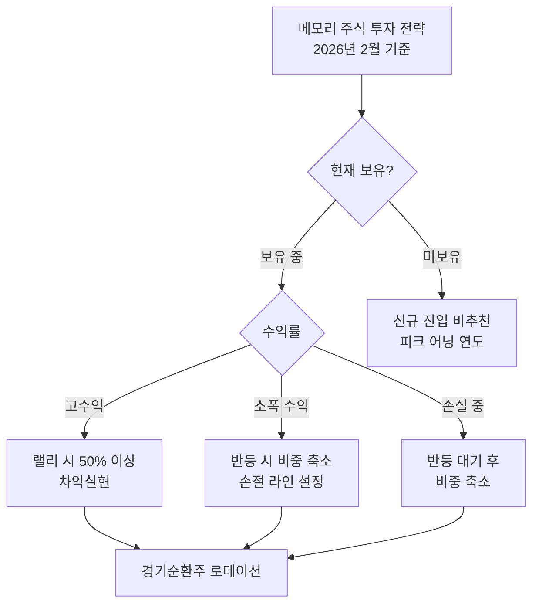

> **관련 글**: [2026년 투자 섹터 전망 (전체)](/knowledge/invest/2026/01/20/investment-sectors-outlook-2026.html) | [반도체 섹터 전망](/knowledge/invest/2026/01/21/semiconductor-sector-outlook-2026.html)

## 핵심 요약: 2026년은 피크 어닝 연도

2026년 DRAM/NAND 시장의 핵심 메시지는 명확합니다: **사상 최대 실적이지만, 이것이 피크입니다.**

| 기업 | 2026년 영업이익 | 2026년 성장률 | 2027년 성장률 |
|------|---------------|-------------|-------------|
| 삼성전자 | 100~155조원 | **~400%** | **~12%** |
| SK하이닉스 | 80~112조원 | **~300%** | **~4%** |
| **합산** | **~200조원** | - | **한자릿수** |

삼성전자+SK하이닉스 합산 영업이익 **200조원**이라는 역사적 수치가 전망되지만, 2027년부터 성장률이 급격히 둔화됩니다. 주가는 실적이 아닌 **성장률의 방향**에 반응하므로, 2026년이 메모리 주식의 실질적 고점 구간입니다.

**투자 핵심 전략: 차익실현 후 경기순환주 로테이션**

---

## DRAM 시장 현황 (2026년 2월 기준)

### AI 서버가 견인하는 DRAM 수요

AI 서버의 DRAM 소비량은 일반 서버 대비 **8~10배**에 달합니다. 구글, 아마존, MS, 메타 등 빅테크의 AI 인프라 투자가 계속되면서 서버 DRAM 수요가 폭발적으로 증가하고 있습니다.

- **서버 DRAM**: 빅테크 AI 투자 확대로 최대 수혜, 가격 60~70% 상승
- **PC DRAM**: 공급 부족으로 PC 가격 20% 상승 전망 (IDC)
- **모바일 DRAM**: LPDDR5X 수요 증가, 스마트폰 가격 상승 요인

SK하이닉스는 **"HBM, DRAM, NAND 생산 능력이 사실상 모두 소진된 상태"**라고 밝혔으며, 메모리 업체들이 HBM에 생산 역량을 집중하면서 범용 DRAM 공급이 구조적으로 제약받고 있습니다.

### 메모리 가격 동향

| 제품군 | 가격 변동 | 비고 |
|--------|----------|------|
| DDR4 | 1년새 **1,800% 폭등** | 공급 축소로 역설적 급등 |
| DDR5 64GB RDIMM | 255달러 → 700달러 | 서버용 핵심 모듈 |
| 서버 DRAM | 1분기 **60~70% 상승** | 빅테크 조달 경쟁 |
| NAND | 1분기 **33~38% 상승** | SSD/데이터센터 수요 |

가격은 여전히 상승 중이나, **상승 속도(성장률)는 둔화** 추세입니다. 이것이 피크 어닝의 핵심 신호입니다.

### 공급 성장률 제한

트렌드포스는 2026년 DRAM 공급 성장률이 **16%**로 역대 평균 이하를 기록할 것으로 전망했습니다. HBM 생산 집중에 따른 범용 DRAM 공급 제약이 주요 원인입니다.

---

## NAND 시장 현황

NAND 시장은 데이터센터 스토리지 수요 회복에 힘입어 강세를 보이고 있습니다.

- AI 학습 데이터 저장 수요 급증
- 엔터프라이즈 SSD 수요 확대
- 2026년 NAND 가격 **55% 상승** 전망

다만, NAND는 DRAM 대비 가격 변동성이 크고, 공급 조절이 상대적으로 용이해 회복 강도는 DRAM에 미치지 못합니다. BofA는 2026년 글로벌 NAND 매출이 전년비 **45% 성장**할 것으로 전망했습니다.

---

## 관련 종목 상세 분석

### 1. 삼성전자 (005930.KRX) - DRAM 1위, 피크 어닝 진입

| 항목 | 내용 |
|------|------|
| 글로벌 DRAM 점유율 | 34% (1위) |
| 2026년 영업이익 전망 | 100~155조원 |
| 2026년 성장률 | **~400%** |
| 2027년 성장률 | **~12%** (급감) |

**투자 포인트**
- DRAM 시장점유율 1위 유지 (34%)
- HBM4 기술 격차 축소로 추가 매출 모멘텀
- 2026년 HBM 출하량 3배 증가 전망 (CLSA)

**리스크 및 전략**
- **2026년이 피크 어닝**: 2027년 성장률 ~12%로 급감
- DRAM 시장점유율을 SK하이닉스에 역전당한 상태 (34% vs 36%)
- **랠리 시 차익실현** 권장, 신규 진입 비추천

---

### 2. SK하이닉스 (000660.KRX) - DRAM 2위, HBM 1위

| 항목 | 내용 |
|------|------|
| 글로벌 DRAM 점유율 | 36% (1위 역전) |
| HBM 시장 점유율 | 62% |
| 2026년 영업이익 전망 | 80~112조원 |
| 2027년 성장률 | **~4%** (성장 정체) |

**투자 포인트**
- 1992년 이후 최초로 DRAM 매출에서 삼성전자 추월
- HBM 시장 70% 점유 (글로벌 1위)
- 청주 19조원 패키징 투자로 생산 능력 확대

**리스크 및 전략**
- **2027년 성장률 ~4%**: 사실상 성장 정체
- HBM 의존도 과다 (범용 DRAM 비중 감소)
- **랠리 시 차익실현이 핵심**, 추격매수 절대 금지

---

### 3. 마이크론 (MU.NASDAQ) - 미국 메모리 대표주

| 항목 | 내용 |
|------|------|
| 2026년 1분기 매출 성장률 | 전년비 **57% 증가** |
| DRAM 매출 성장률 | 69% |
| NAND 매출 성장률 | 22% |
| HBM 생산 물량 | 2026년 **완판** |

**투자 포인트**
- 분기별 매출 기록 경신 중
- 뉴욕 메가팹 2026년 착공 (미국 최대 반도체 시설)
- **TSMC 전 회장이 100억원 상당 주식 매수** → 업계 인사이더 신뢰 시그널
- 미국 반도체 자국 생산 정책 수혜
- 한국 업체 대비 밸류에이션 메리트

**증권사 목표주가**

| 증권사 | 목표주가 |
|--------|----------|
| 로젠블랫 | 500달러 (시장 최고) |
| JP모건/캔터 | 350달러 |
| 키뱅크 | 325달러 |

**리스크**
- 삼성/SK하이닉스 대비 기술 격차 존재
- HBM4 경쟁에서 상대적 열위

---

### 4. 웨스턴디지털 (WDC.NASDAQ) - NAND 전문

**투자 포인트**
- NAND 전문기업으로 SSD, 데이터센터 스토리지 강점
- AI 데이터센터 증설에 따른 SSD 수요 수혜
- NAND 가격 상승 사이클 수혜

**리스크**
- DRAM 사업 부재로 메모리 슈퍼사이클 수혜 제한적
- 삼성전자, SK하이닉스와의 직접 경쟁

---

## 투자 전략: 차익실현과 로테이션

### 핵심 원칙

1. **차익실현 우선**: 2026년이 피크 어닝 연도 → 랠리 시 적극 비중 축소
2. **추격매수 금지**: 급등 구간 신규 진입은 손익비 불리
3. **경기순환주 로테이션**: 메모리 비중 줄이고 다음 사이클 섹터로 이동
4. **모니터링 지속**: 2027년 성장률이 예상보다 높으면 전략 수정 여지

### 차익실현 전략

### 모니터링 지표

- **트렌드포스, DRAMeXchange**: 월별 메모리 가격 동향 (가격 상승률 둔화 확인)
- **빅테크 CapEx 계획**: AI 투자 축소 시그널 주시
- **삼성전자/SK하이닉스 분기 실적**: 가이던스 하향 여부
- **NVIDIA Rubin GPU**: HBM4 수요 규모가 2027년 전망을 좌우

### 투자 시점별 전략

| 시점 | 전략 | 비고 |
|------|------|------|
| **2026년 상반기** | 랠리 시 차익실현 | 1분기 실적은 좋을 것, 주가 반등 시 매도 |
| **2026년 하반기** | 비중 최소화 | 2027년 성장 둔화 선반영 시작 |
| **2027년** | 관망 | 저점 확인 후 다음 사이클 진입 검토 |

---

## 리스크 요인

### 1. 피크 어닝 후 성장 정체
삼성전자 2027년 성장률 ~12%, SK하이닉스 ~4%로 급감. 주가는 실적보다 성장률에 반응하므로, 실적이 좋아도 주가는 하락할 수 있음.

### 2. 중국 업체 DRAM 진입
중국 CXMT가 DRAM 시장점유율 5%에서 2027년 10%로 확대 전망. 295억 위안(약 6.1조원) IPO 추진 중. EUV 장비 부재로 첨단 제품 경쟁은 제한적이나, 레거시/중저가 시장에서 가격 하락 압력.

### 3. 공급 과잉 전환 (2027년 이후)
- 마이크론 아이다호 신규 시설 가동 (2027년)
- SK하이닉스 용인 클러스터 본격 가동
- 중국 업체 생산 능력 확대
- 2027년 말부터 부분적 공급 정상화 현실화 가능성

### 4. AI 투자 사이클 둔화 가능성
빅테크 CapEx 축소나 AI 투자 사이클 조정 시 서버 DRAM 수요에 직접적 영향. AMD Q1 가이던스 실망은 AI 반도체 수요 둔화의 초기 신호일 수 있음.

### 5. 메모리 가격 하락 사이클 전환
경쟁 심화와 생산 능력 확대가 맞물릴 경우, 2026년 하반기~2027년 가격 하락 압력 발생 가능성.

---

## 결론

2026년 DRAM/NAND 시장은 AI 수요 폭증과 구조적 공급 부족으로 **삼성전자+SK하이닉스 합산 영업이익 200조원**이라는 역사적 수치를 기록할 전망입니다. 그러나 이것이 바로 **피크**입니다.

**투자 결론:**
- 2026년 사상 최대 실적이 예상되나, **2027년 성장률이 한자릿수로 급감**
- **랠리 시 차익실현**이 가장 중요한 전략, 추격매수는 금지
- 메모리 주식 비중 축소 후 **경기순환주 등 다음 섹터로 로테이션** 권장
- 마이크론은 미국 정책 수혜와 밸류에이션 메리트로 상대적 매력 존재하나, 피크 어닝 리스크는 동일

---

## 참고 자료

- [삼성전자·SK하이닉스 '내년 영업익 200조' 전망 - MS TODAY](https://www.mstoday.co.kr/news/articleView.html?idxno=99962)
- [하나증권 - SK하이닉스 영업이익 112조원 전망](https://www.g-enews.com/article/Securities/2026/01/20260114120800466df2f5bc1bc_1)
- [Samsung warns of memory shortages - Network World](https://www.networkworld.com/article/4113772/samsung-warns-of-memory-shortages-driving-industry-wide-price-surge-in-2026.html)
- [AI chip frenzy to wallop DRAM prices - The Register](https://www.theregister.com/2026/01/06/memory_firm_profits_up_as/)
- [DDR4 메모리 가격 1년새 1800% 폭등 - 글로벌이코노믹](https://www.g-enews.com/article/Global-Biz/2026/01/202601050700161881fbbec65dfb_1)
- [마이크론 2026 1분기 실적 발표 - Investing.com](https://kr.investing.com/news/transcripts/article-93CH-1759517)

---

*본 글은 투자 참고용이며, 투자 판단과 그에 따른 책임은 투자자 본인에게 있습니다. (2026년 2월 7일 업데이트)*
