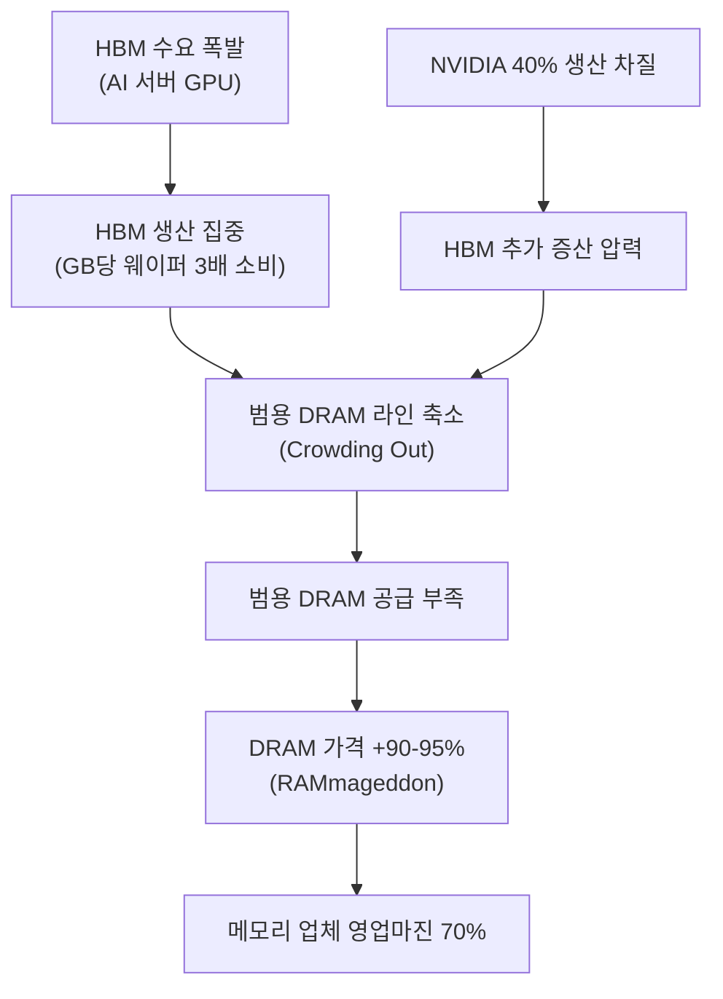

> **관련 글**: [2026년 투자 섹터 전망 (전체)](/knowledge/invest/2026/01/20/investment-sectors-outlook-2026.html) | [반도체 섹터 전망](/knowledge/invest/2026/01/21/semiconductor-sector-outlook-2026.html)

## 핵심 요약: RAMmageddon - 역사적 메모리 가격 폭등

글로벌 반도체 **$975B 기가 사이클**에서 메모리 시장은 **"RAMmageddon"**이라 불리는 역사적 가격 폭등을 겪고 있습니다.

**근본 원인**: HBM 생산이 GB당 **~3배의 웨이퍼 용량**을 소비 → 범용 DRAM 생산 라인 축소(crowding out effect) → 구조적 공급 부족

**리드타임**: **40주 이상**, 마이크론은 **2028년까지 구조적 부족** 전망

| 지표 | 수치 | 비고 |
|------|------|------|
| **범용 DRAM Q1** | **+90-95% QoQ** | TrendForce 확정, 역대 최대폭 |
| **서버 DRAM (DDR5 블렌디드)** | **+105-110% QoQ** | |
| **64GB RDIMM DDR5** | **$255(Q3) → $450(Q4) → $700+(3월)** | 6개월 만에 2.7배 |
| **DDR5 32GB 키트** | **$100-200 → $350+** | |
| **NAND Q1** | **+55-60% QoQ** | |
| **소비자 SSD 1TB** | **$45 → ~$90 (2x)** | |
| **DRAM 리드타임** | **40주 이상** | 2026 조달 계획 수립 어려움 |
| **장기 전망** | **2028년까지 부족** | 마이크론 공식 전망 |
| **NVIDIA 생산 차질** | **40%** | HBM 공급 부족 |
| **DRAM 영업마진** | **~70%** | 역대급 |

---

## 3월 4일 핵심 업데이트

| 날짜 | 이벤트 | DRAM/NAND 영향 |
|------|--------|---------------|
| **3/3** | **DRAM Q2 가격 최대 70% 추가 급등 전망 (DigiTimes)** | RAMmageddon 심화, Q1 +90-95% 이어 Q2에도 대폭 상승 예상 |
| **3/3** | **삼성전자 -9.88% 급락** — 블랙 튜즈데이 | 관세·지정학 충격, 메모리 펀더멘탈 변화 없음 |
| **3/3** | **SK하이닉스 -11.50% → 939,000원** — 블랙 튜즈데이 | PER ~4.2배로 저평가 심화, 구조적 공급 부족은 지속 |
| **3/3** | **삼성 Taylor 공장 양산 2027년으로 지연** | 파운드리 생산 일정 지연, 메모리에 집중 가능성 |

### DRAM Q2 가격 최대 70% 추가 급등 전망

DigiTimes 보도에 따르면 **DRAM Q2 가격이 최대 70% 추가 급등**할 전망입니다. Q1 +90-95% QoQ에 이어 Q2에도 대폭 상승이 예상되며, RAMmageddon이 더욱 심화되고 있습니다. HBM crowding out에 의한 구조적 공급 부족이 해소되지 않은 상태에서, 서버 DDR5 수요 폭발이 가격 상승을 가속화하고 있습니다.

### 블랙 튜즈데이 — 삼성 -9.88%, SK하이닉스 -11.50%

3/3 블랙 튜즈데이에 KOSPI가 -7.24% 폭락하면서 삼성전자(-9.88%)와 SK하이닉스(-11.50%)가 동반 급락했습니다. 관세 충격과 지정학 불안이 원인이며, **메모리 펀더멘탈(공급 부족, 가격 폭등, 영업마진 70%)에는 변화가 없습니다.** 급락으로 인한 밸류에이션 하락은 매수 기회로 판단됩니다.

### 삼성 Taylor 공장 양산 2027년 지연

삼성전자의 미국 Taylor 공장 양산이 **2027년으로 지연**되었습니다. 파운드리 사업의 일정 차질이지만, 메모리(DRAM/NAND) 사업에 경영 자원을 더 집중할 수 있는 여지를 제공합니다.

---

## DRAM 시장 현황

### DRAM 가격 상세

| 제품군 | Q1 변동 | 구체 가격 | 비고 |
|--------|---------|----------|------|
| **범용 DRAM** | **+90-95% QoQ** | | TrendForce 확정 |
| **서버 DRAM (DDR5)** | **+105-110% QoQ** | | AI 서버 수요 폭발 |
| **64GB RDIMM DDR5** | | $255→$450→**$700+** | 6개월 2.7배 |
| **DDR5 32GB 키트** | | $100-200 → **$350+** | 소비자 가격 급등 |
| **LPDDR4X/LPDDR5X** | **+90% QoQ** | | 모바일 DRAM 동반 |
| **DDR4** | | | 1년새 **1,800% 폭등** |
| **Q2 전망** | **최대 +70% 추가** | | **DigiTimes 3/3 보도**, 기존 +20% 대비 대폭 상향 |

### 가격 폭등의 구조적 원인

```mermaid
flowchart TD
    A["HBM 수요 폭발<br/>(AI 서버 GPU)"] --> B["HBM 생산 집중<br/>(GB당 웨이퍼 3배 소비)"]
    B --> C["범용 DRAM 라인 축소<br/>(Crowding Out)"]
    C --> D["범용 DRAM 공급 부족"]
    D --> E["DRAM 가격 +90-95%<br/>(RAMmageddon)"]
    E --> F["메모리 업체 영업마진 70%"]

    G["NVIDIA 40% 생산 차질"] --> H["HBM 추가 증산 압력"]
    H --> C
```

### 공급 부족 전망

| 항목 | 수치 | 출처 |
|------|------|------|
| **2026 공급 부족률** | **4.9%** | 골드만삭스 |
| **2027 공급 부족률** | **2.5%** | 골드만삭스 |
| **리드타임** | **40주+** | |
| **장기 전망** | **2028년까지 부족** | 마이크론 |

### DRAM 영업마진: HBM보다 높은 수익성

| 제품 | 영업마진 | 비고 |
|------|---------|------|
| **범용 DRAM** | **~70%** | 공급 축소 → 가격 폭등 → 마진 극대화 |
| **HBM** | **~60%** | 높은 제조 원가 (TSV, CoWoS) |

범용 DRAM 마진이 HBM보다 높다는 것은 메모리 업체의 수익이 **HBM + 범용 DRAM 이중 구조**임을 의미합니다.

---

## NAND 시장 현황

### NAND 가격 동향

| 제품군 | Q1 변동 | 구체 가격 | 비고 |
|--------|---------|----------|------|
| **NAND 전체** | **+55-60% QoQ** | | 구조적 공급 부족 |
| **소비자 SSD 1TB** | | $45 → **~$90 (2x)** | |
| **Client SSD** | **+40% 이상** | | |

BofA는 2026년 글로벌 NAND 매출이 전년비 **45% 성장** 전망. DRAM 대비 투자 부족이 가격 상승 가속화.

### SK하이닉스 HBF: NAND의 새로운 성장 동력

| 항목 | 내용 |
|------|------|
| 핵심 개념 | HBM + NAND Flash 통합 |
| 전력당 성능 | HBM 대비 **2.69배** |
| 용량 | HBM 대비 **8~16배** |
| 타겟 시장 | **AI 추론(Inference)** |
| **샘플** | **H2 2026** |
| **양산** | **2027년** |

HBF가 상용화되면 NAND는 단순 저장장치를 넘어 **AI 연산 메모리**로 격상. NAND 산업 부가가치의 근본적 변화.

---

## 관세: Section 122 15%

| 관세 유형 | 세율 | 메모리 영향 |
|----------|------|-----------|
| **IEEPA** | 위헌 무효 | 메모리 기존 면제 |
| **Section 122** | **15%** | IEEPA 25% 대비 하향 = **순긍정** |
| **Section 232** | **25%** | 메모리 직접 대상 아님 |

삼성·SK하이닉스 **글로벌 DRAM 70% 점유** → 대체 불가능 → 관세 협상 레버리지.

---

## 사이클 분석

### 인터넷 사이클(46개월) 패턴 적용

| 사이클 | 상승 시작 | 피크 전망 |
|--------|---------|----------|
| **AI 사이클** | 2023 H2 | **2027 Q1 전후** |

인터넷 사이클 46개월 패턴 적용 시 피크는 2027년 Q1 전후. 마이크론의 2028년까지 부족 전망과 맞물려 사이클 장기화 가능성.

---

## 관련 종목

### 삼성전자 (005930) - Q1 OP 30조 돌파

| 항목 | 내용 |
|------|------|
| **Q1 2026 OP** | **~30조원 (사상 첫 분기 30조 돌파)** |
| **2026 연간 OP** | **170-201조원** |
| **2027 OP** | **317조원 (모건스탠리)** |
| 글로벌 DRAM 점유율 | 34% (1위) |
| **HBM4** | 2/12 양산 출하, 11.7Gbps |
| 월간 캐파 | 170K → 250K(연말) |

**삼성전자 우선주 (005935) 분할매수 전략**

| 구분 | 보통주 | 우선주 |
|------|--------|--------|
| 의결권 | O | X |
| 배당 | 기본 | 보통주 + 추가 배당 |
| 가격 | - | 보통주 대비 10~15% 할인 |
| 전략 | 단기 트레이딩 | **장기 분할매수** |

### SK하이닉스 (000660) - 목표가 130-150만원

| 항목 | 내용 |
|------|------|
| **PER** | **4.7배** (극단적 저평가) |
| **영업이익률** | **67%** |
| **HBM 점유율** | **53%** |
| DRAM 매출 점유율 | 36% (1위, 삼성 추월) |
| **블랙록** | **5.00% (최대주주)** |
| BofA | **Top Pick** |

**3/3 목표가**

| 증권사 | 목표가 | OP 전망 |
|--------|--------|---------|
| 키움 | **130만원** | 170조 |
| 하나 | **145만원** | 112조 |
| 대신 | **145만원** | 100.7조 |
| 시티/SK증권 | **140-150만원** | |

### 마이크론 (MU) - HBM4 탈락, HBM3E 완판

| 항목 | 내용 |
|------|------|
| HBM4 | **탈락 확정** |
| HBM3E | 2026년 전량 계약 |
| 미국 투자 | $30B 메가팹 |

---

## 리스크 요인

| 리스크 | 내용 | 대응 |
|--------|------|------|
| **빅테크 FCF 급감** | AI CAPEX $660-690B | 분기 CAPEX 가이던스 모니터링 |
| **B2C 수요 파괴** | DRAM/NAND 폭등 → PC/스마트폰 가격 급등 | 출하량 데이터 추적 |
| **YMTC 증설** | NAND 공급 부족 해소 변수 | YMTC 뉴스 모니터링 |
| **CXMT DRAM 진입** | 5% → 2027년 10% 전망, 레거시 가격 하락 압력 | EUV 부재로 첨단 제한적 |
| **사이클 피크** | 2027 Q1 전후 | 접근 시 점진적 차익실현 검토 |

---

## 투자 전략

### 핵심 원칙

1. **분할매수**: 3~4회에 걸쳐 분산 진입
2. **삼성전자 우선주**: 할인 가격 + 높은 배당으로 하방 완충
3. **SK하이닉스**: PER 4.7배 극단적 저평가 + 목표가 130-150만원
4. **2027 Q1 주의**: 사이클 피크 접근 시 점진적 차익실현 검토

### 모니터링 지표

| 지표 | 주기 | 의미 |
|------|------|------|
| **TrendForce 월별 가격** | 월간 | Q2 +20% 실현 여부 |
| **현물가 vs 계약가** | 수시 | 현물가 > 계약가 시 추가 인상 신호 |
| **GTC 2026 (3/15~19)** | 일회성 | Vera Rubin HBM4 수요 규모 |
| **빅테크 분기 실적** | 분기 | AI CAPEX 지속 여부 |
| **YMTC/CXMT 증설** | 수시 | 공급 과잉 전환 시점 |
| **B2C 출하량** | 분기 | 수요 파괴 여부 |

---

## 결론

RAMmageddon은 HBM crowding out이라는 **구조적 원인**에 기반하며, 마이크론의 **2028년까지 부족** 전망이 이를 뒷받침합니다.

| 항목 | 내용 |
|------|------|
| **DRAM** | +90-95% QoQ, 서버DDR5 +105-110%, 64GB RDIMM $700+ |
| **NAND** | +55-60% QoQ, SSD 1TB $90(2x) |
| **영업마진** | DRAM 70%, HBM 60% = 이중 수익 구조 |
| **삼성전자** | Q1 OP 30조, 2026 170-201조, 2027 317조(MS) |
| **SK하이닉스** | PER 4.7배, 목표가 130-150만원, 블랙록 5% |
| **전략** | 공급 변화 시그널 전까지 보유, 2027 Q1 접근 시 차익실현 검토 |

---

*본 글은 투자 참고용이며, 투자 판단과 그에 따른 책임은 투자자 본인에게 있습니다. (2026년 3월 4일 업데이트)*
