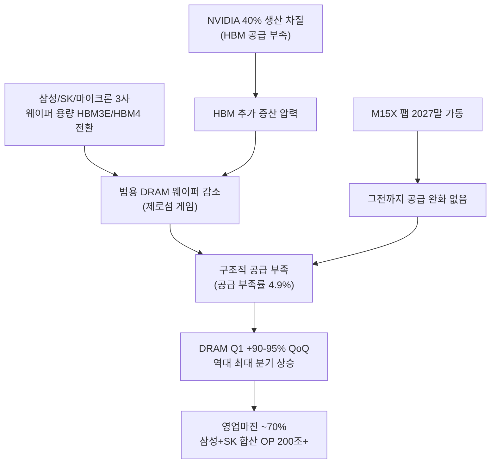

> **관련 글**: [2026년 투자 섹터 전망 (전체)](/knowledge/invest/2026/01/20/investment-sectors-outlook-2026.html) | [반도체 섹터 전망](/knowledge/invest/2026/01/21/semiconductor-sector-outlook-2026.html)

## 핵심 요약: 메모리 슈퍼사이클 — 역대 최대 분기 가격 상승

글로벌 반도체 **$975B 기가 사이클** 속에서 메모리 시장은 AI 주도 **"메모리 슈퍼사이클"** — 구조적 가격 상승 국면에 돌입했습니다.

**근본 원인**: 삼성, SK하이닉스, 마이크론 3사 모두 웨이퍼 용량을 HBM3E/HBM4로 전환 중. **HBM 웨이퍼 1장 = 범용 DRAM 웨이퍼 1장 감소** (제로섬 게임) → 구조적 공급 부족

**공급 부족 지속 기간**: IDC/TrendForce **2026년 전체**, 의미있는 공급 완화는 **SK하이닉스 M15X 팹 가동(2027년 말)** 이후

| 지표 | 수치 | 비고 |
|------|------|------|
| **DRAM Q1** | **+90-95% QoQ** | **역대 최대 분기 상승** |
| **PC DRAM Q1** | **최소 2배 상승** | |
| **서버 DRAM** | **+170% YoY (일부 세그먼트)** | |
| **현물가 vs 계약가** | **현물가 > 계약가** | 이례적 상황 |
| **Enterprise SSD Q1** | **+53-58% QoQ** | **역대 최대 분기 상승** |
| **NAND Q1** | **+55-60% QoQ** | |
| **512Gb TLC 웨이퍼 현물** | **+14.7%/주** | 이번주 단독 |
| **DRAM 영업마진** | **~70% (범용) vs ~60% (HBM)** | |
| **공급 부족률** | **4.9%** | 골드만삭스 |
| **리드타임** | **40주+** | |
| **합산 OP 전망** | **삼성+SK 200조 초과** | 2026년 |
| **공급 완화 시점** | **2027년 말 (M15X)** | |

---

## 3월 7일 핵심 업데이트

| 날짜 | 이벤트 | 투자 시사점 |
|------|--------|-----------|
| **3/7** | **Q1 DRAM +90-95% QoQ — 역대 최대 분기 상승 확정** | 가격 상승 폭이 시장 예상치를 계속 상회 |
| **3/7** | **PC DRAM 최소 2x, 서버 DRAM +170% YoY** | 세그먼트별 상승폭 차별화 |
| **3/7** | **Enterprise SSD +53-58% QoQ — 역대 기록** | NAND도 DRAM 못지않은 상승 |
| **3/7** | **512Gb TLC 웨이퍼 현물 +14.7%/주** | NAND 현물 가속 상승 |
| **3/7** | **삼성+SK 합산 2026 OP 200조 초과 전망** | 실적 기대치 상향 |
| **3/7** | **IDC/TrendForce: 2026년 전체 공급 부족** | 부족 해소 시점이 더 늦춰짐 |
| **3/7** | **M15X 팹 2027년 말 이후 가동** | 의미있는 공급 완화 시점 |
| **3/7** | **Q2 가격 협상 미시작, 시장 심리 신중** | Q2 상승폭은 불확실 |
| **3/5** | **삼성 +11.15%(~195,100원), SK +10.95%(~941,000원) 반등** | 펀더멘탈 불변 확인 |

### Q1 DRAM: 역대 최대 분기 상승 (+90-95% QoQ)

Q1 2026 DRAM 계약 가격이 **전분기 대비 +90-95% 상승**으로 확정되었습니다. 이는 **DRAM 산업 역사상 최대 분기 상승폭**입니다.

- **PC DRAM**: 최소 **2배 상승**
- **서버 DRAM**: 일부 세그먼트에서 **전년 동기 대비 +170%**
- **현물가 > 계약가**: 통상적으로 계약가가 현물가보다 높지만, 현재 **현물가가 계약가를 초과**하는 이례적 상황. 이는 Q2 계약가 추가 인상의 강력한 선행 지표

**Q2 전망**: 가격 협상이 아직 시작되지 않았으며, 시장 심리는 신중합니다. 다만 현물가 > 계약가 상황이 지속되는 한 Q2 추가 상승은 유력합니다.

### Enterprise SSD: 역대 최대 분기 상승 (+53-58% QoQ)

NAND 시장도 DRAM 못지않은 가격 폭등을 기록하고 있습니다.

- **Enterprise SSD**: **+53-58% QoQ** — 역대 최대 분기 상승
- **NAND 전체**: **+55-60% QoQ**
- **512Gb TLC 웨이퍼 현물가**: 이번 주에만 **+14.7%** 상승 — 상승 가속화

### 공급 부족: 2026년 전체 지속 확정

IDC와 TrendForce 모두 **메모리 공급 부족이 2026년 전체에 걸쳐 지속**될 것으로 전망합니다. 의미있는 공급 완화는 **SK하이닉스 M15X 팹이 가동되는 2027년 말 이후**에야 가능합니다.

---

## DRAM 시장 현황

### 가격 폭등의 구조적 원인

```mermaid
flowchart TD
    A["삼성/SK/마이크론 3사<br/>웨이퍼 용량 HBM3E/HBM4 전환"] --> B["범용 DRAM 웨이퍼 감소<br/>(제로섬 게임)"]
    B --> C["구조적 공급 부족<br/>(공급 부족률 4.9%)"]
    C --> D["DRAM Q1 +90-95% QoQ<br/>역대 최대 분기 상승"]
    D --> E["영업마진 ~70%<br/>삼성+SK 합산 OP 200조+"]

    F["NVIDIA 40% 생산 차질<br/>(HBM 공급 부족)"] --> G["HBM 추가 증산 압력"]
    G --> B

    H["M15X 팹 2027말 가동"] --> I["그전까지 공급 완화 없음"]
    I --> C
```

### DRAM 가격 상세

| 제품군 | Q1 변동 | 구체 가격 | 비고 |
|--------|---------|----------|------|
| **범용 DRAM** | **+90-95% QoQ** | | **역대 최대**, TrendForce 확정 |
| **PC DRAM** | **최소 2x** | | |
| **서버 DRAM (DDR5)** | **+105-110% QoQ** | | 일부 세그먼트 YoY +170% |
| **64GB RDIMM DDR5** | | $255→$450→**$700+** | 6개월 2.7배 |
| **DDR4** | | | 1년새 1,800% 폭등 |
| **현물가 vs 계약가** | **현물가 > 계약가** | | 이례적, Q2 상승 선행 지표 |

### 공급 부족 전망

| 항목 | 수치 | 출처 |
|------|------|------|
| **2026 공급 부족률** | **4.9%** | 골드만삭스 |
| **2026 부족 지속** | **연중 전체** | IDC/TrendForce |
| **리드타임** | **40주+** | |
| **공급 완화 시점** | **2027년 말 (M15X)** | SK하이닉스 |
| **장기 전망** | **2028년까지 부족** | 마이크론 |

### DRAM 영업마진: 이중 수익 구조

| 제품 | 영업마진 | 비고 |
|------|---------|------|
| **범용 DRAM** | **~70%** | 공급 축소 → 가격 폭등 → 마진 극대화 |
| **HBM** | **~60%** | 높은 제조 원가 (TSV, CoWoS) |

범용 DRAM 마진이 HBM보다 높다는 사실은, 메모리 업체 수익이 **HBM + 범용 DRAM 이중 구조**에서 나온다는 것을 의미합니다. HBM 생산이 늘수록 범용 DRAM 공급이 줄어 가격이 오르는 **자기강화 구조**입니다.

---

## NAND 시장 현황

### NAND 가격 동향

| 제품군 | Q1 변동 | 비고 |
|--------|---------|------|
| **NAND 전체** | **+55-60% QoQ** | |
| **Enterprise SSD** | **+53-58% QoQ** | **역대 최대 분기 상승** |
| **소비자 SSD 1TB** | $45 → ~$90 (2x) | |
| **512Gb TLC 웨이퍼 현물** | **+14.7%/주** | 상승 가속화 |

BofA는 2026년 글로벌 NAND 매출 전년비 **45% 성장** 전망. Enterprise SSD가 AI 데이터센터 수요로 NAND 상승을 주도하고 있습니다.

### SK하이닉스 HBF: NAND의 새로운 성장 동력

| 항목 | 내용 |
|------|------|
| 핵심 개념 | HBM + NAND Flash 통합 |
| 전력당 성능 | HBM 대비 **2.69배** |
| 용량 | HBM 대비 **8~16배** |
| 타겟 시장 | **AI 추론(Inference)** |
| **샘플** | **H2 2026** |
| **양산** | **2027년** |

---

## 관세: Section 122 15%

| 관세 유형 | 세율 | 메모리 영향 |
|----------|------|-----------|
| **IEEPA** | 위헌 무효 | 메모리 기존 면제 |
| **Section 122** | **15%** | IEEPA 25% 대비 하향 = **순긍정** |
| **Section 232** | **25%** | 메모리 직접 대상 아님 |

삼성·SK하이닉스 **글로벌 DRAM 70% 점유** → 대체 불가능 → 관세 협상 레버리지.

---

## 사이클 분석

### 인터넷 사이클(46개월) 패턴 적용

| 사이클 | 상승 시작 | 피크 전망 |
|--------|---------|----------|
| **AI 사이클** | 2023 H2 | **2027 Q1 전후** |

인터넷 사이클 46개월 패턴 적용 시 피크는 2027년 Q1 전후. 마이크론의 2028년까지 부족 전망과 M15X 2027년 말 가동 일정을 고려하면 사이클 장기화 가능성 있음.

---

## 관련 종목

### 삼성전자 (005930) — ~195,100원, 합산 OP 200조+ 전망

| 항목 | 내용 |
|------|------|
| **주가 (3/5)** | **~195,100원 (+11.15% 반등)** |
| **2026 합산 OP** | **삼성+SK 200조 초과 전망** (애널리스트) |
| **Q1 2026 OP** | **~30조원 (사상 첫 분기 30조 돌파)** |
| **2027 OP** | **317조원 (모건스탠리)** |
| 글로벌 DRAM 점유율 | 34% (1위) |
| **HBM4** | 2/12 양산 출하, 11.7Gbps |

**삼성전자 우선주 (005935) 분할매수 전략**

| 구분 | 보통주 | 우선주 |
|------|--------|--------|
| 의결권 | O | X |
| 배당 | 기본 | 보통주 + 추가 배당 |
| 가격 | - | 보통주 대비 10~15% 할인 |
| 전략 | 단기 트레이딩 | **장기 분할매수** |

### SK하이닉스 (000660) — ~941,000원, 목표가 130-150만원

| 항목 | 내용 |
|------|------|
| **주가 (3/5)** | **~941,000원 (+10.95% 반등)** |
| **PER** | **~16배** |
| **영업이익률** | **67%** |
| **HBM 점유율** | **53%** |
| DRAM 매출 점유율 | 36% (1위, 삼성 추월) |
| **블랙록** | **5.00% (최대주주)** |
| BofA | **Top Pick** |

**목표가**

| 증권사 | 목표가 | OP 전망 |
|--------|--------|---------|
| 키움 | **130만원** | 170조 |
| 하나 | **145만원** | 112조 |
| 대신 | **145만원** | 100.7조 |
| 시티/SK증권 | **140-150만원** | |

### 마이크론 (MU) — HBM4 탈락, HBM3E 완판

| 항목 | 내용 |
|------|------|
| HBM4 | **탈락 확정** |
| HBM3E | 2026년 전량 계약 |
| 미국 투자 | $30B 메가팹 |

---

## 리스크 요인

| 리스크 | 내용 | 심각도 | 대응 |
|--------|------|--------|------|
| **수요 파괴** | PC/모바일 OEM 사양 하향 + 가격 전가 → 소비자 수요 감소 | **높음** | 출하량 데이터 추적, OEM 사양 변경 모니터링 |
| **빅테크 FCF 급감** | AI CAPEX $660-690B, 서버 투자 지속 여부 | 중간 | 분기 CAPEX 가이던스 모니터링 |
| **CXMT DRAM 진입** | 5% → 2027년 10% 전망, 레거시 가격 하락 압력 | 낮음 | EUV 부재로 첨단 제한적 |
| **YMTC 증설** | NAND 공급 부족 해소 변수 | 낮음 | 증설 뉴스 모니터링 |
| **사이클 피크** | 2027 Q1 전후 | 중간 | 접근 시 점진적 차익실현 검토 |

**주요 리스크: 수요 파괴**

DRAM/NAND 가격이 급등하면서 PC/모바일 OEM이 **사양 하향(spec downgrade)**을 검토하고 있으며, 가격 인상이 소비자에게 전가(price pass-through)될 경우 **수요 파괴(demand destruction)**가 발생할 수 있습니다. 이는 현재 슈퍼사이클의 가장 현실적인 리스크입니다.

---

## 투자 전략

### 핵심 원칙

1. **메모리 슈퍼사이클 진행 중**: Q1 +90-95%는 역대 최대 — 구조적 상승
2. **공급 부족 2026 전체 지속**: M15X 팹 2027년 말 전까지 완화 없음
3. **합산 OP 200조+ 전망**: 실적이 주가를 지지
4. **SK하이닉스 PER ~16배**: 반도체 평균(15-20배) 하단
5. **수요 파괴 리스크 모니터링 필수**: OEM 사양 하향, 출하량 추이 확인

### 모니터링 지표

| 지표 | 주기 | 의미 |
|------|------|------|
| **TrendForce 월별 가격** | 월간 | 현물가 > 계약가 지속 여부, Q2 상승폭 |
| **Q2 가격 협상 시작** | 수시 | 협상 시작 시점과 초기 가격 수준 |
| **PC/모바일 출하량** | 분기 | **수요 파괴 발생 여부** |
| **OEM 사양 변경** | 수시 | DRAM/SSD 사양 하향 여부 |
| **GTC 2026 (3/16~19)** | 일회성 | Vera Rubin HBM4 수요 규모 |
| **빅테크 분기 실적** | 분기 | AI CAPEX 지속 여부 |
| **YMTC/CXMT 증설** | 수시 | 공급 과잉 전환 시점 |

---

## 결론

메모리 슈퍼사이클이 본격 진행 중입니다. Q1 DRAM **+90-95% QoQ**는 역대 최대 분기 상승이며, Enterprise SSD도 **+53-58%**로 역대 기록을 세웠습니다.

| 항목 | 내용 |
|------|------|
| **DRAM Q1** | +90-95% QoQ — **역대 최대**, PC 2x, 서버 +170% YoY |
| **현물가 > 계약가** | 이례적 상황, Q2 추가 상승 유력 |
| **Enterprise SSD** | +53-58% QoQ — **역대 최대** |
| **512Gb TLC 현물** | +14.7%/주 — 상승 가속화 |
| **공급 부족** | 2026 전체 지속, M15X 2027말 전까지 완화 없음 |
| **합산 OP** | 삼성+SK 200조 초과 전망 |
| **영업마진** | 범용 DRAM ~70%, HBM ~60% — 이중 수익 구조 |
| **삼성전자** | ~195,100원(+11.15% 반등), Q1 OP 30조 |
| **SK하이닉스** | ~941,000원(+10.95% 반등), PER ~16배 |
| **주요 리스크** | PC/모바일 OEM 사양 하향, 수요 파괴 가능성 |
| **전략** | 공급 완화 시그널 전까지 보유, 수요 파괴 지표 모니터링 |

---

*본 글은 투자 참고용이며, 투자 판단과 그에 따른 책임은 투자자 본인에게 있습니다. (2026년 3월 7일 업데이트)*
