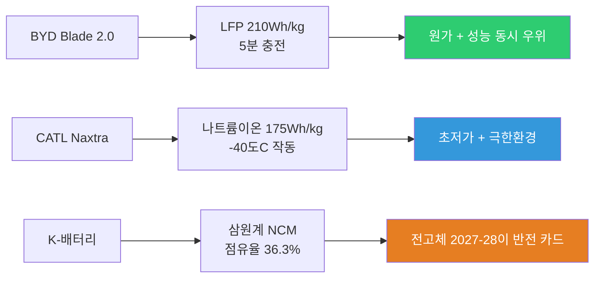

> **관련 글**: [2026년 투자 섹터 전망 (전체)](/knowledge/invest/2026/01/20/investment-sectors-outlook-2026.html) | [자동차/로봇 섹터 전망](/knowledge/invest/2026/01/21/automotive-robotics-sector-outlook-2026.html)

2026년 3월 7일 기준, EV/자율주행 섹터의 핵심 변화는 **BYD Blade Battery 2.0의 5분 충전 혁명** (충전시간이 주유시간에 근접), **유가 Brent $89로 EV 경제성 극대화**, **NHTSA 3/9 FSD/로보택시 안전 데이터 마감**, **25% 자동차 수입관세 4/3 발효**, **현대/기아 미국 EV 판매 급감** (IONIQ 6 -77%), 그리고 **Waymo $110B 밸류에이션 + 7개 신규 도시 확장**입니다.

## 3월 7일 핵심 업데이트

| 날짜 | 이벤트 | 영향 |
|------|--------|------|
| **3/5** | **BYD Blade Battery 2.0 공개** | 10%→70% **5분**, LFP 210Wh/kg, 1,006km — 충전 패러다임 전환 |
| **3/7** | **유가 Brent $89** | EV TCO 우위 역대 최대, 전환 가속 촉매 |
| **3/9** | **NHTSA FSD 안전 데이터 마감** | 로보택시 규제 분수령, 80+ 교통위반 적발 |
| **4/3** | **25% 자동차 수입관세 발효** | 한국산 EV 미국 수출 직격탄, 현대/기아 영향 |

---

## BYD Blade Battery 2.0 — 충전 패러다임 전환 (3/5 공개)

BYD가 3월 5일 공개한 **Blade Battery 2.0**은 EV 최대 약점이었던 **충전 시간을 사실상 해결**했습니다.

### 핵심 스펙

| 항목 | 수치 | 의미 |
|------|------|------|
| **급속충전** | **10%→70% 5분** | 가솔린 주유(3-5분)에 근접 |
| 완속충전 | 10%→97% 9분 | 기존 LFP 대비 **혁명적** |
| **극한환경** | -30°C: 20%→97% 12분 | 한랭지 EV 최대 약점 해소 |
| 에너지밀도 | **210 Wh/kg** (LFP) | 기존 LFP 대비 30%+ 향상 |
| 주행거리 | **1,006km** (CLTC) | 1회 충전 1,000km 시대 |
| 내구성 | **100만km+** | 사실상 차량 수명 전체 커버 |

### 충전 인프라 계획

| 항목 | 내용 |
|------|------|
| 충전소 | **1,500kW 플래시 충전** |
| 2026년 목표 | **20,000개소** 설치 |

### 투자 시사점

**Blade Battery 2.0은 "충전 불안"이라는 EV 최대 진입장벽을 제거합니다.** 5분 충전이 가솔린 주유 시간에 근접하면서, 내연기관 대비 EV 전환을 망설일 이유가 사라지고 있습니다. 특히 LFP 기반으로 210 Wh/kg을 달성한 것은 원가 경쟁력(코발트/니켈 불필요)까지 확보한 것이며, 이는 **K-배터리(삼원계) 진영에 구조적 위협**입니다.

---

## 유가 Brent $89 — EV 경제성 역대 최대

유가가 **Brent $89**까지 상승하면서 **EV의 총소유비용(TCO) 우위가 역대 최대 수준으로 확대**되고 있습니다.

| 지표 | 수치 | EV 영향 |
|------|------|---------|
| **Brent** | **$89** | 가솔린 운행비 급등 → EV 전환 동기 **극대화** |
| 호르무즈 봉쇄 | 지속 중 | $100+ 시나리오 여전히 유효 |
| EV TCO | **우위 역대 최대** | 연료비 차이가 구매 결정 지배 요인화 |

**투자 시사점**: 유가 $89는 $80대 초반 대비 EV 경제성이 한층 강화된 수준. 호르무즈 봉쇄 장기화 시 $100+ 돌파 가능성까지 열려 있어, EV 전환 가속의 구조적 환경이 지속됩니다.

---

## 테슬라 — NHTSA 3/9 데드라인 + Bear Case 부각

### Q1 2026 Bear Case

| 항목 | 내용 |
|------|------|
| **판매 전망** | 75% 확률 **350K 미만** |
| Bear Case 주가 | **$390-406** |
| **애널리스트 괴리** | GLJ **$25** vs Wedbush **$600** |

### NHTSA 3/9 마감 — 로보택시 규제 분수령

| 항목 | 내용 |
|------|------|
| **마감일** | **3월 9일** (이틀 후) |
| 요구사항 | FSD/로보택시 **안전 데이터 제출** |
| **교통위반** | NHTSA 적발 **80건+** |
| 사고 | 오스틴 14건 (2025년 6월 이후) |

### Cybercab 현황

| 항목 | 내용 |
|------|------|
| 관찰된 차량 | **~25대** |
| 규모 확대 | **4-8주 소요** 전망 |
| **리스크** | Victor Nechita (차량 PM) **퇴사** |
| NHTSA 면제 | **미취득** (핸들/페달 없는 차량 판매 불가) |

### 중국 시장 — Xiaomi YU7에 밀림

| 항목 | 내용 |
|------|------|
| 중국 1위 | **Xiaomi YU7** |
| vs Model Y | YU7가 **2배** 판매 |
| 테슬라 입지 | **지속 약화** |

### 투자 시사점

**3/9 NHTSA 데드라인이 단기 최대 이벤트입니다.** 80건+ 교통위반과 14건 사고 데이터가 공개되면 규제 강화 가능성이 있으며, 이는 로보택시 확장 전체 일정에 영향을 줍니다. 애널리스트 간 $25-$600의 극단적 괴리는 시장의 높은 불확실성을 반영합니다.

---

## 현대/기아 — 미국 EV 판매 급감

### 2월 미국 EV 판매 실적

| 모델 | YoY 변화 | 원인 |
|------|----------|------|
| **IONIQ 6** | **-77%** | $7,500 세액공제 만료(2025.9), N 외 2026년 미출시 |
| **EV6** | **-53%** | GT 출시 지연 |
| **EV9** | **-40%** | GT 출시 지연 |

### 구조적 문제

| 항목 | 내용 |
|------|------|
| **세액공제** | $7,500 연방 세액공제 **2025년 9월 만료** |
| **수입관세** | 4/3부터 **25%** 자동차 수입관세 발효 |
| **한국산 모델** | EV3, EV4, EV6 GT — 미국 수출 **중단** (관세 리스크) |
| **2026 라인업** | IONIQ 6 non-N 미출시, EV6 GT·EV9 GT 지연 |

### 투자 시사점

현대/기아의 미국 EV 판매는 **세액공제 만료 + 25% 관세**의 이중 타격으로 구조적 하락세에 진입했습니다. 한국 생산 모델(EV3, EV4, EV6 GT)의 미국 수출이 관세 리스크로 중단된 상태여서, **미국 조지아 공장(메타플랜트) 가동 전까지 회복이 어렵습니다.** 장기적으로 Waymo 파트너십과 42dot 자율주행에서 가치를 찾아야 합니다.

---

## Waymo — $110B + 7개 도시 확장

### 최신 동향

| 항목 | 내용 |
|------|------|
| **차량 수** | **2,500대+** |
| **밸류에이션** | **$110B** 목표 |
| **펀딩** | **$15B** |
| **도시 확장** | **7개 신규 도시** |
| **목표** | 2026년 말 **주 100만회+ 운행** |
| **IONIQ 5** | 6세대 자율주행 플랫폼 도로 테스트 |

### 안전 이슈

| 항목 | 내용 |
|------|------|
| 스쿨버스 사고 | 안전 우려 제기 |
| 오스틴 구급차 차단 | 긴급차량 대응 문제 |

### Waymo vs Tesla 자율주행 비교

| 구분 | Waymo | Tesla |
|------|-------|-------|
| 센서 | 라이다+HD맵+카메라+레이더 | 카메라 only (비전) |
| 규모 | **2,500대+**, 7개 도시 확장 | 오스틴 72대+, ~25 Cybercab |
| 데이터 | **127만 마일+** (자율) | **84억 마일** (FSD 전체) |
| 확장성 | HD맵 필요, 도시별 느림 | 소프트웨어 기반 확장 |
| 전용 차량 | 없음 (기존 차량 활용) | **Cybercab** |
| 목표 | 주 100만회+ (2026 말) | 무인 로보택시 전국 확장 |

---

## 자율주행 규제 — SELF DRIVE Act + UN 투표

### 미국: SELF DRIVE Act of 2026

| 항목 | 내용 |
|------|------|
| 상태 | **초안 발의** |
| 의미 | 연방 차원 자율주행 법적 프레임워크 |

### UN 글로벌 자율주행 규정

| 항목 | 내용 |
|------|------|
| **투표 시기** | **2026년 6월** |
| 변경사항 | 핸즈오프 허용, 시스템 차선변경 가능 |
| 적용 범위 | **50+개국 자동 적용** |
| Level 4 | 핸드오프 승인 포함 |

---

## 배터리 기술 — BYD·CATL·전고체 경쟁 가속

### 핵심 기술 현황

| 기술 | 주체 | 핵심 스펙 | 일정 |
|------|------|----------|------|
| **Blade Battery 2.0** | BYD | 5분 충전, 210Wh/kg, 1,006km | **양산 즉시** |
| **Naxtra 나트륨이온** | CATL | 175Wh/kg, 500km, -40°C | **2026 대규모 배치** |
| 중국 전고체 표준 | 중국 정부 | 산업 표준 제정 | **2026년 7월** |
| 전고체 제조 | Factorial + Philenergy (한국) | 제조 파트너십 | 2027-2028 양산 |

### 배터리 전쟁 구도

**투자 시사점**: BYD Blade Battery 2.0이 LFP의 한계를 돌파하면서 **"LFP는 저가형, 삼원계는 고성능"이라는 이분법이 붕괴**되고 있습니다. CATL의 나트륨이온까지 합세하면 K-배터리(삼원계)의 점유율 하락은 가속될 수 있으며, 전고체 배터리 양산(2027-28)이 유일한 반전 카드입니다.

---

## 정책 변화 — 25% 관세 + 캐나다-중국 EV 관세 변경

### 미국 25% 자동차 수입관세

| 항목 | 내용 |
|------|------|
| **발효일** | **2026년 4월 3일** |
| 세율 | **모든 수입차에 25%** |
| **직격탄** | 한국산 현대/기아, 일본차, EU차 |
| 수혜 | 미국 내 생산 (Tesla, 일부 GM/Ford) |

### 캐나다-중국 EV 관세

| 항목 | 내용 |
|------|------|
| 기존 | **100%** |
| 변경 | **6.1%** (첫 49,000대) |
| 영향 | BYD 캐나다 진출 가능성 |

### 투자 시사점

**25% 관세는 미국 시장의 EV 경쟁 지형을 근본적으로 바꿉니다.** 현대/기아처럼 미국 현지 생산 비중이 낮은 OEM은 직격탄을 맞고, Tesla처럼 미국 내 생산하는 기업이 상대적 수혜를 받습니다. 캐나다의 중국 EV 관세 완화(100%→6.1%)는 BYD의 북미 우회 진출 경로가 될 수 있습니다.

---

## BYD — 해외 판매 사상 첫 내수 초과 + Great Tang

### 2월 실적 + 글로벌 전략

| 항목 | 내용 |
|------|------|
| **해외 판매** | 2월 **사상 첫 내수 초과** |
| 수출 | 100,600대 (+50% YoY) |
| **Great Tang** | 플래그십 EV SUV 공개 |
| 2025년 연간 | **460만대** (글로벌 1위) |

**투자 시사점**: BYD의 해외 판매가 사상 처음으로 내수를 초과한 것은 **글로벌 EV 기업으로의 전환**을 의미합니다. Blade Battery 2.0 + 가격 경쟁력 + 수직계열화의 삼박자가 갖춰진 상태에서, EU 관세(17%)를 감안해도 글로벌 확장은 지속될 전망입니다.

---

## FSD — 84억 마일 + 안전성 과제

### FSD 현황

| 항목 | 내용 |
|------|------|
| **누적 마일리지** | **84억 마일** |
| 무인 자율주행 기준 | ~100억 마일 필요 |
| 달성 예상 | 2026년 하반기 |
| 구독 | **$99/월 전용** (일시불 폐지) |
| 이연수익 | $38.3억 (~5조원) |

### 로보택시 안전성

| 지표 | 수치 | 의미 |
|------|------|------|
| 오스틴 사고 | **14건** (2025.6~) | NHTSA 조사 중 |
| NHTSA 교통위반 | **80건+** 적발 | 3/9 마감 대상 |
| **3/9 데드라인** | 안전 데이터 제출 | 규제 방향 결정 분수령 |

---

## 관련 종목 분석

### 종합 비교 (3월 7일)

| 종목 | 티커 | 핵심 포인트 | 최대 리스크 |
|------|------|------------|------------|
| 테슬라 | TSLA | FSD 84억mi, Cybercab, UN 6월, 미국 생산 관세 수혜 | **NHTSA 3/9**, 80+ 위반, Q1 bear case $390, 중국 Xiaomi에 밀림 |
| 알파벳 | GOOGL | Waymo $110B, 2,500대+, 7개 도시, IONIQ 5 6세대 | 원가 구조, 안전 이슈(스쿨버스) |
| 현대차 | 005380 | Waymo 파트너십, 42dot, 50.5조 투자 | **미국 EV -40~77%**, 25% 관세, 한국산 수출 중단 |
| BYD | 1211.HK | **Blade 2.0 5분충전**, 해외>내수, 460만대 1위 | EU 관세 17%, 중국 경쟁 심화 |

---

## 투자 전략 (3월 7일)

| 섹터 | 전략 | 근거 |
|------|------|------|
| 테슬라 FSD/로보택시 | **3/9 결과 확인 후 판단** | NHTSA 데드라인이 단기 방향 결정, 25% 관세는 상대 수혜 |
| BYD | **비중 확대 검토** | Blade 2.0 + 해외>내수 + 유가 $89 → 구조적 성장 |
| 웨이모/알파벳 | **관심 확대** | $110B, 7개 도시, 주 100만회 목표 |
| 현대차 | **단기 중립, 장기 보유** | 미국 EV 급감 + 25% 관세가 단기 리스크. Waymo·42dot은 장기 |
| 배터리 | **구조 변화 관찰** | BYD/CATL 압도적 → K-배터리 전고체 2027-28이 관건 |

### 핵심 모니터링 포인트

1. **NHTSA 3/9 마감** — FSD/로보택시 안전 데이터, 규제 방향 결정
2. **25% 관세 4/3 발효** — 현대/기아·일본차 미국 판매 타격 규모
3. **BYD Blade 2.0 양산 차량 출시** — 5분 충전 실제 적용 시점
4. **UN 자율주행 6월 투표** — 통과 시 FSD 50+개국 합법화
5. **FSD 100억 마일 달성** — 무인 자율주행 성능 도약
6. **유가 동향** — $89 유지/상승 시 EV 전환 가속
7. **SELF DRIVE Act** — 미국 연방 자율주행 법안 진행

---

## 리스크 요인

### 1. NHTSA 규제 강화 (확률: 중-높음 / 영향: 매우 높음)
3/9 마감 후 80건+ 교통위반·14건 사고 데이터 기반 규제 강화 가능. 로보택시 확장 전체 일정에 연쇄 영향.

### 2. 25% 자동차 관세 (확률: 확정 / 영향: 매우 높음)
4/3 발효. 한국·일본·EU 수입차 직격탄. 현대/기아 미국 EV 사업 타격 불가피. Tesla·미국 생산 OEM 상대 수혜.

### 3. BYD 기술 패권 (확률: 높음 / 영향: 높음)
Blade 2.0으로 충전·주행거리·내구성 모두 해결. LFP 기반 원가 우위까지 확보. 모든 OEM·배터리 기업에 구조적 위협.

### 4. 테슬라 Q1 실적 부진 (확률: 높음 / 영향: 중-높음)
75% 확률 350K 미만. 중국에서 Xiaomi YU7에 밀리는 추세. 애널리스트 $25-$600 괴리는 극단적 불확실성.

### 5. 유가 변동 (확률: 높음 / 영향: 중)
$89 유지 시 EV 가속, 호르무즈 해제 시 하락 → EV 전환 동력 약화.

### 6. K-배터리 점유율 추가 하락 (확률: 높음 / 영향: 중)
BYD Blade 2.0 + CATL Naxtra의 이중 공세. 전고체 2027-28 양산이 유일한 반전 카드.

---

## 결론

### EV·자율주행 핵심 판단 (3월 7일)

| 항목 | 판단 |
|------|------|
| 전반적 전망 | **기술·정책·에너지 3중 전환점** — 배터리 혁명, 관세 재편, 유가 급등 동시 진행 |
| 최대 호재 | BYD 5분 충전, 유가 $89, Waymo 7개 도시 확장, UN 6월 투표 |
| 최대 리스크 | NHTSA 3/9, 25% 관세, Tesla Q1 부진, K-배터리 점유율 하락 |
| 핵심 카탈리스트 | **3/9 NHTSA** → **4/3 관세** → **6월 UN 투표** → **H2 FSD 100억mi** |

### 핵심 메시지

1. **BYD Blade Battery 2.0이 충전 패러다임을 전환**: 10%→70% **5분**은 가솔린 주유에 근접한 수준. LFP 210Wh/kg + 1,006km + 100만km 내구성은 "충전 불안"이라는 EV 최대 장벽을 제거합니다. 1,500kW 충전소 20,000개소 계획까지, BYD의 수직계열화 전략이 완성 단계에 진입.

2. **NHTSA 3/9 마감이 이틀 후로 임박**: 80건+ 교통위반과 14건 사고 데이터를 기반으로 FSD/로보택시 규제 방향이 결정됩니다. 규제 강화 시 Cybercab 일정에 직접 영향.

3. **유가 $89로 EV 경제성 역대 최대**: 호르무즈 봉쇄 장기화로 $100 시나리오도 열려 있어, 가솔린→EV TCO 격차가 구매 결정을 지배하는 환경.

4. **25% 자동차 관세가 미국 시장을 재편**: 4/3 발효로 현대/기아·일본차 직격탄. Tesla·미국 생산 OEM 상대 수혜. 현대/기아 미국 EV 판매는 세액공제 만료 + 관세의 이중 타격.

5. **Waymo 2,500대 + 7개 도시로 자율주행 상용화 가속**: $110B 밸류에이션, $15B 펀딩, 주 100만회 목표. IONIQ 5 6세대 테스트로 현대차 파트너십 구체화.

6. **UN 6월 투표가 FSD 글로벌 합법화의 분수령**: SELF DRIVE Act 발의와 함께 자율주행 법적 프레임워크가 양대 축(미국+UN)에서 동시 진행.

---

*본 글은 투자 권유가 아닌 정보 제공 목적으로 작성되었습니다. 투자 결정은 본인의 판단과 책임하에 이루어져야 합니다. (2026년 3월 7일 업데이트)*
