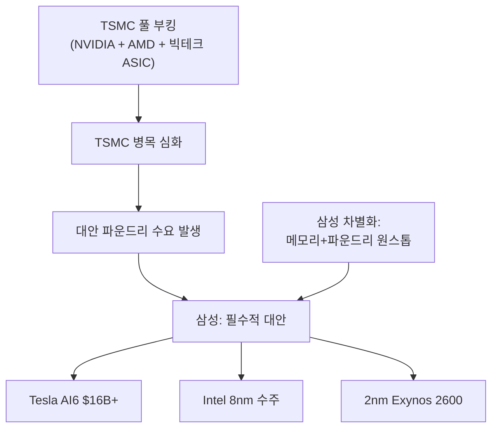

> **관련 글**: [2026년 투자 섹터 전망 (전체)](/knowledge/invest/2026/01/20/investment-sectors-outlook-2026.html) | [반도체 섹터 전망](/knowledge/invest/2026/01/21/semiconductor-sector-outlook-2026.html) | [반도체 소부장 전망](/knowledge/invest/2026/01/21/semiconductor-materials-equipment-outlook-2026.html)

## 핵심 요약

2026년 파운드리 섹터의 핵심 구도는 **TSMC 독주 심화 + 삼성 "필수적 대안(necessary alternative)" 부상 + Intel 18A 불확실성**입니다.

TSMC의 병목이 심화되면서, 빅테크들이 삼성을 **"필수적 대안"**으로 활용하기 시작했습니다. 테슬라 AI6 $16B+, Intel 8nm 수주가 이를 증명합니다. 삼성은 Taylor 공장에서 4nm 계획을 포기하고 **2nm GAA에 집중**하는 전략적 전환을 단행했습니다.

---

## 3월 4일 핵심 업데이트

| 날짜 | 이벤트 | 파운드리 영향 |
|------|--------|-------------|
| **3/3** | **삼성전자 -9.88% 급락** — 블랙 튜즈데이 | KOSPI -7.24%, 관세·지정학 충격, 파운드리 펀더멘탈 변화 없음 |
| **3/3** | **삼성 Taylor 공장 양산 2027년 지연** | 기존 계획 대비 지연, 2nm GAA 집중 전략은 유지 |

---

## 3월 핵심 업데이트

| 항목 | 내용 |
|------|------|
| **삼성 -9.88% (3/3 블랙 튜즈데이)** | 관세·지정학 충격으로 급락, 파운드리 펀더멘탈 변화 없음 |
| **삼성 Taylor 양산 2027년 지연** | 기존 일정 대비 지연, 2nm GAA 집중 전략에 집중 |
| **NVIDIA Intel 18A 테스트 중단** | 수율 우려로 TSMC 유지 결정 |
| **삼성 Taylor 4nm 포기** | **2nm GAA 집중 전략 전환** |
| **삼성 Tesla AI6** | **$16B+ (역대 최대 외부 파운드리 수주)** |
| **삼성 Intel 8nm 수주** | 2026년 볼륨 생산 |
| **삼성 2nm Exynos 2600** | 자사 칩 2nm 적용 |
| **TSMC 2nm 양산** | 웨이퍼 $30K+ |
| **TSMC $165B 미국 투자** | 관세 면제 확보 |
| **AMD-Meta $60B 딜** | Instinct MI450 + EPYC Venice |
| **ASML High-NA EUV** | 2027-28 배치 경쟁 (Intel/Samsung/SK/TSMC) |
| **NVIDIA Vera Rubin** | H2 2026, TSMC A16(1.6nm) Feynman 아키텍처 |

---

## TSMC: 독주 체제 강화

### 2nm 양산 + 관세 면제

| 항목 | 내용 |
|------|------|
| **공정** | **2nm (N2)** |
| **상태** | **양산 시작** |
| **웨이퍼 가격** | **$30,000+** |
| **미국 투자** | **$165B** |
| **관세** | **면제 확보** |
| 시장 점유율 | **60%+** |
| 가동률 | **풀 부킹** |

### TSMC 병목 심화 → 삼성 기회

TSMC의 첨단 공정이 풀 부킹 상태에서, NVIDIA Vera Rubin + AMD MI450 + 빅테크 ASIC 수요가 동시에 폭발하면서 **TSMC 병목이 구조적으로 심화**되고 있습니다. 이것이 삼성 파운드리에 대한 "필수적 대안" 수요를 만들고 있습니다.

### 핵심 투자 포인트

- 2nm 양산 시작: 첨단 공정 독주
- $165B 미국 투자 → 관세 면제: 경쟁사 대비 비용 우위
- NVIDIA, AMD, 빅테크 ASIC 모두 TSMC 경유: AI CAPEX $660-690B의 핵심 공급자
- Vera Rubin(H2 2026) + Feynman(TSMC A16 1.6nm): 차세대 공정 수요 확정

---

## 삼성 파운드리: "필수적 대안" 부상

### 전략적 전환

| 항목 | 내용 |
|------|------|
| **Taylor 공장** | **4nm 계획 포기 → 2nm GAA 집중, 양산 2027년 지연** |
| **Tesla AI6** | **$16B+ (역대 최대 외부 수주)** |
| **Intel 8nm 수주** | **2026년 볼륨 생산** |
| **2nm Exynos 2600** | 자사 칩으로 수율/성능 검증 |
| **Q1 OP** | **~30조원 (사상 첫 분기 30조 돌파)** |
| 차별화 | 메모리+파운드리 **원스톱 턴키** |

### Tesla AI6 $16B+ 계약

| 항목 | 기존 (AI5) | **변경 (AI6)** |
|------|-----------|---------------|
| **칩 세대** | AI5 | **AI6 (업그레이드)** |
| **계약 규모** | - | **$16B+ (~24조원)** |
| 생산 공장 | Taylor | Taylor |
| 차별화 | - | **메모리+파운드리 원스톱 턴키** |

Tesla AI6는 삼성 파운드리 역사상 최대급 외부 계약. Tesla가 삼성을 선택한 이유는 **HBM + 파운드리를 통합 제공**하는 독자적 역량.

### 삼성이 "필수적 대안"이 된 구조



### 2nm GAA 집중 전략

삼성이 Taylor 공장에서 **4nm 계획을 포기하고 2nm GAA에 집중**한 것은 전략적으로 합리적입니다:
- 4nm에서는 TSMC와 격차가 너무 크기 때문에 경쟁 포기
- 2nm GAA에서는 TSMC와 거의 동시 양산으로 기술 격차 축소 가능
- Exynos 2600에 먼저 적용하여 수율/성능 검증 후 외부 고객 수주

---

## Intel 18A: 불확실성 지속

### NVIDIA 테스트 중단

| 항목 | 내용 |
|------|------|
| **공정** | **18A (1.8nm급)** |
| **상태** | HVM 진입, **Nvidia 테스트 중단** |
| **원인** | **수율 우려** |
| **결과** | Nvidia TSMC 유지 결정 |
| 기술 | RibbonFET(GAA) + PowerVia(후면 전력) |

NVIDIA의 테스트 중단은 Intel 18A의 양산 안정성에 대한 시장 의구심을 키우며, 파운드리 경쟁력 회복 시나리오에 큰 타격.

### Intel-Broadcom-TSMC 합작 가능성

| 항목 | 내용 |
|------|------|
| 보도 | Broadcom + TSMC가 Intel 파운드리 인수/합작 검토 |
| 상태 | **미확정** |
| 실현 시 | Broadcom ASIC + TSMC 공정 + Intel 미국 팹 = 강력 조합 |

---

## 커스텀 ASIC: GPU 출하량 추월

### AMD-Meta $60B 딜 (2/24)

| 항목 | 내용 |
|------|------|
| **규모** | **$60B** |
| **제품** | Instinct MI450 GPU + 6세대 EPYC "Venice" CPU |
| **Meta AMD 지분** | **1.6억주(10%) 성과 연동 워런트** |
| **AMD AI 점유율** | 9% → **15%+ (연말)** |
| **AMD 주가** | **+8.8%** |

### ASIC 시장 전망

| 항목 | 수치 |
|------|------|
| **시장 규모 (2033)** | **$118B** (CAGR 27%) |
| **Broadcom 점유율** | **60-80%** |
| **GPU 출하량 추월** | **2026년** |

```
파운드리 수요 다변화:
    → Google TPU (TSMC)
    → Amazon Trainium (TSMC)
    → MS Maia (TSMC)
    → Broadcom ASIC (TSMC)
    → AMD MI450 (TSMC)
    → Tesla AI6 (삼성)
    → Meta MI450 (TSMC)
    ↓
TSMC 가동률 극대화 + 삼성에도 오버플로 수요
```

---

## 첨단 공정 경쟁 구도 (2nm급)

| 기업 | 공정 | 상태 | 특징 |
|------|------|------|------|
| **TSMC** | **N2 (2nm)** | **양산, 웨이퍼 $30K+** | GAA, 독주, NVIDIA/AMD 유지 |
| **삼성** | **2nm** | **Exynos 2600 적용** | GAA, 4nm 포기→2nm 집중, Tesla AI6 |
| **Intel** | **18A (1.8nm)** | **HVM, Nvidia 중단** | RibbonFET+PowerVia, 수율 우려 |

### ASML High-NA EUV: 2027-28 배치 경쟁

| 업체 | 배치 전망 | 비고 |
|------|---------|------|
| **Intel** | 2027년 | 18A 공정 적용 |
| **Samsung** | 2027-28년 | 2nm GAA |
| **SK hynix** | 2027-28년 | HBM/메모리 |
| **TSMC** | 2027-28년 | N2 이후 |

---

## 반도체 관세: Section 122 15%

| 업체 | 관세 노출 | 대응 | 영향 |
|------|---------|------|------|
| **TSMC** | 높음→**면제** | $165B 미국 투자 | **수혜** |
| **삼성전자** | 중간 | $389억 투자 + AI6 $16B | 중립~긍정 |
| **Intel** | 낮음 | 미국 본사 | 상대적 수혜 |

- **Section 122**: 15% (IEEPA 25% 대비 하향 = 순긍정)
- **Section 232**: 25% 유지 (첨단 로직 대상)
- **철강/알루미늄**: 25%(3/12) → 50%(6/4) 인상 계획

---

## 관련 종목

| 종목 | 핵심 | 리스크 |
|------|------|--------|
| **TSMC (TSM)** | 2nm 양산, $165B 투자 관세 면제, AI CAPEX 핵심 수혜 | 대만 지정학 |
| **삼성전자 (005930)** | AI6 $16B+, 2nm GAA 집중, Q1 OP 30조 | TSMC 대비 수율 격차 |
| **브로드컴 (AVGO)** | ASIC 60-80%, $118B(2033), Intel 합작 가능 | AI CAPEX 둔화 |
| **ASML** | EUV 독점, High-NA 2027-28, 백로그 $388B | 주문 변동성 |
| **Intel (INTC)** | 18A HVM, 미국 관세 수혜 | **Nvidia 중단, 고객 확보 불투명** |
| **AMD (AMD)** | Meta $60B, MI450, AI 점유율 15%+ | NVIDIA 대비 생태계 격차 |

---

## 투자 전략

### 시나리오별 포지셔닝

| 시나리오 | 전략 |
|---------|------|
| **TSMC 독주 지속** (기본) | TSMC 비중 확대 + 삼성 보유 유지 |
| **삼성 "필수적 대안" 확대** | 삼성전자 비중 확대 (Tesla/Intel 수주 확대 시) |
| **Intel 합작 실현** | TSMC/Broadcom 동반 수혜 |
| **커스텀 ASIC 가속** | TSMC/Broadcom 비중 확대 |
| **AMD 점유율 확대** | AMD 비중 추가, TSMC 수혜 유지 |

### 핵심 모니터링

1. **GTC 2026 (3/15~19)** -- Vera Rubin 상세, 파운드리 수요 확인
2. **삼성 Taylor 2nm 진행** -- 양산 성공 여부
3. **Tesla AI6 양산** -- 원스톱 턴키 검증
4. **Intel 18A 고객 확보** -- Nvidia 이탈 후 대안 고객
5. **TSMC 2nm 수율** -- 웨이퍼 $30K+ 지속 가능성
6. **AMD-Meta 딜 집행** -- MI450 출하 시점
7. **ASML High-NA EUV 배치** -- 2027-28 경쟁 진행

---

## 결론

| 항목 | 내용 |
|------|------|
| **TSMC** | 2nm 양산 + $165B 관세 면제 + AI CAPEX $660B 핵심 수혜 = **독주 강화** |
| **삼성** | 4nm 포기→2nm 집중 + Tesla AI6 $16B+ + Intel 8nm = **"필수적 대안"** |
| **Intel** | 18A HVM 진입했으나 Nvidia 중단 = **경쟁력 회복 불투명** |
| **AMD** | Meta $60B 딜로 AI 점유율 15%+ = **TSMC 수요 추가** |
| **전략** | TSMC 핵심 보유 + 삼성 "필수적 대안" 수혜 관찰 |

---

*본 글은 투자 참고용이며, 투자 결정은 본인의 판단과 책임하에 이루어져야 합니다. (2026년 3월 4일 업데이트)*
