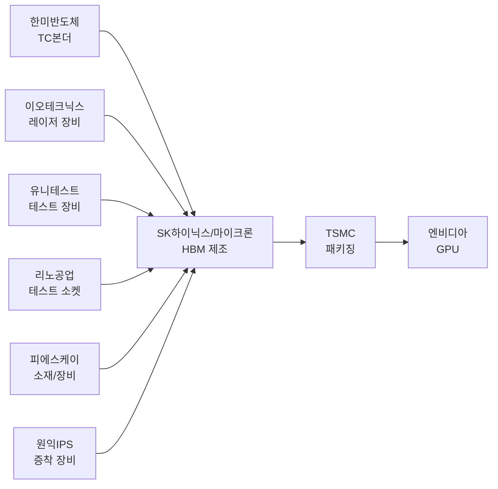
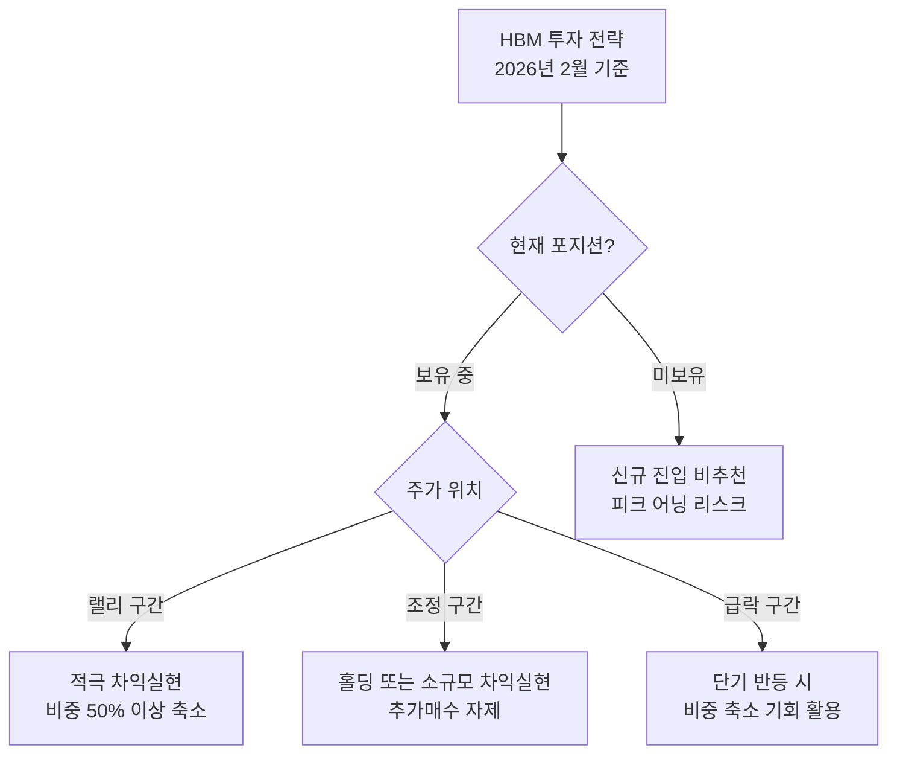

> **관련 글**: [2026년 투자 섹터 전망 (전체)](/knowledge/invest/2026/01/20/investment-sectors-outlook-2026.html) | [반도체 섹터 전망](/knowledge/invest/2026/01/21/semiconductor-sector-outlook-2026.html)

## 핵심 요약: 2026년은 피크 어닝 연도

2026년 HBM 시장의 가장 중요한 키워드는 **"피크 어닝(Peak Earnings)"**입니다. HBM 수요는 여전히 강하고 슈퍼사이클이 지속되고 있지만, **성장률이 급격히 둔화**되는 변곡점에 진입했습니다.

| 구분 | 2026년 | 2027년 |
|------|--------|--------|
| SK하이닉스 영업이익 성장률 | **~300%** | **~4%** |
| 삼성전자 영업이익 성장률 | **~400%** | **~12%** |

2026년에 역사적 수준의 이익을 기록하지만, 2027년부터는 성장이 거의 멈추는 구조입니다. **주가는 실적이 아닌 성장률에 반응**한다는 점에서, 2026년이 메모리 주식의 실질적 고점 구간일 수 있습니다.

**투자 핵심 전략: 랠리 시 차익실현, 추격매수 금지**

---

## HBM 시장 현황 (2026년 2월 기준)

### 시장 규모 및 성장 전망

| 연도 | HBM 시장 규모 | 성장률 |
|------|-------------|--------|
| 2025년 | 380억 달러 | - |
| 2026년 | 546~580억 달러 | ~58% |
| 2028년 | 1,000억 달러 (약 147조원) | 연평균 40% |

시장 규모 자체는 계속 성장하지만, **성장률이 2027년부터 급격히 둔화**됩니다. BofA는 2026년 HBM 시장을 546억 달러로 추산했고, 마이크론은 2028년 1,000억 달러를 전망합니다.

### HBM 세대별 로드맵

- **HBM3E**: 2026년 주력 제품 (전체 HBM 생산의 약 66%). 엔비디아 Blackwell Ultra 시리즈 탑재
- **HBM4**: 2026년 하반기 양산 시작. NVIDIA Rubin GPU에 탑재 예정으로 **다음 HBM 사이클의 핵심 동력**
- **HBM4E**: 차세대 개발 진행 중

NVIDIA Rubin GPU가 HBM4 수요를 견인할 핵심 제품으로, HBM4 양산 성공 여부가 2027년 이후 메모리 업체 실적의 분수령이 됩니다.

### AMD 실적 악화 - 수요 리스크 신호

AMD가 Q1 가이던스에서 시장 기대를 크게 하회하며 **주가가 17% 급락**했습니다. AMD는 NVIDIA 다음으로 큰 AI GPU 고객이므로, AMD의 부진은 HBM 수요 전망에 부정적 시그널입니다.

다만, HBM 수요의 대부분은 NVIDIA가 차지하고 있어 전체 시장에 미치는 영향은 제한적이나, **HBM 수요가 NVIDIA 일극 체제에 지나치게 의존**하고 있다는 리스크를 재확인시켜 주었습니다.

---

## 관련 종목 상세 분석

### 1. SK하이닉스 (000660.KRX) - HBM 1위, 피크 어닝 진입

**핵심 수치**

| 항목 | 내용 |
|------|------|
| HBM 시장 점유율 | 62% (글로벌 1위) |
| 2026년 영업이익 전망 | **112조원** (하나증권) |
| 2026년 성장률 | ~300% |
| 2027년 성장률 | **~4%** (성장 정체) |
| 청주 패키징 투자 | 19조원 |

**투자 포인트**
- HBM3E/HBM4 모두 안정적으로 공급 가능한 **유일한 기업**
- 엔비디아 물량의 60% 이상 담당
- 청주 19조원 규모 패키징 공장 투자 → 생산능력 확대
- HBM4 양산 시 점유율 70%까지 확대 전망 (UBS)
- HBM, DRAM, NAND 생산 역량 "완판 상태"

**리스크 및 투자 전략**
- **2026년이 피크 어닝 연도**: 2027년 성장률 ~4%로 급감
- **랠리 시 차익실현이 핵심 전략**: 추격매수 절대 금지
- 주가는 실적 자체가 아닌 **실적 성장률의 방향**에 반응
- 조정 시에도 분할매수보다는 **비중 축소 방향** 권장

---

### 2. 삼성전자 (005930.KRX) - HBM3 시장 점유율 추격

**핵심 수치**

| 항목 | 내용 |
|------|------|
| 현재 HBM 점유율 | 17% (3위) |
| 2026년 영업이익 전망 | 100~155조원 |
| HBM4 양산 시점 | 2026년 상반기 |
| HBM4 성능 | 11.7Gbps (업계 최고 수준) |

**투자 포인트**
- HBM3E로 빅테크 공급망 진입 성공, **HBM3 시장점유율 확대 중**
- HBM4에서는 자사 파운드리 4나노 기반 베이스 다이로 기술 격차 축소
- 삼성+SK하이닉스 합산 영업이익 **200조원** 돌파 전망

**리스크**
- HBM 점유율 회복 속도 불확실 (SK하이닉스 대비 여전히 큰 격차)
- SK하이닉스와 마찬가지로 **피크 어닝 리스크** 적용
- 2027년 영업이익 성장률 ~12%로 급락

---

### 3. 마이크론 (MU.NASDAQ) - 후발주자의 공격적 확장

**핵심 수치**

| 항목 | 내용 |
|------|------|
| 현재 HBM 점유율 | 21% |
| 목표 점유율 | 40% (10년 내) |
| 2026년 생산 물량 | 전량 계약 완료 (완판) |

**투자 포인트**
- HBM4 12단 샘플 출하 (삼성전자보다 선제적)
- 미국 내 300억 달러 HBM 생산기지 투자
- **TSMC 전 회장이 100억원 상당 주식 매수** → 업계 인사이더 신뢰 시그널
- 미국 반도체 자국 생산 정책 수혜

**리스크**
- SK하이닉스와의 기술 격차 존재
- 고객사 다변화 불확실성

---

## HBM 밸류체인 기업

| 종목 | 티커 | 핵심 사업 | 투자 포인트 |
|------|------|---------|------------|
| **한미반도체** | 042700.KRX | TC 본더 | HBM용 TC 본더 시장 점유율 71.2% |
| **이오테크닉스** | 039030.KRX | 레이저 장비 | HBM TSV 공정용 레이저 장비 |
| **유니테스트** | 086390.KRX | 메모리 테스트 | HBM 테스트 장비 수요 증가 |
| **리노공업** | 058470.KRX | 테스트 소켓 | 반도체 ETF 상위 종목 |
| **피에스케이** | 319660.KRX | 식각/세정 장비 | HBM 공정용 장비 |
| **원익IPS** | 240810.KRX | 증착 장비 | 반도체 전공정 장비 |

밸류체인 기업들도 HBM 제조사와 마찬가지로 **피크 어닝 리스크**가 적용됩니다. 다만 장비/소재주는 수주 사이클이 1~2분기 선행하므로, HBM 제조사보다 먼저 피크를 칠 수 있습니다.

---

## 투자 전략: 피크 어닝 시대의 대응

### 핵심 원칙

1. **랠리 시 차익실현**: 2026년이 피크 어닝 연도라는 인식 하에, 주가 랠리 시 적극 차익실현
2. **추격매수 절대 금지**: 급등 구간 진입은 손익비가 극히 불리
3. **포지션 축소 방향**: 신규 진입보다는 기존 보유 비중 줄이기
4. **경기순환주 로테이션 준비**: 메모리 비중 축소 후 다음 사이클 섹터로 이동

### 시나리오별 전략

### NVIDIA Rubin 모니터링

NVIDIA의 차세대 Rubin GPU 출시 일정과 HBM4 채택 규모가 2027년 이후 HBM 시장의 방향성을 결정합니다. Rubin의 HBM4 수요가 기대 이상이면 피크 어닝 우려가 완화될 수 있으나, 현재로서는 **보수적 관점 유지**가 바람직합니다.

---

## 리스크 요인

### 1. 피크 어닝 후 성장 정체
2027년 SK하이닉스 성장률 ~4%, 삼성전자 ~12%로 급감. 주가는 실적 발표 전에 미리 반영하므로, **2026년 하반기부터 주가 조정** 가능성.

### 2. NVIDIA 일극 의존 리스크
AMD Q1 가이던스 실망 (-17% 주가 하락)으로 확인된 것처럼, HBM 수요는 NVIDIA에 과도하게 집중. NVIDIA 실적 부진 시 HBM 전체 시장에 충격.

### 3. 경쟁 심화
- 삼성전자의 HBM4 기술 추격
- 마이크론의 공격적 점유율 확대 (21% → 40% 목표)
- 2026년 이후 HBM 가격 조정 가능성

### 4. 중국 추격
중국 CXMT가 HBM3를 2026~2027년 양산 목표로 추격 중. 미-중 반도체 갈등으로 첨단 장비 조달이 제한되어 당분간 기술 격차 유지 전망이나, 중저가 시장 경쟁 심화 우려.

### 5. 공급 과잉 전환 (2027년 이후)
메모리 3사의 대규모 증설이 2027년 이후 공급 과잉으로 전환될 수 있으며, 이는 가격 하락과 수익성 악화로 이어질 수 있음.

---

## 결론

2026년 HBM 시장은 슈퍼사이클이 지속되며 사상 최대 실적을 기록할 전망이지만, **이것이 바로 피크**라는 점이 핵심입니다.

**투자 결론:**
- SK하이닉스 112조원, 삼성+SK하이닉스 합산 200조원의 역사적 영업이익이 예상되나, **2027년 성장률이 한자릿수로 급감**
- **랠리 시 차익실현**이 가장 중요한 전략. 추격매수는 금지
- NVIDIA Rubin GPU와 HBM4가 다음 사이클의 열쇠이나, 현 시점에서는 보수적 관점 유지
- 메모리 비중 축소 후 **경기순환주 등 다음 섹터로 로테이션** 준비 권장

---

## 참고 자료

- [SK하이닉스 뉴스룸 - 2026년 시장 전망](https://news.skhynix.co.kr/2026-market-outlook/)
- [하나증권 - SK하이닉스 목표주가 112만원, 영업이익 112조원](https://www.g-enews.com/article/Securities/2026/01/20260114120800466df2f5bc1bc_1)
- [글로벌이코노믹 - 2026년 삼성/SK하이닉스 70조 투자 전쟁](https://www.g-enews.com/article/Global-Biz/2026/01/202601011740189328fbbec65dfb_1)
- [디일렉 - 마이크론 HBM 전망](https://www.thelec.kr/news/articleView.html?idxno=45557)

---

*본 글은 투자 참고용이며, 투자 판단과 그에 따른 책임은 투자자 본인에게 있습니다. (2026년 2월 7일 업데이트)*
