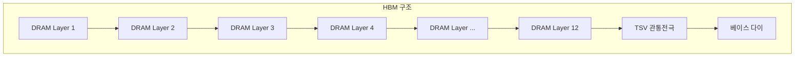
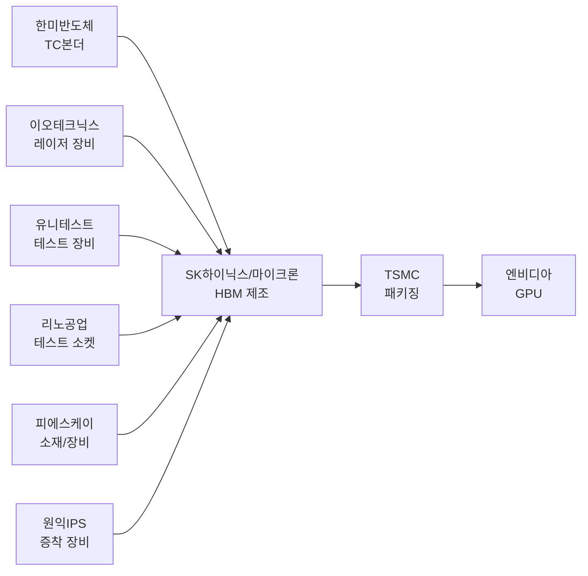
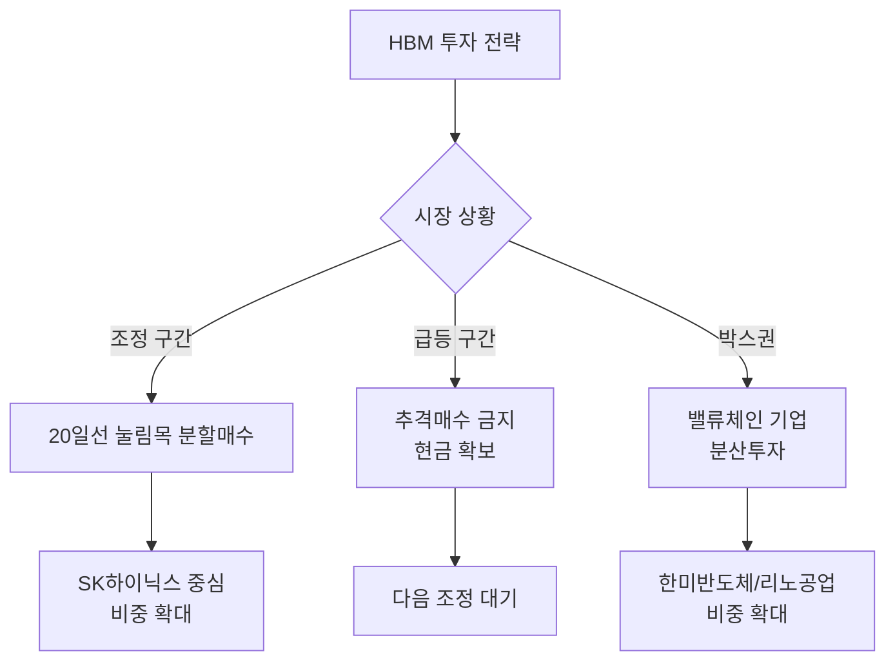

> **관련 글**: [2026년 투자 섹터 전망 (전체)](/knowledge/invest/2026/01/20/investment-sectors-outlook-2026.html) | [반도체 섹터 전망](/knowledge/invest/2026/01/21/semiconductor-sector-outlook-2026.html)

## HBM이란?

HBM(High Bandwidth Memory, 고대역폭 메모리)은 여러 개의 DRAM 칩을 수직으로 쌓아 데이터 처리 속도를 획기적으로 높인 차세대 메모리 반도체입니다. AI GPU, NPU 등 인공지능 연산에 필수적인 핵심 부품으로, AI 시대의 '디지털 원유'로 불리고 있습니다.

---

## 2026년 HBM 시장 현황

### AI 수요 폭발로 메모리 슈퍼사이클 진입

2026년 글로벌 반도체 시장은 AI 인프라 확산을 중심으로 대격변을 맞이하고 있습니다. 세계반도체무역통계기구(WSTS)는 2026년 글로벌 반도체 시장이 **전년비 25% 이상 성장**해 약 **9,750억 달러**에 이를 것으로 전망합니다.

특히 메모리 부문은 전체 성장률을 상회하는 **30%대의 증가세**를 보일 것으로 예상됩니다. 뱅크오브아메리카(BofA)는 2026년을 **"1990년대 호황기와 유사한 슈퍼사이클"**로 정의하며, D램 매출이 전년 대비 51%, 낸드는 45% 급증할 것으로 전망했습니다.

### HBM 시장 규모 전망

| 연도 | HBM 시장 규모 | 성장률 |
|------|-------------|--------|
| 2025년 | 380억 달러 | - |
| 2026년 | 546~580억 달러 | 약 58% 성장 |
| 2028년 | 1,000억 달러 (약 147조원) | 연평균 40% |

BofA는 2026년 HBM 시장 규모를 전년 대비 58% 증가한 **546억 달러**로 추산했으며, 마이크론은 2028년 시장 규모가 **1,000억 달러(약 147조원)**에 달할 것으로 전망했습니다.

### HBM 세대별 전망

2026년 HBM 시장의 주력 제품은 **HBM3E**입니다. LS증권에 따르면 2026년 전체 HBM 생산에서 HBM3E가 차지하는 비중은 약 **66%**로 예상됩니다.

- **HBM3E**: 2026년 주력 제품, 엔비디아 Blackwell Ultra 시리즈에 탑재
- **HBM4**: 2026년 하반기부터 본격 양산, 2027년 세대교체 예상
- **HBM4E**: 차세대 제품으로 개발 진행 중

HBM4는 2026년 하반기 엔비디아의 차세대 GPU 'Rubin(루빈)'을 시작으로 본격 개화할 전망입니다.

---

## 관련 종목 상세 분석

### 1. SK하이닉스 (000660.KRX) - HBM 세계 1위

**HBM 시장의 절대 강자**

SK하이닉스는 2025년 2분기 기준 HBM 출하량 점유율 **62%**로 압도적 1위를 유지하고 있습니다. 업계에서는 HBM3E와 HBM4를 모두 안정적으로 공급할 수 있는 **유일한 기업**으로 평가합니다.

| 항목 | 내용 |
|------|------|
| **현재 주가** | 약 19만원대 (2025년 1월 기준) |
| **HBM 점유율** | 62% (2025년 2분기) |
| **HBM4 점유율 전망** | 약 70% (UBS 추정) |
| **2026년 매출 전망** | 165~181조원 |
| **2026년 영업이익 전망** | 80~112조원 |

**증권사 목표주가**

| 증권사 | 목표주가 | 2026년 영업이익 전망 |
|--------|----------|-------------------|
| 하나증권 | **112만원** | 112조원 |
| NH투자증권 | 88만원 | 105.5조원 |
| 대신증권 | 84만원 | 100.8조원 |
| 키움증권 | 73만원 | 80조원 |

**투자 포인트**
- 2026년 2분기부터 HBM4 양산 시작
- 엔비디아 물량의 60% 이상 담당
- 청주 19조원 규모 패키징 공장 투자
- 2026년 HBM, D램, 낸드 생산 역량 "사실상 완판 상태"

**리스크**
- 고점 부담으로 추격매수 금지
- 조정 시 분할매수 전략 권장

---

### 2. 삼성전자 (005930.KRX) - HBM 반격 준비

**HBM4에서 역전 노린다**

삼성전자는 2025년 2분기 기준 HBM 점유율 **17%**로 3위에 머물러 있지만, HBM4를 역전의 기회로 삼고 있습니다.

| 항목 | 내용 |
|------|------|
| **현재 HBM 점유율** | 17% (2025년 2분기) |
| **2026년 영업이익 전망** | 100~133조원 |
| **HBM4 양산 시점** | 2026년 상반기 |
| **HBM4 성능** | 11.7Gbps (업계 최고) |

**HBM4 기술 경쟁력**
- 자사 파운드리 4나노 기반 베이스 다이 적용
- 6세대 10나노급 D램(1c) 공정 활용
- SK하이닉스 대비 한 세대 앞선 기술 적용
- 내부 평가 11.7Gbps 수준의 업계 최고 성능 확보

**투자 포인트**
- HBM3E로 빅테크 공급망 진입 성공
- HBM4 기술 격차 축소 노력
- 2026년 삼성-SK하이닉스 합산 영업이익 200조원 전망

**리스크**
- 고점 부담, 20일선 이격 확인 필요
- HBM 점유율 회복 속도 불확실

---

### 3. 마이크론 (MU.NASDAQ) - 만년 3위의 반격

**HBM 점유율 확대 공격적 추진**

마이크론은 2024년 HBM 시장 점유율 5.1%에서 2025년 **21%**까지 급성장했으며, 중장기적으로 **40% 점유율**을 목표로 하고 있습니다.

| 항목 | 내용 |
|------|------|
| **현재 HBM 점유율** | 21% (2025년 2분기) |
| **2024년 점유율** | 5.1% |
| **목표 점유율** | 40% (10년 내) |
| **HBM4 성능** | 11Gbps 이상 |

**최근 행보**
- HBM4 12단 샘플 출하 (삼성전자 앞서)
- 미국 내 HBM 생산기지 확대 300억 달러 투자 선언
- 2026년 전체 HBM 공급 물량 가격/물량 계약 완료
- TSMC 전 회장이 100억원 상당 주식 매수 (신뢰 시그널)

**투자 포인트**
- HBM4 수율 안정화 속도 HBM3E보다 빠를 전망
- 공격적인 시장 점유율 확대 전략
- 미국 반도체 자국 생산 정책 수혜

**리스크**
- SK하이닉스와의 기술 격차 존재
- 후발주자로서 고객사 확보 불확실성

---

## HBM 밸류체인 기업

HBM 생산에는 다양한 장비와 소재 기업들이 참여합니다. 밸류체인 구조는 다음과 같습니다:

### 패키징 장비

| 종목 | 티커 | 핵심 사업 | 투자 포인트 |
|------|------|---------|------------|
| **한미반도체** | 042700.KRX | TC 본더 | HBM용 TC 본더 시장 점유율 **71.2%**, SK하이닉스와 공생관계 |
| **이오테크닉스** | 039030.KRX | 레이저 장비 | HBM 관통전극(TSV) 공정용 레이저 장비 공급 |

한미반도체는 2025년 3분기 기준 글로벌 HBM용 TC 본더 시장에서 **71.2%** 점유율을 기록하며 독보적 위치를 유지하고 있습니다. 2026년부터 HBM용 TC 본더 시장은 연평균 약 **13%의 성장률(CAGR)**을 기록할 것으로 전망됩니다.

### 테스트 장비

| 종목 | 티커 | 핵심 사업 | 투자 포인트 |
|------|------|---------|------------|
| **유니테스트** | 086390.KRX | 메모리 테스트 | HBM 테스트 장비 수요 증가 |
| **리노공업** | 058470.KRX | 테스트 소켓 | 반도체 ETF 상위 종목 (6.0% 비중) |

### 소재/장비

| 종목 | 티커 | 핵심 사업 | 투자 포인트 |
|------|------|---------|------------|
| **피에스케이** | 319660.KRX | 식각/세정 장비 | HBM 공정용 장비 공급 |
| **원익IPS** | 240810.KRX | 증착 장비 | 반도체 전공정 장비 |

---

## 투자 전략

### 핵심 원칙

1. **추격매수 금지**: 급등 구간에서의 추격매수는 위험, 조정 시 분할매수 권장
2. **20일선 눌림목 활용**: 20일 이동평균선 근처에서의 지지 확인 후 매수
3. **밸류체인 분산투자**: HBM 제조사뿐 아니라 장비/소재 기업도 함께 주목
4. **장기 보유 관점**: 메모리 슈퍼사이클은 2027년까지 지속 전망

### 시나리오별 전략

### 포트폴리오 구성 예시

| 구분 | 종목 | 비중 | 전략 |
|------|------|------|------|
| 핵심 | SK하이닉스 | 40% | 조정 시 분할매수 |
| 보조 | 삼성전자 | 20% | HBM4 모멘텀 기대 |
| 밸류체인 | 한미반도체 | 15% | TC 본더 독점적 지위 |
| 밸류체인 | 리노공업 | 10% | 테스트 소켓 수요 |
| 해외 | 마이크론(MU) | 15% | 미국 반도체 정책 수혜 |

---

## 리스크 요인

### 1. 밸류에이션 부담

SK하이닉스의 목표주가가 73만원~112만원으로 제시되고 있지만, 현재 주가 수준에서 상승 여력 대비 하락 리스크를 고려해야 합니다.

### 2. 경쟁 심화

- 삼성전자의 HBM4 기술 추격
- 마이크론의 공격적인 점유율 확대
- 2026년 이후 HBM 가격 조정 국면 가능성

### 3. 중국 추격

중국 CXMT는 DDR5 전환을 가속화하며 HBM3를 2026~2027년 양산 목표로 추격 중입니다. 다만 미-중 반도체 갈등으로 첨단 장비 조달이 제한되어 당분간 기술 격차는 유지될 전망입니다.

### 4. AI 수요 둔화 가능성

AI 투자 사이클의 조정이나 빅테크 기업들의 CAPEX 축소 시 HBM 수요에 직접적 영향을 미칠 수 있습니다.

### 5. 공급 과잉 리스크

메모리 3사의 대규모 증설이 2027년 이후 공급 과잉으로 이어질 가능성이 있습니다.

---

## 결론

2026년 HBM 시장은 AI 인프라 확산과 함께 **메모리 슈퍼사이클**의 핵심 동력으로 자리잡았습니다. SK하이닉스가 62%의 점유율로 절대 강자 위치를 유지하고 있으며, 삼성전자와 마이크론의 추격이 본격화되고 있습니다.

**핵심 투자 포인트:**
- SK하이닉스: HBM 1위 유지, 2026년 영업이익 80~112조원 전망
- 삼성전자: HBM4로 반격 준비, 2026년 합산 영업이익 200조원 기대
- 밸류체인: 한미반도체(TC 본더 71.2% 점유율) 등 장비주 동반 성장

**투자 전략:**
- 급등 구간 추격매수 금지
- 20일선 눌림목 분할매수 전략
- 밸류체인 기업 분산투자로 리스크 관리

메모리 슈퍼사이클은 최소 2027년까지 지속될 것으로 전망되므로, 장기 보유 관점에서 조정 시 저가 매수 기회로 활용하는 것이 바람직합니다.

---

## 참고 자료

- [SK하이닉스 뉴스룸 - 2026년 시장 전망](https://news.skhynix.co.kr/2026-market-outlook/)
- [글로벌이코노믹 - 2026년 삼성/SK하이닉스 70조 투자 전쟁](https://www.g-enews.com/article/Global-Biz/2026/01/202601011740189328fbbec65dfb_1)
- [하나증권 - SK하이닉스 목표주가 112만원](https://www.g-enews.com/article/Securities/2026/01/20260114120800466df2f5bc1bc_1)
- [디일렉 - 마이크론 HBM 전망](https://www.thelec.kr/news/articleView.html?idxno=45557)
- [한국일보 - 마이크론 HBM4 12단 샘플](https://www.hankookilbo.com/News/Read/A2025061115250001152)

---

*본 글은 투자 참고용이며, 투자 판단과 그에 따른 책임은 투자자 본인에게 있습니다.*
