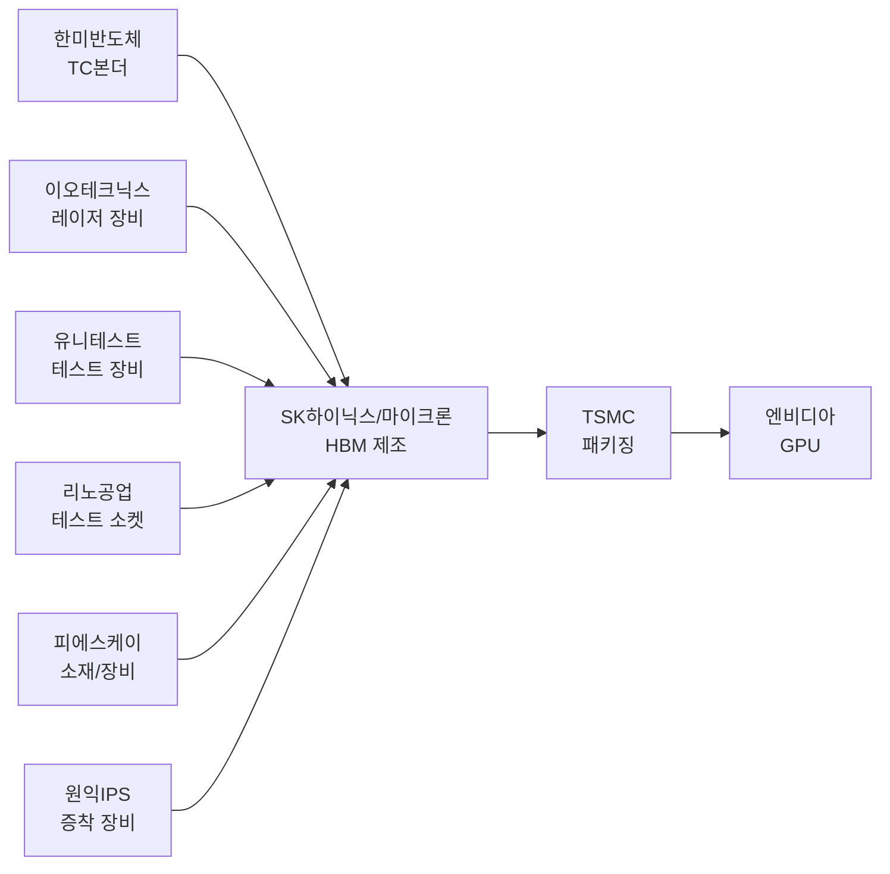
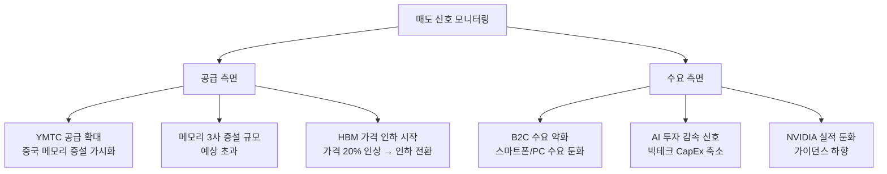
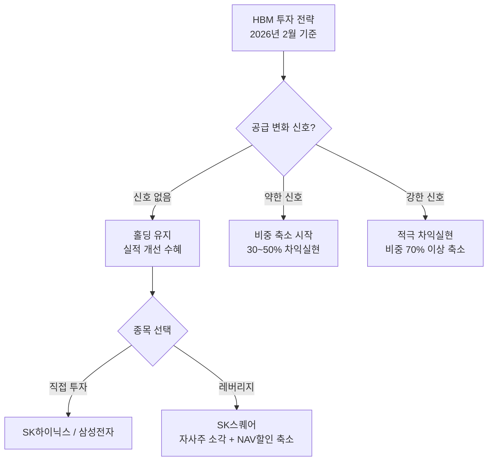

> **관련 글**: [2026년 투자 섹터 전망 (전체)](/knowledge/invest/2026/01/20/investment-sectors-outlook-2026.html) | [반도체 섹터 전망](/knowledge/invest/2026/01/21/semiconductor-sector-outlook-2026.html)

## 2월 9일 주요 업데이트 요약

| 항목 | 내용 |
|------|------|
| 삼성전자 HBM4 양산 | **세계 최초** 양산 출하 확정 (2/17 설 연휴 직후), Nvidia에 공급, 11.7Gbps |
| SK하이닉스 HBM4 | Nvidia HBM4 물량 **약 70%** 공급 전망 (UBS) |
| Nvidia HBM 수급 | **내년까지 sold out** - 전량 선계약 완료 |
| 삼성전자 주가 | **+11.37% 사상최고가 경신**, 시총 1,000조원 돌파 (2/4) |
| 미국 수출 라이센스 | 삼성/SK하이닉스, 중국향 장비 수출 **2026년 연간 라이센스** 부여 |

---

## 핵심 요약: "피크 어닝" 내러티브 재검토

기존에는 2026년이 **피크 어닝** 연도이고, 2027년부터 성장이 정체된다는 것이 시장 컨센서스였습니다. 그러나 최근 JP모건 등 주요 증권사의 2027년 실적 전망이 대폭 상향 조정되면서, 이 내러티브를 재검토할 필요가 생겼습니다. 여기에 **삼성전자 HBM4 세계 최초 양산**과 **Nvidia HBM 물량 내년까지 sold out** 소식이 더해지며, 슈퍼사이클 지속 근거가 한층 강화되었습니다.

### 2027년 실적 전망 상향

| 구분 | 기존 전망 | 상향 전망 (2026.02 기준) |
|------|----------|------------------------|
| 삼성전자 2027 영업이익 (FN가이드) | ~100조원 | **177조원** |
| 삼성전자 2027 영업이익 (JP모건) | - | **250~300조원** |
| SK하이닉스 2027 영업이익 (JP모건) | ~112조원 | **200~250조원** |

JP모건 추정치가 맞다면, 2027년은 "절벽"이 아니라 **또 한 번의 성장 연도**가 됩니다. 피크 어닝의 시점이 뒤로 밀리거나, 슈퍼사이클이 예상보다 길어질 수 있다는 의미입니다.

**핵심 전략 변화: "예측보다 대응" - 공급 변화 신호가 나타날 때까지 홀딩**

---

## HBM 시장 현황 (2026년 2월 기준)

### 시장 규모 및 성장 전망

| 연도 | HBM 시장 규모 | 성장률 |
|------|-------------|--------|
| 2025년 | 380억 달러 | - |
| 2026년 | 546~580억 달러 | ~58% |
| 2028년 | 1,000억 달러 (약 147조원) | 연평균 40% |

시장 규모는 지속 성장 중이며, BofA는 2026년 HBM 시장을 546억 달러, 마이크론은 2028년 1,000억 달러를 전망합니다. **Nvidia는 HBM 수요가 내년까지 전량 sold out 상태**로, 공급 부족이 지속될 전망입니다. Nvidia 젠슨 황 CEO는 "올해는 메모리가 정말 많이 필요할 것이며, 수요가 워낙 많아 전체 공급망이 어려움을 겪을 것"이라고 언급했습니다.

### HBM3E 가격 인상 20%

2026년 주문 기준으로 **삼성전자와 SK하이닉스 모두 HBM3E 가격을 약 20% 인상**했습니다. 이는 HBM 수요가 여전히 강하며, 공급이 타이트하다는 신호입니다. 가격 인상은 곧 마진 개선과 실적 상향으로 이어집니다.

### DRAM 마진 70% vs HBM 마진 60%

흥미로운 마진 역학이 관측됩니다.

| 구분 | 영업이익률 |
|------|----------|
| 범용 DRAM | **~70%** |
| HBM | **~60%** |

HBM이 DRAM보다 마진이 낮은 이유는 **고도의 패키징 공정 비용, 수율 관리 난이도, 고객 맞춤형 검증 비용** 등 때문입니다. 다만 HBM은 ASP(평균판매가격)가 높아 절대 이익 기여는 훨씬 큽니다. 범용 DRAM 마진이 높다는 것은 메모리 업체의 수익 기반이 HBM에만 의존하지 않는다는 긍정적 신호이기도 합니다.

### HBM 세대별 로드맵 (2월 9일 업데이트)

- **HBM3E**: 2026년 주력 제품 (전체 HBM 생산의 약 66%). 엔비디아 Blackwell Ultra 시리즈 탑재
- **HBM4**: **삼성전자가 세계 최초 양산 출하 확정 (2/17 이후)**. 엔비디아 Vera Rubin GPU 탑재 예정. 핀당 11.7Gbps로 JEDEC 기준(8Gbps)을 크게 초과. 12단 적층 시 최대 36GB 용량, 대역폭 3TB/s (이전 세대 대비 2.4배). SK하이닉스는 Nvidia HBM4 물량의 약 70%를 확보
- **HBM4E**: 차세대 개발 진행 중

**핵심 변화**: 기존에는 "2026년 하반기 양산 시작"이었으나, 삼성전자가 **2월 17일 이후 세계 최초 양산 출하**로 일정을 대폭 앞당김. 엔비디아가 삼성전자에 품질 테스트 완료 전 출하 앞당기기를 요청할 정도로 수급이 타이트한 상황.

---

## 관련 종목 상세 분석

### 1. SK하이닉스 (000660.KRX) - HBM 1위, HBM4 물량 70% 확보

**현재 주가: 839,000원** (2026.02.07 기준)

**핵심 수치**

| 항목 | 내용 |
|------|------|
| HBM 시장 점유율 | 62% (글로벌 1위) |
| **Nvidia HBM4 물량 점유율** | **약 70%** (UBS 전망) |
| 2026년 영업이익 전망 | **112조원** (하나증권) |
| 2027년 영업이익 전망 | **200~250조원** (JP모건) |
| 청주 패키징 투자 | 19조원 |

**투자 포인트**
- HBM3E/HBM4 모두 안정적으로 공급 가능한 **유일한 기업**
- **엔비디아 HBM4 물량의 약 70%를 확보** (기존 60%에서 상향) - 검증된 양산 능력과 신뢰 기반
- 청주 19조원 규모 패키징 공장 투자로 생산능력 확대
- 2027년 실적이 JP모건 추정 수준이라면, **피크 어닝 우려 대폭 완화**
- HBM 시장이 기술 경쟁을 넘어 '신뢰와 공급 안정성' 중심으로 재편되면서 SK하이닉스의 지위 더욱 공고

**투자 전략**
- 공급 변화 신호(YMTC 증설, B2C 수요 약화 등)가 나타나기 전까지 **홀딩**
- SK스퀘어를 통한 간접 투자도 고려 (아래 참조)

---

### 2. 삼성전자 (005930.KRX) - HBM4 세계 최초 양산 + 사상최고가 경신

**현재 주가: +11.37% 사상최고가 경신** (2026.02 기준, 시총 1,000조원 돌파)

**핵심 수치**

| 항목 | 내용 |
|------|------|
| 현재 HBM 점유율 | 17% → 확대 중 |
| **HBM4 양산** | **세계 최초, 2/17 이후 출하 개시** |
| **HBM4 성능** | **11.7Gbps** (JEDEC 8Gbps 초과, 업계 최고) |
| 주가 | **+11.37% 사상최고가 경신** |
| 시가총액 | **1,000조원 돌파** (2/4, 국내 기업 최초) |
| 2027년 영업이익 (FN가이드) | **177조원** |
| 2027년 영업이익 (JP모건) | **250~300조원** |

**투자 포인트 (2월 9일 업데이트)**
- **HBM4 세계 최초 양산 출하 확정 (2/17 이후)**: 엔비디아 Vera Rubin GPU에 공급. 10나노급 6세대 DRAM 공정 + 자사 파운드리 4나노 베이스 다이 적용
- **엔비디아가 출하 앞당기기 요청**: 품질 테스트 완료 전부터 조기 출하를 요구할 정도로 수급 타이트
- **사상최고가 경신 (+11.37%)**: 시총 1,000조원 돌파, 글로벌 시총 15위 (텐센트, 비자 추월)
- HBM3E로 빅테크 공급망 진입 성공, HBM 시장점유율 확대 중
- **2027년 영업이익 전망이 177조~300조원으로 상향** - 피크 어닝이 아닌 성장 지속 가능성
- HBM3E 가격 20% 인상으로 수익성 개선

**리스크**
- Nvidia HBM4 물량의 약 70%가 SK하이닉스에 배정 → 삼성전자는 약 30% 수준
- JP모건 추정치가 지나치게 낙관적일 가능성

---

### 3. SK스퀘어 (402340.KRX) - SK하이닉스 레버리지 플레이

**투자 포인트**

| 항목 | 내용 |
|------|------|
| 핵심 자산 | SK하이닉스 지분 20.07% |
| 자사주 정책 | 자사주 매입 후 소각 진행 중 |
| NAV 할인율 | 약 40~50% |

SK스퀘어는 SK하이닉스의 최대주주로서, SK하이닉스 주가 상승의 **레버리지 효과**를 누릴 수 있는 종목입니다.

**왜 SK하이닉스 직접 투자보다 유리할 수 있는가:**
- **자사주 매입 + 소각**: 주당 가치가 지속적으로 상승하는 구조. 유통 주식 수가 줄어들면서 주당 NAV(순자산가치)가 높아짐
- **NAV 할인 축소 가능성**: 현재 40~50% 할인된 상태에서, SK하이닉스 실적 호조 + 주주환원 강화 시 할인율 축소로 **이중 상승 효과**
- SK하이닉스 주가가 오르면 SK스퀘어는 **더 빠르게 절상**될 수 있음

**리스크**
- 지주사 할인이 지속될 가능성
- SK하이닉스 외 다른 자회사 실적 리스크

---

### 4. 마이크론 (MU.NASDAQ) - 후발주자의 공격적 확장

**핵심 수치**

| 항목 | 내용 |
|------|------|
| 현재 HBM 점유율 | 21% |
| 목표 점유율 | 40% (10년 내) |
| 2026년 생산 물량 | 전량 계약 완료 (완판) |

**투자 포인트**
- HBM4 12단 샘플 출하 (삼성전자보다 선제적)
- 미국 내 300억 달러 HBM 생산기지 투자
- **TSMC 전 회장이 100억원 상당 주식 매수** - 업계 인사이더 신뢰 시그널
- 미국 반도체 자국 생산 정책 수혜
- CEO "HBM4 포함, 내년 전체 HBM 공급 물량 가격·물량 계약 모두 완료" 확인

**리스크**
- SK하이닉스와의 기술 격차 존재
- 고객사 다변화 불확실성

---

## HBM 밸류체인 기업

| 종목 | 티커 | 핵심 사업 | 투자 포인트 |
|------|------|---------|------------|
| **한미반도체** | 042700.KRX | TC 본더 | HBM용 TC 본더 시장 점유율 71.2% |
| **이오테크닉스** | 039030.KRX | 레이저 장비 | HBM TSV 공정용 레이저 장비 |
| **유니테스트** | 086390.KRX | 메모리 테스트 | HBM 테스트 장비 수요 증가 |
| **리노공업** | 058470.KRX | 테스트 소켓 | 반도체 ETF 상위 종목 |
| **피에스케이** | 319660.KRX | 식각/세정 장비 | HBM 공정용 장비 |
| **원익IPS** | 240810.KRX | 증착 장비 | 반도체 전공정 장비 |

밸류체인 기업들도 HBM 수요 사이클에 연동됩니다. 다만 장비/소재주는 수주 사이클이 1~2분기 선행하므로, HBM 제조사보다 먼저 피크를 칠 수 있습니다.

---

## 미국 수출 규제 업데이트 (2월 9일)

### 중국향 장비 수출 2026년 라이센스 부여

미국 정부는 삼성전자와 SK하이닉스에 **2026년 중국 시설 반도체 제조 장비 반입 연간 라이센스**를 부여했습니다.

| 항목 | 내용 |
|------|------|
| 기존 제도 | VEU(검증된 최종사용자) 지위로 광범위한 면제 |
| 변경 내용 | **2026.1.1부터 연간 검토 기반 라이센스**로 전환 |
| 시설 증설 | **불허** (기존 시설 유지보수만 허용) |
| 영향 | 중국 공장 운영 지속 가능, 그러나 증설은 불가 |

**투자 시사점:**
- 삼성전자·SK하이닉스의 중국 공장 운영은 당분간 지속 가능하나, 확장은 제한
- 장기적으로 국내(평택, 용인, 청주) 투자 가속화 요인
- 중국 CXMT 등의 HBM 추격은 장비 조달 제한으로 더욱 어려워짐

---

## 투자 전략: 예측보다 대응

### 핵심 원칙: "예측보다 대응"

기존 전략은 "2026년이 피크이니 미리 팔자"였습니다. 그러나 2027년 실적 전망이 대폭 상향되면서, **미리 파는 것이 오히려 기회비용**이 될 수 있습니다. Nvidia HBM 물량이 내년까지 sold out이라는 점도 이를 뒷받침합니다.

새로운 전략의 핵심은 **"예측보다 대응"**입니다:
- 피크 시점을 예측해서 미리 행동하기보다, **구체적인 공급 변화 신호가 나타날 때 대응**
- 신호가 나타나기 전까지는 홀딩

### 매도 시점 판단을 위한 공급 변화 신호 (Sell Indicator)

다음 신호들이 나타나면, 사이클 전환 가능성을 경계해야 합니다:

| 신호 | 심각도 | 설명 |
|------|--------|------|
| **YMTC 공급 확대** | 높음 | 중국 메모리 증설이 본격화되면 범용 DRAM/NAND 가격 하락 압력. HBM 직접 경쟁은 아직이나, 메모리 전체 수급에 영향 |
| **B2C 수요 약화** | 중간 | 스마트폰/PC 교체 수요 둔화 시, 범용 DRAM 가격 하락 → 메모리 업체 전체 수익 악화 |
| **HBM 가격 인하 전환** | 높음 | 현재 20% 인상 추세에서 인하로 전환되면, 공급 과잉 시작 신호 |
| **빅테크 AI CapEx 축소** | 매우 높음 | HBM 수요의 근간이 흔들리는 것으로, 가장 강력한 매도 신호 |

### 시나리오별 전략

### NVIDIA GTC 2026 모니터링 (3월 예정)

NVIDIA는 **2026년 3월 GTC 컨퍼런스**에서 삼성전자 HBM4를 탑재한 **Vera Rubin** GPU를 처음 공개할 것으로 예상됩니다. 이 이벤트에서 HBM4 채택 규모와 차세대 로드맵이 공개되면, 2027년 이후 HBM 시장의 방향성이 결정됩니다.

- Vera Rubin의 HBM4 수요가 기대 이상이면 **슈퍼사이클 연장**
- 기대 이하이면 **사이클 전환 신호**

---

## 리스크 요인

### 1. JP모건 전망이 과대 추정일 가능성
JP모건의 삼성전자 250~300조원, SK하이닉스 200~250조원 전망은 매우 공격적입니다. FN가이드 컨센서스(삼성 177조원)와의 괴리가 크며, 실제 실적이 JP모건 추정에 못 미칠 경우 실망 매도가 나올 수 있습니다.

### 2. NVIDIA 일극 의존 리스크
AMD Q1 가이던스 실망(-17% 주가 하락)으로 확인된 것처럼, HBM 수요는 NVIDIA에 과도하게 집중. NVIDIA 실적 부진 시 HBM 전체 시장에 충격.

### 3. 공급 과잉 전환 (2027년 이후)
메모리 3사의 대규모 증설이 2027년 이후 공급 과잉으로 전환될 수 있으며, YMTC 등 중국 업체의 범용 메모리 증설도 리스크 요인.

### 4. 중국 추격 (규제로 둔화)
중국 CXMT가 HBM3를 2026~2027년 양산 목표로 추격 중. 미국의 장비 수출 규제가 VEU에서 연간 라이센스로 강화되면서 중국 업체의 첨단 장비 조달은 더욱 제한. 당분간 기술 격차 유지 전망이나, 중저가 시장 경쟁 심화 우려.

### 5. DRAM 마진 vs HBM 마진 역전 리스크
현재 범용 DRAM 마진(70%)이 HBM 마진(60%)보다 높은 구조가 지속될 경우, 메모리 업체들이 범용 DRAM에 더 많은 웨이퍼를 배분할 유인이 생겨, HBM 증설 속도가 둔화될 수 있음.

### 6. 삼성전자 급등 후 조정 리스크
삼성전자가 +11.37% 사상최고가를 경신하며 시총 1,000조원을 돌파한 만큼, 단기 차익 실현 매물이 나올 수 있음. HBM4 양산 출하 이후 "Buy the rumor, sell the news" 패턴 가능성도 경계 필요.

---

## 결론

2026년 HBM 시장은 슈퍼사이클이 지속되며 사상 최대 실적을 기록할 전망입니다. 2월 들어 **삼성전자 HBM4 세계 최초 양산 출하 확정**과 **Nvidia HBM 물량 내년까지 sold out** 소식으로, 수급 타이트 상황이 재확인되었습니다.

**투자 결론:**
- **"예측보다 대응"**: 피크 시점을 예단하지 말고, 공급 변화 신호(YMTC 증설, B2C 수요 약화, HBM 가격 인하 전환, 빅테크 CapEx 축소)가 나타날 때까지 홀딩
- **삼성전자**: HBM4 세계 최초 양산 + 사상최고가 경신(+11.37%) + 시총 1,000조원. 2/17 이후 엔비디아 출하 시작으로 HBM 점유율 확대 가속. 다만 Nvidia HBM4 물량의 약 30%로 SK하이닉스 대비 열위
- **SK하이닉스**: Nvidia HBM4 물량 약 70%로 압도적 1위 유지. 2027년 영업이익 200~250조원(JP모건) 전망
- 삼성전자 2027년 영업이익 전망: FN가이드 177조원, JP모건 250~300조원. **만약 JP모건 추정이 맞다면, 2027년도 성장 연도**
- HBM3E 가격 20% 인상은 수급이 여전히 타이트하다는 증거
- **SK스퀘어는 SK하이닉스의 레버리지 플레이**로 검토 가치 있음 (자사주 매입 소각 + NAV 할인 축소 기대)
- **3월 NVIDIA GTC**가 다음 주요 이벤트: Vera Rubin + HBM4 로드맵 공개 예상
- **미국 수출 규제**: 2026년 라이센스 확보로 중국 공장 운영 지속 가능, 중국 추격은 더 어려워짐

**현재 주가 (2026.02.07 기준)**
- 삼성전자: 사상최고가 경신 (+11.37%), 시총 1,000조원
- SK하이닉스: 839,000원

---

## 참고 자료

- [서울신문 - 삼성, 설 직후 HBM4 세계 첫 양산](https://www.seoul.co.kr/news/economy/industry/2026/02/09/20260209031001)
- [EBN - 삼성전자, 설 연휴 직후 HBM4 세계 첫 양산](https://www.ebn.co.kr/news/articleView.html?idxno=1698903)
- [EBN - SK하이닉스, 엔비디아 HBM4 물량 '70%' 확보](https://www.ebn.co.kr/news/articleView.html?idxno=1697183)
- [스마트에프엔 - SK하이닉스, HBM4 주도권 굳힌다](https://www.smartfn.co.kr/news/articleView.html?idxno=134038)
- [글로벌이코노믹 - 삼성전자 시총 1000조, SK하이닉스 이익률 58%](https://www.g-enews.com/article/Global-Biz/2026/02/202602071754516988fbbec65dfb_1)
- [서울신문 - 삼성전자 시가총액 1000조 첫 돌파](https://www.seoul.co.kr/news/economy/2026/02/04/20260204500162)
- [AI타임스 - 미국, 삼성·SK하이닉스 반도체 장비 중국 수출 승인](https://www.aitimes.com/news/articleView.html?idxno=205190)
- [글로벌이코노믹 - 삼성전자 HBM4, 엔비디아 베라 루빈 공급 확정](https://www.g-enews.com/article/Global-Biz/2026/01/202601260559058882fbbec65dfb_1)
- [SK하이닉스 뉴스룸 - 2026년 시장 전망](https://news.skhynix.co.kr/2026-market-outlook/)
- [하나증권 - SK하이닉스 목표주가 112만원, 영업이익 112조원](https://www.g-enews.com/article/Securities/2026/01/20260114120800466df2f5bc_1)
- [디일렉 - 마이크론 HBM 전망](https://www.thelec.kr/news/articleView.html?idxno=45557)

---

*본 글은 투자 참고용이며, 투자 판단과 그에 따른 책임은 투자자 본인에게 있습니다. (2026년 2월 9일 업데이트)*
