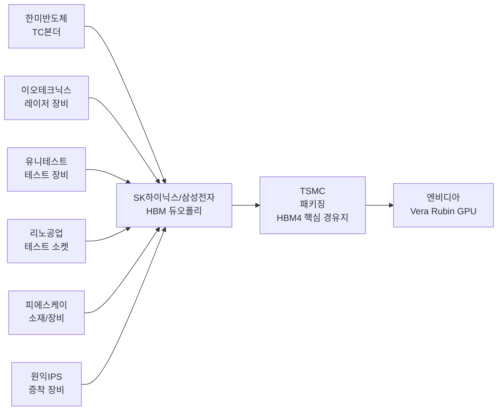
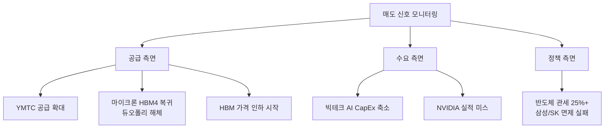

> **관련 글**: [2026년 투자 섹터 전망 (전체)](/knowledge/invest/2026/01/20/investment-sectors-outlook-2026.html) | [반도체 섹터 전망](/knowledge/invest/2026/01/21/semiconductor-sector-outlook-2026.html)

## 2월 16일 주요 업데이트 요약

| 항목 | 내용 |
|------|------|
| 마이크론 HBM4 탈락 | **확정** - 내부 베이스 다이 성능 미달, SK하이닉스-삼성 **듀오폴리** 형성 |
| SK하이닉스 밸류에이션 | **PER 4.7배** 극단적 저평가 (시총 640조, 매출 200조, 영업이익률 67%) |
| SK하이닉스 HBF | **2/12 SEMICON Korea** - HBM+NAND 통합, 전력당 성능 **2.69배** 향상 |
| UBS 전망 | SK하이닉스 HBM4 시장 **약 70% 점유율** |
| BofA 전망 | SK하이닉스 글로벌 메모리 **"Top Pick"** |
| 삼성 HBM4 출하 | **2/12 세계 최초 양산 출하 개시** |
| 모건스탠리 전망 | 삼성전자 2027 영업이익 **317조원**, SK하이닉스 **225조원** |
| 반도체 관세 | **25%+ 전면 확대** (4월 발효 예상), TSMC $1,650억 투자로 면제 |
| GTC 2026 | **3/16~19**, Vera Rubin GPU(HBM4 탑재) 공개 |

---

## 핵심 요약: 듀오폴리 시대 개막

마이크론의 HBM4 탈락이 확정되면서, HBM4 시장은 **SK하이닉스-삼성전자의 듀오폴리(복점) 체제**로 재편되었습니다. 마이크론은 내부 베이스 다이의 발열 제어와 데이터 전송 속도가 NVIDIA 기준치를 미달해 탈락했으며, 2026년 2분기에야 양산을 시작할 전망입니다.

이 구도 변화의 최대 수혜자는 **SK하이닉스**입니다. UBS는 HBM4 시장에서 SK하이닉스가 약 70%를 점유할 것으로 전망하고, BofA는 글로벌 메모리 "Top Pick"으로 선정했습니다. PER 4.7배라는 극단적 저평가 상태에서, 모건스탠리는 2027년 영업이익을 225조원으로 추정합니다.

### 2027년 실적 전망 (모건스탠리 기준)

| 구분 | 2026년 전망 | 2027년 전망 (모건스탠리) |
|------|----------|------------------------|
| 삼성전자 영업이익 | 245조원 | **317조원** |
| SK하이닉스 영업이익 | ~112조원 | **225조원** |

모건스탠리 추정치가 맞다면, 2027년은 "절벽"이 아니라 **또 한 번의 대폭 성장 연도**가 됩니다. 슈퍼사이클이 예상보다 훨씬 길어질 수 있다는 의미입니다.

**핵심 전략: 공급 변화 신호가 나타날 때까지 홀딩. 반도체 관세 리스크 주시.**

---

## HBM4: 듀오폴리 체제 확립

### 마이크론 탈락과 시장 재편

마이크론의 HBM4 탈락은 HBM 시장의 판도를 근본적으로 바꿨습니다.

| 항목 | 내용 |
|------|------|
| 탈락 원인 | 내부 베이스 다이 발열 제어/전송 속도 NVIDIA 기준 미달 |
| 핵심 문제 | TSMC 파운드리 공정 기반 초고성능 요구에 자체 설계 부적합 |
| 마이크론 양산 시점 | **2026년 Q2** (SK하이닉스/삼성 대비 최소 3개월 지연) |
| 시장 영향 | HBM4 시장 **SK하이닉스-삼성 듀오폴리** 형성 |

### HBM4 시장 점유율: 듀오폴리 구도

| 기업 | HBM4 점유율 | 비고 |
|------|------------|------|
| **SK하이닉스** | **~70%** (UBS 전망) | 최대 공급사, TSMC 원팀 체제 |
| **삼성전자** | **20%대 중반** | 세계 최초 양산 출하(2/12) |
| **마이크론** | **탈락** | Q2 양산 시작 예정, HBM3E에 집중 |

기존 3사 체제에서 **실질적 듀오폴리**로 전환. SK하이닉스가 70%를 차지하면서, 가격 결정력과 수익성이 한층 강화됩니다.

### 삼성전자 HBM4 양산 출하 (2/12 시작)

| 항목 | 내용 |
|------|------|
| 양산 출하 시작일 | **2026년 2월 12일** |
| 표준 속도 | **11.7Gbps** |
| 최대 속도 | **13Gbps** (JEDEC 8Gbps 기준 대비 **46% 초과**) |
| 적용 공정 | 10나노급 6세대 DRAM + 자사 파운드리 4나노 베이스 다이 |
| 패키징 경로 | 삼성전자 제조 -> **TSMC 패키징** -> NVIDIA |
| 탑재 GPU | **NVIDIA Vera Rubin** (Q3 2026 출시) |

### HBM 세대별 로드맵

- **HBM3E**: 2026년 주력 제품 (전체 HBM 생산의 약 66%). NVIDIA Blackwell Ultra 시리즈 탑재
- **HBM4**: 삼성 2/12 세계 최초 양산 출하. 12단 적층 시 최대 36GB 용량, 대역폭 3TB/s. NVIDIA Vera Rubin GPU 탑재
- **HBM4E**: 차세대 개발 진행 중

---

## SK하이닉스 HBF: 게임 체인저 아키텍처

### HBF (High Bandwidth Flash) - SEMICON Korea 2026 공개 (2/12)

SK하이닉스가 SEMICON Korea 2026에서 **HBF(High Bandwidth Flash)** 아키텍처를 공개했습니다. HBM과 NAND를 통합한 혁신적 구조입니다.

| 항목 | 내용 |
|------|------|
| 공개일 | **2026년 2월 12일** (SEMICON Korea 2026) |
| 핵심 개념 | HBM + NAND Flash 통합 아키텍처 |
| 전력당 성능 | HBM 대비 **2.69배 향상** |
| 속도 | HBM의 약 **80~90%** |
| 용량 | HBM 대비 **8~16배** |
| 전력 소모 | HBM 대비 **약 40% 절감** |
| 양산 시점 | 샘플 H2 2026, 양산 **2027년** |
| 협력사 | **SanDisk**와 공동 표준화 추진 |

**투자 시사점**: HBF는 AI 추론(Inference) 시장을 타겟으로 합니다. 학습(Training)은 HBM, 추론은 HBF로 분화되면, SK하이닉스는 양쪽 시장을 모두 지배하는 포지션을 확보하게 됩니다. NAND 사업부의 가치 재평가 촉매가 될 수 있습니다.

---

## HBM 시장 현황 (2026년 2월 기준)

### 시장 규모 및 성장 전망

| 연도 | HBM 시장 규모 | 성장률 |
|------|-------------|--------|
| 2025년 | 380억 달러 | - |
| 2026년 | 480~580억 달러 | ~50% |
| 2028년 | 1,000억 달러 (약 147조원) | 연평균 40% |

NVIDIA는 HBM 수요가 내년까지 전량 sold out 상태로, 공급 부족이 지속될 전망입니다.

### HBM3E 가격 인상 20%

2026년 주문 기준으로 **삼성전자와 SK하이닉스 모두 HBM3E 가격을 약 20% 인상**했습니다. 마이크론 탈락으로 듀오폴리가 형성되면서 가격 결정력이 더욱 강화된 상태입니다.

---

## 반도체 관세: 새로운 핵심 리스크

### 미국 반도체 관세 25%+ 확대 (4월 발효 예상)

| 항목 | 내용 |
|------|------|
| 관세율 | **25% 이상** (반도체 전면 확대) |
| 발효 시점 | **2026년 4월** 예상 |
| TSMC | $1,650억 투자 -> **면제 확보** (미국 내 생산능력 2.5배 무관세 수입 허용) |
| 삼성전자 | 텍사스 $389억 투자 중, **면제 미확정** |
| SK하이닉스 | 인디애나 $41억 투자 중, **면제 미확정** |
| TSMC와의 격차 | 삼성+SK 합산 대비 TSMC가 **$1,220억(약 178조원) 더 많은 투자** |

**투자 시사점**: 관세 면제 여부가 삼성전자/SK하이닉스의 수익성에 직접적 영향. TSMC는 이미 면제를 확보했으나, 한국 기업들은 추가 투자 압박을 받고 있습니다. 4월 발효 전 협상 결과가 핵심 변수입니다.

---

## NVIDIA 주요 이벤트

### GTC 2026 (3/16~19)

| 항목 | 내용 |
|------|------|
| 일정 | **2026년 3월 16~19일** (산호세) |
| 키노트 | **3월 16일** 젠슨 황 CEO |
| 핵심 공개 | **Vera Rubin GPU** (HBM4 탑재) + Feynman 아키텍처 |
| GPU 출시 | **Q3 2026** |
| 투자 시사점 | HBM4 채택 규모와 2027 로드맵이 슈퍼사이클 연장 여부 결정 |

### Q4 FY26 실적 발표 (2/25)

| 항목 | 내용 |
|------|------|
| 실적 발표일 | **2026년 2월 25일** |
| 골드만삭스 매출 전망 | **$67.3B** |
| 주요 관전 포인트 | HBM4 채택 규모, 2027 가이던스, Vera Rubin 출하 일정 |

---

## 관련 종목 상세 분석

### 1. SK하이닉스 (000660.KRX) - 듀오폴리 최대 수혜, 극단적 저평가

**핵심 수치**

| 항목 | 내용 |
|------|------|
| **PER** | **4.7배** (시총 640조, 매출 200조, 영업이익률 67%) |
| **HBM4 점유율** | **~70%** (UBS 전망) |
| HBM 시장 점유율 | 62% (글로벌 1위) |
| 2026년 영업이익 전망 | **112조원** (하나증권) |
| 2027년 영업이익 전망 | **225조원** (모건스탠리) |
| BofA 평가 | 글로벌 메모리 **"Top Pick"** |
| HBF 아키텍처 | 2/12 SEMICON Korea 공개, 2027년 양산 |

**투자 포인트**
- **PER 4.7배 극단적 저평가**: 시총 640조 대비 매출 200조, 영업이익률 67%. 글로벌 반도체 평균 PER(15~20배) 대비 1/3~1/4 수준
- **마이크론 탈락으로 듀오폴리 확립**: HBM4 시장 70% 점유 전망(UBS), 가격 결정력 극대화
- **BofA "Top Pick"**: 글로벌 메모리 슈퍼사이클 최대 수혜주로 선정
- **HBF 아키텍처**: AI 추론 시장까지 영역 확장, NAND 사업부 가치 재평가 촉매
- 모건스탠리 2027년 영업이익 225조원 전망 -> 피크 어닝 우려 대폭 완화

**리스크**
- 반도체 관세 25%+ 면제 미확정 (인디애나 $41억 투자, TSMC 대비 규모 열위)
- 극단적 저평가가 지속되는 구조적 이유가 있을 수 있음 (지정학적 할인)

---

### 2. 삼성전자 (005930.KRX) - HBM4 최초 양산, 모건스탠리 317조원

**핵심 수치**

| 항목 | 내용 |
|------|------|
| HBM4 양산 출하 | **2/12 세계 최초 출하 시작** |
| HBM4 점유율 | **20%대 중반** |
| 2025 Q4 DS부문 영업이익 | **16.4조원** (전년 동기 2.9조 대비 5.7배) |
| 2027년 영업이익 (모건스탠리) | **317조원** (전 세계 기업 중 1위 전망) |
| 반도체 관세 리스크 | 텍사스 $389억 투자 중, 면제 미확정 |

**투자 포인트**
- **모건스탠리 2027년 영업이익 317조원**: 전 세계 기업 중 영업이익 1위 가능성 제시 (역대 최고 58조의 5.5배)
- HBM4 세계 최초 양산 출하(2/12), TSMC 패키징 경로 확보
- DS부문 Q4 영업이익 16.4조원으로 회복세 확인
- 범용 DRAM 가격 폭등으로 HBM 외 수익 기반도 견고

**리스크**
- HBM4 점유율 20%대 중반으로 SK하이닉스(70%) 대비 열위
- 반도체 관세 면제 미확정 (TSMC 대비 투자 규모 격차 $1,220억)
- 모건스탠리 317조원은 매우 공격적 추정, 실현 불확실성

---

### 3. SK스퀘어 (402340.KRX) - SK하이닉스 레버리지 플레이

| 항목 | 내용 |
|------|------|
| 핵심 자산 | SK하이닉스 지분 20.07% |
| 자사주 정책 | 자사주 매입 후 소각 진행 중 |
| NAV 할인율 | 약 40~50% |

SK하이닉스가 PER 4.7배로 극단적 저평가인 상황에서, SK스퀘어는 **NAV 할인 40~50% + SK하이닉스 저평가**의 이중 할인 상태. 할인 축소 시 **이중 상승 효과** 가능.

---

### 4. 마이크론 (MU.NASDAQ) - HBM4 탈락, HBM3E 집중

| 항목 | 내용 |
|------|------|
| **HBM4** | **탈락 확정** |
| HBM3E | 2026년 생산 물량 전량 계약 완료 |
| HBM4 양산 | **Q2 2026** (3개월 지연) |
| 미국 투자 | 300억 달러 HBM 생산기지 |

마이크론은 HBM4 탈락으로 단기적 타격이 불가피하나, HBM3E 완판 + 미국 내 생산기지 투자로 중장기적 반등 가능성은 유지. 다만 SK하이닉스/삼성 대비 기술 격차가 확인된 상황.

---

## HBM 밸류체인 기업

| 종목 | 티커 | 핵심 사업 | 투자 포인트 |
|------|------|---------|------------|
| **한미반도체** | 042700.KRX | TC 본더 | HBM용 TC 본더 시장 점유율 71.2% |
| **이오테크닉스** | 039030.KRX | 레이저 장비 | HBM TSV 공정용 레이저 장비 |
| **유니테스트** | 086390.KRX | 메모리 테스트 | HBM 테스트 장비 수요 증가 |
| **리노공업** | 058470.KRX | 테스트 소켓 | 반도체 ETF 상위 종목 |
| **피에스케이** | 319660.KRX | 식각/세정 장비 | HBM 공정용 장비 |
| **원익IPS** | 240810.KRX | 증착 장비 | 반도체 전공정 장비 |

---

## 투자 전략

### 매도 시점 판단을 위한 신호 (Sell Indicator)

| 신호 | 심각도 | 설명 |
|------|--------|------|
| **반도체 관세 면제 실패** | 매우 높음 | 삼성/SK 수익성 직접 타격, 4월 발효 전 결과 확인 필수 |
| **빅테크 AI CapEx 축소** | 매우 높음 | HBM 수요의 근간이 흔들림 |
| **NVIDIA 실적 미스** | 높음 | 2/25 Q4 FY26 실적이 $67.3B 크게 하회 시 경계 |
| **YMTC 공급 확대** | 높음 | 범용 DRAM/NAND 가격 하락 압력 |
| **HBM 가격 인하 전환** | 높음 | 현재 20% 인상 추세에서 인하 전환 시 공급 과잉 신호 |

### 주요 이벤트 캘린더

| 일정 | 이벤트 | 투자 시사점 |
|------|--------|------------|
| **2/25** | NVIDIA Q4 FY26 실적 발표 | 골드만 $67.3B 전망 달성 여부, 2027 가이던스 |
| **3/16~19** | **GTC 2026** | **Vera Rubin GPU 공개**, HBM4 채택 규모 확인 |
| **4월** | 반도체 관세 발효 예상 | 삼성/SK 면제 여부 확정 |
| **Q3 2026** | Vera Rubin GPU 출시 | HBM4 본격 수요 시작 |

---

## 리스크 요인

### 1. 반도체 관세 25%+ (신규 핵심 리스크)
TSMC는 $1,650억 투자로 면제를 확보했으나, 삼성전자($389억)/SK하이닉스($41억)는 면제 미확정. 추가 투자 압박 또는 관세 부과 시 수익성 악화 불가피. **4월 발효 전까지가 핵심 모니터링 구간.**

### 2. NVIDIA 일극 의존 리스크
HBM 수요가 NVIDIA에 과도하게 집중. NVIDIA 실적 부진 시 HBM 전체 시장에 충격. **2/25 실적, 3/16 GTC가 단기 최대 변수.**

### 3. 모건스탠리 전망 과대 추정 가능성
삼성전자 317조원, SK하이닉스 225조원 전망은 동일 조건 비교가 아니라는 지적 존재. 실제 실적 미달 시 실망 매도 가능.

### 4. 공급 과잉 전환 (2027년 이후)
메모리 3사 대규모 증설이 2027년 이후 공급 과잉으로 전환 가능. YMTC 등 중국 업체의 범용 메모리 증설도 리스크.

### 5. 마이크론 복귀 리스크
마이크론이 Q2 HBM4 양산에 성공하면 듀오폴리 -> 3사 체제 복귀. SK하이닉스 점유율 70% -> 50%대 희석 가능.

---

## 결론

마이크론 HBM4 탈락으로 **SK하이닉스-삼성전자 듀오폴리가 확립**되었습니다. SK하이닉스는 PER 4.7배 극단적 저평가 + HBM4 70% 점유율(UBS) + HBF 아키텍처로 투자 매력이 최고 수준입니다.

**투자 결론:**
- **SK하이닉스**: PER 4.7배 극단적 저평가 + HBM4 70% + BofA Top Pick + HBF. 모건스탠리 2027년 225조원
- **삼성전자**: HBM4 최초 양산(2/12) + 모건스탠리 2027년 317조원(전 세계 1위)
- **SK스퀘어**: SK하이닉스 레버리지 + NAV 할인 40~50%의 이중 할인 상태
- **핵심 리스크**: 반도체 관세 25%+(4월 발효, 삼성/SK 면제 미확정)
- **단기 이벤트**: 2/25 NVIDIA 실적, **3/16~19 GTC 2026(Vera Rubin 공개)**

---

## 참고 자료

- [레오만 레벨업 - 2026년 반도체 계급도: 왕좌의 엔비디아, 추락하는 마이크론?](https://levelup-leo.com/nvidia-micron-hbm4-analysis/)
- [서울경제 - TSMC 1650억 달러 투자 美 무관세, 삼성/SK 추가 투자 압박](https://m.sedaily.com/article/20007652)
- [한국경제 - 모건스탠리마저 21만전자 110만닉스 간다](https://www.hankyung.com/article/2026020290081)
- [TrendForce - SK hynix Unveils AI Chip Architecture with HBF](https://www.trendforce.com/news/2026/02/12/news-sk-hynix-unveils-ai-chip-architecture-with-hbf-reportedly-boosts-performance-per-watt-by-up-to-2-69x/)
- [SK hynix Newsroom - SEMICON Korea 2026 AI-Driven R&D Vision](https://news.skhynix.com/sk-hynix-presents-ai-driven-rd-innovation-vision-at-semicon-korea-2026/)
- [KitGuru - NVIDIA GTC 2026 dated for March](https://www.kitguru.net/channel/event/joao-silva/nvidia-gtc-2026-dated-for-march-with-vera-rubin-and-feynman-ai-architectures-in-focus/)
- [서울신문 - 삼성, 설 직후 HBM4 세계 첫 양산](https://www.seoul.co.kr/news/economy/industry/2026/02/09/20260209031001)
- [글로벌이코노믹 - 삼성전자 시총 1000조, SK하이닉스 이익률 58%](https://www.g-enews.com/article/Global-Biz/2026/02/202602071754516988fbbec65dfb_1)

---

*본 글은 투자 참고용이며, 투자 판단과 그에 따른 책임은 투자자 본인에게 있습니다. (2026년 2월 16일 업데이트)*
