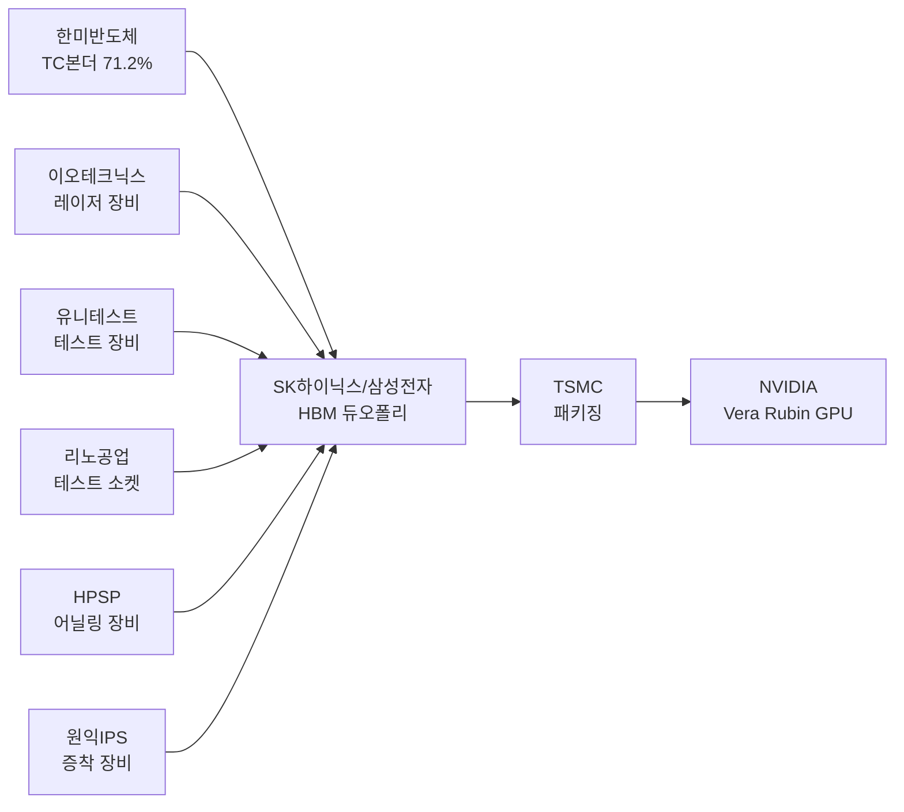
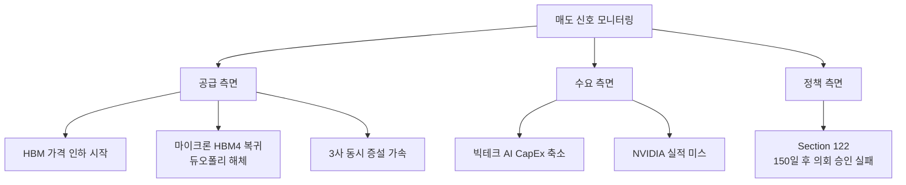

> **관련 글**: [2026년 투자 섹터 전망 (전체)](/knowledge/invest/2026/01/20/investment-sectors-outlook-2026.html) | [반도체 섹터 전망](/knowledge/invest/2026/01/21/semiconductor-sector-outlook-2026.html)

## 핵심 요약: 2026년 전량 매진 + 양강 과점

2026년 **HBM 공급이 전량 매진**(삼성/SK 모두)된 상태입니다. 세 가지 핵심 동력이 이를 뒷받침합니다.

**첫째**, NVIDIA가 **HBM 공급 부족으로 40% 생산 차질**을 겪고 있습니다. HBM이 GPU 생산의 핵심 병목이 되면서, SK하이닉스-삼성의 가격 결정력이 극대화됩니다.

**둘째**, 삼성전자가 **HBM4 양산 출하를 완료**(2/12)하며 **11.7Gbps**(JEDEC 8Gbps 대비 46% 초과)를 달성했습니다. SK하이닉스는 M15X 팹에서 **1b DRAM 기반 HBM4 양산**을 Q1-Q2에 시작합니다.

**셋째**, 3/3 기준 SK하이닉스에 대해 **키움 130만원, 하나/대신 145만원, 시티/SK증권 140-150만원**으로 목표가가 일제 상향되었습니다.

---

## 3월 4일 핵심 업데이트

| 날짜 | 이벤트 | HBM 영향 |
|------|--------|---------|
| **3/3** | **SK하이닉스 -11.50% → 939,000원** | PER **~4.2배**로 하락, 저평가 더욱 심화 |
| **3/3** | **SK하이닉스, NVIDIA 총 HBM4 수요의 약 2/3 공급 확인** | HBM4 시장 지배력 재확인, 삼성·마이크론 대비 압도적 물량 |
| **3/3** | **블랙 튜즈데이** — KOSPI -7.24% 폭락 | 관세·지정학 충격에 반도체 전반 급락, 펀더멘탈 변화 없음 |
| **3/15~19** | **GTC 2026 예정** | **삼성·SK하이닉스 모두 HBM4 쇼케이스** 예정, Vera Rubin 상세 발표 |

### SK하이닉스 PER 4.2배 — 역사적 저평가 심화

3/3 블랙 튜즈데이에서 SK하이닉스가 **-11.50%** 급락하며 **939,000원**까지 하락했습니다. 이에 따라 PER이 기존 4.7배에서 **~4.2배**로 더욱 낮아졌습니다. 글로벌 반도체 평균 PER 15-20배 대비 **1/4 수준**의 극단적 저평가가 심화된 상태입니다.

### SK하이닉스 HBM4 총수요 약 2/3 공급

SK하이닉스가 NVIDIA의 **총 HBM4 수요 중 약 2/3를 공급**하는 것으로 확인되었습니다. 이는 HBM4 시장에서 SK하이닉스의 압도적 시장 지배력을 의미하며, 삼성전자와 마이크론 대비 물량 우위가 명확합니다.

### GTC 2026 (3/15~19) — 삼성·SK 동시 HBM4 쇼케이스

GTC 2026에서 **삼성전자와 SK하이닉스 모두 HBM4를 쇼케이스**할 예정입니다. Vera Rubin GPU의 HBM4 채택 규모, 공급 파트너별 물량 배분 등이 구체화될 핵심 이벤트입니다.

---

## HBM 시장 현황 (2026년 3월 4일 기준)

### 시장 규모

| 연도 | HBM 시장 규모 | 성장률 | 출처 |
|------|-------------|--------|------|
| 2025년 | $34.6B | - | - |
| **2026년** | **$54.6B** | **+58% YoY** | **BofA** |
| 2028년 | ~$100B | 연평균 ~40% | - |

### HBM 시장 점유율 (Q3 2025)

| 기업 | 점유율 | 월간 캐파 | HBM4 현황 |
|------|--------|----------|-----------|
| **SK하이닉스** | **53%** | 160K 웨이퍼 | M15X, 1b DRAM 기반, **Q1-Q2 양산** |
| **삼성전자** | **35%** | 170K → **250K(연말)** | **2/12 양산 출하**, 11.7Gbps, Vera Rubin용 |
| **마이크론** | **12%** | - | HBM4 탈락 |

### HBM3E 가격 인상

2026년 주문 기준으로 **삼성전자와 SK하이닉스 모두 HBM3E 가격을 약 20% YoY 인상**했습니다. 듀오폴리 체제에서 가격 결정력이 더욱 강화된 상태입니다.

---

## HBM4: 차세대 경쟁 구도

### 삼성전자 HBM4

| 항목 | 내용 |
|------|------|
| **출하 개시일** | **2026년 2월 12일 (세계 최초)** |
| **속도** | **11.7Gbps (JEDEC 8Gbps 대비 46% 초과)** |
| **적용 대상** | **NVIDIA Vera Rubin** |
| **월 생산능력** | **170K → 250K 웨이퍼 (연말 목표, +47%)** |
| 엔비디아 인증 | **퀄리티 인증 완료 + PO 확보** |
| 패키징 경로 | 삼성 제조 → **TSMC 패키징** → NVIDIA |

### SK하이닉스 HBM4

| 항목 | 내용 |
|------|------|
| **양산 시점** | **Q1-Q2 2026** (기존 2월 예정에서 지연) |
| **팹** | **M15X** (1b DRAM 기반) |
| **초기 캐파** | **월 10K 웨이퍼** |
| **CAPEX** | 중반 30조대, M15X에 **20조+ 투자** |
| **UBS 전망** | HBM4 시장 **~70% 점유** |

### 마이크론 탈락

| 항목 | 내용 |
|------|------|
| 탈락 원인 | 베이스 다이 발열/전송 속도 NVIDIA 기준 미달 |
| 양산 시점 | **Q2 2026** (SK/삼성 대비 최소 3개월 지연) |
| 시장 영향 | **SK-삼성 듀오폴리 유지** |

### HBM 세대별 로드맵

- **HBM3E**: 2026년 주력 (전체 HBM의 약 **66%**). NVIDIA Blackwell Ultra 탑재
- **HBM4 (12단)**: 삼성 2/12 세계 최초 양산. NVIDIA Vera Rubin GPU 탑재
- **HBM4 (16단)**: SK하이닉스 48GB, M15X 팹 양산 준비
- **HBM4E**: 차세대 개발 진행 중

### NVIDIA 40% 생산 차질

| 항목 | 내용 |
|------|------|
| **생산 차질 규모** | **40%** |
| **원인** | **HBM 공급 부족** |
| **수혜** | SK하이닉스(53%)·삼성(35%) **가격 결정력 극대화** |
| **Blackwell** | 완판 (2026년 중반까지) |

---

## SK하이닉스 HBF: 게임 체인저

### HBF (High Bandwidth Flash) - SEMICON Korea 2026 (2/12)

| 항목 | 내용 |
|------|------|
| 핵심 개념 | HBM + NAND Flash 통합 아키텍처 |
| 전력당 성능 | HBM 대비 **2.69배 향상** |
| 속도 | HBM의 약 **80~90%** |
| 용량 | HBM 대비 **8~16배** |
| 전력 소모 | HBM 대비 **약 40% 절감** |
| **샘플** | **H2 2026** |
| **양산** | **2027년** |
| 협력사 | **SanDisk** 공동 표준화 |

**투자 시사점**: HBF는 AI 추론(Inference) 시장 타겟. 학습=HBM, 추론=HBF로 분화되면 SK하이닉스가 양쪽 시장 모두 지배.

---

## 관련 종목 상세 분석

### 1. SK하이닉스 (000660) - PER ~4.2배 + 목표가 일제 상향

**핵심 수치**

| 항목 | 내용 |
|------|------|
| **주가 (3/3)** | **939,000원 (-11.50%)** — 블랙 튜즈데이 |
| **PER** | **~4.2배** (반도체 평균 15-20배 대비 극단적 저평가, 기존 4.7배에서 추가 하락) |
| **영업이익률** | **67%** |
| **HBM 점유율** | **53%** |
| **HBM4 공급** | **NVIDIA 총 HBM4 수요의 약 2/3** |
| **블랙록 지분** | **5.00% (최대주주)** |
| BofA | 글로벌 메모리 **"Top Pick"** |

**3/3 목표가 상향**

| 증권사 | 목표가 | OP 전망 |
|--------|--------|---------|
| 키움증권 | **130만원** | 170조 |
| 하나증권 | **145만원** | 112조 |
| 대신증권 | **145만원** | 100.7조 |
| 시티/SK증권 | **140-150만원** | |
| 노무라 | 156만원 | 189조 |

**투자 포인트**
- PER ~4.2배 극단적 저평가 (3/3 -11.50% 급락으로 더욱 심화, 글로벌 반도체 평균의 1/4)
- **NVIDIA 총 HBM4 수요의 약 2/3 공급** — HBM4 시장 지배력 확인
- HBM4 M15X 양산 + HBF H2 샘플링
- NVIDIA 40% 차질 = SK하이닉스 가격 결정력 극대화
- 블랙록 5.00% 최대주주 + BofA Top Pick
- **GTC 2026 (3/15~19)**: 삼성·SK 동시 HBM4 쇼케이스 예정

---

### 2. 삼성전자 (005930) - Q1 OP 30조 돌파 + HBM4 양산

| 항목 | 내용 |
|------|------|
| **Q1 2026 OP** | **~30조원 (사상 첫 분기 30조 돌파)** |
| **2026 연간 OP** | **170-201조원** |
| **2027 OP (모건스탠리)** | **317조원** |
| **HBM4** | **2/12 양산 출하, 11.7Gbps** |
| **월간 캐파** | **170K → 250K(연말)** |
| **HBM 점유율** | **35%** |

**투자 포인트**
- HBM4 양산 출하 완료: 11.7Gbps로 JEDEC 46% 초과
- 캐파 170K → 250K(연말): 장기 점유율 확대 여지
- 모건스탠리 2027년 317조원: 세계 1위 OP 가능성

---

### 3. SK스퀘어 (402340) - 이중 할인 상태

| 항목 | 내용 |
|------|------|
| 핵심 자산 | SK하이닉스 지분 20.07% |
| NAV 할인율 | 약 40~50% |
| 자사주 | 매입 후 소각 진행 중 |

SK하이닉스 PER 4.7배 저평가 + SK스퀘어 NAV 40-50% 할인 = **이중 할인**.

---

### 4. 마이크론 (MU) - HBM4 탈락, HBM3E 완판

| 항목 | 내용 |
|------|------|
| **HBM4** | **탈락 확정** |
| HBM3E | 2026년 전량 계약 완료 |
| HBM4 양산 | Q2 2026 (3개월 지연) |
| 미국 투자 | $30B HBM 생산기지 |

---

## HBM 밸류체인

```mermaid
graph LR
    A["한미반도체<br/>TC본더 71.2%"] --> B["SK하이닉스/삼성전자<br/>HBM 듀오폴리"]
    B --> C["TSMC<br/>패키징"]
    C --> D["NVIDIA<br/>Vera Rubin GPU"]

    E["이오테크닉스<br/>레이저 장비"] --> B
    F["유니테스트<br/>테스트 장비"] --> B
    G["리노공업<br/>테스트 소켓"] --> B
    H["HPSP<br/>어닐링 장비"] --> B
    I["원익IPS<br/>증착 장비"] --> B
```

| 종목 | 핵심 사업 | 투자 포인트 |
|------|---------|------------|
| **한미반도체** | TC 본더 | 세계 점유율 71.2%, HBM4 16단 대응 |
| **HPSP** | 고압수소 어닐링 | 영업이익률 55%, HBM4/HBF 필수 |
| **리노공업** | 테스트 소켓 | 영업이익률 48%, 첨단 패키지 테스트 |
| **이오테크닉스** | 레이저 장비 | HBM TSV 공정, 하이브리드 본딩 |

---

## 관세: Section 122 15%

| 관세 유형 | 세율 | HBM 영향 |
|----------|------|---------|
| **IEEPA** | 위헌 무효 | 기존 면제 상태 |
| **Section 122** | **15%** | IEEPA 25% 대비 하향 = 순긍정 |
| **Section 232** | **25%** | 메모리 직접 대상 아님 |

삼성·SK하이닉스가 글로벌 DRAM 70% 점유 → 대체 불가능 → 관세 협상 레버리지.

---

## 투자 전략

### 매도 시점 판단 신호

```mermaid
flowchart TD
    A["매도 신호 모니터링"] --> B["공급 측면"]
    A --> C["수요 측면"]
    A --> D["정책 측면"]

    B --> B1["HBM 가격 인하 시작"]
    B --> B2["마이크론 HBM4 복귀<br/>듀오폴리 해체"]
    B --> B3["3사 동시 증설 가속"]

    C --> C1["빅테크 AI CapEx 축소"]
    C --> C2["NVIDIA 실적 미스"]

    D --> D1["Section 122<br/>150일 후 의회 승인 실패"]
```

### 핵심 이벤트

| 일정 | 이벤트 | 투자 시사점 |
|------|--------|------------|
| **3/15~19** | **GTC 2026** | Vera Rubin 상세, HBM4 채택 규모 |
| **Q1-Q2** | SK하이닉스 HBM4 M15X 양산 | 기술 리더십 확인 |
| **~7월** | Section 122 150일 시한 | 의회 승인 여부 |
| **H2 2026** | Vera Rubin 출하 | HBM4 본격 수요 |
| **H2 2026** | SK HBF 샘플 | 추론 시장 진출 확인 |

---

## 리스크 요인

| 리스크 | 내용 | 대응 |
|--------|------|------|
| **빅테크 FCF 급감** | AI CAPEX $660-690B로 FCF 급감 | 분기 CAPEX 가이던스 모니터링 |
| **마이크론 복귀** | Q2 HBM4 양산 시 듀오폴리 → 3사 체제 | 점유율 변화 추적 |
| **공급 과잉 전환 (2027+)** | 3사 대규모 증설 후 공급 과잉 가능 | 캐파 증설 계획 모니터링 |
| **관세 불확실성** | Section 122 150일 후 의회 승인 불확실 | 정책 방향 추적 |

---

## 결론

2026년 HBM 시장은 **$54.6B(+58%), 전량 매진, NVIDIA 40% 차질**로 역사적 호황입니다.

- **SK하이닉스**: PER 4.7배 + 53% 점유율 + 목표가 130-150만원 + 블랙록 5% + BofA Top Pick
- **삼성전자**: Q1 OP 30조 + HBM4 양산(11.7Gbps) + 캐파 250K(연말) + 2027년 317조원
- **핵심 촉매**: GTC 2026(3/15), SK HBM4 M15X 양산, Vera Rubin 출하
- **전략**: 공급 변화 시그널 전까지 보유

---

*본 글은 투자 참고용이며, 투자 판단과 그에 따른 책임은 투자자 본인에게 있습니다. (2026년 3월 4일 업데이트)*
