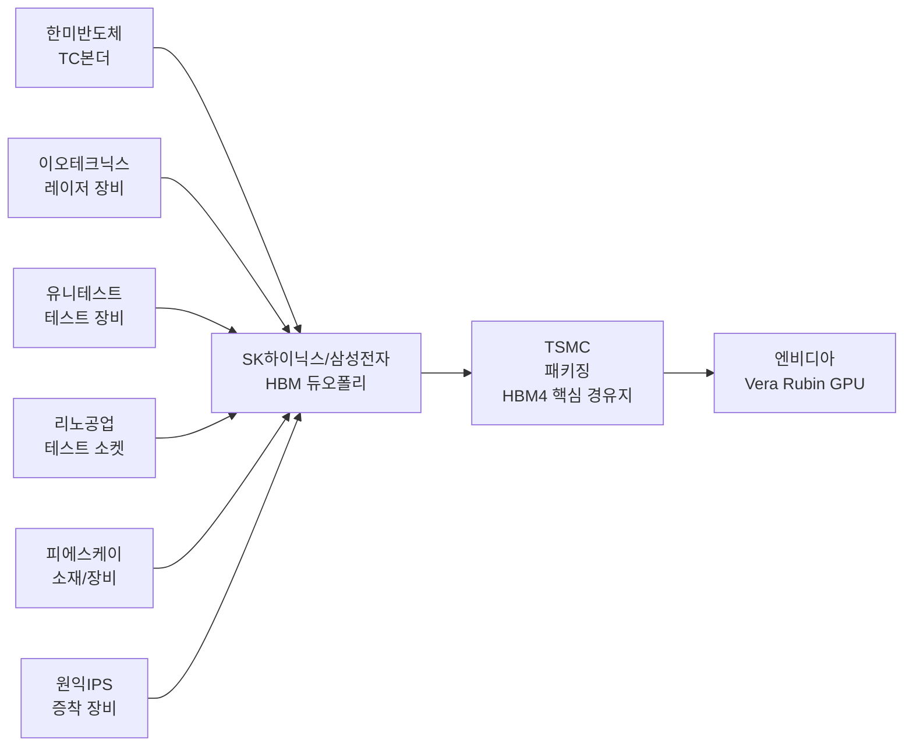
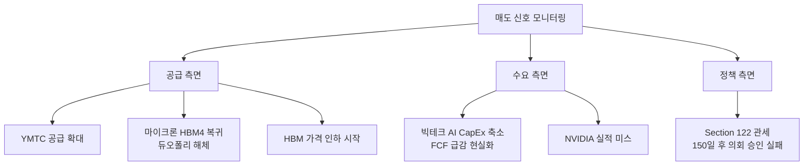

> **관련 글**: [2026년 투자 섹터 전망 (전체)](/knowledge/invest/2026/01/20/investment-sectors-outlook-2026.html) | [반도체 섹터 전망](/knowledge/invest/2026/01/21/semiconductor-sector-outlook-2026.html)

## 3월 2일 주요 업데이트 요약

| 항목 | 내용 |
|------|------|
| **★ HBM 시장 규모 2026** | **$54.6B (+58% YoY, BofA 전망)** |
| **★ HBM3E 주력** | **2026년 전체 HBM의 약 2/3, HBM4 점진 확대** |
| **★ SK하이닉스 HBM4** | **2026 Q2 양산 예상 (UBS: HBM4 시장 70% 점유 전망)** |
| **★ 메모리 공급 부족** | **2028년까지 지속 (마이크론 전망)** |
| **★ 이란 호르무즈 봉쇄** | **유가 Brent $79.15(+8.6%), 시장 변동성 확대** |
| **2026년 HBM 전량 매진** | **삼성/SK 모두 2026년 공급분 전량 계약 완료** |
| **삼성 HBM4 양산 출하** | **2/12 세계 최초 출하, 11.7Gbps (JEDEC 8Gbps 대비 46% 초과)** |
| **Counterpoint 점유율** | **SK 54%, 삼성 28%, 마이크론 18%** |
| **월간 캐파** | **삼성 170,000 웨이퍼 vs SK 160,000 웨이퍼** |
| **삼성 HBM4 개당 가격** | **~$700 (HBM3E 대비 +20~30% 프리미엄)** |
| **NVIDIA 생산 차질** | **메모리 부족으로 40% 생산 차질** |
| **Section 122 관세** | **15% 관세 발효 중, Section 232 별도 유지** |
| SK하이닉스 밸류에이션 | **PER 4.7배** 극단적 저평가 (시총 690조+, 영업이익률 67%) |

---

## 핵심 요약: 2026년 전량 매진 + 양강 과점

2026년 **HBM 공급이 전량 매진**(삼성/SK하이닉스 모두)된 상태입니다. 두 가지 핵심 동력이 이를 뒷받침합니다.

**첫째**, 삼성전자가 **HBM4 양산 출하를 완료**(2/12)하며 **11.7Gbps**(JEDEC 표준 8Gbps 대비 46% 초과)의 성능을 달성했습니다. SK하이닉스는 **16단 48GB HBM4 개발을 완료**하고 **Q1 말 양산**에 들어갑니다.

**둘째**, NVIDIA가 **메모리 부족으로 40% 생산 차질**을 겪고 있습니다. HBM 공급이 GPU 생산의 핵심 병목이 되면서, SK하이닉스·삼성의 가격 결정력이 극대화되고 있습니다.

Counterpoint 기준 **SK하이닉스 54%, 삼성 28%, 마이크론 18%**로 양강 과점 체제가 공고합니다.

### 2027년 실적 전망 (모건스탠리 기준)

| 구분 | 2026년 전망 | 2027년 전망 (모건스탠리) |
|------|----------|------------------------|
| 삼성전자 영업이익 | 245조원 | **317조원** |
| SK하이닉스 영업이익 | ~112조원 | **225조원** |

**핵심 전략: 공급 변화 신호가 나타날 때까지 홀딩. 2026년 전량 매진 + NVIDIA 40% 차질 + 메모리 공급 부족 2028년까지 지속(마이크론)이 HBM 수급 긴박성을 실증.**

---

## HBM4: 전량 매진 + 양강 과점 체제

### HBM 시장 점유율 (Counterpoint)

| 기업 | HBM 점유율 | 월간 캐파 | HBM4 현황 |
|------|-----------|----------|-----------|
| **SK하이닉스** | **54%** | **160,000 웨이퍼** | 16단 48GB 개발 완료, **Q2 양산 (UBS: HBM4 70% 점유 전망)** |
| **삼성전자** | **28%** | **170,000 웨이퍼** | 양산 출하 완료(2/12), 11.7Gbps |
| **마이크론** | **18%** | - | HBM4 탈락, HBM3E 집중 |

삼성의 **월간 캐파(170,000)가 SK하이닉스(160,000)보다 6% 높지만**, SK하이닉스가 기술 리더십·수율·TSMC 원팀 체제로 **점유율 우위(54% vs 28%)**를 유지합니다.

### SK하이닉스 16단 48GB HBM4

| 항목 | 기존 (12단) | **신규 (16단)** |
|------|-----------|----------------|
| **적층 수** | 12단 | **16단** |
| **용량** | 36GB | **48GB (+33%)** |
| **대역폭** | 3TB/s | **향상** |
| **양산 시점** | - | **Q1 2026 말** |

### 삼성전자 HBM4 양산 출하

| 항목 | 내용 |
|------|------|
| **출하 개시일** | **2026년 2월 12일 (세계 최초)** |
| **표준 속도** | **11.7Gbps (JEDEC 8Gbps 기준 대비 46% 초과)** |
| **최대 속도** | **13Gbps** |
| **★ 개당 가격** | **~$700** (HBM3E 대비 **+20~30% 프리미엄**) |
| **엔비디아 인증** | **퀄리티 인증 완료 + PO(구매주문) 확보** |
| **월 생산능력** | **17만장 → 25만장 (연말까지 47% 증가)** |
| 적용 공정 | 10나노급 6세대 DRAM + 자사 파운드리 4나노 베이스 다이 |
| 패키징 경로 | 삼성전자 제조 -> **TSMC 패키징** -> NVIDIA |

### 마이크론 탈락과 시장 재편

| 항목 | 내용 |
|------|------|
| 탈락 원인 | 내부 베이스 다이 발열 제어/전송 속도 NVIDIA 기준 미달 |
| 마이크론 양산 시점 | **2026년 Q2** (SK하이닉스/삼성 대비 최소 3개월 지연) |
| 시장 영향 | HBM4 시장 **SK하이닉스-삼성 듀오폴리** 유지 |

### NVIDIA 40% 생산 차질: HBM 수급 긴박성

| 항목 | 내용 |
|------|------|
| **생산 차질 규모** | **40%** |
| **원인** | **HBM 공급 부족** |
| **수혜** | **SK하이닉스(54%)·삼성(28%) 가격 결정력 극대화** |
| **Blackwell** | **완판 (2026년 중반까지)** |
| **GB300** | **Blackwell 매출의 2/3** |

### HBM 세대별 로드맵

- **HBM3E**: 2026년 주력 제품 (전체 HBM 생산의 약 66%). NVIDIA Blackwell Ultra 시리즈 탑재
- **HBM4 (12단)**: 삼성 2/12 세계 최초 양산 출하. 11.7Gbps. NVIDIA Vera Rubin GPU 탑재
- **HBM4 (16단)**: SK하이닉스 48GB 개발 완료, **Q2 양산 예상 (UBS: HBM4 시장 70% 점유 전망)**. 기존 12단 대비 용량 33% 향상
- **HBM4E**: 차세대 개발 진행 중

---

## SK하이닉스 HBF: 게임 체인저 아키텍처

### HBF (High Bandwidth Flash) - SEMICON Korea 2026 공개 (2/12)

| 항목 | 내용 |
|------|------|
| 공개일 | **2026년 2월 12일** (SEMICON Korea 2026) |
| 핵심 개념 | HBM + NAND Flash 통합 아키텍처 |
| 전력당 성능 | HBM 대비 **2.69배 향상** |
| 속도 | HBM의 약 **80~90%** |
| 용량 | HBM 대비 **8~16배** |
| 전력 소모 | HBM 대비 **약 40% 절감** |
| 양산 시점 | 샘플 H2 2026, 양산 **2027년** |
| 협력사 | **SanDisk**와 공동 표준화 추진 |

**투자 시사점**: HBF는 AI 추론(Inference) 시장을 타겟으로 합니다. 학습(Training)은 HBM, 추론은 HBF로 분화되면, SK하이닉스는 양쪽 시장을 모두 지배하는 포지션을 확보하게 됩니다.

---

## HBM 시장 현황 (2026년 3월 2일 기준)

### 시장 규모 및 성장 전망

| 연도 | HBM 시장 규모 | 성장률 | 출처 |
|------|-------------|--------|------|
| 2025년 | 380억 달러 | - | - |
| **2026년** | **$54.6B (+58% YoY)** | **+58%** | **BofA** |
| 2028년 | 1,000억 달러 (약 147조원) | 연평균 40% | - |

2026년 **HBM 공급이 전량 매진**(삼성/SK 모두)된 상태이며, NVIDIA **40% 생산 차질**이 이를 실증합니다. 마이크론은 메모리 **구조적 공급 부족이 2028년까지 지속**될 것으로 전망합니다.

### HBM3E 가격 인상 20%

2026년 주문 기준으로 **삼성전자와 SK하이닉스 모두 HBM3E 가격을 약 20% 인상**했습니다. 듀오폴리 체제에서 가격 결정력이 더욱 강화된 상태입니다.

---

## 관세: Section 122 15% (IEEPA 25% 대비 하향)

| 관세 유형 | 세율 | 현황 | HBM 영향 |
|----------|------|------|---------|
| **IEEPA 상호관세** | 국가별 차등 | **위헌 무효** | 기존 면제 상태 |
| **Section 122** | **15%** | **2/24 발효, 150일 한시** | 기존 IEEPA 25% 대비 하향 |
| **Section 232** | **25%** | **유지** | 메모리 직접 대상 아님 |

IEEPA 25%에서 Section 122 15%로 세율이 하향된 것은 긍정적입니다. 삼성·SK하이닉스가 글로벌 DRAM 70%를 점유하고 있어 대체 불가능한 위치입니다.

---

## 관련 종목 상세 분석

### 1. SK하이닉스 (000660.KRX) - 16단 48GB HBM4 + PER 4.7배

**핵심 수치**

| 항목 | 내용 |
|------|------|
| **현재가** | **949,000원 (신고가)** |
| **PER** | **4.7배** (시총 690조+, 영업이익률 67%) |
| **HBM4 (16단)** | **48GB 개발 완료, Q1 말 양산** |
| **HBM 점유율** | **54% (Counterpoint) / ~70% HBM4 (UBS)** |
| **월간 캐파** | **160,000 웨이퍼** |
| **블랙록 지분** | **5.00% (7년 9개월 만에 재확보)** |
| 2026년 영업이익 전망 | **112조원 (하나) ~ 189조원 (노무라)** |
| 2027년 영업이익 전망 | **225조원** (모건스탠리) |
| BofA 평가 | 글로벌 메모리 **"Top Pick"** |
| **목표가** | **노무라 1,560,000원 / 하나증권 1,120,000원** |

**투자 포인트**
- **16단 48GB HBM4 Q1 양산**: 기존 12단 한계 돌파, 기술 리더십 재확인
- **HBM 점유율 54%(Counterpoint)**: 양강 내 독주 유지
- **PER 4.7배 극단적 저평가**: 글로벌 반도체 평균 PER(15~20배) 대비 1/3~1/4 수준
- **2026년 HBM 전량 매진**: 수급 긴박성 지속
- **BofA "Top Pick" + 블랙록 5%**: 글로벌 기관 확신

**리스크**
- 관세 면제 미확정 (인디애나 $41억 투자, TSMC 대비 규모 열위)
- 삼성 캐파(170K)가 SK(160K)보다 높아 장기적 점유율 변화 가능성

---

### 2. 삼성전자 (005930.KRX) - HBM4 양산 출하 + 캐파 우위

**핵심 수치**

| 항목 | 내용 |
|------|------|
| **HBM4 양산 출하** | **2/12 세계 최초, 11.7Gbps** |
| **HBM4 개당 가격** | **~$700 (HBM3E 대비 +20~30%)** |
| **HBM 점유율** | **28% (Counterpoint)** |
| **월간 캐파** | **170,000 웨이퍼 (SK 160K 대비 상회)** |
| **CEO 선언** | **"Samsung is back"** |
| 2027년 영업이익 (모건스탠리) | **317조원** (전 세계 기업 중 1위 전망) |

**투자 포인트**
- **HBM4 양산 출하 완료(2/12)**: 11.7Gbps로 JEDEC 표준 46% 초과
- **월간 캐파 170K**: SK하이닉스(160K) 대비 상회, 장기적 점유율 확대 여지
- **모건스탠리 2027년 영업이익 317조원**: 전 세계 기업 중 1위 가능성
- **2026년 HBM 전량 매진**: 수급 견조

**리스크**
- HBM 점유율 28%로 SK하이닉스(54%) 대비 열위
- 관세 면제 미확정 (TSMC 대비 투자 규모 격차)

---

### 3. SK스퀘어 (402340.KRX) - SK하이닉스 레버리지 플레이

| 항목 | 내용 |
|------|------|
| 핵심 자산 | SK하이닉스 지분 20.07% |
| 자사주 정책 | 자사주 매입 후 소각 진행 중 |
| NAV 할인율 | 약 40~50% |

SK하이닉스가 PER 4.7배로 극단적 저평가인 상황에서, SK스퀘어는 **NAV 할인 40~50% + SK하이닉스 저평가**의 이중 할인 상태.

---

### 4. 마이크론 (MU.NASDAQ) - HBM4 탈락, HBM3E 집중

| 항목 | 내용 |
|------|------|
| **HBM4** | **탈락 확정** |
| HBM3E | 2026년 생산 물량 전량 계약 완료 |
| HBM4 양산 | **Q2 2026** (3개월 지연) |
| 미국 투자 | 300억 달러 HBM 생산기지 |

---

## HBM 밸류체인 기업

```mermaid
graph LR
    A["한미반도체<br/>TC본더"] --> B["SK하이닉스/삼성전자<br/>HBM 듀오폴리"]
    B --> C["TSMC<br/>패키징<br/>HBM4 핵심 경유지"]
    C --> D["엔비디아<br/>Vera Rubin GPU"]

    E["이오테크닉스<br/>레이저 장비"] --> B
    F["유니테스트<br/>테스트 장비"] --> B
    G["리노공업<br/>테스트 소켓"] --> B
    H["피에스케이<br/>소재/장비"] --> B
    I["원익IPS<br/>증착 장비"] --> B
```

| 종목 | 티커 | 핵심 사업 | 투자 포인트 |
|------|------|---------|------------|
| **한미반도체** | 042700.KRX | TC 본더 | HBM용 TC 본더 시장 점유율 71.2% |
| **이오테크닉스** | 039030.KRX | 레이저 장비 | HBM TSV 공정용 레이저 장비 |
| **유니테스트** | 086390.KRX | 메모리 테스트 | HBM 테스트 장비 수요 증가 |
| **리노공업** | 058470.KRX | 테스트 소켓 | 반도체 ETF 상위 종목 |
| **피에스케이** | 319660.KRX | 식각/세정 장비 | HBM 공정용 장비 |
| **원익IPS** | 240810.KRX | 증착 장비 | 반도체 전공정 장비 |

---

## 투자 전략

### 매도 시점 판단을 위한 신호 (Sell Indicator)

```mermaid
flowchart TD
    A["매도 신호 모니터링"] --> B["공급 측면"]
    A --> C["수요 측면"]
    A --> D["정책 측면"]

    B --> B1["YMTC 공급 확대"]
    B --> B2["마이크론 HBM4 복귀<br/>듀오폴리 해체"]
    B --> B3["HBM 가격 인하 시작"]

    C --> C1["빅테크 AI CapEx 축소<br/>FCF 급감 현실화"]
    C --> C2["NVIDIA 실적 미스"]

    D --> D1["Section 122 관세<br/>150일 후 의회 승인 실패"]
```

### 주요 이벤트 캘린더

| 일정 | 이벤트 | 투자 시사점 |
|------|--------|------------|
| **2/24** | **Section 122 15% 관세 발효** | IEEPA 25% 대비 하향, HBM 직접 영향 제한적 |
| **2/26** | **NVIDIA Q4 FY26 실적 발표** | 매출 $65.7-67.5B, Q1 가이던스 $71-76B, 40% 차질 영향 |
| **3/16~19** | **GTC 2026** | **Vera Rubin GPU 공개**, HBM4 채택 규모 확인 |
| **Q1 말** | **SK하이닉스 16단 48GB HBM4 양산** | 기술 리더십 재확인 |
| **~7월** | **Section 122 관세 150일 시한** | 의회 승인 여부 |
| **Q3 2026** | Vera Rubin GPU 출시 | HBM4 본격 수요 시작 |

---

## 리스크 요인

### 1. 빅테크 AI CAPEX 과잉 + FCF 급감
AI CAPEX $635-665B(전년비 ~2배)로 FCF 급감이 전망됩니다. AI 투자 ROI가 가시화되기 전 CAPEX가 먼저 급증하는 구간이므로, 빅테크 주가 조정 시 반도체 센티먼트에도 영향.

### 2. NVIDIA 2/26 실적 리스크
매출 $65.7-67.5B 전망 대비 미스 시 반도체 섹터 전체 센티먼트 악화. 메모리 부족 40% 생산 차질이 실적에 반영될 가능성.

### 3. 관세 불확실성
Section 122 15% 보편관세(150일 한시) + Section 232 25% 유지. 150일 후 의회 승인 불확실.

### 4. 공급 과잉 전환 (2027년 이후)
메모리 3사 대규모 증설이 2027년 이후 공급 과잉으로 전환 가능. 삼성 캐파(170K)가 SK(160K) 상회하여 장기적 시장 구도 변화 가능성.

### 5. 마이크론 복귀 리스크
마이크론이 Q2 HBM4 양산에 성공하면 듀오폴리 -> 3사 체제 복귀. SK하이닉스 점유율 희석 가능.

---

## 결론

2026년 **HBM 공급이 전량 매진**(삼성/SK 모두)된 상태에서, 삼성은 **HBM4 양산 출하**(11.7Gbps), SK하이닉스는 **16단 48GB HBM4 Q1 양산**으로 양강 과점 체제가 더욱 공고해졌습니다. NVIDIA **40% 생산 차질**이 수급 긴박성을 실증합니다.

**투자 결론:**
- **SK하이닉스**: PER 4.7배 + 점유율 54% + 16단 48GB Q1 양산 + 블랙록 5% + BofA Top Pick
- **삼성전자**: HBM4 양산(11.7Gbps) + 캐파 170K(SK 대비 상회) + 모건스탠리 317조원
- **2026년 전량 매진**: HBM 가격 결정력 극대화
- **핵심 촉매**: 2/26 NVIDIA 실적, 3/16~19 GTC 2026(Vera Rubin)
- **핵심 리스크**: 빅테크 FCF 급감, Section 122 관세, 마이크론 복귀

---

## 참고 자료

- [레오만 레벨업 - 2026년 반도체 계급도: 왕좌의 엔비디아, 추락하는 마이크론?](https://levelup-leo.com/nvidia-micron-hbm4-analysis/)
- [서울경제 - TSMC 1650억 달러 투자 美 무관세, 삼성/SK 추가 투자 압박](https://m.sedaily.com/article/20007652)
- [한국경제 - 모건스탠리마저 21만전자 110만닉스 간다](https://www.hankyung.com/article/2026020290081)
- [TrendForce - SK hynix Unveils AI Chip Architecture with HBF](https://www.trendforce.com/news/2026/02/12/news-sk-hynix-unveils-ai-chip-architecture-with-hbf-reportedly-boosts-performance-per-watt-by-up-to-2-69x/)
- [SK hynix Newsroom - SEMICON Korea 2026 AI-Driven R&D Vision](https://news.skhynix.com/sk-hynix-presents-ai-driven-rd-innovation-vision-at-semicon-korea-2026/)
- [KitGuru - NVIDIA GTC 2026 dated for March](https://www.kitguru.net/channel/event/joao-silva/nvidia-gtc-2026-dated-for-march-with-vera-rubin-and-feynman-ai-architectures-in-focus/)
- [서울신문 - 삼성, 설 직후 HBM4 세계 첫 양산](https://www.seoul.co.kr/news/economy/industry/2026/02/09/20260209031001)
- [글로벌이코노믹 - 삼성전자 시총 1000조, SK하이닉스 이익률 58%](https://www.g-enews.com/article/Global-Biz/2026/02/202602071754516988fbbec65dfb_1)

---

*본 글은 투자 참고용이며, 투자 판단과 그에 따른 책임은 투자자 본인에게 있습니다. (2026년 2월 23일 업데이트)*
