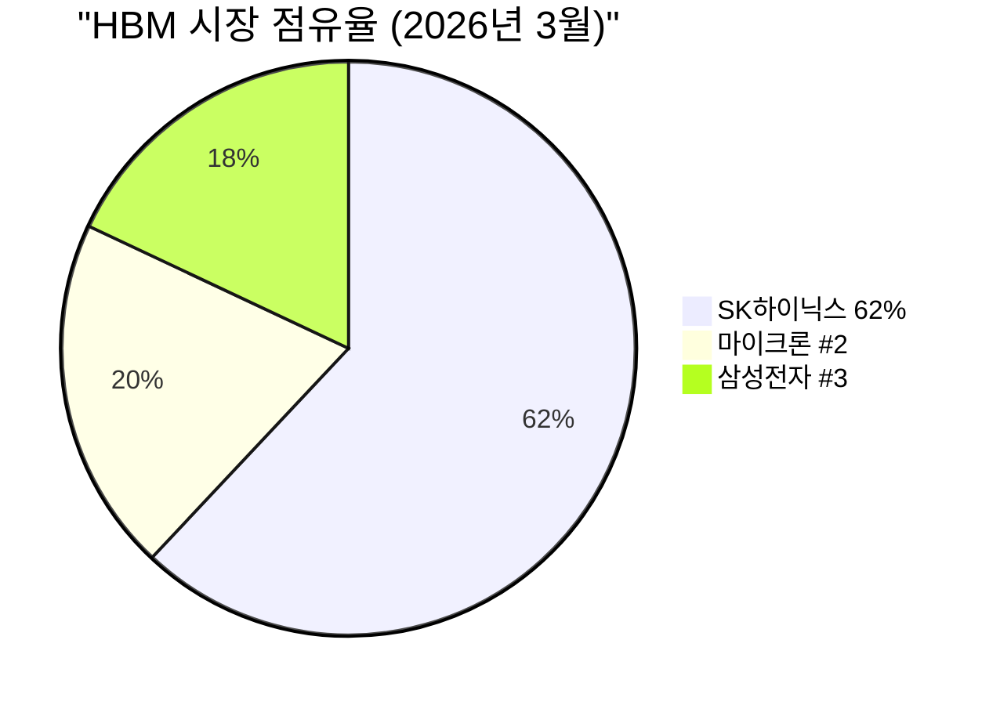
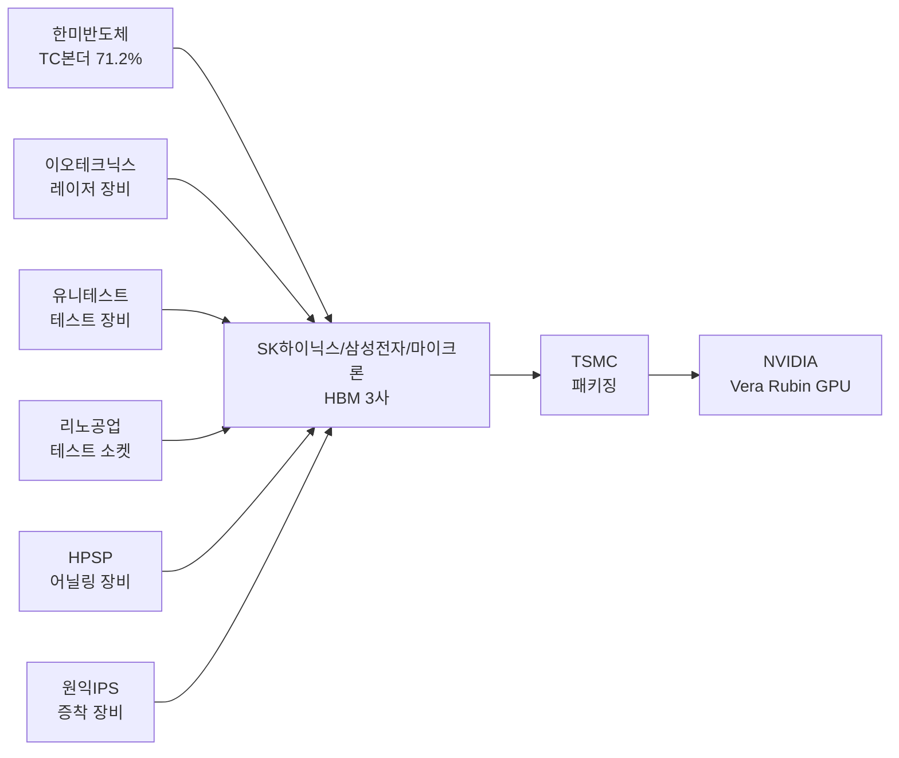
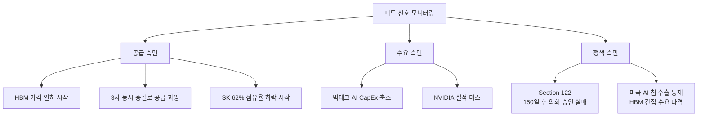

> **관련 글**: [2026년 투자 섹터 전망 (전체)](/knowledge/invest/2026/01/20/investment-sectors-outlook-2026.html) | [반도체 섹터 전망](/knowledge/invest/2026/01/21/semiconductor-sector-outlook-2026.html)

## 핵심 요약: 3사 전량 매진 + SK하이닉스 62% 지배

2026년 **HBM 생산이 3사(SK하이닉스·삼성·마이크론) 모두 전량 매진**된 상태입니다.

**첫째**, SK하이닉스가 **HBM 시장 점유율 62%**로 압도적 1위를 유지합니다. **마이크론이 삼성을 추월하여 2위**로 올라서며 시장 구도가 재편되었습니다.

**둘째**, 삼성전자가 **HBM4 PRA(Pre-Release Assessment)를 완료**하여 수율·성능 벤치마크를 통과했습니다. TrendForce는 **HBM4 인증을 Q2 2026으로 전망**합니다.

**셋째**, 3사 모두 **NVIDIA 16-Hi HBM4 공급 계약**(H2 2026 목표)을 위해 경쟁 중이며, UBS는 SK하이닉스가 **NVIDIA Rubin 플랫폼 HBM4의 ~70%**를 차지할 것으로 전망합니다.

**넷째**, HBM TAM(Total Addressable Market)이 **2028년 $100B**에 도달할 전망입니다.

---

## 3월 7일 핵심 업데이트

| 항목 | 변경 내용 |
|------|----------|
| **시장 점유율** | SK하이닉스 **62%** (기존 53% → 62%), 마이크론이 삼성 추월하여 **#2** |
| **2026 생산** | **3사 모두 전량 매진** (기존: 삼성·SK만 매진) |
| **HBM4 PRA** | 삼성 **PRA 완료** — 수율·성능 벤치마크 통과, 양산 준비 |
| **HBM4 인증** | TrendForce: **Q2 2026 인증 전망** |
| **16-Hi HBM4** | **3사 모두** NVIDIA 16-Hi HBM4 공급 계약 경쟁 (H2 2026) |
| **TAM** | HBM TAM **$100B (2028)** |
| **SK하이닉스 투자** | 용인 반도체 클러스터 **31조** + 추가 **21.6조** (2/25 발표) |
| **리스크 추가** | SK하이닉스 HBM4 양산 안정화 불확실성, 미국 AI 칩 수출 통제 초안 |

### 3/5 반등: 폭락이 지정학 충격이었음을 증명

3/3~3/4 2일간 SK하이닉스가 -19% 급락한 뒤, 3/5 이란 협상 시그널로 **+10.95%** 반등하며 **~941,000원**(장중 985,000원)을 회복했습니다. 삼성전자도 **+11.15%** 반등하여 **~195,100원**을 기록했습니다. 이는 HBM 펀더멘털(전량 매진, SK 62% 점유, TAM $100B)이 전혀 훼손되지 않았음을 시장이 확인한 것입니다.

---

## HBM 시장 현황 (2026년 3월 7일 기준)

### 시장 규모

| 연도 | HBM 시장 규모 | 성장률 | 출처 |
|------|-------------|--------|------|
| 2025년 | $34.6B | - | - |
| **2026년** | **$54.6B** | **+58% YoY** | **BofA** |
| **2028년** | **~$100B** | 연평균 ~40% | - |

### HBM 시장 점유율

```mermaid
pie title "HBM 시장 점유율 (2026년 3월)"
    "SK하이닉스 62%" : 62
    "마이크론 #2" : 20
    "삼성전자 #3" : 18
```

| 기업 | 점유율 | 2026 생산 | HBM4 현황 |
|------|--------|----------|-----------|
| **SK하이닉스** | **62%** (압도적 1위) | **전량 매진** | M15X 양산, UBS: Rubin HBM4 ~70% |
| **마이크론** | **#2** (삼성 추월) | **전량 매진** (장기 계약) | 초기 HBM4 양산 램프 |
| **삼성전자** | **#3** | **전량 매진** | **PRA 완료**, Q2 인증 전망 |

**시장 구도 변화**: 기존 SK-삼성 듀오폴리에서 마이크론이 삼성을 추월하며 **SK-마이크론-삼성** 순서로 재편되었습니다. 다만 3사 모두 2026년 전량 매진 상태로 공급 부족 기조는 유지됩니다.

### HBM3E 가격 인상

2026년 주문 기준으로 **HBM3E 가격을 약 20% YoY 인상**. 전량 매진 상태에서 가격 결정력이 강화된 상태입니다.

---

## HBM4: 차세대 경쟁 구도

### 삼성전자 HBM4

| 항목 | 내용 |
|------|------|
| **PRA** | **완료** — 수율·성능 벤치마크 통과, 양산 준비 |
| **출하 개시일** | 2026년 2월 12일 (세계 최초) |
| **속도** | 11.7Gbps (JEDEC 8Gbps 대비 46% 초과) |
| **인증 전망** | TrendForce: **Q2 2026** |
| **초고밀도 스택** | 검증 리더십 |
| **생산 기지** | 평택 캠퍼스 — 메모리-파운드리 협업 허브 |

### SK하이닉스 HBM4

| 항목 | 내용 |
|------|------|
| **양산 시점** | Q1-Q2 2026 (양산 안정화 불확실성 존재) |
| **팹** | M15X (1b DRAM 기반) |
| **UBS 전망** | NVIDIA Rubin 플랫폼 HBM4 **~70% 점유** |
| **투자** | 용인 클러스터 **31조** + 추가 **21.6조** (2/25 발표) = **총 52.6조** |
| **리스크** | 2/28 양산 안정화 목표일 경과, 공식 발표 없음 |

### 마이크론 HBM4

| 항목 | 내용 |
|------|------|
| **시장 위치** | **삼성 추월하여 #2** |
| **2026 생산** | 전량 장기 계약 체결 |
| **HBM4** | 초기 양산 램프 진행 중 |

### 16-Hi HBM4 공급 경쟁

**3사 모두** NVIDIA 16-Hi HBM4 공급 계약을 위해 경쟁 중입니다. 목표 시점은 **H2 2026**이며, 이는 Vera Rubin GPU 출하 일정과 연동됩니다.

### HBM 세대별 로드맵

- **HBM3E**: 2026년 주력 (전체 HBM의 약 **66%**). NVIDIA Blackwell Ultra 탑재
- **HBM4 (12단)**: 삼성 2/12 세계 최초 양산, PRA 완료. NVIDIA Vera Rubin GPU 탑재
- **HBM4 (16단)**: SK하이닉스 48GB, 3사 공급 경쟁 (H2 2026 목표)
- **HBM4E**: 차세대 개발 진행 중

### NVIDIA 40% 생산 차질

| 항목 | 내용 |
|------|------|
| **생산 차질 규모** | **40%** |
| **원인** | **HBM 공급 부족** |
| **수혜** | SK하이닉스(62%) 가격 결정력 극대화 |
| **Blackwell** | 완판 (2026년 중반까지) |

---

## SK하이닉스 HBF: 게임 체인저

### HBF (High Bandwidth Flash) - SEMICON Korea 2026 (2/12)

| 항목 | 내용 |
|------|------|
| 핵심 개념 | HBM + NAND Flash 통합 아키텍처 |
| 전력당 성능 | HBM 대비 **2.69배 향상** |
| 속도 | HBM의 약 **80~90%** |
| 용량 | HBM 대비 **8~16배** |
| 전력 소모 | HBM 대비 **약 40% 절감** |
| **샘플** | **H2 2026** |
| **양산** | **2027년** |
| 협력사 | **SanDisk** 공동 표준화 |

**투자 시사점**: HBF는 AI 추론(Inference) 시장 타겟. 학습=HBM, 추론=HBF로 분화되면 SK하이닉스가 양쪽 시장 모두 지배.

---

## 관련 종목 상세 분석

### 1. SK하이닉스 (000660) — 62% 점유, ~941,000원, PER ~16배

**핵심 수치**

| 항목 | 내용 |
|------|------|
| **주가 (3/5)** | **~941,000원 (+10.95%)**, 장중 985,000원 |
| **PER** | **~16배** (반도체 평균 15-20배 하단) |
| **영업이익률** | **67%** |
| **HBM 점유율** | **62%** (압도적 1위) |
| **HBM4 공급** | UBS: NVIDIA Rubin HBM4 **~70%** |
| **CAPEX** | 용인 클러스터 **31조** + 추가 **21.6조** = **52.6조** |
| **블랙록 지분** | **5.00% (최대주주)** |
| BofA | 글로벌 메모리 **"Top Pick"** |

**3/3 목표가 상향**

| 증권사 | 목표가 | OP 전망 |
|--------|--------|---------|
| 키움증권 | **130만원** | 170조 |
| 하나증권 | **145만원** | 112조 |
| 대신증권 | **145만원** | 100.7조 |
| 시티/SK증권 | **140-150만원** | |
| 노무라 | 156만원 | 189조 |

**투자 포인트**
- **62% 점유율** — HBM 시장 압도적 지배
- **Rubin HBM4 ~70%** — 차세대 플랫폼에서도 지배력 확대
- 용인 반도체 클러스터 **총 52.6조 투자** — 장기 생산 능력 확보
- PER ~16배, 목표가 130-150만원 — 반도체 평균 하단 수준
- **리스크**: HBM4 양산 안정화 시점 불확실 (2/28 목표일 경과)
- **GTC 2026 (3/16)**: HBM4 쇼케이스 예정

---

### 2. 삼성전자 (005930) — HBM4 PRA 완료, ~195,100원

| 항목 | 내용 |
|------|------|
| **주가 (3/5)** | **~195,100원 (+11.15%)**, 장중 197,700원 |
| **Q1 2026 OP** | **~30조원 (사상 첫 분기 30조 돌파)** |
| **2026 연간 OP** | **170-201조원** |
| **2027 OP (모건스탠리)** | **317조원** |
| **HBM4 PRA** | **완료** — 수율·성능 벤치마크 통과, 양산 준비 |
| **초고밀도 스택** | 검증 리더십 |
| **생산 기지** | 평택 캠퍼스 (메모리-파운드리 협업 허브) |

**투자 포인트**
- **HBM4 PRA 완료**: 양산 준비 단계 진입, TrendForce Q2 인증 전망
- 초고밀도 스택 검증 리더십 — 16-Hi HBM4 경쟁에서 기술적 우위
- 평택 캠퍼스의 메모리-파운드리 시너지
- Q1 OP 30조 돌파, 2027년 317조원 전망
- **리스크**: 마이크론에 HBM #2 자리를 내줌

---

### 3. SK스퀘어 (402340) — 이중 할인 상태

| 항목 | 내용 |
|------|------|
| 핵심 자산 | SK하이닉스 지분 20.07% |
| NAV 할인율 | 약 40~50% |
| 자사주 | 매입 후 소각 진행 중 |

SK하이닉스 PER 16배(반도체 평균 하단) + SK스퀘어 NAV 40-50% 할인 = **이중 할인**.

---

### 4. 마이크론 (MU) — 삼성 추월 #2, 전량 매진

| 항목 | 내용 |
|------|------|
| **HBM 순위** | **삼성 추월하여 #2** |
| **2026 생산** | **전량 장기 계약 체결** |
| **HBM4** | 초기 양산 램프 진행 |
| 미국 투자 | $30B HBM 생산기지 |

---

## HBM 밸류체인

```mermaid
graph LR
    A["한미반도체<br/>TC본더 71.2%"] --> B["SK하이닉스/삼성전자/마이크론<br/>HBM 3사"]
    B --> C["TSMC<br/>패키징"]
    C --> D["NVIDIA<br/>Vera Rubin GPU"]

    E["이오테크닉스<br/>레이저 장비"] --> B
    F["유니테스트<br/>테스트 장비"] --> B
    G["리노공업<br/>테스트 소켓"] --> B
    H["HPSP<br/>어닐링 장비"] --> B
    I["원익IPS<br/>증착 장비"] --> B
```

| 종목 | 핵심 사업 | 투자 포인트 |
|------|---------|------------|
| **한미반도체** | TC 본더 | 세계 점유율 71.2%, HBM4 16단 대응 |
| **HPSP** | 고압수소 어닐링 | 영업이익률 55%, HBM4/HBF 필수 |
| **리노공업** | 테스트 소켓 | 영업이익률 48%, 첨단 패키지 테스트 |
| **이오테크닉스** | 레이저 장비 | HBM TSV 공정, 하이브리드 본딩 |

---

## 관세: Section 122 15%

| 관세 유형 | 세율 | HBM 영향 |
|----------|------|---------|
| **IEEPA** | 위헌 무효 | 기존 면제 상태 |
| **Section 122** | **15%** | IEEPA 25% 대비 하향 = 순긍정 |
| **Section 232** | **25%** | 메모리 직접 대상 아님 |

삼성·SK하이닉스가 글로벌 DRAM 70% 점유 → 대체 불가능 → 관세 협상 레버리지.

---

## 투자 전략

### 매도 시점 판단 신호

```mermaid
flowchart TD
    A["매도 신호 모니터링"] --> B["공급 측면"]
    A --> C["수요 측면"]
    A --> D["정책 측면"]

    B --> B1["HBM 가격 인하 시작"]
    B --> B2["3사 동시 증설로 공급 과잉"]
    B --> B3["SK 62% 점유율 하락 시작"]

    C --> C1["빅테크 AI CapEx 축소"]
    C --> C2["NVIDIA 실적 미스"]

    D --> D1["Section 122<br/>150일 후 의회 승인 실패"]
    D --> D2["미국 AI 칩 수출 통제<br/>HBM 간접 수요 타격"]
```

### 핵심 이벤트

| 일정 | 이벤트 | 투자 시사점 |
|------|--------|------------|
| **3/16~19** | **GTC 2026** | HBM4 쇼케이스, Vera Rubin 상세, 16-Hi HBM4 채택 규모 |
| **Q2 2026** | HBM4 인증 (TrendForce) | 삼성 PRA 완료 후 최종 인증 |
| **Q2** | 메모리 가격 협상 | HBM3E 20% 인상 이후 추가 가격 동향 |
| **H2 2026** | NVIDIA 16-Hi HBM4 공급 | 3사 계약 배분 확정 |
| **H2 2026** | Vera Rubin 출하 | HBM4 본격 수요 |
| **H2 2026** | SK HBF 샘플 | 추론 시장 진출 확인 |
| **~7월** | Section 122 150일 시한 | 의회 승인 여부 |

---

## 리스크 요인

| 리스크 | 내용 | 대응 |
|--------|------|------|
| **SK하이닉스 HBM4 양산 안정화** | 2/28 목표일 경과, 공식 발표 없음 | GTC 발표 및 Q1 실적 발표 모니터링 |
| **미국 AI 칩 수출 통제 초안** | HBM 간접 수요 타격 가능성 | 정책 확정 여부 추적 |
| **빅테크 FCF 급감** | AI CAPEX $660-690B로 FCF 급감 | 분기 CAPEX 가이던스 모니터링 |
| **삼성 점유율 하락** | 마이크론에 #2 내줌, PRA 완료 후 반등 가능 여부 | Q2 인증 결과 추적 |
| **공급 과잉 전환 (2027+)** | 3사 대규모 증설 후 공급 과잉 가능 | 캐파 증설 계획 모니터링 |
| **관세 불확실성** | Section 122 150일 후 의회 승인 불확실 | 정책 방향 추적 |

---

## 결론

2026년 HBM 시장은 **$54.6B(+58%), 3사 전량 매진, TAM $100B(2028)**으로 역사적 호황입니다.

- **SK하이닉스**: **62% 점유율** 압도적 1위, ~941,000원, PER ~16배, 용인 클러스터 52.6조 투자
- **삼성전자**: **HBM4 PRA 완료**, ~195,100원, Q1 OP 30조, 초고밀도 스택 검증 리더십
- **마이크론**: **삼성 추월 #2**, 전량 장기 계약, 초기 HBM4 양산 램프
- **핵심 촉매**: **GTC 2026(3/16)** HBM4 쇼케이스, Q2 HBM4 인증, 16-Hi HBM4 공급 계약
- **주요 리스크**: SK하이닉스 HBM4 양산 안정화 불확실성, 미국 AI 칩 수출 통제 초안
- **전략**: 공급 변화 시그널 전까지 보유, GTC와 Q2 인증이 단기 촉매

---

*본 글은 투자 참고용이며, 투자 판단과 그에 따른 책임은 투자자 본인에게 있습니다. (2026년 3월 7일 업데이트)*
