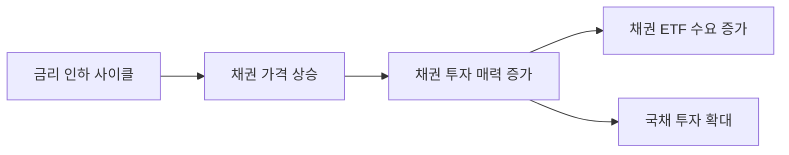

> **관련 글**: [2026년 투자 섹터 전망 (전체)](/knowledge/invest/2026/01/20/investment-sectors-outlook-2026.html)

2026년 국내 증시는 코스피 4,900포인트를 돌파하며 역사적인 고점을 기록하고 있습니다. 금리 인하 사이클 진입, 주주환원 정책 강화, WGB 인덱스 편입 등 긍정적 요인과 함께 환율 리스크, 저성장 우려 등 주의해야 할 요소도 공존합니다.

이 글에서는 2026년 거시경제 및 정책 환경이 투자에 미치는 영향을 분석하고, 효과적인 투자 전략을 제시합니다.

## 국내 시장 현황

### 코스피 5,000포인트 돌파 가능성

| 지표 | 현황 |
|------|------|
| 코스피 | 4,900포인트 돌파 |
| 한국은행 기준금리 | 2.50% 동결 |
| 2026년 상반기 전망 | 긍정적 (금리 인하 사이클) |

코스피가 4,900포인트를 돌파하면서 심리적 저항선인 5,000포인트 돌파 기대감이 높아지고 있습니다. 특히 금리 인하 사이클 진입으로 유동성 환경이 개선되면서 증시에 우호적인 상황이 조성되고 있습니다.

### 채권 투자 매력 증가

금리 인하 사이클 진입으로 채권 투자의 매력이 크게 증가했습니다. 금리가 하락하면 채권 가격은 상승하므로, 현 시점에서 채권을 포트폴리오에 편입하는 전략이 유효합니다.

```
금리 인하 → 채권 가격 상승 → 채권 투자 수익 기대
```

## 환율 리스크 분석

### 구조적 고환율 고착화

| 항목 | 현황 |
|------|------|
| 원달러 환율 | 1,470원대 |
| 한국 달러 자산 규모 | 외환시장의 25배 (IMF 경고) |
| 주요 원인 | 서학개미 해외 투자 확대 |

원달러 환율이 1,470원대로 상승하면서 구조적 고환율이 고착화되고 있습니다. IMF는 한국의 달러 자산이 외환시장 규모의 25배에 달한다고 경고했습니다.

### 달러 유출 지속

서학개미(해외 주식 투자자)의 해외 투자 확대로 달러 유출이 지속되고 있습니다. 이는 원화 약세 압력을 높이는 구조적 요인으로 작용합니다.

> 투자 시사점: 달러 자산과 원화 자산의 적절한 배분 전략이 필요합니다. 환헤지 상품도 고려해볼 만합니다.

## 주요 정책 변화

### 1. 주주환원 정책 강화

정부가 추진 중인 주주환원 정책은 국내 증시의 저평가(코리아 디스카운트) 해소에 기여할 것으로 기대됩니다.

| 정책 | 내용 |
|------|------|
| 배당소득세 분리과세 | 배당 투자 매력 증가 |
| 자사주 소각 의무화 | 주주가치 제고 |

### 2. WGB 인덱스 편입

| 항목 | 내용 |
|------|------|
| 편입 예정일 | 2026년 4월 |
| 예상 자금 유입 | 약 60조원 |
| 효과 | 외국인 수급 개선 |

한국이 세계국채지수(WGBI)에 편입되면 약 60조원 규모의 외국인 매수가 예상됩니다. 이는 채권 시장뿐 아니라 전반적인 금융시장 안정에 기여할 것입니다.

### 3. 거래시간 연장

한국거래소는 2026년 6월부터 거래시간을 12시간 연장할 예정입니다. 이는 글로벌 투자자의 접근성을 높이고 시장 유동성 확대에 기여할 것으로 기대됩니다.

## 하위 섹터별 상세 분석

### 금리/채권 섹터



**투자 포인트:**
- 금리 인하 사이클 진입으로 채권 투자 매력 증가
- 채권 ETF, 국채 등 관련 상품 주목
- 포트폴리오 내 채권 비중 확대 고려

**관련 상품:**
- 채권 ETF (국내/해외)
- 국고채
- 회사채

### 환율 섹터

**현황:**
- 원달러 환율 1,470원대 (구조적 고환율)
- 달러 강세 지속 전망

**투자 전략:**

| 전략 | 설명 |
|------|------|
| 달러 자산 배분 | 포트폴리오 일부를 달러 자산으로 |
| 환헤지 상품 | 환율 변동 리스크 헤지 |
| 수출주 관심 | 고환율 수혜 기업 |

### 주주환원 수혜주

배당소득세 분리과세와 자사주 소각 의무화 정책의 수혜가 예상되는 종목군입니다.

**주목할 테마:**
- 고배당주
- 자사주 소각 적극 기업
- 고배당 ETF

## 투자 전략

### 상반기 전략: 금리 인하 수혜 포지션

2026년 상반기는 금리 인하 사이클의 수혜를 받는 자산에 집중하는 전략이 유효합니다.

| 우선순위 | 전략 | 근거 |
|---------|------|------|
| 1 | 채권 비중 확대 | 금리 인하 시 가격 상승 |
| 2 | 환율 리스크 헤지 | 고환율 구조화 대응 |
| 3 | WGB 편입 수혜주 | 4월 편입으로 외국인 매수 예상 |
| 4 | 주주환원 수혜주 | 정책 수혜 기대 |

### 포트폴리오 배분 제안

```
채권/금리 수혜: 30%
├── 국채 ETF: 15%
├── 채권형 펀드: 10%
└── 회사채: 5%

환율 헤지: 20%
├── 달러 자산: 10%
└── 환헤지 상품: 10%

주주환원 수혜: 25%
├── 고배당주: 15%
└── 자사주 소각 기업: 10%

기타 성장주: 25%
```

## 리스크 요인

### 1. 하반기 대형 IPO 수급 부담

2026년 하반기에는 스페이스X, 오픈AI 등 대형 IPO가 예정되어 있습니다. 이로 인해 글로벌 자금이 미국 시장으로 쏠리면서 신흥국 증시에 수급 부담이 발생할 수 있습니다.

### 2. 7월 2분기 실적 발표

7월 2분기 실적 발표는 상반기 상승 흐름의 지속 여부를 결정할 중요한 체크포인트입니다. 실적이 기대에 미치지 못할 경우 조정 가능성이 있습니다.

### 3. 트럼프 정책 불확실성

| 리스크 요인 | 내용 |
|------------|------|
| 관세 정책 | 유럽 8개국 관세 부과 압박, 반도체 100% 관세 언급 |
| 연준 독립성 | 연준 독립성 훼손 우려로 통화정책 불확실성 증가 |

### 4. 국내 경제 구조적 리스크

| 지표 | 현황 | 우려 사항 |
|------|------|----------|
| 2026년 GDP 성장률 | 1.8% 전망 | 잠재성장률(1.7%) 근접 |
| 가계부채 | 2천조원 육박 | 소득 절반이 이자 상환 |
| 내수 성장 동력 | 약화 | 저성장 장기화 우려 |

## 월별 체크포인트

| 월 | 이벤트 | 투자 시사점 |
|----|--------|------------|
| 4월 | WGB 인덱스 편입 | 외국인 수급 개선 기대 |
| 6월 | 거래시간 연장 | 유동성 확대 |
| 7월 | 2분기 실적 발표 | 상승 지속 여부 확인 |
| 하반기 | 대형 IPO (스페이스X, 오픈AI) | 수급 부담 주의 |

## 정리

| 항목 | 내용 |
|------|------|
| 상반기 전망 | 긍정적 (금리 인하 사이클) |
| 핵심 수혜 | 채권, 주주환원주, WGB 수혜주 |
| 주요 리스크 | 환율, 하반기 IPO, 트럼프 정책 |
| 전략 키워드 | 채권 비중 확대, 환헤지, 분산 투자 |

2026년 상반기는 금리 인하 사이클과 정책 수혜로 긍정적인 투자 환경이 예상됩니다. 다만 환율 리스크와 하반기 수급 부담에 대비하여 포트폴리오를 관리할 필요가 있습니다.

**핵심 투자 원칙:**
1. 채권 투자로 금리 인하 수혜 확보
2. 환율 리스크 적극 헤지
3. WGB 편입(4월)과 2분기 실적(7월)을 주요 체크포인트로 설정
4. 하반기 대형 IPO에 대비한 유동성 확보

**투자 결정은 본인의 리스크 허용 범위와 투자 기간을 고려하여 신중하게 내리시기 바랍니다.**
