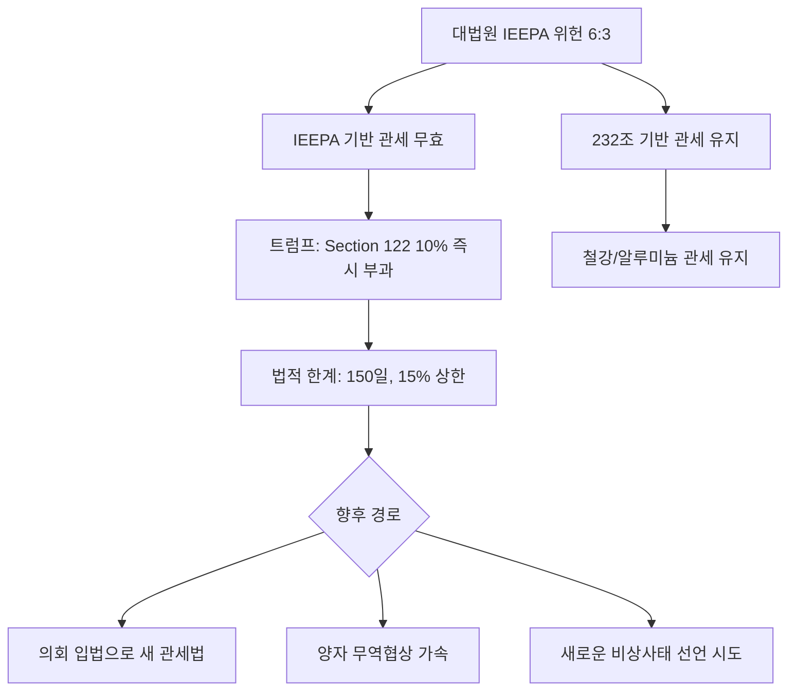

> **관련 글**: [2026년 투자 섹터 전망 (전체)](/knowledge/invest/2026/01/20/investment-sectors-outlook-2026.html)

2026년 2월 21일, 시장의 최대 변곡점은 **미국 대법원 IEEPA 상호관세 위헌 판결**(6:3)과 **Q4 GDP 1.4%**(예상 2.3% 대폭 하회) + **Core PCE 3.0%**(인플레 재가속)입니다. 대법원 판결로 중국 34~145%, 기타국 10% 기본관세 등 IEEPA 기반 상호관세가 무효화되었으나, 트럼프는 즉시 **Section 122(무역법) 기반 10% 보편관세**를 부과하며 관세 재편이 진행 중입니다. 경제 데이터는 **성장 급둔화(GDP 1.4%) + 인플레 재가속(Core PCE 3.0%)**이라는 **스태그플레이션 신호**를 보내고 있어, 연준 금리 인하 기대가 후퇴하고 있습니다. 금 **$5,107 사상최고 재경신**, KOSPI **5,809 사상최고 연속 경신** 속에, **이란 공습 2/22-23 가능성**(CNN)이 주말 리스크로 대두되고 있습니다.

## 시장 현황 (2026년 2월 21일 기준)

### 글로벌 증시

| 지수 | 수준 | 변동 |
|------|------|------|
| S&P 500 | **6,910** | +0.69% |
| Nasdaq | **22,886** | +0.90% |
| Dow Jones | **49,626** | +0.47% |
| KOSPI | **5,809** | +2.31% (사상최고 연속 경신) |
| Nikkei 225 | **58,000+** | 사상최고 ('다카이치 트레이드') |

### 핵심 매크로 지표

| 항목 | 현황 | 방향 |
|------|------|------|
| 미국 Q4 GDP | **1.4%** (2/20 발표) | **예상 2.3% 대폭 하회**, Q3 4.4%에서 급락 |
| Core PCE | **3.0%** | **2025년 4월 이후 최고**, 예상 2.9% 상회 |
| 미국 CPI | **2.4%** | 2025년 5월 이후 최저 |
| Core CPI | **2.5%** | 2021년 4월 이후 최저 |
| 미국 기준금리 | **3.50~3.75%** | FOMC 동결, **인하 기대 후퇴** |
| 원/달러 환율 | **1,450원** | |
| 금(Gold) | **$5,107/oz** | **사상최고 재경신** |
| 비트코인 | **$67,200** | 하락 지속 |
| 은(Silver) | **~$78-82/oz** | |
| 유가(브렌트) | **$70** | 이란 긴장 |
| 유가(WTI) | **$66.3** | |
| 한은 기준금리 | **2.50%** | 5회 연속 동결 |
| KOSPI | **5,809** | 사상최고 연속 경신 |

### 지정학 리스크

| 항목 | 현황 | 긴급도 |
|------|------|--------|
| **이란-미국** | **2/22-23 공습 가능성 (CNN)**, 2003년 이후 최대 병력 집결 | **최고** |
| 러시아-우크라이나 | 평화 협상 결렬 | 높음 |

---

## ★ 대법원 IEEPA 상호관세 위헌 판결 (2/20): 관세 체제 대전환

### 판결 핵심

미국 대법원이 2월 20일 **IEEPA(국제경제비상대권법) 기반 상호관세를 6:3으로 위헌** 판결했습니다. 로버츠 대법원장은 **"IEEPA에는 관세(tariff)나 관세(duty)에 대한 언급이 없다"**고 명시했습니다.

| 항목 | 내용 |
|------|------|
| 판결 결과 | **위헌 6:3** |
| 핵심 판시 | "IEEPA에는 tariff/duty에 대한 언급이 없다" |
| 징수된 관세 | **$1,600억+** → 환급 소송 예상 |

### 무효화된 관세 vs 유지되는 관세

| 구분 | 근거법 | 상태 |
|------|--------|------|
| 중국 34~145% (IEEPA 기반) | IEEPA | **위헌 → 무효** |
| 인도/브라질 50% | IEEPA | **위헌 → 무효** |
| 기타국 10% 기본관세 | IEEPA | **위헌 → 무효** |
| 철강/알루미늄 관세 | **무역확장법 232조** | **유지** |
| 캐나다/멕시코 펜타닐 관세 | IEEPA (마약 비상사태) | **별도 소송 진행 중** |

### 트럼프 즉각 대응: Section 122 보편관세

트럼프는 판결 직후 **Section 122(무역법)** 기반 **10% 보편관세**를 즉시 부과 선언했습니다.

| 항목 | 내용 |
|------|------|
| 근거법 | **무역법 Section 122** |
| 세율 | **10% 보편관세** |
| 법적 제한 | Section 122는 **최대 150일, 최대 15%** — 항구적 관세가 아님 |
| 의미 | 시간 벌기 성격, 의회 입법 또는 새로운 법적 근거 필요 |

### 실효 관세율 변동

| 시점 | 실효 관세율 | 비고 |
|------|-----------|------|
| IEEPA 관세 피크 | **27%** | 최대 위협 구간 |
| 판결 직전 | **13.5%** | 양자 협상 효과 |
| **판결 후 (현재)** | **변동 중** | IEEPA 관세 무효 + Section 122 10% 대체 → 재산정 중 |

### 주요국 관세 현황 (판결 후)

| 국가 | IEEPA 관세 (위헌) | 232조/기타 (유지) | Section 122 (신규) | 실질 상황 |
|------|-------------------|-------------------|-------------------|----------|
| **중국** | 34~145% → **무효** | 232조 철강/알루미늄 유지 | **10%** | 대폭 감소, 변동 모니터링 |
| **한국** | 25% → **IEEPA 기반 부분 위헌** | 232조 유지 | **10%** | 실질 관세율 변동 모니터링 |
| **EU** | 20% → **무효** | 232조 유지 | **10%** | |
| **일본** | 24% → **무효** | 232조 유지 | **10%** | |
| **인도** | 50% → **무효** | - | **10%** | 18%→10%로 오히려 하락 |

### 왜 이것이 게임체인저인가

| 포인트 | 설명 |
|--------|------|
| **행정부 관세 권한 제약** | 대통령이 IEEPA로 일방적 관세 부과 불가 → 의회 승인 필요 |
| **$1,600억+ 환급 소송** | 기업들의 대규모 환급 청구 예상 → 재정 부담 |
| **Section 122 한계** | 150일 한정, 15% 상한 → 항구적 고율 관세 불가 |
| **관세 불확실성은 지속** | 트럼프가 새로운 법적 경로를 모색할 것 — 시장 변동성 |
| **긍정적 측면** | 실효 관세율 대폭 하락 가능 → 글로벌 무역 환경 개선 |

> **투자 시사점**: IEEPA 위헌 판결은 트럼프 관세 정책의 **법적 기반을 근본적으로 흔든 판결**입니다. 단기적으로 Section 122 10%로 대체되었지만, 150일·15% 상한이라는 법적 제약이 있어 **항구적 고율 관세의 위협이 크게 감소**했습니다. 관세 피해 과매도 종목(수출주, 중국 노출 기업)에서 반등 기회가 생겼으나, 트럼프의 후속 대응에 따른 변동성에 대비해야 합니다.

---

## ★ Q4 GDP 1.4% + Core PCE 3.0%: 스태그플레이션 우려

### Q4 GDP 1.4% (2/20 발표)

| 항목 | 수치 | 비고 |
|------|------|------|
| **Q4 GDP** | **1.4%** | 예상 2.3% **대폭 하회** |
| Q3 GDP | 4.4% | Q3→Q4 급락 |
| 정부 셧다운 영향 | **약 -1.0%p** | 셧다운 제외 시 ~2.4% |
| 수출 | **-0.9%** | Q3 +9.6%에서 급감 |

### Core PCE 3.0% (인플레 재가속)

| 항목 | 수치 | 비고 |
|------|------|------|
| **Core PCE** | **3.0%** | **2025년 4월 이후 최고** |
| 예상치 | 2.9% | 예상도 상회 |
| 이전 | CPI 2.4%, Core CPI 2.5% | PCE와 CPI의 괴리 확대 |

### 스태그플레이션 신호

| 지표 | 신호 | 의미 |
|------|------|------|
| GDP **1.4%** (급락) | 성장 둔화 | 경기 약화 |
| Core PCE **3.0%** (재가속) | 인플레 재상승 | 물가 불안 |
| 수출 **-0.9%** | 교역 둔화 | 관세 부작용 가시화 |
| **조합** | **성장 둔화 + 인플레 재가속** | **스태그플레이션 초기 신호** |

### 연준 금리 인하 전망 변화

| 항목 | 변화 |
|------|------|
| 판결 전 전망 | CPI 2.4%, Core CPI 2.5% 4년 최저 → 6월 인하 재개 기대 |
| **판결 후 전망** | Core PCE 3.0% + GDP 1.4% → **인하 딜레마** (물가 재상승이면 인하 불가) |
| 시장 반영 | **금리 인하 기대 후퇴**, 6월 인하도 불확실 |

> **투자 시사점**: GDP 1.4%와 Core PCE 3.0%의 조합은 **스태그플레이션 초기 신호**입니다. 정부 셧다운 효과(-1.0%p)를 제외하면 성장률은 ~2.4%이나, Core PCE 3.0%는 연준의 인하 재개를 어렵게 만듭니다. **금리 민감 자산(장기채, 리츠)에 대한 기대를 하향 조정**하고, 인플레 헤지 자산(금, 원자재)의 비중을 유지/확대하는 것이 합리적입니다.

---

## ★ 이란-미국 긴장 최고조: 주말 공습 가능성

### 현황

| 항목 | 내용 |
|------|------|
| **공습 가능성** | **2/22-23 (CNN 보도)** |
| 병력 집결 | **2003년 이후 최대** |
| 트럼프 최후통첩 | **10-15일 기한** |
| 이란 대응 | **UN 안보리 서한 발송** |
| 유가 반응 | 브렌트 $70, WTI $66.3 |
| 금 반응 | $5,107 사상최고 재경신 |

### 시나리오별 영향

| 시나리오 | 유가 | 금 | 증시 |
|---------|------|-----|------|
| **공습 실행** | $80-90+ 급등 | $5,200+ | 단기 급락 |
| **외교적 해결** | $65 하락 | 소폭 조정 | 반등 |
| **긴장 지속** | $70-75 유지 | 고공행진 | 변동성 확대 |

> **투자 시사점**: **2/22-23 주말 공습 가능성은 현 시점에서 가장 긴급한 리스크**입니다. 금요일 포지션 관리가 중요하며, 방산·에너지 헤지와 귀금속 비중이 리스크 완화에 유효합니다. 공습 실행 시 유가 급등($80+)과 증시 단기 급락이 예상되나, 과거 이란-미국 긴장 사례에서 시장은 비교적 빠르게 회복했습니다.

---

## ★ 금 $5,107 사상최고 재경신: 구조적 강세 지속

### 금 가격 현황

| 항목 | 내용 |
|------|------|
| 현재 가격 | **$5,107/oz** (사상최고 재경신) |
| UBS 전망 | **$6,200** |
| Goldman Sachs 전망 | **$5,400** |
| 상승 동인 | 이란 긴장, IEEPA 판결 불확실성, 스태그플레이션 우려, 중앙은행 매입 |

### 금 강세 구조적 배경

| 요인 | 설명 |
|------|------|
| **스태그플레이션 우려** | GDP 1.4% + Core PCE 3.0% → 전통적 금 강세 환경 |
| **이란 공습 임박** | 2/22-23 가능성 → 안전자산 수요 극대화 |
| **관세 체제 불확실성** | IEEPA 위헌 → Section 122 대체 → 후속 조치 불투명 |
| **중앙은행 매입 지속** | 글로벌 중앙은행의 달러 대안 자산 매입 |
| **금리 인하 불확실** | Core PCE 3.0%로 인하 지연 → 그러나 장기 인하 방향 유지 |

> **투자 시사점**: $5,107 사상최고는 **스태그플레이션 우려 + 이란 긴장 + 관세 불확실성**이 복합 작용한 결과입니다. UBS $6,200, GS $5,400 전망 대비 여전히 상승 여력이 있으며, 구조적 강세 환경이 유지되고 있습니다.

---

## 환율 동향: USD/KRW 1,450원 + 한은 동결

### 원/달러 1,450원

| 항목 | 수치/내용 |
|------|----------|
| 원/달러 환율 | **1,450원** |
| 한은 기준금리 | **2.50%** (5회 연속 동결) |
| 한국 2026 GDP 전망 | **1.8%** (수출 강세로 상향) |
| WGBI 편입 | **4월 시작** — 비중 2.05%, 8회 분할 편입 |

### 환율 안정/강세 요인

| 요인 | 설명 |
|------|------|
| **WGBI 4월 편입** | 추종 글로벌 자금 약 3.5조 달러, 약 60조원 유입 예상 |
| **IEEPA 위헌 판결** | 한국 관세 부담 경감 가능 → 수출 기대 개선 |
| **KOSPI 사상최고** | 5,809 연속 경신 → 외국인 자금 유입 |
| **HBM4 수출** | 삼성전자 AI 반도체 수출 확대 |

### 잔존 리스크

| 리스크 요인 | 설명 |
|------------|------|
| 이란 공습 시 달러 강세 | 안전자산 선호 → 원화 약세 압력 |
| 스태그플레이션 우려 | 미국 경기 둔화 → 한국 수출 영향 |
| 한은 동결 지속 | 경기 부양 여력 제한 |

> **투자 시사점**: 환율 1,450원에서 **WGBI 4월 편입**이 핵심 안정 촉매입니다. IEEPA 위헌 판결로 한국 관세 부담이 경감되면 수출 개선 → 원화 강세 요인이 됩니다. 다만 이란 공습 리스크는 단기 원화 약세 압력입니다.

---

## KOSPI 5,809 사상최고 연속 경신

### 한국 증시

| 지표 | 수준 | 비고 |
|------|------|------|
| KOSPI | **5,809** | +2.31%, 사상최고 연속 경신 |
| 삼성전자 HBM4 | 출하 개시 (2/12) | AI 반도체 경쟁력 |
| 개인 예수금 | **111조원** | 역대 최고 수준 |
| 한국 2026 GDP | **1.8%** | 수출 강세 반영 |

### KOSPI 상승 동력

| 요인 | 설명 |
|------|------|
| **IEEPA 위헌 수혜** | 한국 관세 부담 경감 기대 → 수출주 반등 |
| **반도체 강세** | HBM4 출하, AI 수요 지속 |
| **WGBI 편입 기대** | 4월 편입 → 외국인 자금 유입 대기 |
| **밸류업 정책** | 자사주 소각, 배당 확대 지속 |
| **부동산→주식 자금 이동** | 예수금 111조원 |

---

## 연준 금리와 인플레이션: 인하 기대 후퇴

### 금리 전망 변화

| 시점 | 전망 | 근거 |
|------|------|------|
| 2월 초 | 6월 인하 재개 기대 | CPI 2.4%, Core CPI 2.5% (4년 최저) |
| **2/20 이후** | **인하 기대 후퇴** | **Core PCE 3.0%** (인플레 재가속) |
| 현 전망 | **최소 하반기까지 동결 가능** | 스태그플레이션 딜레마 |

### 연준의 딜레마

| 시나리오 | 조건 | 연준 대응 |
|---------|------|----------|
| **인하** | GDP 약화 지속, 인플레 안정 | 하반기 인하 재개 |
| **동결 장기화** | 인플레 재가속 + 성장 둔화 | 스태그플레이션 대응 — 동결 유지 |
| **인상 (극단)** | 인플레 3%+ 고착 | 가능성 낮으나 배제 불가 |

> **투자 시사점**: Core PCE 3.0%가 CPI 2.4%/Core CPI 2.5%와 괴리를 보이며, **연준 인하 기대가 크게 후퇴**했습니다. 기존의 "6월 인하 재개 → 채권·리츠 유리" 전략에 **리스크가 커졌으며**, 인플레 헤지(금, 원자재)와 현금 비중 유지가 중요해졌습니다.

---

## 관세 체제 재편 전망

### IEEPA 위헌 후 관세 경로



### 양자 무역협상 타결 현황

| 날짜 | 국가 | 내용 | 관세 변화 |
|------|------|------|----------|
| 2/2 | **인도** | 역사적 무역 합의 | 25%→18%, 완전 철폐 예고 |
| 2/5 | **아르헨티나** | 상호무역협정 | 양자 관세 인하 |
| 2/9 | **방글라데시** | 상호무역협정 | 20%→19% |
| 2/19 | **캐나다 관세 폐지안** | 미 하원 219-211 가결 | 폐지 방향 |
| **2/20** | **IEEPA 위헌 판결** | 대법원 6:3 | IEEPA 관세 전면 무효 |

> **투자 시사점**: IEEPA 위헌으로 관세 체제가 근본적으로 재편되고 있습니다. Section 122의 150일·15% 한계는 **트럼프가 항구적 고율 관세를 유지하기 어렵다는 의미**이며, 양자 협상 가속화와 의회 입법 과정에서 관세 수준이 추가 하락할 가능성이 높습니다. 수출 기업에 긍정적이나, 과도기적 불확실성에 대비해야 합니다.

---

## 주요 구조적 테마

### 1. 다카이치 총선 압승 + 닛케이 58,000 ('다카이치 트레이드')

다카이치 총리의 압승(자민당 316석, 연립 352석)으로 아베노믹스 2.0이 본격화되고 있습니다. 식료품 소비세 면제, 재정 확장, 금리 인상 억제가 핵심이며, **엔캐리 트레이드 재개**로 글로벌 유동성을 공급하고 있습니다.

### 2. WGBI 4월 편입: 최대 구조적 호재

| 항목 | 내용 |
|------|------|
| 편입 시작 | **2026년 4월** |
| 비중 | **2.05%** (9위 규모) |
| 편입 방식 | 8개월 × 8회 균등 분할 (4~11월) |
| 추종 자금 | 약 **3.5조 달러** |
| 예상 유입 | 약 **60조원** |
| 효과 | 외국인 채권 매수 → 원화 수요 → **환율 안정 핵심** |

### 3. 삼성전자 HBM4 출하 (2/12)

삼성전자의 HBM4 출하 개시는 한국 AI 반도체 경쟁력을 재확인한 이벤트입니다. SK하이닉스와 함께 글로벌 HBM 양강 구도를 공고히 하며, KOSPI 상승 동력으로 작용하고 있습니다.

### 4. 한국 밸류업: 1980년대 일본 비유

| 항목 | 1980년대 일본 | 2026년 한국 |
|------|---------------|-------------|
| 미국 대통령 | 레이건 (보호무역) | 트럼프 (관세→양자협상) |
| 역할 | 미국의 핵심 제조업 파트너 | 미국의 대중국 제조업 파트너 |
| 밸류에이션 | 저평가→급격한 재평가 | 코리아 디스카운트→밸류업 |
| 핵심 산업 | 자동차, 전자 | 반도체(HBM4), AI, 배터리 |

### 5. 강세장 섹터 순환: 아직 미완성

| 순서 | 유형 | 상태 |
|------|------|------|
| 1 | 선도 섹터 (반도체, AI) | 이미 상승 |
| 2 | 대형 가치주 (금융, 통신) | 진행 중 |
| 3 | **국민주 (네이버, 카카오)** | **미개시** |
| 4 | **경기순환주 (화학, 철강, 건설)** | **미개시** |
| 5 | 소형주·테마주 | 마지막 단계 |

### 6. 부동산→주식 자금 대이동

개인 예수금 **111조원**(역대 최고)은 부동산에서 이탈한 자금 유입을 반영합니다. 6월 지방선거 이후 규제 강화 시 자금 이탈이 더 가속될 수 있습니다.

---

## 투자 전략

### 현 국면 진단: "스태그플레이션 초기 신호 + IEEPA 위헌 + 이란 공습 임박"

글로벌 시장은 **GDP 1.4%(성장 급둔화) + Core PCE 3.0%(인플레 재가속)**이라는 스태그플레이션 신호, **IEEPA 위헌 판결로 인한 관세 체제 대전환**, **이란 공습 2/22-23 가능성**이라는 3중 불확실성 속에 있습니다. 그러나 KOSPI 5,809 사상최고, 금 $5,107 사상최고, IEEPA 위헌에 따른 관세 부담 경감 가능성은 긍정적 측면입니다.

### 단기 전략 (2월~3월)

| 우선순위 | 전략 | 근거 |
|---------|------|------|
| 1 | **주말 리스크 관리** | 이란 공습 2/22-23 가능성 — 금요일 포지션 경량화 또는 헤지 필수 |
| 2 | **귀금속 비중 유지/확대** | 금 $5,107 사상최고, 스태그플레이션 우려 + 이란 긴장 → 구조적 강세 |
| 3 | **IEEPA 위헌 수혜주 선별** | 관세 과매도 수출주, 대중국 노출 기업 반등 기회 |
| 4 | **금리 인하 기대 하향 조정** | Core PCE 3.0% → 장기채·리츠 비중 축소 검토 |
| 5 | **스태그플레이션 헤지** | 금, 원자재, 에너지 — 전통적 스태그플레이션 수혜 자산 |

### 중기 전략 (4~6월)

| 우선순위 | 전략 | 근거 |
|---------|------|------|
| 1 | **WGBI 편입 수혜 포지션** | 4월 편입(2.05%, 8회 분할) — 60조원 유입 + 환율 안정 |
| 2 | **관세 재편 모니터링** | Section 122 150일 한계 → 양자 협상 가속 기대 |
| 3 | **밸류업 수혜주** | 자사주 소각, 고배당 기업 |
| 4 | **섹터 순환 선제 매수** | 국민주, 경기순환주 — 아직 미개시 |
| 5 | **6월 지방선거 후 부동산 규제 변화** | 규제 강화 → 부동산 자금 이탈 가속 |

### 장기 전략 (연간)

| 우선순위 | 전략 | 근거 |
|---------|------|------|
| 1 | **장기 보유 원칙** | 코스피 75.6% 상승에도 42% 손실 — 단기 매매의 함정 |
| 2 | **밸류업 구조적 수혜주** | 1980년대 일본 비유 — 한국 밸류에이션 재평가 |
| 3 | **엔캐리 유동성 수혜** | 다카이치 아베노믹스 2.0 → 글로벌 유동성 공급 |

### 포트폴리오 배분 제안 (스태그플레이션 대비 조정)

```
귀금속·원자재: 18% (↑3%)
├── 금 ETF/실물: 10%
├── 은 ETF/실물: 5%
└── 에너지 (유가 헤지): 3%

금리 인하 수혜: 12% (↓8%) — Core PCE 3.0%로 인하 지연 반영
├── 장기채 ETF: 5%
├── 리츠(REITs): 3%
└── 바이오/성장주: 4%

섹터 순환·수출주: 22% (↑2%) — IEEPA 위헌 수혜 반영
├── 관세 과매도 수출주: 8%
├── 국민주 (네이버, 카카오): 6%
├── 경기순환주 (화학, 철강, 건설): 5%
└── 코스닥 저평가주: 3%

밸류업·배당: 18%
├── 고배당 ETF (커버드콜 포함): 8%
├── 자사주 소각 기업: 5%
└── 배당성장주: 5%

반도체·AI: 12%
├── 삼성전자/SK하이닉스: 8%
└── HBM 후공정 장비·소재: 4%

현금/단기채: 18% (↑3%) — 변동성 대비
├── 현금: 10%
└── 단기국채 ETF: 8%
```

## 월별 체크포인트

| 월 | 이벤트 | 투자 시사점 |
|----|--------|------------|
| **2/20** | **Q4 GDP 1.4% 발표 (완료)** | 스태그플레이션 우려 대두 |
| **2/20** | **대법원 IEEPA 위헌 6:3 (완료)** | 관세 체제 대전환, 수출주 수혜 |
| **2/22-23** | **이란 공습 가능성** | 주말 리스크 — 포지션 관리 필수 |
| 2월 | 금 $5,107 사상최고 재경신 | 귀금속 비중 확대 |
| 2월 | KOSPI 5,809 사상최고 | 밸류업 모멘텀 지속 |
| 3월 | 연준 FOMC | Core PCE 3.0% 반영한 스탠스 확인 |
| 3월 | Section 122 관세 후속 동향 | 의회 입법 vs 추가 행정명령 |
| **4월** | **WGBI 인덱스 편입 시작** | 외국인 수급 개선 + 환율 안정 최대 촉매 |
| 5월 | STO 제도 구체화 | 코스닥 신규 자금 유입 기대 |
| 6월 | 거래시간 연장 + 지방선거 | 유동성 확대 / 부동산 규제 강화 |
| 7월 | Section 122 150일 만료 시점 | 관세 재편 핵심 분기점 |
| 4~11월 | WGBI 8회 분할 편입 진행 | 매달 균등 편입 → 지속적 외국인 매수 |
| 11월 | 미-중 관세 휴전 만료 | 재협상/연장 여부 핵심 변수 |

## 리스크 요인 정리

| 리스크 | 심각도 | 확률 | 대응 |
|--------|--------|------|------|
| **이란 공습 (2/22-23)** | **최고** | **높음** | 주말 포지션 관리, 방산/에너지 헤지, 귀금속 |
| **스태그플레이션** | **높음↑** | **중간** | 금/원자재 비중 확대, 금리 인하 수혜 축소 |
| **IEEPA 후속 불확실성** | **높음** | **높음** | Section 122 한계(150일), 의회 입법 모니터링 |
| **Core PCE 재가속** | **높음↑** | **높음** | 인플레 헤지, 금리 민감 자산 비중 축소 |
| 환율 변동 (1,450원) | 중간 | 중간 | WGBI(4월) 안정 기대, 이란 공습 시 약세 |
| 러-우 협상 결렬 | 높음 | 높음 | 유럽 노출 점검, 에너지 헤지 |
| 비트코인 약세 | 중간 | 중간 | $67,200 하락 지속, 지지선 $66,500 |
| 부동산 경착륙 | 중간 | 중간↑ | 6월 이후 규제 강화 → 자금 이탈 가속 |
| BOJ ETF 매각 | 중간 | 중간 | 일본 주식 수급 부담 |

## 정리

| 항목 | 내용 |
|------|------|
| **대법원 IEEPA 위헌** | **6:3 판결** — IEEPA 기반 상호관세 전면 무효, Section 122 10% 대체 (150일 한정) |
| **Q4 GDP** | **1.4%** (예상 2.3% 대폭 하회, Q3 4.4%에서 급락) |
| **Core PCE** | **3.0%** (2025년 4월 이후 최고, 예상 2.9% 상회) |
| **스태그플레이션** | GDP 둔화 + 인플레 재가속 → 초기 신호 |
| 금(Gold) | **$5,107/oz 사상최고 재경신** (UBS $6,200, GS $5,400 전망) |
| KOSPI | **5,809 사상최고 연속 경신** (+2.31%) |
| 이란 공습 | **2/22-23 가능성** (CNN), 2003년 이후 최대 병력 |
| 연준 금리 | **3.50-3.75% 동결**, 인하 기대 후퇴 |
| 원/달러 | **1,450원** |
| 비트코인 | **$67,200** (하락 지속) |
| 유가 | 브렌트 **$70**, WTI **$66.3** |
| WGBI | **4월 편입 시작** — 2.05%, 8회 분할, 3.5조 달러 추종 |

**핵심 투자 원칙:**
1. **스태그플레이션 대비가 최우선** — GDP 1.4% + Core PCE 3.0% 조합은 금리 인하 기대를 후퇴시키고, 금/원자재 등 인플레 헤지 자산의 비중 확대를 정당화
2. **IEEPA 위헌은 중장기 긍정** — 항구적 고율 관세 불가(Section 122 150일 한정), 수출주 반등 기회
3. **이란 주말 공습 리스크 관리 필수** — 2/22-23 가능성, 금요일 포지션 관리와 헤지 필수
4. **금 $5,107 구조적 강세 유지** — 스태그플레이션 + 이란 + 관세 불확실성 → UBS $6,200까지 상승 여력
5. **WGBI 4월 편입 = 최대 구조적 호재** — 60조원 유입 + 환율 안정, KOSPI 5,809 지지
6. **장기 보유가 수익률의 핵심** — 코스피 75.6% 상승에도 42% 손실. 이벤트에 흔들리지 않는 장기 관점 유지

**투자 결정은 본인의 리스크 허용 범위와 투자 기간을 고려하여 신중하게 내리시기 바랍니다.**
