> **관련 글**: [2026년 투자 섹터 전망 (전체)](/knowledge/invest/2026/01/20/investment-sectors-outlook-2026.html)

2026년 3월 21일(금) 기준 업데이트입니다. **이번 주는 거시경제 전반에 걸쳐 대규모 변화가 발생**했습니다.

**FOMC가 3.50-3.75%로 동결**(11:1, Miran 반대)하면서 PCE 인플레 전망을 **2.7%로 상향**(12월 2.5% 대비)했고, 중립금리를 **3.1%로 인상**했습니다. Dot plot 기준 올해 1회 인하, 2027년 1회 인하이나, **19명 중 7명이 올해 인하 없음**을 전망하며 매파적 신호가 강화되었습니다. CME 시장에서는 **금리 인상 확률이 2% 등장**했고, 10월까지 **인상 확률 50%**라는 극단적 가격이 형성 중입니다.

**금이 $4,492로 폭락**(주간 -10.05%)하며, 피크 $5,400에서 -17% 급락했습니다. 전쟁이 격화되는데 금이 하락하는 **"지정학 역설(Geopolitical Paradox)"** — 에너지 인플레 → 매파적 연준 → 고금리가 무이자 자산인 금을 압살하는 구조입니다.

**원/달러가 1,500 심리선을 돌파**했으며, 1-2월 외국인 자본유출 ~20조원(역대 월간 최고), 한미 금리차 125bp가 구조적 원화 약세를 가속하고 있습니다. 한국은 **금리 인상(가계부채 1,900조 폭탄) vs 동결(자본유출 가속)**이라는 최악의 딜레마에 직면했습니다.

## 시장 현황 (2026년 3월 21일 기준)

### 핵심 매크로 지표

| 항목 | 현황 | 변동/방향 |
|------|------|-----------|
| **★ FOMC** | **3.50-3.75% 동결** | **11:1 (Miran -25bp 반대), "mildly restrictive" 유지** |
| **★ PCE 인플레 전망** | **2.7%** | **2.5% → 2.7% 상향 (12월 대비)** |
| **★ GDP 전망** | **2.4%** | **소폭 상향** |
| **★ Dot Plot** | **올해 1회, 2027년 1회** | **7/19명 올해 인하 없음 (전회 6명)** |
| **★ 중립금리** | **3.1%** | **3.0% → 3.1% 상향** |
| **★ CME 확률** | **동결 53%+, 인하 40%, 인상 2%** | **인상 확률 첫 등장** |
| **10월 인상 확률** | **50%** | **시장 가격 기준 — 극단적** |
| **실업률** | **4.4%** | **+0.1%p** — 노동시장 약화 지속 |
| **NFP (비농업 고용)** | **-92K** | 감소 지속 |
| **Initial Claims** | **205K** | **-8K** — 소폭 개선 |
| **PPI** | **+0.7%** | **예상 +0.3% 대폭 상회 — 인플레 쇼크** |
| **10Y 국채** | **4.25%** | **상승** |
| **2Y 국채** | **3.79%** | |
| **10Y-2Y 스프레드** | **0.51%** | **+0.05 확대 — 스티프닝** |
| **5Y Breakeven** | **2.63%** | **+0.02 — 인플레 기대 상승** |
| **HY Spread** | **3.27%** | **+0.07 확대 — 신용 리스크 상승** |
| **VIX** | **24.06** | **-4.1% (전일 25.09 대비)** |

### 자산가격

| 항목 | 현황 | 변동 |
|------|------|------|
| **★ S&P 500** | **6,606** | **-1.5% (금)** — 조정 영역 접근 |
| **★ NASDAQ** | **22,091** | **-1.8%** — 기술주 약세 심화 |
| **★ Dow** | | **-750pt (수)** — 대형주 급락 |
| **★ 금(Gold)** | **$4,492/oz** | **-2.36% (일), -10.05% (주간)** — 폭락 |
| **비트코인** | **$70,698** | **+1.12%** — 소폭 반등 |

### 금 폭락 상세: "지정학 역설(Geopolitical Paradox)"

| 항목 | 내용 |
|------|------|
| **현재 가격** | **$4,492/oz (-2.36% 일간)** |
| **주간 변동** | **-10.05%** |
| **피크 → 현재** | **$5,400 → $5,000 붕괴 → $4,492** |
| **하락폭** | **피크 대비 -17%** |
| **리스크 프리미엄** | **추정 5~10%** |

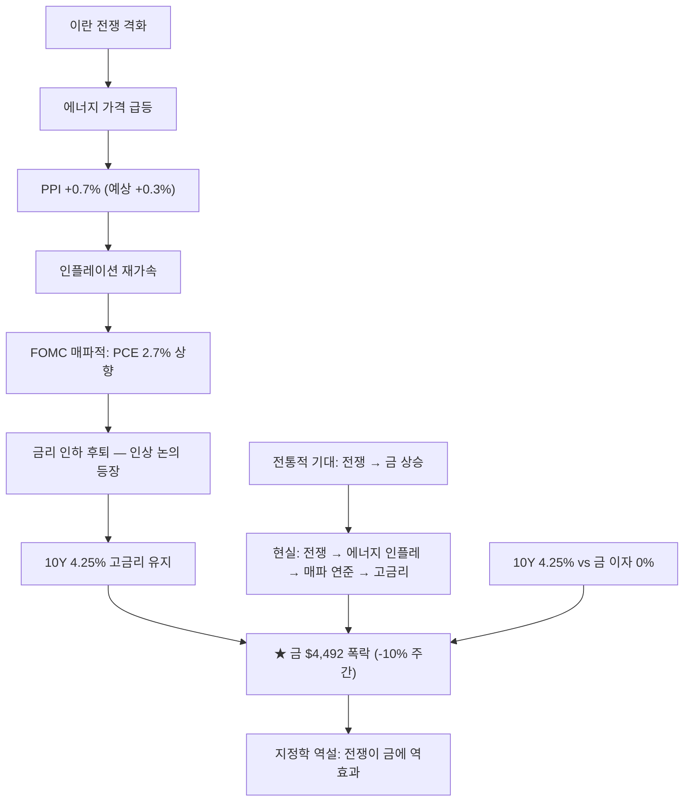
```mermaid
graph TD
    A["이란 전쟁 격화"] --> B["에너지 가격 급등"]
    B --> C["PPI +0.7% #40;예상 +0.3%#41;"]
    C --> D["인플레이션 재가속"]
    D --> E["FOMC 매파적: PCE 2.7% 상향"]
    E --> F["금리 인하 후퇴 — 인상 논의 등장"]
    F --> G["10Y 4.25% 고금리 유지"]
    G --> H["★ 금 $4,492 폭락 #40;-10% 주간#41;"]
    I["전통적 기대: 전쟁 → 금 상승"] --> J["현실: 전쟁 → 에너지 인플레 → 매파 연준 → 고금리"]
    J --> H
    H --> K["지정학 역설: 전쟁이 금에 역효과"]
    L["10Y 4.25% vs 금 이자 0%"] --> H
```

> **투자 시사점**: "전쟁이면 금이 오른다"는 공식이 깨졌습니다. **에너지 인플레 → 매파적 연준 → 고금리 유지**라는 경로가 무이자 자산인 금을 압살. 10Y 4.25%의 실질 수익률 대비 금의 기회비용이 너무 큼. **리스크 프리미엄 5~10%가 제거되면 추가 하락 여지**. 다만 중앙은행 매입이라는 구조적 수요는 유지.

---

## ★ FOMC 상세: 매파적 동결, 인플레 경고 강화

### FOMC 결정 요약

| 항목 | 내용 |
|------|------|
| **금리** | **3.50-3.75% 동결** |
| **투표** | **11:1 (Miran -25bp 반대)** |
| **PCE 인플레 전망** | **2.7% (12월 2.5%에서 상향)** |
| **GDP 전망** | **2.4% (소폭 상향)** |
| **Dot Plot** | **올해 1회, 2027년 1회 인하** |
| **인하 없음 전망** | **7/19명 (전회 6명에서 증가)** |
| **중립금리** | **3.1% (3.0%에서 상향)** |
| **Powell 발언** | **"제한적 인플레 진전", "mildly restrictive 정책 필요"** |

### 시장 금리 기대 (CME FedWatch)

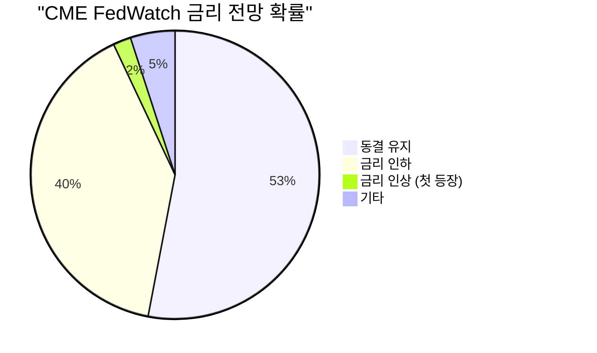
```mermaid
pie title "CME FedWatch 금리 전망 확률"
    "동결 유지" : 53
    "금리 인하" : 40
    "금리 인상 #40;첫 등장#41;" : 2
    "기타" : 5
```

| 시점 | 확률 | 의미 |
|------|------|------|
| **현재** | **동결 53%+** | 과반 이상이 동결 전망 |
| **인하** | **40%** | 여전히 인하 기대 존재 |
| **인상** | **2% 등장** | **역사적 — 인상 확률이 처음 가격에 반영** |
| **10월까지 인상** | **50%** | **시장이 연내 인상 가능성을 절반으로 봄** |

### 채권 시장 시그널

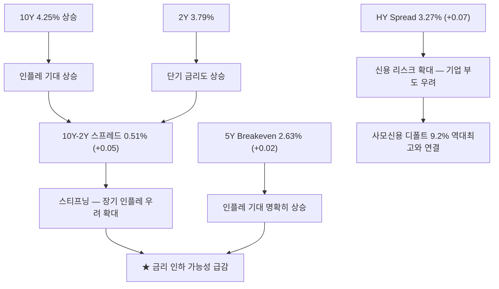
```mermaid
graph TD
    A["10Y 4.25% 상승"] --> B["인플레 기대 상승"]
    C["2Y 3.79%"] --> D["단기 금리도 상승"]
    B --> E["10Y-2Y 스프레드 0.51% #40;+0.05#41;"]
    D --> E
    E --> F["스티프닝 — 장기 인플레 우려 확대"]
    G["5Y Breakeven 2.63% #40;+0.02#41;"] --> H["인플레 기대 명확히 상승"]
    I["HY Spread 3.27% #40;+0.07#41;"] --> J["신용 리스크 확대 — 기업 부도 우려"]
    F --> K["★ 금리 인하 가능성 급감"]
    H --> K
    J --> L["사모신용 디폴트 9.2% 역대최고와 연결"]
```

### 금리 인하 전망 변화

| 시점 | 이전 전망 (3/11) | 현재 전망 (3/21) |
|------|-----------------|-----------------|
| **3월 FOMC** | 동결 | **동결 확정 (11:1)** |
| **올해 인하** | 추가 1회 (6~9월) | **1회이나 7/19명 인하 없음** |
| **인상 가능성** | 논의 없음 | **CME 2% 등장, 10월 50%** |
| **중립금리** | 3.0% | **3.1% 상향** |
| **PCE 전망** | 2.5% | **2.7% 상향** |
| **Powell 스탠스** | 중립적 | **"mildly restrictive" 필요** |

> **투자 시사점**: FOMC가 **인플레 전망을 상향(2.5→2.7%)**하고 중립금리도 올리면서 **매파적 신호가 강화**되었습니다. 7/19명이 올해 인하 없음을 전망하고, CME에서 인상 확률(2%)이 처음 등장한 것은 **패러다임 전환 시그널**. Powell의 "mildly restrictive" 발언은 당분간 금리 인하가 없을 것이라는 명시적 메시지. **성장주 할인율 상승 압력 지속, 단기채(SHY) 선호**.

---

## ★ 트럼프 vs 파월 갈등: 장기 금리 리스크

| 항목 | 트럼프 | 파월 |
|------|--------|------|
| **목표** | **성장 촉진 + 달러 약세** | **물가 안정** |
| **금리 선호** | **즉시 인하** | **"mildly restrictive" 유지** |
| **근거** | 경제 활성화, 수출 경쟁력 | PPI +0.7%, PCE 2.7% 상향 |
| **리스크** | Fed 독립성 훼손 → 장기 금리 급등 | 경기침체 유발 가능 |

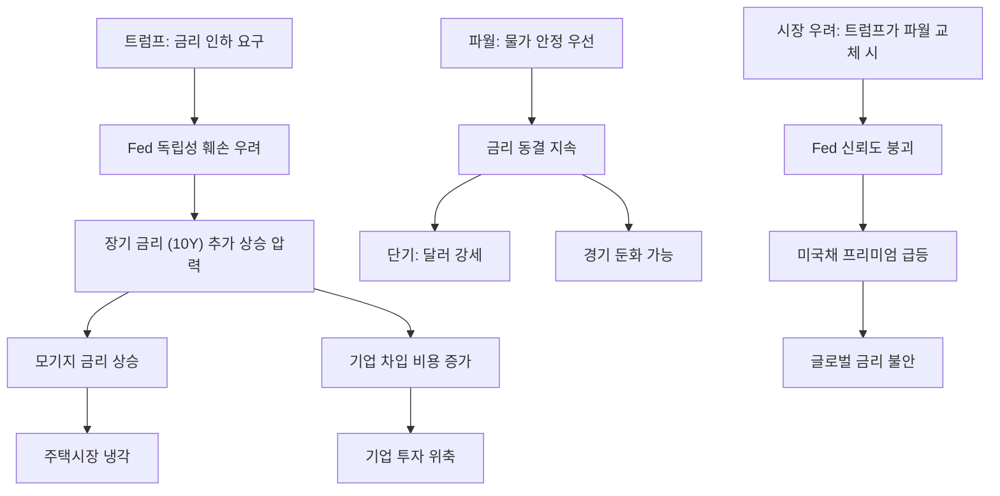
```mermaid
graph TD
    A["트럼프: 금리 인하 요구"] --> B["Fed 독립성 훼손 우려"]
    B --> C["장기 금리 #40;10Y#41; 추가 상승 압력"]
    C --> D["모기지 금리 상승"]
    C --> E["기업 차입 비용 증가"]
    D --> F["주택시장 냉각"]
    E --> G["기업 투자 위축"]
    H["파월: 물가 안정 우선"] --> I["금리 동결 지속"]
    I --> J["단기: 달러 강세"]
    I --> K["경기 둔화 가능"]
    L["시장 우려: 트럼프가 파월 교체 시"] --> M["Fed 신뢰도 붕괴"]
    M --> N["미국채 프리미엄 급등"]
    N --> O["글로벌 금리 불안"]
```

> **투자 시사점**: 트럼프의 Fed 압박이 **장기 금리의 구조적 상승 요인**으로 작용. Fed 독립성이 훼손될 경우 미국채 프리미엄이 급등하며 **장기채 보유 리스크 증가**. 이 갈등이 해소되지 않는 한 **10Y 금리 4.25%+ 고착화** 가능성.

---

## ★ 원/달러 1,500 돌파: 한국 경제 딜레마

### 핵심 데이터

| 항목 | 내용 |
|------|------|
| **현재 환율** | **1,500 심리선 장중 돌파** |
| **외환보유고** | **방어 투입 중이나 한계적** |
| **외국인 자본유출** | **1-2월 ~20조원 (역대 월간 최고)** |
| **한국 개인투자자** | **2025년 외국증권 $51B 매수** |
| **한미 금리차** | **BOK 2.50% vs Fed 3.50-3.75% = 125bp** |
| **가계부채** | **1,900조원 (GDP 대비 90%, 세계 최고)** |
| **달러 기준 아파트** | **5년간 +6% (+1.2%/년) vs 원화 기준 +45%** |

### 한국 딜레마 구조

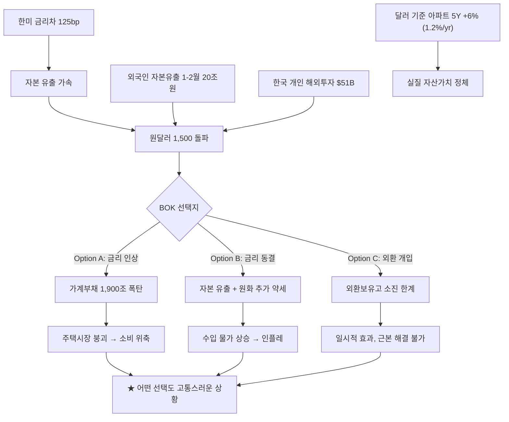
```mermaid
graph TD
    A["한미 금리차 125bp"] --> B["자본 유출 가속"]
    B --> C["원달러 1,500 돌파"]
    C --> D{"BOK 선택지"}
    D -->|"Option A: 금리 인상"| E["가계부채 1,900조 폭탄"]
    D -->|"Option B: 금리 동결"| F["자본 유출 + 원화 추가 약세"]
    D -->|"Option C: 외환 개입"| G["외환보유고 소진 한계"]
    E --> H["주택시장 붕괴 → 소비 위축"]
    F --> I["수입 물가 상승 → 인플레"]
    G --> J["일시적 효과, 근본 해결 불가"]
    H --> K["★ 어떤 선택도 고통스러운 상황"]
    I --> K
    J --> K
    L["외국인 자본유출 1-2월 20조원"] --> C
    M["한국 개인 해외투자 $51B"] --> C
    N["달러 기준 아파트 5Y +6% #40;1.2%/yr#41;"] --> O["실질 자산가치 정체"]
```

### 원화 약세의 구조적 원인

| 요인 | 내용 | 심각도 |
|------|------|--------|
| **금리차** | BOK 2.50% vs Fed 3.50-3.75% = 125bp | ★★★ |
| **자본유출** | 외국인 1-2월 20조원 유출 | ★★★ |
| **개인 해외투자** | 2025년 $51B 외국증권 매수 | ★★★ |
| **에너지 수입** | 유가 상승 → 무역수지 악화 | ★★☆ |
| **구조적** | 2014년 이후 미국 GDP > 한국 GDP | ★★☆ |
| **안정화 요인** | WGBI 4월 편입 ($56B+) | ☆☆☆ (아직 미실현) |

> **투자 시사점**: 원/달러 1,500 돌파는 **심리적 저항선 붕괴**이자 **구조적 원화 약세의 확인**. 달러 기준으로 한국 아파트가 5년간 +6%(연 1.2%)에 불과하다는 것은 **원화 자산의 실질 가치가 정체**되고 있음을 의미. **달러 자산 비중 확대가 필수적**이며, 원화 자산은 환율 리스크를 반드시 감안해야 합니다.

---

## ★ 사모신용(Private Credit) 위기 심화

| 항목 | 내용 |
|------|------|
| **디폴트율** | **9.2% — 역대 최고** |
| **HY Spread** | **3.27% (+0.07 확대)** |
| **배경** | 고금리 장기화 → 변동금리 차입 기업 압박 |
| **시스템 리스크** | 은행 대출 대비 규제 사각지대 |

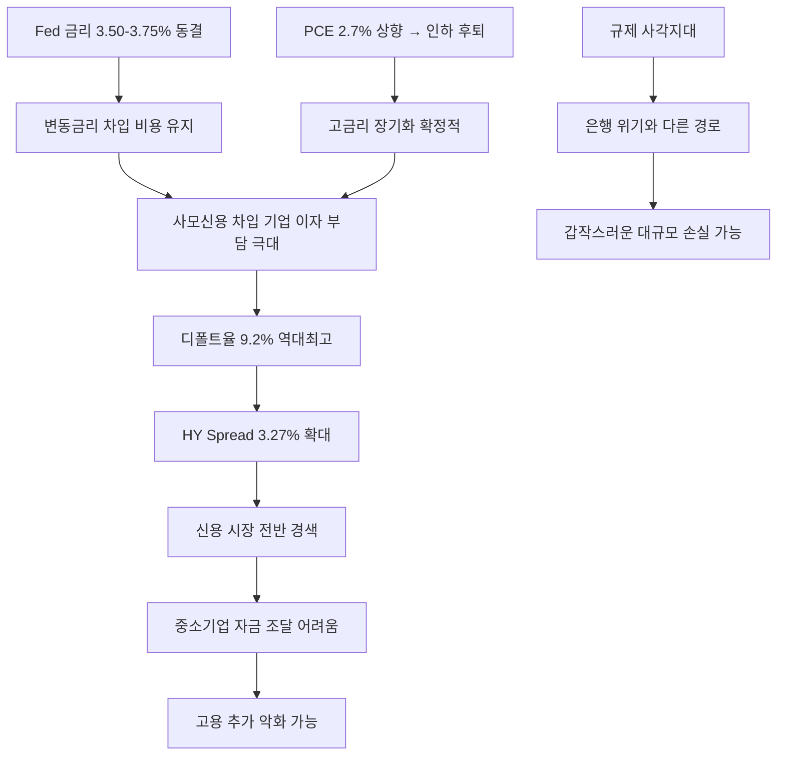
```mermaid
graph TD
    A["Fed 금리 3.50-3.75% 동결"] --> B["변동금리 차입 비용 유지"]
    B --> C["사모신용 차입 기업 이자 부담 극대"]
    C --> D["디폴트율 9.2% 역대최고"]
    D --> E["HY Spread 3.27% 확대"]
    E --> F["신용 시장 전반 경색"]
    F --> G["중소기업 자금 조달 어려움"]
    G --> H["고용 추가 악화 가능"]
    I["PCE 2.7% 상향 → 인하 후퇴"] --> J["고금리 장기화 확정적"]
    J --> C
    K["규제 사각지대"] --> L["은행 위기와 다른 경로"]
    L --> M["갑작스러운 대규모 손실 가능"]
```

> **투자 시사점**: 사모신용 디폴트 9.2%는 **고금리 장기화의 첫 번째 대형 피해자**. HY Spread 3.27% 확대는 신용 리스크가 사모신용에서 더 넓은 시장으로 전이될 수 있음을 시사. **금리 인하 후퇴가 이 위기를 더 악화**시킬 것이며, 고위험 채권/레버리지 자산 회피 필요.

---

## ★ 오일쇼크: 스태그플레이션 환경의 완전한 전환

이란 전쟁으로 인한 호르무즈 해협 봉쇄가 **글로벌 거시경제 환경을 근본적으로 변경**했습니다. 이것은 단순한 유가 상승이 아니라, 이미 취약했던 경제에 공급 충격이 겹치는 **1970년대형 오일쇼크**입니다.

### 오일쇼크 파급 경로 (3/21 업데이트)

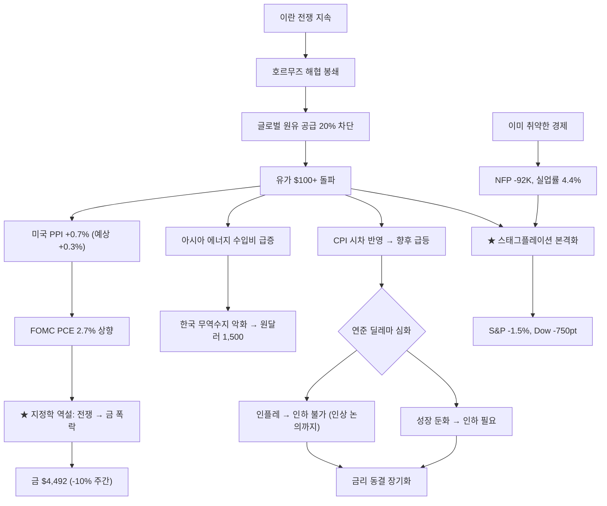
```mermaid
graph TD
    A["이란 전쟁 지속"] --> B["호르무즈 해협 봉쇄"]
    B --> C["글로벌 원유 공급 20% 차단"]
    C --> D["유가 $100+ 돌파"]
    D --> E["미국 PPI +0.7% #40;예상 +0.3%#41;"]
    D --> F["아시아 에너지 수입비 급증"]
    D --> G["CPI 시차 반영 → 향후 급등"]
    E --> H["FOMC PCE 2.7% 상향"]
    F --> I["한국 무역수지 악화 → 원달러 1,500"]
    G --> J{"연준 딜레마 심화"}
    J --> K["인플레 → 인하 불가 #40;인상 논의까지#41;"]
    J --> L["성장 둔화 → 인하 필요"]
    K --> M["금리 동결 장기화"]
    L --> M
    H --> N["★ 지정학 역설: 전쟁 → 금 폭락"]
    N --> O["금 $4,492 #40;-10% 주간#41;"]
    Q["이미 취약한 경제"] --> R["NFP -92K, 실업률 4.4%"]
    R --> S["★ 스태그플레이션 본격화"]
    D --> S
    S --> T["S&P -1.5%, Dow -750pt"]
```

### 오일쇼크의 핵심 데이터

| 항목 | 수치 | 의미 |
|------|------|------|
| **유가 (WTI 실제)** | **$100+** | 호르무즈 봉쇄 지속 |
| **미국 PPI** | **+0.7% (예상 +0.3%)** | **2배 이상 상회 — 인플레 쇼크** |
| **FOMC PCE 전망** | **2.7% (2.5%에서 상향)** | 연준이 인플레 인정 |
| **G7 SPR 방출** | **300~400M 배럴** | 유가 안정화 핵심 변수 |
| **VIX** | **24.06 (-4.1%)** | 전일 25.09에서 소폭 하락 |

> **투자 시사점**: PPI +0.7%가 예상(+0.3%)을 대폭 상회하면서 **오일쇼크의 인플레 전이가 현실화**. FOMC가 PCE를 2.7%로 상향한 것은 이를 공식 인정한 것. **에너지 인플레 → 매파적 연준 → 고금리 → 금 폭락**이라는 "지정학 역설"이 이번 주 핵심 내러티브.

---

## ★ 스태그플레이션 트라이앵글: 오일쇼크 + PPI 쇼크 + 고용 악화

### 스태그플레이션 핵심 데이터 (3/21 업데이트)

| 항목 | 수치 | 방향 |
|------|------|------|
| **NFP (비농업 고용)** | **-92K** | 고용 악화 지속 |
| **실업률** | **4.4% (+0.1%p)** | 상승 추세 |
| **Initial Claims** | **205K (-8K)** | 소폭 개선이나 추세 불변 |
| **PPI** | **+0.7% (예상 +0.3%)** | **★ 인플레 쇼크** |
| **PCE 전망 (FOMC)** | **2.7%** | 2.5%에서 상향 |
| **5Y Breakeven** | **2.63% (+0.02)** | 인플레 기대 상승 |
| **10Y 국채** | **4.25%** | 상승 |
| **HY Spread** | **3.27% (+0.07)** | 신용 리스크 확대 |
| **사모신용 디폴트** | **9.2%** | 역대 최고 |

### 스태그플레이션 심화 경로 (3/21)

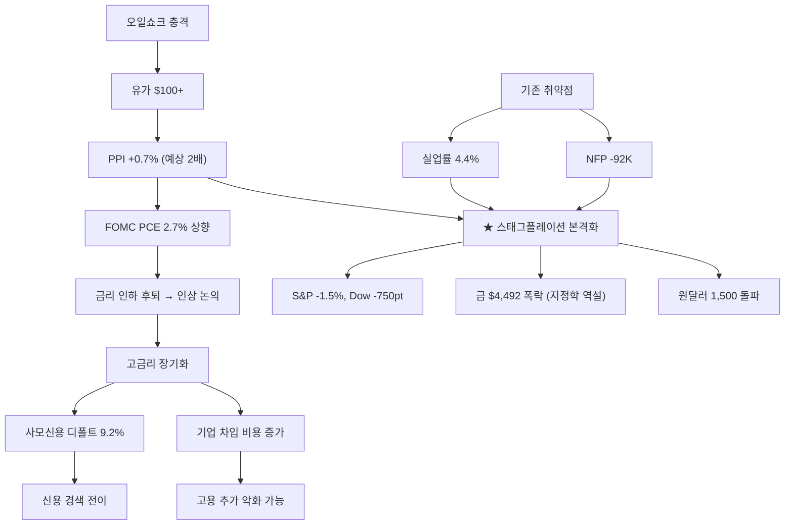
```mermaid
graph TD
    A["기존 취약점"] --> B["NFP -92K"]
    A --> C["실업률 4.4%"]
    E["오일쇼크 충격"] --> F["유가 $100+"]
    F --> G["PPI +0.7% #40;예상 2배#41;"]
    G --> H["FOMC PCE 2.7% 상향"]
    H --> I["금리 인하 후퇴 → 인상 논의"]
    I --> J["고금리 장기화"]
    J --> K["사모신용 디폴트 9.2%"]
    J --> L["기업 차입 비용 증가"]
    K --> M["신용 경색 전이"]
    L --> N["고용 추가 악화 가능"]
    B --> O["★ 스태그플레이션 본격화"]
    C --> O
    G --> O
    O --> P["S&P -1.5%, Dow -750pt"]
    O --> Q["금 $4,492 폭락 #40;지정학 역설#41;"]
    O --> R["원달러 1,500 돌파"]
```

> **투자 시사점**: PPI +0.7%가 스태그플레이션의 **인플레이션 축을 극적으로 강화**. FOMC PCE 2.7% 상향은 이를 공식 확인. **고금리 장기화 → 사모신용 디폴트 9.2% → 신용 경색 전이**라는 위험한 체인이 형성 중. 방어적 포지션 강화 필수.

---

## 미국 증시: S&P 6,606 (-1.5%) — 조정 영역 접근

### 시장 데이터

| 지수 | 종가 | 변동 | 특이사항 |
|------|------|------|---------|
| **S&P 500** | **6,606** | **-1.5% (금)** | 조정 영역 접근 |
| **NASDAQ** | **22,091** | **-1.8%** | 기술주 약세 심화 |
| **Dow** | | **-750pt (수)** | PPI 쇼크 반응 |

### 시장 하락 구조

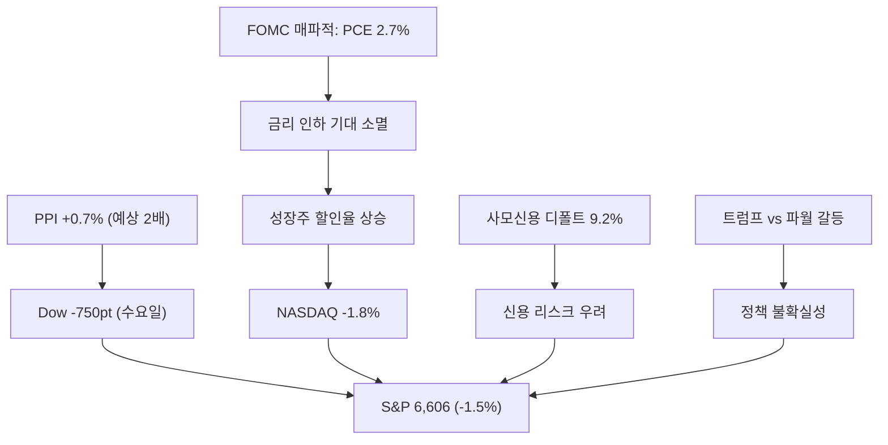
```mermaid
graph TD
    A["PPI +0.7% #40;예상 2배#41;"] --> B["Dow -750pt #40;수요일#41;"]
    C["FOMC 매파적: PCE 2.7%"] --> D["금리 인하 기대 소멸"]
    D --> E["성장주 할인율 상승"]
    E --> F["NASDAQ -1.8%"]
    B --> G["S&P 6,606 #40;-1.5%#41;"]
    F --> G
    H["사모신용 디폴트 9.2%"] --> I["신용 리스크 우려"]
    I --> G
    J["트럼프 vs 파월 갈등"] --> K["정책 불확실성"]
    K --> G
```

### 섹터별 동향 (오일쇼크 + 매파적 FOMC 환경)

| 섹터 | 방향 | 배경 |
|------|------|------|
| **에너지** | **강세** | 유가 $100+, 오일쇼크 최대 수혜 |
| **방산** | **강세** | 이란 전쟁 장기화 |
| **Consumer Defensive** | **상대적 강세** | 방어주 선호 심리 |
| **금융** | **혼조** | 고금리 수혜 vs 사모신용 리스크 |
| **기술** | **약세** | NASDAQ -1.8%, 금리 인하 후퇴 |
| **소비재** | **약세** | 에너지 비용 급등 → 가처분소득 감소 |

> **투자 시사점**: PPI 쇼크 + FOMC 매파 + 사모신용 위기가 **삼중 압박**. 시장이 조정 영역에 접근 중이며, **성장주보다 에너지·방산·방어주 선호** 지속. VIX 24.06은 아직 극단적 공포 구간은 아니나 경계 필요.

---

## 원/달러: 1,500 돌파 — 구조적 원화 위기

| 항목 | 내용 |
|------|------|
| **현재** | **장중 1,500 심리선 돌파** |
| **한미 금리차** | **BOK 2.50% vs Fed 3.50-3.75% = 125bp** |
| **외국인 유출** | **1-2월 ~20조원 (역대 월간 최고)** |
| **개인 해외투자** | **2025년 $51B 외국증권 매수** |
| **가계부채** | **1,900조원 (GDP 90%, 세계 최고)** |
| **달러 기준 아파트** | **5년 +6% (1.2%/yr) vs 원화 +45%** |
| **외환보유고** | **방어 투입 중이나 한계적** |
| **안정화 요인** | **WGBI 4월 편입 ($56B+)** |

> **투자 시사점**: 1,500 돌파는 **단순한 숫자가 아닌 구조적 전환점**. 125bp 금리차 + 외국인 20조원 유출 + 개인 $51B 해외투자가 동시에 원화를 압박. **달러 기준으로 한국 자산의 실질 수익률이 극히 낮음**(아파트 5년 +6%). WGBI 편입이 4월에 시작되나 단기적으로 자본유출 속도를 상쇄하기 어려움. **달러 자산 비중 확대 필수**.

---

## 비트코인: $70,698 (+1.12%) — 소폭 반등

| 항목 | 내용 |
|------|------|
| **현재 가격** | **$70,698 (+1.12%)** |
| **시장 환경** | 전체 리스크오프 속 소폭 반등 |
| **크립토 규제** | GENIUS Act 서명, 제도화 진전 |

> **투자 시사점**: BTC $70,698은 전체 시장 매도세 속에서 **상대적으로 선방**. 매파적 FOMC에도 소폭 반등한 것은 제도화 기대 + 대안자산 수요 반영. 다만 금리 인하 후퇴가 크립토에도 부정적이므로 **적정 비중 유지, 추가 매수는 보류**.

---

## ★ 유동성 환경: RRP 제로 + TGA 감소 = 긍정적 신호 유지

오일쇼크와 매파적 FOMC 속에서도 유동성 환경에는 **긍정적 신호**가 있습니다.

| 항목 | 수치 | 변동 | 의미 |
|------|------|------|------|
| **M2** | **$22,442B** | **+0.34%** | 통화량 완만 증가 |
| **★ RRP** | **$0.278B** | | **거의 제로** — 자금이 시장으로 이동 |
| **★ TGA** | **$832B** | **-6.3%** | 감소 → 시장 유동성 공급 |

> **투자 시사점**: RRP 거의 제로 + TGA 감소는 **시장 바닥을 지지하는 유동성 요인**. 매파적 FOMC에도 불구하고 유동성 환경이 긍정적이라는 점은 **시장 급락의 하방을 제한**하는 역할.

---

## ★ 투자 대가 포지션 (이전 업데이트 유지)

### Ray Dalio — "자본 전쟁(Capital War)" 경고

| 항목 | 내용 |
|------|------|
| **핵심 주장** | **미국 "자본 전쟁" 진입** — 막대한 차입 vs 미국채 수요 감소 |
| **구조적 문제** | 중국·유럽이 미국채 매수를 줄이고 있음 |
| **AI 투자** | 2030년까지 **$3T** 필요 — 부채에 의존하나 그 부채가 부족해질 수 있음 |
| **오일쇼크 맥락** | 전쟁 + 인플레 → 미국채 매력 추가 하락 가능 |
| **결론** | **금융 리셋(Financial Reset) 경고** |

### Warren Buffett — 현금 $340B+ 방어적 포지션

| 항목 | 내용 |
|------|------|
| **현금 보유** | **$340B 이상** — 역대 최고 수준 |
| **해석** | 매력적인 투자 기회 부재, **매파적 FOMC 환경에서 더욱 유효** |
| **Greg Abel (신임 CEO)** | 첫 주주서한: **자사주 매입 재개** |
| **핵심 4종목** | Apple, Amex, Coca-Cola, Moody's = **포트폴리오 56%** |

### Stanley Druckenmiller — 금융섹터 ETF(XLF) 대규모 매수

| 항목 | 내용 |
|------|------|
| **매수 종목** | **State Street Financial Sector SPDR ETF (XLF)** |
| **비중** | **포트폴리오의 7%** |
| **투자 근거** | 대형은행·보험사가 **AI 자동화 수혜를 가장 먼저** 받을 것 |
| **3/21 맥락** | 고금리 장기화 → 금융섹터 NIM 수혜 vs 사모신용 리스크 상존 |

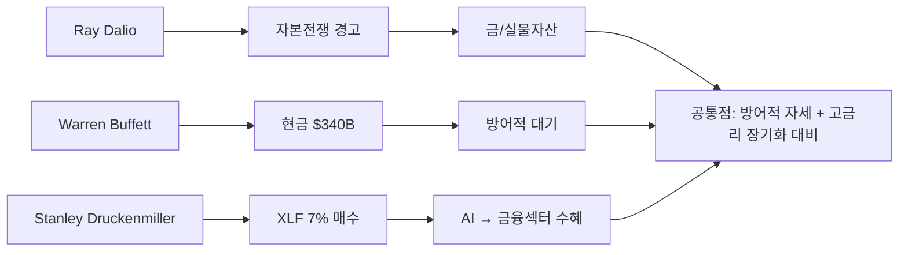
```mermaid
graph LR
    A["Ray Dalio"] --> B["자본전쟁 경고"]
    B --> C["금/실물자산"]
    D["Warren Buffett"] --> E["현금 $340B"]
    E --> F["방어적 대기"]
    G["Stanley Druckenmiller"] --> H["XLF 7% 매수"]
    H --> I["AI → 금융섹터 수혜"]
    C --> J["공통점: 방어적 자세 + 고금리 장기화 대비"]
    F --> J
    I --> J
```

---

## ★ 이란 전쟁: 오일쇼크 + G7 SPR 방출

### 사건 전개

| 시점 | 사건 |
|------|------|
| **3/1** | 미국 "Operation Epic Fury" + 이스라엘 "Operation Roaring Lion" — 이란 합동 공습 |
| **3/1** | **하메네이 사망 확인** (IRGC 참모총장, 아마디네자드 전 대통령 동시 사망) |
| **3/1~2** | **호르무즈 해협 봉쇄** — 글로벌 원유 공급 20% 차단 |
| **3/3** | KOSPI -7% 폭락 |
| **3/4** | **KOSPI -12.06% "블랙 튜즈데이"** — 서킷브레이커, 사상 최대 폭락 |
| **3/5** | **KOSPI +9.63% 반등** — 이란 CIA 협상 신호, 2008년 이후 최대 반등 |
| **3/9~10** | **유가 $100+ 돌파**, G7 SPR 300~400M 배럴 방출 결정 |
| **~3/21** | **전쟁 장기화, PPI +0.7%로 인플레 전이 확인** |

### 시나리오별 영향 (3/21 업데이트)

| 시나리오 | 확률 | 유가 | 금 | S&P 500 |
|---------|------|------|-----|---------|
| **이란 항복 → 조기 종결** | **중-저** | **$70-80** | **$4,800-5,000 반등** | **6,800-7,000** |
| **SPR 방출 성공 + 군사 호위** | **중** | **$80-90** | **$4,500-4,800** | **6,400-6,600** |
| **장기전 + 봉쇄 지속** | **중-높음** | **$100-130** | **$4,200-4,500** | **6,000-6,400** |
| **걸프 수출국 완전 중단** | **저** | **$150+** | **$5,000+ (안전자산 복귀)** | **5,500 이하** |

> **투자 시사점**: 3/21 기준으로 **"장기전 + 봉쇄 지속" 시나리오가 가장 유력**. PPI +0.7%는 오일쇼크의 인플레 전이가 현실화되었음을 확인. 극단적 시나리오(걸프 완전 중단)에서는 금이 안전자산으로 복귀할 수 있으나, 현재는 고금리 압력이 더 강함.

---

## 한국 자산시장 대전환 (중장기 테마 유지)

오일쇼크 + 원/달러 1,500 돌파로 단기 압박이 심하나, **구조적 대전환 동력은 유효**합니다.

### 정책 대전환

| 항목 | 내용 |
|------|------|
| **이재명 대통령** | 분당 아파트 매각, **ETF 매수 선언** |
| **상법 개정** | 배당소득 분리과세, 자사주 의무소각, 이사 책임 강화 |
| **MSCI 선진지수 추진** | **외환시장 개방** → 선진지수 편입 요건 충족 |
| **국민성장펀드** | **150조 원** (민간 75조 + 정부 75조) |
| **WGBI 편입** | **4월** — $56B+ 유입 예상 |

### 자금 이동 현황

| 항목 | 수치 | 의미 |
|------|------|------|
| **고객예탁금** | **130조 원** | **사상 최고** → 증시 유입 대기 |
| **국내 예금** | **2,076조 원** | 12월 대비 -39조 → 예금 이탈 시작 |
| **퇴직연금** | **918조 원** | 72% 원리금보장 → 주식 이동 여지 |

> **투자 시사점**: **원/달러 1,500 + 자본유출 20조원**이 대전환 모멘텀을 심하게 압박. 그러나 **WGBI 4월 편입 + 상법 개정 + 국민성장펀드**라는 구조적 동력은 유효. 문제는 환율 — 달러 기준 수익률이 원화 기준 대비 극히 낮아 **외국인 투자 매력이 환율에 의해 희석**되는 상황.

---

## 관세: IEEPA 위헌 + Section 122 15% 유지

| 구분 | 현황 |
|------|------|
| **IEEPA 관세** | 대법원 위헌 판결 (6:3), $1,660억 환불 진행 |
| **Section 122** | **15%** (2/24 발효, ~7/23 만료) |
| **미-중 관세** | **평균 34%**, 10% 세율 2026년 11월까지 연장 |
| **트럼프-시진핑** | **3월 말 회담** — 관세 완화 가능성 |

> **투자 시사점**: 오일쇼크 + 관세 이중 부담이 수출 기업 수익성을 압박. **트럼프-시진핑 3월 말 회담**에서 관세 완화 시 수출주 반등 가능.

---

## 주요 구조적 테마

### 1. 강세장 섹터 순환: 매파적 FOMC로 재조정

| 순서 | 유형 | 상태 |
|------|------|------|
| 1 | **에너지/방산** (오일쇼크 수혜) | **★ 유일한 강세 섹터** |
| 2 | **현금/단기채** (고금리 장기화 수혜) | **★ 매파적 FOMC로 부상** |
| 3 | 금융 (AI 자동화 + 고금리 NIM) | **고금리 수혜 vs 사모신용 리스크** |
| 4 | 금/원자재 | **★ 급락 — 지정학 역설로 전환** |
| 5 | 선도 섹터 (반도체, AI) | **약세 — 금리 인하 후퇴** |
| 6 | 증권사 (자산시장 대전환) | **고객예탁금 130조, 중기 관심** |
| 7 | 경기순환주 (건설, 조선) | **오일쇼크 피해, 대기** |
| 8 | 소비재/국민주 | **최하위 — 소비 위축 직격** |

### 2. 1970년대 오일쇼크 vs 2026년

| 항목 | 1973~74년 | 2026년 |
|------|-----------|--------|
| **원인** | OPEC 금수조치 | 이란 전쟁 → 호르무즈 봉쇄 |
| **유가 상승** | +300% | +40~50% (진행 중) |
| **인플레이션** | CPI 12.3% | PPI +0.7%, PCE 전망 2.7% |
| **실업률** | 9.0% | 4.4% (상승 추세) |
| **연준 대응** | 금리 인상 → 경기침체 심화 | **딜레마 — 인상 논의 등장 (CME 2%)** |
| **금 성과** | **+900%** (1970~80) | **$5,400 → $4,492 (-17%) — 이번엔 다름** |
| **차이점** | 금리 환경 다름 | **고금리 + 지정학 역설 = 금 하락** |

### 3. 다카이치 트레이드 + 한국 밸류업 (중장기 유지)

오일쇼크 + 원/달러 1,500으로 단기 압박이지만, 구조적 동력은 유효.

---

## 투자 전략

### 현 국면 진단: "매파적 FOMC + 지정학 역설 + 원화 위기 + 사모신용 위기"

**핵심 변화(3/21):**
- **★ FOMC 3.50-3.75% 동결 (11:1)** — PCE 2.7% 상향, 중립금리 3.1%, CME 인상 확률 2% 첫 등장
- **★ 금 $4,492 폭락 (-10% 주간)** — 피크 $5,400에서 -17%, "지정학 역설"
- **★ 원달러 1,500 돌파** — 외국인 20조원 유출, 125bp 금리차, 한국 딜레마
- **★ PPI +0.7% (예상 +0.3%)** — 인플레 쇼크, Dow -750pt
- **★ S&P 6,606 (-1.5%), NASDAQ -1.8%** — 조정 영역 접근
- **★ 사모신용 디폴트 9.2%** — 역대최고, HY Spread 3.27% 확대
- **★ 트럼프 vs 파월 갈등** — 장기 금리 불안 요인
- **비트코인 $70,698 (+1.12%)** — 리스크오프 속 소폭 반등
- **실업률 4.4%, NFP -92K, Initial Claims 205K (-8K)** — 고용 약화 지속
- **유동성 긍정** — RRP $0.278B(거의 제로), TGA $832B(감소)

### 단기 전략 (3월 말~4월): "매파적 FOMC 대응 + 원화 방어 + 사모신용 경계"

| 우선순위 | 전략 | 근거 |
|---------|------|------|
| 1 | **현금/단기채 비중 최대화** | FOMC 매파적, 고금리 장기화, Buffett $340B 방어적 |
| 2 | **달러 자산 비중 확대** | 원달러 1,500 돌파, 125bp 금리차, 구조적 원화 약세 |
| 3 | **에너지 포지션 유지** | 유가 $100+, 호르무즈 봉쇄 지속 |
| 4 | **금 포지션 축소/재평가** | $4,492 폭락, 지정학 역설, 10Y 4.25% |
| 5 | **사모신용 익스포저 회피** | 디폴트 9.2%, HY Spread 확대, 전이 리스크 |
| 6 | **방산 포지션 유지** | 이란 전쟁 장기화 |
| 7 | **트럼프-시진핑 회담 대비** | 3월 말 — 관세 완화 가능성 |

### 중기 전략 (4~6월)

| 우선순위 | 전략 | 근거 |
|---------|------|------|
| 1 | **WGBI 편입 수혜 모니터링** | 4월 편입 ($56B+) — 원화 안정화 기대, 환율 방어 효과 |
| 2 | **이란 전쟁 종결 시나리오 대비** | 이란 항복 시 유가 $70~80, 인플레 완화 → 금리 인하 재개 |
| 3 | **사모신용 위기 전이 모니터링** | 9.2% 디폴트 → 은행권/공개 시장 전이 여부 |
| 4 | **한국 자산시장 대전환** | 오일쇼크 + 원화 위기 해소 시 상법 개정 + 국민성장펀드 효과 재부각 |
| 5 | **Powell 퇴임 대비** | 5월 — 신임 의장 정책 방향 (트럼프 영향력 확대 우려) |

### 포트폴리오 배분 제안 (매파적 FOMC + 스태그플레이션 방어)

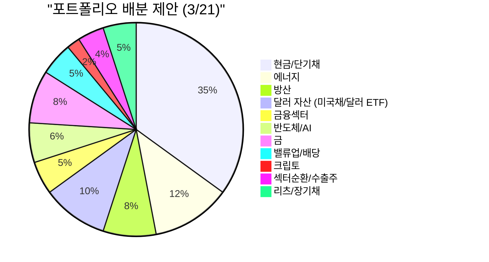
```mermaid
pie title "포트폴리오 배분 제안 #40;3/21#41;"
    "현금/단기채" : 35
    "에너지" : 12
    "방산" : 8
    "달러 자산 #40;미국채/달러 ETF#41;" : 10
    "금융섹터" : 5
    "반도체/AI" : 6
    "금" : 8
    "밸류업/배당" : 5
    "크립토" : 2
    "섹터순환/수출주" : 4
    "리츠/장기채" : 5
```

| 카테고리 | 비중 | 변동 | 근거 |
|---------|------|------|------|
| **현금/단기채** | **35%** | **↑↑ (30→35)** | FOMC 매파적, 고금리 장기화, 사모신용 위기 |
| **에너지** | **12%** | **유지** | 유가 $100+, 오일쇼크 지속 |
| **달러 자산** | **10%** | **★ 신규** | 원달러 1,500, 구조적 원화 약세 대비 |
| **방산** | **8%** | **↓ (10→8)** | 이란 장기전이나 극단적 상승 국면 지나감 |
| **금** | **8%** | **↓↓ (15→8)** | $4,492 폭락, 지정학 역설, 추가 하락 가능 |
| **반도체/AI** | **6%** | **↓ (8→6)** | 금리 인하 후퇴 → 성장주 할인율 상승 |
| **금융섹터** | **5%** | **유지** | 고금리 NIM 수혜 vs 사모신용 리스크 |
| **밸류업/배당** | **5%** | **↓ (7→5)** | 원화 약세로 외국인 매력 희석 |
| **리츠/장기채** | **5%** | **↑ (4→5)** | 장기적 금리 인하 시 수혜, 현재 저가 |
| **섹터순환/수출주** | **4%** | **유지** | 오일쇼크 + 관세 이중 부담 |
| **크립토** | **2%** | **유지** | BTC $70,698 소폭 반등, 제도화 진전 |

## 월별 체크포인트

| 월 | 이벤트 | 투자 시사점 |
|----|--------|------------|
| **3/1** | 이란 전쟁 본격화, 하메네이 사망 | 유가 급등, 방산주 폭등 |
| **3/4** | KOSPI 블랙 튜즈데이 -12.06% | 사상 최대 폭락, 서킷브레이커 |
| **3/5** | KOSPI +9.63% 반등 | 2008년 이후 최대 반등 |
| **3/6** | NFP -9.2만 고용쇼크 | 스태그플레이션 본격화 |
| **3/8** | 원/달러 1,506 돌파 | 구조적 환율 압력 |
| **3/9~10** | 유가 $100+ 오일쇼크, G7 SPR 방출 | 스태그플레이션 심화 |
| **3/17~18** | **★ FOMC 3.50-3.75% 동결 (11:1)** | **PCE 2.7% 상향, 인상 논의 등장** |
| **3/19** | **★ PPI +0.7% (예상 2배)** | **인플레 쇼크, Dow -750pt** |
| **3/21** | **★ 원달러 1,500 돌파, 금 $4,492 폭락** | **지정학 역설, 원화 위기** |
| **3/23** | **S&P 500 리밸런싱** | 대형주 수급 변동 |
| **3월 말** | **★ 트럼프-시진핑 회담** | 관세 완화 + 이란 압박 공조 |
| **~4월 초** | 군사 호위 시행 | 호위 성공 시 유가 안정화 |
| **4월** | **WGBI 인덱스 편입 시작** | $56B+ 유입 + 환율 안정 기대 |
| **5월** | **Powell 퇴임, 신임 의장 취임** | 트럼프 영향력 확대 우려 |
| **~7/23** | Section 122 150일 만료 | 관세 재편 분기점 |
| **~11월** | 2026 중간선거 | 크립토 시장구조법안 데드라인 |

## 리스크 요인 정리

| 리스크 | 심각도 | 확률 | 대응 |
|--------|--------|------|------|
| **★ 매파적 FOMC + 인상 가능성** | **최고** | **높음** | PCE 2.7% 상향, CME 인상 2% → 고금리 장기화 대비 |
| **★ 사모신용 위기 전이** | **최고** | **중-높음** | 디폴트 9.2% 역대최고, HY Spread 3.27% → 고위험 채권 회피 |
| **★ 원달러 1,500+ 구조적 약세** | **최고** | **높음** | 125bp 금리차, 20조원 유출 → 달러 자산 확대 |
| **★ 오일쇼크 장기화** | **최고** | **높음** | PPI +0.7%로 인플레 전이 확인 → 에너지/현금 |
| **★ 트럼프 vs 파월 갈등** | **최고** | **높음** | Fed 독립성 훼손 시 장기 금리 급등 |
| **★ 금 추가 폭락** | **높음** | **중-높음** | 지정학 역설, 10Y 4.25% → 비중 축소 |
| **스태그플레이션 심화** | **최고** | **매우 높음** | NFP -92K + PPI +0.7% + PCE 2.7% → 방어적 포지션 |
| **한국 딜레마 (금리 인상 vs 동결)** | **최고** | **높음** | 가계부채 1,900조 vs 자본유출 → 어떤 선택도 고통 |
| **S&P 500 조정 영역** | **높음** | **중-높음** | 6,606(-1.5%), PPI 쇼크 + FOMC 매파 → 추가 하락 가능 |
| **Dalio 자본전쟁** | **높음** | **중** | 미국채 수요 감소 + AI $3T → 장기 금리 상승 |
| **연준 리더십 불확실성** | **높음** | **높음** | Powell 5월 퇴임 + 트럼프 영향력 |

## 정리

| 항목 | 내용 |
|------|------|
| **★ FOMC** | **3.50-3.75% 동결 (11:1), PCE 2.7% 상향, 중립금리 3.1%, 인상 확률 2% 첫 등장** |
| **★ 금 폭락** | **$4,492 (-2.36% 일, -10.05% 주), 피크 $5,400 → -17%, 지정학 역설** |
| **★ 원달러** | **1,500 돌파, 외국인 20조원 유출, 125bp 금리차, 한국 딜레마** |
| **★ PPI 쇼크** | **+0.7% (예상 +0.3% 2배), Dow -750pt** |
| **★ 사모신용** | **디폴트 9.2% 역대최고, HY Spread 3.27% 확대** |
| **★ 트럼프 vs 파월** | **성장 vs 물가 안정 — Fed 독립성 훼손 리스크** |
| **미국 증시** | **S&P 6,606 (-1.5%), NASDAQ 22,091 (-1.8%) — 조정 영역 접근** |
| **비트코인** | **$70,698 (+1.12%) — 리스크오프 속 소폭 반등** |
| **채권 시그널** | **10Y 4.25%, 2Y 3.79%, 스프레드 0.51%(+0.05), 5Y BEI 2.63%(+0.02)** |
| **고용** | **실업률 4.4%(+0.1%), NFP -92K, Claims 205K(-8K)** |
| **유동성** | **RRP $0.278B(제로), TGA $832B(-6.3%) — 바닥 지지** |
| **오일쇼크** | **유가 $100+, 호르무즈 봉쇄 지속, G7 SPR 방출 중** |
| **한국 대전환** | **WGBI 4월 편입, 상법 개정, 국민성장펀드 — 중장기 유효, 원화 위기가 단기 압박** |

**핵심 투자 원칙:**
1. **매파적 FOMC = 게임 체인저** -- PCE 2.7% 상향 + 인상 확률 등장 → 고금리 장기화 확정적
2. **지정학 역설 = 금 패러다임 전환** -- 전쟁 격화에도 금 폭락, 에너지 인플레 → 고금리가 금을 압살
3. **원달러 1,500 = 구조적 원화 위기** -- 125bp 금리차 + 20조원 유출 + 한국 딜레마
4. **사모신용 9.2% = 신용 위기의 씨앗** -- 고금리 장기화의 첫 번째 대형 피해자
5. **PPI +0.7% = 인플레 현실화** -- 오일쇼크의 물가 전이가 공식 확인
6. **현금/단기채가 왕** -- Buffett $340B + FOMC 매파 + 사모신용 위기 = 방어 최우선
7. **달러 자산 확대 필수** -- 원화 자산의 실질 수익률 극히 낮음 (아파트 5Y 달러 기준 +6%)
8. **유동성은 긍정적** -- RRP 제로 + TGA 감소가 하락의 바닥 지지
9. **한국 대전환 = 중장기 유효** -- 환율 위기 해소 시 강력한 반등 기반
10. **트럼프 vs 파월 = 장기 불확실성** -- Fed 독립성 훼손 시 미국채 프리미엄 급등

---

## 하위 섹터 상세 분석

- [원자재/희토류](/knowledge/invest/2026/03/07/commodities-rare-earth-outlook-2026.html) - 원자재·희토류 심층 분석

**투자 결정은 본인의 리스크 허용 범위와 투자 기간을 고려하여 신중하게 내리시기 바랍니다.**
