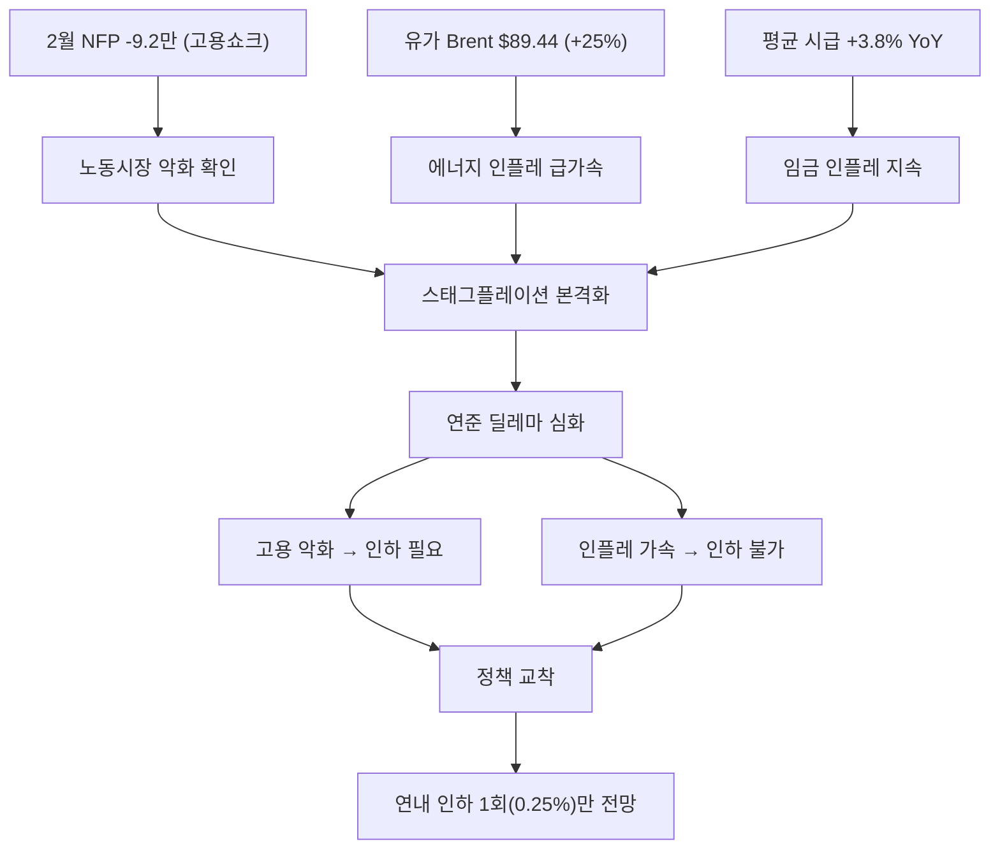
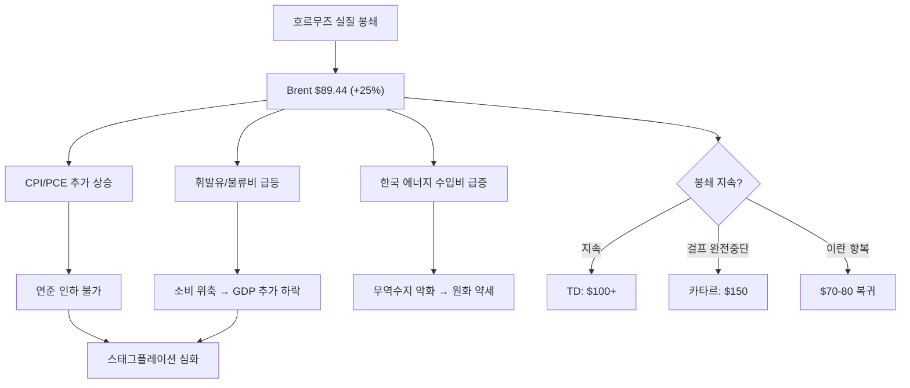
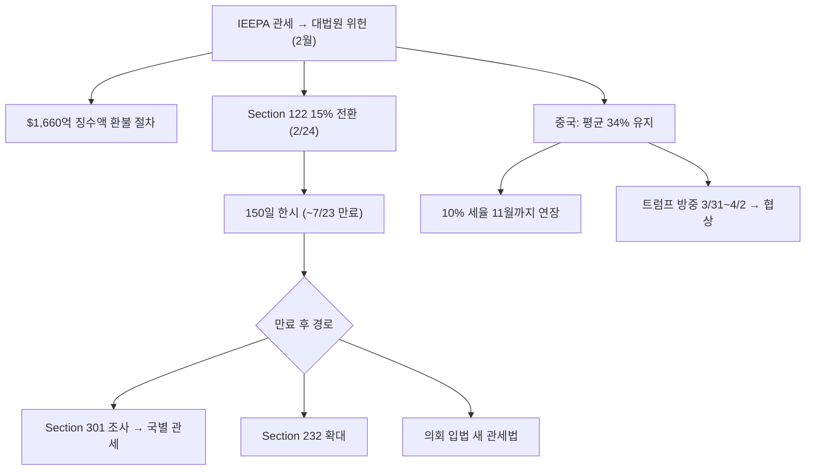
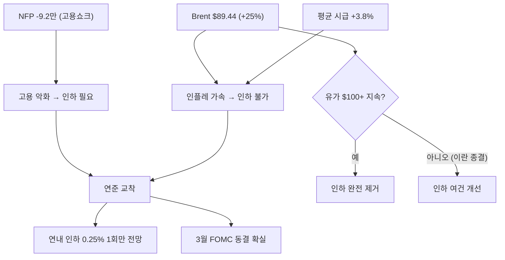

> **관련 글**: [2026년 투자 섹터 전망 (전체)](/knowledge/invest/2026/01/20/investment-sectors-outlook-2026.html)

2026년 3월 7일(금) 기준 업데이트입니다. **미국 2월 고용보고서(NFP)가 -9.2만으로 고용쇼크를 기록**했습니다(예상 +5만). 최근 5개월간 3회 마이너스 고용이 나오며 **노동시장 악화가 명확해졌습니다.** 실업률 4.4%(전월 4.3%↑). 평균 시급은 전월 대비 +0.4%, 전년 대비 +3.8%로 예상 상회 — **"나쁜 고용 + 높은 임금 + 유가 인플레"라는 전형적인 스태그플레이션 조합**이 형성되고 있습니다.

유가는 **Brent $89.44(전쟁 전 대비 +25%)**로 급등. 호르무즈 해협이 실질적으로 봉쇄 상태이며, TD Securities는 봉쇄 지속 시 **$100+**, 카타르 에너지 장관은 걸프 수출국 완전 중단 시 **$150 가능**을 경고했습니다.

이란 전쟁 Day 7. 테헤란 폭격 지속. **하메네이 사망(3/1) 확인**, 헤즈볼라 참전, 사망자 이란 1,332+(어린이 181명), 이스라엘 11명, 미군 6명. **트럼프는 "무조건 항복"을 요구**하고 있습니다.

## 시장 현황 (2026년 3월 7일 기준)

### 글로벌 증시

| 지수 | 수준 | 변동 |
|------|------|------|
| S&P 500 | **6,740.02** | **-1.33%** |
| Nasdaq | **22,387.68** | **-1.59%** |
| Dow Jones | **47,501.55** | **-0.95% (-453p), YTD 마이너스 전환** |
| **KOSPI** | **~5,585** (3/6 안정화) | 3/5 +9.63% 반등 후 안정화 |
| Nikkei 225 | **58,000+** | 사상최고 ('다카이치 트레이드') |

### 핵심 매크로 지표

| 항목 | 현황 | 방향 |
|------|------|------|
| **★ 2월 NFP** | **-9.2만** (예상 +5만) | **고용쇼크, 5개월간 3회 마이너스** |
| **실업률** | **4.4%** (4.3%↑) | **노동시장 악화 가시화** |
| **평균 시급** | **+0.4% MoM, +3.8% YoY** | **예상 상회 → 임금 인플레 지속** |
| 미국 Q4 GDP | **1.4%** | Q3 4.4%에서 급락 |
| Core PCE | **3.0%** | 2025년 4월 이후 최고 |
| 미국 기준금리 | **3.50~3.75%** | 1월 이후 동결 유지 |
| **연준 인하 전망** | **연내 0.25% 1회만** | **인하 기대 대폭 후퇴** |
| **연준 동결 확률** | **16%** (6%에서 상승) | 유가 $100+ 시 인하 완전 불가 |
| **원/달러 환율** | **1,474~1,477원** | 이란 후 1,500 돌파 → 정부 안정화 조치 |
| **금(Gold)** | **$5,081~5,171/oz** | 3/2 ATH $5,408 이후 조정 |
| **은(Silver)** | **$88~94/oz** | ATH $120(1월)에서 하락 |
| **비트코인** | **~$70,000** | 주간 $63K~$74K 레인지 |
| **유가(Brent)** | **$89.44** | **전쟁 전 대비 +25%, 호르무즈 봉쇄** |
| **유가(WTI)** | **~$83** | |
| **Powell 퇴임** | **5/15 확정** | 신임 의장 불확실성 |
| 한은 기준금리 | **2.50%** | 5회 연속 동결 |

### 지정학 리스크

| 항목 | 현황 | 긴급도 |
|------|------|--------|
| **★ 이란 전쟁 Day 7** | 테헤란 폭격 지속, 하메네이 사망 확인, 트럼프 "무조건 항복" 요구 | **최고** |
| **호르무즈 봉쇄 지속** | 실질 봉쇄, P&I 보험 발효(3/5), 글로벌 원유 공급 20% | **최고** |
| **고용쇼크** | NFP -9.2만, 5개월 3회 마이너스 → 경기침체 신호 | **최고** |
| **스태그플레이션** | 나쁜 고용 + 유가 인플레 + 임금 인플레 | **최고** |
| **헤즈볼라 참전** | 전쟁 확전, 다방면 전선 확대 | **최고** |
| **미-중 관세** | 평균 34%, 10% 세율 11월까지 연장 | **높음** |
| 러시아-우크라이나 | 평화 협상 결렬 | 높음 |

---

## ★ 고용쇼크: NFP -9.2만 — 스태그플레이션 시나리오 본격화

### 고용 데이터 상세

| 항목 | 수치 | 평가 |
|------|------|------|
| **NFP (비농업 고용)** | **-9.2만** | 예상 +5만 대폭 하회 |
| **실업률** | **4.4%** | 전월 4.3%에서 상승 |
| **평균 시급 MoM** | **+0.4%** | 예상 상회 |
| **평균 시급 YoY** | **+3.8%** | 예상 상회 |
| **최근 5개월 패턴** | **3회 마이너스** | 명확한 노동시장 악화 추세 |

### 스태그플레이션 트라이앵글


```mermaid
graph TD
    A["2월 NFP -9.2만 (고용쇼크)"] --> B["노동시장 악화 확인"]
    C["유가 Brent $89.44 (+25%)"] --> D["에너지 인플레 급가속"]
    E["평균 시급 +3.8% YoY"] --> F["임금 인플레 지속"]
    B --> G["스태그플레이션 본격화"]
    D --> G
    F --> G
    G --> H["연준 딜레마 심화"]
    H --> I["고용 악화 → 인하 필요"]
    H --> J["인플레 가속 → 인하 불가"]
    I --> K["정책 교착"]
    J --> K
    K --> L["연내 인하 1회(0.25%)만 전망"]
```

### 옐런 발언: "이란 상황이 연준을 더 신중하게 만들 것"

| 발언 | 의미 |
|------|------|
| **"이란 상황이 연준을 더 신중하게 만들 것"** | 유가 급등 → 인플레 기대 상승 → 인하 기조 후퇴 |
| **유가 $100 이상 지속 시** | **금리인하 완전히 테이블에서 제거될 가능성** |

> **투자 시사점**: NFP -9.2만은 **단순 노이즈가 아닌 구조적 악화 신호**(5개월 3회 마이너스). 동시에 임금(+3.8%)과 유가($89.44)는 인플레를 가속시키고 있어 **연준이 인하도, 인상도 할 수 없는 교착 상태**. 이는 **성장주에 최악의 환경**(실적 악화 + 금리 유지/상승). **방어적 포지션(금, 에너지, 현금) 비중 확대 필요**.

---

## 이란 전쟁 Day 7: 테헤란 폭격 지속 · 헤즈볼라 참전 · 무조건 항복 요구

### 사건 전개

| 시점 | 사건 |
|------|------|
| **3/1** | 미국 "Operation Epic Fury" + 이스라엘 "Operation Roaring Lion" — 이란 합동 공습 |
| **3/1** | **하메네이 사망 확인** (IRGC 참모총장, 아마디네자드 전 대통령 동시 사망) |
| **3/1~2** | **호르무즈 해협 봉쇄** — 글로벌 원유 공급 20% 차단 |
| **3/1~7** | 이란 미사일 **500+발**, 드론 **2,000+대** 발사 |
| **3/3** | KOSPI -7% 폭락 |
| **3/4** | **KOSPI -12.06% "블랙 튜즈데이"** — 서킷브레이커, 사상 최대 폭락 |
| **3/4** | 사우디·UAE, 미-이스라엘 연합에 합류 |
| **3/4~5** | 쿠르드 반군, 이란 국경에서 지상 작전 개시 |
| **3/5** | **KOSPI +9.63% 반등** — 이란 CIA 협상 신호, 2008년 이후 최대 상승 |
| **3/5** | P&I 보험 발효 — 상업 운항 사실상 불가 |
| **3/5** | **헤즈볼라 참전** — 전쟁 확전 |
| **3/6~7** | 테헤란 **중폭격 지속**, 트럼프 **"무조건 항복" 요구** |

### 전쟁 피해 현황

| 구분 | 사망자 |
|------|--------|
| **이란** | **1,332+명** (어린이 181명 포함) |
| **이스라엘** | 11명 |
| **미군** | 6명 |

### 시나리오별 영향

| 시나리오 | 확률 | 유가 | 금 | KOSPI |
|---------|------|------|-----|-------|
| **이란 항복 → 조기 종결** | **중-저** | **$70-80** | **$4,800-5,000** | **6,200-6,600** |
| **장기전(4-8주) + 군사 호위** | **중-높음** | **$90-120** | **$5,200-5,500** | **5,400-5,800** |
| **봉쇄 장기화 → $100+** | **중** | **$100-150** | **$5,500-6,000** | **5,000-5,400** |
| **걸프 수출국 완전 중단** | 저 | **$150+** | **$6,000+** | **4,800 이하** |

> **투자 시사점**: 이란 전쟁 Day 7. **테헤란 중폭격 지속 + 헤즈볼라 참전 + 트럼프 "무조건 항복" 요구**로 조기 종결 가능성 후퇴. 전쟁이 4-8주 장기화될 경우 유가 $100+ → **스태그플레이션 더욱 심화**. 방산·에너지 포지션 유지. 이란 항복 시 급반등에 대비한 **현금 포지션도 병행 유지**.

---

## 유가: Brent $89.44 — 호르무즈 봉쇄 + $100+ 시나리오

### 유가 현황 (3/7)

| 항목 | 수치 |
|------|------|
| **Brent** | **$89.44** |
| **WTI** | **~$83** |
| **전쟁 전 대비** | **+25%** |
| **호르무즈 영향** | **글로벌 원유 공급 20% 봉쇄** |

### 유가 전망

| 출처 | 전망 |
|------|------|
| **TD Securities** | 봉쇄 지속 시 **$100+** |
| **카타르 에너지 장관** | 걸프 수출국 완전 중단 시 **$150** |
| **옐런** | "이란 상황이 연준을 더 신중하게 만들 것" |

### 유가 급등의 거시경제 파급


```mermaid
graph TD
    A["호르무즈 실질 봉쇄"] --> B["Brent $89.44 (+25%)"]
    B --> C["CPI/PCE 추가 상승"]
    C --> D["연준 인하 불가"]
    B --> E["휘발유/물류비 급등"]
    E --> F["소비 위축 → GDP 추가 하락"]
    B --> G["한국 에너지 수입비 급증"]
    G --> H["무역수지 악화 → 원화 약세"]
    D --> I["스태그플레이션 심화"]
    F --> I
    B --> J{"봉쇄 지속?"}
    J -->|"지속"| K["TD: $100+"]
    J -->|"걸프 완전중단"| L["카타르: $150"]
    J -->|"이란 항복"| M["$70-80 복귀"]
```

> **투자 시사점**: Brent $89.44로 **전쟁 전 대비 +25%**. 호르무즈가 글로벌 원유 공급의 20%를 차지하며 실질적으로 봉쇄 상태. **$100 돌파 시 연준 인하는 완전히 테이블에서 사라질 것**. 에너지 포지션 유지하되, 이란 항복 시나리오에 대비한 **차익실현 기준 사전 설정** 필요.

---

## 미국 증시: S&P -1.33%, Dow YTD 마이너스 전환

### 3/6 시장 데이터

| 지수 | 종가 | 변동 | 특이사항 |
|------|------|------|---------|
| **S&P 500** | **6,740.02** | **-1.33%** | |
| **Nasdaq** | **22,387.68** | **-1.59%** | 기술주 약세 |
| **Dow** | **47,501.55** | **-0.95% (-453p)** | **YTD 마이너스 전환** |

### 섹터별 동향

| 섹터 | 방향 | 배경 |
|------|------|------|
| **에너지** | **강세** | 유가 $89.44, 호르무즈 봉쇄 수혜 |
| **기술** | **약세** | 고용쇼크 + 금리 유지 → 성장주 할인율 상승 |
| **소비** | **약세** | 에너지 비용 급등 → 가처분소득 감소 |
| **방산** | **강세** | 이란 전쟁 Day 7, 헤즈볼라 참전 |

> **투자 시사점**: **Dow의 YTD 마이너스 전환**은 상징적. NFP 쇼크(-9.2만)가 시장 심리를 압박. **에너지·방산 섹터만 강세**이고 기술·소비 약세. 스태그플레이션 환경에서는 **고PER 성장주보다 저PER 가치주·원자재·에너지가 유리**.

---

## KOSPI: 3/3~6 블랙 튜즈데이 → 반등 → 안정화

### 주간 추이

| 날짜 | KOSPI | 변동 | 이벤트 |
|------|-------|------|--------|
| 3/3 | **~5,450** | **-7%** | 이란 전쟁 본격화 쇼크 |
| **3/4** | **5,093** | **-12.06%** | **블랙 튜즈데이**, 서킷브레이커, **사상 최대 폭락** |
| **3/5** | **5,583** | **+9.63%** | 이란 CIA 협상 신호, **2008년 이후 최대 반등**, 개인 ₩1.79조 순매수 |
| **3/6** | **~5,585** | 안정화 | 변동성 축소 시작 |

### KOSPI 전망 밴드

| 전망 | KOSPI 밴드 | 조건 |
|------|-----------|------|
| **하단** | **5,000~5,200** | 이란 장기전 + 유가 $100+ + 고용 악화 |
| **중앙** | **5,500~5,800** | 현재 수준, 전쟁 불확실성 지속 |
| **상단** | **6,200~6,600** | 이란 항복 + 유가 안정 + WGBI 유입 |

> **투자 시사점**: KOSPI ~5,585 안정화 단계. 3/5 반등 후 추가 급락 없이 횡보는 긍정적 신호. 다만 **미국 고용쇼크 + 유가 $89.44 상승**이 새로운 하방 압력. WGBI 4월 편입이 중기 지지. **반도체 과매도 구간 분할 매수 + 현금 비중 20%+ 유지**.

---

## 환율: USD/KRW 1,474~1,477 — 정부 안정화 조치 중

| 항목 | 내용 |
|------|------|
| **현재 수준** | **1,474~1,477원** |
| **이란 후 최고점** | **1,500원 돌파** (17년 래 최저 원화) |
| **정부 대응** | 안정화 조치 시행 중 |
| **WGBI 4월 편입** | $56B+ 유입 → 환율 안정 핵심 |
| **ING 전망** | 2026년 중반 **1,375원** |

> **투자 시사점**: 원/달러 1,474~1,477원으로 정부 안정화 조치 효과. 이란 전쟁 직후 1,500원 돌파에서 진정. **WGBI 4월 편입($56B+)이 중기적 원화 강세 요인**이나, 유가 $89.44 + 무역수지 악화가 단기 원화 약세 압력 유지.

---

## 금(Gold): $5,081~5,171 — ATH $5,408 이후 조정

| 항목 | 내용 |
|------|------|
| **현재 가격** | **$5,081~5,171/oz** |
| **ATH** | **$5,408** (3/2, 이란 전쟁 직후) |
| **Goldman 연말 목표** | **$4,900 → 상향 가능성** |
| **JP모건 목표** | **$6,300** |
| **중앙은행 매입** | **585톤/분기 평균** |

### 금 투자 논리 강화

스태그플레이션 환경에서 금의 투자 매력은 더욱 강화됩니다:
- **NFP 쇼크 → 경기침체 우려** → 안전자산 수요↑
- **유가 $89.44 → 인플레 가속** → 인플레 헤지 수요↑
- **연준 교착** → 실질금리 하락 가능성 → 금 상승 동력

> **투자 시사점**: $5,081~5,171 조정 구간. Goldman 연말 목표 $4,900은 이미 하회 — 상향 수정 가능성 높음. 스태그플레이션 본격화 + 중앙은행 585톤/분기 매입이 **구조적 상승 동력**. 현 조정은 **분할 매수 기회**.

---

## 은(Silver): $88~94 — ATH $120에서 하락, 구조적 공급적자 유효

| 항목 | 내용 |
|------|------|
| **현재** | **$88~94/oz** |
| **ATH** | **$120** (2026년 1월) |
| **구조적 요인** | 6년 연속 공급적자, COMEX 재고 -75% |

> **투자 시사점**: $88~94로 ATH $120에서 **-22~27% 조정**. 구조적 공급적자는 유효하나 단기적으로 금 대비 변동성이 높아 **금 우선, 은 보조** 전략 유지.

---

## 비트코인: ~$70,000 — 위험자산 성격 유지

| 항목 | 내용 |
|------|------|
| **현재 가격** | **~$70,000** |
| **주간 레인지** | **$63,000~$74,000** |
| **S&P 상관관계** | **0.55** — 위험자산으로 거래 |
| **장기보유자 매도** | **-87% 감소** — 매도 소진 신호 |

> **투자 시사점**: BTC ~$70K, S&P 상관관계 0.55로 여전히 **위험자산 성격**. 장기보유자 순매도 -87% 감소는 **매도 소진 신호**로 중장기 긍정적. 다만 스태그플레이션 + 전쟁 환경에서 **레버리지 절대 금지**, 극소량 분할 매수만 고려.

---

## 관세: IEEPA 위헌 + Section 122 15% 유지

| 구분 | 현황 |
|------|------|
| **IEEPA 관세** | **대법원 위헌 판결 (6:3)** |
| **징수액 환불** | $1,660억 환불 절차 진행 중 |
| **평균 관세율** | **~34%** (아직 높은 수준) |
| **Section 122** | **15%** (2/24 발효, ~7/23 만료) |
| **미-중 관세** | **평균 34%**, 10% 세율 **2026년 11월까지 연장** |


```mermaid
graph TD
    A["IEEPA 관세 → 대법원 위헌 (2월)"] --> B["$1,660억 징수액 환불 절차"]
    A --> C["Section 122 15% 전환 (2/24)"]
    C --> D["150일 한시 (~7/23 만료)"]
    D --> E{"만료 후 경로"}
    E --> F["Section 301 조사 → 국별 관세"]
    E --> G["Section 232 확대"]
    E --> H["의회 입법 새 관세법"]
    A --> I["중국: 평균 34% 유지"]
    I --> J["10% 세율 11월까지 연장"]
    I --> K["트럼프 방중 3/31~4/2 → 협상"]
```

> **투자 시사점**: 대법원 IEEPA 위헌 판결로 **관세 법적 기반이 약화**됐으나 평균 34%는 유지. $1,660억 환불이 기업 현금흐름에 긍정적. **트럼프 방중(3/31~4/2)**에서 미중 관세 완화 가능성 모니터링.

---

## 연준 금리 전망: 인하 사실상 불가, 교착 상태

| 항목 | 내용 |
|------|------|
| **기준금리** | **3.50~3.75%** (1월 이후 동결) |
| **연내 인하 전망** | **0.25% 1회만** (인하 기대 대폭 후퇴) |
| **동결 확률** | **6% → 16%로 상승** |
| **3월 FOMC (3/17-18)** | **동결 거의 확실** |
| **옐런 발언** | "이란 상황이 연준을 더 신중하게 만들 것" |
| **유가 $100+ 시** | **인하 완전 불가** |
| **Powell 퇴임** | **5/15 확정** |


```mermaid
graph TD
    A["NFP -9.2만 (고용쇼크)"] --> B["고용 악화 → 인하 필요"]
    C["Brent $89.44 (+25%)"] --> D["인플레 가속 → 인하 불가"]
    E["평균 시급 +3.8%"] --> D
    B --> F["연준 교착"]
    D --> F
    F --> G["연내 인하 0.25% 1회만 전망"]
    F --> H["3월 FOMC 동결 확실"]
    C --> I{"유가 $100+ 지속?"}
    I -->|"예"| J["인하 완전 제거"]
    I -->|"아니오 (이란 종결)"| K["인하 여건 개선"]
```

> **투자 시사점**: 연준은 **고용 악화(인하 필요) vs 인플레 가속(인하 불가)**의 딜레마에 빠졌습니다. 유가 $100+ 지속 시 **인하가 완전히 테이블에서 사라질 것**. 이는 **장기채 포지션에 부정적**, 인플레 헤지(금, 원자재) 비중 유지가 적절.

---

## 글로벌 경제 전망

| 항목 | 수치 |
|------|------|
| **글로벌 GDP (Goldman)** | **2.8%** |
| **미국 GDP** | **2.6%** |
| **중국 GDP** | **4.8%** |
| **WGBI 4월 편입** | 한국 채권 시장에 외국인 자금 유입 |

---

## 주요 구조적 테마

### 1. 다카이치 총선 압승 + 닛케이 58,000 ('다카이치 트레이드')

다카이치 총리의 압승(자민당 316석, 연립 352석)으로 아베노믹스 2.0이 본격화. 식료품 소비세 면제, 재정 확장, 금리 인상 억제가 핵심이며, **엔캐리 트레이드 재개**로 글로벌 유동성 공급.

### 2. 삼성전자 HBM4 + 반도체 과매도 복원

삼성전자 HBM4 출하 개시(2/12) 이후 블랙 튜즈데이(3/4 -12.06%)에서 3/5 +11.15%(~195,100원) 반등. SK하이닉스 +10.95%(~941,000원). 삼성+SK = KOSPI 순이익 **56%**. 아직 폭락 전 수준 미회복이나 **과매도 복원 진행 중**.

### 3. 한국 밸류업: 1980년대 일본 비유

| 항목 | 1980년대 일본 | 2026년 한국 |
|------|---------------|-------------|
| 미국 대통령 | 레이건 (보호무역) | 트럼프 (관세→양자협상) |
| 역할 | 미국의 핵심 제조업 파트너 | 미국의 대중국 제조업 파트너 |
| 밸류에이션 | 저평가→급격한 재평가 | 코리아 디스카운트→밸류업 |
| 핵심 산업 | 자동차, 전자 | 반도체(HBM4), AI, 배터리, 방산 |

### 4. 강세장 섹터 순환: 전쟁으로 리셋

| 순서 | 유형 | 상태 |
|------|------|------|
| 1 | 선도 섹터 (반도체, AI) | 급등 후 **블랙 튜즈데이 폭락 → 반등 중** |
| 2 | 대형 가치주 (금융, 통신) | 조정 |
| 2.5 | **방산/조선** (이란 전쟁 수혜) | **급등 지속 (유일한 상승 섹터)** |
| 3 | **국민주 (네이버, 카카오)** | **미개시** |
| 4 | **경기순환주 (화학, 철강, 건설)** | **미개시** |
| 5 | 소형주·테마주 | 마지막 단계 |

---

## 투자 전략

### 현 국면 진단: "고용쇼크 + 유가 급등 + 전쟁 장기화 = 스태그플레이션"

**핵심 변화(3/7):** NFP -9.2만 고용쇼크, Brent $89.44(+25%), 이란 전쟁 Day 7 장기화 조짐, 헤즈볼라 참전, 트럼프 "무조건 항복" 요구. **나쁜 고용 + 유가 인플레 = 스태그플레이션 시나리오가 시장의 중심 테마로 부상.**

### 단기 전략 (3월): "스태그플레이션 방어 + 이란 모니터링"

| 우선순위 | 전략 | 근거 |
|---------|------|------|
| 1 | **현금 비중 확대** | NFP 쇼크 + 유가 급등 + 전쟁 불확실성 → 급변동 대비 |
| 2 | **에너지 포지션 유지** | Brent $89.44, $100+ 가능성, 호르무즈 봉쇄 지속 |
| 3 | **방산 포지션 유지** | 이란 Day 7, 헤즈볼라 참전, 트럼프 "무조건 항복" → 장기전 |
| 4 | **금 조정 시 분할 매수** | $5,081~5,171 조정, 스태그플레이션 환경 최적 자산 |
| 5 | **반도체 과매도 분할 매수** | 삼성·SK 반등 확인, GTC 3/16~19 카탈리스트 |
| 6 | **3월 FOMC (3/17-18) 대기** | 동결 확실이나 연준 스탠스 변화 모니터링 |

### 중기 전략 (4~6월)

| 우선순위 | 전략 | 근거 |
|---------|------|------|
| 1 | **이란 전쟁 종결 시나리오 대비** | 이란 항복 시 KOSPI 6,200-6,600 급반등 |
| 2 | **WGBI 편입 수혜** | 4월 편입 (비중 2.08%, $56B+) — 환율 안정 + 외국인 매수 |
| 3 | **스태그플레이션 헤지 유지** | 유가 $100+ 시 금/원자재/에너지 |
| 4 | **트럼프 방중 모니터링** | 3/31~4/2 — 미중 관세 완화 가능성 |
| 5 | **관세 체제 재편 모니터링** | Section 122 7/23 만료 |
| 6 | **밸류업 수혜주** | 자사주 소각, 고배당 기업 |

### 포트폴리오 배분 제안 (스태그플레이션 방어)

```
현금/단기채: 25% (↑ 고용쇼크 + 전쟁 장기화)
├── 현금: 15%
└── 단기국채 ETF: 10%

귀금속·원자재·에너지: 30% (↑ 스태그플레이션 핵심 헤지)
├── 금 ETF/실물: 13% (↑ $5,081~5,171 조정 매수, 스태그플레이션 최적)
├── 은 ETF/실물: 3% ($88~94, 금 우선)
└── 에너지 (유가 ETF/에너지주): 14% (↑ Brent $89.44, $100+ 가능)

방산: 10% (유지, 전쟁 장기화)
├── 한국 방산주 (한화에어로, LIG넥스원 등): 7%
└── 글로벌 방산 ETF: 3%

반도체·AI: 10% (↓ 고용쇼크 → 성장주 할인율 상승)
├── 삼성전자/SK하이닉스: 7% (과매도 분할 매수, GTC 3/16)
└── HBM 후공정 장비·소재: 3%

섹터 순환·수출주: 8% (↓ 스태그플레이션 환경 불리)
├── 관세 과매도 수출주: 3%
├── 국민주 (네이버, 카카오): 2%
├── 경기순환주 (화학, 철강, 건설): 1%
└── 코스닥 저평가주: 2%

밸류업·배당: 10% (유지)
├── 고배당 ETF (커버드콜 포함): 5%
├── 자사주 소각 기업: 3%
└── 배당성장주: 2%

금리 인하 수혜: 7% (↓ 인하 전망 후퇴)
├── 장기채 ETF: 2% (↓ 인하 불확실)
└── 리츠(REITs): 5%
```

## 월별 체크포인트

| 월 | 이벤트 | 투자 시사점 |
|----|--------|------------|
| **3/1** | 이란 전쟁 본격화, 하메네이 사망 | 유가 급등, 방산주 폭등 |
| **3/4** | KOSPI 블랙 튜즈데이 -12.06% | 사상 최대 폭락, 서킷브레이커 |
| **3/5** | KOSPI +9.63% 반등, P&I 보험 발효 | 2008년 이후 최대 반등 |
| **3/6** | **NFP -9.2만 고용쇼크** | **스태그플레이션 본격화** |
| **~3/12** | 철강/알루미늄 25% 관세 발효 | Section 232 |
| **3/15~19** | **GTC 2026** | Vera Rubin, HBM4, Feynman |
| **3/17~18** | **FOMC** | 동결 확실, 연준 스탠스 변화 모니터링 |
| **3/31~4/2** | **트럼프 방중** | 미중 관세 협상 |
| **~4월 초** | 군사 호위 시행 (4주 후) | 호위 성공 시 유가 안정화 |
| **4월** | **WGBI 인덱스 편입 시작** | $56B+ 유입 + 환율 안정 |
| **5/15** | Powell 퇴임 | 연준 리더십 전환 |
| **~7/23** | Section 122 150일 만료 | 관세 재편 분기점 |

## 리스크 요인 정리

| 리스크 | 심각도 | 확률 | 대응 |
|--------|--------|------|------|
| **★ 스태그플레이션 본격화** | **최고** | **매우 높음** | NFP -9.2만 + Brent $89 + 임금 +3.8% → 금/에너지/현금 비중 확대 |
| **이란 전쟁 장기화(4-8주)** | **최고** | **중-높음** | 트럼프 "무조건 항복" 요구, 헤즈볼라 참전 → 방산·에너지 유지 |
| **유가 $100+ (TD Securities)** | **최고** | **중** | 호르무즈 봉쇄 지속 시 → 연준 인하 완전 불가 |
| **노동시장 추가 악화** | **최고** | **중-높음** | 5개월 3회 마이너스 추세 → 경기침체 가능성 |
| **연준 정책 교착** | **높음** | **높음** | 인하도 인상도 불가 → 시장 방향성 부재 |
| **KOSPI 재하락** | **높음** | **중** | 미국 고용쇼크 + 유가 급등 → 5,000 재테스트 가능 |
| **원화 약세 지속** | **높음** | **중-높음** | 유가 급등 → 무역수지 악화, WGBI 4월이 상쇄 |
| **관세 15% + 유가 이중 부담** | **높음** | **높음** | 수출 기업 수익성 압박 |

## 정리

| 항목 | 내용 |
|------|------|
| **★ 고용쇼크** | **NFP -9.2만 (예상 +5만), 5개월간 3회 마이너스, 실업률 4.4%** |
| **★ 스태그플레이션** | **나쁜 고용(-9.2만) + 유가 인플레($89.44) + 임금 인플레(+3.8%) = 본격화** |
| **유가** | **Brent $89.44 (+25%), 호르무즈 봉쇄, TD $100+, 카타르 $150 경고** |
| **이란 전쟁** | **Day 7, 테헤란 폭격 지속, 하메네이 사망, 헤즈볼라 참전, 사망 1,332+명** |
| **트럼프** | **"무조건 항복" 요구 → 조기 종결 가능성 후퇴** |
| **연준** | **교착: 인하 필요(고용) vs 인하 불가(인플레), 연내 0.25% 1회만** |
| **미국 증시** | **S&P -1.33%, Nasdaq -1.59%, Dow -453p (YTD 마이너스)** |
| **KOSPI** | **~5,585 안정화 (3/4 5,093 → 3/5 5,583 반등 후)** |
| **금** | **$5,081~5,171 (ATH $5,408에서 조정), Goldman $4,900 상향 가능** |
| **은** | **$88~94 (ATH $120에서 -22~27%)** |
| **BTC** | **~$70K, S&P 상관 0.55, 장기보유자 매도 -87% 소진** |
| **원/달러** | **1,474~1,477원, 이란 후 1,500 돌파 → 안정화 중** |
| **관세** | **IEEPA 위헌, $1,660억 환불, 평균 34%, Section 122 15%** |
| **WGBI** | **4월 편입 (비중 2.08%, $56B+), ING 1,375원 전망** |
| **KOSPI 전망** | **이란 종결 시 6,200~6,600, 장기전+고용악화 시 5,000~5,200** |

**핵심 투자 원칙:**
1. **스태그플레이션 = 핵심 테마** -- NFP -9.2만 + Brent $89.44 + 임금 +3.8% → 금/에너지/현금이 최적 자산
2. **연준 교착 = 방향성 부재** -- 고용 악화(인하 필요) vs 인플레(인하 불가) → 유가 $100+ 시 인하 제거
3. **이란 전쟁 장기화 조짐** -- 트럼프 "무조건 항복", 헤즈볼라 참전 → 조기 종결 가능성↓
4. **에너지 + 금 = 스태그플레이션 헤지** -- Brent $89.44, 금 $5,081~5,171 조정 매수
5. **방산 = 전쟁 수혜 지속** -- Day 7 장기화 + 글로벌 군비 확장
6. **반도체 과매도 분할 매수** -- 삼성·SK 반등 확인, GTC 3/16~19
7. **현금 비중 25%+ 유지** -- 고용쇼크 + 전쟁 + 유가 3중 불확실성
8. **WGBI 4월 편입 = 구조적 호재** -- $56B+ 유입, 중기 환율 안정

---

## 하위 섹터 상세 분석

- [원자재/희토류](/knowledge/invest/2026/03/07/commodities-rare-earth-outlook-2026.html) - 원자재·희토류 심층 분석

**투자 결정은 본인의 리스크 허용 범위와 투자 기간을 고려하여 신중하게 내리시기 바랍니다.**
